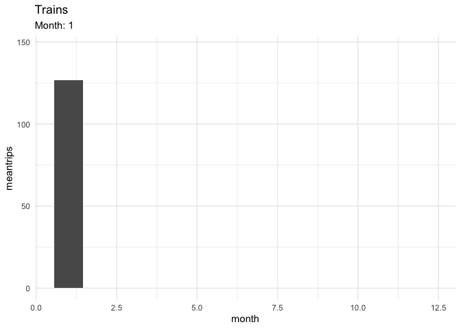
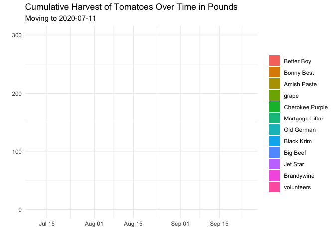
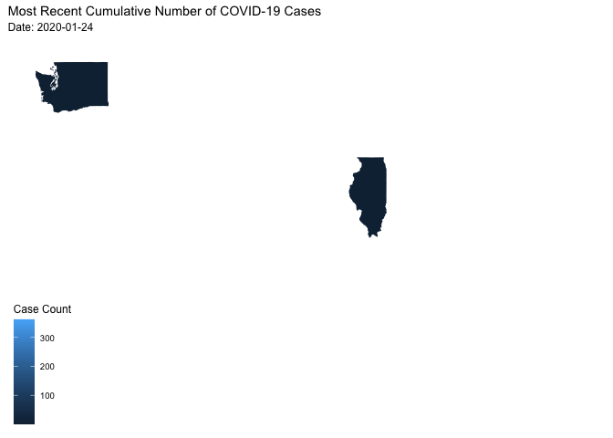

```r
library(tidyverse)     # for data cleaning and plotting
library(googlesheets4) # for reading googlesheet data
library(lubridate)     # for date manipulation
library(openintro)     # for the abbr2state() function
library(palmerpenguins)# for Palmer penguin data
library(maps)          # for map data
library(ggmap)         # for mapping points on maps
library(gplots)        # for col2hex() function
library(RColorBrewer)  # for color palettes
library(sf)            # for working with spatial data
library(leaflet)       # for highly customizable mapping
library(ggthemes)      # for more themes (including theme_map())
library(plotly)        # for the ggplotly() - basic interactivity
library(gganimate)     # for adding animation layers to ggplots
library(transformr)    # for "tweening" (gganimate)
library(shiny)         # for creating interactive apps
library(babynames)     # for using the babynames dataset
library(gifski)
library(ggimage)
gs4_deauth()           # To not have to authorize each time you knit.
theme_set(theme_minimal())
```


```r
# SNCF Train data
small_trains <- read_csv("https://raw.githubusercontent.com/rfordatascience/tidytuesday/master/data/2019/2019-02-26/small_trains.csv") 

# Lisa's garden data
garden_harvest <- read_sheet("https://docs.google.com/spreadsheets/d/1DekSazCzKqPS2jnGhKue7tLxRU3GVL1oxi-4bEM5IWw/edit?usp=sharing") %>% 
  mutate(date = ymd(date))

# Lisa's Mallorca cycling data
mallorca_bike_day7 <- read_csv("https://www.dropbox.com/s/zc6jan4ltmjtvy0/mallorca_bike_day7.csv?dl=1") %>% 
  select(1:4, speed)

# Heather Lendway's Ironman 70.3 Pan Am championships Panama data
panama_swim <- read_csv("https://raw.githubusercontent.com/llendway/gps-data/master/data/panama_swim_20160131.csv")

panama_bike <- read_csv("https://raw.githubusercontent.com/llendway/gps-data/master/data/panama_bike_20160131.csv")

panama_run <- read_csv("https://raw.githubusercontent.com/llendway/gps-data/master/data/panama_run_20160131.csv")

#COVID-19 data from the New York Times
covid19 <- read_csv("https://raw.githubusercontent.com/nytimes/covid-19-data/master/us-states.csv")
```

## Put your homework on GitHub!

Go [here](https://github.com/llendway/github_for_collaboration/blob/master/github_for_collaboration.md) or to previous homework to remind yourself how to get set up. 

Once your repository is created, you should always open your **project** rather than just opening an .Rmd file. You can do that by either clicking on the .Rproj file in your repository folder on your computer. Or, by going to the upper right hand corner in R Studio and clicking the arrow next to where it says Project: (None). You should see your project come up in that list if you've used it recently. You could also go to File --> Open Project and navigate to your .Rproj file. 

## Instructions

* Put your name at the top of the document. 

* **For ALL graphs, you should include appropriate labels.** 

* Feel free to change the default theme, which I currently have set to `theme_minimal()`. 

* Use good coding practice. Read the short sections on good code with [pipes](https://style.tidyverse.org/pipes.html) and [ggplot2](https://style.tidyverse.org/ggplot2.html). **This is part of your grade!**

* **NEW!!** With animated graphs, add `eval=FALSE` to the code chunk that creates the animation and saves it using `anim_save()`. Add another code chunk to reread the gif back into the file. See the [tutorial](https://animation-and-interactivity-in-r.netlify.app/) for help. 

* When you are finished with ALL the exercises, uncomment the options at the top so your document looks nicer. Don't do it before then, or else you might miss some important warnings and messages.

## Warm-up exercises from tutorial

  1. Choose 2 graphs you have created for ANY assignment in this class and add interactivity using the `ggplotly()` function.


```r
data_site <- 
  "https://www.macalester.edu/~dshuman1/data/112/2014-Q4-Trips-History-Data.rds" 
Trips <- readRDS(gzcon(url(data_site)))
```
  

```r
Bike_Rentals <- Trips %>% 
  mutate(day_of_week = wday(sdate, label = TRUE)) %>% 
  mutate(time_of_day = hour(sdate) + (minute(sdate)/60)) %>% 
  ggplot(aes(x = time_of_day, fill = client)) +
  geom_density(color=NA, alpha = 0.5, position = position_stack(),
               text = density) +
  facet_wrap(~ day_of_week) +
  labs(title = "Bike Rentals Over Time of Day",
      x= "Time of Day",  
      y = "Density") 


ggplotly(Bike_Rentals)
```

<!--html_preserve--><div id="htmlwidget-c1a7ecbdc985d3133c30" style="width:672px;height:480px;" class="plotly html-widget"></div>
<script type="application/json" data-for="htmlwidget-c1a7ecbdc985d3133c30">{"x":{"data":[{"x":[0,0.0469341161121983,0.0938682322243966,0.140802348336595,0.187736464448793,0.234670580560992,0.28160469667319,0.328538812785388,0.375472928897586,0.422407045009785,0.469341161121983,0.516275277234181,0.56320939334638,0.610143509458578,0.657077625570776,0.704011741682975,0.750945857795173,0.797879973907371,0.84481409001957,0.891748206131768,0.938682322243966,0.985616438356164,1.03255055446836,1.07948467058056,1.12641878669276,1.17335290280496,1.22028701891716,1.26722113502935,1.31415525114155,1.36108936725375,1.40802348336595,1.45495759947815,1.50189171559035,1.54882583170254,1.59575994781474,1.64269406392694,1.68962818003914,1.73656229615134,1.78349641226354,1.83043052837573,1.87736464448793,1.92429876060013,1.97123287671233,2.01816699282453,2.06510110893673,2.11203522504892,2.15896934116112,2.20590345727332,2.25283757338552,2.29977168949772,2.34670580560992,2.39363992172211,2.44057403783431,2.48750815394651,2.53444227005871,2.58137638617091,2.6283105022831,2.6752446183953,2.7221787345075,2.7691128506197,2.8160469667319,2.8629810828441,2.90991519895629,2.95684931506849,3.00378343118069,3.05071754729289,3.09765166340509,3.14458577951729,3.19151989562948,3.23845401174168,3.28538812785388,3.33232224396608,3.37925636007828,3.42619047619048,3.47312459230267,3.52005870841487,3.56699282452707,3.61392694063927,3.66086105675147,3.70779517286367,3.75472928897586,3.80166340508806,3.84859752120026,3.89553163731246,3.94246575342466,3.98939986953686,4.03633398564905,4.08326810176125,4.13020221787345,4.17713633398565,4.22407045009785,4.27100456621005,4.31793868232224,4.36487279843444,4.41180691454664,4.45874103065884,4.50567514677104,4.55260926288324,4.59954337899543,4.64647749510763,4.69341161121983,4.74034572733203,4.78727984344423,4.83421395955643,4.88114807566862,4.92808219178082,4.97501630789302,5.02195042400522,5.06888454011742,5.11581865622962,5.16275277234181,5.20968688845401,5.25662100456621,5.30355512067841,5.35048923679061,5.3974233529028,5.444357469015,5.4912915851272,5.5382257012394,5.5851598173516,5.6320939334638,5.67902804957599,5.72596216568819,5.77289628180039,5.81983039791259,5.86676451402479,5.91369863013699,5.96063274624918,6.00756686236138,6.05450097847358,6.10143509458578,6.14836921069798,6.19530332681018,6.24223744292237,6.28917155903457,6.33610567514677,6.38303979125897,6.42997390737117,6.47690802348337,6.52384213959556,6.57077625570776,6.61771037181996,6.66464448793216,6.71157860404436,6.75851272015656,6.80544683626875,6.85238095238095,6.89931506849315,6.94624918460535,6.99318330071755,7.04011741682975,7.08705153294194,7.13398564905414,7.18091976516634,7.22785388127854,7.27478799739074,7.32172211350294,7.36865622961513,7.41559034572733,7.46252446183953,7.50945857795173,7.55639269406393,7.60332681017613,7.65026092628832,7.69719504240052,7.74412915851272,7.79106327462492,7.83799739073712,7.88493150684932,7.93186562296151,7.97879973907371,8.02573385518591,8.07266797129811,8.11960208741031,8.1665362035225,8.2134703196347,8.2604044357469,8.3073385518591,8.3542726679713,8.4012067840835,8.44814090019569,8.49507501630789,8.54200913242009,8.58894324853229,8.63587736464449,8.68281148075669,8.72974559686888,8.77667971298108,8.82361382909328,8.87054794520548,8.91748206131768,8.96441617742988,9.01135029354207,9.05828440965427,9.10521852576647,9.15215264187867,9.19908675799087,9.24602087410307,9.29295499021526,9.33988910632746,9.38682322243966,9.43375733855186,9.48069145466406,9.52762557077626,9.57455968688845,9.62149380300065,9.66842791911285,9.71536203522505,9.76229615133725,9.80923026744945,9.85616438356164,9.90309849967384,9.95003261578604,9.99696673189824,10.0439008480104,10.0908349641226,10.1377690802348,10.184703196347,10.2316373124592,10.2785714285714,10.3255055446836,10.3724396607958,10.419373776908,10.4663078930202,10.5132420091324,10.5601761252446,10.6071102413568,10.654044357469,10.7009784735812,10.7479125896934,10.7948467058056,10.8417808219178,10.88871493803,10.9356490541422,10.9825831702544,11.0295172863666,11.0764514024788,11.123385518591,11.1703196347032,11.2172537508154,11.2641878669276,11.3111219830398,11.358056099152,11.4049902152642,11.4519243313764,11.4988584474886,11.5457925636008,11.592726679713,11.6396607958252,11.6865949119374,11.7335290280496,11.7804631441618,11.827397260274,11.8743313763862,11.9212654924984,11.9681996086106,12.0151337247228,12.062067840835,12.1090019569472,12.1559360730594,12.2028701891716,12.2498043052838,12.296738421396,12.3436725375082,12.3906066536204,12.4375407697325,12.4844748858447,12.5314090019569,12.5783431180691,12.6252772341813,12.6722113502935,12.7191454664057,12.7660795825179,12.8130136986301,12.8599478147423,12.9068819308545,12.9538160469667,13.0007501630789,13.0476842791911,13.0946183953033,13.1415525114155,13.1884866275277,13.2354207436399,13.2823548597521,13.3292889758643,13.3762230919765,13.4231572080887,13.4700913242009,13.5170254403131,13.5639595564253,13.6108936725375,13.6578277886497,13.7047619047619,13.7516960208741,13.7986301369863,13.8455642530985,13.8924983692107,13.9394324853229,13.9863666014351,14.0333007175473,14.0802348336595,14.1271689497717,14.1741030658839,14.2210371819961,14.2679712981083,14.3149054142205,14.3618395303327,14.4087736464449,14.4557077625571,14.5026418786693,14.5495759947815,14.5965101108937,14.6434442270059,14.6903783431181,14.7373124592303,14.7842465753425,14.8311806914547,14.8781148075669,14.9250489236791,14.9719830397913,15.0189171559035,15.0658512720157,15.1127853881279,15.1597195042401,15.2066536203523,15.2535877364644,15.3005218525766,15.3474559686888,15.394390084801,15.4413242009132,15.4882583170254,15.5351924331376,15.5821265492498,15.629060665362,15.6759947814742,15.7229288975864,15.7698630136986,15.8167971298108,15.863731245923,15.9106653620352,15.9575994781474,16.0045335942596,16.0514677103718,16.098401826484,16.1453359425962,16.1922700587084,16.2392041748206,16.2861382909328,16.333072407045,16.3800065231572,16.4269406392694,16.4738747553816,16.5208088714938,16.567742987606,16.6146771037182,16.6616112198304,16.7085453359426,16.7554794520548,16.802413568167,16.8493476842792,16.8962818003914,16.9432159165036,16.9901500326158,17.037084148728,17.0840182648402,17.1309523809524,17.1778864970646,17.2248206131768,17.271754729289,17.3186888454012,17.3656229615134,17.4125570776256,17.4594911937378,17.50642530985,17.5533594259622,17.6002935420744,17.6472276581866,17.6941617742988,17.741095890411,17.7880300065232,17.8349641226354,17.8818982387476,17.9288323548598,17.975766470972,18.0227005870841,18.0696347031963,18.1165688193085,18.1635029354207,18.2104370515329,18.2573711676451,18.3043052837573,18.3512393998695,18.3981735159817,18.4451076320939,18.4920417482061,18.5389758643183,18.5859099804305,18.6328440965427,18.6797782126549,18.7267123287671,18.7736464448793,18.8205805609915,18.8675146771037,18.9144487932159,18.9613829093281,19.0083170254403,19.0552511415525,19.1021852576647,19.1491193737769,19.1960534898891,19.2429876060013,19.2899217221135,19.3368558382257,19.3837899543379,19.4307240704501,19.4776581865623,19.5245923026745,19.5715264187867,19.6184605348989,19.6653946510111,19.7123287671233,19.7592628832355,19.8061969993477,19.8531311154599,19.9000652315721,19.9469993476843,19.9939334637965,20.0408675799087,20.0878016960209,20.1347358121331,20.1816699282453,20.2286040443575,20.2755381604697,20.3224722765819,20.3694063926941,20.4163405088063,20.4632746249185,20.5102087410307,20.5571428571429,20.6040769732551,20.6510110893673,20.6979452054795,20.7448793215917,20.7918134377038,20.838747553816,20.8856816699282,20.9326157860404,20.9795499021526,21.0264840182648,21.073418134377,21.1203522504892,21.1672863666014,21.2142204827136,21.2611545988258,21.308088714938,21.3550228310502,21.4019569471624,21.4488910632746,21.4958251793868,21.542759295499,21.5896934116112,21.6366275277234,21.6835616438356,21.7304957599478,21.77742987606,21.8243639921722,21.8712981082844,21.9182322243966,21.9651663405088,22.012100456621,22.0590345727332,22.1059686888454,22.1529028049576,22.1998369210698,22.246771037182,22.2937051532942,22.3406392694064,22.3875733855186,22.4345075016308,22.481441617743,22.5283757338552,22.5753098499674,22.6222439660796,22.6691780821918,22.716112198304,22.7630463144162,22.8099804305284,22.8569145466406,22.9038486627528,22.950782778865,22.9977168949772,23.0446510110894,23.0915851272016,23.1385192433138,23.185453359426,23.2323874755382,23.2793215916504,23.3262557077626,23.3731898238748,23.420123939987,23.4670580560992,23.5139921722113,23.5609262883236,23.6078604044357,23.6547945205479,23.7017286366601,23.7486627527723,23.7955968688845,23.8425309849967,23.8894651011089,23.9363992172211,23.9833333333333,23.9833333333333,23.9363992172211,23.8894651011089,23.8425309849967,23.7955968688845,23.7486627527723,23.7017286366601,23.6547945205479,23.6078604044357,23.5609262883236,23.5139921722113,23.4670580560992,23.420123939987,23.3731898238748,23.3262557077626,23.2793215916504,23.2323874755382,23.185453359426,23.1385192433138,23.0915851272016,23.0446510110894,22.9977168949772,22.950782778865,22.9038486627528,22.8569145466406,22.8099804305284,22.7630463144162,22.716112198304,22.6691780821918,22.6222439660796,22.5753098499674,22.5283757338552,22.481441617743,22.4345075016308,22.3875733855186,22.3406392694064,22.2937051532942,22.246771037182,22.1998369210698,22.1529028049576,22.1059686888454,22.0590345727332,22.012100456621,21.9651663405088,21.9182322243966,21.8712981082844,21.8243639921722,21.77742987606,21.7304957599478,21.6835616438356,21.6366275277234,21.5896934116112,21.542759295499,21.4958251793868,21.4488910632746,21.4019569471624,21.3550228310502,21.308088714938,21.2611545988258,21.2142204827136,21.1672863666014,21.1203522504892,21.073418134377,21.0264840182648,20.9795499021526,20.9326157860404,20.8856816699282,20.838747553816,20.7918134377038,20.7448793215917,20.6979452054795,20.6510110893673,20.6040769732551,20.5571428571429,20.5102087410307,20.4632746249185,20.4163405088063,20.3694063926941,20.3224722765819,20.2755381604697,20.2286040443575,20.1816699282453,20.1347358121331,20.0878016960209,20.0408675799087,19.9939334637965,19.9469993476843,19.9000652315721,19.8531311154599,19.8061969993477,19.7592628832355,19.7123287671233,19.6653946510111,19.6184605348989,19.5715264187867,19.5245923026745,19.4776581865623,19.4307240704501,19.3837899543379,19.3368558382257,19.2899217221135,19.2429876060013,19.1960534898891,19.1491193737769,19.1021852576647,19.0552511415525,19.0083170254403,18.9613829093281,18.9144487932159,18.8675146771037,18.8205805609915,18.7736464448793,18.7267123287671,18.6797782126549,18.6328440965427,18.5859099804305,18.5389758643183,18.4920417482061,18.4451076320939,18.3981735159817,18.3512393998695,18.3043052837573,18.2573711676451,18.2104370515329,18.1635029354207,18.1165688193085,18.0696347031963,18.0227005870841,17.975766470972,17.9288323548598,17.8818982387476,17.8349641226354,17.7880300065232,17.741095890411,17.6941617742988,17.6472276581866,17.6002935420744,17.5533594259622,17.50642530985,17.4594911937378,17.4125570776256,17.3656229615134,17.3186888454012,17.271754729289,17.2248206131768,17.1778864970646,17.1309523809524,17.0840182648402,17.037084148728,16.9901500326158,16.9432159165036,16.8962818003914,16.8493476842792,16.802413568167,16.7554794520548,16.7085453359426,16.6616112198304,16.6146771037182,16.567742987606,16.5208088714938,16.4738747553816,16.4269406392694,16.3800065231572,16.333072407045,16.2861382909328,16.2392041748206,16.1922700587084,16.1453359425962,16.098401826484,16.0514677103718,16.0045335942596,15.9575994781474,15.9106653620352,15.863731245923,15.8167971298108,15.7698630136986,15.7229288975864,15.6759947814742,15.629060665362,15.5821265492498,15.5351924331376,15.4882583170254,15.4413242009132,15.394390084801,15.3474559686888,15.3005218525766,15.2535877364644,15.2066536203523,15.1597195042401,15.1127853881279,15.0658512720157,15.0189171559035,14.9719830397913,14.9250489236791,14.8781148075669,14.8311806914547,14.7842465753425,14.7373124592303,14.6903783431181,14.6434442270059,14.5965101108937,14.5495759947815,14.5026418786693,14.4557077625571,14.4087736464449,14.3618395303327,14.3149054142205,14.2679712981083,14.2210371819961,14.1741030658839,14.1271689497717,14.0802348336595,14.0333007175473,13.9863666014351,13.9394324853229,13.8924983692107,13.8455642530985,13.7986301369863,13.7516960208741,13.7047619047619,13.6578277886497,13.6108936725375,13.5639595564253,13.5170254403131,13.4700913242009,13.4231572080887,13.3762230919765,13.3292889758643,13.2823548597521,13.2354207436399,13.1884866275277,13.1415525114155,13.0946183953033,13.0476842791911,13.0007501630789,12.9538160469667,12.9068819308545,12.8599478147423,12.8130136986301,12.7660795825179,12.7191454664057,12.6722113502935,12.6252772341813,12.5783431180691,12.5314090019569,12.4844748858447,12.4375407697325,12.3906066536204,12.3436725375082,12.296738421396,12.2498043052838,12.2028701891716,12.1559360730594,12.1090019569472,12.062067840835,12.0151337247228,11.9681996086106,11.9212654924984,11.8743313763862,11.827397260274,11.7804631441618,11.7335290280496,11.6865949119374,11.6396607958252,11.592726679713,11.5457925636008,11.4988584474886,11.4519243313764,11.4049902152642,11.358056099152,11.3111219830398,11.2641878669276,11.2172537508154,11.1703196347032,11.123385518591,11.0764514024788,11.0295172863666,10.9825831702544,10.9356490541422,10.88871493803,10.8417808219178,10.7948467058056,10.7479125896934,10.7009784735812,10.654044357469,10.6071102413568,10.5601761252446,10.5132420091324,10.4663078930202,10.419373776908,10.3724396607958,10.3255055446836,10.2785714285714,10.2316373124592,10.184703196347,10.1377690802348,10.0908349641226,10.0439008480104,9.99696673189824,9.95003261578604,9.90309849967384,9.85616438356164,9.80923026744945,9.76229615133725,9.71536203522505,9.66842791911285,9.62149380300065,9.57455968688845,9.52762557077626,9.48069145466406,9.43375733855186,9.38682322243966,9.33988910632746,9.29295499021526,9.24602087410307,9.19908675799087,9.15215264187867,9.10521852576647,9.05828440965427,9.01135029354207,8.96441617742988,8.91748206131768,8.87054794520548,8.82361382909328,8.77667971298108,8.72974559686888,8.68281148075669,8.63587736464449,8.58894324853229,8.54200913242009,8.49507501630789,8.44814090019569,8.4012067840835,8.3542726679713,8.3073385518591,8.2604044357469,8.2134703196347,8.1665362035225,8.11960208741031,8.07266797129811,8.02573385518591,7.97879973907371,7.93186562296151,7.88493150684932,7.83799739073712,7.79106327462492,7.74412915851272,7.69719504240052,7.65026092628832,7.60332681017613,7.55639269406393,7.50945857795173,7.46252446183953,7.41559034572733,7.36865622961513,7.32172211350294,7.27478799739074,7.22785388127854,7.18091976516634,7.13398564905414,7.08705153294194,7.04011741682975,6.99318330071755,6.94624918460535,6.89931506849315,6.85238095238095,6.80544683626875,6.75851272015656,6.71157860404436,6.66464448793216,6.61771037181996,6.57077625570776,6.52384213959556,6.47690802348337,6.42997390737117,6.38303979125897,6.33610567514677,6.28917155903457,6.24223744292237,6.19530332681018,6.14836921069798,6.10143509458578,6.05450097847358,6.00756686236138,5.96063274624918,5.91369863013699,5.86676451402479,5.81983039791259,5.77289628180039,5.72596216568819,5.67902804957599,5.6320939334638,5.5851598173516,5.5382257012394,5.4912915851272,5.444357469015,5.3974233529028,5.35048923679061,5.30355512067841,5.25662100456621,5.20968688845401,5.16275277234181,5.11581865622962,5.06888454011742,5.02195042400522,4.97501630789302,4.92808219178082,4.88114807566862,4.83421395955643,4.78727984344423,4.74034572733203,4.69341161121983,4.64647749510763,4.59954337899543,4.55260926288324,4.50567514677104,4.45874103065884,4.41180691454664,4.36487279843444,4.31793868232224,4.27100456621005,4.22407045009785,4.17713633398565,4.13020221787345,4.08326810176125,4.03633398564905,3.98939986953686,3.94246575342466,3.89553163731246,3.84859752120026,3.80166340508806,3.75472928897586,3.70779517286367,3.66086105675147,3.61392694063927,3.56699282452707,3.52005870841487,3.47312459230267,3.42619047619048,3.37925636007828,3.33232224396608,3.28538812785388,3.23845401174168,3.19151989562948,3.14458577951729,3.09765166340509,3.05071754729289,3.00378343118069,2.95684931506849,2.90991519895629,2.8629810828441,2.8160469667319,2.7691128506197,2.7221787345075,2.6752446183953,2.6283105022831,2.58137638617091,2.53444227005871,2.48750815394651,2.44057403783431,2.39363992172211,2.34670580560992,2.29977168949772,2.25283757338552,2.20590345727332,2.15896934116112,2.11203522504892,2.06510110893673,2.01816699282453,1.97123287671233,1.92429876060013,1.87736464448793,1.83043052837573,1.78349641226354,1.73656229615134,1.68962818003914,1.64269406392694,1.59575994781474,1.54882583170254,1.50189171559035,1.45495759947815,1.40802348336595,1.36108936725375,1.31415525114155,1.26722113502935,1.22028701891716,1.17335290280496,1.12641878669276,1.07948467058056,1.03255055446836,0.985616438356164,0.938682322243966,0.891748206131768,0.84481409001957,0.797879973907371,0.750945857795173,0.704011741682975,0.657077625570776,0.610143509458578,0.56320939334638,0.516275277234181,0.469341161121983,0.422407045009785,0.375472928897586,0.328538812785388,0.28160469667319,0.234670580560992,0.187736464448793,0.140802348336595,0.0938682322243966,0.0469341161121983,0,0],"y":[0.0120796928296241,0.0130301534856428,0.0139463009641372,0.0148164288997215,0.0156268400512535,0.0163628395355017,0.0170254452984692,0.0176112148583605,0.0181187105805999,0.0185483819721534,0.0189023913652523,0.0191843913236563,0.019397537293822,0.0195428158589273,0.0196358006313767,0.019683069906136,0.0196909841576707,0.0196655004403739,0.019612024579564,0.0195353013391877,0.0194392053265288,0.0193251581557461,0.019198111115962,0.0190594120735068,0.0189098614902804,0.0187498087921594,0.0185792533722675,0.0183979475591298,0.0182054989231325,0.0179996430888555,0.0177816488691786,0.0175515631313527,0.0173095447961683,0.0170560220274418,0.016791704832432,0.0165175837123835,0.0162349147945521,0.0159445695621947,0.0156493664180191,0.0153513662330674,0.0150524251726542,0.0147543451008744,0.0144588157653452,0.014167361775988,0.0138812957137496,0.0136024995184422,0.0133314002945893,0.0130679253661469,0.0128120437436933,0.0125634484593483,0.0123215800722898,0.0120856555006196,0.0118547012345593,0.011627792463291,0.0114032396764196,0.0111794593505766,0.0109551406296569,0.0107290146820485,0.0104998853853244,0.0102666573382376,0.0100283610990887,0.00978369696306212,0.00953178593016238,0.00927284644865995,0.00900675781503386,0.00873360435763387,0.00845367389629151,0.00816745252654412,0.00787561573794944,0.00757883680666297,0.00727823498351709,0.00697555723020949,0.0066721113519893,0.00636926140106871,0.0060684003565377,0.00577092329125161,0.00547820147066044,0.00519180087567154,0.00491398261882927,0.00464502014683893,0.00438586903057463,0.00413735469896387,0.00390016712973908,0.00367485820245007,0.00346184159643678,0.00326154790351942,0.00307588772182108,0.00290290216158907,0.00274243372635209,0.00259423654386289,0.00245798934484656,0.00233330873137906,0.00221976251524291,0.00211688290726997,0.00202565331429665,0.00194398865238789,0.0018713205748971,0.00180717912266879,0.00175111738514499,0.00170271528142767,0.0016615818546657,0.00162735610024203,0.00160054186630866,0.00158007501219122,0.00156550107704352,0.00155655997103144,0.00155299717200062,0.00155455796018221,0.00156098211385167,0.00157199935472813,0.00158777606564563,0.00160764495347491,0.00163108457473582,0.00165777826782954,0.00168742020683006,0.00171972867645585,0.00175446122803657,0.0017914313187881,0.00183073143420415,0.00187233426841755,0.0019162771140198,0.00196287353133219,0.00201257115559162,0.00206594923922507,0.00212371118601928,0.00218667213382774,0.00225629731654568,0.00233395458641872,0.00242012280767831,0.00251580998779087,0.00262198185357017,0.00273953923936402,0.00286929894454926,0.00301197842667684,0.00316896353492407,0.00334156866569999,0.00352861573381561,0.00373027872193443,0.00394662236871601,0.00417760513371218,0.00442308105281783,0.00468280037586154,0.004956876860581,0.00524593507829714,0.00554755443470635,0.00586099137423095,0.00618541609303778,0.00651993268942444,0.00686360635446762,0.00721549749468949,0.00757479961600512,0.00794141903316447,0.00831374643522209,0.0086915001871123,0.00907468093078898,0.00946359482690165,0.00985886282639836,0.010261414895247,0.0106724682055345,0.011095435831556,0.0115307467831969,0.0119800676651967,0.0124450307973581,0.012927098326416,0.0134274831183502,0.0139470799806864,0.0144864100120286,0.0150482351940953,0.0156296975430228,0.016229313962321,0.0168457762939005,0.0174775350835835,0.0181228834412455,0.0187800479706394,0.019447284056513,0.0201237765883498,0.0208073576751854,0.0214968795843228,0.0221920043140584,0.0228928649752625,0.0236000816540573,0.0243147604142535,0.0250384751319674,0.025774638670751,0.0265260128683609,0.0272946235669409,0.0280832929135866,0.0288947795678971,0.029731648727762,0.0305961402887819,0.0314900383757558,0.0324169684296689,0.0333773953192148,0.0343677965506715,0.0353863778648625,0.0364305000272761,0.0374967406248197,0.0385809903915318,0.0396785825401236,0.0407845515345566,0.0418923762979703,0.0429962426975757,0.0440916527150943,0.0451747759044452,0.0462425980104189,0.0472930317233594,0.0483249852132031,0.0493377257833727,0.0503311959524871,0.0513099616092079,0.0522767699370246,0.053234629476075,0.0541865725952511,0.0551354203132523,0.0560835579507042,0.0570327641866145,0.0579840852758782,0.0589366324039664,0.0598886853728638,0.0608376260973226,0.0617800705330932,0.0627120405772864,0.0636291696749343,0.0645269356556312,0.0653962390456181,0.0662365934020009,0.067045334576926,0.0678207697378464,0.068562319518962,0.069270569486693,0.0699472689748133,0.0705952764683074,0.0712158746955469,0.0718178999201739,0.0724072461014284,0.0729893339368801,0.0735693795859345,0.0741521648750036,0.0747418354348902,0.0753417339527677,0.0759559811228361,0.076584823195467,0.0772275347542951,0.0778831331617258,0.0785499955722528,0.0792260232658887,0.0799088122639592,0.0805958220583422,0.0812844054418014,0.0819716490675904,0.0826555816524656,0.0833346106795531,0.0840073906873628,0.0846727554364039,0.0853296319493709,0.0859769422470387,0.0866124605192757,0.087234222681554,0.0878411503491628,0.0884308997487193,0.0890007655114921,0.0895477187696048,0.0900684669673726,0.0905595326049438,0.0910150254905849,0.0914290176720003,0.0918017182206799,0.092130282894648,0.0924123001228133,0.0926458551066454,0.0928295788997727,0.0929626822901927,0.0930428893142392,0.093066916769491,0.093042336018896,0.0929710537694873,0.0928554478040157,0.0926983200823853,0.0925028484184926,0.0922725377304251,0.0920106077238711,0.0917188817319305,0.0914060392370625,0.0910764697613761,0.0907346197461982,0.0903849518092432,0.0900319016677853,0.0896798320696973,0.0893329990872311,0.0889977875603317,0.0886769357986908,0.0883736446259584,0.0880906682453836,0.0878302561851718,0.0875941029746287,0.0873833075346669,0.0871983442331848,0.0870425570337925,0.0869114326047481,0.0868027333655996,0.0867142231812524,0.0866432863580074,0.0865870266826071,0.0865423747995326,0.0865062015474998,0.0864756491307408,0.0864468794943581,0.086417423050127,0.0863854719625759,0.0863497413970081,0.0863095034219856,0.0862646008409557,0.0862154403676272,0.0861628326732622,0.0861088935910881,0.0860557948226769,0.0860056977988042,0.0859608180417345,0.085923307431667,0.0858951404247448,0.0858780077887318,0.0858743424806412,0.0858849218600734,0.0859087394385088,0.0859452588213875,0.0859934866603593,0.0860520399416215,0.0861192299733193,0.0861931595124169,0.0862719770088924,0.0863532982031028,0.0864349696705792,0.0865155519140613,0.0865938870823566,0.0866690903928859,0.0867405143985668,0.0868076875634643,0.0868699951298473,0.0869264710474594,0.0869768866615433,0.0870200681277541,0.0870543679220619,0.0870776139438071,0.0870870905145183,0.0870795531904049,0.0870506382530597,0.0869923191557531,0.0869031146548687,0.0867787778356426,0.0866153700777516,0.0864094354261986,0.0861581589279048,0.0858595036972949,0.0855120891547517,0.0851085448072016,0.0846580802402228,0.0841631243218937,0.0836269161168657,0.0830533821011896,0.0824469981280482,0.0818126410821651,0.0811554351544077,0.0804790112425915,0.0797917108227827,0.0790984964490989,0.0784037067041284,0.0777112650298611,0.0770246537782458,0.076346906381769,0.0756806157330111,0.0750299879908756,0.074395778135203,0.0737787370452585,0.0731798271073663,0.0725997499475933,0.0720389534895177,0.0714976292378097,0.0709757000098945,0.0704747348346216,0.0699926752588875,0.0695271346102665,0.0690763546585081,0.0686381462135695,0.0682098869318733,0.0677885321171334,0.0673706395276642,0.0669519032177118,0.0665269894098741,0.066091596638613,0.065641362986231,0.0651720368038224,0.0646795914707658,0.0641603402048848,0.0636110486099401,0.0630266651914487,0.0624040139150727,0.0617455727576686,0.0610515449178722,0.0603229998339136,0.0595618610603073,0.0587708717666163,0.0579535380363301,0.057113280101899,0.0562551388900697,0.0553870222939296,0.0545144407593771,0.0536428725302867,0.0527776105638983,0.0519236165740517,0.051085385392059,0.0502674765593375,0.049476062588562,0.0487103056726765,0.0479712101962894,0.0472589702993719,0.0465730152845157,0.0459120755640827,0.0452742669342987,0.0446573292003404,0.0440603788628086,0.043477061085996,0.0429042388016223,0.0423388864805693,0.041778187742624,0.0412196193973485,0.040661020909411,0.0401006483563553,0.039536622794259,0.0389686557945642,0.0383967500059777,0.03782128044205,0.0372429882588258,0.0366629295900924,0.0360824189788849,0.035502968797816,0.0349268835037514,0.0343559660862624,0.0337917742797775,0.0332358570006222,0.0326896225005339,0.0321543109838954,0.0316309767412645,0.0311204800753035,0.0306250565462782,0.0301444506180602,0.0296782206117073,0.0292265469388268,0.0287895584238965,0.0283673607066008,0.0279600590383044,0.0275677739566991,0.0271920497547949,0.0268327894038112,0.0264890143892924,0.0261607586322582,0.0258479288379394,0.0255502581482801,0.025267261755376,0.0249981967495338,0.0247428144173812,0.0244994781466484,0.0242651288795166,0.0240376136755485,0.0238145585709779,0.0235934285556658,0.0233715963228494,0.0231464177107647,0.0229148566939973,0.0226734192270389,0.0224208135609598,0.0221554245706067,0.021876030928552,0.0215818278655135,0.0212724364320887,0.0209478995822502,0.0206082418248162,0.0202532160625231,0.0198861003950795,0.0195084493936271,0.0191219721489254,0.0187284732139136,0.0183297945186742,0.0179277589754777,0.0175241197754004,0.0171208219256252,0.01671939242411,0.0163208590342578,0.0159259623206051,0.0155351317183684,0.0151484674573869,0.0147657288904946,0.0143863297866785,0.0140094185803752,0.0136330123919727,0.0132553784880209,0.0128746085706106,0.0124886655637899,0.0120954581589512,0.0116929228930891,0.0112791124912619,0.0108503154035838,0.0104064198140183,0.00994717959526773,0.00947252852187177,0.00898300728552425,0.00847979060745673,0.00796469414932366,0.00744016008265207,0.00690905120149432,0.00637639402267354,0.00584662352562034,0.00532405299960636,0.00843242744754628,0.00926530297068453,0.0101100763194081,0.0109596502336544,0.0118068365101099,0.0126439688212681,0.0134647326161717,0.014264613656463,0.0150406165086119,0.0157905604233011,0.0165133949899273,0.0172091871185916,0.0178786933678103,0.0185230300268008,0.019146734985078,0.0197546784238651,0.0203517890774816,0.0209426697085648,0.0215319141214188,0.0221239284189709,0.0227227795697089,0.0233325181792063,0.0239567712111558,0.0245972029449888,0.0252535789418539,0.0259254218356183,0.026611295833082,0.0273088444778878,0.0280148566295105,0.0287251186994548,0.0294342833840105,0.0301361477201616,0.0308253380727428,0.0314966653986082,0.032145291935701,0.0327669277351223,0.0333580134423349,0.0339139472891502,0.034433034308963,0.0349154615828361,0.0353647351126313,0.0357835623577309,0.0361756587007562,0.0365456027960769,0.036898662089868,0.0372399124164166,0.0375769514445183,0.037917399216891,0.038266436559488,0.0386288366578462,0.0390086215113331,0.0394089754206469,0.0398321986084301,0.0402808780585593,0.0407561208978114,0.0412569941675521,0.0417809367610859,0.0423265735384735,0.0428924372786321,0.0434771322242837,0.044079482737179,0.044699755499279,0.045337888215979,0.0459930600487971,0.0466661351516314,0.0473585471761864,0.0480720185950344,0.0488084204850857,0.0495696158095385,0.0503579980516997,0.0511759078698482,0.0520244286550353,0.0529011255166109,0.0538047224989688,0.0547331048804381,0.055683365454138,0.056651895671105,0.0576346152813134,0.0586268956621064,0.059623176656057,0.0606182424795454,0.0616084835567608,0.0625911936451462,0.0635647703727766,0.0645288742390399,0.0654845020950459,0.0664339282090955,0.0673829773895443,0.0683380821601647,0.0693061332336745,0.0702946089432356,0.0713112588877561,0.0723637744064934,0.073459454915716,0.0746080957533045,0.0758187216714708,0.0770896822914132,0.0784219030079126,0.0798150250621239,0.0812670002774198,0.0827741708606941,0.0843314034303517,0.0859349490310349,0.0875750504274938,0.089239848806951,0.0909204900130148,0.092608704952292,0.0942967578064778,0.0959777075962747,0.0976456406451258,0.099293347077218,0.100918084566082,0.102520455850125,0.104101301984357,0.105662857676412,0.107208617950789,0.108743166005607,0.110271967125907,0.111798001532147,0.113334835878822,0.114889535488819,0.116465925186346,0.118068943741456,0.119702476268816,0.121369164503385,0.123070260050683,0.124805467551754,0.126576647039503,0.128376802093069,0.130198531853777,0.132035516779025,0.133880857289766,0.135727400049602,0.137568076382659,0.139397287368038,0.141206168750474,0.142987908413599,0.144742750116816,0.146469738877838,0.148169327167141,0.149843235421712,0.151494244477542,0.153126415983872,0.154742779003548,0.156346865043112,0.157944263698966,0.159537155075344,0.161126486388901,0.162711823473128,0.164291280431005,0.165861276048827,0.167413855080594,0.168944334157893,0.170445727464428,0.171911158453119,0.173334083459859,0.174708650078133,0.176030018708053,0.177294634988691,0.178492159639133,0.17962985230218,0.180711260587705,0.181739873055274,0.182720163894306,0.183657266793647,0.184556622580677,0.18542361450336,0.186260253363592,0.187074010825525,0.187867817634337,0.188642543302159,0.189397768267138,0.190131881207458,0.190842241024615,0.191525395632809,0.192175683471786,0.192785356085852,0.193354304376784,0.193879494205469,0.19435877307401,0.194791005197669,0.195176150709466,0.195515288461958,0.195810000035541,0.196059216777719,0.196273645478457,0.196458058480914,0.196617408980093,0.196756624710522,0.19688041611743,0.196993104290769,0.197099257939982,0.197200111210002,0.197299566640689,0.197398784242527,0.197498268045684,0.19759795582025,0.197697329836925,0.197795544279784,0.197891382397645,0.197983341171815,0.198070958243709,0.198153813370187,0.198231894274164,0.198305628004905,0.198375882215423,0.198443937223333,0.198511621912439,0.198581356264363,0.198655246673998,0.198735281188119,0.198823207243317,0.198920486655727,0.199028237523265,0.199147201507299,0.199278207506345,0.199422453815264,0.199577371504122,0.199742732844574,0.199917947625299,0.20010245685941,0.20029577441108,0.200497502076972,0.200707314476347,0.200925976008893,0.201151638930211,0.201383426285978,0.20161981980222,0.201858568218627,0.202096543252099,0.202329621435452,0.202552599081454,0.202755228444804,0.202930391615023,0.203069289013662,0.203162372903713,0.203199791246478,0.203171696103626,0.203068574429041,0.20288159315207,0.202591648596136,0.202197583629785,0.201700801642731,0.201100286061951,0.200397264431737,0.199595224127702,0.198699852954843,0.197718903617437,0.196655995113084,0.195528174847124,0.194352951226115,0.193143043794919,0.191910844291566,0.190667967419011,0.189424837462773,0.188190323117434,0.186973167585832,0.185778713378615,0.184606807083738,0.183456597652306,0.182325422356928,0.181209071556908,0.180102089649775,0.178998099215625,0.177889190854782,0.176765864810535,0.175621650499495,0.174450072464135,0.173245166937482,0.172001506021703,0.170714180235792,0.169378746927233,0.167987590292145,0.166533830638685,0.16501934280571,0.163440802339889,0.16179504691307,0.160079152933138,0.158290547931627,0.156427154132035,0.154484575392393,0.152456113184603,0.150352573564604,0.148176739903713,0.145932810858829,0.143626392740129,0.141264429821315,0.138855072235951,0.13640738711371,0.133929477968385,0.131437438330559,0.128941114037561,0.12644958485676,0.123970834654815,0.121511466905352,0.119076474746506,0.116669707466656,0.114295675914558,0.111948814391351,0.109625866444366,0.107322404135334,0.105033124407023,0.102752204492574,0.100473670207987,0.0981918581384265,0.0958998473593758,0.0935934808477527,0.0912713849903088,0.0889329753424283,0.0865791259679553,0.0842121200057906,0.0818355453365742,0.0794541409518546,0.077074711669365,0.0747053657141228,0.0723528779719656,0.0700240488788552,0.0677254016551022,0.0654630061326884,0.0632423326705712,0.0610681376154085,0.0589506050767308,0.056890065598108,0.0548855244396656,0.0529378699918242,0.0510472830290764,0.0492133134695568,0.0474349653056025,0.0457107878748935,0.0440451219665528,0.0424311334764012,0.040864317869957,0.0393425282624219,0.0378637620804682,0.0364262331963763,0.035028432161748,0.0336691729463737,0.0323517296139231,0.0310733870656072,0.0298323657440381,0.0286290093053574,0.0274638182938134,0.0263373610130537,0.025250179651262,0.024202695237699,0.0231979405714167,0.0222364392354433,0.0213138050521375,0.020428863276414,0.0195800527628135,0.0187654741168238,0.0179829569655327,0.017230143471105,0.016506121238992,0.0158088613212342,0.0151334278686405,0.0144780210482801,0.0138412071441682,0.0132219467889671,0.0126196016605694,0.0120339203688772,0.011466031526771,0.010917124141534,0.0103864043229762,0.0098745413373654,0.00938228655197305,0.00891031588038933,0.00845918042752476,0.00802926915848825,0.00762144450277939,0.00723726019868112,0.00687460044518604,0.00653253899079536,0.00621049237505682,0.00590777672832934,0.00562363062715378,0.00535723534373282,0.00510785399175103,0.00487598199110044,0.00465965570399931,0.00445717143134304,0.00426759662572484,0.00408999671006149,0.00392344291941317,0.00376702240235039,0.0036199089850103,0.00348192038199263,0.00335186616206922,0.0032285668012266,0.00311151462140318,0.00300032931079742,0.00289476505746533,0.00279471346243144,0.00270037323866496,0.00261238424334585,0.00253072261327618,0.00245561057722337,0.00238753380131527,0.00232701494076508,0.00227459378308991,0.00223080906461126,0.00219638802825321,0.00217259958189095,0.00215950672304423,0.00215702878266099,0.00216548949468432,0.00218517115339231,0.00221632018096948,0.00225915346681784,0.00231400421160853,0.00238188949558432,0.00246288817507273,0.00255632591891249,0.00266236397939431,0.00278116380887014,0.00291288617288975,0.00305768936806292,0.00321577241710307,0.00338781953514345,0.00357489355558843,0.00377562487671782,0.00399009146448346,0.004218339017161,0.00446037480156335,0.00471616124348389,0.00498560951560285,0.0052686534583574,0.00556682550906642,0.00587802106881062,0.0062016614351118,0.00653723113966882,0.00688412188988276,0.0072416302118823,0.00760895598962536,0.0079852292183668,0.00837026554331945,0.0087618853220172,0.00915858375430565,0.00955901256345777,0.00996174454899739,0.0103652833252777,0.0107680754524084,0.0111684022942339,0.0115640162523853,0.0119532351087295,0.0123347302459975,0.0127071073282499,0.0130691235715879,0.0134197261522331,0.0137580899359105,0.014082813087795,0.0143935814849205,0.0146911437464616,0.0149766365718078,0.0152510478796142,0.0155156753585854,0.0157720971670134,0.016022133843413,0.0162673342048678,0.0165107380092152,0.0167552645179641,0.0170028909370325,0.0172556806549641,0.0175155267956158,0.0177841041396598,0.0180628277730541,0.0183533531782444,0.0186568991135182,0.0189738043189515,0.0193031112027366,0.0196443522991121,0.0199967494430336,0.0203592388660953,0.0207305004925637,0.0211099406771,0.0214952927644613,0.021882750870029,0.0222709142968774,0.0226577515908136,0.0230412595612712,0.0234194949417927,0.0237906003342027,0.024152903161316,0.0245041075251906,0.0248408981680114,0.0251637584211819,0.025471349416989,0.0257622627746756,0.0260349350264915,0.0262875520551441,0.0265170804659527,0.0267202639762896,0.0268919331758298,0.0270294372976113,0.0271276353317285,0.0271804580003958,0.0271811049293721,0.027122153193577,0.0269943128356646,0.0267879516334199,0.0264883509675914,0.0260932405857605,0.0255984363631142,0.0249995966515557,0.0242942910581372,0.023482298052579,0.0225646301993532,0.0215449465634115,0.0204279512262733,0.019231418638706,0.0179726447912227,0.0166673657047155,0.0120796928296241],"text":["density: 0.0166673657<br />time_of_day:  0.00000000<br />client: Casual","density: 0.0179726448<br />time_of_day:  0.04693412<br />client: Casual","density: 0.0192314186<br />time_of_day:  0.09386823<br />client: Casual","density: 0.0204279512<br />time_of_day:  0.14080235<br />client: Casual","density: 0.0215449466<br />time_of_day:  0.18773646<br />client: Casual","density: 0.0225646302<br />time_of_day:  0.23467058<br />client: Casual","density: 0.0234822981<br />time_of_day:  0.28160470<br />client: Casual","density: 0.0242942911<br />time_of_day:  0.32853881<br />client: Casual","density: 0.0249995967<br />time_of_day:  0.37547293<br />client: Casual","density: 0.0255984364<br />time_of_day:  0.42240705<br />client: Casual","density: 0.0260932406<br />time_of_day:  0.46934116<br />client: Casual","density: 0.0264883510<br />time_of_day:  0.51627528<br />client: Casual","density: 0.0267879516<br />time_of_day:  0.56320939<br />client: Casual","density: 0.0269943128<br />time_of_day:  0.61014351<br />client: Casual","density: 0.0271221532<br />time_of_day:  0.65707763<br />client: Casual","density: 0.0271811049<br />time_of_day:  0.70401174<br />client: Casual","density: 0.0271804580<br />time_of_day:  0.75094586<br />client: Casual","density: 0.0271276353<br />time_of_day:  0.79787997<br />client: Casual","density: 0.0270294373<br />time_of_day:  0.84481409<br />client: Casual","density: 0.0268919332<br />time_of_day:  0.89174821<br />client: Casual","density: 0.0267202640<br />time_of_day:  0.93868232<br />client: Casual","density: 0.0265170805<br />time_of_day:  0.98561644<br />client: Casual","density: 0.0262875521<br />time_of_day:  1.03255055<br />client: Casual","density: 0.0260349350<br />time_of_day:  1.07948467<br />client: Casual","density: 0.0257622628<br />time_of_day:  1.12641879<br />client: Casual","density: 0.0254713494<br />time_of_day:  1.17335290<br />client: Casual","density: 0.0251637584<br />time_of_day:  1.22028702<br />client: Casual","density: 0.0248408982<br />time_of_day:  1.26722114<br />client: Casual","density: 0.0245041075<br />time_of_day:  1.31415525<br />client: Casual","density: 0.0241529032<br />time_of_day:  1.36108937<br />client: Casual","density: 0.0237906003<br />time_of_day:  1.40802348<br />client: Casual","density: 0.0234194949<br />time_of_day:  1.45495760<br />client: Casual","density: 0.0230412596<br />time_of_day:  1.50189172<br />client: Casual","density: 0.0226577516<br />time_of_day:  1.54882583<br />client: Casual","density: 0.0222709143<br />time_of_day:  1.59575995<br />client: Casual","density: 0.0218827509<br />time_of_day:  1.64269406<br />client: Casual","density: 0.0214952928<br />time_of_day:  1.68962818<br />client: Casual","density: 0.0211099407<br />time_of_day:  1.73656230<br />client: Casual","density: 0.0207305005<br />time_of_day:  1.78349641<br />client: Casual","density: 0.0203592389<br />time_of_day:  1.83043053<br />client: Casual","density: 0.0199967494<br />time_of_day:  1.87736464<br />client: Casual","density: 0.0196443523<br />time_of_day:  1.92429876<br />client: Casual","density: 0.0193031112<br />time_of_day:  1.97123288<br />client: Casual","density: 0.0189738043<br />time_of_day:  2.01816699<br />client: Casual","density: 0.0186568991<br />time_of_day:  2.06510111<br />client: Casual","density: 0.0183533532<br />time_of_day:  2.11203523<br />client: Casual","density: 0.0180628278<br />time_of_day:  2.15896934<br />client: Casual","density: 0.0177841041<br />time_of_day:  2.20590346<br />client: Casual","density: 0.0175155268<br />time_of_day:  2.25283757<br />client: Casual","density: 0.0172556807<br />time_of_day:  2.29977169<br />client: Casual","density: 0.0170028909<br />time_of_day:  2.34670581<br />client: Casual","density: 0.0167552645<br />time_of_day:  2.39363992<br />client: Casual","density: 0.0165107380<br />time_of_day:  2.44057404<br />client: Casual","density: 0.0162673342<br />time_of_day:  2.48750815<br />client: Casual","density: 0.0160221338<br />time_of_day:  2.53444227<br />client: Casual","density: 0.0157720972<br />time_of_day:  2.58137639<br />client: Casual","density: 0.0155156754<br />time_of_day:  2.62831050<br />client: Casual","density: 0.0152510479<br />time_of_day:  2.67524462<br />client: Casual","density: 0.0149766366<br />time_of_day:  2.72217873<br />client: Casual","density: 0.0146911437<br />time_of_day:  2.76911285<br />client: Casual","density: 0.0143935815<br />time_of_day:  2.81604697<br />client: Casual","density: 0.0140828131<br />time_of_day:  2.86298108<br />client: Casual","density: 0.0137580899<br />time_of_day:  2.90991520<br />client: Casual","density: 0.0134197262<br />time_of_day:  2.95684932<br />client: Casual","density: 0.0130691236<br />time_of_day:  3.00378343<br />client: Casual","density: 0.0127071073<br />time_of_day:  3.05071755<br />client: Casual","density: 0.0123347302<br />time_of_day:  3.09765166<br />client: Casual","density: 0.0119532351<br />time_of_day:  3.14458578<br />client: Casual","density: 0.0115640163<br />time_of_day:  3.19151990<br />client: Casual","density: 0.0111684023<br />time_of_day:  3.23845401<br />client: Casual","density: 0.0107680755<br />time_of_day:  3.28538813<br />client: Casual","density: 0.0103652833<br />time_of_day:  3.33232224<br />client: Casual","density: 0.0099617445<br />time_of_day:  3.37925636<br />client: Casual","density: 0.0095590126<br />time_of_day:  3.42619048<br />client: Casual","density: 0.0091585838<br />time_of_day:  3.47312459<br />client: Casual","density: 0.0087618853<br />time_of_day:  3.52005871<br />client: Casual","density: 0.0083702655<br />time_of_day:  3.56699282<br />client: Casual","density: 0.0079852292<br />time_of_day:  3.61392694<br />client: Casual","density: 0.0076089560<br />time_of_day:  3.66086106<br />client: Casual","density: 0.0072416302<br />time_of_day:  3.70779517<br />client: Casual","density: 0.0068841219<br />time_of_day:  3.75472929<br />client: Casual","density: 0.0065372311<br />time_of_day:  3.80166341<br />client: Casual","density: 0.0062016614<br />time_of_day:  3.84859752<br />client: Casual","density: 0.0058780211<br />time_of_day:  3.89553164<br />client: Casual","density: 0.0055668255<br />time_of_day:  3.94246575<br />client: Casual","density: 0.0052686535<br />time_of_day:  3.98939987<br />client: Casual","density: 0.0049856095<br />time_of_day:  4.03633399<br />client: Casual","density: 0.0047161612<br />time_of_day:  4.08326810<br />client: Casual","density: 0.0044603748<br />time_of_day:  4.13020222<br />client: Casual","density: 0.0042183390<br />time_of_day:  4.17713633<br />client: Casual","density: 0.0039900915<br />time_of_day:  4.22407045<br />client: Casual","density: 0.0037756249<br />time_of_day:  4.27100457<br />client: Casual","density: 0.0035748936<br />time_of_day:  4.31793868<br />client: Casual","density: 0.0033878195<br />time_of_day:  4.36487280<br />client: Casual","density: 0.0032157724<br />time_of_day:  4.41180691<br />client: Casual","density: 0.0030576894<br />time_of_day:  4.45874103<br />client: Casual","density: 0.0029128862<br />time_of_day:  4.50567515<br />client: Casual","density: 0.0027811638<br />time_of_day:  4.55260926<br />client: Casual","density: 0.0026623640<br />time_of_day:  4.59954338<br />client: Casual","density: 0.0025563259<br />time_of_day:  4.64647750<br />client: Casual","density: 0.0024628882<br />time_of_day:  4.69341161<br />client: Casual","density: 0.0023818895<br />time_of_day:  4.74034573<br />client: Casual","density: 0.0023140042<br />time_of_day:  4.78727984<br />client: Casual","density: 0.0022591535<br />time_of_day:  4.83421396<br />client: Casual","density: 0.0022163202<br />time_of_day:  4.88114808<br />client: Casual","density: 0.0021851712<br />time_of_day:  4.92808219<br />client: Casual","density: 0.0021654895<br />time_of_day:  4.97501631<br />client: Casual","density: 0.0021570288<br />time_of_day:  5.02195042<br />client: Casual","density: 0.0021595067<br />time_of_day:  5.06888454<br />client: Casual","density: 0.0021725996<br />time_of_day:  5.11581866<br />client: Casual","density: 0.0021963880<br />time_of_day:  5.16275277<br />client: Casual","density: 0.0022308091<br />time_of_day:  5.20968689<br />client: Casual","density: 0.0022745938<br />time_of_day:  5.25662100<br />client: Casual","density: 0.0023270149<br />time_of_day:  5.30355512<br />client: Casual","density: 0.0023875338<br />time_of_day:  5.35048924<br />client: Casual","density: 0.0024556106<br />time_of_day:  5.39742335<br />client: Casual","density: 0.0025307226<br />time_of_day:  5.44435747<br />client: Casual","density: 0.0026123842<br />time_of_day:  5.49129159<br />client: Casual","density: 0.0027003732<br />time_of_day:  5.53822570<br />client: Casual","density: 0.0027947135<br />time_of_day:  5.58515982<br />client: Casual","density: 0.0028947651<br />time_of_day:  5.63209393<br />client: Casual","density: 0.0030003293<br />time_of_day:  5.67902805<br />client: Casual","density: 0.0031115146<br />time_of_day:  5.72596217<br />client: Casual","density: 0.0032285668<br />time_of_day:  5.77289628<br />client: Casual","density: 0.0033518662<br />time_of_day:  5.81983040<br />client: Casual","density: 0.0034819204<br />time_of_day:  5.86676451<br />client: Casual","density: 0.0036199090<br />time_of_day:  5.91369863<br />client: Casual","density: 0.0037670224<br />time_of_day:  5.96063275<br />client: Casual","density: 0.0039234429<br />time_of_day:  6.00756686<br />client: Casual","density: 0.0040899967<br />time_of_day:  6.05450098<br />client: Casual","density: 0.0042675966<br />time_of_day:  6.10143509<br />client: Casual","density: 0.0044571714<br />time_of_day:  6.14836921<br />client: Casual","density: 0.0046596557<br />time_of_day:  6.19530333<br />client: Casual","density: 0.0048759820<br />time_of_day:  6.24223744<br />client: Casual","density: 0.0051078540<br />time_of_day:  6.28917156<br />client: Casual","density: 0.0053572353<br />time_of_day:  6.33610568<br />client: Casual","density: 0.0056236306<br />time_of_day:  6.38303979<br />client: Casual","density: 0.0059077767<br />time_of_day:  6.42997391<br />client: Casual","density: 0.0062104924<br />time_of_day:  6.47690802<br />client: Casual","density: 0.0065325390<br />time_of_day:  6.52384214<br />client: Casual","density: 0.0068746004<br />time_of_day:  6.57077626<br />client: Casual","density: 0.0072372602<br />time_of_day:  6.61771037<br />client: Casual","density: 0.0076214445<br />time_of_day:  6.66464449<br />client: Casual","density: 0.0080292692<br />time_of_day:  6.71157860<br />client: Casual","density: 0.0084591804<br />time_of_day:  6.75851272<br />client: Casual","density: 0.0089103159<br />time_of_day:  6.80544684<br />client: Casual","density: 0.0093822866<br />time_of_day:  6.85238095<br />client: Casual","density: 0.0098745413<br />time_of_day:  6.89931507<br />client: Casual","density: 0.0103864043<br />time_of_day:  6.94624918<br />client: Casual","density: 0.0109171241<br />time_of_day:  6.99318330<br />client: Casual","density: 0.0114660315<br />time_of_day:  7.04011742<br />client: Casual","density: 0.0120339204<br />time_of_day:  7.08705153<br />client: Casual","density: 0.0126196017<br />time_of_day:  7.13398565<br />client: Casual","density: 0.0132219468<br />time_of_day:  7.18091977<br />client: Casual","density: 0.0138412071<br />time_of_day:  7.22785388<br />client: Casual","density: 0.0144780210<br />time_of_day:  7.27478800<br />client: Casual","density: 0.0151334279<br />time_of_day:  7.32172211<br />client: Casual","density: 0.0158088613<br />time_of_day:  7.36865623<br />client: Casual","density: 0.0165061212<br />time_of_day:  7.41559035<br />client: Casual","density: 0.0172301435<br />time_of_day:  7.46252446<br />client: Casual","density: 0.0179829570<br />time_of_day:  7.50945858<br />client: Casual","density: 0.0187654741<br />time_of_day:  7.55639269<br />client: Casual","density: 0.0195800528<br />time_of_day:  7.60332681<br />client: Casual","density: 0.0204288633<br />time_of_day:  7.65026093<br />client: Casual","density: 0.0213138051<br />time_of_day:  7.69719504<br />client: Casual","density: 0.0222364392<br />time_of_day:  7.74412916<br />client: Casual","density: 0.0231979406<br />time_of_day:  7.79106327<br />client: Casual","density: 0.0242026952<br />time_of_day:  7.83799739<br />client: Casual","density: 0.0252501797<br />time_of_day:  7.88493151<br />client: Casual","density: 0.0263373610<br />time_of_day:  7.93186562<br />client: Casual","density: 0.0274638183<br />time_of_day:  7.97879974<br />client: Casual","density: 0.0286290093<br />time_of_day:  8.02573386<br />client: Casual","density: 0.0298323657<br />time_of_day:  8.07266797<br />client: Casual","density: 0.0310733871<br />time_of_day:  8.11960209<br />client: Casual","density: 0.0323517296<br />time_of_day:  8.16653620<br />client: Casual","density: 0.0336691729<br />time_of_day:  8.21347032<br />client: Casual","density: 0.0350284322<br />time_of_day:  8.26040444<br />client: Casual","density: 0.0364262332<br />time_of_day:  8.30733855<br />client: Casual","density: 0.0378637621<br />time_of_day:  8.35427267<br />client: Casual","density: 0.0393425283<br />time_of_day:  8.40120678<br />client: Casual","density: 0.0408643179<br />time_of_day:  8.44814090<br />client: Casual","density: 0.0424311335<br />time_of_day:  8.49507502<br />client: Casual","density: 0.0440451220<br />time_of_day:  8.54200913<br />client: Casual","density: 0.0457107879<br />time_of_day:  8.58894325<br />client: Casual","density: 0.0474349653<br />time_of_day:  8.63587736<br />client: Casual","density: 0.0492133135<br />time_of_day:  8.68281148<br />client: Casual","density: 0.0510472830<br />time_of_day:  8.72974560<br />client: Casual","density: 0.0529378700<br />time_of_day:  8.77667971<br />client: Casual","density: 0.0548855244<br />time_of_day:  8.82361383<br />client: Casual","density: 0.0568900656<br />time_of_day:  8.87054795<br />client: Casual","density: 0.0589506051<br />time_of_day:  8.91748206<br />client: Casual","density: 0.0610681376<br />time_of_day:  8.96441618<br />client: Casual","density: 0.0632423327<br />time_of_day:  9.01135029<br />client: Casual","density: 0.0654630061<br />time_of_day:  9.05828441<br />client: Casual","density: 0.0677254017<br />time_of_day:  9.10521853<br />client: Casual","density: 0.0700240489<br />time_of_day:  9.15215264<br />client: Casual","density: 0.0723528780<br />time_of_day:  9.19908676<br />client: Casual","density: 0.0747053657<br />time_of_day:  9.24602087<br />client: Casual","density: 0.0770747117<br />time_of_day:  9.29295499<br />client: Casual","density: 0.0794541410<br />time_of_day:  9.33988911<br />client: Casual","density: 0.0818355453<br />time_of_day:  9.38682322<br />client: Casual","density: 0.0842121200<br />time_of_day:  9.43375734<br />client: Casual","density: 0.0865791260<br />time_of_day:  9.48069145<br />client: Casual","density: 0.0889329753<br />time_of_day:  9.52762557<br />client: Casual","density: 0.0912713850<br />time_of_day:  9.57455969<br />client: Casual","density: 0.0935934808<br />time_of_day:  9.62149380<br />client: Casual","density: 0.0958998474<br />time_of_day:  9.66842792<br />client: Casual","density: 0.0981918581<br />time_of_day:  9.71536204<br />client: Casual","density: 0.1004736702<br />time_of_day:  9.76229615<br />client: Casual","density: 0.1027522045<br />time_of_day:  9.80923027<br />client: Casual","density: 0.1050331244<br />time_of_day:  9.85616438<br />client: Casual","density: 0.1073224041<br />time_of_day:  9.90309850<br />client: Casual","density: 0.1096258664<br />time_of_day:  9.95003262<br />client: Casual","density: 0.1119488144<br />time_of_day:  9.99696673<br />client: Casual","density: 0.1142956759<br />time_of_day: 10.04390085<br />client: Casual","density: 0.1166697075<br />time_of_day: 10.09083496<br />client: Casual","density: 0.1190764747<br />time_of_day: 10.13776908<br />client: Casual","density: 0.1215114669<br />time_of_day: 10.18470320<br />client: Casual","density: 0.1239708347<br />time_of_day: 10.23163731<br />client: Casual","density: 0.1264495849<br />time_of_day: 10.27857143<br />client: Casual","density: 0.1289411140<br />time_of_day: 10.32550554<br />client: Casual","density: 0.1314374383<br />time_of_day: 10.37243966<br />client: Casual","density: 0.1339294780<br />time_of_day: 10.41937378<br />client: Casual","density: 0.1364073871<br />time_of_day: 10.46630789<br />client: Casual","density: 0.1388550722<br />time_of_day: 10.51324201<br />client: Casual","density: 0.1412644298<br />time_of_day: 10.56017613<br />client: Casual","density: 0.1436263927<br />time_of_day: 10.60711024<br />client: Casual","density: 0.1459328109<br />time_of_day: 10.65404436<br />client: Casual","density: 0.1481767399<br />time_of_day: 10.70097847<br />client: Casual","density: 0.1503525736<br />time_of_day: 10.74791259<br />client: Casual","density: 0.1524561132<br />time_of_day: 10.79484671<br />client: Casual","density: 0.1544845754<br />time_of_day: 10.84178082<br />client: Casual","density: 0.1564271541<br />time_of_day: 10.88871494<br />client: Casual","density: 0.1582905479<br />time_of_day: 10.93564905<br />client: Casual","density: 0.1600791529<br />time_of_day: 10.98258317<br />client: Casual","density: 0.1617950469<br />time_of_day: 11.02951729<br />client: Casual","density: 0.1634408023<br />time_of_day: 11.07645140<br />client: Casual","density: 0.1650193428<br />time_of_day: 11.12338552<br />client: Casual","density: 0.1665338306<br />time_of_day: 11.17031963<br />client: Casual","density: 0.1679875903<br />time_of_day: 11.21725375<br />client: Casual","density: 0.1693787469<br />time_of_day: 11.26418787<br />client: Casual","density: 0.1707141802<br />time_of_day: 11.31112198<br />client: Casual","density: 0.1720015060<br />time_of_day: 11.35805610<br />client: Casual","density: 0.1732451669<br />time_of_day: 11.40499022<br />client: Casual","density: 0.1744500725<br />time_of_day: 11.45192433<br />client: Casual","density: 0.1756216505<br />time_of_day: 11.49885845<br />client: Casual","density: 0.1767658648<br />time_of_day: 11.54579256<br />client: Casual","density: 0.1778891909<br />time_of_day: 11.59272668<br />client: Casual","density: 0.1789980992<br />time_of_day: 11.63966080<br />client: Casual","density: 0.1801020896<br />time_of_day: 11.68659491<br />client: Casual","density: 0.1812090716<br />time_of_day: 11.73352903<br />client: Casual","density: 0.1823254224<br />time_of_day: 11.78046314<br />client: Casual","density: 0.1834565977<br />time_of_day: 11.82739726<br />client: Casual","density: 0.1846068071<br />time_of_day: 11.87433138<br />client: Casual","density: 0.1857787134<br />time_of_day: 11.92126549<br />client: Casual","density: 0.1869731676<br />time_of_day: 11.96819961<br />client: Casual","density: 0.1881903231<br />time_of_day: 12.01513372<br />client: Casual","density: 0.1894248375<br />time_of_day: 12.06206784<br />client: Casual","density: 0.1906679674<br />time_of_day: 12.10900196<br />client: Casual","density: 0.1919108443<br />time_of_day: 12.15593607<br />client: Casual","density: 0.1931430438<br />time_of_day: 12.20287019<br />client: Casual","density: 0.1943529512<br />time_of_day: 12.24980431<br />client: Casual","density: 0.1955281748<br />time_of_day: 12.29673842<br />client: Casual","density: 0.1966559951<br />time_of_day: 12.34367254<br />client: Casual","density: 0.1977189036<br />time_of_day: 12.39060665<br />client: Casual","density: 0.1986998530<br />time_of_day: 12.43754077<br />client: Casual","density: 0.1995952241<br />time_of_day: 12.48447489<br />client: Casual","density: 0.2003972644<br />time_of_day: 12.53140900<br />client: Casual","density: 0.2011002861<br />time_of_day: 12.57834312<br />client: Casual","density: 0.2017008016<br />time_of_day: 12.62527723<br />client: Casual","density: 0.2021975836<br />time_of_day: 12.67221135<br />client: Casual","density: 0.2025916486<br />time_of_day: 12.71914547<br />client: Casual","density: 0.2028815932<br />time_of_day: 12.76607958<br />client: Casual","density: 0.2030685744<br />time_of_day: 12.81301370<br />client: Casual","density: 0.2031716961<br />time_of_day: 12.85994781<br />client: Casual","density: 0.2031997912<br />time_of_day: 12.90688193<br />client: Casual","density: 0.2031623729<br />time_of_day: 12.95381605<br />client: Casual","density: 0.2030692890<br />time_of_day: 13.00075016<br />client: Casual","density: 0.2029303916<br />time_of_day: 13.04768428<br />client: Casual","density: 0.2027552284<br />time_of_day: 13.09461840<br />client: Casual","density: 0.2025525991<br />time_of_day: 13.14155251<br />client: Casual","density: 0.2023296214<br />time_of_day: 13.18848663<br />client: Casual","density: 0.2020965433<br />time_of_day: 13.23542074<br />client: Casual","density: 0.2018585682<br />time_of_day: 13.28235486<br />client: Casual","density: 0.2016198198<br />time_of_day: 13.32928898<br />client: Casual","density: 0.2013834263<br />time_of_day: 13.37622309<br />client: Casual","density: 0.2011516389<br />time_of_day: 13.42315721<br />client: Casual","density: 0.2009259760<br />time_of_day: 13.47009132<br />client: Casual","density: 0.2007073145<br />time_of_day: 13.51702544<br />client: Casual","density: 0.2004975021<br />time_of_day: 13.56395956<br />client: Casual","density: 0.2002957744<br />time_of_day: 13.61089367<br />client: Casual","density: 0.2001024569<br />time_of_day: 13.65782779<br />client: Casual","density: 0.1999179476<br />time_of_day: 13.70476190<br />client: Casual","density: 0.1997427328<br />time_of_day: 13.75169602<br />client: Casual","density: 0.1995773715<br />time_of_day: 13.79863014<br />client: Casual","density: 0.1994224538<br />time_of_day: 13.84556425<br />client: Casual","density: 0.1992782075<br />time_of_day: 13.89249837<br />client: Casual","density: 0.1991472015<br />time_of_day: 13.93943249<br />client: Casual","density: 0.1990282375<br />time_of_day: 13.98636660<br />client: Casual","density: 0.1989204867<br />time_of_day: 14.03330072<br />client: Casual","density: 0.1988232072<br />time_of_day: 14.08023483<br />client: Casual","density: 0.1987352812<br />time_of_day: 14.12716895<br />client: Casual","density: 0.1986552467<br />time_of_day: 14.17410307<br />client: Casual","density: 0.1985813563<br />time_of_day: 14.22103718<br />client: Casual","density: 0.1985116219<br />time_of_day: 14.26797130<br />client: Casual","density: 0.1984439372<br />time_of_day: 14.31490541<br />client: Casual","density: 0.1983758822<br />time_of_day: 14.36183953<br />client: Casual","density: 0.1983056280<br />time_of_day: 14.40877365<br />client: Casual","density: 0.1982318943<br />time_of_day: 14.45570776<br />client: Casual","density: 0.1981538134<br />time_of_day: 14.50264188<br />client: Casual","density: 0.1980709582<br />time_of_day: 14.54957599<br />client: Casual","density: 0.1979833412<br />time_of_day: 14.59651011<br />client: Casual","density: 0.1978913824<br />time_of_day: 14.64344423<br />client: Casual","density: 0.1977955443<br />time_of_day: 14.69037834<br />client: Casual","density: 0.1976973298<br />time_of_day: 14.73731246<br />client: Casual","density: 0.1975979558<br />time_of_day: 14.78424658<br />client: Casual","density: 0.1974982680<br />time_of_day: 14.83118069<br />client: Casual","density: 0.1973987842<br />time_of_day: 14.87811481<br />client: Casual","density: 0.1972995666<br />time_of_day: 14.92504892<br />client: Casual","density: 0.1972001112<br />time_of_day: 14.97198304<br />client: Casual","density: 0.1970992579<br />time_of_day: 15.01891716<br />client: Casual","density: 0.1969931043<br />time_of_day: 15.06585127<br />client: Casual","density: 0.1968804161<br />time_of_day: 15.11278539<br />client: Casual","density: 0.1967566247<br />time_of_day: 15.15971950<br />client: Casual","density: 0.1966174090<br />time_of_day: 15.20665362<br />client: Casual","density: 0.1964580585<br />time_of_day: 15.25358774<br />client: Casual","density: 0.1962736455<br />time_of_day: 15.30052185<br />client: Casual","density: 0.1960592168<br />time_of_day: 15.34745597<br />client: Casual","density: 0.1958100000<br />time_of_day: 15.39439008<br />client: Casual","density: 0.1955152885<br />time_of_day: 15.44132420<br />client: Casual","density: 0.1951761507<br />time_of_day: 15.48825832<br />client: Casual","density: 0.1947910052<br />time_of_day: 15.53519243<br />client: Casual","density: 0.1943587731<br />time_of_day: 15.58212655<br />client: Casual","density: 0.1938794942<br />time_of_day: 15.62906067<br />client: Casual","density: 0.1933543044<br />time_of_day: 15.67599478<br />client: Casual","density: 0.1927853561<br />time_of_day: 15.72292890<br />client: Casual","density: 0.1921756835<br />time_of_day: 15.76986301<br />client: Casual","density: 0.1915253956<br />time_of_day: 15.81679713<br />client: Casual","density: 0.1908422410<br />time_of_day: 15.86373125<br />client: Casual","density: 0.1901318812<br />time_of_day: 15.91066536<br />client: Casual","density: 0.1893977683<br />time_of_day: 15.95759948<br />client: Casual","density: 0.1886425433<br />time_of_day: 16.00453359<br />client: Casual","density: 0.1878678176<br />time_of_day: 16.05146771<br />client: Casual","density: 0.1870740108<br />time_of_day: 16.09840183<br />client: Casual","density: 0.1862602534<br />time_of_day: 16.14533594<br />client: Casual","density: 0.1854236145<br />time_of_day: 16.19227006<br />client: Casual","density: 0.1845566226<br />time_of_day: 16.23920417<br />client: Casual","density: 0.1836572668<br />time_of_day: 16.28613829<br />client: Casual","density: 0.1827201639<br />time_of_day: 16.33307241<br />client: Casual","density: 0.1817398731<br />time_of_day: 16.38000652<br />client: Casual","density: 0.1807112606<br />time_of_day: 16.42694064<br />client: Casual","density: 0.1796298523<br />time_of_day: 16.47387476<br />client: Casual","density: 0.1784921596<br />time_of_day: 16.52080887<br />client: Casual","density: 0.1772946350<br />time_of_day: 16.56774299<br />client: Casual","density: 0.1760300187<br />time_of_day: 16.61467710<br />client: Casual","density: 0.1747086501<br />time_of_day: 16.66161122<br />client: Casual","density: 0.1733340835<br />time_of_day: 16.70854534<br />client: Casual","density: 0.1719111585<br />time_of_day: 16.75547945<br />client: Casual","density: 0.1704457275<br />time_of_day: 16.80241357<br />client: Casual","density: 0.1689443342<br />time_of_day: 16.84934768<br />client: Casual","density: 0.1674138551<br />time_of_day: 16.89628180<br />client: Casual","density: 0.1658612760<br />time_of_day: 16.94321592<br />client: Casual","density: 0.1642912804<br />time_of_day: 16.99015003<br />client: Casual","density: 0.1627118235<br />time_of_day: 17.03708415<br />client: Casual","density: 0.1611264864<br />time_of_day: 17.08401826<br />client: Casual","density: 0.1595371551<br />time_of_day: 17.13095238<br />client: Casual","density: 0.1579442637<br />time_of_day: 17.17788650<br />client: Casual","density: 0.1563468650<br />time_of_day: 17.22482061<br />client: Casual","density: 0.1547427790<br />time_of_day: 17.27175473<br />client: Casual","density: 0.1531264160<br />time_of_day: 17.31868885<br />client: Casual","density: 0.1514942445<br />time_of_day: 17.36562296<br />client: Casual","density: 0.1498432354<br />time_of_day: 17.41255708<br />client: Casual","density: 0.1481693272<br />time_of_day: 17.45949119<br />client: Casual","density: 0.1464697389<br />time_of_day: 17.50642531<br />client: Casual","density: 0.1447427501<br />time_of_day: 17.55335943<br />client: Casual","density: 0.1429879084<br />time_of_day: 17.60029354<br />client: Casual","density: 0.1412061688<br />time_of_day: 17.64722766<br />client: Casual","density: 0.1393972874<br />time_of_day: 17.69416177<br />client: Casual","density: 0.1375680764<br />time_of_day: 17.74109589<br />client: Casual","density: 0.1357274000<br />time_of_day: 17.78803001<br />client: Casual","density: 0.1338808573<br />time_of_day: 17.83496412<br />client: Casual","density: 0.1320355168<br />time_of_day: 17.88189824<br />client: Casual","density: 0.1301985319<br />time_of_day: 17.92883235<br />client: Casual","density: 0.1283768021<br />time_of_day: 17.97576647<br />client: Casual","density: 0.1265766470<br />time_of_day: 18.02270059<br />client: Casual","density: 0.1248054676<br />time_of_day: 18.06963470<br />client: Casual","density: 0.1230702601<br />time_of_day: 18.11656882<br />client: Casual","density: 0.1213691645<br />time_of_day: 18.16350294<br />client: Casual","density: 0.1197024763<br />time_of_day: 18.21043705<br />client: Casual","density: 0.1180689437<br />time_of_day: 18.25737117<br />client: Casual","density: 0.1164659252<br />time_of_day: 18.30430528<br />client: Casual","density: 0.1148895355<br />time_of_day: 18.35123940<br />client: Casual","density: 0.1133348359<br />time_of_day: 18.39817352<br />client: Casual","density: 0.1117980015<br />time_of_day: 18.44510763<br />client: Casual","density: 0.1102719671<br />time_of_day: 18.49204175<br />client: Casual","density: 0.1087431660<br />time_of_day: 18.53897586<br />client: Casual","density: 0.1072086180<br />time_of_day: 18.58590998<br />client: Casual","density: 0.1056628577<br />time_of_day: 18.63284410<br />client: Casual","density: 0.1041013020<br />time_of_day: 18.67977821<br />client: Casual","density: 0.1025204559<br />time_of_day: 18.72671233<br />client: Casual","density: 0.1009180846<br />time_of_day: 18.77364644<br />client: Casual","density: 0.0992933471<br />time_of_day: 18.82058056<br />client: Casual","density: 0.0976456406<br />time_of_day: 18.86751468<br />client: Casual","density: 0.0959777076<br />time_of_day: 18.91444879<br />client: Casual","density: 0.0942967578<br />time_of_day: 18.96138291<br />client: Casual","density: 0.0926087050<br />time_of_day: 19.00831703<br />client: Casual","density: 0.0909204900<br />time_of_day: 19.05525114<br />client: Casual","density: 0.0892398488<br />time_of_day: 19.10218526<br />client: Casual","density: 0.0875750504<br />time_of_day: 19.14911937<br />client: Casual","density: 0.0859349490<br />time_of_day: 19.19605349<br />client: Casual","density: 0.0843314034<br />time_of_day: 19.24298761<br />client: Casual","density: 0.0827741709<br />time_of_day: 19.28992172<br />client: Casual","density: 0.0812670003<br />time_of_day: 19.33685584<br />client: Casual","density: 0.0798150251<br />time_of_day: 19.38378995<br />client: Casual","density: 0.0784219030<br />time_of_day: 19.43072407<br />client: Casual","density: 0.0770896823<br />time_of_day: 19.47765819<br />client: Casual","density: 0.0758187217<br />time_of_day: 19.52459230<br />client: Casual","density: 0.0746080958<br />time_of_day: 19.57152642<br />client: Casual","density: 0.0734594549<br />time_of_day: 19.61846053<br />client: Casual","density: 0.0723637744<br />time_of_day: 19.66539465<br />client: Casual","density: 0.0713112589<br />time_of_day: 19.71232877<br />client: Casual","density: 0.0702946089<br />time_of_day: 19.75926288<br />client: Casual","density: 0.0693061332<br />time_of_day: 19.80619700<br />client: Casual","density: 0.0683380822<br />time_of_day: 19.85313112<br />client: Casual","density: 0.0673829774<br />time_of_day: 19.90006523<br />client: Casual","density: 0.0664339282<br />time_of_day: 19.94699935<br />client: Casual","density: 0.0654845021<br />time_of_day: 19.99393346<br />client: Casual","density: 0.0645288742<br />time_of_day: 20.04086758<br />client: Casual","density: 0.0635647704<br />time_of_day: 20.08780170<br />client: Casual","density: 0.0625911936<br />time_of_day: 20.13473581<br />client: Casual","density: 0.0616084836<br />time_of_day: 20.18166993<br />client: Casual","density: 0.0606182425<br />time_of_day: 20.22860404<br />client: Casual","density: 0.0596231767<br />time_of_day: 20.27553816<br />client: Casual","density: 0.0586268957<br />time_of_day: 20.32247228<br />client: Casual","density: 0.0576346153<br />time_of_day: 20.36940639<br />client: Casual","density: 0.0566518957<br />time_of_day: 20.41634051<br />client: Casual","density: 0.0556833655<br />time_of_day: 20.46327462<br />client: Casual","density: 0.0547331049<br />time_of_day: 20.51020874<br />client: Casual","density: 0.0538047225<br />time_of_day: 20.55714286<br />client: Casual","density: 0.0529011255<br />time_of_day: 20.60407697<br />client: Casual","density: 0.0520244287<br />time_of_day: 20.65101109<br />client: Casual","density: 0.0511759079<br />time_of_day: 20.69794521<br />client: Casual","density: 0.0503579981<br />time_of_day: 20.74487932<br />client: Casual","density: 0.0495696158<br />time_of_day: 20.79181344<br />client: Casual","density: 0.0488084205<br />time_of_day: 20.83874755<br />client: Casual","density: 0.0480720186<br />time_of_day: 20.88568167<br />client: Casual","density: 0.0473585472<br />time_of_day: 20.93261579<br />client: Casual","density: 0.0466661352<br />time_of_day: 20.97954990<br />client: Casual","density: 0.0459930600<br />time_of_day: 21.02648402<br />client: Casual","density: 0.0453378882<br />time_of_day: 21.07341813<br />client: Casual","density: 0.0446997555<br />time_of_day: 21.12035225<br />client: Casual","density: 0.0440794827<br />time_of_day: 21.16728637<br />client: Casual","density: 0.0434771322<br />time_of_day: 21.21422048<br />client: Casual","density: 0.0428924373<br />time_of_day: 21.26115460<br />client: Casual","density: 0.0423265735<br />time_of_day: 21.30808871<br />client: Casual","density: 0.0417809368<br />time_of_day: 21.35502283<br />client: Casual","density: 0.0412569942<br />time_of_day: 21.40195695<br />client: Casual","density: 0.0407561209<br />time_of_day: 21.44889106<br />client: Casual","density: 0.0402808781<br />time_of_day: 21.49582518<br />client: Casual","density: 0.0398321986<br />time_of_day: 21.54275930<br />client: Casual","density: 0.0394089754<br />time_of_day: 21.58969341<br />client: Casual","density: 0.0390086215<br />time_of_day: 21.63662753<br />client: Casual","density: 0.0386288367<br />time_of_day: 21.68356164<br />client: Casual","density: 0.0382664366<br />time_of_day: 21.73049576<br />client: Casual","density: 0.0379173992<br />time_of_day: 21.77742988<br />client: Casual","density: 0.0375769514<br />time_of_day: 21.82436399<br />client: Casual","density: 0.0372399124<br />time_of_day: 21.87129811<br />client: Casual","density: 0.0368986621<br />time_of_day: 21.91823222<br />client: Casual","density: 0.0365456028<br />time_of_day: 21.96516634<br />client: Casual","density: 0.0361756587<br />time_of_day: 22.01210046<br />client: Casual","density: 0.0357835624<br />time_of_day: 22.05903457<br />client: Casual","density: 0.0353647351<br />time_of_day: 22.10596869<br />client: Casual","density: 0.0349154616<br />time_of_day: 22.15290280<br />client: Casual","density: 0.0344330343<br />time_of_day: 22.19983692<br />client: Casual","density: 0.0339139473<br />time_of_day: 22.24677104<br />client: Casual","density: 0.0333580134<br />time_of_day: 22.29370515<br />client: Casual","density: 0.0327669277<br />time_of_day: 22.34063927<br />client: Casual","density: 0.0321452919<br />time_of_day: 22.38757339<br />client: Casual","density: 0.0314966654<br />time_of_day: 22.43450750<br />client: Casual","density: 0.0308253381<br />time_of_day: 22.48144162<br />client: Casual","density: 0.0301361477<br />time_of_day: 22.52837573<br />client: Casual","density: 0.0294342834<br />time_of_day: 22.57530985<br />client: Casual","density: 0.0287251187<br />time_of_day: 22.62224397<br />client: Casual","density: 0.0280148566<br />time_of_day: 22.66917808<br />client: Casual","density: 0.0273088445<br />time_of_day: 22.71611220<br />client: Casual","density: 0.0266112958<br />time_of_day: 22.76304631<br />client: Casual","density: 0.0259254218<br />time_of_day: 22.80998043<br />client: Casual","density: 0.0252535789<br />time_of_day: 22.85691455<br />client: Casual","density: 0.0245972029<br />time_of_day: 22.90384866<br />client: Casual","density: 0.0239567712<br />time_of_day: 22.95078278<br />client: Casual","density: 0.0233325182<br />time_of_day: 22.99771689<br />client: Casual","density: 0.0227227796<br />time_of_day: 23.04465101<br />client: Casual","density: 0.0221239284<br />time_of_day: 23.09158513<br />client: Casual","density: 0.0215319141<br />time_of_day: 23.13851924<br />client: Casual","density: 0.0209426697<br />time_of_day: 23.18545336<br />client: Casual","density: 0.0203517891<br />time_of_day: 23.23238748<br />client: Casual","density: 0.0197546784<br />time_of_day: 23.27932159<br />client: Casual","density: 0.0191467350<br />time_of_day: 23.32625571<br />client: Casual","density: 0.0185230300<br />time_of_day: 23.37318982<br />client: Casual","density: 0.0178786934<br />time_of_day: 23.42012394<br />client: Casual","density: 0.0172091871<br />time_of_day: 23.46705806<br />client: Casual","density: 0.0165133950<br />time_of_day: 23.51399217<br />client: Casual","density: 0.0157905604<br />time_of_day: 23.56092629<br />client: Casual","density: 0.0150406165<br />time_of_day: 23.60786040<br />client: Casual","density: 0.0142646137<br />time_of_day: 23.65479452<br />client: Casual","density: 0.0134647326<br />time_of_day: 23.70172864<br />client: Casual","density: 0.0126439688<br />time_of_day: 23.74866275<br />client: Casual","density: 0.0118068365<br />time_of_day: 23.79559687<br />client: Casual","density: 0.0109596502<br />time_of_day: 23.84253098<br />client: Casual","density: 0.0101100763<br />time_of_day: 23.88946510<br />client: Casual","density: 0.0092653030<br />time_of_day: 23.93639922<br />client: Casual","density: 0.0084324274<br />time_of_day: 23.98333333<br />client: Casual","density: 0.0084324274<br />time_of_day: 23.98333333<br />client: Casual","density: 0.0092653030<br />time_of_day: 23.93639922<br />client: Casual","density: 0.0101100763<br />time_of_day: 23.88946510<br />client: Casual","density: 0.0109596502<br />time_of_day: 23.84253098<br />client: Casual","density: 0.0118068365<br />time_of_day: 23.79559687<br />client: Casual","density: 0.0126439688<br />time_of_day: 23.74866275<br />client: Casual","density: 0.0134647326<br />time_of_day: 23.70172864<br />client: Casual","density: 0.0142646137<br />time_of_day: 23.65479452<br />client: Casual","density: 0.0150406165<br />time_of_day: 23.60786040<br />client: Casual","density: 0.0157905604<br />time_of_day: 23.56092629<br />client: Casual","density: 0.0165133950<br />time_of_day: 23.51399217<br />client: Casual","density: 0.0172091871<br />time_of_day: 23.46705806<br />client: Casual","density: 0.0178786934<br />time_of_day: 23.42012394<br />client: Casual","density: 0.0185230300<br />time_of_day: 23.37318982<br />client: Casual","density: 0.0191467350<br />time_of_day: 23.32625571<br />client: Casual","density: 0.0197546784<br />time_of_day: 23.27932159<br />client: Casual","density: 0.0203517891<br />time_of_day: 23.23238748<br />client: Casual","density: 0.0209426697<br />time_of_day: 23.18545336<br />client: Casual","density: 0.0215319141<br />time_of_day: 23.13851924<br />client: Casual","density: 0.0221239284<br />time_of_day: 23.09158513<br />client: Casual","density: 0.0227227796<br />time_of_day: 23.04465101<br />client: Casual","density: 0.0233325182<br />time_of_day: 22.99771689<br />client: Casual","density: 0.0239567712<br />time_of_day: 22.95078278<br />client: Casual","density: 0.0245972029<br />time_of_day: 22.90384866<br />client: Casual","density: 0.0252535789<br />time_of_day: 22.85691455<br />client: Casual","density: 0.0259254218<br />time_of_day: 22.80998043<br />client: Casual","density: 0.0266112958<br />time_of_day: 22.76304631<br />client: Casual","density: 0.0273088445<br />time_of_day: 22.71611220<br />client: Casual","density: 0.0280148566<br />time_of_day: 22.66917808<br />client: Casual","density: 0.0287251187<br />time_of_day: 22.62224397<br />client: Casual","density: 0.0294342834<br />time_of_day: 22.57530985<br />client: Casual","density: 0.0301361477<br />time_of_day: 22.52837573<br />client: Casual","density: 0.0308253381<br />time_of_day: 22.48144162<br />client: Casual","density: 0.0314966654<br />time_of_day: 22.43450750<br />client: Casual","density: 0.0321452919<br />time_of_day: 22.38757339<br />client: Casual","density: 0.0327669277<br />time_of_day: 22.34063927<br />client: Casual","density: 0.0333580134<br />time_of_day: 22.29370515<br />client: Casual","density: 0.0339139473<br />time_of_day: 22.24677104<br />client: Casual","density: 0.0344330343<br />time_of_day: 22.19983692<br />client: Casual","density: 0.0349154616<br />time_of_day: 22.15290280<br />client: Casual","density: 0.0353647351<br />time_of_day: 22.10596869<br />client: Casual","density: 0.0357835624<br />time_of_day: 22.05903457<br />client: Casual","density: 0.0361756587<br />time_of_day: 22.01210046<br />client: Casual","density: 0.0365456028<br />time_of_day: 21.96516634<br />client: Casual","density: 0.0368986621<br />time_of_day: 21.91823222<br />client: Casual","density: 0.0372399124<br />time_of_day: 21.87129811<br />client: Casual","density: 0.0375769514<br />time_of_day: 21.82436399<br />client: Casual","density: 0.0379173992<br />time_of_day: 21.77742988<br />client: Casual","density: 0.0382664366<br />time_of_day: 21.73049576<br />client: Casual","density: 0.0386288367<br />time_of_day: 21.68356164<br />client: Casual","density: 0.0390086215<br />time_of_day: 21.63662753<br />client: Casual","density: 0.0394089754<br />time_of_day: 21.58969341<br />client: Casual","density: 0.0398321986<br />time_of_day: 21.54275930<br />client: Casual","density: 0.0402808781<br />time_of_day: 21.49582518<br />client: Casual","density: 0.0407561209<br />time_of_day: 21.44889106<br />client: Casual","density: 0.0412569942<br />time_of_day: 21.40195695<br />client: Casual","density: 0.0417809368<br />time_of_day: 21.35502283<br />client: Casual","density: 0.0423265735<br />time_of_day: 21.30808871<br />client: Casual","density: 0.0428924373<br />time_of_day: 21.26115460<br />client: Casual","density: 0.0434771322<br />time_of_day: 21.21422048<br />client: Casual","density: 0.0440794827<br />time_of_day: 21.16728637<br />client: Casual","density: 0.0446997555<br />time_of_day: 21.12035225<br />client: Casual","density: 0.0453378882<br />time_of_day: 21.07341813<br />client: Casual","density: 0.0459930600<br />time_of_day: 21.02648402<br />client: Casual","density: 0.0466661352<br />time_of_day: 20.97954990<br />client: Casual","density: 0.0473585472<br />time_of_day: 20.93261579<br />client: Casual","density: 0.0480720186<br />time_of_day: 20.88568167<br />client: Casual","density: 0.0488084205<br />time_of_day: 20.83874755<br />client: Casual","density: 0.0495696158<br />time_of_day: 20.79181344<br />client: Casual","density: 0.0503579981<br />time_of_day: 20.74487932<br />client: Casual","density: 0.0511759079<br />time_of_day: 20.69794521<br />client: Casual","density: 0.0520244287<br />time_of_day: 20.65101109<br />client: Casual","density: 0.0529011255<br />time_of_day: 20.60407697<br />client: Casual","density: 0.0538047225<br />time_of_day: 20.55714286<br />client: Casual","density: 0.0547331049<br />time_of_day: 20.51020874<br />client: Casual","density: 0.0556833655<br />time_of_day: 20.46327462<br />client: Casual","density: 0.0566518957<br />time_of_day: 20.41634051<br />client: Casual","density: 0.0576346153<br />time_of_day: 20.36940639<br />client: Casual","density: 0.0586268957<br />time_of_day: 20.32247228<br />client: Casual","density: 0.0596231767<br />time_of_day: 20.27553816<br />client: Casual","density: 0.0606182425<br />time_of_day: 20.22860404<br />client: Casual","density: 0.0616084836<br />time_of_day: 20.18166993<br />client: Casual","density: 0.0625911936<br />time_of_day: 20.13473581<br />client: Casual","density: 0.0635647704<br />time_of_day: 20.08780170<br />client: Casual","density: 0.0645288742<br />time_of_day: 20.04086758<br />client: Casual","density: 0.0654845021<br />time_of_day: 19.99393346<br />client: Casual","density: 0.0664339282<br />time_of_day: 19.94699935<br />client: Casual","density: 0.0673829774<br />time_of_day: 19.90006523<br />client: Casual","density: 0.0683380822<br />time_of_day: 19.85313112<br />client: Casual","density: 0.0693061332<br />time_of_day: 19.80619700<br />client: Casual","density: 0.0702946089<br />time_of_day: 19.75926288<br />client: Casual","density: 0.0713112589<br />time_of_day: 19.71232877<br />client: Casual","density: 0.0723637744<br />time_of_day: 19.66539465<br />client: Casual","density: 0.0734594549<br />time_of_day: 19.61846053<br />client: Casual","density: 0.0746080958<br />time_of_day: 19.57152642<br />client: Casual","density: 0.0758187217<br />time_of_day: 19.52459230<br />client: Casual","density: 0.0770896823<br />time_of_day: 19.47765819<br />client: Casual","density: 0.0784219030<br />time_of_day: 19.43072407<br />client: Casual","density: 0.0798150251<br />time_of_day: 19.38378995<br />client: Casual","density: 0.0812670003<br />time_of_day: 19.33685584<br />client: Casual","density: 0.0827741709<br />time_of_day: 19.28992172<br />client: Casual","density: 0.0843314034<br />time_of_day: 19.24298761<br />client: Casual","density: 0.0859349490<br />time_of_day: 19.19605349<br />client: Casual","density: 0.0875750504<br />time_of_day: 19.14911937<br />client: Casual","density: 0.0892398488<br />time_of_day: 19.10218526<br />client: Casual","density: 0.0909204900<br />time_of_day: 19.05525114<br />client: Casual","density: 0.0926087050<br />time_of_day: 19.00831703<br />client: Casual","density: 0.0942967578<br />time_of_day: 18.96138291<br />client: Casual","density: 0.0959777076<br />time_of_day: 18.91444879<br />client: Casual","density: 0.0976456406<br />time_of_day: 18.86751468<br />client: Casual","density: 0.0992933471<br />time_of_day: 18.82058056<br />client: Casual","density: 0.1009180846<br />time_of_day: 18.77364644<br />client: Casual","density: 0.1025204559<br />time_of_day: 18.72671233<br />client: Casual","density: 0.1041013020<br />time_of_day: 18.67977821<br />client: Casual","density: 0.1056628577<br />time_of_day: 18.63284410<br />client: Casual","density: 0.1072086180<br />time_of_day: 18.58590998<br />client: Casual","density: 0.1087431660<br />time_of_day: 18.53897586<br />client: Casual","density: 0.1102719671<br />time_of_day: 18.49204175<br />client: Casual","density: 0.1117980015<br />time_of_day: 18.44510763<br />client: Casual","density: 0.1133348359<br />time_of_day: 18.39817352<br />client: Casual","density: 0.1148895355<br />time_of_day: 18.35123940<br />client: Casual","density: 0.1164659252<br />time_of_day: 18.30430528<br />client: Casual","density: 0.1180689437<br />time_of_day: 18.25737117<br />client: Casual","density: 0.1197024763<br />time_of_day: 18.21043705<br />client: Casual","density: 0.1213691645<br />time_of_day: 18.16350294<br />client: Casual","density: 0.1230702601<br />time_of_day: 18.11656882<br />client: Casual","density: 0.1248054676<br />time_of_day: 18.06963470<br />client: Casual","density: 0.1265766470<br />time_of_day: 18.02270059<br />client: Casual","density: 0.1283768021<br />time_of_day: 17.97576647<br />client: Casual","density: 0.1301985319<br />time_of_day: 17.92883235<br />client: Casual","density: 0.1320355168<br />time_of_day: 17.88189824<br />client: Casual","density: 0.1338808573<br />time_of_day: 17.83496412<br />client: Casual","density: 0.1357274000<br />time_of_day: 17.78803001<br />client: Casual","density: 0.1375680764<br />time_of_day: 17.74109589<br />client: Casual","density: 0.1393972874<br />time_of_day: 17.69416177<br />client: Casual","density: 0.1412061688<br />time_of_day: 17.64722766<br />client: Casual","density: 0.1429879084<br />time_of_day: 17.60029354<br />client: Casual","density: 0.1447427501<br />time_of_day: 17.55335943<br />client: Casual","density: 0.1464697389<br />time_of_day: 17.50642531<br />client: Casual","density: 0.1481693272<br />time_of_day: 17.45949119<br />client: Casual","density: 0.1498432354<br />time_of_day: 17.41255708<br />client: Casual","density: 0.1514942445<br />time_of_day: 17.36562296<br />client: Casual","density: 0.1531264160<br />time_of_day: 17.31868885<br />client: Casual","density: 0.1547427790<br />time_of_day: 17.27175473<br />client: Casual","density: 0.1563468650<br />time_of_day: 17.22482061<br />client: Casual","density: 0.1579442637<br />time_of_day: 17.17788650<br />client: Casual","density: 0.1595371551<br />time_of_day: 17.13095238<br />client: Casual","density: 0.1611264864<br />time_of_day: 17.08401826<br />client: Casual","density: 0.1627118235<br />time_of_day: 17.03708415<br />client: Casual","density: 0.1642912804<br />time_of_day: 16.99015003<br />client: Casual","density: 0.1658612760<br />time_of_day: 16.94321592<br />client: Casual","density: 0.1674138551<br />time_of_day: 16.89628180<br />client: Casual","density: 0.1689443342<br />time_of_day: 16.84934768<br />client: Casual","density: 0.1704457275<br />time_of_day: 16.80241357<br />client: Casual","density: 0.1719111585<br />time_of_day: 16.75547945<br />client: Casual","density: 0.1733340835<br />time_of_day: 16.70854534<br />client: Casual","density: 0.1747086501<br />time_of_day: 16.66161122<br />client: Casual","density: 0.1760300187<br />time_of_day: 16.61467710<br />client: Casual","density: 0.1772946350<br />time_of_day: 16.56774299<br />client: Casual","density: 0.1784921596<br />time_of_day: 16.52080887<br />client: Casual","density: 0.1796298523<br />time_of_day: 16.47387476<br />client: Casual","density: 0.1807112606<br />time_of_day: 16.42694064<br />client: Casual","density: 0.1817398731<br />time_of_day: 16.38000652<br />client: Casual","density: 0.1827201639<br />time_of_day: 16.33307241<br />client: Casual","density: 0.1836572668<br />time_of_day: 16.28613829<br />client: Casual","density: 0.1845566226<br />time_of_day: 16.23920417<br />client: Casual","density: 0.1854236145<br />time_of_day: 16.19227006<br />client: Casual","density: 0.1862602534<br />time_of_day: 16.14533594<br />client: Casual","density: 0.1870740108<br />time_of_day: 16.09840183<br />client: Casual","density: 0.1878678176<br />time_of_day: 16.05146771<br />client: Casual","density: 0.1886425433<br />time_of_day: 16.00453359<br />client: Casual","density: 0.1893977683<br />time_of_day: 15.95759948<br />client: Casual","density: 0.1901318812<br />time_of_day: 15.91066536<br />client: Casual","density: 0.1908422410<br />time_of_day: 15.86373125<br />client: Casual","density: 0.1915253956<br />time_of_day: 15.81679713<br />client: Casual","density: 0.1921756835<br />time_of_day: 15.76986301<br />client: Casual","density: 0.1927853561<br />time_of_day: 15.72292890<br />client: Casual","density: 0.1933543044<br />time_of_day: 15.67599478<br />client: Casual","density: 0.1938794942<br />time_of_day: 15.62906067<br />client: Casual","density: 0.1943587731<br />time_of_day: 15.58212655<br />client: Casual","density: 0.1947910052<br />time_of_day: 15.53519243<br />client: Casual","density: 0.1951761507<br />time_of_day: 15.48825832<br />client: Casual","density: 0.1955152885<br />time_of_day: 15.44132420<br />client: Casual","density: 0.1958100000<br />time_of_day: 15.39439008<br />client: Casual","density: 0.1960592168<br />time_of_day: 15.34745597<br />client: Casual","density: 0.1962736455<br />time_of_day: 15.30052185<br />client: Casual","density: 0.1964580585<br />time_of_day: 15.25358774<br />client: Casual","density: 0.1966174090<br />time_of_day: 15.20665362<br />client: Casual","density: 0.1967566247<br />time_of_day: 15.15971950<br />client: Casual","density: 0.1968804161<br />time_of_day: 15.11278539<br />client: Casual","density: 0.1969931043<br />time_of_day: 15.06585127<br />client: Casual","density: 0.1970992579<br />time_of_day: 15.01891716<br />client: Casual","density: 0.1972001112<br />time_of_day: 14.97198304<br />client: Casual","density: 0.1972995666<br />time_of_day: 14.92504892<br />client: Casual","density: 0.1973987842<br />time_of_day: 14.87811481<br />client: Casual","density: 0.1974982680<br />time_of_day: 14.83118069<br />client: Casual","density: 0.1975979558<br />time_of_day: 14.78424658<br />client: Casual","density: 0.1976973298<br />time_of_day: 14.73731246<br />client: Casual","density: 0.1977955443<br />time_of_day: 14.69037834<br />client: Casual","density: 0.1978913824<br />time_of_day: 14.64344423<br />client: Casual","density: 0.1979833412<br />time_of_day: 14.59651011<br />client: Casual","density: 0.1980709582<br />time_of_day: 14.54957599<br />client: Casual","density: 0.1981538134<br />time_of_day: 14.50264188<br />client: Casual","density: 0.1982318943<br />time_of_day: 14.45570776<br />client: Casual","density: 0.1983056280<br />time_of_day: 14.40877365<br />client: Casual","density: 0.1983758822<br />time_of_day: 14.36183953<br />client: Casual","density: 0.1984439372<br />time_of_day: 14.31490541<br />client: Casual","density: 0.1985116219<br />time_of_day: 14.26797130<br />client: Casual","density: 0.1985813563<br />time_of_day: 14.22103718<br />client: Casual","density: 0.1986552467<br />time_of_day: 14.17410307<br />client: Casual","density: 0.1987352812<br />time_of_day: 14.12716895<br />client: Casual","density: 0.1988232072<br />time_of_day: 14.08023483<br />client: Casual","density: 0.1989204867<br />time_of_day: 14.03330072<br />client: Casual","density: 0.1990282375<br />time_of_day: 13.98636660<br />client: Casual","density: 0.1991472015<br />time_of_day: 13.93943249<br />client: Casual","density: 0.1992782075<br />time_of_day: 13.89249837<br />client: Casual","density: 0.1994224538<br />time_of_day: 13.84556425<br />client: Casual","density: 0.1995773715<br />time_of_day: 13.79863014<br />client: Casual","density: 0.1997427328<br />time_of_day: 13.75169602<br />client: Casual","density: 0.1999179476<br />time_of_day: 13.70476190<br />client: Casual","density: 0.2001024569<br />time_of_day: 13.65782779<br />client: Casual","density: 0.2002957744<br />time_of_day: 13.61089367<br />client: Casual","density: 0.2004975021<br />time_of_day: 13.56395956<br />client: Casual","density: 0.2007073145<br />time_of_day: 13.51702544<br />client: Casual","density: 0.2009259760<br />time_of_day: 13.47009132<br />client: Casual","density: 0.2011516389<br />time_of_day: 13.42315721<br />client: Casual","density: 0.2013834263<br />time_of_day: 13.37622309<br />client: Casual","density: 0.2016198198<br />time_of_day: 13.32928898<br />client: Casual","density: 0.2018585682<br />time_of_day: 13.28235486<br />client: Casual","density: 0.2020965433<br />time_of_day: 13.23542074<br />client: Casual","density: 0.2023296214<br />time_of_day: 13.18848663<br />client: Casual","density: 0.2025525991<br />time_of_day: 13.14155251<br />client: Casual","density: 0.2027552284<br />time_of_day: 13.09461840<br />client: Casual","density: 0.2029303916<br />time_of_day: 13.04768428<br />client: Casual","density: 0.2030692890<br />time_of_day: 13.00075016<br />client: Casual","density: 0.2031623729<br />time_of_day: 12.95381605<br />client: Casual","density: 0.2031997912<br />time_of_day: 12.90688193<br />client: Casual","density: 0.2031716961<br />time_of_day: 12.85994781<br />client: Casual","density: 0.2030685744<br />time_of_day: 12.81301370<br />client: Casual","density: 0.2028815932<br />time_of_day: 12.76607958<br />client: Casual","density: 0.2025916486<br />time_of_day: 12.71914547<br />client: Casual","density: 0.2021975836<br />time_of_day: 12.67221135<br />client: Casual","density: 0.2017008016<br />time_of_day: 12.62527723<br />client: Casual","density: 0.2011002861<br />time_of_day: 12.57834312<br />client: Casual","density: 0.2003972644<br />time_of_day: 12.53140900<br />client: Casual","density: 0.1995952241<br />time_of_day: 12.48447489<br />client: Casual","density: 0.1986998530<br />time_of_day: 12.43754077<br />client: Casual","density: 0.1977189036<br />time_of_day: 12.39060665<br />client: Casual","density: 0.1966559951<br />time_of_day: 12.34367254<br />client: Casual","density: 0.1955281748<br />time_of_day: 12.29673842<br />client: Casual","density: 0.1943529512<br />time_of_day: 12.24980431<br />client: Casual","density: 0.1931430438<br />time_of_day: 12.20287019<br />client: Casual","density: 0.1919108443<br />time_of_day: 12.15593607<br />client: Casual","density: 0.1906679674<br />time_of_day: 12.10900196<br />client: Casual","density: 0.1894248375<br />time_of_day: 12.06206784<br />client: Casual","density: 0.1881903231<br />time_of_day: 12.01513372<br />client: Casual","density: 0.1869731676<br />time_of_day: 11.96819961<br />client: Casual","density: 0.1857787134<br />time_of_day: 11.92126549<br />client: Casual","density: 0.1846068071<br />time_of_day: 11.87433138<br />client: Casual","density: 0.1834565977<br />time_of_day: 11.82739726<br />client: Casual","density: 0.1823254224<br />time_of_day: 11.78046314<br />client: Casual","density: 0.1812090716<br />time_of_day: 11.73352903<br />client: Casual","density: 0.1801020896<br />time_of_day: 11.68659491<br />client: Casual","density: 0.1789980992<br />time_of_day: 11.63966080<br />client: Casual","density: 0.1778891909<br />time_of_day: 11.59272668<br />client: Casual","density: 0.1767658648<br />time_of_day: 11.54579256<br />client: Casual","density: 0.1756216505<br />time_of_day: 11.49885845<br />client: Casual","density: 0.1744500725<br />time_of_day: 11.45192433<br />client: Casual","density: 0.1732451669<br />time_of_day: 11.40499022<br />client: Casual","density: 0.1720015060<br />time_of_day: 11.35805610<br />client: Casual","density: 0.1707141802<br />time_of_day: 11.31112198<br />client: Casual","density: 0.1693787469<br />time_of_day: 11.26418787<br />client: Casual","density: 0.1679875903<br />time_of_day: 11.21725375<br />client: Casual","density: 0.1665338306<br />time_of_day: 11.17031963<br />client: Casual","density: 0.1650193428<br />time_of_day: 11.12338552<br />client: Casual","density: 0.1634408023<br />time_of_day: 11.07645140<br />client: Casual","density: 0.1617950469<br />time_of_day: 11.02951729<br />client: Casual","density: 0.1600791529<br />time_of_day: 10.98258317<br />client: Casual","density: 0.1582905479<br />time_of_day: 10.93564905<br />client: Casual","density: 0.1564271541<br />time_of_day: 10.88871494<br />client: Casual","density: 0.1544845754<br />time_of_day: 10.84178082<br />client: Casual","density: 0.1524561132<br />time_of_day: 10.79484671<br />client: Casual","density: 0.1503525736<br />time_of_day: 10.74791259<br />client: Casual","density: 0.1481767399<br />time_of_day: 10.70097847<br />client: Casual","density: 0.1459328109<br />time_of_day: 10.65404436<br />client: Casual","density: 0.1436263927<br />time_of_day: 10.60711024<br />client: Casual","density: 0.1412644298<br />time_of_day: 10.56017613<br />client: Casual","density: 0.1388550722<br />time_of_day: 10.51324201<br />client: Casual","density: 0.1364073871<br />time_of_day: 10.46630789<br />client: Casual","density: 0.1339294780<br />time_of_day: 10.41937378<br />client: Casual","density: 0.1314374383<br />time_of_day: 10.37243966<br />client: Casual","density: 0.1289411140<br />time_of_day: 10.32550554<br />client: Casual","density: 0.1264495849<br />time_of_day: 10.27857143<br />client: Casual","density: 0.1239708347<br />time_of_day: 10.23163731<br />client: Casual","density: 0.1215114669<br />time_of_day: 10.18470320<br />client: Casual","density: 0.1190764747<br />time_of_day: 10.13776908<br />client: Casual","density: 0.1166697075<br />time_of_day: 10.09083496<br />client: Casual","density: 0.1142956759<br />time_of_day: 10.04390085<br />client: Casual","density: 0.1119488144<br />time_of_day:  9.99696673<br />client: Casual","density: 0.1096258664<br />time_of_day:  9.95003262<br />client: Casual","density: 0.1073224041<br />time_of_day:  9.90309850<br />client: Casual","density: 0.1050331244<br />time_of_day:  9.85616438<br />client: Casual","density: 0.1027522045<br />time_of_day:  9.80923027<br />client: Casual","density: 0.1004736702<br />time_of_day:  9.76229615<br />client: Casual","density: 0.0981918581<br />time_of_day:  9.71536204<br />client: Casual","density: 0.0958998474<br />time_of_day:  9.66842792<br />client: Casual","density: 0.0935934808<br />time_of_day:  9.62149380<br />client: Casual","density: 0.0912713850<br />time_of_day:  9.57455969<br />client: Casual","density: 0.0889329753<br />time_of_day:  9.52762557<br />client: Casual","density: 0.0865791260<br />time_of_day:  9.48069145<br />client: Casual","density: 0.0842121200<br />time_of_day:  9.43375734<br />client: Casual","density: 0.0818355453<br />time_of_day:  9.38682322<br />client: Casual","density: 0.0794541410<br />time_of_day:  9.33988911<br />client: Casual","density: 0.0770747117<br />time_of_day:  9.29295499<br />client: Casual","density: 0.0747053657<br />time_of_day:  9.24602087<br />client: Casual","density: 0.0723528780<br />time_of_day:  9.19908676<br />client: Casual","density: 0.0700240489<br />time_of_day:  9.15215264<br />client: Casual","density: 0.0677254017<br />time_of_day:  9.10521853<br />client: Casual","density: 0.0654630061<br />time_of_day:  9.05828441<br />client: Casual","density: 0.0632423327<br />time_of_day:  9.01135029<br />client: Casual","density: 0.0610681376<br />time_of_day:  8.96441618<br />client: Casual","density: 0.0589506051<br />time_of_day:  8.91748206<br />client: Casual","density: 0.0568900656<br />time_of_day:  8.87054795<br />client: Casual","density: 0.0548855244<br />time_of_day:  8.82361383<br />client: Casual","density: 0.0529378700<br />time_of_day:  8.77667971<br />client: Casual","density: 0.0510472830<br />time_of_day:  8.72974560<br />client: Casual","density: 0.0492133135<br />time_of_day:  8.68281148<br />client: Casual","density: 0.0474349653<br />time_of_day:  8.63587736<br />client: Casual","density: 0.0457107879<br />time_of_day:  8.58894325<br />client: Casual","density: 0.0440451220<br />time_of_day:  8.54200913<br />client: Casual","density: 0.0424311335<br />time_of_day:  8.49507502<br />client: Casual","density: 0.0408643179<br />time_of_day:  8.44814090<br />client: Casual","density: 0.0393425283<br />time_of_day:  8.40120678<br />client: Casual","density: 0.0378637621<br />time_of_day:  8.35427267<br />client: Casual","density: 0.0364262332<br />time_of_day:  8.30733855<br />client: Casual","density: 0.0350284322<br />time_of_day:  8.26040444<br />client: Casual","density: 0.0336691729<br />time_of_day:  8.21347032<br />client: Casual","density: 0.0323517296<br />time_of_day:  8.16653620<br />client: Casual","density: 0.0310733871<br />time_of_day:  8.11960209<br />client: Casual","density: 0.0298323657<br />time_of_day:  8.07266797<br />client: Casual","density: 0.0286290093<br />time_of_day:  8.02573386<br />client: Casual","density: 0.0274638183<br />time_of_day:  7.97879974<br />client: Casual","density: 0.0263373610<br />time_of_day:  7.93186562<br />client: Casual","density: 0.0252501797<br />time_of_day:  7.88493151<br />client: Casual","density: 0.0242026952<br />time_of_day:  7.83799739<br />client: Casual","density: 0.0231979406<br />time_of_day:  7.79106327<br />client: Casual","density: 0.0222364392<br />time_of_day:  7.74412916<br />client: Casual","density: 0.0213138051<br />time_of_day:  7.69719504<br />client: Casual","density: 0.0204288633<br />time_of_day:  7.65026093<br />client: Casual","density: 0.0195800528<br />time_of_day:  7.60332681<br />client: Casual","density: 0.0187654741<br />time_of_day:  7.55639269<br />client: Casual","density: 0.0179829570<br />time_of_day:  7.50945858<br />client: Casual","density: 0.0172301435<br />time_of_day:  7.46252446<br />client: Casual","density: 0.0165061212<br />time_of_day:  7.41559035<br />client: Casual","density: 0.0158088613<br />time_of_day:  7.36865623<br />client: Casual","density: 0.0151334279<br />time_of_day:  7.32172211<br />client: Casual","density: 0.0144780210<br />time_of_day:  7.27478800<br />client: Casual","density: 0.0138412071<br />time_of_day:  7.22785388<br />client: Casual","density: 0.0132219468<br />time_of_day:  7.18091977<br />client: Casual","density: 0.0126196017<br />time_of_day:  7.13398565<br />client: Casual","density: 0.0120339204<br />time_of_day:  7.08705153<br />client: Casual","density: 0.0114660315<br />time_of_day:  7.04011742<br />client: Casual","density: 0.0109171241<br />time_of_day:  6.99318330<br />client: Casual","density: 0.0103864043<br />time_of_day:  6.94624918<br />client: Casual","density: 0.0098745413<br />time_of_day:  6.89931507<br />client: Casual","density: 0.0093822866<br />time_of_day:  6.85238095<br />client: Casual","density: 0.0089103159<br />time_of_day:  6.80544684<br />client: Casual","density: 0.0084591804<br />time_of_day:  6.75851272<br />client: Casual","density: 0.0080292692<br />time_of_day:  6.71157860<br />client: Casual","density: 0.0076214445<br />time_of_day:  6.66464449<br />client: Casual","density: 0.0072372602<br />time_of_day:  6.61771037<br />client: Casual","density: 0.0068746004<br />time_of_day:  6.57077626<br />client: Casual","density: 0.0065325390<br />time_of_day:  6.52384214<br />client: Casual","density: 0.0062104924<br />time_of_day:  6.47690802<br />client: Casual","density: 0.0059077767<br />time_of_day:  6.42997391<br />client: Casual","density: 0.0056236306<br />time_of_day:  6.38303979<br />client: Casual","density: 0.0053572353<br />time_of_day:  6.33610568<br />client: Casual","density: 0.0051078540<br />time_of_day:  6.28917156<br />client: Casual","density: 0.0048759820<br />time_of_day:  6.24223744<br />client: Casual","density: 0.0046596557<br />time_of_day:  6.19530333<br />client: Casual","density: 0.0044571714<br />time_of_day:  6.14836921<br />client: Casual","density: 0.0042675966<br />time_of_day:  6.10143509<br />client: Casual","density: 0.0040899967<br />time_of_day:  6.05450098<br />client: Casual","density: 0.0039234429<br />time_of_day:  6.00756686<br />client: Casual","density: 0.0037670224<br />time_of_day:  5.96063275<br />client: Casual","density: 0.0036199090<br />time_of_day:  5.91369863<br />client: Casual","density: 0.0034819204<br />time_of_day:  5.86676451<br />client: Casual","density: 0.0033518662<br />time_of_day:  5.81983040<br />client: Casual","density: 0.0032285668<br />time_of_day:  5.77289628<br />client: Casual","density: 0.0031115146<br />time_of_day:  5.72596217<br />client: Casual","density: 0.0030003293<br />time_of_day:  5.67902805<br />client: Casual","density: 0.0028947651<br />time_of_day:  5.63209393<br />client: Casual","density: 0.0027947135<br />time_of_day:  5.58515982<br />client: Casual","density: 0.0027003732<br />time_of_day:  5.53822570<br />client: Casual","density: 0.0026123842<br />time_of_day:  5.49129159<br />client: Casual","density: 0.0025307226<br />time_of_day:  5.44435747<br />client: Casual","density: 0.0024556106<br />time_of_day:  5.39742335<br />client: Casual","density: 0.0023875338<br />time_of_day:  5.35048924<br />client: Casual","density: 0.0023270149<br />time_of_day:  5.30355512<br />client: Casual","density: 0.0022745938<br />time_of_day:  5.25662100<br />client: Casual","density: 0.0022308091<br />time_of_day:  5.20968689<br />client: Casual","density: 0.0021963880<br />time_of_day:  5.16275277<br />client: Casual","density: 0.0021725996<br />time_of_day:  5.11581866<br />client: Casual","density: 0.0021595067<br />time_of_day:  5.06888454<br />client: Casual","density: 0.0021570288<br />time_of_day:  5.02195042<br />client: Casual","density: 0.0021654895<br />time_of_day:  4.97501631<br />client: Casual","density: 0.0021851712<br />time_of_day:  4.92808219<br />client: Casual","density: 0.0022163202<br />time_of_day:  4.88114808<br />client: Casual","density: 0.0022591535<br />time_of_day:  4.83421396<br />client: Casual","density: 0.0023140042<br />time_of_day:  4.78727984<br />client: Casual","density: 0.0023818895<br />time_of_day:  4.74034573<br />client: Casual","density: 0.0024628882<br />time_of_day:  4.69341161<br />client: Casual","density: 0.0025563259<br />time_of_day:  4.64647750<br />client: Casual","density: 0.0026623640<br />time_of_day:  4.59954338<br />client: Casual","density: 0.0027811638<br />time_of_day:  4.55260926<br />client: Casual","density: 0.0029128862<br />time_of_day:  4.50567515<br />client: Casual","density: 0.0030576894<br />time_of_day:  4.45874103<br />client: Casual","density: 0.0032157724<br />time_of_day:  4.41180691<br />client: Casual","density: 0.0033878195<br />time_of_day:  4.36487280<br />client: Casual","density: 0.0035748936<br />time_of_day:  4.31793868<br />client: Casual","density: 0.0037756249<br />time_of_day:  4.27100457<br />client: Casual","density: 0.0039900915<br />time_of_day:  4.22407045<br />client: Casual","density: 0.0042183390<br />time_of_day:  4.17713633<br />client: Casual","density: 0.0044603748<br />time_of_day:  4.13020222<br />client: Casual","density: 0.0047161612<br />time_of_day:  4.08326810<br />client: Casual","density: 0.0049856095<br />time_of_day:  4.03633399<br />client: Casual","density: 0.0052686535<br />time_of_day:  3.98939987<br />client: Casual","density: 0.0055668255<br />time_of_day:  3.94246575<br />client: Casual","density: 0.0058780211<br />time_of_day:  3.89553164<br />client: Casual","density: 0.0062016614<br />time_of_day:  3.84859752<br />client: Casual","density: 0.0065372311<br />time_of_day:  3.80166341<br />client: Casual","density: 0.0068841219<br />time_of_day:  3.75472929<br />client: Casual","density: 0.0072416302<br />time_of_day:  3.70779517<br />client: Casual","density: 0.0076089560<br />time_of_day:  3.66086106<br />client: Casual","density: 0.0079852292<br />time_of_day:  3.61392694<br />client: Casual","density: 0.0083702655<br />time_of_day:  3.56699282<br />client: Casual","density: 0.0087618853<br />time_of_day:  3.52005871<br />client: Casual","density: 0.0091585838<br />time_of_day:  3.47312459<br />client: Casual","density: 0.0095590126<br />time_of_day:  3.42619048<br />client: Casual","density: 0.0099617445<br />time_of_day:  3.37925636<br />client: Casual","density: 0.0103652833<br />time_of_day:  3.33232224<br />client: Casual","density: 0.0107680755<br />time_of_day:  3.28538813<br />client: Casual","density: 0.0111684023<br />time_of_day:  3.23845401<br />client: Casual","density: 0.0115640163<br />time_of_day:  3.19151990<br />client: Casual","density: 0.0119532351<br />time_of_day:  3.14458578<br />client: Casual","density: 0.0123347302<br />time_of_day:  3.09765166<br />client: Casual","density: 0.0127071073<br />time_of_day:  3.05071755<br />client: Casual","density: 0.0130691236<br />time_of_day:  3.00378343<br />client: Casual","density: 0.0134197262<br />time_of_day:  2.95684932<br />client: Casual","density: 0.0137580899<br />time_of_day:  2.90991520<br />client: Casual","density: 0.0140828131<br />time_of_day:  2.86298108<br />client: Casual","density: 0.0143935815<br />time_of_day:  2.81604697<br />client: Casual","density: 0.0146911437<br />time_of_day:  2.76911285<br />client: Casual","density: 0.0149766366<br />time_of_day:  2.72217873<br />client: Casual","density: 0.0152510479<br />time_of_day:  2.67524462<br />client: Casual","density: 0.0155156754<br />time_of_day:  2.62831050<br />client: Casual","density: 0.0157720972<br />time_of_day:  2.58137639<br />client: Casual","density: 0.0160221338<br />time_of_day:  2.53444227<br />client: Casual","density: 0.0162673342<br />time_of_day:  2.48750815<br />client: Casual","density: 0.0165107380<br />time_of_day:  2.44057404<br />client: Casual","density: 0.0167552645<br />time_of_day:  2.39363992<br />client: Casual","density: 0.0170028909<br />time_of_day:  2.34670581<br />client: Casual","density: 0.0172556807<br />time_of_day:  2.29977169<br />client: Casual","density: 0.0175155268<br />time_of_day:  2.25283757<br />client: Casual","density: 0.0177841041<br />time_of_day:  2.20590346<br />client: Casual","density: 0.0180628278<br />time_of_day:  2.15896934<br />client: Casual","density: 0.0183533532<br />time_of_day:  2.11203523<br />client: Casual","density: 0.0186568991<br />time_of_day:  2.06510111<br />client: Casual","density: 0.0189738043<br />time_of_day:  2.01816699<br />client: Casual","density: 0.0193031112<br />time_of_day:  1.97123288<br />client: Casual","density: 0.0196443523<br />time_of_day:  1.92429876<br />client: Casual","density: 0.0199967494<br />time_of_day:  1.87736464<br />client: Casual","density: 0.0203592389<br />time_of_day:  1.83043053<br />client: Casual","density: 0.0207305005<br />time_of_day:  1.78349641<br />client: Casual","density: 0.0211099407<br />time_of_day:  1.73656230<br />client: Casual","density: 0.0214952928<br />time_of_day:  1.68962818<br />client: Casual","density: 0.0218827509<br />time_of_day:  1.64269406<br />client: Casual","density: 0.0222709143<br />time_of_day:  1.59575995<br />client: Casual","density: 0.0226577516<br />time_of_day:  1.54882583<br />client: Casual","density: 0.0230412596<br />time_of_day:  1.50189172<br />client: Casual","density: 0.0234194949<br />time_of_day:  1.45495760<br />client: Casual","density: 0.0237906003<br />time_of_day:  1.40802348<br />client: Casual","density: 0.0241529032<br />time_of_day:  1.36108937<br />client: Casual","density: 0.0245041075<br />time_of_day:  1.31415525<br />client: Casual","density: 0.0248408982<br />time_of_day:  1.26722114<br />client: Casual","density: 0.0251637584<br />time_of_day:  1.22028702<br />client: Casual","density: 0.0254713494<br />time_of_day:  1.17335290<br />client: Casual","density: 0.0257622628<br />time_of_day:  1.12641879<br />client: Casual","density: 0.0260349350<br />time_of_day:  1.07948467<br />client: Casual","density: 0.0262875521<br />time_of_day:  1.03255055<br />client: Casual","density: 0.0265170805<br />time_of_day:  0.98561644<br />client: Casual","density: 0.0267202640<br />time_of_day:  0.93868232<br />client: Casual","density: 0.0268919332<br />time_of_day:  0.89174821<br />client: Casual","density: 0.0270294373<br />time_of_day:  0.84481409<br />client: Casual","density: 0.0271276353<br />time_of_day:  0.79787997<br />client: Casual","density: 0.0271804580<br />time_of_day:  0.75094586<br />client: Casual","density: 0.0271811049<br />time_of_day:  0.70401174<br />client: Casual","density: 0.0271221532<br />time_of_day:  0.65707763<br />client: Casual","density: 0.0269943128<br />time_of_day:  0.61014351<br />client: Casual","density: 0.0267879516<br />time_of_day:  0.56320939<br />client: Casual","density: 0.0264883510<br />time_of_day:  0.51627528<br />client: Casual","density: 0.0260932406<br />time_of_day:  0.46934116<br />client: Casual","density: 0.0255984364<br />time_of_day:  0.42240705<br />client: Casual","density: 0.0249995967<br />time_of_day:  0.37547293<br />client: Casual","density: 0.0242942911<br />time_of_day:  0.32853881<br />client: Casual","density: 0.0234822981<br />time_of_day:  0.28160470<br />client: Casual","density: 0.0225646302<br />time_of_day:  0.23467058<br />client: Casual","density: 0.0215449466<br />time_of_day:  0.18773646<br />client: Casual","density: 0.0204279512<br />time_of_day:  0.14080235<br />client: Casual","density: 0.0192314186<br />time_of_day:  0.09386823<br />client: Casual","density: 0.0179726448<br />time_of_day:  0.04693412<br />client: Casual","density: 0.0166673657<br />time_of_day:  0.00000000<br />client: Casual","density: 0.0166673657<br />time_of_day:  0.00000000<br />client: Casual"],"type":"scatter","mode":"lines","line":{"width":1.88976377952756,"color":"transparent","dash":"solid"},"fill":"toself","fillcolor":"rgba(248,118,109,0.5)","hoveron":"points","name":"Casual","legendgroup":"Casual","showlegend":true,"xaxis":"x","yaxis":"y","hoverinfo":"text","frame":null},{"x":[0,0.0469341161121983,0.0938682322243966,0.140802348336595,0.187736464448793,0.234670580560992,0.28160469667319,0.328538812785388,0.375472928897586,0.422407045009785,0.469341161121983,0.516275277234181,0.56320939334638,0.610143509458578,0.657077625570776,0.704011741682975,0.750945857795173,0.797879973907371,0.84481409001957,0.891748206131768,0.938682322243966,0.985616438356164,1.03255055446836,1.07948467058056,1.12641878669276,1.17335290280496,1.22028701891716,1.26722113502935,1.31415525114155,1.36108936725375,1.40802348336595,1.45495759947815,1.50189171559035,1.54882583170254,1.59575994781474,1.64269406392694,1.68962818003914,1.73656229615134,1.78349641226354,1.83043052837573,1.87736464448793,1.92429876060013,1.97123287671233,2.01816699282453,2.06510110893673,2.11203522504892,2.15896934116112,2.20590345727332,2.25283757338552,2.29977168949772,2.34670580560992,2.39363992172211,2.44057403783431,2.48750815394651,2.53444227005871,2.58137638617091,2.6283105022831,2.6752446183953,2.7221787345075,2.7691128506197,2.8160469667319,2.8629810828441,2.90991519895629,2.95684931506849,3.00378343118069,3.05071754729289,3.09765166340509,3.14458577951729,3.19151989562948,3.23845401174168,3.28538812785388,3.33232224396608,3.37925636007828,3.42619047619048,3.47312459230267,3.52005870841487,3.56699282452707,3.61392694063927,3.66086105675147,3.70779517286367,3.75472928897586,3.80166340508806,3.84859752120026,3.89553163731246,3.94246575342466,3.98939986953686,4.03633398564905,4.08326810176125,4.13020221787345,4.17713633398565,4.22407045009785,4.27100456621005,4.31793868232224,4.36487279843444,4.41180691454664,4.45874103065884,4.50567514677104,4.55260926288324,4.59954337899543,4.64647749510763,4.69341161121983,4.74034572733203,4.78727984344423,4.83421395955643,4.88114807566862,4.92808219178082,4.97501630789302,5.02195042400522,5.06888454011742,5.11581865622962,5.16275277234181,5.20968688845401,5.25662100456621,5.30355512067841,5.35048923679061,5.3974233529028,5.444357469015,5.4912915851272,5.5382257012394,5.5851598173516,5.6320939334638,5.67902804957599,5.72596216568819,5.77289628180039,5.81983039791259,5.86676451402479,5.91369863013699,5.96063274624918,6.00756686236138,6.05450097847358,6.10143509458578,6.14836921069798,6.19530332681018,6.24223744292237,6.28917155903457,6.33610567514677,6.38303979125897,6.42997390737117,6.47690802348337,6.52384213959556,6.57077625570776,6.61771037181996,6.66464448793216,6.71157860404436,6.75851272015656,6.80544683626875,6.85238095238095,6.89931506849315,6.94624918460535,6.99318330071755,7.04011741682975,7.08705153294194,7.13398564905414,7.18091976516634,7.22785388127854,7.27478799739074,7.32172211350294,7.36865622961513,7.41559034572733,7.46252446183953,7.50945857795173,7.55639269406393,7.60332681017613,7.65026092628832,7.69719504240052,7.74412915851272,7.79106327462492,7.83799739073712,7.88493150684932,7.93186562296151,7.97879973907371,8.02573385518591,8.07266797129811,8.11960208741031,8.1665362035225,8.2134703196347,8.2604044357469,8.3073385518591,8.3542726679713,8.4012067840835,8.44814090019569,8.49507501630789,8.54200913242009,8.58894324853229,8.63587736464449,8.68281148075669,8.72974559686888,8.77667971298108,8.82361382909328,8.87054794520548,8.91748206131768,8.96441617742988,9.01135029354207,9.05828440965427,9.10521852576647,9.15215264187867,9.19908675799087,9.24602087410307,9.29295499021526,9.33988910632746,9.38682322243966,9.43375733855186,9.48069145466406,9.52762557077626,9.57455968688845,9.62149380300065,9.66842791911285,9.71536203522505,9.76229615133725,9.80923026744945,9.85616438356164,9.90309849967384,9.95003261578604,9.99696673189824,10.0439008480104,10.0908349641226,10.1377690802348,10.184703196347,10.2316373124592,10.2785714285714,10.3255055446836,10.3724396607958,10.419373776908,10.4663078930202,10.5132420091324,10.5601761252446,10.6071102413568,10.654044357469,10.7009784735812,10.7479125896934,10.7948467058056,10.8417808219178,10.88871493803,10.9356490541422,10.9825831702544,11.0295172863666,11.0764514024788,11.123385518591,11.1703196347032,11.2172537508154,11.2641878669276,11.3111219830398,11.358056099152,11.4049902152642,11.4519243313764,11.4988584474886,11.5457925636008,11.592726679713,11.6396607958252,11.6865949119374,11.7335290280496,11.7804631441618,11.827397260274,11.8743313763862,11.9212654924984,11.9681996086106,12.0151337247228,12.062067840835,12.1090019569472,12.1559360730594,12.2028701891716,12.2498043052838,12.296738421396,12.3436725375082,12.3906066536204,12.4375407697325,12.4844748858447,12.5314090019569,12.5783431180691,12.6252772341813,12.6722113502935,12.7191454664057,12.7660795825179,12.8130136986301,12.8599478147423,12.9068819308545,12.9538160469667,13.0007501630789,13.0476842791911,13.0946183953033,13.1415525114155,13.1884866275277,13.2354207436399,13.2823548597521,13.3292889758643,13.3762230919765,13.4231572080887,13.4700913242009,13.5170254403131,13.5639595564253,13.6108936725375,13.6578277886497,13.7047619047619,13.7516960208741,13.7986301369863,13.8455642530985,13.8924983692107,13.9394324853229,13.9863666014351,14.0333007175473,14.0802348336595,14.1271689497717,14.1741030658839,14.2210371819961,14.2679712981083,14.3149054142205,14.3618395303327,14.4087736464449,14.4557077625571,14.5026418786693,14.5495759947815,14.5965101108937,14.6434442270059,14.6903783431181,14.7373124592303,14.7842465753425,14.8311806914547,14.8781148075669,14.9250489236791,14.9719830397913,15.0189171559035,15.0658512720157,15.1127853881279,15.1597195042401,15.2066536203523,15.2535877364644,15.3005218525766,15.3474559686888,15.394390084801,15.4413242009132,15.4882583170254,15.5351924331376,15.5821265492498,15.629060665362,15.6759947814742,15.7229288975864,15.7698630136986,15.8167971298108,15.863731245923,15.9106653620352,15.9575994781474,16.0045335942596,16.0514677103718,16.098401826484,16.1453359425962,16.1922700587084,16.2392041748206,16.2861382909328,16.333072407045,16.3800065231572,16.4269406392694,16.4738747553816,16.5208088714938,16.567742987606,16.6146771037182,16.6616112198304,16.7085453359426,16.7554794520548,16.802413568167,16.8493476842792,16.8962818003914,16.9432159165036,16.9901500326158,17.037084148728,17.0840182648402,17.1309523809524,17.1778864970646,17.2248206131768,17.271754729289,17.3186888454012,17.3656229615134,17.4125570776256,17.4594911937378,17.50642530985,17.5533594259622,17.6002935420744,17.6472276581866,17.6941617742988,17.741095890411,17.7880300065232,17.8349641226354,17.8818982387476,17.9288323548598,17.975766470972,18.0227005870841,18.0696347031963,18.1165688193085,18.1635029354207,18.2104370515329,18.2573711676451,18.3043052837573,18.3512393998695,18.3981735159817,18.4451076320939,18.4920417482061,18.5389758643183,18.5859099804305,18.6328440965427,18.6797782126549,18.7267123287671,18.7736464448793,18.8205805609915,18.8675146771037,18.9144487932159,18.9613829093281,19.0083170254403,19.0552511415525,19.1021852576647,19.1491193737769,19.1960534898891,19.2429876060013,19.2899217221135,19.3368558382257,19.3837899543379,19.4307240704501,19.4776581865623,19.5245923026745,19.5715264187867,19.6184605348989,19.6653946510111,19.7123287671233,19.7592628832355,19.8061969993477,19.8531311154599,19.9000652315721,19.9469993476843,19.9939334637965,20.0408675799087,20.0878016960209,20.1347358121331,20.1816699282453,20.2286040443575,20.2755381604697,20.3224722765819,20.3694063926941,20.4163405088063,20.4632746249185,20.5102087410307,20.5571428571429,20.6040769732551,20.6510110893673,20.6979452054795,20.7448793215917,20.7918134377038,20.838747553816,20.8856816699282,20.9326157860404,20.9795499021526,21.0264840182648,21.073418134377,21.1203522504892,21.1672863666014,21.2142204827136,21.2611545988258,21.308088714938,21.3550228310502,21.4019569471624,21.4488910632746,21.4958251793868,21.542759295499,21.5896934116112,21.6366275277234,21.6835616438356,21.7304957599478,21.77742987606,21.8243639921722,21.8712981082844,21.9182322243966,21.9651663405088,22.012100456621,22.0590345727332,22.1059686888454,22.1529028049576,22.1998369210698,22.246771037182,22.2937051532942,22.3406392694064,22.3875733855186,22.4345075016308,22.481441617743,22.5283757338552,22.5753098499674,22.6222439660796,22.6691780821918,22.716112198304,22.7630463144162,22.8099804305284,22.8569145466406,22.9038486627528,22.950782778865,22.9977168949772,23.0446510110894,23.0915851272016,23.1385192433138,23.185453359426,23.2323874755382,23.2793215916504,23.3262557077626,23.3731898238748,23.420123939987,23.4670580560992,23.5139921722113,23.5609262883236,23.6078604044357,23.6547945205479,23.7017286366601,23.7486627527723,23.7955968688845,23.8425309849967,23.8894651011089,23.9363992172211,23.9833333333333,23.9833333333333,23.9363992172211,23.8894651011089,23.8425309849967,23.7955968688845,23.7486627527723,23.7017286366601,23.6547945205479,23.6078604044357,23.5609262883236,23.5139921722113,23.4670580560992,23.420123939987,23.3731898238748,23.3262557077626,23.2793215916504,23.2323874755382,23.185453359426,23.1385192433138,23.0915851272016,23.0446510110894,22.9977168949772,22.950782778865,22.9038486627528,22.8569145466406,22.8099804305284,22.7630463144162,22.716112198304,22.6691780821918,22.6222439660796,22.5753098499674,22.5283757338552,22.481441617743,22.4345075016308,22.3875733855186,22.3406392694064,22.2937051532942,22.246771037182,22.1998369210698,22.1529028049576,22.1059686888454,22.0590345727332,22.012100456621,21.9651663405088,21.9182322243966,21.8712981082844,21.8243639921722,21.77742987606,21.7304957599478,21.6835616438356,21.6366275277234,21.5896934116112,21.542759295499,21.4958251793868,21.4488910632746,21.4019569471624,21.3550228310502,21.308088714938,21.2611545988258,21.2142204827136,21.1672863666014,21.1203522504892,21.073418134377,21.0264840182648,20.9795499021526,20.9326157860404,20.8856816699282,20.838747553816,20.7918134377038,20.7448793215917,20.6979452054795,20.6510110893673,20.6040769732551,20.5571428571429,20.5102087410307,20.4632746249185,20.4163405088063,20.3694063926941,20.3224722765819,20.2755381604697,20.2286040443575,20.1816699282453,20.1347358121331,20.0878016960209,20.0408675799087,19.9939334637965,19.9469993476843,19.9000652315721,19.8531311154599,19.8061969993477,19.7592628832355,19.7123287671233,19.6653946510111,19.6184605348989,19.5715264187867,19.5245923026745,19.4776581865623,19.4307240704501,19.3837899543379,19.3368558382257,19.2899217221135,19.2429876060013,19.1960534898891,19.1491193737769,19.1021852576647,19.0552511415525,19.0083170254403,18.9613829093281,18.9144487932159,18.8675146771037,18.8205805609915,18.7736464448793,18.7267123287671,18.6797782126549,18.6328440965427,18.5859099804305,18.5389758643183,18.4920417482061,18.4451076320939,18.3981735159817,18.3512393998695,18.3043052837573,18.2573711676451,18.2104370515329,18.1635029354207,18.1165688193085,18.0696347031963,18.0227005870841,17.975766470972,17.9288323548598,17.8818982387476,17.8349641226354,17.7880300065232,17.741095890411,17.6941617742988,17.6472276581866,17.6002935420744,17.5533594259622,17.50642530985,17.4594911937378,17.4125570776256,17.3656229615134,17.3186888454012,17.271754729289,17.2248206131768,17.1778864970646,17.1309523809524,17.0840182648402,17.037084148728,16.9901500326158,16.9432159165036,16.8962818003914,16.8493476842792,16.802413568167,16.7554794520548,16.7085453359426,16.6616112198304,16.6146771037182,16.567742987606,16.5208088714938,16.4738747553816,16.4269406392694,16.3800065231572,16.333072407045,16.2861382909328,16.2392041748206,16.1922700587084,16.1453359425962,16.098401826484,16.0514677103718,16.0045335942596,15.9575994781474,15.9106653620352,15.863731245923,15.8167971298108,15.7698630136986,15.7229288975864,15.6759947814742,15.629060665362,15.5821265492498,15.5351924331376,15.4882583170254,15.4413242009132,15.394390084801,15.3474559686888,15.3005218525766,15.2535877364644,15.2066536203523,15.1597195042401,15.1127853881279,15.0658512720157,15.0189171559035,14.9719830397913,14.9250489236791,14.8781148075669,14.8311806914547,14.7842465753425,14.7373124592303,14.6903783431181,14.6434442270059,14.5965101108937,14.5495759947815,14.5026418786693,14.4557077625571,14.4087736464449,14.3618395303327,14.3149054142205,14.2679712981083,14.2210371819961,14.1741030658839,14.1271689497717,14.0802348336595,14.0333007175473,13.9863666014351,13.9394324853229,13.8924983692107,13.8455642530985,13.7986301369863,13.7516960208741,13.7047619047619,13.6578277886497,13.6108936725375,13.5639595564253,13.5170254403131,13.4700913242009,13.4231572080887,13.3762230919765,13.3292889758643,13.2823548597521,13.2354207436399,13.1884866275277,13.1415525114155,13.0946183953033,13.0476842791911,13.0007501630789,12.9538160469667,12.9068819308545,12.8599478147423,12.8130136986301,12.7660795825179,12.7191454664057,12.6722113502935,12.6252772341813,12.5783431180691,12.5314090019569,12.4844748858447,12.4375407697325,12.3906066536204,12.3436725375082,12.296738421396,12.2498043052838,12.2028701891716,12.1559360730594,12.1090019569472,12.062067840835,12.0151337247228,11.9681996086106,11.9212654924984,11.8743313763862,11.827397260274,11.7804631441618,11.7335290280496,11.6865949119374,11.6396607958252,11.592726679713,11.5457925636008,11.4988584474886,11.4519243313764,11.4049902152642,11.358056099152,11.3111219830398,11.2641878669276,11.2172537508154,11.1703196347032,11.123385518591,11.0764514024788,11.0295172863666,10.9825831702544,10.9356490541422,10.88871493803,10.8417808219178,10.7948467058056,10.7479125896934,10.7009784735812,10.654044357469,10.6071102413568,10.5601761252446,10.5132420091324,10.4663078930202,10.419373776908,10.3724396607958,10.3255055446836,10.2785714285714,10.2316373124592,10.184703196347,10.1377690802348,10.0908349641226,10.0439008480104,9.99696673189824,9.95003261578604,9.90309849967384,9.85616438356164,9.80923026744945,9.76229615133725,9.71536203522505,9.66842791911285,9.62149380300065,9.57455968688845,9.52762557077626,9.48069145466406,9.43375733855186,9.38682322243966,9.33988910632746,9.29295499021526,9.24602087410307,9.19908675799087,9.15215264187867,9.10521852576647,9.05828440965427,9.01135029354207,8.96441617742988,8.91748206131768,8.87054794520548,8.82361382909328,8.77667971298108,8.72974559686888,8.68281148075669,8.63587736464449,8.58894324853229,8.54200913242009,8.49507501630789,8.44814090019569,8.4012067840835,8.3542726679713,8.3073385518591,8.2604044357469,8.2134703196347,8.1665362035225,8.11960208741031,8.07266797129811,8.02573385518591,7.97879973907371,7.93186562296151,7.88493150684932,7.83799739073712,7.79106327462492,7.74412915851272,7.69719504240052,7.65026092628832,7.60332681017613,7.55639269406393,7.50945857795173,7.46252446183953,7.41559034572733,7.36865622961513,7.32172211350294,7.27478799739074,7.22785388127854,7.18091976516634,7.13398564905414,7.08705153294194,7.04011741682975,6.99318330071755,6.94624918460535,6.89931506849315,6.85238095238095,6.80544683626875,6.75851272015656,6.71157860404436,6.66464448793216,6.61771037181996,6.57077625570776,6.52384213959556,6.47690802348337,6.42997390737117,6.38303979125897,6.33610567514677,6.28917155903457,6.24223744292237,6.19530332681018,6.14836921069798,6.10143509458578,6.05450097847358,6.00756686236138,5.96063274624918,5.91369863013699,5.86676451402479,5.81983039791259,5.77289628180039,5.72596216568819,5.67902804957599,5.6320939334638,5.5851598173516,5.5382257012394,5.4912915851272,5.444357469015,5.3974233529028,5.35048923679061,5.30355512067841,5.25662100456621,5.20968688845401,5.16275277234181,5.11581865622962,5.06888454011742,5.02195042400522,4.97501630789302,4.92808219178082,4.88114807566862,4.83421395955643,4.78727984344423,4.74034572733203,4.69341161121983,4.64647749510763,4.59954337899543,4.55260926288324,4.50567514677104,4.45874103065884,4.41180691454664,4.36487279843444,4.31793868232224,4.27100456621005,4.22407045009785,4.17713633398565,4.13020221787345,4.08326810176125,4.03633398564905,3.98939986953686,3.94246575342466,3.89553163731246,3.84859752120026,3.80166340508806,3.75472928897586,3.70779517286367,3.66086105675147,3.61392694063927,3.56699282452707,3.52005870841487,3.47312459230267,3.42619047619048,3.37925636007828,3.33232224396608,3.28538812785388,3.23845401174168,3.19151989562948,3.14458577951729,3.09765166340509,3.05071754729289,3.00378343118069,2.95684931506849,2.90991519895629,2.8629810828441,2.8160469667319,2.7691128506197,2.7221787345075,2.6752446183953,2.6283105022831,2.58137638617091,2.53444227005871,2.48750815394651,2.44057403783431,2.39363992172211,2.34670580560992,2.29977168949772,2.25283757338552,2.20590345727332,2.15896934116112,2.11203522504892,2.06510110893673,2.01816699282453,1.97123287671233,1.92429876060013,1.87736464448793,1.83043052837573,1.78349641226354,1.73656229615134,1.68962818003914,1.64269406392694,1.59575994781474,1.54882583170254,1.50189171559035,1.45495759947815,1.40802348336595,1.36108936725375,1.31415525114155,1.26722113502935,1.22028701891716,1.17335290280496,1.12641878669276,1.07948467058056,1.03255055446836,0.985616438356164,0.938682322243966,0.891748206131768,0.84481409001957,0.797879973907371,0.750945857795173,0.704011741682975,0.657077625570776,0.610143509458578,0.56320939334638,0.516275277234181,0.469341161121983,0.422407045009785,0.375472928897586,0.328538812785388,0.28160469667319,0.234670580560992,0.187736464448793,0.140802348336595,0.0938682322243966,0.0469341161121983,0,0],"y":[0.00225885962537168,0.00240386546884697,0.00253886358708227,0.00266302114179299,0.00277484890895699,0.00287311891481991,0.00295688714692697,0.0030255088730676,0.00307864644162179,0.00311423796461928,0.00313416242277762,0.00313986121484045,0.00313225497885302,0.00311242270328687,0.00308156322835607,0.00304095664054337,0.00299161560317579,0.00293461118405589,0.00287231914435469,0.00280589362542141,0.00273639014757793,0.00266475671369714,0.00259182861778957,0.00251832677531801,0.002444951932762,0.00237227429840325,0.0023006228389886,0.0022302563069742,0.00216136803730581,0.00209409507024623,0.00202852667809666,0.00196479834040374,0.00190306882601044,0.00184307697220623,0.00178477840102604,0.0017281147195655,0.00167301629094316,0.00161940489337289,0.00156719631349726,0.00151647189074093,0.00146699192575079,0.00141862474242522,0.00137130087383959,0.00132496235926134,0.00127956472828501,0.00123507860426487,0.0011915379308878,0.00114902673935806,0.00110746063126831,0.00106688540625963,0.00102735733512049,0.000988940434794878,0.000951703568607151,0.000915717423879134,0.000881253854130852,0.000848248337214142,0.000816698645268229,0.00078664171140279,0.000758102326298542,0.000731092816689397,0.000705613166062112,0.00068173249574892,0.000659526816209553,0.000638766490608721,0.000619411812433478,0.000601422115937771,0.000584758452080472,0.000569386328319822,0.000555278495173512,0.000542602066669106,0.000531224233363755,0.000521131276656127,0.000512375672852965,0.000505034611966977,0.000499212284870582,0.000495042055045445,0.000492808226121516,0.000492924931067135,0.00049542812475144,0.000500619959019542,0.000508840672875435,0.000520468672179476,0.000535920242559852,0.000555648882121831,0.000580971468651371,0.000611997559308985,0.000649147615062552,0.000693023211849051,0.000744245610572654,0.000803451422104363,0.0008712880431209,0.000949017624578305,0.00103811129288756,0.0011380707334709,0.00124952125857537,0.00137307049735764,0.0015093061058577,0.00165879426017321,0.00182207897615181,0.00200197288597387,0.00219732605357886,0.00240819108306641,0.00263504129759743,0.00287835145256447,0.00313860435407394,0.00341629772713298,0.00371312730429389,0.00403087804668568,0.00436802917782623,0.00472525464101227,0.00510328157902869,0.00550289347348862,0.00592493264532355,0.00637030212757126,0.0068439739530741,0.00734412746553297,0.00787124875647412,0.00842653616672863,0.00901124232868132,0.00962666972597175,0.0102741652139369,0.0109574335458756,0.01168010947505,0.0124397189245667,0.0132376823167524,0.0140753965101866,0.0149542230350161,0.0158754775764072,0.0168404210329991,0.0178576003120071,0.0189223457584412,0.0200346224254147,0.0211954495092778,0.022405847397131,0.0236668672034782,0.0249796241246732,0.0263490927500266,0.0277796243920917,0.029266948263748,0.0308130826575486,0.0324203235127969,0.0340912469369567,0.0358286990448653,0.0376357722419167,0.0395282855851008,0.0415002060056848,0.0435533000493386,0.0456906279073582,0.0479148410999611,0.0502280252726939,0.0526315377106854,0.0551322133549328,0.057732086053289,0.0604180313397566,0.0631854483943466,0.0660281535914291,0.0689383433170624,0.0719065840239476,0.0749218299578248,0.0779736660053539,0.0810391563575264,0.0841014117412493,0.0871431618551072,0.0901463597932212,0.0930923641235905,0.0959621222312836,0.0987273959145123,0.101358861368908,0.103848173029648,0.106176990531662,0.108327607328457,0.110283079340307,0.11202735142574,0.11354538262395,0.114780464978904,0.115754638898208,0.116461940434083,0.116894429789325,0.117046086147933,0.116912945571421,0.116493231682048,0.115765862618964,0.114728177750664,0.113417827764529,0.111844952424296,0.110022132903893,0.107964283875976,0.105688509580621,0.103213924025816,0.100536845643492,0.0977127919815223,0.0947679823549808,0.0917268123193613,0.0886137025369081,0.0854527636348026,0.0822674716036287,0.0790823828650532,0.0759252797556329,0.0728143616095215,0.06976594698258,0.0667943795407205,0.0639119899938849,0.0611290930990304,0.0584540187858195,0.0559137768136179,0.0534943194890832,0.0511963103898352,0.0490202762108391,0.046965642257104,0.0450308964300681,0.043213747905412,0.0415203660397796,0.0399479484396455,0.0384812027645533,0.0371160648215365,0.0358483828579996,0.0346739645576291,0.033588615670878,0.0325881712361083,0.0316816655182244,0.0308507835334766,0.0300911578282454,0.0293991439585252,0.028771288559961,0.0282043613104321,0.027695388150602,0.0272461565833967,0.0268543327094814,0.0265129267796578,0.0262206577736046,0.0259766253542518,0.0257802907941553,0.0256314466822824,0.0255301752234788,0.0254854339315457,0.0254894729005963,0.0255425371602094,0.0256449218117502,0.0257966776918363,0.0259975243033567,0.026246768873681,0.0265471664027333,0.0268963316094785,0.0272870159932589,0.0277157919050301,0.0281786788142537,0.0286711965209247,0.0291884326732866,0.0297251238459083,0.0302768022257528,0.0308343150875781,0.0313921494335915,0.0319450548584768,0.0324881208075691,0.0330168610863923,0.0335272869002074,0.0340136762271845,0.0344726094880538,0.0349044068172137,0.035307966892024,0.0356827284727977,0.0360286172464032,0.0363459848658411,0.0366355039360207,0.0368936897744231,0.0371268485477264,0.0373362972438565,0.0375233364512539,0.0376892084429222,0.0378350645852461,0.0379619421125075,0.0380691471704033,0.0381577595906066,0.0382299601218468,0.0382862817537207,0.0383272252512878,0.0383532871287851,0.0383649860764019,0.0383628322733793,0.0383453754641422,0.0383158544299373,0.0382751356431483,0.0382241541705508,0.0381638979733415,0.038095389915187,0.0380196681076469,0.0379372953121702,0.0378496458394941,0.0377581498603657,0.0376636610764848,0.0375669794697749,0.0374688606121238,0.037370029029633,0.0372712016549843,0.0371734296334462,0.0370775159154648,0.0369843452558853,0.0368948954162016,0.0368102435806455,0.0367315673507748,0.0366601402557104,0.0365983696452307,0.0365480065463588,0.0365097817027715,0.0364851187446857,0.0364753788252415,0.036481833599318,0.0365056416823502,0.0365480203343161,0.0366131539530862,0.0366984874240431,0.0368045125839449,0.0369316289144088,0.0370801758260217,0.0372504683227535,0.0374428353300146,0.0376600330163748,0.0379022812971687,0.0381685597518619,0.0384598418800189,0.0387773077046464,0.039122346315681,0.0394965513217084,0.0399021322798806,0.0403468020031311,0.0408274950652089,0.0413464555218367,0.041905953402193,0.0425082536428079,0.0431555886685439,0.04385013508256,0.0445994589188335,0.0454047711018961,0.0462641197859459,0.0471793040145692,0.0481520757735251,0.0491841585304413,0.050277265993485,0.0514341247451647,0.0526667311768118,0.0539664375998946,0.0553350787339607,0.0567744865342373,0.0582864545773441,0.0598726926786439,0.0615347717570769,0.0632825176723842,0.06511446453998,0.0670250826717584,0.0690139386869207,0.071079852339917,0.0732207901855286,0.0754337632220486,0.07771584598327,0.080068980952192,0.0824745587559342,0.0849238075682603,0.0874067085919594,0.0899120552985911,0.092427539237154,0.0949398621735784,0.0974307110382092,0.0998812697114642,0.102277627095742,0.104604607189184,0.106847384673707,0.108991712953272,0.11102414145811,0.112929311748723,0.114674441677936,0.116270955117251,0.117711750307909,0.118991262747658,0.120105435630925,0.12105166323921,0.121828708927133,0.12241763254246,0.122828056302052,0.123074263588254,0.12315956402718,0.123087743274028,0.122862950372331,0.122489602476054,0.121969010751066,0.121288648411531,0.120476252160694,0.119536994952596,0.118476292045773,0.117299865851065,0.116013812160076,0.114624665339003,0.113129530117754,0.111543441926653,0.109881268130983,0.108152142014914,0.10636562499306,0.104531607931987,0.102660193490732,0.100761168004853,0.0988451664585941,0.0969257635635742,0.09501170193416,0.0931109368501875,0.0912305241882211,0.0893765301603045,0.0875539640294415,0.085771324969817,0.084029621522553,0.0823275389522475,0.080665139755031,0.0790417387270835,0.0774560314152871,0.0759062293314727,0.0743911107333226,0.0729115433808231,0.0714601076719003,0.0700347338355028,0.0686336355263295,0.0672553659424751,0.0658988582555669,0.0645634506038774,0.0632514931907518,0.0619621114985043,0.0606948391608211,0.0594507321081982,0.0582310559799335,0.0570372273667796,0.0558707533158718,0.054734163631758,0.0536329033436415,0.0525638829731162,0.0515281208950298,0.0505263685394845,0.0495590764206582,0.0486263668866775,0.0477280139099319,0.0468674538697101,0.0460409842750289,0.0452451229762744,0.0444780385496954,0.0437376726149069,0.0430217924219786,0.0423280480001177,0.0416546219435181,0.0410004029035484,0.0403603324454478,0.0397324454570829,0.0391150224694876,0.0385066157122335,0.037906065207097,0.0373125047201292,0.0367261383669246,0.0361462286566,0.0355724827869066,0.0350050760810146,0.0344442515456407,0.0338902677798329,0.0333433486071038,0.032803906881005,0.0322726447548496,0.0317482169106619,0.0312301237140162,0.0307176812591996,0.0302100373149573,0.029706194207935,0.0292050380912209,0.0287053500946674,0.0282054682600676,0.0277041745200236,0.0272004204833544,0.0266932908579284,0.0261820284404223,0.025666053433188,0.0251447620699997,0.0246174630057517,0.0240850266320721,0.0235477579343826,0.0230060949335977,0.0224605841461848,0.0219118552891657,0.0213605956920024,0.0208074154766571,0.0202533730075868,0.0196992266742158,0.0191456047922127,0.0185930803407259,0.0180421649080556,0.0174933044030945,0.0169469980715024,0.0164038711527885,0.0158637599653086,0.0153267675423723,0.0147929244021962,0.014262188996013,0.0137344492692858,0.0132095255858834,0.0126874668647138,0.0121676500984429,0.0116496202814601,0.0111330509818588,0.0106176569304489,0.0101032249283896,0.00958964638361202,0.00907700883763016,0.00856578530538727,0.00805647148943562,0.007549938225667,0.00704731157702866,0.0065499659823943,0.00605950871133305,0.00557775562661026,0.00510859494691034,0.0107560067515846,0.0117020022592686,0.0126745520923551,0.013668361755872,0.0146801989474625,0.0157070443375839,0.0167461296102164,0.0177955796321568,0.0188525854607637,0.0199147884213975,0.0209805988373388,0.0220488804638182,0.0231187597585656,0.0241895319247652,0.0252601121538498,0.0263301175261463,0.0273992646035886,0.0284674446879525,0.0295338746337942,0.0305979850972802,0.0316584124814336,0.0327137941663739,0.0337638999705935,0.0348075742939478,0.035843837249184,0.0368708261526811,0.0378867090546118,0.0388863206484907,0.0398696163842592,0.0408347714221063,0.0417795016936334,0.0427013999032556,0.0435977926504656,0.0444645653086384,0.0452971264849532,0.0460974974879605,0.0468643069532936,0.0475965670082797,0.0482937239472709,0.048954983908267,0.0495767141267807,0.0501644653325348,0.0507218585076216,0.051251603996974,0.0517569050108082,0.0522414098025721,0.0527086298755721,0.0531630605258219,0.0536121922733348,0.0540606892696794,0.0545131192565935,0.0549738806429822,0.0554471368052727,0.0559388161682837,0.0564537384869006,0.0569931813599701,0.0575591767715543,0.0581536595025545,0.0587782319429019,0.059434868868507,0.0601293483743652,0.0608576586162536,0.0616208280757439,0.0624186686595286,0.0632518010776391,0.0641208923912814,0.0650297048002681,0.0659778021265225,0.0669633255592765,0.0679898966779104,0.0690570822544454,0.0701650699349412,0.0713145383453207,0.0725087133257681,0.0737442682335386,0.075021437384212,0.0763422178704395,0.0777089656232144,0.0791170618254939,0.0805662467240818,0.0820556110448059,0.0835837663166942,0.0851500065287343,0.0867536299691709,0.0883983105698587,0.090079449412325,0.0917975720823491,0.0935516776002881,0.0953418688194128,0.0971686918094232,0.0990329820292208,0.100937142817569,0.102885648509248,0.104880205564102,0.106920368355263,0.109008720090413,0.111148029326575,0.11334118725753,0.115591131115551,0.117911012467635,0.120296404606684,0.122746907745884,0.125263754944413,0.127847428190051,0.130497536247467,0.133213914371828,0.135998394041811,0.138843862905258,0.141739881427005,0.144679459544257,0.147654547501933,0.150656140754611,0.153675746680049,0.156701485326939,0.159717652931313,0.162712464445703,0.165675198912072,0.168595031683778,0.171461661034826,0.174265766958151,0.176997353433422,0.179641479091071,0.182182988513206,0.184624555653917,0.186959268395746,0.189180517951232,0.191280992158072,0.193253433962308,0.195090614962634,0.196762348279932,0.198278329474401,0.199633976858594,0.200816814623509,0.201821279354872,0.202639640716711,0.203264725925727,0.203678562655716,0.203868106105385,0.203844872642886,0.203606339241944,0.203158493945793,0.202504886915957,0.201651317321802,0.200605867798798,0.199358836968856,0.197938687306984,0.196372301647427,0.194678021790556,0.19287457662613,0.190981471783643,0.189018650236385,0.187004386713658,0.184963250534461,0.182918696230582,0.180887113598842,0.17888324074908,0.176919999523785,0.175008366032827,0.173158400770613,0.171386100167797,0.169686960701875,0.168061054705183,0.166507973727487,0.165025894570515,0.163610864101456,0.162255467137054,0.160962480285769,0.159729108410388,0.158541594479889,0.157394859200073,0.156284195288923,0.15519915829626,0.154139683521009,0.15310646811605,0.152108899690067,0.151136495978997,0.150188793168693,0.149266152326998,0.148367566200018,0.14750221224376,0.146673271386227,0.145887840193625,0.145149904632858,0.144457034223467,0.143813186775081,0.143222006212947,0.142684352633046,0.142200682669323,0.141770711041225,0.141398651345376,0.141077244749133,0.140806775951377,0.140579289524467,0.140390385686156,0.140235280162524,0.140108899784466,0.14000777298929,0.139925688041402,0.139852926582845,0.13978512002585,0.139717671112686,0.139646392972238,0.139567548628199,0.139477885995836,0.139370768672862,0.139247099912331,0.139106168594492,0.138947418035702,0.138770733876726,0.138576412257684,0.138363013051888,0.13813198067483,0.13788838210109,0.137632725689822,0.137366638730131,0.13709177411871,0.136809762839945,0.136521240118265,0.1362292592472,0.135935036157203,0.13563892509815,0.135341296773106,0.135042188722388,0.134741293168216,0.134437745120829,0.134130005535007,0.133815704838983,0.133492229280521,0.133157495343571,0.132808684408542,0.132440996171727,0.132051128512166,0.131636274081689,0.131193201239322,0.13071639649352,0.13020519080503,0.129656315127053,0.129063769452746,0.128430549189858,0.127756050000881,0.12704021459621,0.126281938453274,0.125481832785801,0.124640887680327,0.12376350581921,0.122854233247396,0.121916250488105,0.120952984659064,0.119968065826075,0.11896044120467,0.11794305126763,0.116918140670222,0.115889642648228,0.114861434184294,0.113837326541612,0.112821054130213,0.111818431212138,0.110833992055623,0.109868973857527,0.108926211243714,0.108008337961611,0.107117757620754,0.106256609443831,0.105430650337234,0.104638675782351,0.103880219736701,0.103155809329208,0.102465615396584,0.101809453184532,0.101185911848734,0.10059227052829,0.100032983791845,0.0995074154649283,0.0990102456265238,0.0985400645396902,0.0980955124135377,0.0976706203336723,0.0972681428574979,0.0968886931522563,0.0965402420618397,0.0962142554199379,0.0959112296629352,0.0956306302912501,0.0953718385641348,0.0951401869607287,0.094937579127449,0.0947715439666342,0.0946448652790932,0.0945561138483659,0.0945053988341075,0.0944981712059899,0.0945391592979236,0.094632120199953,0.0947815581927977,0.095005969836423,0.0952958589820458,0.0956533228782333,0.0960865193821416,0.0966003603995933,0.0971998525602049,0.0978900492472626,0.0986873636684991,0.0995944052023794,0.100607647064275,0.101731953097736,0.102970440609908,0.10432532401318,0.105797731666935,0.107388647698554,0.109114158976415,0.11094918427916,0.112886750022708,0.114917767566864,0.117030987396452,0.119212988579104,0.12144907425915,0.123721642455837,0.126002311744513,0.128266494218977,0.130490503513657,0.13264984925172,0.134719572776666,0.136675590803938,0.138489385184997,0.14010443013012,0.141523419342296,0.14272624721673,0.143694838538919,0.144413242421625,0.144867728870002,0.145047600932046,0.144914782021103,0.1444716800138,0.143739308249126,0.142719568331199,0.14141652318675,0.139837412303679,0.137991201427694,0.13588499354603,0.133498053391657,0.130888545428826,0.128073607025382,0.125072341906089,0.121902711573905,0.11858428797022,0.115137270663603,0.111571835842626,0.107919087306024,0.104212438183317,0.100470913178577,0.0967133973330156,0.0929590859556547,0.0892262264860628,0.0855325065954094,0.0819026011248672,0.0783509552100719,0.0748840084325864,0.0715110434433076,0.0682395507419663,0.0650752499525711,0.0620221392101515,0.0590958577792174,0.056291670726928,0.0535998400105517,0.0510179892886239,0.0485429941758468,0.0461711599290085,0.0438987050446854,0.04172559748514,0.0396533804899472,0.0376654009917694,0.0357578028861752,0.0339270490943449,0.0321699467510601,0.0304849870577034,0.0288693759945689,0.0273258217370737,0.0258496873143822,0.0244357539635994,0.0230826960934577,0.0217892780760685,0.0205563835145278,0.0193807106399401,0.0182620650500004,0.0172049144150738,0.0162004847896381,0.015247259201072,0.0143443789010978,0.0134902677693746,0.0126820596174351,0.0119179005384247,0.0111998020641861,0.0105236415067281,0.009885204844555,0.00928344363845746,0.00871553827723889,0.00817956600986287,0.00767381510402227,0.00719730557641718,0.00675138860005979,0.00633074354688875,0.00593404451238155,0.00555985643035192,0.00520711798758736,0.00487486617192312,0.00456223232297314,0.00427058247131147,0.00399799089845109,0.00374268678819936,0.00350415497358506,0.00328191284591368,0.00307550357336773,0.00288448621233482,0.00270885154998662,0.00254981995860198,0.00240464932069325,0.00227285274963991,0.0021539198219345,0.00204731672479404,0.00195248741051007,0.00186891330738298,0.00179713374774581,0.00173569769275192,0.00168338999905839,0.0016396123648674,0.00160378029856675,0.00157534505148407,0.00155391806623049,0.00153902482497143,0.00153063927489462,0.00152753625100577,0.00152936231306561,0.00153580961820881,0.00154679873758476,0.00156214254692667,0.0015815429819793,0.00160510633389358,0.00163256311470376,0.0016637744019099,0.00169875117308673,0.00173809494661613,0.0017813657655005,0.00182861760583307,0.00187995764755021,0.00193559333973848,0.00199541097120249,0.0020597504832039,0.00212870504586533,0.00220188948928493,0.00227925049862542,0.00236070152678758,0.00244631391925852,0.00253582186254837,0.00262926074069744,0.00272594154063317,0.00282550733108368,0.0029276257276402,0.00303194393434136,0.00313814525997719,0.00324595598812406,0.0033546756154745,0.00346396498235119,0.00357353471376804,0.0036831415742811,0.00379259607527797,0.00390176952697491,0.00401052113826041,0.00411901189643658,0.00422742240788318,0.00433598944215453,0.00444501321136695,0.00455485026375326,0.00466593477889577,0.00477896443880309,0.00489453320589095,0.00501291770550313,0.0051345302574626,0.00525973596178876,0.0053888389030338,0.00552243403761641,0.00566042872539517,0.00580279650160276,0.00594916222015835,0.0060990667650695,0.00625198872049864,0.00640724887312739,0.00656373751421949,0.00672017490135529,0.00687529331689186,0.00702751375370498,0.00717506725263292,0.0073161163811293,0.00744767714459216,0.00756734030417539,0.00767352654265036,0.00776396894959005,0.00783523233473171,0.00788525382246947,0.00791208072611132,0.00791035095883375,0.00788124624609505,0.00782330357905979,0.00773538184424797,0.00761599084163119,0.00746338155772003,0.00727848008551477,0.00706220286620575,0.00681792744375488,0.0065476758281062,0.00625391281409969,0.00593950932805998,0.00560680938968951,0.00225885962537168],"text":["density: 0.0056068094<br />time_of_day:  0.00000000<br />client: Casual","density: 0.0059395093<br />time_of_day:  0.04693412<br />client: Casual","density: 0.0062539128<br />time_of_day:  0.09386823<br />client: Casual","density: 0.0065476758<br />time_of_day:  0.14080235<br />client: Casual","density: 0.0068179274<br />time_of_day:  0.18773646<br />client: Casual","density: 0.0070622029<br />time_of_day:  0.23467058<br />client: Casual","density: 0.0072784801<br />time_of_day:  0.28160470<br />client: Casual","density: 0.0074633816<br />time_of_day:  0.32853881<br />client: Casual","density: 0.0076159908<br />time_of_day:  0.37547293<br />client: Casual","density: 0.0077353818<br />time_of_day:  0.42240705<br />client: Casual","density: 0.0078233036<br />time_of_day:  0.46934116<br />client: Casual","density: 0.0078812462<br />time_of_day:  0.51627528<br />client: Casual","density: 0.0079103510<br />time_of_day:  0.56320939<br />client: Casual","density: 0.0079120807<br />time_of_day:  0.61014351<br />client: Casual","density: 0.0078852538<br />time_of_day:  0.65707763<br />client: Casual","density: 0.0078352323<br />time_of_day:  0.70401174<br />client: Casual","density: 0.0077639689<br />time_of_day:  0.75094586<br />client: Casual","density: 0.0076735265<br />time_of_day:  0.79787997<br />client: Casual","density: 0.0075673403<br />time_of_day:  0.84481409<br />client: Casual","density: 0.0074476771<br />time_of_day:  0.89174821<br />client: Casual","density: 0.0073161164<br />time_of_day:  0.93868232<br />client: Casual","density: 0.0071750673<br />time_of_day:  0.98561644<br />client: Casual","density: 0.0070275138<br />time_of_day:  1.03255055<br />client: Casual","density: 0.0068752933<br />time_of_day:  1.07948467<br />client: Casual","density: 0.0067201749<br />time_of_day:  1.12641879<br />client: Casual","density: 0.0065637375<br />time_of_day:  1.17335290<br />client: Casual","density: 0.0064072489<br />time_of_day:  1.22028702<br />client: Casual","density: 0.0062519887<br />time_of_day:  1.26722114<br />client: Casual","density: 0.0060990668<br />time_of_day:  1.31415525<br />client: Casual","density: 0.0059491622<br />time_of_day:  1.36108937<br />client: Casual","density: 0.0058027965<br />time_of_day:  1.40802348<br />client: Casual","density: 0.0056604287<br />time_of_day:  1.45495760<br />client: Casual","density: 0.0055224340<br />time_of_day:  1.50189172<br />client: Casual","density: 0.0053888389<br />time_of_day:  1.54882583<br />client: Casual","density: 0.0052597360<br />time_of_day:  1.59575995<br />client: Casual","density: 0.0051345303<br />time_of_day:  1.64269406<br />client: Casual","density: 0.0050129177<br />time_of_day:  1.68962818<br />client: Casual","density: 0.0048945332<br />time_of_day:  1.73656230<br />client: Casual","density: 0.0047789644<br />time_of_day:  1.78349641<br />client: Casual","density: 0.0046659348<br />time_of_day:  1.83043053<br />client: Casual","density: 0.0045548503<br />time_of_day:  1.87736464<br />client: Casual","density: 0.0044450132<br />time_of_day:  1.92429876<br />client: Casual","density: 0.0043359894<br />time_of_day:  1.97123288<br />client: Casual","density: 0.0042274224<br />time_of_day:  2.01816699<br />client: Casual","density: 0.0041190119<br />time_of_day:  2.06510111<br />client: Casual","density: 0.0040105211<br />time_of_day:  2.11203523<br />client: Casual","density: 0.0039017695<br />time_of_day:  2.15896934<br />client: Casual","density: 0.0037925961<br />time_of_day:  2.20590346<br />client: Casual","density: 0.0036831416<br />time_of_day:  2.25283757<br />client: Casual","density: 0.0035735347<br />time_of_day:  2.29977169<br />client: Casual","density: 0.0034639650<br />time_of_day:  2.34670581<br />client: Casual","density: 0.0033546756<br />time_of_day:  2.39363992<br />client: Casual","density: 0.0032459560<br />time_of_day:  2.44057404<br />client: Casual","density: 0.0031381453<br />time_of_day:  2.48750815<br />client: Casual","density: 0.0030319439<br />time_of_day:  2.53444227<br />client: Casual","density: 0.0029276257<br />time_of_day:  2.58137639<br />client: Casual","density: 0.0028255073<br />time_of_day:  2.62831050<br />client: Casual","density: 0.0027259415<br />time_of_day:  2.67524462<br />client: Casual","density: 0.0026292607<br />time_of_day:  2.72217873<br />client: Casual","density: 0.0025358219<br />time_of_day:  2.76911285<br />client: Casual","density: 0.0024463139<br />time_of_day:  2.81604697<br />client: Casual","density: 0.0023607015<br />time_of_day:  2.86298108<br />client: Casual","density: 0.0022792505<br />time_of_day:  2.90991520<br />client: Casual","density: 0.0022018895<br />time_of_day:  2.95684932<br />client: Casual","density: 0.0021287050<br />time_of_day:  3.00378343<br />client: Casual","density: 0.0020597505<br />time_of_day:  3.05071755<br />client: Casual","density: 0.0019954110<br />time_of_day:  3.09765166<br />client: Casual","density: 0.0019355933<br />time_of_day:  3.14458578<br />client: Casual","density: 0.0018799576<br />time_of_day:  3.19151990<br />client: Casual","density: 0.0018286176<br />time_of_day:  3.23845401<br />client: Casual","density: 0.0017813658<br />time_of_day:  3.28538813<br />client: Casual","density: 0.0017380949<br />time_of_day:  3.33232224<br />client: Casual","density: 0.0016987512<br />time_of_day:  3.37925636<br />client: Casual","density: 0.0016637744<br />time_of_day:  3.42619048<br />client: Casual","density: 0.0016325631<br />time_of_day:  3.47312459<br />client: Casual","density: 0.0016051063<br />time_of_day:  3.52005871<br />client: Casual","density: 0.0015815430<br />time_of_day:  3.56699282<br />client: Casual","density: 0.0015621425<br />time_of_day:  3.61392694<br />client: Casual","density: 0.0015467987<br />time_of_day:  3.66086106<br />client: Casual","density: 0.0015358096<br />time_of_day:  3.70779517<br />client: Casual","density: 0.0015293623<br />time_of_day:  3.75472929<br />client: Casual","density: 0.0015275363<br />time_of_day:  3.80166341<br />client: Casual","density: 0.0015306393<br />time_of_day:  3.84859752<br />client: Casual","density: 0.0015390248<br />time_of_day:  3.89553164<br />client: Casual","density: 0.0015539181<br />time_of_day:  3.94246575<br />client: Casual","density: 0.0015753451<br />time_of_day:  3.98939987<br />client: Casual","density: 0.0016037803<br />time_of_day:  4.03633399<br />client: Casual","density: 0.0016396124<br />time_of_day:  4.08326810<br />client: Casual","density: 0.0016833900<br />time_of_day:  4.13020222<br />client: Casual","density: 0.0017356977<br />time_of_day:  4.17713633<br />client: Casual","density: 0.0017971337<br />time_of_day:  4.22407045<br />client: Casual","density: 0.0018689133<br />time_of_day:  4.27100457<br />client: Casual","density: 0.0019524874<br />time_of_day:  4.31793868<br />client: Casual","density: 0.0020473167<br />time_of_day:  4.36487280<br />client: Casual","density: 0.0021539198<br />time_of_day:  4.41180691<br />client: Casual","density: 0.0022728527<br />time_of_day:  4.45874103<br />client: Casual","density: 0.0024046493<br />time_of_day:  4.50567515<br />client: Casual","density: 0.0025498200<br />time_of_day:  4.55260926<br />client: Casual","density: 0.0027088515<br />time_of_day:  4.59954338<br />client: Casual","density: 0.0028844862<br />time_of_day:  4.64647750<br />client: Casual","density: 0.0030755036<br />time_of_day:  4.69341161<br />client: Casual","density: 0.0032819128<br />time_of_day:  4.74034573<br />client: Casual","density: 0.0035041550<br />time_of_day:  4.78727984<br />client: Casual","density: 0.0037426868<br />time_of_day:  4.83421396<br />client: Casual","density: 0.0039979909<br />time_of_day:  4.88114808<br />client: Casual","density: 0.0042705825<br />time_of_day:  4.92808219<br />client: Casual","density: 0.0045622323<br />time_of_day:  4.97501631<br />client: Casual","density: 0.0048748662<br />time_of_day:  5.02195042<br />client: Casual","density: 0.0052071180<br />time_of_day:  5.06888454<br />client: Casual","density: 0.0055598564<br />time_of_day:  5.11581866<br />client: Casual","density: 0.0059340445<br />time_of_day:  5.16275277<br />client: Casual","density: 0.0063307435<br />time_of_day:  5.20968689<br />client: Casual","density: 0.0067513886<br />time_of_day:  5.25662100<br />client: Casual","density: 0.0071973056<br />time_of_day:  5.30355512<br />client: Casual","density: 0.0076738151<br />time_of_day:  5.35048924<br />client: Casual","density: 0.0081795660<br />time_of_day:  5.39742335<br />client: Casual","density: 0.0087155383<br />time_of_day:  5.44435747<br />client: Casual","density: 0.0092834436<br />time_of_day:  5.49129159<br />client: Casual","density: 0.0098852048<br />time_of_day:  5.53822570<br />client: Casual","density: 0.0105236415<br />time_of_day:  5.58515982<br />client: Casual","density: 0.0111998021<br />time_of_day:  5.63209393<br />client: Casual","density: 0.0119179005<br />time_of_day:  5.67902805<br />client: Casual","density: 0.0126820596<br />time_of_day:  5.72596217<br />client: Casual","density: 0.0134902678<br />time_of_day:  5.77289628<br />client: Casual","density: 0.0143443789<br />time_of_day:  5.81983040<br />client: Casual","density: 0.0152472592<br />time_of_day:  5.86676451<br />client: Casual","density: 0.0162004848<br />time_of_day:  5.91369863<br />client: Casual","density: 0.0172049144<br />time_of_day:  5.96063275<br />client: Casual","density: 0.0182620651<br />time_of_day:  6.00756686<br />client: Casual","density: 0.0193807106<br />time_of_day:  6.05450098<br />client: Casual","density: 0.0205563835<br />time_of_day:  6.10143509<br />client: Casual","density: 0.0217892781<br />time_of_day:  6.14836921<br />client: Casual","density: 0.0230826961<br />time_of_day:  6.19530333<br />client: Casual","density: 0.0244357540<br />time_of_day:  6.24223744<br />client: Casual","density: 0.0258496873<br />time_of_day:  6.28917156<br />client: Casual","density: 0.0273258217<br />time_of_day:  6.33610568<br />client: Casual","density: 0.0288693760<br />time_of_day:  6.38303979<br />client: Casual","density: 0.0304849871<br />time_of_day:  6.42997391<br />client: Casual","density: 0.0321699468<br />time_of_day:  6.47690802<br />client: Casual","density: 0.0339270491<br />time_of_day:  6.52384214<br />client: Casual","density: 0.0357578029<br />time_of_day:  6.57077626<br />client: Casual","density: 0.0376654010<br />time_of_day:  6.61771037<br />client: Casual","density: 0.0396533805<br />time_of_day:  6.66464449<br />client: Casual","density: 0.0417255975<br />time_of_day:  6.71157860<br />client: Casual","density: 0.0438987050<br />time_of_day:  6.75851272<br />client: Casual","density: 0.0461711599<br />time_of_day:  6.80544684<br />client: Casual","density: 0.0485429942<br />time_of_day:  6.85238095<br />client: Casual","density: 0.0510179893<br />time_of_day:  6.89931507<br />client: Casual","density: 0.0535998400<br />time_of_day:  6.94624918<br />client: Casual","density: 0.0562916707<br />time_of_day:  6.99318330<br />client: Casual","density: 0.0590958578<br />time_of_day:  7.04011742<br />client: Casual","density: 0.0620221392<br />time_of_day:  7.08705153<br />client: Casual","density: 0.0650752500<br />time_of_day:  7.13398565<br />client: Casual","density: 0.0682395507<br />time_of_day:  7.18091977<br />client: Casual","density: 0.0715110434<br />time_of_day:  7.22785388<br />client: Casual","density: 0.0748840084<br />time_of_day:  7.27478800<br />client: Casual","density: 0.0783509552<br />time_of_day:  7.32172211<br />client: Casual","density: 0.0819026011<br />time_of_day:  7.36865623<br />client: Casual","density: 0.0855325066<br />time_of_day:  7.41559035<br />client: Casual","density: 0.0892262265<br />time_of_day:  7.46252446<br />client: Casual","density: 0.0929590860<br />time_of_day:  7.50945858<br />client: Casual","density: 0.0967133973<br />time_of_day:  7.55639269<br />client: Casual","density: 0.1004709132<br />time_of_day:  7.60332681<br />client: Casual","density: 0.1042124382<br />time_of_day:  7.65026093<br />client: Casual","density: 0.1079190873<br />time_of_day:  7.69719504<br />client: Casual","density: 0.1115718358<br />time_of_day:  7.74412916<br />client: Casual","density: 0.1151372707<br />time_of_day:  7.79106327<br />client: Casual","density: 0.1185842880<br />time_of_day:  7.83799739<br />client: Casual","density: 0.1219027116<br />time_of_day:  7.88493151<br />client: Casual","density: 0.1250723419<br />time_of_day:  7.93186562<br />client: Casual","density: 0.1280736070<br />time_of_day:  7.97879974<br />client: Casual","density: 0.1308885454<br />time_of_day:  8.02573386<br />client: Casual","density: 0.1334980534<br />time_of_day:  8.07266797<br />client: Casual","density: 0.1358849935<br />time_of_day:  8.11960209<br />client: Casual","density: 0.1379912014<br />time_of_day:  8.16653620<br />client: Casual","density: 0.1398374123<br />time_of_day:  8.21347032<br />client: Casual","density: 0.1414165232<br />time_of_day:  8.26040444<br />client: Casual","density: 0.1427195683<br />time_of_day:  8.30733855<br />client: Casual","density: 0.1437393082<br />time_of_day:  8.35427267<br />client: Casual","density: 0.1444716800<br />time_of_day:  8.40120678<br />client: Casual","density: 0.1449147820<br />time_of_day:  8.44814090<br />client: Casual","density: 0.1450476009<br />time_of_day:  8.49507502<br />client: Casual","density: 0.1448677289<br />time_of_day:  8.54200913<br />client: Casual","density: 0.1444132424<br />time_of_day:  8.58894325<br />client: Casual","density: 0.1436948385<br />time_of_day:  8.63587736<br />client: Casual","density: 0.1427262472<br />time_of_day:  8.68281148<br />client: Casual","density: 0.1415234193<br />time_of_day:  8.72974560<br />client: Casual","density: 0.1401044301<br />time_of_day:  8.77667971<br />client: Casual","density: 0.1384893852<br />time_of_day:  8.82361383<br />client: Casual","density: 0.1366755908<br />time_of_day:  8.87054795<br />client: Casual","density: 0.1347195728<br />time_of_day:  8.91748206<br />client: Casual","density: 0.1326498493<br />time_of_day:  8.96441618<br />client: Casual","density: 0.1304905035<br />time_of_day:  9.01135029<br />client: Casual","density: 0.1282664942<br />time_of_day:  9.05828441<br />client: Casual","density: 0.1260023117<br />time_of_day:  9.10521853<br />client: Casual","density: 0.1237216425<br />time_of_day:  9.15215264<br />client: Casual","density: 0.1214490743<br />time_of_day:  9.19908676<br />client: Casual","density: 0.1192129886<br />time_of_day:  9.24602087<br />client: Casual","density: 0.1170309874<br />time_of_day:  9.29295499<br />client: Casual","density: 0.1149177676<br />time_of_day:  9.33988911<br />client: Casual","density: 0.1128867500<br />time_of_day:  9.38682322<br />client: Casual","density: 0.1109491843<br />time_of_day:  9.43375734<br />client: Casual","density: 0.1091141590<br />time_of_day:  9.48069145<br />client: Casual","density: 0.1073886477<br />time_of_day:  9.52762557<br />client: Casual","density: 0.1057977317<br />time_of_day:  9.57455969<br />client: Casual","density: 0.1043253240<br />time_of_day:  9.62149380<br />client: Casual","density: 0.1029704406<br />time_of_day:  9.66842792<br />client: Casual","density: 0.1017319531<br />time_of_day:  9.71536204<br />client: Casual","density: 0.1006076471<br />time_of_day:  9.76229615<br />client: Casual","density: 0.0995944052<br />time_of_day:  9.80923027<br />client: Casual","density: 0.0986873637<br />time_of_day:  9.85616438<br />client: Casual","density: 0.0978900492<br />time_of_day:  9.90309850<br />client: Casual","density: 0.0971998526<br />time_of_day:  9.95003262<br />client: Casual","density: 0.0966003604<br />time_of_day:  9.99696673<br />client: Casual","density: 0.0960865194<br />time_of_day: 10.04390085<br />client: Casual","density: 0.0956533229<br />time_of_day: 10.09083496<br />client: Casual","density: 0.0952958590<br />time_of_day: 10.13776908<br />client: Casual","density: 0.0950059698<br />time_of_day: 10.18470320<br />client: Casual","density: 0.0947815582<br />time_of_day: 10.23163731<br />client: Casual","density: 0.0946321202<br />time_of_day: 10.27857143<br />client: Casual","density: 0.0945391593<br />time_of_day: 10.32550554<br />client: Casual","density: 0.0944981712<br />time_of_day: 10.37243966<br />client: Casual","density: 0.0945053988<br />time_of_day: 10.41937378<br />client: Casual","density: 0.0945561138<br />time_of_day: 10.46630789<br />client: Casual","density: 0.0946448653<br />time_of_day: 10.51324201<br />client: Casual","density: 0.0947715440<br />time_of_day: 10.56017613<br />client: Casual","density: 0.0949375791<br />time_of_day: 10.60711024<br />client: Casual","density: 0.0951401870<br />time_of_day: 10.65404436<br />client: Casual","density: 0.0953718386<br />time_of_day: 10.70097847<br />client: Casual","density: 0.0956306303<br />time_of_day: 10.74791259<br />client: Casual","density: 0.0959112297<br />time_of_day: 10.79484671<br />client: Casual","density: 0.0962142554<br />time_of_day: 10.84178082<br />client: Casual","density: 0.0965402421<br />time_of_day: 10.88871494<br />client: Casual","density: 0.0968886932<br />time_of_day: 10.93564905<br />client: Casual","density: 0.0972681429<br />time_of_day: 10.98258317<br />client: Casual","density: 0.0976706203<br />time_of_day: 11.02951729<br />client: Casual","density: 0.0980955124<br />time_of_day: 11.07645140<br />client: Casual","density: 0.0985400645<br />time_of_day: 11.12338552<br />client: Casual","density: 0.0990102456<br />time_of_day: 11.17031963<br />client: Casual","density: 0.0995074155<br />time_of_day: 11.21725375<br />client: Casual","density: 0.1000329838<br />time_of_day: 11.26418787<br />client: Casual","density: 0.1005922705<br />time_of_day: 11.31112198<br />client: Casual","density: 0.1011859118<br />time_of_day: 11.35805610<br />client: Casual","density: 0.1018094532<br />time_of_day: 11.40499022<br />client: Casual","density: 0.1024656154<br />time_of_day: 11.45192433<br />client: Casual","density: 0.1031558093<br />time_of_day: 11.49885845<br />client: Casual","density: 0.1038802197<br />time_of_day: 11.54579256<br />client: Casual","density: 0.1046386758<br />time_of_day: 11.59272668<br />client: Casual","density: 0.1054306503<br />time_of_day: 11.63966080<br />client: Casual","density: 0.1062566094<br />time_of_day: 11.68659491<br />client: Casual","density: 0.1071177576<br />time_of_day: 11.73352903<br />client: Casual","density: 0.1080083380<br />time_of_day: 11.78046314<br />client: Casual","density: 0.1089262112<br />time_of_day: 11.82739726<br />client: Casual","density: 0.1098689739<br />time_of_day: 11.87433138<br />client: Casual","density: 0.1108339921<br />time_of_day: 11.92126549<br />client: Casual","density: 0.1118184312<br />time_of_day: 11.96819961<br />client: Casual","density: 0.1128210541<br />time_of_day: 12.01513372<br />client: Casual","density: 0.1138373265<br />time_of_day: 12.06206784<br />client: Casual","density: 0.1148614342<br />time_of_day: 12.10900196<br />client: Casual","density: 0.1158896426<br />time_of_day: 12.15593607<br />client: Casual","density: 0.1169181407<br />time_of_day: 12.20287019<br />client: Casual","density: 0.1179430513<br />time_of_day: 12.24980431<br />client: Casual","density: 0.1189604412<br />time_of_day: 12.29673842<br />client: Casual","density: 0.1199680658<br />time_of_day: 12.34367254<br />client: Casual","density: 0.1209529847<br />time_of_day: 12.39060665<br />client: Casual","density: 0.1219162505<br />time_of_day: 12.43754077<br />client: Casual","density: 0.1228542332<br />time_of_day: 12.48447489<br />client: Casual","density: 0.1237635058<br />time_of_day: 12.53140900<br />client: Casual","density: 0.1246408877<br />time_of_day: 12.57834312<br />client: Casual","density: 0.1254818328<br />time_of_day: 12.62527723<br />client: Casual","density: 0.1262819385<br />time_of_day: 12.67221135<br />client: Casual","density: 0.1270402146<br />time_of_day: 12.71914547<br />client: Casual","density: 0.1277560500<br />time_of_day: 12.76607958<br />client: Casual","density: 0.1284305492<br />time_of_day: 12.81301370<br />client: Casual","density: 0.1290637695<br />time_of_day: 12.85994781<br />client: Casual","density: 0.1296563151<br />time_of_day: 12.90688193<br />client: Casual","density: 0.1302051908<br />time_of_day: 12.95381605<br />client: Casual","density: 0.1307163965<br />time_of_day: 13.00075016<br />client: Casual","density: 0.1311932012<br />time_of_day: 13.04768428<br />client: Casual","density: 0.1316362741<br />time_of_day: 13.09461840<br />client: Casual","density: 0.1320511285<br />time_of_day: 13.14155251<br />client: Casual","density: 0.1324409962<br />time_of_day: 13.18848663<br />client: Casual","density: 0.1328086844<br />time_of_day: 13.23542074<br />client: Casual","density: 0.1331574953<br />time_of_day: 13.28235486<br />client: Casual","density: 0.1334922293<br />time_of_day: 13.32928898<br />client: Casual","density: 0.1338157048<br />time_of_day: 13.37622309<br />client: Casual","density: 0.1341300055<br />time_of_day: 13.42315721<br />client: Casual","density: 0.1344377451<br />time_of_day: 13.47009132<br />client: Casual","density: 0.1347412932<br />time_of_day: 13.51702544<br />client: Casual","density: 0.1350421887<br />time_of_day: 13.56395956<br />client: Casual","density: 0.1353412968<br />time_of_day: 13.61089367<br />client: Casual","density: 0.1356389251<br />time_of_day: 13.65782779<br />client: Casual","density: 0.1359350362<br />time_of_day: 13.70476190<br />client: Casual","density: 0.1362292592<br />time_of_day: 13.75169602<br />client: Casual","density: 0.1365212401<br />time_of_day: 13.79863014<br />client: Casual","density: 0.1368097628<br />time_of_day: 13.84556425<br />client: Casual","density: 0.1370917741<br />time_of_day: 13.89249837<br />client: Casual","density: 0.1373666387<br />time_of_day: 13.93943249<br />client: Casual","density: 0.1376327257<br />time_of_day: 13.98636660<br />client: Casual","density: 0.1378883821<br />time_of_day: 14.03330072<br />client: Casual","density: 0.1381319807<br />time_of_day: 14.08023483<br />client: Casual","density: 0.1383630131<br />time_of_day: 14.12716895<br />client: Casual","density: 0.1385764123<br />time_of_day: 14.17410307<br />client: Casual","density: 0.1387707339<br />time_of_day: 14.22103718<br />client: Casual","density: 0.1389474180<br />time_of_day: 14.26797130<br />client: Casual","density: 0.1391061686<br />time_of_day: 14.31490541<br />client: Casual","density: 0.1392470999<br />time_of_day: 14.36183953<br />client: Casual","density: 0.1393707687<br />time_of_day: 14.40877365<br />client: Casual","density: 0.1394778860<br />time_of_day: 14.45570776<br />client: Casual","density: 0.1395675486<br />time_of_day: 14.50264188<br />client: Casual","density: 0.1396463930<br />time_of_day: 14.54957599<br />client: Casual","density: 0.1397176711<br />time_of_day: 14.59651011<br />client: Casual","density: 0.1397851200<br />time_of_day: 14.64344423<br />client: Casual","density: 0.1398529266<br />time_of_day: 14.69037834<br />client: Casual","density: 0.1399256880<br />time_of_day: 14.73731246<br />client: Casual","density: 0.1400077730<br />time_of_day: 14.78424658<br />client: Casual","density: 0.1401088998<br />time_of_day: 14.83118069<br />client: Casual","density: 0.1402352802<br />time_of_day: 14.87811481<br />client: Casual","density: 0.1403903857<br />time_of_day: 14.92504892<br />client: Casual","density: 0.1405792895<br />time_of_day: 14.97198304<br />client: Casual","density: 0.1408067760<br />time_of_day: 15.01891716<br />client: Casual","density: 0.1410772447<br />time_of_day: 15.06585127<br />client: Casual","density: 0.1413986513<br />time_of_day: 15.11278539<br />client: Casual","density: 0.1417707110<br />time_of_day: 15.15971950<br />client: Casual","density: 0.1422006827<br />time_of_day: 15.20665362<br />client: Casual","density: 0.1426843526<br />time_of_day: 15.25358774<br />client: Casual","density: 0.1432220062<br />time_of_day: 15.30052185<br />client: Casual","density: 0.1438131868<br />time_of_day: 15.34745597<br />client: Casual","density: 0.1444570342<br />time_of_day: 15.39439008<br />client: Casual","density: 0.1451499046<br />time_of_day: 15.44132420<br />client: Casual","density: 0.1458878402<br />time_of_day: 15.48825832<br />client: Casual","density: 0.1466732714<br />time_of_day: 15.53519243<br />client: Casual","density: 0.1475022122<br />time_of_day: 15.58212655<br />client: Casual","density: 0.1483675662<br />time_of_day: 15.62906067<br />client: Casual","density: 0.1492661523<br />time_of_day: 15.67599478<br />client: Casual","density: 0.1501887932<br />time_of_day: 15.72292890<br />client: Casual","density: 0.1511364960<br />time_of_day: 15.76986301<br />client: Casual","density: 0.1521088997<br />time_of_day: 15.81679713<br />client: Casual","density: 0.1531064681<br />time_of_day: 15.86373125<br />client: Casual","density: 0.1541396835<br />time_of_day: 15.91066536<br />client: Casual","density: 0.1551991583<br />time_of_day: 15.95759948<br />client: Casual","density: 0.1562841953<br />time_of_day: 16.00453359<br />client: Casual","density: 0.1573948592<br />time_of_day: 16.05146771<br />client: Casual","density: 0.1585415945<br />time_of_day: 16.09840183<br />client: Casual","density: 0.1597291084<br />time_of_day: 16.14533594<br />client: Casual","density: 0.1609624803<br />time_of_day: 16.19227006<br />client: Casual","density: 0.1622554671<br />time_of_day: 16.23920417<br />client: Casual","density: 0.1636108641<br />time_of_day: 16.28613829<br />client: Casual","density: 0.1650258946<br />time_of_day: 16.33307241<br />client: Casual","density: 0.1665079737<br />time_of_day: 16.38000652<br />client: Casual","density: 0.1680610547<br />time_of_day: 16.42694064<br />client: Casual","density: 0.1696869607<br />time_of_day: 16.47387476<br />client: Casual","density: 0.1713861002<br />time_of_day: 16.52080887<br />client: Casual","density: 0.1731584008<br />time_of_day: 16.56774299<br />client: Casual","density: 0.1750083660<br />time_of_day: 16.61467710<br />client: Casual","density: 0.1769199995<br />time_of_day: 16.66161122<br />client: Casual","density: 0.1788832407<br />time_of_day: 16.70854534<br />client: Casual","density: 0.1808871136<br />time_of_day: 16.75547945<br />client: Casual","density: 0.1829186962<br />time_of_day: 16.80241357<br />client: Casual","density: 0.1849632505<br />time_of_day: 16.84934768<br />client: Casual","density: 0.1870043867<br />time_of_day: 16.89628180<br />client: Casual","density: 0.1890186502<br />time_of_day: 16.94321592<br />client: Casual","density: 0.1909814718<br />time_of_day: 16.99015003<br />client: Casual","density: 0.1928745766<br />time_of_day: 17.03708415<br />client: Casual","density: 0.1946780218<br />time_of_day: 17.08401826<br />client: Casual","density: 0.1963723016<br />time_of_day: 17.13095238<br />client: Casual","density: 0.1979386873<br />time_of_day: 17.17788650<br />client: Casual","density: 0.1993588370<br />time_of_day: 17.22482061<br />client: Casual","density: 0.2006058678<br />time_of_day: 17.27175473<br />client: Casual","density: 0.2016513173<br />time_of_day: 17.31868885<br />client: Casual","density: 0.2025048869<br />time_of_day: 17.36562296<br />client: Casual","density: 0.2031584939<br />time_of_day: 17.41255708<br />client: Casual","density: 0.2036063392<br />time_of_day: 17.45949119<br />client: Casual","density: 0.2038448726<br />time_of_day: 17.50642531<br />client: Casual","density: 0.2038681061<br />time_of_day: 17.55335943<br />client: Casual","density: 0.2036785627<br />time_of_day: 17.60029354<br />client: Casual","density: 0.2032647259<br />time_of_day: 17.64722766<br />client: Casual","density: 0.2026396407<br />time_of_day: 17.69416177<br />client: Casual","density: 0.2018212794<br />time_of_day: 17.74109589<br />client: Casual","density: 0.2008168146<br />time_of_day: 17.78803001<br />client: Casual","density: 0.1996339769<br />time_of_day: 17.83496412<br />client: Casual","density: 0.1982783295<br />time_of_day: 17.88189824<br />client: Casual","density: 0.1967623483<br />time_of_day: 17.92883235<br />client: Casual","density: 0.1950906150<br />time_of_day: 17.97576647<br />client: Casual","density: 0.1932534340<br />time_of_day: 18.02270059<br />client: Casual","density: 0.1912809922<br />time_of_day: 18.06963470<br />client: Casual","density: 0.1891805180<br />time_of_day: 18.11656882<br />client: Casual","density: 0.1869592684<br />time_of_day: 18.16350294<br />client: Casual","density: 0.1846245557<br />time_of_day: 18.21043705<br />client: Casual","density: 0.1821829885<br />time_of_day: 18.25737117<br />client: Casual","density: 0.1796414791<br />time_of_day: 18.30430528<br />client: Casual","density: 0.1769973534<br />time_of_day: 18.35123940<br />client: Casual","density: 0.1742657670<br />time_of_day: 18.39817352<br />client: Casual","density: 0.1714616610<br />time_of_day: 18.44510763<br />client: Casual","density: 0.1685950317<br />time_of_day: 18.49204175<br />client: Casual","density: 0.1656751989<br />time_of_day: 18.53897586<br />client: Casual","density: 0.1627124644<br />time_of_day: 18.58590998<br />client: Casual","density: 0.1597176529<br />time_of_day: 18.63284410<br />client: Casual","density: 0.1567014853<br />time_of_day: 18.67977821<br />client: Casual","density: 0.1536757467<br />time_of_day: 18.72671233<br />client: Casual","density: 0.1506561408<br />time_of_day: 18.77364644<br />client: Casual","density: 0.1476545475<br />time_of_day: 18.82058056<br />client: Casual","density: 0.1446794595<br />time_of_day: 18.86751468<br />client: Casual","density: 0.1417398814<br />time_of_day: 18.91444879<br />client: Casual","density: 0.1388438629<br />time_of_day: 18.96138291<br />client: Casual","density: 0.1359983940<br />time_of_day: 19.00831703<br />client: Casual","density: 0.1332139144<br />time_of_day: 19.05525114<br />client: Casual","density: 0.1304975362<br />time_of_day: 19.10218526<br />client: Casual","density: 0.1278474282<br />time_of_day: 19.14911937<br />client: Casual","density: 0.1252637549<br />time_of_day: 19.19605349<br />client: Casual","density: 0.1227469077<br />time_of_day: 19.24298761<br />client: Casual","density: 0.1202964046<br />time_of_day: 19.28992172<br />client: Casual","density: 0.1179110125<br />time_of_day: 19.33685584<br />client: Casual","density: 0.1155911311<br />time_of_day: 19.38378995<br />client: Casual","density: 0.1133411873<br />time_of_day: 19.43072407<br />client: Casual","density: 0.1111480293<br />time_of_day: 19.47765819<br />client: Casual","density: 0.1090087201<br />time_of_day: 19.52459230<br />client: Casual","density: 0.1069203684<br />time_of_day: 19.57152642<br />client: Casual","density: 0.1048802056<br />time_of_day: 19.61846053<br />client: Casual","density: 0.1028856485<br />time_of_day: 19.66539465<br />client: Casual","density: 0.1009371428<br />time_of_day: 19.71232877<br />client: Casual","density: 0.0990329820<br />time_of_day: 19.75926288<br />client: Casual","density: 0.0971686918<br />time_of_day: 19.80619700<br />client: Casual","density: 0.0953418688<br />time_of_day: 19.85313112<br />client: Casual","density: 0.0935516776<br />time_of_day: 19.90006523<br />client: Casual","density: 0.0917975721<br />time_of_day: 19.94699935<br />client: Casual","density: 0.0900794494<br />time_of_day: 19.99393346<br />client: Casual","density: 0.0883983106<br />time_of_day: 20.04086758<br />client: Casual","density: 0.0867536300<br />time_of_day: 20.08780170<br />client: Casual","density: 0.0851500065<br />time_of_day: 20.13473581<br />client: Casual","density: 0.0835837663<br />time_of_day: 20.18166993<br />client: Casual","density: 0.0820556110<br />time_of_day: 20.22860404<br />client: Casual","density: 0.0805662467<br />time_of_day: 20.27553816<br />client: Casual","density: 0.0791170618<br />time_of_day: 20.32247228<br />client: Casual","density: 0.0777089656<br />time_of_day: 20.36940639<br />client: Casual","density: 0.0763422179<br />time_of_day: 20.41634051<br />client: Casual","density: 0.0750214374<br />time_of_day: 20.46327462<br />client: Casual","density: 0.0737442682<br />time_of_day: 20.51020874<br />client: Casual","density: 0.0725087133<br />time_of_day: 20.55714286<br />client: Casual","density: 0.0713145383<br />time_of_day: 20.60407697<br />client: Casual","density: 0.0701650699<br />time_of_day: 20.65101109<br />client: Casual","density: 0.0690570823<br />time_of_day: 20.69794521<br />client: Casual","density: 0.0679898967<br />time_of_day: 20.74487932<br />client: Casual","density: 0.0669633256<br />time_of_day: 20.79181344<br />client: Casual","density: 0.0659778021<br />time_of_day: 20.83874755<br />client: Casual","density: 0.0650297048<br />time_of_day: 20.88568167<br />client: Casual","density: 0.0641208924<br />time_of_day: 20.93261579<br />client: Casual","density: 0.0632518011<br />time_of_day: 20.97954990<br />client: Casual","density: 0.0624186687<br />time_of_day: 21.02648402<br />client: Casual","density: 0.0616208281<br />time_of_day: 21.07341813<br />client: Casual","density: 0.0608576586<br />time_of_day: 21.12035225<br />client: Casual","density: 0.0601293484<br />time_of_day: 21.16728637<br />client: Casual","density: 0.0594348689<br />time_of_day: 21.21422048<br />client: Casual","density: 0.0587782319<br />time_of_day: 21.26115460<br />client: Casual","density: 0.0581536595<br />time_of_day: 21.30808871<br />client: Casual","density: 0.0575591768<br />time_of_day: 21.35502283<br />client: Casual","density: 0.0569931814<br />time_of_day: 21.40195695<br />client: Casual","density: 0.0564537385<br />time_of_day: 21.44889106<br />client: Casual","density: 0.0559388162<br />time_of_day: 21.49582518<br />client: Casual","density: 0.0554471368<br />time_of_day: 21.54275930<br />client: Casual","density: 0.0549738806<br />time_of_day: 21.58969341<br />client: Casual","density: 0.0545131193<br />time_of_day: 21.63662753<br />client: Casual","density: 0.0540606893<br />time_of_day: 21.68356164<br />client: Casual","density: 0.0536121923<br />time_of_day: 21.73049576<br />client: Casual","density: 0.0531630605<br />time_of_day: 21.77742988<br />client: Casual","density: 0.0527086299<br />time_of_day: 21.82436399<br />client: Casual","density: 0.0522414098<br />time_of_day: 21.87129811<br />client: Casual","density: 0.0517569050<br />time_of_day: 21.91823222<br />client: Casual","density: 0.0512516040<br />time_of_day: 21.96516634<br />client: Casual","density: 0.0507218585<br />time_of_day: 22.01210046<br />client: Casual","density: 0.0501644653<br />time_of_day: 22.05903457<br />client: Casual","density: 0.0495767141<br />time_of_day: 22.10596869<br />client: Casual","density: 0.0489549839<br />time_of_day: 22.15290280<br />client: Casual","density: 0.0482937239<br />time_of_day: 22.19983692<br />client: Casual","density: 0.0475965670<br />time_of_day: 22.24677104<br />client: Casual","density: 0.0468643070<br />time_of_day: 22.29370515<br />client: Casual","density: 0.0460974975<br />time_of_day: 22.34063927<br />client: Casual","density: 0.0452971265<br />time_of_day: 22.38757339<br />client: Casual","density: 0.0444645653<br />time_of_day: 22.43450750<br />client: Casual","density: 0.0435977927<br />time_of_day: 22.48144162<br />client: Casual","density: 0.0427013999<br />time_of_day: 22.52837573<br />client: Casual","density: 0.0417795017<br />time_of_day: 22.57530985<br />client: Casual","density: 0.0408347714<br />time_of_day: 22.62224397<br />client: Casual","density: 0.0398696164<br />time_of_day: 22.66917808<br />client: Casual","density: 0.0388863206<br />time_of_day: 22.71611220<br />client: Casual","density: 0.0378867091<br />time_of_day: 22.76304631<br />client: Casual","density: 0.0368708262<br />time_of_day: 22.80998043<br />client: Casual","density: 0.0358438372<br />time_of_day: 22.85691455<br />client: Casual","density: 0.0348075743<br />time_of_day: 22.90384866<br />client: Casual","density: 0.0337639000<br />time_of_day: 22.95078278<br />client: Casual","density: 0.0327137942<br />time_of_day: 22.99771689<br />client: Casual","density: 0.0316584125<br />time_of_day: 23.04465101<br />client: Casual","density: 0.0305979851<br />time_of_day: 23.09158513<br />client: Casual","density: 0.0295338746<br />time_of_day: 23.13851924<br />client: Casual","density: 0.0284674447<br />time_of_day: 23.18545336<br />client: Casual","density: 0.0273992646<br />time_of_day: 23.23238748<br />client: Casual","density: 0.0263301175<br />time_of_day: 23.27932159<br />client: Casual","density: 0.0252601122<br />time_of_day: 23.32625571<br />client: Casual","density: 0.0241895319<br />time_of_day: 23.37318982<br />client: Casual","density: 0.0231187598<br />time_of_day: 23.42012394<br />client: Casual","density: 0.0220488805<br />time_of_day: 23.46705806<br />client: Casual","density: 0.0209805988<br />time_of_day: 23.51399217<br />client: Casual","density: 0.0199147884<br />time_of_day: 23.56092629<br />client: Casual","density: 0.0188525855<br />time_of_day: 23.60786040<br />client: Casual","density: 0.0177955796<br />time_of_day: 23.65479452<br />client: Casual","density: 0.0167461296<br />time_of_day: 23.70172864<br />client: Casual","density: 0.0157070443<br />time_of_day: 23.74866275<br />client: Casual","density: 0.0146801989<br />time_of_day: 23.79559687<br />client: Casual","density: 0.0136683618<br />time_of_day: 23.84253098<br />client: Casual","density: 0.0126745521<br />time_of_day: 23.88946510<br />client: Casual","density: 0.0117020023<br />time_of_day: 23.93639922<br />client: Casual","density: 0.0107560068<br />time_of_day: 23.98333333<br />client: Casual","density: 0.0107560068<br />time_of_day: 23.98333333<br />client: Casual","density: 0.0117020023<br />time_of_day: 23.93639922<br />client: Casual","density: 0.0126745521<br />time_of_day: 23.88946510<br />client: Casual","density: 0.0136683618<br />time_of_day: 23.84253098<br />client: Casual","density: 0.0146801989<br />time_of_day: 23.79559687<br />client: Casual","density: 0.0157070443<br />time_of_day: 23.74866275<br />client: Casual","density: 0.0167461296<br />time_of_day: 23.70172864<br />client: Casual","density: 0.0177955796<br />time_of_day: 23.65479452<br />client: Casual","density: 0.0188525855<br />time_of_day: 23.60786040<br />client: Casual","density: 0.0199147884<br />time_of_day: 23.56092629<br />client: Casual","density: 0.0209805988<br />time_of_day: 23.51399217<br />client: Casual","density: 0.0220488805<br />time_of_day: 23.46705806<br />client: Casual","density: 0.0231187598<br />time_of_day: 23.42012394<br />client: Casual","density: 0.0241895319<br />time_of_day: 23.37318982<br />client: Casual","density: 0.0252601122<br />time_of_day: 23.32625571<br />client: Casual","density: 0.0263301175<br />time_of_day: 23.27932159<br />client: Casual","density: 0.0273992646<br />time_of_day: 23.23238748<br />client: Casual","density: 0.0284674447<br />time_of_day: 23.18545336<br />client: Casual","density: 0.0295338746<br />time_of_day: 23.13851924<br />client: Casual","density: 0.0305979851<br />time_of_day: 23.09158513<br />client: Casual","density: 0.0316584125<br />time_of_day: 23.04465101<br />client: Casual","density: 0.0327137942<br />time_of_day: 22.99771689<br />client: Casual","density: 0.0337639000<br />time_of_day: 22.95078278<br />client: Casual","density: 0.0348075743<br />time_of_day: 22.90384866<br />client: Casual","density: 0.0358438372<br />time_of_day: 22.85691455<br />client: Casual","density: 0.0368708262<br />time_of_day: 22.80998043<br />client: Casual","density: 0.0378867091<br />time_of_day: 22.76304631<br />client: Casual","density: 0.0388863206<br />time_of_day: 22.71611220<br />client: Casual","density: 0.0398696164<br />time_of_day: 22.66917808<br />client: Casual","density: 0.0408347714<br />time_of_day: 22.62224397<br />client: Casual","density: 0.0417795017<br />time_of_day: 22.57530985<br />client: Casual","density: 0.0427013999<br />time_of_day: 22.52837573<br />client: Casual","density: 0.0435977927<br />time_of_day: 22.48144162<br />client: Casual","density: 0.0444645653<br />time_of_day: 22.43450750<br />client: Casual","density: 0.0452971265<br />time_of_day: 22.38757339<br />client: Casual","density: 0.0460974975<br />time_of_day: 22.34063927<br />client: Casual","density: 0.0468643070<br />time_of_day: 22.29370515<br />client: Casual","density: 0.0475965670<br />time_of_day: 22.24677104<br />client: Casual","density: 0.0482937239<br />time_of_day: 22.19983692<br />client: Casual","density: 0.0489549839<br />time_of_day: 22.15290280<br />client: Casual","density: 0.0495767141<br />time_of_day: 22.10596869<br />client: Casual","density: 0.0501644653<br />time_of_day: 22.05903457<br />client: Casual","density: 0.0507218585<br />time_of_day: 22.01210046<br />client: Casual","density: 0.0512516040<br />time_of_day: 21.96516634<br />client: Casual","density: 0.0517569050<br />time_of_day: 21.91823222<br />client: Casual","density: 0.0522414098<br />time_of_day: 21.87129811<br />client: Casual","density: 0.0527086299<br />time_of_day: 21.82436399<br />client: Casual","density: 0.0531630605<br />time_of_day: 21.77742988<br />client: Casual","density: 0.0536121923<br />time_of_day: 21.73049576<br />client: Casual","density: 0.0540606893<br />time_of_day: 21.68356164<br />client: Casual","density: 0.0545131193<br />time_of_day: 21.63662753<br />client: Casual","density: 0.0549738806<br />time_of_day: 21.58969341<br />client: Casual","density: 0.0554471368<br />time_of_day: 21.54275930<br />client: Casual","density: 0.0559388162<br />time_of_day: 21.49582518<br />client: Casual","density: 0.0564537385<br />time_of_day: 21.44889106<br />client: Casual","density: 0.0569931814<br />time_of_day: 21.40195695<br />client: Casual","density: 0.0575591768<br />time_of_day: 21.35502283<br />client: Casual","density: 0.0581536595<br />time_of_day: 21.30808871<br />client: Casual","density: 0.0587782319<br />time_of_day: 21.26115460<br />client: Casual","density: 0.0594348689<br />time_of_day: 21.21422048<br />client: Casual","density: 0.0601293484<br />time_of_day: 21.16728637<br />client: Casual","density: 0.0608576586<br />time_of_day: 21.12035225<br />client: Casual","density: 0.0616208281<br />time_of_day: 21.07341813<br />client: Casual","density: 0.0624186687<br />time_of_day: 21.02648402<br />client: Casual","density: 0.0632518011<br />time_of_day: 20.97954990<br />client: Casual","density: 0.0641208924<br />time_of_day: 20.93261579<br />client: Casual","density: 0.0650297048<br />time_of_day: 20.88568167<br />client: Casual","density: 0.0659778021<br />time_of_day: 20.83874755<br />client: Casual","density: 0.0669633256<br />time_of_day: 20.79181344<br />client: Casual","density: 0.0679898967<br />time_of_day: 20.74487932<br />client: Casual","density: 0.0690570823<br />time_of_day: 20.69794521<br />client: Casual","density: 0.0701650699<br />time_of_day: 20.65101109<br />client: Casual","density: 0.0713145383<br />time_of_day: 20.60407697<br />client: Casual","density: 0.0725087133<br />time_of_day: 20.55714286<br />client: Casual","density: 0.0737442682<br />time_of_day: 20.51020874<br />client: Casual","density: 0.0750214374<br />time_of_day: 20.46327462<br />client: Casual","density: 0.0763422179<br />time_of_day: 20.41634051<br />client: Casual","density: 0.0777089656<br />time_of_day: 20.36940639<br />client: Casual","density: 0.0791170618<br />time_of_day: 20.32247228<br />client: Casual","density: 0.0805662467<br />time_of_day: 20.27553816<br />client: Casual","density: 0.0820556110<br />time_of_day: 20.22860404<br />client: Casual","density: 0.0835837663<br />time_of_day: 20.18166993<br />client: Casual","density: 0.0851500065<br />time_of_day: 20.13473581<br />client: Casual","density: 0.0867536300<br />time_of_day: 20.08780170<br />client: Casual","density: 0.0883983106<br />time_of_day: 20.04086758<br />client: Casual","density: 0.0900794494<br />time_of_day: 19.99393346<br />client: Casual","density: 0.0917975721<br />time_of_day: 19.94699935<br />client: Casual","density: 0.0935516776<br />time_of_day: 19.90006523<br />client: Casual","density: 0.0953418688<br />time_of_day: 19.85313112<br />client: Casual","density: 0.0971686918<br />time_of_day: 19.80619700<br />client: Casual","density: 0.0990329820<br />time_of_day: 19.75926288<br />client: Casual","density: 0.1009371428<br />time_of_day: 19.71232877<br />client: Casual","density: 0.1028856485<br />time_of_day: 19.66539465<br />client: Casual","density: 0.1048802056<br />time_of_day: 19.61846053<br />client: Casual","density: 0.1069203684<br />time_of_day: 19.57152642<br />client: Casual","density: 0.1090087201<br />time_of_day: 19.52459230<br />client: Casual","density: 0.1111480293<br />time_of_day: 19.47765819<br />client: Casual","density: 0.1133411873<br />time_of_day: 19.43072407<br />client: Casual","density: 0.1155911311<br />time_of_day: 19.38378995<br />client: Casual","density: 0.1179110125<br />time_of_day: 19.33685584<br />client: Casual","density: 0.1202964046<br />time_of_day: 19.28992172<br />client: Casual","density: 0.1227469077<br />time_of_day: 19.24298761<br />client: Casual","density: 0.1252637549<br />time_of_day: 19.19605349<br />client: Casual","density: 0.1278474282<br />time_of_day: 19.14911937<br />client: Casual","density: 0.1304975362<br />time_of_day: 19.10218526<br />client: Casual","density: 0.1332139144<br />time_of_day: 19.05525114<br />client: Casual","density: 0.1359983940<br />time_of_day: 19.00831703<br />client: Casual","density: 0.1388438629<br />time_of_day: 18.96138291<br />client: Casual","density: 0.1417398814<br />time_of_day: 18.91444879<br />client: Casual","density: 0.1446794595<br />time_of_day: 18.86751468<br />client: Casual","density: 0.1476545475<br />time_of_day: 18.82058056<br />client: Casual","density: 0.1506561408<br />time_of_day: 18.77364644<br />client: Casual","density: 0.1536757467<br />time_of_day: 18.72671233<br />client: Casual","density: 0.1567014853<br />time_of_day: 18.67977821<br />client: Casual","density: 0.1597176529<br />time_of_day: 18.63284410<br />client: Casual","density: 0.1627124644<br />time_of_day: 18.58590998<br />client: Casual","density: 0.1656751989<br />time_of_day: 18.53897586<br />client: Casual","density: 0.1685950317<br />time_of_day: 18.49204175<br />client: Casual","density: 0.1714616610<br />time_of_day: 18.44510763<br />client: Casual","density: 0.1742657670<br />time_of_day: 18.39817352<br />client: Casual","density: 0.1769973534<br />time_of_day: 18.35123940<br />client: Casual","density: 0.1796414791<br />time_of_day: 18.30430528<br />client: Casual","density: 0.1821829885<br />time_of_day: 18.25737117<br />client: Casual","density: 0.1846245557<br />time_of_day: 18.21043705<br />client: Casual","density: 0.1869592684<br />time_of_day: 18.16350294<br />client: Casual","density: 0.1891805180<br />time_of_day: 18.11656882<br />client: Casual","density: 0.1912809922<br />time_of_day: 18.06963470<br />client: Casual","density: 0.1932534340<br />time_of_day: 18.02270059<br />client: Casual","density: 0.1950906150<br />time_of_day: 17.97576647<br />client: Casual","density: 0.1967623483<br />time_of_day: 17.92883235<br />client: Casual","density: 0.1982783295<br />time_of_day: 17.88189824<br />client: Casual","density: 0.1996339769<br />time_of_day: 17.83496412<br />client: Casual","density: 0.2008168146<br />time_of_day: 17.78803001<br />client: Casual","density: 0.2018212794<br />time_of_day: 17.74109589<br />client: Casual","density: 0.2026396407<br />time_of_day: 17.69416177<br />client: Casual","density: 0.2032647259<br />time_of_day: 17.64722766<br />client: Casual","density: 0.2036785627<br />time_of_day: 17.60029354<br />client: Casual","density: 0.2038681061<br />time_of_day: 17.55335943<br />client: Casual","density: 0.2038448726<br />time_of_day: 17.50642531<br />client: Casual","density: 0.2036063392<br />time_of_day: 17.45949119<br />client: Casual","density: 0.2031584939<br />time_of_day: 17.41255708<br />client: Casual","density: 0.2025048869<br />time_of_day: 17.36562296<br />client: Casual","density: 0.2016513173<br />time_of_day: 17.31868885<br />client: Casual","density: 0.2006058678<br />time_of_day: 17.27175473<br />client: Casual","density: 0.1993588370<br />time_of_day: 17.22482061<br />client: Casual","density: 0.1979386873<br />time_of_day: 17.17788650<br />client: Casual","density: 0.1963723016<br />time_of_day: 17.13095238<br />client: Casual","density: 0.1946780218<br />time_of_day: 17.08401826<br />client: Casual","density: 0.1928745766<br />time_of_day: 17.03708415<br />client: Casual","density: 0.1909814718<br />time_of_day: 16.99015003<br />client: Casual","density: 0.1890186502<br />time_of_day: 16.94321592<br />client: Casual","density: 0.1870043867<br />time_of_day: 16.89628180<br />client: Casual","density: 0.1849632505<br />time_of_day: 16.84934768<br />client: Casual","density: 0.1829186962<br />time_of_day: 16.80241357<br />client: Casual","density: 0.1808871136<br />time_of_day: 16.75547945<br />client: Casual","density: 0.1788832407<br />time_of_day: 16.70854534<br />client: Casual","density: 0.1769199995<br />time_of_day: 16.66161122<br />client: Casual","density: 0.1750083660<br />time_of_day: 16.61467710<br />client: Casual","density: 0.1731584008<br />time_of_day: 16.56774299<br />client: Casual","density: 0.1713861002<br />time_of_day: 16.52080887<br />client: Casual","density: 0.1696869607<br />time_of_day: 16.47387476<br />client: Casual","density: 0.1680610547<br />time_of_day: 16.42694064<br />client: Casual","density: 0.1665079737<br />time_of_day: 16.38000652<br />client: Casual","density: 0.1650258946<br />time_of_day: 16.33307241<br />client: Casual","density: 0.1636108641<br />time_of_day: 16.28613829<br />client: Casual","density: 0.1622554671<br />time_of_day: 16.23920417<br />client: Casual","density: 0.1609624803<br />time_of_day: 16.19227006<br />client: Casual","density: 0.1597291084<br />time_of_day: 16.14533594<br />client: Casual","density: 0.1585415945<br />time_of_day: 16.09840183<br />client: Casual","density: 0.1573948592<br />time_of_day: 16.05146771<br />client: Casual","density: 0.1562841953<br />time_of_day: 16.00453359<br />client: Casual","density: 0.1551991583<br />time_of_day: 15.95759948<br />client: Casual","density: 0.1541396835<br />time_of_day: 15.91066536<br />client: Casual","density: 0.1531064681<br />time_of_day: 15.86373125<br />client: Casual","density: 0.1521088997<br />time_of_day: 15.81679713<br />client: Casual","density: 0.1511364960<br />time_of_day: 15.76986301<br />client: Casual","density: 0.1501887932<br />time_of_day: 15.72292890<br />client: Casual","density: 0.1492661523<br />time_of_day: 15.67599478<br />client: Casual","density: 0.1483675662<br />time_of_day: 15.62906067<br />client: Casual","density: 0.1475022122<br />time_of_day: 15.58212655<br />client: Casual","density: 0.1466732714<br />time_of_day: 15.53519243<br />client: Casual","density: 0.1458878402<br />time_of_day: 15.48825832<br />client: Casual","density: 0.1451499046<br />time_of_day: 15.44132420<br />client: Casual","density: 0.1444570342<br />time_of_day: 15.39439008<br />client: Casual","density: 0.1438131868<br />time_of_day: 15.34745597<br />client: Casual","density: 0.1432220062<br />time_of_day: 15.30052185<br />client: Casual","density: 0.1426843526<br />time_of_day: 15.25358774<br />client: Casual","density: 0.1422006827<br />time_of_day: 15.20665362<br />client: Casual","density: 0.1417707110<br />time_of_day: 15.15971950<br />client: Casual","density: 0.1413986513<br />time_of_day: 15.11278539<br />client: Casual","density: 0.1410772447<br />time_of_day: 15.06585127<br />client: Casual","density: 0.1408067760<br />time_of_day: 15.01891716<br />client: Casual","density: 0.1405792895<br />time_of_day: 14.97198304<br />client: Casual","density: 0.1403903857<br />time_of_day: 14.92504892<br />client: Casual","density: 0.1402352802<br />time_of_day: 14.87811481<br />client: Casual","density: 0.1401088998<br />time_of_day: 14.83118069<br />client: Casual","density: 0.1400077730<br />time_of_day: 14.78424658<br />client: Casual","density: 0.1399256880<br />time_of_day: 14.73731246<br />client: Casual","density: 0.1398529266<br />time_of_day: 14.69037834<br />client: Casual","density: 0.1397851200<br />time_of_day: 14.64344423<br />client: Casual","density: 0.1397176711<br />time_of_day: 14.59651011<br />client: Casual","density: 0.1396463930<br />time_of_day: 14.54957599<br />client: Casual","density: 0.1395675486<br />time_of_day: 14.50264188<br />client: Casual","density: 0.1394778860<br />time_of_day: 14.45570776<br />client: Casual","density: 0.1393707687<br />time_of_day: 14.40877365<br />client: Casual","density: 0.1392470999<br />time_of_day: 14.36183953<br />client: Casual","density: 0.1391061686<br />time_of_day: 14.31490541<br />client: Casual","density: 0.1389474180<br />time_of_day: 14.26797130<br />client: Casual","density: 0.1387707339<br />time_of_day: 14.22103718<br />client: Casual","density: 0.1385764123<br />time_of_day: 14.17410307<br />client: Casual","density: 0.1383630131<br />time_of_day: 14.12716895<br />client: Casual","density: 0.1381319807<br />time_of_day: 14.08023483<br />client: Casual","density: 0.1378883821<br />time_of_day: 14.03330072<br />client: Casual","density: 0.1376327257<br />time_of_day: 13.98636660<br />client: Casual","density: 0.1373666387<br />time_of_day: 13.93943249<br />client: Casual","density: 0.1370917741<br />time_of_day: 13.89249837<br />client: Casual","density: 0.1368097628<br />time_of_day: 13.84556425<br />client: Casual","density: 0.1365212401<br />time_of_day: 13.79863014<br />client: Casual","density: 0.1362292592<br />time_of_day: 13.75169602<br />client: Casual","density: 0.1359350362<br />time_of_day: 13.70476190<br />client: Casual","density: 0.1356389251<br />time_of_day: 13.65782779<br />client: Casual","density: 0.1353412968<br />time_of_day: 13.61089367<br />client: Casual","density: 0.1350421887<br />time_of_day: 13.56395956<br />client: Casual","density: 0.1347412932<br />time_of_day: 13.51702544<br />client: Casual","density: 0.1344377451<br />time_of_day: 13.47009132<br />client: Casual","density: 0.1341300055<br />time_of_day: 13.42315721<br />client: Casual","density: 0.1338157048<br />time_of_day: 13.37622309<br />client: Casual","density: 0.1334922293<br />time_of_day: 13.32928898<br />client: Casual","density: 0.1331574953<br />time_of_day: 13.28235486<br />client: Casual","density: 0.1328086844<br />time_of_day: 13.23542074<br />client: Casual","density: 0.1324409962<br />time_of_day: 13.18848663<br />client: Casual","density: 0.1320511285<br />time_of_day: 13.14155251<br />client: Casual","density: 0.1316362741<br />time_of_day: 13.09461840<br />client: Casual","density: 0.1311932012<br />time_of_day: 13.04768428<br />client: Casual","density: 0.1307163965<br />time_of_day: 13.00075016<br />client: Casual","density: 0.1302051908<br />time_of_day: 12.95381605<br />client: Casual","density: 0.1296563151<br />time_of_day: 12.90688193<br />client: Casual","density: 0.1290637695<br />time_of_day: 12.85994781<br />client: Casual","density: 0.1284305492<br />time_of_day: 12.81301370<br />client: Casual","density: 0.1277560500<br />time_of_day: 12.76607958<br />client: Casual","density: 0.1270402146<br />time_of_day: 12.71914547<br />client: Casual","density: 0.1262819385<br />time_of_day: 12.67221135<br />client: Casual","density: 0.1254818328<br />time_of_day: 12.62527723<br />client: Casual","density: 0.1246408877<br />time_of_day: 12.57834312<br />client: Casual","density: 0.1237635058<br />time_of_day: 12.53140900<br />client: Casual","density: 0.1228542332<br />time_of_day: 12.48447489<br />client: Casual","density: 0.1219162505<br />time_of_day: 12.43754077<br />client: Casual","density: 0.1209529847<br />time_of_day: 12.39060665<br />client: Casual","density: 0.1199680658<br />time_of_day: 12.34367254<br />client: Casual","density: 0.1189604412<br />time_of_day: 12.29673842<br />client: Casual","density: 0.1179430513<br />time_of_day: 12.24980431<br />client: Casual","density: 0.1169181407<br />time_of_day: 12.20287019<br />client: Casual","density: 0.1158896426<br />time_of_day: 12.15593607<br />client: Casual","density: 0.1148614342<br />time_of_day: 12.10900196<br />client: Casual","density: 0.1138373265<br />time_of_day: 12.06206784<br />client: Casual","density: 0.1128210541<br />time_of_day: 12.01513372<br />client: Casual","density: 0.1118184312<br />time_of_day: 11.96819961<br />client: Casual","density: 0.1108339921<br />time_of_day: 11.92126549<br />client: Casual","density: 0.1098689739<br />time_of_day: 11.87433138<br />client: Casual","density: 0.1089262112<br />time_of_day: 11.82739726<br />client: Casual","density: 0.1080083380<br />time_of_day: 11.78046314<br />client: Casual","density: 0.1071177576<br />time_of_day: 11.73352903<br />client: Casual","density: 0.1062566094<br />time_of_day: 11.68659491<br />client: Casual","density: 0.1054306503<br />time_of_day: 11.63966080<br />client: Casual","density: 0.1046386758<br />time_of_day: 11.59272668<br />client: Casual","density: 0.1038802197<br />time_of_day: 11.54579256<br />client: Casual","density: 0.1031558093<br />time_of_day: 11.49885845<br />client: Casual","density: 0.1024656154<br />time_of_day: 11.45192433<br />client: Casual","density: 0.1018094532<br />time_of_day: 11.40499022<br />client: Casual","density: 0.1011859118<br />time_of_day: 11.35805610<br />client: Casual","density: 0.1005922705<br />time_of_day: 11.31112198<br />client: Casual","density: 0.1000329838<br />time_of_day: 11.26418787<br />client: Casual","density: 0.0995074155<br />time_of_day: 11.21725375<br />client: Casual","density: 0.0990102456<br />time_of_day: 11.17031963<br />client: Casual","density: 0.0985400645<br />time_of_day: 11.12338552<br />client: Casual","density: 0.0980955124<br />time_of_day: 11.07645140<br />client: Casual","density: 0.0976706203<br />time_of_day: 11.02951729<br />client: Casual","density: 0.0972681429<br />time_of_day: 10.98258317<br />client: Casual","density: 0.0968886932<br />time_of_day: 10.93564905<br />client: Casual","density: 0.0965402421<br />time_of_day: 10.88871494<br />client: Casual","density: 0.0962142554<br />time_of_day: 10.84178082<br />client: Casual","density: 0.0959112297<br />time_of_day: 10.79484671<br />client: Casual","density: 0.0956306303<br />time_of_day: 10.74791259<br />client: Casual","density: 0.0953718386<br />time_of_day: 10.70097847<br />client: Casual","density: 0.0951401870<br />time_of_day: 10.65404436<br />client: Casual","density: 0.0949375791<br />time_of_day: 10.60711024<br />client: Casual","density: 0.0947715440<br />time_of_day: 10.56017613<br />client: Casual","density: 0.0946448653<br />time_of_day: 10.51324201<br />client: Casual","density: 0.0945561138<br />time_of_day: 10.46630789<br />client: Casual","density: 0.0945053988<br />time_of_day: 10.41937378<br />client: Casual","density: 0.0944981712<br />time_of_day: 10.37243966<br />client: Casual","density: 0.0945391593<br />time_of_day: 10.32550554<br />client: Casual","density: 0.0946321202<br />time_of_day: 10.27857143<br />client: Casual","density: 0.0947815582<br />time_of_day: 10.23163731<br />client: Casual","density: 0.0950059698<br />time_of_day: 10.18470320<br />client: Casual","density: 0.0952958590<br />time_of_day: 10.13776908<br />client: Casual","density: 0.0956533229<br />time_of_day: 10.09083496<br />client: Casual","density: 0.0960865194<br />time_of_day: 10.04390085<br />client: Casual","density: 0.0966003604<br />time_of_day:  9.99696673<br />client: Casual","density: 0.0971998526<br />time_of_day:  9.95003262<br />client: Casual","density: 0.0978900492<br />time_of_day:  9.90309850<br />client: Casual","density: 0.0986873637<br />time_of_day:  9.85616438<br />client: Casual","density: 0.0995944052<br />time_of_day:  9.80923027<br />client: Casual","density: 0.1006076471<br />time_of_day:  9.76229615<br />client: Casual","density: 0.1017319531<br />time_of_day:  9.71536204<br />client: Casual","density: 0.1029704406<br />time_of_day:  9.66842792<br />client: Casual","density: 0.1043253240<br />time_of_day:  9.62149380<br />client: Casual","density: 0.1057977317<br />time_of_day:  9.57455969<br />client: Casual","density: 0.1073886477<br />time_of_day:  9.52762557<br />client: Casual","density: 0.1091141590<br />time_of_day:  9.48069145<br />client: Casual","density: 0.1109491843<br />time_of_day:  9.43375734<br />client: Casual","density: 0.1128867500<br />time_of_day:  9.38682322<br />client: Casual","density: 0.1149177676<br />time_of_day:  9.33988911<br />client: Casual","density: 0.1170309874<br />time_of_day:  9.29295499<br />client: Casual","density: 0.1192129886<br />time_of_day:  9.24602087<br />client: Casual","density: 0.1214490743<br />time_of_day:  9.19908676<br />client: Casual","density: 0.1237216425<br />time_of_day:  9.15215264<br />client: Casual","density: 0.1260023117<br />time_of_day:  9.10521853<br />client: Casual","density: 0.1282664942<br />time_of_day:  9.05828441<br />client: Casual","density: 0.1304905035<br />time_of_day:  9.01135029<br />client: Casual","density: 0.1326498493<br />time_of_day:  8.96441618<br />client: Casual","density: 0.1347195728<br />time_of_day:  8.91748206<br />client: Casual","density: 0.1366755908<br />time_of_day:  8.87054795<br />client: Casual","density: 0.1384893852<br />time_of_day:  8.82361383<br />client: Casual","density: 0.1401044301<br />time_of_day:  8.77667971<br />client: Casual","density: 0.1415234193<br />time_of_day:  8.72974560<br />client: Casual","density: 0.1427262472<br />time_of_day:  8.68281148<br />client: Casual","density: 0.1436948385<br />time_of_day:  8.63587736<br />client: Casual","density: 0.1444132424<br />time_of_day:  8.58894325<br />client: Casual","density: 0.1448677289<br />time_of_day:  8.54200913<br />client: Casual","density: 0.1450476009<br />time_of_day:  8.49507502<br />client: Casual","density: 0.1449147820<br />time_of_day:  8.44814090<br />client: Casual","density: 0.1444716800<br />time_of_day:  8.40120678<br />client: Casual","density: 0.1437393082<br />time_of_day:  8.35427267<br />client: Casual","density: 0.1427195683<br />time_of_day:  8.30733855<br />client: Casual","density: 0.1414165232<br />time_of_day:  8.26040444<br />client: Casual","density: 0.1398374123<br />time_of_day:  8.21347032<br />client: Casual","density: 0.1379912014<br />time_of_day:  8.16653620<br />client: Casual","density: 0.1358849935<br />time_of_day:  8.11960209<br />client: Casual","density: 0.1334980534<br />time_of_day:  8.07266797<br />client: Casual","density: 0.1308885454<br />time_of_day:  8.02573386<br />client: Casual","density: 0.1280736070<br />time_of_day:  7.97879974<br />client: Casual","density: 0.1250723419<br />time_of_day:  7.93186562<br />client: Casual","density: 0.1219027116<br />time_of_day:  7.88493151<br />client: Casual","density: 0.1185842880<br />time_of_day:  7.83799739<br />client: Casual","density: 0.1151372707<br />time_of_day:  7.79106327<br />client: Casual","density: 0.1115718358<br />time_of_day:  7.74412916<br />client: Casual","density: 0.1079190873<br />time_of_day:  7.69719504<br />client: Casual","density: 0.1042124382<br />time_of_day:  7.65026093<br />client: Casual","density: 0.1004709132<br />time_of_day:  7.60332681<br />client: Casual","density: 0.0967133973<br />time_of_day:  7.55639269<br />client: Casual","density: 0.0929590860<br />time_of_day:  7.50945858<br />client: Casual","density: 0.0892262265<br />time_of_day:  7.46252446<br />client: Casual","density: 0.0855325066<br />time_of_day:  7.41559035<br />client: Casual","density: 0.0819026011<br />time_of_day:  7.36865623<br />client: Casual","density: 0.0783509552<br />time_of_day:  7.32172211<br />client: Casual","density: 0.0748840084<br />time_of_day:  7.27478800<br />client: Casual","density: 0.0715110434<br />time_of_day:  7.22785388<br />client: Casual","density: 0.0682395507<br />time_of_day:  7.18091977<br />client: Casual","density: 0.0650752500<br />time_of_day:  7.13398565<br />client: Casual","density: 0.0620221392<br />time_of_day:  7.08705153<br />client: Casual","density: 0.0590958578<br />time_of_day:  7.04011742<br />client: Casual","density: 0.0562916707<br />time_of_day:  6.99318330<br />client: Casual","density: 0.0535998400<br />time_of_day:  6.94624918<br />client: Casual","density: 0.0510179893<br />time_of_day:  6.89931507<br />client: Casual","density: 0.0485429942<br />time_of_day:  6.85238095<br />client: Casual","density: 0.0461711599<br />time_of_day:  6.80544684<br />client: Casual","density: 0.0438987050<br />time_of_day:  6.75851272<br />client: Casual","density: 0.0417255975<br />time_of_day:  6.71157860<br />client: Casual","density: 0.0396533805<br />time_of_day:  6.66464449<br />client: Casual","density: 0.0376654010<br />time_of_day:  6.61771037<br />client: Casual","density: 0.0357578029<br />time_of_day:  6.57077626<br />client: Casual","density: 0.0339270491<br />time_of_day:  6.52384214<br />client: Casual","density: 0.0321699468<br />time_of_day:  6.47690802<br />client: Casual","density: 0.0304849871<br />time_of_day:  6.42997391<br />client: Casual","density: 0.0288693760<br />time_of_day:  6.38303979<br />client: Casual","density: 0.0273258217<br />time_of_day:  6.33610568<br />client: Casual","density: 0.0258496873<br />time_of_day:  6.28917156<br />client: Casual","density: 0.0244357540<br />time_of_day:  6.24223744<br />client: Casual","density: 0.0230826961<br />time_of_day:  6.19530333<br />client: Casual","density: 0.0217892781<br />time_of_day:  6.14836921<br />client: Casual","density: 0.0205563835<br />time_of_day:  6.10143509<br />client: Casual","density: 0.0193807106<br />time_of_day:  6.05450098<br />client: Casual","density: 0.0182620651<br />time_of_day:  6.00756686<br />client: Casual","density: 0.0172049144<br />time_of_day:  5.96063275<br />client: Casual","density: 0.0162004848<br />time_of_day:  5.91369863<br />client: Casual","density: 0.0152472592<br />time_of_day:  5.86676451<br />client: Casual","density: 0.0143443789<br />time_of_day:  5.81983040<br />client: Casual","density: 0.0134902678<br />time_of_day:  5.77289628<br />client: Casual","density: 0.0126820596<br />time_of_day:  5.72596217<br />client: Casual","density: 0.0119179005<br />time_of_day:  5.67902805<br />client: Casual","density: 0.0111998021<br />time_of_day:  5.63209393<br />client: Casual","density: 0.0105236415<br />time_of_day:  5.58515982<br />client: Casual","density: 0.0098852048<br />time_of_day:  5.53822570<br />client: Casual","density: 0.0092834436<br />time_of_day:  5.49129159<br />client: Casual","density: 0.0087155383<br />time_of_day:  5.44435747<br />client: Casual","density: 0.0081795660<br />time_of_day:  5.39742335<br />client: Casual","density: 0.0076738151<br />time_of_day:  5.35048924<br />client: Casual","density: 0.0071973056<br />time_of_day:  5.30355512<br />client: Casual","density: 0.0067513886<br />time_of_day:  5.25662100<br />client: Casual","density: 0.0063307435<br />time_of_day:  5.20968689<br />client: Casual","density: 0.0059340445<br />time_of_day:  5.16275277<br />client: Casual","density: 0.0055598564<br />time_of_day:  5.11581866<br />client: Casual","density: 0.0052071180<br />time_of_day:  5.06888454<br />client: Casual","density: 0.0048748662<br />time_of_day:  5.02195042<br />client: Casual","density: 0.0045622323<br />time_of_day:  4.97501631<br />client: Casual","density: 0.0042705825<br />time_of_day:  4.92808219<br />client: Casual","density: 0.0039979909<br />time_of_day:  4.88114808<br />client: Casual","density: 0.0037426868<br />time_of_day:  4.83421396<br />client: Casual","density: 0.0035041550<br />time_of_day:  4.78727984<br />client: Casual","density: 0.0032819128<br />time_of_day:  4.74034573<br />client: Casual","density: 0.0030755036<br />time_of_day:  4.69341161<br />client: Casual","density: 0.0028844862<br />time_of_day:  4.64647750<br />client: Casual","density: 0.0027088515<br />time_of_day:  4.59954338<br />client: Casual","density: 0.0025498200<br />time_of_day:  4.55260926<br />client: Casual","density: 0.0024046493<br />time_of_day:  4.50567515<br />client: Casual","density: 0.0022728527<br />time_of_day:  4.45874103<br />client: Casual","density: 0.0021539198<br />time_of_day:  4.41180691<br />client: Casual","density: 0.0020473167<br />time_of_day:  4.36487280<br />client: Casual","density: 0.0019524874<br />time_of_day:  4.31793868<br />client: Casual","density: 0.0018689133<br />time_of_day:  4.27100457<br />client: Casual","density: 0.0017971337<br />time_of_day:  4.22407045<br />client: Casual","density: 0.0017356977<br />time_of_day:  4.17713633<br />client: Casual","density: 0.0016833900<br />time_of_day:  4.13020222<br />client: Casual","density: 0.0016396124<br />time_of_day:  4.08326810<br />client: Casual","density: 0.0016037803<br />time_of_day:  4.03633399<br />client: Casual","density: 0.0015753451<br />time_of_day:  3.98939987<br />client: Casual","density: 0.0015539181<br />time_of_day:  3.94246575<br />client: Casual","density: 0.0015390248<br />time_of_day:  3.89553164<br />client: Casual","density: 0.0015306393<br />time_of_day:  3.84859752<br />client: Casual","density: 0.0015275363<br />time_of_day:  3.80166341<br />client: Casual","density: 0.0015293623<br />time_of_day:  3.75472929<br />client: Casual","density: 0.0015358096<br />time_of_day:  3.70779517<br />client: Casual","density: 0.0015467987<br />time_of_day:  3.66086106<br />client: Casual","density: 0.0015621425<br />time_of_day:  3.61392694<br />client: Casual","density: 0.0015815430<br />time_of_day:  3.56699282<br />client: Casual","density: 0.0016051063<br />time_of_day:  3.52005871<br />client: Casual","density: 0.0016325631<br />time_of_day:  3.47312459<br />client: Casual","density: 0.0016637744<br />time_of_day:  3.42619048<br />client: Casual","density: 0.0016987512<br />time_of_day:  3.37925636<br />client: Casual","density: 0.0017380949<br />time_of_day:  3.33232224<br />client: Casual","density: 0.0017813658<br />time_of_day:  3.28538813<br />client: Casual","density: 0.0018286176<br />time_of_day:  3.23845401<br />client: Casual","density: 0.0018799576<br />time_of_day:  3.19151990<br />client: Casual","density: 0.0019355933<br />time_of_day:  3.14458578<br />client: Casual","density: 0.0019954110<br />time_of_day:  3.09765166<br />client: Casual","density: 0.0020597505<br />time_of_day:  3.05071755<br />client: Casual","density: 0.0021287050<br />time_of_day:  3.00378343<br />client: Casual","density: 0.0022018895<br />time_of_day:  2.95684932<br />client: Casual","density: 0.0022792505<br />time_of_day:  2.90991520<br />client: Casual","density: 0.0023607015<br />time_of_day:  2.86298108<br />client: Casual","density: 0.0024463139<br />time_of_day:  2.81604697<br />client: Casual","density: 0.0025358219<br />time_of_day:  2.76911285<br />client: Casual","density: 0.0026292607<br />time_of_day:  2.72217873<br />client: Casual","density: 0.0027259415<br />time_of_day:  2.67524462<br />client: Casual","density: 0.0028255073<br />time_of_day:  2.62831050<br />client: Casual","density: 0.0029276257<br />time_of_day:  2.58137639<br />client: Casual","density: 0.0030319439<br />time_of_day:  2.53444227<br />client: Casual","density: 0.0031381453<br />time_of_day:  2.48750815<br />client: Casual","density: 0.0032459560<br />time_of_day:  2.44057404<br />client: Casual","density: 0.0033546756<br />time_of_day:  2.39363992<br />client: Casual","density: 0.0034639650<br />time_of_day:  2.34670581<br />client: Casual","density: 0.0035735347<br />time_of_day:  2.29977169<br />client: Casual","density: 0.0036831416<br />time_of_day:  2.25283757<br />client: Casual","density: 0.0037925961<br />time_of_day:  2.20590346<br />client: Casual","density: 0.0039017695<br />time_of_day:  2.15896934<br />client: Casual","density: 0.0040105211<br />time_of_day:  2.11203523<br />client: Casual","density: 0.0041190119<br />time_of_day:  2.06510111<br />client: Casual","density: 0.0042274224<br />time_of_day:  2.01816699<br />client: Casual","density: 0.0043359894<br />time_of_day:  1.97123288<br />client: Casual","density: 0.0044450132<br />time_of_day:  1.92429876<br />client: Casual","density: 0.0045548503<br />time_of_day:  1.87736464<br />client: Casual","density: 0.0046659348<br />time_of_day:  1.83043053<br />client: Casual","density: 0.0047789644<br />time_of_day:  1.78349641<br />client: Casual","density: 0.0048945332<br />time_of_day:  1.73656230<br />client: Casual","density: 0.0050129177<br />time_of_day:  1.68962818<br />client: Casual","density: 0.0051345303<br />time_of_day:  1.64269406<br />client: Casual","density: 0.0052597360<br />time_of_day:  1.59575995<br />client: Casual","density: 0.0053888389<br />time_of_day:  1.54882583<br />client: Casual","density: 0.0055224340<br />time_of_day:  1.50189172<br />client: Casual","density: 0.0056604287<br />time_of_day:  1.45495760<br />client: Casual","density: 0.0058027965<br />time_of_day:  1.40802348<br />client: Casual","density: 0.0059491622<br />time_of_day:  1.36108937<br />client: Casual","density: 0.0060990668<br />time_of_day:  1.31415525<br />client: Casual","density: 0.0062519887<br />time_of_day:  1.26722114<br />client: Casual","density: 0.0064072489<br />time_of_day:  1.22028702<br />client: Casual","density: 0.0065637375<br />time_of_day:  1.17335290<br />client: Casual","density: 0.0067201749<br />time_of_day:  1.12641879<br />client: Casual","density: 0.0068752933<br />time_of_day:  1.07948467<br />client: Casual","density: 0.0070275138<br />time_of_day:  1.03255055<br />client: Casual","density: 0.0071750673<br />time_of_day:  0.98561644<br />client: Casual","density: 0.0073161164<br />time_of_day:  0.93868232<br />client: Casual","density: 0.0074476771<br />time_of_day:  0.89174821<br />client: Casual","density: 0.0075673403<br />time_of_day:  0.84481409<br />client: Casual","density: 0.0076735265<br />time_of_day:  0.79787997<br />client: Casual","density: 0.0077639689<br />time_of_day:  0.75094586<br />client: Casual","density: 0.0078352323<br />time_of_day:  0.70401174<br />client: Casual","density: 0.0078852538<br />time_of_day:  0.65707763<br />client: Casual","density: 0.0079120807<br />time_of_day:  0.61014351<br />client: Casual","density: 0.0079103510<br />time_of_day:  0.56320939<br />client: Casual","density: 0.0078812462<br />time_of_day:  0.51627528<br />client: Casual","density: 0.0078233036<br />time_of_day:  0.46934116<br />client: Casual","density: 0.0077353818<br />time_of_day:  0.42240705<br />client: Casual","density: 0.0076159908<br />time_of_day:  0.37547293<br />client: Casual","density: 0.0074633816<br />time_of_day:  0.32853881<br />client: Casual","density: 0.0072784801<br />time_of_day:  0.28160470<br />client: Casual","density: 0.0070622029<br />time_of_day:  0.23467058<br />client: Casual","density: 0.0068179274<br />time_of_day:  0.18773646<br />client: Casual","density: 0.0065476758<br />time_of_day:  0.14080235<br />client: Casual","density: 0.0062539128<br />time_of_day:  0.09386823<br />client: Casual","density: 0.0059395093<br />time_of_day:  0.04693412<br />client: Casual","density: 0.0056068094<br />time_of_day:  0.00000000<br />client: Casual","density: 0.0056068094<br />time_of_day:  0.00000000<br />client: Casual"],"type":"scatter","mode":"lines","line":{"width":1.88976377952756,"color":"transparent","dash":"solid"},"fill":"toself","fillcolor":"rgba(248,118,109,0.5)","hoveron":"points","name":"Casual","legendgroup":"Casual","showlegend":false,"xaxis":"x2","yaxis":"y","hoverinfo":"text","frame":null},{"x":[0,0.0469341161121983,0.0938682322243966,0.140802348336595,0.187736464448793,0.234670580560992,0.28160469667319,0.328538812785388,0.375472928897586,0.422407045009785,0.469341161121983,0.516275277234181,0.56320939334638,0.610143509458578,0.657077625570776,0.704011741682975,0.750945857795173,0.797879973907371,0.84481409001957,0.891748206131768,0.938682322243966,0.985616438356164,1.03255055446836,1.07948467058056,1.12641878669276,1.17335290280496,1.22028701891716,1.26722113502935,1.31415525114155,1.36108936725375,1.40802348336595,1.45495759947815,1.50189171559035,1.54882583170254,1.59575994781474,1.64269406392694,1.68962818003914,1.73656229615134,1.78349641226354,1.83043052837573,1.87736464448793,1.92429876060013,1.97123287671233,2.01816699282453,2.06510110893673,2.11203522504892,2.15896934116112,2.20590345727332,2.25283757338552,2.29977168949772,2.34670580560992,2.39363992172211,2.44057403783431,2.48750815394651,2.53444227005871,2.58137638617091,2.6283105022831,2.6752446183953,2.7221787345075,2.7691128506197,2.8160469667319,2.8629810828441,2.90991519895629,2.95684931506849,3.00378343118069,3.05071754729289,3.09765166340509,3.14458577951729,3.19151989562948,3.23845401174168,3.28538812785388,3.33232224396608,3.37925636007828,3.42619047619048,3.47312459230267,3.52005870841487,3.56699282452707,3.61392694063927,3.66086105675147,3.70779517286367,3.75472928897586,3.80166340508806,3.84859752120026,3.89553163731246,3.94246575342466,3.98939986953686,4.03633398564905,4.08326810176125,4.13020221787345,4.17713633398565,4.22407045009785,4.27100456621005,4.31793868232224,4.36487279843444,4.41180691454664,4.45874103065884,4.50567514677104,4.55260926288324,4.59954337899543,4.64647749510763,4.69341161121983,4.74034572733203,4.78727984344423,4.83421395955643,4.88114807566862,4.92808219178082,4.97501630789302,5.02195042400522,5.06888454011742,5.11581865622962,5.16275277234181,5.20968688845401,5.25662100456621,5.30355512067841,5.35048923679061,5.3974233529028,5.444357469015,5.4912915851272,5.5382257012394,5.5851598173516,5.6320939334638,5.67902804957599,5.72596216568819,5.77289628180039,5.81983039791259,5.86676451402479,5.91369863013699,5.96063274624918,6.00756686236138,6.05450097847358,6.10143509458578,6.14836921069798,6.19530332681018,6.24223744292237,6.28917155903457,6.33610567514677,6.38303979125897,6.42997390737117,6.47690802348337,6.52384213959556,6.57077625570776,6.61771037181996,6.66464448793216,6.71157860404436,6.75851272015656,6.80544683626875,6.85238095238095,6.89931506849315,6.94624918460535,6.99318330071755,7.04011741682975,7.08705153294194,7.13398564905414,7.18091976516634,7.22785388127854,7.27478799739074,7.32172211350294,7.36865622961513,7.41559034572733,7.46252446183953,7.50945857795173,7.55639269406393,7.60332681017613,7.65026092628832,7.69719504240052,7.74412915851272,7.79106327462492,7.83799739073712,7.88493150684932,7.93186562296151,7.97879973907371,8.02573385518591,8.07266797129811,8.11960208741031,8.1665362035225,8.2134703196347,8.2604044357469,8.3073385518591,8.3542726679713,8.4012067840835,8.44814090019569,8.49507501630789,8.54200913242009,8.58894324853229,8.63587736464449,8.68281148075669,8.72974559686888,8.77667971298108,8.82361382909328,8.87054794520548,8.91748206131768,8.96441617742988,9.01135029354207,9.05828440965427,9.10521852576647,9.15215264187867,9.19908675799087,9.24602087410307,9.29295499021526,9.33988910632746,9.38682322243966,9.43375733855186,9.48069145466406,9.52762557077626,9.57455968688845,9.62149380300065,9.66842791911285,9.71536203522505,9.76229615133725,9.80923026744945,9.85616438356164,9.90309849967384,9.95003261578604,9.99696673189824,10.0439008480104,10.0908349641226,10.1377690802348,10.184703196347,10.2316373124592,10.2785714285714,10.3255055446836,10.3724396607958,10.419373776908,10.4663078930202,10.5132420091324,10.5601761252446,10.6071102413568,10.654044357469,10.7009784735812,10.7479125896934,10.7948467058056,10.8417808219178,10.88871493803,10.9356490541422,10.9825831702544,11.0295172863666,11.0764514024788,11.123385518591,11.1703196347032,11.2172537508154,11.2641878669276,11.3111219830398,11.358056099152,11.4049902152642,11.4519243313764,11.4988584474886,11.5457925636008,11.592726679713,11.6396607958252,11.6865949119374,11.7335290280496,11.7804631441618,11.827397260274,11.8743313763862,11.9212654924984,11.9681996086106,12.0151337247228,12.062067840835,12.1090019569472,12.1559360730594,12.2028701891716,12.2498043052838,12.296738421396,12.3436725375082,12.3906066536204,12.4375407697325,12.4844748858447,12.5314090019569,12.5783431180691,12.6252772341813,12.6722113502935,12.7191454664057,12.7660795825179,12.8130136986301,12.8599478147423,12.9068819308545,12.9538160469667,13.0007501630789,13.0476842791911,13.0946183953033,13.1415525114155,13.1884866275277,13.2354207436399,13.2823548597521,13.3292889758643,13.3762230919765,13.4231572080887,13.4700913242009,13.5170254403131,13.5639595564253,13.6108936725375,13.6578277886497,13.7047619047619,13.7516960208741,13.7986301369863,13.8455642530985,13.8924983692107,13.9394324853229,13.9863666014351,14.0333007175473,14.0802348336595,14.1271689497717,14.1741030658839,14.2210371819961,14.2679712981083,14.3149054142205,14.3618395303327,14.4087736464449,14.4557077625571,14.5026418786693,14.5495759947815,14.5965101108937,14.6434442270059,14.6903783431181,14.7373124592303,14.7842465753425,14.8311806914547,14.8781148075669,14.9250489236791,14.9719830397913,15.0189171559035,15.0658512720157,15.1127853881279,15.1597195042401,15.2066536203523,15.2535877364644,15.3005218525766,15.3474559686888,15.394390084801,15.4413242009132,15.4882583170254,15.5351924331376,15.5821265492498,15.629060665362,15.6759947814742,15.7229288975864,15.7698630136986,15.8167971298108,15.863731245923,15.9106653620352,15.9575994781474,16.0045335942596,16.0514677103718,16.098401826484,16.1453359425962,16.1922700587084,16.2392041748206,16.2861382909328,16.333072407045,16.3800065231572,16.4269406392694,16.4738747553816,16.5208088714938,16.567742987606,16.6146771037182,16.6616112198304,16.7085453359426,16.7554794520548,16.802413568167,16.8493476842792,16.8962818003914,16.9432159165036,16.9901500326158,17.037084148728,17.0840182648402,17.1309523809524,17.1778864970646,17.2248206131768,17.271754729289,17.3186888454012,17.3656229615134,17.4125570776256,17.4594911937378,17.50642530985,17.5533594259622,17.6002935420744,17.6472276581866,17.6941617742988,17.741095890411,17.7880300065232,17.8349641226354,17.8818982387476,17.9288323548598,17.975766470972,18.0227005870841,18.0696347031963,18.1165688193085,18.1635029354207,18.2104370515329,18.2573711676451,18.3043052837573,18.3512393998695,18.3981735159817,18.4451076320939,18.4920417482061,18.5389758643183,18.5859099804305,18.6328440965427,18.6797782126549,18.7267123287671,18.7736464448793,18.8205805609915,18.8675146771037,18.9144487932159,18.9613829093281,19.0083170254403,19.0552511415525,19.1021852576647,19.1491193737769,19.1960534898891,19.2429876060013,19.2899217221135,19.3368558382257,19.3837899543379,19.4307240704501,19.4776581865623,19.5245923026745,19.5715264187867,19.6184605348989,19.6653946510111,19.7123287671233,19.7592628832355,19.8061969993477,19.8531311154599,19.9000652315721,19.9469993476843,19.9939334637965,20.0408675799087,20.0878016960209,20.1347358121331,20.1816699282453,20.2286040443575,20.2755381604697,20.3224722765819,20.3694063926941,20.4163405088063,20.4632746249185,20.5102087410307,20.5571428571429,20.6040769732551,20.6510110893673,20.6979452054795,20.7448793215917,20.7918134377038,20.838747553816,20.8856816699282,20.9326157860404,20.9795499021526,21.0264840182648,21.073418134377,21.1203522504892,21.1672863666014,21.2142204827136,21.2611545988258,21.308088714938,21.3550228310502,21.4019569471624,21.4488910632746,21.4958251793868,21.542759295499,21.5896934116112,21.6366275277234,21.6835616438356,21.7304957599478,21.77742987606,21.8243639921722,21.8712981082844,21.9182322243966,21.9651663405088,22.012100456621,22.0590345727332,22.1059686888454,22.1529028049576,22.1998369210698,22.246771037182,22.2937051532942,22.3406392694064,22.3875733855186,22.4345075016308,22.481441617743,22.5283757338552,22.5753098499674,22.6222439660796,22.6691780821918,22.716112198304,22.7630463144162,22.8099804305284,22.8569145466406,22.9038486627528,22.950782778865,22.9977168949772,23.0446510110894,23.0915851272016,23.1385192433138,23.185453359426,23.2323874755382,23.2793215916504,23.3262557077626,23.3731898238748,23.420123939987,23.4670580560992,23.5139921722113,23.5609262883236,23.6078604044357,23.6547945205479,23.7017286366601,23.7486627527723,23.7955968688845,23.8425309849967,23.8894651011089,23.9363992172211,23.9833333333333,23.9833333333333,23.9363992172211,23.8894651011089,23.8425309849967,23.7955968688845,23.7486627527723,23.7017286366601,23.6547945205479,23.6078604044357,23.5609262883236,23.5139921722113,23.4670580560992,23.420123939987,23.3731898238748,23.3262557077626,23.2793215916504,23.2323874755382,23.185453359426,23.1385192433138,23.0915851272016,23.0446510110894,22.9977168949772,22.950782778865,22.9038486627528,22.8569145466406,22.8099804305284,22.7630463144162,22.716112198304,22.6691780821918,22.6222439660796,22.5753098499674,22.5283757338552,22.481441617743,22.4345075016308,22.3875733855186,22.3406392694064,22.2937051532942,22.246771037182,22.1998369210698,22.1529028049576,22.1059686888454,22.0590345727332,22.012100456621,21.9651663405088,21.9182322243966,21.8712981082844,21.8243639921722,21.77742987606,21.7304957599478,21.6835616438356,21.6366275277234,21.5896934116112,21.542759295499,21.4958251793868,21.4488910632746,21.4019569471624,21.3550228310502,21.308088714938,21.2611545988258,21.2142204827136,21.1672863666014,21.1203522504892,21.073418134377,21.0264840182648,20.9795499021526,20.9326157860404,20.8856816699282,20.838747553816,20.7918134377038,20.7448793215917,20.6979452054795,20.6510110893673,20.6040769732551,20.5571428571429,20.5102087410307,20.4632746249185,20.4163405088063,20.3694063926941,20.3224722765819,20.2755381604697,20.2286040443575,20.1816699282453,20.1347358121331,20.0878016960209,20.0408675799087,19.9939334637965,19.9469993476843,19.9000652315721,19.8531311154599,19.8061969993477,19.7592628832355,19.7123287671233,19.6653946510111,19.6184605348989,19.5715264187867,19.5245923026745,19.4776581865623,19.4307240704501,19.3837899543379,19.3368558382257,19.2899217221135,19.2429876060013,19.1960534898891,19.1491193737769,19.1021852576647,19.0552511415525,19.0083170254403,18.9613829093281,18.9144487932159,18.8675146771037,18.8205805609915,18.7736464448793,18.7267123287671,18.6797782126549,18.6328440965427,18.5859099804305,18.5389758643183,18.4920417482061,18.4451076320939,18.3981735159817,18.3512393998695,18.3043052837573,18.2573711676451,18.2104370515329,18.1635029354207,18.1165688193085,18.0696347031963,18.0227005870841,17.975766470972,17.9288323548598,17.8818982387476,17.8349641226354,17.7880300065232,17.741095890411,17.6941617742988,17.6472276581866,17.6002935420744,17.5533594259622,17.50642530985,17.4594911937378,17.4125570776256,17.3656229615134,17.3186888454012,17.271754729289,17.2248206131768,17.1778864970646,17.1309523809524,17.0840182648402,17.037084148728,16.9901500326158,16.9432159165036,16.8962818003914,16.8493476842792,16.802413568167,16.7554794520548,16.7085453359426,16.6616112198304,16.6146771037182,16.567742987606,16.5208088714938,16.4738747553816,16.4269406392694,16.3800065231572,16.333072407045,16.2861382909328,16.2392041748206,16.1922700587084,16.1453359425962,16.098401826484,16.0514677103718,16.0045335942596,15.9575994781474,15.9106653620352,15.863731245923,15.8167971298108,15.7698630136986,15.7229288975864,15.6759947814742,15.629060665362,15.5821265492498,15.5351924331376,15.4882583170254,15.4413242009132,15.394390084801,15.3474559686888,15.3005218525766,15.2535877364644,15.2066536203523,15.1597195042401,15.1127853881279,15.0658512720157,15.0189171559035,14.9719830397913,14.9250489236791,14.8781148075669,14.8311806914547,14.7842465753425,14.7373124592303,14.6903783431181,14.6434442270059,14.5965101108937,14.5495759947815,14.5026418786693,14.4557077625571,14.4087736464449,14.3618395303327,14.3149054142205,14.2679712981083,14.2210371819961,14.1741030658839,14.1271689497717,14.0802348336595,14.0333007175473,13.9863666014351,13.9394324853229,13.8924983692107,13.8455642530985,13.7986301369863,13.7516960208741,13.7047619047619,13.6578277886497,13.6108936725375,13.5639595564253,13.5170254403131,13.4700913242009,13.4231572080887,13.3762230919765,13.3292889758643,13.2823548597521,13.2354207436399,13.1884866275277,13.1415525114155,13.0946183953033,13.0476842791911,13.0007501630789,12.9538160469667,12.9068819308545,12.8599478147423,12.8130136986301,12.7660795825179,12.7191454664057,12.6722113502935,12.6252772341813,12.5783431180691,12.5314090019569,12.4844748858447,12.4375407697325,12.3906066536204,12.3436725375082,12.296738421396,12.2498043052838,12.2028701891716,12.1559360730594,12.1090019569472,12.062067840835,12.0151337247228,11.9681996086106,11.9212654924984,11.8743313763862,11.827397260274,11.7804631441618,11.7335290280496,11.6865949119374,11.6396607958252,11.592726679713,11.5457925636008,11.4988584474886,11.4519243313764,11.4049902152642,11.358056099152,11.3111219830398,11.2641878669276,11.2172537508154,11.1703196347032,11.123385518591,11.0764514024788,11.0295172863666,10.9825831702544,10.9356490541422,10.88871493803,10.8417808219178,10.7948467058056,10.7479125896934,10.7009784735812,10.654044357469,10.6071102413568,10.5601761252446,10.5132420091324,10.4663078930202,10.419373776908,10.3724396607958,10.3255055446836,10.2785714285714,10.2316373124592,10.184703196347,10.1377690802348,10.0908349641226,10.0439008480104,9.99696673189824,9.95003261578604,9.90309849967384,9.85616438356164,9.80923026744945,9.76229615133725,9.71536203522505,9.66842791911285,9.62149380300065,9.57455968688845,9.52762557077626,9.48069145466406,9.43375733855186,9.38682322243966,9.33988910632746,9.29295499021526,9.24602087410307,9.19908675799087,9.15215264187867,9.10521852576647,9.05828440965427,9.01135029354207,8.96441617742988,8.91748206131768,8.87054794520548,8.82361382909328,8.77667971298108,8.72974559686888,8.68281148075669,8.63587736464449,8.58894324853229,8.54200913242009,8.49507501630789,8.44814090019569,8.4012067840835,8.3542726679713,8.3073385518591,8.2604044357469,8.2134703196347,8.1665362035225,8.11960208741031,8.07266797129811,8.02573385518591,7.97879973907371,7.93186562296151,7.88493150684932,7.83799739073712,7.79106327462492,7.74412915851272,7.69719504240052,7.65026092628832,7.60332681017613,7.55639269406393,7.50945857795173,7.46252446183953,7.41559034572733,7.36865622961513,7.32172211350294,7.27478799739074,7.22785388127854,7.18091976516634,7.13398564905414,7.08705153294194,7.04011741682975,6.99318330071755,6.94624918460535,6.89931506849315,6.85238095238095,6.80544683626875,6.75851272015656,6.71157860404436,6.66464448793216,6.61771037181996,6.57077625570776,6.52384213959556,6.47690802348337,6.42997390737117,6.38303979125897,6.33610567514677,6.28917155903457,6.24223744292237,6.19530332681018,6.14836921069798,6.10143509458578,6.05450097847358,6.00756686236138,5.96063274624918,5.91369863013699,5.86676451402479,5.81983039791259,5.77289628180039,5.72596216568819,5.67902804957599,5.6320939334638,5.5851598173516,5.5382257012394,5.4912915851272,5.444357469015,5.3974233529028,5.35048923679061,5.30355512067841,5.25662100456621,5.20968688845401,5.16275277234181,5.11581865622962,5.06888454011742,5.02195042400522,4.97501630789302,4.92808219178082,4.88114807566862,4.83421395955643,4.78727984344423,4.74034572733203,4.69341161121983,4.64647749510763,4.59954337899543,4.55260926288324,4.50567514677104,4.45874103065884,4.41180691454664,4.36487279843444,4.31793868232224,4.27100456621005,4.22407045009785,4.17713633398565,4.13020221787345,4.08326810176125,4.03633398564905,3.98939986953686,3.94246575342466,3.89553163731246,3.84859752120026,3.80166340508806,3.75472928897586,3.70779517286367,3.66086105675147,3.61392694063927,3.56699282452707,3.52005870841487,3.47312459230267,3.42619047619048,3.37925636007828,3.33232224396608,3.28538812785388,3.23845401174168,3.19151989562948,3.14458577951729,3.09765166340509,3.05071754729289,3.00378343118069,2.95684931506849,2.90991519895629,2.8629810828441,2.8160469667319,2.7691128506197,2.7221787345075,2.6752446183953,2.6283105022831,2.58137638617091,2.53444227005871,2.48750815394651,2.44057403783431,2.39363992172211,2.34670580560992,2.29977168949772,2.25283757338552,2.20590345727332,2.15896934116112,2.11203522504892,2.06510110893673,2.01816699282453,1.97123287671233,1.92429876060013,1.87736464448793,1.83043052837573,1.78349641226354,1.73656229615134,1.68962818003914,1.64269406392694,1.59575994781474,1.54882583170254,1.50189171559035,1.45495759947815,1.40802348336595,1.36108936725375,1.31415525114155,1.26722113502935,1.22028701891716,1.17335290280496,1.12641878669276,1.07948467058056,1.03255055446836,0.985616438356164,0.938682322243966,0.891748206131768,0.84481409001957,0.797879973907371,0.750945857795173,0.704011741682975,0.657077625570776,0.610143509458578,0.56320939334638,0.516275277234181,0.469341161121983,0.422407045009785,0.375472928897586,0.328538812785388,0.28160469667319,0.234670580560992,0.187736464448793,0.140802348336595,0.0938682322243966,0.0469341161121983,0,0],"y":[0.00294039986513025,0.00312108153842303,0.00328996969736121,0.00344472228808561,0.00358006072291101,0.00369713476179275,0.00379493922909529,0.00387286421910726,0.00393069164527507,0.00396858275590441,0.00398705700547914,0.00398511677888719,0.00396500896743978,0.00392961256695949,0.0038805376093545,0.0038194580572226,0.00374806685905409,0.00366803464157205,0.00358081484803193,0.00348763564307428,0.00339084973601397,0.00329159281059889,0.00319085630181136,0.00308949104155196,0.00298821362648896,0.00288761518881956,0.00278839290763969,0.00269087044298324,0.0025952182112844,0.00250160327942699,0.00241013949080219,0.0023208948472172,0.00223389788305578,0.00214926849465199,0.0020671014543715,0.00198703472996873,0.00190897336305002,0.00183280936281387,0.00175842605315145,0.00168570279166906,0.00161452005667313,0.00154497736732572,0.00147676582373386,0.0014098002664897,0.00134405612348078,0.0012795423949637,0.00121630359093601,0.00115442057391267,0.00109415249319042,0.00103574089846019,0.000979234673079594,0.000924845922793808,0.000872793255273342,0.000823293742254655,0.000776554793551739,0.000732783639544206,0.000692711806898838,0.000655906529635767,0.000622417213916164,0.000592246544833372,0.000565350212618364,0.000541637925290833,0.000520975684195907,0.000503475878898297,0.000488741919818533,0.0004763179046658,0.000465948296671212,0.000457378661417311,0.000450364359317243,0.000444679111291254,0.000440153932055125,0.000436712836748147,0.00043410822511107,0.000432318429328023,0.000431379990101806,0.000431389476462703,0.000432504362626415,0.000434942980534056,0.000439274437527908,0.00044581026692772,0.000454904743427205,0.000467033572040914,0.000482712868392102,0.000502495116700022,0.000526965299374049,0.000557101942903248,0.00059414845613766,0.000638115735060327,0.00068970101028495,0.000749618752461291,0.00081859969754727,0.000897389893404969,0.000986749721361867,0.00108950975927373,0.00120498140671997,0.00133374092731211,0.00147658936430761,0.00163432680216383,0.00180774871582642,0.00199764222352888,0.00220635597649645,0.00243510318987231,0.00268290519378296,0.00295045794070018,0.00323843408018659,0.00354748404931763,0.00387823804332224,0.00423148322730767,0.00461185786627109,0.00501600989225934,0.00544453909209369,0.0058980594509885,0.00637720560632456,0.00688263896303285,0.00741505338688863,0.00797843837042699,0.0085726689687615,0.00919662462137285,0.00985120783506551,0.0105373619586128,0.0112560666369187,0.0120083320691457,0.0127964295388461,0.0136258336477257,0.0144924009808695,0.0153971605100354,0.0163411173547167,0.0173252480903861,0.0183504983363063,0.0194177828244188,0.0205341685106223,0.0216966460643712,0.0229041993015666,0.024157763539122,0.0254583459694443,0.0268070523974847,0.0282051141208138,0.0296571570586243,0.0311685715992681,0.0327350442909345,0.0343587148973183,0.0360419028591772,0.0377870749608001,0.0395968017293256,0.0414737024354116,0.0434325782089701,0.0454658204921023,0.0475741040382729,0.049758837324848,0.0520208297301096,0.0543601812052157,0.0567761759308724,0.0592734293186353,0.0618483168647075,0.0644888951538819,0.0671891970726627,0.0699420511002531,0.0727390865233693,0.075570751682785,0.0784264300448254,0.081292610625192,0.0841514793482494,0.0869885331229006,0.0897885157050376,0.0925355149925797,0.095213065680543,0.0978042574072047,0.1002771845012,0.102613891970368,0.104804413644927,0.106831770659233,0.108679477281276,0.110331717618668,0.111773528049701,0.112982255936914,0.113915759482909,0.114597579081063,0.115019895666401,0.115176930123501,0.115065070382029,0.114682977366914,0.114031668554981,0.113078250855957,0.111858153432976,0.110392818300933,0.108694674864452,0.10677816857432,0.10465957855265,0.102356811934973,0.0998804490818999,0.0972495144623418,0.0945053634458836,0.0916697425392262,0.088764269070577,0.0858101733269856,0.0828280551107533,0.0798376563345023,0.0768634191826608,0.0739238624132137,0.0710333831513061,0.0682049974247767,0.0654501049324096,0.062778489532808,0.0601983415370817,0.0577257011265705,0.0553671154178777,0.0531160405344224,0.0509741012147108,0.0489419313151129,0.0470192925536705,0.0452051920355057,0.0434991928669247,0.0419152747061078,0.0404321615007459,0.0390468493060395,0.0377562086092001,0.0365570453296892,0.0354461551231169,0.0344203711942082,0.0334857422655533,0.0326344121961195,0.0318582275218039,0.0311547063870281,0.030521563129709,0.0299567135812927,0.0294582766121454,0.0290269855392357,0.0286677864891717,0.0283700605444216,0.0281327384807489,0.027954829230804,0.0278353785054887,0.0277734236456742,0.0277679450366999,0.0278254915596817,0.0279385268250085,0.0281030283795555,0.0283168598468387,0.0285775183692465,0.0288821126782891,0.0292273505214877,0.0296115875550893,0.0300310072888112,0.0304765624066267,0.0309433369132131,0.0314262633160913,0.0319202018314274,0.0324200232593503,0.0329206945774473,0.0334156178661056,0.0339001685721373,0.0343706155932502,0.0348236506522705,0.0352564848293553,0.0356668672973845,0.036053092388941,0.0364116064046667,0.036741808458883,0.0370462223250748,0.0373253941492196,0.0375801727322888,0.0378116521767736,0.0380211151570484,0.0382097256040217,0.0383763932532171,0.0385261325718583,0.0386603854112794,0.0387805147669093,0.0388877883521702,0.0389833663421945,0.03906829302104,0.0391424560575577,0.0392073460753625,0.0392641728272454,0.0393134067638697,0.039355410402505,0.039390442017136,0.0394186593525233,0.0394398478750205,0.0394532215624931,0.0394595669732794,0.0394586300711113,0.0394501006934804,0.039433626750742,0.0394088305508206,0.0393753272327946,0.0393313619563928,0.039277550501799,0.0392140781414143,0.0391409075332636,0.0390581513618707,0.0389660922148418,0.0388651997010268,0.038755680753974,0.0386384543671029,0.038515740759082,0.0383890082377962,0.0382599017548949,0.0381302221418095,0.0380019026025793,0.0378769827526808,0.0377590703715514,0.0376498799567017,0.0375514881462339,0.0374659948552684,0.0373954356315575,0.0373417657723929,0.0373068476270591,0.0372945738463042,0.0373070092964083,0.0373437431919624,0.0374061345902852,0.0374954539568951,0.0376128912477334,0.0377595640210266,0.0379370106192686,0.0381512865813513,0.0383981771779195,0.0386785380928682,0.0389931752579161,0.039342841144235,0.0397282301333485,0.0401499731616619,0.0406131719409547,0.0411162760967228,0.0416572813054604,0.0422364475525651,0.0428539671953849,0.0435099774667133,0.0442045768725887,0.0449394867377636,0.0457187186770158,0.0465369975592257,0.0473946696320389,0.0482922472818059,0.0492304417607152,0.0502101921046756,0.0512326895767146,0.05230632416968,0.053428515969817,0.0545998555753288,0.0558227513516196,0.057099752316112,0.0584334826815051,0.0598265667654243,0.0612860257194018,0.0628177290983512,0.064416174758506,0.0660824476981933,0.0678169760782233,0.0696194398194802,0.0714886873369341,0.0734226612686164,0.0754279475898409,0.077488772403724,0.0795985551292678,0.081750275847663,0.0839359392676228,0.0861466304257645,0.0883725836457477,0.0906022472294484,0.0928203855781533,0.0950146784050745,0.0971728764838435,0.0992826381925148,0.10133166475443,0.103307834810168,0.105197626022144,0.106972377594658,0.108636121077624,0.110179553091772,0.111594282590947,0.112872894609003,0.114009001188117,0.114997279310259,0.115814357739798,0.116466214087143,0.116961028588061,0.117298611999888,0.11747969617346,0.117505869527692,0.117379508385716,0.11709731518266,0.116650476293117,0.116064584679172,0.115344752123724,0.114496460006821,0.113525522174034,0.112438054102541,0.111240448110535,0.109925331353117,0.108513387872547,0.107015449858512,0.105439031539452,0.103791829941622,0.102081700251073,0.100316625977835,0.0985021068226678,0.0966472628919312,0.0947653380468115,0.0928641978965055,0.0909514902368089,0.0890345850067679,0.0871205168945115,0.0852159312384454,0.083331187404602,0.0814701261934235,0.0796373461204516,0.0778370303997633,0.0760728241748467,0.0743478458129,0.0726647043532242,0.0710300283555965,0.06944528752236,0.0679076174984682,0.0664176340957112,0.0649756619201373,0.0635817685102637,0.0622357968161157,0.0609383014975528,0.0596954140949821,0.0584985448484989,0.057346861510992,0.0562394611324479,0.0551753847998185,0.0541536311190372,0.053173168459701,0.05223778945278,0.0513434931841848,0.0504868450686015,0.0496667958907167,0.0488823003551089,0.0481323125279691,0.0474157788138984,0.0467330581184444,0.0460855529760379,0.0454675863138972,0.0448778514067933,0.0443149331575469,0.0437772938530758,0.0432632617869553,0.0427710231260385,0.0423011637387684,0.0418486251546264,0.0414104623558668,0.040984288421091,0.0405676763769603,0.0401581949443745,0.0397534463634934,0.0393510760985378,0.0389482541803275,0.038542854097302,0.0381332114555501,0.0377178877554789,0.0372956734162388,0.0368655840223978,0.0364268498558027,0.0359771641399411,0.035517716232088,0.0350483542892636,0.0345689354410611,0.0340793518534249,0.0335795092361142,0.0330693102295248,0.0325475797539066,0.0320143131992408,0.0314702762005276,0.030915389589523,0.0303496394017307,0.029773103241487,0.0291859759339656,0.0285883903718055,0.0279796904235059,0.0273623793977641,0.0267374652006151,0.0261061110838749,0.0254696117562183,0.0248293646819428,0.0241868370767612,0.0235436843881362,0.0229018267285446,0.0222626315594333,0.0216273027388023,0.0209968897019909,0.0203722700629014,0.0197541373765887,0.019143346020598,0.0185408537463937,0.0179456880238204,0.0173576772270739,0.0167765150192405,0.0162017784535205,0.0156329465338093,0.0150694190993108,0.0145110974114183,0.0139565404898395,0.0134049131322669,0.0128555522038904,0.012307852517177,0.0117612915421555,0.0112154550542425,0.0106700941537926,0.0101251829776648,0.00958095202186975,0.00903792354300778,0.0084968738336701,0.0079588375267964,0.00742510543912254,0.00689721564104359,0.00637884456322755,0.00587107248693458,0.00537604815334619,0.00960304466280275,0.0104217070323222,0.0112615412679724,0.0121210115264367,0.0129974797851846,0.0138864975996789,0.0147863111101544,0.0156955341400795,0.0166131609875715,0.0175392595896003,0.018474068343596,0.019417004461192,0.0203687107040824,0.0213301186443074,0.0223023730190632,0.0232869924978428,0.0242877419130504,0.0253037321145684,0.0263363425834138,0.0273874281987282,0.0284573502714213,0.0295467999782718,0.030658433444097,0.0317904011434838,0.0329414072553534,0.0341105294969531,0.0352974114467892,0.036499538482112,0.0377145924729268,0.0389390270763828,0.0401688754138365,0.0414006899300286,0.0426308161276894,0.0438554152397841,0.0450698337864931,0.0462669690319874,0.0474451788054243,0.0486011311767393,0.0497318094952622,0.0508345585896412,0.0519071245394992,0.0529418990168182,0.0539415989696362,0.0549072104498429,0.0558386650434975,0.0567362365965893,0.0576004981390457,0.058430245865533,0.0592254828016,0.0599901860893181,0.0607267294585538,0.0614364415686901,0.0621206626514018,0.0627804510626835,0.0634152594400159,0.064029289193757,0.064622442799775,0.0651980798545447,0.0657579898792058,0.0663041509102016,0.0668379717462465,0.0673629526596666,0.0678820927529673,0.0683986042381272,0.0689164626234415,0.0694392360518904,0.0699709673998418,0.0705162238145583,0.0710787751284041,0.0716626365236218,0.0722724416028667,0.0729149869074128,0.0735918237316001,0.0743097846730197,0.0750697891474001,0.0758750747881579,0.0767286792177529,0.0776334375728822,0.0785964448258908,0.0796222286547007,0.0807086813712899,0.0818563352981629,0.083066792724115,0.0843414612090571,0.0856815548461805,0.0870932722002619,0.0885807966444109,0.0901361185970888,0.0917594268952674,0.0934507174325716,0.0952097924074219,0.0970367913745277,0.0989342084014778,0.100904490068351,0.102939858222317,0.105038097217843,0.107197710828996,0.109417008303156,0.111695537282748,0.114029521714955,0.11642017979465,0.118865075354391,0.121356820699514,0.123892272487769,0.126468476385794,0.129082081759261,0.131728963978566,0.134405386015222,0.137108627120421,0.13982969285829,0.142563876410708,0.145308821745503,0.148057230928643,0.150803600655705,0.153542203349165,0.156261880594778,0.158955498457319,0.161624375125604,0.164259005984636,0.166851161220369,0.169393607717528,0.17187885805861,0.174295643864376,0.176624990891453,0.178872259667842,0.181025085536484,0.183074332315993,0.185010745187808,0.18682501984587,0.188507927032279,0.190028090103102,0.191388032890375,0.19258627916798,0.193615751877621,0.194470296031612,0.195144807357138,0.195629436755511,0.195915049453774,0.195994156463074,0.195887774785352,0.19559935416011,0.195133895716882,0.194493417990513,0.193685381082817,0.192724801982785,0.191608515907785,0.190366341525153,0.189013204679615,0.187561787426945,0.18602094968291,0.184412135056719,0.182749305956216,0.181046369872886,0.179319989204579,0.177582949626343,0.175841578040397,0.174108980240497,0.172394437187465,0.170704860068707,0.169046484139234,0.167434522005714,0.165858704900922,0.164319342280372,0.162819714800375,0.161359161500639,0.1599363680736,0.15854950374345,0.157202502214457,0.15588398685889,0.154593590438573,0.153329483664949,0.152090230470502,0.150874867777546,0.14968297259441,0.148512859425059,0.147374381167962,0.146263591127396,0.145182942042847,0.144135292724094,0.143123829532003,0.142152607796682,0.141226832927318,0.140355175562598,0.139536798974503,0.138772794973369,0.138065471114521,0.137417370672153,0.136833483965338,0.136309789188512,0.135847968150791,0.135448716391135,0.135105566497608,0.134816035593849,0.134579195773924,0.134388168582923,0.13423818660924,0.134124928453736,0.134049057925448,0.134000943782992,0.133974251491547,0.133963022932094,0.133964028802022,0.133973453472665,0.133987757749313,0.134005563775443,0.134022615665908,0.134030251002372,0.13403111136628,0.134023727706615,0.134006944528461,0.133979910510966,0.133942139115051,0.133891169795809,0.133829013277693,0.133756868775153,0.13367540574425,0.133585458025516,0.133488006597636,0.133384443322481,0.133275990287648,0.133163865625068,0.133049696372439,0.132934592880338,0.132819583031484,0.132705996642078,0.132596482460832,0.132488819884619,0.132382164361869,0.132277770650181,0.13217526481199,0.132074020302494,0.131974207208764,0.131872862628276,0.131768110040696,0.131657203982528,0.131538851928844,0.131411084541266,0.131270519597644,0.131113427244823,0.130937605384078,0.130740117192748,0.130517284400142,0.130265159870464,0.129980520316024,0.129655400422141,0.129290527465723,0.128882581938938,0.128428305060656,0.127924535960064,0.127364738623689,0.126741660255424,0.12605845557709,0.125314829480592,0.124509601571881,0.123642156286198,0.122712505837793,0.121715150495598,0.120652748639318,0.119534854902713,0.118365375894239,0.117149018453457,0.115891259759632,0.114597647472068,0.113273556584404,0.111930930179979,0.11057968070169,0.109228132150995,0.107884644311609,0.106557490363864,0.105256135735466,0.103988424942458,0.102765473404196,0.101592993875796,0.100474192350007,0.0994135713039484,0.0984166664501876,0.0974862625274358,0.0966223891438295,0.0958283430968953,0.0951106155106235,0.0944613179679012,0.0938801769996946,0.0933667387554847,0.0929178621916763,0.0925323678814964,0.0922091737278102,0.0919568118936787,0.091768359186824,0.0916398594152304,0.0915721975764956,0.0915667363777104,0.0916251993908693,0.0917498767036988,0.0919491133059333,0.0922305965835875,0.0925900889798838,0.0930334642064321,0.0935660417175633,0.0941933971696852,0.0949212675282957,0.0957558422660619,0.096723749257525,0.0978128427313871,0.0990263190556781,0.100367728977088,0.101839613383204,0.103443333353442,0.105183924372463,0.107065080138233,0.109079484607065,0.1112106571776,0.113449444300523,0.115784580601311,0.118204694191726,0.120692638282315,0.123228372662137,0.125789725791095,0.128348378633625,0.130880547119753,0.133361129921331,0.135762110241765,0.138058484053141,0.140224833626704,0.142216425066786,0.14401118853661,0.145595869487837,0.146944278123535,0.148042859981139,0.148877342820847,0.149434968990205,0.149694402589635,0.149620737714336,0.149244408093411,0.148566862914697,0.147594650961008,0.146333525040427,0.144791578170079,0.142979083280751,0.140874493810547,0.138521731932307,0.135949109361725,0.133174197985708,0.130215367051267,0.127091588907192,0.123822251592781,0.120420898129404,0.116907785525376,0.113316717537726,0.109666521296143,0.105975488113016,0.10226126775581,0.0985429426261347,0.0948369813333048,0.0911608770911274,0.0875294516697608,0.083954551906221,0.0804468772087358,0.077017027345161,0.0736769529212547,0.070428900723836,0.0672854504299456,0.0642507475650677,0.0613205784197879,0.0584959373085768,0.0557825239687912,0.0531746092218268,0.0506696430597754,0.0482665454787523,0.0459723968636482,0.0437717494978583,0.0416642246281196,0.0396454959121152,0.0377093215560353,0.0358522654545337,0.0340710206173133,0.0323686934414416,0.0307394446647416,0.0291792079970206,0.0276821743508053,0.0262460371113213,0.0248686273531722,0.0235478942521452,0.0222837915143937,0.0210799725705298,0.0199265881092941,0.018821682488108,0.017763614692801,0.0167507868888922,0.0157816459256943,0.0148552483454263,0.0139751131769236,0.0131349728954005,0.0123323378334056,0.0115660256044177,0.0108349258506517,0.0101381708200117,0.00947525003580715,0.0088466206478881,0.00825239868863457,0.00768859126420169,0.00715450313724128,0.00664947021320786,0.00617353798420311,0.00572545953460632,0.005304496662587,0.00491394314140727,0.00454908761894842,0.00420905485253127,0.00389347027542006,0.0036014355605951,0.00333182152725334,0.00308377929332169,0.00285812815444056,0.00265349108547755,0.00246744390047924,0.00229921235823288,0.00214748454326196,0.00201132017409477,0.00188979204109882,0.0017822138238124,0.0016891821862204,0.00160800494247216,0.00153769139071603,0.00147747311811387,0.0014266492235991,0.00138455845312806,0.00135057920992072,0.00132498586461877,0.00130668060354345,0.0012946943855423,0.00128859152054369,0.00128797065587925,0.00129246521561387,0.0013018678100091,0.00131630445582454,0.00133516186001031,0.00135794848169438,0.00138450158985169,0.00141469685227069,0.00144844813217545,0.00148624636776089,0.00152756633078842,0.00157252171107428,0.00162111278554476,0.00167342802129849,0.00172961204378579,0.00179010828806975,0.00185502092006651,0.00192434509906523,0.00199852340264813,0.00207796211194119,0.00216258268727952,0.00225270119231247,0.00234882983735068,0.00245075782629561,0.00255863567588946,0.00267258153193652,0.00279320694264221,0.00291996718219356,0.00305360319908788,0.00319352676081684,0.00333961244743265,0.00349179929893681,0.00365001668084335,0.00381433895731711,0.00398520992645684,0.00416232845660995,0.00434520358180605,0.0045337912631775,0.00472805685467702,0.0049279724429716,0.00513376908182129,0.00534608978618832,0.00556388993707765,0.00578706675445579,0.00601547648164909,0.00624892567022032,0.00648716268722054,0.00673019007766828,0.00697724986110667,0.007227562375726,0.00748029309672071,0.00773461726847253,0.00798958671055753,0.00824357810304652,0.00849493060643083,0.00874249820287797,0.00898465013807573,0.00921932211109749,0.00944450556627201,0.00965729726875338,0.0098532600249987,0.0100318993397147,0.0101906816700247,0.0103259313259755,0.010435191211532,0.0105158922013539,0.0105607673766573,0.0105712384955256,0.0105456973051788,0.0104823858840797,0.0103785064734605,0.0102321286356789,0.0100421156837513,0.00981008869919157,0.00953927446393096,0.00923140323229825,0.008888778715896,0.00851426313421483,0.00810821144992334,0.00767785345342415,0.00722977313526328,0.00294039986513025],"text":["density: 0.0072297731<br />time_of_day:  0.00000000<br />client: Casual","density: 0.0076778535<br />time_of_day:  0.04693412<br />client: Casual","density: 0.0081082114<br />time_of_day:  0.09386823<br />client: Casual","density: 0.0085142631<br />time_of_day:  0.14080235<br />client: Casual","density: 0.0088887787<br />time_of_day:  0.18773646<br />client: Casual","density: 0.0092314032<br />time_of_day:  0.23467058<br />client: Casual","density: 0.0095392745<br />time_of_day:  0.28160470<br />client: Casual","density: 0.0098100887<br />time_of_day:  0.32853881<br />client: Casual","density: 0.0100421157<br />time_of_day:  0.37547293<br />client: Casual","density: 0.0102321286<br />time_of_day:  0.42240705<br />client: Casual","density: 0.0103785065<br />time_of_day:  0.46934116<br />client: Casual","density: 0.0104823859<br />time_of_day:  0.51627528<br />client: Casual","density: 0.0105456973<br />time_of_day:  0.56320939<br />client: Casual","density: 0.0105712385<br />time_of_day:  0.61014351<br />client: Casual","density: 0.0105607674<br />time_of_day:  0.65707763<br />client: Casual","density: 0.0105158922<br />time_of_day:  0.70401174<br />client: Casual","density: 0.0104351912<br />time_of_day:  0.75094586<br />client: Casual","density: 0.0103259313<br />time_of_day:  0.79787997<br />client: Casual","density: 0.0101906817<br />time_of_day:  0.84481409<br />client: Casual","density: 0.0100318993<br />time_of_day:  0.89174821<br />client: Casual","density: 0.0098532600<br />time_of_day:  0.93868232<br />client: Casual","density: 0.0096572973<br />time_of_day:  0.98561644<br />client: Casual","density: 0.0094445056<br />time_of_day:  1.03255055<br />client: Casual","density: 0.0092193221<br />time_of_day:  1.07948467<br />client: Casual","density: 0.0089846501<br />time_of_day:  1.12641879<br />client: Casual","density: 0.0087424982<br />time_of_day:  1.17335290<br />client: Casual","density: 0.0084949306<br />time_of_day:  1.22028702<br />client: Casual","density: 0.0082435781<br />time_of_day:  1.26722114<br />client: Casual","density: 0.0079895867<br />time_of_day:  1.31415525<br />client: Casual","density: 0.0077346173<br />time_of_day:  1.36108937<br />client: Casual","density: 0.0074802931<br />time_of_day:  1.40802348<br />client: Casual","density: 0.0072275624<br />time_of_day:  1.45495760<br />client: Casual","density: 0.0069772499<br />time_of_day:  1.50189172<br />client: Casual","density: 0.0067301901<br />time_of_day:  1.54882583<br />client: Casual","density: 0.0064871627<br />time_of_day:  1.59575995<br />client: Casual","density: 0.0062489257<br />time_of_day:  1.64269406<br />client: Casual","density: 0.0060154765<br />time_of_day:  1.68962818<br />client: Casual","density: 0.0057870668<br />time_of_day:  1.73656230<br />client: Casual","density: 0.0055638899<br />time_of_day:  1.78349641<br />client: Casual","density: 0.0053460898<br />time_of_day:  1.83043053<br />client: Casual","density: 0.0051337691<br />time_of_day:  1.87736464<br />client: Casual","density: 0.0049279724<br />time_of_day:  1.92429876<br />client: Casual","density: 0.0047280569<br />time_of_day:  1.97123288<br />client: Casual","density: 0.0045337913<br />time_of_day:  2.01816699<br />client: Casual","density: 0.0043452036<br />time_of_day:  2.06510111<br />client: Casual","density: 0.0041623285<br />time_of_day:  2.11203523<br />client: Casual","density: 0.0039852099<br />time_of_day:  2.15896934<br />client: Casual","density: 0.0038143390<br />time_of_day:  2.20590346<br />client: Casual","density: 0.0036500167<br />time_of_day:  2.25283757<br />client: Casual","density: 0.0034917993<br />time_of_day:  2.29977169<br />client: Casual","density: 0.0033396124<br />time_of_day:  2.34670581<br />client: Casual","density: 0.0031935268<br />time_of_day:  2.39363992<br />client: Casual","density: 0.0030536032<br />time_of_day:  2.44057404<br />client: Casual","density: 0.0029199672<br />time_of_day:  2.48750815<br />client: Casual","density: 0.0027932069<br />time_of_day:  2.53444227<br />client: Casual","density: 0.0026725815<br />time_of_day:  2.58137639<br />client: Casual","density: 0.0025586357<br />time_of_day:  2.62831050<br />client: Casual","density: 0.0024507578<br />time_of_day:  2.67524462<br />client: Casual","density: 0.0023488298<br />time_of_day:  2.72217873<br />client: Casual","density: 0.0022527012<br />time_of_day:  2.76911285<br />client: Casual","density: 0.0021625827<br />time_of_day:  2.81604697<br />client: Casual","density: 0.0020779621<br />time_of_day:  2.86298108<br />client: Casual","density: 0.0019985234<br />time_of_day:  2.90991520<br />client: Casual","density: 0.0019243451<br />time_of_day:  2.95684932<br />client: Casual","density: 0.0018550209<br />time_of_day:  3.00378343<br />client: Casual","density: 0.0017901083<br />time_of_day:  3.05071755<br />client: Casual","density: 0.0017296120<br />time_of_day:  3.09765166<br />client: Casual","density: 0.0016734280<br />time_of_day:  3.14458578<br />client: Casual","density: 0.0016211128<br />time_of_day:  3.19151990<br />client: Casual","density: 0.0015725217<br />time_of_day:  3.23845401<br />client: Casual","density: 0.0015275663<br />time_of_day:  3.28538813<br />client: Casual","density: 0.0014862464<br />time_of_day:  3.33232224<br />client: Casual","density: 0.0014484481<br />time_of_day:  3.37925636<br />client: Casual","density: 0.0014146969<br />time_of_day:  3.42619048<br />client: Casual","density: 0.0013845016<br />time_of_day:  3.47312459<br />client: Casual","density: 0.0013579485<br />time_of_day:  3.52005871<br />client: Casual","density: 0.0013351619<br />time_of_day:  3.56699282<br />client: Casual","density: 0.0013163045<br />time_of_day:  3.61392694<br />client: Casual","density: 0.0013018678<br />time_of_day:  3.66086106<br />client: Casual","density: 0.0012924652<br />time_of_day:  3.70779517<br />client: Casual","density: 0.0012879707<br />time_of_day:  3.75472929<br />client: Casual","density: 0.0012885915<br />time_of_day:  3.80166341<br />client: Casual","density: 0.0012946944<br />time_of_day:  3.84859752<br />client: Casual","density: 0.0013066806<br />time_of_day:  3.89553164<br />client: Casual","density: 0.0013249859<br />time_of_day:  3.94246575<br />client: Casual","density: 0.0013505792<br />time_of_day:  3.98939987<br />client: Casual","density: 0.0013845585<br />time_of_day:  4.03633399<br />client: Casual","density: 0.0014266492<br />time_of_day:  4.08326810<br />client: Casual","density: 0.0014774731<br />time_of_day:  4.13020222<br />client: Casual","density: 0.0015376914<br />time_of_day:  4.17713633<br />client: Casual","density: 0.0016080049<br />time_of_day:  4.22407045<br />client: Casual","density: 0.0016891822<br />time_of_day:  4.27100457<br />client: Casual","density: 0.0017822138<br />time_of_day:  4.31793868<br />client: Casual","density: 0.0018897920<br />time_of_day:  4.36487280<br />client: Casual","density: 0.0020113202<br />time_of_day:  4.41180691<br />client: Casual","density: 0.0021474845<br />time_of_day:  4.45874103<br />client: Casual","density: 0.0022992124<br />time_of_day:  4.50567515<br />client: Casual","density: 0.0024674439<br />time_of_day:  4.55260926<br />client: Casual","density: 0.0026534911<br />time_of_day:  4.59954338<br />client: Casual","density: 0.0028581282<br />time_of_day:  4.64647750<br />client: Casual","density: 0.0030837793<br />time_of_day:  4.69341161<br />client: Casual","density: 0.0033318215<br />time_of_day:  4.74034573<br />client: Casual","density: 0.0036014356<br />time_of_day:  4.78727984<br />client: Casual","density: 0.0038934703<br />time_of_day:  4.83421396<br />client: Casual","density: 0.0042090549<br />time_of_day:  4.88114808<br />client: Casual","density: 0.0045490876<br />time_of_day:  4.92808219<br />client: Casual","density: 0.0049139431<br />time_of_day:  4.97501631<br />client: Casual","density: 0.0053044967<br />time_of_day:  5.02195042<br />client: Casual","density: 0.0057254595<br />time_of_day:  5.06888454<br />client: Casual","density: 0.0061735380<br />time_of_day:  5.11581866<br />client: Casual","density: 0.0066494702<br />time_of_day:  5.16275277<br />client: Casual","density: 0.0071545031<br />time_of_day:  5.20968689<br />client: Casual","density: 0.0076885913<br />time_of_day:  5.25662100<br />client: Casual","density: 0.0082523987<br />time_of_day:  5.30355512<br />client: Casual","density: 0.0088466206<br />time_of_day:  5.35048924<br />client: Casual","density: 0.0094752500<br />time_of_day:  5.39742335<br />client: Casual","density: 0.0101381708<br />time_of_day:  5.44435747<br />client: Casual","density: 0.0108349259<br />time_of_day:  5.49129159<br />client: Casual","density: 0.0115660256<br />time_of_day:  5.53822570<br />client: Casual","density: 0.0123323378<br />time_of_day:  5.58515982<br />client: Casual","density: 0.0131349729<br />time_of_day:  5.63209393<br />client: Casual","density: 0.0139751132<br />time_of_day:  5.67902805<br />client: Casual","density: 0.0148552483<br />time_of_day:  5.72596217<br />client: Casual","density: 0.0157816459<br />time_of_day:  5.77289628<br />client: Casual","density: 0.0167507869<br />time_of_day:  5.81983040<br />client: Casual","density: 0.0177636147<br />time_of_day:  5.86676451<br />client: Casual","density: 0.0188216825<br />time_of_day:  5.91369863<br />client: Casual","density: 0.0199265881<br />time_of_day:  5.96063275<br />client: Casual","density: 0.0210799726<br />time_of_day:  6.00756686<br />client: Casual","density: 0.0222837915<br />time_of_day:  6.05450098<br />client: Casual","density: 0.0235478943<br />time_of_day:  6.10143509<br />client: Casual","density: 0.0248686274<br />time_of_day:  6.14836921<br />client: Casual","density: 0.0262460371<br />time_of_day:  6.19530333<br />client: Casual","density: 0.0276821744<br />time_of_day:  6.24223744<br />client: Casual","density: 0.0291792080<br />time_of_day:  6.28917156<br />client: Casual","density: 0.0307394447<br />time_of_day:  6.33610568<br />client: Casual","density: 0.0323686934<br />time_of_day:  6.38303979<br />client: Casual","density: 0.0340710206<br />time_of_day:  6.42997391<br />client: Casual","density: 0.0358522655<br />time_of_day:  6.47690802<br />client: Casual","density: 0.0377093216<br />time_of_day:  6.52384214<br />client: Casual","density: 0.0396454959<br />time_of_day:  6.57077626<br />client: Casual","density: 0.0416642246<br />time_of_day:  6.61771037<br />client: Casual","density: 0.0437717495<br />time_of_day:  6.66464449<br />client: Casual","density: 0.0459723969<br />time_of_day:  6.71157860<br />client: Casual","density: 0.0482665455<br />time_of_day:  6.75851272<br />client: Casual","density: 0.0506696431<br />time_of_day:  6.80544684<br />client: Casual","density: 0.0531746092<br />time_of_day:  6.85238095<br />client: Casual","density: 0.0557825240<br />time_of_day:  6.89931507<br />client: Casual","density: 0.0584959373<br />time_of_day:  6.94624918<br />client: Casual","density: 0.0613205784<br />time_of_day:  6.99318330<br />client: Casual","density: 0.0642507476<br />time_of_day:  7.04011742<br />client: Casual","density: 0.0672854504<br />time_of_day:  7.08705153<br />client: Casual","density: 0.0704289007<br />time_of_day:  7.13398565<br />client: Casual","density: 0.0736769529<br />time_of_day:  7.18091977<br />client: Casual","density: 0.0770170273<br />time_of_day:  7.22785388<br />client: Casual","density: 0.0804468772<br />time_of_day:  7.27478800<br />client: Casual","density: 0.0839545519<br />time_of_day:  7.32172211<br />client: Casual","density: 0.0875294517<br />time_of_day:  7.36865623<br />client: Casual","density: 0.0911608771<br />time_of_day:  7.41559035<br />client: Casual","density: 0.0948369813<br />time_of_day:  7.46252446<br />client: Casual","density: 0.0985429426<br />time_of_day:  7.50945858<br />client: Casual","density: 0.1022612678<br />time_of_day:  7.55639269<br />client: Casual","density: 0.1059754881<br />time_of_day:  7.60332681<br />client: Casual","density: 0.1096665213<br />time_of_day:  7.65026093<br />client: Casual","density: 0.1133167175<br />time_of_day:  7.69719504<br />client: Casual","density: 0.1169077855<br />time_of_day:  7.74412916<br />client: Casual","density: 0.1204208981<br />time_of_day:  7.79106327<br />client: Casual","density: 0.1238222516<br />time_of_day:  7.83799739<br />client: Casual","density: 0.1270915889<br />time_of_day:  7.88493151<br />client: Casual","density: 0.1302153671<br />time_of_day:  7.93186562<br />client: Casual","density: 0.1331741980<br />time_of_day:  7.97879974<br />client: Casual","density: 0.1359491094<br />time_of_day:  8.02573386<br />client: Casual","density: 0.1385217319<br />time_of_day:  8.07266797<br />client: Casual","density: 0.1408744938<br />time_of_day:  8.11960209<br />client: Casual","density: 0.1429790833<br />time_of_day:  8.16653620<br />client: Casual","density: 0.1447915782<br />time_of_day:  8.21347032<br />client: Casual","density: 0.1463335250<br />time_of_day:  8.26040444<br />client: Casual","density: 0.1475946510<br />time_of_day:  8.30733855<br />client: Casual","density: 0.1485668629<br />time_of_day:  8.35427267<br />client: Casual","density: 0.1492444081<br />time_of_day:  8.40120678<br />client: Casual","density: 0.1496207377<br />time_of_day:  8.44814090<br />client: Casual","density: 0.1496944026<br />time_of_day:  8.49507502<br />client: Casual","density: 0.1494349690<br />time_of_day:  8.54200913<br />client: Casual","density: 0.1488773428<br />time_of_day:  8.58894325<br />client: Casual","density: 0.1480428600<br />time_of_day:  8.63587736<br />client: Casual","density: 0.1469442781<br />time_of_day:  8.68281148<br />client: Casual","density: 0.1455958695<br />time_of_day:  8.72974560<br />client: Casual","density: 0.1440111885<br />time_of_day:  8.77667971<br />client: Casual","density: 0.1422164251<br />time_of_day:  8.82361383<br />client: Casual","density: 0.1402248336<br />time_of_day:  8.87054795<br />client: Casual","density: 0.1380584841<br />time_of_day:  8.91748206<br />client: Casual","density: 0.1357621102<br />time_of_day:  8.96441618<br />client: Casual","density: 0.1333611299<br />time_of_day:  9.01135029<br />client: Casual","density: 0.1308805471<br />time_of_day:  9.05828441<br />client: Casual","density: 0.1283483786<br />time_of_day:  9.10521853<br />client: Casual","density: 0.1257897258<br />time_of_day:  9.15215264<br />client: Casual","density: 0.1232283727<br />time_of_day:  9.19908676<br />client: Casual","density: 0.1206926383<br />time_of_day:  9.24602087<br />client: Casual","density: 0.1182046942<br />time_of_day:  9.29295499<br />client: Casual","density: 0.1157845806<br />time_of_day:  9.33988911<br />client: Casual","density: 0.1134494443<br />time_of_day:  9.38682322<br />client: Casual","density: 0.1112106572<br />time_of_day:  9.43375734<br />client: Casual","density: 0.1090794846<br />time_of_day:  9.48069145<br />client: Casual","density: 0.1070650801<br />time_of_day:  9.52762557<br />client: Casual","density: 0.1051839244<br />time_of_day:  9.57455969<br />client: Casual","density: 0.1034433334<br />time_of_day:  9.62149380<br />client: Casual","density: 0.1018396134<br />time_of_day:  9.66842792<br />client: Casual","density: 0.1003677290<br />time_of_day:  9.71536204<br />client: Casual","density: 0.0990263191<br />time_of_day:  9.76229615<br />client: Casual","density: 0.0978128427<br />time_of_day:  9.80923027<br />client: Casual","density: 0.0967237493<br />time_of_day:  9.85616438<br />client: Casual","density: 0.0957558423<br />time_of_day:  9.90309850<br />client: Casual","density: 0.0949212675<br />time_of_day:  9.95003262<br />client: Casual","density: 0.0941933972<br />time_of_day:  9.99696673<br />client: Casual","density: 0.0935660417<br />time_of_day: 10.04390085<br />client: Casual","density: 0.0930334642<br />time_of_day: 10.09083496<br />client: Casual","density: 0.0925900890<br />time_of_day: 10.13776908<br />client: Casual","density: 0.0922305966<br />time_of_day: 10.18470320<br />client: Casual","density: 0.0919491133<br />time_of_day: 10.23163731<br />client: Casual","density: 0.0917498767<br />time_of_day: 10.27857143<br />client: Casual","density: 0.0916251994<br />time_of_day: 10.32550554<br />client: Casual","density: 0.0915667364<br />time_of_day: 10.37243966<br />client: Casual","density: 0.0915721976<br />time_of_day: 10.41937378<br />client: Casual","density: 0.0916398594<br />time_of_day: 10.46630789<br />client: Casual","density: 0.0917683592<br />time_of_day: 10.51324201<br />client: Casual","density: 0.0919568119<br />time_of_day: 10.56017613<br />client: Casual","density: 0.0922091737<br />time_of_day: 10.60711024<br />client: Casual","density: 0.0925323679<br />time_of_day: 10.65404436<br />client: Casual","density: 0.0929178622<br />time_of_day: 10.70097847<br />client: Casual","density: 0.0933667388<br />time_of_day: 10.74791259<br />client: Casual","density: 0.0938801770<br />time_of_day: 10.79484671<br />client: Casual","density: 0.0944613180<br />time_of_day: 10.84178082<br />client: Casual","density: 0.0951106155<br />time_of_day: 10.88871494<br />client: Casual","density: 0.0958283431<br />time_of_day: 10.93564905<br />client: Casual","density: 0.0966223891<br />time_of_day: 10.98258317<br />client: Casual","density: 0.0974862625<br />time_of_day: 11.02951729<br />client: Casual","density: 0.0984166665<br />time_of_day: 11.07645140<br />client: Casual","density: 0.0994135713<br />time_of_day: 11.12338552<br />client: Casual","density: 0.1004741924<br />time_of_day: 11.17031963<br />client: Casual","density: 0.1015929939<br />time_of_day: 11.21725375<br />client: Casual","density: 0.1027654734<br />time_of_day: 11.26418787<br />client: Casual","density: 0.1039884249<br />time_of_day: 11.31112198<br />client: Casual","density: 0.1052561357<br />time_of_day: 11.35805610<br />client: Casual","density: 0.1065574904<br />time_of_day: 11.40499022<br />client: Casual","density: 0.1078846443<br />time_of_day: 11.45192433<br />client: Casual","density: 0.1092281322<br />time_of_day: 11.49885845<br />client: Casual","density: 0.1105796807<br />time_of_day: 11.54579256<br />client: Casual","density: 0.1119309302<br />time_of_day: 11.59272668<br />client: Casual","density: 0.1132735566<br />time_of_day: 11.63966080<br />client: Casual","density: 0.1145976475<br />time_of_day: 11.68659491<br />client: Casual","density: 0.1158912598<br />time_of_day: 11.73352903<br />client: Casual","density: 0.1171490185<br />time_of_day: 11.78046314<br />client: Casual","density: 0.1183653759<br />time_of_day: 11.82739726<br />client: Casual","density: 0.1195348549<br />time_of_day: 11.87433138<br />client: Casual","density: 0.1206527486<br />time_of_day: 11.92126549<br />client: Casual","density: 0.1217151505<br />time_of_day: 11.96819961<br />client: Casual","density: 0.1227125058<br />time_of_day: 12.01513372<br />client: Casual","density: 0.1236421563<br />time_of_day: 12.06206784<br />client: Casual","density: 0.1245096016<br />time_of_day: 12.10900196<br />client: Casual","density: 0.1253148295<br />time_of_day: 12.15593607<br />client: Casual","density: 0.1260584556<br />time_of_day: 12.20287019<br />client: Casual","density: 0.1267416603<br />time_of_day: 12.24980431<br />client: Casual","density: 0.1273647386<br />time_of_day: 12.29673842<br />client: Casual","density: 0.1279245360<br />time_of_day: 12.34367254<br />client: Casual","density: 0.1284283051<br />time_of_day: 12.39060665<br />client: Casual","density: 0.1288825819<br />time_of_day: 12.43754077<br />client: Casual","density: 0.1292905275<br />time_of_day: 12.48447489<br />client: Casual","density: 0.1296554004<br />time_of_day: 12.53140900<br />client: Casual","density: 0.1299805203<br />time_of_day: 12.57834312<br />client: Casual","density: 0.1302651599<br />time_of_day: 12.62527723<br />client: Casual","density: 0.1305172844<br />time_of_day: 12.67221135<br />client: Casual","density: 0.1307401172<br />time_of_day: 12.71914547<br />client: Casual","density: 0.1309376054<br />time_of_day: 12.76607958<br />client: Casual","density: 0.1311134272<br />time_of_day: 12.81301370<br />client: Casual","density: 0.1312705196<br />time_of_day: 12.85994781<br />client: Casual","density: 0.1314110845<br />time_of_day: 12.90688193<br />client: Casual","density: 0.1315388519<br />time_of_day: 12.95381605<br />client: Casual","density: 0.1316572040<br />time_of_day: 13.00075016<br />client: Casual","density: 0.1317681100<br />time_of_day: 13.04768428<br />client: Casual","density: 0.1318728626<br />time_of_day: 13.09461840<br />client: Casual","density: 0.1319742072<br />time_of_day: 13.14155251<br />client: Casual","density: 0.1320740203<br />time_of_day: 13.18848663<br />client: Casual","density: 0.1321752648<br />time_of_day: 13.23542074<br />client: Casual","density: 0.1322777707<br />time_of_day: 13.28235486<br />client: Casual","density: 0.1323821644<br />time_of_day: 13.32928898<br />client: Casual","density: 0.1324888199<br />time_of_day: 13.37622309<br />client: Casual","density: 0.1325964825<br />time_of_day: 13.42315721<br />client: Casual","density: 0.1327059966<br />time_of_day: 13.47009132<br />client: Casual","density: 0.1328195830<br />time_of_day: 13.51702544<br />client: Casual","density: 0.1329345929<br />time_of_day: 13.56395956<br />client: Casual","density: 0.1330496964<br />time_of_day: 13.61089367<br />client: Casual","density: 0.1331638656<br />time_of_day: 13.65782779<br />client: Casual","density: 0.1332759903<br />time_of_day: 13.70476190<br />client: Casual","density: 0.1333844433<br />time_of_day: 13.75169602<br />client: Casual","density: 0.1334880066<br />time_of_day: 13.79863014<br />client: Casual","density: 0.1335854580<br />time_of_day: 13.84556425<br />client: Casual","density: 0.1336754057<br />time_of_day: 13.89249837<br />client: Casual","density: 0.1337568688<br />time_of_day: 13.93943249<br />client: Casual","density: 0.1338290133<br />time_of_day: 13.98636660<br />client: Casual","density: 0.1338911698<br />time_of_day: 14.03330072<br />client: Casual","density: 0.1339421391<br />time_of_day: 14.08023483<br />client: Casual","density: 0.1339799105<br />time_of_day: 14.12716895<br />client: Casual","density: 0.1340069445<br />time_of_day: 14.17410307<br />client: Casual","density: 0.1340237277<br />time_of_day: 14.22103718<br />client: Casual","density: 0.1340311114<br />time_of_day: 14.26797130<br />client: Casual","density: 0.1340302510<br />time_of_day: 14.31490541<br />client: Casual","density: 0.1340226157<br />time_of_day: 14.36183953<br />client: Casual","density: 0.1340055638<br />time_of_day: 14.40877365<br />client: Casual","density: 0.1339877577<br />time_of_day: 14.45570776<br />client: Casual","density: 0.1339734535<br />time_of_day: 14.50264188<br />client: Casual","density: 0.1339640288<br />time_of_day: 14.54957599<br />client: Casual","density: 0.1339630229<br />time_of_day: 14.59651011<br />client: Casual","density: 0.1339742515<br />time_of_day: 14.64344423<br />client: Casual","density: 0.1340009438<br />time_of_day: 14.69037834<br />client: Casual","density: 0.1340490579<br />time_of_day: 14.73731246<br />client: Casual","density: 0.1341249285<br />time_of_day: 14.78424658<br />client: Casual","density: 0.1342381866<br />time_of_day: 14.83118069<br />client: Casual","density: 0.1343881686<br />time_of_day: 14.87811481<br />client: Casual","density: 0.1345791958<br />time_of_day: 14.92504892<br />client: Casual","density: 0.1348160356<br />time_of_day: 14.97198304<br />client: Casual","density: 0.1351055665<br />time_of_day: 15.01891716<br />client: Casual","density: 0.1354487164<br />time_of_day: 15.06585127<br />client: Casual","density: 0.1358479682<br />time_of_day: 15.11278539<br />client: Casual","density: 0.1363097892<br />time_of_day: 15.15971950<br />client: Casual","density: 0.1368334840<br />time_of_day: 15.20665362<br />client: Casual","density: 0.1374173707<br />time_of_day: 15.25358774<br />client: Casual","density: 0.1380654711<br />time_of_day: 15.30052185<br />client: Casual","density: 0.1387727950<br />time_of_day: 15.34745597<br />client: Casual","density: 0.1395367990<br />time_of_day: 15.39439008<br />client: Casual","density: 0.1403551756<br />time_of_day: 15.44132420<br />client: Casual","density: 0.1412268329<br />time_of_day: 15.48825832<br />client: Casual","density: 0.1421526078<br />time_of_day: 15.53519243<br />client: Casual","density: 0.1431238295<br />time_of_day: 15.58212655<br />client: Casual","density: 0.1441352927<br />time_of_day: 15.62906067<br />client: Casual","density: 0.1451829420<br />time_of_day: 15.67599478<br />client: Casual","density: 0.1462635911<br />time_of_day: 15.72292890<br />client: Casual","density: 0.1473743812<br />time_of_day: 15.76986301<br />client: Casual","density: 0.1485128594<br />time_of_day: 15.81679713<br />client: Casual","density: 0.1496829726<br />time_of_day: 15.86373125<br />client: Casual","density: 0.1508748678<br />time_of_day: 15.91066536<br />client: Casual","density: 0.1520902305<br />time_of_day: 15.95759948<br />client: Casual","density: 0.1533294837<br />time_of_day: 16.00453359<br />client: Casual","density: 0.1545935904<br />time_of_day: 16.05146771<br />client: Casual","density: 0.1558839869<br />time_of_day: 16.09840183<br />client: Casual","density: 0.1572025022<br />time_of_day: 16.14533594<br />client: Casual","density: 0.1585495037<br />time_of_day: 16.19227006<br />client: Casual","density: 0.1599363681<br />time_of_day: 16.23920417<br />client: Casual","density: 0.1613591615<br />time_of_day: 16.28613829<br />client: Casual","density: 0.1628197148<br />time_of_day: 16.33307241<br />client: Casual","density: 0.1643193423<br />time_of_day: 16.38000652<br />client: Casual","density: 0.1658587049<br />time_of_day: 16.42694064<br />client: Casual","density: 0.1674345220<br />time_of_day: 16.47387476<br />client: Casual","density: 0.1690464841<br />time_of_day: 16.52080887<br />client: Casual","density: 0.1707048601<br />time_of_day: 16.56774299<br />client: Casual","density: 0.1723944372<br />time_of_day: 16.61467710<br />client: Casual","density: 0.1741089802<br />time_of_day: 16.66161122<br />client: Casual","density: 0.1758415780<br />time_of_day: 16.70854534<br />client: Casual","density: 0.1775829496<br />time_of_day: 16.75547945<br />client: Casual","density: 0.1793199892<br />time_of_day: 16.80241357<br />client: Casual","density: 0.1810463699<br />time_of_day: 16.84934768<br />client: Casual","density: 0.1827493060<br />time_of_day: 16.89628180<br />client: Casual","density: 0.1844121351<br />time_of_day: 16.94321592<br />client: Casual","density: 0.1860209497<br />time_of_day: 16.99015003<br />client: Casual","density: 0.1875617874<br />time_of_day: 17.03708415<br />client: Casual","density: 0.1890132047<br />time_of_day: 17.08401826<br />client: Casual","density: 0.1903663415<br />time_of_day: 17.13095238<br />client: Casual","density: 0.1916085159<br />time_of_day: 17.17788650<br />client: Casual","density: 0.1927248020<br />time_of_day: 17.22482061<br />client: Casual","density: 0.1936853811<br />time_of_day: 17.27175473<br />client: Casual","density: 0.1944934180<br />time_of_day: 17.31868885<br />client: Casual","density: 0.1951338957<br />time_of_day: 17.36562296<br />client: Casual","density: 0.1955993542<br />time_of_day: 17.41255708<br />client: Casual","density: 0.1958877748<br />time_of_day: 17.45949119<br />client: Casual","density: 0.1959941565<br />time_of_day: 17.50642531<br />client: Casual","density: 0.1959150495<br />time_of_day: 17.55335943<br />client: Casual","density: 0.1956294368<br />time_of_day: 17.60029354<br />client: Casual","density: 0.1951448074<br />time_of_day: 17.64722766<br />client: Casual","density: 0.1944702960<br />time_of_day: 17.69416177<br />client: Casual","density: 0.1936157519<br />time_of_day: 17.74109589<br />client: Casual","density: 0.1925862792<br />time_of_day: 17.78803001<br />client: Casual","density: 0.1913880329<br />time_of_day: 17.83496412<br />client: Casual","density: 0.1900280901<br />time_of_day: 17.88189824<br />client: Casual","density: 0.1885079270<br />time_of_day: 17.92883235<br />client: Casual","density: 0.1868250198<br />time_of_day: 17.97576647<br />client: Casual","density: 0.1850107452<br />time_of_day: 18.02270059<br />client: Casual","density: 0.1830743323<br />time_of_day: 18.06963470<br />client: Casual","density: 0.1810250855<br />time_of_day: 18.11656882<br />client: Casual","density: 0.1788722597<br />time_of_day: 18.16350294<br />client: Casual","density: 0.1766249909<br />time_of_day: 18.21043705<br />client: Casual","density: 0.1742956439<br />time_of_day: 18.25737117<br />client: Casual","density: 0.1718788581<br />time_of_day: 18.30430528<br />client: Casual","density: 0.1693936077<br />time_of_day: 18.35123940<br />client: Casual","density: 0.1668511612<br />time_of_day: 18.39817352<br />client: Casual","density: 0.1642590060<br />time_of_day: 18.44510763<br />client: Casual","density: 0.1616243751<br />time_of_day: 18.49204175<br />client: Casual","density: 0.1589554985<br />time_of_day: 18.53897586<br />client: Casual","density: 0.1562618806<br />time_of_day: 18.58590998<br />client: Casual","density: 0.1535422033<br />time_of_day: 18.63284410<br />client: Casual","density: 0.1508036007<br />time_of_day: 18.67977821<br />client: Casual","density: 0.1480572309<br />time_of_day: 18.72671233<br />client: Casual","density: 0.1453088217<br />time_of_day: 18.77364644<br />client: Casual","density: 0.1425638764<br />time_of_day: 18.82058056<br />client: Casual","density: 0.1398296929<br />time_of_day: 18.86751468<br />client: Casual","density: 0.1371086271<br />time_of_day: 18.91444879<br />client: Casual","density: 0.1344053860<br />time_of_day: 18.96138291<br />client: Casual","density: 0.1317289640<br />time_of_day: 19.00831703<br />client: Casual","density: 0.1290820818<br />time_of_day: 19.05525114<br />client: Casual","density: 0.1264684764<br />time_of_day: 19.10218526<br />client: Casual","density: 0.1238922725<br />time_of_day: 19.14911937<br />client: Casual","density: 0.1213568207<br />time_of_day: 19.19605349<br />client: Casual","density: 0.1188650754<br />time_of_day: 19.24298761<br />client: Casual","density: 0.1164201798<br />time_of_day: 19.28992172<br />client: Casual","density: 0.1140295217<br />time_of_day: 19.33685584<br />client: Casual","density: 0.1116955373<br />time_of_day: 19.38378995<br />client: Casual","density: 0.1094170083<br />time_of_day: 19.43072407<br />client: Casual","density: 0.1071977108<br />time_of_day: 19.47765819<br />client: Casual","density: 0.1050380972<br />time_of_day: 19.52459230<br />client: Casual","density: 0.1029398582<br />time_of_day: 19.57152642<br />client: Casual","density: 0.1009044901<br />time_of_day: 19.61846053<br />client: Casual","density: 0.0989342084<br />time_of_day: 19.66539465<br />client: Casual","density: 0.0970367914<br />time_of_day: 19.71232877<br />client: Casual","density: 0.0952097924<br />time_of_day: 19.75926288<br />client: Casual","density: 0.0934507174<br />time_of_day: 19.80619700<br />client: Casual","density: 0.0917594269<br />time_of_day: 19.85313112<br />client: Casual","density: 0.0901361186<br />time_of_day: 19.90006523<br />client: Casual","density: 0.0885807966<br />time_of_day: 19.94699935<br />client: Casual","density: 0.0870932722<br />time_of_day: 19.99393346<br />client: Casual","density: 0.0856815548<br />time_of_day: 20.04086758<br />client: Casual","density: 0.0843414612<br />time_of_day: 20.08780170<br />client: Casual","density: 0.0830667927<br />time_of_day: 20.13473581<br />client: Casual","density: 0.0818563353<br />time_of_day: 20.18166993<br />client: Casual","density: 0.0807086814<br />time_of_day: 20.22860404<br />client: Casual","density: 0.0796222287<br />time_of_day: 20.27553816<br />client: Casual","density: 0.0785964448<br />time_of_day: 20.32247228<br />client: Casual","density: 0.0776334376<br />time_of_day: 20.36940639<br />client: Casual","density: 0.0767286792<br />time_of_day: 20.41634051<br />client: Casual","density: 0.0758750748<br />time_of_day: 20.46327462<br />client: Casual","density: 0.0750697891<br />time_of_day: 20.51020874<br />client: Casual","density: 0.0743097847<br />time_of_day: 20.55714286<br />client: Casual","density: 0.0735918237<br />time_of_day: 20.60407697<br />client: Casual","density: 0.0729149869<br />time_of_day: 20.65101109<br />client: Casual","density: 0.0722724416<br />time_of_day: 20.69794521<br />client: Casual","density: 0.0716626365<br />time_of_day: 20.74487932<br />client: Casual","density: 0.0710787751<br />time_of_day: 20.79181344<br />client: Casual","density: 0.0705162238<br />time_of_day: 20.83874755<br />client: Casual","density: 0.0699709674<br />time_of_day: 20.88568167<br />client: Casual","density: 0.0694392361<br />time_of_day: 20.93261579<br />client: Casual","density: 0.0689164626<br />time_of_day: 20.97954990<br />client: Casual","density: 0.0683986042<br />time_of_day: 21.02648402<br />client: Casual","density: 0.0678820928<br />time_of_day: 21.07341813<br />client: Casual","density: 0.0673629527<br />time_of_day: 21.12035225<br />client: Casual","density: 0.0668379717<br />time_of_day: 21.16728637<br />client: Casual","density: 0.0663041509<br />time_of_day: 21.21422048<br />client: Casual","density: 0.0657579899<br />time_of_day: 21.26115460<br />client: Casual","density: 0.0651980799<br />time_of_day: 21.30808871<br />client: Casual","density: 0.0646224428<br />time_of_day: 21.35502283<br />client: Casual","density: 0.0640292892<br />time_of_day: 21.40195695<br />client: Casual","density: 0.0634152594<br />time_of_day: 21.44889106<br />client: Casual","density: 0.0627804511<br />time_of_day: 21.49582518<br />client: Casual","density: 0.0621206627<br />time_of_day: 21.54275930<br />client: Casual","density: 0.0614364416<br />time_of_day: 21.58969341<br />client: Casual","density: 0.0607267295<br />time_of_day: 21.63662753<br />client: Casual","density: 0.0599901861<br />time_of_day: 21.68356164<br />client: Casual","density: 0.0592254828<br />time_of_day: 21.73049576<br />client: Casual","density: 0.0584302459<br />time_of_day: 21.77742988<br />client: Casual","density: 0.0576004981<br />time_of_day: 21.82436399<br />client: Casual","density: 0.0567362366<br />time_of_day: 21.87129811<br />client: Casual","density: 0.0558386650<br />time_of_day: 21.91823222<br />client: Casual","density: 0.0549072104<br />time_of_day: 21.96516634<br />client: Casual","density: 0.0539415990<br />time_of_day: 22.01210046<br />client: Casual","density: 0.0529418990<br />time_of_day: 22.05903457<br />client: Casual","density: 0.0519071245<br />time_of_day: 22.10596869<br />client: Casual","density: 0.0508345586<br />time_of_day: 22.15290280<br />client: Casual","density: 0.0497318095<br />time_of_day: 22.19983692<br />client: Casual","density: 0.0486011312<br />time_of_day: 22.24677104<br />client: Casual","density: 0.0474451788<br />time_of_day: 22.29370515<br />client: Casual","density: 0.0462669690<br />time_of_day: 22.34063927<br />client: Casual","density: 0.0450698338<br />time_of_day: 22.38757339<br />client: Casual","density: 0.0438554152<br />time_of_day: 22.43450750<br />client: Casual","density: 0.0426308161<br />time_of_day: 22.48144162<br />client: Casual","density: 0.0414006899<br />time_of_day: 22.52837573<br />client: Casual","density: 0.0401688754<br />time_of_day: 22.57530985<br />client: Casual","density: 0.0389390271<br />time_of_day: 22.62224397<br />client: Casual","density: 0.0377145925<br />time_of_day: 22.66917808<br />client: Casual","density: 0.0364995385<br />time_of_day: 22.71611220<br />client: Casual","density: 0.0352974114<br />time_of_day: 22.76304631<br />client: Casual","density: 0.0341105295<br />time_of_day: 22.80998043<br />client: Casual","density: 0.0329414073<br />time_of_day: 22.85691455<br />client: Casual","density: 0.0317904011<br />time_of_day: 22.90384866<br />client: Casual","density: 0.0306584334<br />time_of_day: 22.95078278<br />client: Casual","density: 0.0295468000<br />time_of_day: 22.99771689<br />client: Casual","density: 0.0284573503<br />time_of_day: 23.04465101<br />client: Casual","density: 0.0273874282<br />time_of_day: 23.09158513<br />client: Casual","density: 0.0263363426<br />time_of_day: 23.13851924<br />client: Casual","density: 0.0253037321<br />time_of_day: 23.18545336<br />client: Casual","density: 0.0242877419<br />time_of_day: 23.23238748<br />client: Casual","density: 0.0232869925<br />time_of_day: 23.27932159<br />client: Casual","density: 0.0223023730<br />time_of_day: 23.32625571<br />client: Casual","density: 0.0213301186<br />time_of_day: 23.37318982<br />client: Casual","density: 0.0203687107<br />time_of_day: 23.42012394<br />client: Casual","density: 0.0194170045<br />time_of_day: 23.46705806<br />client: Casual","density: 0.0184740683<br />time_of_day: 23.51399217<br />client: Casual","density: 0.0175392596<br />time_of_day: 23.56092629<br />client: Casual","density: 0.0166131610<br />time_of_day: 23.60786040<br />client: Casual","density: 0.0156955341<br />time_of_day: 23.65479452<br />client: Casual","density: 0.0147863111<br />time_of_day: 23.70172864<br />client: Casual","density: 0.0138864976<br />time_of_day: 23.74866275<br />client: Casual","density: 0.0129974798<br />time_of_day: 23.79559687<br />client: Casual","density: 0.0121210115<br />time_of_day: 23.84253098<br />client: Casual","density: 0.0112615413<br />time_of_day: 23.88946510<br />client: Casual","density: 0.0104217070<br />time_of_day: 23.93639922<br />client: Casual","density: 0.0096030447<br />time_of_day: 23.98333333<br />client: Casual","density: 0.0096030447<br />time_of_day: 23.98333333<br />client: Casual","density: 0.0104217070<br />time_of_day: 23.93639922<br />client: Casual","density: 0.0112615413<br />time_of_day: 23.88946510<br />client: Casual","density: 0.0121210115<br />time_of_day: 23.84253098<br />client: Casual","density: 0.0129974798<br />time_of_day: 23.79559687<br />client: Casual","density: 0.0138864976<br />time_of_day: 23.74866275<br />client: Casual","density: 0.0147863111<br />time_of_day: 23.70172864<br />client: Casual","density: 0.0156955341<br />time_of_day: 23.65479452<br />client: Casual","density: 0.0166131610<br />time_of_day: 23.60786040<br />client: Casual","density: 0.0175392596<br />time_of_day: 23.56092629<br />client: Casual","density: 0.0184740683<br />time_of_day: 23.51399217<br />client: Casual","density: 0.0194170045<br />time_of_day: 23.46705806<br />client: Casual","density: 0.0203687107<br />time_of_day: 23.42012394<br />client: Casual","density: 0.0213301186<br />time_of_day: 23.37318982<br />client: Casual","density: 0.0223023730<br />time_of_day: 23.32625571<br />client: Casual","density: 0.0232869925<br />time_of_day: 23.27932159<br />client: Casual","density: 0.0242877419<br />time_of_day: 23.23238748<br />client: Casual","density: 0.0253037321<br />time_of_day: 23.18545336<br />client: Casual","density: 0.0263363426<br />time_of_day: 23.13851924<br />client: Casual","density: 0.0273874282<br />time_of_day: 23.09158513<br />client: Casual","density: 0.0284573503<br />time_of_day: 23.04465101<br />client: Casual","density: 0.0295468000<br />time_of_day: 22.99771689<br />client: Casual","density: 0.0306584334<br />time_of_day: 22.95078278<br />client: Casual","density: 0.0317904011<br />time_of_day: 22.90384866<br />client: Casual","density: 0.0329414073<br />time_of_day: 22.85691455<br />client: Casual","density: 0.0341105295<br />time_of_day: 22.80998043<br />client: Casual","density: 0.0352974114<br />time_of_day: 22.76304631<br />client: Casual","density: 0.0364995385<br />time_of_day: 22.71611220<br />client: Casual","density: 0.0377145925<br />time_of_day: 22.66917808<br />client: Casual","density: 0.0389390271<br />time_of_day: 22.62224397<br />client: Casual","density: 0.0401688754<br />time_of_day: 22.57530985<br />client: Casual","density: 0.0414006899<br />time_of_day: 22.52837573<br />client: Casual","density: 0.0426308161<br />time_of_day: 22.48144162<br />client: Casual","density: 0.0438554152<br />time_of_day: 22.43450750<br />client: Casual","density: 0.0450698338<br />time_of_day: 22.38757339<br />client: Casual","density: 0.0462669690<br />time_of_day: 22.34063927<br />client: Casual","density: 0.0474451788<br />time_of_day: 22.29370515<br />client: Casual","density: 0.0486011312<br />time_of_day: 22.24677104<br />client: Casual","density: 0.0497318095<br />time_of_day: 22.19983692<br />client: Casual","density: 0.0508345586<br />time_of_day: 22.15290280<br />client: Casual","density: 0.0519071245<br />time_of_day: 22.10596869<br />client: Casual","density: 0.0529418990<br />time_of_day: 22.05903457<br />client: Casual","density: 0.0539415990<br />time_of_day: 22.01210046<br />client: Casual","density: 0.0549072104<br />time_of_day: 21.96516634<br />client: Casual","density: 0.0558386650<br />time_of_day: 21.91823222<br />client: Casual","density: 0.0567362366<br />time_of_day: 21.87129811<br />client: Casual","density: 0.0576004981<br />time_of_day: 21.82436399<br />client: Casual","density: 0.0584302459<br />time_of_day: 21.77742988<br />client: Casual","density: 0.0592254828<br />time_of_day: 21.73049576<br />client: Casual","density: 0.0599901861<br />time_of_day: 21.68356164<br />client: Casual","density: 0.0607267295<br />time_of_day: 21.63662753<br />client: Casual","density: 0.0614364416<br />time_of_day: 21.58969341<br />client: Casual","density: 0.0621206627<br />time_of_day: 21.54275930<br />client: Casual","density: 0.0627804511<br />time_of_day: 21.49582518<br />client: Casual","density: 0.0634152594<br />time_of_day: 21.44889106<br />client: Casual","density: 0.0640292892<br />time_of_day: 21.40195695<br />client: Casual","density: 0.0646224428<br />time_of_day: 21.35502283<br />client: Casual","density: 0.0651980799<br />time_of_day: 21.30808871<br />client: Casual","density: 0.0657579899<br />time_of_day: 21.26115460<br />client: Casual","density: 0.0663041509<br />time_of_day: 21.21422048<br />client: Casual","density: 0.0668379717<br />time_of_day: 21.16728637<br />client: Casual","density: 0.0673629527<br />time_of_day: 21.12035225<br />client: Casual","density: 0.0678820928<br />time_of_day: 21.07341813<br />client: Casual","density: 0.0683986042<br />time_of_day: 21.02648402<br />client: Casual","density: 0.0689164626<br />time_of_day: 20.97954990<br />client: Casual","density: 0.0694392361<br />time_of_day: 20.93261579<br />client: Casual","density: 0.0699709674<br />time_of_day: 20.88568167<br />client: Casual","density: 0.0705162238<br />time_of_day: 20.83874755<br />client: Casual","density: 0.0710787751<br />time_of_day: 20.79181344<br />client: Casual","density: 0.0716626365<br />time_of_day: 20.74487932<br />client: Casual","density: 0.0722724416<br />time_of_day: 20.69794521<br />client: Casual","density: 0.0729149869<br />time_of_day: 20.65101109<br />client: Casual","density: 0.0735918237<br />time_of_day: 20.60407697<br />client: Casual","density: 0.0743097847<br />time_of_day: 20.55714286<br />client: Casual","density: 0.0750697891<br />time_of_day: 20.51020874<br />client: Casual","density: 0.0758750748<br />time_of_day: 20.46327462<br />client: Casual","density: 0.0767286792<br />time_of_day: 20.41634051<br />client: Casual","density: 0.0776334376<br />time_of_day: 20.36940639<br />client: Casual","density: 0.0785964448<br />time_of_day: 20.32247228<br />client: Casual","density: 0.0796222287<br />time_of_day: 20.27553816<br />client: Casual","density: 0.0807086814<br />time_of_day: 20.22860404<br />client: Casual","density: 0.0818563353<br />time_of_day: 20.18166993<br />client: Casual","density: 0.0830667927<br />time_of_day: 20.13473581<br />client: Casual","density: 0.0843414612<br />time_of_day: 20.08780170<br />client: Casual","density: 0.0856815548<br />time_of_day: 20.04086758<br />client: Casual","density: 0.0870932722<br />time_of_day: 19.99393346<br />client: Casual","density: 0.0885807966<br />time_of_day: 19.94699935<br />client: Casual","density: 0.0901361186<br />time_of_day: 19.90006523<br />client: Casual","density: 0.0917594269<br />time_of_day: 19.85313112<br />client: Casual","density: 0.0934507174<br />time_of_day: 19.80619700<br />client: Casual","density: 0.0952097924<br />time_of_day: 19.75926288<br />client: Casual","density: 0.0970367914<br />time_of_day: 19.71232877<br />client: Casual","density: 0.0989342084<br />time_of_day: 19.66539465<br />client: Casual","density: 0.1009044901<br />time_of_day: 19.61846053<br />client: Casual","density: 0.1029398582<br />time_of_day: 19.57152642<br />client: Casual","density: 0.1050380972<br />time_of_day: 19.52459230<br />client: Casual","density: 0.1071977108<br />time_of_day: 19.47765819<br />client: Casual","density: 0.1094170083<br />time_of_day: 19.43072407<br />client: Casual","density: 0.1116955373<br />time_of_day: 19.38378995<br />client: Casual","density: 0.1140295217<br />time_of_day: 19.33685584<br />client: Casual","density: 0.1164201798<br />time_of_day: 19.28992172<br />client: Casual","density: 0.1188650754<br />time_of_day: 19.24298761<br />client: Casual","density: 0.1213568207<br />time_of_day: 19.19605349<br />client: Casual","density: 0.1238922725<br />time_of_day: 19.14911937<br />client: Casual","density: 0.1264684764<br />time_of_day: 19.10218526<br />client: Casual","density: 0.1290820818<br />time_of_day: 19.05525114<br />client: Casual","density: 0.1317289640<br />time_of_day: 19.00831703<br />client: Casual","density: 0.1344053860<br />time_of_day: 18.96138291<br />client: Casual","density: 0.1371086271<br />time_of_day: 18.91444879<br />client: Casual","density: 0.1398296929<br />time_of_day: 18.86751468<br />client: Casual","density: 0.1425638764<br />time_of_day: 18.82058056<br />client: Casual","density: 0.1453088217<br />time_of_day: 18.77364644<br />client: Casual","density: 0.1480572309<br />time_of_day: 18.72671233<br />client: Casual","density: 0.1508036007<br />time_of_day: 18.67977821<br />client: Casual","density: 0.1535422033<br />time_of_day: 18.63284410<br />client: Casual","density: 0.1562618806<br />time_of_day: 18.58590998<br />client: Casual","density: 0.1589554985<br />time_of_day: 18.53897586<br />client: Casual","density: 0.1616243751<br />time_of_day: 18.49204175<br />client: Casual","density: 0.1642590060<br />time_of_day: 18.44510763<br />client: Casual","density: 0.1668511612<br />time_of_day: 18.39817352<br />client: Casual","density: 0.1693936077<br />time_of_day: 18.35123940<br />client: Casual","density: 0.1718788581<br />time_of_day: 18.30430528<br />client: Casual","density: 0.1742956439<br />time_of_day: 18.25737117<br />client: Casual","density: 0.1766249909<br />time_of_day: 18.21043705<br />client: Casual","density: 0.1788722597<br />time_of_day: 18.16350294<br />client: Casual","density: 0.1810250855<br />time_of_day: 18.11656882<br />client: Casual","density: 0.1830743323<br />time_of_day: 18.06963470<br />client: Casual","density: 0.1850107452<br />time_of_day: 18.02270059<br />client: Casual","density: 0.1868250198<br />time_of_day: 17.97576647<br />client: Casual","density: 0.1885079270<br />time_of_day: 17.92883235<br />client: Casual","density: 0.1900280901<br />time_of_day: 17.88189824<br />client: Casual","density: 0.1913880329<br />time_of_day: 17.83496412<br />client: Casual","density: 0.1925862792<br />time_of_day: 17.78803001<br />client: Casual","density: 0.1936157519<br />time_of_day: 17.74109589<br />client: Casual","density: 0.1944702960<br />time_of_day: 17.69416177<br />client: Casual","density: 0.1951448074<br />time_of_day: 17.64722766<br />client: Casual","density: 0.1956294368<br />time_of_day: 17.60029354<br />client: Casual","density: 0.1959150495<br />time_of_day: 17.55335943<br />client: Casual","density: 0.1959941565<br />time_of_day: 17.50642531<br />client: Casual","density: 0.1958877748<br />time_of_day: 17.45949119<br />client: Casual","density: 0.1955993542<br />time_of_day: 17.41255708<br />client: Casual","density: 0.1951338957<br />time_of_day: 17.36562296<br />client: Casual","density: 0.1944934180<br />time_of_day: 17.31868885<br />client: Casual","density: 0.1936853811<br />time_of_day: 17.27175473<br />client: Casual","density: 0.1927248020<br />time_of_day: 17.22482061<br />client: Casual","density: 0.1916085159<br />time_of_day: 17.17788650<br />client: Casual","density: 0.1903663415<br />time_of_day: 17.13095238<br />client: Casual","density: 0.1890132047<br />time_of_day: 17.08401826<br />client: Casual","density: 0.1875617874<br />time_of_day: 17.03708415<br />client: Casual","density: 0.1860209497<br />time_of_day: 16.99015003<br />client: Casual","density: 0.1844121351<br />time_of_day: 16.94321592<br />client: Casual","density: 0.1827493060<br />time_of_day: 16.89628180<br />client: Casual","density: 0.1810463699<br />time_of_day: 16.84934768<br />client: Casual","density: 0.1793199892<br />time_of_day: 16.80241357<br />client: Casual","density: 0.1775829496<br />time_of_day: 16.75547945<br />client: Casual","density: 0.1758415780<br />time_of_day: 16.70854534<br />client: Casual","density: 0.1741089802<br />time_of_day: 16.66161122<br />client: Casual","density: 0.1723944372<br />time_of_day: 16.61467710<br />client: Casual","density: 0.1707048601<br />time_of_day: 16.56774299<br />client: Casual","density: 0.1690464841<br />time_of_day: 16.52080887<br />client: Casual","density: 0.1674345220<br />time_of_day: 16.47387476<br />client: Casual","density: 0.1658587049<br />time_of_day: 16.42694064<br />client: Casual","density: 0.1643193423<br />time_of_day: 16.38000652<br />client: Casual","density: 0.1628197148<br />time_of_day: 16.33307241<br />client: Casual","density: 0.1613591615<br />time_of_day: 16.28613829<br />client: Casual","density: 0.1599363681<br />time_of_day: 16.23920417<br />client: Casual","density: 0.1585495037<br />time_of_day: 16.19227006<br />client: Casual","density: 0.1572025022<br />time_of_day: 16.14533594<br />client: Casual","density: 0.1558839869<br />time_of_day: 16.09840183<br />client: Casual","density: 0.1545935904<br />time_of_day: 16.05146771<br />client: Casual","density: 0.1533294837<br />time_of_day: 16.00453359<br />client: Casual","density: 0.1520902305<br />time_of_day: 15.95759948<br />client: Casual","density: 0.1508748678<br />time_of_day: 15.91066536<br />client: Casual","density: 0.1496829726<br />time_of_day: 15.86373125<br />client: Casual","density: 0.1485128594<br />time_of_day: 15.81679713<br />client: Casual","density: 0.1473743812<br />time_of_day: 15.76986301<br />client: Casual","density: 0.1462635911<br />time_of_day: 15.72292890<br />client: Casual","density: 0.1451829420<br />time_of_day: 15.67599478<br />client: Casual","density: 0.1441352927<br />time_of_day: 15.62906067<br />client: Casual","density: 0.1431238295<br />time_of_day: 15.58212655<br />client: Casual","density: 0.1421526078<br />time_of_day: 15.53519243<br />client: Casual","density: 0.1412268329<br />time_of_day: 15.48825832<br />client: Casual","density: 0.1403551756<br />time_of_day: 15.44132420<br />client: Casual","density: 0.1395367990<br />time_of_day: 15.39439008<br />client: Casual","density: 0.1387727950<br />time_of_day: 15.34745597<br />client: Casual","density: 0.1380654711<br />time_of_day: 15.30052185<br />client: Casual","density: 0.1374173707<br />time_of_day: 15.25358774<br />client: Casual","density: 0.1368334840<br />time_of_day: 15.20665362<br />client: Casual","density: 0.1363097892<br />time_of_day: 15.15971950<br />client: Casual","density: 0.1358479682<br />time_of_day: 15.11278539<br />client: Casual","density: 0.1354487164<br />time_of_day: 15.06585127<br />client: Casual","density: 0.1351055665<br />time_of_day: 15.01891716<br />client: Casual","density: 0.1348160356<br />time_of_day: 14.97198304<br />client: Casual","density: 0.1345791958<br />time_of_day: 14.92504892<br />client: Casual","density: 0.1343881686<br />time_of_day: 14.87811481<br />client: Casual","density: 0.1342381866<br />time_of_day: 14.83118069<br />client: Casual","density: 0.1341249285<br />time_of_day: 14.78424658<br />client: Casual","density: 0.1340490579<br />time_of_day: 14.73731246<br />client: Casual","density: 0.1340009438<br />time_of_day: 14.69037834<br />client: Casual","density: 0.1339742515<br />time_of_day: 14.64344423<br />client: Casual","density: 0.1339630229<br />time_of_day: 14.59651011<br />client: Casual","density: 0.1339640288<br />time_of_day: 14.54957599<br />client: Casual","density: 0.1339734535<br />time_of_day: 14.50264188<br />client: Casual","density: 0.1339877577<br />time_of_day: 14.45570776<br />client: Casual","density: 0.1340055638<br />time_of_day: 14.40877365<br />client: Casual","density: 0.1340226157<br />time_of_day: 14.36183953<br />client: Casual","density: 0.1340302510<br />time_of_day: 14.31490541<br />client: Casual","density: 0.1340311114<br />time_of_day: 14.26797130<br />client: Casual","density: 0.1340237277<br />time_of_day: 14.22103718<br />client: Casual","density: 0.1340069445<br />time_of_day: 14.17410307<br />client: Casual","density: 0.1339799105<br />time_of_day: 14.12716895<br />client: Casual","density: 0.1339421391<br />time_of_day: 14.08023483<br />client: Casual","density: 0.1338911698<br />time_of_day: 14.03330072<br />client: Casual","density: 0.1338290133<br />time_of_day: 13.98636660<br />client: Casual","density: 0.1337568688<br />time_of_day: 13.93943249<br />client: Casual","density: 0.1336754057<br />time_of_day: 13.89249837<br />client: Casual","density: 0.1335854580<br />time_of_day: 13.84556425<br />client: Casual","density: 0.1334880066<br />time_of_day: 13.79863014<br />client: Casual","density: 0.1333844433<br />time_of_day: 13.75169602<br />client: Casual","density: 0.1332759903<br />time_of_day: 13.70476190<br />client: Casual","density: 0.1331638656<br />time_of_day: 13.65782779<br />client: Casual","density: 0.1330496964<br />time_of_day: 13.61089367<br />client: Casual","density: 0.1329345929<br />time_of_day: 13.56395956<br />client: Casual","density: 0.1328195830<br />time_of_day: 13.51702544<br />client: Casual","density: 0.1327059966<br />time_of_day: 13.47009132<br />client: Casual","density: 0.1325964825<br />time_of_day: 13.42315721<br />client: Casual","density: 0.1324888199<br />time_of_day: 13.37622309<br />client: Casual","density: 0.1323821644<br />time_of_day: 13.32928898<br />client: Casual","density: 0.1322777707<br />time_of_day: 13.28235486<br />client: Casual","density: 0.1321752648<br />time_of_day: 13.23542074<br />client: Casual","density: 0.1320740203<br />time_of_day: 13.18848663<br />client: Casual","density: 0.1319742072<br />time_of_day: 13.14155251<br />client: Casual","density: 0.1318728626<br />time_of_day: 13.09461840<br />client: Casual","density: 0.1317681100<br />time_of_day: 13.04768428<br />client: Casual","density: 0.1316572040<br />time_of_day: 13.00075016<br />client: Casual","density: 0.1315388519<br />time_of_day: 12.95381605<br />client: Casual","density: 0.1314110845<br />time_of_day: 12.90688193<br />client: Casual","density: 0.1312705196<br />time_of_day: 12.85994781<br />client: Casual","density: 0.1311134272<br />time_of_day: 12.81301370<br />client: Casual","density: 0.1309376054<br />time_of_day: 12.76607958<br />client: Casual","density: 0.1307401172<br />time_of_day: 12.71914547<br />client: Casual","density: 0.1305172844<br />time_of_day: 12.67221135<br />client: Casual","density: 0.1302651599<br />time_of_day: 12.62527723<br />client: Casual","density: 0.1299805203<br />time_of_day: 12.57834312<br />client: Casual","density: 0.1296554004<br />time_of_day: 12.53140900<br />client: Casual","density: 0.1292905275<br />time_of_day: 12.48447489<br />client: Casual","density: 0.1288825819<br />time_of_day: 12.43754077<br />client: Casual","density: 0.1284283051<br />time_of_day: 12.39060665<br />client: Casual","density: 0.1279245360<br />time_of_day: 12.34367254<br />client: Casual","density: 0.1273647386<br />time_of_day: 12.29673842<br />client: Casual","density: 0.1267416603<br />time_of_day: 12.24980431<br />client: Casual","density: 0.1260584556<br />time_of_day: 12.20287019<br />client: Casual","density: 0.1253148295<br />time_of_day: 12.15593607<br />client: Casual","density: 0.1245096016<br />time_of_day: 12.10900196<br />client: Casual","density: 0.1236421563<br />time_of_day: 12.06206784<br />client: Casual","density: 0.1227125058<br />time_of_day: 12.01513372<br />client: Casual","density: 0.1217151505<br />time_of_day: 11.96819961<br />client: Casual","density: 0.1206527486<br />time_of_day: 11.92126549<br />client: Casual","density: 0.1195348549<br />time_of_day: 11.87433138<br />client: Casual","density: 0.1183653759<br />time_of_day: 11.82739726<br />client: Casual","density: 0.1171490185<br />time_of_day: 11.78046314<br />client: Casual","density: 0.1158912598<br />time_of_day: 11.73352903<br />client: Casual","density: 0.1145976475<br />time_of_day: 11.68659491<br />client: Casual","density: 0.1132735566<br />time_of_day: 11.63966080<br />client: Casual","density: 0.1119309302<br />time_of_day: 11.59272668<br />client: Casual","density: 0.1105796807<br />time_of_day: 11.54579256<br />client: Casual","density: 0.1092281322<br />time_of_day: 11.49885845<br />client: Casual","density: 0.1078846443<br />time_of_day: 11.45192433<br />client: Casual","density: 0.1065574904<br />time_of_day: 11.40499022<br />client: Casual","density: 0.1052561357<br />time_of_day: 11.35805610<br />client: Casual","density: 0.1039884249<br />time_of_day: 11.31112198<br />client: Casual","density: 0.1027654734<br />time_of_day: 11.26418787<br />client: Casual","density: 0.1015929939<br />time_of_day: 11.21725375<br />client: Casual","density: 0.1004741924<br />time_of_day: 11.17031963<br />client: Casual","density: 0.0994135713<br />time_of_day: 11.12338552<br />client: Casual","density: 0.0984166665<br />time_of_day: 11.07645140<br />client: Casual","density: 0.0974862625<br />time_of_day: 11.02951729<br />client: Casual","density: 0.0966223891<br />time_of_day: 10.98258317<br />client: Casual","density: 0.0958283431<br />time_of_day: 10.93564905<br />client: Casual","density: 0.0951106155<br />time_of_day: 10.88871494<br />client: Casual","density: 0.0944613180<br />time_of_day: 10.84178082<br />client: Casual","density: 0.0938801770<br />time_of_day: 10.79484671<br />client: Casual","density: 0.0933667388<br />time_of_day: 10.74791259<br />client: Casual","density: 0.0929178622<br />time_of_day: 10.70097847<br />client: Casual","density: 0.0925323679<br />time_of_day: 10.65404436<br />client: Casual","density: 0.0922091737<br />time_of_day: 10.60711024<br />client: Casual","density: 0.0919568119<br />time_of_day: 10.56017613<br />client: Casual","density: 0.0917683592<br />time_of_day: 10.51324201<br />client: Casual","density: 0.0916398594<br />time_of_day: 10.46630789<br />client: Casual","density: 0.0915721976<br />time_of_day: 10.41937378<br />client: Casual","density: 0.0915667364<br />time_of_day: 10.37243966<br />client: Casual","density: 0.0916251994<br />time_of_day: 10.32550554<br />client: Casual","density: 0.0917498767<br />time_of_day: 10.27857143<br />client: Casual","density: 0.0919491133<br />time_of_day: 10.23163731<br />client: Casual","density: 0.0922305966<br />time_of_day: 10.18470320<br />client: Casual","density: 0.0925900890<br />time_of_day: 10.13776908<br />client: Casual","density: 0.0930334642<br />time_of_day: 10.09083496<br />client: Casual","density: 0.0935660417<br />time_of_day: 10.04390085<br />client: Casual","density: 0.0941933972<br />time_of_day:  9.99696673<br />client: Casual","density: 0.0949212675<br />time_of_day:  9.95003262<br />client: Casual","density: 0.0957558423<br />time_of_day:  9.90309850<br />client: Casual","density: 0.0967237493<br />time_of_day:  9.85616438<br />client: Casual","density: 0.0978128427<br />time_of_day:  9.80923027<br />client: Casual","density: 0.0990263191<br />time_of_day:  9.76229615<br />client: Casual","density: 0.1003677290<br />time_of_day:  9.71536204<br />client: Casual","density: 0.1018396134<br />time_of_day:  9.66842792<br />client: Casual","density: 0.1034433334<br />time_of_day:  9.62149380<br />client: Casual","density: 0.1051839244<br />time_of_day:  9.57455969<br />client: Casual","density: 0.1070650801<br />time_of_day:  9.52762557<br />client: Casual","density: 0.1090794846<br />time_of_day:  9.48069145<br />client: Casual","density: 0.1112106572<br />time_of_day:  9.43375734<br />client: Casual","density: 0.1134494443<br />time_of_day:  9.38682322<br />client: Casual","density: 0.1157845806<br />time_of_day:  9.33988911<br />client: Casual","density: 0.1182046942<br />time_of_day:  9.29295499<br />client: Casual","density: 0.1206926383<br />time_of_day:  9.24602087<br />client: Casual","density: 0.1232283727<br />time_of_day:  9.19908676<br />client: Casual","density: 0.1257897258<br />time_of_day:  9.15215264<br />client: Casual","density: 0.1283483786<br />time_of_day:  9.10521853<br />client: Casual","density: 0.1308805471<br />time_of_day:  9.05828441<br />client: Casual","density: 0.1333611299<br />time_of_day:  9.01135029<br />client: Casual","density: 0.1357621102<br />time_of_day:  8.96441618<br />client: Casual","density: 0.1380584841<br />time_of_day:  8.91748206<br />client: Casual","density: 0.1402248336<br />time_of_day:  8.87054795<br />client: Casual","density: 0.1422164251<br />time_of_day:  8.82361383<br />client: Casual","density: 0.1440111885<br />time_of_day:  8.77667971<br />client: Casual","density: 0.1455958695<br />time_of_day:  8.72974560<br />client: Casual","density: 0.1469442781<br />time_of_day:  8.68281148<br />client: Casual","density: 0.1480428600<br />time_of_day:  8.63587736<br />client: Casual","density: 0.1488773428<br />time_of_day:  8.58894325<br />client: Casual","density: 0.1494349690<br />time_of_day:  8.54200913<br />client: Casual","density: 0.1496944026<br />time_of_day:  8.49507502<br />client: Casual","density: 0.1496207377<br />time_of_day:  8.44814090<br />client: Casual","density: 0.1492444081<br />time_of_day:  8.40120678<br />client: Casual","density: 0.1485668629<br />time_of_day:  8.35427267<br />client: Casual","density: 0.1475946510<br />time_of_day:  8.30733855<br />client: Casual","density: 0.1463335250<br />time_of_day:  8.26040444<br />client: Casual","density: 0.1447915782<br />time_of_day:  8.21347032<br />client: Casual","density: 0.1429790833<br />time_of_day:  8.16653620<br />client: Casual","density: 0.1408744938<br />time_of_day:  8.11960209<br />client: Casual","density: 0.1385217319<br />time_of_day:  8.07266797<br />client: Casual","density: 0.1359491094<br />time_of_day:  8.02573386<br />client: Casual","density: 0.1331741980<br />time_of_day:  7.97879974<br />client: Casual","density: 0.1302153671<br />time_of_day:  7.93186562<br />client: Casual","density: 0.1270915889<br />time_of_day:  7.88493151<br />client: Casual","density: 0.1238222516<br />time_of_day:  7.83799739<br />client: Casual","density: 0.1204208981<br />time_of_day:  7.79106327<br />client: Casual","density: 0.1169077855<br />time_of_day:  7.74412916<br />client: Casual","density: 0.1133167175<br />time_of_day:  7.69719504<br />client: Casual","density: 0.1096665213<br />time_of_day:  7.65026093<br />client: Casual","density: 0.1059754881<br />time_of_day:  7.60332681<br />client: Casual","density: 0.1022612678<br />time_of_day:  7.55639269<br />client: Casual","density: 0.0985429426<br />time_of_day:  7.50945858<br />client: Casual","density: 0.0948369813<br />time_of_day:  7.46252446<br />client: Casual","density: 0.0911608771<br />time_of_day:  7.41559035<br />client: Casual","density: 0.0875294517<br />time_of_day:  7.36865623<br />client: Casual","density: 0.0839545519<br />time_of_day:  7.32172211<br />client: Casual","density: 0.0804468772<br />time_of_day:  7.27478800<br />client: Casual","density: 0.0770170273<br />time_of_day:  7.22785388<br />client: Casual","density: 0.0736769529<br />time_of_day:  7.18091977<br />client: Casual","density: 0.0704289007<br />time_of_day:  7.13398565<br />client: Casual","density: 0.0672854504<br />time_of_day:  7.08705153<br />client: Casual","density: 0.0642507476<br />time_of_day:  7.04011742<br />client: Casual","density: 0.0613205784<br />time_of_day:  6.99318330<br />client: Casual","density: 0.0584959373<br />time_of_day:  6.94624918<br />client: Casual","density: 0.0557825240<br />time_of_day:  6.89931507<br />client: Casual","density: 0.0531746092<br />time_of_day:  6.85238095<br />client: Casual","density: 0.0506696431<br />time_of_day:  6.80544684<br />client: Casual","density: 0.0482665455<br />time_of_day:  6.75851272<br />client: Casual","density: 0.0459723969<br />time_of_day:  6.71157860<br />client: Casual","density: 0.0437717495<br />time_of_day:  6.66464449<br />client: Casual","density: 0.0416642246<br />time_of_day:  6.61771037<br />client: Casual","density: 0.0396454959<br />time_of_day:  6.57077626<br />client: Casual","density: 0.0377093216<br />time_of_day:  6.52384214<br />client: Casual","density: 0.0358522655<br />time_of_day:  6.47690802<br />client: Casual","density: 0.0340710206<br />time_of_day:  6.42997391<br />client: Casual","density: 0.0323686934<br />time_of_day:  6.38303979<br />client: Casual","density: 0.0307394447<br />time_of_day:  6.33610568<br />client: Casual","density: 0.0291792080<br />time_of_day:  6.28917156<br />client: Casual","density: 0.0276821744<br />time_of_day:  6.24223744<br />client: Casual","density: 0.0262460371<br />time_of_day:  6.19530333<br />client: Casual","density: 0.0248686274<br />time_of_day:  6.14836921<br />client: Casual","density: 0.0235478943<br />time_of_day:  6.10143509<br />client: Casual","density: 0.0222837915<br />time_of_day:  6.05450098<br />client: Casual","density: 0.0210799726<br />time_of_day:  6.00756686<br />client: Casual","density: 0.0199265881<br />time_of_day:  5.96063275<br />client: Casual","density: 0.0188216825<br />time_of_day:  5.91369863<br />client: Casual","density: 0.0177636147<br />time_of_day:  5.86676451<br />client: Casual","density: 0.0167507869<br />time_of_day:  5.81983040<br />client: Casual","density: 0.0157816459<br />time_of_day:  5.77289628<br />client: Casual","density: 0.0148552483<br />time_of_day:  5.72596217<br />client: Casual","density: 0.0139751132<br />time_of_day:  5.67902805<br />client: Casual","density: 0.0131349729<br />time_of_day:  5.63209393<br />client: Casual","density: 0.0123323378<br />time_of_day:  5.58515982<br />client: Casual","density: 0.0115660256<br />time_of_day:  5.53822570<br />client: Casual","density: 0.0108349259<br />time_of_day:  5.49129159<br />client: Casual","density: 0.0101381708<br />time_of_day:  5.44435747<br />client: Casual","density: 0.0094752500<br />time_of_day:  5.39742335<br />client: Casual","density: 0.0088466206<br />time_of_day:  5.35048924<br />client: Casual","density: 0.0082523987<br />time_of_day:  5.30355512<br />client: Casual","density: 0.0076885913<br />time_of_day:  5.25662100<br />client: Casual","density: 0.0071545031<br />time_of_day:  5.20968689<br />client: Casual","density: 0.0066494702<br />time_of_day:  5.16275277<br />client: Casual","density: 0.0061735380<br />time_of_day:  5.11581866<br />client: Casual","density: 0.0057254595<br />time_of_day:  5.06888454<br />client: Casual","density: 0.0053044967<br />time_of_day:  5.02195042<br />client: Casual","density: 0.0049139431<br />time_of_day:  4.97501631<br />client: Casual","density: 0.0045490876<br />time_of_day:  4.92808219<br />client: Casual","density: 0.0042090549<br />time_of_day:  4.88114808<br />client: Casual","density: 0.0038934703<br />time_of_day:  4.83421396<br />client: Casual","density: 0.0036014356<br />time_of_day:  4.78727984<br />client: Casual","density: 0.0033318215<br />time_of_day:  4.74034573<br />client: Casual","density: 0.0030837793<br />time_of_day:  4.69341161<br />client: Casual","density: 0.0028581282<br />time_of_day:  4.64647750<br />client: Casual","density: 0.0026534911<br />time_of_day:  4.59954338<br />client: Casual","density: 0.0024674439<br />time_of_day:  4.55260926<br />client: Casual","density: 0.0022992124<br />time_of_day:  4.50567515<br />client: Casual","density: 0.0021474845<br />time_of_day:  4.45874103<br />client: Casual","density: 0.0020113202<br />time_of_day:  4.41180691<br />client: Casual","density: 0.0018897920<br />time_of_day:  4.36487280<br />client: Casual","density: 0.0017822138<br />time_of_day:  4.31793868<br />client: Casual","density: 0.0016891822<br />time_of_day:  4.27100457<br />client: Casual","density: 0.0016080049<br />time_of_day:  4.22407045<br />client: Casual","density: 0.0015376914<br />time_of_day:  4.17713633<br />client: Casual","density: 0.0014774731<br />time_of_day:  4.13020222<br />client: Casual","density: 0.0014266492<br />time_of_day:  4.08326810<br />client: Casual","density: 0.0013845585<br />time_of_day:  4.03633399<br />client: Casual","density: 0.0013505792<br />time_of_day:  3.98939987<br />client: Casual","density: 0.0013249859<br />time_of_day:  3.94246575<br />client: Casual","density: 0.0013066806<br />time_of_day:  3.89553164<br />client: Casual","density: 0.0012946944<br />time_of_day:  3.84859752<br />client: Casual","density: 0.0012885915<br />time_of_day:  3.80166341<br />client: Casual","density: 0.0012879707<br />time_of_day:  3.75472929<br />client: Casual","density: 0.0012924652<br />time_of_day:  3.70779517<br />client: Casual","density: 0.0013018678<br />time_of_day:  3.66086106<br />client: Casual","density: 0.0013163045<br />time_of_day:  3.61392694<br />client: Casual","density: 0.0013351619<br />time_of_day:  3.56699282<br />client: Casual","density: 0.0013579485<br />time_of_day:  3.52005871<br />client: Casual","density: 0.0013845016<br />time_of_day:  3.47312459<br />client: Casual","density: 0.0014146969<br />time_of_day:  3.42619048<br />client: Casual","density: 0.0014484481<br />time_of_day:  3.37925636<br />client: Casual","density: 0.0014862464<br />time_of_day:  3.33232224<br />client: Casual","density: 0.0015275663<br />time_of_day:  3.28538813<br />client: Casual","density: 0.0015725217<br />time_of_day:  3.23845401<br />client: Casual","density: 0.0016211128<br />time_of_day:  3.19151990<br />client: Casual","density: 0.0016734280<br />time_of_day:  3.14458578<br />client: Casual","density: 0.0017296120<br />time_of_day:  3.09765166<br />client: Casual","density: 0.0017901083<br />time_of_day:  3.05071755<br />client: Casual","density: 0.0018550209<br />time_of_day:  3.00378343<br />client: Casual","density: 0.0019243451<br />time_of_day:  2.95684932<br />client: Casual","density: 0.0019985234<br />time_of_day:  2.90991520<br />client: Casual","density: 0.0020779621<br />time_of_day:  2.86298108<br />client: Casual","density: 0.0021625827<br />time_of_day:  2.81604697<br />client: Casual","density: 0.0022527012<br />time_of_day:  2.76911285<br />client: Casual","density: 0.0023488298<br />time_of_day:  2.72217873<br />client: Casual","density: 0.0024507578<br />time_of_day:  2.67524462<br />client: Casual","density: 0.0025586357<br />time_of_day:  2.62831050<br />client: Casual","density: 0.0026725815<br />time_of_day:  2.58137639<br />client: Casual","density: 0.0027932069<br />time_of_day:  2.53444227<br />client: Casual","density: 0.0029199672<br />time_of_day:  2.48750815<br />client: Casual","density: 0.0030536032<br />time_of_day:  2.44057404<br />client: Casual","density: 0.0031935268<br />time_of_day:  2.39363992<br />client: Casual","density: 0.0033396124<br />time_of_day:  2.34670581<br />client: Casual","density: 0.0034917993<br />time_of_day:  2.29977169<br />client: Casual","density: 0.0036500167<br />time_of_day:  2.25283757<br />client: Casual","density: 0.0038143390<br />time_of_day:  2.20590346<br />client: Casual","density: 0.0039852099<br />time_of_day:  2.15896934<br />client: Casual","density: 0.0041623285<br />time_of_day:  2.11203523<br />client: Casual","density: 0.0043452036<br />time_of_day:  2.06510111<br />client: Casual","density: 0.0045337913<br />time_of_day:  2.01816699<br />client: Casual","density: 0.0047280569<br />time_of_day:  1.97123288<br />client: Casual","density: 0.0049279724<br />time_of_day:  1.92429876<br />client: Casual","density: 0.0051337691<br />time_of_day:  1.87736464<br />client: Casual","density: 0.0053460898<br />time_of_day:  1.83043053<br />client: Casual","density: 0.0055638899<br />time_of_day:  1.78349641<br />client: Casual","density: 0.0057870668<br />time_of_day:  1.73656230<br />client: Casual","density: 0.0060154765<br />time_of_day:  1.68962818<br />client: Casual","density: 0.0062489257<br />time_of_day:  1.64269406<br />client: Casual","density: 0.0064871627<br />time_of_day:  1.59575995<br />client: Casual","density: 0.0067301901<br />time_of_day:  1.54882583<br />client: Casual","density: 0.0069772499<br />time_of_day:  1.50189172<br />client: Casual","density: 0.0072275624<br />time_of_day:  1.45495760<br />client: Casual","density: 0.0074802931<br />time_of_day:  1.40802348<br />client: Casual","density: 0.0077346173<br />time_of_day:  1.36108937<br />client: Casual","density: 0.0079895867<br />time_of_day:  1.31415525<br />client: Casual","density: 0.0082435781<br />time_of_day:  1.26722114<br />client: Casual","density: 0.0084949306<br />time_of_day:  1.22028702<br />client: Casual","density: 0.0087424982<br />time_of_day:  1.17335290<br />client: Casual","density: 0.0089846501<br />time_of_day:  1.12641879<br />client: Casual","density: 0.0092193221<br />time_of_day:  1.07948467<br />client: Casual","density: 0.0094445056<br />time_of_day:  1.03255055<br />client: Casual","density: 0.0096572973<br />time_of_day:  0.98561644<br />client: Casual","density: 0.0098532600<br />time_of_day:  0.93868232<br />client: Casual","density: 0.0100318993<br />time_of_day:  0.89174821<br />client: Casual","density: 0.0101906817<br />time_of_day:  0.84481409<br />client: Casual","density: 0.0103259313<br />time_of_day:  0.79787997<br />client: Casual","density: 0.0104351912<br />time_of_day:  0.75094586<br />client: Casual","density: 0.0105158922<br />time_of_day:  0.70401174<br />client: Casual","density: 0.0105607674<br />time_of_day:  0.65707763<br />client: Casual","density: 0.0105712385<br />time_of_day:  0.61014351<br />client: Casual","density: 0.0105456973<br />time_of_day:  0.56320939<br />client: Casual","density: 0.0104823859<br />time_of_day:  0.51627528<br />client: Casual","density: 0.0103785065<br />time_of_day:  0.46934116<br />client: Casual","density: 0.0102321286<br />time_of_day:  0.42240705<br />client: Casual","density: 0.0100421157<br />time_of_day:  0.37547293<br />client: Casual","density: 0.0098100887<br />time_of_day:  0.32853881<br />client: Casual","density: 0.0095392745<br />time_of_day:  0.28160470<br />client: Casual","density: 0.0092314032<br />time_of_day:  0.23467058<br />client: Casual","density: 0.0088887787<br />time_of_day:  0.18773646<br />client: Casual","density: 0.0085142631<br />time_of_day:  0.14080235<br />client: Casual","density: 0.0081082114<br />time_of_day:  0.09386823<br />client: Casual","density: 0.0076778535<br />time_of_day:  0.04693412<br />client: Casual","density: 0.0072297731<br />time_of_day:  0.00000000<br />client: Casual","density: 0.0072297731<br />time_of_day:  0.00000000<br />client: Casual"],"type":"scatter","mode":"lines","line":{"width":1.88976377952756,"color":"transparent","dash":"solid"},"fill":"toself","fillcolor":"rgba(248,118,109,0.5)","hoveron":"points","name":"Casual","legendgroup":"Casual","showlegend":false,"xaxis":"x3","yaxis":"y","hoverinfo":"text","frame":null},{"x":[0,0.0469341161121983,0.0938682322243966,0.140802348336595,0.187736464448793,0.234670580560992,0.28160469667319,0.328538812785388,0.375472928897586,0.422407045009785,0.469341161121983,0.516275277234181,0.56320939334638,0.610143509458578,0.657077625570776,0.704011741682975,0.750945857795173,0.797879973907371,0.84481409001957,0.891748206131768,0.938682322243966,0.985616438356164,1.03255055446836,1.07948467058056,1.12641878669276,1.17335290280496,1.22028701891716,1.26722113502935,1.31415525114155,1.36108936725375,1.40802348336595,1.45495759947815,1.50189171559035,1.54882583170254,1.59575994781474,1.64269406392694,1.68962818003914,1.73656229615134,1.78349641226354,1.83043052837573,1.87736464448793,1.92429876060013,1.97123287671233,2.01816699282453,2.06510110893673,2.11203522504892,2.15896934116112,2.20590345727332,2.25283757338552,2.29977168949772,2.34670580560992,2.39363992172211,2.44057403783431,2.48750815394651,2.53444227005871,2.58137638617091,2.6283105022831,2.6752446183953,2.7221787345075,2.7691128506197,2.8160469667319,2.8629810828441,2.90991519895629,2.95684931506849,3.00378343118069,3.05071754729289,3.09765166340509,3.14458577951729,3.19151989562948,3.23845401174168,3.28538812785388,3.33232224396608,3.37925636007828,3.42619047619048,3.47312459230267,3.52005870841487,3.56699282452707,3.61392694063927,3.66086105675147,3.70779517286367,3.75472928897586,3.80166340508806,3.84859752120026,3.89553163731246,3.94246575342466,3.98939986953686,4.03633398564905,4.08326810176125,4.13020221787345,4.17713633398565,4.22407045009785,4.27100456621005,4.31793868232224,4.36487279843444,4.41180691454664,4.45874103065884,4.50567514677104,4.55260926288324,4.59954337899543,4.64647749510763,4.69341161121983,4.74034572733203,4.78727984344423,4.83421395955643,4.88114807566862,4.92808219178082,4.97501630789302,5.02195042400522,5.06888454011742,5.11581865622962,5.16275277234181,5.20968688845401,5.25662100456621,5.30355512067841,5.35048923679061,5.3974233529028,5.444357469015,5.4912915851272,5.5382257012394,5.5851598173516,5.6320939334638,5.67902804957599,5.72596216568819,5.77289628180039,5.81983039791259,5.86676451402479,5.91369863013699,5.96063274624918,6.00756686236138,6.05450097847358,6.10143509458578,6.14836921069798,6.19530332681018,6.24223744292237,6.28917155903457,6.33610567514677,6.38303979125897,6.42997390737117,6.47690802348337,6.52384213959556,6.57077625570776,6.61771037181996,6.66464448793216,6.71157860404436,6.75851272015656,6.80544683626875,6.85238095238095,6.89931506849315,6.94624918460535,6.99318330071755,7.04011741682975,7.08705153294194,7.13398564905414,7.18091976516634,7.22785388127854,7.27478799739074,7.32172211350294,7.36865622961513,7.41559034572733,7.46252446183953,7.50945857795173,7.55639269406393,7.60332681017613,7.65026092628832,7.69719504240052,7.74412915851272,7.79106327462492,7.83799739073712,7.88493150684932,7.93186562296151,7.97879973907371,8.02573385518591,8.07266797129811,8.11960208741031,8.1665362035225,8.2134703196347,8.2604044357469,8.3073385518591,8.3542726679713,8.4012067840835,8.44814090019569,8.49507501630789,8.54200913242009,8.58894324853229,8.63587736464449,8.68281148075669,8.72974559686888,8.77667971298108,8.82361382909328,8.87054794520548,8.91748206131768,8.96441617742988,9.01135029354207,9.05828440965427,9.10521852576647,9.15215264187867,9.19908675799087,9.24602087410307,9.29295499021526,9.33988910632746,9.38682322243966,9.43375733855186,9.48069145466406,9.52762557077626,9.57455968688845,9.62149380300065,9.66842791911285,9.71536203522505,9.76229615133725,9.80923026744945,9.85616438356164,9.90309849967384,9.95003261578604,9.99696673189824,10.0439008480104,10.0908349641226,10.1377690802348,10.184703196347,10.2316373124592,10.2785714285714,10.3255055446836,10.3724396607958,10.419373776908,10.4663078930202,10.5132420091324,10.5601761252446,10.6071102413568,10.654044357469,10.7009784735812,10.7479125896934,10.7948467058056,10.8417808219178,10.88871493803,10.9356490541422,10.9825831702544,11.0295172863666,11.0764514024788,11.123385518591,11.1703196347032,11.2172537508154,11.2641878669276,11.3111219830398,11.358056099152,11.4049902152642,11.4519243313764,11.4988584474886,11.5457925636008,11.592726679713,11.6396607958252,11.6865949119374,11.7335290280496,11.7804631441618,11.827397260274,11.8743313763862,11.9212654924984,11.9681996086106,12.0151337247228,12.062067840835,12.1090019569472,12.1559360730594,12.2028701891716,12.2498043052838,12.296738421396,12.3436725375082,12.3906066536204,12.4375407697325,12.4844748858447,12.5314090019569,12.5783431180691,12.6252772341813,12.6722113502935,12.7191454664057,12.7660795825179,12.8130136986301,12.8599478147423,12.9068819308545,12.9538160469667,13.0007501630789,13.0476842791911,13.0946183953033,13.1415525114155,13.1884866275277,13.2354207436399,13.2823548597521,13.3292889758643,13.3762230919765,13.4231572080887,13.4700913242009,13.5170254403131,13.5639595564253,13.6108936725375,13.6578277886497,13.7047619047619,13.7516960208741,13.7986301369863,13.8455642530985,13.8924983692107,13.9394324853229,13.9863666014351,14.0333007175473,14.0802348336595,14.1271689497717,14.1741030658839,14.2210371819961,14.2679712981083,14.3149054142205,14.3618395303327,14.4087736464449,14.4557077625571,14.5026418786693,14.5495759947815,14.5965101108937,14.6434442270059,14.6903783431181,14.7373124592303,14.7842465753425,14.8311806914547,14.8781148075669,14.9250489236791,14.9719830397913,15.0189171559035,15.0658512720157,15.1127853881279,15.1597195042401,15.2066536203523,15.2535877364644,15.3005218525766,15.3474559686888,15.394390084801,15.4413242009132,15.4882583170254,15.5351924331376,15.5821265492498,15.629060665362,15.6759947814742,15.7229288975864,15.7698630136986,15.8167971298108,15.863731245923,15.9106653620352,15.9575994781474,16.0045335942596,16.0514677103718,16.098401826484,16.1453359425962,16.1922700587084,16.2392041748206,16.2861382909328,16.333072407045,16.3800065231572,16.4269406392694,16.4738747553816,16.5208088714938,16.567742987606,16.6146771037182,16.6616112198304,16.7085453359426,16.7554794520548,16.802413568167,16.8493476842792,16.8962818003914,16.9432159165036,16.9901500326158,17.037084148728,17.0840182648402,17.1309523809524,17.1778864970646,17.2248206131768,17.271754729289,17.3186888454012,17.3656229615134,17.4125570776256,17.4594911937378,17.50642530985,17.5533594259622,17.6002935420744,17.6472276581866,17.6941617742988,17.741095890411,17.7880300065232,17.8349641226354,17.8818982387476,17.9288323548598,17.975766470972,18.0227005870841,18.0696347031963,18.1165688193085,18.1635029354207,18.2104370515329,18.2573711676451,18.3043052837573,18.3512393998695,18.3981735159817,18.4451076320939,18.4920417482061,18.5389758643183,18.5859099804305,18.6328440965427,18.6797782126549,18.7267123287671,18.7736464448793,18.8205805609915,18.8675146771037,18.9144487932159,18.9613829093281,19.0083170254403,19.0552511415525,19.1021852576647,19.1491193737769,19.1960534898891,19.2429876060013,19.2899217221135,19.3368558382257,19.3837899543379,19.4307240704501,19.4776581865623,19.5245923026745,19.5715264187867,19.6184605348989,19.6653946510111,19.7123287671233,19.7592628832355,19.8061969993477,19.8531311154599,19.9000652315721,19.9469993476843,19.9939334637965,20.0408675799087,20.0878016960209,20.1347358121331,20.1816699282453,20.2286040443575,20.2755381604697,20.3224722765819,20.3694063926941,20.4163405088063,20.4632746249185,20.5102087410307,20.5571428571429,20.6040769732551,20.6510110893673,20.6979452054795,20.7448793215917,20.7918134377038,20.838747553816,20.8856816699282,20.9326157860404,20.9795499021526,21.0264840182648,21.073418134377,21.1203522504892,21.1672863666014,21.2142204827136,21.2611545988258,21.308088714938,21.3550228310502,21.4019569471624,21.4488910632746,21.4958251793868,21.542759295499,21.5896934116112,21.6366275277234,21.6835616438356,21.7304957599478,21.77742987606,21.8243639921722,21.8712981082844,21.9182322243966,21.9651663405088,22.012100456621,22.0590345727332,22.1059686888454,22.1529028049576,22.1998369210698,22.246771037182,22.2937051532942,22.3406392694064,22.3875733855186,22.4345075016308,22.481441617743,22.5283757338552,22.5753098499674,22.6222439660796,22.6691780821918,22.716112198304,22.7630463144162,22.8099804305284,22.8569145466406,22.9038486627528,22.950782778865,22.9977168949772,23.0446510110894,23.0915851272016,23.1385192433138,23.185453359426,23.2323874755382,23.2793215916504,23.3262557077626,23.3731898238748,23.420123939987,23.4670580560992,23.5139921722113,23.5609262883236,23.6078604044357,23.6547945205479,23.7017286366601,23.7486627527723,23.7955968688845,23.8425309849967,23.8894651011089,23.9363992172211,23.9833333333333,23.9833333333333,23.9363992172211,23.8894651011089,23.8425309849967,23.7955968688845,23.7486627527723,23.7017286366601,23.6547945205479,23.6078604044357,23.5609262883236,23.5139921722113,23.4670580560992,23.420123939987,23.3731898238748,23.3262557077626,23.2793215916504,23.2323874755382,23.185453359426,23.1385192433138,23.0915851272016,23.0446510110894,22.9977168949772,22.950782778865,22.9038486627528,22.8569145466406,22.8099804305284,22.7630463144162,22.716112198304,22.6691780821918,22.6222439660796,22.5753098499674,22.5283757338552,22.481441617743,22.4345075016308,22.3875733855186,22.3406392694064,22.2937051532942,22.246771037182,22.1998369210698,22.1529028049576,22.1059686888454,22.0590345727332,22.012100456621,21.9651663405088,21.9182322243966,21.8712981082844,21.8243639921722,21.77742987606,21.7304957599478,21.6835616438356,21.6366275277234,21.5896934116112,21.542759295499,21.4958251793868,21.4488910632746,21.4019569471624,21.3550228310502,21.308088714938,21.2611545988258,21.2142204827136,21.1672863666014,21.1203522504892,21.073418134377,21.0264840182648,20.9795499021526,20.9326157860404,20.8856816699282,20.838747553816,20.7918134377038,20.7448793215917,20.6979452054795,20.6510110893673,20.6040769732551,20.5571428571429,20.5102087410307,20.4632746249185,20.4163405088063,20.3694063926941,20.3224722765819,20.2755381604697,20.2286040443575,20.1816699282453,20.1347358121331,20.0878016960209,20.0408675799087,19.9939334637965,19.9469993476843,19.9000652315721,19.8531311154599,19.8061969993477,19.7592628832355,19.7123287671233,19.6653946510111,19.6184605348989,19.5715264187867,19.5245923026745,19.4776581865623,19.4307240704501,19.3837899543379,19.3368558382257,19.2899217221135,19.2429876060013,19.1960534898891,19.1491193737769,19.1021852576647,19.0552511415525,19.0083170254403,18.9613829093281,18.9144487932159,18.8675146771037,18.8205805609915,18.7736464448793,18.7267123287671,18.6797782126549,18.6328440965427,18.5859099804305,18.5389758643183,18.4920417482061,18.4451076320939,18.3981735159817,18.3512393998695,18.3043052837573,18.2573711676451,18.2104370515329,18.1635029354207,18.1165688193085,18.0696347031963,18.0227005870841,17.975766470972,17.9288323548598,17.8818982387476,17.8349641226354,17.7880300065232,17.741095890411,17.6941617742988,17.6472276581866,17.6002935420744,17.5533594259622,17.50642530985,17.4594911937378,17.4125570776256,17.3656229615134,17.3186888454012,17.271754729289,17.2248206131768,17.1778864970646,17.1309523809524,17.0840182648402,17.037084148728,16.9901500326158,16.9432159165036,16.8962818003914,16.8493476842792,16.802413568167,16.7554794520548,16.7085453359426,16.6616112198304,16.6146771037182,16.567742987606,16.5208088714938,16.4738747553816,16.4269406392694,16.3800065231572,16.333072407045,16.2861382909328,16.2392041748206,16.1922700587084,16.1453359425962,16.098401826484,16.0514677103718,16.0045335942596,15.9575994781474,15.9106653620352,15.863731245923,15.8167971298108,15.7698630136986,15.7229288975864,15.6759947814742,15.629060665362,15.5821265492498,15.5351924331376,15.4882583170254,15.4413242009132,15.394390084801,15.3474559686888,15.3005218525766,15.2535877364644,15.2066536203523,15.1597195042401,15.1127853881279,15.0658512720157,15.0189171559035,14.9719830397913,14.9250489236791,14.8781148075669,14.8311806914547,14.7842465753425,14.7373124592303,14.6903783431181,14.6434442270059,14.5965101108937,14.5495759947815,14.5026418786693,14.4557077625571,14.4087736464449,14.3618395303327,14.3149054142205,14.2679712981083,14.2210371819961,14.1741030658839,14.1271689497717,14.0802348336595,14.0333007175473,13.9863666014351,13.9394324853229,13.8924983692107,13.8455642530985,13.7986301369863,13.7516960208741,13.7047619047619,13.6578277886497,13.6108936725375,13.5639595564253,13.5170254403131,13.4700913242009,13.4231572080887,13.3762230919765,13.3292889758643,13.2823548597521,13.2354207436399,13.1884866275277,13.1415525114155,13.0946183953033,13.0476842791911,13.0007501630789,12.9538160469667,12.9068819308545,12.8599478147423,12.8130136986301,12.7660795825179,12.7191454664057,12.6722113502935,12.6252772341813,12.5783431180691,12.5314090019569,12.4844748858447,12.4375407697325,12.3906066536204,12.3436725375082,12.296738421396,12.2498043052838,12.2028701891716,12.1559360730594,12.1090019569472,12.062067840835,12.0151337247228,11.9681996086106,11.9212654924984,11.8743313763862,11.827397260274,11.7804631441618,11.7335290280496,11.6865949119374,11.6396607958252,11.592726679713,11.5457925636008,11.4988584474886,11.4519243313764,11.4049902152642,11.358056099152,11.3111219830398,11.2641878669276,11.2172537508154,11.1703196347032,11.123385518591,11.0764514024788,11.0295172863666,10.9825831702544,10.9356490541422,10.88871493803,10.8417808219178,10.7948467058056,10.7479125896934,10.7009784735812,10.654044357469,10.6071102413568,10.5601761252446,10.5132420091324,10.4663078930202,10.419373776908,10.3724396607958,10.3255055446836,10.2785714285714,10.2316373124592,10.184703196347,10.1377690802348,10.0908349641226,10.0439008480104,9.99696673189824,9.95003261578604,9.90309849967384,9.85616438356164,9.80923026744945,9.76229615133725,9.71536203522505,9.66842791911285,9.62149380300065,9.57455968688845,9.52762557077626,9.48069145466406,9.43375733855186,9.38682322243966,9.33988910632746,9.29295499021526,9.24602087410307,9.19908675799087,9.15215264187867,9.10521852576647,9.05828440965427,9.01135029354207,8.96441617742988,8.91748206131768,8.87054794520548,8.82361382909328,8.77667971298108,8.72974559686888,8.68281148075669,8.63587736464449,8.58894324853229,8.54200913242009,8.49507501630789,8.44814090019569,8.4012067840835,8.3542726679713,8.3073385518591,8.2604044357469,8.2134703196347,8.1665362035225,8.11960208741031,8.07266797129811,8.02573385518591,7.97879973907371,7.93186562296151,7.88493150684932,7.83799739073712,7.79106327462492,7.74412915851272,7.69719504240052,7.65026092628832,7.60332681017613,7.55639269406393,7.50945857795173,7.46252446183953,7.41559034572733,7.36865622961513,7.32172211350294,7.27478799739074,7.22785388127854,7.18091976516634,7.13398564905414,7.08705153294194,7.04011741682975,6.99318330071755,6.94624918460535,6.89931506849315,6.85238095238095,6.80544683626875,6.75851272015656,6.71157860404436,6.66464448793216,6.61771037181996,6.57077625570776,6.52384213959556,6.47690802348337,6.42997390737117,6.38303979125897,6.33610567514677,6.28917155903457,6.24223744292237,6.19530332681018,6.14836921069798,6.10143509458578,6.05450097847358,6.00756686236138,5.96063274624918,5.91369863013699,5.86676451402479,5.81983039791259,5.77289628180039,5.72596216568819,5.67902804957599,5.6320939334638,5.5851598173516,5.5382257012394,5.4912915851272,5.444357469015,5.3974233529028,5.35048923679061,5.30355512067841,5.25662100456621,5.20968688845401,5.16275277234181,5.11581865622962,5.06888454011742,5.02195042400522,4.97501630789302,4.92808219178082,4.88114807566862,4.83421395955643,4.78727984344423,4.74034572733203,4.69341161121983,4.64647749510763,4.59954337899543,4.55260926288324,4.50567514677104,4.45874103065884,4.41180691454664,4.36487279843444,4.31793868232224,4.27100456621005,4.22407045009785,4.17713633398565,4.13020221787345,4.08326810176125,4.03633398564905,3.98939986953686,3.94246575342466,3.89553163731246,3.84859752120026,3.80166340508806,3.75472928897586,3.70779517286367,3.66086105675147,3.61392694063927,3.56699282452707,3.52005870841487,3.47312459230267,3.42619047619048,3.37925636007828,3.33232224396608,3.28538812785388,3.23845401174168,3.19151989562948,3.14458577951729,3.09765166340509,3.05071754729289,3.00378343118069,2.95684931506849,2.90991519895629,2.8629810828441,2.8160469667319,2.7691128506197,2.7221787345075,2.6752446183953,2.6283105022831,2.58137638617091,2.53444227005871,2.48750815394651,2.44057403783431,2.39363992172211,2.34670580560992,2.29977168949772,2.25283757338552,2.20590345727332,2.15896934116112,2.11203522504892,2.06510110893673,2.01816699282453,1.97123287671233,1.92429876060013,1.87736464448793,1.83043052837573,1.78349641226354,1.73656229615134,1.68962818003914,1.64269406392694,1.59575994781474,1.54882583170254,1.50189171559035,1.45495759947815,1.40802348336595,1.36108936725375,1.31415525114155,1.26722113502935,1.22028701891716,1.17335290280496,1.12641878669276,1.07948467058056,1.03255055446836,0.985616438356164,0.938682322243966,0.891748206131768,0.84481409001957,0.797879973907371,0.750945857795173,0.704011741682975,0.657077625570776,0.610143509458578,0.56320939334638,0.516275277234181,0.469341161121983,0.422407045009785,0.375472928897586,0.328538812785388,0.28160469667319,0.234670580560992,0.187736464448793,0.140802348336595,0.0938682322243966,0.0469341161121983,0,0],"y":[0.00284142726060671,0.00301764322804674,0.00318318953994694,0.00333601065265463,0.00347428607452129,0.00359646954458687,0.0037013224378921,0.00378474233156941,0.00384910567088898,0.00389482431588984,0.00392232371729817,0.00393232262304975,0.00392580124543224,0.00390396530195987,0.00386693514304376,0.00381716829873564,0.00375739384162198,0.00368923828630344,0.00361428464960876,0.00353404267943714,0.00344992299443448,0.0033631624142982,0.00327505426325941,0.00318682391443027,0.00309918562543721,0.0030127100181989,0.00292783317793967,0.00284486749888598,0.0027640140895758,0.00268574963049911,0.0026097278704702,0.00253583079599612,0.002463946618006,0.00239394043867413,0.00232566371181961,0.0022589625493657,0.00219381639306946,0.00213000587750529,0.00206729932838771,0.00200559552689282,0.00194481039139473,0.00188487705063386,0.0018257455809371,0.00176741521179162,0.00170994476085944,0.00165323173389176,0.00159729571293187,0.00154216673256896,0.0014878840333971,0.00143449476903523,0.00138205266586326,0.00133080093050906,0.00128066678157184,0.00123169392637645,0.00118394414098609,0.00113747638670142,0.0010923457819231,0.00104860275157713,0.00100644837174124,0.000965898793401702,0.000926865489927452,0.000889374280904072,0.000853448365403483,0.000819109696859161,0.000786380496585469,0.00075535564340033,0.000726246089297002,0.00069885583055877,0.000673236349235773,0.000649450993546422,0.000627576633084785,0.000607705306512966,0.000589945867466455,0.000574837820835319,0.000562251471016708,0.000552333803113881,0.000545305984743818,0.000541418682740751,0.000540954192737384,0.000544228558542271,0.000552076522065393,0.000564958645330233,0.000582996479529067,0.000606699798932431,0.000636620698706443,0.000673353133017814,0.000717531960496233,0.000770202629056338,0.00083324477368125,0.000906234816142345,0.000989967267459035,0.00108525584226052,0.0011929287073087,0.00131382374748632,0.00144878389713417,0.00160131875972089,0.00177031127191298,0.0019562536241895,0.00215995686365855,0.00238222124397223,0.00262383707128774,0.00288558615200263,0.00317049754788467,0.00347922623665821,0.00381076423238407,0.00416588663228188,0.0045453697286279,0.0049499883742087,0.00538051182375682,0.00583879456098969,0.00632874037630874,0.00684706697305882,0.00739436957044668,0.00797116392715548,0.00857787281907168,0.0092148136948998,0.00988218774637359,0.0105850529429475,0.0113189502171357,0.0120828871010631,0.0128764746279363,0.013699242472774,0.0145506640205077,0.0154301854468902,0.0163399906118372,0.0172790637253017,0.0182447809039545,0.0192370829564209,0.0202561490549955,0.0213024334553953,0.0223766988962148,0.0234812439604501,0.0246215567375514,0.0257954864567098,0.0270056054260932,0.0282548476551693,0.0295464830390369,0.0308840841910035,0.0322714859417538,0.0337224951232136,0.0352348328524178,0.0368113569039638,0.0384561301453554,0.0401729943163663,0.0419654778533352,0.0438367022265471,0.0457976568140187,0.0478495319588636,0.0499857621837016,0.0522060159052007,0.0545090180120574,0.0568925060935639,0.0593531974827199,0.0618892056363447,0.0645006125316903,0.067169207891571,0.0698867418282216,0.0726440709469563,0.0754312167909908,0.0782374270076122,0.0810512385432744,0.0838568178453397,0.0866387770596745,0.0893837163854831,0.0920776519917496,0.0947062375151385,0.0972548030729908,0.0997083948625058,0.102038868826914,0.104226712339614,0.106266364678548,0.10814244853816,0.109839829480294,0.1113437650859,0.112640070499527,0.113706809490248,0.114501335249039,0.115047305812945,0.115336560489501,0.115362897413165,0.115122256427349,0.114612879454909,0.11383544645218,0.112752357375636,0.111407933841881,0.109819928251082,0.108001343486797,0.105967359576982,0.103735122547874,0.101323504210703,0.0987401821762684,0.0960154921317797,0.0931859520431578,0.0902740173157287,0.08730185245532,0.0842910616416087,0.0812624401803592,0.0782366091637075,0.0752394204041848,0.0722861708922114,0.0693909465270411,0.0665661912696273,0.0638227090263774,0.0611696848282262,0.0586147243219658,0.056181382497796,0.0538609173640974,0.0516526413620724,0.0495577431823685,0.047576427394266,0.0457080183899464,0.0439510635917234,0.042313586020857,0.0407911665292346,0.0393704391559285,0.0380477306272068,0.0368192048967839,0.0356809387319746,0.034628993427322,0.0336620761867163,0.0327848704742497,0.0319813365196274,0.0312483977464229,0.0305832909795535,0.0299835856305125,0.0294471956600402,0.0289723842116338,0.0285670582463109,0.0282223594482157,0.0279359518377371,0.027707460883984,0.0275366432226518,0.0274233242702759,0.0273673318331773,0.0273737832504433,0.0274418475679833,0.0275653313302565,0.0277429246713221,0.0279728804306835,0.0282529734222777,0.0285804689203512,0.0289533546182338,0.0293713827262942,0.0298229516229536,0.0303028535829847,0.030805506652582,0.0313250258828351,0.0318553017275648,0.0323900850529524,0.0329214364440979,0.0334419810566514,0.0339460494051555,0.0344282702782728,0.0348837400525537,0.0353080927299265,0.0356975617988859,0.0360452086643895,0.0363482167909938,0.0366091253296899,0.0368276042235699,0.0370040106832345,0.0371393534985572,0.0372352490134101,0.0372928296907691,0.0373113940408494,0.0373001095269917,0.037262543640066,0.0372024067759296,0.03712347609399,0.037029521745795,0.0369242358439284,0.0368106546388165,0.0366936844870404,0.0365763018100999,0.0364608893539575,0.0363494438701012,0.0362435598485088,0.0361444196167154,0.0360535071352133,0.0359710923372686,0.0358961019340171,0.0358278479732565,0.0357653489057824,0.0357073696024125,0.0356524647226817,0.0355990039350832,0.0355447065355091,0.0354876067051687,0.035426045717114,0.0353585029945918,0.0352836459884412,0.0352003770856071,0.0351078772452093,0.0350041615066141,0.0348904882256578,0.0347677770414041,0.0346370200261503,0.0344995965432159,0.0343572566609977,0.0342120975363554,0.034066834640267,0.0339252025053195,0.0337902282479104,0.0336650064338805,0.033552647098144,0.0334562155906856,0.0333786739201533,0.0333235260393431,0.0332971725886599,0.0332981869749351,0.0333282730914973,0.033388791958348,0.0334807632787165,0.0336048751416207,0.0337615017093927,0.0339556552551642,0.0341831700448911,0.0344424598049614,0.0347329862333839,0.0350541787696107,0.0354054791807723,0.0357863829467928,0.0361990741506199,0.0366434815330308,0.0371167752007651,0.0376191450544029,0.038150956764083,0.0387127508725314,0.0393052406696936,0.0399301991230887,0.0405934292823952,0.041291235616027,0.0420251810788882,0.0427970292594037,0.0436087603457699,0.0444625876759609,0.0453609743964108,0.0463144922465722,0.047321633122964,0.0483842020712686,0.0495059619991111,0.050690872070983,0.051943033541011,0.053266623452213,0.0546729806667099,0.0561681930079856,0.057748176860161,0.0594158022635911,0.0611732413114287,0.0630218323067503,0.0649619478605184,0.0669951242884282,0.0691302702080874,0.0713481762939115,0.0736428432527636,0.0760068096239401,0.0784311759837638,0.0809056526132619,0.0834186305611146,0.0859580859851349,0.088503128925279,0.0910375930017725,0.0935457411973225,0.0960116199240595,0.0984192707109537,0.100752941944625,0.102987830715441,0.105103441378518,0.107096006959396,0.108953875401481,0.110666703286097,0.112225535017472,0.113622861204499,0.11484843920372,0.115873257161691,0.116722845351337,0.117396737093236,0.117895703770021,0.11822165679583,0.118377543734581,0.11836723951582,0.118172567864182,0.117818475026434,0.117317436422924,0.116676102263762,0.115901400281392,0.115000474782882,0.11398063513737,0.112840589568232,0.11158887957905,0.110244373842813,0.10881477946753,0.107307862249884,0.105731446136341,0.104093411247664,0.102400679608348,0.100657141007857,0.0988795681453308,0.0970759050144735,0.0952540049641311,0.0934215824475721,0.0915861607544809,0.0897550160771335,0.0879381001815901,0.0861421806412011,0.0843724228512882,0.0826339102029379,0.0809311099843898,0.0792678395031372,0.0776472399190714,0.0760757476933279,0.0745561456332455,0.073084268197017,0.0716599907155225,0.0702826370910808,0.0689510413154104,0.0676636154054367,0.0664192855565372,0.065220896308489,0.0640590533610754,0.0629313814200348,0.0618356154860207,0.0607696664701944,0.0597316791864147,0.0587200822855675,0.057737165346774,0.0567793923773547,0.0558455143478909,0.0549356278177448,0.0540501087011651,0.0531895642768536,0.0523547777431299,0.0515489710702618,0.0507739084952541,0.0500275573373006,0.0493104502166905,0.0486228492431642,0.0479646985858229,0.0473355861015534,0.0467352619522589,0.0461659446841771,0.0456210032997206,0.0450981854551421,0.0445949649977019,0.0441086009822949,0.0436362014909419,0.0431747915128808,0.0427219681131133,0.0422733390031985,0.041826026527515,0.0413777351219929,0.0409264655227235,0.0404705366523174,0.0400085981455901,0.0395389927442635,0.0390607777226074,0.0385745230791936,0.0380802653174466,0.0375782114000867,0.0370686981026772,0.036552152492421,0.036028939313629,0.035498786756423,0.0349632404333358,0.0344226946349571,0.0338774907288501,0.0333279201924302,0.0327742312747454,0.032216638966912,0.0316548456581933,0.0310894803512682,0.0305209396124971,0.0299494995115994,0.0293754800871402,0.0287992463770519,0.0282212061354238,0.0276417445190006,0.0270614684982636,0.026480982140093,0.0259007155675999,0.0253210469245323,0.0247422856278082,0.0241646570651252,0.023588311255803,0.0230134096496909,0.0224395329642873,0.0218663573795571,0.0212934475329722,0.0207202650793719,0.0201461792962313,0.019570479664229,0.0189918837806848,0.0184095756344184,0.0178228362129111,0.0172308645672353,0.0166329177288121,0.0160283382604803,0.0154165830204865,0.0147966367719114,0.0141681199666432,0.0135320762782757,0.0128890133678499,0.0122397401715152,0.0115853813403387,0.0109273860141752,0.0102675453268078,0.00960873563631335,0.00895389429332086,0.00830585894582621,0.00766762292518522,0.00704227633641126,0.00643294347431301,0.013133030890113,0.0142132332206111,0.0153188451770887,0.0164452702278862,0.017588727473966,0.0187428257959512,0.0199028481103052,0.0210642067824962,0.0222223789915295,0.0233737748341681,0.0245136428844082,0.0256400911881218,0.0267508984976242,0.0278442267364329,0.0289177909641568,0.0299694206903967,0.0309978525723386,0.0320050096197307,0.0329910131512393,0.0339562205583581,0.0349012011286267,0.0358239198958362,0.0367267926921313,0.0376131202751707,0.0384842849800139,0.0393417326345765,0.040186954438177,0.0410192249369873,0.0418430937691474,0.0426606538109101,0.0434731992470244,0.0442820652435304,0.045088471333361,0.0458940035196606,0.0467003662993347,0.0475084138981764,0.0483187294613167,0.0491317876741396,0.0499489064362925,0.0507709867726137,0.0515973466535548,0.0524280005459745,0.053262878559866,0.0541016667501599,0.0549450394032905,0.0557921640407591,0.0566419148897619,0.0574936844242827,0.0583468035420266,0.059200547554722,0.0600553908313662,0.0609081225714042,0.0617588247948653,0.0626070772917288,0.0634524957389344,0.0642952211674269,0.0651362804344609,0.0659752069358245,0.0668120782013501,0.0676485687530352,0.0684871433247987,0.0693314210002441,0.070184536106446,0.0710482078181139,0.0719256405527855,0.0728205729922213,0.0737381984215197,0.0746848558090263,0.0756621471270785,0.0766723242932294,0.0777183004206286,0.0788026413225778,0.0799276280232067,0.0811034538067646,0.0823231665140231,0.0835863984021779,0.0848928775095044,0.0862419216208212,0.087633363396637,0.0890667376742912,0.0905410361093921,0.092053825841038,0.0936012913308911,0.0951821394895691,0.0967964918099683,0.0984433992859039,0.100121814250054,0.101833076275212,0.103580906151896,0.105363286800554,0.107184182614854,0.109044586006671,0.110946644088629,0.112893070731732,0.114886659598862,0.116937447855814,0.119045464804161,0.121209174128008,0.123430131096128,0.125709362352173,0.128047298843455,0.130444656273122,0.132905615002307,0.13542487487247,0.137995289120126,0.140612972880238,0.143273342600733,0.145971984635467,0.148702330255824,0.15145793667161,0.154231435762829,0.157012335343905,0.159792881097677,0.162565541881999,0.165321732536008,0.168053275630517,0.170751974795336,0.173400796196263,0.175995572009728,0.178528867066995,0.180992097495924,0.183376745759899,0.185674212082371,0.187875807465988,0.189960819798843,0.191918223179003,0.193748258761898,0.195441725889913,0.19698946010412,0.198382396625372,0.19960792791381,0.20065173930353,0.20148803528171,0.202132689722233,0.202579592338668,0.202823645891974,0.202852129302378,0.202669565624385,0.20227552039739,0.201643246990911,0.200800740705375,0.199755228903532,0.198507226013362,0.197073941802778,0.195465757780678,0.193694498562345,0.191764225322681,0.189690985934287,0.187499785456367,0.185212541368573,0.182845818821467,0.180416176529756,0.177939947742758,0.175427075297831,0.172903663427051,0.170384726823596,0.167882349169003,0.165407288094824,0.162968909947638,0.160566798788515,0.158216251318778,0.155937112380254,0.153721178075299,0.151567693364294,0.149475258150434,0.14744066471454,0.145468494275209,0.143557189385534,0.141712236226693,0.139929035905123,0.138195441697767,0.136510185895176,0.134873371633931,0.13328287081755,0.131736782345574,0.130235188699234,0.128780648656316,0.127366413605246,0.125992319612036,0.124658085371963,0.123363662544109,0.122109320846081,0.12089771033474,0.119733467719579,0.118612698979518,0.117535525233271,0.116503107773522,0.115518424964059,0.114585570617241,0.113702962549559,0.112874994301918,0.112103195205401,0.111386722469254,0.110731758325819,0.110138945364641,0.109606423159784,0.109135080326642,0.108726639468518,0.108385184110833,0.108111760573954,0.10789945700577,0.107745350253012,0.107647146932316,0.107602048889455,0.107607393003649,0.107666208365287,0.107764915458336,0.10789812811495,0.108061035379516,0.108248776761537,0.108457342064152,0.10868190107785,0.108916598552406,0.109156738382373,0.109398853476441,0.109640310758976,0.109879762330519,0.110115685095577,0.110347187061743,0.110573997832913,0.110795665895663,0.111015125991002,0.111236750581183,0.111461442802982,0.111691553422881,0.11192978283452,0.112178911058053,0.112442699779872,0.112727387003938,0.113031851757076,0.113357852393781,0.113706734341041,0.114079381363345,0.114478014897798,0.114903115444233,0.115350814803812,0.115818317615515,0.116302942011308,0.116801413690231,0.117310747588912,0.11782460104598,0.118337080613369,0.118840867419268,0.119330438986804,0.119799554011387,0.120238577075455,0.120642368598205,0.12100467290078,0.121319340631731,0.121574666812828,0.121767219162725,0.121888751580514,0.121940234730499,0.121918681368889,0.121821912004898,0.12164860126535,0.121389698404661,0.121046331156203,0.120629605170622,0.120142864721827,0.119590300618135,0.118976890697417,0.118300690976463,0.117574001626849,0.116807815736436,0.11601146235592,0.115192756899058,0.114359310370529,0.113512402585171,0.112667828241562,0.111832847852391,0.111021081707547,0.110234740698122,0.109476490783935,0.108749782475916,0.108061543108256,0.107414628393634,0.106811242758833,0.106258255569247,0.105755346953281,0.105297796714805,0.104886719697765,0.104521798461101,0.10420263787025,0.103928843853272,0.103698469419682,0.103521428129461,0.103389519495529,0.103303580649961,0.103264876136618,0.103274649399756,0.103330647930597,0.103440420178653,0.103620066312744,0.103865166715874,0.104177482983257,0.104560034502279,0.105016956110351,0.105556638612704,0.106184289414905,0.106914941019587,0.107754797085714,0.108696858354407,0.109746064595544,0.110905902721634,0.112178125409853,0.113563443140332,0.115064368167992,0.116693004948115,0.118426821172141,0.120259228023869,0.12218202746457,0.124185213054114,0.126257372638794,0.128386862478606,0.130555841494499,0.132738135668354,0.134912628685396,0.137057865884886,0.139152197739713,0.141172216432801,0.143092931849142,0.144876567265853,0.146491497167585,0.147928737895669,0.149167825168008,0.150189800365575,0.15097839647918,0.151519641247232,0.151794932134021,0.151759226246783,0.151447943083824,0.150861480055434,0.150001707239032,0.148872866744105,0.147481504174953,0.145836051537954,0.143913275371811,0.141757963424356,0.139393184199358,0.1368343510051,0.134097521464657,0.131199773989728,0.128158830697112,0.124981444653774,0.121688649138829,0.118310095117394,0.114862220867632,0.111363973599973,0.107830082396454,0.104274862457438,0.100712844997861,0.0971604590190397,0.0936344855075822,0.0901527776211537,0.0867216001978218,0.0833513622682638,0.0800515212762808,0.0768305245129887,0.0737081918797419,0.0706869823769031,0.0677641673314516,0.0649425879620631,0.0622239685525979,0.0596089538587584,0.0570996435346427,0.0547009984570814,0.0524085225360784,0.0502102430154482,0.048102031164163,0.046079335426874,0.0441395708890522,0.0422753415676217,0.0404822001079452,0.0387615600484137,0.0370988126839709,0.035489494174045,0.0339307385593984,0.032417012687987,0.0309450649265574,0.029512097972037,0.0281201285769366,0.0267640866057937,0.0254423215275107,0.0241533639725024,0.022897044414937,0.0216735116831815,0.0204831894984016,0.0193302944282473,0.0182161281455982,0.0171381248128533,0.0160972073564788,0.0150942414724482,0.0141300016635673,0.0132073354035773,0.012325686543387,0.0114892157992811,0.0106928810720835,0.00993644334550584,0.00921978900619515,0.00854416410816609,0.00790653446571367,0.00730601427882789,0.00674556792123846,0.00622094995196891,0.00573067526764764,0.00527385192793476,0.00484805688410595,0.00445213803780183,0.00408495383266265,0.00374715729866675,0.00343857376024471,0.00315531014733368,0.00289582733269078,0.00265908510315432,0.00244405352515241,0.00224971190006447,0.00207618144353393,0.00192359258630403,0.00178822483019993,0.00166911990957668,0.00156533702558623,0.00147608634755453,0.00140092097177829,0.0013383624973608,0.00128878383968833,0.00125026158605826,0.00122171321040433,0.00120276496518874,0.00119287088625232,0.00119109838457432,0.00119693578881773,0.00121026514079225,0.00123063472287787,0.00125769916640837,0.00129089876138137,0.00132978029328574,0.00137411763302688,0.00142371317123135,0.00147844161139313,0.00153913754398418,0.00160460497389043,0.00167470623630887,0.00174933053075847,0.00182837124729664,0.00191187823013744,0.0020000555761653,0.00209249248232634,0.00218887862378307,0.00228900939884712,0.00239274340907446,0.00250015547510991,0.00261101039221627,0.00272489422215529,0.00284176033193959,0.00296146286139371,0.00308367811967496,0.00320842008816665,0.00333536845962504,0.00346434400988635,0.00359524513449096,0.00372800681081324,0.00386270555334996,0.00399933078726986,0.00413769896445674,0.00427783786035504,0.00441979325897431,0.00456362822250116,0.00470952866015081,0.0048578907172687,0.00500851288669546,0.00516146729701324,0.00531685775403562,0.00547478504380454,0.00563557808342979,0.00579921859621447,0.00596564038142381,0.00613491763779144,0.00630688636354619,0.0064814754435217,0.00665857415712606,0.00683772077293292,0.00701857662882388,0.00720079213885133,0.00738420533400314,0.00756772522142946,0.00774968633115946,0.00792957661824968,0.00810625657887749,0.00827842938967118,0.00844463471442347,0.00860214887062573,0.00874790861398029,0.00888106653518472,0.00899945700836521,0.00910083754392348,0.0091829198282706,0.00924133519281468,0.00927323023513858,0.00927688485216967,0.00925179735833795,0.00919646479172396,0.00910969865014348,0.00898738898484134,0.00883213392564829,0.00864425062683357,0.00842176474958061,0.00816929216450597,0.00788826502477688,0.00757930464158263,0.00724796010446126,0.00689735425846925,0.00284142726060671],"text":["density: 0.0068973543<br />time_of_day:  0.00000000<br />client: Casual","density: 0.0072479601<br />time_of_day:  0.04693412<br />client: Casual","density: 0.0075793046<br />time_of_day:  0.09386823<br />client: Casual","density: 0.0078882650<br />time_of_day:  0.14080235<br />client: Casual","density: 0.0081692922<br />time_of_day:  0.18773646<br />client: Casual","density: 0.0084217647<br />time_of_day:  0.23467058<br />client: Casual","density: 0.0086442506<br />time_of_day:  0.28160470<br />client: Casual","density: 0.0088321339<br />time_of_day:  0.32853881<br />client: Casual","density: 0.0089873890<br />time_of_day:  0.37547293<br />client: Casual","density: 0.0091096987<br />time_of_day:  0.42240705<br />client: Casual","density: 0.0091964648<br />time_of_day:  0.46934116<br />client: Casual","density: 0.0092517974<br />time_of_day:  0.51627528<br />client: Casual","density: 0.0092768849<br />time_of_day:  0.56320939<br />client: Casual","density: 0.0092732302<br />time_of_day:  0.61014351<br />client: Casual","density: 0.0092413352<br />time_of_day:  0.65707763<br />client: Casual","density: 0.0091829198<br />time_of_day:  0.70401174<br />client: Casual","density: 0.0091008375<br />time_of_day:  0.75094586<br />client: Casual","density: 0.0089994570<br />time_of_day:  0.79787997<br />client: Casual","density: 0.0088810665<br />time_of_day:  0.84481409<br />client: Casual","density: 0.0087479086<br />time_of_day:  0.89174821<br />client: Casual","density: 0.0086021489<br />time_of_day:  0.93868232<br />client: Casual","density: 0.0084446347<br />time_of_day:  0.98561644<br />client: Casual","density: 0.0082784294<br />time_of_day:  1.03255055<br />client: Casual","density: 0.0081062566<br />time_of_day:  1.07948467<br />client: Casual","density: 0.0079295766<br />time_of_day:  1.12641879<br />client: Casual","density: 0.0077496863<br />time_of_day:  1.17335290<br />client: Casual","density: 0.0075677252<br />time_of_day:  1.22028702<br />client: Casual","density: 0.0073842053<br />time_of_day:  1.26722114<br />client: Casual","density: 0.0072007921<br />time_of_day:  1.31415525<br />client: Casual","density: 0.0070185766<br />time_of_day:  1.36108937<br />client: Casual","density: 0.0068377208<br />time_of_day:  1.40802348<br />client: Casual","density: 0.0066585742<br />time_of_day:  1.45495760<br />client: Casual","density: 0.0064814754<br />time_of_day:  1.50189172<br />client: Casual","density: 0.0063068864<br />time_of_day:  1.54882583<br />client: Casual","density: 0.0061349176<br />time_of_day:  1.59575995<br />client: Casual","density: 0.0059656404<br />time_of_day:  1.64269406<br />client: Casual","density: 0.0057992186<br />time_of_day:  1.68962818<br />client: Casual","density: 0.0056355781<br />time_of_day:  1.73656230<br />client: Casual","density: 0.0054747850<br />time_of_day:  1.78349641<br />client: Casual","density: 0.0053168578<br />time_of_day:  1.83043053<br />client: Casual","density: 0.0051614673<br />time_of_day:  1.87736464<br />client: Casual","density: 0.0050085129<br />time_of_day:  1.92429876<br />client: Casual","density: 0.0048578907<br />time_of_day:  1.97123288<br />client: Casual","density: 0.0047095287<br />time_of_day:  2.01816699<br />client: Casual","density: 0.0045636282<br />time_of_day:  2.06510111<br />client: Casual","density: 0.0044197933<br />time_of_day:  2.11203523<br />client: Casual","density: 0.0042778379<br />time_of_day:  2.15896934<br />client: Casual","density: 0.0041376990<br />time_of_day:  2.20590346<br />client: Casual","density: 0.0039993308<br />time_of_day:  2.25283757<br />client: Casual","density: 0.0038627056<br />time_of_day:  2.29977169<br />client: Casual","density: 0.0037280068<br />time_of_day:  2.34670581<br />client: Casual","density: 0.0035952451<br />time_of_day:  2.39363992<br />client: Casual","density: 0.0034643440<br />time_of_day:  2.44057404<br />client: Casual","density: 0.0033353685<br />time_of_day:  2.48750815<br />client: Casual","density: 0.0032084201<br />time_of_day:  2.53444227<br />client: Casual","density: 0.0030836781<br />time_of_day:  2.58137639<br />client: Casual","density: 0.0029614629<br />time_of_day:  2.62831050<br />client: Casual","density: 0.0028417603<br />time_of_day:  2.67524462<br />client: Casual","density: 0.0027248942<br />time_of_day:  2.72217873<br />client: Casual","density: 0.0026110104<br />time_of_day:  2.76911285<br />client: Casual","density: 0.0025001555<br />time_of_day:  2.81604697<br />client: Casual","density: 0.0023927434<br />time_of_day:  2.86298108<br />client: Casual","density: 0.0022890094<br />time_of_day:  2.90991520<br />client: Casual","density: 0.0021888786<br />time_of_day:  2.95684932<br />client: Casual","density: 0.0020924925<br />time_of_day:  3.00378343<br />client: Casual","density: 0.0020000556<br />time_of_day:  3.05071755<br />client: Casual","density: 0.0019118782<br />time_of_day:  3.09765166<br />client: Casual","density: 0.0018283712<br />time_of_day:  3.14458578<br />client: Casual","density: 0.0017493305<br />time_of_day:  3.19151990<br />client: Casual","density: 0.0016747062<br />time_of_day:  3.23845401<br />client: Casual","density: 0.0016046050<br />time_of_day:  3.28538813<br />client: Casual","density: 0.0015391375<br />time_of_day:  3.33232224<br />client: Casual","density: 0.0014784416<br />time_of_day:  3.37925636<br />client: Casual","density: 0.0014237132<br />time_of_day:  3.42619048<br />client: Casual","density: 0.0013741176<br />time_of_day:  3.47312459<br />client: Casual","density: 0.0013297803<br />time_of_day:  3.52005871<br />client: Casual","density: 0.0012908988<br />time_of_day:  3.56699282<br />client: Casual","density: 0.0012576992<br />time_of_day:  3.61392694<br />client: Casual","density: 0.0012306347<br />time_of_day:  3.66086106<br />client: Casual","density: 0.0012102651<br />time_of_day:  3.70779517<br />client: Casual","density: 0.0011969358<br />time_of_day:  3.75472929<br />client: Casual","density: 0.0011910984<br />time_of_day:  3.80166341<br />client: Casual","density: 0.0011928709<br />time_of_day:  3.84859752<br />client: Casual","density: 0.0012027650<br />time_of_day:  3.89553164<br />client: Casual","density: 0.0012217132<br />time_of_day:  3.94246575<br />client: Casual","density: 0.0012502616<br />time_of_day:  3.98939987<br />client: Casual","density: 0.0012887838<br />time_of_day:  4.03633399<br />client: Casual","density: 0.0013383625<br />time_of_day:  4.08326810<br />client: Casual","density: 0.0014009210<br />time_of_day:  4.13020222<br />client: Casual","density: 0.0014760863<br />time_of_day:  4.17713633<br />client: Casual","density: 0.0015653370<br />time_of_day:  4.22407045<br />client: Casual","density: 0.0016691199<br />time_of_day:  4.27100457<br />client: Casual","density: 0.0017882248<br />time_of_day:  4.31793868<br />client: Casual","density: 0.0019235926<br />time_of_day:  4.36487280<br />client: Casual","density: 0.0020761814<br />time_of_day:  4.41180691<br />client: Casual","density: 0.0022497119<br />time_of_day:  4.45874103<br />client: Casual","density: 0.0024440535<br />time_of_day:  4.50567515<br />client: Casual","density: 0.0026590851<br />time_of_day:  4.55260926<br />client: Casual","density: 0.0028958273<br />time_of_day:  4.59954338<br />client: Casual","density: 0.0031553101<br />time_of_day:  4.64647750<br />client: Casual","density: 0.0034385738<br />time_of_day:  4.69341161<br />client: Casual","density: 0.0037471573<br />time_of_day:  4.74034573<br />client: Casual","density: 0.0040849538<br />time_of_day:  4.78727984<br />client: Casual","density: 0.0044521380<br />time_of_day:  4.83421396<br />client: Casual","density: 0.0048480569<br />time_of_day:  4.88114808<br />client: Casual","density: 0.0052738519<br />time_of_day:  4.92808219<br />client: Casual","density: 0.0057306753<br />time_of_day:  4.97501631<br />client: Casual","density: 0.0062209500<br />time_of_day:  5.02195042<br />client: Casual","density: 0.0067455679<br />time_of_day:  5.06888454<br />client: Casual","density: 0.0073060143<br />time_of_day:  5.11581866<br />client: Casual","density: 0.0079065345<br />time_of_day:  5.16275277<br />client: Casual","density: 0.0085441641<br />time_of_day:  5.20968689<br />client: Casual","density: 0.0092197890<br />time_of_day:  5.25662100<br />client: Casual","density: 0.0099364433<br />time_of_day:  5.30355512<br />client: Casual","density: 0.0106928811<br />time_of_day:  5.35048924<br />client: Casual","density: 0.0114892158<br />time_of_day:  5.39742335<br />client: Casual","density: 0.0123256865<br />time_of_day:  5.44435747<br />client: Casual","density: 0.0132073354<br />time_of_day:  5.49129159<br />client: Casual","density: 0.0141300017<br />time_of_day:  5.53822570<br />client: Casual","density: 0.0150942415<br />time_of_day:  5.58515982<br />client: Casual","density: 0.0160972074<br />time_of_day:  5.63209393<br />client: Casual","density: 0.0171381248<br />time_of_day:  5.67902805<br />client: Casual","density: 0.0182161281<br />time_of_day:  5.72596217<br />client: Casual","density: 0.0193302944<br />time_of_day:  5.77289628<br />client: Casual","density: 0.0204831895<br />time_of_day:  5.81983040<br />client: Casual","density: 0.0216735117<br />time_of_day:  5.86676451<br />client: Casual","density: 0.0228970444<br />time_of_day:  5.91369863<br />client: Casual","density: 0.0241533640<br />time_of_day:  5.96063275<br />client: Casual","density: 0.0254423215<br />time_of_day:  6.00756686<br />client: Casual","density: 0.0267640866<br />time_of_day:  6.05450098<br />client: Casual","density: 0.0281201286<br />time_of_day:  6.10143509<br />client: Casual","density: 0.0295120980<br />time_of_day:  6.14836921<br />client: Casual","density: 0.0309450649<br />time_of_day:  6.19530333<br />client: Casual","density: 0.0324170127<br />time_of_day:  6.24223744<br />client: Casual","density: 0.0339307386<br />time_of_day:  6.28917156<br />client: Casual","density: 0.0354894942<br />time_of_day:  6.33610568<br />client: Casual","density: 0.0370988127<br />time_of_day:  6.38303979<br />client: Casual","density: 0.0387615600<br />time_of_day:  6.42997391<br />client: Casual","density: 0.0404822001<br />time_of_day:  6.47690802<br />client: Casual","density: 0.0422753416<br />time_of_day:  6.52384214<br />client: Casual","density: 0.0441395709<br />time_of_day:  6.57077626<br />client: Casual","density: 0.0460793354<br />time_of_day:  6.61771037<br />client: Casual","density: 0.0481020312<br />time_of_day:  6.66464449<br />client: Casual","density: 0.0502102430<br />time_of_day:  6.71157860<br />client: Casual","density: 0.0524085225<br />time_of_day:  6.75851272<br />client: Casual","density: 0.0547009985<br />time_of_day:  6.80544684<br />client: Casual","density: 0.0570996435<br />time_of_day:  6.85238095<br />client: Casual","density: 0.0596089539<br />time_of_day:  6.89931507<br />client: Casual","density: 0.0622239686<br />time_of_day:  6.94624918<br />client: Casual","density: 0.0649425880<br />time_of_day:  6.99318330<br />client: Casual","density: 0.0677641673<br />time_of_day:  7.04011742<br />client: Casual","density: 0.0706869824<br />time_of_day:  7.08705153<br />client: Casual","density: 0.0737081919<br />time_of_day:  7.13398565<br />client: Casual","density: 0.0768305245<br />time_of_day:  7.18091977<br />client: Casual","density: 0.0800515213<br />time_of_day:  7.22785388<br />client: Casual","density: 0.0833513623<br />time_of_day:  7.27478800<br />client: Casual","density: 0.0867216002<br />time_of_day:  7.32172211<br />client: Casual","density: 0.0901527776<br />time_of_day:  7.36865623<br />client: Casual","density: 0.0936344855<br />time_of_day:  7.41559035<br />client: Casual","density: 0.0971604590<br />time_of_day:  7.46252446<br />client: Casual","density: 0.1007128450<br />time_of_day:  7.50945858<br />client: Casual","density: 0.1042748625<br />time_of_day:  7.55639269<br />client: Casual","density: 0.1078300824<br />time_of_day:  7.60332681<br />client: Casual","density: 0.1113639736<br />time_of_day:  7.65026093<br />client: Casual","density: 0.1148622209<br />time_of_day:  7.69719504<br />client: Casual","density: 0.1183100951<br />time_of_day:  7.74412916<br />client: Casual","density: 0.1216886491<br />time_of_day:  7.79106327<br />client: Casual","density: 0.1249814447<br />time_of_day:  7.83799739<br />client: Casual","density: 0.1281588307<br />time_of_day:  7.88493151<br />client: Casual","density: 0.1311997740<br />time_of_day:  7.93186562<br />client: Casual","density: 0.1340975215<br />time_of_day:  7.97879974<br />client: Casual","density: 0.1368343510<br />time_of_day:  8.02573386<br />client: Casual","density: 0.1393931842<br />time_of_day:  8.07266797<br />client: Casual","density: 0.1417579634<br />time_of_day:  8.11960209<br />client: Casual","density: 0.1439132754<br />time_of_day:  8.16653620<br />client: Casual","density: 0.1458360515<br />time_of_day:  8.21347032<br />client: Casual","density: 0.1474815042<br />time_of_day:  8.26040444<br />client: Casual","density: 0.1488728667<br />time_of_day:  8.30733855<br />client: Casual","density: 0.1500017072<br />time_of_day:  8.35427267<br />client: Casual","density: 0.1508614801<br />time_of_day:  8.40120678<br />client: Casual","density: 0.1514479431<br />time_of_day:  8.44814090<br />client: Casual","density: 0.1517592262<br />time_of_day:  8.49507502<br />client: Casual","density: 0.1517949321<br />time_of_day:  8.54200913<br />client: Casual","density: 0.1515196412<br />time_of_day:  8.58894325<br />client: Casual","density: 0.1509783965<br />time_of_day:  8.63587736<br />client: Casual","density: 0.1501898004<br />time_of_day:  8.68281148<br />client: Casual","density: 0.1491678252<br />time_of_day:  8.72974560<br />client: Casual","density: 0.1479287379<br />time_of_day:  8.77667971<br />client: Casual","density: 0.1464914972<br />time_of_day:  8.82361383<br />client: Casual","density: 0.1448765673<br />time_of_day:  8.87054795<br />client: Casual","density: 0.1430929318<br />time_of_day:  8.91748206<br />client: Casual","density: 0.1411722164<br />time_of_day:  8.96441618<br />client: Casual","density: 0.1391521977<br />time_of_day:  9.01135029<br />client: Casual","density: 0.1370578659<br />time_of_day:  9.05828441<br />client: Casual","density: 0.1349126287<br />time_of_day:  9.10521853<br />client: Casual","density: 0.1327381357<br />time_of_day:  9.15215264<br />client: Casual","density: 0.1305558415<br />time_of_day:  9.19908676<br />client: Casual","density: 0.1283868625<br />time_of_day:  9.24602087<br />client: Casual","density: 0.1262573726<br />time_of_day:  9.29295499<br />client: Casual","density: 0.1241852131<br />time_of_day:  9.33988911<br />client: Casual","density: 0.1221820275<br />time_of_day:  9.38682322<br />client: Casual","density: 0.1202592280<br />time_of_day:  9.43375734<br />client: Casual","density: 0.1184268212<br />time_of_day:  9.48069145<br />client: Casual","density: 0.1166930049<br />time_of_day:  9.52762557<br />client: Casual","density: 0.1150643682<br />time_of_day:  9.57455969<br />client: Casual","density: 0.1135634431<br />time_of_day:  9.62149380<br />client: Casual","density: 0.1121781254<br />time_of_day:  9.66842792<br />client: Casual","density: 0.1109059027<br />time_of_day:  9.71536204<br />client: Casual","density: 0.1097460646<br />time_of_day:  9.76229615<br />client: Casual","density: 0.1086968584<br />time_of_day:  9.80923027<br />client: Casual","density: 0.1077547971<br />time_of_day:  9.85616438<br />client: Casual","density: 0.1069149410<br />time_of_day:  9.90309850<br />client: Casual","density: 0.1061842894<br />time_of_day:  9.95003262<br />client: Casual","density: 0.1055566386<br />time_of_day:  9.99696673<br />client: Casual","density: 0.1050169561<br />time_of_day: 10.04390085<br />client: Casual","density: 0.1045600345<br />time_of_day: 10.09083496<br />client: Casual","density: 0.1041774830<br />time_of_day: 10.13776908<br />client: Casual","density: 0.1038651667<br />time_of_day: 10.18470320<br />client: Casual","density: 0.1036200663<br />time_of_day: 10.23163731<br />client: Casual","density: 0.1034404202<br />time_of_day: 10.27857143<br />client: Casual","density: 0.1033306479<br />time_of_day: 10.32550554<br />client: Casual","density: 0.1032746494<br />time_of_day: 10.37243966<br />client: Casual","density: 0.1032648761<br />time_of_day: 10.41937378<br />client: Casual","density: 0.1033035806<br />time_of_day: 10.46630789<br />client: Casual","density: 0.1033895195<br />time_of_day: 10.51324201<br />client: Casual","density: 0.1035214281<br />time_of_day: 10.56017613<br />client: Casual","density: 0.1036984694<br />time_of_day: 10.60711024<br />client: Casual","density: 0.1039288439<br />time_of_day: 10.65404436<br />client: Casual","density: 0.1042026379<br />time_of_day: 10.70097847<br />client: Casual","density: 0.1045217985<br />time_of_day: 10.74791259<br />client: Casual","density: 0.1048867197<br />time_of_day: 10.79484671<br />client: Casual","density: 0.1052977967<br />time_of_day: 10.84178082<br />client: Casual","density: 0.1057553470<br />time_of_day: 10.88871494<br />client: Casual","density: 0.1062582556<br />time_of_day: 10.93564905<br />client: Casual","density: 0.1068112428<br />time_of_day: 10.98258317<br />client: Casual","density: 0.1074146284<br />time_of_day: 11.02951729<br />client: Casual","density: 0.1080615431<br />time_of_day: 11.07645140<br />client: Casual","density: 0.1087497825<br />time_of_day: 11.12338552<br />client: Casual","density: 0.1094764908<br />time_of_day: 11.17031963<br />client: Casual","density: 0.1102347407<br />time_of_day: 11.21725375<br />client: Casual","density: 0.1110210817<br />time_of_day: 11.26418787<br />client: Casual","density: 0.1118328479<br />time_of_day: 11.31112198<br />client: Casual","density: 0.1126678282<br />time_of_day: 11.35805610<br />client: Casual","density: 0.1135124026<br />time_of_day: 11.40499022<br />client: Casual","density: 0.1143593104<br />time_of_day: 11.45192433<br />client: Casual","density: 0.1151927569<br />time_of_day: 11.49885845<br />client: Casual","density: 0.1160114624<br />time_of_day: 11.54579256<br />client: Casual","density: 0.1168078157<br />time_of_day: 11.59272668<br />client: Casual","density: 0.1175740016<br />time_of_day: 11.63966080<br />client: Casual","density: 0.1183006910<br />time_of_day: 11.68659491<br />client: Casual","density: 0.1189768907<br />time_of_day: 11.73352903<br />client: Casual","density: 0.1195903006<br />time_of_day: 11.78046314<br />client: Casual","density: 0.1201428647<br />time_of_day: 11.82739726<br />client: Casual","density: 0.1206296052<br />time_of_day: 11.87433138<br />client: Casual","density: 0.1210463312<br />time_of_day: 11.92126549<br />client: Casual","density: 0.1213896984<br />time_of_day: 11.96819961<br />client: Casual","density: 0.1216486013<br />time_of_day: 12.01513372<br />client: Casual","density: 0.1218219120<br />time_of_day: 12.06206784<br />client: Casual","density: 0.1219186814<br />time_of_day: 12.10900196<br />client: Casual","density: 0.1219402347<br />time_of_day: 12.15593607<br />client: Casual","density: 0.1218887516<br />time_of_day: 12.20287019<br />client: Casual","density: 0.1217672192<br />time_of_day: 12.24980431<br />client: Casual","density: 0.1215746668<br />time_of_day: 12.29673842<br />client: Casual","density: 0.1213193406<br />time_of_day: 12.34367254<br />client: Casual","density: 0.1210046729<br />time_of_day: 12.39060665<br />client: Casual","density: 0.1206423686<br />time_of_day: 12.43754077<br />client: Casual","density: 0.1202385771<br />time_of_day: 12.48447489<br />client: Casual","density: 0.1197995540<br />time_of_day: 12.53140900<br />client: Casual","density: 0.1193304390<br />time_of_day: 12.57834312<br />client: Casual","density: 0.1188408674<br />time_of_day: 12.62527723<br />client: Casual","density: 0.1183370806<br />time_of_day: 12.67221135<br />client: Casual","density: 0.1178246010<br />time_of_day: 12.71914547<br />client: Casual","density: 0.1173107476<br />time_of_day: 12.76607958<br />client: Casual","density: 0.1168014137<br />time_of_day: 12.81301370<br />client: Casual","density: 0.1163029420<br />time_of_day: 12.85994781<br />client: Casual","density: 0.1158183176<br />time_of_day: 12.90688193<br />client: Casual","density: 0.1153508148<br />time_of_day: 12.95381605<br />client: Casual","density: 0.1149031154<br />time_of_day: 13.00075016<br />client: Casual","density: 0.1144780149<br />time_of_day: 13.04768428<br />client: Casual","density: 0.1140793814<br />time_of_day: 13.09461840<br />client: Casual","density: 0.1137067343<br />time_of_day: 13.14155251<br />client: Casual","density: 0.1133578524<br />time_of_day: 13.18848663<br />client: Casual","density: 0.1130318518<br />time_of_day: 13.23542074<br />client: Casual","density: 0.1127273870<br />time_of_day: 13.28235486<br />client: Casual","density: 0.1124426998<br />time_of_day: 13.32928898<br />client: Casual","density: 0.1121789111<br />time_of_day: 13.37622309<br />client: Casual","density: 0.1119297828<br />time_of_day: 13.42315721<br />client: Casual","density: 0.1116915534<br />time_of_day: 13.47009132<br />client: Casual","density: 0.1114614428<br />time_of_day: 13.51702544<br />client: Casual","density: 0.1112367506<br />time_of_day: 13.56395956<br />client: Casual","density: 0.1110151260<br />time_of_day: 13.61089367<br />client: Casual","density: 0.1107956659<br />time_of_day: 13.65782779<br />client: Casual","density: 0.1105739978<br />time_of_day: 13.70476190<br />client: Casual","density: 0.1103471871<br />time_of_day: 13.75169602<br />client: Casual","density: 0.1101156851<br />time_of_day: 13.79863014<br />client: Casual","density: 0.1098797623<br />time_of_day: 13.84556425<br />client: Casual","density: 0.1096403108<br />time_of_day: 13.89249837<br />client: Casual","density: 0.1093988535<br />time_of_day: 13.93943249<br />client: Casual","density: 0.1091567384<br />time_of_day: 13.98636660<br />client: Casual","density: 0.1089165986<br />time_of_day: 14.03330072<br />client: Casual","density: 0.1086819011<br />time_of_day: 14.08023483<br />client: Casual","density: 0.1084573421<br />time_of_day: 14.12716895<br />client: Casual","density: 0.1082487768<br />time_of_day: 14.17410307<br />client: Casual","density: 0.1080610354<br />time_of_day: 14.22103718<br />client: Casual","density: 0.1078981281<br />time_of_day: 14.26797130<br />client: Casual","density: 0.1077649155<br />time_of_day: 14.31490541<br />client: Casual","density: 0.1076662084<br />time_of_day: 14.36183953<br />client: Casual","density: 0.1076073930<br />time_of_day: 14.40877365<br />client: Casual","density: 0.1076020489<br />time_of_day: 14.45570776<br />client: Casual","density: 0.1076471469<br />time_of_day: 14.50264188<br />client: Casual","density: 0.1077453503<br />time_of_day: 14.54957599<br />client: Casual","density: 0.1078994570<br />time_of_day: 14.59651011<br />client: Casual","density: 0.1081117606<br />time_of_day: 14.64344423<br />client: Casual","density: 0.1083851841<br />time_of_day: 14.69037834<br />client: Casual","density: 0.1087266395<br />time_of_day: 14.73731246<br />client: Casual","density: 0.1091350803<br />time_of_day: 14.78424658<br />client: Casual","density: 0.1096064232<br />time_of_day: 14.83118069<br />client: Casual","density: 0.1101389454<br />time_of_day: 14.87811481<br />client: Casual","density: 0.1107317583<br />time_of_day: 14.92504892<br />client: Casual","density: 0.1113867225<br />time_of_day: 14.97198304<br />client: Casual","density: 0.1121031952<br />time_of_day: 15.01891716<br />client: Casual","density: 0.1128749943<br />time_of_day: 15.06585127<br />client: Casual","density: 0.1137029625<br />time_of_day: 15.11278539<br />client: Casual","density: 0.1145855706<br />time_of_day: 15.15971950<br />client: Casual","density: 0.1155184250<br />time_of_day: 15.20665362<br />client: Casual","density: 0.1165031078<br />time_of_day: 15.25358774<br />client: Casual","density: 0.1175355252<br />time_of_day: 15.30052185<br />client: Casual","density: 0.1186126990<br />time_of_day: 15.34745597<br />client: Casual","density: 0.1197334677<br />time_of_day: 15.39439008<br />client: Casual","density: 0.1208977103<br />time_of_day: 15.44132420<br />client: Casual","density: 0.1221093208<br />time_of_day: 15.48825832<br />client: Casual","density: 0.1233636625<br />time_of_day: 15.53519243<br />client: Casual","density: 0.1246580854<br />time_of_day: 15.58212655<br />client: Casual","density: 0.1259923196<br />time_of_day: 15.62906067<br />client: Casual","density: 0.1273664136<br />time_of_day: 15.67599478<br />client: Casual","density: 0.1287806487<br />time_of_day: 15.72292890<br />client: Casual","density: 0.1302351887<br />time_of_day: 15.76986301<br />client: Casual","density: 0.1317367823<br />time_of_day: 15.81679713<br />client: Casual","density: 0.1332828708<br />time_of_day: 15.86373125<br />client: Casual","density: 0.1348733716<br />time_of_day: 15.91066536<br />client: Casual","density: 0.1365101859<br />time_of_day: 15.95759948<br />client: Casual","density: 0.1381954417<br />time_of_day: 16.00453359<br />client: Casual","density: 0.1399290359<br />time_of_day: 16.05146771<br />client: Casual","density: 0.1417122362<br />time_of_day: 16.09840183<br />client: Casual","density: 0.1435571894<br />time_of_day: 16.14533594<br />client: Casual","density: 0.1454684943<br />time_of_day: 16.19227006<br />client: Casual","density: 0.1474406647<br />time_of_day: 16.23920417<br />client: Casual","density: 0.1494752582<br />time_of_day: 16.28613829<br />client: Casual","density: 0.1515676934<br />time_of_day: 16.33307241<br />client: Casual","density: 0.1537211781<br />time_of_day: 16.38000652<br />client: Casual","density: 0.1559371124<br />time_of_day: 16.42694064<br />client: Casual","density: 0.1582162513<br />time_of_day: 16.47387476<br />client: Casual","density: 0.1605667988<br />time_of_day: 16.52080887<br />client: Casual","density: 0.1629689099<br />time_of_day: 16.56774299<br />client: Casual","density: 0.1654072881<br />time_of_day: 16.61467710<br />client: Casual","density: 0.1678823492<br />time_of_day: 16.66161122<br />client: Casual","density: 0.1703847268<br />time_of_day: 16.70854534<br />client: Casual","density: 0.1729036634<br />time_of_day: 16.75547945<br />client: Casual","density: 0.1754270753<br />time_of_day: 16.80241357<br />client: Casual","density: 0.1779399477<br />time_of_day: 16.84934768<br />client: Casual","density: 0.1804161765<br />time_of_day: 16.89628180<br />client: Casual","density: 0.1828458188<br />time_of_day: 16.94321592<br />client: Casual","density: 0.1852125414<br />time_of_day: 16.99015003<br />client: Casual","density: 0.1874997855<br />time_of_day: 17.03708415<br />client: Casual","density: 0.1896909859<br />time_of_day: 17.08401826<br />client: Casual","density: 0.1917642253<br />time_of_day: 17.13095238<br />client: Casual","density: 0.1936944986<br />time_of_day: 17.17788650<br />client: Casual","density: 0.1954657578<br />time_of_day: 17.22482061<br />client: Casual","density: 0.1970739418<br />time_of_day: 17.27175473<br />client: Casual","density: 0.1985072260<br />time_of_day: 17.31868885<br />client: Casual","density: 0.1997552289<br />time_of_day: 17.36562296<br />client: Casual","density: 0.2008007407<br />time_of_day: 17.41255708<br />client: Casual","density: 0.2016432470<br />time_of_day: 17.45949119<br />client: Casual","density: 0.2022755204<br />time_of_day: 17.50642531<br />client: Casual","density: 0.2026695656<br />time_of_day: 17.55335943<br />client: Casual","density: 0.2028521293<br />time_of_day: 17.60029354<br />client: Casual","density: 0.2028236459<br />time_of_day: 17.64722766<br />client: Casual","density: 0.2025795923<br />time_of_day: 17.69416177<br />client: Casual","density: 0.2021326897<br />time_of_day: 17.74109589<br />client: Casual","density: 0.2014880353<br />time_of_day: 17.78803001<br />client: Casual","density: 0.2006517393<br />time_of_day: 17.83496412<br />client: Casual","density: 0.1996079279<br />time_of_day: 17.88189824<br />client: Casual","density: 0.1983823966<br />time_of_day: 17.92883235<br />client: Casual","density: 0.1969894601<br />time_of_day: 17.97576647<br />client: Casual","density: 0.1954417259<br />time_of_day: 18.02270059<br />client: Casual","density: 0.1937482588<br />time_of_day: 18.06963470<br />client: Casual","density: 0.1919182232<br />time_of_day: 18.11656882<br />client: Casual","density: 0.1899608198<br />time_of_day: 18.16350294<br />client: Casual","density: 0.1878758075<br />time_of_day: 18.21043705<br />client: Casual","density: 0.1856742121<br />time_of_day: 18.25737117<br />client: Casual","density: 0.1833767458<br />time_of_day: 18.30430528<br />client: Casual","density: 0.1809920975<br />time_of_day: 18.35123940<br />client: Casual","density: 0.1785288671<br />time_of_day: 18.39817352<br />client: Casual","density: 0.1759955720<br />time_of_day: 18.44510763<br />client: Casual","density: 0.1734007962<br />time_of_day: 18.49204175<br />client: Casual","density: 0.1707519748<br />time_of_day: 18.53897586<br />client: Casual","density: 0.1680532756<br />time_of_day: 18.58590998<br />client: Casual","density: 0.1653217325<br />time_of_day: 18.63284410<br />client: Casual","density: 0.1625655419<br />time_of_day: 18.67977821<br />client: Casual","density: 0.1597928811<br />time_of_day: 18.72671233<br />client: Casual","density: 0.1570123353<br />time_of_day: 18.77364644<br />client: Casual","density: 0.1542314358<br />time_of_day: 18.82058056<br />client: Casual","density: 0.1514579367<br />time_of_day: 18.86751468<br />client: Casual","density: 0.1487023303<br />time_of_day: 18.91444879<br />client: Casual","density: 0.1459719846<br />time_of_day: 18.96138291<br />client: Casual","density: 0.1432733426<br />time_of_day: 19.00831703<br />client: Casual","density: 0.1406129729<br />time_of_day: 19.05525114<br />client: Casual","density: 0.1379952891<br />time_of_day: 19.10218526<br />client: Casual","density: 0.1354248749<br />time_of_day: 19.14911937<br />client: Casual","density: 0.1329056150<br />time_of_day: 19.19605349<br />client: Casual","density: 0.1304446563<br />time_of_day: 19.24298761<br />client: Casual","density: 0.1280472988<br />time_of_day: 19.28992172<br />client: Casual","density: 0.1257093624<br />time_of_day: 19.33685584<br />client: Casual","density: 0.1234301311<br />time_of_day: 19.38378995<br />client: Casual","density: 0.1212091741<br />time_of_day: 19.43072407<br />client: Casual","density: 0.1190454648<br />time_of_day: 19.47765819<br />client: Casual","density: 0.1169374479<br />time_of_day: 19.52459230<br />client: Casual","density: 0.1148866596<br />time_of_day: 19.57152642<br />client: Casual","density: 0.1128930707<br />time_of_day: 19.61846053<br />client: Casual","density: 0.1109466441<br />time_of_day: 19.66539465<br />client: Casual","density: 0.1090445860<br />time_of_day: 19.71232877<br />client: Casual","density: 0.1071841826<br />time_of_day: 19.75926288<br />client: Casual","density: 0.1053632868<br />time_of_day: 19.80619700<br />client: Casual","density: 0.1035809062<br />time_of_day: 19.85313112<br />client: Casual","density: 0.1018330763<br />time_of_day: 19.90006523<br />client: Casual","density: 0.1001218143<br />time_of_day: 19.94699935<br />client: Casual","density: 0.0984433993<br />time_of_day: 19.99393346<br />client: Casual","density: 0.0967964918<br />time_of_day: 20.04086758<br />client: Casual","density: 0.0951821395<br />time_of_day: 20.08780170<br />client: Casual","density: 0.0936012913<br />time_of_day: 20.13473581<br />client: Casual","density: 0.0920538258<br />time_of_day: 20.18166993<br />client: Casual","density: 0.0905410361<br />time_of_day: 20.22860404<br />client: Casual","density: 0.0890667377<br />time_of_day: 20.27553816<br />client: Casual","density: 0.0876333634<br />time_of_day: 20.32247228<br />client: Casual","density: 0.0862419216<br />time_of_day: 20.36940639<br />client: Casual","density: 0.0848928775<br />time_of_day: 20.41634051<br />client: Casual","density: 0.0835863984<br />time_of_day: 20.46327462<br />client: Casual","density: 0.0823231665<br />time_of_day: 20.51020874<br />client: Casual","density: 0.0811034538<br />time_of_day: 20.55714286<br />client: Casual","density: 0.0799276280<br />time_of_day: 20.60407697<br />client: Casual","density: 0.0788026413<br />time_of_day: 20.65101109<br />client: Casual","density: 0.0777183004<br />time_of_day: 20.69794521<br />client: Casual","density: 0.0766723243<br />time_of_day: 20.74487932<br />client: Casual","density: 0.0756621471<br />time_of_day: 20.79181344<br />client: Casual","density: 0.0746848558<br />time_of_day: 20.83874755<br />client: Casual","density: 0.0737381984<br />time_of_day: 20.88568167<br />client: Casual","density: 0.0728205730<br />time_of_day: 20.93261579<br />client: Casual","density: 0.0719256406<br />time_of_day: 20.97954990<br />client: Casual","density: 0.0710482078<br />time_of_day: 21.02648402<br />client: Casual","density: 0.0701845361<br />time_of_day: 21.07341813<br />client: Casual","density: 0.0693314210<br />time_of_day: 21.12035225<br />client: Casual","density: 0.0684871433<br />time_of_day: 21.16728637<br />client: Casual","density: 0.0676485688<br />time_of_day: 21.21422048<br />client: Casual","density: 0.0668120782<br />time_of_day: 21.26115460<br />client: Casual","density: 0.0659752069<br />time_of_day: 21.30808871<br />client: Casual","density: 0.0651362804<br />time_of_day: 21.35502283<br />client: Casual","density: 0.0642952212<br />time_of_day: 21.40195695<br />client: Casual","density: 0.0634524957<br />time_of_day: 21.44889106<br />client: Casual","density: 0.0626070773<br />time_of_day: 21.49582518<br />client: Casual","density: 0.0617588248<br />time_of_day: 21.54275930<br />client: Casual","density: 0.0609081226<br />time_of_day: 21.58969341<br />client: Casual","density: 0.0600553908<br />time_of_day: 21.63662753<br />client: Casual","density: 0.0592005476<br />time_of_day: 21.68356164<br />client: Casual","density: 0.0583468035<br />time_of_day: 21.73049576<br />client: Casual","density: 0.0574936844<br />time_of_day: 21.77742988<br />client: Casual","density: 0.0566419149<br />time_of_day: 21.82436399<br />client: Casual","density: 0.0557921640<br />time_of_day: 21.87129811<br />client: Casual","density: 0.0549450394<br />time_of_day: 21.91823222<br />client: Casual","density: 0.0541016668<br />time_of_day: 21.96516634<br />client: Casual","density: 0.0532628786<br />time_of_day: 22.01210046<br />client: Casual","density: 0.0524280005<br />time_of_day: 22.05903457<br />client: Casual","density: 0.0515973467<br />time_of_day: 22.10596869<br />client: Casual","density: 0.0507709868<br />time_of_day: 22.15290280<br />client: Casual","density: 0.0499489064<br />time_of_day: 22.19983692<br />client: Casual","density: 0.0491317877<br />time_of_day: 22.24677104<br />client: Casual","density: 0.0483187295<br />time_of_day: 22.29370515<br />client: Casual","density: 0.0475084139<br />time_of_day: 22.34063927<br />client: Casual","density: 0.0467003663<br />time_of_day: 22.38757339<br />client: Casual","density: 0.0458940035<br />time_of_day: 22.43450750<br />client: Casual","density: 0.0450884713<br />time_of_day: 22.48144162<br />client: Casual","density: 0.0442820652<br />time_of_day: 22.52837573<br />client: Casual","density: 0.0434731992<br />time_of_day: 22.57530985<br />client: Casual","density: 0.0426606538<br />time_of_day: 22.62224397<br />client: Casual","density: 0.0418430938<br />time_of_day: 22.66917808<br />client: Casual","density: 0.0410192249<br />time_of_day: 22.71611220<br />client: Casual","density: 0.0401869544<br />time_of_day: 22.76304631<br />client: Casual","density: 0.0393417326<br />time_of_day: 22.80998043<br />client: Casual","density: 0.0384842850<br />time_of_day: 22.85691455<br />client: Casual","density: 0.0376131203<br />time_of_day: 22.90384866<br />client: Casual","density: 0.0367267927<br />time_of_day: 22.95078278<br />client: Casual","density: 0.0358239199<br />time_of_day: 22.99771689<br />client: Casual","density: 0.0349012011<br />time_of_day: 23.04465101<br />client: Casual","density: 0.0339562206<br />time_of_day: 23.09158513<br />client: Casual","density: 0.0329910132<br />time_of_day: 23.13851924<br />client: Casual","density: 0.0320050096<br />time_of_day: 23.18545336<br />client: Casual","density: 0.0309978526<br />time_of_day: 23.23238748<br />client: Casual","density: 0.0299694207<br />time_of_day: 23.27932159<br />client: Casual","density: 0.0289177910<br />time_of_day: 23.32625571<br />client: Casual","density: 0.0278442267<br />time_of_day: 23.37318982<br />client: Casual","density: 0.0267508985<br />time_of_day: 23.42012394<br />client: Casual","density: 0.0256400912<br />time_of_day: 23.46705806<br />client: Casual","density: 0.0245136429<br />time_of_day: 23.51399217<br />client: Casual","density: 0.0233737748<br />time_of_day: 23.56092629<br />client: Casual","density: 0.0222223790<br />time_of_day: 23.60786040<br />client: Casual","density: 0.0210642068<br />time_of_day: 23.65479452<br />client: Casual","density: 0.0199028481<br />time_of_day: 23.70172864<br />client: Casual","density: 0.0187428258<br />time_of_day: 23.74866275<br />client: Casual","density: 0.0175887275<br />time_of_day: 23.79559687<br />client: Casual","density: 0.0164452702<br />time_of_day: 23.84253098<br />client: Casual","density: 0.0153188452<br />time_of_day: 23.88946510<br />client: Casual","density: 0.0142132332<br />time_of_day: 23.93639922<br />client: Casual","density: 0.0131330309<br />time_of_day: 23.98333333<br />client: Casual","density: 0.0131330309<br />time_of_day: 23.98333333<br />client: Casual","density: 0.0142132332<br />time_of_day: 23.93639922<br />client: Casual","density: 0.0153188452<br />time_of_day: 23.88946510<br />client: Casual","density: 0.0164452702<br />time_of_day: 23.84253098<br />client: Casual","density: 0.0175887275<br />time_of_day: 23.79559687<br />client: Casual","density: 0.0187428258<br />time_of_day: 23.74866275<br />client: Casual","density: 0.0199028481<br />time_of_day: 23.70172864<br />client: Casual","density: 0.0210642068<br />time_of_day: 23.65479452<br />client: Casual","density: 0.0222223790<br />time_of_day: 23.60786040<br />client: Casual","density: 0.0233737748<br />time_of_day: 23.56092629<br />client: Casual","density: 0.0245136429<br />time_of_day: 23.51399217<br />client: Casual","density: 0.0256400912<br />time_of_day: 23.46705806<br />client: Casual","density: 0.0267508985<br />time_of_day: 23.42012394<br />client: Casual","density: 0.0278442267<br />time_of_day: 23.37318982<br />client: Casual","density: 0.0289177910<br />time_of_day: 23.32625571<br />client: Casual","density: 0.0299694207<br />time_of_day: 23.27932159<br />client: Casual","density: 0.0309978526<br />time_of_day: 23.23238748<br />client: Casual","density: 0.0320050096<br />time_of_day: 23.18545336<br />client: Casual","density: 0.0329910132<br />time_of_day: 23.13851924<br />client: Casual","density: 0.0339562206<br />time_of_day: 23.09158513<br />client: Casual","density: 0.0349012011<br />time_of_day: 23.04465101<br />client: Casual","density: 0.0358239199<br />time_of_day: 22.99771689<br />client: Casual","density: 0.0367267927<br />time_of_day: 22.95078278<br />client: Casual","density: 0.0376131203<br />time_of_day: 22.90384866<br />client: Casual","density: 0.0384842850<br />time_of_day: 22.85691455<br />client: Casual","density: 0.0393417326<br />time_of_day: 22.80998043<br />client: Casual","density: 0.0401869544<br />time_of_day: 22.76304631<br />client: Casual","density: 0.0410192249<br />time_of_day: 22.71611220<br />client: Casual","density: 0.0418430938<br />time_of_day: 22.66917808<br />client: Casual","density: 0.0426606538<br />time_of_day: 22.62224397<br />client: Casual","density: 0.0434731992<br />time_of_day: 22.57530985<br />client: Casual","density: 0.0442820652<br />time_of_day: 22.52837573<br />client: Casual","density: 0.0450884713<br />time_of_day: 22.48144162<br />client: Casual","density: 0.0458940035<br />time_of_day: 22.43450750<br />client: Casual","density: 0.0467003663<br />time_of_day: 22.38757339<br />client: Casual","density: 0.0475084139<br />time_of_day: 22.34063927<br />client: Casual","density: 0.0483187295<br />time_of_day: 22.29370515<br />client: Casual","density: 0.0491317877<br />time_of_day: 22.24677104<br />client: Casual","density: 0.0499489064<br />time_of_day: 22.19983692<br />client: Casual","density: 0.0507709868<br />time_of_day: 22.15290280<br />client: Casual","density: 0.0515973467<br />time_of_day: 22.10596869<br />client: Casual","density: 0.0524280005<br />time_of_day: 22.05903457<br />client: Casual","density: 0.0532628786<br />time_of_day: 22.01210046<br />client: Casual","density: 0.0541016668<br />time_of_day: 21.96516634<br />client: Casual","density: 0.0549450394<br />time_of_day: 21.91823222<br />client: Casual","density: 0.0557921640<br />time_of_day: 21.87129811<br />client: Casual","density: 0.0566419149<br />time_of_day: 21.82436399<br />client: Casual","density: 0.0574936844<br />time_of_day: 21.77742988<br />client: Casual","density: 0.0583468035<br />time_of_day: 21.73049576<br />client: Casual","density: 0.0592005476<br />time_of_day: 21.68356164<br />client: Casual","density: 0.0600553908<br />time_of_day: 21.63662753<br />client: Casual","density: 0.0609081226<br />time_of_day: 21.58969341<br />client: Casual","density: 0.0617588248<br />time_of_day: 21.54275930<br />client: Casual","density: 0.0626070773<br />time_of_day: 21.49582518<br />client: Casual","density: 0.0634524957<br />time_of_day: 21.44889106<br />client: Casual","density: 0.0642952212<br />time_of_day: 21.40195695<br />client: Casual","density: 0.0651362804<br />time_of_day: 21.35502283<br />client: Casual","density: 0.0659752069<br />time_of_day: 21.30808871<br />client: Casual","density: 0.0668120782<br />time_of_day: 21.26115460<br />client: Casual","density: 0.0676485688<br />time_of_day: 21.21422048<br />client: Casual","density: 0.0684871433<br />time_of_day: 21.16728637<br />client: Casual","density: 0.0693314210<br />time_of_day: 21.12035225<br />client: Casual","density: 0.0701845361<br />time_of_day: 21.07341813<br />client: Casual","density: 0.0710482078<br />time_of_day: 21.02648402<br />client: Casual","density: 0.0719256406<br />time_of_day: 20.97954990<br />client: Casual","density: 0.0728205730<br />time_of_day: 20.93261579<br />client: Casual","density: 0.0737381984<br />time_of_day: 20.88568167<br />client: Casual","density: 0.0746848558<br />time_of_day: 20.83874755<br />client: Casual","density: 0.0756621471<br />time_of_day: 20.79181344<br />client: Casual","density: 0.0766723243<br />time_of_day: 20.74487932<br />client: Casual","density: 0.0777183004<br />time_of_day: 20.69794521<br />client: Casual","density: 0.0788026413<br />time_of_day: 20.65101109<br />client: Casual","density: 0.0799276280<br />time_of_day: 20.60407697<br />client: Casual","density: 0.0811034538<br />time_of_day: 20.55714286<br />client: Casual","density: 0.0823231665<br />time_of_day: 20.51020874<br />client: Casual","density: 0.0835863984<br />time_of_day: 20.46327462<br />client: Casual","density: 0.0848928775<br />time_of_day: 20.41634051<br />client: Casual","density: 0.0862419216<br />time_of_day: 20.36940639<br />client: Casual","density: 0.0876333634<br />time_of_day: 20.32247228<br />client: Casual","density: 0.0890667377<br />time_of_day: 20.27553816<br />client: Casual","density: 0.0905410361<br />time_of_day: 20.22860404<br />client: Casual","density: 0.0920538258<br />time_of_day: 20.18166993<br />client: Casual","density: 0.0936012913<br />time_of_day: 20.13473581<br />client: Casual","density: 0.0951821395<br />time_of_day: 20.08780170<br />client: Casual","density: 0.0967964918<br />time_of_day: 20.04086758<br />client: Casual","density: 0.0984433993<br />time_of_day: 19.99393346<br />client: Casual","density: 0.1001218143<br />time_of_day: 19.94699935<br />client: Casual","density: 0.1018330763<br />time_of_day: 19.90006523<br />client: Casual","density: 0.1035809062<br />time_of_day: 19.85313112<br />client: Casual","density: 0.1053632868<br />time_of_day: 19.80619700<br />client: Casual","density: 0.1071841826<br />time_of_day: 19.75926288<br />client: Casual","density: 0.1090445860<br />time_of_day: 19.71232877<br />client: Casual","density: 0.1109466441<br />time_of_day: 19.66539465<br />client: Casual","density: 0.1128930707<br />time_of_day: 19.61846053<br />client: Casual","density: 0.1148866596<br />time_of_day: 19.57152642<br />client: Casual","density: 0.1169374479<br />time_of_day: 19.52459230<br />client: Casual","density: 0.1190454648<br />time_of_day: 19.47765819<br />client: Casual","density: 0.1212091741<br />time_of_day: 19.43072407<br />client: Casual","density: 0.1234301311<br />time_of_day: 19.38378995<br />client: Casual","density: 0.1257093624<br />time_of_day: 19.33685584<br />client: Casual","density: 0.1280472988<br />time_of_day: 19.28992172<br />client: Casual","density: 0.1304446563<br />time_of_day: 19.24298761<br />client: Casual","density: 0.1329056150<br />time_of_day: 19.19605349<br />client: Casual","density: 0.1354248749<br />time_of_day: 19.14911937<br />client: Casual","density: 0.1379952891<br />time_of_day: 19.10218526<br />client: Casual","density: 0.1406129729<br />time_of_day: 19.05525114<br />client: Casual","density: 0.1432733426<br />time_of_day: 19.00831703<br />client: Casual","density: 0.1459719846<br />time_of_day: 18.96138291<br />client: Casual","density: 0.1487023303<br />time_of_day: 18.91444879<br />client: Casual","density: 0.1514579367<br />time_of_day: 18.86751468<br />client: Casual","density: 0.1542314358<br />time_of_day: 18.82058056<br />client: Casual","density: 0.1570123353<br />time_of_day: 18.77364644<br />client: Casual","density: 0.1597928811<br />time_of_day: 18.72671233<br />client: Casual","density: 0.1625655419<br />time_of_day: 18.67977821<br />client: Casual","density: 0.1653217325<br />time_of_day: 18.63284410<br />client: Casual","density: 0.1680532756<br />time_of_day: 18.58590998<br />client: Casual","density: 0.1707519748<br />time_of_day: 18.53897586<br />client: Casual","density: 0.1734007962<br />time_of_day: 18.49204175<br />client: Casual","density: 0.1759955720<br />time_of_day: 18.44510763<br />client: Casual","density: 0.1785288671<br />time_of_day: 18.39817352<br />client: Casual","density: 0.1809920975<br />time_of_day: 18.35123940<br />client: Casual","density: 0.1833767458<br />time_of_day: 18.30430528<br />client: Casual","density: 0.1856742121<br />time_of_day: 18.25737117<br />client: Casual","density: 0.1878758075<br />time_of_day: 18.21043705<br />client: Casual","density: 0.1899608198<br />time_of_day: 18.16350294<br />client: Casual","density: 0.1919182232<br />time_of_day: 18.11656882<br />client: Casual","density: 0.1937482588<br />time_of_day: 18.06963470<br />client: Casual","density: 0.1954417259<br />time_of_day: 18.02270059<br />client: Casual","density: 0.1969894601<br />time_of_day: 17.97576647<br />client: Casual","density: 0.1983823966<br />time_of_day: 17.92883235<br />client: Casual","density: 0.1996079279<br />time_of_day: 17.88189824<br />client: Casual","density: 0.2006517393<br />time_of_day: 17.83496412<br />client: Casual","density: 0.2014880353<br />time_of_day: 17.78803001<br />client: Casual","density: 0.2021326897<br />time_of_day: 17.74109589<br />client: Casual","density: 0.2025795923<br />time_of_day: 17.69416177<br />client: Casual","density: 0.2028236459<br />time_of_day: 17.64722766<br />client: Casual","density: 0.2028521293<br />time_of_day: 17.60029354<br />client: Casual","density: 0.2026695656<br />time_of_day: 17.55335943<br />client: Casual","density: 0.2022755204<br />time_of_day: 17.50642531<br />client: Casual","density: 0.2016432470<br />time_of_day: 17.45949119<br />client: Casual","density: 0.2008007407<br />time_of_day: 17.41255708<br />client: Casual","density: 0.1997552289<br />time_of_day: 17.36562296<br />client: Casual","density: 0.1985072260<br />time_of_day: 17.31868885<br />client: Casual","density: 0.1970739418<br />time_of_day: 17.27175473<br />client: Casual","density: 0.1954657578<br />time_of_day: 17.22482061<br />client: Casual","density: 0.1936944986<br />time_of_day: 17.17788650<br />client: Casual","density: 0.1917642253<br />time_of_day: 17.13095238<br />client: Casual","density: 0.1896909859<br />time_of_day: 17.08401826<br />client: Casual","density: 0.1874997855<br />time_of_day: 17.03708415<br />client: Casual","density: 0.1852125414<br />time_of_day: 16.99015003<br />client: Casual","density: 0.1828458188<br />time_of_day: 16.94321592<br />client: Casual","density: 0.1804161765<br />time_of_day: 16.89628180<br />client: Casual","density: 0.1779399477<br />time_of_day: 16.84934768<br />client: Casual","density: 0.1754270753<br />time_of_day: 16.80241357<br />client: Casual","density: 0.1729036634<br />time_of_day: 16.75547945<br />client: Casual","density: 0.1703847268<br />time_of_day: 16.70854534<br />client: Casual","density: 0.1678823492<br />time_of_day: 16.66161122<br />client: Casual","density: 0.1654072881<br />time_of_day: 16.61467710<br />client: Casual","density: 0.1629689099<br />time_of_day: 16.56774299<br />client: Casual","density: 0.1605667988<br />time_of_day: 16.52080887<br />client: Casual","density: 0.1582162513<br />time_of_day: 16.47387476<br />client: Casual","density: 0.1559371124<br />time_of_day: 16.42694064<br />client: Casual","density: 0.1537211781<br />time_of_day: 16.38000652<br />client: Casual","density: 0.1515676934<br />time_of_day: 16.33307241<br />client: Casual","density: 0.1494752582<br />time_of_day: 16.28613829<br />client: Casual","density: 0.1474406647<br />time_of_day: 16.23920417<br />client: Casual","density: 0.1454684943<br />time_of_day: 16.19227006<br />client: Casual","density: 0.1435571894<br />time_of_day: 16.14533594<br />client: Casual","density: 0.1417122362<br />time_of_day: 16.09840183<br />client: Casual","density: 0.1399290359<br />time_of_day: 16.05146771<br />client: Casual","density: 0.1381954417<br />time_of_day: 16.00453359<br />client: Casual","density: 0.1365101859<br />time_of_day: 15.95759948<br />client: Casual","density: 0.1348733716<br />time_of_day: 15.91066536<br />client: Casual","density: 0.1332828708<br />time_of_day: 15.86373125<br />client: Casual","density: 0.1317367823<br />time_of_day: 15.81679713<br />client: Casual","density: 0.1302351887<br />time_of_day: 15.76986301<br />client: Casual","density: 0.1287806487<br />time_of_day: 15.72292890<br />client: Casual","density: 0.1273664136<br />time_of_day: 15.67599478<br />client: Casual","density: 0.1259923196<br />time_of_day: 15.62906067<br />client: Casual","density: 0.1246580854<br />time_of_day: 15.58212655<br />client: Casual","density: 0.1233636625<br />time_of_day: 15.53519243<br />client: Casual","density: 0.1221093208<br />time_of_day: 15.48825832<br />client: Casual","density: 0.1208977103<br />time_of_day: 15.44132420<br />client: Casual","density: 0.1197334677<br />time_of_day: 15.39439008<br />client: Casual","density: 0.1186126990<br />time_of_day: 15.34745597<br />client: Casual","density: 0.1175355252<br />time_of_day: 15.30052185<br />client: Casual","density: 0.1165031078<br />time_of_day: 15.25358774<br />client: Casual","density: 0.1155184250<br />time_of_day: 15.20665362<br />client: Casual","density: 0.1145855706<br />time_of_day: 15.15971950<br />client: Casual","density: 0.1137029625<br />time_of_day: 15.11278539<br />client: Casual","density: 0.1128749943<br />time_of_day: 15.06585127<br />client: Casual","density: 0.1121031952<br />time_of_day: 15.01891716<br />client: Casual","density: 0.1113867225<br />time_of_day: 14.97198304<br />client: Casual","density: 0.1107317583<br />time_of_day: 14.92504892<br />client: Casual","density: 0.1101389454<br />time_of_day: 14.87811481<br />client: Casual","density: 0.1096064232<br />time_of_day: 14.83118069<br />client: Casual","density: 0.1091350803<br />time_of_day: 14.78424658<br />client: Casual","density: 0.1087266395<br />time_of_day: 14.73731246<br />client: Casual","density: 0.1083851841<br />time_of_day: 14.69037834<br />client: Casual","density: 0.1081117606<br />time_of_day: 14.64344423<br />client: Casual","density: 0.1078994570<br />time_of_day: 14.59651011<br />client: Casual","density: 0.1077453503<br />time_of_day: 14.54957599<br />client: Casual","density: 0.1076471469<br />time_of_day: 14.50264188<br />client: Casual","density: 0.1076020489<br />time_of_day: 14.45570776<br />client: Casual","density: 0.1076073930<br />time_of_day: 14.40877365<br />client: Casual","density: 0.1076662084<br />time_of_day: 14.36183953<br />client: Casual","density: 0.1077649155<br />time_of_day: 14.31490541<br />client: Casual","density: 0.1078981281<br />time_of_day: 14.26797130<br />client: Casual","density: 0.1080610354<br />time_of_day: 14.22103718<br />client: Casual","density: 0.1082487768<br />time_of_day: 14.17410307<br />client: Casual","density: 0.1084573421<br />time_of_day: 14.12716895<br />client: Casual","density: 0.1086819011<br />time_of_day: 14.08023483<br />client: Casual","density: 0.1089165986<br />time_of_day: 14.03330072<br />client: Casual","density: 0.1091567384<br />time_of_day: 13.98636660<br />client: Casual","density: 0.1093988535<br />time_of_day: 13.93943249<br />client: Casual","density: 0.1096403108<br />time_of_day: 13.89249837<br />client: Casual","density: 0.1098797623<br />time_of_day: 13.84556425<br />client: Casual","density: 0.1101156851<br />time_of_day: 13.79863014<br />client: Casual","density: 0.1103471871<br />time_of_day: 13.75169602<br />client: Casual","density: 0.1105739978<br />time_of_day: 13.70476190<br />client: Casual","density: 0.1107956659<br />time_of_day: 13.65782779<br />client: Casual","density: 0.1110151260<br />time_of_day: 13.61089367<br />client: Casual","density: 0.1112367506<br />time_of_day: 13.56395956<br />client: Casual","density: 0.1114614428<br />time_of_day: 13.51702544<br />client: Casual","density: 0.1116915534<br />time_of_day: 13.47009132<br />client: Casual","density: 0.1119297828<br />time_of_day: 13.42315721<br />client: Casual","density: 0.1121789111<br />time_of_day: 13.37622309<br />client: Casual","density: 0.1124426998<br />time_of_day: 13.32928898<br />client: Casual","density: 0.1127273870<br />time_of_day: 13.28235486<br />client: Casual","density: 0.1130318518<br />time_of_day: 13.23542074<br />client: Casual","density: 0.1133578524<br />time_of_day: 13.18848663<br />client: Casual","density: 0.1137067343<br />time_of_day: 13.14155251<br />client: Casual","density: 0.1140793814<br />time_of_day: 13.09461840<br />client: Casual","density: 0.1144780149<br />time_of_day: 13.04768428<br />client: Casual","density: 0.1149031154<br />time_of_day: 13.00075016<br />client: Casual","density: 0.1153508148<br />time_of_day: 12.95381605<br />client: Casual","density: 0.1158183176<br />time_of_day: 12.90688193<br />client: Casual","density: 0.1163029420<br />time_of_day: 12.85994781<br />client: Casual","density: 0.1168014137<br />time_of_day: 12.81301370<br />client: Casual","density: 0.1173107476<br />time_of_day: 12.76607958<br />client: Casual","density: 0.1178246010<br />time_of_day: 12.71914547<br />client: Casual","density: 0.1183370806<br />time_of_day: 12.67221135<br />client: Casual","density: 0.1188408674<br />time_of_day: 12.62527723<br />client: Casual","density: 0.1193304390<br />time_of_day: 12.57834312<br />client: Casual","density: 0.1197995540<br />time_of_day: 12.53140900<br />client: Casual","density: 0.1202385771<br />time_of_day: 12.48447489<br />client: Casual","density: 0.1206423686<br />time_of_day: 12.43754077<br />client: Casual","density: 0.1210046729<br />time_of_day: 12.39060665<br />client: Casual","density: 0.1213193406<br />time_of_day: 12.34367254<br />client: Casual","density: 0.1215746668<br />time_of_day: 12.29673842<br />client: Casual","density: 0.1217672192<br />time_of_day: 12.24980431<br />client: Casual","density: 0.1218887516<br />time_of_day: 12.20287019<br />client: Casual","density: 0.1219402347<br />time_of_day: 12.15593607<br />client: Casual","density: 0.1219186814<br />time_of_day: 12.10900196<br />client: Casual","density: 0.1218219120<br />time_of_day: 12.06206784<br />client: Casual","density: 0.1216486013<br />time_of_day: 12.01513372<br />client: Casual","density: 0.1213896984<br />time_of_day: 11.96819961<br />client: Casual","density: 0.1210463312<br />time_of_day: 11.92126549<br />client: Casual","density: 0.1206296052<br />time_of_day: 11.87433138<br />client: Casual","density: 0.1201428647<br />time_of_day: 11.82739726<br />client: Casual","density: 0.1195903006<br />time_of_day: 11.78046314<br />client: Casual","density: 0.1189768907<br />time_of_day: 11.73352903<br />client: Casual","density: 0.1183006910<br />time_of_day: 11.68659491<br />client: Casual","density: 0.1175740016<br />time_of_day: 11.63966080<br />client: Casual","density: 0.1168078157<br />time_of_day: 11.59272668<br />client: Casual","density: 0.1160114624<br />time_of_day: 11.54579256<br />client: Casual","density: 0.1151927569<br />time_of_day: 11.49885845<br />client: Casual","density: 0.1143593104<br />time_of_day: 11.45192433<br />client: Casual","density: 0.1135124026<br />time_of_day: 11.40499022<br />client: Casual","density: 0.1126678282<br />time_of_day: 11.35805610<br />client: Casual","density: 0.1118328479<br />time_of_day: 11.31112198<br />client: Casual","density: 0.1110210817<br />time_of_day: 11.26418787<br />client: Casual","density: 0.1102347407<br />time_of_day: 11.21725375<br />client: Casual","density: 0.1094764908<br />time_of_day: 11.17031963<br />client: Casual","density: 0.1087497825<br />time_of_day: 11.12338552<br />client: Casual","density: 0.1080615431<br />time_of_day: 11.07645140<br />client: Casual","density: 0.1074146284<br />time_of_day: 11.02951729<br />client: Casual","density: 0.1068112428<br />time_of_day: 10.98258317<br />client: Casual","density: 0.1062582556<br />time_of_day: 10.93564905<br />client: Casual","density: 0.1057553470<br />time_of_day: 10.88871494<br />client: Casual","density: 0.1052977967<br />time_of_day: 10.84178082<br />client: Casual","density: 0.1048867197<br />time_of_day: 10.79484671<br />client: Casual","density: 0.1045217985<br />time_of_day: 10.74791259<br />client: Casual","density: 0.1042026379<br />time_of_day: 10.70097847<br />client: Casual","density: 0.1039288439<br />time_of_day: 10.65404436<br />client: Casual","density: 0.1036984694<br />time_of_day: 10.60711024<br />client: Casual","density: 0.1035214281<br />time_of_day: 10.56017613<br />client: Casual","density: 0.1033895195<br />time_of_day: 10.51324201<br />client: Casual","density: 0.1033035806<br />time_of_day: 10.46630789<br />client: Casual","density: 0.1032648761<br />time_of_day: 10.41937378<br />client: Casual","density: 0.1032746494<br />time_of_day: 10.37243966<br />client: Casual","density: 0.1033306479<br />time_of_day: 10.32550554<br />client: Casual","density: 0.1034404202<br />time_of_day: 10.27857143<br />client: Casual","density: 0.1036200663<br />time_of_day: 10.23163731<br />client: Casual","density: 0.1038651667<br />time_of_day: 10.18470320<br />client: Casual","density: 0.1041774830<br />time_of_day: 10.13776908<br />client: Casual","density: 0.1045600345<br />time_of_day: 10.09083496<br />client: Casual","density: 0.1050169561<br />time_of_day: 10.04390085<br />client: Casual","density: 0.1055566386<br />time_of_day:  9.99696673<br />client: Casual","density: 0.1061842894<br />time_of_day:  9.95003262<br />client: Casual","density: 0.1069149410<br />time_of_day:  9.90309850<br />client: Casual","density: 0.1077547971<br />time_of_day:  9.85616438<br />client: Casual","density: 0.1086968584<br />time_of_day:  9.80923027<br />client: Casual","density: 0.1097460646<br />time_of_day:  9.76229615<br />client: Casual","density: 0.1109059027<br />time_of_day:  9.71536204<br />client: Casual","density: 0.1121781254<br />time_of_day:  9.66842792<br />client: Casual","density: 0.1135634431<br />time_of_day:  9.62149380<br />client: Casual","density: 0.1150643682<br />time_of_day:  9.57455969<br />client: Casual","density: 0.1166930049<br />time_of_day:  9.52762557<br />client: Casual","density: 0.1184268212<br />time_of_day:  9.48069145<br />client: Casual","density: 0.1202592280<br />time_of_day:  9.43375734<br />client: Casual","density: 0.1221820275<br />time_of_day:  9.38682322<br />client: Casual","density: 0.1241852131<br />time_of_day:  9.33988911<br />client: Casual","density: 0.1262573726<br />time_of_day:  9.29295499<br />client: Casual","density: 0.1283868625<br />time_of_day:  9.24602087<br />client: Casual","density: 0.1305558415<br />time_of_day:  9.19908676<br />client: Casual","density: 0.1327381357<br />time_of_day:  9.15215264<br />client: Casual","density: 0.1349126287<br />time_of_day:  9.10521853<br />client: Casual","density: 0.1370578659<br />time_of_day:  9.05828441<br />client: Casual","density: 0.1391521977<br />time_of_day:  9.01135029<br />client: Casual","density: 0.1411722164<br />time_of_day:  8.96441618<br />client: Casual","density: 0.1430929318<br />time_of_day:  8.91748206<br />client: Casual","density: 0.1448765673<br />time_of_day:  8.87054795<br />client: Casual","density: 0.1464914972<br />time_of_day:  8.82361383<br />client: Casual","density: 0.1479287379<br />time_of_day:  8.77667971<br />client: Casual","density: 0.1491678252<br />time_of_day:  8.72974560<br />client: Casual","density: 0.1501898004<br />time_of_day:  8.68281148<br />client: Casual","density: 0.1509783965<br />time_of_day:  8.63587736<br />client: Casual","density: 0.1515196412<br />time_of_day:  8.58894325<br />client: Casual","density: 0.1517949321<br />time_of_day:  8.54200913<br />client: Casual","density: 0.1517592262<br />time_of_day:  8.49507502<br />client: Casual","density: 0.1514479431<br />time_of_day:  8.44814090<br />client: Casual","density: 0.1508614801<br />time_of_day:  8.40120678<br />client: Casual","density: 0.1500017072<br />time_of_day:  8.35427267<br />client: Casual","density: 0.1488728667<br />time_of_day:  8.30733855<br />client: Casual","density: 0.1474815042<br />time_of_day:  8.26040444<br />client: Casual","density: 0.1458360515<br />time_of_day:  8.21347032<br />client: Casual","density: 0.1439132754<br />time_of_day:  8.16653620<br />client: Casual","density: 0.1417579634<br />time_of_day:  8.11960209<br />client: Casual","density: 0.1393931842<br />time_of_day:  8.07266797<br />client: Casual","density: 0.1368343510<br />time_of_day:  8.02573386<br />client: Casual","density: 0.1340975215<br />time_of_day:  7.97879974<br />client: Casual","density: 0.1311997740<br />time_of_day:  7.93186562<br />client: Casual","density: 0.1281588307<br />time_of_day:  7.88493151<br />client: Casual","density: 0.1249814447<br />time_of_day:  7.83799739<br />client: Casual","density: 0.1216886491<br />time_of_day:  7.79106327<br />client: Casual","density: 0.1183100951<br />time_of_day:  7.74412916<br />client: Casual","density: 0.1148622209<br />time_of_day:  7.69719504<br />client: Casual","density: 0.1113639736<br />time_of_day:  7.65026093<br />client: Casual","density: 0.1078300824<br />time_of_day:  7.60332681<br />client: Casual","density: 0.1042748625<br />time_of_day:  7.55639269<br />client: Casual","density: 0.1007128450<br />time_of_day:  7.50945858<br />client: Casual","density: 0.0971604590<br />time_of_day:  7.46252446<br />client: Casual","density: 0.0936344855<br />time_of_day:  7.41559035<br />client: Casual","density: 0.0901527776<br />time_of_day:  7.36865623<br />client: Casual","density: 0.0867216002<br />time_of_day:  7.32172211<br />client: Casual","density: 0.0833513623<br />time_of_day:  7.27478800<br />client: Casual","density: 0.0800515213<br />time_of_day:  7.22785388<br />client: Casual","density: 0.0768305245<br />time_of_day:  7.18091977<br />client: Casual","density: 0.0737081919<br />time_of_day:  7.13398565<br />client: Casual","density: 0.0706869824<br />time_of_day:  7.08705153<br />client: Casual","density: 0.0677641673<br />time_of_day:  7.04011742<br />client: Casual","density: 0.0649425880<br />time_of_day:  6.99318330<br />client: Casual","density: 0.0622239686<br />time_of_day:  6.94624918<br />client: Casual","density: 0.0596089539<br />time_of_day:  6.89931507<br />client: Casual","density: 0.0570996435<br />time_of_day:  6.85238095<br />client: Casual","density: 0.0547009985<br />time_of_day:  6.80544684<br />client: Casual","density: 0.0524085225<br />time_of_day:  6.75851272<br />client: Casual","density: 0.0502102430<br />time_of_day:  6.71157860<br />client: Casual","density: 0.0481020312<br />time_of_day:  6.66464449<br />client: Casual","density: 0.0460793354<br />time_of_day:  6.61771037<br />client: Casual","density: 0.0441395709<br />time_of_day:  6.57077626<br />client: Casual","density: 0.0422753416<br />time_of_day:  6.52384214<br />client: Casual","density: 0.0404822001<br />time_of_day:  6.47690802<br />client: Casual","density: 0.0387615600<br />time_of_day:  6.42997391<br />client: Casual","density: 0.0370988127<br />time_of_day:  6.38303979<br />client: Casual","density: 0.0354894942<br />time_of_day:  6.33610568<br />client: Casual","density: 0.0339307386<br />time_of_day:  6.28917156<br />client: Casual","density: 0.0324170127<br />time_of_day:  6.24223744<br />client: Casual","density: 0.0309450649<br />time_of_day:  6.19530333<br />client: Casual","density: 0.0295120980<br />time_of_day:  6.14836921<br />client: Casual","density: 0.0281201286<br />time_of_day:  6.10143509<br />client: Casual","density: 0.0267640866<br />time_of_day:  6.05450098<br />client: Casual","density: 0.0254423215<br />time_of_day:  6.00756686<br />client: Casual","density: 0.0241533640<br />time_of_day:  5.96063275<br />client: Casual","density: 0.0228970444<br />time_of_day:  5.91369863<br />client: Casual","density: 0.0216735117<br />time_of_day:  5.86676451<br />client: Casual","density: 0.0204831895<br />time_of_day:  5.81983040<br />client: Casual","density: 0.0193302944<br />time_of_day:  5.77289628<br />client: Casual","density: 0.0182161281<br />time_of_day:  5.72596217<br />client: Casual","density: 0.0171381248<br />time_of_day:  5.67902805<br />client: Casual","density: 0.0160972074<br />time_of_day:  5.63209393<br />client: Casual","density: 0.0150942415<br />time_of_day:  5.58515982<br />client: Casual","density: 0.0141300017<br />time_of_day:  5.53822570<br />client: Casual","density: 0.0132073354<br />time_of_day:  5.49129159<br />client: Casual","density: 0.0123256865<br />time_of_day:  5.44435747<br />client: Casual","density: 0.0114892158<br />time_of_day:  5.39742335<br />client: Casual","density: 0.0106928811<br />time_of_day:  5.35048924<br />client: Casual","density: 0.0099364433<br />time_of_day:  5.30355512<br />client: Casual","density: 0.0092197890<br />time_of_day:  5.25662100<br />client: Casual","density: 0.0085441641<br />time_of_day:  5.20968689<br />client: Casual","density: 0.0079065345<br />time_of_day:  5.16275277<br />client: Casual","density: 0.0073060143<br />time_of_day:  5.11581866<br />client: Casual","density: 0.0067455679<br />time_of_day:  5.06888454<br />client: Casual","density: 0.0062209500<br />time_of_day:  5.02195042<br />client: Casual","density: 0.0057306753<br />time_of_day:  4.97501631<br />client: Casual","density: 0.0052738519<br />time_of_day:  4.92808219<br />client: Casual","density: 0.0048480569<br />time_of_day:  4.88114808<br />client: Casual","density: 0.0044521380<br />time_of_day:  4.83421396<br />client: Casual","density: 0.0040849538<br />time_of_day:  4.78727984<br />client: Casual","density: 0.0037471573<br />time_of_day:  4.74034573<br />client: Casual","density: 0.0034385738<br />time_of_day:  4.69341161<br />client: Casual","density: 0.0031553101<br />time_of_day:  4.64647750<br />client: Casual","density: 0.0028958273<br />time_of_day:  4.59954338<br />client: Casual","density: 0.0026590851<br />time_of_day:  4.55260926<br />client: Casual","density: 0.0024440535<br />time_of_day:  4.50567515<br />client: Casual","density: 0.0022497119<br />time_of_day:  4.45874103<br />client: Casual","density: 0.0020761814<br />time_of_day:  4.41180691<br />client: Casual","density: 0.0019235926<br />time_of_day:  4.36487280<br />client: Casual","density: 0.0017882248<br />time_of_day:  4.31793868<br />client: Casual","density: 0.0016691199<br />time_of_day:  4.27100457<br />client: Casual","density: 0.0015653370<br />time_of_day:  4.22407045<br />client: Casual","density: 0.0014760863<br />time_of_day:  4.17713633<br />client: Casual","density: 0.0014009210<br />time_of_day:  4.13020222<br />client: Casual","density: 0.0013383625<br />time_of_day:  4.08326810<br />client: Casual","density: 0.0012887838<br />time_of_day:  4.03633399<br />client: Casual","density: 0.0012502616<br />time_of_day:  3.98939987<br />client: Casual","density: 0.0012217132<br />time_of_day:  3.94246575<br />client: Casual","density: 0.0012027650<br />time_of_day:  3.89553164<br />client: Casual","density: 0.0011928709<br />time_of_day:  3.84859752<br />client: Casual","density: 0.0011910984<br />time_of_day:  3.80166341<br />client: Casual","density: 0.0011969358<br />time_of_day:  3.75472929<br />client: Casual","density: 0.0012102651<br />time_of_day:  3.70779517<br />client: Casual","density: 0.0012306347<br />time_of_day:  3.66086106<br />client: Casual","density: 0.0012576992<br />time_of_day:  3.61392694<br />client: Casual","density: 0.0012908988<br />time_of_day:  3.56699282<br />client: Casual","density: 0.0013297803<br />time_of_day:  3.52005871<br />client: Casual","density: 0.0013741176<br />time_of_day:  3.47312459<br />client: Casual","density: 0.0014237132<br />time_of_day:  3.42619048<br />client: Casual","density: 0.0014784416<br />time_of_day:  3.37925636<br />client: Casual","density: 0.0015391375<br />time_of_day:  3.33232224<br />client: Casual","density: 0.0016046050<br />time_of_day:  3.28538813<br />client: Casual","density: 0.0016747062<br />time_of_day:  3.23845401<br />client: Casual","density: 0.0017493305<br />time_of_day:  3.19151990<br />client: Casual","density: 0.0018283712<br />time_of_day:  3.14458578<br />client: Casual","density: 0.0019118782<br />time_of_day:  3.09765166<br />client: Casual","density: 0.0020000556<br />time_of_day:  3.05071755<br />client: Casual","density: 0.0020924925<br />time_of_day:  3.00378343<br />client: Casual","density: 0.0021888786<br />time_of_day:  2.95684932<br />client: Casual","density: 0.0022890094<br />time_of_day:  2.90991520<br />client: Casual","density: 0.0023927434<br />time_of_day:  2.86298108<br />client: Casual","density: 0.0025001555<br />time_of_day:  2.81604697<br />client: Casual","density: 0.0026110104<br />time_of_day:  2.76911285<br />client: Casual","density: 0.0027248942<br />time_of_day:  2.72217873<br />client: Casual","density: 0.0028417603<br />time_of_day:  2.67524462<br />client: Casual","density: 0.0029614629<br />time_of_day:  2.62831050<br />client: Casual","density: 0.0030836781<br />time_of_day:  2.58137639<br />client: Casual","density: 0.0032084201<br />time_of_day:  2.53444227<br />client: Casual","density: 0.0033353685<br />time_of_day:  2.48750815<br />client: Casual","density: 0.0034643440<br />time_of_day:  2.44057404<br />client: Casual","density: 0.0035952451<br />time_of_day:  2.39363992<br />client: Casual","density: 0.0037280068<br />time_of_day:  2.34670581<br />client: Casual","density: 0.0038627056<br />time_of_day:  2.29977169<br />client: Casual","density: 0.0039993308<br />time_of_day:  2.25283757<br />client: Casual","density: 0.0041376990<br />time_of_day:  2.20590346<br />client: Casual","density: 0.0042778379<br />time_of_day:  2.15896934<br />client: Casual","density: 0.0044197933<br />time_of_day:  2.11203523<br />client: Casual","density: 0.0045636282<br />time_of_day:  2.06510111<br />client: Casual","density: 0.0047095287<br />time_of_day:  2.01816699<br />client: Casual","density: 0.0048578907<br />time_of_day:  1.97123288<br />client: Casual","density: 0.0050085129<br />time_of_day:  1.92429876<br />client: Casual","density: 0.0051614673<br />time_of_day:  1.87736464<br />client: Casual","density: 0.0053168578<br />time_of_day:  1.83043053<br />client: Casual","density: 0.0054747850<br />time_of_day:  1.78349641<br />client: Casual","density: 0.0056355781<br />time_of_day:  1.73656230<br />client: Casual","density: 0.0057992186<br />time_of_day:  1.68962818<br />client: Casual","density: 0.0059656404<br />time_of_day:  1.64269406<br />client: Casual","density: 0.0061349176<br />time_of_day:  1.59575995<br />client: Casual","density: 0.0063068864<br />time_of_day:  1.54882583<br />client: Casual","density: 0.0064814754<br />time_of_day:  1.50189172<br />client: Casual","density: 0.0066585742<br />time_of_day:  1.45495760<br />client: Casual","density: 0.0068377208<br />time_of_day:  1.40802348<br />client: Casual","density: 0.0070185766<br />time_of_day:  1.36108937<br />client: Casual","density: 0.0072007921<br />time_of_day:  1.31415525<br />client: Casual","density: 0.0073842053<br />time_of_day:  1.26722114<br />client: Casual","density: 0.0075677252<br />time_of_day:  1.22028702<br />client: Casual","density: 0.0077496863<br />time_of_day:  1.17335290<br />client: Casual","density: 0.0079295766<br />time_of_day:  1.12641879<br />client: Casual","density: 0.0081062566<br />time_of_day:  1.07948467<br />client: Casual","density: 0.0082784294<br />time_of_day:  1.03255055<br />client: Casual","density: 0.0084446347<br />time_of_day:  0.98561644<br />client: Casual","density: 0.0086021489<br />time_of_day:  0.93868232<br />client: Casual","density: 0.0087479086<br />time_of_day:  0.89174821<br />client: Casual","density: 0.0088810665<br />time_of_day:  0.84481409<br />client: Casual","density: 0.0089994570<br />time_of_day:  0.79787997<br />client: Casual","density: 0.0091008375<br />time_of_day:  0.75094586<br />client: Casual","density: 0.0091829198<br />time_of_day:  0.70401174<br />client: Casual","density: 0.0092413352<br />time_of_day:  0.65707763<br />client: Casual","density: 0.0092732302<br />time_of_day:  0.61014351<br />client: Casual","density: 0.0092768849<br />time_of_day:  0.56320939<br />client: Casual","density: 0.0092517974<br />time_of_day:  0.51627528<br />client: Casual","density: 0.0091964648<br />time_of_day:  0.46934116<br />client: Casual","density: 0.0091096987<br />time_of_day:  0.42240705<br />client: Casual","density: 0.0089873890<br />time_of_day:  0.37547293<br />client: Casual","density: 0.0088321339<br />time_of_day:  0.32853881<br />client: Casual","density: 0.0086442506<br />time_of_day:  0.28160470<br />client: Casual","density: 0.0084217647<br />time_of_day:  0.23467058<br />client: Casual","density: 0.0081692922<br />time_of_day:  0.18773646<br />client: Casual","density: 0.0078882650<br />time_of_day:  0.14080235<br />client: Casual","density: 0.0075793046<br />time_of_day:  0.09386823<br />client: Casual","density: 0.0072479601<br />time_of_day:  0.04693412<br />client: Casual","density: 0.0068973543<br />time_of_day:  0.00000000<br />client: Casual","density: 0.0068973543<br />time_of_day:  0.00000000<br />client: Casual"],"type":"scatter","mode":"lines","line":{"width":1.88976377952756,"color":"transparent","dash":"solid"},"fill":"toself","fillcolor":"rgba(248,118,109,0.5)","hoveron":"points","name":"Casual","legendgroup":"Casual","showlegend":false,"xaxis":"x","yaxis":"y2","hoverinfo":"text","frame":null},{"x":[0,0.0469341161121983,0.0938682322243966,0.140802348336595,0.187736464448793,0.234670580560992,0.28160469667319,0.328538812785388,0.375472928897586,0.422407045009785,0.469341161121983,0.516275277234181,0.56320939334638,0.610143509458578,0.657077625570776,0.704011741682975,0.750945857795173,0.797879973907371,0.84481409001957,0.891748206131768,0.938682322243966,0.985616438356164,1.03255055446836,1.07948467058056,1.12641878669276,1.17335290280496,1.22028701891716,1.26722113502935,1.31415525114155,1.36108936725375,1.40802348336595,1.45495759947815,1.50189171559035,1.54882583170254,1.59575994781474,1.64269406392694,1.68962818003914,1.73656229615134,1.78349641226354,1.83043052837573,1.87736464448793,1.92429876060013,1.97123287671233,2.01816699282453,2.06510110893673,2.11203522504892,2.15896934116112,2.20590345727332,2.25283757338552,2.29977168949772,2.34670580560992,2.39363992172211,2.44057403783431,2.48750815394651,2.53444227005871,2.58137638617091,2.6283105022831,2.6752446183953,2.7221787345075,2.7691128506197,2.8160469667319,2.8629810828441,2.90991519895629,2.95684931506849,3.00378343118069,3.05071754729289,3.09765166340509,3.14458577951729,3.19151989562948,3.23845401174168,3.28538812785388,3.33232224396608,3.37925636007828,3.42619047619048,3.47312459230267,3.52005870841487,3.56699282452707,3.61392694063927,3.66086105675147,3.70779517286367,3.75472928897586,3.80166340508806,3.84859752120026,3.89553163731246,3.94246575342466,3.98939986953686,4.03633398564905,4.08326810176125,4.13020221787345,4.17713633398565,4.22407045009785,4.27100456621005,4.31793868232224,4.36487279843444,4.41180691454664,4.45874103065884,4.50567514677104,4.55260926288324,4.59954337899543,4.64647749510763,4.69341161121983,4.74034572733203,4.78727984344423,4.83421395955643,4.88114807566862,4.92808219178082,4.97501630789302,5.02195042400522,5.06888454011742,5.11581865622962,5.16275277234181,5.20968688845401,5.25662100456621,5.30355512067841,5.35048923679061,5.3974233529028,5.444357469015,5.4912915851272,5.5382257012394,5.5851598173516,5.6320939334638,5.67902804957599,5.72596216568819,5.77289628180039,5.81983039791259,5.86676451402479,5.91369863013699,5.96063274624918,6.00756686236138,6.05450097847358,6.10143509458578,6.14836921069798,6.19530332681018,6.24223744292237,6.28917155903457,6.33610567514677,6.38303979125897,6.42997390737117,6.47690802348337,6.52384213959556,6.57077625570776,6.61771037181996,6.66464448793216,6.71157860404436,6.75851272015656,6.80544683626875,6.85238095238095,6.89931506849315,6.94624918460535,6.99318330071755,7.04011741682975,7.08705153294194,7.13398564905414,7.18091976516634,7.22785388127854,7.27478799739074,7.32172211350294,7.36865622961513,7.41559034572733,7.46252446183953,7.50945857795173,7.55639269406393,7.60332681017613,7.65026092628832,7.69719504240052,7.74412915851272,7.79106327462492,7.83799739073712,7.88493150684932,7.93186562296151,7.97879973907371,8.02573385518591,8.07266797129811,8.11960208741031,8.1665362035225,8.2134703196347,8.2604044357469,8.3073385518591,8.3542726679713,8.4012067840835,8.44814090019569,8.49507501630789,8.54200913242009,8.58894324853229,8.63587736464449,8.68281148075669,8.72974559686888,8.77667971298108,8.82361382909328,8.87054794520548,8.91748206131768,8.96441617742988,9.01135029354207,9.05828440965427,9.10521852576647,9.15215264187867,9.19908675799087,9.24602087410307,9.29295499021526,9.33988910632746,9.38682322243966,9.43375733855186,9.48069145466406,9.52762557077626,9.57455968688845,9.62149380300065,9.66842791911285,9.71536203522505,9.76229615133725,9.80923026744945,9.85616438356164,9.90309849967384,9.95003261578604,9.99696673189824,10.0439008480104,10.0908349641226,10.1377690802348,10.184703196347,10.2316373124592,10.2785714285714,10.3255055446836,10.3724396607958,10.419373776908,10.4663078930202,10.5132420091324,10.5601761252446,10.6071102413568,10.654044357469,10.7009784735812,10.7479125896934,10.7948467058056,10.8417808219178,10.88871493803,10.9356490541422,10.9825831702544,11.0295172863666,11.0764514024788,11.123385518591,11.1703196347032,11.2172537508154,11.2641878669276,11.3111219830398,11.358056099152,11.4049902152642,11.4519243313764,11.4988584474886,11.5457925636008,11.592726679713,11.6396607958252,11.6865949119374,11.7335290280496,11.7804631441618,11.827397260274,11.8743313763862,11.9212654924984,11.9681996086106,12.0151337247228,12.062067840835,12.1090019569472,12.1559360730594,12.2028701891716,12.2498043052838,12.296738421396,12.3436725375082,12.3906066536204,12.4375407697325,12.4844748858447,12.5314090019569,12.5783431180691,12.6252772341813,12.6722113502935,12.7191454664057,12.7660795825179,12.8130136986301,12.8599478147423,12.9068819308545,12.9538160469667,13.0007501630789,13.0476842791911,13.0946183953033,13.1415525114155,13.1884866275277,13.2354207436399,13.2823548597521,13.3292889758643,13.3762230919765,13.4231572080887,13.4700913242009,13.5170254403131,13.5639595564253,13.6108936725375,13.6578277886497,13.7047619047619,13.7516960208741,13.7986301369863,13.8455642530985,13.8924983692107,13.9394324853229,13.9863666014351,14.0333007175473,14.0802348336595,14.1271689497717,14.1741030658839,14.2210371819961,14.2679712981083,14.3149054142205,14.3618395303327,14.4087736464449,14.4557077625571,14.5026418786693,14.5495759947815,14.5965101108937,14.6434442270059,14.6903783431181,14.7373124592303,14.7842465753425,14.8311806914547,14.8781148075669,14.9250489236791,14.9719830397913,15.0189171559035,15.0658512720157,15.1127853881279,15.1597195042401,15.2066536203523,15.2535877364644,15.3005218525766,15.3474559686888,15.394390084801,15.4413242009132,15.4882583170254,15.5351924331376,15.5821265492498,15.629060665362,15.6759947814742,15.7229288975864,15.7698630136986,15.8167971298108,15.863731245923,15.9106653620352,15.9575994781474,16.0045335942596,16.0514677103718,16.098401826484,16.1453359425962,16.1922700587084,16.2392041748206,16.2861382909328,16.333072407045,16.3800065231572,16.4269406392694,16.4738747553816,16.5208088714938,16.567742987606,16.6146771037182,16.6616112198304,16.7085453359426,16.7554794520548,16.802413568167,16.8493476842792,16.8962818003914,16.9432159165036,16.9901500326158,17.037084148728,17.0840182648402,17.1309523809524,17.1778864970646,17.2248206131768,17.271754729289,17.3186888454012,17.3656229615134,17.4125570776256,17.4594911937378,17.50642530985,17.5533594259622,17.6002935420744,17.6472276581866,17.6941617742988,17.741095890411,17.7880300065232,17.8349641226354,17.8818982387476,17.9288323548598,17.975766470972,18.0227005870841,18.0696347031963,18.1165688193085,18.1635029354207,18.2104370515329,18.2573711676451,18.3043052837573,18.3512393998695,18.3981735159817,18.4451076320939,18.4920417482061,18.5389758643183,18.5859099804305,18.6328440965427,18.6797782126549,18.7267123287671,18.7736464448793,18.8205805609915,18.8675146771037,18.9144487932159,18.9613829093281,19.0083170254403,19.0552511415525,19.1021852576647,19.1491193737769,19.1960534898891,19.2429876060013,19.2899217221135,19.3368558382257,19.3837899543379,19.4307240704501,19.4776581865623,19.5245923026745,19.5715264187867,19.6184605348989,19.6653946510111,19.7123287671233,19.7592628832355,19.8061969993477,19.8531311154599,19.9000652315721,19.9469993476843,19.9939334637965,20.0408675799087,20.0878016960209,20.1347358121331,20.1816699282453,20.2286040443575,20.2755381604697,20.3224722765819,20.3694063926941,20.4163405088063,20.4632746249185,20.5102087410307,20.5571428571429,20.6040769732551,20.6510110893673,20.6979452054795,20.7448793215917,20.7918134377038,20.838747553816,20.8856816699282,20.9326157860404,20.9795499021526,21.0264840182648,21.073418134377,21.1203522504892,21.1672863666014,21.2142204827136,21.2611545988258,21.308088714938,21.3550228310502,21.4019569471624,21.4488910632746,21.4958251793868,21.542759295499,21.5896934116112,21.6366275277234,21.6835616438356,21.7304957599478,21.77742987606,21.8243639921722,21.8712981082844,21.9182322243966,21.9651663405088,22.012100456621,22.0590345727332,22.1059686888454,22.1529028049576,22.1998369210698,22.246771037182,22.2937051532942,22.3406392694064,22.3875733855186,22.4345075016308,22.481441617743,22.5283757338552,22.5753098499674,22.6222439660796,22.6691780821918,22.716112198304,22.7630463144162,22.8099804305284,22.8569145466406,22.9038486627528,22.950782778865,22.9977168949772,23.0446510110894,23.0915851272016,23.1385192433138,23.185453359426,23.2323874755382,23.2793215916504,23.3262557077626,23.3731898238748,23.420123939987,23.4670580560992,23.5139921722113,23.5609262883236,23.6078604044357,23.6547945205479,23.7017286366601,23.7486627527723,23.7955968688845,23.8425309849967,23.8894651011089,23.9363992172211,23.9833333333333,23.9833333333333,23.9363992172211,23.8894651011089,23.8425309849967,23.7955968688845,23.7486627527723,23.7017286366601,23.6547945205479,23.6078604044357,23.5609262883236,23.5139921722113,23.4670580560992,23.420123939987,23.3731898238748,23.3262557077626,23.2793215916504,23.2323874755382,23.185453359426,23.1385192433138,23.0915851272016,23.0446510110894,22.9977168949772,22.950782778865,22.9038486627528,22.8569145466406,22.8099804305284,22.7630463144162,22.716112198304,22.6691780821918,22.6222439660796,22.5753098499674,22.5283757338552,22.481441617743,22.4345075016308,22.3875733855186,22.3406392694064,22.2937051532942,22.246771037182,22.1998369210698,22.1529028049576,22.1059686888454,22.0590345727332,22.012100456621,21.9651663405088,21.9182322243966,21.8712981082844,21.8243639921722,21.77742987606,21.7304957599478,21.6835616438356,21.6366275277234,21.5896934116112,21.542759295499,21.4958251793868,21.4488910632746,21.4019569471624,21.3550228310502,21.308088714938,21.2611545988258,21.2142204827136,21.1672863666014,21.1203522504892,21.073418134377,21.0264840182648,20.9795499021526,20.9326157860404,20.8856816699282,20.838747553816,20.7918134377038,20.7448793215917,20.6979452054795,20.6510110893673,20.6040769732551,20.5571428571429,20.5102087410307,20.4632746249185,20.4163405088063,20.3694063926941,20.3224722765819,20.2755381604697,20.2286040443575,20.1816699282453,20.1347358121331,20.0878016960209,20.0408675799087,19.9939334637965,19.9469993476843,19.9000652315721,19.8531311154599,19.8061969993477,19.7592628832355,19.7123287671233,19.6653946510111,19.6184605348989,19.5715264187867,19.5245923026745,19.4776581865623,19.4307240704501,19.3837899543379,19.3368558382257,19.2899217221135,19.2429876060013,19.1960534898891,19.1491193737769,19.1021852576647,19.0552511415525,19.0083170254403,18.9613829093281,18.9144487932159,18.8675146771037,18.8205805609915,18.7736464448793,18.7267123287671,18.6797782126549,18.6328440965427,18.5859099804305,18.5389758643183,18.4920417482061,18.4451076320939,18.3981735159817,18.3512393998695,18.3043052837573,18.2573711676451,18.2104370515329,18.1635029354207,18.1165688193085,18.0696347031963,18.0227005870841,17.975766470972,17.9288323548598,17.8818982387476,17.8349641226354,17.7880300065232,17.741095890411,17.6941617742988,17.6472276581866,17.6002935420744,17.5533594259622,17.50642530985,17.4594911937378,17.4125570776256,17.3656229615134,17.3186888454012,17.271754729289,17.2248206131768,17.1778864970646,17.1309523809524,17.0840182648402,17.037084148728,16.9901500326158,16.9432159165036,16.8962818003914,16.8493476842792,16.802413568167,16.7554794520548,16.7085453359426,16.6616112198304,16.6146771037182,16.567742987606,16.5208088714938,16.4738747553816,16.4269406392694,16.3800065231572,16.333072407045,16.2861382909328,16.2392041748206,16.1922700587084,16.1453359425962,16.098401826484,16.0514677103718,16.0045335942596,15.9575994781474,15.9106653620352,15.863731245923,15.8167971298108,15.7698630136986,15.7229288975864,15.6759947814742,15.629060665362,15.5821265492498,15.5351924331376,15.4882583170254,15.4413242009132,15.394390084801,15.3474559686888,15.3005218525766,15.2535877364644,15.2066536203523,15.1597195042401,15.1127853881279,15.0658512720157,15.0189171559035,14.9719830397913,14.9250489236791,14.8781148075669,14.8311806914547,14.7842465753425,14.7373124592303,14.6903783431181,14.6434442270059,14.5965101108937,14.5495759947815,14.5026418786693,14.4557077625571,14.4087736464449,14.3618395303327,14.3149054142205,14.2679712981083,14.2210371819961,14.1741030658839,14.1271689497717,14.0802348336595,14.0333007175473,13.9863666014351,13.9394324853229,13.8924983692107,13.8455642530985,13.7986301369863,13.7516960208741,13.7047619047619,13.6578277886497,13.6108936725375,13.5639595564253,13.5170254403131,13.4700913242009,13.4231572080887,13.3762230919765,13.3292889758643,13.2823548597521,13.2354207436399,13.1884866275277,13.1415525114155,13.0946183953033,13.0476842791911,13.0007501630789,12.9538160469667,12.9068819308545,12.8599478147423,12.8130136986301,12.7660795825179,12.7191454664057,12.6722113502935,12.6252772341813,12.5783431180691,12.5314090019569,12.4844748858447,12.4375407697325,12.3906066536204,12.3436725375082,12.296738421396,12.2498043052838,12.2028701891716,12.1559360730594,12.1090019569472,12.062067840835,12.0151337247228,11.9681996086106,11.9212654924984,11.8743313763862,11.827397260274,11.7804631441618,11.7335290280496,11.6865949119374,11.6396607958252,11.592726679713,11.5457925636008,11.4988584474886,11.4519243313764,11.4049902152642,11.358056099152,11.3111219830398,11.2641878669276,11.2172537508154,11.1703196347032,11.123385518591,11.0764514024788,11.0295172863666,10.9825831702544,10.9356490541422,10.88871493803,10.8417808219178,10.7948467058056,10.7479125896934,10.7009784735812,10.654044357469,10.6071102413568,10.5601761252446,10.5132420091324,10.4663078930202,10.419373776908,10.3724396607958,10.3255055446836,10.2785714285714,10.2316373124592,10.184703196347,10.1377690802348,10.0908349641226,10.0439008480104,9.99696673189824,9.95003261578604,9.90309849967384,9.85616438356164,9.80923026744945,9.76229615133725,9.71536203522505,9.66842791911285,9.62149380300065,9.57455968688845,9.52762557077626,9.48069145466406,9.43375733855186,9.38682322243966,9.33988910632746,9.29295499021526,9.24602087410307,9.19908675799087,9.15215264187867,9.10521852576647,9.05828440965427,9.01135029354207,8.96441617742988,8.91748206131768,8.87054794520548,8.82361382909328,8.77667971298108,8.72974559686888,8.68281148075669,8.63587736464449,8.58894324853229,8.54200913242009,8.49507501630789,8.44814090019569,8.4012067840835,8.3542726679713,8.3073385518591,8.2604044357469,8.2134703196347,8.1665362035225,8.11960208741031,8.07266797129811,8.02573385518591,7.97879973907371,7.93186562296151,7.88493150684932,7.83799739073712,7.79106327462492,7.74412915851272,7.69719504240052,7.65026092628832,7.60332681017613,7.55639269406393,7.50945857795173,7.46252446183953,7.41559034572733,7.36865622961513,7.32172211350294,7.27478799739074,7.22785388127854,7.18091976516634,7.13398564905414,7.08705153294194,7.04011741682975,6.99318330071755,6.94624918460535,6.89931506849315,6.85238095238095,6.80544683626875,6.75851272015656,6.71157860404436,6.66464448793216,6.61771037181996,6.57077625570776,6.52384213959556,6.47690802348337,6.42997390737117,6.38303979125897,6.33610567514677,6.28917155903457,6.24223744292237,6.19530332681018,6.14836921069798,6.10143509458578,6.05450097847358,6.00756686236138,5.96063274624918,5.91369863013699,5.86676451402479,5.81983039791259,5.77289628180039,5.72596216568819,5.67902804957599,5.6320939334638,5.5851598173516,5.5382257012394,5.4912915851272,5.444357469015,5.3974233529028,5.35048923679061,5.30355512067841,5.25662100456621,5.20968688845401,5.16275277234181,5.11581865622962,5.06888454011742,5.02195042400522,4.97501630789302,4.92808219178082,4.88114807566862,4.83421395955643,4.78727984344423,4.74034572733203,4.69341161121983,4.64647749510763,4.59954337899543,4.55260926288324,4.50567514677104,4.45874103065884,4.41180691454664,4.36487279843444,4.31793868232224,4.27100456621005,4.22407045009785,4.17713633398565,4.13020221787345,4.08326810176125,4.03633398564905,3.98939986953686,3.94246575342466,3.89553163731246,3.84859752120026,3.80166340508806,3.75472928897586,3.70779517286367,3.66086105675147,3.61392694063927,3.56699282452707,3.52005870841487,3.47312459230267,3.42619047619048,3.37925636007828,3.33232224396608,3.28538812785388,3.23845401174168,3.19151989562948,3.14458577951729,3.09765166340509,3.05071754729289,3.00378343118069,2.95684931506849,2.90991519895629,2.8629810828441,2.8160469667319,2.7691128506197,2.7221787345075,2.6752446183953,2.6283105022831,2.58137638617091,2.53444227005871,2.48750815394651,2.44057403783431,2.39363992172211,2.34670580560992,2.29977168949772,2.25283757338552,2.20590345727332,2.15896934116112,2.11203522504892,2.06510110893673,2.01816699282453,1.97123287671233,1.92429876060013,1.87736464448793,1.83043052837573,1.78349641226354,1.73656229615134,1.68962818003914,1.64269406392694,1.59575994781474,1.54882583170254,1.50189171559035,1.45495759947815,1.40802348336595,1.36108936725375,1.31415525114155,1.26722113502935,1.22028701891716,1.17335290280496,1.12641878669276,1.07948467058056,1.03255055446836,0.985616438356164,0.938682322243966,0.891748206131768,0.84481409001957,0.797879973907371,0.750945857795173,0.704011741682975,0.657077625570776,0.610143509458578,0.56320939334638,0.516275277234181,0.469341161121983,0.422407045009785,0.375472928897586,0.328538812785388,0.28160469667319,0.234670580560992,0.187736464448793,0.140802348336595,0.0938682322243966,0.0469341161121983,0,0],"y":[0.00292745758849152,0.00311089424891115,0.0032832622262279,0.00344229963736978,0.00358301548625312,0.00370592243481995,0.00381020083661314,0.00389517305363884,0.00396053905230445,0.00400636630911473,0.00403307153884462,0.00403985650709713,0.00402817462168968,0.00400113059808304,0.00396024737474374,0.00390712341212341,0.00384338911950881,0.0037706663973649,0.00369045971299484,0.0036036969902087,0.0035129258118687,0.00341928864874086,0.00332378848546478,0.00322729061589784,0.0031305273767688,0.00303410553874544,0.0029386721854645,0.00284463595304056,0.00275217917569531,0.00266148195309302,0.00257267467516857,0.00248584717212014,0.00240105682334771,0.00231842057695565,0.00223816207964757,0.00215997365888442,0.00208383680451585,0.00200972677653147,0.00193761394992671,0.00186746495122964,0.0017992436162083,0.00173318153115917,0.00166902201028583,0.00160665538350781,0.00154604287138417,0.0014871467235336,0.00142993054634492,0.00137435959535745,0.00132050941715142,0.00126841457576363,0.00121786355008645,0.00116883403185305,0.0011213074146299,0.001075269217715,0.00103070950290218,0.000987623274076234,0.000946271120212666,0.000906419579799285,0.000868070940303667,0.000831246022528177,0.000795969775148975,0.000762270478888185,0.000730178846311954,0.000699890055244499,0.000671431324856577,0.000644689187562652,0.000619692211319732,0.000596467462910796,0.000575041161377632,0.000555439725555421,0.000537726674768678,0.000522223633249062,0.000508671420408042,0.000497132365231512,0.000487686748099347,0.000480436261899594,0.000475507339970466,0.000473054307501131,0.000473635282882235,0.000477380622347599,0.000484415726771017,0.000495062560683059,0.000509678263254953,0.000528653658877804,0.000552411261248638,0.000581676277297812,0.000617603969495251,0.000659984558351172,0.000709346034891431,0.000766226556465449,0.000831171558160478,0.000904731249981882,0.000987458531751587,0.00108151345651135,0.00118640443865311,0.00130237790430859,0.00142999222120622,0.00156981003135235,0.00172240001198716,0.00188833868462538,0.00206931249886952,0.00226663062264515,0.0024793803853206,0.00270819602786497,0.00295372354190313,0.00321661938929846,0.00349754901335222,0.00379718519968517,0.00411989222453995,0.0044630471846332,0.00482727409562886,0.00521327355593617,0.00562175926631316,0.00605346376969465,0.00650914538347709,0.00699226031350298,0.00750343162356565,0.00804158288992001,0.00860774719493683,0.00920304188472389,0.00982867263747429,0.0104859351623781,0.0111770699578292,0.0119086719364596,0.0126770479701693,0.0134838268549846,0.0143306551882078,0.0152191777083616,0.0161510180318261,0.0171277601773651,0.0181572563365391,0.0192377400524417,0.0203680136821829,0.0215493103683549,0.0227828041525846,0.0240696276654697,0.0254108935203177,0.026810717681682,0.0282751540842071,0.0297981792785473,0.0313812289512466,0.0330258744278878,0.034733825837666,0.0365069266157501,0.0383471388461626,0.0402679616961061,0.0422627351109938,0.0443316172763277,0.0464763337189217,0.0486982916224236,0.0509984731360371,0.0533773238034626,0.055840806643604,0.0583888613134406,0.0610105193213982,0.0637017952379949,0.0664574778571904,0.0692710679724238,0.0721347301908767,0.0750393235992434,0.0779762558828422,0.0809249720000826,0.0838710918357977,0.0867990654808362,0.0896922759022854,0.0925331559325562,0.095303319290898,0.0979710657289336,0.100513519249881,0.102917879142931,0.105164543756261,0.107234340804633,0.109108757079953,0.110770172688452,0.112194578028871,0.113333008636082,0.114209163392151,0.114813489967644,0.115138786951849,0.115180353185019,0.114936110518212,0.114406698540411,0.11355851428962,0.112426180359409,0.111034324788696,0.109396603455906,0.107528913533697,0.105449162551543,0.103177010631112,0.100725296380838,0.0981135929556016,0.0953865520377826,0.0925674169974221,0.0896790977629687,0.0867438873359962,0.0837832005371179,0.0808173367422988,0.0778714225755022,0.074963648266575,0.0721079641431931,0.0693169182772289,0.0666013318641401,0.063970337068102,0.061431436104075,0.0589995041179518,0.0566810405270876,0.0544686098436146,0.0523634106850178,0.0503657457087528,0.0484751370861488,0.0466904368151978,0.0450107599976032,0.0434503239368088,0.0419879976559568,0.0406208144546682,0.0393456757148668,0.0381594048205599,0.0370587973771271,0.0360406679093922,0.0351105089647165,0.0342609633663931,0.0334838041359628,0.0327765421579487,0.0321369176068596,0.0315629126195155,0.0310527585071145,0.0306071370983569,0.0302313346217742,0.0299152349823541,0.0296580998131072,0.0294592939209393,0.0293182356592723,0.0292343438811876,0.0292069819729118,0.0292431261905506,0.0293358266224096,0.0294812861382932,0.0296776901252219,0.0299228399024481,0.0302141296533058,0.0305485320395522,0.0309248016591204,0.0313396220905642,0.0317837082707894,0.0322522174088244,0.0327400829490316,0.0332420820460176,0.0337529074060515,0.0342672428431479,0.0347783423788473,0.0352805168129155,0.0357692830741614,0.0362405137616671,0.0366905244715745,0.0371161140107298,0.0375145960568304,0.037880956409247,0.0382133663146215,0.0385139334644423,0.0387825470751881,0.0390195529196376,0.0392257128816923,0.0394021606388662,0.0395499894355102,0.0396673501978384,0.0397611149837552,0.0398334339231348,0.0398864965425772,0.0399224875243729,0.0399435451682238,0.0399517226448901,0.0399479137898742,0.0399349103893946,0.0399147961583604,0.0398887360082553,0.0398576504474675,0.0398222064307477,0.0397828114541842,0.0397394401962118,0.0396914258108896,0.0396387421499588,0.0395806079925988,0.0395160571211782,0.039443969582823,0.0393631072283961,0.0392721534521747,0.0391677970949204,0.039049734914797,0.0389172981861809,0.038769609020893,0.0386060550098311,0.0384263379097167,0.0382305180533468,0.0380180571039613,0.0377897301074169,0.0375490530524219,0.0372982035032127,0.0370397700686809,0.0367767134022792,0.0365123179041775,0.0362501344620398,0.0359959421416183,0.0357533530994009,0.0355260869122402,0.0353177514218758,0.0351317155332942,0.0349710447786657,0.034838444810742,0.0347394080799077,0.0346757776070129,0.0346459190302349,0.0346504129119997,0.0346894546452899,0.0347629026287696,0.0348703340607427,0.0350117489649441,0.0351908309582556,0.0354012694392673,0.0356423321169016,0.0359134336418591,0.0362141778586045,0.0365443910630654,0.0369041461079514,0.0372976652673331,0.0377238431889128,0.0381819601468197,0.038673237920624,0.0391990611174026,0.0397609492859757,0.0403605307052144,0.0410015139583421,0.0416899088621719,0.0424221980482192,0.0432003155586354,0.0440262630760517,0.044902121626363,0.0458300629537784,0.0468123597464654,0.04786068357066,0.0489711559158037,0.0501446590519426,0.0513838180771394,0.0526912041675043,0.0540692638846896,0.0555202387328171,0.0570518825069939,0.058668417888224,0.0603621259236297,0.0621326547771251,0.0639787957770996,0.0658984107057306,0.0678883733062108,0.0699445261507966,0.0720709532802781,0.074248587229812,0.0764692468356544,0.0787240732045359,0.0810035027183093,0.0832973903573415,0.0855951421670207,0.0878835762141331,0.0901482923796386,0.0923790983498772,0.0945654016774951,0.0966969715841049,0.0987640042947507,0.100757172264313,0.10266527378046,0.104465730765027,0.106164360522564,0.107754284589175,0.109229067786504,0.110582700563978,0.111809588362461,0.112904548878563,0.113844055661228,0.114633767432353,0.115277581434375,0.11577280993603,0.116117461424196,0.116310306103592,0.116350938539171,0.11623181759973,0.115943727161998,0.11550972123471,0.114933999253729,0.114221683836893,0.113378766427576,0.112412039377298,0.111329015074858,0.11012254613102,0.108818096701466,0.107427440725517,0.10595984120594,0.104424551450863,0.102830713087339,0.10118726151394,0.0995003689424506,0.0977801123094424,0.0960380213377112,0.0942809914024627,0.0925154012484248,0.0907471143557969,0.0889814880270684,0.0872234342018492,0.0854804860339988,0.0837549092105761,0.0820499839546763,0.0803686717200786,0.0787136438524947,0.0770873071560811,0.0754918261634944,0.0739329826107813,0.0724117800996268,0.070927106023689,0.0694801108257071,0.0680717362751606,0.0667027096861909,0.065373538103548,0.064085765393017,0.0628442274638349,0.0616424173538182,0.0604797550079293,0.0593554695901596,0.0582686216021338,0.0572181283624438,0.0562027925818207,0.0552257442692579,0.0542822290470936,0.0533693825591721,0.0524859737045205,0.0516308535891872,0.0508029709590372,0.050001382401965,0.0492267185192287,0.0484796925009252,0.047756566096886,0.0470568217421382,0.0463799629755229,0.0457254887566329,0.0450928686669018,0.0444815195186882,0.0438940086420694,0.0433263256133441,0.0427771518745964,0.042245458595972,0.0417301367712328,0.041230012760288,0.0407438664553133,0.0402714212780827,0.0398111325049694,0.0393605883504393,0.038918649016776,0.0384842302395138,0.038056302975369,0.0376338890254695,0.0372160848400012,0.0368023426228394,0.0363909569128129,0.0359809924239225,0.0355714726863413,0.0351613726696924,0.0347496159237835,0.0343350764291396,0.0339159417493049,0.0334908479340579,0.0330589233984571,0.0326190831563811,0.0321703453572714,0.0317118629486806,0.0312429536280897,0.0307627111860897,0.0302696696634566,0.0297656073735322,0.0292509329898015,0.0287262777864803,0.0281924754610289,0.0276505367085491,0.0271016188572687,0.0265464392481868,0.0259872586917232,0.0254256066420744,0.0248627072079814,0.0242996645723538,0.0237374276661212,0.0231767581566667,0.0226183574019764,0.022062618007331,0.0215091023741785,0.0209573628585229,0.0204066992664101,0.0198561758334531,0.0193046440571278,0.0187507713575457,0.0181920295925132,0.0176271096032607,0.0170544928971473,0.0164727025075115,0.0158804180871509,0.0152765370257833,0.0146602344214806,0.0140298300002723,0.0133854964323691,0.0127291831390166,0.0120621629226543,0.0113862044985555,0.0107035585386601,0.0100169318542548,0.00932950385018204,0.00864626556915214,0.00797127833559291,0.007308548471078,0.0141556747966444,0.0153858391377733,0.016643093080008,0.0179189601382408,0.0192066778345012,0.0204985134674114,0.0217885359400915,0.0230711811431468,0.0243400236628281,0.0255910345051364,0.0268207366605779,0.0280251849126985,0.0292024377691282,0.0303526509030772,0.0314724164442937,0.0325636850860073,0.0336283034507541,0.0346676730394661,0.035683503738934,0.0366775526833947,0.0376517391018246,0.0386080712728201,0.0395512811756692,0.040483752841291,0.0414077353333123,0.0423253004548177,0.0432385484416811,0.0441482012076108,0.0450567460934174,0.0459649430497219,0.0468732548073669,0.0477818627439873,0.048690687246598,0.0495998732598264,0.0505079108312075,0.0514141939391641,0.0523178275937878,0.053217905927092,0.0541135527507071,0.0550042494250368,0.0558896561879213,0.0567666141066901,0.057636074539843,0.0584984065972053,0.0593537473795063,0.0602024042850153,0.0610450351143604,0.0618818348019013,0.0627132245160562,0.0635401893814318,0.0643641857558507,0.0651859983226399,0.0660062056694602,0.0668253097462928,0.067643964088528,0.0684626217283765,0.0692824447963957,0.0701033735278133,0.0709254786906176,0.0717478506935417,0.0725715096949085,0.0733966851333361,0.0742236688005679,0.0750540508406314,0.0758886006422313,0.0767249763148836,0.0775649222555505,0.0784098900357855,0.0792608652307531,0.0801189322985915,0.0809856521066201,0.0818646211589247,0.0827538010258979,0.0836563339805875,0.0845739803004023,0.0855086336785072,0.0864623362953389,0.0874372940755007,0.0884396211262788,0.0894712701829778,0.0905337655088815,0.0916302855815348,0.0927641896226264,0.0939390000940462,0.0951609272423829,0.096435478296434,0.0977687415217105,0.0991601287153099,0.100613366118535,0.102132037359814,0.103721519530889,0.105389522679032,0.107133569089227,0.108962148475747,0.110872230444437,0.112863881545243,0.114937992785459,0.117104156966301,0.119354612148293,0.121687330829296,0.12410347720117,0.126601833216822,0.129176140782406,0.131828454504709,0.13455461593815,0.137345503524472,0.140196498445369,0.143102487471309,0.146059208348087,0.149057892205038,0.152095605113652,0.15515780044465,0.15823594195026,0.161320868693746,0.164402794128456,0.167467188411078,0.170502195104357,0.173495713978185,0.176434662946212,0.179306310078155,0.182097705599017,0.184795789972929,0.187383451846147,0.189828691117443,0.192136215446351,0.194294464906232,0.196292639512498,0.198120809047597,0.199769956014705,0.20122170225583,0.202458224684919,0.20348578789977,0.204309290502076,0.204926826222121,0.205337663924136,0.205533686172774,0.205519705765789,0.20529637234893,0.204858044423048,0.204228605175262,0.203413911253759,0.202417276038152,0.201240298855425,0.199900842831619,0.198407549443624,0.196756452776613,0.194972047933784,0.193067498240437,0.191045838626276,0.188927145357506,0.186724880560163,0.184451700552337,0.182119912573422,0.179746100019892,0.177342619401027,0.174923707140206,0.172505647525949,0.170100914894276,0.167721451292952,0.165378686302921,0.163094903471854,0.160869706955928,0.15871309644452,0.156631800586198,0.154631445103916,0.152716555034883,0.150890571032644,0.149167071505292,0.147542976728173,0.146011082288402,0.144570022238524,0.143217702056502,0.141951378375401,0.140769260718409,0.139669434864029,0.138650930885261,0.137699733183951,0.136811033846382,0.135980005542174,0.135201864770184,0.13447162557041,0.133783957403041,0.133140460725987,0.132533570294381,0.13195841041199,0.131412596170154,0.130893345287375,0.130400196729,0.129933476567428,0.129495161360273,0.129087867718486,0.128709090642399,0.12836083365241,0.128046348314503,0.127767752205241,0.127527377738503,0.127327523415843,0.127175851595107,0.127069784762099,0.127012741234226,0.127003360621853,0.127041256847858,0.127125749969963,0.127255477738505,0.127431007160043,0.127649909362254,0.127904195872544,0.128188112545505,0.128496392340972,0.128823333579121,0.12916288713268,0.129508554191204,0.129851785139044,0.13018527218136,0.130502928357498,0.130799016771485,0.131068234529485,0.131305787915997,0.13150298599609,0.131656807272369,0.131766602149734,0.131831997020188,0.131852358402001,0.131827768480193,0.131756603312846,0.131639263075026,0.131481966671128,0.131286832459951,0.131059340023562,0.130803302880619,0.130522753756899,0.130219935551248,0.12990311976938,0.129576552376067,0.129243698349977,0.128908578660197,0.128574429230639,0.128245504514528,0.127924112507072,0.127610417065129,0.127304551039866,0.127005192930923,0.126709749207673,0.126417719243535,0.12612680059687,0.125829846288207,0.125521740829277,0.125196842923312,0.124849074267682,0.124467206585429,0.124045098196291,0.123576519682521,0.123055418085318,0.12247592832846,0.121832782923263,0.121121440894836,0.120330291409801,0.119456210695923,0.118506549488302,0.117482395363582,0.116386149153496,0.115221517133707,0.113992143297116,0.112697188191169,0.111355797305826,0.10997884050354,0.108576325437017,0.107158731635285,0.105736844627052,0.104320087969955,0.102923340213345,0.101562589843053,0.100246599320545,0.0989816613631461,0.097775372559848,0.0966361259034122,0.0955715073740156,0.0945827154315725,0.0936746244905102,0.0928545698900856,0.0921152990855743,0.0914565462035558,0.0908815740098332,0.0903831902201764,0.0899593308081832,0.0896078726131654,0.0893359774898378,0.0891353860269069,0.0890024987653462,0.0889352353343002,0.0889331630374437,0.0889967352559229,0.0891270095413104,0.0893311733865244,0.0896155307457753,0.0899737100593467,0.090410796756982,0.0909309545149263,0.0915386064364002,0.0922383477830614,0.093034853540972,0.0939518602581401,0.0949776375237651,0.0961150254407925,0.0973670726782345,0.0987360346562234,0.100223226657235,0.10183045168642,0.103566619094504,0.105424327165204,0.107388926551406,0.109452823747394,0.111606478296715,0.113838682675268,0.116137422786526,0.118484403288327,0.120859596914422,0.123235866803891,0.12559076357737,0.127900616897033,0.130140131036421,0.132283354161616,0.134304918465107,0.136158132980162,0.137821556624542,0.139280681752327,0.140513147451976,0.141498731105729,0.142222913347766,0.142671777444423,0.142820722457549,0.142635434383395,0.142150098113645,0.141362175333424,0.140278467064072,0.138905197355651,0.137251226385284,0.135327889548006,0.133113373252252,0.130658573327278,0.127990513356908,0.1251290984811,0.12209485540552,0.118908934645727,0.11559286981185,0.112162025421237,0.108643117721583,0.105067755469249,0.101455855223367,0.0978264168233725,0.0941973882152883,0.0905855443690668,0.0870108179722855,0.0834913870650658,0.0800359351541503,0.0766541859646366,0.0733544221338353,0.0701434520447672,0.0670294261965834,0.0640162929675214,0.0611119027714522,0.0583158978495515,0.0556217728409884,0.0530284227968035,0.0505346619718981,0.048141453697625,0.0458416667823844,0.0436340690338418,0.0415242173386124,0.0394974929204144,0.0375508102079751,0.0356832834218912,0.0338902355091627,0.0321683214175355,0.0305151829885425,0.0289359869210617,0.0274238919622662,0.0259746574420565,0.0245867454126236,0.0232574262585308,0.0219851129407483,0.020768220610649,0.019607652282172,0.0185049324679583,0.0174530828571251,0.0164492561598423,0.0154917369129677,0.0145788169638126,0.0137088049204026,0.0128800424981266,0.0120968350004353,0.0113523368346694,0.010643918760256,0.00997028429108364,0.00933022532507395,0.00872261897233879,0.00814666718279047,0.00760393317805981,0.00709299093632137,0.00661033413378513,0.00615514053489637,0.00572659870210772,0.00532389992891856,0.00494697205471853,0.00459433607912869,0.00426832280318456,0.00396437489659476,0.00368160843608243,0.00341912968314287,0.00317629631452895,0.00295208814725001,0.00274528750592387,0.00255652641783387,0.00238421558840617,0.00222639209398214,0.00208222419528548,0.00195090254297279,0.00183147227700614,0.00172318077100226,0.00162561386813178,0.00153912372162138,0.00146144073592937,0.00139185348574306,0.00132982965919854,0.00127487467948152,0.00122650380175798,0.00118426898246493,0.00114848420661193,0.00111813067273052,0.00109270222024678,0.00107195316768678,0.00105566097176361,0.00104363474831301,0.00103571326035454,0.00103192285806306,0.00103256108114422,0.00103695035907357,0.00104500784362659,0.00105665667833554,0.00107182045983983,0.00109041983564622,0.00111255414839038,0.0011383254706223,0.00116720397426462,0.00119902773214562,0.00123366358452527,0.00127097379104793,0.0013108544575825,0.00135321277009445,0.00139794613250409,0.00144496807612377,0.0014940483200064,0.00154514786288594,0.00159825943323741,0.00165354759042727,0.00171105111150988,0.00177091351748896,0.00183356230427479,0.00189896026501912,0.0019673626699727,0.00203930446046509,0.00211524272454842,0.00219529528896577,0.00227979570492385,0.00236925863239468,0.0024639390658066,0.00256413943450299,0.00267091327473095,0.00278369472076181,0.00290263434061671,0.00302783254554388,0.00315940663662068,0.00329756439136338,0.00344264251386743,0.00359391717805393,0.00375086589535627,0.00391315996178765,0.00408041267394184,0.00425218101666596,0.00442835931014894,0.0046079949790761,0.00479007782679411,0.00497390888961825,0.00515874073787751,0.00534377375023727,0.00552815126921428,0.00571011107165129,0.00588907018062768,0.0060637330194639,0.00623285126570988,0.00639506741603552,0.00654890950049601,0.00669167876743475,0.00682184211882845,0.00693698939724414,0.0070357319394223,0.00711614455943124,0.00717622885283883,0.00721345957373036,0.00722467425761721,0.00720997833376673,0.0071662254154223,0.00709200502936141,0.00698824714925541,0.0068547595051959,0.00668999901104816,0.0064965498980349,0.00627603163011622,0.00602999184323925,0.00575872889284988,0.00546812090797872,0.00516098660504508,0.00292745758849152],"text":["density: 0.0051609866<br />time_of_day:  0.00000000<br />client: Casual","density: 0.0054681209<br />time_of_day:  0.04693412<br />client: Casual","density: 0.0057587289<br />time_of_day:  0.09386823<br />client: Casual","density: 0.0060299918<br />time_of_day:  0.14080235<br />client: Casual","density: 0.0062760316<br />time_of_day:  0.18773646<br />client: Casual","density: 0.0064965499<br />time_of_day:  0.23467058<br />client: Casual","density: 0.0066899990<br />time_of_day:  0.28160470<br />client: Casual","density: 0.0068547595<br />time_of_day:  0.32853881<br />client: Casual","density: 0.0069882471<br />time_of_day:  0.37547293<br />client: Casual","density: 0.0070920050<br />time_of_day:  0.42240705<br />client: Casual","density: 0.0071662254<br />time_of_day:  0.46934116<br />client: Casual","density: 0.0072099783<br />time_of_day:  0.51627528<br />client: Casual","density: 0.0072246743<br />time_of_day:  0.56320939<br />client: Casual","density: 0.0072134596<br />time_of_day:  0.61014351<br />client: Casual","density: 0.0071762289<br />time_of_day:  0.65707763<br />client: Casual","density: 0.0071161446<br />time_of_day:  0.70401174<br />client: Casual","density: 0.0070357319<br />time_of_day:  0.75094586<br />client: Casual","density: 0.0069369894<br />time_of_day:  0.79787997<br />client: Casual","density: 0.0068218421<br />time_of_day:  0.84481409<br />client: Casual","density: 0.0066916788<br />time_of_day:  0.89174821<br />client: Casual","density: 0.0065489095<br />time_of_day:  0.93868232<br />client: Casual","density: 0.0063950674<br />time_of_day:  0.98561644<br />client: Casual","density: 0.0062328513<br />time_of_day:  1.03255055<br />client: Casual","density: 0.0060637330<br />time_of_day:  1.07948467<br />client: Casual","density: 0.0058890702<br />time_of_day:  1.12641879<br />client: Casual","density: 0.0057101111<br />time_of_day:  1.17335290<br />client: Casual","density: 0.0055281513<br />time_of_day:  1.22028702<br />client: Casual","density: 0.0053437738<br />time_of_day:  1.26722114<br />client: Casual","density: 0.0051587407<br />time_of_day:  1.31415525<br />client: Casual","density: 0.0049739089<br />time_of_day:  1.36108937<br />client: Casual","density: 0.0047900778<br />time_of_day:  1.40802348<br />client: Casual","density: 0.0046079950<br />time_of_day:  1.45495760<br />client: Casual","density: 0.0044283593<br />time_of_day:  1.50189172<br />client: Casual","density: 0.0042521810<br />time_of_day:  1.54882583<br />client: Casual","density: 0.0040804127<br />time_of_day:  1.59575995<br />client: Casual","density: 0.0039131600<br />time_of_day:  1.64269406<br />client: Casual","density: 0.0037508659<br />time_of_day:  1.68962818<br />client: Casual","density: 0.0035939172<br />time_of_day:  1.73656230<br />client: Casual","density: 0.0034426425<br />time_of_day:  1.78349641<br />client: Casual","density: 0.0032975644<br />time_of_day:  1.83043053<br />client: Casual","density: 0.0031594066<br />time_of_day:  1.87736464<br />client: Casual","density: 0.0030278325<br />time_of_day:  1.92429876<br />client: Casual","density: 0.0029026343<br />time_of_day:  1.97123288<br />client: Casual","density: 0.0027836947<br />time_of_day:  2.01816699<br />client: Casual","density: 0.0026709133<br />time_of_day:  2.06510111<br />client: Casual","density: 0.0025641394<br />time_of_day:  2.11203523<br />client: Casual","density: 0.0024639391<br />time_of_day:  2.15896934<br />client: Casual","density: 0.0023692586<br />time_of_day:  2.20590346<br />client: Casual","density: 0.0022797957<br />time_of_day:  2.25283757<br />client: Casual","density: 0.0021952953<br />time_of_day:  2.29977169<br />client: Casual","density: 0.0021152427<br />time_of_day:  2.34670581<br />client: Casual","density: 0.0020393045<br />time_of_day:  2.39363992<br />client: Casual","density: 0.0019673627<br />time_of_day:  2.44057404<br />client: Casual","density: 0.0018989603<br />time_of_day:  2.48750815<br />client: Casual","density: 0.0018335623<br />time_of_day:  2.53444227<br />client: Casual","density: 0.0017709135<br />time_of_day:  2.58137639<br />client: Casual","density: 0.0017110511<br />time_of_day:  2.62831050<br />client: Casual","density: 0.0016535476<br />time_of_day:  2.67524462<br />client: Casual","density: 0.0015982594<br />time_of_day:  2.72217873<br />client: Casual","density: 0.0015451479<br />time_of_day:  2.76911285<br />client: Casual","density: 0.0014940483<br />time_of_day:  2.81604697<br />client: Casual","density: 0.0014449681<br />time_of_day:  2.86298108<br />client: Casual","density: 0.0013979461<br />time_of_day:  2.90991520<br />client: Casual","density: 0.0013532128<br />time_of_day:  2.95684932<br />client: Casual","density: 0.0013108545<br />time_of_day:  3.00378343<br />client: Casual","density: 0.0012709738<br />time_of_day:  3.05071755<br />client: Casual","density: 0.0012336636<br />time_of_day:  3.09765166<br />client: Casual","density: 0.0011990277<br />time_of_day:  3.14458578<br />client: Casual","density: 0.0011672040<br />time_of_day:  3.19151990<br />client: Casual","density: 0.0011383255<br />time_of_day:  3.23845401<br />client: Casual","density: 0.0011125541<br />time_of_day:  3.28538813<br />client: Casual","density: 0.0010904198<br />time_of_day:  3.33232224<br />client: Casual","density: 0.0010718205<br />time_of_day:  3.37925636<br />client: Casual","density: 0.0010566567<br />time_of_day:  3.42619048<br />client: Casual","density: 0.0010450078<br />time_of_day:  3.47312459<br />client: Casual","density: 0.0010369504<br />time_of_day:  3.52005871<br />client: Casual","density: 0.0010325611<br />time_of_day:  3.56699282<br />client: Casual","density: 0.0010319229<br />time_of_day:  3.61392694<br />client: Casual","density: 0.0010357133<br />time_of_day:  3.66086106<br />client: Casual","density: 0.0010436347<br />time_of_day:  3.70779517<br />client: Casual","density: 0.0010556610<br />time_of_day:  3.75472929<br />client: Casual","density: 0.0010719532<br />time_of_day:  3.80166341<br />client: Casual","density: 0.0010927022<br />time_of_day:  3.84859752<br />client: Casual","density: 0.0011181307<br />time_of_day:  3.89553164<br />client: Casual","density: 0.0011484842<br />time_of_day:  3.94246575<br />client: Casual","density: 0.0011842690<br />time_of_day:  3.98939987<br />client: Casual","density: 0.0012265038<br />time_of_day:  4.03633399<br />client: Casual","density: 0.0012748747<br />time_of_day:  4.08326810<br />client: Casual","density: 0.0013298297<br />time_of_day:  4.13020222<br />client: Casual","density: 0.0013918535<br />time_of_day:  4.17713633<br />client: Casual","density: 0.0014614407<br />time_of_day:  4.22407045<br />client: Casual","density: 0.0015391237<br />time_of_day:  4.27100457<br />client: Casual","density: 0.0016256139<br />time_of_day:  4.31793868<br />client: Casual","density: 0.0017231808<br />time_of_day:  4.36487280<br />client: Casual","density: 0.0018314723<br />time_of_day:  4.41180691<br />client: Casual","density: 0.0019509025<br />time_of_day:  4.45874103<br />client: Casual","density: 0.0020822242<br />time_of_day:  4.50567515<br />client: Casual","density: 0.0022263921<br />time_of_day:  4.55260926<br />client: Casual","density: 0.0023842156<br />time_of_day:  4.59954338<br />client: Casual","density: 0.0025565264<br />time_of_day:  4.64647750<br />client: Casual","density: 0.0027452875<br />time_of_day:  4.69341161<br />client: Casual","density: 0.0029520881<br />time_of_day:  4.74034573<br />client: Casual","density: 0.0031762963<br />time_of_day:  4.78727984<br />client: Casual","density: 0.0034191297<br />time_of_day:  4.83421396<br />client: Casual","density: 0.0036816084<br />time_of_day:  4.88114808<br />client: Casual","density: 0.0039643749<br />time_of_day:  4.92808219<br />client: Casual","density: 0.0042683228<br />time_of_day:  4.97501631<br />client: Casual","density: 0.0045943361<br />time_of_day:  5.02195042<br />client: Casual","density: 0.0049469721<br />time_of_day:  5.06888454<br />client: Casual","density: 0.0053238999<br />time_of_day:  5.11581866<br />client: Casual","density: 0.0057265987<br />time_of_day:  5.16275277<br />client: Casual","density: 0.0061551405<br />time_of_day:  5.20968689<br />client: Casual","density: 0.0066103341<br />time_of_day:  5.25662100<br />client: Casual","density: 0.0070929909<br />time_of_day:  5.30355512<br />client: Casual","density: 0.0076039332<br />time_of_day:  5.35048924<br />client: Casual","density: 0.0081466672<br />time_of_day:  5.39742335<br />client: Casual","density: 0.0087226190<br />time_of_day:  5.44435747<br />client: Casual","density: 0.0093302253<br />time_of_day:  5.49129159<br />client: Casual","density: 0.0099702843<br />time_of_day:  5.53822570<br />client: Casual","density: 0.0106439188<br />time_of_day:  5.58515982<br />client: Casual","density: 0.0113523368<br />time_of_day:  5.63209393<br />client: Casual","density: 0.0120968350<br />time_of_day:  5.67902805<br />client: Casual","density: 0.0128800425<br />time_of_day:  5.72596217<br />client: Casual","density: 0.0137088049<br />time_of_day:  5.77289628<br />client: Casual","density: 0.0145788170<br />time_of_day:  5.81983040<br />client: Casual","density: 0.0154917369<br />time_of_day:  5.86676451<br />client: Casual","density: 0.0164492562<br />time_of_day:  5.91369863<br />client: Casual","density: 0.0174530829<br />time_of_day:  5.96063275<br />client: Casual","density: 0.0185049325<br />time_of_day:  6.00756686<br />client: Casual","density: 0.0196076523<br />time_of_day:  6.05450098<br />client: Casual","density: 0.0207682206<br />time_of_day:  6.10143509<br />client: Casual","density: 0.0219851129<br />time_of_day:  6.14836921<br />client: Casual","density: 0.0232574263<br />time_of_day:  6.19530333<br />client: Casual","density: 0.0245867454<br />time_of_day:  6.24223744<br />client: Casual","density: 0.0259746574<br />time_of_day:  6.28917156<br />client: Casual","density: 0.0274238920<br />time_of_day:  6.33610568<br />client: Casual","density: 0.0289359869<br />time_of_day:  6.38303979<br />client: Casual","density: 0.0305151830<br />time_of_day:  6.42997391<br />client: Casual","density: 0.0321683214<br />time_of_day:  6.47690802<br />client: Casual","density: 0.0338902355<br />time_of_day:  6.52384214<br />client: Casual","density: 0.0356832834<br />time_of_day:  6.57077626<br />client: Casual","density: 0.0375508102<br />time_of_day:  6.61771037<br />client: Casual","density: 0.0394974929<br />time_of_day:  6.66464449<br />client: Casual","density: 0.0415242173<br />time_of_day:  6.71157860<br />client: Casual","density: 0.0436340690<br />time_of_day:  6.75851272<br />client: Casual","density: 0.0458416668<br />time_of_day:  6.80544684<br />client: Casual","density: 0.0481414537<br />time_of_day:  6.85238095<br />client: Casual","density: 0.0505346620<br />time_of_day:  6.89931507<br />client: Casual","density: 0.0530284228<br />time_of_day:  6.94624918<br />client: Casual","density: 0.0556217728<br />time_of_day:  6.99318330<br />client: Casual","density: 0.0583158978<br />time_of_day:  7.04011742<br />client: Casual","density: 0.0611119028<br />time_of_day:  7.08705153<br />client: Casual","density: 0.0640162930<br />time_of_day:  7.13398565<br />client: Casual","density: 0.0670294262<br />time_of_day:  7.18091977<br />client: Casual","density: 0.0701434520<br />time_of_day:  7.22785388<br />client: Casual","density: 0.0733544221<br />time_of_day:  7.27478800<br />client: Casual","density: 0.0766541860<br />time_of_day:  7.32172211<br />client: Casual","density: 0.0800359352<br />time_of_day:  7.36865623<br />client: Casual","density: 0.0834913871<br />time_of_day:  7.41559035<br />client: Casual","density: 0.0870108180<br />time_of_day:  7.46252446<br />client: Casual","density: 0.0905855444<br />time_of_day:  7.50945858<br />client: Casual","density: 0.0941973882<br />time_of_day:  7.55639269<br />client: Casual","density: 0.0978264168<br />time_of_day:  7.60332681<br />client: Casual","density: 0.1014558552<br />time_of_day:  7.65026093<br />client: Casual","density: 0.1050677555<br />time_of_day:  7.69719504<br />client: Casual","density: 0.1086431177<br />time_of_day:  7.74412916<br />client: Casual","density: 0.1121620254<br />time_of_day:  7.79106327<br />client: Casual","density: 0.1155928698<br />time_of_day:  7.83799739<br />client: Casual","density: 0.1189089346<br />time_of_day:  7.88493151<br />client: Casual","density: 0.1220948554<br />time_of_day:  7.93186562<br />client: Casual","density: 0.1251290985<br />time_of_day:  7.97879974<br />client: Casual","density: 0.1279905134<br />time_of_day:  8.02573386<br />client: Casual","density: 0.1306585733<br />time_of_day:  8.07266797<br />client: Casual","density: 0.1331133733<br />time_of_day:  8.11960209<br />client: Casual","density: 0.1353278895<br />time_of_day:  8.16653620<br />client: Casual","density: 0.1372512264<br />time_of_day:  8.21347032<br />client: Casual","density: 0.1389051974<br />time_of_day:  8.26040444<br />client: Casual","density: 0.1402784671<br />time_of_day:  8.30733855<br />client: Casual","density: 0.1413621753<br />time_of_day:  8.35427267<br />client: Casual","density: 0.1421500981<br />time_of_day:  8.40120678<br />client: Casual","density: 0.1426354344<br />time_of_day:  8.44814090<br />client: Casual","density: 0.1428207225<br />time_of_day:  8.49507502<br />client: Casual","density: 0.1426717774<br />time_of_day:  8.54200913<br />client: Casual","density: 0.1422229133<br />time_of_day:  8.58894325<br />client: Casual","density: 0.1414987311<br />time_of_day:  8.63587736<br />client: Casual","density: 0.1405131475<br />time_of_day:  8.68281148<br />client: Casual","density: 0.1392806818<br />time_of_day:  8.72974560<br />client: Casual","density: 0.1378215566<br />time_of_day:  8.77667971<br />client: Casual","density: 0.1361581330<br />time_of_day:  8.82361383<br />client: Casual","density: 0.1343049185<br />time_of_day:  8.87054795<br />client: Casual","density: 0.1322833542<br />time_of_day:  8.91748206<br />client: Casual","density: 0.1301401310<br />time_of_day:  8.96441618<br />client: Casual","density: 0.1279006169<br />time_of_day:  9.01135029<br />client: Casual","density: 0.1255907636<br />time_of_day:  9.05828441<br />client: Casual","density: 0.1232358668<br />time_of_day:  9.10521853<br />client: Casual","density: 0.1208595969<br />time_of_day:  9.15215264<br />client: Casual","density: 0.1184844033<br />time_of_day:  9.19908676<br />client: Casual","density: 0.1161374228<br />time_of_day:  9.24602087<br />client: Casual","density: 0.1138386827<br />time_of_day:  9.29295499<br />client: Casual","density: 0.1116064783<br />time_of_day:  9.33988911<br />client: Casual","density: 0.1094528237<br />time_of_day:  9.38682322<br />client: Casual","density: 0.1073889266<br />time_of_day:  9.43375734<br />client: Casual","density: 0.1054243272<br />time_of_day:  9.48069145<br />client: Casual","density: 0.1035666191<br />time_of_day:  9.52762557<br />client: Casual","density: 0.1018304517<br />time_of_day:  9.57455969<br />client: Casual","density: 0.1002232267<br />time_of_day:  9.62149380<br />client: Casual","density: 0.0987360347<br />time_of_day:  9.66842792<br />client: Casual","density: 0.0973670727<br />time_of_day:  9.71536204<br />client: Casual","density: 0.0961150254<br />time_of_day:  9.76229615<br />client: Casual","density: 0.0949776375<br />time_of_day:  9.80923027<br />client: Casual","density: 0.0939518603<br />time_of_day:  9.85616438<br />client: Casual","density: 0.0930348535<br />time_of_day:  9.90309850<br />client: Casual","density: 0.0922383478<br />time_of_day:  9.95003262<br />client: Casual","density: 0.0915386064<br />time_of_day:  9.99696673<br />client: Casual","density: 0.0909309545<br />time_of_day: 10.04390085<br />client: Casual","density: 0.0904107968<br />time_of_day: 10.09083496<br />client: Casual","density: 0.0899737101<br />time_of_day: 10.13776908<br />client: Casual","density: 0.0896155307<br />time_of_day: 10.18470320<br />client: Casual","density: 0.0893311734<br />time_of_day: 10.23163731<br />client: Casual","density: 0.0891270095<br />time_of_day: 10.27857143<br />client: Casual","density: 0.0889967353<br />time_of_day: 10.32550554<br />client: Casual","density: 0.0889331630<br />time_of_day: 10.37243966<br />client: Casual","density: 0.0889352353<br />time_of_day: 10.41937378<br />client: Casual","density: 0.0890024988<br />time_of_day: 10.46630789<br />client: Casual","density: 0.0891353860<br />time_of_day: 10.51324201<br />client: Casual","density: 0.0893359775<br />time_of_day: 10.56017613<br />client: Casual","density: 0.0896078726<br />time_of_day: 10.60711024<br />client: Casual","density: 0.0899593308<br />time_of_day: 10.65404436<br />client: Casual","density: 0.0903831902<br />time_of_day: 10.70097847<br />client: Casual","density: 0.0908815740<br />time_of_day: 10.74791259<br />client: Casual","density: 0.0914565462<br />time_of_day: 10.79484671<br />client: Casual","density: 0.0921152991<br />time_of_day: 10.84178082<br />client: Casual","density: 0.0928545699<br />time_of_day: 10.88871494<br />client: Casual","density: 0.0936746245<br />time_of_day: 10.93564905<br />client: Casual","density: 0.0945827154<br />time_of_day: 10.98258317<br />client: Casual","density: 0.0955715074<br />time_of_day: 11.02951729<br />client: Casual","density: 0.0966361259<br />time_of_day: 11.07645140<br />client: Casual","density: 0.0977753726<br />time_of_day: 11.12338552<br />client: Casual","density: 0.0989816614<br />time_of_day: 11.17031963<br />client: Casual","density: 0.1002465993<br />time_of_day: 11.21725375<br />client: Casual","density: 0.1015625898<br />time_of_day: 11.26418787<br />client: Casual","density: 0.1029233402<br />time_of_day: 11.31112198<br />client: Casual","density: 0.1043200880<br />time_of_day: 11.35805610<br />client: Casual","density: 0.1057368446<br />time_of_day: 11.40499022<br />client: Casual","density: 0.1071587316<br />time_of_day: 11.45192433<br />client: Casual","density: 0.1085763254<br />time_of_day: 11.49885845<br />client: Casual","density: 0.1099788405<br />time_of_day: 11.54579256<br />client: Casual","density: 0.1113557973<br />time_of_day: 11.59272668<br />client: Casual","density: 0.1126971882<br />time_of_day: 11.63966080<br />client: Casual","density: 0.1139921433<br />time_of_day: 11.68659491<br />client: Casual","density: 0.1152215171<br />time_of_day: 11.73352903<br />client: Casual","density: 0.1163861492<br />time_of_day: 11.78046314<br />client: Casual","density: 0.1174823954<br />time_of_day: 11.82739726<br />client: Casual","density: 0.1185065495<br />time_of_day: 11.87433138<br />client: Casual","density: 0.1194562107<br />time_of_day: 11.92126549<br />client: Casual","density: 0.1203302914<br />time_of_day: 11.96819961<br />client: Casual","density: 0.1211214409<br />time_of_day: 12.01513372<br />client: Casual","density: 0.1218327829<br />time_of_day: 12.06206784<br />client: Casual","density: 0.1224759283<br />time_of_day: 12.10900196<br />client: Casual","density: 0.1230554181<br />time_of_day: 12.15593607<br />client: Casual","density: 0.1235765197<br />time_of_day: 12.20287019<br />client: Casual","density: 0.1240450982<br />time_of_day: 12.24980431<br />client: Casual","density: 0.1244672066<br />time_of_day: 12.29673842<br />client: Casual","density: 0.1248490743<br />time_of_day: 12.34367254<br />client: Casual","density: 0.1251968429<br />time_of_day: 12.39060665<br />client: Casual","density: 0.1255217408<br />time_of_day: 12.43754077<br />client: Casual","density: 0.1258298463<br />time_of_day: 12.48447489<br />client: Casual","density: 0.1261268006<br />time_of_day: 12.53140900<br />client: Casual","density: 0.1264177192<br />time_of_day: 12.57834312<br />client: Casual","density: 0.1267097492<br />time_of_day: 12.62527723<br />client: Casual","density: 0.1270051929<br />time_of_day: 12.67221135<br />client: Casual","density: 0.1273045510<br />time_of_day: 12.71914547<br />client: Casual","density: 0.1276104171<br />time_of_day: 12.76607958<br />client: Casual","density: 0.1279241125<br />time_of_day: 12.81301370<br />client: Casual","density: 0.1282455045<br />time_of_day: 12.85994781<br />client: Casual","density: 0.1285744292<br />time_of_day: 12.90688193<br />client: Casual","density: 0.1289085787<br />time_of_day: 12.95381605<br />client: Casual","density: 0.1292436983<br />time_of_day: 13.00075016<br />client: Casual","density: 0.1295765524<br />time_of_day: 13.04768428<br />client: Casual","density: 0.1299031198<br />time_of_day: 13.09461840<br />client: Casual","density: 0.1302199356<br />time_of_day: 13.14155251<br />client: Casual","density: 0.1305227538<br />time_of_day: 13.18848663<br />client: Casual","density: 0.1308033029<br />time_of_day: 13.23542074<br />client: Casual","density: 0.1310593400<br />time_of_day: 13.28235486<br />client: Casual","density: 0.1312868325<br />time_of_day: 13.32928898<br />client: Casual","density: 0.1314819667<br />time_of_day: 13.37622309<br />client: Casual","density: 0.1316392631<br />time_of_day: 13.42315721<br />client: Casual","density: 0.1317566033<br />time_of_day: 13.47009132<br />client: Casual","density: 0.1318277685<br />time_of_day: 13.51702544<br />client: Casual","density: 0.1318523584<br />time_of_day: 13.56395956<br />client: Casual","density: 0.1318319970<br />time_of_day: 13.61089367<br />client: Casual","density: 0.1317666021<br />time_of_day: 13.65782779<br />client: Casual","density: 0.1316568073<br />time_of_day: 13.70476190<br />client: Casual","density: 0.1315029860<br />time_of_day: 13.75169602<br />client: Casual","density: 0.1313057879<br />time_of_day: 13.79863014<br />client: Casual","density: 0.1310682345<br />time_of_day: 13.84556425<br />client: Casual","density: 0.1307990168<br />time_of_day: 13.89249837<br />client: Casual","density: 0.1305029284<br />time_of_day: 13.93943249<br />client: Casual","density: 0.1301852722<br />time_of_day: 13.98636660<br />client: Casual","density: 0.1298517851<br />time_of_day: 14.03330072<br />client: Casual","density: 0.1295085542<br />time_of_day: 14.08023483<br />client: Casual","density: 0.1291628871<br />time_of_day: 14.12716895<br />client: Casual","density: 0.1288233336<br />time_of_day: 14.17410307<br />client: Casual","density: 0.1284963923<br />time_of_day: 14.22103718<br />client: Casual","density: 0.1281881125<br />time_of_day: 14.26797130<br />client: Casual","density: 0.1279041959<br />time_of_day: 14.31490541<br />client: Casual","density: 0.1276499094<br />time_of_day: 14.36183953<br />client: Casual","density: 0.1274310072<br />time_of_day: 14.40877365<br />client: Casual","density: 0.1272554777<br />time_of_day: 14.45570776<br />client: Casual","density: 0.1271257500<br />time_of_day: 14.50264188<br />client: Casual","density: 0.1270412568<br />time_of_day: 14.54957599<br />client: Casual","density: 0.1270033606<br />time_of_day: 14.59651011<br />client: Casual","density: 0.1270127412<br />time_of_day: 14.64344423<br />client: Casual","density: 0.1270697848<br />time_of_day: 14.69037834<br />client: Casual","density: 0.1271758516<br />time_of_day: 14.73731246<br />client: Casual","density: 0.1273275234<br />time_of_day: 14.78424658<br />client: Casual","density: 0.1275273777<br />time_of_day: 14.83118069<br />client: Casual","density: 0.1277677522<br />time_of_day: 14.87811481<br />client: Casual","density: 0.1280463483<br />time_of_day: 14.92504892<br />client: Casual","density: 0.1283608337<br />time_of_day: 14.97198304<br />client: Casual","density: 0.1287090906<br />time_of_day: 15.01891716<br />client: Casual","density: 0.1290878677<br />time_of_day: 15.06585127<br />client: Casual","density: 0.1294951614<br />time_of_day: 15.11278539<br />client: Casual","density: 0.1299334766<br />time_of_day: 15.15971950<br />client: Casual","density: 0.1304001967<br />time_of_day: 15.20665362<br />client: Casual","density: 0.1308933453<br />time_of_day: 15.25358774<br />client: Casual","density: 0.1314125962<br />time_of_day: 15.30052185<br />client: Casual","density: 0.1319584104<br />time_of_day: 15.34745597<br />client: Casual","density: 0.1325335703<br />time_of_day: 15.39439008<br />client: Casual","density: 0.1331404607<br />time_of_day: 15.44132420<br />client: Casual","density: 0.1337839574<br />time_of_day: 15.48825832<br />client: Casual","density: 0.1344716256<br />time_of_day: 15.53519243<br />client: Casual","density: 0.1352018648<br />time_of_day: 15.58212655<br />client: Casual","density: 0.1359800055<br />time_of_day: 15.62906067<br />client: Casual","density: 0.1368110338<br />time_of_day: 15.67599478<br />client: Casual","density: 0.1376997332<br />time_of_day: 15.72292890<br />client: Casual","density: 0.1386509309<br />time_of_day: 15.76986301<br />client: Casual","density: 0.1396694349<br />time_of_day: 15.81679713<br />client: Casual","density: 0.1407692607<br />time_of_day: 15.86373125<br />client: Casual","density: 0.1419513784<br />time_of_day: 15.91066536<br />client: Casual","density: 0.1432177021<br />time_of_day: 15.95759948<br />client: Casual","density: 0.1445700222<br />time_of_day: 16.00453359<br />client: Casual","density: 0.1460110823<br />time_of_day: 16.05146771<br />client: Casual","density: 0.1475429767<br />time_of_day: 16.09840183<br />client: Casual","density: 0.1491670715<br />time_of_day: 16.14533594<br />client: Casual","density: 0.1508905710<br />time_of_day: 16.19227006<br />client: Casual","density: 0.1527165550<br />time_of_day: 16.23920417<br />client: Casual","density: 0.1546314451<br />time_of_day: 16.28613829<br />client: Casual","density: 0.1566318006<br />time_of_day: 16.33307241<br />client: Casual","density: 0.1587130964<br />time_of_day: 16.38000652<br />client: Casual","density: 0.1608697070<br />time_of_day: 16.42694064<br />client: Casual","density: 0.1630949035<br />time_of_day: 16.47387476<br />client: Casual","density: 0.1653786863<br />time_of_day: 16.52080887<br />client: Casual","density: 0.1677214513<br />time_of_day: 16.56774299<br />client: Casual","density: 0.1701009149<br />time_of_day: 16.61467710<br />client: Casual","density: 0.1725056475<br />time_of_day: 16.66161122<br />client: Casual","density: 0.1749237071<br />time_of_day: 16.70854534<br />client: Casual","density: 0.1773426194<br />time_of_day: 16.75547945<br />client: Casual","density: 0.1797461000<br />time_of_day: 16.80241357<br />client: Casual","density: 0.1821199126<br />time_of_day: 16.84934768<br />client: Casual","density: 0.1844517006<br />time_of_day: 16.89628180<br />client: Casual","density: 0.1867248806<br />time_of_day: 16.94321592<br />client: Casual","density: 0.1889271454<br />time_of_day: 16.99015003<br />client: Casual","density: 0.1910458386<br />time_of_day: 17.03708415<br />client: Casual","density: 0.1930674982<br />time_of_day: 17.08401826<br />client: Casual","density: 0.1949720479<br />time_of_day: 17.13095238<br />client: Casual","density: 0.1967564528<br />time_of_day: 17.17788650<br />client: Casual","density: 0.1984075494<br />time_of_day: 17.22482061<br />client: Casual","density: 0.1999008428<br />time_of_day: 17.27175473<br />client: Casual","density: 0.2012402989<br />time_of_day: 17.31868885<br />client: Casual","density: 0.2024172760<br />time_of_day: 17.36562296<br />client: Casual","density: 0.2034139113<br />time_of_day: 17.41255708<br />client: Casual","density: 0.2042286052<br />time_of_day: 17.45949119<br />client: Casual","density: 0.2048580444<br />time_of_day: 17.50642531<br />client: Casual","density: 0.2052963723<br />time_of_day: 17.55335943<br />client: Casual","density: 0.2055197058<br />time_of_day: 17.60029354<br />client: Casual","density: 0.2055336862<br />time_of_day: 17.64722766<br />client: Casual","density: 0.2053376639<br />time_of_day: 17.69416177<br />client: Casual","density: 0.2049268262<br />time_of_day: 17.74109589<br />client: Casual","density: 0.2043092905<br />time_of_day: 17.78803001<br />client: Casual","density: 0.2034857879<br />time_of_day: 17.83496412<br />client: Casual","density: 0.2024582247<br />time_of_day: 17.88189824<br />client: Casual","density: 0.2012217023<br />time_of_day: 17.92883235<br />client: Casual","density: 0.1997699560<br />time_of_day: 17.97576647<br />client: Casual","density: 0.1981208090<br />time_of_day: 18.02270059<br />client: Casual","density: 0.1962926395<br />time_of_day: 18.06963470<br />client: Casual","density: 0.1942944649<br />time_of_day: 18.11656882<br />client: Casual","density: 0.1921362154<br />time_of_day: 18.16350294<br />client: Casual","density: 0.1898286911<br />time_of_day: 18.21043705<br />client: Casual","density: 0.1873834518<br />time_of_day: 18.25737117<br />client: Casual","density: 0.1847957900<br />time_of_day: 18.30430528<br />client: Casual","density: 0.1820977056<br />time_of_day: 18.35123940<br />client: Casual","density: 0.1793063101<br />time_of_day: 18.39817352<br />client: Casual","density: 0.1764346629<br />time_of_day: 18.44510763<br />client: Casual","density: 0.1734957140<br />time_of_day: 18.49204175<br />client: Casual","density: 0.1705021951<br />time_of_day: 18.53897586<br />client: Casual","density: 0.1674671884<br />time_of_day: 18.58590998<br />client: Casual","density: 0.1644027941<br />time_of_day: 18.63284410<br />client: Casual","density: 0.1613208687<br />time_of_day: 18.67977821<br />client: Casual","density: 0.1582359420<br />time_of_day: 18.72671233<br />client: Casual","density: 0.1551578004<br />time_of_day: 18.77364644<br />client: Casual","density: 0.1520956051<br />time_of_day: 18.82058056<br />client: Casual","density: 0.1490578922<br />time_of_day: 18.86751468<br />client: Casual","density: 0.1460592083<br />time_of_day: 18.91444879<br />client: Casual","density: 0.1431024875<br />time_of_day: 18.96138291<br />client: Casual","density: 0.1401964984<br />time_of_day: 19.00831703<br />client: Casual","density: 0.1373455035<br />time_of_day: 19.05525114<br />client: Casual","density: 0.1345546159<br />time_of_day: 19.10218526<br />client: Casual","density: 0.1318284545<br />time_of_day: 19.14911937<br />client: Casual","density: 0.1291761408<br />time_of_day: 19.19605349<br />client: Casual","density: 0.1266018332<br />time_of_day: 19.24298761<br />client: Casual","density: 0.1241034772<br />time_of_day: 19.28992172<br />client: Casual","density: 0.1216873308<br />time_of_day: 19.33685584<br />client: Casual","density: 0.1193546121<br />time_of_day: 19.38378995<br />client: Casual","density: 0.1171041570<br />time_of_day: 19.43072407<br />client: Casual","density: 0.1149379928<br />time_of_day: 19.47765819<br />client: Casual","density: 0.1128638815<br />time_of_day: 19.52459230<br />client: Casual","density: 0.1108722304<br />time_of_day: 19.57152642<br />client: Casual","density: 0.1089621485<br />time_of_day: 19.61846053<br />client: Casual","density: 0.1071335691<br />time_of_day: 19.66539465<br />client: Casual","density: 0.1053895227<br />time_of_day: 19.71232877<br />client: Casual","density: 0.1037215195<br />time_of_day: 19.75926288<br />client: Casual","density: 0.1021320374<br />time_of_day: 19.80619700<br />client: Casual","density: 0.1006133661<br />time_of_day: 19.85313112<br />client: Casual","density: 0.0991601287<br />time_of_day: 19.90006523<br />client: Casual","density: 0.0977687415<br />time_of_day: 19.94699935<br />client: Casual","density: 0.0964354783<br />time_of_day: 19.99393346<br />client: Casual","density: 0.0951609272<br />time_of_day: 20.04086758<br />client: Casual","density: 0.0939390001<br />time_of_day: 20.08780170<br />client: Casual","density: 0.0927641896<br />time_of_day: 20.13473581<br />client: Casual","density: 0.0916302856<br />time_of_day: 20.18166993<br />client: Casual","density: 0.0905337655<br />time_of_day: 20.22860404<br />client: Casual","density: 0.0894712702<br />time_of_day: 20.27553816<br />client: Casual","density: 0.0884396211<br />time_of_day: 20.32247228<br />client: Casual","density: 0.0874372941<br />time_of_day: 20.36940639<br />client: Casual","density: 0.0864623363<br />time_of_day: 20.41634051<br />client: Casual","density: 0.0855086337<br />time_of_day: 20.46327462<br />client: Casual","density: 0.0845739803<br />time_of_day: 20.51020874<br />client: Casual","density: 0.0836563340<br />time_of_day: 20.55714286<br />client: Casual","density: 0.0827538010<br />time_of_day: 20.60407697<br />client: Casual","density: 0.0818646212<br />time_of_day: 20.65101109<br />client: Casual","density: 0.0809856521<br />time_of_day: 20.69794521<br />client: Casual","density: 0.0801189323<br />time_of_day: 20.74487932<br />client: Casual","density: 0.0792608652<br />time_of_day: 20.79181344<br />client: Casual","density: 0.0784098900<br />time_of_day: 20.83874755<br />client: Casual","density: 0.0775649223<br />time_of_day: 20.88568167<br />client: Casual","density: 0.0767249763<br />time_of_day: 20.93261579<br />client: Casual","density: 0.0758886006<br />time_of_day: 20.97954990<br />client: Casual","density: 0.0750540508<br />time_of_day: 21.02648402<br />client: Casual","density: 0.0742236688<br />time_of_day: 21.07341813<br />client: Casual","density: 0.0733966851<br />time_of_day: 21.12035225<br />client: Casual","density: 0.0725715097<br />time_of_day: 21.16728637<br />client: Casual","density: 0.0717478507<br />time_of_day: 21.21422048<br />client: Casual","density: 0.0709254787<br />time_of_day: 21.26115460<br />client: Casual","density: 0.0701033735<br />time_of_day: 21.30808871<br />client: Casual","density: 0.0692824448<br />time_of_day: 21.35502283<br />client: Casual","density: 0.0684626217<br />time_of_day: 21.40195695<br />client: Casual","density: 0.0676439641<br />time_of_day: 21.44889106<br />client: Casual","density: 0.0668253097<br />time_of_day: 21.49582518<br />client: Casual","density: 0.0660062057<br />time_of_day: 21.54275930<br />client: Casual","density: 0.0651859983<br />time_of_day: 21.58969341<br />client: Casual","density: 0.0643641858<br />time_of_day: 21.63662753<br />client: Casual","density: 0.0635401894<br />time_of_day: 21.68356164<br />client: Casual","density: 0.0627132245<br />time_of_day: 21.73049576<br />client: Casual","density: 0.0618818348<br />time_of_day: 21.77742988<br />client: Casual","density: 0.0610450351<br />time_of_day: 21.82436399<br />client: Casual","density: 0.0602024043<br />time_of_day: 21.87129811<br />client: Casual","density: 0.0593537474<br />time_of_day: 21.91823222<br />client: Casual","density: 0.0584984066<br />time_of_day: 21.96516634<br />client: Casual","density: 0.0576360745<br />time_of_day: 22.01210046<br />client: Casual","density: 0.0567666141<br />time_of_day: 22.05903457<br />client: Casual","density: 0.0558896562<br />time_of_day: 22.10596869<br />client: Casual","density: 0.0550042494<br />time_of_day: 22.15290280<br />client: Casual","density: 0.0541135528<br />time_of_day: 22.19983692<br />client: Casual","density: 0.0532179059<br />time_of_day: 22.24677104<br />client: Casual","density: 0.0523178276<br />time_of_day: 22.29370515<br />client: Casual","density: 0.0514141939<br />time_of_day: 22.34063927<br />client: Casual","density: 0.0505079108<br />time_of_day: 22.38757339<br />client: Casual","density: 0.0495998733<br />time_of_day: 22.43450750<br />client: Casual","density: 0.0486906872<br />time_of_day: 22.48144162<br />client: Casual","density: 0.0477818627<br />time_of_day: 22.52837573<br />client: Casual","density: 0.0468732548<br />time_of_day: 22.57530985<br />client: Casual","density: 0.0459649430<br />time_of_day: 22.62224397<br />client: Casual","density: 0.0450567461<br />time_of_day: 22.66917808<br />client: Casual","density: 0.0441482012<br />time_of_day: 22.71611220<br />client: Casual","density: 0.0432385484<br />time_of_day: 22.76304631<br />client: Casual","density: 0.0423253005<br />time_of_day: 22.80998043<br />client: Casual","density: 0.0414077353<br />time_of_day: 22.85691455<br />client: Casual","density: 0.0404837528<br />time_of_day: 22.90384866<br />client: Casual","density: 0.0395512812<br />time_of_day: 22.95078278<br />client: Casual","density: 0.0386080713<br />time_of_day: 22.99771689<br />client: Casual","density: 0.0376517391<br />time_of_day: 23.04465101<br />client: Casual","density: 0.0366775527<br />time_of_day: 23.09158513<br />client: Casual","density: 0.0356835037<br />time_of_day: 23.13851924<br />client: Casual","density: 0.0346676730<br />time_of_day: 23.18545336<br />client: Casual","density: 0.0336283035<br />time_of_day: 23.23238748<br />client: Casual","density: 0.0325636851<br />time_of_day: 23.27932159<br />client: Casual","density: 0.0314724164<br />time_of_day: 23.32625571<br />client: Casual","density: 0.0303526509<br />time_of_day: 23.37318982<br />client: Casual","density: 0.0292024378<br />time_of_day: 23.42012394<br />client: Casual","density: 0.0280251849<br />time_of_day: 23.46705806<br />client: Casual","density: 0.0268207367<br />time_of_day: 23.51399217<br />client: Casual","density: 0.0255910345<br />time_of_day: 23.56092629<br />client: Casual","density: 0.0243400237<br />time_of_day: 23.60786040<br />client: Casual","density: 0.0230711811<br />time_of_day: 23.65479452<br />client: Casual","density: 0.0217885359<br />time_of_day: 23.70172864<br />client: Casual","density: 0.0204985135<br />time_of_day: 23.74866275<br />client: Casual","density: 0.0192066778<br />time_of_day: 23.79559687<br />client: Casual","density: 0.0179189601<br />time_of_day: 23.84253098<br />client: Casual","density: 0.0166430931<br />time_of_day: 23.88946510<br />client: Casual","density: 0.0153858391<br />time_of_day: 23.93639922<br />client: Casual","density: 0.0141556748<br />time_of_day: 23.98333333<br />client: Casual","density: 0.0141556748<br />time_of_day: 23.98333333<br />client: Casual","density: 0.0153858391<br />time_of_day: 23.93639922<br />client: Casual","density: 0.0166430931<br />time_of_day: 23.88946510<br />client: Casual","density: 0.0179189601<br />time_of_day: 23.84253098<br />client: Casual","density: 0.0192066778<br />time_of_day: 23.79559687<br />client: Casual","density: 0.0204985135<br />time_of_day: 23.74866275<br />client: Casual","density: 0.0217885359<br />time_of_day: 23.70172864<br />client: Casual","density: 0.0230711811<br />time_of_day: 23.65479452<br />client: Casual","density: 0.0243400237<br />time_of_day: 23.60786040<br />client: Casual","density: 0.0255910345<br />time_of_day: 23.56092629<br />client: Casual","density: 0.0268207367<br />time_of_day: 23.51399217<br />client: Casual","density: 0.0280251849<br />time_of_day: 23.46705806<br />client: Casual","density: 0.0292024378<br />time_of_day: 23.42012394<br />client: Casual","density: 0.0303526509<br />time_of_day: 23.37318982<br />client: Casual","density: 0.0314724164<br />time_of_day: 23.32625571<br />client: Casual","density: 0.0325636851<br />time_of_day: 23.27932159<br />client: Casual","density: 0.0336283035<br />time_of_day: 23.23238748<br />client: Casual","density: 0.0346676730<br />time_of_day: 23.18545336<br />client: Casual","density: 0.0356835037<br />time_of_day: 23.13851924<br />client: Casual","density: 0.0366775527<br />time_of_day: 23.09158513<br />client: Casual","density: 0.0376517391<br />time_of_day: 23.04465101<br />client: Casual","density: 0.0386080713<br />time_of_day: 22.99771689<br />client: Casual","density: 0.0395512812<br />time_of_day: 22.95078278<br />client: Casual","density: 0.0404837528<br />time_of_day: 22.90384866<br />client: Casual","density: 0.0414077353<br />time_of_day: 22.85691455<br />client: Casual","density: 0.0423253005<br />time_of_day: 22.80998043<br />client: Casual","density: 0.0432385484<br />time_of_day: 22.76304631<br />client: Casual","density: 0.0441482012<br />time_of_day: 22.71611220<br />client: Casual","density: 0.0450567461<br />time_of_day: 22.66917808<br />client: Casual","density: 0.0459649430<br />time_of_day: 22.62224397<br />client: Casual","density: 0.0468732548<br />time_of_day: 22.57530985<br />client: Casual","density: 0.0477818627<br />time_of_day: 22.52837573<br />client: Casual","density: 0.0486906872<br />time_of_day: 22.48144162<br />client: Casual","density: 0.0495998733<br />time_of_day: 22.43450750<br />client: Casual","density: 0.0505079108<br />time_of_day: 22.38757339<br />client: Casual","density: 0.0514141939<br />time_of_day: 22.34063927<br />client: Casual","density: 0.0523178276<br />time_of_day: 22.29370515<br />client: Casual","density: 0.0532179059<br />time_of_day: 22.24677104<br />client: Casual","density: 0.0541135528<br />time_of_day: 22.19983692<br />client: Casual","density: 0.0550042494<br />time_of_day: 22.15290280<br />client: Casual","density: 0.0558896562<br />time_of_day: 22.10596869<br />client: Casual","density: 0.0567666141<br />time_of_day: 22.05903457<br />client: Casual","density: 0.0576360745<br />time_of_day: 22.01210046<br />client: Casual","density: 0.0584984066<br />time_of_day: 21.96516634<br />client: Casual","density: 0.0593537474<br />time_of_day: 21.91823222<br />client: Casual","density: 0.0602024043<br />time_of_day: 21.87129811<br />client: Casual","density: 0.0610450351<br />time_of_day: 21.82436399<br />client: Casual","density: 0.0618818348<br />time_of_day: 21.77742988<br />client: Casual","density: 0.0627132245<br />time_of_day: 21.73049576<br />client: Casual","density: 0.0635401894<br />time_of_day: 21.68356164<br />client: Casual","density: 0.0643641858<br />time_of_day: 21.63662753<br />client: Casual","density: 0.0651859983<br />time_of_day: 21.58969341<br />client: Casual","density: 0.0660062057<br />time_of_day: 21.54275930<br />client: Casual","density: 0.0668253097<br />time_of_day: 21.49582518<br />client: Casual","density: 0.0676439641<br />time_of_day: 21.44889106<br />client: Casual","density: 0.0684626217<br />time_of_day: 21.40195695<br />client: Casual","density: 0.0692824448<br />time_of_day: 21.35502283<br />client: Casual","density: 0.0701033735<br />time_of_day: 21.30808871<br />client: Casual","density: 0.0709254787<br />time_of_day: 21.26115460<br />client: Casual","density: 0.0717478507<br />time_of_day: 21.21422048<br />client: Casual","density: 0.0725715097<br />time_of_day: 21.16728637<br />client: Casual","density: 0.0733966851<br />time_of_day: 21.12035225<br />client: Casual","density: 0.0742236688<br />time_of_day: 21.07341813<br />client: Casual","density: 0.0750540508<br />time_of_day: 21.02648402<br />client: Casual","density: 0.0758886006<br />time_of_day: 20.97954990<br />client: Casual","density: 0.0767249763<br />time_of_day: 20.93261579<br />client: Casual","density: 0.0775649223<br />time_of_day: 20.88568167<br />client: Casual","density: 0.0784098900<br />time_of_day: 20.83874755<br />client: Casual","density: 0.0792608652<br />time_of_day: 20.79181344<br />client: Casual","density: 0.0801189323<br />time_of_day: 20.74487932<br />client: Casual","density: 0.0809856521<br />time_of_day: 20.69794521<br />client: Casual","density: 0.0818646212<br />time_of_day: 20.65101109<br />client: Casual","density: 0.0827538010<br />time_of_day: 20.60407697<br />client: Casual","density: 0.0836563340<br />time_of_day: 20.55714286<br />client: Casual","density: 0.0845739803<br />time_of_day: 20.51020874<br />client: Casual","density: 0.0855086337<br />time_of_day: 20.46327462<br />client: Casual","density: 0.0864623363<br />time_of_day: 20.41634051<br />client: Casual","density: 0.0874372941<br />time_of_day: 20.36940639<br />client: Casual","density: 0.0884396211<br />time_of_day: 20.32247228<br />client: Casual","density: 0.0894712702<br />time_of_day: 20.27553816<br />client: Casual","density: 0.0905337655<br />time_of_day: 20.22860404<br />client: Casual","density: 0.0916302856<br />time_of_day: 20.18166993<br />client: Casual","density: 0.0927641896<br />time_of_day: 20.13473581<br />client: Casual","density: 0.0939390001<br />time_of_day: 20.08780170<br />client: Casual","density: 0.0951609272<br />time_of_day: 20.04086758<br />client: Casual","density: 0.0964354783<br />time_of_day: 19.99393346<br />client: Casual","density: 0.0977687415<br />time_of_day: 19.94699935<br />client: Casual","density: 0.0991601287<br />time_of_day: 19.90006523<br />client: Casual","density: 0.1006133661<br />time_of_day: 19.85313112<br />client: Casual","density: 0.1021320374<br />time_of_day: 19.80619700<br />client: Casual","density: 0.1037215195<br />time_of_day: 19.75926288<br />client: Casual","density: 0.1053895227<br />time_of_day: 19.71232877<br />client: Casual","density: 0.1071335691<br />time_of_day: 19.66539465<br />client: Casual","density: 0.1089621485<br />time_of_day: 19.61846053<br />client: Casual","density: 0.1108722304<br />time_of_day: 19.57152642<br />client: Casual","density: 0.1128638815<br />time_of_day: 19.52459230<br />client: Casual","density: 0.1149379928<br />time_of_day: 19.47765819<br />client: Casual","density: 0.1171041570<br />time_of_day: 19.43072407<br />client: Casual","density: 0.1193546121<br />time_of_day: 19.38378995<br />client: Casual","density: 0.1216873308<br />time_of_day: 19.33685584<br />client: Casual","density: 0.1241034772<br />time_of_day: 19.28992172<br />client: Casual","density: 0.1266018332<br />time_of_day: 19.24298761<br />client: Casual","density: 0.1291761408<br />time_of_day: 19.19605349<br />client: Casual","density: 0.1318284545<br />time_of_day: 19.14911937<br />client: Casual","density: 0.1345546159<br />time_of_day: 19.10218526<br />client: Casual","density: 0.1373455035<br />time_of_day: 19.05525114<br />client: Casual","density: 0.1401964984<br />time_of_day: 19.00831703<br />client: Casual","density: 0.1431024875<br />time_of_day: 18.96138291<br />client: Casual","density: 0.1460592083<br />time_of_day: 18.91444879<br />client: Casual","density: 0.1490578922<br />time_of_day: 18.86751468<br />client: Casual","density: 0.1520956051<br />time_of_day: 18.82058056<br />client: Casual","density: 0.1551578004<br />time_of_day: 18.77364644<br />client: Casual","density: 0.1582359420<br />time_of_day: 18.72671233<br />client: Casual","density: 0.1613208687<br />time_of_day: 18.67977821<br />client: Casual","density: 0.1644027941<br />time_of_day: 18.63284410<br />client: Casual","density: 0.1674671884<br />time_of_day: 18.58590998<br />client: Casual","density: 0.1705021951<br />time_of_day: 18.53897586<br />client: Casual","density: 0.1734957140<br />time_of_day: 18.49204175<br />client: Casual","density: 0.1764346629<br />time_of_day: 18.44510763<br />client: Casual","density: 0.1793063101<br />time_of_day: 18.39817352<br />client: Casual","density: 0.1820977056<br />time_of_day: 18.35123940<br />client: Casual","density: 0.1847957900<br />time_of_day: 18.30430528<br />client: Casual","density: 0.1873834518<br />time_of_day: 18.25737117<br />client: Casual","density: 0.1898286911<br />time_of_day: 18.21043705<br />client: Casual","density: 0.1921362154<br />time_of_day: 18.16350294<br />client: Casual","density: 0.1942944649<br />time_of_day: 18.11656882<br />client: Casual","density: 0.1962926395<br />time_of_day: 18.06963470<br />client: Casual","density: 0.1981208090<br />time_of_day: 18.02270059<br />client: Casual","density: 0.1997699560<br />time_of_day: 17.97576647<br />client: Casual","density: 0.2012217023<br />time_of_day: 17.92883235<br />client: Casual","density: 0.2024582247<br />time_of_day: 17.88189824<br />client: Casual","density: 0.2034857879<br />time_of_day: 17.83496412<br />client: Casual","density: 0.2043092905<br />time_of_day: 17.78803001<br />client: Casual","density: 0.2049268262<br />time_of_day: 17.74109589<br />client: Casual","density: 0.2053376639<br />time_of_day: 17.69416177<br />client: Casual","density: 0.2055336862<br />time_of_day: 17.64722766<br />client: Casual","density: 0.2055197058<br />time_of_day: 17.60029354<br />client: Casual","density: 0.2052963723<br />time_of_day: 17.55335943<br />client: Casual","density: 0.2048580444<br />time_of_day: 17.50642531<br />client: Casual","density: 0.2042286052<br />time_of_day: 17.45949119<br />client: Casual","density: 0.2034139113<br />time_of_day: 17.41255708<br />client: Casual","density: 0.2024172760<br />time_of_day: 17.36562296<br />client: Casual","density: 0.2012402989<br />time_of_day: 17.31868885<br />client: Casual","density: 0.1999008428<br />time_of_day: 17.27175473<br />client: Casual","density: 0.1984075494<br />time_of_day: 17.22482061<br />client: Casual","density: 0.1967564528<br />time_of_day: 17.17788650<br />client: Casual","density: 0.1949720479<br />time_of_day: 17.13095238<br />client: Casual","density: 0.1930674982<br />time_of_day: 17.08401826<br />client: Casual","density: 0.1910458386<br />time_of_day: 17.03708415<br />client: Casual","density: 0.1889271454<br />time_of_day: 16.99015003<br />client: Casual","density: 0.1867248806<br />time_of_day: 16.94321592<br />client: Casual","density: 0.1844517006<br />time_of_day: 16.89628180<br />client: Casual","density: 0.1821199126<br />time_of_day: 16.84934768<br />client: Casual","density: 0.1797461000<br />time_of_day: 16.80241357<br />client: Casual","density: 0.1773426194<br />time_of_day: 16.75547945<br />client: Casual","density: 0.1749237071<br />time_of_day: 16.70854534<br />client: Casual","density: 0.1725056475<br />time_of_day: 16.66161122<br />client: Casual","density: 0.1701009149<br />time_of_day: 16.61467710<br />client: Casual","density: 0.1677214513<br />time_of_day: 16.56774299<br />client: Casual","density: 0.1653786863<br />time_of_day: 16.52080887<br />client: Casual","density: 0.1630949035<br />time_of_day: 16.47387476<br />client: Casual","density: 0.1608697070<br />time_of_day: 16.42694064<br />client: Casual","density: 0.1587130964<br />time_of_day: 16.38000652<br />client: Casual","density: 0.1566318006<br />time_of_day: 16.33307241<br />client: Casual","density: 0.1546314451<br />time_of_day: 16.28613829<br />client: Casual","density: 0.1527165550<br />time_of_day: 16.23920417<br />client: Casual","density: 0.1508905710<br />time_of_day: 16.19227006<br />client: Casual","density: 0.1491670715<br />time_of_day: 16.14533594<br />client: Casual","density: 0.1475429767<br />time_of_day: 16.09840183<br />client: Casual","density: 0.1460110823<br />time_of_day: 16.05146771<br />client: Casual","density: 0.1445700222<br />time_of_day: 16.00453359<br />client: Casual","density: 0.1432177021<br />time_of_day: 15.95759948<br />client: Casual","density: 0.1419513784<br />time_of_day: 15.91066536<br />client: Casual","density: 0.1407692607<br />time_of_day: 15.86373125<br />client: Casual","density: 0.1396694349<br />time_of_day: 15.81679713<br />client: Casual","density: 0.1386509309<br />time_of_day: 15.76986301<br />client: Casual","density: 0.1376997332<br />time_of_day: 15.72292890<br />client: Casual","density: 0.1368110338<br />time_of_day: 15.67599478<br />client: Casual","density: 0.1359800055<br />time_of_day: 15.62906067<br />client: Casual","density: 0.1352018648<br />time_of_day: 15.58212655<br />client: Casual","density: 0.1344716256<br />time_of_day: 15.53519243<br />client: Casual","density: 0.1337839574<br />time_of_day: 15.48825832<br />client: Casual","density: 0.1331404607<br />time_of_day: 15.44132420<br />client: Casual","density: 0.1325335703<br />time_of_day: 15.39439008<br />client: Casual","density: 0.1319584104<br />time_of_day: 15.34745597<br />client: Casual","density: 0.1314125962<br />time_of_day: 15.30052185<br />client: Casual","density: 0.1308933453<br />time_of_day: 15.25358774<br />client: Casual","density: 0.1304001967<br />time_of_day: 15.20665362<br />client: Casual","density: 0.1299334766<br />time_of_day: 15.15971950<br />client: Casual","density: 0.1294951614<br />time_of_day: 15.11278539<br />client: Casual","density: 0.1290878677<br />time_of_day: 15.06585127<br />client: Casual","density: 0.1287090906<br />time_of_day: 15.01891716<br />client: Casual","density: 0.1283608337<br />time_of_day: 14.97198304<br />client: Casual","density: 0.1280463483<br />time_of_day: 14.92504892<br />client: Casual","density: 0.1277677522<br />time_of_day: 14.87811481<br />client: Casual","density: 0.1275273777<br />time_of_day: 14.83118069<br />client: Casual","density: 0.1273275234<br />time_of_day: 14.78424658<br />client: Casual","density: 0.1271758516<br />time_of_day: 14.73731246<br />client: Casual","density: 0.1270697848<br />time_of_day: 14.69037834<br />client: Casual","density: 0.1270127412<br />time_of_day: 14.64344423<br />client: Casual","density: 0.1270033606<br />time_of_day: 14.59651011<br />client: Casual","density: 0.1270412568<br />time_of_day: 14.54957599<br />client: Casual","density: 0.1271257500<br />time_of_day: 14.50264188<br />client: Casual","density: 0.1272554777<br />time_of_day: 14.45570776<br />client: Casual","density: 0.1274310072<br />time_of_day: 14.40877365<br />client: Casual","density: 0.1276499094<br />time_of_day: 14.36183953<br />client: Casual","density: 0.1279041959<br />time_of_day: 14.31490541<br />client: Casual","density: 0.1281881125<br />time_of_day: 14.26797130<br />client: Casual","density: 0.1284963923<br />time_of_day: 14.22103718<br />client: Casual","density: 0.1288233336<br />time_of_day: 14.17410307<br />client: Casual","density: 0.1291628871<br />time_of_day: 14.12716895<br />client: Casual","density: 0.1295085542<br />time_of_day: 14.08023483<br />client: Casual","density: 0.1298517851<br />time_of_day: 14.03330072<br />client: Casual","density: 0.1301852722<br />time_of_day: 13.98636660<br />client: Casual","density: 0.1305029284<br />time_of_day: 13.93943249<br />client: Casual","density: 0.1307990168<br />time_of_day: 13.89249837<br />client: Casual","density: 0.1310682345<br />time_of_day: 13.84556425<br />client: Casual","density: 0.1313057879<br />time_of_day: 13.79863014<br />client: Casual","density: 0.1315029860<br />time_of_day: 13.75169602<br />client: Casual","density: 0.1316568073<br />time_of_day: 13.70476190<br />client: Casual","density: 0.1317666021<br />time_of_day: 13.65782779<br />client: Casual","density: 0.1318319970<br />time_of_day: 13.61089367<br />client: Casual","density: 0.1318523584<br />time_of_day: 13.56395956<br />client: Casual","density: 0.1318277685<br />time_of_day: 13.51702544<br />client: Casual","density: 0.1317566033<br />time_of_day: 13.47009132<br />client: Casual","density: 0.1316392631<br />time_of_day: 13.42315721<br />client: Casual","density: 0.1314819667<br />time_of_day: 13.37622309<br />client: Casual","density: 0.1312868325<br />time_of_day: 13.32928898<br />client: Casual","density: 0.1310593400<br />time_of_day: 13.28235486<br />client: Casual","density: 0.1308033029<br />time_of_day: 13.23542074<br />client: Casual","density: 0.1305227538<br />time_of_day: 13.18848663<br />client: Casual","density: 0.1302199356<br />time_of_day: 13.14155251<br />client: Casual","density: 0.1299031198<br />time_of_day: 13.09461840<br />client: Casual","density: 0.1295765524<br />time_of_day: 13.04768428<br />client: Casual","density: 0.1292436983<br />time_of_day: 13.00075016<br />client: Casual","density: 0.1289085787<br />time_of_day: 12.95381605<br />client: Casual","density: 0.1285744292<br />time_of_day: 12.90688193<br />client: Casual","density: 0.1282455045<br />time_of_day: 12.85994781<br />client: Casual","density: 0.1279241125<br />time_of_day: 12.81301370<br />client: Casual","density: 0.1276104171<br />time_of_day: 12.76607958<br />client: Casual","density: 0.1273045510<br />time_of_day: 12.71914547<br />client: Casual","density: 0.1270051929<br />time_of_day: 12.67221135<br />client: Casual","density: 0.1267097492<br />time_of_day: 12.62527723<br />client: Casual","density: 0.1264177192<br />time_of_day: 12.57834312<br />client: Casual","density: 0.1261268006<br />time_of_day: 12.53140900<br />client: Casual","density: 0.1258298463<br />time_of_day: 12.48447489<br />client: Casual","density: 0.1255217408<br />time_of_day: 12.43754077<br />client: Casual","density: 0.1251968429<br />time_of_day: 12.39060665<br />client: Casual","density: 0.1248490743<br />time_of_day: 12.34367254<br />client: Casual","density: 0.1244672066<br />time_of_day: 12.29673842<br />client: Casual","density: 0.1240450982<br />time_of_day: 12.24980431<br />client: Casual","density: 0.1235765197<br />time_of_day: 12.20287019<br />client: Casual","density: 0.1230554181<br />time_of_day: 12.15593607<br />client: Casual","density: 0.1224759283<br />time_of_day: 12.10900196<br />client: Casual","density: 0.1218327829<br />time_of_day: 12.06206784<br />client: Casual","density: 0.1211214409<br />time_of_day: 12.01513372<br />client: Casual","density: 0.1203302914<br />time_of_day: 11.96819961<br />client: Casual","density: 0.1194562107<br />time_of_day: 11.92126549<br />client: Casual","density: 0.1185065495<br />time_of_day: 11.87433138<br />client: Casual","density: 0.1174823954<br />time_of_day: 11.82739726<br />client: Casual","density: 0.1163861492<br />time_of_day: 11.78046314<br />client: Casual","density: 0.1152215171<br />time_of_day: 11.73352903<br />client: Casual","density: 0.1139921433<br />time_of_day: 11.68659491<br />client: Casual","density: 0.1126971882<br />time_of_day: 11.63966080<br />client: Casual","density: 0.1113557973<br />time_of_day: 11.59272668<br />client: Casual","density: 0.1099788405<br />time_of_day: 11.54579256<br />client: Casual","density: 0.1085763254<br />time_of_day: 11.49885845<br />client: Casual","density: 0.1071587316<br />time_of_day: 11.45192433<br />client: Casual","density: 0.1057368446<br />time_of_day: 11.40499022<br />client: Casual","density: 0.1043200880<br />time_of_day: 11.35805610<br />client: Casual","density: 0.1029233402<br />time_of_day: 11.31112198<br />client: Casual","density: 0.1015625898<br />time_of_day: 11.26418787<br />client: Casual","density: 0.1002465993<br />time_of_day: 11.21725375<br />client: Casual","density: 0.0989816614<br />time_of_day: 11.17031963<br />client: Casual","density: 0.0977753726<br />time_of_day: 11.12338552<br />client: Casual","density: 0.0966361259<br />time_of_day: 11.07645140<br />client: Casual","density: 0.0955715074<br />time_of_day: 11.02951729<br />client: Casual","density: 0.0945827154<br />time_of_day: 10.98258317<br />client: Casual","density: 0.0936746245<br />time_of_day: 10.93564905<br />client: Casual","density: 0.0928545699<br />time_of_day: 10.88871494<br />client: Casual","density: 0.0921152991<br />time_of_day: 10.84178082<br />client: Casual","density: 0.0914565462<br />time_of_day: 10.79484671<br />client: Casual","density: 0.0908815740<br />time_of_day: 10.74791259<br />client: Casual","density: 0.0903831902<br />time_of_day: 10.70097847<br />client: Casual","density: 0.0899593308<br />time_of_day: 10.65404436<br />client: Casual","density: 0.0896078726<br />time_of_day: 10.60711024<br />client: Casual","density: 0.0893359775<br />time_of_day: 10.56017613<br />client: Casual","density: 0.0891353860<br />time_of_day: 10.51324201<br />client: Casual","density: 0.0890024988<br />time_of_day: 10.46630789<br />client: Casual","density: 0.0889352353<br />time_of_day: 10.41937378<br />client: Casual","density: 0.0889331630<br />time_of_day: 10.37243966<br />client: Casual","density: 0.0889967353<br />time_of_day: 10.32550554<br />client: Casual","density: 0.0891270095<br />time_of_day: 10.27857143<br />client: Casual","density: 0.0893311734<br />time_of_day: 10.23163731<br />client: Casual","density: 0.0896155307<br />time_of_day: 10.18470320<br />client: Casual","density: 0.0899737101<br />time_of_day: 10.13776908<br />client: Casual","density: 0.0904107968<br />time_of_day: 10.09083496<br />client: Casual","density: 0.0909309545<br />time_of_day: 10.04390085<br />client: Casual","density: 0.0915386064<br />time_of_day:  9.99696673<br />client: Casual","density: 0.0922383478<br />time_of_day:  9.95003262<br />client: Casual","density: 0.0930348535<br />time_of_day:  9.90309850<br />client: Casual","density: 0.0939518603<br />time_of_day:  9.85616438<br />client: Casual","density: 0.0949776375<br />time_of_day:  9.80923027<br />client: Casual","density: 0.0961150254<br />time_of_day:  9.76229615<br />client: Casual","density: 0.0973670727<br />time_of_day:  9.71536204<br />client: Casual","density: 0.0987360347<br />time_of_day:  9.66842792<br />client: Casual","density: 0.1002232267<br />time_of_day:  9.62149380<br />client: Casual","density: 0.1018304517<br />time_of_day:  9.57455969<br />client: Casual","density: 0.1035666191<br />time_of_day:  9.52762557<br />client: Casual","density: 0.1054243272<br />time_of_day:  9.48069145<br />client: Casual","density: 0.1073889266<br />time_of_day:  9.43375734<br />client: Casual","density: 0.1094528237<br />time_of_day:  9.38682322<br />client: Casual","density: 0.1116064783<br />time_of_day:  9.33988911<br />client: Casual","density: 0.1138386827<br />time_of_day:  9.29295499<br />client: Casual","density: 0.1161374228<br />time_of_day:  9.24602087<br />client: Casual","density: 0.1184844033<br />time_of_day:  9.19908676<br />client: Casual","density: 0.1208595969<br />time_of_day:  9.15215264<br />client: Casual","density: 0.1232358668<br />time_of_day:  9.10521853<br />client: Casual","density: 0.1255907636<br />time_of_day:  9.05828441<br />client: Casual","density: 0.1279006169<br />time_of_day:  9.01135029<br />client: Casual","density: 0.1301401310<br />time_of_day:  8.96441618<br />client: Casual","density: 0.1322833542<br />time_of_day:  8.91748206<br />client: Casual","density: 0.1343049185<br />time_of_day:  8.87054795<br />client: Casual","density: 0.1361581330<br />time_of_day:  8.82361383<br />client: Casual","density: 0.1378215566<br />time_of_day:  8.77667971<br />client: Casual","density: 0.1392806818<br />time_of_day:  8.72974560<br />client: Casual","density: 0.1405131475<br />time_of_day:  8.68281148<br />client: Casual","density: 0.1414987311<br />time_of_day:  8.63587736<br />client: Casual","density: 0.1422229133<br />time_of_day:  8.58894325<br />client: Casual","density: 0.1426717774<br />time_of_day:  8.54200913<br />client: Casual","density: 0.1428207225<br />time_of_day:  8.49507502<br />client: Casual","density: 0.1426354344<br />time_of_day:  8.44814090<br />client: Casual","density: 0.1421500981<br />time_of_day:  8.40120678<br />client: Casual","density: 0.1413621753<br />time_of_day:  8.35427267<br />client: Casual","density: 0.1402784671<br />time_of_day:  8.30733855<br />client: Casual","density: 0.1389051974<br />time_of_day:  8.26040444<br />client: Casual","density: 0.1372512264<br />time_of_day:  8.21347032<br />client: Casual","density: 0.1353278895<br />time_of_day:  8.16653620<br />client: Casual","density: 0.1331133733<br />time_of_day:  8.11960209<br />client: Casual","density: 0.1306585733<br />time_of_day:  8.07266797<br />client: Casual","density: 0.1279905134<br />time_of_day:  8.02573386<br />client: Casual","density: 0.1251290985<br />time_of_day:  7.97879974<br />client: Casual","density: 0.1220948554<br />time_of_day:  7.93186562<br />client: Casual","density: 0.1189089346<br />time_of_day:  7.88493151<br />client: Casual","density: 0.1155928698<br />time_of_day:  7.83799739<br />client: Casual","density: 0.1121620254<br />time_of_day:  7.79106327<br />client: Casual","density: 0.1086431177<br />time_of_day:  7.74412916<br />client: Casual","density: 0.1050677555<br />time_of_day:  7.69719504<br />client: Casual","density: 0.1014558552<br />time_of_day:  7.65026093<br />client: Casual","density: 0.0978264168<br />time_of_day:  7.60332681<br />client: Casual","density: 0.0941973882<br />time_of_day:  7.55639269<br />client: Casual","density: 0.0905855444<br />time_of_day:  7.50945858<br />client: Casual","density: 0.0870108180<br />time_of_day:  7.46252446<br />client: Casual","density: 0.0834913871<br />time_of_day:  7.41559035<br />client: Casual","density: 0.0800359352<br />time_of_day:  7.36865623<br />client: Casual","density: 0.0766541860<br />time_of_day:  7.32172211<br />client: Casual","density: 0.0733544221<br />time_of_day:  7.27478800<br />client: Casual","density: 0.0701434520<br />time_of_day:  7.22785388<br />client: Casual","density: 0.0670294262<br />time_of_day:  7.18091977<br />client: Casual","density: 0.0640162930<br />time_of_day:  7.13398565<br />client: Casual","density: 0.0611119028<br />time_of_day:  7.08705153<br />client: Casual","density: 0.0583158978<br />time_of_day:  7.04011742<br />client: Casual","density: 0.0556217728<br />time_of_day:  6.99318330<br />client: Casual","density: 0.0530284228<br />time_of_day:  6.94624918<br />client: Casual","density: 0.0505346620<br />time_of_day:  6.89931507<br />client: Casual","density: 0.0481414537<br />time_of_day:  6.85238095<br />client: Casual","density: 0.0458416668<br />time_of_day:  6.80544684<br />client: Casual","density: 0.0436340690<br />time_of_day:  6.75851272<br />client: Casual","density: 0.0415242173<br />time_of_day:  6.71157860<br />client: Casual","density: 0.0394974929<br />time_of_day:  6.66464449<br />client: Casual","density: 0.0375508102<br />time_of_day:  6.61771037<br />client: Casual","density: 0.0356832834<br />time_of_day:  6.57077626<br />client: Casual","density: 0.0338902355<br />time_of_day:  6.52384214<br />client: Casual","density: 0.0321683214<br />time_of_day:  6.47690802<br />client: Casual","density: 0.0305151830<br />time_of_day:  6.42997391<br />client: Casual","density: 0.0289359869<br />time_of_day:  6.38303979<br />client: Casual","density: 0.0274238920<br />time_of_day:  6.33610568<br />client: Casual","density: 0.0259746574<br />time_of_day:  6.28917156<br />client: Casual","density: 0.0245867454<br />time_of_day:  6.24223744<br />client: Casual","density: 0.0232574263<br />time_of_day:  6.19530333<br />client: Casual","density: 0.0219851129<br />time_of_day:  6.14836921<br />client: Casual","density: 0.0207682206<br />time_of_day:  6.10143509<br />client: Casual","density: 0.0196076523<br />time_of_day:  6.05450098<br />client: Casual","density: 0.0185049325<br />time_of_day:  6.00756686<br />client: Casual","density: 0.0174530829<br />time_of_day:  5.96063275<br />client: Casual","density: 0.0164492562<br />time_of_day:  5.91369863<br />client: Casual","density: 0.0154917369<br />time_of_day:  5.86676451<br />client: Casual","density: 0.0145788170<br />time_of_day:  5.81983040<br />client: Casual","density: 0.0137088049<br />time_of_day:  5.77289628<br />client: Casual","density: 0.0128800425<br />time_of_day:  5.72596217<br />client: Casual","density: 0.0120968350<br />time_of_day:  5.67902805<br />client: Casual","density: 0.0113523368<br />time_of_day:  5.63209393<br />client: Casual","density: 0.0106439188<br />time_of_day:  5.58515982<br />client: Casual","density: 0.0099702843<br />time_of_day:  5.53822570<br />client: Casual","density: 0.0093302253<br />time_of_day:  5.49129159<br />client: Casual","density: 0.0087226190<br />time_of_day:  5.44435747<br />client: Casual","density: 0.0081466672<br />time_of_day:  5.39742335<br />client: Casual","density: 0.0076039332<br />time_of_day:  5.35048924<br />client: Casual","density: 0.0070929909<br />time_of_day:  5.30355512<br />client: Casual","density: 0.0066103341<br />time_of_day:  5.25662100<br />client: Casual","density: 0.0061551405<br />time_of_day:  5.20968689<br />client: Casual","density: 0.0057265987<br />time_of_day:  5.16275277<br />client: Casual","density: 0.0053238999<br />time_of_day:  5.11581866<br />client: Casual","density: 0.0049469721<br />time_of_day:  5.06888454<br />client: Casual","density: 0.0045943361<br />time_of_day:  5.02195042<br />client: Casual","density: 0.0042683228<br />time_of_day:  4.97501631<br />client: Casual","density: 0.0039643749<br />time_of_day:  4.92808219<br />client: Casual","density: 0.0036816084<br />time_of_day:  4.88114808<br />client: Casual","density: 0.0034191297<br />time_of_day:  4.83421396<br />client: Casual","density: 0.0031762963<br />time_of_day:  4.78727984<br />client: Casual","density: 0.0029520881<br />time_of_day:  4.74034573<br />client: Casual","density: 0.0027452875<br />time_of_day:  4.69341161<br />client: Casual","density: 0.0025565264<br />time_of_day:  4.64647750<br />client: Casual","density: 0.0023842156<br />time_of_day:  4.59954338<br />client: Casual","density: 0.0022263921<br />time_of_day:  4.55260926<br />client: Casual","density: 0.0020822242<br />time_of_day:  4.50567515<br />client: Casual","density: 0.0019509025<br />time_of_day:  4.45874103<br />client: Casual","density: 0.0018314723<br />time_of_day:  4.41180691<br />client: Casual","density: 0.0017231808<br />time_of_day:  4.36487280<br />client: Casual","density: 0.0016256139<br />time_of_day:  4.31793868<br />client: Casual","density: 0.0015391237<br />time_of_day:  4.27100457<br />client: Casual","density: 0.0014614407<br />time_of_day:  4.22407045<br />client: Casual","density: 0.0013918535<br />time_of_day:  4.17713633<br />client: Casual","density: 0.0013298297<br />time_of_day:  4.13020222<br />client: Casual","density: 0.0012748747<br />time_of_day:  4.08326810<br />client: Casual","density: 0.0012265038<br />time_of_day:  4.03633399<br />client: Casual","density: 0.0011842690<br />time_of_day:  3.98939987<br />client: Casual","density: 0.0011484842<br />time_of_day:  3.94246575<br />client: Casual","density: 0.0011181307<br />time_of_day:  3.89553164<br />client: Casual","density: 0.0010927022<br />time_of_day:  3.84859752<br />client: Casual","density: 0.0010719532<br />time_of_day:  3.80166341<br />client: Casual","density: 0.0010556610<br />time_of_day:  3.75472929<br />client: Casual","density: 0.0010436347<br />time_of_day:  3.70779517<br />client: Casual","density: 0.0010357133<br />time_of_day:  3.66086106<br />client: Casual","density: 0.0010319229<br />time_of_day:  3.61392694<br />client: Casual","density: 0.0010325611<br />time_of_day:  3.56699282<br />client: Casual","density: 0.0010369504<br />time_of_day:  3.52005871<br />client: Casual","density: 0.0010450078<br />time_of_day:  3.47312459<br />client: Casual","density: 0.0010566567<br />time_of_day:  3.42619048<br />client: Casual","density: 0.0010718205<br />time_of_day:  3.37925636<br />client: Casual","density: 0.0010904198<br />time_of_day:  3.33232224<br />client: Casual","density: 0.0011125541<br />time_of_day:  3.28538813<br />client: Casual","density: 0.0011383255<br />time_of_day:  3.23845401<br />client: Casual","density: 0.0011672040<br />time_of_day:  3.19151990<br />client: Casual","density: 0.0011990277<br />time_of_day:  3.14458578<br />client: Casual","density: 0.0012336636<br />time_of_day:  3.09765166<br />client: Casual","density: 0.0012709738<br />time_of_day:  3.05071755<br />client: Casual","density: 0.0013108545<br />time_of_day:  3.00378343<br />client: Casual","density: 0.0013532128<br />time_of_day:  2.95684932<br />client: Casual","density: 0.0013979461<br />time_of_day:  2.90991520<br />client: Casual","density: 0.0014449681<br />time_of_day:  2.86298108<br />client: Casual","density: 0.0014940483<br />time_of_day:  2.81604697<br />client: Casual","density: 0.0015451479<br />time_of_day:  2.76911285<br />client: Casual","density: 0.0015982594<br />time_of_day:  2.72217873<br />client: Casual","density: 0.0016535476<br />time_of_day:  2.67524462<br />client: Casual","density: 0.0017110511<br />time_of_day:  2.62831050<br />client: Casual","density: 0.0017709135<br />time_of_day:  2.58137639<br />client: Casual","density: 0.0018335623<br />time_of_day:  2.53444227<br />client: Casual","density: 0.0018989603<br />time_of_day:  2.48750815<br />client: Casual","density: 0.0019673627<br />time_of_day:  2.44057404<br />client: Casual","density: 0.0020393045<br />time_of_day:  2.39363992<br />client: Casual","density: 0.0021152427<br />time_of_day:  2.34670581<br />client: Casual","density: 0.0021952953<br />time_of_day:  2.29977169<br />client: Casual","density: 0.0022797957<br />time_of_day:  2.25283757<br />client: Casual","density: 0.0023692586<br />time_of_day:  2.20590346<br />client: Casual","density: 0.0024639391<br />time_of_day:  2.15896934<br />client: Casual","density: 0.0025641394<br />time_of_day:  2.11203523<br />client: Casual","density: 0.0026709133<br />time_of_day:  2.06510111<br />client: Casual","density: 0.0027836947<br />time_of_day:  2.01816699<br />client: Casual","density: 0.0029026343<br />time_of_day:  1.97123288<br />client: Casual","density: 0.0030278325<br />time_of_day:  1.92429876<br />client: Casual","density: 0.0031594066<br />time_of_day:  1.87736464<br />client: Casual","density: 0.0032975644<br />time_of_day:  1.83043053<br />client: Casual","density: 0.0034426425<br />time_of_day:  1.78349641<br />client: Casual","density: 0.0035939172<br />time_of_day:  1.73656230<br />client: Casual","density: 0.0037508659<br />time_of_day:  1.68962818<br />client: Casual","density: 0.0039131600<br />time_of_day:  1.64269406<br />client: Casual","density: 0.0040804127<br />time_of_day:  1.59575995<br />client: Casual","density: 0.0042521810<br />time_of_day:  1.54882583<br />client: Casual","density: 0.0044283593<br />time_of_day:  1.50189172<br />client: Casual","density: 0.0046079950<br />time_of_day:  1.45495760<br />client: Casual","density: 0.0047900778<br />time_of_day:  1.40802348<br />client: Casual","density: 0.0049739089<br />time_of_day:  1.36108937<br />client: Casual","density: 0.0051587407<br />time_of_day:  1.31415525<br />client: Casual","density: 0.0053437738<br />time_of_day:  1.26722114<br />client: Casual","density: 0.0055281513<br />time_of_day:  1.22028702<br />client: Casual","density: 0.0057101111<br />time_of_day:  1.17335290<br />client: Casual","density: 0.0058890702<br />time_of_day:  1.12641879<br />client: Casual","density: 0.0060637330<br />time_of_day:  1.07948467<br />client: Casual","density: 0.0062328513<br />time_of_day:  1.03255055<br />client: Casual","density: 0.0063950674<br />time_of_day:  0.98561644<br />client: Casual","density: 0.0065489095<br />time_of_day:  0.93868232<br />client: Casual","density: 0.0066916788<br />time_of_day:  0.89174821<br />client: Casual","density: 0.0068218421<br />time_of_day:  0.84481409<br />client: Casual","density: 0.0069369894<br />time_of_day:  0.79787997<br />client: Casual","density: 0.0070357319<br />time_of_day:  0.75094586<br />client: Casual","density: 0.0071161446<br />time_of_day:  0.70401174<br />client: Casual","density: 0.0071762289<br />time_of_day:  0.65707763<br />client: Casual","density: 0.0072134596<br />time_of_day:  0.61014351<br />client: Casual","density: 0.0072246743<br />time_of_day:  0.56320939<br />client: Casual","density: 0.0072099783<br />time_of_day:  0.51627528<br />client: Casual","density: 0.0071662254<br />time_of_day:  0.46934116<br />client: Casual","density: 0.0070920050<br />time_of_day:  0.42240705<br />client: Casual","density: 0.0069882471<br />time_of_day:  0.37547293<br />client: Casual","density: 0.0068547595<br />time_of_day:  0.32853881<br />client: Casual","density: 0.0066899990<br />time_of_day:  0.28160470<br />client: Casual","density: 0.0064965499<br />time_of_day:  0.23467058<br />client: Casual","density: 0.0062760316<br />time_of_day:  0.18773646<br />client: Casual","density: 0.0060299918<br />time_of_day:  0.14080235<br />client: Casual","density: 0.0057587289<br />time_of_day:  0.09386823<br />client: Casual","density: 0.0054681209<br />time_of_day:  0.04693412<br />client: Casual","density: 0.0051609866<br />time_of_day:  0.00000000<br />client: Casual","density: 0.0051609866<br />time_of_day:  0.00000000<br />client: Casual"],"type":"scatter","mode":"lines","line":{"width":1.88976377952756,"color":"transparent","dash":"solid"},"fill":"toself","fillcolor":"rgba(248,118,109,0.5)","hoveron":"points","name":"Casual","legendgroup":"Casual","showlegend":false,"xaxis":"x2","yaxis":"y2","hoverinfo":"text","frame":null},{"x":[0,0.0469341161121983,0.0938682322243966,0.140802348336595,0.187736464448793,0.234670580560992,0.28160469667319,0.328538812785388,0.375472928897586,0.422407045009785,0.469341161121983,0.516275277234181,0.56320939334638,0.610143509458578,0.657077625570776,0.704011741682975,0.750945857795173,0.797879973907371,0.84481409001957,0.891748206131768,0.938682322243966,0.985616438356164,1.03255055446836,1.07948467058056,1.12641878669276,1.17335290280496,1.22028701891716,1.26722113502935,1.31415525114155,1.36108936725375,1.40802348336595,1.45495759947815,1.50189171559035,1.54882583170254,1.59575994781474,1.64269406392694,1.68962818003914,1.73656229615134,1.78349641226354,1.83043052837573,1.87736464448793,1.92429876060013,1.97123287671233,2.01816699282453,2.06510110893673,2.11203522504892,2.15896934116112,2.20590345727332,2.25283757338552,2.29977168949772,2.34670580560992,2.39363992172211,2.44057403783431,2.48750815394651,2.53444227005871,2.58137638617091,2.6283105022831,2.6752446183953,2.7221787345075,2.7691128506197,2.8160469667319,2.8629810828441,2.90991519895629,2.95684931506849,3.00378343118069,3.05071754729289,3.09765166340509,3.14458577951729,3.19151989562948,3.23845401174168,3.28538812785388,3.33232224396608,3.37925636007828,3.42619047619048,3.47312459230267,3.52005870841487,3.56699282452707,3.61392694063927,3.66086105675147,3.70779517286367,3.75472928897586,3.80166340508806,3.84859752120026,3.89553163731246,3.94246575342466,3.98939986953686,4.03633398564905,4.08326810176125,4.13020221787345,4.17713633398565,4.22407045009785,4.27100456621005,4.31793868232224,4.36487279843444,4.41180691454664,4.45874103065884,4.50567514677104,4.55260926288324,4.59954337899543,4.64647749510763,4.69341161121983,4.74034572733203,4.78727984344423,4.83421395955643,4.88114807566862,4.92808219178082,4.97501630789302,5.02195042400522,5.06888454011742,5.11581865622962,5.16275277234181,5.20968688845401,5.25662100456621,5.30355512067841,5.35048923679061,5.3974233529028,5.444357469015,5.4912915851272,5.5382257012394,5.5851598173516,5.6320939334638,5.67902804957599,5.72596216568819,5.77289628180039,5.81983039791259,5.86676451402479,5.91369863013699,5.96063274624918,6.00756686236138,6.05450097847358,6.10143509458578,6.14836921069798,6.19530332681018,6.24223744292237,6.28917155903457,6.33610567514677,6.38303979125897,6.42997390737117,6.47690802348337,6.52384213959556,6.57077625570776,6.61771037181996,6.66464448793216,6.71157860404436,6.75851272015656,6.80544683626875,6.85238095238095,6.89931506849315,6.94624918460535,6.99318330071755,7.04011741682975,7.08705153294194,7.13398564905414,7.18091976516634,7.22785388127854,7.27478799739074,7.32172211350294,7.36865622961513,7.41559034572733,7.46252446183953,7.50945857795173,7.55639269406393,7.60332681017613,7.65026092628832,7.69719504240052,7.74412915851272,7.79106327462492,7.83799739073712,7.88493150684932,7.93186562296151,7.97879973907371,8.02573385518591,8.07266797129811,8.11960208741031,8.1665362035225,8.2134703196347,8.2604044357469,8.3073385518591,8.3542726679713,8.4012067840835,8.44814090019569,8.49507501630789,8.54200913242009,8.58894324853229,8.63587736464449,8.68281148075669,8.72974559686888,8.77667971298108,8.82361382909328,8.87054794520548,8.91748206131768,8.96441617742988,9.01135029354207,9.05828440965427,9.10521852576647,9.15215264187867,9.19908675799087,9.24602087410307,9.29295499021526,9.33988910632746,9.38682322243966,9.43375733855186,9.48069145466406,9.52762557077626,9.57455968688845,9.62149380300065,9.66842791911285,9.71536203522505,9.76229615133725,9.80923026744945,9.85616438356164,9.90309849967384,9.95003261578604,9.99696673189824,10.0439008480104,10.0908349641226,10.1377690802348,10.184703196347,10.2316373124592,10.2785714285714,10.3255055446836,10.3724396607958,10.419373776908,10.4663078930202,10.5132420091324,10.5601761252446,10.6071102413568,10.654044357469,10.7009784735812,10.7479125896934,10.7948467058056,10.8417808219178,10.88871493803,10.9356490541422,10.9825831702544,11.0295172863666,11.0764514024788,11.123385518591,11.1703196347032,11.2172537508154,11.2641878669276,11.3111219830398,11.358056099152,11.4049902152642,11.4519243313764,11.4988584474886,11.5457925636008,11.592726679713,11.6396607958252,11.6865949119374,11.7335290280496,11.7804631441618,11.827397260274,11.8743313763862,11.9212654924984,11.9681996086106,12.0151337247228,12.062067840835,12.1090019569472,12.1559360730594,12.2028701891716,12.2498043052838,12.296738421396,12.3436725375082,12.3906066536204,12.4375407697325,12.4844748858447,12.5314090019569,12.5783431180691,12.6252772341813,12.6722113502935,12.7191454664057,12.7660795825179,12.8130136986301,12.8599478147423,12.9068819308545,12.9538160469667,13.0007501630789,13.0476842791911,13.0946183953033,13.1415525114155,13.1884866275277,13.2354207436399,13.2823548597521,13.3292889758643,13.3762230919765,13.4231572080887,13.4700913242009,13.5170254403131,13.5639595564253,13.6108936725375,13.6578277886497,13.7047619047619,13.7516960208741,13.7986301369863,13.8455642530985,13.8924983692107,13.9394324853229,13.9863666014351,14.0333007175473,14.0802348336595,14.1271689497717,14.1741030658839,14.2210371819961,14.2679712981083,14.3149054142205,14.3618395303327,14.4087736464449,14.4557077625571,14.5026418786693,14.5495759947815,14.5965101108937,14.6434442270059,14.6903783431181,14.7373124592303,14.7842465753425,14.8311806914547,14.8781148075669,14.9250489236791,14.9719830397913,15.0189171559035,15.0658512720157,15.1127853881279,15.1597195042401,15.2066536203523,15.2535877364644,15.3005218525766,15.3474559686888,15.394390084801,15.4413242009132,15.4882583170254,15.5351924331376,15.5821265492498,15.629060665362,15.6759947814742,15.7229288975864,15.7698630136986,15.8167971298108,15.863731245923,15.9106653620352,15.9575994781474,16.0045335942596,16.0514677103718,16.098401826484,16.1453359425962,16.1922700587084,16.2392041748206,16.2861382909328,16.333072407045,16.3800065231572,16.4269406392694,16.4738747553816,16.5208088714938,16.567742987606,16.6146771037182,16.6616112198304,16.7085453359426,16.7554794520548,16.802413568167,16.8493476842792,16.8962818003914,16.9432159165036,16.9901500326158,17.037084148728,17.0840182648402,17.1309523809524,17.1778864970646,17.2248206131768,17.271754729289,17.3186888454012,17.3656229615134,17.4125570776256,17.4594911937378,17.50642530985,17.5533594259622,17.6002935420744,17.6472276581866,17.6941617742988,17.741095890411,17.7880300065232,17.8349641226354,17.8818982387476,17.9288323548598,17.975766470972,18.0227005870841,18.0696347031963,18.1165688193085,18.1635029354207,18.2104370515329,18.2573711676451,18.3043052837573,18.3512393998695,18.3981735159817,18.4451076320939,18.4920417482061,18.5389758643183,18.5859099804305,18.6328440965427,18.6797782126549,18.7267123287671,18.7736464448793,18.8205805609915,18.8675146771037,18.9144487932159,18.9613829093281,19.0083170254403,19.0552511415525,19.1021852576647,19.1491193737769,19.1960534898891,19.2429876060013,19.2899217221135,19.3368558382257,19.3837899543379,19.4307240704501,19.4776581865623,19.5245923026745,19.5715264187867,19.6184605348989,19.6653946510111,19.7123287671233,19.7592628832355,19.8061969993477,19.8531311154599,19.9000652315721,19.9469993476843,19.9939334637965,20.0408675799087,20.0878016960209,20.1347358121331,20.1816699282453,20.2286040443575,20.2755381604697,20.3224722765819,20.3694063926941,20.4163405088063,20.4632746249185,20.5102087410307,20.5571428571429,20.6040769732551,20.6510110893673,20.6979452054795,20.7448793215917,20.7918134377038,20.838747553816,20.8856816699282,20.9326157860404,20.9795499021526,21.0264840182648,21.073418134377,21.1203522504892,21.1672863666014,21.2142204827136,21.2611545988258,21.308088714938,21.3550228310502,21.4019569471624,21.4488910632746,21.4958251793868,21.542759295499,21.5896934116112,21.6366275277234,21.6835616438356,21.7304957599478,21.77742987606,21.8243639921722,21.8712981082844,21.9182322243966,21.9651663405088,22.012100456621,22.0590345727332,22.1059686888454,22.1529028049576,22.1998369210698,22.246771037182,22.2937051532942,22.3406392694064,22.3875733855186,22.4345075016308,22.481441617743,22.5283757338552,22.5753098499674,22.6222439660796,22.6691780821918,22.716112198304,22.7630463144162,22.8099804305284,22.8569145466406,22.9038486627528,22.950782778865,22.9977168949772,23.0446510110894,23.0915851272016,23.1385192433138,23.185453359426,23.2323874755382,23.2793215916504,23.3262557077626,23.3731898238748,23.420123939987,23.4670580560992,23.5139921722113,23.5609262883236,23.6078604044357,23.6547945205479,23.7017286366601,23.7486627527723,23.7955968688845,23.8425309849967,23.8894651011089,23.9363992172211,23.9833333333333,23.9833333333333,23.9363992172211,23.8894651011089,23.8425309849967,23.7955968688845,23.7486627527723,23.7017286366601,23.6547945205479,23.6078604044357,23.5609262883236,23.5139921722113,23.4670580560992,23.420123939987,23.3731898238748,23.3262557077626,23.2793215916504,23.2323874755382,23.185453359426,23.1385192433138,23.0915851272016,23.0446510110894,22.9977168949772,22.950782778865,22.9038486627528,22.8569145466406,22.8099804305284,22.7630463144162,22.716112198304,22.6691780821918,22.6222439660796,22.5753098499674,22.5283757338552,22.481441617743,22.4345075016308,22.3875733855186,22.3406392694064,22.2937051532942,22.246771037182,22.1998369210698,22.1529028049576,22.1059686888454,22.0590345727332,22.012100456621,21.9651663405088,21.9182322243966,21.8712981082844,21.8243639921722,21.77742987606,21.7304957599478,21.6835616438356,21.6366275277234,21.5896934116112,21.542759295499,21.4958251793868,21.4488910632746,21.4019569471624,21.3550228310502,21.308088714938,21.2611545988258,21.2142204827136,21.1672863666014,21.1203522504892,21.073418134377,21.0264840182648,20.9795499021526,20.9326157860404,20.8856816699282,20.838747553816,20.7918134377038,20.7448793215917,20.6979452054795,20.6510110893673,20.6040769732551,20.5571428571429,20.5102087410307,20.4632746249185,20.4163405088063,20.3694063926941,20.3224722765819,20.2755381604697,20.2286040443575,20.1816699282453,20.1347358121331,20.0878016960209,20.0408675799087,19.9939334637965,19.9469993476843,19.9000652315721,19.8531311154599,19.8061969993477,19.7592628832355,19.7123287671233,19.6653946510111,19.6184605348989,19.5715264187867,19.5245923026745,19.4776581865623,19.4307240704501,19.3837899543379,19.3368558382257,19.2899217221135,19.2429876060013,19.1960534898891,19.1491193737769,19.1021852576647,19.0552511415525,19.0083170254403,18.9613829093281,18.9144487932159,18.8675146771037,18.8205805609915,18.7736464448793,18.7267123287671,18.6797782126549,18.6328440965427,18.5859099804305,18.5389758643183,18.4920417482061,18.4451076320939,18.3981735159817,18.3512393998695,18.3043052837573,18.2573711676451,18.2104370515329,18.1635029354207,18.1165688193085,18.0696347031963,18.0227005870841,17.975766470972,17.9288323548598,17.8818982387476,17.8349641226354,17.7880300065232,17.741095890411,17.6941617742988,17.6472276581866,17.6002935420744,17.5533594259622,17.50642530985,17.4594911937378,17.4125570776256,17.3656229615134,17.3186888454012,17.271754729289,17.2248206131768,17.1778864970646,17.1309523809524,17.0840182648402,17.037084148728,16.9901500326158,16.9432159165036,16.8962818003914,16.8493476842792,16.802413568167,16.7554794520548,16.7085453359426,16.6616112198304,16.6146771037182,16.567742987606,16.5208088714938,16.4738747553816,16.4269406392694,16.3800065231572,16.333072407045,16.2861382909328,16.2392041748206,16.1922700587084,16.1453359425962,16.098401826484,16.0514677103718,16.0045335942596,15.9575994781474,15.9106653620352,15.863731245923,15.8167971298108,15.7698630136986,15.7229288975864,15.6759947814742,15.629060665362,15.5821265492498,15.5351924331376,15.4882583170254,15.4413242009132,15.394390084801,15.3474559686888,15.3005218525766,15.2535877364644,15.2066536203523,15.1597195042401,15.1127853881279,15.0658512720157,15.0189171559035,14.9719830397913,14.9250489236791,14.8781148075669,14.8311806914547,14.7842465753425,14.7373124592303,14.6903783431181,14.6434442270059,14.5965101108937,14.5495759947815,14.5026418786693,14.4557077625571,14.4087736464449,14.3618395303327,14.3149054142205,14.2679712981083,14.2210371819961,14.1741030658839,14.1271689497717,14.0802348336595,14.0333007175473,13.9863666014351,13.9394324853229,13.8924983692107,13.8455642530985,13.7986301369863,13.7516960208741,13.7047619047619,13.6578277886497,13.6108936725375,13.5639595564253,13.5170254403131,13.4700913242009,13.4231572080887,13.3762230919765,13.3292889758643,13.2823548597521,13.2354207436399,13.1884866275277,13.1415525114155,13.0946183953033,13.0476842791911,13.0007501630789,12.9538160469667,12.9068819308545,12.8599478147423,12.8130136986301,12.7660795825179,12.7191454664057,12.6722113502935,12.6252772341813,12.5783431180691,12.5314090019569,12.4844748858447,12.4375407697325,12.3906066536204,12.3436725375082,12.296738421396,12.2498043052838,12.2028701891716,12.1559360730594,12.1090019569472,12.062067840835,12.0151337247228,11.9681996086106,11.9212654924984,11.8743313763862,11.827397260274,11.7804631441618,11.7335290280496,11.6865949119374,11.6396607958252,11.592726679713,11.5457925636008,11.4988584474886,11.4519243313764,11.4049902152642,11.358056099152,11.3111219830398,11.2641878669276,11.2172537508154,11.1703196347032,11.123385518591,11.0764514024788,11.0295172863666,10.9825831702544,10.9356490541422,10.88871493803,10.8417808219178,10.7948467058056,10.7479125896934,10.7009784735812,10.654044357469,10.6071102413568,10.5601761252446,10.5132420091324,10.4663078930202,10.419373776908,10.3724396607958,10.3255055446836,10.2785714285714,10.2316373124592,10.184703196347,10.1377690802348,10.0908349641226,10.0439008480104,9.99696673189824,9.95003261578604,9.90309849967384,9.85616438356164,9.80923026744945,9.76229615133725,9.71536203522505,9.66842791911285,9.62149380300065,9.57455968688845,9.52762557077626,9.48069145466406,9.43375733855186,9.38682322243966,9.33988910632746,9.29295499021526,9.24602087410307,9.19908675799087,9.15215264187867,9.10521852576647,9.05828440965427,9.01135029354207,8.96441617742988,8.91748206131768,8.87054794520548,8.82361382909328,8.77667971298108,8.72974559686888,8.68281148075669,8.63587736464449,8.58894324853229,8.54200913242009,8.49507501630789,8.44814090019569,8.4012067840835,8.3542726679713,8.3073385518591,8.2604044357469,8.2134703196347,8.1665362035225,8.11960208741031,8.07266797129811,8.02573385518591,7.97879973907371,7.93186562296151,7.88493150684932,7.83799739073712,7.79106327462492,7.74412915851272,7.69719504240052,7.65026092628832,7.60332681017613,7.55639269406393,7.50945857795173,7.46252446183953,7.41559034572733,7.36865622961513,7.32172211350294,7.27478799739074,7.22785388127854,7.18091976516634,7.13398564905414,7.08705153294194,7.04011741682975,6.99318330071755,6.94624918460535,6.89931506849315,6.85238095238095,6.80544683626875,6.75851272015656,6.71157860404436,6.66464448793216,6.61771037181996,6.57077625570776,6.52384213959556,6.47690802348337,6.42997390737117,6.38303979125897,6.33610567514677,6.28917155903457,6.24223744292237,6.19530332681018,6.14836921069798,6.10143509458578,6.05450097847358,6.00756686236138,5.96063274624918,5.91369863013699,5.86676451402479,5.81983039791259,5.77289628180039,5.72596216568819,5.67902804957599,5.6320939334638,5.5851598173516,5.5382257012394,5.4912915851272,5.444357469015,5.3974233529028,5.35048923679061,5.30355512067841,5.25662100456621,5.20968688845401,5.16275277234181,5.11581865622962,5.06888454011742,5.02195042400522,4.97501630789302,4.92808219178082,4.88114807566862,4.83421395955643,4.78727984344423,4.74034572733203,4.69341161121983,4.64647749510763,4.59954337899543,4.55260926288324,4.50567514677104,4.45874103065884,4.41180691454664,4.36487279843444,4.31793868232224,4.27100456621005,4.22407045009785,4.17713633398565,4.13020221787345,4.08326810176125,4.03633398564905,3.98939986953686,3.94246575342466,3.89553163731246,3.84859752120026,3.80166340508806,3.75472928897586,3.70779517286367,3.66086105675147,3.61392694063927,3.56699282452707,3.52005870841487,3.47312459230267,3.42619047619048,3.37925636007828,3.33232224396608,3.28538812785388,3.23845401174168,3.19151989562948,3.14458577951729,3.09765166340509,3.05071754729289,3.00378343118069,2.95684931506849,2.90991519895629,2.8629810828441,2.8160469667319,2.7691128506197,2.7221787345075,2.6752446183953,2.6283105022831,2.58137638617091,2.53444227005871,2.48750815394651,2.44057403783431,2.39363992172211,2.34670580560992,2.29977168949772,2.25283757338552,2.20590345727332,2.15896934116112,2.11203522504892,2.06510110893673,2.01816699282453,1.97123287671233,1.92429876060013,1.87736464448793,1.83043052837573,1.78349641226354,1.73656229615134,1.68962818003914,1.64269406392694,1.59575994781474,1.54882583170254,1.50189171559035,1.45495759947815,1.40802348336595,1.36108936725375,1.31415525114155,1.26722113502935,1.22028701891716,1.17335290280496,1.12641878669276,1.07948467058056,1.03255055446836,0.985616438356164,0.938682322243966,0.891748206131768,0.84481409001957,0.797879973907371,0.750945857795173,0.704011741682975,0.657077625570776,0.610143509458578,0.56320939334638,0.516275277234181,0.469341161121983,0.422407045009785,0.375472928897586,0.328538812785388,0.28160469667319,0.234670580560992,0.187736464448793,0.140802348336595,0.0938682322243966,0.0469341161121983,0,0],"y":[0.00473223824355485,0.00504089196110492,0.00533232202083491,0.00559882373026993,0.00583970106606077,0.00605213048436032,0.00623383908054297,0.00638313968409713,0.00649895267473569,0.0065808145307487,0.00662480569627424,0.00663446687503694,0.00661340610807945,0.00656368863508054,0.00648771472253606,0.00638815006070588,0.00626785543531098,0.00612924617505618,0.00597476947627376,0.0058098623463176,0.00563732052796883,0.00545976171101615,0.00527959519083572,0.00509899753492187,0.00491989416323456,0.00474463430512074,0.00457450010785327,0.00441025348928066,0.00425255959332424,0.00410185685757195,0.0039583745260295,0.00382215168156392,0.0036934313416977,0.00357228313723249,0.00345732266907059,0.00334800071431164,0.00324371703868901,0.00314383935797134,0.00304772134480092,0.00295471962946307,0.00286447241824322,0.00277597371906338,0.00268867112909732,0.00260215000581798,0.00251607088060026,0.00243017354941836,0.00234427956314714,0.00225828797358711,0.00217221526157231,0.00208619294993771,0.00200040310677496,0.00191507936926768,0.00183049705561062,0.00174696280212583,0.0016648038462956,0.00158472519935156,0.00150685349655776,0.00143146171865687,0.00135881781428848,0.00128915514857593,0.00122266922466567,0.00115951572962716,0.00110010945808942,0.0010445796678553,0.000992600921882404,0.000944161592293995,0.000899229722406253,0.000857758406586232,0.000819691150937056,0.000784969080673403,0.000754117062741051,0.0007264802090309,0.000702028406569542,0.00068074835391305,0.000662645528997792,0.000647745812914381,0.00063609679287129,0.000628113097201021,0.000623880787933038,0.000623259848322969,0.000626413771366712,0.000633530707306954,0.000644823550158908,0.000660530009251113,0.000680989316226222,0.000707339029142634,0.000739127572686848,0.000776715524308148,0.000820489966167157,0.000870865318724657,0.000928284366974027,0.000993219479457822,0.00106717488837317,0.00115051021592354,0.00124327028645154,0.00134609818124705,0.00145967699796962,0.00158473025301752,0.00172202156447733,0.00187277403534987,0.00203980070359239,0.00222198688749449,0.00242023572111728,0.00263545267227748,0.00286853336544566,0.0031203504794623,0.00339173988041974,0.00368622530481041,0.00400315796408136,0.00434197308892335,0.00470311915682749,0.00508694195337414,0.00549368732820607,0.00592350812015397,0.00637750329012382,0.00685785640973668,0.00736133315568359,0.00788794966142844,0.00843779689875646,0.00901107569226519,0.00960813029837937,0.0102294799489238,0.010879647988952,0.0115573972144795,0.0122631241992854,0.0129984612777369,0.0137652516795797,0.0145655232642391,0.0154014565954607,0.0162777686217962,0.0172001988121282,0.0181663677282655,0.0191785578873772,0.0202389546791491,0.0213496286823942,0.0225125262279205,0.0237294684893508,0.0250113186998892,0.0263526442824182,0.0277535965887194,0.029215781687444,0.0307408836425707,0.0323306989190787,0.0339871646683865,0.0357176650742489,0.0375278303626892,0.0394126088421331,0.041374541409825,0.0434161264933748,0.0455397253480453,0.0477474559139807,0.0500410761251503,0.0524369265451877,0.0549210706810223,0.0574915344713013,0.0601461929234855,0.0628817366249507,0.0656935797839239,0.0685757811836589,0.0715254233810931,0.0745302281541878,0.0775727011121814,0.0806397707711747,0.0837169535683514,0.0867884165994472,0.0898370551818052,0.0928443279173995,0.0957747271303253,0.0986147717326737,0.101343101593847,0.103938074565187,0.106377996743738,0.108641368407297,0.110707144797674,0.112530029269826,0.114090432868564,0.115389794642048,0.116413952169704,0.117151097213061,0.117592016111585,0.117730303203446,0.117556884304885,0.117028141142944,0.116200190732826,0.115081940875172,0.113685315940657,0.112025068105026,0.11011854794018,0.107985436580428,0.105627209074017,0.103085364227277,0.10039823004419,0.0975912161353927,0.0946896925476683,0.0917186490620426,0.088702376556409,0.0856643471285481,0.0826323568634253,0.0796286080754334,0.0766703199756399,0.0737728331581804,0.0709495831967285,0.0682121001537081,0.0655700326757828,0.0630457910810454,0.0606377482202927,0.0583437473151188,0.0561655869120169,0.0541038301234987,0.05215793670016,0.0503263971582781,0.0486120216412727,0.0470201557837365,0.0455317853177194,0.0441428017191244,0.042848977339113,0.0416460730257724,0.0405299385514609,0.0394966054411656,0.0385533259922599,0.0376874781629506,0.0368936537542753,0.0361697885845109,0.0355142993275181,0.0349260761132632,0.0344044636255869,0.0339533906791103,0.03357707813875,0.0332681305449183,0.0330272934533144,0.0328553426677056,0.0327529908555011,0.0327207927694136,0.0327590499089164,0.0328788817710872,0.0330694838499811,0.0333277165670646,0.0336513071501536,0.0340372810222833,0.0344819470697969,0.034980898201394,0.0355322056001372,0.036129183537318,0.0367599290851722,0.0374173417406284,0.0380940809260468,0.0387826906716798,0.0394757281068105,0.0401658943756528,0.040842840993921,0.0415007379862948,0.0421342115597896,0.0427385319925799,0.0433097407354713,0.0438446777102086,0.0443409910276646,0.0447933888335815,0.0452012054936012,0.0455685547802029,0.0458963866068182,0.0461860805463,0.0464393548866109,0.0466581764451546,0.0468444560209122,0.046995900079853,0.0471203082481834,0.0472196644246535,0.0472957912409845,0.0473503335138866,0.0473847507265071,0.0474003180815678,0.0473963799697701,0.0473746322239351,0.0473371830999462,0.0472847278107873,0.0472179345827486,0.047137471078234,0.0470440281077627,0.0469380943942721,0.046819130270853,0.0466900358528973,0.0465518099983325,0.0464055108179412,0.0462522426412586,0.0460931407493318,0.0459293542396795,0.0457617808341342,0.0455920389470428,0.0454213536403569,0.0452506659981431,0.0450808394782407,0.0449126594525493,0.0447468365430996,0.0445841501473955,0.0444257456118358,0.0442717219174205,0.0441226317828438,0.0439790570402373,0.0438416254722727,0.0437110250981447,0.0435880155851614,0.043474757692416,0.0433717262816248,0.0432795603842215,0.0431993566717369,0.0431322412884173,0.0430793509008489,0.0430418132234313,0.0430216358522562,0.0430215762989872,0.0430403730596321,0.0430788635234378,0.043137805449487,0.0432178828727811,0.0433197154518669,0.0434438710675881,0.043594420919196,0.0437693505218018,0.043968459321802,0.044192359209295,0.0444417282665305,0.0447173227498526,0.045019986222959,0.0453525876067353,0.0457180388890964,0.0461142359031501,0.0465424460216351,0.0470039989090703,0.0475002766643689,0.0480327050353498,0.0486027460836038,0.0492186923640026,0.049876715832823,0.0505776922635924,0.0513232936061243,0.0521152736462861,0.0529554852267433,0.0538458970239317,0.0547930547780729,0.0558012481007615,0.0568675738280229,0.0579946287144208,0.0591850615656196,0.0604415123152391,0.0617665373940882,0.0631625212947539,0.0646450074840652,0.0662027555236683,0.0678358794517551,0.069543875629779,0.0713251947685518,0.0731771133975844,0.0750956172669047,0.0770801463977966,0.0791202457968137,0.081200909838356,0.0833110203115369,0.0854381347815795,0.0875686263795089,0.0896878535788852,0.0917798623245852,0.0938172193651215,0.0957883386867419,0.0976773862450502,0.0994691968010428,0.101149526943254,0.102705287533981,0.10412475330708,0.105380566730002,0.106467986946236,0.107392786769437,0.108151695487375,0.108743193450786,0.109167423813836,0.109426081688047,0.109518327980876,0.109429304271358,0.10919082704649,0.108809770193691,0.108293546688089,0.107649977198724,0.106887171836667,0.10601342541268,0.105025827344704,0.103941830585262,0.102775687964743,0.101535559575938,0.100229469171243,0.0988652851854601,0.0974507020753491,0.0959918757440731,0.0944944694157175,0.0929713539451253,0.0914289648004616,0.0898733542324671,0.088310147394297,0.0867444996754221,0.0851810560788575,0.0836254092202357,0.0820810213326015,0.080549991972515,0.0790341460298726,0.0775347614731914,0.0760526114741757,0.0745880161508829,0.0731418235893119,0.0717146948725283,0.070303667429325,0.0689079794593781,0.0675268906143928,0.0661597396936871,0.0648059934359321,0.0634652858714944,0.0621394523899124,0.0608270845879039,0.0595282038690252,0.0582433796648582,0.0569733171059583,0.0557188279622599,0.0544808012980166,0.053261463151254,0.0520629045412281,0.0508840758023374,0.0497259005615349,0.0485892824826827,0.0474751083631159,0.0463842528148933,0.0453175840186304,0.0442803871440285,0.043269891218754,0.0422865817086901,0.041331312373611,0.0404049074915723,0.039508145417874,0.0386417404216178,0.0378089682942773,0.037010951467113,0.0362448777943852,0.0355108704425637,0.0348088978052649,0.034138774232696,0.0335001641955229,0.0328925897562429,0.0323207901889901,0.0317783085632475,0.0312642384503074,0.0307776233571874,0.0303174488999835,0.0298826508178026,0.0294721209008352,0.029086823576003,0.0287248487913411,0.028382981202368,0.028059910745351,0.027754282942452,0.027464700713761,0.0271897280685965,0.0269280539757153,0.0266795737504882,0.0264405729659444,0.0262095817393057,0.0259851735235441,0.0257659812063097,0.0255507120788055,0.0253381614267853,0.0251272616705159,0.0249167153095701,0.0247056359328606,0.0244933525427353,0.0242792994109995,0.0240630089083759,0.0238441033328472,0.0236221952133072,0.0233966254906423,0.0231677254352165,0.0229354197588149,0.0226996726324791,0.0224604829109671,0.0222178793300038,0.0219719154747611,0.0217222592908378,0.0214692494265817,0.021213131048048,0.0209539296779288,0.0206916124690787,0.0204260652286949,0.0201570678085242,0.019884071465725,0.0196058900587088,0.019322167933624,0.0190317793626617,0.0187333593648255,0.0184253062639957,0.0181057926477781,0.0177727851086758,0.0174213760629465,0.017050204844467,0.0166575934746805,0.0162413252583186,0.0157993946487066,0.0153300969368014,0.0148321178378918,0.0143029139769071,0.013740474177181,0.0131494909838813,0.0125316924260657,0.0118895385328977,0.0112261992705462,0.0105455137993428,0.00985193118708203,0.00915041209046559,0.00844876144230053,0.0153537290719904,0.0166179260438956,0.017888235547749,0.0191534075535974,0.0204050540374949,0.02163536964803,0.0228358207718315,0.0239996443000004,0.0251225254421467,0.0262005844045918,0.0272273198977224,0.0282032876381264,0.0291299339608945,0.0300039475069236,0.0308299587599942,0.0316108376216439,0.0323492368656202,0.0330474645224541,0.033707668155265,0.0343353177931725,0.0349307482352924,0.0355003524689908,0.0360466942954657,0.0365720414119617,0.0370783519025124,0.0375667359637884,0.0380382596491168,0.0384934480024364,0.0389346783473959,0.0393625143783435,0.0397774311210363,0.040179855838889,0.0405700243729592,0.0409472236615225,0.0413129233515356,0.0416685771258235,0.0420150146945475,0.0423531850230613,0.0426841565987561,0.0430091156625981,0.0433289718631839,0.0436461929025528,0.0439624940402912,0.0442795276928896,0.044599017632751,0.0449227547958096,0.0452526852169221,0.0455926196682056,0.0459435357749293,0.0463074390779674,0.0466864133956217,0.0470825765915014,0.0474980724255869,0.0479359536234091,0.0483998569469286,0.0488921362796308,0.04941351851871,0.0499659090169942,0.05055130355593,0.0511716159057853,0.0518307318024971,0.0525301620785062,0.0532715280954208,0.0540567585708549,0.0548847460987448,0.0557562799298982,0.0566719169527158,0.0576344783666633,0.0586416163860957,0.0596921452823214,0.0607910648247268,0.0619320478875999,0.0631138820616855,0.0643351578070915,0.065594874707784,0.0668897794587225,0.0682181395491936,0.0695812930868001,0.0709768000934741,0.0724002410811629,0.0738497158186152,0.0753231030633889,0.0768197348114192,0.0783385317147599,0.0798789148817824,0.0814436722571136,0.0830276240416928,0.0846296033973893,0.0862490359189022,0.0878857842210185,0.0895391921315822,0.0912085970386632,0.0928953345603388,0.0945976396904508,0.0963133782699993,0.0980426856791223,0.0997857063958169,0.101542763260509,0.10331456010159,0.105102618847655,0.106910183405878,0.108739796955292,0.110593753967933,0.112475653905988,0.114389527869323,0.116339716916431,0.118330774554318,0.120371145401734,0.122469538573749,0.124624280181209,0.126838811464505,0.129115873926137,0.131457391365366,0.133864363069508,0.136342501601518,0.138891544778964,0.141500254489436,0.144163905619346,0.14687656332582,0.149631109898734,0.152419279342121,0.155238148206393,0.158065326754131,0.160887014169345,0.163691487854928,0.166464976839189,0.169193088578833,0.17186089452524,0.174452075085945,0.17694198516724,0.179305674745182,0.181538767502168,0.183625919645326,0.18555229731616,0.187302020983543,0.188854017748822,0.190203867060452,0.191316047491869,0.192202505906924,0.192861988731587,0.193291545168676,0.193485201100337,0.193443478397668,0.193179436568609,0.192690074526034,0.191983536213799,0.191091143304889,0.190029070694708,0.188810740469833,0.187460068685957,0.186000372677089,0.184452698911866,0.182833642105968,0.181175345402715,0.17949808139592,0.177820386910276,0.17616001431448,0.174531255221365,0.172946242746438,0.171420224146657,0.169963125577267,0.168574182764297,0.16725426440982,0.166002576635931,0.164817022434483,0.163694168058222,0.162629788044492,0.161630957362847,0.160675652135605,0.159754934766824,0.158866641539362,0.158005847804058,0.157168329171618,0.156350671921417,0.155555757456653,0.15477560327512,0.154008285101769,0.153257901396863,0.152526242704824,0.151815653569609,0.151128905538933,0.150469795931259,0.149846415320235,0.149257690506829,0.148706509150008,0.14819506000074,0.147725023191316,0.147297515840613,0.146913324088069,0.146577820510433,0.146285361478287,0.146032034474007,0.145815368623912,0.14563246380626,0.145480054560112,0.145354459306455,0.145251345534972,0.145169021686293,0.14510015778428,0.145041109725688,0.14498843498733,0.144938945162255,0.144887153907501,0.14483091514081,0.144772536789505,0.144709058179334,0.144638737612579,0.14456115850845,0.144476310480687,0.144381828690592,0.144281657287783,0.144178075524325,0.144072902170379,0.143966284311278,0.143859723095378,0.14375465688167,0.143652465866138,0.143554909254316,0.143462528190456,0.143375961547262,0.143294435353218,0.143217170375286,0.143143108626323,0.143070320679182,0.142996373474454,0.142918750522592,0.142834480568778,0.142740080703177,0.142632724928242,0.142507889141588,0.142362145444954,0.142193918908783,0.142000954835464,0.141781387549146,0.141531818334831,0.141252690537485,0.140941371785164,0.140600540526248,0.140232015673667,0.139837260134968,0.139418080068622,0.138975192941878,0.138510006211008,0.138027689399221,0.13753093766373,0.137021546271173,0.136500889782396,0.135969840159831,0.135428696878697,0.134872535663046,0.134306851935378,0.133726571190855,0.133128732829833,0.132509880807349,0.131866174691044,0.131193513246702,0.130484124305752,0.129732275005442,0.128937394047193,0.128096570205787,0.127207673228494,0.126269460690764,0.125281665624958,0.124239464880068,0.123146619751488,0.122012176375221,0.120841150461706,0.119639406953877,0.118413534051922,0.117170708739103,0.115910158426606,0.114654348440926,0.113412343739208,0.112188660692516,0.110990608235031,0.109825024482233,0.108697185990675,0.107611316905278,0.106578288353233,0.105612216785464,0.104705167298714,0.103859869665227,0.10307862441904,0.102363412570886,0.101716696034397,0.101139992130814,0.10064242210789,0.100221244224862,0.0998737582430091,0.0996015941557298,0.099407936109703,0.0992940284561113,0.0992613108396437,0.0993148810816004,0.099466822857353,0.0997091327626625,0.100044833098103,0.100477646197261,0.101009167028314,0.101642158198707,0.10237932404717,0.103238309609236,0.104212472693813,0.105297648725742,0.106493511266435,0.107800560744247,0.109217897389446,0.110743650838507,0.112380173948401,0.114129556260488,0.115969863728863,0.117892820612991,0.119888742617684,0.121945647404368,0.12404971223935,0.126185255945107,0.128331589440949,0.130463460896549,0.132558593265412,0.1345931400952,0.136542763943335,0.138382487961377,0.140087030276575,0.141617924055632,0.142934863528903,0.144033798132896,0.144893851249367,0.145496564994523,0.145826017313535,0.145869094548621,0.145615766187879,0.145008780431995,0.144090483233147,0.142869377153764,0.141351522273086,0.139546023781255,0.137464825355555,0.135122541872633,0.1325187731363,0.129674165361895,0.126635228399092,0.123424353495341,0.120064492255372,0.11657886760729,0.112992192691425,0.109327493286893,0.105599017386056,0.101843713810212,0.0980814761988027,0.0943306594857672,0.0906082334422313,0.086933405617622,0.0833173120497543,0.0797774832034103,0.0763266594298527,0.0729680856965708,0.0697078986346427,0.0665512254983644,0.0635049178359302,0.0605666315212276,0.0577379496329459,0.0550323286894138,0.05243286826385,0.0499371801149411,0.0475437466580125,0.0452503671499013,0.0430511407913578,0.0409427242266327,0.0389293686374727,0.0370046532790502,0.0351604208603501,0.0333954665496183,0.0317065808580184,0.0300903014361974,0.0285444192869482,0.0270682180475607,0.0256666020153007,0.0243282147776619,0.0230521773257986,0.0218348267703458,0.0206733909504322,0.0195653231108793,0.0185079971766493,0.0175034653548444,0.0165457558218213,0.0156308752266821,0.0147551237029961,0.0139162206698774,0.0131120863907189,0.0123408690688088,0.0116019705030659,0.0108967220912402,0.0102207512401866,0.00957275121902833,0.00895227360510408,0.00835903111712363,0.0077928627992118,0.00725369759232408,0.00674516254713212,0.00626496710289314,0.00581162814888228,0.00538497852711167,0.00498475823995026,0.00461060548356536,0.00426205192717027,0.00394023499562537,0.00364531128701378,0.00337353476215325,0.0031240023964665,0.00289576176304026,0.0026878244584379,0.00249919442858074,0.00232942392612438,0.0021788182842322,0.00204440440559874,0.00192478719098233,0.00181901985753925,0.00172618543615134,0.00164549216959529,0.00157618021569911,0.00151768095153139,0.00146941411348827,0.00142965683864869,0.00139772270757901,0.00137296213203363,0.00135477809170316,0.00134254103664674,0.00133571115532645,0.00133462192729016,0.00133804403578691,0.0013455744066671,0.00135694067792504,0.00137188156282905,0.00139030166049834,0.00141213914586971,0.00143764143929975,0.00146685056266901,0.00149949735932152,0.0015356935628774,0.00157574381987084,0.00161974742941177,0.00166788328353911,0.00172034058332272,0.00177792299223798,0.00184024253813346,0.0019075602491996,0.00198026373745303,0.00205823965781141,0.00214160094989517,0.0022304366665417,0.00232514912591682,0.00242568842152189,0.00253194978369371,0.00264395032575375,0.00276136908140717,0.00288410453875236,0.00301203175105417,0.00314502969252056,0.00328312984485793,0.00342629188350256,0.00357411267286656,0.00372621374046608,0.00388242169042923,0.00404257494207239,0.0042065293153555,0.00437415319259458,0.00454609142937107,0.00472161102481906,0.0049006806398987,0.00508335921265434,0.0052697567307259,0.005460035998814,0.00565456192759769,0.00585425182731195,0.00605879204054983,0.00626857866166813,0.00648403008344071,0.00670557106266785,0.00693361451714799,0.00716858418999006,0.00741166571535769,0.0076625460929352,0.00792079578347734,0.0081861510475532,0.00845810664734441,0.00873588352781951,0.00901811984608393,0.00930335662848012,0.00958965333089908,0.0098737945053965,0.010152870438432,0.0104236065659669,0.0106823886837718,0.0109233249640221,0.0111432710114488,0.0113355202905073,0.0114962062457602,0.0116215429634008,0.0117073778634572,0.011749298563703,0.0117409297351539,0.0116826570436771,0.0115704998859517,0.011400807822922,0.0111776640950719,0.0109019765652035,0.0105741918487813,0.0101967582020982,0.00977583248462632,0.0093159845129156,0.00881983523635757,0.00829716100114139,0.00473223824355485],"text":["density: 0.0082971610<br />time_of_day:  0.00000000<br />client: Casual","density: 0.0088198352<br />time_of_day:  0.04693412<br />client: Casual","density: 0.0093159845<br />time_of_day:  0.09386823<br />client: Casual","density: 0.0097758325<br />time_of_day:  0.14080235<br />client: Casual","density: 0.0101967582<br />time_of_day:  0.18773646<br />client: Casual","density: 0.0105741918<br />time_of_day:  0.23467058<br />client: Casual","density: 0.0109019766<br />time_of_day:  0.28160470<br />client: Casual","density: 0.0111776641<br />time_of_day:  0.32853881<br />client: Casual","density: 0.0114008078<br />time_of_day:  0.37547293<br />client: Casual","density: 0.0115704999<br />time_of_day:  0.42240705<br />client: Casual","density: 0.0116826570<br />time_of_day:  0.46934116<br />client: Casual","density: 0.0117409297<br />time_of_day:  0.51627528<br />client: Casual","density: 0.0117492986<br />time_of_day:  0.56320939<br />client: Casual","density: 0.0117073779<br />time_of_day:  0.61014351<br />client: Casual","density: 0.0116215430<br />time_of_day:  0.65707763<br />client: Casual","density: 0.0114962062<br />time_of_day:  0.70401174<br />client: Casual","density: 0.0113355203<br />time_of_day:  0.75094586<br />client: Casual","density: 0.0111432710<br />time_of_day:  0.79787997<br />client: Casual","density: 0.0109233250<br />time_of_day:  0.84481409<br />client: Casual","density: 0.0106823887<br />time_of_day:  0.89174821<br />client: Casual","density: 0.0104236066<br />time_of_day:  0.93868232<br />client: Casual","density: 0.0101528704<br />time_of_day:  0.98561644<br />client: Casual","density: 0.0098737945<br />time_of_day:  1.03255055<br />client: Casual","density: 0.0095896533<br />time_of_day:  1.07948467<br />client: Casual","density: 0.0093033566<br />time_of_day:  1.12641879<br />client: Casual","density: 0.0090181198<br />time_of_day:  1.17335290<br />client: Casual","density: 0.0087358835<br />time_of_day:  1.22028702<br />client: Casual","density: 0.0084581066<br />time_of_day:  1.26722114<br />client: Casual","density: 0.0081861510<br />time_of_day:  1.31415525<br />client: Casual","density: 0.0079207958<br />time_of_day:  1.36108937<br />client: Casual","density: 0.0076625461<br />time_of_day:  1.40802348<br />client: Casual","density: 0.0074116657<br />time_of_day:  1.45495760<br />client: Casual","density: 0.0071685842<br />time_of_day:  1.50189172<br />client: Casual","density: 0.0069336145<br />time_of_day:  1.54882583<br />client: Casual","density: 0.0067055711<br />time_of_day:  1.59575995<br />client: Casual","density: 0.0064840301<br />time_of_day:  1.64269406<br />client: Casual","density: 0.0062685787<br />time_of_day:  1.68962818<br />client: Casual","density: 0.0060587920<br />time_of_day:  1.73656230<br />client: Casual","density: 0.0058542518<br />time_of_day:  1.78349641<br />client: Casual","density: 0.0056545619<br />time_of_day:  1.83043053<br />client: Casual","density: 0.0054600360<br />time_of_day:  1.87736464<br />client: Casual","density: 0.0052697567<br />time_of_day:  1.92429876<br />client: Casual","density: 0.0050833592<br />time_of_day:  1.97123288<br />client: Casual","density: 0.0049006806<br />time_of_day:  2.01816699<br />client: Casual","density: 0.0047216110<br />time_of_day:  2.06510111<br />client: Casual","density: 0.0045460914<br />time_of_day:  2.11203523<br />client: Casual","density: 0.0043741532<br />time_of_day:  2.15896934<br />client: Casual","density: 0.0042065293<br />time_of_day:  2.20590346<br />client: Casual","density: 0.0040425749<br />time_of_day:  2.25283757<br />client: Casual","density: 0.0038824217<br />time_of_day:  2.29977169<br />client: Casual","density: 0.0037262137<br />time_of_day:  2.34670581<br />client: Casual","density: 0.0035741127<br />time_of_day:  2.39363992<br />client: Casual","density: 0.0034262919<br />time_of_day:  2.44057404<br />client: Casual","density: 0.0032831298<br />time_of_day:  2.48750815<br />client: Casual","density: 0.0031450297<br />time_of_day:  2.53444227<br />client: Casual","density: 0.0030120318<br />time_of_day:  2.58137639<br />client: Casual","density: 0.0028841045<br />time_of_day:  2.62831050<br />client: Casual","density: 0.0027613691<br />time_of_day:  2.67524462<br />client: Casual","density: 0.0026439503<br />time_of_day:  2.72217873<br />client: Casual","density: 0.0025319498<br />time_of_day:  2.76911285<br />client: Casual","density: 0.0024256884<br />time_of_day:  2.81604697<br />client: Casual","density: 0.0023251491<br />time_of_day:  2.86298108<br />client: Casual","density: 0.0022304367<br />time_of_day:  2.90991520<br />client: Casual","density: 0.0021416009<br />time_of_day:  2.95684932<br />client: Casual","density: 0.0020582397<br />time_of_day:  3.00378343<br />client: Casual","density: 0.0019802637<br />time_of_day:  3.05071755<br />client: Casual","density: 0.0019075602<br />time_of_day:  3.09765166<br />client: Casual","density: 0.0018402425<br />time_of_day:  3.14458578<br />client: Casual","density: 0.0017779230<br />time_of_day:  3.19151990<br />client: Casual","density: 0.0017203406<br />time_of_day:  3.23845401<br />client: Casual","density: 0.0016678833<br />time_of_day:  3.28538813<br />client: Casual","density: 0.0016197474<br />time_of_day:  3.33232224<br />client: Casual","density: 0.0015757438<br />time_of_day:  3.37925636<br />client: Casual","density: 0.0015356936<br />time_of_day:  3.42619048<br />client: Casual","density: 0.0014994974<br />time_of_day:  3.47312459<br />client: Casual","density: 0.0014668506<br />time_of_day:  3.52005871<br />client: Casual","density: 0.0014376414<br />time_of_day:  3.56699282<br />client: Casual","density: 0.0014121391<br />time_of_day:  3.61392694<br />client: Casual","density: 0.0013903017<br />time_of_day:  3.66086106<br />client: Casual","density: 0.0013718816<br />time_of_day:  3.70779517<br />client: Casual","density: 0.0013569407<br />time_of_day:  3.75472929<br />client: Casual","density: 0.0013455744<br />time_of_day:  3.80166341<br />client: Casual","density: 0.0013380440<br />time_of_day:  3.84859752<br />client: Casual","density: 0.0013346219<br />time_of_day:  3.89553164<br />client: Casual","density: 0.0013357112<br />time_of_day:  3.94246575<br />client: Casual","density: 0.0013425410<br />time_of_day:  3.98939987<br />client: Casual","density: 0.0013547781<br />time_of_day:  4.03633399<br />client: Casual","density: 0.0013729621<br />time_of_day:  4.08326810<br />client: Casual","density: 0.0013977227<br />time_of_day:  4.13020222<br />client: Casual","density: 0.0014296568<br />time_of_day:  4.17713633<br />client: Casual","density: 0.0014694141<br />time_of_day:  4.22407045<br />client: Casual","density: 0.0015176810<br />time_of_day:  4.27100457<br />client: Casual","density: 0.0015761802<br />time_of_day:  4.31793868<br />client: Casual","density: 0.0016454922<br />time_of_day:  4.36487280<br />client: Casual","density: 0.0017261854<br />time_of_day:  4.41180691<br />client: Casual","density: 0.0018190199<br />time_of_day:  4.45874103<br />client: Casual","density: 0.0019247872<br />time_of_day:  4.50567515<br />client: Casual","density: 0.0020444044<br />time_of_day:  4.55260926<br />client: Casual","density: 0.0021788183<br />time_of_day:  4.59954338<br />client: Casual","density: 0.0023294239<br />time_of_day:  4.64647750<br />client: Casual","density: 0.0024991944<br />time_of_day:  4.69341161<br />client: Casual","density: 0.0026878245<br />time_of_day:  4.74034573<br />client: Casual","density: 0.0028957618<br />time_of_day:  4.78727984<br />client: Casual","density: 0.0031240024<br />time_of_day:  4.83421396<br />client: Casual","density: 0.0033735348<br />time_of_day:  4.88114808<br />client: Casual","density: 0.0036453113<br />time_of_day:  4.92808219<br />client: Casual","density: 0.0039402350<br />time_of_day:  4.97501631<br />client: Casual","density: 0.0042620519<br />time_of_day:  5.02195042<br />client: Casual","density: 0.0046106055<br />time_of_day:  5.06888454<br />client: Casual","density: 0.0049847582<br />time_of_day:  5.11581866<br />client: Casual","density: 0.0053849785<br />time_of_day:  5.16275277<br />client: Casual","density: 0.0058116281<br />time_of_day:  5.20968689<br />client: Casual","density: 0.0062649671<br />time_of_day:  5.25662100<br />client: Casual","density: 0.0067451625<br />time_of_day:  5.30355512<br />client: Casual","density: 0.0072536976<br />time_of_day:  5.35048924<br />client: Casual","density: 0.0077928628<br />time_of_day:  5.39742335<br />client: Casual","density: 0.0083590311<br />time_of_day:  5.44435747<br />client: Casual","density: 0.0089522736<br />time_of_day:  5.49129159<br />client: Casual","density: 0.0095727512<br />time_of_day:  5.53822570<br />client: Casual","density: 0.0102207512<br />time_of_day:  5.58515982<br />client: Casual","density: 0.0108967221<br />time_of_day:  5.63209393<br />client: Casual","density: 0.0116019705<br />time_of_day:  5.67902805<br />client: Casual","density: 0.0123408691<br />time_of_day:  5.72596217<br />client: Casual","density: 0.0131120864<br />time_of_day:  5.77289628<br />client: Casual","density: 0.0139162207<br />time_of_day:  5.81983040<br />client: Casual","density: 0.0147551237<br />time_of_day:  5.86676451<br />client: Casual","density: 0.0156308752<br />time_of_day:  5.91369863<br />client: Casual","density: 0.0165457558<br />time_of_day:  5.96063275<br />client: Casual","density: 0.0175034654<br />time_of_day:  6.00756686<br />client: Casual","density: 0.0185079972<br />time_of_day:  6.05450098<br />client: Casual","density: 0.0195653231<br />time_of_day:  6.10143509<br />client: Casual","density: 0.0206733910<br />time_of_day:  6.14836921<br />client: Casual","density: 0.0218348268<br />time_of_day:  6.19530333<br />client: Casual","density: 0.0230521773<br />time_of_day:  6.24223744<br />client: Casual","density: 0.0243282148<br />time_of_day:  6.28917156<br />client: Casual","density: 0.0256666020<br />time_of_day:  6.33610568<br />client: Casual","density: 0.0270682180<br />time_of_day:  6.38303979<br />client: Casual","density: 0.0285444193<br />time_of_day:  6.42997391<br />client: Casual","density: 0.0300903014<br />time_of_day:  6.47690802<br />client: Casual","density: 0.0317065809<br />time_of_day:  6.52384214<br />client: Casual","density: 0.0333954665<br />time_of_day:  6.57077626<br />client: Casual","density: 0.0351604209<br />time_of_day:  6.61771037<br />client: Casual","density: 0.0370046533<br />time_of_day:  6.66464449<br />client: Casual","density: 0.0389293686<br />time_of_day:  6.71157860<br />client: Casual","density: 0.0409427242<br />time_of_day:  6.75851272<br />client: Casual","density: 0.0430511408<br />time_of_day:  6.80544684<br />client: Casual","density: 0.0452503671<br />time_of_day:  6.85238095<br />client: Casual","density: 0.0475437467<br />time_of_day:  6.89931507<br />client: Casual","density: 0.0499371801<br />time_of_day:  6.94624918<br />client: Casual","density: 0.0524328683<br />time_of_day:  6.99318330<br />client: Casual","density: 0.0550323287<br />time_of_day:  7.04011742<br />client: Casual","density: 0.0577379496<br />time_of_day:  7.08705153<br />client: Casual","density: 0.0605666315<br />time_of_day:  7.13398565<br />client: Casual","density: 0.0635049178<br />time_of_day:  7.18091977<br />client: Casual","density: 0.0665512255<br />time_of_day:  7.22785388<br />client: Casual","density: 0.0697078986<br />time_of_day:  7.27478800<br />client: Casual","density: 0.0729680857<br />time_of_day:  7.32172211<br />client: Casual","density: 0.0763266594<br />time_of_day:  7.36865623<br />client: Casual","density: 0.0797774832<br />time_of_day:  7.41559035<br />client: Casual","density: 0.0833173120<br />time_of_day:  7.46252446<br />client: Casual","density: 0.0869334056<br />time_of_day:  7.50945858<br />client: Casual","density: 0.0906082334<br />time_of_day:  7.55639269<br />client: Casual","density: 0.0943306595<br />time_of_day:  7.60332681<br />client: Casual","density: 0.0980814762<br />time_of_day:  7.65026093<br />client: Casual","density: 0.1018437138<br />time_of_day:  7.69719504<br />client: Casual","density: 0.1055990174<br />time_of_day:  7.74412916<br />client: Casual","density: 0.1093274933<br />time_of_day:  7.79106327<br />client: Casual","density: 0.1129921927<br />time_of_day:  7.83799739<br />client: Casual","density: 0.1165788676<br />time_of_day:  7.88493151<br />client: Casual","density: 0.1200644923<br />time_of_day:  7.93186562<br />client: Casual","density: 0.1234243535<br />time_of_day:  7.97879974<br />client: Casual","density: 0.1266352284<br />time_of_day:  8.02573386<br />client: Casual","density: 0.1296741654<br />time_of_day:  8.07266797<br />client: Casual","density: 0.1325187731<br />time_of_day:  8.11960209<br />client: Casual","density: 0.1351225419<br />time_of_day:  8.16653620<br />client: Casual","density: 0.1374648254<br />time_of_day:  8.21347032<br />client: Casual","density: 0.1395460238<br />time_of_day:  8.26040444<br />client: Casual","density: 0.1413515223<br />time_of_day:  8.30733855<br />client: Casual","density: 0.1428693772<br />time_of_day:  8.35427267<br />client: Casual","density: 0.1440904832<br />time_of_day:  8.40120678<br />client: Casual","density: 0.1450087804<br />time_of_day:  8.44814090<br />client: Casual","density: 0.1456157662<br />time_of_day:  8.49507502<br />client: Casual","density: 0.1458690945<br />time_of_day:  8.54200913<br />client: Casual","density: 0.1458260173<br />time_of_day:  8.58894325<br />client: Casual","density: 0.1454965650<br />time_of_day:  8.63587736<br />client: Casual","density: 0.1448938512<br />time_of_day:  8.68281148<br />client: Casual","density: 0.1440337981<br />time_of_day:  8.72974560<br />client: Casual","density: 0.1429348635<br />time_of_day:  8.77667971<br />client: Casual","density: 0.1416179241<br />time_of_day:  8.82361383<br />client: Casual","density: 0.1400870303<br />time_of_day:  8.87054795<br />client: Casual","density: 0.1383824880<br />time_of_day:  8.91748206<br />client: Casual","density: 0.1365427639<br />time_of_day:  8.96441618<br />client: Casual","density: 0.1345931401<br />time_of_day:  9.01135029<br />client: Casual","density: 0.1325585933<br />time_of_day:  9.05828441<br />client: Casual","density: 0.1304634609<br />time_of_day:  9.10521853<br />client: Casual","density: 0.1283315894<br />time_of_day:  9.15215264<br />client: Casual","density: 0.1261852559<br />time_of_day:  9.19908676<br />client: Casual","density: 0.1240497122<br />time_of_day:  9.24602087<br />client: Casual","density: 0.1219456474<br />time_of_day:  9.29295499<br />client: Casual","density: 0.1198887426<br />time_of_day:  9.33988911<br />client: Casual","density: 0.1178928206<br />time_of_day:  9.38682322<br />client: Casual","density: 0.1159698637<br />time_of_day:  9.43375734<br />client: Casual","density: 0.1141295563<br />time_of_day:  9.48069145<br />client: Casual","density: 0.1123801739<br />time_of_day:  9.52762557<br />client: Casual","density: 0.1107436508<br />time_of_day:  9.57455969<br />client: Casual","density: 0.1092178974<br />time_of_day:  9.62149380<br />client: Casual","density: 0.1078005607<br />time_of_day:  9.66842792<br />client: Casual","density: 0.1064935113<br />time_of_day:  9.71536204<br />client: Casual","density: 0.1052976487<br />time_of_day:  9.76229615<br />client: Casual","density: 0.1042124727<br />time_of_day:  9.80923027<br />client: Casual","density: 0.1032383096<br />time_of_day:  9.85616438<br />client: Casual","density: 0.1023793240<br />time_of_day:  9.90309850<br />client: Casual","density: 0.1016421582<br />time_of_day:  9.95003262<br />client: Casual","density: 0.1010091670<br />time_of_day:  9.99696673<br />client: Casual","density: 0.1004776462<br />time_of_day: 10.04390085<br />client: Casual","density: 0.1000448331<br />time_of_day: 10.09083496<br />client: Casual","density: 0.0997091328<br />time_of_day: 10.13776908<br />client: Casual","density: 0.0994668229<br />time_of_day: 10.18470320<br />client: Casual","density: 0.0993148811<br />time_of_day: 10.23163731<br />client: Casual","density: 0.0992613108<br />time_of_day: 10.27857143<br />client: Casual","density: 0.0992940285<br />time_of_day: 10.32550554<br />client: Casual","density: 0.0994079361<br />time_of_day: 10.37243966<br />client: Casual","density: 0.0996015942<br />time_of_day: 10.41937378<br />client: Casual","density: 0.0998737582<br />time_of_day: 10.46630789<br />client: Casual","density: 0.1002212442<br />time_of_day: 10.51324201<br />client: Casual","density: 0.1006424221<br />time_of_day: 10.56017613<br />client: Casual","density: 0.1011399921<br />time_of_day: 10.60711024<br />client: Casual","density: 0.1017166960<br />time_of_day: 10.65404436<br />client: Casual","density: 0.1023634126<br />time_of_day: 10.70097847<br />client: Casual","density: 0.1030786244<br />time_of_day: 10.74791259<br />client: Casual","density: 0.1038598697<br />time_of_day: 10.79484671<br />client: Casual","density: 0.1047051673<br />time_of_day: 10.84178082<br />client: Casual","density: 0.1056122168<br />time_of_day: 10.88871494<br />client: Casual","density: 0.1065782884<br />time_of_day: 10.93564905<br />client: Casual","density: 0.1076113169<br />time_of_day: 10.98258317<br />client: Casual","density: 0.1086971860<br />time_of_day: 11.02951729<br />client: Casual","density: 0.1098250245<br />time_of_day: 11.07645140<br />client: Casual","density: 0.1109906082<br />time_of_day: 11.12338552<br />client: Casual","density: 0.1121886607<br />time_of_day: 11.17031963<br />client: Casual","density: 0.1134123437<br />time_of_day: 11.21725375<br />client: Casual","density: 0.1146543484<br />time_of_day: 11.26418787<br />client: Casual","density: 0.1159101584<br />time_of_day: 11.31112198<br />client: Casual","density: 0.1171707087<br />time_of_day: 11.35805610<br />client: Casual","density: 0.1184135341<br />time_of_day: 11.40499022<br />client: Casual","density: 0.1196394070<br />time_of_day: 11.45192433<br />client: Casual","density: 0.1208411505<br />time_of_day: 11.49885845<br />client: Casual","density: 0.1220121764<br />time_of_day: 11.54579256<br />client: Casual","density: 0.1231466198<br />time_of_day: 11.59272668<br />client: Casual","density: 0.1242394649<br />time_of_day: 11.63966080<br />client: Casual","density: 0.1252816656<br />time_of_day: 11.68659491<br />client: Casual","density: 0.1262694607<br />time_of_day: 11.73352903<br />client: Casual","density: 0.1272076732<br />time_of_day: 11.78046314<br />client: Casual","density: 0.1280965702<br />time_of_day: 11.82739726<br />client: Casual","density: 0.1289373940<br />time_of_day: 11.87433138<br />client: Casual","density: 0.1297322750<br />time_of_day: 11.92126549<br />client: Casual","density: 0.1304841243<br />time_of_day: 11.96819961<br />client: Casual","density: 0.1311935132<br />time_of_day: 12.01513372<br />client: Casual","density: 0.1318661747<br />time_of_day: 12.06206784<br />client: Casual","density: 0.1325098808<br />time_of_day: 12.10900196<br />client: Casual","density: 0.1331287328<br />time_of_day: 12.15593607<br />client: Casual","density: 0.1337265712<br />time_of_day: 12.20287019<br />client: Casual","density: 0.1343068519<br />time_of_day: 12.24980431<br />client: Casual","density: 0.1348725357<br />time_of_day: 12.29673842<br />client: Casual","density: 0.1354286969<br />time_of_day: 12.34367254<br />client: Casual","density: 0.1359698402<br />time_of_day: 12.39060665<br />client: Casual","density: 0.1365008898<br />time_of_day: 12.43754077<br />client: Casual","density: 0.1370215463<br />time_of_day: 12.48447489<br />client: Casual","density: 0.1375309377<br />time_of_day: 12.53140900<br />client: Casual","density: 0.1380276894<br />time_of_day: 12.57834312<br />client: Casual","density: 0.1385100062<br />time_of_day: 12.62527723<br />client: Casual","density: 0.1389751929<br />time_of_day: 12.67221135<br />client: Casual","density: 0.1394180801<br />time_of_day: 12.71914547<br />client: Casual","density: 0.1398372601<br />time_of_day: 12.76607958<br />client: Casual","density: 0.1402320157<br />time_of_day: 12.81301370<br />client: Casual","density: 0.1406005405<br />time_of_day: 12.85994781<br />client: Casual","density: 0.1409413718<br />time_of_day: 12.90688193<br />client: Casual","density: 0.1412526905<br />time_of_day: 12.95381605<br />client: Casual","density: 0.1415318183<br />time_of_day: 13.00075016<br />client: Casual","density: 0.1417813875<br />time_of_day: 13.04768428<br />client: Casual","density: 0.1420009548<br />time_of_day: 13.09461840<br />client: Casual","density: 0.1421939189<br />time_of_day: 13.14155251<br />client: Casual","density: 0.1423621454<br />time_of_day: 13.18848663<br />client: Casual","density: 0.1425078891<br />time_of_day: 13.23542074<br />client: Casual","density: 0.1426327249<br />time_of_day: 13.28235486<br />client: Casual","density: 0.1427400807<br />time_of_day: 13.32928898<br />client: Casual","density: 0.1428344806<br />time_of_day: 13.37622309<br />client: Casual","density: 0.1429187505<br />time_of_day: 13.42315721<br />client: Casual","density: 0.1429963735<br />time_of_day: 13.47009132<br />client: Casual","density: 0.1430703207<br />time_of_day: 13.51702544<br />client: Casual","density: 0.1431431086<br />time_of_day: 13.56395956<br />client: Casual","density: 0.1432171704<br />time_of_day: 13.61089367<br />client: Casual","density: 0.1432944354<br />time_of_day: 13.65782779<br />client: Casual","density: 0.1433759615<br />time_of_day: 13.70476190<br />client: Casual","density: 0.1434625282<br />time_of_day: 13.75169602<br />client: Casual","density: 0.1435549093<br />time_of_day: 13.79863014<br />client: Casual","density: 0.1436524659<br />time_of_day: 13.84556425<br />client: Casual","density: 0.1437546569<br />time_of_day: 13.89249837<br />client: Casual","density: 0.1438597231<br />time_of_day: 13.93943249<br />client: Casual","density: 0.1439662843<br />time_of_day: 13.98636660<br />client: Casual","density: 0.1440729022<br />time_of_day: 14.03330072<br />client: Casual","density: 0.1441780755<br />time_of_day: 14.08023483<br />client: Casual","density: 0.1442816573<br />time_of_day: 14.12716895<br />client: Casual","density: 0.1443818287<br />time_of_day: 14.17410307<br />client: Casual","density: 0.1444763105<br />time_of_day: 14.22103718<br />client: Casual","density: 0.1445611585<br />time_of_day: 14.26797130<br />client: Casual","density: 0.1446387376<br />time_of_day: 14.31490541<br />client: Casual","density: 0.1447090582<br />time_of_day: 14.36183953<br />client: Casual","density: 0.1447725368<br />time_of_day: 14.40877365<br />client: Casual","density: 0.1448309151<br />time_of_day: 14.45570776<br />client: Casual","density: 0.1448871539<br />time_of_day: 14.50264188<br />client: Casual","density: 0.1449389452<br />time_of_day: 14.54957599<br />client: Casual","density: 0.1449884350<br />time_of_day: 14.59651011<br />client: Casual","density: 0.1450411097<br />time_of_day: 14.64344423<br />client: Casual","density: 0.1451001578<br />time_of_day: 14.69037834<br />client: Casual","density: 0.1451690217<br />time_of_day: 14.73731246<br />client: Casual","density: 0.1452513455<br />time_of_day: 14.78424658<br />client: Casual","density: 0.1453544593<br />time_of_day: 14.83118069<br />client: Casual","density: 0.1454800546<br />time_of_day: 14.87811481<br />client: Casual","density: 0.1456324638<br />time_of_day: 14.92504892<br />client: Casual","density: 0.1458153686<br />time_of_day: 14.97198304<br />client: Casual","density: 0.1460320345<br />time_of_day: 15.01891716<br />client: Casual","density: 0.1462853615<br />time_of_day: 15.06585127<br />client: Casual","density: 0.1465778205<br />time_of_day: 15.11278539<br />client: Casual","density: 0.1469133241<br />time_of_day: 15.15971950<br />client: Casual","density: 0.1472975158<br />time_of_day: 15.20665362<br />client: Casual","density: 0.1477250232<br />time_of_day: 15.25358774<br />client: Casual","density: 0.1481950600<br />time_of_day: 15.30052185<br />client: Casual","density: 0.1487065092<br />time_of_day: 15.34745597<br />client: Casual","density: 0.1492576905<br />time_of_day: 15.39439008<br />client: Casual","density: 0.1498464153<br />time_of_day: 15.44132420<br />client: Casual","density: 0.1504697959<br />time_of_day: 15.48825832<br />client: Casual","density: 0.1511289055<br />time_of_day: 15.53519243<br />client: Casual","density: 0.1518156536<br />time_of_day: 15.58212655<br />client: Casual","density: 0.1525262427<br />time_of_day: 15.62906067<br />client: Casual","density: 0.1532579014<br />time_of_day: 15.67599478<br />client: Casual","density: 0.1540082851<br />time_of_day: 15.72292890<br />client: Casual","density: 0.1547756033<br />time_of_day: 15.76986301<br />client: Casual","density: 0.1555557575<br />time_of_day: 15.81679713<br />client: Casual","density: 0.1563506719<br />time_of_day: 15.86373125<br />client: Casual","density: 0.1571683292<br />time_of_day: 15.91066536<br />client: Casual","density: 0.1580058478<br />time_of_day: 15.95759948<br />client: Casual","density: 0.1588666415<br />time_of_day: 16.00453359<br />client: Casual","density: 0.1597549348<br />time_of_day: 16.05146771<br />client: Casual","density: 0.1606756521<br />time_of_day: 16.09840183<br />client: Casual","density: 0.1616309574<br />time_of_day: 16.14533594<br />client: Casual","density: 0.1626297880<br />time_of_day: 16.19227006<br />client: Casual","density: 0.1636941681<br />time_of_day: 16.23920417<br />client: Casual","density: 0.1648170224<br />time_of_day: 16.28613829<br />client: Casual","density: 0.1660025766<br />time_of_day: 16.33307241<br />client: Casual","density: 0.1672542644<br />time_of_day: 16.38000652<br />client: Casual","density: 0.1685741828<br />time_of_day: 16.42694064<br />client: Casual","density: 0.1699631256<br />time_of_day: 16.47387476<br />client: Casual","density: 0.1714202241<br />time_of_day: 16.52080887<br />client: Casual","density: 0.1729462427<br />time_of_day: 16.56774299<br />client: Casual","density: 0.1745312552<br />time_of_day: 16.61467710<br />client: Casual","density: 0.1761600143<br />time_of_day: 16.66161122<br />client: Casual","density: 0.1778203869<br />time_of_day: 16.70854534<br />client: Casual","density: 0.1794980814<br />time_of_day: 16.75547945<br />client: Casual","density: 0.1811753454<br />time_of_day: 16.80241357<br />client: Casual","density: 0.1828336421<br />time_of_day: 16.84934768<br />client: Casual","density: 0.1844526989<br />time_of_day: 16.89628180<br />client: Casual","density: 0.1860003727<br />time_of_day: 16.94321592<br />client: Casual","density: 0.1874600687<br />time_of_day: 16.99015003<br />client: Casual","density: 0.1888107405<br />time_of_day: 17.03708415<br />client: Casual","density: 0.1900290707<br />time_of_day: 17.08401826<br />client: Casual","density: 0.1910911433<br />time_of_day: 17.13095238<br />client: Casual","density: 0.1919835362<br />time_of_day: 17.17788650<br />client: Casual","density: 0.1926900745<br />time_of_day: 17.22482061<br />client: Casual","density: 0.1931794366<br />time_of_day: 17.27175473<br />client: Casual","density: 0.1934434784<br />time_of_day: 17.31868885<br />client: Casual","density: 0.1934852011<br />time_of_day: 17.36562296<br />client: Casual","density: 0.1932915452<br />time_of_day: 17.41255708<br />client: Casual","density: 0.1928619887<br />time_of_day: 17.45949119<br />client: Casual","density: 0.1922025059<br />time_of_day: 17.50642531<br />client: Casual","density: 0.1913160475<br />time_of_day: 17.55335943<br />client: Casual","density: 0.1902038671<br />time_of_day: 17.60029354<br />client: Casual","density: 0.1888540177<br />time_of_day: 17.64722766<br />client: Casual","density: 0.1873020210<br />time_of_day: 17.69416177<br />client: Casual","density: 0.1855522973<br />time_of_day: 17.74109589<br />client: Casual","density: 0.1836259196<br />time_of_day: 17.78803001<br />client: Casual","density: 0.1815387675<br />time_of_day: 17.83496412<br />client: Casual","density: 0.1793056747<br />time_of_day: 17.88189824<br />client: Casual","density: 0.1769419852<br />time_of_day: 17.92883235<br />client: Casual","density: 0.1744520751<br />time_of_day: 17.97576647<br />client: Casual","density: 0.1718608945<br />time_of_day: 18.02270059<br />client: Casual","density: 0.1691930886<br />time_of_day: 18.06963470<br />client: Casual","density: 0.1664649768<br />time_of_day: 18.11656882<br />client: Casual","density: 0.1636914879<br />time_of_day: 18.16350294<br />client: Casual","density: 0.1608870142<br />time_of_day: 18.21043705<br />client: Casual","density: 0.1580653268<br />time_of_day: 18.25737117<br />client: Casual","density: 0.1552381482<br />time_of_day: 18.30430528<br />client: Casual","density: 0.1524192793<br />time_of_day: 18.35123940<br />client: Casual","density: 0.1496311099<br />time_of_day: 18.39817352<br />client: Casual","density: 0.1468765633<br />time_of_day: 18.44510763<br />client: Casual","density: 0.1441639056<br />time_of_day: 18.49204175<br />client: Casual","density: 0.1415002545<br />time_of_day: 18.53897586<br />client: Casual","density: 0.1388915448<br />time_of_day: 18.58590998<br />client: Casual","density: 0.1363425016<br />time_of_day: 18.63284410<br />client: Casual","density: 0.1338643631<br />time_of_day: 18.67977821<br />client: Casual","density: 0.1314573914<br />time_of_day: 18.72671233<br />client: Casual","density: 0.1291158739<br />time_of_day: 18.77364644<br />client: Casual","density: 0.1268388115<br />time_of_day: 18.82058056<br />client: Casual","density: 0.1246242802<br />time_of_day: 18.86751468<br />client: Casual","density: 0.1224695386<br />time_of_day: 18.91444879<br />client: Casual","density: 0.1203711454<br />time_of_day: 18.96138291<br />client: Casual","density: 0.1183307746<br />time_of_day: 19.00831703<br />client: Casual","density: 0.1163397169<br />time_of_day: 19.05525114<br />client: Casual","density: 0.1143895279<br />time_of_day: 19.10218526<br />client: Casual","density: 0.1124756539<br />time_of_day: 19.14911937<br />client: Casual","density: 0.1105937540<br />time_of_day: 19.19605349<br />client: Casual","density: 0.1087397970<br />time_of_day: 19.24298761<br />client: Casual","density: 0.1069101834<br />time_of_day: 19.28992172<br />client: Casual","density: 0.1051026188<br />time_of_day: 19.33685584<br />client: Casual","density: 0.1033145601<br />time_of_day: 19.38378995<br />client: Casual","density: 0.1015427633<br />time_of_day: 19.43072407<br />client: Casual","density: 0.0997857064<br />time_of_day: 19.47765819<br />client: Casual","density: 0.0980426857<br />time_of_day: 19.52459230<br />client: Casual","density: 0.0963133783<br />time_of_day: 19.57152642<br />client: Casual","density: 0.0945976397<br />time_of_day: 19.61846053<br />client: Casual","density: 0.0928953346<br />time_of_day: 19.66539465<br />client: Casual","density: 0.0912085970<br />time_of_day: 19.71232877<br />client: Casual","density: 0.0895391921<br />time_of_day: 19.75926288<br />client: Casual","density: 0.0878857842<br />time_of_day: 19.80619700<br />client: Casual","density: 0.0862490359<br />time_of_day: 19.85313112<br />client: Casual","density: 0.0846296034<br />time_of_day: 19.90006523<br />client: Casual","density: 0.0830276240<br />time_of_day: 19.94699935<br />client: Casual","density: 0.0814436723<br />time_of_day: 19.99393346<br />client: Casual","density: 0.0798789149<br />time_of_day: 20.04086758<br />client: Casual","density: 0.0783385317<br />time_of_day: 20.08780170<br />client: Casual","density: 0.0768197348<br />time_of_day: 20.13473581<br />client: Casual","density: 0.0753231031<br />time_of_day: 20.18166993<br />client: Casual","density: 0.0738497158<br />time_of_day: 20.22860404<br />client: Casual","density: 0.0724002411<br />time_of_day: 20.27553816<br />client: Casual","density: 0.0709768001<br />time_of_day: 20.32247228<br />client: Casual","density: 0.0695812931<br />time_of_day: 20.36940639<br />client: Casual","density: 0.0682181395<br />time_of_day: 20.41634051<br />client: Casual","density: 0.0668897795<br />time_of_day: 20.46327462<br />client: Casual","density: 0.0655948747<br />time_of_day: 20.51020874<br />client: Casual","density: 0.0643351578<br />time_of_day: 20.55714286<br />client: Casual","density: 0.0631138821<br />time_of_day: 20.60407697<br />client: Casual","density: 0.0619320479<br />time_of_day: 20.65101109<br />client: Casual","density: 0.0607910648<br />time_of_day: 20.69794521<br />client: Casual","density: 0.0596921453<br />time_of_day: 20.74487932<br />client: Casual","density: 0.0586416164<br />time_of_day: 20.79181344<br />client: Casual","density: 0.0576344784<br />time_of_day: 20.83874755<br />client: Casual","density: 0.0566719170<br />time_of_day: 20.88568167<br />client: Casual","density: 0.0557562799<br />time_of_day: 20.93261579<br />client: Casual","density: 0.0548847461<br />time_of_day: 20.97954990<br />client: Casual","density: 0.0540567586<br />time_of_day: 21.02648402<br />client: Casual","density: 0.0532715281<br />time_of_day: 21.07341813<br />client: Casual","density: 0.0525301621<br />time_of_day: 21.12035225<br />client: Casual","density: 0.0518307318<br />time_of_day: 21.16728637<br />client: Casual","density: 0.0511716159<br />time_of_day: 21.21422048<br />client: Casual","density: 0.0505513036<br />time_of_day: 21.26115460<br />client: Casual","density: 0.0499659090<br />time_of_day: 21.30808871<br />client: Casual","density: 0.0494135185<br />time_of_day: 21.35502283<br />client: Casual","density: 0.0488921363<br />time_of_day: 21.40195695<br />client: Casual","density: 0.0483998569<br />time_of_day: 21.44889106<br />client: Casual","density: 0.0479359536<br />time_of_day: 21.49582518<br />client: Casual","density: 0.0474980724<br />time_of_day: 21.54275930<br />client: Casual","density: 0.0470825766<br />time_of_day: 21.58969341<br />client: Casual","density: 0.0466864134<br />time_of_day: 21.63662753<br />client: Casual","density: 0.0463074391<br />time_of_day: 21.68356164<br />client: Casual","density: 0.0459435358<br />time_of_day: 21.73049576<br />client: Casual","density: 0.0455926197<br />time_of_day: 21.77742988<br />client: Casual","density: 0.0452526852<br />time_of_day: 21.82436399<br />client: Casual","density: 0.0449227548<br />time_of_day: 21.87129811<br />client: Casual","density: 0.0445990176<br />time_of_day: 21.91823222<br />client: Casual","density: 0.0442795277<br />time_of_day: 21.96516634<br />client: Casual","density: 0.0439624940<br />time_of_day: 22.01210046<br />client: Casual","density: 0.0436461929<br />time_of_day: 22.05903457<br />client: Casual","density: 0.0433289719<br />time_of_day: 22.10596869<br />client: Casual","density: 0.0430091157<br />time_of_day: 22.15290280<br />client: Casual","density: 0.0426841566<br />time_of_day: 22.19983692<br />client: Casual","density: 0.0423531850<br />time_of_day: 22.24677104<br />client: Casual","density: 0.0420150147<br />time_of_day: 22.29370515<br />client: Casual","density: 0.0416685771<br />time_of_day: 22.34063927<br />client: Casual","density: 0.0413129234<br />time_of_day: 22.38757339<br />client: Casual","density: 0.0409472237<br />time_of_day: 22.43450750<br />client: Casual","density: 0.0405700244<br />time_of_day: 22.48144162<br />client: Casual","density: 0.0401798558<br />time_of_day: 22.52837573<br />client: Casual","density: 0.0397774311<br />time_of_day: 22.57530985<br />client: Casual","density: 0.0393625144<br />time_of_day: 22.62224397<br />client: Casual","density: 0.0389346783<br />time_of_day: 22.66917808<br />client: Casual","density: 0.0384934480<br />time_of_day: 22.71611220<br />client: Casual","density: 0.0380382596<br />time_of_day: 22.76304631<br />client: Casual","density: 0.0375667360<br />time_of_day: 22.80998043<br />client: Casual","density: 0.0370783519<br />time_of_day: 22.85691455<br />client: Casual","density: 0.0365720414<br />time_of_day: 22.90384866<br />client: Casual","density: 0.0360466943<br />time_of_day: 22.95078278<br />client: Casual","density: 0.0355003525<br />time_of_day: 22.99771689<br />client: Casual","density: 0.0349307482<br />time_of_day: 23.04465101<br />client: Casual","density: 0.0343353178<br />time_of_day: 23.09158513<br />client: Casual","density: 0.0337076682<br />time_of_day: 23.13851924<br />client: Casual","density: 0.0330474645<br />time_of_day: 23.18545336<br />client: Casual","density: 0.0323492369<br />time_of_day: 23.23238748<br />client: Casual","density: 0.0316108376<br />time_of_day: 23.27932159<br />client: Casual","density: 0.0308299588<br />time_of_day: 23.32625571<br />client: Casual","density: 0.0300039475<br />time_of_day: 23.37318982<br />client: Casual","density: 0.0291299340<br />time_of_day: 23.42012394<br />client: Casual","density: 0.0282032876<br />time_of_day: 23.46705806<br />client: Casual","density: 0.0272273199<br />time_of_day: 23.51399217<br />client: Casual","density: 0.0262005844<br />time_of_day: 23.56092629<br />client: Casual","density: 0.0251225254<br />time_of_day: 23.60786040<br />client: Casual","density: 0.0239996443<br />time_of_day: 23.65479452<br />client: Casual","density: 0.0228358208<br />time_of_day: 23.70172864<br />client: Casual","density: 0.0216353696<br />time_of_day: 23.74866275<br />client: Casual","density: 0.0204050540<br />time_of_day: 23.79559687<br />client: Casual","density: 0.0191534076<br />time_of_day: 23.84253098<br />client: Casual","density: 0.0178882355<br />time_of_day: 23.88946510<br />client: Casual","density: 0.0166179260<br />time_of_day: 23.93639922<br />client: Casual","density: 0.0153537291<br />time_of_day: 23.98333333<br />client: Casual","density: 0.0153537291<br />time_of_day: 23.98333333<br />client: Casual","density: 0.0166179260<br />time_of_day: 23.93639922<br />client: Casual","density: 0.0178882355<br />time_of_day: 23.88946510<br />client: Casual","density: 0.0191534076<br />time_of_day: 23.84253098<br />client: Casual","density: 0.0204050540<br />time_of_day: 23.79559687<br />client: Casual","density: 0.0216353696<br />time_of_day: 23.74866275<br />client: Casual","density: 0.0228358208<br />time_of_day: 23.70172864<br />client: Casual","density: 0.0239996443<br />time_of_day: 23.65479452<br />client: Casual","density: 0.0251225254<br />time_of_day: 23.60786040<br />client: Casual","density: 0.0262005844<br />time_of_day: 23.56092629<br />client: Casual","density: 0.0272273199<br />time_of_day: 23.51399217<br />client: Casual","density: 0.0282032876<br />time_of_day: 23.46705806<br />client: Casual","density: 0.0291299340<br />time_of_day: 23.42012394<br />client: Casual","density: 0.0300039475<br />time_of_day: 23.37318982<br />client: Casual","density: 0.0308299588<br />time_of_day: 23.32625571<br />client: Casual","density: 0.0316108376<br />time_of_day: 23.27932159<br />client: Casual","density: 0.0323492369<br />time_of_day: 23.23238748<br />client: Casual","density: 0.0330474645<br />time_of_day: 23.18545336<br />client: Casual","density: 0.0337076682<br />time_of_day: 23.13851924<br />client: Casual","density: 0.0343353178<br />time_of_day: 23.09158513<br />client: Casual","density: 0.0349307482<br />time_of_day: 23.04465101<br />client: Casual","density: 0.0355003525<br />time_of_day: 22.99771689<br />client: Casual","density: 0.0360466943<br />time_of_day: 22.95078278<br />client: Casual","density: 0.0365720414<br />time_of_day: 22.90384866<br />client: Casual","density: 0.0370783519<br />time_of_day: 22.85691455<br />client: Casual","density: 0.0375667360<br />time_of_day: 22.80998043<br />client: Casual","density: 0.0380382596<br />time_of_day: 22.76304631<br />client: Casual","density: 0.0384934480<br />time_of_day: 22.71611220<br />client: Casual","density: 0.0389346783<br />time_of_day: 22.66917808<br />client: Casual","density: 0.0393625144<br />time_of_day: 22.62224397<br />client: Casual","density: 0.0397774311<br />time_of_day: 22.57530985<br />client: Casual","density: 0.0401798558<br />time_of_day: 22.52837573<br />client: Casual","density: 0.0405700244<br />time_of_day: 22.48144162<br />client: Casual","density: 0.0409472237<br />time_of_day: 22.43450750<br />client: Casual","density: 0.0413129234<br />time_of_day: 22.38757339<br />client: Casual","density: 0.0416685771<br />time_of_day: 22.34063927<br />client: Casual","density: 0.0420150147<br />time_of_day: 22.29370515<br />client: Casual","density: 0.0423531850<br />time_of_day: 22.24677104<br />client: Casual","density: 0.0426841566<br />time_of_day: 22.19983692<br />client: Casual","density: 0.0430091157<br />time_of_day: 22.15290280<br />client: Casual","density: 0.0433289719<br />time_of_day: 22.10596869<br />client: Casual","density: 0.0436461929<br />time_of_day: 22.05903457<br />client: Casual","density: 0.0439624940<br />time_of_day: 22.01210046<br />client: Casual","density: 0.0442795277<br />time_of_day: 21.96516634<br />client: Casual","density: 0.0445990176<br />time_of_day: 21.91823222<br />client: Casual","density: 0.0449227548<br />time_of_day: 21.87129811<br />client: Casual","density: 0.0452526852<br />time_of_day: 21.82436399<br />client: Casual","density: 0.0455926197<br />time_of_day: 21.77742988<br />client: Casual","density: 0.0459435358<br />time_of_day: 21.73049576<br />client: Casual","density: 0.0463074391<br />time_of_day: 21.68356164<br />client: Casual","density: 0.0466864134<br />time_of_day: 21.63662753<br />client: Casual","density: 0.0470825766<br />time_of_day: 21.58969341<br />client: Casual","density: 0.0474980724<br />time_of_day: 21.54275930<br />client: Casual","density: 0.0479359536<br />time_of_day: 21.49582518<br />client: Casual","density: 0.0483998569<br />time_of_day: 21.44889106<br />client: Casual","density: 0.0488921363<br />time_of_day: 21.40195695<br />client: Casual","density: 0.0494135185<br />time_of_day: 21.35502283<br />client: Casual","density: 0.0499659090<br />time_of_day: 21.30808871<br />client: Casual","density: 0.0505513036<br />time_of_day: 21.26115460<br />client: Casual","density: 0.0511716159<br />time_of_day: 21.21422048<br />client: Casual","density: 0.0518307318<br />time_of_day: 21.16728637<br />client: Casual","density: 0.0525301621<br />time_of_day: 21.12035225<br />client: Casual","density: 0.0532715281<br />time_of_day: 21.07341813<br />client: Casual","density: 0.0540567586<br />time_of_day: 21.02648402<br />client: Casual","density: 0.0548847461<br />time_of_day: 20.97954990<br />client: Casual","density: 0.0557562799<br />time_of_day: 20.93261579<br />client: Casual","density: 0.0566719170<br />time_of_day: 20.88568167<br />client: Casual","density: 0.0576344784<br />time_of_day: 20.83874755<br />client: Casual","density: 0.0586416164<br />time_of_day: 20.79181344<br />client: Casual","density: 0.0596921453<br />time_of_day: 20.74487932<br />client: Casual","density: 0.0607910648<br />time_of_day: 20.69794521<br />client: Casual","density: 0.0619320479<br />time_of_day: 20.65101109<br />client: Casual","density: 0.0631138821<br />time_of_day: 20.60407697<br />client: Casual","density: 0.0643351578<br />time_of_day: 20.55714286<br />client: Casual","density: 0.0655948747<br />time_of_day: 20.51020874<br />client: Casual","density: 0.0668897795<br />time_of_day: 20.46327462<br />client: Casual","density: 0.0682181395<br />time_of_day: 20.41634051<br />client: Casual","density: 0.0695812931<br />time_of_day: 20.36940639<br />client: Casual","density: 0.0709768001<br />time_of_day: 20.32247228<br />client: Casual","density: 0.0724002411<br />time_of_day: 20.27553816<br />client: Casual","density: 0.0738497158<br />time_of_day: 20.22860404<br />client: Casual","density: 0.0753231031<br />time_of_day: 20.18166993<br />client: Casual","density: 0.0768197348<br />time_of_day: 20.13473581<br />client: Casual","density: 0.0783385317<br />time_of_day: 20.08780170<br />client: Casual","density: 0.0798789149<br />time_of_day: 20.04086758<br />client: Casual","density: 0.0814436723<br />time_of_day: 19.99393346<br />client: Casual","density: 0.0830276240<br />time_of_day: 19.94699935<br />client: Casual","density: 0.0846296034<br />time_of_day: 19.90006523<br />client: Casual","density: 0.0862490359<br />time_of_day: 19.85313112<br />client: Casual","density: 0.0878857842<br />time_of_day: 19.80619700<br />client: Casual","density: 0.0895391921<br />time_of_day: 19.75926288<br />client: Casual","density: 0.0912085970<br />time_of_day: 19.71232877<br />client: Casual","density: 0.0928953346<br />time_of_day: 19.66539465<br />client: Casual","density: 0.0945976397<br />time_of_day: 19.61846053<br />client: Casual","density: 0.0963133783<br />time_of_day: 19.57152642<br />client: Casual","density: 0.0980426857<br />time_of_day: 19.52459230<br />client: Casual","density: 0.0997857064<br />time_of_day: 19.47765819<br />client: Casual","density: 0.1015427633<br />time_of_day: 19.43072407<br />client: Casual","density: 0.1033145601<br />time_of_day: 19.38378995<br />client: Casual","density: 0.1051026188<br />time_of_day: 19.33685584<br />client: Casual","density: 0.1069101834<br />time_of_day: 19.28992172<br />client: Casual","density: 0.1087397970<br />time_of_day: 19.24298761<br />client: Casual","density: 0.1105937540<br />time_of_day: 19.19605349<br />client: Casual","density: 0.1124756539<br />time_of_day: 19.14911937<br />client: Casual","density: 0.1143895279<br />time_of_day: 19.10218526<br />client: Casual","density: 0.1163397169<br />time_of_day: 19.05525114<br />client: Casual","density: 0.1183307746<br />time_of_day: 19.00831703<br />client: Casual","density: 0.1203711454<br />time_of_day: 18.96138291<br />client: Casual","density: 0.1224695386<br />time_of_day: 18.91444879<br />client: Casual","density: 0.1246242802<br />time_of_day: 18.86751468<br />client: Casual","density: 0.1268388115<br />time_of_day: 18.82058056<br />client: Casual","density: 0.1291158739<br />time_of_day: 18.77364644<br />client: Casual","density: 0.1314573914<br />time_of_day: 18.72671233<br />client: Casual","density: 0.1338643631<br />time_of_day: 18.67977821<br />client: Casual","density: 0.1363425016<br />time_of_day: 18.63284410<br />client: Casual","density: 0.1388915448<br />time_of_day: 18.58590998<br />client: Casual","density: 0.1415002545<br />time_of_day: 18.53897586<br />client: Casual","density: 0.1441639056<br />time_of_day: 18.49204175<br />client: Casual","density: 0.1468765633<br />time_of_day: 18.44510763<br />client: Casual","density: 0.1496311099<br />time_of_day: 18.39817352<br />client: Casual","density: 0.1524192793<br />time_of_day: 18.35123940<br />client: Casual","density: 0.1552381482<br />time_of_day: 18.30430528<br />client: Casual","density: 0.1580653268<br />time_of_day: 18.25737117<br />client: Casual","density: 0.1608870142<br />time_of_day: 18.21043705<br />client: Casual","density: 0.1636914879<br />time_of_day: 18.16350294<br />client: Casual","density: 0.1664649768<br />time_of_day: 18.11656882<br />client: Casual","density: 0.1691930886<br />time_of_day: 18.06963470<br />client: Casual","density: 0.1718608945<br />time_of_day: 18.02270059<br />client: Casual","density: 0.1744520751<br />time_of_day: 17.97576647<br />client: Casual","density: 0.1769419852<br />time_of_day: 17.92883235<br />client: Casual","density: 0.1793056747<br />time_of_day: 17.88189824<br />client: Casual","density: 0.1815387675<br />time_of_day: 17.83496412<br />client: Casual","density: 0.1836259196<br />time_of_day: 17.78803001<br />client: Casual","density: 0.1855522973<br />time_of_day: 17.74109589<br />client: Casual","density: 0.1873020210<br />time_of_day: 17.69416177<br />client: Casual","density: 0.1888540177<br />time_of_day: 17.64722766<br />client: Casual","density: 0.1902038671<br />time_of_day: 17.60029354<br />client: Casual","density: 0.1913160475<br />time_of_day: 17.55335943<br />client: Casual","density: 0.1922025059<br />time_of_day: 17.50642531<br />client: Casual","density: 0.1928619887<br />time_of_day: 17.45949119<br />client: Casual","density: 0.1932915452<br />time_of_day: 17.41255708<br />client: Casual","density: 0.1934852011<br />time_of_day: 17.36562296<br />client: Casual","density: 0.1934434784<br />time_of_day: 17.31868885<br />client: Casual","density: 0.1931794366<br />time_of_day: 17.27175473<br />client: Casual","density: 0.1926900745<br />time_of_day: 17.22482061<br />client: Casual","density: 0.1919835362<br />time_of_day: 17.17788650<br />client: Casual","density: 0.1910911433<br />time_of_day: 17.13095238<br />client: Casual","density: 0.1900290707<br />time_of_day: 17.08401826<br />client: Casual","density: 0.1888107405<br />time_of_day: 17.03708415<br />client: Casual","density: 0.1874600687<br />time_of_day: 16.99015003<br />client: Casual","density: 0.1860003727<br />time_of_day: 16.94321592<br />client: Casual","density: 0.1844526989<br />time_of_day: 16.89628180<br />client: Casual","density: 0.1828336421<br />time_of_day: 16.84934768<br />client: Casual","density: 0.1811753454<br />time_of_day: 16.80241357<br />client: Casual","density: 0.1794980814<br />time_of_day: 16.75547945<br />client: Casual","density: 0.1778203869<br />time_of_day: 16.70854534<br />client: Casual","density: 0.1761600143<br />time_of_day: 16.66161122<br />client: Casual","density: 0.1745312552<br />time_of_day: 16.61467710<br />client: Casual","density: 0.1729462427<br />time_of_day: 16.56774299<br />client: Casual","density: 0.1714202241<br />time_of_day: 16.52080887<br />client: Casual","density: 0.1699631256<br />time_of_day: 16.47387476<br />client: Casual","density: 0.1685741828<br />time_of_day: 16.42694064<br />client: Casual","density: 0.1672542644<br />time_of_day: 16.38000652<br />client: Casual","density: 0.1660025766<br />time_of_day: 16.33307241<br />client: Casual","density: 0.1648170224<br />time_of_day: 16.28613829<br />client: Casual","density: 0.1636941681<br />time_of_day: 16.23920417<br />client: Casual","density: 0.1626297880<br />time_of_day: 16.19227006<br />client: Casual","density: 0.1616309574<br />time_of_day: 16.14533594<br />client: Casual","density: 0.1606756521<br />time_of_day: 16.09840183<br />client: Casual","density: 0.1597549348<br />time_of_day: 16.05146771<br />client: Casual","density: 0.1588666415<br />time_of_day: 16.00453359<br />client: Casual","density: 0.1580058478<br />time_of_day: 15.95759948<br />client: Casual","density: 0.1571683292<br />time_of_day: 15.91066536<br />client: Casual","density: 0.1563506719<br />time_of_day: 15.86373125<br />client: Casual","density: 0.1555557575<br />time_of_day: 15.81679713<br />client: Casual","density: 0.1547756033<br />time_of_day: 15.76986301<br />client: Casual","density: 0.1540082851<br />time_of_day: 15.72292890<br />client: Casual","density: 0.1532579014<br />time_of_day: 15.67599478<br />client: Casual","density: 0.1525262427<br />time_of_day: 15.62906067<br />client: Casual","density: 0.1518156536<br />time_of_day: 15.58212655<br />client: Casual","density: 0.1511289055<br />time_of_day: 15.53519243<br />client: Casual","density: 0.1504697959<br />time_of_day: 15.48825832<br />client: Casual","density: 0.1498464153<br />time_of_day: 15.44132420<br />client: Casual","density: 0.1492576905<br />time_of_day: 15.39439008<br />client: Casual","density: 0.1487065092<br />time_of_day: 15.34745597<br />client: Casual","density: 0.1481950600<br />time_of_day: 15.30052185<br />client: Casual","density: 0.1477250232<br />time_of_day: 15.25358774<br />client: Casual","density: 0.1472975158<br />time_of_day: 15.20665362<br />client: Casual","density: 0.1469133241<br />time_of_day: 15.15971950<br />client: Casual","density: 0.1465778205<br />time_of_day: 15.11278539<br />client: Casual","density: 0.1462853615<br />time_of_day: 15.06585127<br />client: Casual","density: 0.1460320345<br />time_of_day: 15.01891716<br />client: Casual","density: 0.1458153686<br />time_of_day: 14.97198304<br />client: Casual","density: 0.1456324638<br />time_of_day: 14.92504892<br />client: Casual","density: 0.1454800546<br />time_of_day: 14.87811481<br />client: Casual","density: 0.1453544593<br />time_of_day: 14.83118069<br />client: Casual","density: 0.1452513455<br />time_of_day: 14.78424658<br />client: Casual","density: 0.1451690217<br />time_of_day: 14.73731246<br />client: Casual","density: 0.1451001578<br />time_of_day: 14.69037834<br />client: Casual","density: 0.1450411097<br />time_of_day: 14.64344423<br />client: Casual","density: 0.1449884350<br />time_of_day: 14.59651011<br />client: Casual","density: 0.1449389452<br />time_of_day: 14.54957599<br />client: Casual","density: 0.1448871539<br />time_of_day: 14.50264188<br />client: Casual","density: 0.1448309151<br />time_of_day: 14.45570776<br />client: Casual","density: 0.1447725368<br />time_of_day: 14.40877365<br />client: Casual","density: 0.1447090582<br />time_of_day: 14.36183953<br />client: Casual","density: 0.1446387376<br />time_of_day: 14.31490541<br />client: Casual","density: 0.1445611585<br />time_of_day: 14.26797130<br />client: Casual","density: 0.1444763105<br />time_of_day: 14.22103718<br />client: Casual","density: 0.1443818287<br />time_of_day: 14.17410307<br />client: Casual","density: 0.1442816573<br />time_of_day: 14.12716895<br />client: Casual","density: 0.1441780755<br />time_of_day: 14.08023483<br />client: Casual","density: 0.1440729022<br />time_of_day: 14.03330072<br />client: Casual","density: 0.1439662843<br />time_of_day: 13.98636660<br />client: Casual","density: 0.1438597231<br />time_of_day: 13.93943249<br />client: Casual","density: 0.1437546569<br />time_of_day: 13.89249837<br />client: Casual","density: 0.1436524659<br />time_of_day: 13.84556425<br />client: Casual","density: 0.1435549093<br />time_of_day: 13.79863014<br />client: Casual","density: 0.1434625282<br />time_of_day: 13.75169602<br />client: Casual","density: 0.1433759615<br />time_of_day: 13.70476190<br />client: Casual","density: 0.1432944354<br />time_of_day: 13.65782779<br />client: Casual","density: 0.1432171704<br />time_of_day: 13.61089367<br />client: Casual","density: 0.1431431086<br />time_of_day: 13.56395956<br />client: Casual","density: 0.1430703207<br />time_of_day: 13.51702544<br />client: Casual","density: 0.1429963735<br />time_of_day: 13.47009132<br />client: Casual","density: 0.1429187505<br />time_of_day: 13.42315721<br />client: Casual","density: 0.1428344806<br />time_of_day: 13.37622309<br />client: Casual","density: 0.1427400807<br />time_of_day: 13.32928898<br />client: Casual","density: 0.1426327249<br />time_of_day: 13.28235486<br />client: Casual","density: 0.1425078891<br />time_of_day: 13.23542074<br />client: Casual","density: 0.1423621454<br />time_of_day: 13.18848663<br />client: Casual","density: 0.1421939189<br />time_of_day: 13.14155251<br />client: Casual","density: 0.1420009548<br />time_of_day: 13.09461840<br />client: Casual","density: 0.1417813875<br />time_of_day: 13.04768428<br />client: Casual","density: 0.1415318183<br />time_of_day: 13.00075016<br />client: Casual","density: 0.1412526905<br />time_of_day: 12.95381605<br />client: Casual","density: 0.1409413718<br />time_of_day: 12.90688193<br />client: Casual","density: 0.1406005405<br />time_of_day: 12.85994781<br />client: Casual","density: 0.1402320157<br />time_of_day: 12.81301370<br />client: Casual","density: 0.1398372601<br />time_of_day: 12.76607958<br />client: Casual","density: 0.1394180801<br />time_of_day: 12.71914547<br />client: Casual","density: 0.1389751929<br />time_of_day: 12.67221135<br />client: Casual","density: 0.1385100062<br />time_of_day: 12.62527723<br />client: Casual","density: 0.1380276894<br />time_of_day: 12.57834312<br />client: Casual","density: 0.1375309377<br />time_of_day: 12.53140900<br />client: Casual","density: 0.1370215463<br />time_of_day: 12.48447489<br />client: Casual","density: 0.1365008898<br />time_of_day: 12.43754077<br />client: Casual","density: 0.1359698402<br />time_of_day: 12.39060665<br />client: Casual","density: 0.1354286969<br />time_of_day: 12.34367254<br />client: Casual","density: 0.1348725357<br />time_of_day: 12.29673842<br />client: Casual","density: 0.1343068519<br />time_of_day: 12.24980431<br />client: Casual","density: 0.1337265712<br />time_of_day: 12.20287019<br />client: Casual","density: 0.1331287328<br />time_of_day: 12.15593607<br />client: Casual","density: 0.1325098808<br />time_of_day: 12.10900196<br />client: Casual","density: 0.1318661747<br />time_of_day: 12.06206784<br />client: Casual","density: 0.1311935132<br />time_of_day: 12.01513372<br />client: Casual","density: 0.1304841243<br />time_of_day: 11.96819961<br />client: Casual","density: 0.1297322750<br />time_of_day: 11.92126549<br />client: Casual","density: 0.1289373940<br />time_of_day: 11.87433138<br />client: Casual","density: 0.1280965702<br />time_of_day: 11.82739726<br />client: Casual","density: 0.1272076732<br />time_of_day: 11.78046314<br />client: Casual","density: 0.1262694607<br />time_of_day: 11.73352903<br />client: Casual","density: 0.1252816656<br />time_of_day: 11.68659491<br />client: Casual","density: 0.1242394649<br />time_of_day: 11.63966080<br />client: Casual","density: 0.1231466198<br />time_of_day: 11.59272668<br />client: Casual","density: 0.1220121764<br />time_of_day: 11.54579256<br />client: Casual","density: 0.1208411505<br />time_of_day: 11.49885845<br />client: Casual","density: 0.1196394070<br />time_of_day: 11.45192433<br />client: Casual","density: 0.1184135341<br />time_of_day: 11.40499022<br />client: Casual","density: 0.1171707087<br />time_of_day: 11.35805610<br />client: Casual","density: 0.1159101584<br />time_of_day: 11.31112198<br />client: Casual","density: 0.1146543484<br />time_of_day: 11.26418787<br />client: Casual","density: 0.1134123437<br />time_of_day: 11.21725375<br />client: Casual","density: 0.1121886607<br />time_of_day: 11.17031963<br />client: Casual","density: 0.1109906082<br />time_of_day: 11.12338552<br />client: Casual","density: 0.1098250245<br />time_of_day: 11.07645140<br />client: Casual","density: 0.1086971860<br />time_of_day: 11.02951729<br />client: Casual","density: 0.1076113169<br />time_of_day: 10.98258317<br />client: Casual","density: 0.1065782884<br />time_of_day: 10.93564905<br />client: Casual","density: 0.1056122168<br />time_of_day: 10.88871494<br />client: Casual","density: 0.1047051673<br />time_of_day: 10.84178082<br />client: Casual","density: 0.1038598697<br />time_of_day: 10.79484671<br />client: Casual","density: 0.1030786244<br />time_of_day: 10.74791259<br />client: Casual","density: 0.1023634126<br />time_of_day: 10.70097847<br />client: Casual","density: 0.1017166960<br />time_of_day: 10.65404436<br />client: Casual","density: 0.1011399921<br />time_of_day: 10.60711024<br />client: Casual","density: 0.1006424221<br />time_of_day: 10.56017613<br />client: Casual","density: 0.1002212442<br />time_of_day: 10.51324201<br />client: Casual","density: 0.0998737582<br />time_of_day: 10.46630789<br />client: Casual","density: 0.0996015942<br />time_of_day: 10.41937378<br />client: Casual","density: 0.0994079361<br />time_of_day: 10.37243966<br />client: Casual","density: 0.0992940285<br />time_of_day: 10.32550554<br />client: Casual","density: 0.0992613108<br />time_of_day: 10.27857143<br />client: Casual","density: 0.0993148811<br />time_of_day: 10.23163731<br />client: Casual","density: 0.0994668229<br />time_of_day: 10.18470320<br />client: Casual","density: 0.0997091328<br />time_of_day: 10.13776908<br />client: Casual","density: 0.1000448331<br />time_of_day: 10.09083496<br />client: Casual","density: 0.1004776462<br />time_of_day: 10.04390085<br />client: Casual","density: 0.1010091670<br />time_of_day:  9.99696673<br />client: Casual","density: 0.1016421582<br />time_of_day:  9.95003262<br />client: Casual","density: 0.1023793240<br />time_of_day:  9.90309850<br />client: Casual","density: 0.1032383096<br />time_of_day:  9.85616438<br />client: Casual","density: 0.1042124727<br />time_of_day:  9.80923027<br />client: Casual","density: 0.1052976487<br />time_of_day:  9.76229615<br />client: Casual","density: 0.1064935113<br />time_of_day:  9.71536204<br />client: Casual","density: 0.1078005607<br />time_of_day:  9.66842792<br />client: Casual","density: 0.1092178974<br />time_of_day:  9.62149380<br />client: Casual","density: 0.1107436508<br />time_of_day:  9.57455969<br />client: Casual","density: 0.1123801739<br />time_of_day:  9.52762557<br />client: Casual","density: 0.1141295563<br />time_of_day:  9.48069145<br />client: Casual","density: 0.1159698637<br />time_of_day:  9.43375734<br />client: Casual","density: 0.1178928206<br />time_of_day:  9.38682322<br />client: Casual","density: 0.1198887426<br />time_of_day:  9.33988911<br />client: Casual","density: 0.1219456474<br />time_of_day:  9.29295499<br />client: Casual","density: 0.1240497122<br />time_of_day:  9.24602087<br />client: Casual","density: 0.1261852559<br />time_of_day:  9.19908676<br />client: Casual","density: 0.1283315894<br />time_of_day:  9.15215264<br />client: Casual","density: 0.1304634609<br />time_of_day:  9.10521853<br />client: Casual","density: 0.1325585933<br />time_of_day:  9.05828441<br />client: Casual","density: 0.1345931401<br />time_of_day:  9.01135029<br />client: Casual","density: 0.1365427639<br />time_of_day:  8.96441618<br />client: Casual","density: 0.1383824880<br />time_of_day:  8.91748206<br />client: Casual","density: 0.1400870303<br />time_of_day:  8.87054795<br />client: Casual","density: 0.1416179241<br />time_of_day:  8.82361383<br />client: Casual","density: 0.1429348635<br />time_of_day:  8.77667971<br />client: Casual","density: 0.1440337981<br />time_of_day:  8.72974560<br />client: Casual","density: 0.1448938512<br />time_of_day:  8.68281148<br />client: Casual","density: 0.1454965650<br />time_of_day:  8.63587736<br />client: Casual","density: 0.1458260173<br />time_of_day:  8.58894325<br />client: Casual","density: 0.1458690945<br />time_of_day:  8.54200913<br />client: Casual","density: 0.1456157662<br />time_of_day:  8.49507502<br />client: Casual","density: 0.1450087804<br />time_of_day:  8.44814090<br />client: Casual","density: 0.1440904832<br />time_of_day:  8.40120678<br />client: Casual","density: 0.1428693772<br />time_of_day:  8.35427267<br />client: Casual","density: 0.1413515223<br />time_of_day:  8.30733855<br />client: Casual","density: 0.1395460238<br />time_of_day:  8.26040444<br />client: Casual","density: 0.1374648254<br />time_of_day:  8.21347032<br />client: Casual","density: 0.1351225419<br />time_of_day:  8.16653620<br />client: Casual","density: 0.1325187731<br />time_of_day:  8.11960209<br />client: Casual","density: 0.1296741654<br />time_of_day:  8.07266797<br />client: Casual","density: 0.1266352284<br />time_of_day:  8.02573386<br />client: Casual","density: 0.1234243535<br />time_of_day:  7.97879974<br />client: Casual","density: 0.1200644923<br />time_of_day:  7.93186562<br />client: Casual","density: 0.1165788676<br />time_of_day:  7.88493151<br />client: Casual","density: 0.1129921927<br />time_of_day:  7.83799739<br />client: Casual","density: 0.1093274933<br />time_of_day:  7.79106327<br />client: Casual","density: 0.1055990174<br />time_of_day:  7.74412916<br />client: Casual","density: 0.1018437138<br />time_of_day:  7.69719504<br />client: Casual","density: 0.0980814762<br />time_of_day:  7.65026093<br />client: Casual","density: 0.0943306595<br />time_of_day:  7.60332681<br />client: Casual","density: 0.0906082334<br />time_of_day:  7.55639269<br />client: Casual","density: 0.0869334056<br />time_of_day:  7.50945858<br />client: Casual","density: 0.0833173120<br />time_of_day:  7.46252446<br />client: Casual","density: 0.0797774832<br />time_of_day:  7.41559035<br />client: Casual","density: 0.0763266594<br />time_of_day:  7.36865623<br />client: Casual","density: 0.0729680857<br />time_of_day:  7.32172211<br />client: Casual","density: 0.0697078986<br />time_of_day:  7.27478800<br />client: Casual","density: 0.0665512255<br />time_of_day:  7.22785388<br />client: Casual","density: 0.0635049178<br />time_of_day:  7.18091977<br />client: Casual","density: 0.0605666315<br />time_of_day:  7.13398565<br />client: Casual","density: 0.0577379496<br />time_of_day:  7.08705153<br />client: Casual","density: 0.0550323287<br />time_of_day:  7.04011742<br />client: Casual","density: 0.0524328683<br />time_of_day:  6.99318330<br />client: Casual","density: 0.0499371801<br />time_of_day:  6.94624918<br />client: Casual","density: 0.0475437467<br />time_of_day:  6.89931507<br />client: Casual","density: 0.0452503671<br />time_of_day:  6.85238095<br />client: Casual","density: 0.0430511408<br />time_of_day:  6.80544684<br />client: Casual","density: 0.0409427242<br />time_of_day:  6.75851272<br />client: Casual","density: 0.0389293686<br />time_of_day:  6.71157860<br />client: Casual","density: 0.0370046533<br />time_of_day:  6.66464449<br />client: Casual","density: 0.0351604209<br />time_of_day:  6.61771037<br />client: Casual","density: 0.0333954665<br />time_of_day:  6.57077626<br />client: Casual","density: 0.0317065809<br />time_of_day:  6.52384214<br />client: Casual","density: 0.0300903014<br />time_of_day:  6.47690802<br />client: Casual","density: 0.0285444193<br />time_of_day:  6.42997391<br />client: Casual","density: 0.0270682180<br />time_of_day:  6.38303979<br />client: Casual","density: 0.0256666020<br />time_of_day:  6.33610568<br />client: Casual","density: 0.0243282148<br />time_of_day:  6.28917156<br />client: Casual","density: 0.0230521773<br />time_of_day:  6.24223744<br />client: Casual","density: 0.0218348268<br />time_of_day:  6.19530333<br />client: Casual","density: 0.0206733910<br />time_of_day:  6.14836921<br />client: Casual","density: 0.0195653231<br />time_of_day:  6.10143509<br />client: Casual","density: 0.0185079972<br />time_of_day:  6.05450098<br />client: Casual","density: 0.0175034654<br />time_of_day:  6.00756686<br />client: Casual","density: 0.0165457558<br />time_of_day:  5.96063275<br />client: Casual","density: 0.0156308752<br />time_of_day:  5.91369863<br />client: Casual","density: 0.0147551237<br />time_of_day:  5.86676451<br />client: Casual","density: 0.0139162207<br />time_of_day:  5.81983040<br />client: Casual","density: 0.0131120864<br />time_of_day:  5.77289628<br />client: Casual","density: 0.0123408691<br />time_of_day:  5.72596217<br />client: Casual","density: 0.0116019705<br />time_of_day:  5.67902805<br />client: Casual","density: 0.0108967221<br />time_of_day:  5.63209393<br />client: Casual","density: 0.0102207512<br />time_of_day:  5.58515982<br />client: Casual","density: 0.0095727512<br />time_of_day:  5.53822570<br />client: Casual","density: 0.0089522736<br />time_of_day:  5.49129159<br />client: Casual","density: 0.0083590311<br />time_of_day:  5.44435747<br />client: Casual","density: 0.0077928628<br />time_of_day:  5.39742335<br />client: Casual","density: 0.0072536976<br />time_of_day:  5.35048924<br />client: Casual","density: 0.0067451625<br />time_of_day:  5.30355512<br />client: Casual","density: 0.0062649671<br />time_of_day:  5.25662100<br />client: Casual","density: 0.0058116281<br />time_of_day:  5.20968689<br />client: Casual","density: 0.0053849785<br />time_of_day:  5.16275277<br />client: Casual","density: 0.0049847582<br />time_of_day:  5.11581866<br />client: Casual","density: 0.0046106055<br />time_of_day:  5.06888454<br />client: Casual","density: 0.0042620519<br />time_of_day:  5.02195042<br />client: Casual","density: 0.0039402350<br />time_of_day:  4.97501631<br />client: Casual","density: 0.0036453113<br />time_of_day:  4.92808219<br />client: Casual","density: 0.0033735348<br />time_of_day:  4.88114808<br />client: Casual","density: 0.0031240024<br />time_of_day:  4.83421396<br />client: Casual","density: 0.0028957618<br />time_of_day:  4.78727984<br />client: Casual","density: 0.0026878245<br />time_of_day:  4.74034573<br />client: Casual","density: 0.0024991944<br />time_of_day:  4.69341161<br />client: Casual","density: 0.0023294239<br />time_of_day:  4.64647750<br />client: Casual","density: 0.0021788183<br />time_of_day:  4.59954338<br />client: Casual","density: 0.0020444044<br />time_of_day:  4.55260926<br />client: Casual","density: 0.0019247872<br />time_of_day:  4.50567515<br />client: Casual","density: 0.0018190199<br />time_of_day:  4.45874103<br />client: Casual","density: 0.0017261854<br />time_of_day:  4.41180691<br />client: Casual","density: 0.0016454922<br />time_of_day:  4.36487280<br />client: Casual","density: 0.0015761802<br />time_of_day:  4.31793868<br />client: Casual","density: 0.0015176810<br />time_of_day:  4.27100457<br />client: Casual","density: 0.0014694141<br />time_of_day:  4.22407045<br />client: Casual","density: 0.0014296568<br />time_of_day:  4.17713633<br />client: Casual","density: 0.0013977227<br />time_of_day:  4.13020222<br />client: Casual","density: 0.0013729621<br />time_of_day:  4.08326810<br />client: Casual","density: 0.0013547781<br />time_of_day:  4.03633399<br />client: Casual","density: 0.0013425410<br />time_of_day:  3.98939987<br />client: Casual","density: 0.0013357112<br />time_of_day:  3.94246575<br />client: Casual","density: 0.0013346219<br />time_of_day:  3.89553164<br />client: Casual","density: 0.0013380440<br />time_of_day:  3.84859752<br />client: Casual","density: 0.0013455744<br />time_of_day:  3.80166341<br />client: Casual","density: 0.0013569407<br />time_of_day:  3.75472929<br />client: Casual","density: 0.0013718816<br />time_of_day:  3.70779517<br />client: Casual","density: 0.0013903017<br />time_of_day:  3.66086106<br />client: Casual","density: 0.0014121391<br />time_of_day:  3.61392694<br />client: Casual","density: 0.0014376414<br />time_of_day:  3.56699282<br />client: Casual","density: 0.0014668506<br />time_of_day:  3.52005871<br />client: Casual","density: 0.0014994974<br />time_of_day:  3.47312459<br />client: Casual","density: 0.0015356936<br />time_of_day:  3.42619048<br />client: Casual","density: 0.0015757438<br />time_of_day:  3.37925636<br />client: Casual","density: 0.0016197474<br />time_of_day:  3.33232224<br />client: Casual","density: 0.0016678833<br />time_of_day:  3.28538813<br />client: Casual","density: 0.0017203406<br />time_of_day:  3.23845401<br />client: Casual","density: 0.0017779230<br />time_of_day:  3.19151990<br />client: Casual","density: 0.0018402425<br />time_of_day:  3.14458578<br />client: Casual","density: 0.0019075602<br />time_of_day:  3.09765166<br />client: Casual","density: 0.0019802637<br />time_of_day:  3.05071755<br />client: Casual","density: 0.0020582397<br />time_of_day:  3.00378343<br />client: Casual","density: 0.0021416009<br />time_of_day:  2.95684932<br />client: Casual","density: 0.0022304367<br />time_of_day:  2.90991520<br />client: Casual","density: 0.0023251491<br />time_of_day:  2.86298108<br />client: Casual","density: 0.0024256884<br />time_of_day:  2.81604697<br />client: Casual","density: 0.0025319498<br />time_of_day:  2.76911285<br />client: Casual","density: 0.0026439503<br />time_of_day:  2.72217873<br />client: Casual","density: 0.0027613691<br />time_of_day:  2.67524462<br />client: Casual","density: 0.0028841045<br />time_of_day:  2.62831050<br />client: Casual","density: 0.0030120318<br />time_of_day:  2.58137639<br />client: Casual","density: 0.0031450297<br />time_of_day:  2.53444227<br />client: Casual","density: 0.0032831298<br />time_of_day:  2.48750815<br />client: Casual","density: 0.0034262919<br />time_of_day:  2.44057404<br />client: Casual","density: 0.0035741127<br />time_of_day:  2.39363992<br />client: Casual","density: 0.0037262137<br />time_of_day:  2.34670581<br />client: Casual","density: 0.0038824217<br />time_of_day:  2.29977169<br />client: Casual","density: 0.0040425749<br />time_of_day:  2.25283757<br />client: Casual","density: 0.0042065293<br />time_of_day:  2.20590346<br />client: Casual","density: 0.0043741532<br />time_of_day:  2.15896934<br />client: Casual","density: 0.0045460914<br />time_of_day:  2.11203523<br />client: Casual","density: 0.0047216110<br />time_of_day:  2.06510111<br />client: Casual","density: 0.0049006806<br />time_of_day:  2.01816699<br />client: Casual","density: 0.0050833592<br />time_of_day:  1.97123288<br />client: Casual","density: 0.0052697567<br />time_of_day:  1.92429876<br />client: Casual","density: 0.0054600360<br />time_of_day:  1.87736464<br />client: Casual","density: 0.0056545619<br />time_of_day:  1.83043053<br />client: Casual","density: 0.0058542518<br />time_of_day:  1.78349641<br />client: Casual","density: 0.0060587920<br />time_of_day:  1.73656230<br />client: Casual","density: 0.0062685787<br />time_of_day:  1.68962818<br />client: Casual","density: 0.0064840301<br />time_of_day:  1.64269406<br />client: Casual","density: 0.0067055711<br />time_of_day:  1.59575995<br />client: Casual","density: 0.0069336145<br />time_of_day:  1.54882583<br />client: Casual","density: 0.0071685842<br />time_of_day:  1.50189172<br />client: Casual","density: 0.0074116657<br />time_of_day:  1.45495760<br />client: Casual","density: 0.0076625461<br />time_of_day:  1.40802348<br />client: Casual","density: 0.0079207958<br />time_of_day:  1.36108937<br />client: Casual","density: 0.0081861510<br />time_of_day:  1.31415525<br />client: Casual","density: 0.0084581066<br />time_of_day:  1.26722114<br />client: Casual","density: 0.0087358835<br />time_of_day:  1.22028702<br />client: Casual","density: 0.0090181198<br />time_of_day:  1.17335290<br />client: Casual","density: 0.0093033566<br />time_of_day:  1.12641879<br />client: Casual","density: 0.0095896533<br />time_of_day:  1.07948467<br />client: Casual","density: 0.0098737945<br />time_of_day:  1.03255055<br />client: Casual","density: 0.0101528704<br />time_of_day:  0.98561644<br />client: Casual","density: 0.0104236066<br />time_of_day:  0.93868232<br />client: Casual","density: 0.0106823887<br />time_of_day:  0.89174821<br />client: Casual","density: 0.0109233250<br />time_of_day:  0.84481409<br />client: Casual","density: 0.0111432710<br />time_of_day:  0.79787997<br />client: Casual","density: 0.0113355203<br />time_of_day:  0.75094586<br />client: Casual","density: 0.0114962062<br />time_of_day:  0.70401174<br />client: Casual","density: 0.0116215430<br />time_of_day:  0.65707763<br />client: Casual","density: 0.0117073779<br />time_of_day:  0.61014351<br />client: Casual","density: 0.0117492986<br />time_of_day:  0.56320939<br />client: Casual","density: 0.0117409297<br />time_of_day:  0.51627528<br />client: Casual","density: 0.0116826570<br />time_of_day:  0.46934116<br />client: Casual","density: 0.0115704999<br />time_of_day:  0.42240705<br />client: Casual","density: 0.0114008078<br />time_of_day:  0.37547293<br />client: Casual","density: 0.0111776641<br />time_of_day:  0.32853881<br />client: Casual","density: 0.0109019766<br />time_of_day:  0.28160470<br />client: Casual","density: 0.0105741918<br />time_of_day:  0.23467058<br />client: Casual","density: 0.0101967582<br />time_of_day:  0.18773646<br />client: Casual","density: 0.0097758325<br />time_of_day:  0.14080235<br />client: Casual","density: 0.0093159845<br />time_of_day:  0.09386823<br />client: Casual","density: 0.0088198352<br />time_of_day:  0.04693412<br />client: Casual","density: 0.0082971610<br />time_of_day:  0.00000000<br />client: Casual","density: 0.0082971610<br />time_of_day:  0.00000000<br />client: Casual"],"type":"scatter","mode":"lines","line":{"width":1.88976377952756,"color":"transparent","dash":"solid"},"fill":"toself","fillcolor":"rgba(248,118,109,0.5)","hoveron":"points","name":"Casual","legendgroup":"Casual","showlegend":false,"xaxis":"x3","yaxis":"y2","hoverinfo":"text","frame":null},{"x":[0,0.0469341161121983,0.0938682322243966,0.140802348336595,0.187736464448793,0.234670580560992,0.28160469667319,0.328538812785388,0.375472928897586,0.422407045009785,0.469341161121983,0.516275277234181,0.56320939334638,0.610143509458578,0.657077625570776,0.704011741682975,0.750945857795173,0.797879973907371,0.84481409001957,0.891748206131768,0.938682322243966,0.985616438356164,1.03255055446836,1.07948467058056,1.12641878669276,1.17335290280496,1.22028701891716,1.26722113502935,1.31415525114155,1.36108936725375,1.40802348336595,1.45495759947815,1.50189171559035,1.54882583170254,1.59575994781474,1.64269406392694,1.68962818003914,1.73656229615134,1.78349641226354,1.83043052837573,1.87736464448793,1.92429876060013,1.97123287671233,2.01816699282453,2.06510110893673,2.11203522504892,2.15896934116112,2.20590345727332,2.25283757338552,2.29977168949772,2.34670580560992,2.39363992172211,2.44057403783431,2.48750815394651,2.53444227005871,2.58137638617091,2.6283105022831,2.6752446183953,2.7221787345075,2.7691128506197,2.8160469667319,2.8629810828441,2.90991519895629,2.95684931506849,3.00378343118069,3.05071754729289,3.09765166340509,3.14458577951729,3.19151989562948,3.23845401174168,3.28538812785388,3.33232224396608,3.37925636007828,3.42619047619048,3.47312459230267,3.52005870841487,3.56699282452707,3.61392694063927,3.66086105675147,3.70779517286367,3.75472928897586,3.80166340508806,3.84859752120026,3.89553163731246,3.94246575342466,3.98939986953686,4.03633398564905,4.08326810176125,4.13020221787345,4.17713633398565,4.22407045009785,4.27100456621005,4.31793868232224,4.36487279843444,4.41180691454664,4.45874103065884,4.50567514677104,4.55260926288324,4.59954337899543,4.64647749510763,4.69341161121983,4.74034572733203,4.78727984344423,4.83421395955643,4.88114807566862,4.92808219178082,4.97501630789302,5.02195042400522,5.06888454011742,5.11581865622962,5.16275277234181,5.20968688845401,5.25662100456621,5.30355512067841,5.35048923679061,5.3974233529028,5.444357469015,5.4912915851272,5.5382257012394,5.5851598173516,5.6320939334638,5.67902804957599,5.72596216568819,5.77289628180039,5.81983039791259,5.86676451402479,5.91369863013699,5.96063274624918,6.00756686236138,6.05450097847358,6.10143509458578,6.14836921069798,6.19530332681018,6.24223744292237,6.28917155903457,6.33610567514677,6.38303979125897,6.42997390737117,6.47690802348337,6.52384213959556,6.57077625570776,6.61771037181996,6.66464448793216,6.71157860404436,6.75851272015656,6.80544683626875,6.85238095238095,6.89931506849315,6.94624918460535,6.99318330071755,7.04011741682975,7.08705153294194,7.13398564905414,7.18091976516634,7.22785388127854,7.27478799739074,7.32172211350294,7.36865622961513,7.41559034572733,7.46252446183953,7.50945857795173,7.55639269406393,7.60332681017613,7.65026092628832,7.69719504240052,7.74412915851272,7.79106327462492,7.83799739073712,7.88493150684932,7.93186562296151,7.97879973907371,8.02573385518591,8.07266797129811,8.11960208741031,8.1665362035225,8.2134703196347,8.2604044357469,8.3073385518591,8.3542726679713,8.4012067840835,8.44814090019569,8.49507501630789,8.54200913242009,8.58894324853229,8.63587736464449,8.68281148075669,8.72974559686888,8.77667971298108,8.82361382909328,8.87054794520548,8.91748206131768,8.96441617742988,9.01135029354207,9.05828440965427,9.10521852576647,9.15215264187867,9.19908675799087,9.24602087410307,9.29295499021526,9.33988910632746,9.38682322243966,9.43375733855186,9.48069145466406,9.52762557077626,9.57455968688845,9.62149380300065,9.66842791911285,9.71536203522505,9.76229615133725,9.80923026744945,9.85616438356164,9.90309849967384,9.95003261578604,9.99696673189824,10.0439008480104,10.0908349641226,10.1377690802348,10.184703196347,10.2316373124592,10.2785714285714,10.3255055446836,10.3724396607958,10.419373776908,10.4663078930202,10.5132420091324,10.5601761252446,10.6071102413568,10.654044357469,10.7009784735812,10.7479125896934,10.7948467058056,10.8417808219178,10.88871493803,10.9356490541422,10.9825831702544,11.0295172863666,11.0764514024788,11.123385518591,11.1703196347032,11.2172537508154,11.2641878669276,11.3111219830398,11.358056099152,11.4049902152642,11.4519243313764,11.4988584474886,11.5457925636008,11.592726679713,11.6396607958252,11.6865949119374,11.7335290280496,11.7804631441618,11.827397260274,11.8743313763862,11.9212654924984,11.9681996086106,12.0151337247228,12.062067840835,12.1090019569472,12.1559360730594,12.2028701891716,12.2498043052838,12.296738421396,12.3436725375082,12.3906066536204,12.4375407697325,12.4844748858447,12.5314090019569,12.5783431180691,12.6252772341813,12.6722113502935,12.7191454664057,12.7660795825179,12.8130136986301,12.8599478147423,12.9068819308545,12.9538160469667,13.0007501630789,13.0476842791911,13.0946183953033,13.1415525114155,13.1884866275277,13.2354207436399,13.2823548597521,13.3292889758643,13.3762230919765,13.4231572080887,13.4700913242009,13.5170254403131,13.5639595564253,13.6108936725375,13.6578277886497,13.7047619047619,13.7516960208741,13.7986301369863,13.8455642530985,13.8924983692107,13.9394324853229,13.9863666014351,14.0333007175473,14.0802348336595,14.1271689497717,14.1741030658839,14.2210371819961,14.2679712981083,14.3149054142205,14.3618395303327,14.4087736464449,14.4557077625571,14.5026418786693,14.5495759947815,14.5965101108937,14.6434442270059,14.6903783431181,14.7373124592303,14.7842465753425,14.8311806914547,14.8781148075669,14.9250489236791,14.9719830397913,15.0189171559035,15.0658512720157,15.1127853881279,15.1597195042401,15.2066536203523,15.2535877364644,15.3005218525766,15.3474559686888,15.394390084801,15.4413242009132,15.4882583170254,15.5351924331376,15.5821265492498,15.629060665362,15.6759947814742,15.7229288975864,15.7698630136986,15.8167971298108,15.863731245923,15.9106653620352,15.9575994781474,16.0045335942596,16.0514677103718,16.098401826484,16.1453359425962,16.1922700587084,16.2392041748206,16.2861382909328,16.333072407045,16.3800065231572,16.4269406392694,16.4738747553816,16.5208088714938,16.567742987606,16.6146771037182,16.6616112198304,16.7085453359426,16.7554794520548,16.802413568167,16.8493476842792,16.8962818003914,16.9432159165036,16.9901500326158,17.037084148728,17.0840182648402,17.1309523809524,17.1778864970646,17.2248206131768,17.271754729289,17.3186888454012,17.3656229615134,17.4125570776256,17.4594911937378,17.50642530985,17.5533594259622,17.6002935420744,17.6472276581866,17.6941617742988,17.741095890411,17.7880300065232,17.8349641226354,17.8818982387476,17.9288323548598,17.975766470972,18.0227005870841,18.0696347031963,18.1165688193085,18.1635029354207,18.2104370515329,18.2573711676451,18.3043052837573,18.3512393998695,18.3981735159817,18.4451076320939,18.4920417482061,18.5389758643183,18.5859099804305,18.6328440965427,18.6797782126549,18.7267123287671,18.7736464448793,18.8205805609915,18.8675146771037,18.9144487932159,18.9613829093281,19.0083170254403,19.0552511415525,19.1021852576647,19.1491193737769,19.1960534898891,19.2429876060013,19.2899217221135,19.3368558382257,19.3837899543379,19.4307240704501,19.4776581865623,19.5245923026745,19.5715264187867,19.6184605348989,19.6653946510111,19.7123287671233,19.7592628832355,19.8061969993477,19.8531311154599,19.9000652315721,19.9469993476843,19.9939334637965,20.0408675799087,20.0878016960209,20.1347358121331,20.1816699282453,20.2286040443575,20.2755381604697,20.3224722765819,20.3694063926941,20.4163405088063,20.4632746249185,20.5102087410307,20.5571428571429,20.6040769732551,20.6510110893673,20.6979452054795,20.7448793215917,20.7918134377038,20.838747553816,20.8856816699282,20.9326157860404,20.9795499021526,21.0264840182648,21.073418134377,21.1203522504892,21.1672863666014,21.2142204827136,21.2611545988258,21.308088714938,21.3550228310502,21.4019569471624,21.4488910632746,21.4958251793868,21.542759295499,21.5896934116112,21.6366275277234,21.6835616438356,21.7304957599478,21.77742987606,21.8243639921722,21.8712981082844,21.9182322243966,21.9651663405088,22.012100456621,22.0590345727332,22.1059686888454,22.1529028049576,22.1998369210698,22.246771037182,22.2937051532942,22.3406392694064,22.3875733855186,22.4345075016308,22.481441617743,22.5283757338552,22.5753098499674,22.6222439660796,22.6691780821918,22.716112198304,22.7630463144162,22.8099804305284,22.8569145466406,22.9038486627528,22.950782778865,22.9977168949772,23.0446510110894,23.0915851272016,23.1385192433138,23.185453359426,23.2323874755382,23.2793215916504,23.3262557077626,23.3731898238748,23.420123939987,23.4670580560992,23.5139921722113,23.5609262883236,23.6078604044357,23.6547945205479,23.7017286366601,23.7486627527723,23.7955968688845,23.8425309849967,23.8894651011089,23.9363992172211,23.9833333333333,23.9833333333333,23.9363992172211,23.8894651011089,23.8425309849967,23.7955968688845,23.7486627527723,23.7017286366601,23.6547945205479,23.6078604044357,23.5609262883236,23.5139921722113,23.4670580560992,23.420123939987,23.3731898238748,23.3262557077626,23.2793215916504,23.2323874755382,23.185453359426,23.1385192433138,23.0915851272016,23.0446510110894,22.9977168949772,22.950782778865,22.9038486627528,22.8569145466406,22.8099804305284,22.7630463144162,22.716112198304,22.6691780821918,22.6222439660796,22.5753098499674,22.5283757338552,22.481441617743,22.4345075016308,22.3875733855186,22.3406392694064,22.2937051532942,22.246771037182,22.1998369210698,22.1529028049576,22.1059686888454,22.0590345727332,22.012100456621,21.9651663405088,21.9182322243966,21.8712981082844,21.8243639921722,21.77742987606,21.7304957599478,21.6835616438356,21.6366275277234,21.5896934116112,21.542759295499,21.4958251793868,21.4488910632746,21.4019569471624,21.3550228310502,21.308088714938,21.2611545988258,21.2142204827136,21.1672863666014,21.1203522504892,21.073418134377,21.0264840182648,20.9795499021526,20.9326157860404,20.8856816699282,20.838747553816,20.7918134377038,20.7448793215917,20.6979452054795,20.6510110893673,20.6040769732551,20.5571428571429,20.5102087410307,20.4632746249185,20.4163405088063,20.3694063926941,20.3224722765819,20.2755381604697,20.2286040443575,20.1816699282453,20.1347358121331,20.0878016960209,20.0408675799087,19.9939334637965,19.9469993476843,19.9000652315721,19.8531311154599,19.8061969993477,19.7592628832355,19.7123287671233,19.6653946510111,19.6184605348989,19.5715264187867,19.5245923026745,19.4776581865623,19.4307240704501,19.3837899543379,19.3368558382257,19.2899217221135,19.2429876060013,19.1960534898891,19.1491193737769,19.1021852576647,19.0552511415525,19.0083170254403,18.9613829093281,18.9144487932159,18.8675146771037,18.8205805609915,18.7736464448793,18.7267123287671,18.6797782126549,18.6328440965427,18.5859099804305,18.5389758643183,18.4920417482061,18.4451076320939,18.3981735159817,18.3512393998695,18.3043052837573,18.2573711676451,18.2104370515329,18.1635029354207,18.1165688193085,18.0696347031963,18.0227005870841,17.975766470972,17.9288323548598,17.8818982387476,17.8349641226354,17.7880300065232,17.741095890411,17.6941617742988,17.6472276581866,17.6002935420744,17.5533594259622,17.50642530985,17.4594911937378,17.4125570776256,17.3656229615134,17.3186888454012,17.271754729289,17.2248206131768,17.1778864970646,17.1309523809524,17.0840182648402,17.037084148728,16.9901500326158,16.9432159165036,16.8962818003914,16.8493476842792,16.802413568167,16.7554794520548,16.7085453359426,16.6616112198304,16.6146771037182,16.567742987606,16.5208088714938,16.4738747553816,16.4269406392694,16.3800065231572,16.333072407045,16.2861382909328,16.2392041748206,16.1922700587084,16.1453359425962,16.098401826484,16.0514677103718,16.0045335942596,15.9575994781474,15.9106653620352,15.863731245923,15.8167971298108,15.7698630136986,15.7229288975864,15.6759947814742,15.629060665362,15.5821265492498,15.5351924331376,15.4882583170254,15.4413242009132,15.394390084801,15.3474559686888,15.3005218525766,15.2535877364644,15.2066536203523,15.1597195042401,15.1127853881279,15.0658512720157,15.0189171559035,14.9719830397913,14.9250489236791,14.8781148075669,14.8311806914547,14.7842465753425,14.7373124592303,14.6903783431181,14.6434442270059,14.5965101108937,14.5495759947815,14.5026418786693,14.4557077625571,14.4087736464449,14.3618395303327,14.3149054142205,14.2679712981083,14.2210371819961,14.1741030658839,14.1271689497717,14.0802348336595,14.0333007175473,13.9863666014351,13.9394324853229,13.8924983692107,13.8455642530985,13.7986301369863,13.7516960208741,13.7047619047619,13.6578277886497,13.6108936725375,13.5639595564253,13.5170254403131,13.4700913242009,13.4231572080887,13.3762230919765,13.3292889758643,13.2823548597521,13.2354207436399,13.1884866275277,13.1415525114155,13.0946183953033,13.0476842791911,13.0007501630789,12.9538160469667,12.9068819308545,12.8599478147423,12.8130136986301,12.7660795825179,12.7191454664057,12.6722113502935,12.6252772341813,12.5783431180691,12.5314090019569,12.4844748858447,12.4375407697325,12.3906066536204,12.3436725375082,12.296738421396,12.2498043052838,12.2028701891716,12.1559360730594,12.1090019569472,12.062067840835,12.0151337247228,11.9681996086106,11.9212654924984,11.8743313763862,11.827397260274,11.7804631441618,11.7335290280496,11.6865949119374,11.6396607958252,11.592726679713,11.5457925636008,11.4988584474886,11.4519243313764,11.4049902152642,11.358056099152,11.3111219830398,11.2641878669276,11.2172537508154,11.1703196347032,11.123385518591,11.0764514024788,11.0295172863666,10.9825831702544,10.9356490541422,10.88871493803,10.8417808219178,10.7948467058056,10.7479125896934,10.7009784735812,10.654044357469,10.6071102413568,10.5601761252446,10.5132420091324,10.4663078930202,10.419373776908,10.3724396607958,10.3255055446836,10.2785714285714,10.2316373124592,10.184703196347,10.1377690802348,10.0908349641226,10.0439008480104,9.99696673189824,9.95003261578604,9.90309849967384,9.85616438356164,9.80923026744945,9.76229615133725,9.71536203522505,9.66842791911285,9.62149380300065,9.57455968688845,9.52762557077626,9.48069145466406,9.43375733855186,9.38682322243966,9.33988910632746,9.29295499021526,9.24602087410307,9.19908675799087,9.15215264187867,9.10521852576647,9.05828440965427,9.01135029354207,8.96441617742988,8.91748206131768,8.87054794520548,8.82361382909328,8.77667971298108,8.72974559686888,8.68281148075669,8.63587736464449,8.58894324853229,8.54200913242009,8.49507501630789,8.44814090019569,8.4012067840835,8.3542726679713,8.3073385518591,8.2604044357469,8.2134703196347,8.1665362035225,8.11960208741031,8.07266797129811,8.02573385518591,7.97879973907371,7.93186562296151,7.88493150684932,7.83799739073712,7.79106327462492,7.74412915851272,7.69719504240052,7.65026092628832,7.60332681017613,7.55639269406393,7.50945857795173,7.46252446183953,7.41559034572733,7.36865622961513,7.32172211350294,7.27478799739074,7.22785388127854,7.18091976516634,7.13398564905414,7.08705153294194,7.04011741682975,6.99318330071755,6.94624918460535,6.89931506849315,6.85238095238095,6.80544683626875,6.75851272015656,6.71157860404436,6.66464448793216,6.61771037181996,6.57077625570776,6.52384213959556,6.47690802348337,6.42997390737117,6.38303979125897,6.33610567514677,6.28917155903457,6.24223744292237,6.19530332681018,6.14836921069798,6.10143509458578,6.05450097847358,6.00756686236138,5.96063274624918,5.91369863013699,5.86676451402479,5.81983039791259,5.77289628180039,5.72596216568819,5.67902804957599,5.6320939334638,5.5851598173516,5.5382257012394,5.4912915851272,5.444357469015,5.3974233529028,5.35048923679061,5.30355512067841,5.25662100456621,5.20968688845401,5.16275277234181,5.11581865622962,5.06888454011742,5.02195042400522,4.97501630789302,4.92808219178082,4.88114807566862,4.83421395955643,4.78727984344423,4.74034572733203,4.69341161121983,4.64647749510763,4.59954337899543,4.55260926288324,4.50567514677104,4.45874103065884,4.41180691454664,4.36487279843444,4.31793868232224,4.27100456621005,4.22407045009785,4.17713633398565,4.13020221787345,4.08326810176125,4.03633398564905,3.98939986953686,3.94246575342466,3.89553163731246,3.84859752120026,3.80166340508806,3.75472928897586,3.70779517286367,3.66086105675147,3.61392694063927,3.56699282452707,3.52005870841487,3.47312459230267,3.42619047619048,3.37925636007828,3.33232224396608,3.28538812785388,3.23845401174168,3.19151989562948,3.14458577951729,3.09765166340509,3.05071754729289,3.00378343118069,2.95684931506849,2.90991519895629,2.8629810828441,2.8160469667319,2.7691128506197,2.7221787345075,2.6752446183953,2.6283105022831,2.58137638617091,2.53444227005871,2.48750815394651,2.44057403783431,2.39363992172211,2.34670580560992,2.29977168949772,2.25283757338552,2.20590345727332,2.15896934116112,2.11203522504892,2.06510110893673,2.01816699282453,1.97123287671233,1.92429876060013,1.87736464448793,1.83043052837573,1.78349641226354,1.73656229615134,1.68962818003914,1.64269406392694,1.59575994781474,1.54882583170254,1.50189171559035,1.45495759947815,1.40802348336595,1.36108936725375,1.31415525114155,1.26722113502935,1.22028701891716,1.17335290280496,1.12641878669276,1.07948467058056,1.03255055446836,0.985616438356164,0.938682322243966,0.891748206131768,0.84481409001957,0.797879973907371,0.750945857795173,0.704011741682975,0.657077625570776,0.610143509458578,0.56320939334638,0.516275277234181,0.469341161121983,0.422407045009785,0.375472928897586,0.328538812785388,0.28160469667319,0.234670580560992,0.187736464448793,0.140802348336595,0.0938682322243966,0.0469341161121983,0,0],"y":[0.00944353316154167,0.0101774551094236,0.0108966048879286,0.0115935279567084,0.012261202642208,0.0128931883199002,0.0134785050195969,0.0140131059867979,0.0144967093794256,0.0149271259322532,0.0153031174682404,0.0156243579221796,0.0158913782194189,0.0161051515998146,0.0162600339003386,0.0163681388045917,0.0164328195129707,0.0164576874652888,0.0164465210448395,0.0164031799923676,0.0163315259473975,0.0162337187626364,0.0161141636369795,0.0159784412526597,0.0158295074348932,0.0156700162716062,0.0155023066021273,0.015328394982169,0.0151499749613688,0.0149681368323789,0.0147844473479472,0.0145995706241488,0.0144138933245572,0.0142276209741038,0.0140408112201579,0.0138534072375747,0.0136652183205552,0.0134759328286791,0.0132854526091287,0.0130936154919747,0.0129002992626419,0.0127054280865076,0.0125089750465104,0.0123109609485069,0.0121112742387717,0.0119101634245351,0.0117078168516617,0.0115043368547556,0.0112998003719042,0.0110942465860454,0.0108876658755252,0.010679957574537,0.0104707612476545,0.0102599850152401,0.0100473031479249,0.00983233391270236,0.0096146509031426,0.00939379684323112,0.00916929972543085,0.00894022079195482,0.0087061088865194,0.00846697249565491,0.00822259625732702,0.00797288685872362,0.00771788988816957,0.00745780380316296,0.0071929906737814,0.00692344366293777,0.00665082485292785,0.00637612989029934,0.00610046833106013,0.00582505200010116,0.00555116831929825,0.00528015128472379,0.00501377886077081,0.00475395888567433,0.00450142564997376,0.00425726127389844,0.00402241431650751,0.00379768572583566,0.00358371921362704,0.00338099612709587,0.00319156270138001,0.00301419001383312,0.00284843377260666,0.00269410832187524,0.00255094129188238,0.00241859270211233,0.00229667377353323,0.00218518078384288,0.00208443187433528,0.00199265980168423,0.00190947254280736,0.00183450600485912,0.00176742620120557,0.00170792974625283,0.00165574281284556,0.00161142623135925,0.00157428250171613,0.00154369326129163,0.00151946856628051,0.00150142152771225,0.00148936466642366,0.00148310679670052,0.00148253328226891,0.00148817888083736,0.0014989060527323,0.00151448760779419,0.00153469339281728,0.00155929452729361,0.00158806860422604,0.0016208058372174,0.00165764185789481,0.00169837776197131,0.00174260430634394,0.00179030519464997,0.00184153363891403,0.00189641959808094,0.00195517554105353,0.00201810051333115,0.00208646143279932,0.00216017795460087,0.00223979545980786,0.00232597209737398,0.00241940182270703,0.00252079621190719,0.00263086510465849,0.00275093108005443,0.00288234551201763,0.00302451960150221,0.00317787097462257,0.00334272129910139,0.00351929730074317,0.00370773624099754,0.00390809581919422,0.00412200108929015,0.0043482383136253,0.00458626942052526,0.00483609000478075,0.00509775922042178,0.00537141903478107,0.00565730982228583,0.00595623126817674,0.0062702832311673,0.00659829215794329,0.00694099092395127,0.00729916330123051,0.00767361574888541,0.00806514740913108,0.00847451897113047,0.00890452638895093,0.00935511697614681,0.00982531769372462,0.0103152905738559,0.0108250322386024,0.0113543779313233,0.0119030112345915,0.0124705805670301,0.0130594102395058,0.013665539814278,0.0142882642531663,0.0149268916428996,0.0155807667663894,0.0162492901729628,0.0169319322596434,0.017629311244015,0.0183411935472443,0.0190659627379813,0.0198033539159348,0.0205530815306865,0.0213148052370278,0.022088095604402,0.0228724006930374,0.0236684095955136,0.0244735422817551,0.025286335511208,0.0261053915401346,0.026929181580144,0.0277560913494093,0.02858447668649,0.0294126270052194,0.0302385957190116,0.0310613850584437,0.0318803459697002,0.0326952597903385,0.0335063754746321,0.0343144295990975,0.0351206479414703,0.0359271025173128,0.0367366437193675,0.037551818040806,0.038375237012398,0.0392094275074581,0.0400566910870907,0.0409189647301103,0.0417980996335336,0.0426970492303721,0.0436126517625855,0.0445434635061025,0.0454872317976395,0.0464409522504101,0.0474009539884949,0.0483630113339768,0.049321576121945,0.0502703241404508,0.0512047958117502,0.052120653456171,0.0530140869374954,0.0538819436877619,0.0547218346156342,0.0555322136763814,0.0563073224816805,0.0570531175516738,0.0577714018634493,0.058464475663712,0.0591351358579298,0.0597865376716778,0.0604220512146745,0.0610445335230034,0.0616579324682099,0.0622664199972252,0.0628724546505797,0.0634780670260574,0.0640848508818858,0.0646939737932335,0.0653062061847598,0.0659224963891478,0.0665425134245581,0.0671660029320195,0.0677927674729787,0.0684225933149907,0.069055278701198,0.0696906472144734,0.0703286431169123,0.0709692486539208,0.0716117949316036,0.0722557511668312,0.0729003078982468,0.0735443110879569,0.0741862053337685,0.074823988422236,0.0754538942470558,0.0760722426338274,0.0766757621490775,0.0772604790983868,0.0778222679973879,0.078356984710995,0.0788606104061151,0.07932885421976,0.0797520564966814,0.0801339269475822,0.0804732955177081,0.0807699265668882,0.0810245447684164,0.0812388301444726,0.0814153823186058,0.081555103797729,0.0816638267717488,0.0817496121493895,0.0818176652712036,0.0818731827198425,0.0819211780748205,0.0819663185872067,0.0820127757465793,0.082065451452235,0.0821264733878587,0.0821970868540748,0.0822778175253746,0.0823684434941949,0.0824680613996045,0.082575168574768,0.0826878991412447,0.082803187454663,0.0829176616569755,0.083028554942973,0.0831331647107748,0.0832289256606425,0.0833134715393174,0.083384685389001,0.0834384108138155,0.0834743710914169,0.0834923033456416,0.0834916066162169,0.0834719880462093,0.0834334515346631,0.0833762855040971,0.08330049562862,0.0832052865807386,0.0830945590308868,0.0829697915330333,0.0828326691422457,0.0826850684214484,0.0825290402458082,0.0823667902165987,0.0822005962088224,0.0820338062280002,0.0818691978677705,0.0817092857436821,0.0815565385613927,0.0814133437593934,0.0812819730811743,0.0811646195308181,0.0810663530620403,0.0809862613333687,0.0809256124447779,0.0808854001439467,0.0808663331423967,0.0808688270683565,0.0808929989744032,0.08094031416121,0.0810103866465103,0.0811000585968241,0.0812080273297479,0.0813327264949134,0.081472343434693,0.0816248395889225,0.0817879739918417,0.0819600382334937,0.0821367785758691,0.0823153217027822,0.0824929696019566,0.0826670534313525,0.08283497316058,0.0829942360703814,0.0831417921485613,0.0832739176708814,0.0833902834892408,0.0834893900818476,0.0835699983808743,0.083631130095883,0.0836720626024765,0.0836923185069598,0.0836890046535625,0.0836637117412509,0.0836177721719019,0.0835515187419814,0.0834653514297649,0.0833597064565129,0.0832350276250146,0.083091325882592,0.0829266350276237,0.0827441438646853,0.0825440770677946,0.0823266179480509,0.0820919277119838,0.0818401687970838,0.0815715315762028,0.0812846818587799,0.08098042576305,0.0806606901908048,0.0803262148741194,0.0799778946075912,0.0796167695723924,0.0792440071527682,0.078860875299666,0.0784674628986422,0.0780668443881495,0.0776602675675062,0.0772487819004072,0.0768332499887779,0.0764143184289965,0.0759923977293174,0.0755674411301922,0.0751391280500672,0.0747073385633108,0.0742715196909316,0.0738310493075992,0.0733852902997883,0.072933644089334,0.0724756022137007,0.0720097955837515,0.0715368768284746,0.0710572847015539,0.0705714463593672,0.0700799944826056,0.0695837467369553,0.0690836791279501,0.0685808445496481,0.068076649625955,0.0675726913783487,0.0670701631733061,0.0665701924158676,0.0660738156138868,0.0655819567889766,0.0650954091185347,0.0646155802614056,0.0641426709808705,0.063676470833275,0.0632169581485078,0.0627639183255366,0.062316938923568,0.0618754061123096,0.0614385454173362,0.0610055334476033,0.0605742353031407,0.060143120676499,0.0597105228105689,0.0592746693391992,0.0588337174730229,0.0583857931522259,0.0579280492466437,0.0574581462202836,0.0569753714564827,0.0564784072609585,0.0559661855037997,0.055437916162756,0.0548931095630379,0.0543315919273874,0.0537509475693983,0.0531543885707016,0.0525431663748401,0.0519185206467483,0.05128189728788,0.0506349089636354,0.0499792934483702,0.0493166053770853,0.0486489646848457,0.0479789638233861,0.0473083152507117,0.0466386284396381,0.045971397321058,0.0453079942474086,0.0446496704665498,0.0439985939325064,0.0433554692751466,0.0427209606993469,0.042096001665793,0.0414815399055905,0.0408785596909493,0.040288100291542,0.0397117464884194,0.0391527745673312,0.0386104633041489,0.0380861410615026,0.0375811326700605,0.0370967232537777,0.036634119404445,0.0361944085538446,0.0357811507864558,0.0353943163280799,0.0350324218338441,0.0346954241671335,0.03438298653132,0.0340944817834116,0.0338290032141811,0.0335854436535747,0.0333655039316028,0.033163611001599,0.0329779384236335,0.0328065960845263,0.032647667444497,0.0324992436641646,0.0323594542224278,0.0322268563679922,0.0320993511735847,0.0319747432805153,0.0318516216113082,0.0317286844318412,0.0316047348455096,0.0314786749843942,0.0313494992937963,0.0312154923612158,0.0310761862517761,0.0309309767096545,0.0307792241875111,0.0306203627590551,0.0304539042577445,0.0302794438471729,0.030096239875411,0.0299033918477833,0.0297019715481445,0.0294921040667972,0.029274050414999,0.0290482119803796,0.0288151326047784,0.0285754979773934,0.0283295848194151,0.0280790732540215,0.0278253829728792,0.0275696785339885,0.0273131299579796,0.0270568676346661,0.0268019322379738,0.0265492837483934,0.026300062539163,0.0260540230746559,0.025810849915678,0.0255697531899694,0.0253294260666602,0.0250880124607988,0.0248430860623853,0.0245905199738697,0.0243254317026793,0.0240439507688812,0.0237412890119416,0.0234124273139358,0.0230522439850801,0.0226556560381795,0.0222177720413206,0.0217252847390604,0.0211815647657642,0.0205845091387706,0.019932748115358,0.019226068101007,0.018465489407991,0.0176533169841111,0.0167903499340221,0.0158818096830209,0.0149399242326591,0.0139725515551702,0.0129882512144833,0.0119960784642602,0.0165529893999891,0.0179757224489177,0.0193950865589494,0.0207993262526538,0.0221775230305887,0.0235198578952348,0.0248125746129207,0.0260489757949761,0.0272274410616212,0.0283460682879703,0.0294040059747935,0.0304017913937488,0.031341190337291,0.032224695945801,0.0330492508834094,0.0338282520731948,0.0345660089044129,0.035267811830786,0.035938209402752,0.0365814789947048,0.0372015436341776,0.0378013394412405,0.0383848059993526,0.0389551834377852,0.0395126881306629,0.040059700124389,0.0405976813368567,0.0411275943687094,0.0416502266759058,0.0421665790959399,0.0426765178850739,0.0431802938893597,0.0436778534520161,0.0441699095878108,0.0446570281639636,0.0451391402640214,0.0456156566249253,0.0460854051788075,0.0465482527275159,0.0470032672571481,0.047449164726494,0.0478839534175955,0.0483059967404978,0.0487134561487192,0.0491034630419303,0.0494751424698423,0.0498275892315912,0.0501597959657642,0.0504711745097011,0.0507595272970991,0.05102762522883,0.0512770362424625,0.0515096120458414,0.0517289763000224,0.0519385072740664,0.0521420603708066,0.0523438781269157,0.0525490461116172,0.0527629463527813,0.0529906927841774,0.0532370966534155,0.0535059288178557,0.0538009422465813,0.0541254420786013,0.0544822363586057,0.0548745904402977,0.0553049876013418,0.0557763786214229,0.0562861115147259,0.0568341939522458,0.0574203804649683,0.0580441856196235,0.0587049588815422,0.0594020339088578,0.06013791230828,0.0609109184013801,0.0617178107925159,0.0625581012397376,0.0634314150006107,0.0643374718375393,0.0652760566409946,0.0662469821355136,0.0672542005616789,0.0682942209027605,0.0693654266616001,0.0704672000146674,0.0715987633911746,0.0727591896813704,0.0739474254306639,0.0751626058662229,0.0764051529914578,0.0776731062064839,0.078963774491505,0.0802762693311231,0.08160989544126,0.0829641686903606,0.0843388219893974,0.0857330041481583,0.0871472990636207,0.0885860829079341,0.0900464118047478,0.0915290419520075,0.0930348477573876,0.0945648177281461,0.096119799324018,0.0976985178243066,0.0993051354941945,0.100947823715574,0.102623220541215,0.104331739560451,0.10607471029418,0.107853212809909,0.109667153652375,0.111517433906889,0.113404776026552,0.115331411336001,0.117293561271199,0.119285411850372,0.121303369384657,0.123343295031594,0.125401395743031,0.127472471080701,0.129551345868344,0.131632529752083,0.133709367556773,0.135778250290213,0.137835692592697,0.139879157617202,0.141906439185932,0.14391481186389,0.145902763476291,0.147869128454712,0.149809148794199,0.151725547467568,0.153617169259721,0.155481882414301,0.157317193768081,0.159120326227636,0.160887904908761,0.162616056141762,0.164295993053546,0.165924187662476,0.167498176350893,0.169013695557571,0.170469248006619,0.171863510278464,0.173196537256697,0.174469914352709,0.17568413440083,0.176843778286558,0.177961030290238,0.179044215558949,0.180102224120137,0.181143958472418,0.182178165301757,0.183213059952722,0.184256216149883,0.185317764050588,0.186397292169596,0.187497634612498,0.188618549953083,0.189757980500964,0.190912114022212,0.19207548910479,0.193241140672932,0.194399156150169,0.19553657327926,0.196644221382529,0.197711432296657,0.198727616411059,0.199682572781614,0.200566793199877,0.201371752564681,0.20208164015288,0.202691654961876,0.20320510513913,0.203620947640325,0.20393989337975,0.204164297070463,0.204297996632968,0.20434501039245,0.204308597517361,0.204194972582508,0.204019311210409,0.203789155305902,0.203511819660838,0.203194228422899,0.202842783487011,0.202461838384979,0.202058202196874,0.201635946115595,0.201199536051288,0.20075137787783,0.200292987953498,0.199825219733306,0.199348529706932,0.198864322693417,0.198371186521639,0.197865692324966,0.197346778089215,0.196815509366154,0.196271943818393,0.195716808085894,0.195153739302859,0.194584734161395,0.194011093355585,0.193435860583887,0.192863883918549,0.192303047846172,0.191758729915984,0.191236030895419,0.19074194168144,0.190276912991364,0.189843478797219,0.189443107678609,0.189080322534198,0.188749681451696,0.188448220596466,0.188171885834724,0.187915368106336,0.187673953644213,0.187442738159076,0.18721691170201,0.18699308374722,0.186765991687387,0.186531716848708,0.186284851482186,0.186024889000991,0.185750612126767,0.185460482833706,0.185153077855952,0.184826794073622,0.184479277349365,0.184107929719111,0.183709736421448,0.1832852553928,0.182832832345582,0.182351049430255,0.181838853285748,0.181295223115594,0.180715975709787,0.180107062276613,0.179471158255468,0.178810752991127,0.178128980660535,0.177429333853786,0.176715487740166,0.175991098667045,0.17525856123199,0.174523306273765,0.173785791259406,0.173046276419272,0.172303832339551,0.171556277246017,0.17080016013695,0.170030793513823,0.169239750299934,0.168417856415049,0.167559254609362,0.166656068981292,0.165700571891097,0.164685489369062,0.163604299599798,0.162451514487419,0.161215796264248,0.159896337606658,0.158498419969772,0.157023762922366,0.155475631770101,0.153858692894715,0.152178821891262,0.150442440872078,0.148657468936481,0.14682882766662,0.144970040161929,0.143089287513765,0.141193722359181,0.139289859980438,0.137383490884727,0.135479980509796,0.133583400637224,0.131698227580864,0.12982747574386,0.127972526668726,0.126134781406463,0.124315221111501,0.122514561127373,0.120733344061209,0.118970646517796,0.117226323195655,0.115499801928386,0.113787427889629,0.112086662408285,0.110394389319444,0.108705600196023,0.107015304198833,0.105319371573877,0.103612926508075,0.101891656970216,0.100149247132907,0.0983810859550923,0.096582964320369,0.0947465009317306,0.0928750965479888,0.0909680991543082,0.0890259558673252,0.0870488281390855,0.0850401696129291,0.083004675465891,0.0809473007988566,0.0788755334208016,0.0767967518937998,0.0747176571666228,0.07264499807894,0.0705857552044325,0.0685476096506664,0.0665365166044614,0.0645602945219797,0.062620630203328,0.0607201770345735,0.0588612528057129,0.0570454540657849,0.0552744435467226,0.0535536509875782,0.0518773555437399,0.0502438694936148,0.0486516155114294,0.0470992192843765,0.0455851945456209,0.0441079992895788,0.0426660875385221,0.0412623444431674,0.0398909682346387,0.0385502224223376,0.0372391630099336,0.0359568518423292,0.0347024563925179,0.0334752454760453,0.032274582689886,0.031101422599038,0.0299563902722657,0.0288364399025154,0.0277412835370623,0.0266707259396557,0.0256246733738072,0.02460314112372,0.0236062591775939,0.0226360407697249,0.0216938029783861,0.020777566587679,0.0198879082638493,0.0190254104412668,0.0181906172238035,0.0173839890219872,0.0166058576076004,0.0158596531416612,0.0151436451388965,0.0144557493356771,0.0137951130601848,0.0131607708321097,0.0125515722624054,0.0119662281968101,0.011404662578652,0.0108660073049716,0.0103468165751443,0.00984571626820966,0.00936170366965119,0.00889409413639157,0.00844244165936177,0.00800653308153515,0.00758820093942788,0.00718609428158039,0.00680045921410373,0.00643223293114266,0.00608144814017546,0.00574849608157536,0.00543366515994383,0.00513760511629027,0.00486147332432128,0.00460343400898215,0.00436311789624832,0.00414061618927588,0.00393428499871345,0.00374328319997875,0.00356671071200381,0.00340473542607726,0.0032556657482531,0.0031179331075522,0.00299068372967498,0.00287347221831835,0.00276553067281572,0.00266629574214428,0.00257547981827978,0.0024934643555146,0.0024193098561744,0.00235305411758225,0.00229481456457593,0.00224511905567425,0.00220432575941795,0.00217221124435606,0.00214929096422932,0.0021357953794453,0.0021315420178685,0.00213661363869293,0.00215102562859392,0.00217481888259148,0.00220824229178567,0.00225043096081409,0.00230201772742642,0.00236193227016651,0.002429736698596,0.00250506711602443,0.00258756797574707,0.00267690971273635,0.00277273578133495,0.0028751965986091,0.00298469515600866,0.0031004609021918,0.00322265161049232,0.00335155467433963,0.00348759357044745,0.00363133178954217,0.00378347691095512,0.00394640103026626,0.00412044004975991,0.00430631414821453,0.00450521335414448,0.00471834287466191,0.00494687750074861,0.00519190967638895,0.00545502359079824,0.0057388939882589,0.00604130163990883,0.00636203861320675,0.00670045072533297,0.00705540861882626,0.00742529445217731,0.00780800585244214,0.00820144165298516,0.00860195076431026,0.00900499357621091,0.0094069758093888,0.00980432165857397,0.0101935808939741,0.0105715481580321,0.0109353632693192,0.0112818122198686,0.0116082167554934,0.0119142192785735,0.0122004370228312,0.0124673322614951,0.0127159095223855,0.0129476407222858,0.0131640491482329,0.0133673135488662,0.0135599571254563,0.013744547951962,0.0139238866692514,0.0140998693204086,0.0142741056217025,0.0144478849003313,0.0146219912186094,0.0147972139971329,0.0149738661105404,0.0151522339357909,0.0153316986644795,0.0155119385663735,0.0156926358094091,0.0158734652995772,0.0160541609637988,0.0162349657329636,0.0164161567244646,0.0165986332897769,0.016783079630886,0.016970307849615,0.0171612873901672,0.0173568884518166,0.0175581011499514,0.0177656450402905,0.0179799048190041,0.0182014218638184,0.0184296819409592,0.0186629817472615,0.0188996768615551,0.0191369669376929,0.0193723119751112,0.0196023965810619,0.0198234591457489,0.0200312138146253,0.0202202783667266,0.0203863133835835,0.0205221185234464,0.020621811632358,0.0206819173211401,0.0206974321891404,0.0206635352431656,0.0205756692756145,0.0204275150282316,0.020217049302841,0.0199323247209952,0.0195790210810682,0.0191563729062777,0.0186642342445872,0.0181034999866929,0.0174761685241625,0.0167843981797253,0.0160303358727466,0.0152203656334889,0.0143671580816729,0.0134790059785234,0.012564914040189,0.0116344132847018,0.00944353316154167],"text":["density: 0.0116344133<br />time_of_day:  0.00000000<br />client: Casual","density: 0.0125649140<br />time_of_day:  0.04693412<br />client: Casual","density: 0.0134790060<br />time_of_day:  0.09386823<br />client: Casual","density: 0.0143671581<br />time_of_day:  0.14080235<br />client: Casual","density: 0.0152203656<br />time_of_day:  0.18773646<br />client: Casual","density: 0.0160303359<br />time_of_day:  0.23467058<br />client: Casual","density: 0.0167843982<br />time_of_day:  0.28160470<br />client: Casual","density: 0.0174761685<br />time_of_day:  0.32853881<br />client: Casual","density: 0.0181035000<br />time_of_day:  0.37547293<br />client: Casual","density: 0.0186642342<br />time_of_day:  0.42240705<br />client: Casual","density: 0.0191563729<br />time_of_day:  0.46934116<br />client: Casual","density: 0.0195790211<br />time_of_day:  0.51627528<br />client: Casual","density: 0.0199323247<br />time_of_day:  0.56320939<br />client: Casual","density: 0.0202170493<br />time_of_day:  0.61014351<br />client: Casual","density: 0.0204275150<br />time_of_day:  0.65707763<br />client: Casual","density: 0.0205756693<br />time_of_day:  0.70401174<br />client: Casual","density: 0.0206635352<br />time_of_day:  0.75094586<br />client: Casual","density: 0.0206974322<br />time_of_day:  0.79787997<br />client: Casual","density: 0.0206819173<br />time_of_day:  0.84481409<br />client: Casual","density: 0.0206218116<br />time_of_day:  0.89174821<br />client: Casual","density: 0.0205221185<br />time_of_day:  0.93868232<br />client: Casual","density: 0.0203863134<br />time_of_day:  0.98561644<br />client: Casual","density: 0.0202202784<br />time_of_day:  1.03255055<br />client: Casual","density: 0.0200312138<br />time_of_day:  1.07948467<br />client: Casual","density: 0.0198234591<br />time_of_day:  1.12641879<br />client: Casual","density: 0.0196023966<br />time_of_day:  1.17335290<br />client: Casual","density: 0.0193723120<br />time_of_day:  1.22028702<br />client: Casual","density: 0.0191369669<br />time_of_day:  1.26722114<br />client: Casual","density: 0.0188996769<br />time_of_day:  1.31415525<br />client: Casual","density: 0.0186629817<br />time_of_day:  1.36108937<br />client: Casual","density: 0.0184296819<br />time_of_day:  1.40802348<br />client: Casual","density: 0.0182014219<br />time_of_day:  1.45495760<br />client: Casual","density: 0.0179799048<br />time_of_day:  1.50189172<br />client: Casual","density: 0.0177656450<br />time_of_day:  1.54882583<br />client: Casual","density: 0.0175581011<br />time_of_day:  1.59575995<br />client: Casual","density: 0.0173568885<br />time_of_day:  1.64269406<br />client: Casual","density: 0.0171612874<br />time_of_day:  1.68962818<br />client: Casual","density: 0.0169703078<br />time_of_day:  1.73656230<br />client: Casual","density: 0.0167830796<br />time_of_day:  1.78349641<br />client: Casual","density: 0.0165986333<br />time_of_day:  1.83043053<br />client: Casual","density: 0.0164161567<br />time_of_day:  1.87736464<br />client: Casual","density: 0.0162349657<br />time_of_day:  1.92429876<br />client: Casual","density: 0.0160541610<br />time_of_day:  1.97123288<br />client: Casual","density: 0.0158734653<br />time_of_day:  2.01816699<br />client: Casual","density: 0.0156926358<br />time_of_day:  2.06510111<br />client: Casual","density: 0.0155119386<br />time_of_day:  2.11203523<br />client: Casual","density: 0.0153316987<br />time_of_day:  2.15896934<br />client: Casual","density: 0.0151522339<br />time_of_day:  2.20590346<br />client: Casual","density: 0.0149738661<br />time_of_day:  2.25283757<br />client: Casual","density: 0.0147972140<br />time_of_day:  2.29977169<br />client: Casual","density: 0.0146219912<br />time_of_day:  2.34670581<br />client: Casual","density: 0.0144478849<br />time_of_day:  2.39363992<br />client: Casual","density: 0.0142741056<br />time_of_day:  2.44057404<br />client: Casual","density: 0.0140998693<br />time_of_day:  2.48750815<br />client: Casual","density: 0.0139238867<br />time_of_day:  2.53444227<br />client: Casual","density: 0.0137445480<br />time_of_day:  2.58137639<br />client: Casual","density: 0.0135599571<br />time_of_day:  2.62831050<br />client: Casual","density: 0.0133673135<br />time_of_day:  2.67524462<br />client: Casual","density: 0.0131640491<br />time_of_day:  2.72217873<br />client: Casual","density: 0.0129476407<br />time_of_day:  2.76911285<br />client: Casual","density: 0.0127159095<br />time_of_day:  2.81604697<br />client: Casual","density: 0.0124673323<br />time_of_day:  2.86298108<br />client: Casual","density: 0.0122004370<br />time_of_day:  2.90991520<br />client: Casual","density: 0.0119142193<br />time_of_day:  2.95684932<br />client: Casual","density: 0.0116082168<br />time_of_day:  3.00378343<br />client: Casual","density: 0.0112818122<br />time_of_day:  3.05071755<br />client: Casual","density: 0.0109353633<br />time_of_day:  3.09765166<br />client: Casual","density: 0.0105715482<br />time_of_day:  3.14458578<br />client: Casual","density: 0.0101935809<br />time_of_day:  3.19151990<br />client: Casual","density: 0.0098043217<br />time_of_day:  3.23845401<br />client: Casual","density: 0.0094069758<br />time_of_day:  3.28538813<br />client: Casual","density: 0.0090049936<br />time_of_day:  3.33232224<br />client: Casual","density: 0.0086019508<br />time_of_day:  3.37925636<br />client: Casual","density: 0.0082014417<br />time_of_day:  3.42619048<br />client: Casual","density: 0.0078080059<br />time_of_day:  3.47312459<br />client: Casual","density: 0.0074252945<br />time_of_day:  3.52005871<br />client: Casual","density: 0.0070554086<br />time_of_day:  3.56699282<br />client: Casual","density: 0.0067004507<br />time_of_day:  3.61392694<br />client: Casual","density: 0.0063620386<br />time_of_day:  3.66086106<br />client: Casual","density: 0.0060413016<br />time_of_day:  3.70779517<br />client: Casual","density: 0.0057388940<br />time_of_day:  3.75472929<br />client: Casual","density: 0.0054550236<br />time_of_day:  3.80166341<br />client: Casual","density: 0.0051919097<br />time_of_day:  3.84859752<br />client: Casual","density: 0.0049468775<br />time_of_day:  3.89553164<br />client: Casual","density: 0.0047183429<br />time_of_day:  3.94246575<br />client: Casual","density: 0.0045052134<br />time_of_day:  3.98939987<br />client: Casual","density: 0.0043063141<br />time_of_day:  4.03633399<br />client: Casual","density: 0.0041204400<br />time_of_day:  4.08326810<br />client: Casual","density: 0.0039464010<br />time_of_day:  4.13020222<br />client: Casual","density: 0.0037834769<br />time_of_day:  4.17713633<br />client: Casual","density: 0.0036313318<br />time_of_day:  4.22407045<br />client: Casual","density: 0.0034875936<br />time_of_day:  4.27100457<br />client: Casual","density: 0.0033515547<br />time_of_day:  4.31793868<br />client: Casual","density: 0.0032226516<br />time_of_day:  4.36487280<br />client: Casual","density: 0.0031004609<br />time_of_day:  4.41180691<br />client: Casual","density: 0.0029846952<br />time_of_day:  4.45874103<br />client: Casual","density: 0.0028751966<br />time_of_day:  4.50567515<br />client: Casual","density: 0.0027727358<br />time_of_day:  4.55260926<br />client: Casual","density: 0.0026769097<br />time_of_day:  4.59954338<br />client: Casual","density: 0.0025875680<br />time_of_day:  4.64647750<br />client: Casual","density: 0.0025050671<br />time_of_day:  4.69341161<br />client: Casual","density: 0.0024297367<br />time_of_day:  4.74034573<br />client: Casual","density: 0.0023619323<br />time_of_day:  4.78727984<br />client: Casual","density: 0.0023020177<br />time_of_day:  4.83421396<br />client: Casual","density: 0.0022504310<br />time_of_day:  4.88114808<br />client: Casual","density: 0.0022082423<br />time_of_day:  4.92808219<br />client: Casual","density: 0.0021748189<br />time_of_day:  4.97501631<br />client: Casual","density: 0.0021510256<br />time_of_day:  5.02195042<br />client: Casual","density: 0.0021366136<br />time_of_day:  5.06888454<br />client: Casual","density: 0.0021315420<br />time_of_day:  5.11581866<br />client: Casual","density: 0.0021357954<br />time_of_day:  5.16275277<br />client: Casual","density: 0.0021492910<br />time_of_day:  5.20968689<br />client: Casual","density: 0.0021722112<br />time_of_day:  5.25662100<br />client: Casual","density: 0.0022043258<br />time_of_day:  5.30355512<br />client: Casual","density: 0.0022451191<br />time_of_day:  5.35048924<br />client: Casual","density: 0.0022948146<br />time_of_day:  5.39742335<br />client: Casual","density: 0.0023530541<br />time_of_day:  5.44435747<br />client: Casual","density: 0.0024193099<br />time_of_day:  5.49129159<br />client: Casual","density: 0.0024934644<br />time_of_day:  5.53822570<br />client: Casual","density: 0.0025754798<br />time_of_day:  5.58515982<br />client: Casual","density: 0.0026662957<br />time_of_day:  5.63209393<br />client: Casual","density: 0.0027655307<br />time_of_day:  5.67902805<br />client: Casual","density: 0.0028734722<br />time_of_day:  5.72596217<br />client: Casual","density: 0.0029906837<br />time_of_day:  5.77289628<br />client: Casual","density: 0.0031179331<br />time_of_day:  5.81983040<br />client: Casual","density: 0.0032556657<br />time_of_day:  5.86676451<br />client: Casual","density: 0.0034047354<br />time_of_day:  5.91369863<br />client: Casual","density: 0.0035667107<br />time_of_day:  5.96063275<br />client: Casual","density: 0.0037432832<br />time_of_day:  6.00756686<br />client: Casual","density: 0.0039342850<br />time_of_day:  6.05450098<br />client: Casual","density: 0.0041406162<br />time_of_day:  6.10143509<br />client: Casual","density: 0.0043631179<br />time_of_day:  6.14836921<br />client: Casual","density: 0.0046034340<br />time_of_day:  6.19530333<br />client: Casual","density: 0.0048614733<br />time_of_day:  6.24223744<br />client: Casual","density: 0.0051376051<br />time_of_day:  6.28917156<br />client: Casual","density: 0.0054336652<br />time_of_day:  6.33610568<br />client: Casual","density: 0.0057484961<br />time_of_day:  6.38303979<br />client: Casual","density: 0.0060814481<br />time_of_day:  6.42997391<br />client: Casual","density: 0.0064322329<br />time_of_day:  6.47690802<br />client: Casual","density: 0.0068004592<br />time_of_day:  6.52384214<br />client: Casual","density: 0.0071860943<br />time_of_day:  6.57077626<br />client: Casual","density: 0.0075882009<br />time_of_day:  6.61771037<br />client: Casual","density: 0.0080065331<br />time_of_day:  6.66464449<br />client: Casual","density: 0.0084424417<br />time_of_day:  6.71157860<br />client: Casual","density: 0.0088940941<br />time_of_day:  6.75851272<br />client: Casual","density: 0.0093617037<br />time_of_day:  6.80544684<br />client: Casual","density: 0.0098457163<br />time_of_day:  6.85238095<br />client: Casual","density: 0.0103468166<br />time_of_day:  6.89931507<br />client: Casual","density: 0.0108660073<br />time_of_day:  6.94624918<br />client: Casual","density: 0.0114046626<br />time_of_day:  6.99318330<br />client: Casual","density: 0.0119662282<br />time_of_day:  7.04011742<br />client: Casual","density: 0.0125515723<br />time_of_day:  7.08705153<br />client: Casual","density: 0.0131607708<br />time_of_day:  7.13398565<br />client: Casual","density: 0.0137951131<br />time_of_day:  7.18091977<br />client: Casual","density: 0.0144557493<br />time_of_day:  7.22785388<br />client: Casual","density: 0.0151436451<br />time_of_day:  7.27478800<br />client: Casual","density: 0.0158596531<br />time_of_day:  7.32172211<br />client: Casual","density: 0.0166058576<br />time_of_day:  7.36865623<br />client: Casual","density: 0.0173839890<br />time_of_day:  7.41559035<br />client: Casual","density: 0.0181906172<br />time_of_day:  7.46252446<br />client: Casual","density: 0.0190254104<br />time_of_day:  7.50945858<br />client: Casual","density: 0.0198879083<br />time_of_day:  7.55639269<br />client: Casual","density: 0.0207775666<br />time_of_day:  7.60332681<br />client: Casual","density: 0.0216938030<br />time_of_day:  7.65026093<br />client: Casual","density: 0.0226360408<br />time_of_day:  7.69719504<br />client: Casual","density: 0.0236062592<br />time_of_day:  7.74412916<br />client: Casual","density: 0.0246031411<br />time_of_day:  7.79106327<br />client: Casual","density: 0.0256246734<br />time_of_day:  7.83799739<br />client: Casual","density: 0.0266707259<br />time_of_day:  7.88493151<br />client: Casual","density: 0.0277412835<br />time_of_day:  7.93186562<br />client: Casual","density: 0.0288364399<br />time_of_day:  7.97879974<br />client: Casual","density: 0.0299563903<br />time_of_day:  8.02573386<br />client: Casual","density: 0.0311014226<br />time_of_day:  8.07266797<br />client: Casual","density: 0.0322745827<br />time_of_day:  8.11960209<br />client: Casual","density: 0.0334752455<br />time_of_day:  8.16653620<br />client: Casual","density: 0.0347024564<br />time_of_day:  8.21347032<br />client: Casual","density: 0.0359568518<br />time_of_day:  8.26040444<br />client: Casual","density: 0.0372391630<br />time_of_day:  8.30733855<br />client: Casual","density: 0.0385502224<br />time_of_day:  8.35427267<br />client: Casual","density: 0.0398909682<br />time_of_day:  8.40120678<br />client: Casual","density: 0.0412623444<br />time_of_day:  8.44814090<br />client: Casual","density: 0.0426660875<br />time_of_day:  8.49507502<br />client: Casual","density: 0.0441079993<br />time_of_day:  8.54200913<br />client: Casual","density: 0.0455851945<br />time_of_day:  8.58894325<br />client: Casual","density: 0.0470992193<br />time_of_day:  8.63587736<br />client: Casual","density: 0.0486516155<br />time_of_day:  8.68281148<br />client: Casual","density: 0.0502438695<br />time_of_day:  8.72974560<br />client: Casual","density: 0.0518773555<br />time_of_day:  8.77667971<br />client: Casual","density: 0.0535536510<br />time_of_day:  8.82361383<br />client: Casual","density: 0.0552744435<br />time_of_day:  8.87054795<br />client: Casual","density: 0.0570454541<br />time_of_day:  8.91748206<br />client: Casual","density: 0.0588612528<br />time_of_day:  8.96441618<br />client: Casual","density: 0.0607201770<br />time_of_day:  9.01135029<br />client: Casual","density: 0.0626206302<br />time_of_day:  9.05828441<br />client: Casual","density: 0.0645602945<br />time_of_day:  9.10521853<br />client: Casual","density: 0.0665365166<br />time_of_day:  9.15215264<br />client: Casual","density: 0.0685476097<br />time_of_day:  9.19908676<br />client: Casual","density: 0.0705857552<br />time_of_day:  9.24602087<br />client: Casual","density: 0.0726449981<br />time_of_day:  9.29295499<br />client: Casual","density: 0.0747176572<br />time_of_day:  9.33988911<br />client: Casual","density: 0.0767967519<br />time_of_day:  9.38682322<br />client: Casual","density: 0.0788755334<br />time_of_day:  9.43375734<br />client: Casual","density: 0.0809473008<br />time_of_day:  9.48069145<br />client: Casual","density: 0.0830046755<br />time_of_day:  9.52762557<br />client: Casual","density: 0.0850401696<br />time_of_day:  9.57455969<br />client: Casual","density: 0.0870488281<br />time_of_day:  9.62149380<br />client: Casual","density: 0.0890259559<br />time_of_day:  9.66842792<br />client: Casual","density: 0.0909680992<br />time_of_day:  9.71536204<br />client: Casual","density: 0.0928750965<br />time_of_day:  9.76229615<br />client: Casual","density: 0.0947465009<br />time_of_day:  9.80923027<br />client: Casual","density: 0.0965829643<br />time_of_day:  9.85616438<br />client: Casual","density: 0.0983810860<br />time_of_day:  9.90309850<br />client: Casual","density: 0.1001492471<br />time_of_day:  9.95003262<br />client: Casual","density: 0.1018916570<br />time_of_day:  9.99696673<br />client: Casual","density: 0.1036129265<br />time_of_day: 10.04390085<br />client: Casual","density: 0.1053193716<br />time_of_day: 10.09083496<br />client: Casual","density: 0.1070153042<br />time_of_day: 10.13776908<br />client: Casual","density: 0.1087056002<br />time_of_day: 10.18470320<br />client: Casual","density: 0.1103943893<br />time_of_day: 10.23163731<br />client: Casual","density: 0.1120866624<br />time_of_day: 10.27857143<br />client: Casual","density: 0.1137874279<br />time_of_day: 10.32550554<br />client: Casual","density: 0.1154998019<br />time_of_day: 10.37243966<br />client: Casual","density: 0.1172263232<br />time_of_day: 10.41937378<br />client: Casual","density: 0.1189706465<br />time_of_day: 10.46630789<br />client: Casual","density: 0.1207333441<br />time_of_day: 10.51324201<br />client: Casual","density: 0.1225145611<br />time_of_day: 10.56017613<br />client: Casual","density: 0.1243152211<br />time_of_day: 10.60711024<br />client: Casual","density: 0.1261347814<br />time_of_day: 10.65404436<br />client: Casual","density: 0.1279725267<br />time_of_day: 10.70097847<br />client: Casual","density: 0.1298274757<br />time_of_day: 10.74791259<br />client: Casual","density: 0.1316982276<br />time_of_day: 10.79484671<br />client: Casual","density: 0.1335834006<br />time_of_day: 10.84178082<br />client: Casual","density: 0.1354799805<br />time_of_day: 10.88871494<br />client: Casual","density: 0.1373834909<br />time_of_day: 10.93564905<br />client: Casual","density: 0.1392898600<br />time_of_day: 10.98258317<br />client: Casual","density: 0.1411937224<br />time_of_day: 11.02951729<br />client: Casual","density: 0.1430892875<br />time_of_day: 11.07645140<br />client: Casual","density: 0.1449700402<br />time_of_day: 11.12338552<br />client: Casual","density: 0.1468288277<br />time_of_day: 11.17031963<br />client: Casual","density: 0.1486574689<br />time_of_day: 11.21725375<br />client: Casual","density: 0.1504424409<br />time_of_day: 11.26418787<br />client: Casual","density: 0.1521788219<br />time_of_day: 11.31112198<br />client: Casual","density: 0.1538586929<br />time_of_day: 11.35805610<br />client: Casual","density: 0.1554756318<br />time_of_day: 11.40499022<br />client: Casual","density: 0.1570237629<br />time_of_day: 11.45192433<br />client: Casual","density: 0.1584984200<br />time_of_day: 11.49885845<br />client: Casual","density: 0.1598963376<br />time_of_day: 11.54579256<br />client: Casual","density: 0.1612157963<br />time_of_day: 11.59272668<br />client: Casual","density: 0.1624515145<br />time_of_day: 11.63966080<br />client: Casual","density: 0.1636042996<br />time_of_day: 11.68659491<br />client: Casual","density: 0.1646854894<br />time_of_day: 11.73352903<br />client: Casual","density: 0.1657005719<br />time_of_day: 11.78046314<br />client: Casual","density: 0.1666560690<br />time_of_day: 11.82739726<br />client: Casual","density: 0.1675592546<br />time_of_day: 11.87433138<br />client: Casual","density: 0.1684178564<br />time_of_day: 11.92126549<br />client: Casual","density: 0.1692397503<br />time_of_day: 11.96819961<br />client: Casual","density: 0.1700307935<br />time_of_day: 12.01513372<br />client: Casual","density: 0.1708001601<br />time_of_day: 12.06206784<br />client: Casual","density: 0.1715562772<br />time_of_day: 12.10900196<br />client: Casual","density: 0.1723038323<br />time_of_day: 12.15593607<br />client: Casual","density: 0.1730462764<br />time_of_day: 12.20287019<br />client: Casual","density: 0.1737857913<br />time_of_day: 12.24980431<br />client: Casual","density: 0.1745233063<br />time_of_day: 12.29673842<br />client: Casual","density: 0.1752585612<br />time_of_day: 12.34367254<br />client: Casual","density: 0.1759910987<br />time_of_day: 12.39060665<br />client: Casual","density: 0.1767154877<br />time_of_day: 12.43754077<br />client: Casual","density: 0.1774293339<br />time_of_day: 12.48447489<br />client: Casual","density: 0.1781289807<br />time_of_day: 12.53140900<br />client: Casual","density: 0.1788107530<br />time_of_day: 12.57834312<br />client: Casual","density: 0.1794711583<br />time_of_day: 12.62527723<br />client: Casual","density: 0.1801070623<br />time_of_day: 12.67221135<br />client: Casual","density: 0.1807159757<br />time_of_day: 12.71914547<br />client: Casual","density: 0.1812952231<br />time_of_day: 12.76607958<br />client: Casual","density: 0.1818388533<br />time_of_day: 12.81301370<br />client: Casual","density: 0.1823510494<br />time_of_day: 12.85994781<br />client: Casual","density: 0.1828328323<br />time_of_day: 12.90688193<br />client: Casual","density: 0.1832852554<br />time_of_day: 12.95381605<br />client: Casual","density: 0.1837097364<br />time_of_day: 13.00075016<br />client: Casual","density: 0.1841079297<br />time_of_day: 13.04768428<br />client: Casual","density: 0.1844792773<br />time_of_day: 13.09461840<br />client: Casual","density: 0.1848267941<br />time_of_day: 13.14155251<br />client: Casual","density: 0.1851530779<br />time_of_day: 13.18848663<br />client: Casual","density: 0.1854604828<br />time_of_day: 13.23542074<br />client: Casual","density: 0.1857506121<br />time_of_day: 13.28235486<br />client: Casual","density: 0.1860248890<br />time_of_day: 13.32928898<br />client: Casual","density: 0.1862848515<br />time_of_day: 13.37622309<br />client: Casual","density: 0.1865317168<br />time_of_day: 13.42315721<br />client: Casual","density: 0.1867659917<br />time_of_day: 13.47009132<br />client: Casual","density: 0.1869930837<br />time_of_day: 13.51702544<br />client: Casual","density: 0.1872169117<br />time_of_day: 13.56395956<br />client: Casual","density: 0.1874427382<br />time_of_day: 13.61089367<br />client: Casual","density: 0.1876739536<br />time_of_day: 13.65782779<br />client: Casual","density: 0.1879153681<br />time_of_day: 13.70476190<br />client: Casual","density: 0.1881718858<br />time_of_day: 13.75169602<br />client: Casual","density: 0.1884482206<br />time_of_day: 13.79863014<br />client: Casual","density: 0.1887496815<br />time_of_day: 13.84556425<br />client: Casual","density: 0.1890803225<br />time_of_day: 13.89249837<br />client: Casual","density: 0.1894431077<br />time_of_day: 13.93943249<br />client: Casual","density: 0.1898434788<br />time_of_day: 13.98636660<br />client: Casual","density: 0.1902769130<br />time_of_day: 14.03330072<br />client: Casual","density: 0.1907419417<br />time_of_day: 14.08023483<br />client: Casual","density: 0.1912360309<br />time_of_day: 14.12716895<br />client: Casual","density: 0.1917587299<br />time_of_day: 14.17410307<br />client: Casual","density: 0.1923030478<br />time_of_day: 14.22103718<br />client: Casual","density: 0.1928638839<br />time_of_day: 14.26797130<br />client: Casual","density: 0.1934358606<br />time_of_day: 14.31490541<br />client: Casual","density: 0.1940110934<br />time_of_day: 14.36183953<br />client: Casual","density: 0.1945847342<br />time_of_day: 14.40877365<br />client: Casual","density: 0.1951537393<br />time_of_day: 14.45570776<br />client: Casual","density: 0.1957168081<br />time_of_day: 14.50264188<br />client: Casual","density: 0.1962719438<br />time_of_day: 14.54957599<br />client: Casual","density: 0.1968155094<br />time_of_day: 14.59651011<br />client: Casual","density: 0.1973467781<br />time_of_day: 14.64344423<br />client: Casual","density: 0.1978656923<br />time_of_day: 14.69037834<br />client: Casual","density: 0.1983711865<br />time_of_day: 14.73731246<br />client: Casual","density: 0.1988643227<br />time_of_day: 14.78424658<br />client: Casual","density: 0.1993485297<br />time_of_day: 14.83118069<br />client: Casual","density: 0.1998252197<br />time_of_day: 14.87811481<br />client: Casual","density: 0.2002929880<br />time_of_day: 14.92504892<br />client: Casual","density: 0.2007513779<br />time_of_day: 14.97198304<br />client: Casual","density: 0.2011995361<br />time_of_day: 15.01891716<br />client: Casual","density: 0.2016359461<br />time_of_day: 15.06585127<br />client: Casual","density: 0.2020582022<br />time_of_day: 15.11278539<br />client: Casual","density: 0.2024618384<br />time_of_day: 15.15971950<br />client: Casual","density: 0.2028427835<br />time_of_day: 15.20665362<br />client: Casual","density: 0.2031942284<br />time_of_day: 15.25358774<br />client: Casual","density: 0.2035118197<br />time_of_day: 15.30052185<br />client: Casual","density: 0.2037891553<br />time_of_day: 15.34745597<br />client: Casual","density: 0.2040193112<br />time_of_day: 15.39439008<br />client: Casual","density: 0.2041949726<br />time_of_day: 15.44132420<br />client: Casual","density: 0.2043085975<br />time_of_day: 15.48825832<br />client: Casual","density: 0.2043450104<br />time_of_day: 15.53519243<br />client: Casual","density: 0.2042979966<br />time_of_day: 15.58212655<br />client: Casual","density: 0.2041642971<br />time_of_day: 15.62906067<br />client: Casual","density: 0.2039398934<br />time_of_day: 15.67599478<br />client: Casual","density: 0.2036209476<br />time_of_day: 15.72292890<br />client: Casual","density: 0.2032051051<br />time_of_day: 15.76986301<br />client: Casual","density: 0.2026916550<br />time_of_day: 15.81679713<br />client: Casual","density: 0.2020816402<br />time_of_day: 15.86373125<br />client: Casual","density: 0.2013717526<br />time_of_day: 15.91066536<br />client: Casual","density: 0.2005667932<br />time_of_day: 15.95759948<br />client: Casual","density: 0.1996825728<br />time_of_day: 16.00453359<br />client: Casual","density: 0.1987276164<br />time_of_day: 16.05146771<br />client: Casual","density: 0.1977114323<br />time_of_day: 16.09840183<br />client: Casual","density: 0.1966442214<br />time_of_day: 16.14533594<br />client: Casual","density: 0.1955365733<br />time_of_day: 16.19227006<br />client: Casual","density: 0.1943991562<br />time_of_day: 16.23920417<br />client: Casual","density: 0.1932411407<br />time_of_day: 16.28613829<br />client: Casual","density: 0.1920754891<br />time_of_day: 16.33307241<br />client: Casual","density: 0.1909121140<br />time_of_day: 16.38000652<br />client: Casual","density: 0.1897579805<br />time_of_day: 16.42694064<br />client: Casual","density: 0.1886185500<br />time_of_day: 16.47387476<br />client: Casual","density: 0.1874976346<br />time_of_day: 16.52080887<br />client: Casual","density: 0.1863972922<br />time_of_day: 16.56774299<br />client: Casual","density: 0.1853177641<br />time_of_day: 16.61467710<br />client: Casual","density: 0.1842562161<br />time_of_day: 16.66161122<br />client: Casual","density: 0.1832130600<br />time_of_day: 16.70854534<br />client: Casual","density: 0.1821781653<br />time_of_day: 16.75547945<br />client: Casual","density: 0.1811439585<br />time_of_day: 16.80241357<br />client: Casual","density: 0.1801022241<br />time_of_day: 16.84934768<br />client: Casual","density: 0.1790442156<br />time_of_day: 16.89628180<br />client: Casual","density: 0.1779610303<br />time_of_day: 16.94321592<br />client: Casual","density: 0.1768437783<br />time_of_day: 16.99015003<br />client: Casual","density: 0.1756841344<br />time_of_day: 17.03708415<br />client: Casual","density: 0.1744699144<br />time_of_day: 17.08401826<br />client: Casual","density: 0.1731965373<br />time_of_day: 17.13095238<br />client: Casual","density: 0.1718635103<br />time_of_day: 17.17788650<br />client: Casual","density: 0.1704692480<br />time_of_day: 17.22482061<br />client: Casual","density: 0.1690136956<br />time_of_day: 17.27175473<br />client: Casual","density: 0.1674981764<br />time_of_day: 17.31868885<br />client: Casual","density: 0.1659241877<br />time_of_day: 17.36562296<br />client: Casual","density: 0.1642959931<br />time_of_day: 17.41255708<br />client: Casual","density: 0.1626160561<br />time_of_day: 17.45949119<br />client: Casual","density: 0.1608879049<br />time_of_day: 17.50642531<br />client: Casual","density: 0.1591203262<br />time_of_day: 17.55335943<br />client: Casual","density: 0.1573171938<br />time_of_day: 17.60029354<br />client: Casual","density: 0.1554818824<br />time_of_day: 17.64722766<br />client: Casual","density: 0.1536171693<br />time_of_day: 17.69416177<br />client: Casual","density: 0.1517255475<br />time_of_day: 17.74109589<br />client: Casual","density: 0.1498091488<br />time_of_day: 17.78803001<br />client: Casual","density: 0.1478691285<br />time_of_day: 17.83496412<br />client: Casual","density: 0.1459027635<br />time_of_day: 17.88189824<br />client: Casual","density: 0.1439148119<br />time_of_day: 17.92883235<br />client: Casual","density: 0.1419064392<br />time_of_day: 17.97576647<br />client: Casual","density: 0.1398791576<br />time_of_day: 18.02270059<br />client: Casual","density: 0.1378356926<br />time_of_day: 18.06963470<br />client: Casual","density: 0.1357782503<br />time_of_day: 18.11656882<br />client: Casual","density: 0.1337093676<br />time_of_day: 18.16350294<br />client: Casual","density: 0.1316325298<br />time_of_day: 18.21043705<br />client: Casual","density: 0.1295513459<br />time_of_day: 18.25737117<br />client: Casual","density: 0.1274724711<br />time_of_day: 18.30430528<br />client: Casual","density: 0.1254013957<br />time_of_day: 18.35123940<br />client: Casual","density: 0.1233432950<br />time_of_day: 18.39817352<br />client: Casual","density: 0.1213033694<br />time_of_day: 18.44510763<br />client: Casual","density: 0.1192854119<br />time_of_day: 18.49204175<br />client: Casual","density: 0.1172935613<br />time_of_day: 18.53897586<br />client: Casual","density: 0.1153314113<br />time_of_day: 18.58590998<br />client: Casual","density: 0.1134047760<br />time_of_day: 18.63284410<br />client: Casual","density: 0.1115174339<br />time_of_day: 18.67977821<br />client: Casual","density: 0.1096671537<br />time_of_day: 18.72671233<br />client: Casual","density: 0.1078532128<br />time_of_day: 18.77364644<br />client: Casual","density: 0.1060747103<br />time_of_day: 18.82058056<br />client: Casual","density: 0.1043317396<br />time_of_day: 18.86751468<br />client: Casual","density: 0.1026232205<br />time_of_day: 18.91444879<br />client: Casual","density: 0.1009478237<br />time_of_day: 18.96138291<br />client: Casual","density: 0.0993051355<br />time_of_day: 19.00831703<br />client: Casual","density: 0.0976985178<br />time_of_day: 19.05525114<br />client: Casual","density: 0.0961197993<br />time_of_day: 19.10218526<br />client: Casual","density: 0.0945648177<br />time_of_day: 19.14911937<br />client: Casual","density: 0.0930348478<br />time_of_day: 19.19605349<br />client: Casual","density: 0.0915290420<br />time_of_day: 19.24298761<br />client: Casual","density: 0.0900464118<br />time_of_day: 19.28992172<br />client: Casual","density: 0.0885860829<br />time_of_day: 19.33685584<br />client: Casual","density: 0.0871472991<br />time_of_day: 19.38378995<br />client: Casual","density: 0.0857330041<br />time_of_day: 19.43072407<br />client: Casual","density: 0.0843388220<br />time_of_day: 19.47765819<br />client: Casual","density: 0.0829641687<br />time_of_day: 19.52459230<br />client: Casual","density: 0.0816098954<br />time_of_day: 19.57152642<br />client: Casual","density: 0.0802762693<br />time_of_day: 19.61846053<br />client: Casual","density: 0.0789637745<br />time_of_day: 19.66539465<br />client: Casual","density: 0.0776731062<br />time_of_day: 19.71232877<br />client: Casual","density: 0.0764051530<br />time_of_day: 19.75926288<br />client: Casual","density: 0.0751626059<br />time_of_day: 19.80619700<br />client: Casual","density: 0.0739474254<br />time_of_day: 19.85313112<br />client: Casual","density: 0.0727591897<br />time_of_day: 19.90006523<br />client: Casual","density: 0.0715987634<br />time_of_day: 19.94699935<br />client: Casual","density: 0.0704672000<br />time_of_day: 19.99393346<br />client: Casual","density: 0.0693654267<br />time_of_day: 20.04086758<br />client: Casual","density: 0.0682942209<br />time_of_day: 20.08780170<br />client: Casual","density: 0.0672542006<br />time_of_day: 20.13473581<br />client: Casual","density: 0.0662469821<br />time_of_day: 20.18166993<br />client: Casual","density: 0.0652760566<br />time_of_day: 20.22860404<br />client: Casual","density: 0.0643374718<br />time_of_day: 20.27553816<br />client: Casual","density: 0.0634314150<br />time_of_day: 20.32247228<br />client: Casual","density: 0.0625581012<br />time_of_day: 20.36940639<br />client: Casual","density: 0.0617178108<br />time_of_day: 20.41634051<br />client: Casual","density: 0.0609109184<br />time_of_day: 20.46327462<br />client: Casual","density: 0.0601379123<br />time_of_day: 20.51020874<br />client: Casual","density: 0.0594020339<br />time_of_day: 20.55714286<br />client: Casual","density: 0.0587049589<br />time_of_day: 20.60407697<br />client: Casual","density: 0.0580441856<br />time_of_day: 20.65101109<br />client: Casual","density: 0.0574203805<br />time_of_day: 20.69794521<br />client: Casual","density: 0.0568341940<br />time_of_day: 20.74487932<br />client: Casual","density: 0.0562861115<br />time_of_day: 20.79181344<br />client: Casual","density: 0.0557763786<br />time_of_day: 20.83874755<br />client: Casual","density: 0.0553049876<br />time_of_day: 20.88568167<br />client: Casual","density: 0.0548745904<br />time_of_day: 20.93261579<br />client: Casual","density: 0.0544822364<br />time_of_day: 20.97954990<br />client: Casual","density: 0.0541254421<br />time_of_day: 21.02648402<br />client: Casual","density: 0.0538009422<br />time_of_day: 21.07341813<br />client: Casual","density: 0.0535059288<br />time_of_day: 21.12035225<br />client: Casual","density: 0.0532370967<br />time_of_day: 21.16728637<br />client: Casual","density: 0.0529906928<br />time_of_day: 21.21422048<br />client: Casual","density: 0.0527629464<br />time_of_day: 21.26115460<br />client: Casual","density: 0.0525490461<br />time_of_day: 21.30808871<br />client: Casual","density: 0.0523438781<br />time_of_day: 21.35502283<br />client: Casual","density: 0.0521420604<br />time_of_day: 21.40195695<br />client: Casual","density: 0.0519385073<br />time_of_day: 21.44889106<br />client: Casual","density: 0.0517289763<br />time_of_day: 21.49582518<br />client: Casual","density: 0.0515096120<br />time_of_day: 21.54275930<br />client: Casual","density: 0.0512770362<br />time_of_day: 21.58969341<br />client: Casual","density: 0.0510276252<br />time_of_day: 21.63662753<br />client: Casual","density: 0.0507595273<br />time_of_day: 21.68356164<br />client: Casual","density: 0.0504711745<br />time_of_day: 21.73049576<br />client: Casual","density: 0.0501597960<br />time_of_day: 21.77742988<br />client: Casual","density: 0.0498275892<br />time_of_day: 21.82436399<br />client: Casual","density: 0.0494751425<br />time_of_day: 21.87129811<br />client: Casual","density: 0.0491034630<br />time_of_day: 21.91823222<br />client: Casual","density: 0.0487134561<br />time_of_day: 21.96516634<br />client: Casual","density: 0.0483059967<br />time_of_day: 22.01210046<br />client: Casual","density: 0.0478839534<br />time_of_day: 22.05903457<br />client: Casual","density: 0.0474491647<br />time_of_day: 22.10596869<br />client: Casual","density: 0.0470032673<br />time_of_day: 22.15290280<br />client: Casual","density: 0.0465482527<br />time_of_day: 22.19983692<br />client: Casual","density: 0.0460854052<br />time_of_day: 22.24677104<br />client: Casual","density: 0.0456156566<br />time_of_day: 22.29370515<br />client: Casual","density: 0.0451391403<br />time_of_day: 22.34063927<br />client: Casual","density: 0.0446570282<br />time_of_day: 22.38757339<br />client: Casual","density: 0.0441699096<br />time_of_day: 22.43450750<br />client: Casual","density: 0.0436778535<br />time_of_day: 22.48144162<br />client: Casual","density: 0.0431802939<br />time_of_day: 22.52837573<br />client: Casual","density: 0.0426765179<br />time_of_day: 22.57530985<br />client: Casual","density: 0.0421665791<br />time_of_day: 22.62224397<br />client: Casual","density: 0.0416502267<br />time_of_day: 22.66917808<br />client: Casual","density: 0.0411275944<br />time_of_day: 22.71611220<br />client: Casual","density: 0.0405976813<br />time_of_day: 22.76304631<br />client: Casual","density: 0.0400597001<br />time_of_day: 22.80998043<br />client: Casual","density: 0.0395126881<br />time_of_day: 22.85691455<br />client: Casual","density: 0.0389551834<br />time_of_day: 22.90384866<br />client: Casual","density: 0.0383848060<br />time_of_day: 22.95078278<br />client: Casual","density: 0.0378013394<br />time_of_day: 22.99771689<br />client: Casual","density: 0.0372015436<br />time_of_day: 23.04465101<br />client: Casual","density: 0.0365814790<br />time_of_day: 23.09158513<br />client: Casual","density: 0.0359382094<br />time_of_day: 23.13851924<br />client: Casual","density: 0.0352678118<br />time_of_day: 23.18545336<br />client: Casual","density: 0.0345660089<br />time_of_day: 23.23238748<br />client: Casual","density: 0.0338282521<br />time_of_day: 23.27932159<br />client: Casual","density: 0.0330492509<br />time_of_day: 23.32625571<br />client: Casual","density: 0.0322246959<br />time_of_day: 23.37318982<br />client: Casual","density: 0.0313411903<br />time_of_day: 23.42012394<br />client: Casual","density: 0.0304017914<br />time_of_day: 23.46705806<br />client: Casual","density: 0.0294040060<br />time_of_day: 23.51399217<br />client: Casual","density: 0.0283460683<br />time_of_day: 23.56092629<br />client: Casual","density: 0.0272274411<br />time_of_day: 23.60786040<br />client: Casual","density: 0.0260489758<br />time_of_day: 23.65479452<br />client: Casual","density: 0.0248125746<br />time_of_day: 23.70172864<br />client: Casual","density: 0.0235198579<br />time_of_day: 23.74866275<br />client: Casual","density: 0.0221775230<br />time_of_day: 23.79559687<br />client: Casual","density: 0.0207993263<br />time_of_day: 23.84253098<br />client: Casual","density: 0.0193950866<br />time_of_day: 23.88946510<br />client: Casual","density: 0.0179757224<br />time_of_day: 23.93639922<br />client: Casual","density: 0.0165529894<br />time_of_day: 23.98333333<br />client: Casual","density: 0.0165529894<br />time_of_day: 23.98333333<br />client: Casual","density: 0.0179757224<br />time_of_day: 23.93639922<br />client: Casual","density: 0.0193950866<br />time_of_day: 23.88946510<br />client: Casual","density: 0.0207993263<br />time_of_day: 23.84253098<br />client: Casual","density: 0.0221775230<br />time_of_day: 23.79559687<br />client: Casual","density: 0.0235198579<br />time_of_day: 23.74866275<br />client: Casual","density: 0.0248125746<br />time_of_day: 23.70172864<br />client: Casual","density: 0.0260489758<br />time_of_day: 23.65479452<br />client: Casual","density: 0.0272274411<br />time_of_day: 23.60786040<br />client: Casual","density: 0.0283460683<br />time_of_day: 23.56092629<br />client: Casual","density: 0.0294040060<br />time_of_day: 23.51399217<br />client: Casual","density: 0.0304017914<br />time_of_day: 23.46705806<br />client: Casual","density: 0.0313411903<br />time_of_day: 23.42012394<br />client: Casual","density: 0.0322246959<br />time_of_day: 23.37318982<br />client: Casual","density: 0.0330492509<br />time_of_day: 23.32625571<br />client: Casual","density: 0.0338282521<br />time_of_day: 23.27932159<br />client: Casual","density: 0.0345660089<br />time_of_day: 23.23238748<br />client: Casual","density: 0.0352678118<br />time_of_day: 23.18545336<br />client: Casual","density: 0.0359382094<br />time_of_day: 23.13851924<br />client: Casual","density: 0.0365814790<br />time_of_day: 23.09158513<br />client: Casual","density: 0.0372015436<br />time_of_day: 23.04465101<br />client: Casual","density: 0.0378013394<br />time_of_day: 22.99771689<br />client: Casual","density: 0.0383848060<br />time_of_day: 22.95078278<br />client: Casual","density: 0.0389551834<br />time_of_day: 22.90384866<br />client: Casual","density: 0.0395126881<br />time_of_day: 22.85691455<br />client: Casual","density: 0.0400597001<br />time_of_day: 22.80998043<br />client: Casual","density: 0.0405976813<br />time_of_day: 22.76304631<br />client: Casual","density: 0.0411275944<br />time_of_day: 22.71611220<br />client: Casual","density: 0.0416502267<br />time_of_day: 22.66917808<br />client: Casual","density: 0.0421665791<br />time_of_day: 22.62224397<br />client: Casual","density: 0.0426765179<br />time_of_day: 22.57530985<br />client: Casual","density: 0.0431802939<br />time_of_day: 22.52837573<br />client: Casual","density: 0.0436778535<br />time_of_day: 22.48144162<br />client: Casual","density: 0.0441699096<br />time_of_day: 22.43450750<br />client: Casual","density: 0.0446570282<br />time_of_day: 22.38757339<br />client: Casual","density: 0.0451391403<br />time_of_day: 22.34063927<br />client: Casual","density: 0.0456156566<br />time_of_day: 22.29370515<br />client: Casual","density: 0.0460854052<br />time_of_day: 22.24677104<br />client: Casual","density: 0.0465482527<br />time_of_day: 22.19983692<br />client: Casual","density: 0.0470032673<br />time_of_day: 22.15290280<br />client: Casual","density: 0.0474491647<br />time_of_day: 22.10596869<br />client: Casual","density: 0.0478839534<br />time_of_day: 22.05903457<br />client: Casual","density: 0.0483059967<br />time_of_day: 22.01210046<br />client: Casual","density: 0.0487134561<br />time_of_day: 21.96516634<br />client: Casual","density: 0.0491034630<br />time_of_day: 21.91823222<br />client: Casual","density: 0.0494751425<br />time_of_day: 21.87129811<br />client: Casual","density: 0.0498275892<br />time_of_day: 21.82436399<br />client: Casual","density: 0.0501597960<br />time_of_day: 21.77742988<br />client: Casual","density: 0.0504711745<br />time_of_day: 21.73049576<br />client: Casual","density: 0.0507595273<br />time_of_day: 21.68356164<br />client: Casual","density: 0.0510276252<br />time_of_day: 21.63662753<br />client: Casual","density: 0.0512770362<br />time_of_day: 21.58969341<br />client: Casual","density: 0.0515096120<br />time_of_day: 21.54275930<br />client: Casual","density: 0.0517289763<br />time_of_day: 21.49582518<br />client: Casual","density: 0.0519385073<br />time_of_day: 21.44889106<br />client: Casual","density: 0.0521420604<br />time_of_day: 21.40195695<br />client: Casual","density: 0.0523438781<br />time_of_day: 21.35502283<br />client: Casual","density: 0.0525490461<br />time_of_day: 21.30808871<br />client: Casual","density: 0.0527629464<br />time_of_day: 21.26115460<br />client: Casual","density: 0.0529906928<br />time_of_day: 21.21422048<br />client: Casual","density: 0.0532370967<br />time_of_day: 21.16728637<br />client: Casual","density: 0.0535059288<br />time_of_day: 21.12035225<br />client: Casual","density: 0.0538009422<br />time_of_day: 21.07341813<br />client: Casual","density: 0.0541254421<br />time_of_day: 21.02648402<br />client: Casual","density: 0.0544822364<br />time_of_day: 20.97954990<br />client: Casual","density: 0.0548745904<br />time_of_day: 20.93261579<br />client: Casual","density: 0.0553049876<br />time_of_day: 20.88568167<br />client: Casual","density: 0.0557763786<br />time_of_day: 20.83874755<br />client: Casual","density: 0.0562861115<br />time_of_day: 20.79181344<br />client: Casual","density: 0.0568341940<br />time_of_day: 20.74487932<br />client: Casual","density: 0.0574203805<br />time_of_day: 20.69794521<br />client: Casual","density: 0.0580441856<br />time_of_day: 20.65101109<br />client: Casual","density: 0.0587049589<br />time_of_day: 20.60407697<br />client: Casual","density: 0.0594020339<br />time_of_day: 20.55714286<br />client: Casual","density: 0.0601379123<br />time_of_day: 20.51020874<br />client: Casual","density: 0.0609109184<br />time_of_day: 20.46327462<br />client: Casual","density: 0.0617178108<br />time_of_day: 20.41634051<br />client: Casual","density: 0.0625581012<br />time_of_day: 20.36940639<br />client: Casual","density: 0.0634314150<br />time_of_day: 20.32247228<br />client: Casual","density: 0.0643374718<br />time_of_day: 20.27553816<br />client: Casual","density: 0.0652760566<br />time_of_day: 20.22860404<br />client: Casual","density: 0.0662469821<br />time_of_day: 20.18166993<br />client: Casual","density: 0.0672542006<br />time_of_day: 20.13473581<br />client: Casual","density: 0.0682942209<br />time_of_day: 20.08780170<br />client: Casual","density: 0.0693654267<br />time_of_day: 20.04086758<br />client: Casual","density: 0.0704672000<br />time_of_day: 19.99393346<br />client: Casual","density: 0.0715987634<br />time_of_day: 19.94699935<br />client: Casual","density: 0.0727591897<br />time_of_day: 19.90006523<br />client: Casual","density: 0.0739474254<br />time_of_day: 19.85313112<br />client: Casual","density: 0.0751626059<br />time_of_day: 19.80619700<br />client: Casual","density: 0.0764051530<br />time_of_day: 19.75926288<br />client: Casual","density: 0.0776731062<br />time_of_day: 19.71232877<br />client: Casual","density: 0.0789637745<br />time_of_day: 19.66539465<br />client: Casual","density: 0.0802762693<br />time_of_day: 19.61846053<br />client: Casual","density: 0.0816098954<br />time_of_day: 19.57152642<br />client: Casual","density: 0.0829641687<br />time_of_day: 19.52459230<br />client: Casual","density: 0.0843388220<br />time_of_day: 19.47765819<br />client: Casual","density: 0.0857330041<br />time_of_day: 19.43072407<br />client: Casual","density: 0.0871472991<br />time_of_day: 19.38378995<br />client: Casual","density: 0.0885860829<br />time_of_day: 19.33685584<br />client: Casual","density: 0.0900464118<br />time_of_day: 19.28992172<br />client: Casual","density: 0.0915290420<br />time_of_day: 19.24298761<br />client: Casual","density: 0.0930348478<br />time_of_day: 19.19605349<br />client: Casual","density: 0.0945648177<br />time_of_day: 19.14911937<br />client: Casual","density: 0.0961197993<br />time_of_day: 19.10218526<br />client: Casual","density: 0.0976985178<br />time_of_day: 19.05525114<br />client: Casual","density: 0.0993051355<br />time_of_day: 19.00831703<br />client: Casual","density: 0.1009478237<br />time_of_day: 18.96138291<br />client: Casual","density: 0.1026232205<br />time_of_day: 18.91444879<br />client: Casual","density: 0.1043317396<br />time_of_day: 18.86751468<br />client: Casual","density: 0.1060747103<br />time_of_day: 18.82058056<br />client: Casual","density: 0.1078532128<br />time_of_day: 18.77364644<br />client: Casual","density: 0.1096671537<br />time_of_day: 18.72671233<br />client: Casual","density: 0.1115174339<br />time_of_day: 18.67977821<br />client: Casual","density: 0.1134047760<br />time_of_day: 18.63284410<br />client: Casual","density: 0.1153314113<br />time_of_day: 18.58590998<br />client: Casual","density: 0.1172935613<br />time_of_day: 18.53897586<br />client: Casual","density: 0.1192854119<br />time_of_day: 18.49204175<br />client: Casual","density: 0.1213033694<br />time_of_day: 18.44510763<br />client: Casual","density: 0.1233432950<br />time_of_day: 18.39817352<br />client: Casual","density: 0.1254013957<br />time_of_day: 18.35123940<br />client: Casual","density: 0.1274724711<br />time_of_day: 18.30430528<br />client: Casual","density: 0.1295513459<br />time_of_day: 18.25737117<br />client: Casual","density: 0.1316325298<br />time_of_day: 18.21043705<br />client: Casual","density: 0.1337093676<br />time_of_day: 18.16350294<br />client: Casual","density: 0.1357782503<br />time_of_day: 18.11656882<br />client: Casual","density: 0.1378356926<br />time_of_day: 18.06963470<br />client: Casual","density: 0.1398791576<br />time_of_day: 18.02270059<br />client: Casual","density: 0.1419064392<br />time_of_day: 17.97576647<br />client: Casual","density: 0.1439148119<br />time_of_day: 17.92883235<br />client: Casual","density: 0.1459027635<br />time_of_day: 17.88189824<br />client: Casual","density: 0.1478691285<br />time_of_day: 17.83496412<br />client: Casual","density: 0.1498091488<br />time_of_day: 17.78803001<br />client: Casual","density: 0.1517255475<br />time_of_day: 17.74109589<br />client: Casual","density: 0.1536171693<br />time_of_day: 17.69416177<br />client: Casual","density: 0.1554818824<br />time_of_day: 17.64722766<br />client: Casual","density: 0.1573171938<br />time_of_day: 17.60029354<br />client: Casual","density: 0.1591203262<br />time_of_day: 17.55335943<br />client: Casual","density: 0.1608879049<br />time_of_day: 17.50642531<br />client: Casual","density: 0.1626160561<br />time_of_day: 17.45949119<br />client: Casual","density: 0.1642959931<br />time_of_day: 17.41255708<br />client: Casual","density: 0.1659241877<br />time_of_day: 17.36562296<br />client: Casual","density: 0.1674981764<br />time_of_day: 17.31868885<br />client: Casual","density: 0.1690136956<br />time_of_day: 17.27175473<br />client: Casual","density: 0.1704692480<br />time_of_day: 17.22482061<br />client: Casual","density: 0.1718635103<br />time_of_day: 17.17788650<br />client: Casual","density: 0.1731965373<br />time_of_day: 17.13095238<br />client: Casual","density: 0.1744699144<br />time_of_day: 17.08401826<br />client: Casual","density: 0.1756841344<br />time_of_day: 17.03708415<br />client: Casual","density: 0.1768437783<br />time_of_day: 16.99015003<br />client: Casual","density: 0.1779610303<br />time_of_day: 16.94321592<br />client: Casual","density: 0.1790442156<br />time_of_day: 16.89628180<br />client: Casual","density: 0.1801022241<br />time_of_day: 16.84934768<br />client: Casual","density: 0.1811439585<br />time_of_day: 16.80241357<br />client: Casual","density: 0.1821781653<br />time_of_day: 16.75547945<br />client: Casual","density: 0.1832130600<br />time_of_day: 16.70854534<br />client: Casual","density: 0.1842562161<br />time_of_day: 16.66161122<br />client: Casual","density: 0.1853177641<br />time_of_day: 16.61467710<br />client: Casual","density: 0.1863972922<br />time_of_day: 16.56774299<br />client: Casual","density: 0.1874976346<br />time_of_day: 16.52080887<br />client: Casual","density: 0.1886185500<br />time_of_day: 16.47387476<br />client: Casual","density: 0.1897579805<br />time_of_day: 16.42694064<br />client: Casual","density: 0.1909121140<br />time_of_day: 16.38000652<br />client: Casual","density: 0.1920754891<br />time_of_day: 16.33307241<br />client: Casual","density: 0.1932411407<br />time_of_day: 16.28613829<br />client: Casual","density: 0.1943991562<br />time_of_day: 16.23920417<br />client: Casual","density: 0.1955365733<br />time_of_day: 16.19227006<br />client: Casual","density: 0.1966442214<br />time_of_day: 16.14533594<br />client: Casual","density: 0.1977114323<br />time_of_day: 16.09840183<br />client: Casual","density: 0.1987276164<br />time_of_day: 16.05146771<br />client: Casual","density: 0.1996825728<br />time_of_day: 16.00453359<br />client: Casual","density: 0.2005667932<br />time_of_day: 15.95759948<br />client: Casual","density: 0.2013717526<br />time_of_day: 15.91066536<br />client: Casual","density: 0.2020816402<br />time_of_day: 15.86373125<br />client: Casual","density: 0.2026916550<br />time_of_day: 15.81679713<br />client: Casual","density: 0.2032051051<br />time_of_day: 15.76986301<br />client: Casual","density: 0.2036209476<br />time_of_day: 15.72292890<br />client: Casual","density: 0.2039398934<br />time_of_day: 15.67599478<br />client: Casual","density: 0.2041642971<br />time_of_day: 15.62906067<br />client: Casual","density: 0.2042979966<br />time_of_day: 15.58212655<br />client: Casual","density: 0.2043450104<br />time_of_day: 15.53519243<br />client: Casual","density: 0.2043085975<br />time_of_day: 15.48825832<br />client: Casual","density: 0.2041949726<br />time_of_day: 15.44132420<br />client: Casual","density: 0.2040193112<br />time_of_day: 15.39439008<br />client: Casual","density: 0.2037891553<br />time_of_day: 15.34745597<br />client: Casual","density: 0.2035118197<br />time_of_day: 15.30052185<br />client: Casual","density: 0.2031942284<br />time_of_day: 15.25358774<br />client: Casual","density: 0.2028427835<br />time_of_day: 15.20665362<br />client: Casual","density: 0.2024618384<br />time_of_day: 15.15971950<br />client: Casual","density: 0.2020582022<br />time_of_day: 15.11278539<br />client: Casual","density: 0.2016359461<br />time_of_day: 15.06585127<br />client: Casual","density: 0.2011995361<br />time_of_day: 15.01891716<br />client: Casual","density: 0.2007513779<br />time_of_day: 14.97198304<br />client: Casual","density: 0.2002929880<br />time_of_day: 14.92504892<br />client: Casual","density: 0.1998252197<br />time_of_day: 14.87811481<br />client: Casual","density: 0.1993485297<br />time_of_day: 14.83118069<br />client: Casual","density: 0.1988643227<br />time_of_day: 14.78424658<br />client: Casual","density: 0.1983711865<br />time_of_day: 14.73731246<br />client: Casual","density: 0.1978656923<br />time_of_day: 14.69037834<br />client: Casual","density: 0.1973467781<br />time_of_day: 14.64344423<br />client: Casual","density: 0.1968155094<br />time_of_day: 14.59651011<br />client: Casual","density: 0.1962719438<br />time_of_day: 14.54957599<br />client: Casual","density: 0.1957168081<br />time_of_day: 14.50264188<br />client: Casual","density: 0.1951537393<br />time_of_day: 14.45570776<br />client: Casual","density: 0.1945847342<br />time_of_day: 14.40877365<br />client: Casual","density: 0.1940110934<br />time_of_day: 14.36183953<br />client: Casual","density: 0.1934358606<br />time_of_day: 14.31490541<br />client: Casual","density: 0.1928638839<br />time_of_day: 14.26797130<br />client: Casual","density: 0.1923030478<br />time_of_day: 14.22103718<br />client: Casual","density: 0.1917587299<br />time_of_day: 14.17410307<br />client: Casual","density: 0.1912360309<br />time_of_day: 14.12716895<br />client: Casual","density: 0.1907419417<br />time_of_day: 14.08023483<br />client: Casual","density: 0.1902769130<br />time_of_day: 14.03330072<br />client: Casual","density: 0.1898434788<br />time_of_day: 13.98636660<br />client: Casual","density: 0.1894431077<br />time_of_day: 13.93943249<br />client: Casual","density: 0.1890803225<br />time_of_day: 13.89249837<br />client: Casual","density: 0.1887496815<br />time_of_day: 13.84556425<br />client: Casual","density: 0.1884482206<br />time_of_day: 13.79863014<br />client: Casual","density: 0.1881718858<br />time_of_day: 13.75169602<br />client: Casual","density: 0.1879153681<br />time_of_day: 13.70476190<br />client: Casual","density: 0.1876739536<br />time_of_day: 13.65782779<br />client: Casual","density: 0.1874427382<br />time_of_day: 13.61089367<br />client: Casual","density: 0.1872169117<br />time_of_day: 13.56395956<br />client: Casual","density: 0.1869930837<br />time_of_day: 13.51702544<br />client: Casual","density: 0.1867659917<br />time_of_day: 13.47009132<br />client: Casual","density: 0.1865317168<br />time_of_day: 13.42315721<br />client: Casual","density: 0.1862848515<br />time_of_day: 13.37622309<br />client: Casual","density: 0.1860248890<br />time_of_day: 13.32928898<br />client: Casual","density: 0.1857506121<br />time_of_day: 13.28235486<br />client: Casual","density: 0.1854604828<br />time_of_day: 13.23542074<br />client: Casual","density: 0.1851530779<br />time_of_day: 13.18848663<br />client: Casual","density: 0.1848267941<br />time_of_day: 13.14155251<br />client: Casual","density: 0.1844792773<br />time_of_day: 13.09461840<br />client: Casual","density: 0.1841079297<br />time_of_day: 13.04768428<br />client: Casual","density: 0.1837097364<br />time_of_day: 13.00075016<br />client: Casual","density: 0.1832852554<br />time_of_day: 12.95381605<br />client: Casual","density: 0.1828328323<br />time_of_day: 12.90688193<br />client: Casual","density: 0.1823510494<br />time_of_day: 12.85994781<br />client: Casual","density: 0.1818388533<br />time_of_day: 12.81301370<br />client: Casual","density: 0.1812952231<br />time_of_day: 12.76607958<br />client: Casual","density: 0.1807159757<br />time_of_day: 12.71914547<br />client: Casual","density: 0.1801070623<br />time_of_day: 12.67221135<br />client: Casual","density: 0.1794711583<br />time_of_day: 12.62527723<br />client: Casual","density: 0.1788107530<br />time_of_day: 12.57834312<br />client: Casual","density: 0.1781289807<br />time_of_day: 12.53140900<br />client: Casual","density: 0.1774293339<br />time_of_day: 12.48447489<br />client: Casual","density: 0.1767154877<br />time_of_day: 12.43754077<br />client: Casual","density: 0.1759910987<br />time_of_day: 12.39060665<br />client: Casual","density: 0.1752585612<br />time_of_day: 12.34367254<br />client: Casual","density: 0.1745233063<br />time_of_day: 12.29673842<br />client: Casual","density: 0.1737857913<br />time_of_day: 12.24980431<br />client: Casual","density: 0.1730462764<br />time_of_day: 12.20287019<br />client: Casual","density: 0.1723038323<br />time_of_day: 12.15593607<br />client: Casual","density: 0.1715562772<br />time_of_day: 12.10900196<br />client: Casual","density: 0.1708001601<br />time_of_day: 12.06206784<br />client: Casual","density: 0.1700307935<br />time_of_day: 12.01513372<br />client: Casual","density: 0.1692397503<br />time_of_day: 11.96819961<br />client: Casual","density: 0.1684178564<br />time_of_day: 11.92126549<br />client: Casual","density: 0.1675592546<br />time_of_day: 11.87433138<br />client: Casual","density: 0.1666560690<br />time_of_day: 11.82739726<br />client: Casual","density: 0.1657005719<br />time_of_day: 11.78046314<br />client: Casual","density: 0.1646854894<br />time_of_day: 11.73352903<br />client: Casual","density: 0.1636042996<br />time_of_day: 11.68659491<br />client: Casual","density: 0.1624515145<br />time_of_day: 11.63966080<br />client: Casual","density: 0.1612157963<br />time_of_day: 11.59272668<br />client: Casual","density: 0.1598963376<br />time_of_day: 11.54579256<br />client: Casual","density: 0.1584984200<br />time_of_day: 11.49885845<br />client: Casual","density: 0.1570237629<br />time_of_day: 11.45192433<br />client: Casual","density: 0.1554756318<br />time_of_day: 11.40499022<br />client: Casual","density: 0.1538586929<br />time_of_day: 11.35805610<br />client: Casual","density: 0.1521788219<br />time_of_day: 11.31112198<br />client: Casual","density: 0.1504424409<br />time_of_day: 11.26418787<br />client: Casual","density: 0.1486574689<br />time_of_day: 11.21725375<br />client: Casual","density: 0.1468288277<br />time_of_day: 11.17031963<br />client: Casual","density: 0.1449700402<br />time_of_day: 11.12338552<br />client: Casual","density: 0.1430892875<br />time_of_day: 11.07645140<br />client: Casual","density: 0.1411937224<br />time_of_day: 11.02951729<br />client: Casual","density: 0.1392898600<br />time_of_day: 10.98258317<br />client: Casual","density: 0.1373834909<br />time_of_day: 10.93564905<br />client: Casual","density: 0.1354799805<br />time_of_day: 10.88871494<br />client: Casual","density: 0.1335834006<br />time_of_day: 10.84178082<br />client: Casual","density: 0.1316982276<br />time_of_day: 10.79484671<br />client: Casual","density: 0.1298274757<br />time_of_day: 10.74791259<br />client: Casual","density: 0.1279725267<br />time_of_day: 10.70097847<br />client: Casual","density: 0.1261347814<br />time_of_day: 10.65404436<br />client: Casual","density: 0.1243152211<br />time_of_day: 10.60711024<br />client: Casual","density: 0.1225145611<br />time_of_day: 10.56017613<br />client: Casual","density: 0.1207333441<br />time_of_day: 10.51324201<br />client: Casual","density: 0.1189706465<br />time_of_day: 10.46630789<br />client: Casual","density: 0.1172263232<br />time_of_day: 10.41937378<br />client: Casual","density: 0.1154998019<br />time_of_day: 10.37243966<br />client: Casual","density: 0.1137874279<br />time_of_day: 10.32550554<br />client: Casual","density: 0.1120866624<br />time_of_day: 10.27857143<br />client: Casual","density: 0.1103943893<br />time_of_day: 10.23163731<br />client: Casual","density: 0.1087056002<br />time_of_day: 10.18470320<br />client: Casual","density: 0.1070153042<br />time_of_day: 10.13776908<br />client: Casual","density: 0.1053193716<br />time_of_day: 10.09083496<br />client: Casual","density: 0.1036129265<br />time_of_day: 10.04390085<br />client: Casual","density: 0.1018916570<br />time_of_day:  9.99696673<br />client: Casual","density: 0.1001492471<br />time_of_day:  9.95003262<br />client: Casual","density: 0.0983810860<br />time_of_day:  9.90309850<br />client: Casual","density: 0.0965829643<br />time_of_day:  9.85616438<br />client: Casual","density: 0.0947465009<br />time_of_day:  9.80923027<br />client: Casual","density: 0.0928750965<br />time_of_day:  9.76229615<br />client: Casual","density: 0.0909680992<br />time_of_day:  9.71536204<br />client: Casual","density: 0.0890259559<br />time_of_day:  9.66842792<br />client: Casual","density: 0.0870488281<br />time_of_day:  9.62149380<br />client: Casual","density: 0.0850401696<br />time_of_day:  9.57455969<br />client: Casual","density: 0.0830046755<br />time_of_day:  9.52762557<br />client: Casual","density: 0.0809473008<br />time_of_day:  9.48069145<br />client: Casual","density: 0.0788755334<br />time_of_day:  9.43375734<br />client: Casual","density: 0.0767967519<br />time_of_day:  9.38682322<br />client: Casual","density: 0.0747176572<br />time_of_day:  9.33988911<br />client: Casual","density: 0.0726449981<br />time_of_day:  9.29295499<br />client: Casual","density: 0.0705857552<br />time_of_day:  9.24602087<br />client: Casual","density: 0.0685476097<br />time_of_day:  9.19908676<br />client: Casual","density: 0.0665365166<br />time_of_day:  9.15215264<br />client: Casual","density: 0.0645602945<br />time_of_day:  9.10521853<br />client: Casual","density: 0.0626206302<br />time_of_day:  9.05828441<br />client: Casual","density: 0.0607201770<br />time_of_day:  9.01135029<br />client: Casual","density: 0.0588612528<br />time_of_day:  8.96441618<br />client: Casual","density: 0.0570454541<br />time_of_day:  8.91748206<br />client: Casual","density: 0.0552744435<br />time_of_day:  8.87054795<br />client: Casual","density: 0.0535536510<br />time_of_day:  8.82361383<br />client: Casual","density: 0.0518773555<br />time_of_day:  8.77667971<br />client: Casual","density: 0.0502438695<br />time_of_day:  8.72974560<br />client: Casual","density: 0.0486516155<br />time_of_day:  8.68281148<br />client: Casual","density: 0.0470992193<br />time_of_day:  8.63587736<br />client: Casual","density: 0.0455851945<br />time_of_day:  8.58894325<br />client: Casual","density: 0.0441079993<br />time_of_day:  8.54200913<br />client: Casual","density: 0.0426660875<br />time_of_day:  8.49507502<br />client: Casual","density: 0.0412623444<br />time_of_day:  8.44814090<br />client: Casual","density: 0.0398909682<br />time_of_day:  8.40120678<br />client: Casual","density: 0.0385502224<br />time_of_day:  8.35427267<br />client: Casual","density: 0.0372391630<br />time_of_day:  8.30733855<br />client: Casual","density: 0.0359568518<br />time_of_day:  8.26040444<br />client: Casual","density: 0.0347024564<br />time_of_day:  8.21347032<br />client: Casual","density: 0.0334752455<br />time_of_day:  8.16653620<br />client: Casual","density: 0.0322745827<br />time_of_day:  8.11960209<br />client: Casual","density: 0.0311014226<br />time_of_day:  8.07266797<br />client: Casual","density: 0.0299563903<br />time_of_day:  8.02573386<br />client: Casual","density: 0.0288364399<br />time_of_day:  7.97879974<br />client: Casual","density: 0.0277412835<br />time_of_day:  7.93186562<br />client: Casual","density: 0.0266707259<br />time_of_day:  7.88493151<br />client: Casual","density: 0.0256246734<br />time_of_day:  7.83799739<br />client: Casual","density: 0.0246031411<br />time_of_day:  7.79106327<br />client: Casual","density: 0.0236062592<br />time_of_day:  7.74412916<br />client: Casual","density: 0.0226360408<br />time_of_day:  7.69719504<br />client: Casual","density: 0.0216938030<br />time_of_day:  7.65026093<br />client: Casual","density: 0.0207775666<br />time_of_day:  7.60332681<br />client: Casual","density: 0.0198879083<br />time_of_day:  7.55639269<br />client: Casual","density: 0.0190254104<br />time_of_day:  7.50945858<br />client: Casual","density: 0.0181906172<br />time_of_day:  7.46252446<br />client: Casual","density: 0.0173839890<br />time_of_day:  7.41559035<br />client: Casual","density: 0.0166058576<br />time_of_day:  7.36865623<br />client: Casual","density: 0.0158596531<br />time_of_day:  7.32172211<br />client: Casual","density: 0.0151436451<br />time_of_day:  7.27478800<br />client: Casual","density: 0.0144557493<br />time_of_day:  7.22785388<br />client: Casual","density: 0.0137951131<br />time_of_day:  7.18091977<br />client: Casual","density: 0.0131607708<br />time_of_day:  7.13398565<br />client: Casual","density: 0.0125515723<br />time_of_day:  7.08705153<br />client: Casual","density: 0.0119662282<br />time_of_day:  7.04011742<br />client: Casual","density: 0.0114046626<br />time_of_day:  6.99318330<br />client: Casual","density: 0.0108660073<br />time_of_day:  6.94624918<br />client: Casual","density: 0.0103468166<br />time_of_day:  6.89931507<br />client: Casual","density: 0.0098457163<br />time_of_day:  6.85238095<br />client: Casual","density: 0.0093617037<br />time_of_day:  6.80544684<br />client: Casual","density: 0.0088940941<br />time_of_day:  6.75851272<br />client: Casual","density: 0.0084424417<br />time_of_day:  6.71157860<br />client: Casual","density: 0.0080065331<br />time_of_day:  6.66464449<br />client: Casual","density: 0.0075882009<br />time_of_day:  6.61771037<br />client: Casual","density: 0.0071860943<br />time_of_day:  6.57077626<br />client: Casual","density: 0.0068004592<br />time_of_day:  6.52384214<br />client: Casual","density: 0.0064322329<br />time_of_day:  6.47690802<br />client: Casual","density: 0.0060814481<br />time_of_day:  6.42997391<br />client: Casual","density: 0.0057484961<br />time_of_day:  6.38303979<br />client: Casual","density: 0.0054336652<br />time_of_day:  6.33610568<br />client: Casual","density: 0.0051376051<br />time_of_day:  6.28917156<br />client: Casual","density: 0.0048614733<br />time_of_day:  6.24223744<br />client: Casual","density: 0.0046034340<br />time_of_day:  6.19530333<br />client: Casual","density: 0.0043631179<br />time_of_day:  6.14836921<br />client: Casual","density: 0.0041406162<br />time_of_day:  6.10143509<br />client: Casual","density: 0.0039342850<br />time_of_day:  6.05450098<br />client: Casual","density: 0.0037432832<br />time_of_day:  6.00756686<br />client: Casual","density: 0.0035667107<br />time_of_day:  5.96063275<br />client: Casual","density: 0.0034047354<br />time_of_day:  5.91369863<br />client: Casual","density: 0.0032556657<br />time_of_day:  5.86676451<br />client: Casual","density: 0.0031179331<br />time_of_day:  5.81983040<br />client: Casual","density: 0.0029906837<br />time_of_day:  5.77289628<br />client: Casual","density: 0.0028734722<br />time_of_day:  5.72596217<br />client: Casual","density: 0.0027655307<br />time_of_day:  5.67902805<br />client: Casual","density: 0.0026662957<br />time_of_day:  5.63209393<br />client: Casual","density: 0.0025754798<br />time_of_day:  5.58515982<br />client: Casual","density: 0.0024934644<br />time_of_day:  5.53822570<br />client: Casual","density: 0.0024193099<br />time_of_day:  5.49129159<br />client: Casual","density: 0.0023530541<br />time_of_day:  5.44435747<br />client: Casual","density: 0.0022948146<br />time_of_day:  5.39742335<br />client: Casual","density: 0.0022451191<br />time_of_day:  5.35048924<br />client: Casual","density: 0.0022043258<br />time_of_day:  5.30355512<br />client: Casual","density: 0.0021722112<br />time_of_day:  5.25662100<br />client: Casual","density: 0.0021492910<br />time_of_day:  5.20968689<br />client: Casual","density: 0.0021357954<br />time_of_day:  5.16275277<br />client: Casual","density: 0.0021315420<br />time_of_day:  5.11581866<br />client: Casual","density: 0.0021366136<br />time_of_day:  5.06888454<br />client: Casual","density: 0.0021510256<br />time_of_day:  5.02195042<br />client: Casual","density: 0.0021748189<br />time_of_day:  4.97501631<br />client: Casual","density: 0.0022082423<br />time_of_day:  4.92808219<br />client: Casual","density: 0.0022504310<br />time_of_day:  4.88114808<br />client: Casual","density: 0.0023020177<br />time_of_day:  4.83421396<br />client: Casual","density: 0.0023619323<br />time_of_day:  4.78727984<br />client: Casual","density: 0.0024297367<br />time_of_day:  4.74034573<br />client: Casual","density: 0.0025050671<br />time_of_day:  4.69341161<br />client: Casual","density: 0.0025875680<br />time_of_day:  4.64647750<br />client: Casual","density: 0.0026769097<br />time_of_day:  4.59954338<br />client: Casual","density: 0.0027727358<br />time_of_day:  4.55260926<br />client: Casual","density: 0.0028751966<br />time_of_day:  4.50567515<br />client: Casual","density: 0.0029846952<br />time_of_day:  4.45874103<br />client: Casual","density: 0.0031004609<br />time_of_day:  4.41180691<br />client: Casual","density: 0.0032226516<br />time_of_day:  4.36487280<br />client: Casual","density: 0.0033515547<br />time_of_day:  4.31793868<br />client: Casual","density: 0.0034875936<br />time_of_day:  4.27100457<br />client: Casual","density: 0.0036313318<br />time_of_day:  4.22407045<br />client: Casual","density: 0.0037834769<br />time_of_day:  4.17713633<br />client: Casual","density: 0.0039464010<br />time_of_day:  4.13020222<br />client: Casual","density: 0.0041204400<br />time_of_day:  4.08326810<br />client: Casual","density: 0.0043063141<br />time_of_day:  4.03633399<br />client: Casual","density: 0.0045052134<br />time_of_day:  3.98939987<br />client: Casual","density: 0.0047183429<br />time_of_day:  3.94246575<br />client: Casual","density: 0.0049468775<br />time_of_day:  3.89553164<br />client: Casual","density: 0.0051919097<br />time_of_day:  3.84859752<br />client: Casual","density: 0.0054550236<br />time_of_day:  3.80166341<br />client: Casual","density: 0.0057388940<br />time_of_day:  3.75472929<br />client: Casual","density: 0.0060413016<br />time_of_day:  3.70779517<br />client: Casual","density: 0.0063620386<br />time_of_day:  3.66086106<br />client: Casual","density: 0.0067004507<br />time_of_day:  3.61392694<br />client: Casual","density: 0.0070554086<br />time_of_day:  3.56699282<br />client: Casual","density: 0.0074252945<br />time_of_day:  3.52005871<br />client: Casual","density: 0.0078080059<br />time_of_day:  3.47312459<br />client: Casual","density: 0.0082014417<br />time_of_day:  3.42619048<br />client: Casual","density: 0.0086019508<br />time_of_day:  3.37925636<br />client: Casual","density: 0.0090049936<br />time_of_day:  3.33232224<br />client: Casual","density: 0.0094069758<br />time_of_day:  3.28538813<br />client: Casual","density: 0.0098043217<br />time_of_day:  3.23845401<br />client: Casual","density: 0.0101935809<br />time_of_day:  3.19151990<br />client: Casual","density: 0.0105715482<br />time_of_day:  3.14458578<br />client: Casual","density: 0.0109353633<br />time_of_day:  3.09765166<br />client: Casual","density: 0.0112818122<br />time_of_day:  3.05071755<br />client: Casual","density: 0.0116082168<br />time_of_day:  3.00378343<br />client: Casual","density: 0.0119142193<br />time_of_day:  2.95684932<br />client: Casual","density: 0.0122004370<br />time_of_day:  2.90991520<br />client: Casual","density: 0.0124673323<br />time_of_day:  2.86298108<br />client: Casual","density: 0.0127159095<br />time_of_day:  2.81604697<br />client: Casual","density: 0.0129476407<br />time_of_day:  2.76911285<br />client: Casual","density: 0.0131640491<br />time_of_day:  2.72217873<br />client: Casual","density: 0.0133673135<br />time_of_day:  2.67524462<br />client: Casual","density: 0.0135599571<br />time_of_day:  2.62831050<br />client: Casual","density: 0.0137445480<br />time_of_day:  2.58137639<br />client: Casual","density: 0.0139238867<br />time_of_day:  2.53444227<br />client: Casual","density: 0.0140998693<br />time_of_day:  2.48750815<br />client: Casual","density: 0.0142741056<br />time_of_day:  2.44057404<br />client: Casual","density: 0.0144478849<br />time_of_day:  2.39363992<br />client: Casual","density: 0.0146219912<br />time_of_day:  2.34670581<br />client: Casual","density: 0.0147972140<br />time_of_day:  2.29977169<br />client: Casual","density: 0.0149738661<br />time_of_day:  2.25283757<br />client: Casual","density: 0.0151522339<br />time_of_day:  2.20590346<br />client: Casual","density: 0.0153316987<br />time_of_day:  2.15896934<br />client: Casual","density: 0.0155119386<br />time_of_day:  2.11203523<br />client: Casual","density: 0.0156926358<br />time_of_day:  2.06510111<br />client: Casual","density: 0.0158734653<br />time_of_day:  2.01816699<br />client: Casual","density: 0.0160541610<br />time_of_day:  1.97123288<br />client: Casual","density: 0.0162349657<br />time_of_day:  1.92429876<br />client: Casual","density: 0.0164161567<br />time_of_day:  1.87736464<br />client: Casual","density: 0.0165986333<br />time_of_day:  1.83043053<br />client: Casual","density: 0.0167830796<br />time_of_day:  1.78349641<br />client: Casual","density: 0.0169703078<br />time_of_day:  1.73656230<br />client: Casual","density: 0.0171612874<br />time_of_day:  1.68962818<br />client: Casual","density: 0.0173568885<br />time_of_day:  1.64269406<br />client: Casual","density: 0.0175581011<br />time_of_day:  1.59575995<br />client: Casual","density: 0.0177656450<br />time_of_day:  1.54882583<br />client: Casual","density: 0.0179799048<br />time_of_day:  1.50189172<br />client: Casual","density: 0.0182014219<br />time_of_day:  1.45495760<br />client: Casual","density: 0.0184296819<br />time_of_day:  1.40802348<br />client: Casual","density: 0.0186629817<br />time_of_day:  1.36108937<br />client: Casual","density: 0.0188996769<br />time_of_day:  1.31415525<br />client: Casual","density: 0.0191369669<br />time_of_day:  1.26722114<br />client: Casual","density: 0.0193723120<br />time_of_day:  1.22028702<br />client: Casual","density: 0.0196023966<br />time_of_day:  1.17335290<br />client: Casual","density: 0.0198234591<br />time_of_day:  1.12641879<br />client: Casual","density: 0.0200312138<br />time_of_day:  1.07948467<br />client: Casual","density: 0.0202202784<br />time_of_day:  1.03255055<br />client: Casual","density: 0.0203863134<br />time_of_day:  0.98561644<br />client: Casual","density: 0.0205221185<br />time_of_day:  0.93868232<br />client: Casual","density: 0.0206218116<br />time_of_day:  0.89174821<br />client: Casual","density: 0.0206819173<br />time_of_day:  0.84481409<br />client: Casual","density: 0.0206974322<br />time_of_day:  0.79787997<br />client: Casual","density: 0.0206635352<br />time_of_day:  0.75094586<br />client: Casual","density: 0.0205756693<br />time_of_day:  0.70401174<br />client: Casual","density: 0.0204275150<br />time_of_day:  0.65707763<br />client: Casual","density: 0.0202170493<br />time_of_day:  0.61014351<br />client: Casual","density: 0.0199323247<br />time_of_day:  0.56320939<br />client: Casual","density: 0.0195790211<br />time_of_day:  0.51627528<br />client: Casual","density: 0.0191563729<br />time_of_day:  0.46934116<br />client: Casual","density: 0.0186642342<br />time_of_day:  0.42240705<br />client: Casual","density: 0.0181035000<br />time_of_day:  0.37547293<br />client: Casual","density: 0.0174761685<br />time_of_day:  0.32853881<br />client: Casual","density: 0.0167843982<br />time_of_day:  0.28160470<br />client: Casual","density: 0.0160303359<br />time_of_day:  0.23467058<br />client: Casual","density: 0.0152203656<br />time_of_day:  0.18773646<br />client: Casual","density: 0.0143671581<br />time_of_day:  0.14080235<br />client: Casual","density: 0.0134790060<br />time_of_day:  0.09386823<br />client: Casual","density: 0.0125649140<br />time_of_day:  0.04693412<br />client: Casual","density: 0.0116344133<br />time_of_day:  0.00000000<br />client: Casual","density: 0.0116344133<br />time_of_day:  0.00000000<br />client: Casual"],"type":"scatter","mode":"lines","line":{"width":1.88976377952756,"color":"transparent","dash":"solid"},"fill":"toself","fillcolor":"rgba(248,118,109,0.5)","hoveron":"points","name":"Casual","legendgroup":"Casual","showlegend":false,"xaxis":"x","yaxis":"y3","hoverinfo":"text","frame":null},{"x":[0,0.0469341161121983,0.0938682322243966,0.140802348336595,0.187736464448793,0.234670580560992,0.28160469667319,0.328538812785388,0.375472928897586,0.422407045009785,0.469341161121983,0.516275277234181,0.56320939334638,0.610143509458578,0.657077625570776,0.704011741682975,0.750945857795173,0.797879973907371,0.84481409001957,0.891748206131768,0.938682322243966,0.985616438356164,1.03255055446836,1.07948467058056,1.12641878669276,1.17335290280496,1.22028701891716,1.26722113502935,1.31415525114155,1.36108936725375,1.40802348336595,1.45495759947815,1.50189171559035,1.54882583170254,1.59575994781474,1.64269406392694,1.68962818003914,1.73656229615134,1.78349641226354,1.83043052837573,1.87736464448793,1.92429876060013,1.97123287671233,2.01816699282453,2.06510110893673,2.11203522504892,2.15896934116112,2.20590345727332,2.25283757338552,2.29977168949772,2.34670580560992,2.39363992172211,2.44057403783431,2.48750815394651,2.53444227005871,2.58137638617091,2.6283105022831,2.6752446183953,2.7221787345075,2.7691128506197,2.8160469667319,2.8629810828441,2.90991519895629,2.95684931506849,3.00378343118069,3.05071754729289,3.09765166340509,3.14458577951729,3.19151989562948,3.23845401174168,3.28538812785388,3.33232224396608,3.37925636007828,3.42619047619048,3.47312459230267,3.52005870841487,3.56699282452707,3.61392694063927,3.66086105675147,3.70779517286367,3.75472928897586,3.80166340508806,3.84859752120026,3.89553163731246,3.94246575342466,3.98939986953686,4.03633398564905,4.08326810176125,4.13020221787345,4.17713633398565,4.22407045009785,4.27100456621005,4.31793868232224,4.36487279843444,4.41180691454664,4.45874103065884,4.50567514677104,4.55260926288324,4.59954337899543,4.64647749510763,4.69341161121983,4.74034572733203,4.78727984344423,4.83421395955643,4.88114807566862,4.92808219178082,4.97501630789302,5.02195042400522,5.06888454011742,5.11581865622962,5.16275277234181,5.20968688845401,5.25662100456621,5.30355512067841,5.35048923679061,5.3974233529028,5.444357469015,5.4912915851272,5.5382257012394,5.5851598173516,5.6320939334638,5.67902804957599,5.72596216568819,5.77289628180039,5.81983039791259,5.86676451402479,5.91369863013699,5.96063274624918,6.00756686236138,6.05450097847358,6.10143509458578,6.14836921069798,6.19530332681018,6.24223744292237,6.28917155903457,6.33610567514677,6.38303979125897,6.42997390737117,6.47690802348337,6.52384213959556,6.57077625570776,6.61771037181996,6.66464448793216,6.71157860404436,6.75851272015656,6.80544683626875,6.85238095238095,6.89931506849315,6.94624918460535,6.99318330071755,7.04011741682975,7.08705153294194,7.13398564905414,7.18091976516634,7.22785388127854,7.27478799739074,7.32172211350294,7.36865622961513,7.41559034572733,7.46252446183953,7.50945857795173,7.55639269406393,7.60332681017613,7.65026092628832,7.69719504240052,7.74412915851272,7.79106327462492,7.83799739073712,7.88493150684932,7.93186562296151,7.97879973907371,8.02573385518591,8.07266797129811,8.11960208741031,8.1665362035225,8.2134703196347,8.2604044357469,8.3073385518591,8.3542726679713,8.4012067840835,8.44814090019569,8.49507501630789,8.54200913242009,8.58894324853229,8.63587736464449,8.68281148075669,8.72974559686888,8.77667971298108,8.82361382909328,8.87054794520548,8.91748206131768,8.96441617742988,9.01135029354207,9.05828440965427,9.10521852576647,9.15215264187867,9.19908675799087,9.24602087410307,9.29295499021526,9.33988910632746,9.38682322243966,9.43375733855186,9.48069145466406,9.52762557077626,9.57455968688845,9.62149380300065,9.66842791911285,9.71536203522505,9.76229615133725,9.80923026744945,9.85616438356164,9.90309849967384,9.95003261578604,9.99696673189824,10.0439008480104,10.0908349641226,10.1377690802348,10.184703196347,10.2316373124592,10.2785714285714,10.3255055446836,10.3724396607958,10.419373776908,10.4663078930202,10.5132420091324,10.5601761252446,10.6071102413568,10.654044357469,10.7009784735812,10.7479125896934,10.7948467058056,10.8417808219178,10.88871493803,10.9356490541422,10.9825831702544,11.0295172863666,11.0764514024788,11.123385518591,11.1703196347032,11.2172537508154,11.2641878669276,11.3111219830398,11.358056099152,11.4049902152642,11.4519243313764,11.4988584474886,11.5457925636008,11.592726679713,11.6396607958252,11.6865949119374,11.7335290280496,11.7804631441618,11.827397260274,11.8743313763862,11.9212654924984,11.9681996086106,12.0151337247228,12.062067840835,12.1090019569472,12.1559360730594,12.2028701891716,12.2498043052838,12.296738421396,12.3436725375082,12.3906066536204,12.4375407697325,12.4844748858447,12.5314090019569,12.5783431180691,12.6252772341813,12.6722113502935,12.7191454664057,12.7660795825179,12.8130136986301,12.8599478147423,12.9068819308545,12.9538160469667,13.0007501630789,13.0476842791911,13.0946183953033,13.1415525114155,13.1884866275277,13.2354207436399,13.2823548597521,13.3292889758643,13.3762230919765,13.4231572080887,13.4700913242009,13.5170254403131,13.5639595564253,13.6108936725375,13.6578277886497,13.7047619047619,13.7516960208741,13.7986301369863,13.8455642530985,13.8924983692107,13.9394324853229,13.9863666014351,14.0333007175473,14.0802348336595,14.1271689497717,14.1741030658839,14.2210371819961,14.2679712981083,14.3149054142205,14.3618395303327,14.4087736464449,14.4557077625571,14.5026418786693,14.5495759947815,14.5965101108937,14.6434442270059,14.6903783431181,14.7373124592303,14.7842465753425,14.8311806914547,14.8781148075669,14.9250489236791,14.9719830397913,15.0189171559035,15.0658512720157,15.1127853881279,15.1597195042401,15.2066536203523,15.2535877364644,15.3005218525766,15.3474559686888,15.394390084801,15.4413242009132,15.4882583170254,15.5351924331376,15.5821265492498,15.629060665362,15.6759947814742,15.7229288975864,15.7698630136986,15.8167971298108,15.863731245923,15.9106653620352,15.9575994781474,16.0045335942596,16.0514677103718,16.098401826484,16.1453359425962,16.1922700587084,16.2392041748206,16.2861382909328,16.333072407045,16.3800065231572,16.4269406392694,16.4738747553816,16.5208088714938,16.567742987606,16.6146771037182,16.6616112198304,16.7085453359426,16.7554794520548,16.802413568167,16.8493476842792,16.8962818003914,16.9432159165036,16.9901500326158,17.037084148728,17.0840182648402,17.1309523809524,17.1778864970646,17.2248206131768,17.271754729289,17.3186888454012,17.3656229615134,17.4125570776256,17.4594911937378,17.50642530985,17.5533594259622,17.6002935420744,17.6472276581866,17.6941617742988,17.741095890411,17.7880300065232,17.8349641226354,17.8818982387476,17.9288323548598,17.975766470972,18.0227005870841,18.0696347031963,18.1165688193085,18.1635029354207,18.2104370515329,18.2573711676451,18.3043052837573,18.3512393998695,18.3981735159817,18.4451076320939,18.4920417482061,18.5389758643183,18.5859099804305,18.6328440965427,18.6797782126549,18.7267123287671,18.7736464448793,18.8205805609915,18.8675146771037,18.9144487932159,18.9613829093281,19.0083170254403,19.0552511415525,19.1021852576647,19.1491193737769,19.1960534898891,19.2429876060013,19.2899217221135,19.3368558382257,19.3837899543379,19.4307240704501,19.4776581865623,19.5245923026745,19.5715264187867,19.6184605348989,19.6653946510111,19.7123287671233,19.7592628832355,19.8061969993477,19.8531311154599,19.9000652315721,19.9469993476843,19.9939334637965,20.0408675799087,20.0878016960209,20.1347358121331,20.1816699282453,20.2286040443575,20.2755381604697,20.3224722765819,20.3694063926941,20.4163405088063,20.4632746249185,20.5102087410307,20.5571428571429,20.6040769732551,20.6510110893673,20.6979452054795,20.7448793215917,20.7918134377038,20.838747553816,20.8856816699282,20.9326157860404,20.9795499021526,21.0264840182648,21.073418134377,21.1203522504892,21.1672863666014,21.2142204827136,21.2611545988258,21.308088714938,21.3550228310502,21.4019569471624,21.4488910632746,21.4958251793868,21.542759295499,21.5896934116112,21.6366275277234,21.6835616438356,21.7304957599478,21.77742987606,21.8243639921722,21.8712981082844,21.9182322243966,21.9651663405088,22.012100456621,22.0590345727332,22.1059686888454,22.1529028049576,22.1998369210698,22.246771037182,22.2937051532942,22.3406392694064,22.3875733855186,22.4345075016308,22.481441617743,22.5283757338552,22.5753098499674,22.6222439660796,22.6691780821918,22.716112198304,22.7630463144162,22.8099804305284,22.8569145466406,22.9038486627528,22.950782778865,22.9977168949772,23.0446510110894,23.0915851272016,23.1385192433138,23.185453359426,23.2323874755382,23.2793215916504,23.3262557077626,23.3731898238748,23.420123939987,23.4670580560992,23.5139921722113,23.5609262883236,23.6078604044357,23.6547945205479,23.7017286366601,23.7486627527723,23.7955968688845,23.8425309849967,23.8894651011089,23.9363992172211,23.9833333333333,23.9833333333333,23.9363992172211,23.8894651011089,23.8425309849967,23.7955968688845,23.7486627527723,23.7017286366601,23.6547945205479,23.6078604044357,23.5609262883236,23.5139921722113,23.4670580560992,23.420123939987,23.3731898238748,23.3262557077626,23.2793215916504,23.2323874755382,23.185453359426,23.1385192433138,23.0915851272016,23.0446510110894,22.9977168949772,22.950782778865,22.9038486627528,22.8569145466406,22.8099804305284,22.7630463144162,22.716112198304,22.6691780821918,22.6222439660796,22.5753098499674,22.5283757338552,22.481441617743,22.4345075016308,22.3875733855186,22.3406392694064,22.2937051532942,22.246771037182,22.1998369210698,22.1529028049576,22.1059686888454,22.0590345727332,22.012100456621,21.9651663405088,21.9182322243966,21.8712981082844,21.8243639921722,21.77742987606,21.7304957599478,21.6835616438356,21.6366275277234,21.5896934116112,21.542759295499,21.4958251793868,21.4488910632746,21.4019569471624,21.3550228310502,21.308088714938,21.2611545988258,21.2142204827136,21.1672863666014,21.1203522504892,21.073418134377,21.0264840182648,20.9795499021526,20.9326157860404,20.8856816699282,20.838747553816,20.7918134377038,20.7448793215917,20.6979452054795,20.6510110893673,20.6040769732551,20.5571428571429,20.5102087410307,20.4632746249185,20.4163405088063,20.3694063926941,20.3224722765819,20.2755381604697,20.2286040443575,20.1816699282453,20.1347358121331,20.0878016960209,20.0408675799087,19.9939334637965,19.9469993476843,19.9000652315721,19.8531311154599,19.8061969993477,19.7592628832355,19.7123287671233,19.6653946510111,19.6184605348989,19.5715264187867,19.5245923026745,19.4776581865623,19.4307240704501,19.3837899543379,19.3368558382257,19.2899217221135,19.2429876060013,19.1960534898891,19.1491193737769,19.1021852576647,19.0552511415525,19.0083170254403,18.9613829093281,18.9144487932159,18.8675146771037,18.8205805609915,18.7736464448793,18.7267123287671,18.6797782126549,18.6328440965427,18.5859099804305,18.5389758643183,18.4920417482061,18.4451076320939,18.3981735159817,18.3512393998695,18.3043052837573,18.2573711676451,18.2104370515329,18.1635029354207,18.1165688193085,18.0696347031963,18.0227005870841,17.975766470972,17.9288323548598,17.8818982387476,17.8349641226354,17.7880300065232,17.741095890411,17.6941617742988,17.6472276581866,17.6002935420744,17.5533594259622,17.50642530985,17.4594911937378,17.4125570776256,17.3656229615134,17.3186888454012,17.271754729289,17.2248206131768,17.1778864970646,17.1309523809524,17.0840182648402,17.037084148728,16.9901500326158,16.9432159165036,16.8962818003914,16.8493476842792,16.802413568167,16.7554794520548,16.7085453359426,16.6616112198304,16.6146771037182,16.567742987606,16.5208088714938,16.4738747553816,16.4269406392694,16.3800065231572,16.333072407045,16.2861382909328,16.2392041748206,16.1922700587084,16.1453359425962,16.098401826484,16.0514677103718,16.0045335942596,15.9575994781474,15.9106653620352,15.863731245923,15.8167971298108,15.7698630136986,15.7229288975864,15.6759947814742,15.629060665362,15.5821265492498,15.5351924331376,15.4882583170254,15.4413242009132,15.394390084801,15.3474559686888,15.3005218525766,15.2535877364644,15.2066536203523,15.1597195042401,15.1127853881279,15.0658512720157,15.0189171559035,14.9719830397913,14.9250489236791,14.8781148075669,14.8311806914547,14.7842465753425,14.7373124592303,14.6903783431181,14.6434442270059,14.5965101108937,14.5495759947815,14.5026418786693,14.4557077625571,14.4087736464449,14.3618395303327,14.3149054142205,14.2679712981083,14.2210371819961,14.1741030658839,14.1271689497717,14.0802348336595,14.0333007175473,13.9863666014351,13.9394324853229,13.8924983692107,13.8455642530985,13.7986301369863,13.7516960208741,13.7047619047619,13.6578277886497,13.6108936725375,13.5639595564253,13.5170254403131,13.4700913242009,13.4231572080887,13.3762230919765,13.3292889758643,13.2823548597521,13.2354207436399,13.1884866275277,13.1415525114155,13.0946183953033,13.0476842791911,13.0007501630789,12.9538160469667,12.9068819308545,12.8599478147423,12.8130136986301,12.7660795825179,12.7191454664057,12.6722113502935,12.6252772341813,12.5783431180691,12.5314090019569,12.4844748858447,12.4375407697325,12.3906066536204,12.3436725375082,12.296738421396,12.2498043052838,12.2028701891716,12.1559360730594,12.1090019569472,12.062067840835,12.0151337247228,11.9681996086106,11.9212654924984,11.8743313763862,11.827397260274,11.7804631441618,11.7335290280496,11.6865949119374,11.6396607958252,11.592726679713,11.5457925636008,11.4988584474886,11.4519243313764,11.4049902152642,11.358056099152,11.3111219830398,11.2641878669276,11.2172537508154,11.1703196347032,11.123385518591,11.0764514024788,11.0295172863666,10.9825831702544,10.9356490541422,10.88871493803,10.8417808219178,10.7948467058056,10.7479125896934,10.7009784735812,10.654044357469,10.6071102413568,10.5601761252446,10.5132420091324,10.4663078930202,10.419373776908,10.3724396607958,10.3255055446836,10.2785714285714,10.2316373124592,10.184703196347,10.1377690802348,10.0908349641226,10.0439008480104,9.99696673189824,9.95003261578604,9.90309849967384,9.85616438356164,9.80923026744945,9.76229615133725,9.71536203522505,9.66842791911285,9.62149380300065,9.57455968688845,9.52762557077626,9.48069145466406,9.43375733855186,9.38682322243966,9.33988910632746,9.29295499021526,9.24602087410307,9.19908675799087,9.15215264187867,9.10521852576647,9.05828440965427,9.01135029354207,8.96441617742988,8.91748206131768,8.87054794520548,8.82361382909328,8.77667971298108,8.72974559686888,8.68281148075669,8.63587736464449,8.58894324853229,8.54200913242009,8.49507501630789,8.44814090019569,8.4012067840835,8.3542726679713,8.3073385518591,8.2604044357469,8.2134703196347,8.1665362035225,8.11960208741031,8.07266797129811,8.02573385518591,7.97879973907371,7.93186562296151,7.88493150684932,7.83799739073712,7.79106327462492,7.74412915851272,7.69719504240052,7.65026092628832,7.60332681017613,7.55639269406393,7.50945857795173,7.46252446183953,7.41559034572733,7.36865622961513,7.32172211350294,7.27478799739074,7.22785388127854,7.18091976516634,7.13398564905414,7.08705153294194,7.04011741682975,6.99318330071755,6.94624918460535,6.89931506849315,6.85238095238095,6.80544683626875,6.75851272015656,6.71157860404436,6.66464448793216,6.61771037181996,6.57077625570776,6.52384213959556,6.47690802348337,6.42997390737117,6.38303979125897,6.33610567514677,6.28917155903457,6.24223744292237,6.19530332681018,6.14836921069798,6.10143509458578,6.05450097847358,6.00756686236138,5.96063274624918,5.91369863013699,5.86676451402479,5.81983039791259,5.77289628180039,5.72596216568819,5.67902804957599,5.6320939334638,5.5851598173516,5.5382257012394,5.4912915851272,5.444357469015,5.3974233529028,5.35048923679061,5.30355512067841,5.25662100456621,5.20968688845401,5.16275277234181,5.11581865622962,5.06888454011742,5.02195042400522,4.97501630789302,4.92808219178082,4.88114807566862,4.83421395955643,4.78727984344423,4.74034572733203,4.69341161121983,4.64647749510763,4.59954337899543,4.55260926288324,4.50567514677104,4.45874103065884,4.41180691454664,4.36487279843444,4.31793868232224,4.27100456621005,4.22407045009785,4.17713633398565,4.13020221787345,4.08326810176125,4.03633398564905,3.98939986953686,3.94246575342466,3.89553163731246,3.84859752120026,3.80166340508806,3.75472928897586,3.70779517286367,3.66086105675147,3.61392694063927,3.56699282452707,3.52005870841487,3.47312459230267,3.42619047619048,3.37925636007828,3.33232224396608,3.28538812785388,3.23845401174168,3.19151989562948,3.14458577951729,3.09765166340509,3.05071754729289,3.00378343118069,2.95684931506849,2.90991519895629,2.8629810828441,2.8160469667319,2.7691128506197,2.7221787345075,2.6752446183953,2.6283105022831,2.58137638617091,2.53444227005871,2.48750815394651,2.44057403783431,2.39363992172211,2.34670580560992,2.29977168949772,2.25283757338552,2.20590345727332,2.15896934116112,2.11203522504892,2.06510110893673,2.01816699282453,1.97123287671233,1.92429876060013,1.87736464448793,1.83043052837573,1.78349641226354,1.73656229615134,1.68962818003914,1.64269406392694,1.59575994781474,1.54882583170254,1.50189171559035,1.45495759947815,1.40802348336595,1.36108936725375,1.31415525114155,1.26722113502935,1.22028701891716,1.17335290280496,1.12641878669276,1.07948467058056,1.03255055446836,0.985616438356164,0.938682322243966,0.891748206131768,0.84481409001957,0.797879973907371,0.750945857795173,0.704011741682975,0.657077625570776,0.610143509458578,0.56320939334638,0.516275277234181,0.469341161121983,0.422407045009785,0.375472928897586,0.328538812785388,0.28160469667319,0.234670580560992,0.187736464448793,0.140802348336595,0.0938682322243966,0.0469341161121983,0,0],"y":[0,0,0,0,0,0,0,0,0,0,0,0,0,0,0,0,0,0,0,0,0,0,0,0,0,0,0,0,0,0,0,0,0,0,0,0,0,0,0,0,0,0,0,0,0,0,0,0,0,0,0,0,0,0,0,0,0,0,0,0,0,0,0,0,0,0,0,0,0,0,0,0,0,0,0,0,0,0,0,0,0,0,0,0,0,0,0,0,0,0,0,0,0,0,0,0,0,0,0,0,0,0,0,0,0,0,0,0,0,0,0,0,0,0,0,0,0,0,0,0,0,0,0,0,0,0,0,0,0,0,0,0,0,0,0,0,0,0,0,0,0,0,0,0,0,0,0,0,0,0,0,0,0,0,0,0,0,0,0,0,0,0,0,0,0,0,0,0,0,0,0,0,0,0,0,0,0,0,0,0,0,0,0,0,0,0,0,0,0,0,0,0,0,0,0,0,0,0,0,0,0,0,0,0,0,0,0,0,0,0,0,0,0,0,0,0,0,0,0,0,0,0,0,0,0,0,0,0,0,0,0,0,0,0,0,0,0,0,0,0,0,0,0,0,0,0,0,0,0,0,0,0,0,0,0,0,0,0,0,0,0,0,0,0,0,0,0,0,0,0,0,0,0,0,0,0,0,0,0,0,0,0,0,0,0,0,0,0,0,0,0,0,0,0,0,0,0,0,0,0,0,0,0,0,0,0,0,0,0,0,0,0,0,0,0,0,0,0,0,0,0,0,0,0,0,0,0,0,0,0,0,0,0,0,0,0,0,0,0,0,0,0,0,0,0,0,0,0,0,0,0,0,0,0,0,0,0,0,0,0,0,0,0,0,0,0,0,0,0,0,0,0,0,0,0,0,0,0,0,0,0,0,0,0,0,0,0,0,0,0,0,0,0,0,0,0,0,0,0,0,0,0,0,0,0,0,0,0,0,0,0,0,0,0,0,0,0,0,0,0,0,0,0,0,0,0,0,0,0,0,0,0,0,0,0,0,0,0,0,0,0,0,0,0,0,0,0,0,0,0,0,0,0,0,0,0,0,0,0,0,0,0,0,0,0,0,0,0,0,0,0,0,0,0,0,0,0,0,0,0,0,0,0,0,0,0,0,0,0,0,0,0,0,0,0,0,0,0,0,0,0,0,0,0,0,0,0,0,0,0,0,0,0.00532405299960636,0.00584662352562034,0.00637639402267354,0.00690905120149432,0.00744016008265207,0.00796469414932366,0.00847979060745673,0.00898300728552425,0.00947252852187177,0.00994717959526773,0.0104064198140183,0.0108503154035838,0.0112791124912619,0.0116929228930891,0.0120954581589512,0.0124886655637899,0.0128746085706106,0.0132553784880209,0.0136330123919727,0.0140094185803752,0.0143863297866785,0.0147657288904946,0.0151484674573869,0.0155351317183684,0.0159259623206051,0.0163208590342578,0.01671939242411,0.0171208219256252,0.0175241197754004,0.0179277589754777,0.0183297945186742,0.0187284732139136,0.0191219721489254,0.0195084493936271,0.0198861003950795,0.0202532160625231,0.0206082418248162,0.0209478995822502,0.0212724364320887,0.0215818278655135,0.021876030928552,0.0221554245706067,0.0224208135609598,0.0226734192270389,0.0229148566939973,0.0231464177107647,0.0233715963228494,0.0235934285556658,0.0238145585709779,0.0240376136755485,0.0242651288795166,0.0244994781466484,0.0247428144173812,0.0249981967495338,0.025267261755376,0.0255502581482801,0.0258479288379394,0.0261607586322582,0.0264890143892924,0.0268327894038112,0.0271920497547949,0.0275677739566991,0.0279600590383044,0.0283673607066008,0.0287895584238965,0.0292265469388268,0.0296782206117073,0.0301444506180602,0.0306250565462782,0.0311204800753035,0.0316309767412645,0.0321543109838954,0.0326896225005339,0.0332358570006222,0.0337917742797775,0.0343559660862624,0.0349268835037514,0.035502968797816,0.0360824189788849,0.0366629295900924,0.0372429882588258,0.03782128044205,0.0383967500059777,0.0389686557945642,0.039536622794259,0.0401006483563553,0.040661020909411,0.0412196193973485,0.041778187742624,0.0423388864805693,0.0429042388016223,0.043477061085996,0.0440603788628086,0.0446573292003404,0.0452742669342987,0.0459120755640827,0.0465730152845157,0.0472589702993719,0.0479712101962894,0.0487103056726765,0.049476062588562,0.0502674765593375,0.051085385392059,0.0519236165740517,0.0527776105638983,0.0536428725302867,0.0545144407593771,0.0553870222939296,0.0562551388900697,0.057113280101899,0.0579535380363301,0.0587708717666163,0.0595618610603073,0.0603229998339136,0.0610515449178722,0.0617455727576686,0.0624040139150727,0.0630266651914487,0.0636110486099401,0.0641603402048848,0.0646795914707658,0.0651720368038224,0.065641362986231,0.066091596638613,0.0665269894098741,0.0669519032177118,0.0673706395276642,0.0677885321171334,0.0682098869318733,0.0686381462135695,0.0690763546585081,0.0695271346102665,0.0699926752588875,0.0704747348346216,0.0709757000098945,0.0714976292378097,0.0720389534895177,0.0725997499475933,0.0731798271073663,0.0737787370452585,0.074395778135203,0.0750299879908756,0.0756806157330111,0.076346906381769,0.0770246537782458,0.0777112650298611,0.0784037067041284,0.0790984964490989,0.0797917108227827,0.0804790112425915,0.0811554351544077,0.0818126410821651,0.0824469981280482,0.0830533821011896,0.0836269161168657,0.0841631243218937,0.0846580802402228,0.0851085448072016,0.0855120891547517,0.0858595036972949,0.0861581589279048,0.0864094354261986,0.0866153700777516,0.0867787778356426,0.0869031146548687,0.0869923191557531,0.0870506382530597,0.0870795531904049,0.0870870905145183,0.0870776139438071,0.0870543679220619,0.0870200681277541,0.0869768866615433,0.0869264710474594,0.0868699951298473,0.0868076875634643,0.0867405143985668,0.0866690903928859,0.0865938870823566,0.0865155519140613,0.0864349696705792,0.0863532982031028,0.0862719770088924,0.0861931595124169,0.0861192299733193,0.0860520399416215,0.0859934866603593,0.0859452588213875,0.0859087394385088,0.0858849218600734,0.0858743424806412,0.0858780077887318,0.0858951404247448,0.085923307431667,0.0859608180417345,0.0860056977988042,0.0860557948226769,0.0861088935910881,0.0861628326732622,0.0862154403676272,0.0862646008409557,0.0863095034219856,0.0863497413970081,0.0863854719625759,0.086417423050127,0.0864468794943581,0.0864756491307408,0.0865062015474998,0.0865423747995326,0.0865870266826071,0.0866432863580074,0.0867142231812524,0.0868027333655996,0.0869114326047481,0.0870425570337925,0.0871983442331848,0.0873833075346669,0.0875941029746287,0.0878302561851718,0.0880906682453836,0.0883736446259584,0.0886769357986908,0.0889977875603317,0.0893329990872311,0.0896798320696973,0.0900319016677853,0.0903849518092432,0.0907346197461982,0.0910764697613761,0.0914060392370625,0.0917188817319305,0.0920106077238711,0.0922725377304251,0.0925028484184926,0.0926983200823853,0.0928554478040157,0.0929710537694873,0.093042336018896,0.093066916769491,0.0930428893142392,0.0929626822901927,0.0928295788997727,0.0926458551066454,0.0924123001228133,0.092130282894648,0.0918017182206799,0.0914290176720003,0.0910150254905849,0.0905595326049438,0.0900684669673726,0.0895477187696048,0.0890007655114921,0.0884308997487193,0.0878411503491628,0.087234222681554,0.0866124605192757,0.0859769422470387,0.0853296319493709,0.0846727554364039,0.0840073906873628,0.0833346106795531,0.0826555816524656,0.0819716490675904,0.0812844054418014,0.0805958220583422,0.0799088122639592,0.0792260232658887,0.0785499955722528,0.0778831331617258,0.0772275347542951,0.076584823195467,0.0759559811228361,0.0753417339527677,0.0747418354348902,0.0741521648750036,0.0735693795859345,0.0729893339368801,0.0724072461014284,0.0718178999201739,0.0712158746955469,0.0705952764683074,0.0699472689748133,0.069270569486693,0.068562319518962,0.0678207697378464,0.067045334576926,0.0662365934020009,0.0653962390456181,0.0645269356556312,0.0636291696749343,0.0627120405772864,0.0617800705330932,0.0608376260973226,0.0598886853728638,0.0589366324039664,0.0579840852758782,0.0570327641866145,0.0560835579507042,0.0551354203132523,0.0541865725952511,0.053234629476075,0.0522767699370246,0.0513099616092079,0.0503311959524871,0.0493377257833727,0.0483249852132031,0.0472930317233594,0.0462425980104189,0.0451747759044452,0.0440916527150943,0.0429962426975757,0.0418923762979703,0.0407845515345566,0.0396785825401236,0.0385809903915318,0.0374967406248197,0.0364305000272761,0.0353863778648625,0.0343677965506715,0.0333773953192148,0.0324169684296689,0.0314900383757558,0.0305961402887819,0.029731648727762,0.0288947795678971,0.0280832929135866,0.0272946235669409,0.0265260128683609,0.025774638670751,0.0250384751319674,0.0243147604142535,0.0236000816540573,0.0228928649752625,0.0221920043140584,0.0214968795843228,0.0208073576751854,0.0201237765883498,0.019447284056513,0.0187800479706394,0.0181228834412455,0.0174775350835835,0.0168457762939005,0.016229313962321,0.0156296975430228,0.0150482351940953,0.0144864100120286,0.0139470799806864,0.0134274831183502,0.012927098326416,0.0124450307973581,0.0119800676651967,0.0115307467831969,0.011095435831556,0.0106724682055345,0.010261414895247,0.00985886282639836,0.00946359482690165,0.00907468093078898,0.0086915001871123,0.00831374643522209,0.00794141903316447,0.00757479961600512,0.00721549749468949,0.00686360635446762,0.00651993268942444,0.00618541609303778,0.00586099137423095,0.00554755443470635,0.00524593507829714,0.004956876860581,0.00468280037586154,0.00442308105281783,0.00417760513371218,0.00394662236871601,0.00373027872193443,0.00352861573381561,0.00334156866569999,0.00316896353492407,0.00301197842667684,0.00286929894454926,0.00273953923936402,0.00262198185357017,0.00251580998779087,0.00242012280767831,0.00233395458641872,0.00225629731654568,0.00218667213382774,0.00212371118601928,0.00206594923922507,0.00201257115559162,0.00196287353133219,0.0019162771140198,0.00187233426841755,0.00183073143420415,0.0017914313187881,0.00175446122803657,0.00171972867645585,0.00168742020683006,0.00165777826782954,0.00163108457473582,0.00160764495347491,0.00158777606564563,0.00157199935472813,0.00156098211385167,0.00155455796018221,0.00155299717200062,0.00155655997103144,0.00156550107704352,0.00158007501219122,0.00160054186630866,0.00162735610024203,0.0016615818546657,0.00170271528142767,0.00175111738514499,0.00180717912266879,0.0018713205748971,0.00194398865238789,0.00202565331429665,0.00211688290726997,0.00221976251524291,0.00233330873137906,0.00245798934484656,0.00259423654386289,0.00274243372635209,0.00290290216158907,0.00307588772182108,0.00326154790351942,0.00346184159643678,0.00367485820245007,0.00390016712973908,0.00413735469896387,0.00438586903057463,0.00464502014683893,0.00491398261882927,0.00519180087567154,0.00547820147066044,0.00577092329125161,0.0060684003565377,0.00636926140106871,0.0066721113519893,0.00697555723020949,0.00727823498351709,0.00757883680666297,0.00787561573794944,0.00816745252654412,0.00845367389629151,0.00873360435763387,0.00900675781503386,0.00927284644865995,0.00953178593016238,0.00978369696306212,0.0100283610990887,0.0102666573382376,0.0104998853853244,0.0107290146820485,0.0109551406296569,0.0111794593505766,0.0114032396764196,0.011627792463291,0.0118547012345593,0.0120856555006196,0.0123215800722898,0.0125634484593483,0.0128120437436933,0.0130679253661469,0.0133314002945893,0.0136024995184422,0.0138812957137496,0.014167361775988,0.0144588157653452,0.0147543451008744,0.0150524251726542,0.0153513662330674,0.0156493664180191,0.0159445695621947,0.0162349147945521,0.0165175837123835,0.016791704832432,0.0170560220274418,0.0173095447961683,0.0175515631313527,0.0177816488691786,0.0179996430888555,0.0182054989231325,0.0183979475591298,0.0185792533722675,0.0187498087921594,0.0189098614902804,0.0190594120735068,0.019198111115962,0.0193251581557461,0.0194392053265288,0.0195353013391877,0.019612024579564,0.0196655004403739,0.0196909841576707,0.019683069906136,0.0196358006313767,0.0195428158589273,0.019397537293822,0.0191843913236563,0.0189023913652523,0.0185483819721534,0.0181187105805999,0.0176112148583605,0.0170254452984692,0.0163628395355017,0.0156268400512535,0.0148164288997215,0.0139463009641372,0.0130301534856428,0.0120796928296241,0],"text":["density: 0.0120796928<br />time_of_day:  0.00000000<br />client: Registered","density: 0.0130301535<br />time_of_day:  0.04693412<br />client: Registered","density: 0.0139463010<br />time_of_day:  0.09386823<br />client: Registered","density: 0.0148164289<br />time_of_day:  0.14080235<br />client: Registered","density: 0.0156268401<br />time_of_day:  0.18773646<br />client: Registered","density: 0.0163628395<br />time_of_day:  0.23467058<br />client: Registered","density: 0.0170254453<br />time_of_day:  0.28160470<br />client: Registered","density: 0.0176112149<br />time_of_day:  0.32853881<br />client: Registered","density: 0.0181187106<br />time_of_day:  0.37547293<br />client: Registered","density: 0.0185483820<br />time_of_day:  0.42240705<br />client: Registered","density: 0.0189023914<br />time_of_day:  0.46934116<br />client: Registered","density: 0.0191843913<br />time_of_day:  0.51627528<br />client: Registered","density: 0.0193975373<br />time_of_day:  0.56320939<br />client: Registered","density: 0.0195428159<br />time_of_day:  0.61014351<br />client: Registered","density: 0.0196358006<br />time_of_day:  0.65707763<br />client: Registered","density: 0.0196830699<br />time_of_day:  0.70401174<br />client: Registered","density: 0.0196909842<br />time_of_day:  0.75094586<br />client: Registered","density: 0.0196655004<br />time_of_day:  0.79787997<br />client: Registered","density: 0.0196120246<br />time_of_day:  0.84481409<br />client: Registered","density: 0.0195353013<br />time_of_day:  0.89174821<br />client: Registered","density: 0.0194392053<br />time_of_day:  0.93868232<br />client: Registered","density: 0.0193251582<br />time_of_day:  0.98561644<br />client: Registered","density: 0.0191981111<br />time_of_day:  1.03255055<br />client: Registered","density: 0.0190594121<br />time_of_day:  1.07948467<br />client: Registered","density: 0.0189098615<br />time_of_day:  1.12641879<br />client: Registered","density: 0.0187498088<br />time_of_day:  1.17335290<br />client: Registered","density: 0.0185792534<br />time_of_day:  1.22028702<br />client: Registered","density: 0.0183979476<br />time_of_day:  1.26722114<br />client: Registered","density: 0.0182054989<br />time_of_day:  1.31415525<br />client: Registered","density: 0.0179996431<br />time_of_day:  1.36108937<br />client: Registered","density: 0.0177816489<br />time_of_day:  1.40802348<br />client: Registered","density: 0.0175515631<br />time_of_day:  1.45495760<br />client: Registered","density: 0.0173095448<br />time_of_day:  1.50189172<br />client: Registered","density: 0.0170560220<br />time_of_day:  1.54882583<br />client: Registered","density: 0.0167917048<br />time_of_day:  1.59575995<br />client: Registered","density: 0.0165175837<br />time_of_day:  1.64269406<br />client: Registered","density: 0.0162349148<br />time_of_day:  1.68962818<br />client: Registered","density: 0.0159445696<br />time_of_day:  1.73656230<br />client: Registered","density: 0.0156493664<br />time_of_day:  1.78349641<br />client: Registered","density: 0.0153513662<br />time_of_day:  1.83043053<br />client: Registered","density: 0.0150524252<br />time_of_day:  1.87736464<br />client: Registered","density: 0.0147543451<br />time_of_day:  1.92429876<br />client: Registered","density: 0.0144588158<br />time_of_day:  1.97123288<br />client: Registered","density: 0.0141673618<br />time_of_day:  2.01816699<br />client: Registered","density: 0.0138812957<br />time_of_day:  2.06510111<br />client: Registered","density: 0.0136024995<br />time_of_day:  2.11203523<br />client: Registered","density: 0.0133314003<br />time_of_day:  2.15896934<br />client: Registered","density: 0.0130679254<br />time_of_day:  2.20590346<br />client: Registered","density: 0.0128120437<br />time_of_day:  2.25283757<br />client: Registered","density: 0.0125634485<br />time_of_day:  2.29977169<br />client: Registered","density: 0.0123215801<br />time_of_day:  2.34670581<br />client: Registered","density: 0.0120856555<br />time_of_day:  2.39363992<br />client: Registered","density: 0.0118547012<br />time_of_day:  2.44057404<br />client: Registered","density: 0.0116277925<br />time_of_day:  2.48750815<br />client: Registered","density: 0.0114032397<br />time_of_day:  2.53444227<br />client: Registered","density: 0.0111794594<br />time_of_day:  2.58137639<br />client: Registered","density: 0.0109551406<br />time_of_day:  2.62831050<br />client: Registered","density: 0.0107290147<br />time_of_day:  2.67524462<br />client: Registered","density: 0.0104998854<br />time_of_day:  2.72217873<br />client: Registered","density: 0.0102666573<br />time_of_day:  2.76911285<br />client: Registered","density: 0.0100283611<br />time_of_day:  2.81604697<br />client: Registered","density: 0.0097836970<br />time_of_day:  2.86298108<br />client: Registered","density: 0.0095317859<br />time_of_day:  2.90991520<br />client: Registered","density: 0.0092728464<br />time_of_day:  2.95684932<br />client: Registered","density: 0.0090067578<br />time_of_day:  3.00378343<br />client: Registered","density: 0.0087336044<br />time_of_day:  3.05071755<br />client: Registered","density: 0.0084536739<br />time_of_day:  3.09765166<br />client: Registered","density: 0.0081674525<br />time_of_day:  3.14458578<br />client: Registered","density: 0.0078756157<br />time_of_day:  3.19151990<br />client: Registered","density: 0.0075788368<br />time_of_day:  3.23845401<br />client: Registered","density: 0.0072782350<br />time_of_day:  3.28538813<br />client: Registered","density: 0.0069755572<br />time_of_day:  3.33232224<br />client: Registered","density: 0.0066721114<br />time_of_day:  3.37925636<br />client: Registered","density: 0.0063692614<br />time_of_day:  3.42619048<br />client: Registered","density: 0.0060684004<br />time_of_day:  3.47312459<br />client: Registered","density: 0.0057709233<br />time_of_day:  3.52005871<br />client: Registered","density: 0.0054782015<br />time_of_day:  3.56699282<br />client: Registered","density: 0.0051918009<br />time_of_day:  3.61392694<br />client: Registered","density: 0.0049139826<br />time_of_day:  3.66086106<br />client: Registered","density: 0.0046450201<br />time_of_day:  3.70779517<br />client: Registered","density: 0.0043858690<br />time_of_day:  3.75472929<br />client: Registered","density: 0.0041373547<br />time_of_day:  3.80166341<br />client: Registered","density: 0.0039001671<br />time_of_day:  3.84859752<br />client: Registered","density: 0.0036748582<br />time_of_day:  3.89553164<br />client: Registered","density: 0.0034618416<br />time_of_day:  3.94246575<br />client: Registered","density: 0.0032615479<br />time_of_day:  3.98939987<br />client: Registered","density: 0.0030758877<br />time_of_day:  4.03633399<br />client: Registered","density: 0.0029029022<br />time_of_day:  4.08326810<br />client: Registered","density: 0.0027424337<br />time_of_day:  4.13020222<br />client: Registered","density: 0.0025942365<br />time_of_day:  4.17713633<br />client: Registered","density: 0.0024579893<br />time_of_day:  4.22407045<br />client: Registered","density: 0.0023333087<br />time_of_day:  4.27100457<br />client: Registered","density: 0.0022197625<br />time_of_day:  4.31793868<br />client: Registered","density: 0.0021168829<br />time_of_day:  4.36487280<br />client: Registered","density: 0.0020256533<br />time_of_day:  4.41180691<br />client: Registered","density: 0.0019439887<br />time_of_day:  4.45874103<br />client: Registered","density: 0.0018713206<br />time_of_day:  4.50567515<br />client: Registered","density: 0.0018071791<br />time_of_day:  4.55260926<br />client: Registered","density: 0.0017511174<br />time_of_day:  4.59954338<br />client: Registered","density: 0.0017027153<br />time_of_day:  4.64647750<br />client: Registered","density: 0.0016615819<br />time_of_day:  4.69341161<br />client: Registered","density: 0.0016273561<br />time_of_day:  4.74034573<br />client: Registered","density: 0.0016005419<br />time_of_day:  4.78727984<br />client: Registered","density: 0.0015800750<br />time_of_day:  4.83421396<br />client: Registered","density: 0.0015655011<br />time_of_day:  4.88114808<br />client: Registered","density: 0.0015565600<br />time_of_day:  4.92808219<br />client: Registered","density: 0.0015529972<br />time_of_day:  4.97501631<br />client: Registered","density: 0.0015545580<br />time_of_day:  5.02195042<br />client: Registered","density: 0.0015609821<br />time_of_day:  5.06888454<br />client: Registered","density: 0.0015719994<br />time_of_day:  5.11581866<br />client: Registered","density: 0.0015877761<br />time_of_day:  5.16275277<br />client: Registered","density: 0.0016076450<br />time_of_day:  5.20968689<br />client: Registered","density: 0.0016310846<br />time_of_day:  5.25662100<br />client: Registered","density: 0.0016577783<br />time_of_day:  5.30355512<br />client: Registered","density: 0.0016874202<br />time_of_day:  5.35048924<br />client: Registered","density: 0.0017197287<br />time_of_day:  5.39742335<br />client: Registered","density: 0.0017544612<br />time_of_day:  5.44435747<br />client: Registered","density: 0.0017914313<br />time_of_day:  5.49129159<br />client: Registered","density: 0.0018307314<br />time_of_day:  5.53822570<br />client: Registered","density: 0.0018723343<br />time_of_day:  5.58515982<br />client: Registered","density: 0.0019162771<br />time_of_day:  5.63209393<br />client: Registered","density: 0.0019628735<br />time_of_day:  5.67902805<br />client: Registered","density: 0.0020125712<br />time_of_day:  5.72596217<br />client: Registered","density: 0.0020659492<br />time_of_day:  5.77289628<br />client: Registered","density: 0.0021237112<br />time_of_day:  5.81983040<br />client: Registered","density: 0.0021866721<br />time_of_day:  5.86676451<br />client: Registered","density: 0.0022562973<br />time_of_day:  5.91369863<br />client: Registered","density: 0.0023339546<br />time_of_day:  5.96063275<br />client: Registered","density: 0.0024201228<br />time_of_day:  6.00756686<br />client: Registered","density: 0.0025158100<br />time_of_day:  6.05450098<br />client: Registered","density: 0.0026219819<br />time_of_day:  6.10143509<br />client: Registered","density: 0.0027395392<br />time_of_day:  6.14836921<br />client: Registered","density: 0.0028692989<br />time_of_day:  6.19530333<br />client: Registered","density: 0.0030119784<br />time_of_day:  6.24223744<br />client: Registered","density: 0.0031689635<br />time_of_day:  6.28917156<br />client: Registered","density: 0.0033415687<br />time_of_day:  6.33610568<br />client: Registered","density: 0.0035286157<br />time_of_day:  6.38303979<br />client: Registered","density: 0.0037302787<br />time_of_day:  6.42997391<br />client: Registered","density: 0.0039466224<br />time_of_day:  6.47690802<br />client: Registered","density: 0.0041776051<br />time_of_day:  6.52384214<br />client: Registered","density: 0.0044230811<br />time_of_day:  6.57077626<br />client: Registered","density: 0.0046828004<br />time_of_day:  6.61771037<br />client: Registered","density: 0.0049568769<br />time_of_day:  6.66464449<br />client: Registered","density: 0.0052459351<br />time_of_day:  6.71157860<br />client: Registered","density: 0.0055475544<br />time_of_day:  6.75851272<br />client: Registered","density: 0.0058609914<br />time_of_day:  6.80544684<br />client: Registered","density: 0.0061854161<br />time_of_day:  6.85238095<br />client: Registered","density: 0.0065199327<br />time_of_day:  6.89931507<br />client: Registered","density: 0.0068636064<br />time_of_day:  6.94624918<br />client: Registered","density: 0.0072154975<br />time_of_day:  6.99318330<br />client: Registered","density: 0.0075747996<br />time_of_day:  7.04011742<br />client: Registered","density: 0.0079414190<br />time_of_day:  7.08705153<br />client: Registered","density: 0.0083137464<br />time_of_day:  7.13398565<br />client: Registered","density: 0.0086915002<br />time_of_day:  7.18091977<br />client: Registered","density: 0.0090746809<br />time_of_day:  7.22785388<br />client: Registered","density: 0.0094635948<br />time_of_day:  7.27478800<br />client: Registered","density: 0.0098588628<br />time_of_day:  7.32172211<br />client: Registered","density: 0.0102614149<br />time_of_day:  7.36865623<br />client: Registered","density: 0.0106724682<br />time_of_day:  7.41559035<br />client: Registered","density: 0.0110954358<br />time_of_day:  7.46252446<br />client: Registered","density: 0.0115307468<br />time_of_day:  7.50945858<br />client: Registered","density: 0.0119800677<br />time_of_day:  7.55639269<br />client: Registered","density: 0.0124450308<br />time_of_day:  7.60332681<br />client: Registered","density: 0.0129270983<br />time_of_day:  7.65026093<br />client: Registered","density: 0.0134274831<br />time_of_day:  7.69719504<br />client: Registered","density: 0.0139470800<br />time_of_day:  7.74412916<br />client: Registered","density: 0.0144864100<br />time_of_day:  7.79106327<br />client: Registered","density: 0.0150482352<br />time_of_day:  7.83799739<br />client: Registered","density: 0.0156296975<br />time_of_day:  7.88493151<br />client: Registered","density: 0.0162293140<br />time_of_day:  7.93186562<br />client: Registered","density: 0.0168457763<br />time_of_day:  7.97879974<br />client: Registered","density: 0.0174775351<br />time_of_day:  8.02573386<br />client: Registered","density: 0.0181228834<br />time_of_day:  8.07266797<br />client: Registered","density: 0.0187800480<br />time_of_day:  8.11960209<br />client: Registered","density: 0.0194472841<br />time_of_day:  8.16653620<br />client: Registered","density: 0.0201237766<br />time_of_day:  8.21347032<br />client: Registered","density: 0.0208073577<br />time_of_day:  8.26040444<br />client: Registered","density: 0.0214968796<br />time_of_day:  8.30733855<br />client: Registered","density: 0.0221920043<br />time_of_day:  8.35427267<br />client: Registered","density: 0.0228928650<br />time_of_day:  8.40120678<br />client: Registered","density: 0.0236000817<br />time_of_day:  8.44814090<br />client: Registered","density: 0.0243147604<br />time_of_day:  8.49507502<br />client: Registered","density: 0.0250384751<br />time_of_day:  8.54200913<br />client: Registered","density: 0.0257746387<br />time_of_day:  8.58894325<br />client: Registered","density: 0.0265260129<br />time_of_day:  8.63587736<br />client: Registered","density: 0.0272946236<br />time_of_day:  8.68281148<br />client: Registered","density: 0.0280832929<br />time_of_day:  8.72974560<br />client: Registered","density: 0.0288947796<br />time_of_day:  8.77667971<br />client: Registered","density: 0.0297316487<br />time_of_day:  8.82361383<br />client: Registered","density: 0.0305961403<br />time_of_day:  8.87054795<br />client: Registered","density: 0.0314900384<br />time_of_day:  8.91748206<br />client: Registered","density: 0.0324169684<br />time_of_day:  8.96441618<br />client: Registered","density: 0.0333773953<br />time_of_day:  9.01135029<br />client: Registered","density: 0.0343677966<br />time_of_day:  9.05828441<br />client: Registered","density: 0.0353863779<br />time_of_day:  9.10521853<br />client: Registered","density: 0.0364305000<br />time_of_day:  9.15215264<br />client: Registered","density: 0.0374967406<br />time_of_day:  9.19908676<br />client: Registered","density: 0.0385809904<br />time_of_day:  9.24602087<br />client: Registered","density: 0.0396785825<br />time_of_day:  9.29295499<br />client: Registered","density: 0.0407845515<br />time_of_day:  9.33988911<br />client: Registered","density: 0.0418923763<br />time_of_day:  9.38682322<br />client: Registered","density: 0.0429962427<br />time_of_day:  9.43375734<br />client: Registered","density: 0.0440916527<br />time_of_day:  9.48069145<br />client: Registered","density: 0.0451747759<br />time_of_day:  9.52762557<br />client: Registered","density: 0.0462425980<br />time_of_day:  9.57455969<br />client: Registered","density: 0.0472930317<br />time_of_day:  9.62149380<br />client: Registered","density: 0.0483249852<br />time_of_day:  9.66842792<br />client: Registered","density: 0.0493377258<br />time_of_day:  9.71536204<br />client: Registered","density: 0.0503311960<br />time_of_day:  9.76229615<br />client: Registered","density: 0.0513099616<br />time_of_day:  9.80923027<br />client: Registered","density: 0.0522767699<br />time_of_day:  9.85616438<br />client: Registered","density: 0.0532346295<br />time_of_day:  9.90309850<br />client: Registered","density: 0.0541865726<br />time_of_day:  9.95003262<br />client: Registered","density: 0.0551354203<br />time_of_day:  9.99696673<br />client: Registered","density: 0.0560835580<br />time_of_day: 10.04390085<br />client: Registered","density: 0.0570327642<br />time_of_day: 10.09083496<br />client: Registered","density: 0.0579840853<br />time_of_day: 10.13776908<br />client: Registered","density: 0.0589366324<br />time_of_day: 10.18470320<br />client: Registered","density: 0.0598886854<br />time_of_day: 10.23163731<br />client: Registered","density: 0.0608376261<br />time_of_day: 10.27857143<br />client: Registered","density: 0.0617800705<br />time_of_day: 10.32550554<br />client: Registered","density: 0.0627120406<br />time_of_day: 10.37243966<br />client: Registered","density: 0.0636291697<br />time_of_day: 10.41937378<br />client: Registered","density: 0.0645269357<br />time_of_day: 10.46630789<br />client: Registered","density: 0.0653962390<br />time_of_day: 10.51324201<br />client: Registered","density: 0.0662365934<br />time_of_day: 10.56017613<br />client: Registered","density: 0.0670453346<br />time_of_day: 10.60711024<br />client: Registered","density: 0.0678207697<br />time_of_day: 10.65404436<br />client: Registered","density: 0.0685623195<br />time_of_day: 10.70097847<br />client: Registered","density: 0.0692705695<br />time_of_day: 10.74791259<br />client: Registered","density: 0.0699472690<br />time_of_day: 10.79484671<br />client: Registered","density: 0.0705952765<br />time_of_day: 10.84178082<br />client: Registered","density: 0.0712158747<br />time_of_day: 10.88871494<br />client: Registered","density: 0.0718178999<br />time_of_day: 10.93564905<br />client: Registered","density: 0.0724072461<br />time_of_day: 10.98258317<br />client: Registered","density: 0.0729893339<br />time_of_day: 11.02951729<br />client: Registered","density: 0.0735693796<br />time_of_day: 11.07645140<br />client: Registered","density: 0.0741521649<br />time_of_day: 11.12338552<br />client: Registered","density: 0.0747418354<br />time_of_day: 11.17031963<br />client: Registered","density: 0.0753417340<br />time_of_day: 11.21725375<br />client: Registered","density: 0.0759559811<br />time_of_day: 11.26418787<br />client: Registered","density: 0.0765848232<br />time_of_day: 11.31112198<br />client: Registered","density: 0.0772275348<br />time_of_day: 11.35805610<br />client: Registered","density: 0.0778831332<br />time_of_day: 11.40499022<br />client: Registered","density: 0.0785499956<br />time_of_day: 11.45192433<br />client: Registered","density: 0.0792260233<br />time_of_day: 11.49885845<br />client: Registered","density: 0.0799088123<br />time_of_day: 11.54579256<br />client: Registered","density: 0.0805958221<br />time_of_day: 11.59272668<br />client: Registered","density: 0.0812844054<br />time_of_day: 11.63966080<br />client: Registered","density: 0.0819716491<br />time_of_day: 11.68659491<br />client: Registered","density: 0.0826555817<br />time_of_day: 11.73352903<br />client: Registered","density: 0.0833346107<br />time_of_day: 11.78046314<br />client: Registered","density: 0.0840073907<br />time_of_day: 11.82739726<br />client: Registered","density: 0.0846727554<br />time_of_day: 11.87433138<br />client: Registered","density: 0.0853296319<br />time_of_day: 11.92126549<br />client: Registered","density: 0.0859769422<br />time_of_day: 11.96819961<br />client: Registered","density: 0.0866124605<br />time_of_day: 12.01513372<br />client: Registered","density: 0.0872342227<br />time_of_day: 12.06206784<br />client: Registered","density: 0.0878411503<br />time_of_day: 12.10900196<br />client: Registered","density: 0.0884308997<br />time_of_day: 12.15593607<br />client: Registered","density: 0.0890007655<br />time_of_day: 12.20287019<br />client: Registered","density: 0.0895477188<br />time_of_day: 12.24980431<br />client: Registered","density: 0.0900684670<br />time_of_day: 12.29673842<br />client: Registered","density: 0.0905595326<br />time_of_day: 12.34367254<br />client: Registered","density: 0.0910150255<br />time_of_day: 12.39060665<br />client: Registered","density: 0.0914290177<br />time_of_day: 12.43754077<br />client: Registered","density: 0.0918017182<br />time_of_day: 12.48447489<br />client: Registered","density: 0.0921302829<br />time_of_day: 12.53140900<br />client: Registered","density: 0.0924123001<br />time_of_day: 12.57834312<br />client: Registered","density: 0.0926458551<br />time_of_day: 12.62527723<br />client: Registered","density: 0.0928295789<br />time_of_day: 12.67221135<br />client: Registered","density: 0.0929626823<br />time_of_day: 12.71914547<br />client: Registered","density: 0.0930428893<br />time_of_day: 12.76607958<br />client: Registered","density: 0.0930669168<br />time_of_day: 12.81301370<br />client: Registered","density: 0.0930423360<br />time_of_day: 12.85994781<br />client: Registered","density: 0.0929710538<br />time_of_day: 12.90688193<br />client: Registered","density: 0.0928554478<br />time_of_day: 12.95381605<br />client: Registered","density: 0.0926983201<br />time_of_day: 13.00075016<br />client: Registered","density: 0.0925028484<br />time_of_day: 13.04768428<br />client: Registered","density: 0.0922725377<br />time_of_day: 13.09461840<br />client: Registered","density: 0.0920106077<br />time_of_day: 13.14155251<br />client: Registered","density: 0.0917188817<br />time_of_day: 13.18848663<br />client: Registered","density: 0.0914060392<br />time_of_day: 13.23542074<br />client: Registered","density: 0.0910764698<br />time_of_day: 13.28235486<br />client: Registered","density: 0.0907346197<br />time_of_day: 13.32928898<br />client: Registered","density: 0.0903849518<br />time_of_day: 13.37622309<br />client: Registered","density: 0.0900319017<br />time_of_day: 13.42315721<br />client: Registered","density: 0.0896798321<br />time_of_day: 13.47009132<br />client: Registered","density: 0.0893329991<br />time_of_day: 13.51702544<br />client: Registered","density: 0.0889977876<br />time_of_day: 13.56395956<br />client: Registered","density: 0.0886769358<br />time_of_day: 13.61089367<br />client: Registered","density: 0.0883736446<br />time_of_day: 13.65782779<br />client: Registered","density: 0.0880906682<br />time_of_day: 13.70476190<br />client: Registered","density: 0.0878302562<br />time_of_day: 13.75169602<br />client: Registered","density: 0.0875941030<br />time_of_day: 13.79863014<br />client: Registered","density: 0.0873833075<br />time_of_day: 13.84556425<br />client: Registered","density: 0.0871983442<br />time_of_day: 13.89249837<br />client: Registered","density: 0.0870425570<br />time_of_day: 13.93943249<br />client: Registered","density: 0.0869114326<br />time_of_day: 13.98636660<br />client: Registered","density: 0.0868027334<br />time_of_day: 14.03330072<br />client: Registered","density: 0.0867142232<br />time_of_day: 14.08023483<br />client: Registered","density: 0.0866432864<br />time_of_day: 14.12716895<br />client: Registered","density: 0.0865870267<br />time_of_day: 14.17410307<br />client: Registered","density: 0.0865423748<br />time_of_day: 14.22103718<br />client: Registered","density: 0.0865062015<br />time_of_day: 14.26797130<br />client: Registered","density: 0.0864756491<br />time_of_day: 14.31490541<br />client: Registered","density: 0.0864468795<br />time_of_day: 14.36183953<br />client: Registered","density: 0.0864174231<br />time_of_day: 14.40877365<br />client: Registered","density: 0.0863854720<br />time_of_day: 14.45570776<br />client: Registered","density: 0.0863497414<br />time_of_day: 14.50264188<br />client: Registered","density: 0.0863095034<br />time_of_day: 14.54957599<br />client: Registered","density: 0.0862646008<br />time_of_day: 14.59651011<br />client: Registered","density: 0.0862154404<br />time_of_day: 14.64344423<br />client: Registered","density: 0.0861628327<br />time_of_day: 14.69037834<br />client: Registered","density: 0.0861088936<br />time_of_day: 14.73731246<br />client: Registered","density: 0.0860557948<br />time_of_day: 14.78424658<br />client: Registered","density: 0.0860056978<br />time_of_day: 14.83118069<br />client: Registered","density: 0.0859608180<br />time_of_day: 14.87811481<br />client: Registered","density: 0.0859233074<br />time_of_day: 14.92504892<br />client: Registered","density: 0.0858951404<br />time_of_day: 14.97198304<br />client: Registered","density: 0.0858780078<br />time_of_day: 15.01891716<br />client: Registered","density: 0.0858743425<br />time_of_day: 15.06585127<br />client: Registered","density: 0.0858849219<br />time_of_day: 15.11278539<br />client: Registered","density: 0.0859087394<br />time_of_day: 15.15971950<br />client: Registered","density: 0.0859452588<br />time_of_day: 15.20665362<br />client: Registered","density: 0.0859934867<br />time_of_day: 15.25358774<br />client: Registered","density: 0.0860520399<br />time_of_day: 15.30052185<br />client: Registered","density: 0.0861192300<br />time_of_day: 15.34745597<br />client: Registered","density: 0.0861931595<br />time_of_day: 15.39439008<br />client: Registered","density: 0.0862719770<br />time_of_day: 15.44132420<br />client: Registered","density: 0.0863532982<br />time_of_day: 15.48825832<br />client: Registered","density: 0.0864349697<br />time_of_day: 15.53519243<br />client: Registered","density: 0.0865155519<br />time_of_day: 15.58212655<br />client: Registered","density: 0.0865938871<br />time_of_day: 15.62906067<br />client: Registered","density: 0.0866690904<br />time_of_day: 15.67599478<br />client: Registered","density: 0.0867405144<br />time_of_day: 15.72292890<br />client: Registered","density: 0.0868076876<br />time_of_day: 15.76986301<br />client: Registered","density: 0.0868699951<br />time_of_day: 15.81679713<br />client: Registered","density: 0.0869264710<br />time_of_day: 15.86373125<br />client: Registered","density: 0.0869768867<br />time_of_day: 15.91066536<br />client: Registered","density: 0.0870200681<br />time_of_day: 15.95759948<br />client: Registered","density: 0.0870543679<br />time_of_day: 16.00453359<br />client: Registered","density: 0.0870776139<br />time_of_day: 16.05146771<br />client: Registered","density: 0.0870870905<br />time_of_day: 16.09840183<br />client: Registered","density: 0.0870795532<br />time_of_day: 16.14533594<br />client: Registered","density: 0.0870506383<br />time_of_day: 16.19227006<br />client: Registered","density: 0.0869923192<br />time_of_day: 16.23920417<br />client: Registered","density: 0.0869031147<br />time_of_day: 16.28613829<br />client: Registered","density: 0.0867787778<br />time_of_day: 16.33307241<br />client: Registered","density: 0.0866153701<br />time_of_day: 16.38000652<br />client: Registered","density: 0.0864094354<br />time_of_day: 16.42694064<br />client: Registered","density: 0.0861581589<br />time_of_day: 16.47387476<br />client: Registered","density: 0.0858595037<br />time_of_day: 16.52080887<br />client: Registered","density: 0.0855120892<br />time_of_day: 16.56774299<br />client: Registered","density: 0.0851085448<br />time_of_day: 16.61467710<br />client: Registered","density: 0.0846580802<br />time_of_day: 16.66161122<br />client: Registered","density: 0.0841631243<br />time_of_day: 16.70854534<br />client: Registered","density: 0.0836269161<br />time_of_day: 16.75547945<br />client: Registered","density: 0.0830533821<br />time_of_day: 16.80241357<br />client: Registered","density: 0.0824469981<br />time_of_day: 16.84934768<br />client: Registered","density: 0.0818126411<br />time_of_day: 16.89628180<br />client: Registered","density: 0.0811554352<br />time_of_day: 16.94321592<br />client: Registered","density: 0.0804790112<br />time_of_day: 16.99015003<br />client: Registered","density: 0.0797917108<br />time_of_day: 17.03708415<br />client: Registered","density: 0.0790984964<br />time_of_day: 17.08401826<br />client: Registered","density: 0.0784037067<br />time_of_day: 17.13095238<br />client: Registered","density: 0.0777112650<br />time_of_day: 17.17788650<br />client: Registered","density: 0.0770246538<br />time_of_day: 17.22482061<br />client: Registered","density: 0.0763469064<br />time_of_day: 17.27175473<br />client: Registered","density: 0.0756806157<br />time_of_day: 17.31868885<br />client: Registered","density: 0.0750299880<br />time_of_day: 17.36562296<br />client: Registered","density: 0.0743957781<br />time_of_day: 17.41255708<br />client: Registered","density: 0.0737787370<br />time_of_day: 17.45949119<br />client: Registered","density: 0.0731798271<br />time_of_day: 17.50642531<br />client: Registered","density: 0.0725997499<br />time_of_day: 17.55335943<br />client: Registered","density: 0.0720389535<br />time_of_day: 17.60029354<br />client: Registered","density: 0.0714976292<br />time_of_day: 17.64722766<br />client: Registered","density: 0.0709757000<br />time_of_day: 17.69416177<br />client: Registered","density: 0.0704747348<br />time_of_day: 17.74109589<br />client: Registered","density: 0.0699926753<br />time_of_day: 17.78803001<br />client: Registered","density: 0.0695271346<br />time_of_day: 17.83496412<br />client: Registered","density: 0.0690763547<br />time_of_day: 17.88189824<br />client: Registered","density: 0.0686381462<br />time_of_day: 17.92883235<br />client: Registered","density: 0.0682098869<br />time_of_day: 17.97576647<br />client: Registered","density: 0.0677885321<br />time_of_day: 18.02270059<br />client: Registered","density: 0.0673706395<br />time_of_day: 18.06963470<br />client: Registered","density: 0.0669519032<br />time_of_day: 18.11656882<br />client: Registered","density: 0.0665269894<br />time_of_day: 18.16350294<br />client: Registered","density: 0.0660915966<br />time_of_day: 18.21043705<br />client: Registered","density: 0.0656413630<br />time_of_day: 18.25737117<br />client: Registered","density: 0.0651720368<br />time_of_day: 18.30430528<br />client: Registered","density: 0.0646795915<br />time_of_day: 18.35123940<br />client: Registered","density: 0.0641603402<br />time_of_day: 18.39817352<br />client: Registered","density: 0.0636110486<br />time_of_day: 18.44510763<br />client: Registered","density: 0.0630266652<br />time_of_day: 18.49204175<br />client: Registered","density: 0.0624040139<br />time_of_day: 18.53897586<br />client: Registered","density: 0.0617455728<br />time_of_day: 18.58590998<br />client: Registered","density: 0.0610515449<br />time_of_day: 18.63284410<br />client: Registered","density: 0.0603229998<br />time_of_day: 18.67977821<br />client: Registered","density: 0.0595618611<br />time_of_day: 18.72671233<br />client: Registered","density: 0.0587708718<br />time_of_day: 18.77364644<br />client: Registered","density: 0.0579535380<br />time_of_day: 18.82058056<br />client: Registered","density: 0.0571132801<br />time_of_day: 18.86751468<br />client: Registered","density: 0.0562551389<br />time_of_day: 18.91444879<br />client: Registered","density: 0.0553870223<br />time_of_day: 18.96138291<br />client: Registered","density: 0.0545144408<br />time_of_day: 19.00831703<br />client: Registered","density: 0.0536428725<br />time_of_day: 19.05525114<br />client: Registered","density: 0.0527776106<br />time_of_day: 19.10218526<br />client: Registered","density: 0.0519236166<br />time_of_day: 19.14911937<br />client: Registered","density: 0.0510853854<br />time_of_day: 19.19605349<br />client: Registered","density: 0.0502674766<br />time_of_day: 19.24298761<br />client: Registered","density: 0.0494760626<br />time_of_day: 19.28992172<br />client: Registered","density: 0.0487103057<br />time_of_day: 19.33685584<br />client: Registered","density: 0.0479712102<br />time_of_day: 19.38378995<br />client: Registered","density: 0.0472589703<br />time_of_day: 19.43072407<br />client: Registered","density: 0.0465730153<br />time_of_day: 19.47765819<br />client: Registered","density: 0.0459120756<br />time_of_day: 19.52459230<br />client: Registered","density: 0.0452742669<br />time_of_day: 19.57152642<br />client: Registered","density: 0.0446573292<br />time_of_day: 19.61846053<br />client: Registered","density: 0.0440603789<br />time_of_day: 19.66539465<br />client: Registered","density: 0.0434770611<br />time_of_day: 19.71232877<br />client: Registered","density: 0.0429042388<br />time_of_day: 19.75926288<br />client: Registered","density: 0.0423388865<br />time_of_day: 19.80619700<br />client: Registered","density: 0.0417781877<br />time_of_day: 19.85313112<br />client: Registered","density: 0.0412196194<br />time_of_day: 19.90006523<br />client: Registered","density: 0.0406610209<br />time_of_day: 19.94699935<br />client: Registered","density: 0.0401006484<br />time_of_day: 19.99393346<br />client: Registered","density: 0.0395366228<br />time_of_day: 20.04086758<br />client: Registered","density: 0.0389686558<br />time_of_day: 20.08780170<br />client: Registered","density: 0.0383967500<br />time_of_day: 20.13473581<br />client: Registered","density: 0.0378212804<br />time_of_day: 20.18166993<br />client: Registered","density: 0.0372429883<br />time_of_day: 20.22860404<br />client: Registered","density: 0.0366629296<br />time_of_day: 20.27553816<br />client: Registered","density: 0.0360824190<br />time_of_day: 20.32247228<br />client: Registered","density: 0.0355029688<br />time_of_day: 20.36940639<br />client: Registered","density: 0.0349268835<br />time_of_day: 20.41634051<br />client: Registered","density: 0.0343559661<br />time_of_day: 20.46327462<br />client: Registered","density: 0.0337917743<br />time_of_day: 20.51020874<br />client: Registered","density: 0.0332358570<br />time_of_day: 20.55714286<br />client: Registered","density: 0.0326896225<br />time_of_day: 20.60407697<br />client: Registered","density: 0.0321543110<br />time_of_day: 20.65101109<br />client: Registered","density: 0.0316309767<br />time_of_day: 20.69794521<br />client: Registered","density: 0.0311204801<br />time_of_day: 20.74487932<br />client: Registered","density: 0.0306250565<br />time_of_day: 20.79181344<br />client: Registered","density: 0.0301444506<br />time_of_day: 20.83874755<br />client: Registered","density: 0.0296782206<br />time_of_day: 20.88568167<br />client: Registered","density: 0.0292265469<br />time_of_day: 20.93261579<br />client: Registered","density: 0.0287895584<br />time_of_day: 20.97954990<br />client: Registered","density: 0.0283673607<br />time_of_day: 21.02648402<br />client: Registered","density: 0.0279600590<br />time_of_day: 21.07341813<br />client: Registered","density: 0.0275677740<br />time_of_day: 21.12035225<br />client: Registered","density: 0.0271920498<br />time_of_day: 21.16728637<br />client: Registered","density: 0.0268327894<br />time_of_day: 21.21422048<br />client: Registered","density: 0.0264890144<br />time_of_day: 21.26115460<br />client: Registered","density: 0.0261607586<br />time_of_day: 21.30808871<br />client: Registered","density: 0.0258479288<br />time_of_day: 21.35502283<br />client: Registered","density: 0.0255502581<br />time_of_day: 21.40195695<br />client: Registered","density: 0.0252672618<br />time_of_day: 21.44889106<br />client: Registered","density: 0.0249981967<br />time_of_day: 21.49582518<br />client: Registered","density: 0.0247428144<br />time_of_day: 21.54275930<br />client: Registered","density: 0.0244994781<br />time_of_day: 21.58969341<br />client: Registered","density: 0.0242651289<br />time_of_day: 21.63662753<br />client: Registered","density: 0.0240376137<br />time_of_day: 21.68356164<br />client: Registered","density: 0.0238145586<br />time_of_day: 21.73049576<br />client: Registered","density: 0.0235934286<br />time_of_day: 21.77742988<br />client: Registered","density: 0.0233715963<br />time_of_day: 21.82436399<br />client: Registered","density: 0.0231464177<br />time_of_day: 21.87129811<br />client: Registered","density: 0.0229148567<br />time_of_day: 21.91823222<br />client: Registered","density: 0.0226734192<br />time_of_day: 21.96516634<br />client: Registered","density: 0.0224208136<br />time_of_day: 22.01210046<br />client: Registered","density: 0.0221554246<br />time_of_day: 22.05903457<br />client: Registered","density: 0.0218760309<br />time_of_day: 22.10596869<br />client: Registered","density: 0.0215818279<br />time_of_day: 22.15290280<br />client: Registered","density: 0.0212724364<br />time_of_day: 22.19983692<br />client: Registered","density: 0.0209478996<br />time_of_day: 22.24677104<br />client: Registered","density: 0.0206082418<br />time_of_day: 22.29370515<br />client: Registered","density: 0.0202532161<br />time_of_day: 22.34063927<br />client: Registered","density: 0.0198861004<br />time_of_day: 22.38757339<br />client: Registered","density: 0.0195084494<br />time_of_day: 22.43450750<br />client: Registered","density: 0.0191219721<br />time_of_day: 22.48144162<br />client: Registered","density: 0.0187284732<br />time_of_day: 22.52837573<br />client: Registered","density: 0.0183297945<br />time_of_day: 22.57530985<br />client: Registered","density: 0.0179277590<br />time_of_day: 22.62224397<br />client: Registered","density: 0.0175241198<br />time_of_day: 22.66917808<br />client: Registered","density: 0.0171208219<br />time_of_day: 22.71611220<br />client: Registered","density: 0.0167193924<br />time_of_day: 22.76304631<br />client: Registered","density: 0.0163208590<br />time_of_day: 22.80998043<br />client: Registered","density: 0.0159259623<br />time_of_day: 22.85691455<br />client: Registered","density: 0.0155351317<br />time_of_day: 22.90384866<br />client: Registered","density: 0.0151484675<br />time_of_day: 22.95078278<br />client: Registered","density: 0.0147657289<br />time_of_day: 22.99771689<br />client: Registered","density: 0.0143863298<br />time_of_day: 23.04465101<br />client: Registered","density: 0.0140094186<br />time_of_day: 23.09158513<br />client: Registered","density: 0.0136330124<br />time_of_day: 23.13851924<br />client: Registered","density: 0.0132553785<br />time_of_day: 23.18545336<br />client: Registered","density: 0.0128746086<br />time_of_day: 23.23238748<br />client: Registered","density: 0.0124886656<br />time_of_day: 23.27932159<br />client: Registered","density: 0.0120954582<br />time_of_day: 23.32625571<br />client: Registered","density: 0.0116929229<br />time_of_day: 23.37318982<br />client: Registered","density: 0.0112791125<br />time_of_day: 23.42012394<br />client: Registered","density: 0.0108503154<br />time_of_day: 23.46705806<br />client: Registered","density: 0.0104064198<br />time_of_day: 23.51399217<br />client: Registered","density: 0.0099471796<br />time_of_day: 23.56092629<br />client: Registered","density: 0.0094725285<br />time_of_day: 23.60786040<br />client: Registered","density: 0.0089830073<br />time_of_day: 23.65479452<br />client: Registered","density: 0.0084797906<br />time_of_day: 23.70172864<br />client: Registered","density: 0.0079646941<br />time_of_day: 23.74866275<br />client: Registered","density: 0.0074401601<br />time_of_day: 23.79559687<br />client: Registered","density: 0.0069090512<br />time_of_day: 23.84253098<br />client: Registered","density: 0.0063763940<br />time_of_day: 23.88946510<br />client: Registered","density: 0.0058466235<br />time_of_day: 23.93639922<br />client: Registered","density: 0.0053240530<br />time_of_day: 23.98333333<br />client: Registered","density: 0.0053240530<br />time_of_day: 23.98333333<br />client: Registered","density: 0.0058466235<br />time_of_day: 23.93639922<br />client: Registered","density: 0.0063763940<br />time_of_day: 23.88946510<br />client: Registered","density: 0.0069090512<br />time_of_day: 23.84253098<br />client: Registered","density: 0.0074401601<br />time_of_day: 23.79559687<br />client: Registered","density: 0.0079646941<br />time_of_day: 23.74866275<br />client: Registered","density: 0.0084797906<br />time_of_day: 23.70172864<br />client: Registered","density: 0.0089830073<br />time_of_day: 23.65479452<br />client: Registered","density: 0.0094725285<br />time_of_day: 23.60786040<br />client: Registered","density: 0.0099471796<br />time_of_day: 23.56092629<br />client: Registered","density: 0.0104064198<br />time_of_day: 23.51399217<br />client: Registered","density: 0.0108503154<br />time_of_day: 23.46705806<br />client: Registered","density: 0.0112791125<br />time_of_day: 23.42012394<br />client: Registered","density: 0.0116929229<br />time_of_day: 23.37318982<br />client: Registered","density: 0.0120954582<br />time_of_day: 23.32625571<br />client: Registered","density: 0.0124886656<br />time_of_day: 23.27932159<br />client: Registered","density: 0.0128746086<br />time_of_day: 23.23238748<br />client: Registered","density: 0.0132553785<br />time_of_day: 23.18545336<br />client: Registered","density: 0.0136330124<br />time_of_day: 23.13851924<br />client: Registered","density: 0.0140094186<br />time_of_day: 23.09158513<br />client: Registered","density: 0.0143863298<br />time_of_day: 23.04465101<br />client: Registered","density: 0.0147657289<br />time_of_day: 22.99771689<br />client: Registered","density: 0.0151484675<br />time_of_day: 22.95078278<br />client: Registered","density: 0.0155351317<br />time_of_day: 22.90384866<br />client: Registered","density: 0.0159259623<br />time_of_day: 22.85691455<br />client: Registered","density: 0.0163208590<br />time_of_day: 22.80998043<br />client: Registered","density: 0.0167193924<br />time_of_day: 22.76304631<br />client: Registered","density: 0.0171208219<br />time_of_day: 22.71611220<br />client: Registered","density: 0.0175241198<br />time_of_day: 22.66917808<br />client: Registered","density: 0.0179277590<br />time_of_day: 22.62224397<br />client: Registered","density: 0.0183297945<br />time_of_day: 22.57530985<br />client: Registered","density: 0.0187284732<br />time_of_day: 22.52837573<br />client: Registered","density: 0.0191219721<br />time_of_day: 22.48144162<br />client: Registered","density: 0.0195084494<br />time_of_day: 22.43450750<br />client: Registered","density: 0.0198861004<br />time_of_day: 22.38757339<br />client: Registered","density: 0.0202532161<br />time_of_day: 22.34063927<br />client: Registered","density: 0.0206082418<br />time_of_day: 22.29370515<br />client: Registered","density: 0.0209478996<br />time_of_day: 22.24677104<br />client: Registered","density: 0.0212724364<br />time_of_day: 22.19983692<br />client: Registered","density: 0.0215818279<br />time_of_day: 22.15290280<br />client: Registered","density: 0.0218760309<br />time_of_day: 22.10596869<br />client: Registered","density: 0.0221554246<br />time_of_day: 22.05903457<br />client: Registered","density: 0.0224208136<br />time_of_day: 22.01210046<br />client: Registered","density: 0.0226734192<br />time_of_day: 21.96516634<br />client: Registered","density: 0.0229148567<br />time_of_day: 21.91823222<br />client: Registered","density: 0.0231464177<br />time_of_day: 21.87129811<br />client: Registered","density: 0.0233715963<br />time_of_day: 21.82436399<br />client: Registered","density: 0.0235934286<br />time_of_day: 21.77742988<br />client: Registered","density: 0.0238145586<br />time_of_day: 21.73049576<br />client: Registered","density: 0.0240376137<br />time_of_day: 21.68356164<br />client: Registered","density: 0.0242651289<br />time_of_day: 21.63662753<br />client: Registered","density: 0.0244994781<br />time_of_day: 21.58969341<br />client: Registered","density: 0.0247428144<br />time_of_day: 21.54275930<br />client: Registered","density: 0.0249981967<br />time_of_day: 21.49582518<br />client: Registered","density: 0.0252672618<br />time_of_day: 21.44889106<br />client: Registered","density: 0.0255502581<br />time_of_day: 21.40195695<br />client: Registered","density: 0.0258479288<br />time_of_day: 21.35502283<br />client: Registered","density: 0.0261607586<br />time_of_day: 21.30808871<br />client: Registered","density: 0.0264890144<br />time_of_day: 21.26115460<br />client: Registered","density: 0.0268327894<br />time_of_day: 21.21422048<br />client: Registered","density: 0.0271920498<br />time_of_day: 21.16728637<br />client: Registered","density: 0.0275677740<br />time_of_day: 21.12035225<br />client: Registered","density: 0.0279600590<br />time_of_day: 21.07341813<br />client: Registered","density: 0.0283673607<br />time_of_day: 21.02648402<br />client: Registered","density: 0.0287895584<br />time_of_day: 20.97954990<br />client: Registered","density: 0.0292265469<br />time_of_day: 20.93261579<br />client: Registered","density: 0.0296782206<br />time_of_day: 20.88568167<br />client: Registered","density: 0.0301444506<br />time_of_day: 20.83874755<br />client: Registered","density: 0.0306250565<br />time_of_day: 20.79181344<br />client: Registered","density: 0.0311204801<br />time_of_day: 20.74487932<br />client: Registered","density: 0.0316309767<br />time_of_day: 20.69794521<br />client: Registered","density: 0.0321543110<br />time_of_day: 20.65101109<br />client: Registered","density: 0.0326896225<br />time_of_day: 20.60407697<br />client: Registered","density: 0.0332358570<br />time_of_day: 20.55714286<br />client: Registered","density: 0.0337917743<br />time_of_day: 20.51020874<br />client: Registered","density: 0.0343559661<br />time_of_day: 20.46327462<br />client: Registered","density: 0.0349268835<br />time_of_day: 20.41634051<br />client: Registered","density: 0.0355029688<br />time_of_day: 20.36940639<br />client: Registered","density: 0.0360824190<br />time_of_day: 20.32247228<br />client: Registered","density: 0.0366629296<br />time_of_day: 20.27553816<br />client: Registered","density: 0.0372429883<br />time_of_day: 20.22860404<br />client: Registered","density: 0.0378212804<br />time_of_day: 20.18166993<br />client: Registered","density: 0.0383967500<br />time_of_day: 20.13473581<br />client: Registered","density: 0.0389686558<br />time_of_day: 20.08780170<br />client: Registered","density: 0.0395366228<br />time_of_day: 20.04086758<br />client: Registered","density: 0.0401006484<br />time_of_day: 19.99393346<br />client: Registered","density: 0.0406610209<br />time_of_day: 19.94699935<br />client: Registered","density: 0.0412196194<br />time_of_day: 19.90006523<br />client: Registered","density: 0.0417781877<br />time_of_day: 19.85313112<br />client: Registered","density: 0.0423388865<br />time_of_day: 19.80619700<br />client: Registered","density: 0.0429042388<br />time_of_day: 19.75926288<br />client: Registered","density: 0.0434770611<br />time_of_day: 19.71232877<br />client: Registered","density: 0.0440603789<br />time_of_day: 19.66539465<br />client: Registered","density: 0.0446573292<br />time_of_day: 19.61846053<br />client: Registered","density: 0.0452742669<br />time_of_day: 19.57152642<br />client: Registered","density: 0.0459120756<br />time_of_day: 19.52459230<br />client: Registered","density: 0.0465730153<br />time_of_day: 19.47765819<br />client: Registered","density: 0.0472589703<br />time_of_day: 19.43072407<br />client: Registered","density: 0.0479712102<br />time_of_day: 19.38378995<br />client: Registered","density: 0.0487103057<br />time_of_day: 19.33685584<br />client: Registered","density: 0.0494760626<br />time_of_day: 19.28992172<br />client: Registered","density: 0.0502674766<br />time_of_day: 19.24298761<br />client: Registered","density: 0.0510853854<br />time_of_day: 19.19605349<br />client: Registered","density: 0.0519236166<br />time_of_day: 19.14911937<br />client: Registered","density: 0.0527776106<br />time_of_day: 19.10218526<br />client: Registered","density: 0.0536428725<br />time_of_day: 19.05525114<br />client: Registered","density: 0.0545144408<br />time_of_day: 19.00831703<br />client: Registered","density: 0.0553870223<br />time_of_day: 18.96138291<br />client: Registered","density: 0.0562551389<br />time_of_day: 18.91444879<br />client: Registered","density: 0.0571132801<br />time_of_day: 18.86751468<br />client: Registered","density: 0.0579535380<br />time_of_day: 18.82058056<br />client: Registered","density: 0.0587708718<br />time_of_day: 18.77364644<br />client: Registered","density: 0.0595618611<br />time_of_day: 18.72671233<br />client: Registered","density: 0.0603229998<br />time_of_day: 18.67977821<br />client: Registered","density: 0.0610515449<br />time_of_day: 18.63284410<br />client: Registered","density: 0.0617455728<br />time_of_day: 18.58590998<br />client: Registered","density: 0.0624040139<br />time_of_day: 18.53897586<br />client: Registered","density: 0.0630266652<br />time_of_day: 18.49204175<br />client: Registered","density: 0.0636110486<br />time_of_day: 18.44510763<br />client: Registered","density: 0.0641603402<br />time_of_day: 18.39817352<br />client: Registered","density: 0.0646795915<br />time_of_day: 18.35123940<br />client: Registered","density: 0.0651720368<br />time_of_day: 18.30430528<br />client: Registered","density: 0.0656413630<br />time_of_day: 18.25737117<br />client: Registered","density: 0.0660915966<br />time_of_day: 18.21043705<br />client: Registered","density: 0.0665269894<br />time_of_day: 18.16350294<br />client: Registered","density: 0.0669519032<br />time_of_day: 18.11656882<br />client: Registered","density: 0.0673706395<br />time_of_day: 18.06963470<br />client: Registered","density: 0.0677885321<br />time_of_day: 18.02270059<br />client: Registered","density: 0.0682098869<br />time_of_day: 17.97576647<br />client: Registered","density: 0.0686381462<br />time_of_day: 17.92883235<br />client: Registered","density: 0.0690763547<br />time_of_day: 17.88189824<br />client: Registered","density: 0.0695271346<br />time_of_day: 17.83496412<br />client: Registered","density: 0.0699926753<br />time_of_day: 17.78803001<br />client: Registered","density: 0.0704747348<br />time_of_day: 17.74109589<br />client: Registered","density: 0.0709757000<br />time_of_day: 17.69416177<br />client: Registered","density: 0.0714976292<br />time_of_day: 17.64722766<br />client: Registered","density: 0.0720389535<br />time_of_day: 17.60029354<br />client: Registered","density: 0.0725997499<br />time_of_day: 17.55335943<br />client: Registered","density: 0.0731798271<br />time_of_day: 17.50642531<br />client: Registered","density: 0.0737787370<br />time_of_day: 17.45949119<br />client: Registered","density: 0.0743957781<br />time_of_day: 17.41255708<br />client: Registered","density: 0.0750299880<br />time_of_day: 17.36562296<br />client: Registered","density: 0.0756806157<br />time_of_day: 17.31868885<br />client: Registered","density: 0.0763469064<br />time_of_day: 17.27175473<br />client: Registered","density: 0.0770246538<br />time_of_day: 17.22482061<br />client: Registered","density: 0.0777112650<br />time_of_day: 17.17788650<br />client: Registered","density: 0.0784037067<br />time_of_day: 17.13095238<br />client: Registered","density: 0.0790984964<br />time_of_day: 17.08401826<br />client: Registered","density: 0.0797917108<br />time_of_day: 17.03708415<br />client: Registered","density: 0.0804790112<br />time_of_day: 16.99015003<br />client: Registered","density: 0.0811554352<br />time_of_day: 16.94321592<br />client: Registered","density: 0.0818126411<br />time_of_day: 16.89628180<br />client: Registered","density: 0.0824469981<br />time_of_day: 16.84934768<br />client: Registered","density: 0.0830533821<br />time_of_day: 16.80241357<br />client: Registered","density: 0.0836269161<br />time_of_day: 16.75547945<br />client: Registered","density: 0.0841631243<br />time_of_day: 16.70854534<br />client: Registered","density: 0.0846580802<br />time_of_day: 16.66161122<br />client: Registered","density: 0.0851085448<br />time_of_day: 16.61467710<br />client: Registered","density: 0.0855120892<br />time_of_day: 16.56774299<br />client: Registered","density: 0.0858595037<br />time_of_day: 16.52080887<br />client: Registered","density: 0.0861581589<br />time_of_day: 16.47387476<br />client: Registered","density: 0.0864094354<br />time_of_day: 16.42694064<br />client: Registered","density: 0.0866153701<br />time_of_day: 16.38000652<br />client: Registered","density: 0.0867787778<br />time_of_day: 16.33307241<br />client: Registered","density: 0.0869031147<br />time_of_day: 16.28613829<br />client: Registered","density: 0.0869923192<br />time_of_day: 16.23920417<br />client: Registered","density: 0.0870506383<br />time_of_day: 16.19227006<br />client: Registered","density: 0.0870795532<br />time_of_day: 16.14533594<br />client: Registered","density: 0.0870870905<br />time_of_day: 16.09840183<br />client: Registered","density: 0.0870776139<br />time_of_day: 16.05146771<br />client: Registered","density: 0.0870543679<br />time_of_day: 16.00453359<br />client: Registered","density: 0.0870200681<br />time_of_day: 15.95759948<br />client: Registered","density: 0.0869768867<br />time_of_day: 15.91066536<br />client: Registered","density: 0.0869264710<br />time_of_day: 15.86373125<br />client: Registered","density: 0.0868699951<br />time_of_day: 15.81679713<br />client: Registered","density: 0.0868076876<br />time_of_day: 15.76986301<br />client: Registered","density: 0.0867405144<br />time_of_day: 15.72292890<br />client: Registered","density: 0.0866690904<br />time_of_day: 15.67599478<br />client: Registered","density: 0.0865938871<br />time_of_day: 15.62906067<br />client: Registered","density: 0.0865155519<br />time_of_day: 15.58212655<br />client: Registered","density: 0.0864349697<br />time_of_day: 15.53519243<br />client: Registered","density: 0.0863532982<br />time_of_day: 15.48825832<br />client: Registered","density: 0.0862719770<br />time_of_day: 15.44132420<br />client: Registered","density: 0.0861931595<br />time_of_day: 15.39439008<br />client: Registered","density: 0.0861192300<br />time_of_day: 15.34745597<br />client: Registered","density: 0.0860520399<br />time_of_day: 15.30052185<br />client: Registered","density: 0.0859934867<br />time_of_day: 15.25358774<br />client: Registered","density: 0.0859452588<br />time_of_day: 15.20665362<br />client: Registered","density: 0.0859087394<br />time_of_day: 15.15971950<br />client: Registered","density: 0.0858849219<br />time_of_day: 15.11278539<br />client: Registered","density: 0.0858743425<br />time_of_day: 15.06585127<br />client: Registered","density: 0.0858780078<br />time_of_day: 15.01891716<br />client: Registered","density: 0.0858951404<br />time_of_day: 14.97198304<br />client: Registered","density: 0.0859233074<br />time_of_day: 14.92504892<br />client: Registered","density: 0.0859608180<br />time_of_day: 14.87811481<br />client: Registered","density: 0.0860056978<br />time_of_day: 14.83118069<br />client: Registered","density: 0.0860557948<br />time_of_day: 14.78424658<br />client: Registered","density: 0.0861088936<br />time_of_day: 14.73731246<br />client: Registered","density: 0.0861628327<br />time_of_day: 14.69037834<br />client: Registered","density: 0.0862154404<br />time_of_day: 14.64344423<br />client: Registered","density: 0.0862646008<br />time_of_day: 14.59651011<br />client: Registered","density: 0.0863095034<br />time_of_day: 14.54957599<br />client: Registered","density: 0.0863497414<br />time_of_day: 14.50264188<br />client: Registered","density: 0.0863854720<br />time_of_day: 14.45570776<br />client: Registered","density: 0.0864174231<br />time_of_day: 14.40877365<br />client: Registered","density: 0.0864468795<br />time_of_day: 14.36183953<br />client: Registered","density: 0.0864756491<br />time_of_day: 14.31490541<br />client: Registered","density: 0.0865062015<br />time_of_day: 14.26797130<br />client: Registered","density: 0.0865423748<br />time_of_day: 14.22103718<br />client: Registered","density: 0.0865870267<br />time_of_day: 14.17410307<br />client: Registered","density: 0.0866432864<br />time_of_day: 14.12716895<br />client: Registered","density: 0.0867142232<br />time_of_day: 14.08023483<br />client: Registered","density: 0.0868027334<br />time_of_day: 14.03330072<br />client: Registered","density: 0.0869114326<br />time_of_day: 13.98636660<br />client: Registered","density: 0.0870425570<br />time_of_day: 13.93943249<br />client: Registered","density: 0.0871983442<br />time_of_day: 13.89249837<br />client: Registered","density: 0.0873833075<br />time_of_day: 13.84556425<br />client: Registered","density: 0.0875941030<br />time_of_day: 13.79863014<br />client: Registered","density: 0.0878302562<br />time_of_day: 13.75169602<br />client: Registered","density: 0.0880906682<br />time_of_day: 13.70476190<br />client: Registered","density: 0.0883736446<br />time_of_day: 13.65782779<br />client: Registered","density: 0.0886769358<br />time_of_day: 13.61089367<br />client: Registered","density: 0.0889977876<br />time_of_day: 13.56395956<br />client: Registered","density: 0.0893329991<br />time_of_day: 13.51702544<br />client: Registered","density: 0.0896798321<br />time_of_day: 13.47009132<br />client: Registered","density: 0.0900319017<br />time_of_day: 13.42315721<br />client: Registered","density: 0.0903849518<br />time_of_day: 13.37622309<br />client: Registered","density: 0.0907346197<br />time_of_day: 13.32928898<br />client: Registered","density: 0.0910764698<br />time_of_day: 13.28235486<br />client: Registered","density: 0.0914060392<br />time_of_day: 13.23542074<br />client: Registered","density: 0.0917188817<br />time_of_day: 13.18848663<br />client: Registered","density: 0.0920106077<br />time_of_day: 13.14155251<br />client: Registered","density: 0.0922725377<br />time_of_day: 13.09461840<br />client: Registered","density: 0.0925028484<br />time_of_day: 13.04768428<br />client: Registered","density: 0.0926983201<br />time_of_day: 13.00075016<br />client: Registered","density: 0.0928554478<br />time_of_day: 12.95381605<br />client: Registered","density: 0.0929710538<br />time_of_day: 12.90688193<br />client: Registered","density: 0.0930423360<br />time_of_day: 12.85994781<br />client: Registered","density: 0.0930669168<br />time_of_day: 12.81301370<br />client: Registered","density: 0.0930428893<br />time_of_day: 12.76607958<br />client: Registered","density: 0.0929626823<br />time_of_day: 12.71914547<br />client: Registered","density: 0.0928295789<br />time_of_day: 12.67221135<br />client: Registered","density: 0.0926458551<br />time_of_day: 12.62527723<br />client: Registered","density: 0.0924123001<br />time_of_day: 12.57834312<br />client: Registered","density: 0.0921302829<br />time_of_day: 12.53140900<br />client: Registered","density: 0.0918017182<br />time_of_day: 12.48447489<br />client: Registered","density: 0.0914290177<br />time_of_day: 12.43754077<br />client: Registered","density: 0.0910150255<br />time_of_day: 12.39060665<br />client: Registered","density: 0.0905595326<br />time_of_day: 12.34367254<br />client: Registered","density: 0.0900684670<br />time_of_day: 12.29673842<br />client: Registered","density: 0.0895477188<br />time_of_day: 12.24980431<br />client: Registered","density: 0.0890007655<br />time_of_day: 12.20287019<br />client: Registered","density: 0.0884308997<br />time_of_day: 12.15593607<br />client: Registered","density: 0.0878411503<br />time_of_day: 12.10900196<br />client: Registered","density: 0.0872342227<br />time_of_day: 12.06206784<br />client: Registered","density: 0.0866124605<br />time_of_day: 12.01513372<br />client: Registered","density: 0.0859769422<br />time_of_day: 11.96819961<br />client: Registered","density: 0.0853296319<br />time_of_day: 11.92126549<br />client: Registered","density: 0.0846727554<br />time_of_day: 11.87433138<br />client: Registered","density: 0.0840073907<br />time_of_day: 11.82739726<br />client: Registered","density: 0.0833346107<br />time_of_day: 11.78046314<br />client: Registered","density: 0.0826555817<br />time_of_day: 11.73352903<br />client: Registered","density: 0.0819716491<br />time_of_day: 11.68659491<br />client: Registered","density: 0.0812844054<br />time_of_day: 11.63966080<br />client: Registered","density: 0.0805958221<br />time_of_day: 11.59272668<br />client: Registered","density: 0.0799088123<br />time_of_day: 11.54579256<br />client: Registered","density: 0.0792260233<br />time_of_day: 11.49885845<br />client: Registered","density: 0.0785499956<br />time_of_day: 11.45192433<br />client: Registered","density: 0.0778831332<br />time_of_day: 11.40499022<br />client: Registered","density: 0.0772275348<br />time_of_day: 11.35805610<br />client: Registered","density: 0.0765848232<br />time_of_day: 11.31112198<br />client: Registered","density: 0.0759559811<br />time_of_day: 11.26418787<br />client: Registered","density: 0.0753417340<br />time_of_day: 11.21725375<br />client: Registered","density: 0.0747418354<br />time_of_day: 11.17031963<br />client: Registered","density: 0.0741521649<br />time_of_day: 11.12338552<br />client: Registered","density: 0.0735693796<br />time_of_day: 11.07645140<br />client: Registered","density: 0.0729893339<br />time_of_day: 11.02951729<br />client: Registered","density: 0.0724072461<br />time_of_day: 10.98258317<br />client: Registered","density: 0.0718178999<br />time_of_day: 10.93564905<br />client: Registered","density: 0.0712158747<br />time_of_day: 10.88871494<br />client: Registered","density: 0.0705952765<br />time_of_day: 10.84178082<br />client: Registered","density: 0.0699472690<br />time_of_day: 10.79484671<br />client: Registered","density: 0.0692705695<br />time_of_day: 10.74791259<br />client: Registered","density: 0.0685623195<br />time_of_day: 10.70097847<br />client: Registered","density: 0.0678207697<br />time_of_day: 10.65404436<br />client: Registered","density: 0.0670453346<br />time_of_day: 10.60711024<br />client: Registered","density: 0.0662365934<br />time_of_day: 10.56017613<br />client: Registered","density: 0.0653962390<br />time_of_day: 10.51324201<br />client: Registered","density: 0.0645269357<br />time_of_day: 10.46630789<br />client: Registered","density: 0.0636291697<br />time_of_day: 10.41937378<br />client: Registered","density: 0.0627120406<br />time_of_day: 10.37243966<br />client: Registered","density: 0.0617800705<br />time_of_day: 10.32550554<br />client: Registered","density: 0.0608376261<br />time_of_day: 10.27857143<br />client: Registered","density: 0.0598886854<br />time_of_day: 10.23163731<br />client: Registered","density: 0.0589366324<br />time_of_day: 10.18470320<br />client: Registered","density: 0.0579840853<br />time_of_day: 10.13776908<br />client: Registered","density: 0.0570327642<br />time_of_day: 10.09083496<br />client: Registered","density: 0.0560835580<br />time_of_day: 10.04390085<br />client: Registered","density: 0.0551354203<br />time_of_day:  9.99696673<br />client: Registered","density: 0.0541865726<br />time_of_day:  9.95003262<br />client: Registered","density: 0.0532346295<br />time_of_day:  9.90309850<br />client: Registered","density: 0.0522767699<br />time_of_day:  9.85616438<br />client: Registered","density: 0.0513099616<br />time_of_day:  9.80923027<br />client: Registered","density: 0.0503311960<br />time_of_day:  9.76229615<br />client: Registered","density: 0.0493377258<br />time_of_day:  9.71536204<br />client: Registered","density: 0.0483249852<br />time_of_day:  9.66842792<br />client: Registered","density: 0.0472930317<br />time_of_day:  9.62149380<br />client: Registered","density: 0.0462425980<br />time_of_day:  9.57455969<br />client: Registered","density: 0.0451747759<br />time_of_day:  9.52762557<br />client: Registered","density: 0.0440916527<br />time_of_day:  9.48069145<br />client: Registered","density: 0.0429962427<br />time_of_day:  9.43375734<br />client: Registered","density: 0.0418923763<br />time_of_day:  9.38682322<br />client: Registered","density: 0.0407845515<br />time_of_day:  9.33988911<br />client: Registered","density: 0.0396785825<br />time_of_day:  9.29295499<br />client: Registered","density: 0.0385809904<br />time_of_day:  9.24602087<br />client: Registered","density: 0.0374967406<br />time_of_day:  9.19908676<br />client: Registered","density: 0.0364305000<br />time_of_day:  9.15215264<br />client: Registered","density: 0.0353863779<br />time_of_day:  9.10521853<br />client: Registered","density: 0.0343677966<br />time_of_day:  9.05828441<br />client: Registered","density: 0.0333773953<br />time_of_day:  9.01135029<br />client: Registered","density: 0.0324169684<br />time_of_day:  8.96441618<br />client: Registered","density: 0.0314900384<br />time_of_day:  8.91748206<br />client: Registered","density: 0.0305961403<br />time_of_day:  8.87054795<br />client: Registered","density: 0.0297316487<br />time_of_day:  8.82361383<br />client: Registered","density: 0.0288947796<br />time_of_day:  8.77667971<br />client: Registered","density: 0.0280832929<br />time_of_day:  8.72974560<br />client: Registered","density: 0.0272946236<br />time_of_day:  8.68281148<br />client: Registered","density: 0.0265260129<br />time_of_day:  8.63587736<br />client: Registered","density: 0.0257746387<br />time_of_day:  8.58894325<br />client: Registered","density: 0.0250384751<br />time_of_day:  8.54200913<br />client: Registered","density: 0.0243147604<br />time_of_day:  8.49507502<br />client: Registered","density: 0.0236000817<br />time_of_day:  8.44814090<br />client: Registered","density: 0.0228928650<br />time_of_day:  8.40120678<br />client: Registered","density: 0.0221920043<br />time_of_day:  8.35427267<br />client: Registered","density: 0.0214968796<br />time_of_day:  8.30733855<br />client: Registered","density: 0.0208073577<br />time_of_day:  8.26040444<br />client: Registered","density: 0.0201237766<br />time_of_day:  8.21347032<br />client: Registered","density: 0.0194472841<br />time_of_day:  8.16653620<br />client: Registered","density: 0.0187800480<br />time_of_day:  8.11960209<br />client: Registered","density: 0.0181228834<br />time_of_day:  8.07266797<br />client: Registered","density: 0.0174775351<br />time_of_day:  8.02573386<br />client: Registered","density: 0.0168457763<br />time_of_day:  7.97879974<br />client: Registered","density: 0.0162293140<br />time_of_day:  7.93186562<br />client: Registered","density: 0.0156296975<br />time_of_day:  7.88493151<br />client: Registered","density: 0.0150482352<br />time_of_day:  7.83799739<br />client: Registered","density: 0.0144864100<br />time_of_day:  7.79106327<br />client: Registered","density: 0.0139470800<br />time_of_day:  7.74412916<br />client: Registered","density: 0.0134274831<br />time_of_day:  7.69719504<br />client: Registered","density: 0.0129270983<br />time_of_day:  7.65026093<br />client: Registered","density: 0.0124450308<br />time_of_day:  7.60332681<br />client: Registered","density: 0.0119800677<br />time_of_day:  7.55639269<br />client: Registered","density: 0.0115307468<br />time_of_day:  7.50945858<br />client: Registered","density: 0.0110954358<br />time_of_day:  7.46252446<br />client: Registered","density: 0.0106724682<br />time_of_day:  7.41559035<br />client: Registered","density: 0.0102614149<br />time_of_day:  7.36865623<br />client: Registered","density: 0.0098588628<br />time_of_day:  7.32172211<br />client: Registered","density: 0.0094635948<br />time_of_day:  7.27478800<br />client: Registered","density: 0.0090746809<br />time_of_day:  7.22785388<br />client: Registered","density: 0.0086915002<br />time_of_day:  7.18091977<br />client: Registered","density: 0.0083137464<br />time_of_day:  7.13398565<br />client: Registered","density: 0.0079414190<br />time_of_day:  7.08705153<br />client: Registered","density: 0.0075747996<br />time_of_day:  7.04011742<br />client: Registered","density: 0.0072154975<br />time_of_day:  6.99318330<br />client: Registered","density: 0.0068636064<br />time_of_day:  6.94624918<br />client: Registered","density: 0.0065199327<br />time_of_day:  6.89931507<br />client: Registered","density: 0.0061854161<br />time_of_day:  6.85238095<br />client: Registered","density: 0.0058609914<br />time_of_day:  6.80544684<br />client: Registered","density: 0.0055475544<br />time_of_day:  6.75851272<br />client: Registered","density: 0.0052459351<br />time_of_day:  6.71157860<br />client: Registered","density: 0.0049568769<br />time_of_day:  6.66464449<br />client: Registered","density: 0.0046828004<br />time_of_day:  6.61771037<br />client: Registered","density: 0.0044230811<br />time_of_day:  6.57077626<br />client: Registered","density: 0.0041776051<br />time_of_day:  6.52384214<br />client: Registered","density: 0.0039466224<br />time_of_day:  6.47690802<br />client: Registered","density: 0.0037302787<br />time_of_day:  6.42997391<br />client: Registered","density: 0.0035286157<br />time_of_day:  6.38303979<br />client: Registered","density: 0.0033415687<br />time_of_day:  6.33610568<br />client: Registered","density: 0.0031689635<br />time_of_day:  6.28917156<br />client: Registered","density: 0.0030119784<br />time_of_day:  6.24223744<br />client: Registered","density: 0.0028692989<br />time_of_day:  6.19530333<br />client: Registered","density: 0.0027395392<br />time_of_day:  6.14836921<br />client: Registered","density: 0.0026219819<br />time_of_day:  6.10143509<br />client: Registered","density: 0.0025158100<br />time_of_day:  6.05450098<br />client: Registered","density: 0.0024201228<br />time_of_day:  6.00756686<br />client: Registered","density: 0.0023339546<br />time_of_day:  5.96063275<br />client: Registered","density: 0.0022562973<br />time_of_day:  5.91369863<br />client: Registered","density: 0.0021866721<br />time_of_day:  5.86676451<br />client: Registered","density: 0.0021237112<br />time_of_day:  5.81983040<br />client: Registered","density: 0.0020659492<br />time_of_day:  5.77289628<br />client: Registered","density: 0.0020125712<br />time_of_day:  5.72596217<br />client: Registered","density: 0.0019628735<br />time_of_day:  5.67902805<br />client: Registered","density: 0.0019162771<br />time_of_day:  5.63209393<br />client: Registered","density: 0.0018723343<br />time_of_day:  5.58515982<br />client: Registered","density: 0.0018307314<br />time_of_day:  5.53822570<br />client: Registered","density: 0.0017914313<br />time_of_day:  5.49129159<br />client: Registered","density: 0.0017544612<br />time_of_day:  5.44435747<br />client: Registered","density: 0.0017197287<br />time_of_day:  5.39742335<br />client: Registered","density: 0.0016874202<br />time_of_day:  5.35048924<br />client: Registered","density: 0.0016577783<br />time_of_day:  5.30355512<br />client: Registered","density: 0.0016310846<br />time_of_day:  5.25662100<br />client: Registered","density: 0.0016076450<br />time_of_day:  5.20968689<br />client: Registered","density: 0.0015877761<br />time_of_day:  5.16275277<br />client: Registered","density: 0.0015719994<br />time_of_day:  5.11581866<br />client: Registered","density: 0.0015609821<br />time_of_day:  5.06888454<br />client: Registered","density: 0.0015545580<br />time_of_day:  5.02195042<br />client: Registered","density: 0.0015529972<br />time_of_day:  4.97501631<br />client: Registered","density: 0.0015565600<br />time_of_day:  4.92808219<br />client: Registered","density: 0.0015655011<br />time_of_day:  4.88114808<br />client: Registered","density: 0.0015800750<br />time_of_day:  4.83421396<br />client: Registered","density: 0.0016005419<br />time_of_day:  4.78727984<br />client: Registered","density: 0.0016273561<br />time_of_day:  4.74034573<br />client: Registered","density: 0.0016615819<br />time_of_day:  4.69341161<br />client: Registered","density: 0.0017027153<br />time_of_day:  4.64647750<br />client: Registered","density: 0.0017511174<br />time_of_day:  4.59954338<br />client: Registered","density: 0.0018071791<br />time_of_day:  4.55260926<br />client: Registered","density: 0.0018713206<br />time_of_day:  4.50567515<br />client: Registered","density: 0.0019439887<br />time_of_day:  4.45874103<br />client: Registered","density: 0.0020256533<br />time_of_day:  4.41180691<br />client: Registered","density: 0.0021168829<br />time_of_day:  4.36487280<br />client: Registered","density: 0.0022197625<br />time_of_day:  4.31793868<br />client: Registered","density: 0.0023333087<br />time_of_day:  4.27100457<br />client: Registered","density: 0.0024579893<br />time_of_day:  4.22407045<br />client: Registered","density: 0.0025942365<br />time_of_day:  4.17713633<br />client: Registered","density: 0.0027424337<br />time_of_day:  4.13020222<br />client: Registered","density: 0.0029029022<br />time_of_day:  4.08326810<br />client: Registered","density: 0.0030758877<br />time_of_day:  4.03633399<br />client: Registered","density: 0.0032615479<br />time_of_day:  3.98939987<br />client: Registered","density: 0.0034618416<br />time_of_day:  3.94246575<br />client: Registered","density: 0.0036748582<br />time_of_day:  3.89553164<br />client: Registered","density: 0.0039001671<br />time_of_day:  3.84859752<br />client: Registered","density: 0.0041373547<br />time_of_day:  3.80166341<br />client: Registered","density: 0.0043858690<br />time_of_day:  3.75472929<br />client: Registered","density: 0.0046450201<br />time_of_day:  3.70779517<br />client: Registered","density: 0.0049139826<br />time_of_day:  3.66086106<br />client: Registered","density: 0.0051918009<br />time_of_day:  3.61392694<br />client: Registered","density: 0.0054782015<br />time_of_day:  3.56699282<br />client: Registered","density: 0.0057709233<br />time_of_day:  3.52005871<br />client: Registered","density: 0.0060684004<br />time_of_day:  3.47312459<br />client: Registered","density: 0.0063692614<br />time_of_day:  3.42619048<br />client: Registered","density: 0.0066721114<br />time_of_day:  3.37925636<br />client: Registered","density: 0.0069755572<br />time_of_day:  3.33232224<br />client: Registered","density: 0.0072782350<br />time_of_day:  3.28538813<br />client: Registered","density: 0.0075788368<br />time_of_day:  3.23845401<br />client: Registered","density: 0.0078756157<br />time_of_day:  3.19151990<br />client: Registered","density: 0.0081674525<br />time_of_day:  3.14458578<br />client: Registered","density: 0.0084536739<br />time_of_day:  3.09765166<br />client: Registered","density: 0.0087336044<br />time_of_day:  3.05071755<br />client: Registered","density: 0.0090067578<br />time_of_day:  3.00378343<br />client: Registered","density: 0.0092728464<br />time_of_day:  2.95684932<br />client: Registered","density: 0.0095317859<br />time_of_day:  2.90991520<br />client: Registered","density: 0.0097836970<br />time_of_day:  2.86298108<br />client: Registered","density: 0.0100283611<br />time_of_day:  2.81604697<br />client: Registered","density: 0.0102666573<br />time_of_day:  2.76911285<br />client: Registered","density: 0.0104998854<br />time_of_day:  2.72217873<br />client: Registered","density: 0.0107290147<br />time_of_day:  2.67524462<br />client: Registered","density: 0.0109551406<br />time_of_day:  2.62831050<br />client: Registered","density: 0.0111794594<br />time_of_day:  2.58137639<br />client: Registered","density: 0.0114032397<br />time_of_day:  2.53444227<br />client: Registered","density: 0.0116277925<br />time_of_day:  2.48750815<br />client: Registered","density: 0.0118547012<br />time_of_day:  2.44057404<br />client: Registered","density: 0.0120856555<br />time_of_day:  2.39363992<br />client: Registered","density: 0.0123215801<br />time_of_day:  2.34670581<br />client: Registered","density: 0.0125634485<br />time_of_day:  2.29977169<br />client: Registered","density: 0.0128120437<br />time_of_day:  2.25283757<br />client: Registered","density: 0.0130679254<br />time_of_day:  2.20590346<br />client: Registered","density: 0.0133314003<br />time_of_day:  2.15896934<br />client: Registered","density: 0.0136024995<br />time_of_day:  2.11203523<br />client: Registered","density: 0.0138812957<br />time_of_day:  2.06510111<br />client: Registered","density: 0.0141673618<br />time_of_day:  2.01816699<br />client: Registered","density: 0.0144588158<br />time_of_day:  1.97123288<br />client: Registered","density: 0.0147543451<br />time_of_day:  1.92429876<br />client: Registered","density: 0.0150524252<br />time_of_day:  1.87736464<br />client: Registered","density: 0.0153513662<br />time_of_day:  1.83043053<br />client: Registered","density: 0.0156493664<br />time_of_day:  1.78349641<br />client: Registered","density: 0.0159445696<br />time_of_day:  1.73656230<br />client: Registered","density: 0.0162349148<br />time_of_day:  1.68962818<br />client: Registered","density: 0.0165175837<br />time_of_day:  1.64269406<br />client: Registered","density: 0.0167917048<br />time_of_day:  1.59575995<br />client: Registered","density: 0.0170560220<br />time_of_day:  1.54882583<br />client: Registered","density: 0.0173095448<br />time_of_day:  1.50189172<br />client: Registered","density: 0.0175515631<br />time_of_day:  1.45495760<br />client: Registered","density: 0.0177816489<br />time_of_day:  1.40802348<br />client: Registered","density: 0.0179996431<br />time_of_day:  1.36108937<br />client: Registered","density: 0.0182054989<br />time_of_day:  1.31415525<br />client: Registered","density: 0.0183979476<br />time_of_day:  1.26722114<br />client: Registered","density: 0.0185792534<br />time_of_day:  1.22028702<br />client: Registered","density: 0.0187498088<br />time_of_day:  1.17335290<br />client: Registered","density: 0.0189098615<br />time_of_day:  1.12641879<br />client: Registered","density: 0.0190594121<br />time_of_day:  1.07948467<br />client: Registered","density: 0.0191981111<br />time_of_day:  1.03255055<br />client: Registered","density: 0.0193251582<br />time_of_day:  0.98561644<br />client: Registered","density: 0.0194392053<br />time_of_day:  0.93868232<br />client: Registered","density: 0.0195353013<br />time_of_day:  0.89174821<br />client: Registered","density: 0.0196120246<br />time_of_day:  0.84481409<br />client: Registered","density: 0.0196655004<br />time_of_day:  0.79787997<br />client: Registered","density: 0.0196909842<br />time_of_day:  0.75094586<br />client: Registered","density: 0.0196830699<br />time_of_day:  0.70401174<br />client: Registered","density: 0.0196358006<br />time_of_day:  0.65707763<br />client: Registered","density: 0.0195428159<br />time_of_day:  0.61014351<br />client: Registered","density: 0.0193975373<br />time_of_day:  0.56320939<br />client: Registered","density: 0.0191843913<br />time_of_day:  0.51627528<br />client: Registered","density: 0.0189023914<br />time_of_day:  0.46934116<br />client: Registered","density: 0.0185483820<br />time_of_day:  0.42240705<br />client: Registered","density: 0.0181187106<br />time_of_day:  0.37547293<br />client: Registered","density: 0.0176112149<br />time_of_day:  0.32853881<br />client: Registered","density: 0.0170254453<br />time_of_day:  0.28160470<br />client: Registered","density: 0.0163628395<br />time_of_day:  0.23467058<br />client: Registered","density: 0.0156268401<br />time_of_day:  0.18773646<br />client: Registered","density: 0.0148164289<br />time_of_day:  0.14080235<br />client: Registered","density: 0.0139463010<br />time_of_day:  0.09386823<br />client: Registered","density: 0.0130301535<br />time_of_day:  0.04693412<br />client: Registered","density: 0.0120796928<br />time_of_day:  0.00000000<br />client: Registered","density: 0.0120796928<br />time_of_day:  0.00000000<br />client: Registered"],"type":"scatter","mode":"lines","line":{"width":1.88976377952756,"color":"transparent","dash":"solid"},"fill":"toself","fillcolor":"rgba(0,191,196,0.5)","hoveron":"points","name":"Registered","legendgroup":"Registered","showlegend":true,"xaxis":"x","yaxis":"y","hoverinfo":"text","frame":null},{"x":[0,0.0469341161121983,0.0938682322243966,0.140802348336595,0.187736464448793,0.234670580560992,0.28160469667319,0.328538812785388,0.375472928897586,0.422407045009785,0.469341161121983,0.516275277234181,0.56320939334638,0.610143509458578,0.657077625570776,0.704011741682975,0.750945857795173,0.797879973907371,0.84481409001957,0.891748206131768,0.938682322243966,0.985616438356164,1.03255055446836,1.07948467058056,1.12641878669276,1.17335290280496,1.22028701891716,1.26722113502935,1.31415525114155,1.36108936725375,1.40802348336595,1.45495759947815,1.50189171559035,1.54882583170254,1.59575994781474,1.64269406392694,1.68962818003914,1.73656229615134,1.78349641226354,1.83043052837573,1.87736464448793,1.92429876060013,1.97123287671233,2.01816699282453,2.06510110893673,2.11203522504892,2.15896934116112,2.20590345727332,2.25283757338552,2.29977168949772,2.34670580560992,2.39363992172211,2.44057403783431,2.48750815394651,2.53444227005871,2.58137638617091,2.6283105022831,2.6752446183953,2.7221787345075,2.7691128506197,2.8160469667319,2.8629810828441,2.90991519895629,2.95684931506849,3.00378343118069,3.05071754729289,3.09765166340509,3.14458577951729,3.19151989562948,3.23845401174168,3.28538812785388,3.33232224396608,3.37925636007828,3.42619047619048,3.47312459230267,3.52005870841487,3.56699282452707,3.61392694063927,3.66086105675147,3.70779517286367,3.75472928897586,3.80166340508806,3.84859752120026,3.89553163731246,3.94246575342466,3.98939986953686,4.03633398564905,4.08326810176125,4.13020221787345,4.17713633398565,4.22407045009785,4.27100456621005,4.31793868232224,4.36487279843444,4.41180691454664,4.45874103065884,4.50567514677104,4.55260926288324,4.59954337899543,4.64647749510763,4.69341161121983,4.74034572733203,4.78727984344423,4.83421395955643,4.88114807566862,4.92808219178082,4.97501630789302,5.02195042400522,5.06888454011742,5.11581865622962,5.16275277234181,5.20968688845401,5.25662100456621,5.30355512067841,5.35048923679061,5.3974233529028,5.444357469015,5.4912915851272,5.5382257012394,5.5851598173516,5.6320939334638,5.67902804957599,5.72596216568819,5.77289628180039,5.81983039791259,5.86676451402479,5.91369863013699,5.96063274624918,6.00756686236138,6.05450097847358,6.10143509458578,6.14836921069798,6.19530332681018,6.24223744292237,6.28917155903457,6.33610567514677,6.38303979125897,6.42997390737117,6.47690802348337,6.52384213959556,6.57077625570776,6.61771037181996,6.66464448793216,6.71157860404436,6.75851272015656,6.80544683626875,6.85238095238095,6.89931506849315,6.94624918460535,6.99318330071755,7.04011741682975,7.08705153294194,7.13398564905414,7.18091976516634,7.22785388127854,7.27478799739074,7.32172211350294,7.36865622961513,7.41559034572733,7.46252446183953,7.50945857795173,7.55639269406393,7.60332681017613,7.65026092628832,7.69719504240052,7.74412915851272,7.79106327462492,7.83799739073712,7.88493150684932,7.93186562296151,7.97879973907371,8.02573385518591,8.07266797129811,8.11960208741031,8.1665362035225,8.2134703196347,8.2604044357469,8.3073385518591,8.3542726679713,8.4012067840835,8.44814090019569,8.49507501630789,8.54200913242009,8.58894324853229,8.63587736464449,8.68281148075669,8.72974559686888,8.77667971298108,8.82361382909328,8.87054794520548,8.91748206131768,8.96441617742988,9.01135029354207,9.05828440965427,9.10521852576647,9.15215264187867,9.19908675799087,9.24602087410307,9.29295499021526,9.33988910632746,9.38682322243966,9.43375733855186,9.48069145466406,9.52762557077626,9.57455968688845,9.62149380300065,9.66842791911285,9.71536203522505,9.76229615133725,9.80923026744945,9.85616438356164,9.90309849967384,9.95003261578604,9.99696673189824,10.0439008480104,10.0908349641226,10.1377690802348,10.184703196347,10.2316373124592,10.2785714285714,10.3255055446836,10.3724396607958,10.419373776908,10.4663078930202,10.5132420091324,10.5601761252446,10.6071102413568,10.654044357469,10.7009784735812,10.7479125896934,10.7948467058056,10.8417808219178,10.88871493803,10.9356490541422,10.9825831702544,11.0295172863666,11.0764514024788,11.123385518591,11.1703196347032,11.2172537508154,11.2641878669276,11.3111219830398,11.358056099152,11.4049902152642,11.4519243313764,11.4988584474886,11.5457925636008,11.592726679713,11.6396607958252,11.6865949119374,11.7335290280496,11.7804631441618,11.827397260274,11.8743313763862,11.9212654924984,11.9681996086106,12.0151337247228,12.062067840835,12.1090019569472,12.1559360730594,12.2028701891716,12.2498043052838,12.296738421396,12.3436725375082,12.3906066536204,12.4375407697325,12.4844748858447,12.5314090019569,12.5783431180691,12.6252772341813,12.6722113502935,12.7191454664057,12.7660795825179,12.8130136986301,12.8599478147423,12.9068819308545,12.9538160469667,13.0007501630789,13.0476842791911,13.0946183953033,13.1415525114155,13.1884866275277,13.2354207436399,13.2823548597521,13.3292889758643,13.3762230919765,13.4231572080887,13.4700913242009,13.5170254403131,13.5639595564253,13.6108936725375,13.6578277886497,13.7047619047619,13.7516960208741,13.7986301369863,13.8455642530985,13.8924983692107,13.9394324853229,13.9863666014351,14.0333007175473,14.0802348336595,14.1271689497717,14.1741030658839,14.2210371819961,14.2679712981083,14.3149054142205,14.3618395303327,14.4087736464449,14.4557077625571,14.5026418786693,14.5495759947815,14.5965101108937,14.6434442270059,14.6903783431181,14.7373124592303,14.7842465753425,14.8311806914547,14.8781148075669,14.9250489236791,14.9719830397913,15.0189171559035,15.0658512720157,15.1127853881279,15.1597195042401,15.2066536203523,15.2535877364644,15.3005218525766,15.3474559686888,15.394390084801,15.4413242009132,15.4882583170254,15.5351924331376,15.5821265492498,15.629060665362,15.6759947814742,15.7229288975864,15.7698630136986,15.8167971298108,15.863731245923,15.9106653620352,15.9575994781474,16.0045335942596,16.0514677103718,16.098401826484,16.1453359425962,16.1922700587084,16.2392041748206,16.2861382909328,16.333072407045,16.3800065231572,16.4269406392694,16.4738747553816,16.5208088714938,16.567742987606,16.6146771037182,16.6616112198304,16.7085453359426,16.7554794520548,16.802413568167,16.8493476842792,16.8962818003914,16.9432159165036,16.9901500326158,17.037084148728,17.0840182648402,17.1309523809524,17.1778864970646,17.2248206131768,17.271754729289,17.3186888454012,17.3656229615134,17.4125570776256,17.4594911937378,17.50642530985,17.5533594259622,17.6002935420744,17.6472276581866,17.6941617742988,17.741095890411,17.7880300065232,17.8349641226354,17.8818982387476,17.9288323548598,17.975766470972,18.0227005870841,18.0696347031963,18.1165688193085,18.1635029354207,18.2104370515329,18.2573711676451,18.3043052837573,18.3512393998695,18.3981735159817,18.4451076320939,18.4920417482061,18.5389758643183,18.5859099804305,18.6328440965427,18.6797782126549,18.7267123287671,18.7736464448793,18.8205805609915,18.8675146771037,18.9144487932159,18.9613829093281,19.0083170254403,19.0552511415525,19.1021852576647,19.1491193737769,19.1960534898891,19.2429876060013,19.2899217221135,19.3368558382257,19.3837899543379,19.4307240704501,19.4776581865623,19.5245923026745,19.5715264187867,19.6184605348989,19.6653946510111,19.7123287671233,19.7592628832355,19.8061969993477,19.8531311154599,19.9000652315721,19.9469993476843,19.9939334637965,20.0408675799087,20.0878016960209,20.1347358121331,20.1816699282453,20.2286040443575,20.2755381604697,20.3224722765819,20.3694063926941,20.4163405088063,20.4632746249185,20.5102087410307,20.5571428571429,20.6040769732551,20.6510110893673,20.6979452054795,20.7448793215917,20.7918134377038,20.838747553816,20.8856816699282,20.9326157860404,20.9795499021526,21.0264840182648,21.073418134377,21.1203522504892,21.1672863666014,21.2142204827136,21.2611545988258,21.308088714938,21.3550228310502,21.4019569471624,21.4488910632746,21.4958251793868,21.542759295499,21.5896934116112,21.6366275277234,21.6835616438356,21.7304957599478,21.77742987606,21.8243639921722,21.8712981082844,21.9182322243966,21.9651663405088,22.012100456621,22.0590345727332,22.1059686888454,22.1529028049576,22.1998369210698,22.246771037182,22.2937051532942,22.3406392694064,22.3875733855186,22.4345075016308,22.481441617743,22.5283757338552,22.5753098499674,22.6222439660796,22.6691780821918,22.716112198304,22.7630463144162,22.8099804305284,22.8569145466406,22.9038486627528,22.950782778865,22.9977168949772,23.0446510110894,23.0915851272016,23.1385192433138,23.185453359426,23.2323874755382,23.2793215916504,23.3262557077626,23.3731898238748,23.420123939987,23.4670580560992,23.5139921722113,23.5609262883236,23.6078604044357,23.6547945205479,23.7017286366601,23.7486627527723,23.7955968688845,23.8425309849967,23.8894651011089,23.9363992172211,23.9833333333333,23.9833333333333,23.9363992172211,23.8894651011089,23.8425309849967,23.7955968688845,23.7486627527723,23.7017286366601,23.6547945205479,23.6078604044357,23.5609262883236,23.5139921722113,23.4670580560992,23.420123939987,23.3731898238748,23.3262557077626,23.2793215916504,23.2323874755382,23.185453359426,23.1385192433138,23.0915851272016,23.0446510110894,22.9977168949772,22.950782778865,22.9038486627528,22.8569145466406,22.8099804305284,22.7630463144162,22.716112198304,22.6691780821918,22.6222439660796,22.5753098499674,22.5283757338552,22.481441617743,22.4345075016308,22.3875733855186,22.3406392694064,22.2937051532942,22.246771037182,22.1998369210698,22.1529028049576,22.1059686888454,22.0590345727332,22.012100456621,21.9651663405088,21.9182322243966,21.8712981082844,21.8243639921722,21.77742987606,21.7304957599478,21.6835616438356,21.6366275277234,21.5896934116112,21.542759295499,21.4958251793868,21.4488910632746,21.4019569471624,21.3550228310502,21.308088714938,21.2611545988258,21.2142204827136,21.1672863666014,21.1203522504892,21.073418134377,21.0264840182648,20.9795499021526,20.9326157860404,20.8856816699282,20.838747553816,20.7918134377038,20.7448793215917,20.6979452054795,20.6510110893673,20.6040769732551,20.5571428571429,20.5102087410307,20.4632746249185,20.4163405088063,20.3694063926941,20.3224722765819,20.2755381604697,20.2286040443575,20.1816699282453,20.1347358121331,20.0878016960209,20.0408675799087,19.9939334637965,19.9469993476843,19.9000652315721,19.8531311154599,19.8061969993477,19.7592628832355,19.7123287671233,19.6653946510111,19.6184605348989,19.5715264187867,19.5245923026745,19.4776581865623,19.4307240704501,19.3837899543379,19.3368558382257,19.2899217221135,19.2429876060013,19.1960534898891,19.1491193737769,19.1021852576647,19.0552511415525,19.0083170254403,18.9613829093281,18.9144487932159,18.8675146771037,18.8205805609915,18.7736464448793,18.7267123287671,18.6797782126549,18.6328440965427,18.5859099804305,18.5389758643183,18.4920417482061,18.4451076320939,18.3981735159817,18.3512393998695,18.3043052837573,18.2573711676451,18.2104370515329,18.1635029354207,18.1165688193085,18.0696347031963,18.0227005870841,17.975766470972,17.9288323548598,17.8818982387476,17.8349641226354,17.7880300065232,17.741095890411,17.6941617742988,17.6472276581866,17.6002935420744,17.5533594259622,17.50642530985,17.4594911937378,17.4125570776256,17.3656229615134,17.3186888454012,17.271754729289,17.2248206131768,17.1778864970646,17.1309523809524,17.0840182648402,17.037084148728,16.9901500326158,16.9432159165036,16.8962818003914,16.8493476842792,16.802413568167,16.7554794520548,16.7085453359426,16.6616112198304,16.6146771037182,16.567742987606,16.5208088714938,16.4738747553816,16.4269406392694,16.3800065231572,16.333072407045,16.2861382909328,16.2392041748206,16.1922700587084,16.1453359425962,16.098401826484,16.0514677103718,16.0045335942596,15.9575994781474,15.9106653620352,15.863731245923,15.8167971298108,15.7698630136986,15.7229288975864,15.6759947814742,15.629060665362,15.5821265492498,15.5351924331376,15.4882583170254,15.4413242009132,15.394390084801,15.3474559686888,15.3005218525766,15.2535877364644,15.2066536203523,15.1597195042401,15.1127853881279,15.0658512720157,15.0189171559035,14.9719830397913,14.9250489236791,14.8781148075669,14.8311806914547,14.7842465753425,14.7373124592303,14.6903783431181,14.6434442270059,14.5965101108937,14.5495759947815,14.5026418786693,14.4557077625571,14.4087736464449,14.3618395303327,14.3149054142205,14.2679712981083,14.2210371819961,14.1741030658839,14.1271689497717,14.0802348336595,14.0333007175473,13.9863666014351,13.9394324853229,13.8924983692107,13.8455642530985,13.7986301369863,13.7516960208741,13.7047619047619,13.6578277886497,13.6108936725375,13.5639595564253,13.5170254403131,13.4700913242009,13.4231572080887,13.3762230919765,13.3292889758643,13.2823548597521,13.2354207436399,13.1884866275277,13.1415525114155,13.0946183953033,13.0476842791911,13.0007501630789,12.9538160469667,12.9068819308545,12.8599478147423,12.8130136986301,12.7660795825179,12.7191454664057,12.6722113502935,12.6252772341813,12.5783431180691,12.5314090019569,12.4844748858447,12.4375407697325,12.3906066536204,12.3436725375082,12.296738421396,12.2498043052838,12.2028701891716,12.1559360730594,12.1090019569472,12.062067840835,12.0151337247228,11.9681996086106,11.9212654924984,11.8743313763862,11.827397260274,11.7804631441618,11.7335290280496,11.6865949119374,11.6396607958252,11.592726679713,11.5457925636008,11.4988584474886,11.4519243313764,11.4049902152642,11.358056099152,11.3111219830398,11.2641878669276,11.2172537508154,11.1703196347032,11.123385518591,11.0764514024788,11.0295172863666,10.9825831702544,10.9356490541422,10.88871493803,10.8417808219178,10.7948467058056,10.7479125896934,10.7009784735812,10.654044357469,10.6071102413568,10.5601761252446,10.5132420091324,10.4663078930202,10.419373776908,10.3724396607958,10.3255055446836,10.2785714285714,10.2316373124592,10.184703196347,10.1377690802348,10.0908349641226,10.0439008480104,9.99696673189824,9.95003261578604,9.90309849967384,9.85616438356164,9.80923026744945,9.76229615133725,9.71536203522505,9.66842791911285,9.62149380300065,9.57455968688845,9.52762557077626,9.48069145466406,9.43375733855186,9.38682322243966,9.33988910632746,9.29295499021526,9.24602087410307,9.19908675799087,9.15215264187867,9.10521852576647,9.05828440965427,9.01135029354207,8.96441617742988,8.91748206131768,8.87054794520548,8.82361382909328,8.77667971298108,8.72974559686888,8.68281148075669,8.63587736464449,8.58894324853229,8.54200913242009,8.49507501630789,8.44814090019569,8.4012067840835,8.3542726679713,8.3073385518591,8.2604044357469,8.2134703196347,8.1665362035225,8.11960208741031,8.07266797129811,8.02573385518591,7.97879973907371,7.93186562296151,7.88493150684932,7.83799739073712,7.79106327462492,7.74412915851272,7.69719504240052,7.65026092628832,7.60332681017613,7.55639269406393,7.50945857795173,7.46252446183953,7.41559034572733,7.36865622961513,7.32172211350294,7.27478799739074,7.22785388127854,7.18091976516634,7.13398564905414,7.08705153294194,7.04011741682975,6.99318330071755,6.94624918460535,6.89931506849315,6.85238095238095,6.80544683626875,6.75851272015656,6.71157860404436,6.66464448793216,6.61771037181996,6.57077625570776,6.52384213959556,6.47690802348337,6.42997390737117,6.38303979125897,6.33610567514677,6.28917155903457,6.24223744292237,6.19530332681018,6.14836921069798,6.10143509458578,6.05450097847358,6.00756686236138,5.96063274624918,5.91369863013699,5.86676451402479,5.81983039791259,5.77289628180039,5.72596216568819,5.67902804957599,5.6320939334638,5.5851598173516,5.5382257012394,5.4912915851272,5.444357469015,5.3974233529028,5.35048923679061,5.30355512067841,5.25662100456621,5.20968688845401,5.16275277234181,5.11581865622962,5.06888454011742,5.02195042400522,4.97501630789302,4.92808219178082,4.88114807566862,4.83421395955643,4.78727984344423,4.74034572733203,4.69341161121983,4.64647749510763,4.59954337899543,4.55260926288324,4.50567514677104,4.45874103065884,4.41180691454664,4.36487279843444,4.31793868232224,4.27100456621005,4.22407045009785,4.17713633398565,4.13020221787345,4.08326810176125,4.03633398564905,3.98939986953686,3.94246575342466,3.89553163731246,3.84859752120026,3.80166340508806,3.75472928897586,3.70779517286367,3.66086105675147,3.61392694063927,3.56699282452707,3.52005870841487,3.47312459230267,3.42619047619048,3.37925636007828,3.33232224396608,3.28538812785388,3.23845401174168,3.19151989562948,3.14458577951729,3.09765166340509,3.05071754729289,3.00378343118069,2.95684931506849,2.90991519895629,2.8629810828441,2.8160469667319,2.7691128506197,2.7221787345075,2.6752446183953,2.6283105022831,2.58137638617091,2.53444227005871,2.48750815394651,2.44057403783431,2.39363992172211,2.34670580560992,2.29977168949772,2.25283757338552,2.20590345727332,2.15896934116112,2.11203522504892,2.06510110893673,2.01816699282453,1.97123287671233,1.92429876060013,1.87736464448793,1.83043052837573,1.78349641226354,1.73656229615134,1.68962818003914,1.64269406392694,1.59575994781474,1.54882583170254,1.50189171559035,1.45495759947815,1.40802348336595,1.36108936725375,1.31415525114155,1.26722113502935,1.22028701891716,1.17335290280496,1.12641878669276,1.07948467058056,1.03255055446836,0.985616438356164,0.938682322243966,0.891748206131768,0.84481409001957,0.797879973907371,0.750945857795173,0.704011741682975,0.657077625570776,0.610143509458578,0.56320939334638,0.516275277234181,0.469341161121983,0.422407045009785,0.375472928897586,0.328538812785388,0.28160469667319,0.234670580560992,0.187736464448793,0.140802348336595,0.0938682322243966,0.0469341161121983,0,0],"y":[0,0,0,0,0,0,0,0,0,0,0,0,0,0,0,0,0,0,0,0,0,0,0,0,0,0,0,0,0,0,0,0,0,0,0,0,0,0,0,0,0,0,0,0,0,0,0,0,0,0,0,0,0,0,0,0,0,0,0,0,0,0,0,0,0,0,0,0,0,0,0,0,0,0,0,0,0,0,0,0,0,0,0,0,0,0,0,0,0,0,0,0,0,0,0,0,0,0,0,0,0,0,0,0,0,0,0,0,0,0,0,0,0,0,0,0,0,0,0,0,0,0,0,0,0,0,0,0,0,0,0,0,0,0,0,0,0,0,0,0,0,0,0,0,0,0,0,0,0,0,0,0,0,0,0,0,0,0,0,0,0,0,0,0,0,0,0,0,0,0,0,0,0,0,0,0,0,0,0,0,0,0,0,0,0,0,0,0,0,0,0,0,0,0,0,0,0,0,0,0,0,0,0,0,0,0,0,0,0,0,0,0,0,0,0,0,0,0,0,0,0,0,0,0,0,0,0,0,0,0,0,0,0,0,0,0,0,0,0,0,0,0,0,0,0,0,0,0,0,0,0,0,0,0,0,0,0,0,0,0,0,0,0,0,0,0,0,0,0,0,0,0,0,0,0,0,0,0,0,0,0,0,0,0,0,0,0,0,0,0,0,0,0,0,0,0,0,0,0,0,0,0,0,0,0,0,0,0,0,0,0,0,0,0,0,0,0,0,0,0,0,0,0,0,0,0,0,0,0,0,0,0,0,0,0,0,0,0,0,0,0,0,0,0,0,0,0,0,0,0,0,0,0,0,0,0,0,0,0,0,0,0,0,0,0,0,0,0,0,0,0,0,0,0,0,0,0,0,0,0,0,0,0,0,0,0,0,0,0,0,0,0,0,0,0,0,0,0,0,0,0,0,0,0,0,0,0,0,0,0,0,0,0,0,0,0,0,0,0,0,0,0,0,0,0,0,0,0,0,0,0,0,0,0,0,0,0,0,0,0,0,0,0,0,0,0,0,0,0,0,0,0,0,0,0,0,0,0,0,0,0,0,0,0,0,0,0,0,0,0,0,0,0,0,0,0,0,0,0,0,0,0,0,0,0,0,0,0,0,0,0,0,0,0,0,0,0,0,0,0,0,0,0,0,0,0,0,0,0,0,0,0,0.00510859494691034,0.00557775562661026,0.00605950871133305,0.0065499659823943,0.00704731157702866,0.007549938225667,0.00805647148943562,0.00856578530538727,0.00907700883763016,0.00958964638361202,0.0101032249283896,0.0106176569304489,0.0111330509818588,0.0116496202814601,0.0121676500984429,0.0126874668647138,0.0132095255858834,0.0137344492692858,0.014262188996013,0.0147929244021962,0.0153267675423723,0.0158637599653086,0.0164038711527885,0.0169469980715024,0.0174933044030945,0.0180421649080556,0.0185930803407259,0.0191456047922127,0.0196992266742158,0.0202533730075868,0.0208074154766571,0.0213605956920024,0.0219118552891657,0.0224605841461848,0.0230060949335977,0.0235477579343826,0.0240850266320721,0.0246174630057517,0.0251447620699997,0.025666053433188,0.0261820284404223,0.0266932908579284,0.0272004204833544,0.0277041745200236,0.0282054682600676,0.0287053500946674,0.0292050380912209,0.029706194207935,0.0302100373149573,0.0307176812591996,0.0312301237140162,0.0317482169106619,0.0322726447548496,0.032803906881005,0.0333433486071038,0.0338902677798329,0.0344442515456407,0.0350050760810146,0.0355724827869066,0.0361462286566,0.0367261383669246,0.0373125047201292,0.037906065207097,0.0385066157122335,0.0391150224694876,0.0397324454570829,0.0403603324454478,0.0410004029035484,0.0416546219435181,0.0423280480001177,0.0430217924219786,0.0437376726149069,0.0444780385496954,0.0452451229762744,0.0460409842750289,0.0468674538697101,0.0477280139099319,0.0486263668866775,0.0495590764206582,0.0505263685394845,0.0515281208950298,0.0525638829731162,0.0536329033436415,0.054734163631758,0.0558707533158718,0.0570372273667796,0.0582310559799335,0.0594507321081982,0.0606948391608211,0.0619621114985043,0.0632514931907518,0.0645634506038774,0.0658988582555669,0.0672553659424751,0.0686336355263295,0.0700347338355028,0.0714601076719003,0.0729115433808231,0.0743911107333226,0.0759062293314727,0.0774560314152871,0.0790417387270835,0.080665139755031,0.0823275389522475,0.084029621522553,0.085771324969817,0.0875539640294415,0.0893765301603045,0.0912305241882211,0.0931109368501875,0.09501170193416,0.0969257635635742,0.0988451664585941,0.100761168004853,0.102660193490732,0.104531607931987,0.10636562499306,0.108152142014914,0.109881268130983,0.111543441926653,0.113129530117754,0.114624665339003,0.116013812160076,0.117299865851065,0.118476292045773,0.119536994952596,0.120476252160694,0.121288648411531,0.121969010751066,0.122489602476054,0.122862950372331,0.123087743274028,0.12315956402718,0.123074263588254,0.122828056302052,0.12241763254246,0.121828708927133,0.12105166323921,0.120105435630925,0.118991262747658,0.117711750307909,0.116270955117251,0.114674441677936,0.112929311748723,0.11102414145811,0.108991712953272,0.106847384673707,0.104604607189184,0.102277627095742,0.0998812697114642,0.0974307110382092,0.0949398621735784,0.092427539237154,0.0899120552985911,0.0874067085919594,0.0849238075682603,0.0824745587559342,0.080068980952192,0.07771584598327,0.0754337632220486,0.0732207901855286,0.071079852339917,0.0690139386869207,0.0670250826717584,0.06511446453998,0.0632825176723842,0.0615347717570769,0.0598726926786439,0.0582864545773441,0.0567744865342373,0.0553350787339607,0.0539664375998946,0.0526667311768118,0.0514341247451647,0.050277265993485,0.0491841585304413,0.0481520757735251,0.0471793040145692,0.0462641197859459,0.0454047711018961,0.0445994589188335,0.04385013508256,0.0431555886685439,0.0425082536428079,0.041905953402193,0.0413464555218367,0.0408274950652089,0.0403468020031311,0.0399021322798806,0.0394965513217084,0.039122346315681,0.0387773077046464,0.0384598418800189,0.0381685597518619,0.0379022812971687,0.0376600330163748,0.0374428353300146,0.0372504683227535,0.0370801758260217,0.0369316289144088,0.0368045125839449,0.0366984874240431,0.0366131539530862,0.0365480203343161,0.0365056416823502,0.036481833599318,0.0364753788252415,0.0364851187446857,0.0365097817027715,0.0365480065463588,0.0365983696452307,0.0366601402557104,0.0367315673507748,0.0368102435806455,0.0368948954162016,0.0369843452558853,0.0370775159154648,0.0371734296334462,0.0372712016549843,0.037370029029633,0.0374688606121238,0.0375669794697749,0.0376636610764848,0.0377581498603657,0.0378496458394941,0.0379372953121702,0.0380196681076469,0.038095389915187,0.0381638979733415,0.0382241541705508,0.0382751356431483,0.0383158544299373,0.0383453754641422,0.0383628322733793,0.0383649860764019,0.0383532871287851,0.0383272252512878,0.0382862817537207,0.0382299601218468,0.0381577595906066,0.0380691471704033,0.0379619421125075,0.0378350645852461,0.0376892084429222,0.0375233364512539,0.0373362972438565,0.0371268485477264,0.0368936897744231,0.0366355039360207,0.0363459848658411,0.0360286172464032,0.0356827284727977,0.035307966892024,0.0349044068172137,0.0344726094880538,0.0340136762271845,0.0335272869002074,0.0330168610863923,0.0324881208075691,0.0319450548584768,0.0313921494335915,0.0308343150875781,0.0302768022257528,0.0297251238459083,0.0291884326732866,0.0286711965209247,0.0281786788142537,0.0277157919050301,0.0272870159932589,0.0268963316094785,0.0265471664027333,0.026246768873681,0.0259975243033567,0.0257966776918363,0.0256449218117502,0.0255425371602094,0.0254894729005963,0.0254854339315457,0.0255301752234788,0.0256314466822824,0.0257802907941553,0.0259766253542518,0.0262206577736046,0.0265129267796578,0.0268543327094814,0.0272461565833967,0.027695388150602,0.0282043613104321,0.028771288559961,0.0293991439585252,0.0300911578282454,0.0308507835334766,0.0316816655182244,0.0325881712361083,0.033588615670878,0.0346739645576291,0.0358483828579996,0.0371160648215365,0.0384812027645533,0.0399479484396455,0.0415203660397796,0.043213747905412,0.0450308964300681,0.046965642257104,0.0490202762108391,0.0511963103898352,0.0534943194890832,0.0559137768136179,0.0584540187858195,0.0611290930990304,0.0639119899938849,0.0667943795407205,0.06976594698258,0.0728143616095215,0.0759252797556329,0.0790823828650532,0.0822674716036287,0.0854527636348026,0.0886137025369081,0.0917268123193613,0.0947679823549808,0.0977127919815223,0.100536845643492,0.103213924025816,0.105688509580621,0.107964283875976,0.110022132903893,0.111844952424296,0.113417827764529,0.114728177750664,0.115765862618964,0.116493231682048,0.116912945571421,0.117046086147933,0.116894429789325,0.116461940434083,0.115754638898208,0.114780464978904,0.11354538262395,0.11202735142574,0.110283079340307,0.108327607328457,0.106176990531662,0.103848173029648,0.101358861368908,0.0987273959145123,0.0959621222312836,0.0930923641235905,0.0901463597932212,0.0871431618551072,0.0841014117412493,0.0810391563575264,0.0779736660053539,0.0749218299578248,0.0719065840239476,0.0689383433170624,0.0660281535914291,0.0631854483943466,0.0604180313397566,0.057732086053289,0.0551322133549328,0.0526315377106854,0.0502280252726939,0.0479148410999611,0.0456906279073582,0.0435533000493386,0.0415002060056848,0.0395282855851008,0.0376357722419167,0.0358286990448653,0.0340912469369567,0.0324203235127969,0.0308130826575486,0.029266948263748,0.0277796243920917,0.0263490927500266,0.0249796241246732,0.0236668672034782,0.022405847397131,0.0211954495092778,0.0200346224254147,0.0189223457584412,0.0178576003120071,0.0168404210329991,0.0158754775764072,0.0149542230350161,0.0140753965101866,0.0132376823167524,0.0124397189245667,0.01168010947505,0.0109574335458756,0.0102741652139369,0.00962666972597175,0.00901124232868132,0.00842653616672863,0.00787124875647412,0.00734412746553297,0.0068439739530741,0.00637030212757126,0.00592493264532355,0.00550289347348862,0.00510328157902869,0.00472525464101227,0.00436802917782623,0.00403087804668568,0.00371312730429389,0.00341629772713298,0.00313860435407394,0.00287835145256447,0.00263504129759743,0.00240819108306641,0.00219732605357886,0.00200197288597387,0.00182207897615181,0.00165879426017321,0.0015093061058577,0.00137307049735764,0.00124952125857537,0.0011380707334709,0.00103811129288756,0.000949017624578305,0.0008712880431209,0.000803451422104363,0.000744245610572654,0.000693023211849051,0.000649147615062552,0.000611997559308985,0.000580971468651371,0.000555648882121831,0.000535920242559852,0.000520468672179476,0.000508840672875435,0.000500619959019542,0.00049542812475144,0.000492924931067135,0.000492808226121516,0.000495042055045445,0.000499212284870582,0.000505034611966977,0.000512375672852965,0.000521131276656127,0.000531224233363755,0.000542602066669106,0.000555278495173512,0.000569386328319822,0.000584758452080472,0.000601422115937771,0.000619411812433478,0.000638766490608721,0.000659526816209553,0.00068173249574892,0.000705613166062112,0.000731092816689397,0.000758102326298542,0.00078664171140279,0.000816698645268229,0.000848248337214142,0.000881253854130852,0.000915717423879134,0.000951703568607151,0.000988940434794878,0.00102735733512049,0.00106688540625963,0.00110746063126831,0.00114902673935806,0.0011915379308878,0.00123507860426487,0.00127956472828501,0.00132496235926134,0.00137130087383959,0.00141862474242522,0.00146699192575079,0.00151647189074093,0.00156719631349726,0.00161940489337289,0.00167301629094316,0.0017281147195655,0.00178477840102604,0.00184307697220623,0.00190306882601044,0.00196479834040374,0.00202852667809666,0.00209409507024623,0.00216136803730581,0.0022302563069742,0.0023006228389886,0.00237227429840325,0.002444951932762,0.00251832677531801,0.00259182861778957,0.00266475671369714,0.00273639014757793,0.00280589362542141,0.00287231914435469,0.00293461118405589,0.00299161560317579,0.00304095664054337,0.00308156322835607,0.00311242270328687,0.00313225497885302,0.00313986121484045,0.00313416242277762,0.00311423796461928,0.00307864644162179,0.0030255088730676,0.00295688714692697,0.00287311891481991,0.00277484890895699,0.00266302114179299,0.00253886358708227,0.00240386546884697,0.00225885962537168,0],"text":["density: 0.0022588596<br />time_of_day:  0.00000000<br />client: Registered","density: 0.0024038655<br />time_of_day:  0.04693412<br />client: Registered","density: 0.0025388636<br />time_of_day:  0.09386823<br />client: Registered","density: 0.0026630211<br />time_of_day:  0.14080235<br />client: Registered","density: 0.0027748489<br />time_of_day:  0.18773646<br />client: Registered","density: 0.0028731189<br />time_of_day:  0.23467058<br />client: Registered","density: 0.0029568871<br />time_of_day:  0.28160470<br />client: Registered","density: 0.0030255089<br />time_of_day:  0.32853881<br />client: Registered","density: 0.0030786464<br />time_of_day:  0.37547293<br />client: Registered","density: 0.0031142380<br />time_of_day:  0.42240705<br />client: Registered","density: 0.0031341624<br />time_of_day:  0.46934116<br />client: Registered","density: 0.0031398612<br />time_of_day:  0.51627528<br />client: Registered","density: 0.0031322550<br />time_of_day:  0.56320939<br />client: Registered","density: 0.0031124227<br />time_of_day:  0.61014351<br />client: Registered","density: 0.0030815632<br />time_of_day:  0.65707763<br />client: Registered","density: 0.0030409566<br />time_of_day:  0.70401174<br />client: Registered","density: 0.0029916156<br />time_of_day:  0.75094586<br />client: Registered","density: 0.0029346112<br />time_of_day:  0.79787997<br />client: Registered","density: 0.0028723191<br />time_of_day:  0.84481409<br />client: Registered","density: 0.0028058936<br />time_of_day:  0.89174821<br />client: Registered","density: 0.0027363901<br />time_of_day:  0.93868232<br />client: Registered","density: 0.0026647567<br />time_of_day:  0.98561644<br />client: Registered","density: 0.0025918286<br />time_of_day:  1.03255055<br />client: Registered","density: 0.0025183268<br />time_of_day:  1.07948467<br />client: Registered","density: 0.0024449519<br />time_of_day:  1.12641879<br />client: Registered","density: 0.0023722743<br />time_of_day:  1.17335290<br />client: Registered","density: 0.0023006228<br />time_of_day:  1.22028702<br />client: Registered","density: 0.0022302563<br />time_of_day:  1.26722114<br />client: Registered","density: 0.0021613680<br />time_of_day:  1.31415525<br />client: Registered","density: 0.0020940951<br />time_of_day:  1.36108937<br />client: Registered","density: 0.0020285267<br />time_of_day:  1.40802348<br />client: Registered","density: 0.0019647983<br />time_of_day:  1.45495760<br />client: Registered","density: 0.0019030688<br />time_of_day:  1.50189172<br />client: Registered","density: 0.0018430770<br />time_of_day:  1.54882583<br />client: Registered","density: 0.0017847784<br />time_of_day:  1.59575995<br />client: Registered","density: 0.0017281147<br />time_of_day:  1.64269406<br />client: Registered","density: 0.0016730163<br />time_of_day:  1.68962818<br />client: Registered","density: 0.0016194049<br />time_of_day:  1.73656230<br />client: Registered","density: 0.0015671963<br />time_of_day:  1.78349641<br />client: Registered","density: 0.0015164719<br />time_of_day:  1.83043053<br />client: Registered","density: 0.0014669919<br />time_of_day:  1.87736464<br />client: Registered","density: 0.0014186247<br />time_of_day:  1.92429876<br />client: Registered","density: 0.0013713009<br />time_of_day:  1.97123288<br />client: Registered","density: 0.0013249624<br />time_of_day:  2.01816699<br />client: Registered","density: 0.0012795647<br />time_of_day:  2.06510111<br />client: Registered","density: 0.0012350786<br />time_of_day:  2.11203523<br />client: Registered","density: 0.0011915379<br />time_of_day:  2.15896934<br />client: Registered","density: 0.0011490267<br />time_of_day:  2.20590346<br />client: Registered","density: 0.0011074606<br />time_of_day:  2.25283757<br />client: Registered","density: 0.0010668854<br />time_of_day:  2.29977169<br />client: Registered","density: 0.0010273573<br />time_of_day:  2.34670581<br />client: Registered","density: 0.0009889404<br />time_of_day:  2.39363992<br />client: Registered","density: 0.0009517036<br />time_of_day:  2.44057404<br />client: Registered","density: 0.0009157174<br />time_of_day:  2.48750815<br />client: Registered","density: 0.0008812539<br />time_of_day:  2.53444227<br />client: Registered","density: 0.0008482483<br />time_of_day:  2.58137639<br />client: Registered","density: 0.0008166986<br />time_of_day:  2.62831050<br />client: Registered","density: 0.0007866417<br />time_of_day:  2.67524462<br />client: Registered","density: 0.0007581023<br />time_of_day:  2.72217873<br />client: Registered","density: 0.0007310928<br />time_of_day:  2.76911285<br />client: Registered","density: 0.0007056132<br />time_of_day:  2.81604697<br />client: Registered","density: 0.0006817325<br />time_of_day:  2.86298108<br />client: Registered","density: 0.0006595268<br />time_of_day:  2.90991520<br />client: Registered","density: 0.0006387665<br />time_of_day:  2.95684932<br />client: Registered","density: 0.0006194118<br />time_of_day:  3.00378343<br />client: Registered","density: 0.0006014221<br />time_of_day:  3.05071755<br />client: Registered","density: 0.0005847585<br />time_of_day:  3.09765166<br />client: Registered","density: 0.0005693863<br />time_of_day:  3.14458578<br />client: Registered","density: 0.0005552785<br />time_of_day:  3.19151990<br />client: Registered","density: 0.0005426021<br />time_of_day:  3.23845401<br />client: Registered","density: 0.0005312242<br />time_of_day:  3.28538813<br />client: Registered","density: 0.0005211313<br />time_of_day:  3.33232224<br />client: Registered","density: 0.0005123757<br />time_of_day:  3.37925636<br />client: Registered","density: 0.0005050346<br />time_of_day:  3.42619048<br />client: Registered","density: 0.0004992123<br />time_of_day:  3.47312459<br />client: Registered","density: 0.0004950421<br />time_of_day:  3.52005871<br />client: Registered","density: 0.0004928082<br />time_of_day:  3.56699282<br />client: Registered","density: 0.0004929249<br />time_of_day:  3.61392694<br />client: Registered","density: 0.0004954281<br />time_of_day:  3.66086106<br />client: Registered","density: 0.0005006200<br />time_of_day:  3.70779517<br />client: Registered","density: 0.0005088407<br />time_of_day:  3.75472929<br />client: Registered","density: 0.0005204687<br />time_of_day:  3.80166341<br />client: Registered","density: 0.0005359202<br />time_of_day:  3.84859752<br />client: Registered","density: 0.0005556489<br />time_of_day:  3.89553164<br />client: Registered","density: 0.0005809715<br />time_of_day:  3.94246575<br />client: Registered","density: 0.0006119976<br />time_of_day:  3.98939987<br />client: Registered","density: 0.0006491476<br />time_of_day:  4.03633399<br />client: Registered","density: 0.0006930232<br />time_of_day:  4.08326810<br />client: Registered","density: 0.0007442456<br />time_of_day:  4.13020222<br />client: Registered","density: 0.0008034514<br />time_of_day:  4.17713633<br />client: Registered","density: 0.0008712880<br />time_of_day:  4.22407045<br />client: Registered","density: 0.0009490176<br />time_of_day:  4.27100457<br />client: Registered","density: 0.0010381113<br />time_of_day:  4.31793868<br />client: Registered","density: 0.0011380707<br />time_of_day:  4.36487280<br />client: Registered","density: 0.0012495213<br />time_of_day:  4.41180691<br />client: Registered","density: 0.0013730705<br />time_of_day:  4.45874103<br />client: Registered","density: 0.0015093061<br />time_of_day:  4.50567515<br />client: Registered","density: 0.0016587943<br />time_of_day:  4.55260926<br />client: Registered","density: 0.0018220790<br />time_of_day:  4.59954338<br />client: Registered","density: 0.0020019729<br />time_of_day:  4.64647750<br />client: Registered","density: 0.0021973261<br />time_of_day:  4.69341161<br />client: Registered","density: 0.0024081911<br />time_of_day:  4.74034573<br />client: Registered","density: 0.0026350413<br />time_of_day:  4.78727984<br />client: Registered","density: 0.0028783515<br />time_of_day:  4.83421396<br />client: Registered","density: 0.0031386044<br />time_of_day:  4.88114808<br />client: Registered","density: 0.0034162977<br />time_of_day:  4.92808219<br />client: Registered","density: 0.0037131273<br />time_of_day:  4.97501631<br />client: Registered","density: 0.0040308780<br />time_of_day:  5.02195042<br />client: Registered","density: 0.0043680292<br />time_of_day:  5.06888454<br />client: Registered","density: 0.0047252546<br />time_of_day:  5.11581866<br />client: Registered","density: 0.0051032816<br />time_of_day:  5.16275277<br />client: Registered","density: 0.0055028935<br />time_of_day:  5.20968689<br />client: Registered","density: 0.0059249326<br />time_of_day:  5.25662100<br />client: Registered","density: 0.0063703021<br />time_of_day:  5.30355512<br />client: Registered","density: 0.0068439740<br />time_of_day:  5.35048924<br />client: Registered","density: 0.0073441275<br />time_of_day:  5.39742335<br />client: Registered","density: 0.0078712488<br />time_of_day:  5.44435747<br />client: Registered","density: 0.0084265362<br />time_of_day:  5.49129159<br />client: Registered","density: 0.0090112423<br />time_of_day:  5.53822570<br />client: Registered","density: 0.0096266697<br />time_of_day:  5.58515982<br />client: Registered","density: 0.0102741652<br />time_of_day:  5.63209393<br />client: Registered","density: 0.0109574335<br />time_of_day:  5.67902805<br />client: Registered","density: 0.0116801095<br />time_of_day:  5.72596217<br />client: Registered","density: 0.0124397189<br />time_of_day:  5.77289628<br />client: Registered","density: 0.0132376823<br />time_of_day:  5.81983040<br />client: Registered","density: 0.0140753965<br />time_of_day:  5.86676451<br />client: Registered","density: 0.0149542230<br />time_of_day:  5.91369863<br />client: Registered","density: 0.0158754776<br />time_of_day:  5.96063275<br />client: Registered","density: 0.0168404210<br />time_of_day:  6.00756686<br />client: Registered","density: 0.0178576003<br />time_of_day:  6.05450098<br />client: Registered","density: 0.0189223458<br />time_of_day:  6.10143509<br />client: Registered","density: 0.0200346224<br />time_of_day:  6.14836921<br />client: Registered","density: 0.0211954495<br />time_of_day:  6.19530333<br />client: Registered","density: 0.0224058474<br />time_of_day:  6.24223744<br />client: Registered","density: 0.0236668672<br />time_of_day:  6.28917156<br />client: Registered","density: 0.0249796241<br />time_of_day:  6.33610568<br />client: Registered","density: 0.0263490928<br />time_of_day:  6.38303979<br />client: Registered","density: 0.0277796244<br />time_of_day:  6.42997391<br />client: Registered","density: 0.0292669483<br />time_of_day:  6.47690802<br />client: Registered","density: 0.0308130827<br />time_of_day:  6.52384214<br />client: Registered","density: 0.0324203235<br />time_of_day:  6.57077626<br />client: Registered","density: 0.0340912469<br />time_of_day:  6.61771037<br />client: Registered","density: 0.0358286990<br />time_of_day:  6.66464449<br />client: Registered","density: 0.0376357722<br />time_of_day:  6.71157860<br />client: Registered","density: 0.0395282856<br />time_of_day:  6.75851272<br />client: Registered","density: 0.0415002060<br />time_of_day:  6.80544684<br />client: Registered","density: 0.0435533000<br />time_of_day:  6.85238095<br />client: Registered","density: 0.0456906279<br />time_of_day:  6.89931507<br />client: Registered","density: 0.0479148411<br />time_of_day:  6.94624918<br />client: Registered","density: 0.0502280253<br />time_of_day:  6.99318330<br />client: Registered","density: 0.0526315377<br />time_of_day:  7.04011742<br />client: Registered","density: 0.0551322134<br />time_of_day:  7.08705153<br />client: Registered","density: 0.0577320861<br />time_of_day:  7.13398565<br />client: Registered","density: 0.0604180313<br />time_of_day:  7.18091977<br />client: Registered","density: 0.0631854484<br />time_of_day:  7.22785388<br />client: Registered","density: 0.0660281536<br />time_of_day:  7.27478800<br />client: Registered","density: 0.0689383433<br />time_of_day:  7.32172211<br />client: Registered","density: 0.0719065840<br />time_of_day:  7.36865623<br />client: Registered","density: 0.0749218300<br />time_of_day:  7.41559035<br />client: Registered","density: 0.0779736660<br />time_of_day:  7.46252446<br />client: Registered","density: 0.0810391564<br />time_of_day:  7.50945858<br />client: Registered","density: 0.0841014117<br />time_of_day:  7.55639269<br />client: Registered","density: 0.0871431619<br />time_of_day:  7.60332681<br />client: Registered","density: 0.0901463598<br />time_of_day:  7.65026093<br />client: Registered","density: 0.0930923641<br />time_of_day:  7.69719504<br />client: Registered","density: 0.0959621222<br />time_of_day:  7.74412916<br />client: Registered","density: 0.0987273959<br />time_of_day:  7.79106327<br />client: Registered","density: 0.1013588614<br />time_of_day:  7.83799739<br />client: Registered","density: 0.1038481730<br />time_of_day:  7.88493151<br />client: Registered","density: 0.1061769905<br />time_of_day:  7.93186562<br />client: Registered","density: 0.1083276073<br />time_of_day:  7.97879974<br />client: Registered","density: 0.1102830793<br />time_of_day:  8.02573386<br />client: Registered","density: 0.1120273514<br />time_of_day:  8.07266797<br />client: Registered","density: 0.1135453826<br />time_of_day:  8.11960209<br />client: Registered","density: 0.1147804650<br />time_of_day:  8.16653620<br />client: Registered","density: 0.1157546389<br />time_of_day:  8.21347032<br />client: Registered","density: 0.1164619404<br />time_of_day:  8.26040444<br />client: Registered","density: 0.1168944298<br />time_of_day:  8.30733855<br />client: Registered","density: 0.1170460861<br />time_of_day:  8.35427267<br />client: Registered","density: 0.1169129456<br />time_of_day:  8.40120678<br />client: Registered","density: 0.1164932317<br />time_of_day:  8.44814090<br />client: Registered","density: 0.1157658626<br />time_of_day:  8.49507502<br />client: Registered","density: 0.1147281778<br />time_of_day:  8.54200913<br />client: Registered","density: 0.1134178278<br />time_of_day:  8.58894325<br />client: Registered","density: 0.1118449524<br />time_of_day:  8.63587736<br />client: Registered","density: 0.1100221329<br />time_of_day:  8.68281148<br />client: Registered","density: 0.1079642839<br />time_of_day:  8.72974560<br />client: Registered","density: 0.1056885096<br />time_of_day:  8.77667971<br />client: Registered","density: 0.1032139240<br />time_of_day:  8.82361383<br />client: Registered","density: 0.1005368456<br />time_of_day:  8.87054795<br />client: Registered","density: 0.0977127920<br />time_of_day:  8.91748206<br />client: Registered","density: 0.0947679824<br />time_of_day:  8.96441618<br />client: Registered","density: 0.0917268123<br />time_of_day:  9.01135029<br />client: Registered","density: 0.0886137025<br />time_of_day:  9.05828441<br />client: Registered","density: 0.0854527636<br />time_of_day:  9.10521853<br />client: Registered","density: 0.0822674716<br />time_of_day:  9.15215264<br />client: Registered","density: 0.0790823829<br />time_of_day:  9.19908676<br />client: Registered","density: 0.0759252798<br />time_of_day:  9.24602087<br />client: Registered","density: 0.0728143616<br />time_of_day:  9.29295499<br />client: Registered","density: 0.0697659470<br />time_of_day:  9.33988911<br />client: Registered","density: 0.0667943795<br />time_of_day:  9.38682322<br />client: Registered","density: 0.0639119900<br />time_of_day:  9.43375734<br />client: Registered","density: 0.0611290931<br />time_of_day:  9.48069145<br />client: Registered","density: 0.0584540188<br />time_of_day:  9.52762557<br />client: Registered","density: 0.0559137768<br />time_of_day:  9.57455969<br />client: Registered","density: 0.0534943195<br />time_of_day:  9.62149380<br />client: Registered","density: 0.0511963104<br />time_of_day:  9.66842792<br />client: Registered","density: 0.0490202762<br />time_of_day:  9.71536204<br />client: Registered","density: 0.0469656423<br />time_of_day:  9.76229615<br />client: Registered","density: 0.0450308964<br />time_of_day:  9.80923027<br />client: Registered","density: 0.0432137479<br />time_of_day:  9.85616438<br />client: Registered","density: 0.0415203660<br />time_of_day:  9.90309850<br />client: Registered","density: 0.0399479484<br />time_of_day:  9.95003262<br />client: Registered","density: 0.0384812028<br />time_of_day:  9.99696673<br />client: Registered","density: 0.0371160648<br />time_of_day: 10.04390085<br />client: Registered","density: 0.0358483829<br />time_of_day: 10.09083496<br />client: Registered","density: 0.0346739646<br />time_of_day: 10.13776908<br />client: Registered","density: 0.0335886157<br />time_of_day: 10.18470320<br />client: Registered","density: 0.0325881712<br />time_of_day: 10.23163731<br />client: Registered","density: 0.0316816655<br />time_of_day: 10.27857143<br />client: Registered","density: 0.0308507835<br />time_of_day: 10.32550554<br />client: Registered","density: 0.0300911578<br />time_of_day: 10.37243966<br />client: Registered","density: 0.0293991440<br />time_of_day: 10.41937378<br />client: Registered","density: 0.0287712886<br />time_of_day: 10.46630789<br />client: Registered","density: 0.0282043613<br />time_of_day: 10.51324201<br />client: Registered","density: 0.0276953882<br />time_of_day: 10.56017613<br />client: Registered","density: 0.0272461566<br />time_of_day: 10.60711024<br />client: Registered","density: 0.0268543327<br />time_of_day: 10.65404436<br />client: Registered","density: 0.0265129268<br />time_of_day: 10.70097847<br />client: Registered","density: 0.0262206578<br />time_of_day: 10.74791259<br />client: Registered","density: 0.0259766254<br />time_of_day: 10.79484671<br />client: Registered","density: 0.0257802908<br />time_of_day: 10.84178082<br />client: Registered","density: 0.0256314467<br />time_of_day: 10.88871494<br />client: Registered","density: 0.0255301752<br />time_of_day: 10.93564905<br />client: Registered","density: 0.0254854339<br />time_of_day: 10.98258317<br />client: Registered","density: 0.0254894729<br />time_of_day: 11.02951729<br />client: Registered","density: 0.0255425372<br />time_of_day: 11.07645140<br />client: Registered","density: 0.0256449218<br />time_of_day: 11.12338552<br />client: Registered","density: 0.0257966777<br />time_of_day: 11.17031963<br />client: Registered","density: 0.0259975243<br />time_of_day: 11.21725375<br />client: Registered","density: 0.0262467689<br />time_of_day: 11.26418787<br />client: Registered","density: 0.0265471664<br />time_of_day: 11.31112198<br />client: Registered","density: 0.0268963316<br />time_of_day: 11.35805610<br />client: Registered","density: 0.0272870160<br />time_of_day: 11.40499022<br />client: Registered","density: 0.0277157919<br />time_of_day: 11.45192433<br />client: Registered","density: 0.0281786788<br />time_of_day: 11.49885845<br />client: Registered","density: 0.0286711965<br />time_of_day: 11.54579256<br />client: Registered","density: 0.0291884327<br />time_of_day: 11.59272668<br />client: Registered","density: 0.0297251238<br />time_of_day: 11.63966080<br />client: Registered","density: 0.0302768022<br />time_of_day: 11.68659491<br />client: Registered","density: 0.0308343151<br />time_of_day: 11.73352903<br />client: Registered","density: 0.0313921494<br />time_of_day: 11.78046314<br />client: Registered","density: 0.0319450549<br />time_of_day: 11.82739726<br />client: Registered","density: 0.0324881208<br />time_of_day: 11.87433138<br />client: Registered","density: 0.0330168611<br />time_of_day: 11.92126549<br />client: Registered","density: 0.0335272869<br />time_of_day: 11.96819961<br />client: Registered","density: 0.0340136762<br />time_of_day: 12.01513372<br />client: Registered","density: 0.0344726095<br />time_of_day: 12.06206784<br />client: Registered","density: 0.0349044068<br />time_of_day: 12.10900196<br />client: Registered","density: 0.0353079669<br />time_of_day: 12.15593607<br />client: Registered","density: 0.0356827285<br />time_of_day: 12.20287019<br />client: Registered","density: 0.0360286172<br />time_of_day: 12.24980431<br />client: Registered","density: 0.0363459849<br />time_of_day: 12.29673842<br />client: Registered","density: 0.0366355039<br />time_of_day: 12.34367254<br />client: Registered","density: 0.0368936898<br />time_of_day: 12.39060665<br />client: Registered","density: 0.0371268485<br />time_of_day: 12.43754077<br />client: Registered","density: 0.0373362972<br />time_of_day: 12.48447489<br />client: Registered","density: 0.0375233365<br />time_of_day: 12.53140900<br />client: Registered","density: 0.0376892084<br />time_of_day: 12.57834312<br />client: Registered","density: 0.0378350646<br />time_of_day: 12.62527723<br />client: Registered","density: 0.0379619421<br />time_of_day: 12.67221135<br />client: Registered","density: 0.0380691472<br />time_of_day: 12.71914547<br />client: Registered","density: 0.0381577596<br />time_of_day: 12.76607958<br />client: Registered","density: 0.0382299601<br />time_of_day: 12.81301370<br />client: Registered","density: 0.0382862818<br />time_of_day: 12.85994781<br />client: Registered","density: 0.0383272253<br />time_of_day: 12.90688193<br />client: Registered","density: 0.0383532871<br />time_of_day: 12.95381605<br />client: Registered","density: 0.0383649861<br />time_of_day: 13.00075016<br />client: Registered","density: 0.0383628323<br />time_of_day: 13.04768428<br />client: Registered","density: 0.0383453755<br />time_of_day: 13.09461840<br />client: Registered","density: 0.0383158544<br />time_of_day: 13.14155251<br />client: Registered","density: 0.0382751356<br />time_of_day: 13.18848663<br />client: Registered","density: 0.0382241542<br />time_of_day: 13.23542074<br />client: Registered","density: 0.0381638980<br />time_of_day: 13.28235486<br />client: Registered","density: 0.0380953899<br />time_of_day: 13.32928898<br />client: Registered","density: 0.0380196681<br />time_of_day: 13.37622309<br />client: Registered","density: 0.0379372953<br />time_of_day: 13.42315721<br />client: Registered","density: 0.0378496458<br />time_of_day: 13.47009132<br />client: Registered","density: 0.0377581499<br />time_of_day: 13.51702544<br />client: Registered","density: 0.0376636611<br />time_of_day: 13.56395956<br />client: Registered","density: 0.0375669795<br />time_of_day: 13.61089367<br />client: Registered","density: 0.0374688606<br />time_of_day: 13.65782779<br />client: Registered","density: 0.0373700290<br />time_of_day: 13.70476190<br />client: Registered","density: 0.0372712017<br />time_of_day: 13.75169602<br />client: Registered","density: 0.0371734296<br />time_of_day: 13.79863014<br />client: Registered","density: 0.0370775159<br />time_of_day: 13.84556425<br />client: Registered","density: 0.0369843453<br />time_of_day: 13.89249837<br />client: Registered","density: 0.0368948954<br />time_of_day: 13.93943249<br />client: Registered","density: 0.0368102436<br />time_of_day: 13.98636660<br />client: Registered","density: 0.0367315674<br />time_of_day: 14.03330072<br />client: Registered","density: 0.0366601403<br />time_of_day: 14.08023483<br />client: Registered","density: 0.0365983696<br />time_of_day: 14.12716895<br />client: Registered","density: 0.0365480065<br />time_of_day: 14.17410307<br />client: Registered","density: 0.0365097817<br />time_of_day: 14.22103718<br />client: Registered","density: 0.0364851187<br />time_of_day: 14.26797130<br />client: Registered","density: 0.0364753788<br />time_of_day: 14.31490541<br />client: Registered","density: 0.0364818336<br />time_of_day: 14.36183953<br />client: Registered","density: 0.0365056417<br />time_of_day: 14.40877365<br />client: Registered","density: 0.0365480203<br />time_of_day: 14.45570776<br />client: Registered","density: 0.0366131540<br />time_of_day: 14.50264188<br />client: Registered","density: 0.0366984874<br />time_of_day: 14.54957599<br />client: Registered","density: 0.0368045126<br />time_of_day: 14.59651011<br />client: Registered","density: 0.0369316289<br />time_of_day: 14.64344423<br />client: Registered","density: 0.0370801758<br />time_of_day: 14.69037834<br />client: Registered","density: 0.0372504683<br />time_of_day: 14.73731246<br />client: Registered","density: 0.0374428353<br />time_of_day: 14.78424658<br />client: Registered","density: 0.0376600330<br />time_of_day: 14.83118069<br />client: Registered","density: 0.0379022813<br />time_of_day: 14.87811481<br />client: Registered","density: 0.0381685598<br />time_of_day: 14.92504892<br />client: Registered","density: 0.0384598419<br />time_of_day: 14.97198304<br />client: Registered","density: 0.0387773077<br />time_of_day: 15.01891716<br />client: Registered","density: 0.0391223463<br />time_of_day: 15.06585127<br />client: Registered","density: 0.0394965513<br />time_of_day: 15.11278539<br />client: Registered","density: 0.0399021323<br />time_of_day: 15.15971950<br />client: Registered","density: 0.0403468020<br />time_of_day: 15.20665362<br />client: Registered","density: 0.0408274951<br />time_of_day: 15.25358774<br />client: Registered","density: 0.0413464555<br />time_of_day: 15.30052185<br />client: Registered","density: 0.0419059534<br />time_of_day: 15.34745597<br />client: Registered","density: 0.0425082536<br />time_of_day: 15.39439008<br />client: Registered","density: 0.0431555887<br />time_of_day: 15.44132420<br />client: Registered","density: 0.0438501351<br />time_of_day: 15.48825832<br />client: Registered","density: 0.0445994589<br />time_of_day: 15.53519243<br />client: Registered","density: 0.0454047711<br />time_of_day: 15.58212655<br />client: Registered","density: 0.0462641198<br />time_of_day: 15.62906067<br />client: Registered","density: 0.0471793040<br />time_of_day: 15.67599478<br />client: Registered","density: 0.0481520758<br />time_of_day: 15.72292890<br />client: Registered","density: 0.0491841585<br />time_of_day: 15.76986301<br />client: Registered","density: 0.0502772660<br />time_of_day: 15.81679713<br />client: Registered","density: 0.0514341247<br />time_of_day: 15.86373125<br />client: Registered","density: 0.0526667312<br />time_of_day: 15.91066536<br />client: Registered","density: 0.0539664376<br />time_of_day: 15.95759948<br />client: Registered","density: 0.0553350787<br />time_of_day: 16.00453359<br />client: Registered","density: 0.0567744865<br />time_of_day: 16.05146771<br />client: Registered","density: 0.0582864546<br />time_of_day: 16.09840183<br />client: Registered","density: 0.0598726927<br />time_of_day: 16.14533594<br />client: Registered","density: 0.0615347718<br />time_of_day: 16.19227006<br />client: Registered","density: 0.0632825177<br />time_of_day: 16.23920417<br />client: Registered","density: 0.0651144645<br />time_of_day: 16.28613829<br />client: Registered","density: 0.0670250827<br />time_of_day: 16.33307241<br />client: Registered","density: 0.0690139387<br />time_of_day: 16.38000652<br />client: Registered","density: 0.0710798523<br />time_of_day: 16.42694064<br />client: Registered","density: 0.0732207902<br />time_of_day: 16.47387476<br />client: Registered","density: 0.0754337632<br />time_of_day: 16.52080887<br />client: Registered","density: 0.0777158460<br />time_of_day: 16.56774299<br />client: Registered","density: 0.0800689810<br />time_of_day: 16.61467710<br />client: Registered","density: 0.0824745588<br />time_of_day: 16.66161122<br />client: Registered","density: 0.0849238076<br />time_of_day: 16.70854534<br />client: Registered","density: 0.0874067086<br />time_of_day: 16.75547945<br />client: Registered","density: 0.0899120553<br />time_of_day: 16.80241357<br />client: Registered","density: 0.0924275392<br />time_of_day: 16.84934768<br />client: Registered","density: 0.0949398622<br />time_of_day: 16.89628180<br />client: Registered","density: 0.0974307110<br />time_of_day: 16.94321592<br />client: Registered","density: 0.0998812697<br />time_of_day: 16.99015003<br />client: Registered","density: 0.1022776271<br />time_of_day: 17.03708415<br />client: Registered","density: 0.1046046072<br />time_of_day: 17.08401826<br />client: Registered","density: 0.1068473847<br />time_of_day: 17.13095238<br />client: Registered","density: 0.1089917130<br />time_of_day: 17.17788650<br />client: Registered","density: 0.1110241415<br />time_of_day: 17.22482061<br />client: Registered","density: 0.1129293117<br />time_of_day: 17.27175473<br />client: Registered","density: 0.1146744417<br />time_of_day: 17.31868885<br />client: Registered","density: 0.1162709551<br />time_of_day: 17.36562296<br />client: Registered","density: 0.1177117503<br />time_of_day: 17.41255708<br />client: Registered","density: 0.1189912627<br />time_of_day: 17.45949119<br />client: Registered","density: 0.1201054356<br />time_of_day: 17.50642531<br />client: Registered","density: 0.1210516632<br />time_of_day: 17.55335943<br />client: Registered","density: 0.1218287089<br />time_of_day: 17.60029354<br />client: Registered","density: 0.1224176325<br />time_of_day: 17.64722766<br />client: Registered","density: 0.1228280563<br />time_of_day: 17.69416177<br />client: Registered","density: 0.1230742636<br />time_of_day: 17.74109589<br />client: Registered","density: 0.1231595640<br />time_of_day: 17.78803001<br />client: Registered","density: 0.1230877433<br />time_of_day: 17.83496412<br />client: Registered","density: 0.1228629504<br />time_of_day: 17.88189824<br />client: Registered","density: 0.1224896025<br />time_of_day: 17.92883235<br />client: Registered","density: 0.1219690108<br />time_of_day: 17.97576647<br />client: Registered","density: 0.1212886484<br />time_of_day: 18.02270059<br />client: Registered","density: 0.1204762522<br />time_of_day: 18.06963470<br />client: Registered","density: 0.1195369950<br />time_of_day: 18.11656882<br />client: Registered","density: 0.1184762920<br />time_of_day: 18.16350294<br />client: Registered","density: 0.1172998659<br />time_of_day: 18.21043705<br />client: Registered","density: 0.1160138122<br />time_of_day: 18.25737117<br />client: Registered","density: 0.1146246653<br />time_of_day: 18.30430528<br />client: Registered","density: 0.1131295301<br />time_of_day: 18.35123940<br />client: Registered","density: 0.1115434419<br />time_of_day: 18.39817352<br />client: Registered","density: 0.1098812681<br />time_of_day: 18.44510763<br />client: Registered","density: 0.1081521420<br />time_of_day: 18.49204175<br />client: Registered","density: 0.1063656250<br />time_of_day: 18.53897586<br />client: Registered","density: 0.1045316079<br />time_of_day: 18.58590998<br />client: Registered","density: 0.1026601935<br />time_of_day: 18.63284410<br />client: Registered","density: 0.1007611680<br />time_of_day: 18.67977821<br />client: Registered","density: 0.0988451665<br />time_of_day: 18.72671233<br />client: Registered","density: 0.0969257636<br />time_of_day: 18.77364644<br />client: Registered","density: 0.0950117019<br />time_of_day: 18.82058056<br />client: Registered","density: 0.0931109369<br />time_of_day: 18.86751468<br />client: Registered","density: 0.0912305242<br />time_of_day: 18.91444879<br />client: Registered","density: 0.0893765302<br />time_of_day: 18.96138291<br />client: Registered","density: 0.0875539640<br />time_of_day: 19.00831703<br />client: Registered","density: 0.0857713250<br />time_of_day: 19.05525114<br />client: Registered","density: 0.0840296215<br />time_of_day: 19.10218526<br />client: Registered","density: 0.0823275390<br />time_of_day: 19.14911937<br />client: Registered","density: 0.0806651398<br />time_of_day: 19.19605349<br />client: Registered","density: 0.0790417387<br />time_of_day: 19.24298761<br />client: Registered","density: 0.0774560314<br />time_of_day: 19.28992172<br />client: Registered","density: 0.0759062293<br />time_of_day: 19.33685584<br />client: Registered","density: 0.0743911107<br />time_of_day: 19.38378995<br />client: Registered","density: 0.0729115434<br />time_of_day: 19.43072407<br />client: Registered","density: 0.0714601077<br />time_of_day: 19.47765819<br />client: Registered","density: 0.0700347338<br />time_of_day: 19.52459230<br />client: Registered","density: 0.0686336355<br />time_of_day: 19.57152642<br />client: Registered","density: 0.0672553659<br />time_of_day: 19.61846053<br />client: Registered","density: 0.0658988583<br />time_of_day: 19.66539465<br />client: Registered","density: 0.0645634506<br />time_of_day: 19.71232877<br />client: Registered","density: 0.0632514932<br />time_of_day: 19.75926288<br />client: Registered","density: 0.0619621115<br />time_of_day: 19.80619700<br />client: Registered","density: 0.0606948392<br />time_of_day: 19.85313112<br />client: Registered","density: 0.0594507321<br />time_of_day: 19.90006523<br />client: Registered","density: 0.0582310560<br />time_of_day: 19.94699935<br />client: Registered","density: 0.0570372274<br />time_of_day: 19.99393346<br />client: Registered","density: 0.0558707533<br />time_of_day: 20.04086758<br />client: Registered","density: 0.0547341636<br />time_of_day: 20.08780170<br />client: Registered","density: 0.0536329033<br />time_of_day: 20.13473581<br />client: Registered","density: 0.0525638830<br />time_of_day: 20.18166993<br />client: Registered","density: 0.0515281209<br />time_of_day: 20.22860404<br />client: Registered","density: 0.0505263685<br />time_of_day: 20.27553816<br />client: Registered","density: 0.0495590764<br />time_of_day: 20.32247228<br />client: Registered","density: 0.0486263669<br />time_of_day: 20.36940639<br />client: Registered","density: 0.0477280139<br />time_of_day: 20.41634051<br />client: Registered","density: 0.0468674539<br />time_of_day: 20.46327462<br />client: Registered","density: 0.0460409843<br />time_of_day: 20.51020874<br />client: Registered","density: 0.0452451230<br />time_of_day: 20.55714286<br />client: Registered","density: 0.0444780385<br />time_of_day: 20.60407697<br />client: Registered","density: 0.0437376726<br />time_of_day: 20.65101109<br />client: Registered","density: 0.0430217924<br />time_of_day: 20.69794521<br />client: Registered","density: 0.0423280480<br />time_of_day: 20.74487932<br />client: Registered","density: 0.0416546219<br />time_of_day: 20.79181344<br />client: Registered","density: 0.0410004029<br />time_of_day: 20.83874755<br />client: Registered","density: 0.0403603324<br />time_of_day: 20.88568167<br />client: Registered","density: 0.0397324455<br />time_of_day: 20.93261579<br />client: Registered","density: 0.0391150225<br />time_of_day: 20.97954990<br />client: Registered","density: 0.0385066157<br />time_of_day: 21.02648402<br />client: Registered","density: 0.0379060652<br />time_of_day: 21.07341813<br />client: Registered","density: 0.0373125047<br />time_of_day: 21.12035225<br />client: Registered","density: 0.0367261384<br />time_of_day: 21.16728637<br />client: Registered","density: 0.0361462287<br />time_of_day: 21.21422048<br />client: Registered","density: 0.0355724828<br />time_of_day: 21.26115460<br />client: Registered","density: 0.0350050761<br />time_of_day: 21.30808871<br />client: Registered","density: 0.0344442515<br />time_of_day: 21.35502283<br />client: Registered","density: 0.0338902678<br />time_of_day: 21.40195695<br />client: Registered","density: 0.0333433486<br />time_of_day: 21.44889106<br />client: Registered","density: 0.0328039069<br />time_of_day: 21.49582518<br />client: Registered","density: 0.0322726448<br />time_of_day: 21.54275930<br />client: Registered","density: 0.0317482169<br />time_of_day: 21.58969341<br />client: Registered","density: 0.0312301237<br />time_of_day: 21.63662753<br />client: Registered","density: 0.0307176813<br />time_of_day: 21.68356164<br />client: Registered","density: 0.0302100373<br />time_of_day: 21.73049576<br />client: Registered","density: 0.0297061942<br />time_of_day: 21.77742988<br />client: Registered","density: 0.0292050381<br />time_of_day: 21.82436399<br />client: Registered","density: 0.0287053501<br />time_of_day: 21.87129811<br />client: Registered","density: 0.0282054683<br />time_of_day: 21.91823222<br />client: Registered","density: 0.0277041745<br />time_of_day: 21.96516634<br />client: Registered","density: 0.0272004205<br />time_of_day: 22.01210046<br />client: Registered","density: 0.0266932909<br />time_of_day: 22.05903457<br />client: Registered","density: 0.0261820284<br />time_of_day: 22.10596869<br />client: Registered","density: 0.0256660534<br />time_of_day: 22.15290280<br />client: Registered","density: 0.0251447621<br />time_of_day: 22.19983692<br />client: Registered","density: 0.0246174630<br />time_of_day: 22.24677104<br />client: Registered","density: 0.0240850266<br />time_of_day: 22.29370515<br />client: Registered","density: 0.0235477579<br />time_of_day: 22.34063927<br />client: Registered","density: 0.0230060949<br />time_of_day: 22.38757339<br />client: Registered","density: 0.0224605841<br />time_of_day: 22.43450750<br />client: Registered","density: 0.0219118553<br />time_of_day: 22.48144162<br />client: Registered","density: 0.0213605957<br />time_of_day: 22.52837573<br />client: Registered","density: 0.0208074155<br />time_of_day: 22.57530985<br />client: Registered","density: 0.0202533730<br />time_of_day: 22.62224397<br />client: Registered","density: 0.0196992267<br />time_of_day: 22.66917808<br />client: Registered","density: 0.0191456048<br />time_of_day: 22.71611220<br />client: Registered","density: 0.0185930803<br />time_of_day: 22.76304631<br />client: Registered","density: 0.0180421649<br />time_of_day: 22.80998043<br />client: Registered","density: 0.0174933044<br />time_of_day: 22.85691455<br />client: Registered","density: 0.0169469981<br />time_of_day: 22.90384866<br />client: Registered","density: 0.0164038712<br />time_of_day: 22.95078278<br />client: Registered","density: 0.0158637600<br />time_of_day: 22.99771689<br />client: Registered","density: 0.0153267675<br />time_of_day: 23.04465101<br />client: Registered","density: 0.0147929244<br />time_of_day: 23.09158513<br />client: Registered","density: 0.0142621890<br />time_of_day: 23.13851924<br />client: Registered","density: 0.0137344493<br />time_of_day: 23.18545336<br />client: Registered","density: 0.0132095256<br />time_of_day: 23.23238748<br />client: Registered","density: 0.0126874669<br />time_of_day: 23.27932159<br />client: Registered","density: 0.0121676501<br />time_of_day: 23.32625571<br />client: Registered","density: 0.0116496203<br />time_of_day: 23.37318982<br />client: Registered","density: 0.0111330510<br />time_of_day: 23.42012394<br />client: Registered","density: 0.0106176569<br />time_of_day: 23.46705806<br />client: Registered","density: 0.0101032249<br />time_of_day: 23.51399217<br />client: Registered","density: 0.0095896464<br />time_of_day: 23.56092629<br />client: Registered","density: 0.0090770088<br />time_of_day: 23.60786040<br />client: Registered","density: 0.0085657853<br />time_of_day: 23.65479452<br />client: Registered","density: 0.0080564715<br />time_of_day: 23.70172864<br />client: Registered","density: 0.0075499382<br />time_of_day: 23.74866275<br />client: Registered","density: 0.0070473116<br />time_of_day: 23.79559687<br />client: Registered","density: 0.0065499660<br />time_of_day: 23.84253098<br />client: Registered","density: 0.0060595087<br />time_of_day: 23.88946510<br />client: Registered","density: 0.0055777556<br />time_of_day: 23.93639922<br />client: Registered","density: 0.0051085949<br />time_of_day: 23.98333333<br />client: Registered","density: 0.0051085949<br />time_of_day: 23.98333333<br />client: Registered","density: 0.0055777556<br />time_of_day: 23.93639922<br />client: Registered","density: 0.0060595087<br />time_of_day: 23.88946510<br />client: Registered","density: 0.0065499660<br />time_of_day: 23.84253098<br />client: Registered","density: 0.0070473116<br />time_of_day: 23.79559687<br />client: Registered","density: 0.0075499382<br />time_of_day: 23.74866275<br />client: Registered","density: 0.0080564715<br />time_of_day: 23.70172864<br />client: Registered","density: 0.0085657853<br />time_of_day: 23.65479452<br />client: Registered","density: 0.0090770088<br />time_of_day: 23.60786040<br />client: Registered","density: 0.0095896464<br />time_of_day: 23.56092629<br />client: Registered","density: 0.0101032249<br />time_of_day: 23.51399217<br />client: Registered","density: 0.0106176569<br />time_of_day: 23.46705806<br />client: Registered","density: 0.0111330510<br />time_of_day: 23.42012394<br />client: Registered","density: 0.0116496203<br />time_of_day: 23.37318982<br />client: Registered","density: 0.0121676501<br />time_of_day: 23.32625571<br />client: Registered","density: 0.0126874669<br />time_of_day: 23.27932159<br />client: Registered","density: 0.0132095256<br />time_of_day: 23.23238748<br />client: Registered","density: 0.0137344493<br />time_of_day: 23.18545336<br />client: Registered","density: 0.0142621890<br />time_of_day: 23.13851924<br />client: Registered","density: 0.0147929244<br />time_of_day: 23.09158513<br />client: Registered","density: 0.0153267675<br />time_of_day: 23.04465101<br />client: Registered","density: 0.0158637600<br />time_of_day: 22.99771689<br />client: Registered","density: 0.0164038712<br />time_of_day: 22.95078278<br />client: Registered","density: 0.0169469981<br />time_of_day: 22.90384866<br />client: Registered","density: 0.0174933044<br />time_of_day: 22.85691455<br />client: Registered","density: 0.0180421649<br />time_of_day: 22.80998043<br />client: Registered","density: 0.0185930803<br />time_of_day: 22.76304631<br />client: Registered","density: 0.0191456048<br />time_of_day: 22.71611220<br />client: Registered","density: 0.0196992267<br />time_of_day: 22.66917808<br />client: Registered","density: 0.0202533730<br />time_of_day: 22.62224397<br />client: Registered","density: 0.0208074155<br />time_of_day: 22.57530985<br />client: Registered","density: 0.0213605957<br />time_of_day: 22.52837573<br />client: Registered","density: 0.0219118553<br />time_of_day: 22.48144162<br />client: Registered","density: 0.0224605841<br />time_of_day: 22.43450750<br />client: Registered","density: 0.0230060949<br />time_of_day: 22.38757339<br />client: Registered","density: 0.0235477579<br />time_of_day: 22.34063927<br />client: Registered","density: 0.0240850266<br />time_of_day: 22.29370515<br />client: Registered","density: 0.0246174630<br />time_of_day: 22.24677104<br />client: Registered","density: 0.0251447621<br />time_of_day: 22.19983692<br />client: Registered","density: 0.0256660534<br />time_of_day: 22.15290280<br />client: Registered","density: 0.0261820284<br />time_of_day: 22.10596869<br />client: Registered","density: 0.0266932909<br />time_of_day: 22.05903457<br />client: Registered","density: 0.0272004205<br />time_of_day: 22.01210046<br />client: Registered","density: 0.0277041745<br />time_of_day: 21.96516634<br />client: Registered","density: 0.0282054683<br />time_of_day: 21.91823222<br />client: Registered","density: 0.0287053501<br />time_of_day: 21.87129811<br />client: Registered","density: 0.0292050381<br />time_of_day: 21.82436399<br />client: Registered","density: 0.0297061942<br />time_of_day: 21.77742988<br />client: Registered","density: 0.0302100373<br />time_of_day: 21.73049576<br />client: Registered","density: 0.0307176813<br />time_of_day: 21.68356164<br />client: Registered","density: 0.0312301237<br />time_of_day: 21.63662753<br />client: Registered","density: 0.0317482169<br />time_of_day: 21.58969341<br />client: Registered","density: 0.0322726448<br />time_of_day: 21.54275930<br />client: Registered","density: 0.0328039069<br />time_of_day: 21.49582518<br />client: Registered","density: 0.0333433486<br />time_of_day: 21.44889106<br />client: Registered","density: 0.0338902678<br />time_of_day: 21.40195695<br />client: Registered","density: 0.0344442515<br />time_of_day: 21.35502283<br />client: Registered","density: 0.0350050761<br />time_of_day: 21.30808871<br />client: Registered","density: 0.0355724828<br />time_of_day: 21.26115460<br />client: Registered","density: 0.0361462287<br />time_of_day: 21.21422048<br />client: Registered","density: 0.0367261384<br />time_of_day: 21.16728637<br />client: Registered","density: 0.0373125047<br />time_of_day: 21.12035225<br />client: Registered","density: 0.0379060652<br />time_of_day: 21.07341813<br />client: Registered","density: 0.0385066157<br />time_of_day: 21.02648402<br />client: Registered","density: 0.0391150225<br />time_of_day: 20.97954990<br />client: Registered","density: 0.0397324455<br />time_of_day: 20.93261579<br />client: Registered","density: 0.0403603324<br />time_of_day: 20.88568167<br />client: Registered","density: 0.0410004029<br />time_of_day: 20.83874755<br />client: Registered","density: 0.0416546219<br />time_of_day: 20.79181344<br />client: Registered","density: 0.0423280480<br />time_of_day: 20.74487932<br />client: Registered","density: 0.0430217924<br />time_of_day: 20.69794521<br />client: Registered","density: 0.0437376726<br />time_of_day: 20.65101109<br />client: Registered","density: 0.0444780385<br />time_of_day: 20.60407697<br />client: Registered","density: 0.0452451230<br />time_of_day: 20.55714286<br />client: Registered","density: 0.0460409843<br />time_of_day: 20.51020874<br />client: Registered","density: 0.0468674539<br />time_of_day: 20.46327462<br />client: Registered","density: 0.0477280139<br />time_of_day: 20.41634051<br />client: Registered","density: 0.0486263669<br />time_of_day: 20.36940639<br />client: Registered","density: 0.0495590764<br />time_of_day: 20.32247228<br />client: Registered","density: 0.0505263685<br />time_of_day: 20.27553816<br />client: Registered","density: 0.0515281209<br />time_of_day: 20.22860404<br />client: Registered","density: 0.0525638830<br />time_of_day: 20.18166993<br />client: Registered","density: 0.0536329033<br />time_of_day: 20.13473581<br />client: Registered","density: 0.0547341636<br />time_of_day: 20.08780170<br />client: Registered","density: 0.0558707533<br />time_of_day: 20.04086758<br />client: Registered","density: 0.0570372274<br />time_of_day: 19.99393346<br />client: Registered","density: 0.0582310560<br />time_of_day: 19.94699935<br />client: Registered","density: 0.0594507321<br />time_of_day: 19.90006523<br />client: Registered","density: 0.0606948392<br />time_of_day: 19.85313112<br />client: Registered","density: 0.0619621115<br />time_of_day: 19.80619700<br />client: Registered","density: 0.0632514932<br />time_of_day: 19.75926288<br />client: Registered","density: 0.0645634506<br />time_of_day: 19.71232877<br />client: Registered","density: 0.0658988583<br />time_of_day: 19.66539465<br />client: Registered","density: 0.0672553659<br />time_of_day: 19.61846053<br />client: Registered","density: 0.0686336355<br />time_of_day: 19.57152642<br />client: Registered","density: 0.0700347338<br />time_of_day: 19.52459230<br />client: Registered","density: 0.0714601077<br />time_of_day: 19.47765819<br />client: Registered","density: 0.0729115434<br />time_of_day: 19.43072407<br />client: Registered","density: 0.0743911107<br />time_of_day: 19.38378995<br />client: Registered","density: 0.0759062293<br />time_of_day: 19.33685584<br />client: Registered","density: 0.0774560314<br />time_of_day: 19.28992172<br />client: Registered","density: 0.0790417387<br />time_of_day: 19.24298761<br />client: Registered","density: 0.0806651398<br />time_of_day: 19.19605349<br />client: Registered","density: 0.0823275390<br />time_of_day: 19.14911937<br />client: Registered","density: 0.0840296215<br />time_of_day: 19.10218526<br />client: Registered","density: 0.0857713250<br />time_of_day: 19.05525114<br />client: Registered","density: 0.0875539640<br />time_of_day: 19.00831703<br />client: Registered","density: 0.0893765302<br />time_of_day: 18.96138291<br />client: Registered","density: 0.0912305242<br />time_of_day: 18.91444879<br />client: Registered","density: 0.0931109369<br />time_of_day: 18.86751468<br />client: Registered","density: 0.0950117019<br />time_of_day: 18.82058056<br />client: Registered","density: 0.0969257636<br />time_of_day: 18.77364644<br />client: Registered","density: 0.0988451665<br />time_of_day: 18.72671233<br />client: Registered","density: 0.1007611680<br />time_of_day: 18.67977821<br />client: Registered","density: 0.1026601935<br />time_of_day: 18.63284410<br />client: Registered","density: 0.1045316079<br />time_of_day: 18.58590998<br />client: Registered","density: 0.1063656250<br />time_of_day: 18.53897586<br />client: Registered","density: 0.1081521420<br />time_of_day: 18.49204175<br />client: Registered","density: 0.1098812681<br />time_of_day: 18.44510763<br />client: Registered","density: 0.1115434419<br />time_of_day: 18.39817352<br />client: Registered","density: 0.1131295301<br />time_of_day: 18.35123940<br />client: Registered","density: 0.1146246653<br />time_of_day: 18.30430528<br />client: Registered","density: 0.1160138122<br />time_of_day: 18.25737117<br />client: Registered","density: 0.1172998659<br />time_of_day: 18.21043705<br />client: Registered","density: 0.1184762920<br />time_of_day: 18.16350294<br />client: Registered","density: 0.1195369950<br />time_of_day: 18.11656882<br />client: Registered","density: 0.1204762522<br />time_of_day: 18.06963470<br />client: Registered","density: 0.1212886484<br />time_of_day: 18.02270059<br />client: Registered","density: 0.1219690108<br />time_of_day: 17.97576647<br />client: Registered","density: 0.1224896025<br />time_of_day: 17.92883235<br />client: Registered","density: 0.1228629504<br />time_of_day: 17.88189824<br />client: Registered","density: 0.1230877433<br />time_of_day: 17.83496412<br />client: Registered","density: 0.1231595640<br />time_of_day: 17.78803001<br />client: Registered","density: 0.1230742636<br />time_of_day: 17.74109589<br />client: Registered","density: 0.1228280563<br />time_of_day: 17.69416177<br />client: Registered","density: 0.1224176325<br />time_of_day: 17.64722766<br />client: Registered","density: 0.1218287089<br />time_of_day: 17.60029354<br />client: Registered","density: 0.1210516632<br />time_of_day: 17.55335943<br />client: Registered","density: 0.1201054356<br />time_of_day: 17.50642531<br />client: Registered","density: 0.1189912627<br />time_of_day: 17.45949119<br />client: Registered","density: 0.1177117503<br />time_of_day: 17.41255708<br />client: Registered","density: 0.1162709551<br />time_of_day: 17.36562296<br />client: Registered","density: 0.1146744417<br />time_of_day: 17.31868885<br />client: Registered","density: 0.1129293117<br />time_of_day: 17.27175473<br />client: Registered","density: 0.1110241415<br />time_of_day: 17.22482061<br />client: Registered","density: 0.1089917130<br />time_of_day: 17.17788650<br />client: Registered","density: 0.1068473847<br />time_of_day: 17.13095238<br />client: Registered","density: 0.1046046072<br />time_of_day: 17.08401826<br />client: Registered","density: 0.1022776271<br />time_of_day: 17.03708415<br />client: Registered","density: 0.0998812697<br />time_of_day: 16.99015003<br />client: Registered","density: 0.0974307110<br />time_of_day: 16.94321592<br />client: Registered","density: 0.0949398622<br />time_of_day: 16.89628180<br />client: Registered","density: 0.0924275392<br />time_of_day: 16.84934768<br />client: Registered","density: 0.0899120553<br />time_of_day: 16.80241357<br />client: Registered","density: 0.0874067086<br />time_of_day: 16.75547945<br />client: Registered","density: 0.0849238076<br />time_of_day: 16.70854534<br />client: Registered","density: 0.0824745588<br />time_of_day: 16.66161122<br />client: Registered","density: 0.0800689810<br />time_of_day: 16.61467710<br />client: Registered","density: 0.0777158460<br />time_of_day: 16.56774299<br />client: Registered","density: 0.0754337632<br />time_of_day: 16.52080887<br />client: Registered","density: 0.0732207902<br />time_of_day: 16.47387476<br />client: Registered","density: 0.0710798523<br />time_of_day: 16.42694064<br />client: Registered","density: 0.0690139387<br />time_of_day: 16.38000652<br />client: Registered","density: 0.0670250827<br />time_of_day: 16.33307241<br />client: Registered","density: 0.0651144645<br />time_of_day: 16.28613829<br />client: Registered","density: 0.0632825177<br />time_of_day: 16.23920417<br />client: Registered","density: 0.0615347718<br />time_of_day: 16.19227006<br />client: Registered","density: 0.0598726927<br />time_of_day: 16.14533594<br />client: Registered","density: 0.0582864546<br />time_of_day: 16.09840183<br />client: Registered","density: 0.0567744865<br />time_of_day: 16.05146771<br />client: Registered","density: 0.0553350787<br />time_of_day: 16.00453359<br />client: Registered","density: 0.0539664376<br />time_of_day: 15.95759948<br />client: Registered","density: 0.0526667312<br />time_of_day: 15.91066536<br />client: Registered","density: 0.0514341247<br />time_of_day: 15.86373125<br />client: Registered","density: 0.0502772660<br />time_of_day: 15.81679713<br />client: Registered","density: 0.0491841585<br />time_of_day: 15.76986301<br />client: Registered","density: 0.0481520758<br />time_of_day: 15.72292890<br />client: Registered","density: 0.0471793040<br />time_of_day: 15.67599478<br />client: Registered","density: 0.0462641198<br />time_of_day: 15.62906067<br />client: Registered","density: 0.0454047711<br />time_of_day: 15.58212655<br />client: Registered","density: 0.0445994589<br />time_of_day: 15.53519243<br />client: Registered","density: 0.0438501351<br />time_of_day: 15.48825832<br />client: Registered","density: 0.0431555887<br />time_of_day: 15.44132420<br />client: Registered","density: 0.0425082536<br />time_of_day: 15.39439008<br />client: Registered","density: 0.0419059534<br />time_of_day: 15.34745597<br />client: Registered","density: 0.0413464555<br />time_of_day: 15.30052185<br />client: Registered","density: 0.0408274951<br />time_of_day: 15.25358774<br />client: Registered","density: 0.0403468020<br />time_of_day: 15.20665362<br />client: Registered","density: 0.0399021323<br />time_of_day: 15.15971950<br />client: Registered","density: 0.0394965513<br />time_of_day: 15.11278539<br />client: Registered","density: 0.0391223463<br />time_of_day: 15.06585127<br />client: Registered","density: 0.0387773077<br />time_of_day: 15.01891716<br />client: Registered","density: 0.0384598419<br />time_of_day: 14.97198304<br />client: Registered","density: 0.0381685598<br />time_of_day: 14.92504892<br />client: Registered","density: 0.0379022813<br />time_of_day: 14.87811481<br />client: Registered","density: 0.0376600330<br />time_of_day: 14.83118069<br />client: Registered","density: 0.0374428353<br />time_of_day: 14.78424658<br />client: Registered","density: 0.0372504683<br />time_of_day: 14.73731246<br />client: Registered","density: 0.0370801758<br />time_of_day: 14.69037834<br />client: Registered","density: 0.0369316289<br />time_of_day: 14.64344423<br />client: Registered","density: 0.0368045126<br />time_of_day: 14.59651011<br />client: Registered","density: 0.0366984874<br />time_of_day: 14.54957599<br />client: Registered","density: 0.0366131540<br />time_of_day: 14.50264188<br />client: Registered","density: 0.0365480203<br />time_of_day: 14.45570776<br />client: Registered","density: 0.0365056417<br />time_of_day: 14.40877365<br />client: Registered","density: 0.0364818336<br />time_of_day: 14.36183953<br />client: Registered","density: 0.0364753788<br />time_of_day: 14.31490541<br />client: Registered","density: 0.0364851187<br />time_of_day: 14.26797130<br />client: Registered","density: 0.0365097817<br />time_of_day: 14.22103718<br />client: Registered","density: 0.0365480065<br />time_of_day: 14.17410307<br />client: Registered","density: 0.0365983696<br />time_of_day: 14.12716895<br />client: Registered","density: 0.0366601403<br />time_of_day: 14.08023483<br />client: Registered","density: 0.0367315674<br />time_of_day: 14.03330072<br />client: Registered","density: 0.0368102436<br />time_of_day: 13.98636660<br />client: Registered","density: 0.0368948954<br />time_of_day: 13.93943249<br />client: Registered","density: 0.0369843453<br />time_of_day: 13.89249837<br />client: Registered","density: 0.0370775159<br />time_of_day: 13.84556425<br />client: Registered","density: 0.0371734296<br />time_of_day: 13.79863014<br />client: Registered","density: 0.0372712017<br />time_of_day: 13.75169602<br />client: Registered","density: 0.0373700290<br />time_of_day: 13.70476190<br />client: Registered","density: 0.0374688606<br />time_of_day: 13.65782779<br />client: Registered","density: 0.0375669795<br />time_of_day: 13.61089367<br />client: Registered","density: 0.0376636611<br />time_of_day: 13.56395956<br />client: Registered","density: 0.0377581499<br />time_of_day: 13.51702544<br />client: Registered","density: 0.0378496458<br />time_of_day: 13.47009132<br />client: Registered","density: 0.0379372953<br />time_of_day: 13.42315721<br />client: Registered","density: 0.0380196681<br />time_of_day: 13.37622309<br />client: Registered","density: 0.0380953899<br />time_of_day: 13.32928898<br />client: Registered","density: 0.0381638980<br />time_of_day: 13.28235486<br />client: Registered","density: 0.0382241542<br />time_of_day: 13.23542074<br />client: Registered","density: 0.0382751356<br />time_of_day: 13.18848663<br />client: Registered","density: 0.0383158544<br />time_of_day: 13.14155251<br />client: Registered","density: 0.0383453755<br />time_of_day: 13.09461840<br />client: Registered","density: 0.0383628323<br />time_of_day: 13.04768428<br />client: Registered","density: 0.0383649861<br />time_of_day: 13.00075016<br />client: Registered","density: 0.0383532871<br />time_of_day: 12.95381605<br />client: Registered","density: 0.0383272253<br />time_of_day: 12.90688193<br />client: Registered","density: 0.0382862818<br />time_of_day: 12.85994781<br />client: Registered","density: 0.0382299601<br />time_of_day: 12.81301370<br />client: Registered","density: 0.0381577596<br />time_of_day: 12.76607958<br />client: Registered","density: 0.0380691472<br />time_of_day: 12.71914547<br />client: Registered","density: 0.0379619421<br />time_of_day: 12.67221135<br />client: Registered","density: 0.0378350646<br />time_of_day: 12.62527723<br />client: Registered","density: 0.0376892084<br />time_of_day: 12.57834312<br />client: Registered","density: 0.0375233365<br />time_of_day: 12.53140900<br />client: Registered","density: 0.0373362972<br />time_of_day: 12.48447489<br />client: Registered","density: 0.0371268485<br />time_of_day: 12.43754077<br />client: Registered","density: 0.0368936898<br />time_of_day: 12.39060665<br />client: Registered","density: 0.0366355039<br />time_of_day: 12.34367254<br />client: Registered","density: 0.0363459849<br />time_of_day: 12.29673842<br />client: Registered","density: 0.0360286172<br />time_of_day: 12.24980431<br />client: Registered","density: 0.0356827285<br />time_of_day: 12.20287019<br />client: Registered","density: 0.0353079669<br />time_of_day: 12.15593607<br />client: Registered","density: 0.0349044068<br />time_of_day: 12.10900196<br />client: Registered","density: 0.0344726095<br />time_of_day: 12.06206784<br />client: Registered","density: 0.0340136762<br />time_of_day: 12.01513372<br />client: Registered","density: 0.0335272869<br />time_of_day: 11.96819961<br />client: Registered","density: 0.0330168611<br />time_of_day: 11.92126549<br />client: Registered","density: 0.0324881208<br />time_of_day: 11.87433138<br />client: Registered","density: 0.0319450549<br />time_of_day: 11.82739726<br />client: Registered","density: 0.0313921494<br />time_of_day: 11.78046314<br />client: Registered","density: 0.0308343151<br />time_of_day: 11.73352903<br />client: Registered","density: 0.0302768022<br />time_of_day: 11.68659491<br />client: Registered","density: 0.0297251238<br />time_of_day: 11.63966080<br />client: Registered","density: 0.0291884327<br />time_of_day: 11.59272668<br />client: Registered","density: 0.0286711965<br />time_of_day: 11.54579256<br />client: Registered","density: 0.0281786788<br />time_of_day: 11.49885845<br />client: Registered","density: 0.0277157919<br />time_of_day: 11.45192433<br />client: Registered","density: 0.0272870160<br />time_of_day: 11.40499022<br />client: Registered","density: 0.0268963316<br />time_of_day: 11.35805610<br />client: Registered","density: 0.0265471664<br />time_of_day: 11.31112198<br />client: Registered","density: 0.0262467689<br />time_of_day: 11.26418787<br />client: Registered","density: 0.0259975243<br />time_of_day: 11.21725375<br />client: Registered","density: 0.0257966777<br />time_of_day: 11.17031963<br />client: Registered","density: 0.0256449218<br />time_of_day: 11.12338552<br />client: Registered","density: 0.0255425372<br />time_of_day: 11.07645140<br />client: Registered","density: 0.0254894729<br />time_of_day: 11.02951729<br />client: Registered","density: 0.0254854339<br />time_of_day: 10.98258317<br />client: Registered","density: 0.0255301752<br />time_of_day: 10.93564905<br />client: Registered","density: 0.0256314467<br />time_of_day: 10.88871494<br />client: Registered","density: 0.0257802908<br />time_of_day: 10.84178082<br />client: Registered","density: 0.0259766254<br />time_of_day: 10.79484671<br />client: Registered","density: 0.0262206578<br />time_of_day: 10.74791259<br />client: Registered","density: 0.0265129268<br />time_of_day: 10.70097847<br />client: Registered","density: 0.0268543327<br />time_of_day: 10.65404436<br />client: Registered","density: 0.0272461566<br />time_of_day: 10.60711024<br />client: Registered","density: 0.0276953882<br />time_of_day: 10.56017613<br />client: Registered","density: 0.0282043613<br />time_of_day: 10.51324201<br />client: Registered","density: 0.0287712886<br />time_of_day: 10.46630789<br />client: Registered","density: 0.0293991440<br />time_of_day: 10.41937378<br />client: Registered","density: 0.0300911578<br />time_of_day: 10.37243966<br />client: Registered","density: 0.0308507835<br />time_of_day: 10.32550554<br />client: Registered","density: 0.0316816655<br />time_of_day: 10.27857143<br />client: Registered","density: 0.0325881712<br />time_of_day: 10.23163731<br />client: Registered","density: 0.0335886157<br />time_of_day: 10.18470320<br />client: Registered","density: 0.0346739646<br />time_of_day: 10.13776908<br />client: Registered","density: 0.0358483829<br />time_of_day: 10.09083496<br />client: Registered","density: 0.0371160648<br />time_of_day: 10.04390085<br />client: Registered","density: 0.0384812028<br />time_of_day:  9.99696673<br />client: Registered","density: 0.0399479484<br />time_of_day:  9.95003262<br />client: Registered","density: 0.0415203660<br />time_of_day:  9.90309850<br />client: Registered","density: 0.0432137479<br />time_of_day:  9.85616438<br />client: Registered","density: 0.0450308964<br />time_of_day:  9.80923027<br />client: Registered","density: 0.0469656423<br />time_of_day:  9.76229615<br />client: Registered","density: 0.0490202762<br />time_of_day:  9.71536204<br />client: Registered","density: 0.0511963104<br />time_of_day:  9.66842792<br />client: Registered","density: 0.0534943195<br />time_of_day:  9.62149380<br />client: Registered","density: 0.0559137768<br />time_of_day:  9.57455969<br />client: Registered","density: 0.0584540188<br />time_of_day:  9.52762557<br />client: Registered","density: 0.0611290931<br />time_of_day:  9.48069145<br />client: Registered","density: 0.0639119900<br />time_of_day:  9.43375734<br />client: Registered","density: 0.0667943795<br />time_of_day:  9.38682322<br />client: Registered","density: 0.0697659470<br />time_of_day:  9.33988911<br />client: Registered","density: 0.0728143616<br />time_of_day:  9.29295499<br />client: Registered","density: 0.0759252798<br />time_of_day:  9.24602087<br />client: Registered","density: 0.0790823829<br />time_of_day:  9.19908676<br />client: Registered","density: 0.0822674716<br />time_of_day:  9.15215264<br />client: Registered","density: 0.0854527636<br />time_of_day:  9.10521853<br />client: Registered","density: 0.0886137025<br />time_of_day:  9.05828441<br />client: Registered","density: 0.0917268123<br />time_of_day:  9.01135029<br />client: Registered","density: 0.0947679824<br />time_of_day:  8.96441618<br />client: Registered","density: 0.0977127920<br />time_of_day:  8.91748206<br />client: Registered","density: 0.1005368456<br />time_of_day:  8.87054795<br />client: Registered","density: 0.1032139240<br />time_of_day:  8.82361383<br />client: Registered","density: 0.1056885096<br />time_of_day:  8.77667971<br />client: Registered","density: 0.1079642839<br />time_of_day:  8.72974560<br />client: Registered","density: 0.1100221329<br />time_of_day:  8.68281148<br />client: Registered","density: 0.1118449524<br />time_of_day:  8.63587736<br />client: Registered","density: 0.1134178278<br />time_of_day:  8.58894325<br />client: Registered","density: 0.1147281778<br />time_of_day:  8.54200913<br />client: Registered","density: 0.1157658626<br />time_of_day:  8.49507502<br />client: Registered","density: 0.1164932317<br />time_of_day:  8.44814090<br />client: Registered","density: 0.1169129456<br />time_of_day:  8.40120678<br />client: Registered","density: 0.1170460861<br />time_of_day:  8.35427267<br />client: Registered","density: 0.1168944298<br />time_of_day:  8.30733855<br />client: Registered","density: 0.1164619404<br />time_of_day:  8.26040444<br />client: Registered","density: 0.1157546389<br />time_of_day:  8.21347032<br />client: Registered","density: 0.1147804650<br />time_of_day:  8.16653620<br />client: Registered","density: 0.1135453826<br />time_of_day:  8.11960209<br />client: Registered","density: 0.1120273514<br />time_of_day:  8.07266797<br />client: Registered","density: 0.1102830793<br />time_of_day:  8.02573386<br />client: Registered","density: 0.1083276073<br />time_of_day:  7.97879974<br />client: Registered","density: 0.1061769905<br />time_of_day:  7.93186562<br />client: Registered","density: 0.1038481730<br />time_of_day:  7.88493151<br />client: Registered","density: 0.1013588614<br />time_of_day:  7.83799739<br />client: Registered","density: 0.0987273959<br />time_of_day:  7.79106327<br />client: Registered","density: 0.0959621222<br />time_of_day:  7.74412916<br />client: Registered","density: 0.0930923641<br />time_of_day:  7.69719504<br />client: Registered","density: 0.0901463598<br />time_of_day:  7.65026093<br />client: Registered","density: 0.0871431619<br />time_of_day:  7.60332681<br />client: Registered","density: 0.0841014117<br />time_of_day:  7.55639269<br />client: Registered","density: 0.0810391564<br />time_of_day:  7.50945858<br />client: Registered","density: 0.0779736660<br />time_of_day:  7.46252446<br />client: Registered","density: 0.0749218300<br />time_of_day:  7.41559035<br />client: Registered","density: 0.0719065840<br />time_of_day:  7.36865623<br />client: Registered","density: 0.0689383433<br />time_of_day:  7.32172211<br />client: Registered","density: 0.0660281536<br />time_of_day:  7.27478800<br />client: Registered","density: 0.0631854484<br />time_of_day:  7.22785388<br />client: Registered","density: 0.0604180313<br />time_of_day:  7.18091977<br />client: Registered","density: 0.0577320861<br />time_of_day:  7.13398565<br />client: Registered","density: 0.0551322134<br />time_of_day:  7.08705153<br />client: Registered","density: 0.0526315377<br />time_of_day:  7.04011742<br />client: Registered","density: 0.0502280253<br />time_of_day:  6.99318330<br />client: Registered","density: 0.0479148411<br />time_of_day:  6.94624918<br />client: Registered","density: 0.0456906279<br />time_of_day:  6.89931507<br />client: Registered","density: 0.0435533000<br />time_of_day:  6.85238095<br />client: Registered","density: 0.0415002060<br />time_of_day:  6.80544684<br />client: Registered","density: 0.0395282856<br />time_of_day:  6.75851272<br />client: Registered","density: 0.0376357722<br />time_of_day:  6.71157860<br />client: Registered","density: 0.0358286990<br />time_of_day:  6.66464449<br />client: Registered","density: 0.0340912469<br />time_of_day:  6.61771037<br />client: Registered","density: 0.0324203235<br />time_of_day:  6.57077626<br />client: Registered","density: 0.0308130827<br />time_of_day:  6.52384214<br />client: Registered","density: 0.0292669483<br />time_of_day:  6.47690802<br />client: Registered","density: 0.0277796244<br />time_of_day:  6.42997391<br />client: Registered","density: 0.0263490928<br />time_of_day:  6.38303979<br />client: Registered","density: 0.0249796241<br />time_of_day:  6.33610568<br />client: Registered","density: 0.0236668672<br />time_of_day:  6.28917156<br />client: Registered","density: 0.0224058474<br />time_of_day:  6.24223744<br />client: Registered","density: 0.0211954495<br />time_of_day:  6.19530333<br />client: Registered","density: 0.0200346224<br />time_of_day:  6.14836921<br />client: Registered","density: 0.0189223458<br />time_of_day:  6.10143509<br />client: Registered","density: 0.0178576003<br />time_of_day:  6.05450098<br />client: Registered","density: 0.0168404210<br />time_of_day:  6.00756686<br />client: Registered","density: 0.0158754776<br />time_of_day:  5.96063275<br />client: Registered","density: 0.0149542230<br />time_of_day:  5.91369863<br />client: Registered","density: 0.0140753965<br />time_of_day:  5.86676451<br />client: Registered","density: 0.0132376823<br />time_of_day:  5.81983040<br />client: Registered","density: 0.0124397189<br />time_of_day:  5.77289628<br />client: Registered","density: 0.0116801095<br />time_of_day:  5.72596217<br />client: Registered","density: 0.0109574335<br />time_of_day:  5.67902805<br />client: Registered","density: 0.0102741652<br />time_of_day:  5.63209393<br />client: Registered","density: 0.0096266697<br />time_of_day:  5.58515982<br />client: Registered","density: 0.0090112423<br />time_of_day:  5.53822570<br />client: Registered","density: 0.0084265362<br />time_of_day:  5.49129159<br />client: Registered","density: 0.0078712488<br />time_of_day:  5.44435747<br />client: Registered","density: 0.0073441275<br />time_of_day:  5.39742335<br />client: Registered","density: 0.0068439740<br />time_of_day:  5.35048924<br />client: Registered","density: 0.0063703021<br />time_of_day:  5.30355512<br />client: Registered","density: 0.0059249326<br />time_of_day:  5.25662100<br />client: Registered","density: 0.0055028935<br />time_of_day:  5.20968689<br />client: Registered","density: 0.0051032816<br />time_of_day:  5.16275277<br />client: Registered","density: 0.0047252546<br />time_of_day:  5.11581866<br />client: Registered","density: 0.0043680292<br />time_of_day:  5.06888454<br />client: Registered","density: 0.0040308780<br />time_of_day:  5.02195042<br />client: Registered","density: 0.0037131273<br />time_of_day:  4.97501631<br />client: Registered","density: 0.0034162977<br />time_of_day:  4.92808219<br />client: Registered","density: 0.0031386044<br />time_of_day:  4.88114808<br />client: Registered","density: 0.0028783515<br />time_of_day:  4.83421396<br />client: Registered","density: 0.0026350413<br />time_of_day:  4.78727984<br />client: Registered","density: 0.0024081911<br />time_of_day:  4.74034573<br />client: Registered","density: 0.0021973261<br />time_of_day:  4.69341161<br />client: Registered","density: 0.0020019729<br />time_of_day:  4.64647750<br />client: Registered","density: 0.0018220790<br />time_of_day:  4.59954338<br />client: Registered","density: 0.0016587943<br />time_of_day:  4.55260926<br />client: Registered","density: 0.0015093061<br />time_of_day:  4.50567515<br />client: Registered","density: 0.0013730705<br />time_of_day:  4.45874103<br />client: Registered","density: 0.0012495213<br />time_of_day:  4.41180691<br />client: Registered","density: 0.0011380707<br />time_of_day:  4.36487280<br />client: Registered","density: 0.0010381113<br />time_of_day:  4.31793868<br />client: Registered","density: 0.0009490176<br />time_of_day:  4.27100457<br />client: Registered","density: 0.0008712880<br />time_of_day:  4.22407045<br />client: Registered","density: 0.0008034514<br />time_of_day:  4.17713633<br />client: Registered","density: 0.0007442456<br />time_of_day:  4.13020222<br />client: Registered","density: 0.0006930232<br />time_of_day:  4.08326810<br />client: Registered","density: 0.0006491476<br />time_of_day:  4.03633399<br />client: Registered","density: 0.0006119976<br />time_of_day:  3.98939987<br />client: Registered","density: 0.0005809715<br />time_of_day:  3.94246575<br />client: Registered","density: 0.0005556489<br />time_of_day:  3.89553164<br />client: Registered","density: 0.0005359202<br />time_of_day:  3.84859752<br />client: Registered","density: 0.0005204687<br />time_of_day:  3.80166341<br />client: Registered","density: 0.0005088407<br />time_of_day:  3.75472929<br />client: Registered","density: 0.0005006200<br />time_of_day:  3.70779517<br />client: Registered","density: 0.0004954281<br />time_of_day:  3.66086106<br />client: Registered","density: 0.0004929249<br />time_of_day:  3.61392694<br />client: Registered","density: 0.0004928082<br />time_of_day:  3.56699282<br />client: Registered","density: 0.0004950421<br />time_of_day:  3.52005871<br />client: Registered","density: 0.0004992123<br />time_of_day:  3.47312459<br />client: Registered","density: 0.0005050346<br />time_of_day:  3.42619048<br />client: Registered","density: 0.0005123757<br />time_of_day:  3.37925636<br />client: Registered","density: 0.0005211313<br />time_of_day:  3.33232224<br />client: Registered","density: 0.0005312242<br />time_of_day:  3.28538813<br />client: Registered","density: 0.0005426021<br />time_of_day:  3.23845401<br />client: Registered","density: 0.0005552785<br />time_of_day:  3.19151990<br />client: Registered","density: 0.0005693863<br />time_of_day:  3.14458578<br />client: Registered","density: 0.0005847585<br />time_of_day:  3.09765166<br />client: Registered","density: 0.0006014221<br />time_of_day:  3.05071755<br />client: Registered","density: 0.0006194118<br />time_of_day:  3.00378343<br />client: Registered","density: 0.0006387665<br />time_of_day:  2.95684932<br />client: Registered","density: 0.0006595268<br />time_of_day:  2.90991520<br />client: Registered","density: 0.0006817325<br />time_of_day:  2.86298108<br />client: Registered","density: 0.0007056132<br />time_of_day:  2.81604697<br />client: Registered","density: 0.0007310928<br />time_of_day:  2.76911285<br />client: Registered","density: 0.0007581023<br />time_of_day:  2.72217873<br />client: Registered","density: 0.0007866417<br />time_of_day:  2.67524462<br />client: Registered","density: 0.0008166986<br />time_of_day:  2.62831050<br />client: Registered","density: 0.0008482483<br />time_of_day:  2.58137639<br />client: Registered","density: 0.0008812539<br />time_of_day:  2.53444227<br />client: Registered","density: 0.0009157174<br />time_of_day:  2.48750815<br />client: Registered","density: 0.0009517036<br />time_of_day:  2.44057404<br />client: Registered","density: 0.0009889404<br />time_of_day:  2.39363992<br />client: Registered","density: 0.0010273573<br />time_of_day:  2.34670581<br />client: Registered","density: 0.0010668854<br />time_of_day:  2.29977169<br />client: Registered","density: 0.0011074606<br />time_of_day:  2.25283757<br />client: Registered","density: 0.0011490267<br />time_of_day:  2.20590346<br />client: Registered","density: 0.0011915379<br />time_of_day:  2.15896934<br />client: Registered","density: 0.0012350786<br />time_of_day:  2.11203523<br />client: Registered","density: 0.0012795647<br />time_of_day:  2.06510111<br />client: Registered","density: 0.0013249624<br />time_of_day:  2.01816699<br />client: Registered","density: 0.0013713009<br />time_of_day:  1.97123288<br />client: Registered","density: 0.0014186247<br />time_of_day:  1.92429876<br />client: Registered","density: 0.0014669919<br />time_of_day:  1.87736464<br />client: Registered","density: 0.0015164719<br />time_of_day:  1.83043053<br />client: Registered","density: 0.0015671963<br />time_of_day:  1.78349641<br />client: Registered","density: 0.0016194049<br />time_of_day:  1.73656230<br />client: Registered","density: 0.0016730163<br />time_of_day:  1.68962818<br />client: Registered","density: 0.0017281147<br />time_of_day:  1.64269406<br />client: Registered","density: 0.0017847784<br />time_of_day:  1.59575995<br />client: Registered","density: 0.0018430770<br />time_of_day:  1.54882583<br />client: Registered","density: 0.0019030688<br />time_of_day:  1.50189172<br />client: Registered","density: 0.0019647983<br />time_of_day:  1.45495760<br />client: Registered","density: 0.0020285267<br />time_of_day:  1.40802348<br />client: Registered","density: 0.0020940951<br />time_of_day:  1.36108937<br />client: Registered","density: 0.0021613680<br />time_of_day:  1.31415525<br />client: Registered","density: 0.0022302563<br />time_of_day:  1.26722114<br />client: Registered","density: 0.0023006228<br />time_of_day:  1.22028702<br />client: Registered","density: 0.0023722743<br />time_of_day:  1.17335290<br />client: Registered","density: 0.0024449519<br />time_of_day:  1.12641879<br />client: Registered","density: 0.0025183268<br />time_of_day:  1.07948467<br />client: Registered","density: 0.0025918286<br />time_of_day:  1.03255055<br />client: Registered","density: 0.0026647567<br />time_of_day:  0.98561644<br />client: Registered","density: 0.0027363901<br />time_of_day:  0.93868232<br />client: Registered","density: 0.0028058936<br />time_of_day:  0.89174821<br />client: Registered","density: 0.0028723191<br />time_of_day:  0.84481409<br />client: Registered","density: 0.0029346112<br />time_of_day:  0.79787997<br />client: Registered","density: 0.0029916156<br />time_of_day:  0.75094586<br />client: Registered","density: 0.0030409566<br />time_of_day:  0.70401174<br />client: Registered","density: 0.0030815632<br />time_of_day:  0.65707763<br />client: Registered","density: 0.0031124227<br />time_of_day:  0.61014351<br />client: Registered","density: 0.0031322550<br />time_of_day:  0.56320939<br />client: Registered","density: 0.0031398612<br />time_of_day:  0.51627528<br />client: Registered","density: 0.0031341624<br />time_of_day:  0.46934116<br />client: Registered","density: 0.0031142380<br />time_of_day:  0.42240705<br />client: Registered","density: 0.0030786464<br />time_of_day:  0.37547293<br />client: Registered","density: 0.0030255089<br />time_of_day:  0.32853881<br />client: Registered","density: 0.0029568871<br />time_of_day:  0.28160470<br />client: Registered","density: 0.0028731189<br />time_of_day:  0.23467058<br />client: Registered","density: 0.0027748489<br />time_of_day:  0.18773646<br />client: Registered","density: 0.0026630211<br />time_of_day:  0.14080235<br />client: Registered","density: 0.0025388636<br />time_of_day:  0.09386823<br />client: Registered","density: 0.0024038655<br />time_of_day:  0.04693412<br />client: Registered","density: 0.0022588596<br />time_of_day:  0.00000000<br />client: Registered","density: 0.0022588596<br />time_of_day:  0.00000000<br />client: Registered"],"type":"scatter","mode":"lines","line":{"width":1.88976377952756,"color":"transparent","dash":"solid"},"fill":"toself","fillcolor":"rgba(0,191,196,0.5)","hoveron":"points","name":"Registered","legendgroup":"Registered","showlegend":false,"xaxis":"x2","yaxis":"y","hoverinfo":"text","frame":null},{"x":[0,0.0469341161121983,0.0938682322243966,0.140802348336595,0.187736464448793,0.234670580560992,0.28160469667319,0.328538812785388,0.375472928897586,0.422407045009785,0.469341161121983,0.516275277234181,0.56320939334638,0.610143509458578,0.657077625570776,0.704011741682975,0.750945857795173,0.797879973907371,0.84481409001957,0.891748206131768,0.938682322243966,0.985616438356164,1.03255055446836,1.07948467058056,1.12641878669276,1.17335290280496,1.22028701891716,1.26722113502935,1.31415525114155,1.36108936725375,1.40802348336595,1.45495759947815,1.50189171559035,1.54882583170254,1.59575994781474,1.64269406392694,1.68962818003914,1.73656229615134,1.78349641226354,1.83043052837573,1.87736464448793,1.92429876060013,1.97123287671233,2.01816699282453,2.06510110893673,2.11203522504892,2.15896934116112,2.20590345727332,2.25283757338552,2.29977168949772,2.34670580560992,2.39363992172211,2.44057403783431,2.48750815394651,2.53444227005871,2.58137638617091,2.6283105022831,2.6752446183953,2.7221787345075,2.7691128506197,2.8160469667319,2.8629810828441,2.90991519895629,2.95684931506849,3.00378343118069,3.05071754729289,3.09765166340509,3.14458577951729,3.19151989562948,3.23845401174168,3.28538812785388,3.33232224396608,3.37925636007828,3.42619047619048,3.47312459230267,3.52005870841487,3.56699282452707,3.61392694063927,3.66086105675147,3.70779517286367,3.75472928897586,3.80166340508806,3.84859752120026,3.89553163731246,3.94246575342466,3.98939986953686,4.03633398564905,4.08326810176125,4.13020221787345,4.17713633398565,4.22407045009785,4.27100456621005,4.31793868232224,4.36487279843444,4.41180691454664,4.45874103065884,4.50567514677104,4.55260926288324,4.59954337899543,4.64647749510763,4.69341161121983,4.74034572733203,4.78727984344423,4.83421395955643,4.88114807566862,4.92808219178082,4.97501630789302,5.02195042400522,5.06888454011742,5.11581865622962,5.16275277234181,5.20968688845401,5.25662100456621,5.30355512067841,5.35048923679061,5.3974233529028,5.444357469015,5.4912915851272,5.5382257012394,5.5851598173516,5.6320939334638,5.67902804957599,5.72596216568819,5.77289628180039,5.81983039791259,5.86676451402479,5.91369863013699,5.96063274624918,6.00756686236138,6.05450097847358,6.10143509458578,6.14836921069798,6.19530332681018,6.24223744292237,6.28917155903457,6.33610567514677,6.38303979125897,6.42997390737117,6.47690802348337,6.52384213959556,6.57077625570776,6.61771037181996,6.66464448793216,6.71157860404436,6.75851272015656,6.80544683626875,6.85238095238095,6.89931506849315,6.94624918460535,6.99318330071755,7.04011741682975,7.08705153294194,7.13398564905414,7.18091976516634,7.22785388127854,7.27478799739074,7.32172211350294,7.36865622961513,7.41559034572733,7.46252446183953,7.50945857795173,7.55639269406393,7.60332681017613,7.65026092628832,7.69719504240052,7.74412915851272,7.79106327462492,7.83799739073712,7.88493150684932,7.93186562296151,7.97879973907371,8.02573385518591,8.07266797129811,8.11960208741031,8.1665362035225,8.2134703196347,8.2604044357469,8.3073385518591,8.3542726679713,8.4012067840835,8.44814090019569,8.49507501630789,8.54200913242009,8.58894324853229,8.63587736464449,8.68281148075669,8.72974559686888,8.77667971298108,8.82361382909328,8.87054794520548,8.91748206131768,8.96441617742988,9.01135029354207,9.05828440965427,9.10521852576647,9.15215264187867,9.19908675799087,9.24602087410307,9.29295499021526,9.33988910632746,9.38682322243966,9.43375733855186,9.48069145466406,9.52762557077626,9.57455968688845,9.62149380300065,9.66842791911285,9.71536203522505,9.76229615133725,9.80923026744945,9.85616438356164,9.90309849967384,9.95003261578604,9.99696673189824,10.0439008480104,10.0908349641226,10.1377690802348,10.184703196347,10.2316373124592,10.2785714285714,10.3255055446836,10.3724396607958,10.419373776908,10.4663078930202,10.5132420091324,10.5601761252446,10.6071102413568,10.654044357469,10.7009784735812,10.7479125896934,10.7948467058056,10.8417808219178,10.88871493803,10.9356490541422,10.9825831702544,11.0295172863666,11.0764514024788,11.123385518591,11.1703196347032,11.2172537508154,11.2641878669276,11.3111219830398,11.358056099152,11.4049902152642,11.4519243313764,11.4988584474886,11.5457925636008,11.592726679713,11.6396607958252,11.6865949119374,11.7335290280496,11.7804631441618,11.827397260274,11.8743313763862,11.9212654924984,11.9681996086106,12.0151337247228,12.062067840835,12.1090019569472,12.1559360730594,12.2028701891716,12.2498043052838,12.296738421396,12.3436725375082,12.3906066536204,12.4375407697325,12.4844748858447,12.5314090019569,12.5783431180691,12.6252772341813,12.6722113502935,12.7191454664057,12.7660795825179,12.8130136986301,12.8599478147423,12.9068819308545,12.9538160469667,13.0007501630789,13.0476842791911,13.0946183953033,13.1415525114155,13.1884866275277,13.2354207436399,13.2823548597521,13.3292889758643,13.3762230919765,13.4231572080887,13.4700913242009,13.5170254403131,13.5639595564253,13.6108936725375,13.6578277886497,13.7047619047619,13.7516960208741,13.7986301369863,13.8455642530985,13.8924983692107,13.9394324853229,13.9863666014351,14.0333007175473,14.0802348336595,14.1271689497717,14.1741030658839,14.2210371819961,14.2679712981083,14.3149054142205,14.3618395303327,14.4087736464449,14.4557077625571,14.5026418786693,14.5495759947815,14.5965101108937,14.6434442270059,14.6903783431181,14.7373124592303,14.7842465753425,14.8311806914547,14.8781148075669,14.9250489236791,14.9719830397913,15.0189171559035,15.0658512720157,15.1127853881279,15.1597195042401,15.2066536203523,15.2535877364644,15.3005218525766,15.3474559686888,15.394390084801,15.4413242009132,15.4882583170254,15.5351924331376,15.5821265492498,15.629060665362,15.6759947814742,15.7229288975864,15.7698630136986,15.8167971298108,15.863731245923,15.9106653620352,15.9575994781474,16.0045335942596,16.0514677103718,16.098401826484,16.1453359425962,16.1922700587084,16.2392041748206,16.2861382909328,16.333072407045,16.3800065231572,16.4269406392694,16.4738747553816,16.5208088714938,16.567742987606,16.6146771037182,16.6616112198304,16.7085453359426,16.7554794520548,16.802413568167,16.8493476842792,16.8962818003914,16.9432159165036,16.9901500326158,17.037084148728,17.0840182648402,17.1309523809524,17.1778864970646,17.2248206131768,17.271754729289,17.3186888454012,17.3656229615134,17.4125570776256,17.4594911937378,17.50642530985,17.5533594259622,17.6002935420744,17.6472276581866,17.6941617742988,17.741095890411,17.7880300065232,17.8349641226354,17.8818982387476,17.9288323548598,17.975766470972,18.0227005870841,18.0696347031963,18.1165688193085,18.1635029354207,18.2104370515329,18.2573711676451,18.3043052837573,18.3512393998695,18.3981735159817,18.4451076320939,18.4920417482061,18.5389758643183,18.5859099804305,18.6328440965427,18.6797782126549,18.7267123287671,18.7736464448793,18.8205805609915,18.8675146771037,18.9144487932159,18.9613829093281,19.0083170254403,19.0552511415525,19.1021852576647,19.1491193737769,19.1960534898891,19.2429876060013,19.2899217221135,19.3368558382257,19.3837899543379,19.4307240704501,19.4776581865623,19.5245923026745,19.5715264187867,19.6184605348989,19.6653946510111,19.7123287671233,19.7592628832355,19.8061969993477,19.8531311154599,19.9000652315721,19.9469993476843,19.9939334637965,20.0408675799087,20.0878016960209,20.1347358121331,20.1816699282453,20.2286040443575,20.2755381604697,20.3224722765819,20.3694063926941,20.4163405088063,20.4632746249185,20.5102087410307,20.5571428571429,20.6040769732551,20.6510110893673,20.6979452054795,20.7448793215917,20.7918134377038,20.838747553816,20.8856816699282,20.9326157860404,20.9795499021526,21.0264840182648,21.073418134377,21.1203522504892,21.1672863666014,21.2142204827136,21.2611545988258,21.308088714938,21.3550228310502,21.4019569471624,21.4488910632746,21.4958251793868,21.542759295499,21.5896934116112,21.6366275277234,21.6835616438356,21.7304957599478,21.77742987606,21.8243639921722,21.8712981082844,21.9182322243966,21.9651663405088,22.012100456621,22.0590345727332,22.1059686888454,22.1529028049576,22.1998369210698,22.246771037182,22.2937051532942,22.3406392694064,22.3875733855186,22.4345075016308,22.481441617743,22.5283757338552,22.5753098499674,22.6222439660796,22.6691780821918,22.716112198304,22.7630463144162,22.8099804305284,22.8569145466406,22.9038486627528,22.950782778865,22.9977168949772,23.0446510110894,23.0915851272016,23.1385192433138,23.185453359426,23.2323874755382,23.2793215916504,23.3262557077626,23.3731898238748,23.420123939987,23.4670580560992,23.5139921722113,23.5609262883236,23.6078604044357,23.6547945205479,23.7017286366601,23.7486627527723,23.7955968688845,23.8425309849967,23.8894651011089,23.9363992172211,23.9833333333333,23.9833333333333,23.9363992172211,23.8894651011089,23.8425309849967,23.7955968688845,23.7486627527723,23.7017286366601,23.6547945205479,23.6078604044357,23.5609262883236,23.5139921722113,23.4670580560992,23.420123939987,23.3731898238748,23.3262557077626,23.2793215916504,23.2323874755382,23.185453359426,23.1385192433138,23.0915851272016,23.0446510110894,22.9977168949772,22.950782778865,22.9038486627528,22.8569145466406,22.8099804305284,22.7630463144162,22.716112198304,22.6691780821918,22.6222439660796,22.5753098499674,22.5283757338552,22.481441617743,22.4345075016308,22.3875733855186,22.3406392694064,22.2937051532942,22.246771037182,22.1998369210698,22.1529028049576,22.1059686888454,22.0590345727332,22.012100456621,21.9651663405088,21.9182322243966,21.8712981082844,21.8243639921722,21.77742987606,21.7304957599478,21.6835616438356,21.6366275277234,21.5896934116112,21.542759295499,21.4958251793868,21.4488910632746,21.4019569471624,21.3550228310502,21.308088714938,21.2611545988258,21.2142204827136,21.1672863666014,21.1203522504892,21.073418134377,21.0264840182648,20.9795499021526,20.9326157860404,20.8856816699282,20.838747553816,20.7918134377038,20.7448793215917,20.6979452054795,20.6510110893673,20.6040769732551,20.5571428571429,20.5102087410307,20.4632746249185,20.4163405088063,20.3694063926941,20.3224722765819,20.2755381604697,20.2286040443575,20.1816699282453,20.1347358121331,20.0878016960209,20.0408675799087,19.9939334637965,19.9469993476843,19.9000652315721,19.8531311154599,19.8061969993477,19.7592628832355,19.7123287671233,19.6653946510111,19.6184605348989,19.5715264187867,19.5245923026745,19.4776581865623,19.4307240704501,19.3837899543379,19.3368558382257,19.2899217221135,19.2429876060013,19.1960534898891,19.1491193737769,19.1021852576647,19.0552511415525,19.0083170254403,18.9613829093281,18.9144487932159,18.8675146771037,18.8205805609915,18.7736464448793,18.7267123287671,18.6797782126549,18.6328440965427,18.5859099804305,18.5389758643183,18.4920417482061,18.4451076320939,18.3981735159817,18.3512393998695,18.3043052837573,18.2573711676451,18.2104370515329,18.1635029354207,18.1165688193085,18.0696347031963,18.0227005870841,17.975766470972,17.9288323548598,17.8818982387476,17.8349641226354,17.7880300065232,17.741095890411,17.6941617742988,17.6472276581866,17.6002935420744,17.5533594259622,17.50642530985,17.4594911937378,17.4125570776256,17.3656229615134,17.3186888454012,17.271754729289,17.2248206131768,17.1778864970646,17.1309523809524,17.0840182648402,17.037084148728,16.9901500326158,16.9432159165036,16.8962818003914,16.8493476842792,16.802413568167,16.7554794520548,16.7085453359426,16.6616112198304,16.6146771037182,16.567742987606,16.5208088714938,16.4738747553816,16.4269406392694,16.3800065231572,16.333072407045,16.2861382909328,16.2392041748206,16.1922700587084,16.1453359425962,16.098401826484,16.0514677103718,16.0045335942596,15.9575994781474,15.9106653620352,15.863731245923,15.8167971298108,15.7698630136986,15.7229288975864,15.6759947814742,15.629060665362,15.5821265492498,15.5351924331376,15.4882583170254,15.4413242009132,15.394390084801,15.3474559686888,15.3005218525766,15.2535877364644,15.2066536203523,15.1597195042401,15.1127853881279,15.0658512720157,15.0189171559035,14.9719830397913,14.9250489236791,14.8781148075669,14.8311806914547,14.7842465753425,14.7373124592303,14.6903783431181,14.6434442270059,14.5965101108937,14.5495759947815,14.5026418786693,14.4557077625571,14.4087736464449,14.3618395303327,14.3149054142205,14.2679712981083,14.2210371819961,14.1741030658839,14.1271689497717,14.0802348336595,14.0333007175473,13.9863666014351,13.9394324853229,13.8924983692107,13.8455642530985,13.7986301369863,13.7516960208741,13.7047619047619,13.6578277886497,13.6108936725375,13.5639595564253,13.5170254403131,13.4700913242009,13.4231572080887,13.3762230919765,13.3292889758643,13.2823548597521,13.2354207436399,13.1884866275277,13.1415525114155,13.0946183953033,13.0476842791911,13.0007501630789,12.9538160469667,12.9068819308545,12.8599478147423,12.8130136986301,12.7660795825179,12.7191454664057,12.6722113502935,12.6252772341813,12.5783431180691,12.5314090019569,12.4844748858447,12.4375407697325,12.3906066536204,12.3436725375082,12.296738421396,12.2498043052838,12.2028701891716,12.1559360730594,12.1090019569472,12.062067840835,12.0151337247228,11.9681996086106,11.9212654924984,11.8743313763862,11.827397260274,11.7804631441618,11.7335290280496,11.6865949119374,11.6396607958252,11.592726679713,11.5457925636008,11.4988584474886,11.4519243313764,11.4049902152642,11.358056099152,11.3111219830398,11.2641878669276,11.2172537508154,11.1703196347032,11.123385518591,11.0764514024788,11.0295172863666,10.9825831702544,10.9356490541422,10.88871493803,10.8417808219178,10.7948467058056,10.7479125896934,10.7009784735812,10.654044357469,10.6071102413568,10.5601761252446,10.5132420091324,10.4663078930202,10.419373776908,10.3724396607958,10.3255055446836,10.2785714285714,10.2316373124592,10.184703196347,10.1377690802348,10.0908349641226,10.0439008480104,9.99696673189824,9.95003261578604,9.90309849967384,9.85616438356164,9.80923026744945,9.76229615133725,9.71536203522505,9.66842791911285,9.62149380300065,9.57455968688845,9.52762557077626,9.48069145466406,9.43375733855186,9.38682322243966,9.33988910632746,9.29295499021526,9.24602087410307,9.19908675799087,9.15215264187867,9.10521852576647,9.05828440965427,9.01135029354207,8.96441617742988,8.91748206131768,8.87054794520548,8.82361382909328,8.77667971298108,8.72974559686888,8.68281148075669,8.63587736464449,8.58894324853229,8.54200913242009,8.49507501630789,8.44814090019569,8.4012067840835,8.3542726679713,8.3073385518591,8.2604044357469,8.2134703196347,8.1665362035225,8.11960208741031,8.07266797129811,8.02573385518591,7.97879973907371,7.93186562296151,7.88493150684932,7.83799739073712,7.79106327462492,7.74412915851272,7.69719504240052,7.65026092628832,7.60332681017613,7.55639269406393,7.50945857795173,7.46252446183953,7.41559034572733,7.36865622961513,7.32172211350294,7.27478799739074,7.22785388127854,7.18091976516634,7.13398564905414,7.08705153294194,7.04011741682975,6.99318330071755,6.94624918460535,6.89931506849315,6.85238095238095,6.80544683626875,6.75851272015656,6.71157860404436,6.66464448793216,6.61771037181996,6.57077625570776,6.52384213959556,6.47690802348337,6.42997390737117,6.38303979125897,6.33610567514677,6.28917155903457,6.24223744292237,6.19530332681018,6.14836921069798,6.10143509458578,6.05450097847358,6.00756686236138,5.96063274624918,5.91369863013699,5.86676451402479,5.81983039791259,5.77289628180039,5.72596216568819,5.67902804957599,5.6320939334638,5.5851598173516,5.5382257012394,5.4912915851272,5.444357469015,5.3974233529028,5.35048923679061,5.30355512067841,5.25662100456621,5.20968688845401,5.16275277234181,5.11581865622962,5.06888454011742,5.02195042400522,4.97501630789302,4.92808219178082,4.88114807566862,4.83421395955643,4.78727984344423,4.74034572733203,4.69341161121983,4.64647749510763,4.59954337899543,4.55260926288324,4.50567514677104,4.45874103065884,4.41180691454664,4.36487279843444,4.31793868232224,4.27100456621005,4.22407045009785,4.17713633398565,4.13020221787345,4.08326810176125,4.03633398564905,3.98939986953686,3.94246575342466,3.89553163731246,3.84859752120026,3.80166340508806,3.75472928897586,3.70779517286367,3.66086105675147,3.61392694063927,3.56699282452707,3.52005870841487,3.47312459230267,3.42619047619048,3.37925636007828,3.33232224396608,3.28538812785388,3.23845401174168,3.19151989562948,3.14458577951729,3.09765166340509,3.05071754729289,3.00378343118069,2.95684931506849,2.90991519895629,2.8629810828441,2.8160469667319,2.7691128506197,2.7221787345075,2.6752446183953,2.6283105022831,2.58137638617091,2.53444227005871,2.48750815394651,2.44057403783431,2.39363992172211,2.34670580560992,2.29977168949772,2.25283757338552,2.20590345727332,2.15896934116112,2.11203522504892,2.06510110893673,2.01816699282453,1.97123287671233,1.92429876060013,1.87736464448793,1.83043052837573,1.78349641226354,1.73656229615134,1.68962818003914,1.64269406392694,1.59575994781474,1.54882583170254,1.50189171559035,1.45495759947815,1.40802348336595,1.36108936725375,1.31415525114155,1.26722113502935,1.22028701891716,1.17335290280496,1.12641878669276,1.07948467058056,1.03255055446836,0.985616438356164,0.938682322243966,0.891748206131768,0.84481409001957,0.797879973907371,0.750945857795173,0.704011741682975,0.657077625570776,0.610143509458578,0.56320939334638,0.516275277234181,0.469341161121983,0.422407045009785,0.375472928897586,0.328538812785388,0.28160469667319,0.234670580560992,0.187736464448793,0.140802348336595,0.0938682322243966,0.0469341161121983,0,0],"y":[0,0,0,0,0,0,0,0,0,0,0,0,0,0,0,0,0,0,0,0,0,0,0,0,0,0,0,0,0,0,0,0,0,0,0,0,0,0,0,0,0,0,0,0,0,0,0,0,0,0,0,0,0,0,0,0,0,0,0,0,0,0,0,0,0,0,0,0,0,0,0,0,0,0,0,0,0,0,0,0,0,0,0,0,0,0,0,0,0,0,0,0,0,0,0,0,0,0,0,0,0,0,0,0,0,0,0,0,0,0,0,0,0,0,0,0,0,0,0,0,0,0,0,0,0,0,0,0,0,0,0,0,0,0,0,0,0,0,0,0,0,0,0,0,0,0,0,0,0,0,0,0,0,0,0,0,0,0,0,0,0,0,0,0,0,0,0,0,0,0,0,0,0,0,0,0,0,0,0,0,0,0,0,0,0,0,0,0,0,0,0,0,0,0,0,0,0,0,0,0,0,0,0,0,0,0,0,0,0,0,0,0,0,0,0,0,0,0,0,0,0,0,0,0,0,0,0,0,0,0,0,0,0,0,0,0,0,0,0,0,0,0,0,0,0,0,0,0,0,0,0,0,0,0,0,0,0,0,0,0,0,0,0,0,0,0,0,0,0,0,0,0,0,0,0,0,0,0,0,0,0,0,0,0,0,0,0,0,0,0,0,0,0,0,0,0,0,0,0,0,0,0,0,0,0,0,0,0,0,0,0,0,0,0,0,0,0,0,0,0,0,0,0,0,0,0,0,0,0,0,0,0,0,0,0,0,0,0,0,0,0,0,0,0,0,0,0,0,0,0,0,0,0,0,0,0,0,0,0,0,0,0,0,0,0,0,0,0,0,0,0,0,0,0,0,0,0,0,0,0,0,0,0,0,0,0,0,0,0,0,0,0,0,0,0,0,0,0,0,0,0,0,0,0,0,0,0,0,0,0,0,0,0,0,0,0,0,0,0,0,0,0,0,0,0,0,0,0,0,0,0,0,0,0,0,0,0,0,0,0,0,0,0,0,0,0,0,0,0,0,0,0,0,0,0,0,0,0,0,0,0,0,0,0,0,0,0,0,0,0,0,0,0,0,0,0,0,0,0,0,0,0,0,0,0,0,0,0,0,0,0,0,0,0,0,0,0,0,0,0,0,0,0,0,0,0,0,0,0,0,0,0,0.00537604815334619,0.00587107248693458,0.00637884456322755,0.00689721564104359,0.00742510543912254,0.0079588375267964,0.0084968738336701,0.00903792354300778,0.00958095202186975,0.0101251829776648,0.0106700941537926,0.0112154550542425,0.0117612915421555,0.012307852517177,0.0128555522038904,0.0134049131322669,0.0139565404898395,0.0145110974114183,0.0150694190993108,0.0156329465338093,0.0162017784535205,0.0167765150192405,0.0173576772270739,0.0179456880238204,0.0185408537463937,0.019143346020598,0.0197541373765887,0.0203722700629014,0.0209968897019909,0.0216273027388023,0.0222626315594333,0.0229018267285446,0.0235436843881362,0.0241868370767612,0.0248293646819428,0.0254696117562183,0.0261061110838749,0.0267374652006151,0.0273623793977641,0.0279796904235059,0.0285883903718055,0.0291859759339656,0.029773103241487,0.0303496394017307,0.030915389589523,0.0314702762005276,0.0320143131992408,0.0325475797539066,0.0330693102295248,0.0335795092361142,0.0340793518534249,0.0345689354410611,0.0350483542892636,0.035517716232088,0.0359771641399411,0.0364268498558027,0.0368655840223978,0.0372956734162388,0.0377178877554789,0.0381332114555501,0.038542854097302,0.0389482541803275,0.0393510760985378,0.0397534463634934,0.0401581949443745,0.0405676763769603,0.040984288421091,0.0414104623558668,0.0418486251546264,0.0423011637387684,0.0427710231260385,0.0432632617869553,0.0437772938530758,0.0443149331575469,0.0448778514067933,0.0454675863138972,0.0460855529760379,0.0467330581184444,0.0474157788138984,0.0481323125279691,0.0488823003551089,0.0496667958907167,0.0504868450686015,0.0513434931841848,0.05223778945278,0.053173168459701,0.0541536311190372,0.0551753847998185,0.0562394611324479,0.057346861510992,0.0584985448484989,0.0596954140949821,0.0609383014975528,0.0622357968161157,0.0635817685102637,0.0649756619201373,0.0664176340957112,0.0679076174984682,0.06944528752236,0.0710300283555965,0.0726647043532242,0.0743478458129,0.0760728241748467,0.0778370303997633,0.0796373461204516,0.0814701261934235,0.083331187404602,0.0852159312384454,0.0871205168945115,0.0890345850067679,0.0909514902368089,0.0928641978965055,0.0947653380468115,0.0966472628919312,0.0985021068226678,0.100316625977835,0.102081700251073,0.103791829941622,0.105439031539452,0.107015449858512,0.108513387872547,0.109925331353117,0.111240448110535,0.112438054102541,0.113525522174034,0.114496460006821,0.115344752123724,0.116064584679172,0.116650476293117,0.11709731518266,0.117379508385716,0.117505869527692,0.11747969617346,0.117298611999888,0.116961028588061,0.116466214087143,0.115814357739798,0.114997279310259,0.114009001188117,0.112872894609003,0.111594282590947,0.110179553091772,0.108636121077624,0.106972377594658,0.105197626022144,0.103307834810168,0.10133166475443,0.0992826381925148,0.0971728764838435,0.0950146784050745,0.0928203855781533,0.0906022472294484,0.0883725836457477,0.0861466304257645,0.0839359392676228,0.081750275847663,0.0795985551292678,0.077488772403724,0.0754279475898409,0.0734226612686164,0.0714886873369341,0.0696194398194802,0.0678169760782233,0.0660824476981933,0.064416174758506,0.0628177290983512,0.0612860257194018,0.0598265667654243,0.0584334826815051,0.057099752316112,0.0558227513516196,0.0545998555753288,0.053428515969817,0.05230632416968,0.0512326895767146,0.0502101921046756,0.0492304417607152,0.0482922472818059,0.0473946696320389,0.0465369975592257,0.0457187186770158,0.0449394867377636,0.0442045768725887,0.0435099774667133,0.0428539671953849,0.0422364475525651,0.0416572813054604,0.0411162760967228,0.0406131719409547,0.0401499731616619,0.0397282301333485,0.039342841144235,0.0389931752579161,0.0386785380928682,0.0383981771779195,0.0381512865813513,0.0379370106192686,0.0377595640210266,0.0376128912477334,0.0374954539568951,0.0374061345902852,0.0373437431919624,0.0373070092964083,0.0372945738463042,0.0373068476270591,0.0373417657723929,0.0373954356315575,0.0374659948552684,0.0375514881462339,0.0376498799567017,0.0377590703715514,0.0378769827526808,0.0380019026025793,0.0381302221418095,0.0382599017548949,0.0383890082377962,0.038515740759082,0.0386384543671029,0.038755680753974,0.0388651997010268,0.0389660922148418,0.0390581513618707,0.0391409075332636,0.0392140781414143,0.039277550501799,0.0393313619563928,0.0393753272327946,0.0394088305508206,0.039433626750742,0.0394501006934804,0.0394586300711113,0.0394595669732794,0.0394532215624931,0.0394398478750205,0.0394186593525233,0.039390442017136,0.039355410402505,0.0393134067638697,0.0392641728272454,0.0392073460753625,0.0391424560575577,0.03906829302104,0.0389833663421945,0.0388877883521702,0.0387805147669093,0.0386603854112794,0.0385261325718583,0.0383763932532171,0.0382097256040217,0.0380211151570484,0.0378116521767736,0.0375801727322888,0.0373253941492196,0.0370462223250748,0.036741808458883,0.0364116064046667,0.036053092388941,0.0356668672973845,0.0352564848293553,0.0348236506522705,0.0343706155932502,0.0339001685721373,0.0334156178661056,0.0329206945774473,0.0324200232593503,0.0319202018314274,0.0314262633160913,0.0309433369132131,0.0304765624066267,0.0300310072888112,0.0296115875550893,0.0292273505214877,0.0288821126782891,0.0285775183692465,0.0283168598468387,0.0281030283795555,0.0279385268250085,0.0278254915596817,0.0277679450366999,0.0277734236456742,0.0278353785054887,0.027954829230804,0.0281327384807489,0.0283700605444216,0.0286677864891717,0.0290269855392357,0.0294582766121454,0.0299567135812927,0.030521563129709,0.0311547063870281,0.0318582275218039,0.0326344121961195,0.0334857422655533,0.0344203711942082,0.0354461551231169,0.0365570453296892,0.0377562086092001,0.0390468493060395,0.0404321615007459,0.0419152747061078,0.0434991928669247,0.0452051920355057,0.0470192925536705,0.0489419313151129,0.0509741012147108,0.0531160405344224,0.0553671154178777,0.0577257011265705,0.0601983415370817,0.062778489532808,0.0654501049324096,0.0682049974247767,0.0710333831513061,0.0739238624132137,0.0768634191826608,0.0798376563345023,0.0828280551107533,0.0858101733269856,0.088764269070577,0.0916697425392262,0.0945053634458836,0.0972495144623418,0.0998804490818999,0.102356811934973,0.10465957855265,0.10677816857432,0.108694674864452,0.110392818300933,0.111858153432976,0.113078250855957,0.114031668554981,0.114682977366914,0.115065070382029,0.115176930123501,0.115019895666401,0.114597579081063,0.113915759482909,0.112982255936914,0.111773528049701,0.110331717618668,0.108679477281276,0.106831770659233,0.104804413644927,0.102613891970368,0.1002771845012,0.0978042574072047,0.095213065680543,0.0925355149925797,0.0897885157050376,0.0869885331229006,0.0841514793482494,0.081292610625192,0.0784264300448254,0.075570751682785,0.0727390865233693,0.0699420511002531,0.0671891970726627,0.0644888951538819,0.0618483168647075,0.0592734293186353,0.0567761759308724,0.0543601812052157,0.0520208297301096,0.049758837324848,0.0475741040382729,0.0454658204921023,0.0434325782089701,0.0414737024354116,0.0395968017293256,0.0377870749608001,0.0360419028591772,0.0343587148973183,0.0327350442909345,0.0311685715992681,0.0296571570586243,0.0282051141208138,0.0268070523974847,0.0254583459694443,0.024157763539122,0.0229041993015666,0.0216966460643712,0.0205341685106223,0.0194177828244188,0.0183504983363063,0.0173252480903861,0.0163411173547167,0.0153971605100354,0.0144924009808695,0.0136258336477257,0.0127964295388461,0.0120083320691457,0.0112560666369187,0.0105373619586128,0.00985120783506551,0.00919662462137285,0.0085726689687615,0.00797843837042699,0.00741505338688863,0.00688263896303285,0.00637720560632456,0.0058980594509885,0.00544453909209369,0.00501600989225934,0.00461185786627109,0.00423148322730767,0.00387823804332224,0.00354748404931763,0.00323843408018659,0.00295045794070018,0.00268290519378296,0.00243510318987231,0.00220635597649645,0.00199764222352888,0.00180774871582642,0.00163432680216383,0.00147658936430761,0.00133374092731211,0.00120498140671997,0.00108950975927373,0.000986749721361867,0.000897389893404969,0.00081859969754727,0.000749618752461291,0.00068970101028495,0.000638115735060327,0.00059414845613766,0.000557101942903248,0.000526965299374049,0.000502495116700022,0.000482712868392102,0.000467033572040914,0.000454904743427205,0.00044581026692772,0.000439274437527908,0.000434942980534056,0.000432504362626415,0.000431389476462703,0.000431379990101806,0.000432318429328023,0.00043410822511107,0.000436712836748147,0.000440153932055125,0.000444679111291254,0.000450364359317243,0.000457378661417311,0.000465948296671212,0.0004763179046658,0.000488741919818533,0.000503475878898297,0.000520975684195907,0.000541637925290833,0.000565350212618364,0.000592246544833372,0.000622417213916164,0.000655906529635767,0.000692711806898838,0.000732783639544206,0.000776554793551739,0.000823293742254655,0.000872793255273342,0.000924845922793808,0.000979234673079594,0.00103574089846019,0.00109415249319042,0.00115442057391267,0.00121630359093601,0.0012795423949637,0.00134405612348078,0.0014098002664897,0.00147676582373386,0.00154497736732572,0.00161452005667313,0.00168570279166906,0.00175842605315145,0.00183280936281387,0.00190897336305002,0.00198703472996873,0.0020671014543715,0.00214926849465199,0.00223389788305578,0.0023208948472172,0.00241013949080219,0.00250160327942699,0.0025952182112844,0.00269087044298324,0.00278839290763969,0.00288761518881956,0.00298821362648896,0.00308949104155196,0.00319085630181136,0.00329159281059889,0.00339084973601397,0.00348763564307428,0.00358081484803193,0.00366803464157205,0.00374806685905409,0.0038194580572226,0.0038805376093545,0.00392961256695949,0.00396500896743978,0.00398511677888719,0.00398705700547914,0.00396858275590441,0.00393069164527507,0.00387286421910726,0.00379493922909529,0.00369713476179275,0.00358006072291101,0.00344472228808561,0.00328996969736121,0.00312108153842303,0.00294039986513025,0],"text":["density: 0.0029403999<br />time_of_day:  0.00000000<br />client: Registered","density: 0.0031210815<br />time_of_day:  0.04693412<br />client: Registered","density: 0.0032899697<br />time_of_day:  0.09386823<br />client: Registered","density: 0.0034447223<br />time_of_day:  0.14080235<br />client: Registered","density: 0.0035800607<br />time_of_day:  0.18773646<br />client: Registered","density: 0.0036971348<br />time_of_day:  0.23467058<br />client: Registered","density: 0.0037949392<br />time_of_day:  0.28160470<br />client: Registered","density: 0.0038728642<br />time_of_day:  0.32853881<br />client: Registered","density: 0.0039306916<br />time_of_day:  0.37547293<br />client: Registered","density: 0.0039685828<br />time_of_day:  0.42240705<br />client: Registered","density: 0.0039870570<br />time_of_day:  0.46934116<br />client: Registered","density: 0.0039851168<br />time_of_day:  0.51627528<br />client: Registered","density: 0.0039650090<br />time_of_day:  0.56320939<br />client: Registered","density: 0.0039296126<br />time_of_day:  0.61014351<br />client: Registered","density: 0.0038805376<br />time_of_day:  0.65707763<br />client: Registered","density: 0.0038194581<br />time_of_day:  0.70401174<br />client: Registered","density: 0.0037480669<br />time_of_day:  0.75094586<br />client: Registered","density: 0.0036680346<br />time_of_day:  0.79787997<br />client: Registered","density: 0.0035808148<br />time_of_day:  0.84481409<br />client: Registered","density: 0.0034876356<br />time_of_day:  0.89174821<br />client: Registered","density: 0.0033908497<br />time_of_day:  0.93868232<br />client: Registered","density: 0.0032915928<br />time_of_day:  0.98561644<br />client: Registered","density: 0.0031908563<br />time_of_day:  1.03255055<br />client: Registered","density: 0.0030894910<br />time_of_day:  1.07948467<br />client: Registered","density: 0.0029882136<br />time_of_day:  1.12641879<br />client: Registered","density: 0.0028876152<br />time_of_day:  1.17335290<br />client: Registered","density: 0.0027883929<br />time_of_day:  1.22028702<br />client: Registered","density: 0.0026908704<br />time_of_day:  1.26722114<br />client: Registered","density: 0.0025952182<br />time_of_day:  1.31415525<br />client: Registered","density: 0.0025016033<br />time_of_day:  1.36108937<br />client: Registered","density: 0.0024101395<br />time_of_day:  1.40802348<br />client: Registered","density: 0.0023208948<br />time_of_day:  1.45495760<br />client: Registered","density: 0.0022338979<br />time_of_day:  1.50189172<br />client: Registered","density: 0.0021492685<br />time_of_day:  1.54882583<br />client: Registered","density: 0.0020671015<br />time_of_day:  1.59575995<br />client: Registered","density: 0.0019870347<br />time_of_day:  1.64269406<br />client: Registered","density: 0.0019089734<br />time_of_day:  1.68962818<br />client: Registered","density: 0.0018328094<br />time_of_day:  1.73656230<br />client: Registered","density: 0.0017584261<br />time_of_day:  1.78349641<br />client: Registered","density: 0.0016857028<br />time_of_day:  1.83043053<br />client: Registered","density: 0.0016145201<br />time_of_day:  1.87736464<br />client: Registered","density: 0.0015449774<br />time_of_day:  1.92429876<br />client: Registered","density: 0.0014767658<br />time_of_day:  1.97123288<br />client: Registered","density: 0.0014098003<br />time_of_day:  2.01816699<br />client: Registered","density: 0.0013440561<br />time_of_day:  2.06510111<br />client: Registered","density: 0.0012795424<br />time_of_day:  2.11203523<br />client: Registered","density: 0.0012163036<br />time_of_day:  2.15896934<br />client: Registered","density: 0.0011544206<br />time_of_day:  2.20590346<br />client: Registered","density: 0.0010941525<br />time_of_day:  2.25283757<br />client: Registered","density: 0.0010357409<br />time_of_day:  2.29977169<br />client: Registered","density: 0.0009792347<br />time_of_day:  2.34670581<br />client: Registered","density: 0.0009248459<br />time_of_day:  2.39363992<br />client: Registered","density: 0.0008727933<br />time_of_day:  2.44057404<br />client: Registered","density: 0.0008232937<br />time_of_day:  2.48750815<br />client: Registered","density: 0.0007765548<br />time_of_day:  2.53444227<br />client: Registered","density: 0.0007327836<br />time_of_day:  2.58137639<br />client: Registered","density: 0.0006927118<br />time_of_day:  2.62831050<br />client: Registered","density: 0.0006559065<br />time_of_day:  2.67524462<br />client: Registered","density: 0.0006224172<br />time_of_day:  2.72217873<br />client: Registered","density: 0.0005922465<br />time_of_day:  2.76911285<br />client: Registered","density: 0.0005653502<br />time_of_day:  2.81604697<br />client: Registered","density: 0.0005416379<br />time_of_day:  2.86298108<br />client: Registered","density: 0.0005209757<br />time_of_day:  2.90991520<br />client: Registered","density: 0.0005034759<br />time_of_day:  2.95684932<br />client: Registered","density: 0.0004887419<br />time_of_day:  3.00378343<br />client: Registered","density: 0.0004763179<br />time_of_day:  3.05071755<br />client: Registered","density: 0.0004659483<br />time_of_day:  3.09765166<br />client: Registered","density: 0.0004573787<br />time_of_day:  3.14458578<br />client: Registered","density: 0.0004503644<br />time_of_day:  3.19151990<br />client: Registered","density: 0.0004446791<br />time_of_day:  3.23845401<br />client: Registered","density: 0.0004401539<br />time_of_day:  3.28538813<br />client: Registered","density: 0.0004367128<br />time_of_day:  3.33232224<br />client: Registered","density: 0.0004341082<br />time_of_day:  3.37925636<br />client: Registered","density: 0.0004323184<br />time_of_day:  3.42619048<br />client: Registered","density: 0.0004313800<br />time_of_day:  3.47312459<br />client: Registered","density: 0.0004313895<br />time_of_day:  3.52005871<br />client: Registered","density: 0.0004325044<br />time_of_day:  3.56699282<br />client: Registered","density: 0.0004349430<br />time_of_day:  3.61392694<br />client: Registered","density: 0.0004392744<br />time_of_day:  3.66086106<br />client: Registered","density: 0.0004458103<br />time_of_day:  3.70779517<br />client: Registered","density: 0.0004549047<br />time_of_day:  3.75472929<br />client: Registered","density: 0.0004670336<br />time_of_day:  3.80166341<br />client: Registered","density: 0.0004827129<br />time_of_day:  3.84859752<br />client: Registered","density: 0.0005024951<br />time_of_day:  3.89553164<br />client: Registered","density: 0.0005269653<br />time_of_day:  3.94246575<br />client: Registered","density: 0.0005571019<br />time_of_day:  3.98939987<br />client: Registered","density: 0.0005941485<br />time_of_day:  4.03633399<br />client: Registered","density: 0.0006381157<br />time_of_day:  4.08326810<br />client: Registered","density: 0.0006897010<br />time_of_day:  4.13020222<br />client: Registered","density: 0.0007496188<br />time_of_day:  4.17713633<br />client: Registered","density: 0.0008185997<br />time_of_day:  4.22407045<br />client: Registered","density: 0.0008973899<br />time_of_day:  4.27100457<br />client: Registered","density: 0.0009867497<br />time_of_day:  4.31793868<br />client: Registered","density: 0.0010895098<br />time_of_day:  4.36487280<br />client: Registered","density: 0.0012049814<br />time_of_day:  4.41180691<br />client: Registered","density: 0.0013337409<br />time_of_day:  4.45874103<br />client: Registered","density: 0.0014765894<br />time_of_day:  4.50567515<br />client: Registered","density: 0.0016343268<br />time_of_day:  4.55260926<br />client: Registered","density: 0.0018077487<br />time_of_day:  4.59954338<br />client: Registered","density: 0.0019976422<br />time_of_day:  4.64647750<br />client: Registered","density: 0.0022063560<br />time_of_day:  4.69341161<br />client: Registered","density: 0.0024351032<br />time_of_day:  4.74034573<br />client: Registered","density: 0.0026829052<br />time_of_day:  4.78727984<br />client: Registered","density: 0.0029504579<br />time_of_day:  4.83421396<br />client: Registered","density: 0.0032384341<br />time_of_day:  4.88114808<br />client: Registered","density: 0.0035474840<br />time_of_day:  4.92808219<br />client: Registered","density: 0.0038782380<br />time_of_day:  4.97501631<br />client: Registered","density: 0.0042314832<br />time_of_day:  5.02195042<br />client: Registered","density: 0.0046118579<br />time_of_day:  5.06888454<br />client: Registered","density: 0.0050160099<br />time_of_day:  5.11581866<br />client: Registered","density: 0.0054445391<br />time_of_day:  5.16275277<br />client: Registered","density: 0.0058980595<br />time_of_day:  5.20968689<br />client: Registered","density: 0.0063772056<br />time_of_day:  5.25662100<br />client: Registered","density: 0.0068826390<br />time_of_day:  5.30355512<br />client: Registered","density: 0.0074150534<br />time_of_day:  5.35048924<br />client: Registered","density: 0.0079784384<br />time_of_day:  5.39742335<br />client: Registered","density: 0.0085726690<br />time_of_day:  5.44435747<br />client: Registered","density: 0.0091966246<br />time_of_day:  5.49129159<br />client: Registered","density: 0.0098512078<br />time_of_day:  5.53822570<br />client: Registered","density: 0.0105373620<br />time_of_day:  5.58515982<br />client: Registered","density: 0.0112560666<br />time_of_day:  5.63209393<br />client: Registered","density: 0.0120083321<br />time_of_day:  5.67902805<br />client: Registered","density: 0.0127964295<br />time_of_day:  5.72596217<br />client: Registered","density: 0.0136258336<br />time_of_day:  5.77289628<br />client: Registered","density: 0.0144924010<br />time_of_day:  5.81983040<br />client: Registered","density: 0.0153971605<br />time_of_day:  5.86676451<br />client: Registered","density: 0.0163411174<br />time_of_day:  5.91369863<br />client: Registered","density: 0.0173252481<br />time_of_day:  5.96063275<br />client: Registered","density: 0.0183504983<br />time_of_day:  6.00756686<br />client: Registered","density: 0.0194177828<br />time_of_day:  6.05450098<br />client: Registered","density: 0.0205341685<br />time_of_day:  6.10143509<br />client: Registered","density: 0.0216966461<br />time_of_day:  6.14836921<br />client: Registered","density: 0.0229041993<br />time_of_day:  6.19530333<br />client: Registered","density: 0.0241577635<br />time_of_day:  6.24223744<br />client: Registered","density: 0.0254583460<br />time_of_day:  6.28917156<br />client: Registered","density: 0.0268070524<br />time_of_day:  6.33610568<br />client: Registered","density: 0.0282051141<br />time_of_day:  6.38303979<br />client: Registered","density: 0.0296571571<br />time_of_day:  6.42997391<br />client: Registered","density: 0.0311685716<br />time_of_day:  6.47690802<br />client: Registered","density: 0.0327350443<br />time_of_day:  6.52384214<br />client: Registered","density: 0.0343587149<br />time_of_day:  6.57077626<br />client: Registered","density: 0.0360419029<br />time_of_day:  6.61771037<br />client: Registered","density: 0.0377870750<br />time_of_day:  6.66464449<br />client: Registered","density: 0.0395968017<br />time_of_day:  6.71157860<br />client: Registered","density: 0.0414737024<br />time_of_day:  6.75851272<br />client: Registered","density: 0.0434325782<br />time_of_day:  6.80544684<br />client: Registered","density: 0.0454658205<br />time_of_day:  6.85238095<br />client: Registered","density: 0.0475741040<br />time_of_day:  6.89931507<br />client: Registered","density: 0.0497588373<br />time_of_day:  6.94624918<br />client: Registered","density: 0.0520208297<br />time_of_day:  6.99318330<br />client: Registered","density: 0.0543601812<br />time_of_day:  7.04011742<br />client: Registered","density: 0.0567761759<br />time_of_day:  7.08705153<br />client: Registered","density: 0.0592734293<br />time_of_day:  7.13398565<br />client: Registered","density: 0.0618483169<br />time_of_day:  7.18091977<br />client: Registered","density: 0.0644888952<br />time_of_day:  7.22785388<br />client: Registered","density: 0.0671891971<br />time_of_day:  7.27478800<br />client: Registered","density: 0.0699420511<br />time_of_day:  7.32172211<br />client: Registered","density: 0.0727390865<br />time_of_day:  7.36865623<br />client: Registered","density: 0.0755707517<br />time_of_day:  7.41559035<br />client: Registered","density: 0.0784264300<br />time_of_day:  7.46252446<br />client: Registered","density: 0.0812926106<br />time_of_day:  7.50945858<br />client: Registered","density: 0.0841514793<br />time_of_day:  7.55639269<br />client: Registered","density: 0.0869885331<br />time_of_day:  7.60332681<br />client: Registered","density: 0.0897885157<br />time_of_day:  7.65026093<br />client: Registered","density: 0.0925355150<br />time_of_day:  7.69719504<br />client: Registered","density: 0.0952130657<br />time_of_day:  7.74412916<br />client: Registered","density: 0.0978042574<br />time_of_day:  7.79106327<br />client: Registered","density: 0.1002771845<br />time_of_day:  7.83799739<br />client: Registered","density: 0.1026138920<br />time_of_day:  7.88493151<br />client: Registered","density: 0.1048044136<br />time_of_day:  7.93186562<br />client: Registered","density: 0.1068317707<br />time_of_day:  7.97879974<br />client: Registered","density: 0.1086794773<br />time_of_day:  8.02573386<br />client: Registered","density: 0.1103317176<br />time_of_day:  8.07266797<br />client: Registered","density: 0.1117735280<br />time_of_day:  8.11960209<br />client: Registered","density: 0.1129822559<br />time_of_day:  8.16653620<br />client: Registered","density: 0.1139157595<br />time_of_day:  8.21347032<br />client: Registered","density: 0.1145975791<br />time_of_day:  8.26040444<br />client: Registered","density: 0.1150198957<br />time_of_day:  8.30733855<br />client: Registered","density: 0.1151769301<br />time_of_day:  8.35427267<br />client: Registered","density: 0.1150650704<br />time_of_day:  8.40120678<br />client: Registered","density: 0.1146829774<br />time_of_day:  8.44814090<br />client: Registered","density: 0.1140316686<br />time_of_day:  8.49507502<br />client: Registered","density: 0.1130782509<br />time_of_day:  8.54200913<br />client: Registered","density: 0.1118581534<br />time_of_day:  8.58894325<br />client: Registered","density: 0.1103928183<br />time_of_day:  8.63587736<br />client: Registered","density: 0.1086946749<br />time_of_day:  8.68281148<br />client: Registered","density: 0.1067781686<br />time_of_day:  8.72974560<br />client: Registered","density: 0.1046595786<br />time_of_day:  8.77667971<br />client: Registered","density: 0.1023568119<br />time_of_day:  8.82361383<br />client: Registered","density: 0.0998804491<br />time_of_day:  8.87054795<br />client: Registered","density: 0.0972495145<br />time_of_day:  8.91748206<br />client: Registered","density: 0.0945053634<br />time_of_day:  8.96441618<br />client: Registered","density: 0.0916697425<br />time_of_day:  9.01135029<br />client: Registered","density: 0.0887642691<br />time_of_day:  9.05828441<br />client: Registered","density: 0.0858101733<br />time_of_day:  9.10521853<br />client: Registered","density: 0.0828280551<br />time_of_day:  9.15215264<br />client: Registered","density: 0.0798376563<br />time_of_day:  9.19908676<br />client: Registered","density: 0.0768634192<br />time_of_day:  9.24602087<br />client: Registered","density: 0.0739238624<br />time_of_day:  9.29295499<br />client: Registered","density: 0.0710333832<br />time_of_day:  9.33988911<br />client: Registered","density: 0.0682049974<br />time_of_day:  9.38682322<br />client: Registered","density: 0.0654501049<br />time_of_day:  9.43375734<br />client: Registered","density: 0.0627784895<br />time_of_day:  9.48069145<br />client: Registered","density: 0.0601983415<br />time_of_day:  9.52762557<br />client: Registered","density: 0.0577257011<br />time_of_day:  9.57455969<br />client: Registered","density: 0.0553671154<br />time_of_day:  9.62149380<br />client: Registered","density: 0.0531160405<br />time_of_day:  9.66842792<br />client: Registered","density: 0.0509741012<br />time_of_day:  9.71536204<br />client: Registered","density: 0.0489419313<br />time_of_day:  9.76229615<br />client: Registered","density: 0.0470192926<br />time_of_day:  9.80923027<br />client: Registered","density: 0.0452051920<br />time_of_day:  9.85616438<br />client: Registered","density: 0.0434991929<br />time_of_day:  9.90309850<br />client: Registered","density: 0.0419152747<br />time_of_day:  9.95003262<br />client: Registered","density: 0.0404321615<br />time_of_day:  9.99696673<br />client: Registered","density: 0.0390468493<br />time_of_day: 10.04390085<br />client: Registered","density: 0.0377562086<br />time_of_day: 10.09083496<br />client: Registered","density: 0.0365570453<br />time_of_day: 10.13776908<br />client: Registered","density: 0.0354461551<br />time_of_day: 10.18470320<br />client: Registered","density: 0.0344203712<br />time_of_day: 10.23163731<br />client: Registered","density: 0.0334857423<br />time_of_day: 10.27857143<br />client: Registered","density: 0.0326344122<br />time_of_day: 10.32550554<br />client: Registered","density: 0.0318582275<br />time_of_day: 10.37243966<br />client: Registered","density: 0.0311547064<br />time_of_day: 10.41937378<br />client: Registered","density: 0.0305215631<br />time_of_day: 10.46630789<br />client: Registered","density: 0.0299567136<br />time_of_day: 10.51324201<br />client: Registered","density: 0.0294582766<br />time_of_day: 10.56017613<br />client: Registered","density: 0.0290269855<br />time_of_day: 10.60711024<br />client: Registered","density: 0.0286677865<br />time_of_day: 10.65404436<br />client: Registered","density: 0.0283700605<br />time_of_day: 10.70097847<br />client: Registered","density: 0.0281327385<br />time_of_day: 10.74791259<br />client: Registered","density: 0.0279548292<br />time_of_day: 10.79484671<br />client: Registered","density: 0.0278353785<br />time_of_day: 10.84178082<br />client: Registered","density: 0.0277734236<br />time_of_day: 10.88871494<br />client: Registered","density: 0.0277679450<br />time_of_day: 10.93564905<br />client: Registered","density: 0.0278254916<br />time_of_day: 10.98258317<br />client: Registered","density: 0.0279385268<br />time_of_day: 11.02951729<br />client: Registered","density: 0.0281030284<br />time_of_day: 11.07645140<br />client: Registered","density: 0.0283168598<br />time_of_day: 11.12338552<br />client: Registered","density: 0.0285775184<br />time_of_day: 11.17031963<br />client: Registered","density: 0.0288821127<br />time_of_day: 11.21725375<br />client: Registered","density: 0.0292273505<br />time_of_day: 11.26418787<br />client: Registered","density: 0.0296115876<br />time_of_day: 11.31112198<br />client: Registered","density: 0.0300310073<br />time_of_day: 11.35805610<br />client: Registered","density: 0.0304765624<br />time_of_day: 11.40499022<br />client: Registered","density: 0.0309433369<br />time_of_day: 11.45192433<br />client: Registered","density: 0.0314262633<br />time_of_day: 11.49885845<br />client: Registered","density: 0.0319202018<br />time_of_day: 11.54579256<br />client: Registered","density: 0.0324200233<br />time_of_day: 11.59272668<br />client: Registered","density: 0.0329206946<br />time_of_day: 11.63966080<br />client: Registered","density: 0.0334156179<br />time_of_day: 11.68659491<br />client: Registered","density: 0.0339001686<br />time_of_day: 11.73352903<br />client: Registered","density: 0.0343706156<br />time_of_day: 11.78046314<br />client: Registered","density: 0.0348236507<br />time_of_day: 11.82739726<br />client: Registered","density: 0.0352564848<br />time_of_day: 11.87433138<br />client: Registered","density: 0.0356668673<br />time_of_day: 11.92126549<br />client: Registered","density: 0.0360530924<br />time_of_day: 11.96819961<br />client: Registered","density: 0.0364116064<br />time_of_day: 12.01513372<br />client: Registered","density: 0.0367418085<br />time_of_day: 12.06206784<br />client: Registered","density: 0.0370462223<br />time_of_day: 12.10900196<br />client: Registered","density: 0.0373253941<br />time_of_day: 12.15593607<br />client: Registered","density: 0.0375801727<br />time_of_day: 12.20287019<br />client: Registered","density: 0.0378116522<br />time_of_day: 12.24980431<br />client: Registered","density: 0.0380211152<br />time_of_day: 12.29673842<br />client: Registered","density: 0.0382097256<br />time_of_day: 12.34367254<br />client: Registered","density: 0.0383763933<br />time_of_day: 12.39060665<br />client: Registered","density: 0.0385261326<br />time_of_day: 12.43754077<br />client: Registered","density: 0.0386603854<br />time_of_day: 12.48447489<br />client: Registered","density: 0.0387805148<br />time_of_day: 12.53140900<br />client: Registered","density: 0.0388877884<br />time_of_day: 12.57834312<br />client: Registered","density: 0.0389833663<br />time_of_day: 12.62527723<br />client: Registered","density: 0.0390682930<br />time_of_day: 12.67221135<br />client: Registered","density: 0.0391424561<br />time_of_day: 12.71914547<br />client: Registered","density: 0.0392073461<br />time_of_day: 12.76607958<br />client: Registered","density: 0.0392641728<br />time_of_day: 12.81301370<br />client: Registered","density: 0.0393134068<br />time_of_day: 12.85994781<br />client: Registered","density: 0.0393554104<br />time_of_day: 12.90688193<br />client: Registered","density: 0.0393904420<br />time_of_day: 12.95381605<br />client: Registered","density: 0.0394186594<br />time_of_day: 13.00075016<br />client: Registered","density: 0.0394398479<br />time_of_day: 13.04768428<br />client: Registered","density: 0.0394532216<br />time_of_day: 13.09461840<br />client: Registered","density: 0.0394595670<br />time_of_day: 13.14155251<br />client: Registered","density: 0.0394586301<br />time_of_day: 13.18848663<br />client: Registered","density: 0.0394501007<br />time_of_day: 13.23542074<br />client: Registered","density: 0.0394336268<br />time_of_day: 13.28235486<br />client: Registered","density: 0.0394088306<br />time_of_day: 13.32928898<br />client: Registered","density: 0.0393753272<br />time_of_day: 13.37622309<br />client: Registered","density: 0.0393313620<br />time_of_day: 13.42315721<br />client: Registered","density: 0.0392775505<br />time_of_day: 13.47009132<br />client: Registered","density: 0.0392140781<br />time_of_day: 13.51702544<br />client: Registered","density: 0.0391409075<br />time_of_day: 13.56395956<br />client: Registered","density: 0.0390581514<br />time_of_day: 13.61089367<br />client: Registered","density: 0.0389660922<br />time_of_day: 13.65782779<br />client: Registered","density: 0.0388651997<br />time_of_day: 13.70476190<br />client: Registered","density: 0.0387556808<br />time_of_day: 13.75169602<br />client: Registered","density: 0.0386384544<br />time_of_day: 13.79863014<br />client: Registered","density: 0.0385157408<br />time_of_day: 13.84556425<br />client: Registered","density: 0.0383890082<br />time_of_day: 13.89249837<br />client: Registered","density: 0.0382599018<br />time_of_day: 13.93943249<br />client: Registered","density: 0.0381302221<br />time_of_day: 13.98636660<br />client: Registered","density: 0.0380019026<br />time_of_day: 14.03330072<br />client: Registered","density: 0.0378769828<br />time_of_day: 14.08023483<br />client: Registered","density: 0.0377590704<br />time_of_day: 14.12716895<br />client: Registered","density: 0.0376498800<br />time_of_day: 14.17410307<br />client: Registered","density: 0.0375514881<br />time_of_day: 14.22103718<br />client: Registered","density: 0.0374659949<br />time_of_day: 14.26797130<br />client: Registered","density: 0.0373954356<br />time_of_day: 14.31490541<br />client: Registered","density: 0.0373417658<br />time_of_day: 14.36183953<br />client: Registered","density: 0.0373068476<br />time_of_day: 14.40877365<br />client: Registered","density: 0.0372945738<br />time_of_day: 14.45570776<br />client: Registered","density: 0.0373070093<br />time_of_day: 14.50264188<br />client: Registered","density: 0.0373437432<br />time_of_day: 14.54957599<br />client: Registered","density: 0.0374061346<br />time_of_day: 14.59651011<br />client: Registered","density: 0.0374954540<br />time_of_day: 14.64344423<br />client: Registered","density: 0.0376128912<br />time_of_day: 14.69037834<br />client: Registered","density: 0.0377595640<br />time_of_day: 14.73731246<br />client: Registered","density: 0.0379370106<br />time_of_day: 14.78424658<br />client: Registered","density: 0.0381512866<br />time_of_day: 14.83118069<br />client: Registered","density: 0.0383981772<br />time_of_day: 14.87811481<br />client: Registered","density: 0.0386785381<br />time_of_day: 14.92504892<br />client: Registered","density: 0.0389931753<br />time_of_day: 14.97198304<br />client: Registered","density: 0.0393428411<br />time_of_day: 15.01891716<br />client: Registered","density: 0.0397282301<br />time_of_day: 15.06585127<br />client: Registered","density: 0.0401499732<br />time_of_day: 15.11278539<br />client: Registered","density: 0.0406131719<br />time_of_day: 15.15971950<br />client: Registered","density: 0.0411162761<br />time_of_day: 15.20665362<br />client: Registered","density: 0.0416572813<br />time_of_day: 15.25358774<br />client: Registered","density: 0.0422364476<br />time_of_day: 15.30052185<br />client: Registered","density: 0.0428539672<br />time_of_day: 15.34745597<br />client: Registered","density: 0.0435099775<br />time_of_day: 15.39439008<br />client: Registered","density: 0.0442045769<br />time_of_day: 15.44132420<br />client: Registered","density: 0.0449394867<br />time_of_day: 15.48825832<br />client: Registered","density: 0.0457187187<br />time_of_day: 15.53519243<br />client: Registered","density: 0.0465369976<br />time_of_day: 15.58212655<br />client: Registered","density: 0.0473946696<br />time_of_day: 15.62906067<br />client: Registered","density: 0.0482922473<br />time_of_day: 15.67599478<br />client: Registered","density: 0.0492304418<br />time_of_day: 15.72292890<br />client: Registered","density: 0.0502101921<br />time_of_day: 15.76986301<br />client: Registered","density: 0.0512326896<br />time_of_day: 15.81679713<br />client: Registered","density: 0.0523063242<br />time_of_day: 15.86373125<br />client: Registered","density: 0.0534285160<br />time_of_day: 15.91066536<br />client: Registered","density: 0.0545998556<br />time_of_day: 15.95759948<br />client: Registered","density: 0.0558227514<br />time_of_day: 16.00453359<br />client: Registered","density: 0.0570997523<br />time_of_day: 16.05146771<br />client: Registered","density: 0.0584334827<br />time_of_day: 16.09840183<br />client: Registered","density: 0.0598265668<br />time_of_day: 16.14533594<br />client: Registered","density: 0.0612860257<br />time_of_day: 16.19227006<br />client: Registered","density: 0.0628177291<br />time_of_day: 16.23920417<br />client: Registered","density: 0.0644161748<br />time_of_day: 16.28613829<br />client: Registered","density: 0.0660824477<br />time_of_day: 16.33307241<br />client: Registered","density: 0.0678169761<br />time_of_day: 16.38000652<br />client: Registered","density: 0.0696194398<br />time_of_day: 16.42694064<br />client: Registered","density: 0.0714886873<br />time_of_day: 16.47387476<br />client: Registered","density: 0.0734226613<br />time_of_day: 16.52080887<br />client: Registered","density: 0.0754279476<br />time_of_day: 16.56774299<br />client: Registered","density: 0.0774887724<br />time_of_day: 16.61467710<br />client: Registered","density: 0.0795985551<br />time_of_day: 16.66161122<br />client: Registered","density: 0.0817502758<br />time_of_day: 16.70854534<br />client: Registered","density: 0.0839359393<br />time_of_day: 16.75547945<br />client: Registered","density: 0.0861466304<br />time_of_day: 16.80241357<br />client: Registered","density: 0.0883725836<br />time_of_day: 16.84934768<br />client: Registered","density: 0.0906022472<br />time_of_day: 16.89628180<br />client: Registered","density: 0.0928203856<br />time_of_day: 16.94321592<br />client: Registered","density: 0.0950146784<br />time_of_day: 16.99015003<br />client: Registered","density: 0.0971728765<br />time_of_day: 17.03708415<br />client: Registered","density: 0.0992826382<br />time_of_day: 17.08401826<br />client: Registered","density: 0.1013316648<br />time_of_day: 17.13095238<br />client: Registered","density: 0.1033078348<br />time_of_day: 17.17788650<br />client: Registered","density: 0.1051976260<br />time_of_day: 17.22482061<br />client: Registered","density: 0.1069723776<br />time_of_day: 17.27175473<br />client: Registered","density: 0.1086361211<br />time_of_day: 17.31868885<br />client: Registered","density: 0.1101795531<br />time_of_day: 17.36562296<br />client: Registered","density: 0.1115942826<br />time_of_day: 17.41255708<br />client: Registered","density: 0.1128728946<br />time_of_day: 17.45949119<br />client: Registered","density: 0.1140090012<br />time_of_day: 17.50642531<br />client: Registered","density: 0.1149972793<br />time_of_day: 17.55335943<br />client: Registered","density: 0.1158143577<br />time_of_day: 17.60029354<br />client: Registered","density: 0.1164662141<br />time_of_day: 17.64722766<br />client: Registered","density: 0.1169610286<br />time_of_day: 17.69416177<br />client: Registered","density: 0.1172986120<br />time_of_day: 17.74109589<br />client: Registered","density: 0.1174796962<br />time_of_day: 17.78803001<br />client: Registered","density: 0.1175058695<br />time_of_day: 17.83496412<br />client: Registered","density: 0.1173795084<br />time_of_day: 17.88189824<br />client: Registered","density: 0.1170973152<br />time_of_day: 17.92883235<br />client: Registered","density: 0.1166504763<br />time_of_day: 17.97576647<br />client: Registered","density: 0.1160645847<br />time_of_day: 18.02270059<br />client: Registered","density: 0.1153447521<br />time_of_day: 18.06963470<br />client: Registered","density: 0.1144964600<br />time_of_day: 18.11656882<br />client: Registered","density: 0.1135255222<br />time_of_day: 18.16350294<br />client: Registered","density: 0.1124380541<br />time_of_day: 18.21043705<br />client: Registered","density: 0.1112404481<br />time_of_day: 18.25737117<br />client: Registered","density: 0.1099253314<br />time_of_day: 18.30430528<br />client: Registered","density: 0.1085133879<br />time_of_day: 18.35123940<br />client: Registered","density: 0.1070154499<br />time_of_day: 18.39817352<br />client: Registered","density: 0.1054390315<br />time_of_day: 18.44510763<br />client: Registered","density: 0.1037918299<br />time_of_day: 18.49204175<br />client: Registered","density: 0.1020817003<br />time_of_day: 18.53897586<br />client: Registered","density: 0.1003166260<br />time_of_day: 18.58590998<br />client: Registered","density: 0.0985021068<br />time_of_day: 18.63284410<br />client: Registered","density: 0.0966472629<br />time_of_day: 18.67977821<br />client: Registered","density: 0.0947653380<br />time_of_day: 18.72671233<br />client: Registered","density: 0.0928641979<br />time_of_day: 18.77364644<br />client: Registered","density: 0.0909514902<br />time_of_day: 18.82058056<br />client: Registered","density: 0.0890345850<br />time_of_day: 18.86751468<br />client: Registered","density: 0.0871205169<br />time_of_day: 18.91444879<br />client: Registered","density: 0.0852159312<br />time_of_day: 18.96138291<br />client: Registered","density: 0.0833311874<br />time_of_day: 19.00831703<br />client: Registered","density: 0.0814701262<br />time_of_day: 19.05525114<br />client: Registered","density: 0.0796373461<br />time_of_day: 19.10218526<br />client: Registered","density: 0.0778370304<br />time_of_day: 19.14911937<br />client: Registered","density: 0.0760728242<br />time_of_day: 19.19605349<br />client: Registered","density: 0.0743478458<br />time_of_day: 19.24298761<br />client: Registered","density: 0.0726647044<br />time_of_day: 19.28992172<br />client: Registered","density: 0.0710300284<br />time_of_day: 19.33685584<br />client: Registered","density: 0.0694452875<br />time_of_day: 19.38378995<br />client: Registered","density: 0.0679076175<br />time_of_day: 19.43072407<br />client: Registered","density: 0.0664176341<br />time_of_day: 19.47765819<br />client: Registered","density: 0.0649756619<br />time_of_day: 19.52459230<br />client: Registered","density: 0.0635817685<br />time_of_day: 19.57152642<br />client: Registered","density: 0.0622357968<br />time_of_day: 19.61846053<br />client: Registered","density: 0.0609383015<br />time_of_day: 19.66539465<br />client: Registered","density: 0.0596954141<br />time_of_day: 19.71232877<br />client: Registered","density: 0.0584985448<br />time_of_day: 19.75926288<br />client: Registered","density: 0.0573468615<br />time_of_day: 19.80619700<br />client: Registered","density: 0.0562394611<br />time_of_day: 19.85313112<br />client: Registered","density: 0.0551753848<br />time_of_day: 19.90006523<br />client: Registered","density: 0.0541536311<br />time_of_day: 19.94699935<br />client: Registered","density: 0.0531731685<br />time_of_day: 19.99393346<br />client: Registered","density: 0.0522377895<br />time_of_day: 20.04086758<br />client: Registered","density: 0.0513434932<br />time_of_day: 20.08780170<br />client: Registered","density: 0.0504868451<br />time_of_day: 20.13473581<br />client: Registered","density: 0.0496667959<br />time_of_day: 20.18166993<br />client: Registered","density: 0.0488823004<br />time_of_day: 20.22860404<br />client: Registered","density: 0.0481323125<br />time_of_day: 20.27553816<br />client: Registered","density: 0.0474157788<br />time_of_day: 20.32247228<br />client: Registered","density: 0.0467330581<br />time_of_day: 20.36940639<br />client: Registered","density: 0.0460855530<br />time_of_day: 20.41634051<br />client: Registered","density: 0.0454675863<br />time_of_day: 20.46327462<br />client: Registered","density: 0.0448778514<br />time_of_day: 20.51020874<br />client: Registered","density: 0.0443149332<br />time_of_day: 20.55714286<br />client: Registered","density: 0.0437772939<br />time_of_day: 20.60407697<br />client: Registered","density: 0.0432632618<br />time_of_day: 20.65101109<br />client: Registered","density: 0.0427710231<br />time_of_day: 20.69794521<br />client: Registered","density: 0.0423011637<br />time_of_day: 20.74487932<br />client: Registered","density: 0.0418486252<br />time_of_day: 20.79181344<br />client: Registered","density: 0.0414104624<br />time_of_day: 20.83874755<br />client: Registered","density: 0.0409842884<br />time_of_day: 20.88568167<br />client: Registered","density: 0.0405676764<br />time_of_day: 20.93261579<br />client: Registered","density: 0.0401581949<br />time_of_day: 20.97954990<br />client: Registered","density: 0.0397534464<br />time_of_day: 21.02648402<br />client: Registered","density: 0.0393510761<br />time_of_day: 21.07341813<br />client: Registered","density: 0.0389482542<br />time_of_day: 21.12035225<br />client: Registered","density: 0.0385428541<br />time_of_day: 21.16728637<br />client: Registered","density: 0.0381332115<br />time_of_day: 21.21422048<br />client: Registered","density: 0.0377178878<br />time_of_day: 21.26115460<br />client: Registered","density: 0.0372956734<br />time_of_day: 21.30808871<br />client: Registered","density: 0.0368655840<br />time_of_day: 21.35502283<br />client: Registered","density: 0.0364268499<br />time_of_day: 21.40195695<br />client: Registered","density: 0.0359771641<br />time_of_day: 21.44889106<br />client: Registered","density: 0.0355177162<br />time_of_day: 21.49582518<br />client: Registered","density: 0.0350483543<br />time_of_day: 21.54275930<br />client: Registered","density: 0.0345689354<br />time_of_day: 21.58969341<br />client: Registered","density: 0.0340793519<br />time_of_day: 21.63662753<br />client: Registered","density: 0.0335795092<br />time_of_day: 21.68356164<br />client: Registered","density: 0.0330693102<br />time_of_day: 21.73049576<br />client: Registered","density: 0.0325475798<br />time_of_day: 21.77742988<br />client: Registered","density: 0.0320143132<br />time_of_day: 21.82436399<br />client: Registered","density: 0.0314702762<br />time_of_day: 21.87129811<br />client: Registered","density: 0.0309153896<br />time_of_day: 21.91823222<br />client: Registered","density: 0.0303496394<br />time_of_day: 21.96516634<br />client: Registered","density: 0.0297731032<br />time_of_day: 22.01210046<br />client: Registered","density: 0.0291859759<br />time_of_day: 22.05903457<br />client: Registered","density: 0.0285883904<br />time_of_day: 22.10596869<br />client: Registered","density: 0.0279796904<br />time_of_day: 22.15290280<br />client: Registered","density: 0.0273623794<br />time_of_day: 22.19983692<br />client: Registered","density: 0.0267374652<br />time_of_day: 22.24677104<br />client: Registered","density: 0.0261061111<br />time_of_day: 22.29370515<br />client: Registered","density: 0.0254696118<br />time_of_day: 22.34063927<br />client: Registered","density: 0.0248293647<br />time_of_day: 22.38757339<br />client: Registered","density: 0.0241868371<br />time_of_day: 22.43450750<br />client: Registered","density: 0.0235436844<br />time_of_day: 22.48144162<br />client: Registered","density: 0.0229018267<br />time_of_day: 22.52837573<br />client: Registered","density: 0.0222626316<br />time_of_day: 22.57530985<br />client: Registered","density: 0.0216273027<br />time_of_day: 22.62224397<br />client: Registered","density: 0.0209968897<br />time_of_day: 22.66917808<br />client: Registered","density: 0.0203722701<br />time_of_day: 22.71611220<br />client: Registered","density: 0.0197541374<br />time_of_day: 22.76304631<br />client: Registered","density: 0.0191433460<br />time_of_day: 22.80998043<br />client: Registered","density: 0.0185408537<br />time_of_day: 22.85691455<br />client: Registered","density: 0.0179456880<br />time_of_day: 22.90384866<br />client: Registered","density: 0.0173576772<br />time_of_day: 22.95078278<br />client: Registered","density: 0.0167765150<br />time_of_day: 22.99771689<br />client: Registered","density: 0.0162017785<br />time_of_day: 23.04465101<br />client: Registered","density: 0.0156329465<br />time_of_day: 23.09158513<br />client: Registered","density: 0.0150694191<br />time_of_day: 23.13851924<br />client: Registered","density: 0.0145110974<br />time_of_day: 23.18545336<br />client: Registered","density: 0.0139565405<br />time_of_day: 23.23238748<br />client: Registered","density: 0.0134049131<br />time_of_day: 23.27932159<br />client: Registered","density: 0.0128555522<br />time_of_day: 23.32625571<br />client: Registered","density: 0.0123078525<br />time_of_day: 23.37318982<br />client: Registered","density: 0.0117612915<br />time_of_day: 23.42012394<br />client: Registered","density: 0.0112154551<br />time_of_day: 23.46705806<br />client: Registered","density: 0.0106700942<br />time_of_day: 23.51399217<br />client: Registered","density: 0.0101251830<br />time_of_day: 23.56092629<br />client: Registered","density: 0.0095809520<br />time_of_day: 23.60786040<br />client: Registered","density: 0.0090379235<br />time_of_day: 23.65479452<br />client: Registered","density: 0.0084968738<br />time_of_day: 23.70172864<br />client: Registered","density: 0.0079588375<br />time_of_day: 23.74866275<br />client: Registered","density: 0.0074251054<br />time_of_day: 23.79559687<br />client: Registered","density: 0.0068972156<br />time_of_day: 23.84253098<br />client: Registered","density: 0.0063788446<br />time_of_day: 23.88946510<br />client: Registered","density: 0.0058710725<br />time_of_day: 23.93639922<br />client: Registered","density: 0.0053760482<br />time_of_day: 23.98333333<br />client: Registered","density: 0.0053760482<br />time_of_day: 23.98333333<br />client: Registered","density: 0.0058710725<br />time_of_day: 23.93639922<br />client: Registered","density: 0.0063788446<br />time_of_day: 23.88946510<br />client: Registered","density: 0.0068972156<br />time_of_day: 23.84253098<br />client: Registered","density: 0.0074251054<br />time_of_day: 23.79559687<br />client: Registered","density: 0.0079588375<br />time_of_day: 23.74866275<br />client: Registered","density: 0.0084968738<br />time_of_day: 23.70172864<br />client: Registered","density: 0.0090379235<br />time_of_day: 23.65479452<br />client: Registered","density: 0.0095809520<br />time_of_day: 23.60786040<br />client: Registered","density: 0.0101251830<br />time_of_day: 23.56092629<br />client: Registered","density: 0.0106700942<br />time_of_day: 23.51399217<br />client: Registered","density: 0.0112154551<br />time_of_day: 23.46705806<br />client: Registered","density: 0.0117612915<br />time_of_day: 23.42012394<br />client: Registered","density: 0.0123078525<br />time_of_day: 23.37318982<br />client: Registered","density: 0.0128555522<br />time_of_day: 23.32625571<br />client: Registered","density: 0.0134049131<br />time_of_day: 23.27932159<br />client: Registered","density: 0.0139565405<br />time_of_day: 23.23238748<br />client: Registered","density: 0.0145110974<br />time_of_day: 23.18545336<br />client: Registered","density: 0.0150694191<br />time_of_day: 23.13851924<br />client: Registered","density: 0.0156329465<br />time_of_day: 23.09158513<br />client: Registered","density: 0.0162017785<br />time_of_day: 23.04465101<br />client: Registered","density: 0.0167765150<br />time_of_day: 22.99771689<br />client: Registered","density: 0.0173576772<br />time_of_day: 22.95078278<br />client: Registered","density: 0.0179456880<br />time_of_day: 22.90384866<br />client: Registered","density: 0.0185408537<br />time_of_day: 22.85691455<br />client: Registered","density: 0.0191433460<br />time_of_day: 22.80998043<br />client: Registered","density: 0.0197541374<br />time_of_day: 22.76304631<br />client: Registered","density: 0.0203722701<br />time_of_day: 22.71611220<br />client: Registered","density: 0.0209968897<br />time_of_day: 22.66917808<br />client: Registered","density: 0.0216273027<br />time_of_day: 22.62224397<br />client: Registered","density: 0.0222626316<br />time_of_day: 22.57530985<br />client: Registered","density: 0.0229018267<br />time_of_day: 22.52837573<br />client: Registered","density: 0.0235436844<br />time_of_day: 22.48144162<br />client: Registered","density: 0.0241868371<br />time_of_day: 22.43450750<br />client: Registered","density: 0.0248293647<br />time_of_day: 22.38757339<br />client: Registered","density: 0.0254696118<br />time_of_day: 22.34063927<br />client: Registered","density: 0.0261061111<br />time_of_day: 22.29370515<br />client: Registered","density: 0.0267374652<br />time_of_day: 22.24677104<br />client: Registered","density: 0.0273623794<br />time_of_day: 22.19983692<br />client: Registered","density: 0.0279796904<br />time_of_day: 22.15290280<br />client: Registered","density: 0.0285883904<br />time_of_day: 22.10596869<br />client: Registered","density: 0.0291859759<br />time_of_day: 22.05903457<br />client: Registered","density: 0.0297731032<br />time_of_day: 22.01210046<br />client: Registered","density: 0.0303496394<br />time_of_day: 21.96516634<br />client: Registered","density: 0.0309153896<br />time_of_day: 21.91823222<br />client: Registered","density: 0.0314702762<br />time_of_day: 21.87129811<br />client: Registered","density: 0.0320143132<br />time_of_day: 21.82436399<br />client: Registered","density: 0.0325475798<br />time_of_day: 21.77742988<br />client: Registered","density: 0.0330693102<br />time_of_day: 21.73049576<br />client: Registered","density: 0.0335795092<br />time_of_day: 21.68356164<br />client: Registered","density: 0.0340793519<br />time_of_day: 21.63662753<br />client: Registered","density: 0.0345689354<br />time_of_day: 21.58969341<br />client: Registered","density: 0.0350483543<br />time_of_day: 21.54275930<br />client: Registered","density: 0.0355177162<br />time_of_day: 21.49582518<br />client: Registered","density: 0.0359771641<br />time_of_day: 21.44889106<br />client: Registered","density: 0.0364268499<br />time_of_day: 21.40195695<br />client: Registered","density: 0.0368655840<br />time_of_day: 21.35502283<br />client: Registered","density: 0.0372956734<br />time_of_day: 21.30808871<br />client: Registered","density: 0.0377178878<br />time_of_day: 21.26115460<br />client: Registered","density: 0.0381332115<br />time_of_day: 21.21422048<br />client: Registered","density: 0.0385428541<br />time_of_day: 21.16728637<br />client: Registered","density: 0.0389482542<br />time_of_day: 21.12035225<br />client: Registered","density: 0.0393510761<br />time_of_day: 21.07341813<br />client: Registered","density: 0.0397534464<br />time_of_day: 21.02648402<br />client: Registered","density: 0.0401581949<br />time_of_day: 20.97954990<br />client: Registered","density: 0.0405676764<br />time_of_day: 20.93261579<br />client: Registered","density: 0.0409842884<br />time_of_day: 20.88568167<br />client: Registered","density: 0.0414104624<br />time_of_day: 20.83874755<br />client: Registered","density: 0.0418486252<br />time_of_day: 20.79181344<br />client: Registered","density: 0.0423011637<br />time_of_day: 20.74487932<br />client: Registered","density: 0.0427710231<br />time_of_day: 20.69794521<br />client: Registered","density: 0.0432632618<br />time_of_day: 20.65101109<br />client: Registered","density: 0.0437772939<br />time_of_day: 20.60407697<br />client: Registered","density: 0.0443149332<br />time_of_day: 20.55714286<br />client: Registered","density: 0.0448778514<br />time_of_day: 20.51020874<br />client: Registered","density: 0.0454675863<br />time_of_day: 20.46327462<br />client: Registered","density: 0.0460855530<br />time_of_day: 20.41634051<br />client: Registered","density: 0.0467330581<br />time_of_day: 20.36940639<br />client: Registered","density: 0.0474157788<br />time_of_day: 20.32247228<br />client: Registered","density: 0.0481323125<br />time_of_day: 20.27553816<br />client: Registered","density: 0.0488823004<br />time_of_day: 20.22860404<br />client: Registered","density: 0.0496667959<br />time_of_day: 20.18166993<br />client: Registered","density: 0.0504868451<br />time_of_day: 20.13473581<br />client: Registered","density: 0.0513434932<br />time_of_day: 20.08780170<br />client: Registered","density: 0.0522377895<br />time_of_day: 20.04086758<br />client: Registered","density: 0.0531731685<br />time_of_day: 19.99393346<br />client: Registered","density: 0.0541536311<br />time_of_day: 19.94699935<br />client: Registered","density: 0.0551753848<br />time_of_day: 19.90006523<br />client: Registered","density: 0.0562394611<br />time_of_day: 19.85313112<br />client: Registered","density: 0.0573468615<br />time_of_day: 19.80619700<br />client: Registered","density: 0.0584985448<br />time_of_day: 19.75926288<br />client: Registered","density: 0.0596954141<br />time_of_day: 19.71232877<br />client: Registered","density: 0.0609383015<br />time_of_day: 19.66539465<br />client: Registered","density: 0.0622357968<br />time_of_day: 19.61846053<br />client: Registered","density: 0.0635817685<br />time_of_day: 19.57152642<br />client: Registered","density: 0.0649756619<br />time_of_day: 19.52459230<br />client: Registered","density: 0.0664176341<br />time_of_day: 19.47765819<br />client: Registered","density: 0.0679076175<br />time_of_day: 19.43072407<br />client: Registered","density: 0.0694452875<br />time_of_day: 19.38378995<br />client: Registered","density: 0.0710300284<br />time_of_day: 19.33685584<br />client: Registered","density: 0.0726647044<br />time_of_day: 19.28992172<br />client: Registered","density: 0.0743478458<br />time_of_day: 19.24298761<br />client: Registered","density: 0.0760728242<br />time_of_day: 19.19605349<br />client: Registered","density: 0.0778370304<br />time_of_day: 19.14911937<br />client: Registered","density: 0.0796373461<br />time_of_day: 19.10218526<br />client: Registered","density: 0.0814701262<br />time_of_day: 19.05525114<br />client: Registered","density: 0.0833311874<br />time_of_day: 19.00831703<br />client: Registered","density: 0.0852159312<br />time_of_day: 18.96138291<br />client: Registered","density: 0.0871205169<br />time_of_day: 18.91444879<br />client: Registered","density: 0.0890345850<br />time_of_day: 18.86751468<br />client: Registered","density: 0.0909514902<br />time_of_day: 18.82058056<br />client: Registered","density: 0.0928641979<br />time_of_day: 18.77364644<br />client: Registered","density: 0.0947653380<br />time_of_day: 18.72671233<br />client: Registered","density: 0.0966472629<br />time_of_day: 18.67977821<br />client: Registered","density: 0.0985021068<br />time_of_day: 18.63284410<br />client: Registered","density: 0.1003166260<br />time_of_day: 18.58590998<br />client: Registered","density: 0.1020817003<br />time_of_day: 18.53897586<br />client: Registered","density: 0.1037918299<br />time_of_day: 18.49204175<br />client: Registered","density: 0.1054390315<br />time_of_day: 18.44510763<br />client: Registered","density: 0.1070154499<br />time_of_day: 18.39817352<br />client: Registered","density: 0.1085133879<br />time_of_day: 18.35123940<br />client: Registered","density: 0.1099253314<br />time_of_day: 18.30430528<br />client: Registered","density: 0.1112404481<br />time_of_day: 18.25737117<br />client: Registered","density: 0.1124380541<br />time_of_day: 18.21043705<br />client: Registered","density: 0.1135255222<br />time_of_day: 18.16350294<br />client: Registered","density: 0.1144964600<br />time_of_day: 18.11656882<br />client: Registered","density: 0.1153447521<br />time_of_day: 18.06963470<br />client: Registered","density: 0.1160645847<br />time_of_day: 18.02270059<br />client: Registered","density: 0.1166504763<br />time_of_day: 17.97576647<br />client: Registered","density: 0.1170973152<br />time_of_day: 17.92883235<br />client: Registered","density: 0.1173795084<br />time_of_day: 17.88189824<br />client: Registered","density: 0.1175058695<br />time_of_day: 17.83496412<br />client: Registered","density: 0.1174796962<br />time_of_day: 17.78803001<br />client: Registered","density: 0.1172986120<br />time_of_day: 17.74109589<br />client: Registered","density: 0.1169610286<br />time_of_day: 17.69416177<br />client: Registered","density: 0.1164662141<br />time_of_day: 17.64722766<br />client: Registered","density: 0.1158143577<br />time_of_day: 17.60029354<br />client: Registered","density: 0.1149972793<br />time_of_day: 17.55335943<br />client: Registered","density: 0.1140090012<br />time_of_day: 17.50642531<br />client: Registered","density: 0.1128728946<br />time_of_day: 17.45949119<br />client: Registered","density: 0.1115942826<br />time_of_day: 17.41255708<br />client: Registered","density: 0.1101795531<br />time_of_day: 17.36562296<br />client: Registered","density: 0.1086361211<br />time_of_day: 17.31868885<br />client: Registered","density: 0.1069723776<br />time_of_day: 17.27175473<br />client: Registered","density: 0.1051976260<br />time_of_day: 17.22482061<br />client: Registered","density: 0.1033078348<br />time_of_day: 17.17788650<br />client: Registered","density: 0.1013316648<br />time_of_day: 17.13095238<br />client: Registered","density: 0.0992826382<br />time_of_day: 17.08401826<br />client: Registered","density: 0.0971728765<br />time_of_day: 17.03708415<br />client: Registered","density: 0.0950146784<br />time_of_day: 16.99015003<br />client: Registered","density: 0.0928203856<br />time_of_day: 16.94321592<br />client: Registered","density: 0.0906022472<br />time_of_day: 16.89628180<br />client: Registered","density: 0.0883725836<br />time_of_day: 16.84934768<br />client: Registered","density: 0.0861466304<br />time_of_day: 16.80241357<br />client: Registered","density: 0.0839359393<br />time_of_day: 16.75547945<br />client: Registered","density: 0.0817502758<br />time_of_day: 16.70854534<br />client: Registered","density: 0.0795985551<br />time_of_day: 16.66161122<br />client: Registered","density: 0.0774887724<br />time_of_day: 16.61467710<br />client: Registered","density: 0.0754279476<br />time_of_day: 16.56774299<br />client: Registered","density: 0.0734226613<br />time_of_day: 16.52080887<br />client: Registered","density: 0.0714886873<br />time_of_day: 16.47387476<br />client: Registered","density: 0.0696194398<br />time_of_day: 16.42694064<br />client: Registered","density: 0.0678169761<br />time_of_day: 16.38000652<br />client: Registered","density: 0.0660824477<br />time_of_day: 16.33307241<br />client: Registered","density: 0.0644161748<br />time_of_day: 16.28613829<br />client: Registered","density: 0.0628177291<br />time_of_day: 16.23920417<br />client: Registered","density: 0.0612860257<br />time_of_day: 16.19227006<br />client: Registered","density: 0.0598265668<br />time_of_day: 16.14533594<br />client: Registered","density: 0.0584334827<br />time_of_day: 16.09840183<br />client: Registered","density: 0.0570997523<br />time_of_day: 16.05146771<br />client: Registered","density: 0.0558227514<br />time_of_day: 16.00453359<br />client: Registered","density: 0.0545998556<br />time_of_day: 15.95759948<br />client: Registered","density: 0.0534285160<br />time_of_day: 15.91066536<br />client: Registered","density: 0.0523063242<br />time_of_day: 15.86373125<br />client: Registered","density: 0.0512326896<br />time_of_day: 15.81679713<br />client: Registered","density: 0.0502101921<br />time_of_day: 15.76986301<br />client: Registered","density: 0.0492304418<br />time_of_day: 15.72292890<br />client: Registered","density: 0.0482922473<br />time_of_day: 15.67599478<br />client: Registered","density: 0.0473946696<br />time_of_day: 15.62906067<br />client: Registered","density: 0.0465369976<br />time_of_day: 15.58212655<br />client: Registered","density: 0.0457187187<br />time_of_day: 15.53519243<br />client: Registered","density: 0.0449394867<br />time_of_day: 15.48825832<br />client: Registered","density: 0.0442045769<br />time_of_day: 15.44132420<br />client: Registered","density: 0.0435099775<br />time_of_day: 15.39439008<br />client: Registered","density: 0.0428539672<br />time_of_day: 15.34745597<br />client: Registered","density: 0.0422364476<br />time_of_day: 15.30052185<br />client: Registered","density: 0.0416572813<br />time_of_day: 15.25358774<br />client: Registered","density: 0.0411162761<br />time_of_day: 15.20665362<br />client: Registered","density: 0.0406131719<br />time_of_day: 15.15971950<br />client: Registered","density: 0.0401499732<br />time_of_day: 15.11278539<br />client: Registered","density: 0.0397282301<br />time_of_day: 15.06585127<br />client: Registered","density: 0.0393428411<br />time_of_day: 15.01891716<br />client: Registered","density: 0.0389931753<br />time_of_day: 14.97198304<br />client: Registered","density: 0.0386785381<br />time_of_day: 14.92504892<br />client: Registered","density: 0.0383981772<br />time_of_day: 14.87811481<br />client: Registered","density: 0.0381512866<br />time_of_day: 14.83118069<br />client: Registered","density: 0.0379370106<br />time_of_day: 14.78424658<br />client: Registered","density: 0.0377595640<br />time_of_day: 14.73731246<br />client: Registered","density: 0.0376128912<br />time_of_day: 14.69037834<br />client: Registered","density: 0.0374954540<br />time_of_day: 14.64344423<br />client: Registered","density: 0.0374061346<br />time_of_day: 14.59651011<br />client: Registered","density: 0.0373437432<br />time_of_day: 14.54957599<br />client: Registered","density: 0.0373070093<br />time_of_day: 14.50264188<br />client: Registered","density: 0.0372945738<br />time_of_day: 14.45570776<br />client: Registered","density: 0.0373068476<br />time_of_day: 14.40877365<br />client: Registered","density: 0.0373417658<br />time_of_day: 14.36183953<br />client: Registered","density: 0.0373954356<br />time_of_day: 14.31490541<br />client: Registered","density: 0.0374659949<br />time_of_day: 14.26797130<br />client: Registered","density: 0.0375514881<br />time_of_day: 14.22103718<br />client: Registered","density: 0.0376498800<br />time_of_day: 14.17410307<br />client: Registered","density: 0.0377590704<br />time_of_day: 14.12716895<br />client: Registered","density: 0.0378769828<br />time_of_day: 14.08023483<br />client: Registered","density: 0.0380019026<br />time_of_day: 14.03330072<br />client: Registered","density: 0.0381302221<br />time_of_day: 13.98636660<br />client: Registered","density: 0.0382599018<br />time_of_day: 13.93943249<br />client: Registered","density: 0.0383890082<br />time_of_day: 13.89249837<br />client: Registered","density: 0.0385157408<br />time_of_day: 13.84556425<br />client: Registered","density: 0.0386384544<br />time_of_day: 13.79863014<br />client: Registered","density: 0.0387556808<br />time_of_day: 13.75169602<br />client: Registered","density: 0.0388651997<br />time_of_day: 13.70476190<br />client: Registered","density: 0.0389660922<br />time_of_day: 13.65782779<br />client: Registered","density: 0.0390581514<br />time_of_day: 13.61089367<br />client: Registered","density: 0.0391409075<br />time_of_day: 13.56395956<br />client: Registered","density: 0.0392140781<br />time_of_day: 13.51702544<br />client: Registered","density: 0.0392775505<br />time_of_day: 13.47009132<br />client: Registered","density: 0.0393313620<br />time_of_day: 13.42315721<br />client: Registered","density: 0.0393753272<br />time_of_day: 13.37622309<br />client: Registered","density: 0.0394088306<br />time_of_day: 13.32928898<br />client: Registered","density: 0.0394336268<br />time_of_day: 13.28235486<br />client: Registered","density: 0.0394501007<br />time_of_day: 13.23542074<br />client: Registered","density: 0.0394586301<br />time_of_day: 13.18848663<br />client: Registered","density: 0.0394595670<br />time_of_day: 13.14155251<br />client: Registered","density: 0.0394532216<br />time_of_day: 13.09461840<br />client: Registered","density: 0.0394398479<br />time_of_day: 13.04768428<br />client: Registered","density: 0.0394186594<br />time_of_day: 13.00075016<br />client: Registered","density: 0.0393904420<br />time_of_day: 12.95381605<br />client: Registered","density: 0.0393554104<br />time_of_day: 12.90688193<br />client: Registered","density: 0.0393134068<br />time_of_day: 12.85994781<br />client: Registered","density: 0.0392641728<br />time_of_day: 12.81301370<br />client: Registered","density: 0.0392073461<br />time_of_day: 12.76607958<br />client: Registered","density: 0.0391424561<br />time_of_day: 12.71914547<br />client: Registered","density: 0.0390682930<br />time_of_day: 12.67221135<br />client: Registered","density: 0.0389833663<br />time_of_day: 12.62527723<br />client: Registered","density: 0.0388877884<br />time_of_day: 12.57834312<br />client: Registered","density: 0.0387805148<br />time_of_day: 12.53140900<br />client: Registered","density: 0.0386603854<br />time_of_day: 12.48447489<br />client: Registered","density: 0.0385261326<br />time_of_day: 12.43754077<br />client: Registered","density: 0.0383763933<br />time_of_day: 12.39060665<br />client: Registered","density: 0.0382097256<br />time_of_day: 12.34367254<br />client: Registered","density: 0.0380211152<br />time_of_day: 12.29673842<br />client: Registered","density: 0.0378116522<br />time_of_day: 12.24980431<br />client: Registered","density: 0.0375801727<br />time_of_day: 12.20287019<br />client: Registered","density: 0.0373253941<br />time_of_day: 12.15593607<br />client: Registered","density: 0.0370462223<br />time_of_day: 12.10900196<br />client: Registered","density: 0.0367418085<br />time_of_day: 12.06206784<br />client: Registered","density: 0.0364116064<br />time_of_day: 12.01513372<br />client: Registered","density: 0.0360530924<br />time_of_day: 11.96819961<br />client: Registered","density: 0.0356668673<br />time_of_day: 11.92126549<br />client: Registered","density: 0.0352564848<br />time_of_day: 11.87433138<br />client: Registered","density: 0.0348236507<br />time_of_day: 11.82739726<br />client: Registered","density: 0.0343706156<br />time_of_day: 11.78046314<br />client: Registered","density: 0.0339001686<br />time_of_day: 11.73352903<br />client: Registered","density: 0.0334156179<br />time_of_day: 11.68659491<br />client: Registered","density: 0.0329206946<br />time_of_day: 11.63966080<br />client: Registered","density: 0.0324200233<br />time_of_day: 11.59272668<br />client: Registered","density: 0.0319202018<br />time_of_day: 11.54579256<br />client: Registered","density: 0.0314262633<br />time_of_day: 11.49885845<br />client: Registered","density: 0.0309433369<br />time_of_day: 11.45192433<br />client: Registered","density: 0.0304765624<br />time_of_day: 11.40499022<br />client: Registered","density: 0.0300310073<br />time_of_day: 11.35805610<br />client: Registered","density: 0.0296115876<br />time_of_day: 11.31112198<br />client: Registered","density: 0.0292273505<br />time_of_day: 11.26418787<br />client: Registered","density: 0.0288821127<br />time_of_day: 11.21725375<br />client: Registered","density: 0.0285775184<br />time_of_day: 11.17031963<br />client: Registered","density: 0.0283168598<br />time_of_day: 11.12338552<br />client: Registered","density: 0.0281030284<br />time_of_day: 11.07645140<br />client: Registered","density: 0.0279385268<br />time_of_day: 11.02951729<br />client: Registered","density: 0.0278254916<br />time_of_day: 10.98258317<br />client: Registered","density: 0.0277679450<br />time_of_day: 10.93564905<br />client: Registered","density: 0.0277734236<br />time_of_day: 10.88871494<br />client: Registered","density: 0.0278353785<br />time_of_day: 10.84178082<br />client: Registered","density: 0.0279548292<br />time_of_day: 10.79484671<br />client: Registered","density: 0.0281327385<br />time_of_day: 10.74791259<br />client: Registered","density: 0.0283700605<br />time_of_day: 10.70097847<br />client: Registered","density: 0.0286677865<br />time_of_day: 10.65404436<br />client: Registered","density: 0.0290269855<br />time_of_day: 10.60711024<br />client: Registered","density: 0.0294582766<br />time_of_day: 10.56017613<br />client: Registered","density: 0.0299567136<br />time_of_day: 10.51324201<br />client: Registered","density: 0.0305215631<br />time_of_day: 10.46630789<br />client: Registered","density: 0.0311547064<br />time_of_day: 10.41937378<br />client: Registered","density: 0.0318582275<br />time_of_day: 10.37243966<br />client: Registered","density: 0.0326344122<br />time_of_day: 10.32550554<br />client: Registered","density: 0.0334857423<br />time_of_day: 10.27857143<br />client: Registered","density: 0.0344203712<br />time_of_day: 10.23163731<br />client: Registered","density: 0.0354461551<br />time_of_day: 10.18470320<br />client: Registered","density: 0.0365570453<br />time_of_day: 10.13776908<br />client: Registered","density: 0.0377562086<br />time_of_day: 10.09083496<br />client: Registered","density: 0.0390468493<br />time_of_day: 10.04390085<br />client: Registered","density: 0.0404321615<br />time_of_day:  9.99696673<br />client: Registered","density: 0.0419152747<br />time_of_day:  9.95003262<br />client: Registered","density: 0.0434991929<br />time_of_day:  9.90309850<br />client: Registered","density: 0.0452051920<br />time_of_day:  9.85616438<br />client: Registered","density: 0.0470192926<br />time_of_day:  9.80923027<br />client: Registered","density: 0.0489419313<br />time_of_day:  9.76229615<br />client: Registered","density: 0.0509741012<br />time_of_day:  9.71536204<br />client: Registered","density: 0.0531160405<br />time_of_day:  9.66842792<br />client: Registered","density: 0.0553671154<br />time_of_day:  9.62149380<br />client: Registered","density: 0.0577257011<br />time_of_day:  9.57455969<br />client: Registered","density: 0.0601983415<br />time_of_day:  9.52762557<br />client: Registered","density: 0.0627784895<br />time_of_day:  9.48069145<br />client: Registered","density: 0.0654501049<br />time_of_day:  9.43375734<br />client: Registered","density: 0.0682049974<br />time_of_day:  9.38682322<br />client: Registered","density: 0.0710333832<br />time_of_day:  9.33988911<br />client: Registered","density: 0.0739238624<br />time_of_day:  9.29295499<br />client: Registered","density: 0.0768634192<br />time_of_day:  9.24602087<br />client: Registered","density: 0.0798376563<br />time_of_day:  9.19908676<br />client: Registered","density: 0.0828280551<br />time_of_day:  9.15215264<br />client: Registered","density: 0.0858101733<br />time_of_day:  9.10521853<br />client: Registered","density: 0.0887642691<br />time_of_day:  9.05828441<br />client: Registered","density: 0.0916697425<br />time_of_day:  9.01135029<br />client: Registered","density: 0.0945053634<br />time_of_day:  8.96441618<br />client: Registered","density: 0.0972495145<br />time_of_day:  8.91748206<br />client: Registered","density: 0.0998804491<br />time_of_day:  8.87054795<br />client: Registered","density: 0.1023568119<br />time_of_day:  8.82361383<br />client: Registered","density: 0.1046595786<br />time_of_day:  8.77667971<br />client: Registered","density: 0.1067781686<br />time_of_day:  8.72974560<br />client: Registered","density: 0.1086946749<br />time_of_day:  8.68281148<br />client: Registered","density: 0.1103928183<br />time_of_day:  8.63587736<br />client: Registered","density: 0.1118581534<br />time_of_day:  8.58894325<br />client: Registered","density: 0.1130782509<br />time_of_day:  8.54200913<br />client: Registered","density: 0.1140316686<br />time_of_day:  8.49507502<br />client: Registered","density: 0.1146829774<br />time_of_day:  8.44814090<br />client: Registered","density: 0.1150650704<br />time_of_day:  8.40120678<br />client: Registered","density: 0.1151769301<br />time_of_day:  8.35427267<br />client: Registered","density: 0.1150198957<br />time_of_day:  8.30733855<br />client: Registered","density: 0.1145975791<br />time_of_day:  8.26040444<br />client: Registered","density: 0.1139157595<br />time_of_day:  8.21347032<br />client: Registered","density: 0.1129822559<br />time_of_day:  8.16653620<br />client: Registered","density: 0.1117735280<br />time_of_day:  8.11960209<br />client: Registered","density: 0.1103317176<br />time_of_day:  8.07266797<br />client: Registered","density: 0.1086794773<br />time_of_day:  8.02573386<br />client: Registered","density: 0.1068317707<br />time_of_day:  7.97879974<br />client: Registered","density: 0.1048044136<br />time_of_day:  7.93186562<br />client: Registered","density: 0.1026138920<br />time_of_day:  7.88493151<br />client: Registered","density: 0.1002771845<br />time_of_day:  7.83799739<br />client: Registered","density: 0.0978042574<br />time_of_day:  7.79106327<br />client: Registered","density: 0.0952130657<br />time_of_day:  7.74412916<br />client: Registered","density: 0.0925355150<br />time_of_day:  7.69719504<br />client: Registered","density: 0.0897885157<br />time_of_day:  7.65026093<br />client: Registered","density: 0.0869885331<br />time_of_day:  7.60332681<br />client: Registered","density: 0.0841514793<br />time_of_day:  7.55639269<br />client: Registered","density: 0.0812926106<br />time_of_day:  7.50945858<br />client: Registered","density: 0.0784264300<br />time_of_day:  7.46252446<br />client: Registered","density: 0.0755707517<br />time_of_day:  7.41559035<br />client: Registered","density: 0.0727390865<br />time_of_day:  7.36865623<br />client: Registered","density: 0.0699420511<br />time_of_day:  7.32172211<br />client: Registered","density: 0.0671891971<br />time_of_day:  7.27478800<br />client: Registered","density: 0.0644888952<br />time_of_day:  7.22785388<br />client: Registered","density: 0.0618483169<br />time_of_day:  7.18091977<br />client: Registered","density: 0.0592734293<br />time_of_day:  7.13398565<br />client: Registered","density: 0.0567761759<br />time_of_day:  7.08705153<br />client: Registered","density: 0.0543601812<br />time_of_day:  7.04011742<br />client: Registered","density: 0.0520208297<br />time_of_day:  6.99318330<br />client: Registered","density: 0.0497588373<br />time_of_day:  6.94624918<br />client: Registered","density: 0.0475741040<br />time_of_day:  6.89931507<br />client: Registered","density: 0.0454658205<br />time_of_day:  6.85238095<br />client: Registered","density: 0.0434325782<br />time_of_day:  6.80544684<br />client: Registered","density: 0.0414737024<br />time_of_day:  6.75851272<br />client: Registered","density: 0.0395968017<br />time_of_day:  6.71157860<br />client: Registered","density: 0.0377870750<br />time_of_day:  6.66464449<br />client: Registered","density: 0.0360419029<br />time_of_day:  6.61771037<br />client: Registered","density: 0.0343587149<br />time_of_day:  6.57077626<br />client: Registered","density: 0.0327350443<br />time_of_day:  6.52384214<br />client: Registered","density: 0.0311685716<br />time_of_day:  6.47690802<br />client: Registered","density: 0.0296571571<br />time_of_day:  6.42997391<br />client: Registered","density: 0.0282051141<br />time_of_day:  6.38303979<br />client: Registered","density: 0.0268070524<br />time_of_day:  6.33610568<br />client: Registered","density: 0.0254583460<br />time_of_day:  6.28917156<br />client: Registered","density: 0.0241577635<br />time_of_day:  6.24223744<br />client: Registered","density: 0.0229041993<br />time_of_day:  6.19530333<br />client: Registered","density: 0.0216966461<br />time_of_day:  6.14836921<br />client: Registered","density: 0.0205341685<br />time_of_day:  6.10143509<br />client: Registered","density: 0.0194177828<br />time_of_day:  6.05450098<br />client: Registered","density: 0.0183504983<br />time_of_day:  6.00756686<br />client: Registered","density: 0.0173252481<br />time_of_day:  5.96063275<br />client: Registered","density: 0.0163411174<br />time_of_day:  5.91369863<br />client: Registered","density: 0.0153971605<br />time_of_day:  5.86676451<br />client: Registered","density: 0.0144924010<br />time_of_day:  5.81983040<br />client: Registered","density: 0.0136258336<br />time_of_day:  5.77289628<br />client: Registered","density: 0.0127964295<br />time_of_day:  5.72596217<br />client: Registered","density: 0.0120083321<br />time_of_day:  5.67902805<br />client: Registered","density: 0.0112560666<br />time_of_day:  5.63209393<br />client: Registered","density: 0.0105373620<br />time_of_day:  5.58515982<br />client: Registered","density: 0.0098512078<br />time_of_day:  5.53822570<br />client: Registered","density: 0.0091966246<br />time_of_day:  5.49129159<br />client: Registered","density: 0.0085726690<br />time_of_day:  5.44435747<br />client: Registered","density: 0.0079784384<br />time_of_day:  5.39742335<br />client: Registered","density: 0.0074150534<br />time_of_day:  5.35048924<br />client: Registered","density: 0.0068826390<br />time_of_day:  5.30355512<br />client: Registered","density: 0.0063772056<br />time_of_day:  5.25662100<br />client: Registered","density: 0.0058980595<br />time_of_day:  5.20968689<br />client: Registered","density: 0.0054445391<br />time_of_day:  5.16275277<br />client: Registered","density: 0.0050160099<br />time_of_day:  5.11581866<br />client: Registered","density: 0.0046118579<br />time_of_day:  5.06888454<br />client: Registered","density: 0.0042314832<br />time_of_day:  5.02195042<br />client: Registered","density: 0.0038782380<br />time_of_day:  4.97501631<br />client: Registered","density: 0.0035474840<br />time_of_day:  4.92808219<br />client: Registered","density: 0.0032384341<br />time_of_day:  4.88114808<br />client: Registered","density: 0.0029504579<br />time_of_day:  4.83421396<br />client: Registered","density: 0.0026829052<br />time_of_day:  4.78727984<br />client: Registered","density: 0.0024351032<br />time_of_day:  4.74034573<br />client: Registered","density: 0.0022063560<br />time_of_day:  4.69341161<br />client: Registered","density: 0.0019976422<br />time_of_day:  4.64647750<br />client: Registered","density: 0.0018077487<br />time_of_day:  4.59954338<br />client: Registered","density: 0.0016343268<br />time_of_day:  4.55260926<br />client: Registered","density: 0.0014765894<br />time_of_day:  4.50567515<br />client: Registered","density: 0.0013337409<br />time_of_day:  4.45874103<br />client: Registered","density: 0.0012049814<br />time_of_day:  4.41180691<br />client: Registered","density: 0.0010895098<br />time_of_day:  4.36487280<br />client: Registered","density: 0.0009867497<br />time_of_day:  4.31793868<br />client: Registered","density: 0.0008973899<br />time_of_day:  4.27100457<br />client: Registered","density: 0.0008185997<br />time_of_day:  4.22407045<br />client: Registered","density: 0.0007496188<br />time_of_day:  4.17713633<br />client: Registered","density: 0.0006897010<br />time_of_day:  4.13020222<br />client: Registered","density: 0.0006381157<br />time_of_day:  4.08326810<br />client: Registered","density: 0.0005941485<br />time_of_day:  4.03633399<br />client: Registered","density: 0.0005571019<br />time_of_day:  3.98939987<br />client: Registered","density: 0.0005269653<br />time_of_day:  3.94246575<br />client: Registered","density: 0.0005024951<br />time_of_day:  3.89553164<br />client: Registered","density: 0.0004827129<br />time_of_day:  3.84859752<br />client: Registered","density: 0.0004670336<br />time_of_day:  3.80166341<br />client: Registered","density: 0.0004549047<br />time_of_day:  3.75472929<br />client: Registered","density: 0.0004458103<br />time_of_day:  3.70779517<br />client: Registered","density: 0.0004392744<br />time_of_day:  3.66086106<br />client: Registered","density: 0.0004349430<br />time_of_day:  3.61392694<br />client: Registered","density: 0.0004325044<br />time_of_day:  3.56699282<br />client: Registered","density: 0.0004313895<br />time_of_day:  3.52005871<br />client: Registered","density: 0.0004313800<br />time_of_day:  3.47312459<br />client: Registered","density: 0.0004323184<br />time_of_day:  3.42619048<br />client: Registered","density: 0.0004341082<br />time_of_day:  3.37925636<br />client: Registered","density: 0.0004367128<br />time_of_day:  3.33232224<br />client: Registered","density: 0.0004401539<br />time_of_day:  3.28538813<br />client: Registered","density: 0.0004446791<br />time_of_day:  3.23845401<br />client: Registered","density: 0.0004503644<br />time_of_day:  3.19151990<br />client: Registered","density: 0.0004573787<br />time_of_day:  3.14458578<br />client: Registered","density: 0.0004659483<br />time_of_day:  3.09765166<br />client: Registered","density: 0.0004763179<br />time_of_day:  3.05071755<br />client: Registered","density: 0.0004887419<br />time_of_day:  3.00378343<br />client: Registered","density: 0.0005034759<br />time_of_day:  2.95684932<br />client: Registered","density: 0.0005209757<br />time_of_day:  2.90991520<br />client: Registered","density: 0.0005416379<br />time_of_day:  2.86298108<br />client: Registered","density: 0.0005653502<br />time_of_day:  2.81604697<br />client: Registered","density: 0.0005922465<br />time_of_day:  2.76911285<br />client: Registered","density: 0.0006224172<br />time_of_day:  2.72217873<br />client: Registered","density: 0.0006559065<br />time_of_day:  2.67524462<br />client: Registered","density: 0.0006927118<br />time_of_day:  2.62831050<br />client: Registered","density: 0.0007327836<br />time_of_day:  2.58137639<br />client: Registered","density: 0.0007765548<br />time_of_day:  2.53444227<br />client: Registered","density: 0.0008232937<br />time_of_day:  2.48750815<br />client: Registered","density: 0.0008727933<br />time_of_day:  2.44057404<br />client: Registered","density: 0.0009248459<br />time_of_day:  2.39363992<br />client: Registered","density: 0.0009792347<br />time_of_day:  2.34670581<br />client: Registered","density: 0.0010357409<br />time_of_day:  2.29977169<br />client: Registered","density: 0.0010941525<br />time_of_day:  2.25283757<br />client: Registered","density: 0.0011544206<br />time_of_day:  2.20590346<br />client: Registered","density: 0.0012163036<br />time_of_day:  2.15896934<br />client: Registered","density: 0.0012795424<br />time_of_day:  2.11203523<br />client: Registered","density: 0.0013440561<br />time_of_day:  2.06510111<br />client: Registered","density: 0.0014098003<br />time_of_day:  2.01816699<br />client: Registered","density: 0.0014767658<br />time_of_day:  1.97123288<br />client: Registered","density: 0.0015449774<br />time_of_day:  1.92429876<br />client: Registered","density: 0.0016145201<br />time_of_day:  1.87736464<br />client: Registered","density: 0.0016857028<br />time_of_day:  1.83043053<br />client: Registered","density: 0.0017584261<br />time_of_day:  1.78349641<br />client: Registered","density: 0.0018328094<br />time_of_day:  1.73656230<br />client: Registered","density: 0.0019089734<br />time_of_day:  1.68962818<br />client: Registered","density: 0.0019870347<br />time_of_day:  1.64269406<br />client: Registered","density: 0.0020671015<br />time_of_day:  1.59575995<br />client: Registered","density: 0.0021492685<br />time_of_day:  1.54882583<br />client: Registered","density: 0.0022338979<br />time_of_day:  1.50189172<br />client: Registered","density: 0.0023208948<br />time_of_day:  1.45495760<br />client: Registered","density: 0.0024101395<br />time_of_day:  1.40802348<br />client: Registered","density: 0.0025016033<br />time_of_day:  1.36108937<br />client: Registered","density: 0.0025952182<br />time_of_day:  1.31415525<br />client: Registered","density: 0.0026908704<br />time_of_day:  1.26722114<br />client: Registered","density: 0.0027883929<br />time_of_day:  1.22028702<br />client: Registered","density: 0.0028876152<br />time_of_day:  1.17335290<br />client: Registered","density: 0.0029882136<br />time_of_day:  1.12641879<br />client: Registered","density: 0.0030894910<br />time_of_day:  1.07948467<br />client: Registered","density: 0.0031908563<br />time_of_day:  1.03255055<br />client: Registered","density: 0.0032915928<br />time_of_day:  0.98561644<br />client: Registered","density: 0.0033908497<br />time_of_day:  0.93868232<br />client: Registered","density: 0.0034876356<br />time_of_day:  0.89174821<br />client: Registered","density: 0.0035808148<br />time_of_day:  0.84481409<br />client: Registered","density: 0.0036680346<br />time_of_day:  0.79787997<br />client: Registered","density: 0.0037480669<br />time_of_day:  0.75094586<br />client: Registered","density: 0.0038194581<br />time_of_day:  0.70401174<br />client: Registered","density: 0.0038805376<br />time_of_day:  0.65707763<br />client: Registered","density: 0.0039296126<br />time_of_day:  0.61014351<br />client: Registered","density: 0.0039650090<br />time_of_day:  0.56320939<br />client: Registered","density: 0.0039851168<br />time_of_day:  0.51627528<br />client: Registered","density: 0.0039870570<br />time_of_day:  0.46934116<br />client: Registered","density: 0.0039685828<br />time_of_day:  0.42240705<br />client: Registered","density: 0.0039306916<br />time_of_day:  0.37547293<br />client: Registered","density: 0.0038728642<br />time_of_day:  0.32853881<br />client: Registered","density: 0.0037949392<br />time_of_day:  0.28160470<br />client: Registered","density: 0.0036971348<br />time_of_day:  0.23467058<br />client: Registered","density: 0.0035800607<br />time_of_day:  0.18773646<br />client: Registered","density: 0.0034447223<br />time_of_day:  0.14080235<br />client: Registered","density: 0.0032899697<br />time_of_day:  0.09386823<br />client: Registered","density: 0.0031210815<br />time_of_day:  0.04693412<br />client: Registered","density: 0.0029403999<br />time_of_day:  0.00000000<br />client: Registered","density: 0.0029403999<br />time_of_day:  0.00000000<br />client: Registered"],"type":"scatter","mode":"lines","line":{"width":1.88976377952756,"color":"transparent","dash":"solid"},"fill":"toself","fillcolor":"rgba(0,191,196,0.5)","hoveron":"points","name":"Registered","legendgroup":"Registered","showlegend":false,"xaxis":"x3","yaxis":"y","hoverinfo":"text","frame":null},{"x":[0,0.0469341161121983,0.0938682322243966,0.140802348336595,0.187736464448793,0.234670580560992,0.28160469667319,0.328538812785388,0.375472928897586,0.422407045009785,0.469341161121983,0.516275277234181,0.56320939334638,0.610143509458578,0.657077625570776,0.704011741682975,0.750945857795173,0.797879973907371,0.84481409001957,0.891748206131768,0.938682322243966,0.985616438356164,1.03255055446836,1.07948467058056,1.12641878669276,1.17335290280496,1.22028701891716,1.26722113502935,1.31415525114155,1.36108936725375,1.40802348336595,1.45495759947815,1.50189171559035,1.54882583170254,1.59575994781474,1.64269406392694,1.68962818003914,1.73656229615134,1.78349641226354,1.83043052837573,1.87736464448793,1.92429876060013,1.97123287671233,2.01816699282453,2.06510110893673,2.11203522504892,2.15896934116112,2.20590345727332,2.25283757338552,2.29977168949772,2.34670580560992,2.39363992172211,2.44057403783431,2.48750815394651,2.53444227005871,2.58137638617091,2.6283105022831,2.6752446183953,2.7221787345075,2.7691128506197,2.8160469667319,2.8629810828441,2.90991519895629,2.95684931506849,3.00378343118069,3.05071754729289,3.09765166340509,3.14458577951729,3.19151989562948,3.23845401174168,3.28538812785388,3.33232224396608,3.37925636007828,3.42619047619048,3.47312459230267,3.52005870841487,3.56699282452707,3.61392694063927,3.66086105675147,3.70779517286367,3.75472928897586,3.80166340508806,3.84859752120026,3.89553163731246,3.94246575342466,3.98939986953686,4.03633398564905,4.08326810176125,4.13020221787345,4.17713633398565,4.22407045009785,4.27100456621005,4.31793868232224,4.36487279843444,4.41180691454664,4.45874103065884,4.50567514677104,4.55260926288324,4.59954337899543,4.64647749510763,4.69341161121983,4.74034572733203,4.78727984344423,4.83421395955643,4.88114807566862,4.92808219178082,4.97501630789302,5.02195042400522,5.06888454011742,5.11581865622962,5.16275277234181,5.20968688845401,5.25662100456621,5.30355512067841,5.35048923679061,5.3974233529028,5.444357469015,5.4912915851272,5.5382257012394,5.5851598173516,5.6320939334638,5.67902804957599,5.72596216568819,5.77289628180039,5.81983039791259,5.86676451402479,5.91369863013699,5.96063274624918,6.00756686236138,6.05450097847358,6.10143509458578,6.14836921069798,6.19530332681018,6.24223744292237,6.28917155903457,6.33610567514677,6.38303979125897,6.42997390737117,6.47690802348337,6.52384213959556,6.57077625570776,6.61771037181996,6.66464448793216,6.71157860404436,6.75851272015656,6.80544683626875,6.85238095238095,6.89931506849315,6.94624918460535,6.99318330071755,7.04011741682975,7.08705153294194,7.13398564905414,7.18091976516634,7.22785388127854,7.27478799739074,7.32172211350294,7.36865622961513,7.41559034572733,7.46252446183953,7.50945857795173,7.55639269406393,7.60332681017613,7.65026092628832,7.69719504240052,7.74412915851272,7.79106327462492,7.83799739073712,7.88493150684932,7.93186562296151,7.97879973907371,8.02573385518591,8.07266797129811,8.11960208741031,8.1665362035225,8.2134703196347,8.2604044357469,8.3073385518591,8.3542726679713,8.4012067840835,8.44814090019569,8.49507501630789,8.54200913242009,8.58894324853229,8.63587736464449,8.68281148075669,8.72974559686888,8.77667971298108,8.82361382909328,8.87054794520548,8.91748206131768,8.96441617742988,9.01135029354207,9.05828440965427,9.10521852576647,9.15215264187867,9.19908675799087,9.24602087410307,9.29295499021526,9.33988910632746,9.38682322243966,9.43375733855186,9.48069145466406,9.52762557077626,9.57455968688845,9.62149380300065,9.66842791911285,9.71536203522505,9.76229615133725,9.80923026744945,9.85616438356164,9.90309849967384,9.95003261578604,9.99696673189824,10.0439008480104,10.0908349641226,10.1377690802348,10.184703196347,10.2316373124592,10.2785714285714,10.3255055446836,10.3724396607958,10.419373776908,10.4663078930202,10.5132420091324,10.5601761252446,10.6071102413568,10.654044357469,10.7009784735812,10.7479125896934,10.7948467058056,10.8417808219178,10.88871493803,10.9356490541422,10.9825831702544,11.0295172863666,11.0764514024788,11.123385518591,11.1703196347032,11.2172537508154,11.2641878669276,11.3111219830398,11.358056099152,11.4049902152642,11.4519243313764,11.4988584474886,11.5457925636008,11.592726679713,11.6396607958252,11.6865949119374,11.7335290280496,11.7804631441618,11.827397260274,11.8743313763862,11.9212654924984,11.9681996086106,12.0151337247228,12.062067840835,12.1090019569472,12.1559360730594,12.2028701891716,12.2498043052838,12.296738421396,12.3436725375082,12.3906066536204,12.4375407697325,12.4844748858447,12.5314090019569,12.5783431180691,12.6252772341813,12.6722113502935,12.7191454664057,12.7660795825179,12.8130136986301,12.8599478147423,12.9068819308545,12.9538160469667,13.0007501630789,13.0476842791911,13.0946183953033,13.1415525114155,13.1884866275277,13.2354207436399,13.2823548597521,13.3292889758643,13.3762230919765,13.4231572080887,13.4700913242009,13.5170254403131,13.5639595564253,13.6108936725375,13.6578277886497,13.7047619047619,13.7516960208741,13.7986301369863,13.8455642530985,13.8924983692107,13.9394324853229,13.9863666014351,14.0333007175473,14.0802348336595,14.1271689497717,14.1741030658839,14.2210371819961,14.2679712981083,14.3149054142205,14.3618395303327,14.4087736464449,14.4557077625571,14.5026418786693,14.5495759947815,14.5965101108937,14.6434442270059,14.6903783431181,14.7373124592303,14.7842465753425,14.8311806914547,14.8781148075669,14.9250489236791,14.9719830397913,15.0189171559035,15.0658512720157,15.1127853881279,15.1597195042401,15.2066536203523,15.2535877364644,15.3005218525766,15.3474559686888,15.394390084801,15.4413242009132,15.4882583170254,15.5351924331376,15.5821265492498,15.629060665362,15.6759947814742,15.7229288975864,15.7698630136986,15.8167971298108,15.863731245923,15.9106653620352,15.9575994781474,16.0045335942596,16.0514677103718,16.098401826484,16.1453359425962,16.1922700587084,16.2392041748206,16.2861382909328,16.333072407045,16.3800065231572,16.4269406392694,16.4738747553816,16.5208088714938,16.567742987606,16.6146771037182,16.6616112198304,16.7085453359426,16.7554794520548,16.802413568167,16.8493476842792,16.8962818003914,16.9432159165036,16.9901500326158,17.037084148728,17.0840182648402,17.1309523809524,17.1778864970646,17.2248206131768,17.271754729289,17.3186888454012,17.3656229615134,17.4125570776256,17.4594911937378,17.50642530985,17.5533594259622,17.6002935420744,17.6472276581866,17.6941617742988,17.741095890411,17.7880300065232,17.8349641226354,17.8818982387476,17.9288323548598,17.975766470972,18.0227005870841,18.0696347031963,18.1165688193085,18.1635029354207,18.2104370515329,18.2573711676451,18.3043052837573,18.3512393998695,18.3981735159817,18.4451076320939,18.4920417482061,18.5389758643183,18.5859099804305,18.6328440965427,18.6797782126549,18.7267123287671,18.7736464448793,18.8205805609915,18.8675146771037,18.9144487932159,18.9613829093281,19.0083170254403,19.0552511415525,19.1021852576647,19.1491193737769,19.1960534898891,19.2429876060013,19.2899217221135,19.3368558382257,19.3837899543379,19.4307240704501,19.4776581865623,19.5245923026745,19.5715264187867,19.6184605348989,19.6653946510111,19.7123287671233,19.7592628832355,19.8061969993477,19.8531311154599,19.9000652315721,19.9469993476843,19.9939334637965,20.0408675799087,20.0878016960209,20.1347358121331,20.1816699282453,20.2286040443575,20.2755381604697,20.3224722765819,20.3694063926941,20.4163405088063,20.4632746249185,20.5102087410307,20.5571428571429,20.6040769732551,20.6510110893673,20.6979452054795,20.7448793215917,20.7918134377038,20.838747553816,20.8856816699282,20.9326157860404,20.9795499021526,21.0264840182648,21.073418134377,21.1203522504892,21.1672863666014,21.2142204827136,21.2611545988258,21.308088714938,21.3550228310502,21.4019569471624,21.4488910632746,21.4958251793868,21.542759295499,21.5896934116112,21.6366275277234,21.6835616438356,21.7304957599478,21.77742987606,21.8243639921722,21.8712981082844,21.9182322243966,21.9651663405088,22.012100456621,22.0590345727332,22.1059686888454,22.1529028049576,22.1998369210698,22.246771037182,22.2937051532942,22.3406392694064,22.3875733855186,22.4345075016308,22.481441617743,22.5283757338552,22.5753098499674,22.6222439660796,22.6691780821918,22.716112198304,22.7630463144162,22.8099804305284,22.8569145466406,22.9038486627528,22.950782778865,22.9977168949772,23.0446510110894,23.0915851272016,23.1385192433138,23.185453359426,23.2323874755382,23.2793215916504,23.3262557077626,23.3731898238748,23.420123939987,23.4670580560992,23.5139921722113,23.5609262883236,23.6078604044357,23.6547945205479,23.7017286366601,23.7486627527723,23.7955968688845,23.8425309849967,23.8894651011089,23.9363992172211,23.9833333333333,23.9833333333333,23.9363992172211,23.8894651011089,23.8425309849967,23.7955968688845,23.7486627527723,23.7017286366601,23.6547945205479,23.6078604044357,23.5609262883236,23.5139921722113,23.4670580560992,23.420123939987,23.3731898238748,23.3262557077626,23.2793215916504,23.2323874755382,23.185453359426,23.1385192433138,23.0915851272016,23.0446510110894,22.9977168949772,22.950782778865,22.9038486627528,22.8569145466406,22.8099804305284,22.7630463144162,22.716112198304,22.6691780821918,22.6222439660796,22.5753098499674,22.5283757338552,22.481441617743,22.4345075016308,22.3875733855186,22.3406392694064,22.2937051532942,22.246771037182,22.1998369210698,22.1529028049576,22.1059686888454,22.0590345727332,22.012100456621,21.9651663405088,21.9182322243966,21.8712981082844,21.8243639921722,21.77742987606,21.7304957599478,21.6835616438356,21.6366275277234,21.5896934116112,21.542759295499,21.4958251793868,21.4488910632746,21.4019569471624,21.3550228310502,21.308088714938,21.2611545988258,21.2142204827136,21.1672863666014,21.1203522504892,21.073418134377,21.0264840182648,20.9795499021526,20.9326157860404,20.8856816699282,20.838747553816,20.7918134377038,20.7448793215917,20.6979452054795,20.6510110893673,20.6040769732551,20.5571428571429,20.5102087410307,20.4632746249185,20.4163405088063,20.3694063926941,20.3224722765819,20.2755381604697,20.2286040443575,20.1816699282453,20.1347358121331,20.0878016960209,20.0408675799087,19.9939334637965,19.9469993476843,19.9000652315721,19.8531311154599,19.8061969993477,19.7592628832355,19.7123287671233,19.6653946510111,19.6184605348989,19.5715264187867,19.5245923026745,19.4776581865623,19.4307240704501,19.3837899543379,19.3368558382257,19.2899217221135,19.2429876060013,19.1960534898891,19.1491193737769,19.1021852576647,19.0552511415525,19.0083170254403,18.9613829093281,18.9144487932159,18.8675146771037,18.8205805609915,18.7736464448793,18.7267123287671,18.6797782126549,18.6328440965427,18.5859099804305,18.5389758643183,18.4920417482061,18.4451076320939,18.3981735159817,18.3512393998695,18.3043052837573,18.2573711676451,18.2104370515329,18.1635029354207,18.1165688193085,18.0696347031963,18.0227005870841,17.975766470972,17.9288323548598,17.8818982387476,17.8349641226354,17.7880300065232,17.741095890411,17.6941617742988,17.6472276581866,17.6002935420744,17.5533594259622,17.50642530985,17.4594911937378,17.4125570776256,17.3656229615134,17.3186888454012,17.271754729289,17.2248206131768,17.1778864970646,17.1309523809524,17.0840182648402,17.037084148728,16.9901500326158,16.9432159165036,16.8962818003914,16.8493476842792,16.802413568167,16.7554794520548,16.7085453359426,16.6616112198304,16.6146771037182,16.567742987606,16.5208088714938,16.4738747553816,16.4269406392694,16.3800065231572,16.333072407045,16.2861382909328,16.2392041748206,16.1922700587084,16.1453359425962,16.098401826484,16.0514677103718,16.0045335942596,15.9575994781474,15.9106653620352,15.863731245923,15.8167971298108,15.7698630136986,15.7229288975864,15.6759947814742,15.629060665362,15.5821265492498,15.5351924331376,15.4882583170254,15.4413242009132,15.394390084801,15.3474559686888,15.3005218525766,15.2535877364644,15.2066536203523,15.1597195042401,15.1127853881279,15.0658512720157,15.0189171559035,14.9719830397913,14.9250489236791,14.8781148075669,14.8311806914547,14.7842465753425,14.7373124592303,14.6903783431181,14.6434442270059,14.5965101108937,14.5495759947815,14.5026418786693,14.4557077625571,14.4087736464449,14.3618395303327,14.3149054142205,14.2679712981083,14.2210371819961,14.1741030658839,14.1271689497717,14.0802348336595,14.0333007175473,13.9863666014351,13.9394324853229,13.8924983692107,13.8455642530985,13.7986301369863,13.7516960208741,13.7047619047619,13.6578277886497,13.6108936725375,13.5639595564253,13.5170254403131,13.4700913242009,13.4231572080887,13.3762230919765,13.3292889758643,13.2823548597521,13.2354207436399,13.1884866275277,13.1415525114155,13.0946183953033,13.0476842791911,13.0007501630789,12.9538160469667,12.9068819308545,12.8599478147423,12.8130136986301,12.7660795825179,12.7191454664057,12.6722113502935,12.6252772341813,12.5783431180691,12.5314090019569,12.4844748858447,12.4375407697325,12.3906066536204,12.3436725375082,12.296738421396,12.2498043052838,12.2028701891716,12.1559360730594,12.1090019569472,12.062067840835,12.0151337247228,11.9681996086106,11.9212654924984,11.8743313763862,11.827397260274,11.7804631441618,11.7335290280496,11.6865949119374,11.6396607958252,11.592726679713,11.5457925636008,11.4988584474886,11.4519243313764,11.4049902152642,11.358056099152,11.3111219830398,11.2641878669276,11.2172537508154,11.1703196347032,11.123385518591,11.0764514024788,11.0295172863666,10.9825831702544,10.9356490541422,10.88871493803,10.8417808219178,10.7948467058056,10.7479125896934,10.7009784735812,10.654044357469,10.6071102413568,10.5601761252446,10.5132420091324,10.4663078930202,10.419373776908,10.3724396607958,10.3255055446836,10.2785714285714,10.2316373124592,10.184703196347,10.1377690802348,10.0908349641226,10.0439008480104,9.99696673189824,9.95003261578604,9.90309849967384,9.85616438356164,9.80923026744945,9.76229615133725,9.71536203522505,9.66842791911285,9.62149380300065,9.57455968688845,9.52762557077626,9.48069145466406,9.43375733855186,9.38682322243966,9.33988910632746,9.29295499021526,9.24602087410307,9.19908675799087,9.15215264187867,9.10521852576647,9.05828440965427,9.01135029354207,8.96441617742988,8.91748206131768,8.87054794520548,8.82361382909328,8.77667971298108,8.72974559686888,8.68281148075669,8.63587736464449,8.58894324853229,8.54200913242009,8.49507501630789,8.44814090019569,8.4012067840835,8.3542726679713,8.3073385518591,8.2604044357469,8.2134703196347,8.1665362035225,8.11960208741031,8.07266797129811,8.02573385518591,7.97879973907371,7.93186562296151,7.88493150684932,7.83799739073712,7.79106327462492,7.74412915851272,7.69719504240052,7.65026092628832,7.60332681017613,7.55639269406393,7.50945857795173,7.46252446183953,7.41559034572733,7.36865622961513,7.32172211350294,7.27478799739074,7.22785388127854,7.18091976516634,7.13398564905414,7.08705153294194,7.04011741682975,6.99318330071755,6.94624918460535,6.89931506849315,6.85238095238095,6.80544683626875,6.75851272015656,6.71157860404436,6.66464448793216,6.61771037181996,6.57077625570776,6.52384213959556,6.47690802348337,6.42997390737117,6.38303979125897,6.33610567514677,6.28917155903457,6.24223744292237,6.19530332681018,6.14836921069798,6.10143509458578,6.05450097847358,6.00756686236138,5.96063274624918,5.91369863013699,5.86676451402479,5.81983039791259,5.77289628180039,5.72596216568819,5.67902804957599,5.6320939334638,5.5851598173516,5.5382257012394,5.4912915851272,5.444357469015,5.3974233529028,5.35048923679061,5.30355512067841,5.25662100456621,5.20968688845401,5.16275277234181,5.11581865622962,5.06888454011742,5.02195042400522,4.97501630789302,4.92808219178082,4.88114807566862,4.83421395955643,4.78727984344423,4.74034572733203,4.69341161121983,4.64647749510763,4.59954337899543,4.55260926288324,4.50567514677104,4.45874103065884,4.41180691454664,4.36487279843444,4.31793868232224,4.27100456621005,4.22407045009785,4.17713633398565,4.13020221787345,4.08326810176125,4.03633398564905,3.98939986953686,3.94246575342466,3.89553163731246,3.84859752120026,3.80166340508806,3.75472928897586,3.70779517286367,3.66086105675147,3.61392694063927,3.56699282452707,3.52005870841487,3.47312459230267,3.42619047619048,3.37925636007828,3.33232224396608,3.28538812785388,3.23845401174168,3.19151989562948,3.14458577951729,3.09765166340509,3.05071754729289,3.00378343118069,2.95684931506849,2.90991519895629,2.8629810828441,2.8160469667319,2.7691128506197,2.7221787345075,2.6752446183953,2.6283105022831,2.58137638617091,2.53444227005871,2.48750815394651,2.44057403783431,2.39363992172211,2.34670580560992,2.29977168949772,2.25283757338552,2.20590345727332,2.15896934116112,2.11203522504892,2.06510110893673,2.01816699282453,1.97123287671233,1.92429876060013,1.87736464448793,1.83043052837573,1.78349641226354,1.73656229615134,1.68962818003914,1.64269406392694,1.59575994781474,1.54882583170254,1.50189171559035,1.45495759947815,1.40802348336595,1.36108936725375,1.31415525114155,1.26722113502935,1.22028701891716,1.17335290280496,1.12641878669276,1.07948467058056,1.03255055446836,0.985616438356164,0.938682322243966,0.891748206131768,0.84481409001957,0.797879973907371,0.750945857795173,0.704011741682975,0.657077625570776,0.610143509458578,0.56320939334638,0.516275277234181,0.469341161121983,0.422407045009785,0.375472928897586,0.328538812785388,0.28160469667319,0.234670580560992,0.187736464448793,0.140802348336595,0.0938682322243966,0.0469341161121983,0,0],"y":[0,0,0,0,0,0,0,0,0,0,0,0,0,0,0,0,0,0,0,0,0,0,0,0,0,0,0,0,0,0,0,0,0,0,0,0,0,0,0,0,0,0,0,0,0,0,0,0,0,0,0,0,0,0,0,0,0,0,0,0,0,0,0,0,0,0,0,0,0,0,0,0,0,0,0,0,0,0,0,0,0,0,0,0,0,0,0,0,0,0,0,0,0,0,0,0,0,0,0,0,0,0,0,0,0,0,0,0,0,0,0,0,0,0,0,0,0,0,0,0,0,0,0,0,0,0,0,0,0,0,0,0,0,0,0,0,0,0,0,0,0,0,0,0,0,0,0,0,0,0,0,0,0,0,0,0,0,0,0,0,0,0,0,0,0,0,0,0,0,0,0,0,0,0,0,0,0,0,0,0,0,0,0,0,0,0,0,0,0,0,0,0,0,0,0,0,0,0,0,0,0,0,0,0,0,0,0,0,0,0,0,0,0,0,0,0,0,0,0,0,0,0,0,0,0,0,0,0,0,0,0,0,0,0,0,0,0,0,0,0,0,0,0,0,0,0,0,0,0,0,0,0,0,0,0,0,0,0,0,0,0,0,0,0,0,0,0,0,0,0,0,0,0,0,0,0,0,0,0,0,0,0,0,0,0,0,0,0,0,0,0,0,0,0,0,0,0,0,0,0,0,0,0,0,0,0,0,0,0,0,0,0,0,0,0,0,0,0,0,0,0,0,0,0,0,0,0,0,0,0,0,0,0,0,0,0,0,0,0,0,0,0,0,0,0,0,0,0,0,0,0,0,0,0,0,0,0,0,0,0,0,0,0,0,0,0,0,0,0,0,0,0,0,0,0,0,0,0,0,0,0,0,0,0,0,0,0,0,0,0,0,0,0,0,0,0,0,0,0,0,0,0,0,0,0,0,0,0,0,0,0,0,0,0,0,0,0,0,0,0,0,0,0,0,0,0,0,0,0,0,0,0,0,0,0,0,0,0,0,0,0,0,0,0,0,0,0,0,0,0,0,0,0,0,0,0,0,0,0,0,0,0,0,0,0,0,0,0,0,0,0,0,0,0,0,0,0,0,0,0,0,0,0,0,0,0,0,0,0,0,0,0,0,0,0,0,0,0,0,0,0,0,0,0,0,0,0,0,0,0,0,0,0.00643294347431301,0.00704227633641126,0.00766762292518522,0.00830585894582621,0.00895389429332086,0.00960873563631335,0.0102675453268078,0.0109273860141752,0.0115853813403387,0.0122397401715152,0.0128890133678499,0.0135320762782757,0.0141681199666432,0.0147966367719114,0.0154165830204865,0.0160283382604803,0.0166329177288121,0.0172308645672353,0.0178228362129111,0.0184095756344184,0.0189918837806848,0.019570479664229,0.0201461792962313,0.0207202650793719,0.0212934475329722,0.0218663573795571,0.0224395329642873,0.0230134096496909,0.023588311255803,0.0241646570651252,0.0247422856278082,0.0253210469245323,0.0259007155675999,0.026480982140093,0.0270614684982636,0.0276417445190006,0.0282212061354238,0.0287992463770519,0.0293754800871402,0.0299494995115994,0.0305209396124971,0.0310894803512682,0.0316548456581933,0.032216638966912,0.0327742312747454,0.0333279201924302,0.0338774907288501,0.0344226946349571,0.0349632404333358,0.035498786756423,0.036028939313629,0.036552152492421,0.0370686981026772,0.0375782114000867,0.0380802653174466,0.0385745230791936,0.0390607777226074,0.0395389927442635,0.0400085981455901,0.0404705366523174,0.0409264655227235,0.0413777351219929,0.041826026527515,0.0422733390031985,0.0427219681131133,0.0431747915128808,0.0436362014909419,0.0441086009822949,0.0445949649977019,0.0450981854551421,0.0456210032997206,0.0461659446841771,0.0467352619522589,0.0473355861015534,0.0479646985858229,0.0486228492431642,0.0493104502166905,0.0500275573373006,0.0507739084952541,0.0515489710702618,0.0523547777431299,0.0531895642768536,0.0540501087011651,0.0549356278177448,0.0558455143478909,0.0567793923773547,0.057737165346774,0.0587200822855675,0.0597316791864147,0.0607696664701944,0.0618356154860207,0.0629313814200348,0.0640590533610754,0.065220896308489,0.0664192855565372,0.0676636154054367,0.0689510413154104,0.0702826370910808,0.0716599907155225,0.073084268197017,0.0745561456332455,0.0760757476933279,0.0776472399190714,0.0792678395031372,0.0809311099843898,0.0826339102029379,0.0843724228512882,0.0861421806412011,0.0879381001815901,0.0897550160771335,0.0915861607544809,0.0934215824475721,0.0952540049641311,0.0970759050144735,0.0988795681453308,0.100657141007857,0.102400679608348,0.104093411247664,0.105731446136341,0.107307862249884,0.10881477946753,0.110244373842813,0.11158887957905,0.112840589568232,0.11398063513737,0.115000474782882,0.115901400281392,0.116676102263762,0.117317436422924,0.117818475026434,0.118172567864182,0.11836723951582,0.118377543734581,0.11822165679583,0.117895703770021,0.117396737093236,0.116722845351337,0.115873257161691,0.11484843920372,0.113622861204499,0.112225535017472,0.110666703286097,0.108953875401481,0.107096006959396,0.105103441378518,0.102987830715441,0.100752941944625,0.0984192707109537,0.0960116199240595,0.0935457411973225,0.0910375930017725,0.088503128925279,0.0859580859851349,0.0834186305611146,0.0809056526132619,0.0784311759837638,0.0760068096239401,0.0736428432527636,0.0713481762939115,0.0691302702080874,0.0669951242884282,0.0649619478605184,0.0630218323067503,0.0611732413114287,0.0594158022635911,0.057748176860161,0.0561681930079856,0.0546729806667099,0.053266623452213,0.051943033541011,0.050690872070983,0.0495059619991111,0.0483842020712686,0.047321633122964,0.0463144922465722,0.0453609743964108,0.0444625876759609,0.0436087603457699,0.0427970292594037,0.0420251810788882,0.041291235616027,0.0405934292823952,0.0399301991230887,0.0393052406696936,0.0387127508725314,0.038150956764083,0.0376191450544029,0.0371167752007651,0.0366434815330308,0.0361990741506199,0.0357863829467928,0.0354054791807723,0.0350541787696107,0.0347329862333839,0.0344424598049614,0.0341831700448911,0.0339556552551642,0.0337615017093927,0.0336048751416207,0.0334807632787165,0.033388791958348,0.0333282730914973,0.0332981869749351,0.0332971725886599,0.0333235260393431,0.0333786739201533,0.0334562155906856,0.033552647098144,0.0336650064338805,0.0337902282479104,0.0339252025053195,0.034066834640267,0.0342120975363554,0.0343572566609977,0.0344995965432159,0.0346370200261503,0.0347677770414041,0.0348904882256578,0.0350041615066141,0.0351078772452093,0.0352003770856071,0.0352836459884412,0.0353585029945918,0.035426045717114,0.0354876067051687,0.0355447065355091,0.0355990039350832,0.0356524647226817,0.0357073696024125,0.0357653489057824,0.0358278479732565,0.0358961019340171,0.0359710923372686,0.0360535071352133,0.0361444196167154,0.0362435598485088,0.0363494438701012,0.0364608893539575,0.0365763018100999,0.0366936844870404,0.0368106546388165,0.0369242358439284,0.037029521745795,0.03712347609399,0.0372024067759296,0.037262543640066,0.0373001095269917,0.0373113940408494,0.0372928296907691,0.0372352490134101,0.0371393534985572,0.0370040106832345,0.0368276042235699,0.0366091253296899,0.0363482167909938,0.0360452086643895,0.0356975617988859,0.0353080927299265,0.0348837400525537,0.0344282702782728,0.0339460494051555,0.0334419810566514,0.0329214364440979,0.0323900850529524,0.0318553017275648,0.0313250258828351,0.030805506652582,0.0303028535829847,0.0298229516229536,0.0293713827262942,0.0289533546182338,0.0285804689203512,0.0282529734222777,0.0279728804306835,0.0277429246713221,0.0275653313302565,0.0274418475679833,0.0273737832504433,0.0273673318331773,0.0274233242702759,0.0275366432226518,0.027707460883984,0.0279359518377371,0.0282223594482157,0.0285670582463109,0.0289723842116338,0.0294471956600402,0.0299835856305125,0.0305832909795535,0.0312483977464229,0.0319813365196274,0.0327848704742497,0.0336620761867163,0.034628993427322,0.0356809387319746,0.0368192048967839,0.0380477306272068,0.0393704391559285,0.0407911665292346,0.042313586020857,0.0439510635917234,0.0457080183899464,0.047576427394266,0.0495577431823685,0.0516526413620724,0.0538609173640974,0.056181382497796,0.0586147243219658,0.0611696848282262,0.0638227090263774,0.0665661912696273,0.0693909465270411,0.0722861708922114,0.0752394204041848,0.0782366091637075,0.0812624401803592,0.0842910616416087,0.08730185245532,0.0902740173157287,0.0931859520431578,0.0960154921317797,0.0987401821762684,0.101323504210703,0.103735122547874,0.105967359576982,0.108001343486797,0.109819928251082,0.111407933841881,0.112752357375636,0.11383544645218,0.114612879454909,0.115122256427349,0.115362897413165,0.115336560489501,0.115047305812945,0.114501335249039,0.113706809490248,0.112640070499527,0.1113437650859,0.109839829480294,0.10814244853816,0.106266364678548,0.104226712339614,0.102038868826914,0.0997083948625058,0.0972548030729908,0.0947062375151385,0.0920776519917496,0.0893837163854831,0.0866387770596745,0.0838568178453397,0.0810512385432744,0.0782374270076122,0.0754312167909908,0.0726440709469563,0.0698867418282216,0.067169207891571,0.0645006125316903,0.0618892056363447,0.0593531974827199,0.0568925060935639,0.0545090180120574,0.0522060159052007,0.0499857621837016,0.0478495319588636,0.0457976568140187,0.0438367022265471,0.0419654778533352,0.0401729943163663,0.0384561301453554,0.0368113569039638,0.0352348328524178,0.0337224951232136,0.0322714859417538,0.0308840841910035,0.0295464830390369,0.0282548476551693,0.0270056054260932,0.0257954864567098,0.0246215567375514,0.0234812439604501,0.0223766988962148,0.0213024334553953,0.0202561490549955,0.0192370829564209,0.0182447809039545,0.0172790637253017,0.0163399906118372,0.0154301854468902,0.0145506640205077,0.013699242472774,0.0128764746279363,0.0120828871010631,0.0113189502171357,0.0105850529429475,0.00988218774637359,0.0092148136948998,0.00857787281907168,0.00797116392715548,0.00739436957044668,0.00684706697305882,0.00632874037630874,0.00583879456098969,0.00538051182375682,0.0049499883742087,0.0045453697286279,0.00416588663228188,0.00381076423238407,0.00347922623665821,0.00317049754788467,0.00288558615200263,0.00262383707128774,0.00238222124397223,0.00215995686365855,0.0019562536241895,0.00177031127191298,0.00160131875972089,0.00144878389713417,0.00131382374748632,0.0011929287073087,0.00108525584226052,0.000989967267459035,0.000906234816142345,0.00083324477368125,0.000770202629056338,0.000717531960496233,0.000673353133017814,0.000636620698706443,0.000606699798932431,0.000582996479529067,0.000564958645330233,0.000552076522065393,0.000544228558542271,0.000540954192737384,0.000541418682740751,0.000545305984743818,0.000552333803113881,0.000562251471016708,0.000574837820835319,0.000589945867466455,0.000607705306512966,0.000627576633084785,0.000649450993546422,0.000673236349235773,0.00069885583055877,0.000726246089297002,0.00075535564340033,0.000786380496585469,0.000819109696859161,0.000853448365403483,0.000889374280904072,0.000926865489927452,0.000965898793401702,0.00100644837174124,0.00104860275157713,0.0010923457819231,0.00113747638670142,0.00118394414098609,0.00123169392637645,0.00128066678157184,0.00133080093050906,0.00138205266586326,0.00143449476903523,0.0014878840333971,0.00154216673256896,0.00159729571293187,0.00165323173389176,0.00170994476085944,0.00176741521179162,0.0018257455809371,0.00188487705063386,0.00194481039139473,0.00200559552689282,0.00206729932838771,0.00213000587750529,0.00219381639306946,0.0022589625493657,0.00232566371181961,0.00239394043867413,0.002463946618006,0.00253583079599612,0.0026097278704702,0.00268574963049911,0.0027640140895758,0.00284486749888598,0.00292783317793967,0.0030127100181989,0.00309918562543721,0.00318682391443027,0.00327505426325941,0.0033631624142982,0.00344992299443448,0.00353404267943714,0.00361428464960876,0.00368923828630344,0.00375739384162198,0.00381716829873564,0.00386693514304376,0.00390396530195987,0.00392580124543224,0.00393232262304975,0.00392232371729817,0.00389482431588984,0.00384910567088898,0.00378474233156941,0.0037013224378921,0.00359646954458687,0.00347428607452129,0.00333601065265463,0.00318318953994694,0.00301764322804674,0.00284142726060671,0],"text":["density: 0.0028414273<br />time_of_day:  0.00000000<br />client: Registered","density: 0.0030176432<br />time_of_day:  0.04693412<br />client: Registered","density: 0.0031831895<br />time_of_day:  0.09386823<br />client: Registered","density: 0.0033360107<br />time_of_day:  0.14080235<br />client: Registered","density: 0.0034742861<br />time_of_day:  0.18773646<br />client: Registered","density: 0.0035964695<br />time_of_day:  0.23467058<br />client: Registered","density: 0.0037013224<br />time_of_day:  0.28160470<br />client: Registered","density: 0.0037847423<br />time_of_day:  0.32853881<br />client: Registered","density: 0.0038491057<br />time_of_day:  0.37547293<br />client: Registered","density: 0.0038948243<br />time_of_day:  0.42240705<br />client: Registered","density: 0.0039223237<br />time_of_day:  0.46934116<br />client: Registered","density: 0.0039323226<br />time_of_day:  0.51627528<br />client: Registered","density: 0.0039258012<br />time_of_day:  0.56320939<br />client: Registered","density: 0.0039039653<br />time_of_day:  0.61014351<br />client: Registered","density: 0.0038669351<br />time_of_day:  0.65707763<br />client: Registered","density: 0.0038171683<br />time_of_day:  0.70401174<br />client: Registered","density: 0.0037573938<br />time_of_day:  0.75094586<br />client: Registered","density: 0.0036892383<br />time_of_day:  0.79787997<br />client: Registered","density: 0.0036142846<br />time_of_day:  0.84481409<br />client: Registered","density: 0.0035340427<br />time_of_day:  0.89174821<br />client: Registered","density: 0.0034499230<br />time_of_day:  0.93868232<br />client: Registered","density: 0.0033631624<br />time_of_day:  0.98561644<br />client: Registered","density: 0.0032750543<br />time_of_day:  1.03255055<br />client: Registered","density: 0.0031868239<br />time_of_day:  1.07948467<br />client: Registered","density: 0.0030991856<br />time_of_day:  1.12641879<br />client: Registered","density: 0.0030127100<br />time_of_day:  1.17335290<br />client: Registered","density: 0.0029278332<br />time_of_day:  1.22028702<br />client: Registered","density: 0.0028448675<br />time_of_day:  1.26722114<br />client: Registered","density: 0.0027640141<br />time_of_day:  1.31415525<br />client: Registered","density: 0.0026857496<br />time_of_day:  1.36108937<br />client: Registered","density: 0.0026097279<br />time_of_day:  1.40802348<br />client: Registered","density: 0.0025358308<br />time_of_day:  1.45495760<br />client: Registered","density: 0.0024639466<br />time_of_day:  1.50189172<br />client: Registered","density: 0.0023939404<br />time_of_day:  1.54882583<br />client: Registered","density: 0.0023256637<br />time_of_day:  1.59575995<br />client: Registered","density: 0.0022589625<br />time_of_day:  1.64269406<br />client: Registered","density: 0.0021938164<br />time_of_day:  1.68962818<br />client: Registered","density: 0.0021300059<br />time_of_day:  1.73656230<br />client: Registered","density: 0.0020672993<br />time_of_day:  1.78349641<br />client: Registered","density: 0.0020055955<br />time_of_day:  1.83043053<br />client: Registered","density: 0.0019448104<br />time_of_day:  1.87736464<br />client: Registered","density: 0.0018848771<br />time_of_day:  1.92429876<br />client: Registered","density: 0.0018257456<br />time_of_day:  1.97123288<br />client: Registered","density: 0.0017674152<br />time_of_day:  2.01816699<br />client: Registered","density: 0.0017099448<br />time_of_day:  2.06510111<br />client: Registered","density: 0.0016532317<br />time_of_day:  2.11203523<br />client: Registered","density: 0.0015972957<br />time_of_day:  2.15896934<br />client: Registered","density: 0.0015421667<br />time_of_day:  2.20590346<br />client: Registered","density: 0.0014878840<br />time_of_day:  2.25283757<br />client: Registered","density: 0.0014344948<br />time_of_day:  2.29977169<br />client: Registered","density: 0.0013820527<br />time_of_day:  2.34670581<br />client: Registered","density: 0.0013308009<br />time_of_day:  2.39363992<br />client: Registered","density: 0.0012806668<br />time_of_day:  2.44057404<br />client: Registered","density: 0.0012316939<br />time_of_day:  2.48750815<br />client: Registered","density: 0.0011839441<br />time_of_day:  2.53444227<br />client: Registered","density: 0.0011374764<br />time_of_day:  2.58137639<br />client: Registered","density: 0.0010923458<br />time_of_day:  2.62831050<br />client: Registered","density: 0.0010486028<br />time_of_day:  2.67524462<br />client: Registered","density: 0.0010064484<br />time_of_day:  2.72217873<br />client: Registered","density: 0.0009658988<br />time_of_day:  2.76911285<br />client: Registered","density: 0.0009268655<br />time_of_day:  2.81604697<br />client: Registered","density: 0.0008893743<br />time_of_day:  2.86298108<br />client: Registered","density: 0.0008534484<br />time_of_day:  2.90991520<br />client: Registered","density: 0.0008191097<br />time_of_day:  2.95684932<br />client: Registered","density: 0.0007863805<br />time_of_day:  3.00378343<br />client: Registered","density: 0.0007553556<br />time_of_day:  3.05071755<br />client: Registered","density: 0.0007262461<br />time_of_day:  3.09765166<br />client: Registered","density: 0.0006988558<br />time_of_day:  3.14458578<br />client: Registered","density: 0.0006732363<br />time_of_day:  3.19151990<br />client: Registered","density: 0.0006494510<br />time_of_day:  3.23845401<br />client: Registered","density: 0.0006275766<br />time_of_day:  3.28538813<br />client: Registered","density: 0.0006077053<br />time_of_day:  3.33232224<br />client: Registered","density: 0.0005899459<br />time_of_day:  3.37925636<br />client: Registered","density: 0.0005748378<br />time_of_day:  3.42619048<br />client: Registered","density: 0.0005622515<br />time_of_day:  3.47312459<br />client: Registered","density: 0.0005523338<br />time_of_day:  3.52005871<br />client: Registered","density: 0.0005453060<br />time_of_day:  3.56699282<br />client: Registered","density: 0.0005414187<br />time_of_day:  3.61392694<br />client: Registered","density: 0.0005409542<br />time_of_day:  3.66086106<br />client: Registered","density: 0.0005442286<br />time_of_day:  3.70779517<br />client: Registered","density: 0.0005520765<br />time_of_day:  3.75472929<br />client: Registered","density: 0.0005649586<br />time_of_day:  3.80166341<br />client: Registered","density: 0.0005829965<br />time_of_day:  3.84859752<br />client: Registered","density: 0.0006066998<br />time_of_day:  3.89553164<br />client: Registered","density: 0.0006366207<br />time_of_day:  3.94246575<br />client: Registered","density: 0.0006733531<br />time_of_day:  3.98939987<br />client: Registered","density: 0.0007175320<br />time_of_day:  4.03633399<br />client: Registered","density: 0.0007702026<br />time_of_day:  4.08326810<br />client: Registered","density: 0.0008332448<br />time_of_day:  4.13020222<br />client: Registered","density: 0.0009062348<br />time_of_day:  4.17713633<br />client: Registered","density: 0.0009899673<br />time_of_day:  4.22407045<br />client: Registered","density: 0.0010852558<br />time_of_day:  4.27100457<br />client: Registered","density: 0.0011929287<br />time_of_day:  4.31793868<br />client: Registered","density: 0.0013138237<br />time_of_day:  4.36487280<br />client: Registered","density: 0.0014487839<br />time_of_day:  4.41180691<br />client: Registered","density: 0.0016013188<br />time_of_day:  4.45874103<br />client: Registered","density: 0.0017703113<br />time_of_day:  4.50567515<br />client: Registered","density: 0.0019562536<br />time_of_day:  4.55260926<br />client: Registered","density: 0.0021599569<br />time_of_day:  4.59954338<br />client: Registered","density: 0.0023822212<br />time_of_day:  4.64647750<br />client: Registered","density: 0.0026238371<br />time_of_day:  4.69341161<br />client: Registered","density: 0.0028855862<br />time_of_day:  4.74034573<br />client: Registered","density: 0.0031704975<br />time_of_day:  4.78727984<br />client: Registered","density: 0.0034792262<br />time_of_day:  4.83421396<br />client: Registered","density: 0.0038107642<br />time_of_day:  4.88114808<br />client: Registered","density: 0.0041658866<br />time_of_day:  4.92808219<br />client: Registered","density: 0.0045453697<br />time_of_day:  4.97501631<br />client: Registered","density: 0.0049499884<br />time_of_day:  5.02195042<br />client: Registered","density: 0.0053805118<br />time_of_day:  5.06888454<br />client: Registered","density: 0.0058387946<br />time_of_day:  5.11581866<br />client: Registered","density: 0.0063287404<br />time_of_day:  5.16275277<br />client: Registered","density: 0.0068470670<br />time_of_day:  5.20968689<br />client: Registered","density: 0.0073943696<br />time_of_day:  5.25662100<br />client: Registered","density: 0.0079711639<br />time_of_day:  5.30355512<br />client: Registered","density: 0.0085778728<br />time_of_day:  5.35048924<br />client: Registered","density: 0.0092148137<br />time_of_day:  5.39742335<br />client: Registered","density: 0.0098821877<br />time_of_day:  5.44435747<br />client: Registered","density: 0.0105850529<br />time_of_day:  5.49129159<br />client: Registered","density: 0.0113189502<br />time_of_day:  5.53822570<br />client: Registered","density: 0.0120828871<br />time_of_day:  5.58515982<br />client: Registered","density: 0.0128764746<br />time_of_day:  5.63209393<br />client: Registered","density: 0.0136992425<br />time_of_day:  5.67902805<br />client: Registered","density: 0.0145506640<br />time_of_day:  5.72596217<br />client: Registered","density: 0.0154301854<br />time_of_day:  5.77289628<br />client: Registered","density: 0.0163399906<br />time_of_day:  5.81983040<br />client: Registered","density: 0.0172790637<br />time_of_day:  5.86676451<br />client: Registered","density: 0.0182447809<br />time_of_day:  5.91369863<br />client: Registered","density: 0.0192370830<br />time_of_day:  5.96063275<br />client: Registered","density: 0.0202561491<br />time_of_day:  6.00756686<br />client: Registered","density: 0.0213024335<br />time_of_day:  6.05450098<br />client: Registered","density: 0.0223766989<br />time_of_day:  6.10143509<br />client: Registered","density: 0.0234812440<br />time_of_day:  6.14836921<br />client: Registered","density: 0.0246215567<br />time_of_day:  6.19530333<br />client: Registered","density: 0.0257954865<br />time_of_day:  6.24223744<br />client: Registered","density: 0.0270056054<br />time_of_day:  6.28917156<br />client: Registered","density: 0.0282548477<br />time_of_day:  6.33610568<br />client: Registered","density: 0.0295464830<br />time_of_day:  6.38303979<br />client: Registered","density: 0.0308840842<br />time_of_day:  6.42997391<br />client: Registered","density: 0.0322714859<br />time_of_day:  6.47690802<br />client: Registered","density: 0.0337224951<br />time_of_day:  6.52384214<br />client: Registered","density: 0.0352348329<br />time_of_day:  6.57077626<br />client: Registered","density: 0.0368113569<br />time_of_day:  6.61771037<br />client: Registered","density: 0.0384561301<br />time_of_day:  6.66464449<br />client: Registered","density: 0.0401729943<br />time_of_day:  6.71157860<br />client: Registered","density: 0.0419654779<br />time_of_day:  6.75851272<br />client: Registered","density: 0.0438367022<br />time_of_day:  6.80544684<br />client: Registered","density: 0.0457976568<br />time_of_day:  6.85238095<br />client: Registered","density: 0.0478495320<br />time_of_day:  6.89931507<br />client: Registered","density: 0.0499857622<br />time_of_day:  6.94624918<br />client: Registered","density: 0.0522060159<br />time_of_day:  6.99318330<br />client: Registered","density: 0.0545090180<br />time_of_day:  7.04011742<br />client: Registered","density: 0.0568925061<br />time_of_day:  7.08705153<br />client: Registered","density: 0.0593531975<br />time_of_day:  7.13398565<br />client: Registered","density: 0.0618892056<br />time_of_day:  7.18091977<br />client: Registered","density: 0.0645006125<br />time_of_day:  7.22785388<br />client: Registered","density: 0.0671692079<br />time_of_day:  7.27478800<br />client: Registered","density: 0.0698867418<br />time_of_day:  7.32172211<br />client: Registered","density: 0.0726440709<br />time_of_day:  7.36865623<br />client: Registered","density: 0.0754312168<br />time_of_day:  7.41559035<br />client: Registered","density: 0.0782374270<br />time_of_day:  7.46252446<br />client: Registered","density: 0.0810512385<br />time_of_day:  7.50945858<br />client: Registered","density: 0.0838568178<br />time_of_day:  7.55639269<br />client: Registered","density: 0.0866387771<br />time_of_day:  7.60332681<br />client: Registered","density: 0.0893837164<br />time_of_day:  7.65026093<br />client: Registered","density: 0.0920776520<br />time_of_day:  7.69719504<br />client: Registered","density: 0.0947062375<br />time_of_day:  7.74412916<br />client: Registered","density: 0.0972548031<br />time_of_day:  7.79106327<br />client: Registered","density: 0.0997083949<br />time_of_day:  7.83799739<br />client: Registered","density: 0.1020388688<br />time_of_day:  7.88493151<br />client: Registered","density: 0.1042267123<br />time_of_day:  7.93186562<br />client: Registered","density: 0.1062663647<br />time_of_day:  7.97879974<br />client: Registered","density: 0.1081424485<br />time_of_day:  8.02573386<br />client: Registered","density: 0.1098398295<br />time_of_day:  8.07266797<br />client: Registered","density: 0.1113437651<br />time_of_day:  8.11960209<br />client: Registered","density: 0.1126400705<br />time_of_day:  8.16653620<br />client: Registered","density: 0.1137068095<br />time_of_day:  8.21347032<br />client: Registered","density: 0.1145013352<br />time_of_day:  8.26040444<br />client: Registered","density: 0.1150473058<br />time_of_day:  8.30733855<br />client: Registered","density: 0.1153365605<br />time_of_day:  8.35427267<br />client: Registered","density: 0.1153628974<br />time_of_day:  8.40120678<br />client: Registered","density: 0.1151222564<br />time_of_day:  8.44814090<br />client: Registered","density: 0.1146128795<br />time_of_day:  8.49507502<br />client: Registered","density: 0.1138354465<br />time_of_day:  8.54200913<br />client: Registered","density: 0.1127523574<br />time_of_day:  8.58894325<br />client: Registered","density: 0.1114079338<br />time_of_day:  8.63587736<br />client: Registered","density: 0.1098199283<br />time_of_day:  8.68281148<br />client: Registered","density: 0.1080013435<br />time_of_day:  8.72974560<br />client: Registered","density: 0.1059673596<br />time_of_day:  8.77667971<br />client: Registered","density: 0.1037351225<br />time_of_day:  8.82361383<br />client: Registered","density: 0.1013235042<br />time_of_day:  8.87054795<br />client: Registered","density: 0.0987401822<br />time_of_day:  8.91748206<br />client: Registered","density: 0.0960154921<br />time_of_day:  8.96441618<br />client: Registered","density: 0.0931859520<br />time_of_day:  9.01135029<br />client: Registered","density: 0.0902740173<br />time_of_day:  9.05828441<br />client: Registered","density: 0.0873018525<br />time_of_day:  9.10521853<br />client: Registered","density: 0.0842910616<br />time_of_day:  9.15215264<br />client: Registered","density: 0.0812624402<br />time_of_day:  9.19908676<br />client: Registered","density: 0.0782366092<br />time_of_day:  9.24602087<br />client: Registered","density: 0.0752394204<br />time_of_day:  9.29295499<br />client: Registered","density: 0.0722861709<br />time_of_day:  9.33988911<br />client: Registered","density: 0.0693909465<br />time_of_day:  9.38682322<br />client: Registered","density: 0.0665661913<br />time_of_day:  9.43375734<br />client: Registered","density: 0.0638227090<br />time_of_day:  9.48069145<br />client: Registered","density: 0.0611696848<br />time_of_day:  9.52762557<br />client: Registered","density: 0.0586147243<br />time_of_day:  9.57455969<br />client: Registered","density: 0.0561813825<br />time_of_day:  9.62149380<br />client: Registered","density: 0.0538609174<br />time_of_day:  9.66842792<br />client: Registered","density: 0.0516526414<br />time_of_day:  9.71536204<br />client: Registered","density: 0.0495577432<br />time_of_day:  9.76229615<br />client: Registered","density: 0.0475764274<br />time_of_day:  9.80923027<br />client: Registered","density: 0.0457080184<br />time_of_day:  9.85616438<br />client: Registered","density: 0.0439510636<br />time_of_day:  9.90309850<br />client: Registered","density: 0.0423135860<br />time_of_day:  9.95003262<br />client: Registered","density: 0.0407911665<br />time_of_day:  9.99696673<br />client: Registered","density: 0.0393704392<br />time_of_day: 10.04390085<br />client: Registered","density: 0.0380477306<br />time_of_day: 10.09083496<br />client: Registered","density: 0.0368192049<br />time_of_day: 10.13776908<br />client: Registered","density: 0.0356809387<br />time_of_day: 10.18470320<br />client: Registered","density: 0.0346289934<br />time_of_day: 10.23163731<br />client: Registered","density: 0.0336620762<br />time_of_day: 10.27857143<br />client: Registered","density: 0.0327848705<br />time_of_day: 10.32550554<br />client: Registered","density: 0.0319813365<br />time_of_day: 10.37243966<br />client: Registered","density: 0.0312483977<br />time_of_day: 10.41937378<br />client: Registered","density: 0.0305832910<br />time_of_day: 10.46630789<br />client: Registered","density: 0.0299835856<br />time_of_day: 10.51324201<br />client: Registered","density: 0.0294471957<br />time_of_day: 10.56017613<br />client: Registered","density: 0.0289723842<br />time_of_day: 10.60711024<br />client: Registered","density: 0.0285670582<br />time_of_day: 10.65404436<br />client: Registered","density: 0.0282223594<br />time_of_day: 10.70097847<br />client: Registered","density: 0.0279359518<br />time_of_day: 10.74791259<br />client: Registered","density: 0.0277074609<br />time_of_day: 10.79484671<br />client: Registered","density: 0.0275366432<br />time_of_day: 10.84178082<br />client: Registered","density: 0.0274233243<br />time_of_day: 10.88871494<br />client: Registered","density: 0.0273673318<br />time_of_day: 10.93564905<br />client: Registered","density: 0.0273737833<br />time_of_day: 10.98258317<br />client: Registered","density: 0.0274418476<br />time_of_day: 11.02951729<br />client: Registered","density: 0.0275653313<br />time_of_day: 11.07645140<br />client: Registered","density: 0.0277429247<br />time_of_day: 11.12338552<br />client: Registered","density: 0.0279728804<br />time_of_day: 11.17031963<br />client: Registered","density: 0.0282529734<br />time_of_day: 11.21725375<br />client: Registered","density: 0.0285804689<br />time_of_day: 11.26418787<br />client: Registered","density: 0.0289533546<br />time_of_day: 11.31112198<br />client: Registered","density: 0.0293713827<br />time_of_day: 11.35805610<br />client: Registered","density: 0.0298229516<br />time_of_day: 11.40499022<br />client: Registered","density: 0.0303028536<br />time_of_day: 11.45192433<br />client: Registered","density: 0.0308055067<br />time_of_day: 11.49885845<br />client: Registered","density: 0.0313250259<br />time_of_day: 11.54579256<br />client: Registered","density: 0.0318553017<br />time_of_day: 11.59272668<br />client: Registered","density: 0.0323900851<br />time_of_day: 11.63966080<br />client: Registered","density: 0.0329214364<br />time_of_day: 11.68659491<br />client: Registered","density: 0.0334419811<br />time_of_day: 11.73352903<br />client: Registered","density: 0.0339460494<br />time_of_day: 11.78046314<br />client: Registered","density: 0.0344282703<br />time_of_day: 11.82739726<br />client: Registered","density: 0.0348837401<br />time_of_day: 11.87433138<br />client: Registered","density: 0.0353080927<br />time_of_day: 11.92126549<br />client: Registered","density: 0.0356975618<br />time_of_day: 11.96819961<br />client: Registered","density: 0.0360452087<br />time_of_day: 12.01513372<br />client: Registered","density: 0.0363482168<br />time_of_day: 12.06206784<br />client: Registered","density: 0.0366091253<br />time_of_day: 12.10900196<br />client: Registered","density: 0.0368276042<br />time_of_day: 12.15593607<br />client: Registered","density: 0.0370040107<br />time_of_day: 12.20287019<br />client: Registered","density: 0.0371393535<br />time_of_day: 12.24980431<br />client: Registered","density: 0.0372352490<br />time_of_day: 12.29673842<br />client: Registered","density: 0.0372928297<br />time_of_day: 12.34367254<br />client: Registered","density: 0.0373113940<br />time_of_day: 12.39060665<br />client: Registered","density: 0.0373001095<br />time_of_day: 12.43754077<br />client: Registered","density: 0.0372625436<br />time_of_day: 12.48447489<br />client: Registered","density: 0.0372024068<br />time_of_day: 12.53140900<br />client: Registered","density: 0.0371234761<br />time_of_day: 12.57834312<br />client: Registered","density: 0.0370295217<br />time_of_day: 12.62527723<br />client: Registered","density: 0.0369242358<br />time_of_day: 12.67221135<br />client: Registered","density: 0.0368106546<br />time_of_day: 12.71914547<br />client: Registered","density: 0.0366936845<br />time_of_day: 12.76607958<br />client: Registered","density: 0.0365763018<br />time_of_day: 12.81301370<br />client: Registered","density: 0.0364608894<br />time_of_day: 12.85994781<br />client: Registered","density: 0.0363494439<br />time_of_day: 12.90688193<br />client: Registered","density: 0.0362435598<br />time_of_day: 12.95381605<br />client: Registered","density: 0.0361444196<br />time_of_day: 13.00075016<br />client: Registered","density: 0.0360535071<br />time_of_day: 13.04768428<br />client: Registered","density: 0.0359710923<br />time_of_day: 13.09461840<br />client: Registered","density: 0.0358961019<br />time_of_day: 13.14155251<br />client: Registered","density: 0.0358278480<br />time_of_day: 13.18848663<br />client: Registered","density: 0.0357653489<br />time_of_day: 13.23542074<br />client: Registered","density: 0.0357073696<br />time_of_day: 13.28235486<br />client: Registered","density: 0.0356524647<br />time_of_day: 13.32928898<br />client: Registered","density: 0.0355990039<br />time_of_day: 13.37622309<br />client: Registered","density: 0.0355447065<br />time_of_day: 13.42315721<br />client: Registered","density: 0.0354876067<br />time_of_day: 13.47009132<br />client: Registered","density: 0.0354260457<br />time_of_day: 13.51702544<br />client: Registered","density: 0.0353585030<br />time_of_day: 13.56395956<br />client: Registered","density: 0.0352836460<br />time_of_day: 13.61089367<br />client: Registered","density: 0.0352003771<br />time_of_day: 13.65782779<br />client: Registered","density: 0.0351078772<br />time_of_day: 13.70476190<br />client: Registered","density: 0.0350041615<br />time_of_day: 13.75169602<br />client: Registered","density: 0.0348904882<br />time_of_day: 13.79863014<br />client: Registered","density: 0.0347677770<br />time_of_day: 13.84556425<br />client: Registered","density: 0.0346370200<br />time_of_day: 13.89249837<br />client: Registered","density: 0.0344995965<br />time_of_day: 13.93943249<br />client: Registered","density: 0.0343572567<br />time_of_day: 13.98636660<br />client: Registered","density: 0.0342120975<br />time_of_day: 14.03330072<br />client: Registered","density: 0.0340668346<br />time_of_day: 14.08023483<br />client: Registered","density: 0.0339252025<br />time_of_day: 14.12716895<br />client: Registered","density: 0.0337902282<br />time_of_day: 14.17410307<br />client: Registered","density: 0.0336650064<br />time_of_day: 14.22103718<br />client: Registered","density: 0.0335526471<br />time_of_day: 14.26797130<br />client: Registered","density: 0.0334562156<br />time_of_day: 14.31490541<br />client: Registered","density: 0.0333786739<br />time_of_day: 14.36183953<br />client: Registered","density: 0.0333235260<br />time_of_day: 14.40877365<br />client: Registered","density: 0.0332971726<br />time_of_day: 14.45570776<br />client: Registered","density: 0.0332981870<br />time_of_day: 14.50264188<br />client: Registered","density: 0.0333282731<br />time_of_day: 14.54957599<br />client: Registered","density: 0.0333887920<br />time_of_day: 14.59651011<br />client: Registered","density: 0.0334807633<br />time_of_day: 14.64344423<br />client: Registered","density: 0.0336048751<br />time_of_day: 14.69037834<br />client: Registered","density: 0.0337615017<br />time_of_day: 14.73731246<br />client: Registered","density: 0.0339556553<br />time_of_day: 14.78424658<br />client: Registered","density: 0.0341831700<br />time_of_day: 14.83118069<br />client: Registered","density: 0.0344424598<br />time_of_day: 14.87811481<br />client: Registered","density: 0.0347329862<br />time_of_day: 14.92504892<br />client: Registered","density: 0.0350541788<br />time_of_day: 14.97198304<br />client: Registered","density: 0.0354054792<br />time_of_day: 15.01891716<br />client: Registered","density: 0.0357863829<br />time_of_day: 15.06585127<br />client: Registered","density: 0.0361990742<br />time_of_day: 15.11278539<br />client: Registered","density: 0.0366434815<br />time_of_day: 15.15971950<br />client: Registered","density: 0.0371167752<br />time_of_day: 15.20665362<br />client: Registered","density: 0.0376191451<br />time_of_day: 15.25358774<br />client: Registered","density: 0.0381509568<br />time_of_day: 15.30052185<br />client: Registered","density: 0.0387127509<br />time_of_day: 15.34745597<br />client: Registered","density: 0.0393052407<br />time_of_day: 15.39439008<br />client: Registered","density: 0.0399301991<br />time_of_day: 15.44132420<br />client: Registered","density: 0.0405934293<br />time_of_day: 15.48825832<br />client: Registered","density: 0.0412912356<br />time_of_day: 15.53519243<br />client: Registered","density: 0.0420251811<br />time_of_day: 15.58212655<br />client: Registered","density: 0.0427970293<br />time_of_day: 15.62906067<br />client: Registered","density: 0.0436087603<br />time_of_day: 15.67599478<br />client: Registered","density: 0.0444625877<br />time_of_day: 15.72292890<br />client: Registered","density: 0.0453609744<br />time_of_day: 15.76986301<br />client: Registered","density: 0.0463144922<br />time_of_day: 15.81679713<br />client: Registered","density: 0.0473216331<br />time_of_day: 15.86373125<br />client: Registered","density: 0.0483842021<br />time_of_day: 15.91066536<br />client: Registered","density: 0.0495059620<br />time_of_day: 15.95759948<br />client: Registered","density: 0.0506908721<br />time_of_day: 16.00453359<br />client: Registered","density: 0.0519430335<br />time_of_day: 16.05146771<br />client: Registered","density: 0.0532666235<br />time_of_day: 16.09840183<br />client: Registered","density: 0.0546729807<br />time_of_day: 16.14533594<br />client: Registered","density: 0.0561681930<br />time_of_day: 16.19227006<br />client: Registered","density: 0.0577481769<br />time_of_day: 16.23920417<br />client: Registered","density: 0.0594158023<br />time_of_day: 16.28613829<br />client: Registered","density: 0.0611732413<br />time_of_day: 16.33307241<br />client: Registered","density: 0.0630218323<br />time_of_day: 16.38000652<br />client: Registered","density: 0.0649619479<br />time_of_day: 16.42694064<br />client: Registered","density: 0.0669951243<br />time_of_day: 16.47387476<br />client: Registered","density: 0.0691302702<br />time_of_day: 16.52080887<br />client: Registered","density: 0.0713481763<br />time_of_day: 16.56774299<br />client: Registered","density: 0.0736428433<br />time_of_day: 16.61467710<br />client: Registered","density: 0.0760068096<br />time_of_day: 16.66161122<br />client: Registered","density: 0.0784311760<br />time_of_day: 16.70854534<br />client: Registered","density: 0.0809056526<br />time_of_day: 16.75547945<br />client: Registered","density: 0.0834186306<br />time_of_day: 16.80241357<br />client: Registered","density: 0.0859580860<br />time_of_day: 16.84934768<br />client: Registered","density: 0.0885031289<br />time_of_day: 16.89628180<br />client: Registered","density: 0.0910375930<br />time_of_day: 16.94321592<br />client: Registered","density: 0.0935457412<br />time_of_day: 16.99015003<br />client: Registered","density: 0.0960116199<br />time_of_day: 17.03708415<br />client: Registered","density: 0.0984192707<br />time_of_day: 17.08401826<br />client: Registered","density: 0.1007529419<br />time_of_day: 17.13095238<br />client: Registered","density: 0.1029878307<br />time_of_day: 17.17788650<br />client: Registered","density: 0.1051034414<br />time_of_day: 17.22482061<br />client: Registered","density: 0.1070960070<br />time_of_day: 17.27175473<br />client: Registered","density: 0.1089538754<br />time_of_day: 17.31868885<br />client: Registered","density: 0.1106667033<br />time_of_day: 17.36562296<br />client: Registered","density: 0.1122255350<br />time_of_day: 17.41255708<br />client: Registered","density: 0.1136228612<br />time_of_day: 17.45949119<br />client: Registered","density: 0.1148484392<br />time_of_day: 17.50642531<br />client: Registered","density: 0.1158732572<br />time_of_day: 17.55335943<br />client: Registered","density: 0.1167228454<br />time_of_day: 17.60029354<br />client: Registered","density: 0.1173967371<br />time_of_day: 17.64722766<br />client: Registered","density: 0.1178957038<br />time_of_day: 17.69416177<br />client: Registered","density: 0.1182216568<br />time_of_day: 17.74109589<br />client: Registered","density: 0.1183775437<br />time_of_day: 17.78803001<br />client: Registered","density: 0.1183672395<br />time_of_day: 17.83496412<br />client: Registered","density: 0.1181725679<br />time_of_day: 17.88189824<br />client: Registered","density: 0.1178184750<br />time_of_day: 17.92883235<br />client: Registered","density: 0.1173174364<br />time_of_day: 17.97576647<br />client: Registered","density: 0.1166761023<br />time_of_day: 18.02270059<br />client: Registered","density: 0.1159014003<br />time_of_day: 18.06963470<br />client: Registered","density: 0.1150004748<br />time_of_day: 18.11656882<br />client: Registered","density: 0.1139806351<br />time_of_day: 18.16350294<br />client: Registered","density: 0.1128405896<br />time_of_day: 18.21043705<br />client: Registered","density: 0.1115888796<br />time_of_day: 18.25737117<br />client: Registered","density: 0.1102443738<br />time_of_day: 18.30430528<br />client: Registered","density: 0.1088147795<br />time_of_day: 18.35123940<br />client: Registered","density: 0.1073078622<br />time_of_day: 18.39817352<br />client: Registered","density: 0.1057314461<br />time_of_day: 18.44510763<br />client: Registered","density: 0.1040934112<br />time_of_day: 18.49204175<br />client: Registered","density: 0.1024006796<br />time_of_day: 18.53897586<br />client: Registered","density: 0.1006571410<br />time_of_day: 18.58590998<br />client: Registered","density: 0.0988795681<br />time_of_day: 18.63284410<br />client: Registered","density: 0.0970759050<br />time_of_day: 18.67977821<br />client: Registered","density: 0.0952540050<br />time_of_day: 18.72671233<br />client: Registered","density: 0.0934215824<br />time_of_day: 18.77364644<br />client: Registered","density: 0.0915861608<br />time_of_day: 18.82058056<br />client: Registered","density: 0.0897550161<br />time_of_day: 18.86751468<br />client: Registered","density: 0.0879381002<br />time_of_day: 18.91444879<br />client: Registered","density: 0.0861421806<br />time_of_day: 18.96138291<br />client: Registered","density: 0.0843724229<br />time_of_day: 19.00831703<br />client: Registered","density: 0.0826339102<br />time_of_day: 19.05525114<br />client: Registered","density: 0.0809311100<br />time_of_day: 19.10218526<br />client: Registered","density: 0.0792678395<br />time_of_day: 19.14911937<br />client: Registered","density: 0.0776472399<br />time_of_day: 19.19605349<br />client: Registered","density: 0.0760757477<br />time_of_day: 19.24298761<br />client: Registered","density: 0.0745561456<br />time_of_day: 19.28992172<br />client: Registered","density: 0.0730842682<br />time_of_day: 19.33685584<br />client: Registered","density: 0.0716599907<br />time_of_day: 19.38378995<br />client: Registered","density: 0.0702826371<br />time_of_day: 19.43072407<br />client: Registered","density: 0.0689510413<br />time_of_day: 19.47765819<br />client: Registered","density: 0.0676636154<br />time_of_day: 19.52459230<br />client: Registered","density: 0.0664192856<br />time_of_day: 19.57152642<br />client: Registered","density: 0.0652208963<br />time_of_day: 19.61846053<br />client: Registered","density: 0.0640590534<br />time_of_day: 19.66539465<br />client: Registered","density: 0.0629313814<br />time_of_day: 19.71232877<br />client: Registered","density: 0.0618356155<br />time_of_day: 19.75926288<br />client: Registered","density: 0.0607696665<br />time_of_day: 19.80619700<br />client: Registered","density: 0.0597316792<br />time_of_day: 19.85313112<br />client: Registered","density: 0.0587200823<br />time_of_day: 19.90006523<br />client: Registered","density: 0.0577371653<br />time_of_day: 19.94699935<br />client: Registered","density: 0.0567793924<br />time_of_day: 19.99393346<br />client: Registered","density: 0.0558455143<br />time_of_day: 20.04086758<br />client: Registered","density: 0.0549356278<br />time_of_day: 20.08780170<br />client: Registered","density: 0.0540501087<br />time_of_day: 20.13473581<br />client: Registered","density: 0.0531895643<br />time_of_day: 20.18166993<br />client: Registered","density: 0.0523547777<br />time_of_day: 20.22860404<br />client: Registered","density: 0.0515489711<br />time_of_day: 20.27553816<br />client: Registered","density: 0.0507739085<br />time_of_day: 20.32247228<br />client: Registered","density: 0.0500275573<br />time_of_day: 20.36940639<br />client: Registered","density: 0.0493104502<br />time_of_day: 20.41634051<br />client: Registered","density: 0.0486228492<br />time_of_day: 20.46327462<br />client: Registered","density: 0.0479646986<br />time_of_day: 20.51020874<br />client: Registered","density: 0.0473355861<br />time_of_day: 20.55714286<br />client: Registered","density: 0.0467352620<br />time_of_day: 20.60407697<br />client: Registered","density: 0.0461659447<br />time_of_day: 20.65101109<br />client: Registered","density: 0.0456210033<br />time_of_day: 20.69794521<br />client: Registered","density: 0.0450981855<br />time_of_day: 20.74487932<br />client: Registered","density: 0.0445949650<br />time_of_day: 20.79181344<br />client: Registered","density: 0.0441086010<br />time_of_day: 20.83874755<br />client: Registered","density: 0.0436362015<br />time_of_day: 20.88568167<br />client: Registered","density: 0.0431747915<br />time_of_day: 20.93261579<br />client: Registered","density: 0.0427219681<br />time_of_day: 20.97954990<br />client: Registered","density: 0.0422733390<br />time_of_day: 21.02648402<br />client: Registered","density: 0.0418260265<br />time_of_day: 21.07341813<br />client: Registered","density: 0.0413777351<br />time_of_day: 21.12035225<br />client: Registered","density: 0.0409264655<br />time_of_day: 21.16728637<br />client: Registered","density: 0.0404705367<br />time_of_day: 21.21422048<br />client: Registered","density: 0.0400085981<br />time_of_day: 21.26115460<br />client: Registered","density: 0.0395389927<br />time_of_day: 21.30808871<br />client: Registered","density: 0.0390607777<br />time_of_day: 21.35502283<br />client: Registered","density: 0.0385745231<br />time_of_day: 21.40195695<br />client: Registered","density: 0.0380802653<br />time_of_day: 21.44889106<br />client: Registered","density: 0.0375782114<br />time_of_day: 21.49582518<br />client: Registered","density: 0.0370686981<br />time_of_day: 21.54275930<br />client: Registered","density: 0.0365521525<br />time_of_day: 21.58969341<br />client: Registered","density: 0.0360289393<br />time_of_day: 21.63662753<br />client: Registered","density: 0.0354987868<br />time_of_day: 21.68356164<br />client: Registered","density: 0.0349632404<br />time_of_day: 21.73049576<br />client: Registered","density: 0.0344226946<br />time_of_day: 21.77742988<br />client: Registered","density: 0.0338774907<br />time_of_day: 21.82436399<br />client: Registered","density: 0.0333279202<br />time_of_day: 21.87129811<br />client: Registered","density: 0.0327742313<br />time_of_day: 21.91823222<br />client: Registered","density: 0.0322166390<br />time_of_day: 21.96516634<br />client: Registered","density: 0.0316548457<br />time_of_day: 22.01210046<br />client: Registered","density: 0.0310894804<br />time_of_day: 22.05903457<br />client: Registered","density: 0.0305209396<br />time_of_day: 22.10596869<br />client: Registered","density: 0.0299494995<br />time_of_day: 22.15290280<br />client: Registered","density: 0.0293754801<br />time_of_day: 22.19983692<br />client: Registered","density: 0.0287992464<br />time_of_day: 22.24677104<br />client: Registered","density: 0.0282212061<br />time_of_day: 22.29370515<br />client: Registered","density: 0.0276417445<br />time_of_day: 22.34063927<br />client: Registered","density: 0.0270614685<br />time_of_day: 22.38757339<br />client: Registered","density: 0.0264809821<br />time_of_day: 22.43450750<br />client: Registered","density: 0.0259007156<br />time_of_day: 22.48144162<br />client: Registered","density: 0.0253210469<br />time_of_day: 22.52837573<br />client: Registered","density: 0.0247422856<br />time_of_day: 22.57530985<br />client: Registered","density: 0.0241646571<br />time_of_day: 22.62224397<br />client: Registered","density: 0.0235883113<br />time_of_day: 22.66917808<br />client: Registered","density: 0.0230134096<br />time_of_day: 22.71611220<br />client: Registered","density: 0.0224395330<br />time_of_day: 22.76304631<br />client: Registered","density: 0.0218663574<br />time_of_day: 22.80998043<br />client: Registered","density: 0.0212934475<br />time_of_day: 22.85691455<br />client: Registered","density: 0.0207202651<br />time_of_day: 22.90384866<br />client: Registered","density: 0.0201461793<br />time_of_day: 22.95078278<br />client: Registered","density: 0.0195704797<br />time_of_day: 22.99771689<br />client: Registered","density: 0.0189918838<br />time_of_day: 23.04465101<br />client: Registered","density: 0.0184095756<br />time_of_day: 23.09158513<br />client: Registered","density: 0.0178228362<br />time_of_day: 23.13851924<br />client: Registered","density: 0.0172308646<br />time_of_day: 23.18545336<br />client: Registered","density: 0.0166329177<br />time_of_day: 23.23238748<br />client: Registered","density: 0.0160283383<br />time_of_day: 23.27932159<br />client: Registered","density: 0.0154165830<br />time_of_day: 23.32625571<br />client: Registered","density: 0.0147966368<br />time_of_day: 23.37318982<br />client: Registered","density: 0.0141681200<br />time_of_day: 23.42012394<br />client: Registered","density: 0.0135320763<br />time_of_day: 23.46705806<br />client: Registered","density: 0.0128890134<br />time_of_day: 23.51399217<br />client: Registered","density: 0.0122397402<br />time_of_day: 23.56092629<br />client: Registered","density: 0.0115853813<br />time_of_day: 23.60786040<br />client: Registered","density: 0.0109273860<br />time_of_day: 23.65479452<br />client: Registered","density: 0.0102675453<br />time_of_day: 23.70172864<br />client: Registered","density: 0.0096087356<br />time_of_day: 23.74866275<br />client: Registered","density: 0.0089538943<br />time_of_day: 23.79559687<br />client: Registered","density: 0.0083058589<br />time_of_day: 23.84253098<br />client: Registered","density: 0.0076676229<br />time_of_day: 23.88946510<br />client: Registered","density: 0.0070422763<br />time_of_day: 23.93639922<br />client: Registered","density: 0.0064329435<br />time_of_day: 23.98333333<br />client: Registered","density: 0.0064329435<br />time_of_day: 23.98333333<br />client: Registered","density: 0.0070422763<br />time_of_day: 23.93639922<br />client: Registered","density: 0.0076676229<br />time_of_day: 23.88946510<br />client: Registered","density: 0.0083058589<br />time_of_day: 23.84253098<br />client: Registered","density: 0.0089538943<br />time_of_day: 23.79559687<br />client: Registered","density: 0.0096087356<br />time_of_day: 23.74866275<br />client: Registered","density: 0.0102675453<br />time_of_day: 23.70172864<br />client: Registered","density: 0.0109273860<br />time_of_day: 23.65479452<br />client: Registered","density: 0.0115853813<br />time_of_day: 23.60786040<br />client: Registered","density: 0.0122397402<br />time_of_day: 23.56092629<br />client: Registered","density: 0.0128890134<br />time_of_day: 23.51399217<br />client: Registered","density: 0.0135320763<br />time_of_day: 23.46705806<br />client: Registered","density: 0.0141681200<br />time_of_day: 23.42012394<br />client: Registered","density: 0.0147966368<br />time_of_day: 23.37318982<br />client: Registered","density: 0.0154165830<br />time_of_day: 23.32625571<br />client: Registered","density: 0.0160283383<br />time_of_day: 23.27932159<br />client: Registered","density: 0.0166329177<br />time_of_day: 23.23238748<br />client: Registered","density: 0.0172308646<br />time_of_day: 23.18545336<br />client: Registered","density: 0.0178228362<br />time_of_day: 23.13851924<br />client: Registered","density: 0.0184095756<br />time_of_day: 23.09158513<br />client: Registered","density: 0.0189918838<br />time_of_day: 23.04465101<br />client: Registered","density: 0.0195704797<br />time_of_day: 22.99771689<br />client: Registered","density: 0.0201461793<br />time_of_day: 22.95078278<br />client: Registered","density: 0.0207202651<br />time_of_day: 22.90384866<br />client: Registered","density: 0.0212934475<br />time_of_day: 22.85691455<br />client: Registered","density: 0.0218663574<br />time_of_day: 22.80998043<br />client: Registered","density: 0.0224395330<br />time_of_day: 22.76304631<br />client: Registered","density: 0.0230134096<br />time_of_day: 22.71611220<br />client: Registered","density: 0.0235883113<br />time_of_day: 22.66917808<br />client: Registered","density: 0.0241646571<br />time_of_day: 22.62224397<br />client: Registered","density: 0.0247422856<br />time_of_day: 22.57530985<br />client: Registered","density: 0.0253210469<br />time_of_day: 22.52837573<br />client: Registered","density: 0.0259007156<br />time_of_day: 22.48144162<br />client: Registered","density: 0.0264809821<br />time_of_day: 22.43450750<br />client: Registered","density: 0.0270614685<br />time_of_day: 22.38757339<br />client: Registered","density: 0.0276417445<br />time_of_day: 22.34063927<br />client: Registered","density: 0.0282212061<br />time_of_day: 22.29370515<br />client: Registered","density: 0.0287992464<br />time_of_day: 22.24677104<br />client: Registered","density: 0.0293754801<br />time_of_day: 22.19983692<br />client: Registered","density: 0.0299494995<br />time_of_day: 22.15290280<br />client: Registered","density: 0.0305209396<br />time_of_day: 22.10596869<br />client: Registered","density: 0.0310894804<br />time_of_day: 22.05903457<br />client: Registered","density: 0.0316548457<br />time_of_day: 22.01210046<br />client: Registered","density: 0.0322166390<br />time_of_day: 21.96516634<br />client: Registered","density: 0.0327742313<br />time_of_day: 21.91823222<br />client: Registered","density: 0.0333279202<br />time_of_day: 21.87129811<br />client: Registered","density: 0.0338774907<br />time_of_day: 21.82436399<br />client: Registered","density: 0.0344226946<br />time_of_day: 21.77742988<br />client: Registered","density: 0.0349632404<br />time_of_day: 21.73049576<br />client: Registered","density: 0.0354987868<br />time_of_day: 21.68356164<br />client: Registered","density: 0.0360289393<br />time_of_day: 21.63662753<br />client: Registered","density: 0.0365521525<br />time_of_day: 21.58969341<br />client: Registered","density: 0.0370686981<br />time_of_day: 21.54275930<br />client: Registered","density: 0.0375782114<br />time_of_day: 21.49582518<br />client: Registered","density: 0.0380802653<br />time_of_day: 21.44889106<br />client: Registered","density: 0.0385745231<br />time_of_day: 21.40195695<br />client: Registered","density: 0.0390607777<br />time_of_day: 21.35502283<br />client: Registered","density: 0.0395389927<br />time_of_day: 21.30808871<br />client: Registered","density: 0.0400085981<br />time_of_day: 21.26115460<br />client: Registered","density: 0.0404705367<br />time_of_day: 21.21422048<br />client: Registered","density: 0.0409264655<br />time_of_day: 21.16728637<br />client: Registered","density: 0.0413777351<br />time_of_day: 21.12035225<br />client: Registered","density: 0.0418260265<br />time_of_day: 21.07341813<br />client: Registered","density: 0.0422733390<br />time_of_day: 21.02648402<br />client: Registered","density: 0.0427219681<br />time_of_day: 20.97954990<br />client: Registered","density: 0.0431747915<br />time_of_day: 20.93261579<br />client: Registered","density: 0.0436362015<br />time_of_day: 20.88568167<br />client: Registered","density: 0.0441086010<br />time_of_day: 20.83874755<br />client: Registered","density: 0.0445949650<br />time_of_day: 20.79181344<br />client: Registered","density: 0.0450981855<br />time_of_day: 20.74487932<br />client: Registered","density: 0.0456210033<br />time_of_day: 20.69794521<br />client: Registered","density: 0.0461659447<br />time_of_day: 20.65101109<br />client: Registered","density: 0.0467352620<br />time_of_day: 20.60407697<br />client: Registered","density: 0.0473355861<br />time_of_day: 20.55714286<br />client: Registered","density: 0.0479646986<br />time_of_day: 20.51020874<br />client: Registered","density: 0.0486228492<br />time_of_day: 20.46327462<br />client: Registered","density: 0.0493104502<br />time_of_day: 20.41634051<br />client: Registered","density: 0.0500275573<br />time_of_day: 20.36940639<br />client: Registered","density: 0.0507739085<br />time_of_day: 20.32247228<br />client: Registered","density: 0.0515489711<br />time_of_day: 20.27553816<br />client: Registered","density: 0.0523547777<br />time_of_day: 20.22860404<br />client: Registered","density: 0.0531895643<br />time_of_day: 20.18166993<br />client: Registered","density: 0.0540501087<br />time_of_day: 20.13473581<br />client: Registered","density: 0.0549356278<br />time_of_day: 20.08780170<br />client: Registered","density: 0.0558455143<br />time_of_day: 20.04086758<br />client: Registered","density: 0.0567793924<br />time_of_day: 19.99393346<br />client: Registered","density: 0.0577371653<br />time_of_day: 19.94699935<br />client: Registered","density: 0.0587200823<br />time_of_day: 19.90006523<br />client: Registered","density: 0.0597316792<br />time_of_day: 19.85313112<br />client: Registered","density: 0.0607696665<br />time_of_day: 19.80619700<br />client: Registered","density: 0.0618356155<br />time_of_day: 19.75926288<br />client: Registered","density: 0.0629313814<br />time_of_day: 19.71232877<br />client: Registered","density: 0.0640590534<br />time_of_day: 19.66539465<br />client: Registered","density: 0.0652208963<br />time_of_day: 19.61846053<br />client: Registered","density: 0.0664192856<br />time_of_day: 19.57152642<br />client: Registered","density: 0.0676636154<br />time_of_day: 19.52459230<br />client: Registered","density: 0.0689510413<br />time_of_day: 19.47765819<br />client: Registered","density: 0.0702826371<br />time_of_day: 19.43072407<br />client: Registered","density: 0.0716599907<br />time_of_day: 19.38378995<br />client: Registered","density: 0.0730842682<br />time_of_day: 19.33685584<br />client: Registered","density: 0.0745561456<br />time_of_day: 19.28992172<br />client: Registered","density: 0.0760757477<br />time_of_day: 19.24298761<br />client: Registered","density: 0.0776472399<br />time_of_day: 19.19605349<br />client: Registered","density: 0.0792678395<br />time_of_day: 19.14911937<br />client: Registered","density: 0.0809311100<br />time_of_day: 19.10218526<br />client: Registered","density: 0.0826339102<br />time_of_day: 19.05525114<br />client: Registered","density: 0.0843724229<br />time_of_day: 19.00831703<br />client: Registered","density: 0.0861421806<br />time_of_day: 18.96138291<br />client: Registered","density: 0.0879381002<br />time_of_day: 18.91444879<br />client: Registered","density: 0.0897550161<br />time_of_day: 18.86751468<br />client: Registered","density: 0.0915861608<br />time_of_day: 18.82058056<br />client: Registered","density: 0.0934215824<br />time_of_day: 18.77364644<br />client: Registered","density: 0.0952540050<br />time_of_day: 18.72671233<br />client: Registered","density: 0.0970759050<br />time_of_day: 18.67977821<br />client: Registered","density: 0.0988795681<br />time_of_day: 18.63284410<br />client: Registered","density: 0.1006571410<br />time_of_day: 18.58590998<br />client: Registered","density: 0.1024006796<br />time_of_day: 18.53897586<br />client: Registered","density: 0.1040934112<br />time_of_day: 18.49204175<br />client: Registered","density: 0.1057314461<br />time_of_day: 18.44510763<br />client: Registered","density: 0.1073078622<br />time_of_day: 18.39817352<br />client: Registered","density: 0.1088147795<br />time_of_day: 18.35123940<br />client: Registered","density: 0.1102443738<br />time_of_day: 18.30430528<br />client: Registered","density: 0.1115888796<br />time_of_day: 18.25737117<br />client: Registered","density: 0.1128405896<br />time_of_day: 18.21043705<br />client: Registered","density: 0.1139806351<br />time_of_day: 18.16350294<br />client: Registered","density: 0.1150004748<br />time_of_day: 18.11656882<br />client: Registered","density: 0.1159014003<br />time_of_day: 18.06963470<br />client: Registered","density: 0.1166761023<br />time_of_day: 18.02270059<br />client: Registered","density: 0.1173174364<br />time_of_day: 17.97576647<br />client: Registered","density: 0.1178184750<br />time_of_day: 17.92883235<br />client: Registered","density: 0.1181725679<br />time_of_day: 17.88189824<br />client: Registered","density: 0.1183672395<br />time_of_day: 17.83496412<br />client: Registered","density: 0.1183775437<br />time_of_day: 17.78803001<br />client: Registered","density: 0.1182216568<br />time_of_day: 17.74109589<br />client: Registered","density: 0.1178957038<br />time_of_day: 17.69416177<br />client: Registered","density: 0.1173967371<br />time_of_day: 17.64722766<br />client: Registered","density: 0.1167228454<br />time_of_day: 17.60029354<br />client: Registered","density: 0.1158732572<br />time_of_day: 17.55335943<br />client: Registered","density: 0.1148484392<br />time_of_day: 17.50642531<br />client: Registered","density: 0.1136228612<br />time_of_day: 17.45949119<br />client: Registered","density: 0.1122255350<br />time_of_day: 17.41255708<br />client: Registered","density: 0.1106667033<br />time_of_day: 17.36562296<br />client: Registered","density: 0.1089538754<br />time_of_day: 17.31868885<br />client: Registered","density: 0.1070960070<br />time_of_day: 17.27175473<br />client: Registered","density: 0.1051034414<br />time_of_day: 17.22482061<br />client: Registered","density: 0.1029878307<br />time_of_day: 17.17788650<br />client: Registered","density: 0.1007529419<br />time_of_day: 17.13095238<br />client: Registered","density: 0.0984192707<br />time_of_day: 17.08401826<br />client: Registered","density: 0.0960116199<br />time_of_day: 17.03708415<br />client: Registered","density: 0.0935457412<br />time_of_day: 16.99015003<br />client: Registered","density: 0.0910375930<br />time_of_day: 16.94321592<br />client: Registered","density: 0.0885031289<br />time_of_day: 16.89628180<br />client: Registered","density: 0.0859580860<br />time_of_day: 16.84934768<br />client: Registered","density: 0.0834186306<br />time_of_day: 16.80241357<br />client: Registered","density: 0.0809056526<br />time_of_day: 16.75547945<br />client: Registered","density: 0.0784311760<br />time_of_day: 16.70854534<br />client: Registered","density: 0.0760068096<br />time_of_day: 16.66161122<br />client: Registered","density: 0.0736428433<br />time_of_day: 16.61467710<br />client: Registered","density: 0.0713481763<br />time_of_day: 16.56774299<br />client: Registered","density: 0.0691302702<br />time_of_day: 16.52080887<br />client: Registered","density: 0.0669951243<br />time_of_day: 16.47387476<br />client: Registered","density: 0.0649619479<br />time_of_day: 16.42694064<br />client: Registered","density: 0.0630218323<br />time_of_day: 16.38000652<br />client: Registered","density: 0.0611732413<br />time_of_day: 16.33307241<br />client: Registered","density: 0.0594158023<br />time_of_day: 16.28613829<br />client: Registered","density: 0.0577481769<br />time_of_day: 16.23920417<br />client: Registered","density: 0.0561681930<br />time_of_day: 16.19227006<br />client: Registered","density: 0.0546729807<br />time_of_day: 16.14533594<br />client: Registered","density: 0.0532666235<br />time_of_day: 16.09840183<br />client: Registered","density: 0.0519430335<br />time_of_day: 16.05146771<br />client: Registered","density: 0.0506908721<br />time_of_day: 16.00453359<br />client: Registered","density: 0.0495059620<br />time_of_day: 15.95759948<br />client: Registered","density: 0.0483842021<br />time_of_day: 15.91066536<br />client: Registered","density: 0.0473216331<br />time_of_day: 15.86373125<br />client: Registered","density: 0.0463144922<br />time_of_day: 15.81679713<br />client: Registered","density: 0.0453609744<br />time_of_day: 15.76986301<br />client: Registered","density: 0.0444625877<br />time_of_day: 15.72292890<br />client: Registered","density: 0.0436087603<br />time_of_day: 15.67599478<br />client: Registered","density: 0.0427970293<br />time_of_day: 15.62906067<br />client: Registered","density: 0.0420251811<br />time_of_day: 15.58212655<br />client: Registered","density: 0.0412912356<br />time_of_day: 15.53519243<br />client: Registered","density: 0.0405934293<br />time_of_day: 15.48825832<br />client: Registered","density: 0.0399301991<br />time_of_day: 15.44132420<br />client: Registered","density: 0.0393052407<br />time_of_day: 15.39439008<br />client: Registered","density: 0.0387127509<br />time_of_day: 15.34745597<br />client: Registered","density: 0.0381509568<br />time_of_day: 15.30052185<br />client: Registered","density: 0.0376191451<br />time_of_day: 15.25358774<br />client: Registered","density: 0.0371167752<br />time_of_day: 15.20665362<br />client: Registered","density: 0.0366434815<br />time_of_day: 15.15971950<br />client: Registered","density: 0.0361990742<br />time_of_day: 15.11278539<br />client: Registered","density: 0.0357863829<br />time_of_day: 15.06585127<br />client: Registered","density: 0.0354054792<br />time_of_day: 15.01891716<br />client: Registered","density: 0.0350541788<br />time_of_day: 14.97198304<br />client: Registered","density: 0.0347329862<br />time_of_day: 14.92504892<br />client: Registered","density: 0.0344424598<br />time_of_day: 14.87811481<br />client: Registered","density: 0.0341831700<br />time_of_day: 14.83118069<br />client: Registered","density: 0.0339556553<br />time_of_day: 14.78424658<br />client: Registered","density: 0.0337615017<br />time_of_day: 14.73731246<br />client: Registered","density: 0.0336048751<br />time_of_day: 14.69037834<br />client: Registered","density: 0.0334807633<br />time_of_day: 14.64344423<br />client: Registered","density: 0.0333887920<br />time_of_day: 14.59651011<br />client: Registered","density: 0.0333282731<br />time_of_day: 14.54957599<br />client: Registered","density: 0.0332981870<br />time_of_day: 14.50264188<br />client: Registered","density: 0.0332971726<br />time_of_day: 14.45570776<br />client: Registered","density: 0.0333235260<br />time_of_day: 14.40877365<br />client: Registered","density: 0.0333786739<br />time_of_day: 14.36183953<br />client: Registered","density: 0.0334562156<br />time_of_day: 14.31490541<br />client: Registered","density: 0.0335526471<br />time_of_day: 14.26797130<br />client: Registered","density: 0.0336650064<br />time_of_day: 14.22103718<br />client: Registered","density: 0.0337902282<br />time_of_day: 14.17410307<br />client: Registered","density: 0.0339252025<br />time_of_day: 14.12716895<br />client: Registered","density: 0.0340668346<br />time_of_day: 14.08023483<br />client: Registered","density: 0.0342120975<br />time_of_day: 14.03330072<br />client: Registered","density: 0.0343572567<br />time_of_day: 13.98636660<br />client: Registered","density: 0.0344995965<br />time_of_day: 13.93943249<br />client: Registered","density: 0.0346370200<br />time_of_day: 13.89249837<br />client: Registered","density: 0.0347677770<br />time_of_day: 13.84556425<br />client: Registered","density: 0.0348904882<br />time_of_day: 13.79863014<br />client: Registered","density: 0.0350041615<br />time_of_day: 13.75169602<br />client: Registered","density: 0.0351078772<br />time_of_day: 13.70476190<br />client: Registered","density: 0.0352003771<br />time_of_day: 13.65782779<br />client: Registered","density: 0.0352836460<br />time_of_day: 13.61089367<br />client: Registered","density: 0.0353585030<br />time_of_day: 13.56395956<br />client: Registered","density: 0.0354260457<br />time_of_day: 13.51702544<br />client: Registered","density: 0.0354876067<br />time_of_day: 13.47009132<br />client: Registered","density: 0.0355447065<br />time_of_day: 13.42315721<br />client: Registered","density: 0.0355990039<br />time_of_day: 13.37622309<br />client: Registered","density: 0.0356524647<br />time_of_day: 13.32928898<br />client: Registered","density: 0.0357073696<br />time_of_day: 13.28235486<br />client: Registered","density: 0.0357653489<br />time_of_day: 13.23542074<br />client: Registered","density: 0.0358278480<br />time_of_day: 13.18848663<br />client: Registered","density: 0.0358961019<br />time_of_day: 13.14155251<br />client: Registered","density: 0.0359710923<br />time_of_day: 13.09461840<br />client: Registered","density: 0.0360535071<br />time_of_day: 13.04768428<br />client: Registered","density: 0.0361444196<br />time_of_day: 13.00075016<br />client: Registered","density: 0.0362435598<br />time_of_day: 12.95381605<br />client: Registered","density: 0.0363494439<br />time_of_day: 12.90688193<br />client: Registered","density: 0.0364608894<br />time_of_day: 12.85994781<br />client: Registered","density: 0.0365763018<br />time_of_day: 12.81301370<br />client: Registered","density: 0.0366936845<br />time_of_day: 12.76607958<br />client: Registered","density: 0.0368106546<br />time_of_day: 12.71914547<br />client: Registered","density: 0.0369242358<br />time_of_day: 12.67221135<br />client: Registered","density: 0.0370295217<br />time_of_day: 12.62527723<br />client: Registered","density: 0.0371234761<br />time_of_day: 12.57834312<br />client: Registered","density: 0.0372024068<br />time_of_day: 12.53140900<br />client: Registered","density: 0.0372625436<br />time_of_day: 12.48447489<br />client: Registered","density: 0.0373001095<br />time_of_day: 12.43754077<br />client: Registered","density: 0.0373113940<br />time_of_day: 12.39060665<br />client: Registered","density: 0.0372928297<br />time_of_day: 12.34367254<br />client: Registered","density: 0.0372352490<br />time_of_day: 12.29673842<br />client: Registered","density: 0.0371393535<br />time_of_day: 12.24980431<br />client: Registered","density: 0.0370040107<br />time_of_day: 12.20287019<br />client: Registered","density: 0.0368276042<br />time_of_day: 12.15593607<br />client: Registered","density: 0.0366091253<br />time_of_day: 12.10900196<br />client: Registered","density: 0.0363482168<br />time_of_day: 12.06206784<br />client: Registered","density: 0.0360452087<br />time_of_day: 12.01513372<br />client: Registered","density: 0.0356975618<br />time_of_day: 11.96819961<br />client: Registered","density: 0.0353080927<br />time_of_day: 11.92126549<br />client: Registered","density: 0.0348837401<br />time_of_day: 11.87433138<br />client: Registered","density: 0.0344282703<br />time_of_day: 11.82739726<br />client: Registered","density: 0.0339460494<br />time_of_day: 11.78046314<br />client: Registered","density: 0.0334419811<br />time_of_day: 11.73352903<br />client: Registered","density: 0.0329214364<br />time_of_day: 11.68659491<br />client: Registered","density: 0.0323900851<br />time_of_day: 11.63966080<br />client: Registered","density: 0.0318553017<br />time_of_day: 11.59272668<br />client: Registered","density: 0.0313250259<br />time_of_day: 11.54579256<br />client: Registered","density: 0.0308055067<br />time_of_day: 11.49885845<br />client: Registered","density: 0.0303028536<br />time_of_day: 11.45192433<br />client: Registered","density: 0.0298229516<br />time_of_day: 11.40499022<br />client: Registered","density: 0.0293713827<br />time_of_day: 11.35805610<br />client: Registered","density: 0.0289533546<br />time_of_day: 11.31112198<br />client: Registered","density: 0.0285804689<br />time_of_day: 11.26418787<br />client: Registered","density: 0.0282529734<br />time_of_day: 11.21725375<br />client: Registered","density: 0.0279728804<br />time_of_day: 11.17031963<br />client: Registered","density: 0.0277429247<br />time_of_day: 11.12338552<br />client: Registered","density: 0.0275653313<br />time_of_day: 11.07645140<br />client: Registered","density: 0.0274418476<br />time_of_day: 11.02951729<br />client: Registered","density: 0.0273737833<br />time_of_day: 10.98258317<br />client: Registered","density: 0.0273673318<br />time_of_day: 10.93564905<br />client: Registered","density: 0.0274233243<br />time_of_day: 10.88871494<br />client: Registered","density: 0.0275366432<br />time_of_day: 10.84178082<br />client: Registered","density: 0.0277074609<br />time_of_day: 10.79484671<br />client: Registered","density: 0.0279359518<br />time_of_day: 10.74791259<br />client: Registered","density: 0.0282223594<br />time_of_day: 10.70097847<br />client: Registered","density: 0.0285670582<br />time_of_day: 10.65404436<br />client: Registered","density: 0.0289723842<br />time_of_day: 10.60711024<br />client: Registered","density: 0.0294471957<br />time_of_day: 10.56017613<br />client: Registered","density: 0.0299835856<br />time_of_day: 10.51324201<br />client: Registered","density: 0.0305832910<br />time_of_day: 10.46630789<br />client: Registered","density: 0.0312483977<br />time_of_day: 10.41937378<br />client: Registered","density: 0.0319813365<br />time_of_day: 10.37243966<br />client: Registered","density: 0.0327848705<br />time_of_day: 10.32550554<br />client: Registered","density: 0.0336620762<br />time_of_day: 10.27857143<br />client: Registered","density: 0.0346289934<br />time_of_day: 10.23163731<br />client: Registered","density: 0.0356809387<br />time_of_day: 10.18470320<br />client: Registered","density: 0.0368192049<br />time_of_day: 10.13776908<br />client: Registered","density: 0.0380477306<br />time_of_day: 10.09083496<br />client: Registered","density: 0.0393704392<br />time_of_day: 10.04390085<br />client: Registered","density: 0.0407911665<br />time_of_day:  9.99696673<br />client: Registered","density: 0.0423135860<br />time_of_day:  9.95003262<br />client: Registered","density: 0.0439510636<br />time_of_day:  9.90309850<br />client: Registered","density: 0.0457080184<br />time_of_day:  9.85616438<br />client: Registered","density: 0.0475764274<br />time_of_day:  9.80923027<br />client: Registered","density: 0.0495577432<br />time_of_day:  9.76229615<br />client: Registered","density: 0.0516526414<br />time_of_day:  9.71536204<br />client: Registered","density: 0.0538609174<br />time_of_day:  9.66842792<br />client: Registered","density: 0.0561813825<br />time_of_day:  9.62149380<br />client: Registered","density: 0.0586147243<br />time_of_day:  9.57455969<br />client: Registered","density: 0.0611696848<br />time_of_day:  9.52762557<br />client: Registered","density: 0.0638227090<br />time_of_day:  9.48069145<br />client: Registered","density: 0.0665661913<br />time_of_day:  9.43375734<br />client: Registered","density: 0.0693909465<br />time_of_day:  9.38682322<br />client: Registered","density: 0.0722861709<br />time_of_day:  9.33988911<br />client: Registered","density: 0.0752394204<br />time_of_day:  9.29295499<br />client: Registered","density: 0.0782366092<br />time_of_day:  9.24602087<br />client: Registered","density: 0.0812624402<br />time_of_day:  9.19908676<br />client: Registered","density: 0.0842910616<br />time_of_day:  9.15215264<br />client: Registered","density: 0.0873018525<br />time_of_day:  9.10521853<br />client: Registered","density: 0.0902740173<br />time_of_day:  9.05828441<br />client: Registered","density: 0.0931859520<br />time_of_day:  9.01135029<br />client: Registered","density: 0.0960154921<br />time_of_day:  8.96441618<br />client: Registered","density: 0.0987401822<br />time_of_day:  8.91748206<br />client: Registered","density: 0.1013235042<br />time_of_day:  8.87054795<br />client: Registered","density: 0.1037351225<br />time_of_day:  8.82361383<br />client: Registered","density: 0.1059673596<br />time_of_day:  8.77667971<br />client: Registered","density: 0.1080013435<br />time_of_day:  8.72974560<br />client: Registered","density: 0.1098199283<br />time_of_day:  8.68281148<br />client: Registered","density: 0.1114079338<br />time_of_day:  8.63587736<br />client: Registered","density: 0.1127523574<br />time_of_day:  8.58894325<br />client: Registered","density: 0.1138354465<br />time_of_day:  8.54200913<br />client: Registered","density: 0.1146128795<br />time_of_day:  8.49507502<br />client: Registered","density: 0.1151222564<br />time_of_day:  8.44814090<br />client: Registered","density: 0.1153628974<br />time_of_day:  8.40120678<br />client: Registered","density: 0.1153365605<br />time_of_day:  8.35427267<br />client: Registered","density: 0.1150473058<br />time_of_day:  8.30733855<br />client: Registered","density: 0.1145013352<br />time_of_day:  8.26040444<br />client: Registered","density: 0.1137068095<br />time_of_day:  8.21347032<br />client: Registered","density: 0.1126400705<br />time_of_day:  8.16653620<br />client: Registered","density: 0.1113437651<br />time_of_day:  8.11960209<br />client: Registered","density: 0.1098398295<br />time_of_day:  8.07266797<br />client: Registered","density: 0.1081424485<br />time_of_day:  8.02573386<br />client: Registered","density: 0.1062663647<br />time_of_day:  7.97879974<br />client: Registered","density: 0.1042267123<br />time_of_day:  7.93186562<br />client: Registered","density: 0.1020388688<br />time_of_day:  7.88493151<br />client: Registered","density: 0.0997083949<br />time_of_day:  7.83799739<br />client: Registered","density: 0.0972548031<br />time_of_day:  7.79106327<br />client: Registered","density: 0.0947062375<br />time_of_day:  7.74412916<br />client: Registered","density: 0.0920776520<br />time_of_day:  7.69719504<br />client: Registered","density: 0.0893837164<br />time_of_day:  7.65026093<br />client: Registered","density: 0.0866387771<br />time_of_day:  7.60332681<br />client: Registered","density: 0.0838568178<br />time_of_day:  7.55639269<br />client: Registered","density: 0.0810512385<br />time_of_day:  7.50945858<br />client: Registered","density: 0.0782374270<br />time_of_day:  7.46252446<br />client: Registered","density: 0.0754312168<br />time_of_day:  7.41559035<br />client: Registered","density: 0.0726440709<br />time_of_day:  7.36865623<br />client: Registered","density: 0.0698867418<br />time_of_day:  7.32172211<br />client: Registered","density: 0.0671692079<br />time_of_day:  7.27478800<br />client: Registered","density: 0.0645006125<br />time_of_day:  7.22785388<br />client: Registered","density: 0.0618892056<br />time_of_day:  7.18091977<br />client: Registered","density: 0.0593531975<br />time_of_day:  7.13398565<br />client: Registered","density: 0.0568925061<br />time_of_day:  7.08705153<br />client: Registered","density: 0.0545090180<br />time_of_day:  7.04011742<br />client: Registered","density: 0.0522060159<br />time_of_day:  6.99318330<br />client: Registered","density: 0.0499857622<br />time_of_day:  6.94624918<br />client: Registered","density: 0.0478495320<br />time_of_day:  6.89931507<br />client: Registered","density: 0.0457976568<br />time_of_day:  6.85238095<br />client: Registered","density: 0.0438367022<br />time_of_day:  6.80544684<br />client: Registered","density: 0.0419654779<br />time_of_day:  6.75851272<br />client: Registered","density: 0.0401729943<br />time_of_day:  6.71157860<br />client: Registered","density: 0.0384561301<br />time_of_day:  6.66464449<br />client: Registered","density: 0.0368113569<br />time_of_day:  6.61771037<br />client: Registered","density: 0.0352348329<br />time_of_day:  6.57077626<br />client: Registered","density: 0.0337224951<br />time_of_day:  6.52384214<br />client: Registered","density: 0.0322714859<br />time_of_day:  6.47690802<br />client: Registered","density: 0.0308840842<br />time_of_day:  6.42997391<br />client: Registered","density: 0.0295464830<br />time_of_day:  6.38303979<br />client: Registered","density: 0.0282548477<br />time_of_day:  6.33610568<br />client: Registered","density: 0.0270056054<br />time_of_day:  6.28917156<br />client: Registered","density: 0.0257954865<br />time_of_day:  6.24223744<br />client: Registered","density: 0.0246215567<br />time_of_day:  6.19530333<br />client: Registered","density: 0.0234812440<br />time_of_day:  6.14836921<br />client: Registered","density: 0.0223766989<br />time_of_day:  6.10143509<br />client: Registered","density: 0.0213024335<br />time_of_day:  6.05450098<br />client: Registered","density: 0.0202561491<br />time_of_day:  6.00756686<br />client: Registered","density: 0.0192370830<br />time_of_day:  5.96063275<br />client: Registered","density: 0.0182447809<br />time_of_day:  5.91369863<br />client: Registered","density: 0.0172790637<br />time_of_day:  5.86676451<br />client: Registered","density: 0.0163399906<br />time_of_day:  5.81983040<br />client: Registered","density: 0.0154301854<br />time_of_day:  5.77289628<br />client: Registered","density: 0.0145506640<br />time_of_day:  5.72596217<br />client: Registered","density: 0.0136992425<br />time_of_day:  5.67902805<br />client: Registered","density: 0.0128764746<br />time_of_day:  5.63209393<br />client: Registered","density: 0.0120828871<br />time_of_day:  5.58515982<br />client: Registered","density: 0.0113189502<br />time_of_day:  5.53822570<br />client: Registered","density: 0.0105850529<br />time_of_day:  5.49129159<br />client: Registered","density: 0.0098821877<br />time_of_day:  5.44435747<br />client: Registered","density: 0.0092148137<br />time_of_day:  5.39742335<br />client: Registered","density: 0.0085778728<br />time_of_day:  5.35048924<br />client: Registered","density: 0.0079711639<br />time_of_day:  5.30355512<br />client: Registered","density: 0.0073943696<br />time_of_day:  5.25662100<br />client: Registered","density: 0.0068470670<br />time_of_day:  5.20968689<br />client: Registered","density: 0.0063287404<br />time_of_day:  5.16275277<br />client: Registered","density: 0.0058387946<br />time_of_day:  5.11581866<br />client: Registered","density: 0.0053805118<br />time_of_day:  5.06888454<br />client: Registered","density: 0.0049499884<br />time_of_day:  5.02195042<br />client: Registered","density: 0.0045453697<br />time_of_day:  4.97501631<br />client: Registered","density: 0.0041658866<br />time_of_day:  4.92808219<br />client: Registered","density: 0.0038107642<br />time_of_day:  4.88114808<br />client: Registered","density: 0.0034792262<br />time_of_day:  4.83421396<br />client: Registered","density: 0.0031704975<br />time_of_day:  4.78727984<br />client: Registered","density: 0.0028855862<br />time_of_day:  4.74034573<br />client: Registered","density: 0.0026238371<br />time_of_day:  4.69341161<br />client: Registered","density: 0.0023822212<br />time_of_day:  4.64647750<br />client: Registered","density: 0.0021599569<br />time_of_day:  4.59954338<br />client: Registered","density: 0.0019562536<br />time_of_day:  4.55260926<br />client: Registered","density: 0.0017703113<br />time_of_day:  4.50567515<br />client: Registered","density: 0.0016013188<br />time_of_day:  4.45874103<br />client: Registered","density: 0.0014487839<br />time_of_day:  4.41180691<br />client: Registered","density: 0.0013138237<br />time_of_day:  4.36487280<br />client: Registered","density: 0.0011929287<br />time_of_day:  4.31793868<br />client: Registered","density: 0.0010852558<br />time_of_day:  4.27100457<br />client: Registered","density: 0.0009899673<br />time_of_day:  4.22407045<br />client: Registered","density: 0.0009062348<br />time_of_day:  4.17713633<br />client: Registered","density: 0.0008332448<br />time_of_day:  4.13020222<br />client: Registered","density: 0.0007702026<br />time_of_day:  4.08326810<br />client: Registered","density: 0.0007175320<br />time_of_day:  4.03633399<br />client: Registered","density: 0.0006733531<br />time_of_day:  3.98939987<br />client: Registered","density: 0.0006366207<br />time_of_day:  3.94246575<br />client: Registered","density: 0.0006066998<br />time_of_day:  3.89553164<br />client: Registered","density: 0.0005829965<br />time_of_day:  3.84859752<br />client: Registered","density: 0.0005649586<br />time_of_day:  3.80166341<br />client: Registered","density: 0.0005520765<br />time_of_day:  3.75472929<br />client: Registered","density: 0.0005442286<br />time_of_day:  3.70779517<br />client: Registered","density: 0.0005409542<br />time_of_day:  3.66086106<br />client: Registered","density: 0.0005414187<br />time_of_day:  3.61392694<br />client: Registered","density: 0.0005453060<br />time_of_day:  3.56699282<br />client: Registered","density: 0.0005523338<br />time_of_day:  3.52005871<br />client: Registered","density: 0.0005622515<br />time_of_day:  3.47312459<br />client: Registered","density: 0.0005748378<br />time_of_day:  3.42619048<br />client: Registered","density: 0.0005899459<br />time_of_day:  3.37925636<br />client: Registered","density: 0.0006077053<br />time_of_day:  3.33232224<br />client: Registered","density: 0.0006275766<br />time_of_day:  3.28538813<br />client: Registered","density: 0.0006494510<br />time_of_day:  3.23845401<br />client: Registered","density: 0.0006732363<br />time_of_day:  3.19151990<br />client: Registered","density: 0.0006988558<br />time_of_day:  3.14458578<br />client: Registered","density: 0.0007262461<br />time_of_day:  3.09765166<br />client: Registered","density: 0.0007553556<br />time_of_day:  3.05071755<br />client: Registered","density: 0.0007863805<br />time_of_day:  3.00378343<br />client: Registered","density: 0.0008191097<br />time_of_day:  2.95684932<br />client: Registered","density: 0.0008534484<br />time_of_day:  2.90991520<br />client: Registered","density: 0.0008893743<br />time_of_day:  2.86298108<br />client: Registered","density: 0.0009268655<br />time_of_day:  2.81604697<br />client: Registered","density: 0.0009658988<br />time_of_day:  2.76911285<br />client: Registered","density: 0.0010064484<br />time_of_day:  2.72217873<br />client: Registered","density: 0.0010486028<br />time_of_day:  2.67524462<br />client: Registered","density: 0.0010923458<br />time_of_day:  2.62831050<br />client: Registered","density: 0.0011374764<br />time_of_day:  2.58137639<br />client: Registered","density: 0.0011839441<br />time_of_day:  2.53444227<br />client: Registered","density: 0.0012316939<br />time_of_day:  2.48750815<br />client: Registered","density: 0.0012806668<br />time_of_day:  2.44057404<br />client: Registered","density: 0.0013308009<br />time_of_day:  2.39363992<br />client: Registered","density: 0.0013820527<br />time_of_day:  2.34670581<br />client: Registered","density: 0.0014344948<br />time_of_day:  2.29977169<br />client: Registered","density: 0.0014878840<br />time_of_day:  2.25283757<br />client: Registered","density: 0.0015421667<br />time_of_day:  2.20590346<br />client: Registered","density: 0.0015972957<br />time_of_day:  2.15896934<br />client: Registered","density: 0.0016532317<br />time_of_day:  2.11203523<br />client: Registered","density: 0.0017099448<br />time_of_day:  2.06510111<br />client: Registered","density: 0.0017674152<br />time_of_day:  2.01816699<br />client: Registered","density: 0.0018257456<br />time_of_day:  1.97123288<br />client: Registered","density: 0.0018848771<br />time_of_day:  1.92429876<br />client: Registered","density: 0.0019448104<br />time_of_day:  1.87736464<br />client: Registered","density: 0.0020055955<br />time_of_day:  1.83043053<br />client: Registered","density: 0.0020672993<br />time_of_day:  1.78349641<br />client: Registered","density: 0.0021300059<br />time_of_day:  1.73656230<br />client: Registered","density: 0.0021938164<br />time_of_day:  1.68962818<br />client: Registered","density: 0.0022589625<br />time_of_day:  1.64269406<br />client: Registered","density: 0.0023256637<br />time_of_day:  1.59575995<br />client: Registered","density: 0.0023939404<br />time_of_day:  1.54882583<br />client: Registered","density: 0.0024639466<br />time_of_day:  1.50189172<br />client: Registered","density: 0.0025358308<br />time_of_day:  1.45495760<br />client: Registered","density: 0.0026097279<br />time_of_day:  1.40802348<br />client: Registered","density: 0.0026857496<br />time_of_day:  1.36108937<br />client: Registered","density: 0.0027640141<br />time_of_day:  1.31415525<br />client: Registered","density: 0.0028448675<br />time_of_day:  1.26722114<br />client: Registered","density: 0.0029278332<br />time_of_day:  1.22028702<br />client: Registered","density: 0.0030127100<br />time_of_day:  1.17335290<br />client: Registered","density: 0.0030991856<br />time_of_day:  1.12641879<br />client: Registered","density: 0.0031868239<br />time_of_day:  1.07948467<br />client: Registered","density: 0.0032750543<br />time_of_day:  1.03255055<br />client: Registered","density: 0.0033631624<br />time_of_day:  0.98561644<br />client: Registered","density: 0.0034499230<br />time_of_day:  0.93868232<br />client: Registered","density: 0.0035340427<br />time_of_day:  0.89174821<br />client: Registered","density: 0.0036142846<br />time_of_day:  0.84481409<br />client: Registered","density: 0.0036892383<br />time_of_day:  0.79787997<br />client: Registered","density: 0.0037573938<br />time_of_day:  0.75094586<br />client: Registered","density: 0.0038171683<br />time_of_day:  0.70401174<br />client: Registered","density: 0.0038669351<br />time_of_day:  0.65707763<br />client: Registered","density: 0.0039039653<br />time_of_day:  0.61014351<br />client: Registered","density: 0.0039258012<br />time_of_day:  0.56320939<br />client: Registered","density: 0.0039323226<br />time_of_day:  0.51627528<br />client: Registered","density: 0.0039223237<br />time_of_day:  0.46934116<br />client: Registered","density: 0.0038948243<br />time_of_day:  0.42240705<br />client: Registered","density: 0.0038491057<br />time_of_day:  0.37547293<br />client: Registered","density: 0.0037847423<br />time_of_day:  0.32853881<br />client: Registered","density: 0.0037013224<br />time_of_day:  0.28160470<br />client: Registered","density: 0.0035964695<br />time_of_day:  0.23467058<br />client: Registered","density: 0.0034742861<br />time_of_day:  0.18773646<br />client: Registered","density: 0.0033360107<br />time_of_day:  0.14080235<br />client: Registered","density: 0.0031831895<br />time_of_day:  0.09386823<br />client: Registered","density: 0.0030176432<br />time_of_day:  0.04693412<br />client: Registered","density: 0.0028414273<br />time_of_day:  0.00000000<br />client: Registered","density: 0.0028414273<br />time_of_day:  0.00000000<br />client: Registered"],"type":"scatter","mode":"lines","line":{"width":1.88976377952756,"color":"transparent","dash":"solid"},"fill":"toself","fillcolor":"rgba(0,191,196,0.5)","hoveron":"points","name":"Registered","legendgroup":"Registered","showlegend":false,"xaxis":"x","yaxis":"y2","hoverinfo":"text","frame":null},{"x":[0,0.0469341161121983,0.0938682322243966,0.140802348336595,0.187736464448793,0.234670580560992,0.28160469667319,0.328538812785388,0.375472928897586,0.422407045009785,0.469341161121983,0.516275277234181,0.56320939334638,0.610143509458578,0.657077625570776,0.704011741682975,0.750945857795173,0.797879973907371,0.84481409001957,0.891748206131768,0.938682322243966,0.985616438356164,1.03255055446836,1.07948467058056,1.12641878669276,1.17335290280496,1.22028701891716,1.26722113502935,1.31415525114155,1.36108936725375,1.40802348336595,1.45495759947815,1.50189171559035,1.54882583170254,1.59575994781474,1.64269406392694,1.68962818003914,1.73656229615134,1.78349641226354,1.83043052837573,1.87736464448793,1.92429876060013,1.97123287671233,2.01816699282453,2.06510110893673,2.11203522504892,2.15896934116112,2.20590345727332,2.25283757338552,2.29977168949772,2.34670580560992,2.39363992172211,2.44057403783431,2.48750815394651,2.53444227005871,2.58137638617091,2.6283105022831,2.6752446183953,2.7221787345075,2.7691128506197,2.8160469667319,2.8629810828441,2.90991519895629,2.95684931506849,3.00378343118069,3.05071754729289,3.09765166340509,3.14458577951729,3.19151989562948,3.23845401174168,3.28538812785388,3.33232224396608,3.37925636007828,3.42619047619048,3.47312459230267,3.52005870841487,3.56699282452707,3.61392694063927,3.66086105675147,3.70779517286367,3.75472928897586,3.80166340508806,3.84859752120026,3.89553163731246,3.94246575342466,3.98939986953686,4.03633398564905,4.08326810176125,4.13020221787345,4.17713633398565,4.22407045009785,4.27100456621005,4.31793868232224,4.36487279843444,4.41180691454664,4.45874103065884,4.50567514677104,4.55260926288324,4.59954337899543,4.64647749510763,4.69341161121983,4.74034572733203,4.78727984344423,4.83421395955643,4.88114807566862,4.92808219178082,4.97501630789302,5.02195042400522,5.06888454011742,5.11581865622962,5.16275277234181,5.20968688845401,5.25662100456621,5.30355512067841,5.35048923679061,5.3974233529028,5.444357469015,5.4912915851272,5.5382257012394,5.5851598173516,5.6320939334638,5.67902804957599,5.72596216568819,5.77289628180039,5.81983039791259,5.86676451402479,5.91369863013699,5.96063274624918,6.00756686236138,6.05450097847358,6.10143509458578,6.14836921069798,6.19530332681018,6.24223744292237,6.28917155903457,6.33610567514677,6.38303979125897,6.42997390737117,6.47690802348337,6.52384213959556,6.57077625570776,6.61771037181996,6.66464448793216,6.71157860404436,6.75851272015656,6.80544683626875,6.85238095238095,6.89931506849315,6.94624918460535,6.99318330071755,7.04011741682975,7.08705153294194,7.13398564905414,7.18091976516634,7.22785388127854,7.27478799739074,7.32172211350294,7.36865622961513,7.41559034572733,7.46252446183953,7.50945857795173,7.55639269406393,7.60332681017613,7.65026092628832,7.69719504240052,7.74412915851272,7.79106327462492,7.83799739073712,7.88493150684932,7.93186562296151,7.97879973907371,8.02573385518591,8.07266797129811,8.11960208741031,8.1665362035225,8.2134703196347,8.2604044357469,8.3073385518591,8.3542726679713,8.4012067840835,8.44814090019569,8.49507501630789,8.54200913242009,8.58894324853229,8.63587736464449,8.68281148075669,8.72974559686888,8.77667971298108,8.82361382909328,8.87054794520548,8.91748206131768,8.96441617742988,9.01135029354207,9.05828440965427,9.10521852576647,9.15215264187867,9.19908675799087,9.24602087410307,9.29295499021526,9.33988910632746,9.38682322243966,9.43375733855186,9.48069145466406,9.52762557077626,9.57455968688845,9.62149380300065,9.66842791911285,9.71536203522505,9.76229615133725,9.80923026744945,9.85616438356164,9.90309849967384,9.95003261578604,9.99696673189824,10.0439008480104,10.0908349641226,10.1377690802348,10.184703196347,10.2316373124592,10.2785714285714,10.3255055446836,10.3724396607958,10.419373776908,10.4663078930202,10.5132420091324,10.5601761252446,10.6071102413568,10.654044357469,10.7009784735812,10.7479125896934,10.7948467058056,10.8417808219178,10.88871493803,10.9356490541422,10.9825831702544,11.0295172863666,11.0764514024788,11.123385518591,11.1703196347032,11.2172537508154,11.2641878669276,11.3111219830398,11.358056099152,11.4049902152642,11.4519243313764,11.4988584474886,11.5457925636008,11.592726679713,11.6396607958252,11.6865949119374,11.7335290280496,11.7804631441618,11.827397260274,11.8743313763862,11.9212654924984,11.9681996086106,12.0151337247228,12.062067840835,12.1090019569472,12.1559360730594,12.2028701891716,12.2498043052838,12.296738421396,12.3436725375082,12.3906066536204,12.4375407697325,12.4844748858447,12.5314090019569,12.5783431180691,12.6252772341813,12.6722113502935,12.7191454664057,12.7660795825179,12.8130136986301,12.8599478147423,12.9068819308545,12.9538160469667,13.0007501630789,13.0476842791911,13.0946183953033,13.1415525114155,13.1884866275277,13.2354207436399,13.2823548597521,13.3292889758643,13.3762230919765,13.4231572080887,13.4700913242009,13.5170254403131,13.5639595564253,13.6108936725375,13.6578277886497,13.7047619047619,13.7516960208741,13.7986301369863,13.8455642530985,13.8924983692107,13.9394324853229,13.9863666014351,14.0333007175473,14.0802348336595,14.1271689497717,14.1741030658839,14.2210371819961,14.2679712981083,14.3149054142205,14.3618395303327,14.4087736464449,14.4557077625571,14.5026418786693,14.5495759947815,14.5965101108937,14.6434442270059,14.6903783431181,14.7373124592303,14.7842465753425,14.8311806914547,14.8781148075669,14.9250489236791,14.9719830397913,15.0189171559035,15.0658512720157,15.1127853881279,15.1597195042401,15.2066536203523,15.2535877364644,15.3005218525766,15.3474559686888,15.394390084801,15.4413242009132,15.4882583170254,15.5351924331376,15.5821265492498,15.629060665362,15.6759947814742,15.7229288975864,15.7698630136986,15.8167971298108,15.863731245923,15.9106653620352,15.9575994781474,16.0045335942596,16.0514677103718,16.098401826484,16.1453359425962,16.1922700587084,16.2392041748206,16.2861382909328,16.333072407045,16.3800065231572,16.4269406392694,16.4738747553816,16.5208088714938,16.567742987606,16.6146771037182,16.6616112198304,16.7085453359426,16.7554794520548,16.802413568167,16.8493476842792,16.8962818003914,16.9432159165036,16.9901500326158,17.037084148728,17.0840182648402,17.1309523809524,17.1778864970646,17.2248206131768,17.271754729289,17.3186888454012,17.3656229615134,17.4125570776256,17.4594911937378,17.50642530985,17.5533594259622,17.6002935420744,17.6472276581866,17.6941617742988,17.741095890411,17.7880300065232,17.8349641226354,17.8818982387476,17.9288323548598,17.975766470972,18.0227005870841,18.0696347031963,18.1165688193085,18.1635029354207,18.2104370515329,18.2573711676451,18.3043052837573,18.3512393998695,18.3981735159817,18.4451076320939,18.4920417482061,18.5389758643183,18.5859099804305,18.6328440965427,18.6797782126549,18.7267123287671,18.7736464448793,18.8205805609915,18.8675146771037,18.9144487932159,18.9613829093281,19.0083170254403,19.0552511415525,19.1021852576647,19.1491193737769,19.1960534898891,19.2429876060013,19.2899217221135,19.3368558382257,19.3837899543379,19.4307240704501,19.4776581865623,19.5245923026745,19.5715264187867,19.6184605348989,19.6653946510111,19.7123287671233,19.7592628832355,19.8061969993477,19.8531311154599,19.9000652315721,19.9469993476843,19.9939334637965,20.0408675799087,20.0878016960209,20.1347358121331,20.1816699282453,20.2286040443575,20.2755381604697,20.3224722765819,20.3694063926941,20.4163405088063,20.4632746249185,20.5102087410307,20.5571428571429,20.6040769732551,20.6510110893673,20.6979452054795,20.7448793215917,20.7918134377038,20.838747553816,20.8856816699282,20.9326157860404,20.9795499021526,21.0264840182648,21.073418134377,21.1203522504892,21.1672863666014,21.2142204827136,21.2611545988258,21.308088714938,21.3550228310502,21.4019569471624,21.4488910632746,21.4958251793868,21.542759295499,21.5896934116112,21.6366275277234,21.6835616438356,21.7304957599478,21.77742987606,21.8243639921722,21.8712981082844,21.9182322243966,21.9651663405088,22.012100456621,22.0590345727332,22.1059686888454,22.1529028049576,22.1998369210698,22.246771037182,22.2937051532942,22.3406392694064,22.3875733855186,22.4345075016308,22.481441617743,22.5283757338552,22.5753098499674,22.6222439660796,22.6691780821918,22.716112198304,22.7630463144162,22.8099804305284,22.8569145466406,22.9038486627528,22.950782778865,22.9977168949772,23.0446510110894,23.0915851272016,23.1385192433138,23.185453359426,23.2323874755382,23.2793215916504,23.3262557077626,23.3731898238748,23.420123939987,23.4670580560992,23.5139921722113,23.5609262883236,23.6078604044357,23.6547945205479,23.7017286366601,23.7486627527723,23.7955968688845,23.8425309849967,23.8894651011089,23.9363992172211,23.9833333333333,23.9833333333333,23.9363992172211,23.8894651011089,23.8425309849967,23.7955968688845,23.7486627527723,23.7017286366601,23.6547945205479,23.6078604044357,23.5609262883236,23.5139921722113,23.4670580560992,23.420123939987,23.3731898238748,23.3262557077626,23.2793215916504,23.2323874755382,23.185453359426,23.1385192433138,23.0915851272016,23.0446510110894,22.9977168949772,22.950782778865,22.9038486627528,22.8569145466406,22.8099804305284,22.7630463144162,22.716112198304,22.6691780821918,22.6222439660796,22.5753098499674,22.5283757338552,22.481441617743,22.4345075016308,22.3875733855186,22.3406392694064,22.2937051532942,22.246771037182,22.1998369210698,22.1529028049576,22.1059686888454,22.0590345727332,22.012100456621,21.9651663405088,21.9182322243966,21.8712981082844,21.8243639921722,21.77742987606,21.7304957599478,21.6835616438356,21.6366275277234,21.5896934116112,21.542759295499,21.4958251793868,21.4488910632746,21.4019569471624,21.3550228310502,21.308088714938,21.2611545988258,21.2142204827136,21.1672863666014,21.1203522504892,21.073418134377,21.0264840182648,20.9795499021526,20.9326157860404,20.8856816699282,20.838747553816,20.7918134377038,20.7448793215917,20.6979452054795,20.6510110893673,20.6040769732551,20.5571428571429,20.5102087410307,20.4632746249185,20.4163405088063,20.3694063926941,20.3224722765819,20.2755381604697,20.2286040443575,20.1816699282453,20.1347358121331,20.0878016960209,20.0408675799087,19.9939334637965,19.9469993476843,19.9000652315721,19.8531311154599,19.8061969993477,19.7592628832355,19.7123287671233,19.6653946510111,19.6184605348989,19.5715264187867,19.5245923026745,19.4776581865623,19.4307240704501,19.3837899543379,19.3368558382257,19.2899217221135,19.2429876060013,19.1960534898891,19.1491193737769,19.1021852576647,19.0552511415525,19.0083170254403,18.9613829093281,18.9144487932159,18.8675146771037,18.8205805609915,18.7736464448793,18.7267123287671,18.6797782126549,18.6328440965427,18.5859099804305,18.5389758643183,18.4920417482061,18.4451076320939,18.3981735159817,18.3512393998695,18.3043052837573,18.2573711676451,18.2104370515329,18.1635029354207,18.1165688193085,18.0696347031963,18.0227005870841,17.975766470972,17.9288323548598,17.8818982387476,17.8349641226354,17.7880300065232,17.741095890411,17.6941617742988,17.6472276581866,17.6002935420744,17.5533594259622,17.50642530985,17.4594911937378,17.4125570776256,17.3656229615134,17.3186888454012,17.271754729289,17.2248206131768,17.1778864970646,17.1309523809524,17.0840182648402,17.037084148728,16.9901500326158,16.9432159165036,16.8962818003914,16.8493476842792,16.802413568167,16.7554794520548,16.7085453359426,16.6616112198304,16.6146771037182,16.567742987606,16.5208088714938,16.4738747553816,16.4269406392694,16.3800065231572,16.333072407045,16.2861382909328,16.2392041748206,16.1922700587084,16.1453359425962,16.098401826484,16.0514677103718,16.0045335942596,15.9575994781474,15.9106653620352,15.863731245923,15.8167971298108,15.7698630136986,15.7229288975864,15.6759947814742,15.629060665362,15.5821265492498,15.5351924331376,15.4882583170254,15.4413242009132,15.394390084801,15.3474559686888,15.3005218525766,15.2535877364644,15.2066536203523,15.1597195042401,15.1127853881279,15.0658512720157,15.0189171559035,14.9719830397913,14.9250489236791,14.8781148075669,14.8311806914547,14.7842465753425,14.7373124592303,14.6903783431181,14.6434442270059,14.5965101108937,14.5495759947815,14.5026418786693,14.4557077625571,14.4087736464449,14.3618395303327,14.3149054142205,14.2679712981083,14.2210371819961,14.1741030658839,14.1271689497717,14.0802348336595,14.0333007175473,13.9863666014351,13.9394324853229,13.8924983692107,13.8455642530985,13.7986301369863,13.7516960208741,13.7047619047619,13.6578277886497,13.6108936725375,13.5639595564253,13.5170254403131,13.4700913242009,13.4231572080887,13.3762230919765,13.3292889758643,13.2823548597521,13.2354207436399,13.1884866275277,13.1415525114155,13.0946183953033,13.0476842791911,13.0007501630789,12.9538160469667,12.9068819308545,12.8599478147423,12.8130136986301,12.7660795825179,12.7191454664057,12.6722113502935,12.6252772341813,12.5783431180691,12.5314090019569,12.4844748858447,12.4375407697325,12.3906066536204,12.3436725375082,12.296738421396,12.2498043052838,12.2028701891716,12.1559360730594,12.1090019569472,12.062067840835,12.0151337247228,11.9681996086106,11.9212654924984,11.8743313763862,11.827397260274,11.7804631441618,11.7335290280496,11.6865949119374,11.6396607958252,11.592726679713,11.5457925636008,11.4988584474886,11.4519243313764,11.4049902152642,11.358056099152,11.3111219830398,11.2641878669276,11.2172537508154,11.1703196347032,11.123385518591,11.0764514024788,11.0295172863666,10.9825831702544,10.9356490541422,10.88871493803,10.8417808219178,10.7948467058056,10.7479125896934,10.7009784735812,10.654044357469,10.6071102413568,10.5601761252446,10.5132420091324,10.4663078930202,10.419373776908,10.3724396607958,10.3255055446836,10.2785714285714,10.2316373124592,10.184703196347,10.1377690802348,10.0908349641226,10.0439008480104,9.99696673189824,9.95003261578604,9.90309849967384,9.85616438356164,9.80923026744945,9.76229615133725,9.71536203522505,9.66842791911285,9.62149380300065,9.57455968688845,9.52762557077626,9.48069145466406,9.43375733855186,9.38682322243966,9.33988910632746,9.29295499021526,9.24602087410307,9.19908675799087,9.15215264187867,9.10521852576647,9.05828440965427,9.01135029354207,8.96441617742988,8.91748206131768,8.87054794520548,8.82361382909328,8.77667971298108,8.72974559686888,8.68281148075669,8.63587736464449,8.58894324853229,8.54200913242009,8.49507501630789,8.44814090019569,8.4012067840835,8.3542726679713,8.3073385518591,8.2604044357469,8.2134703196347,8.1665362035225,8.11960208741031,8.07266797129811,8.02573385518591,7.97879973907371,7.93186562296151,7.88493150684932,7.83799739073712,7.79106327462492,7.74412915851272,7.69719504240052,7.65026092628832,7.60332681017613,7.55639269406393,7.50945857795173,7.46252446183953,7.41559034572733,7.36865622961513,7.32172211350294,7.27478799739074,7.22785388127854,7.18091976516634,7.13398564905414,7.08705153294194,7.04011741682975,6.99318330071755,6.94624918460535,6.89931506849315,6.85238095238095,6.80544683626875,6.75851272015656,6.71157860404436,6.66464448793216,6.61771037181996,6.57077625570776,6.52384213959556,6.47690802348337,6.42997390737117,6.38303979125897,6.33610567514677,6.28917155903457,6.24223744292237,6.19530332681018,6.14836921069798,6.10143509458578,6.05450097847358,6.00756686236138,5.96063274624918,5.91369863013699,5.86676451402479,5.81983039791259,5.77289628180039,5.72596216568819,5.67902804957599,5.6320939334638,5.5851598173516,5.5382257012394,5.4912915851272,5.444357469015,5.3974233529028,5.35048923679061,5.30355512067841,5.25662100456621,5.20968688845401,5.16275277234181,5.11581865622962,5.06888454011742,5.02195042400522,4.97501630789302,4.92808219178082,4.88114807566862,4.83421395955643,4.78727984344423,4.74034572733203,4.69341161121983,4.64647749510763,4.59954337899543,4.55260926288324,4.50567514677104,4.45874103065884,4.41180691454664,4.36487279843444,4.31793868232224,4.27100456621005,4.22407045009785,4.17713633398565,4.13020221787345,4.08326810176125,4.03633398564905,3.98939986953686,3.94246575342466,3.89553163731246,3.84859752120026,3.80166340508806,3.75472928897586,3.70779517286367,3.66086105675147,3.61392694063927,3.56699282452707,3.52005870841487,3.47312459230267,3.42619047619048,3.37925636007828,3.33232224396608,3.28538812785388,3.23845401174168,3.19151989562948,3.14458577951729,3.09765166340509,3.05071754729289,3.00378343118069,2.95684931506849,2.90991519895629,2.8629810828441,2.8160469667319,2.7691128506197,2.7221787345075,2.6752446183953,2.6283105022831,2.58137638617091,2.53444227005871,2.48750815394651,2.44057403783431,2.39363992172211,2.34670580560992,2.29977168949772,2.25283757338552,2.20590345727332,2.15896934116112,2.11203522504892,2.06510110893673,2.01816699282453,1.97123287671233,1.92429876060013,1.87736464448793,1.83043052837573,1.78349641226354,1.73656229615134,1.68962818003914,1.64269406392694,1.59575994781474,1.54882583170254,1.50189171559035,1.45495759947815,1.40802348336595,1.36108936725375,1.31415525114155,1.26722113502935,1.22028701891716,1.17335290280496,1.12641878669276,1.07948467058056,1.03255055446836,0.985616438356164,0.938682322243966,0.891748206131768,0.84481409001957,0.797879973907371,0.750945857795173,0.704011741682975,0.657077625570776,0.610143509458578,0.56320939334638,0.516275277234181,0.469341161121983,0.422407045009785,0.375472928897586,0.328538812785388,0.28160469667319,0.234670580560992,0.187736464448793,0.140802348336595,0.0938682322243966,0.0469341161121983,0,0],"y":[0,0,0,0,0,0,0,0,0,0,0,0,0,0,0,0,0,0,0,0,0,0,0,0,0,0,0,0,0,0,0,0,0,0,0,0,0,0,0,0,0,0,0,0,0,0,0,0,0,0,0,0,0,0,0,0,0,0,0,0,0,0,0,0,0,0,0,0,0,0,0,0,0,0,0,0,0,0,0,0,0,0,0,0,0,0,0,0,0,0,0,0,0,0,0,0,0,0,0,0,0,0,0,0,0,0,0,0,0,0,0,0,0,0,0,0,0,0,0,0,0,0,0,0,0,0,0,0,0,0,0,0,0,0,0,0,0,0,0,0,0,0,0,0,0,0,0,0,0,0,0,0,0,0,0,0,0,0,0,0,0,0,0,0,0,0,0,0,0,0,0,0,0,0,0,0,0,0,0,0,0,0,0,0,0,0,0,0,0,0,0,0,0,0,0,0,0,0,0,0,0,0,0,0,0,0,0,0,0,0,0,0,0,0,0,0,0,0,0,0,0,0,0,0,0,0,0,0,0,0,0,0,0,0,0,0,0,0,0,0,0,0,0,0,0,0,0,0,0,0,0,0,0,0,0,0,0,0,0,0,0,0,0,0,0,0,0,0,0,0,0,0,0,0,0,0,0,0,0,0,0,0,0,0,0,0,0,0,0,0,0,0,0,0,0,0,0,0,0,0,0,0,0,0,0,0,0,0,0,0,0,0,0,0,0,0,0,0,0,0,0,0,0,0,0,0,0,0,0,0,0,0,0,0,0,0,0,0,0,0,0,0,0,0,0,0,0,0,0,0,0,0,0,0,0,0,0,0,0,0,0,0,0,0,0,0,0,0,0,0,0,0,0,0,0,0,0,0,0,0,0,0,0,0,0,0,0,0,0,0,0,0,0,0,0,0,0,0,0,0,0,0,0,0,0,0,0,0,0,0,0,0,0,0,0,0,0,0,0,0,0,0,0,0,0,0,0,0,0,0,0,0,0,0,0,0,0,0,0,0,0,0,0,0,0,0,0,0,0,0,0,0,0,0,0,0,0,0,0,0,0,0,0,0,0,0,0,0,0,0,0,0,0,0,0,0,0,0,0,0,0,0,0,0,0,0,0,0,0,0,0,0,0,0,0,0,0,0,0,0,0,0,0,0,0,0,0,0,0,0,0,0,0.007308548471078,0.00797127833559291,0.00864626556915214,0.00932950385018204,0.0100169318542548,0.0107035585386601,0.0113862044985555,0.0120621629226543,0.0127291831390166,0.0133854964323691,0.0140298300002723,0.0146602344214806,0.0152765370257833,0.0158804180871509,0.0164727025075115,0.0170544928971473,0.0176271096032607,0.0181920295925132,0.0187507713575457,0.0193046440571278,0.0198561758334531,0.0204066992664101,0.0209573628585229,0.0215091023741785,0.022062618007331,0.0226183574019764,0.0231767581566667,0.0237374276661212,0.0242996645723538,0.0248627072079814,0.0254256066420744,0.0259872586917232,0.0265464392481868,0.0271016188572687,0.0276505367085491,0.0281924754610289,0.0287262777864803,0.0292509329898015,0.0297656073735322,0.0302696696634566,0.0307627111860897,0.0312429536280897,0.0317118629486806,0.0321703453572714,0.0326190831563811,0.0330589233984571,0.0334908479340579,0.0339159417493049,0.0343350764291396,0.0347496159237835,0.0351613726696924,0.0355714726863413,0.0359809924239225,0.0363909569128129,0.0368023426228394,0.0372160848400012,0.0376338890254695,0.038056302975369,0.0384842302395138,0.038918649016776,0.0393605883504393,0.0398111325049694,0.0402714212780827,0.0407438664553133,0.041230012760288,0.0417301367712328,0.042245458595972,0.0427771518745964,0.0433263256133441,0.0438940086420694,0.0444815195186882,0.0450928686669018,0.0457254887566329,0.0463799629755229,0.0470568217421382,0.047756566096886,0.0484796925009252,0.0492267185192287,0.050001382401965,0.0508029709590372,0.0516308535891872,0.0524859737045205,0.0533693825591721,0.0542822290470936,0.0552257442692579,0.0562027925818207,0.0572181283624438,0.0582686216021338,0.0593554695901596,0.0604797550079293,0.0616424173538182,0.0628442274638349,0.064085765393017,0.065373538103548,0.0667027096861909,0.0680717362751606,0.0694801108257071,0.070927106023689,0.0724117800996268,0.0739329826107813,0.0754918261634944,0.0770873071560811,0.0787136438524947,0.0803686717200786,0.0820499839546763,0.0837549092105761,0.0854804860339988,0.0872234342018492,0.0889814880270684,0.0907471143557969,0.0925154012484248,0.0942809914024627,0.0960380213377112,0.0977801123094424,0.0995003689424506,0.10118726151394,0.102830713087339,0.104424551450863,0.10595984120594,0.107427440725517,0.108818096701466,0.11012254613102,0.111329015074858,0.112412039377298,0.113378766427576,0.114221683836893,0.114933999253729,0.11550972123471,0.115943727161998,0.11623181759973,0.116350938539171,0.116310306103592,0.116117461424196,0.11577280993603,0.115277581434375,0.114633767432353,0.113844055661228,0.112904548878563,0.111809588362461,0.110582700563978,0.109229067786504,0.107754284589175,0.106164360522564,0.104465730765027,0.10266527378046,0.100757172264313,0.0987640042947507,0.0966969715841049,0.0945654016774951,0.0923790983498772,0.0901482923796386,0.0878835762141331,0.0855951421670207,0.0832973903573415,0.0810035027183093,0.0787240732045359,0.0764692468356544,0.074248587229812,0.0720709532802781,0.0699445261507966,0.0678883733062108,0.0658984107057306,0.0639787957770996,0.0621326547771251,0.0603621259236297,0.058668417888224,0.0570518825069939,0.0555202387328171,0.0540692638846896,0.0526912041675043,0.0513838180771394,0.0501446590519426,0.0489711559158037,0.04786068357066,0.0468123597464654,0.0458300629537784,0.044902121626363,0.0440262630760517,0.0432003155586354,0.0424221980482192,0.0416899088621719,0.0410015139583421,0.0403605307052144,0.0397609492859757,0.0391990611174026,0.038673237920624,0.0381819601468197,0.0377238431889128,0.0372976652673331,0.0369041461079514,0.0365443910630654,0.0362141778586045,0.0359134336418591,0.0356423321169016,0.0354012694392673,0.0351908309582556,0.0350117489649441,0.0348703340607427,0.0347629026287696,0.0346894546452899,0.0346504129119997,0.0346459190302349,0.0346757776070129,0.0347394080799077,0.034838444810742,0.0349710447786657,0.0351317155332942,0.0353177514218758,0.0355260869122402,0.0357533530994009,0.0359959421416183,0.0362501344620398,0.0365123179041775,0.0367767134022792,0.0370397700686809,0.0372982035032127,0.0375490530524219,0.0377897301074169,0.0380180571039613,0.0382305180533468,0.0384263379097167,0.0386060550098311,0.038769609020893,0.0389172981861809,0.039049734914797,0.0391677970949204,0.0392721534521747,0.0393631072283961,0.039443969582823,0.0395160571211782,0.0395806079925988,0.0396387421499588,0.0396914258108896,0.0397394401962118,0.0397828114541842,0.0398222064307477,0.0398576504474675,0.0398887360082553,0.0399147961583604,0.0399349103893946,0.0399479137898742,0.0399517226448901,0.0399435451682238,0.0399224875243729,0.0398864965425772,0.0398334339231348,0.0397611149837552,0.0396673501978384,0.0395499894355102,0.0394021606388662,0.0392257128816923,0.0390195529196376,0.0387825470751881,0.0385139334644423,0.0382133663146215,0.037880956409247,0.0375145960568304,0.0371161140107298,0.0366905244715745,0.0362405137616671,0.0357692830741614,0.0352805168129155,0.0347783423788473,0.0342672428431479,0.0337529074060515,0.0332420820460176,0.0327400829490316,0.0322522174088244,0.0317837082707894,0.0313396220905642,0.0309248016591204,0.0305485320395522,0.0302141296533058,0.0299228399024481,0.0296776901252219,0.0294812861382932,0.0293358266224096,0.0292431261905506,0.0292069819729118,0.0292343438811876,0.0293182356592723,0.0294592939209393,0.0296580998131072,0.0299152349823541,0.0302313346217742,0.0306071370983569,0.0310527585071145,0.0315629126195155,0.0321369176068596,0.0327765421579487,0.0334838041359628,0.0342609633663931,0.0351105089647165,0.0360406679093922,0.0370587973771271,0.0381594048205599,0.0393456757148668,0.0406208144546682,0.0419879976559568,0.0434503239368088,0.0450107599976032,0.0466904368151978,0.0484751370861488,0.0503657457087528,0.0523634106850178,0.0544686098436146,0.0566810405270876,0.0589995041179518,0.061431436104075,0.063970337068102,0.0666013318641401,0.0693169182772289,0.0721079641431931,0.074963648266575,0.0778714225755022,0.0808173367422988,0.0837832005371179,0.0867438873359962,0.0896790977629687,0.0925674169974221,0.0953865520377826,0.0981135929556016,0.100725296380838,0.103177010631112,0.105449162551543,0.107528913533697,0.109396603455906,0.111034324788696,0.112426180359409,0.11355851428962,0.114406698540411,0.114936110518212,0.115180353185019,0.115138786951849,0.114813489967644,0.114209163392151,0.113333008636082,0.112194578028871,0.110770172688452,0.109108757079953,0.107234340804633,0.105164543756261,0.102917879142931,0.100513519249881,0.0979710657289336,0.095303319290898,0.0925331559325562,0.0896922759022854,0.0867990654808362,0.0838710918357977,0.0809249720000826,0.0779762558828422,0.0750393235992434,0.0721347301908767,0.0692710679724238,0.0664574778571904,0.0637017952379949,0.0610105193213982,0.0583888613134406,0.055840806643604,0.0533773238034626,0.0509984731360371,0.0486982916224236,0.0464763337189217,0.0443316172763277,0.0422627351109938,0.0402679616961061,0.0383471388461626,0.0365069266157501,0.034733825837666,0.0330258744278878,0.0313812289512466,0.0297981792785473,0.0282751540842071,0.026810717681682,0.0254108935203177,0.0240696276654697,0.0227828041525846,0.0215493103683549,0.0203680136821829,0.0192377400524417,0.0181572563365391,0.0171277601773651,0.0161510180318261,0.0152191777083616,0.0143306551882078,0.0134838268549846,0.0126770479701693,0.0119086719364596,0.0111770699578292,0.0104859351623781,0.00982867263747429,0.00920304188472389,0.00860774719493683,0.00804158288992001,0.00750343162356565,0.00699226031350298,0.00650914538347709,0.00605346376969465,0.00562175926631316,0.00521327355593617,0.00482727409562886,0.0044630471846332,0.00411989222453995,0.00379718519968517,0.00349754901335222,0.00321661938929846,0.00295372354190313,0.00270819602786497,0.0024793803853206,0.00226663062264515,0.00206931249886952,0.00188833868462538,0.00172240001198716,0.00156981003135235,0.00142999222120622,0.00130237790430859,0.00118640443865311,0.00108151345651135,0.000987458531751587,0.000904731249981882,0.000831171558160478,0.000766226556465449,0.000709346034891431,0.000659984558351172,0.000617603969495251,0.000581676277297812,0.000552411261248638,0.000528653658877804,0.000509678263254953,0.000495062560683059,0.000484415726771017,0.000477380622347599,0.000473635282882235,0.000473054307501131,0.000475507339970466,0.000480436261899594,0.000487686748099347,0.000497132365231512,0.000508671420408042,0.000522223633249062,0.000537726674768678,0.000555439725555421,0.000575041161377632,0.000596467462910796,0.000619692211319732,0.000644689187562652,0.000671431324856577,0.000699890055244499,0.000730178846311954,0.000762270478888185,0.000795969775148975,0.000831246022528177,0.000868070940303667,0.000906419579799285,0.000946271120212666,0.000987623274076234,0.00103070950290218,0.001075269217715,0.0011213074146299,0.00116883403185305,0.00121786355008645,0.00126841457576363,0.00132050941715142,0.00137435959535745,0.00142993054634492,0.0014871467235336,0.00154604287138417,0.00160665538350781,0.00166902201028583,0.00173318153115917,0.0017992436162083,0.00186746495122964,0.00193761394992671,0.00200972677653147,0.00208383680451585,0.00215997365888442,0.00223816207964757,0.00231842057695565,0.00240105682334771,0.00248584717212014,0.00257267467516857,0.00266148195309302,0.00275217917569531,0.00284463595304056,0.0029386721854645,0.00303410553874544,0.0031305273767688,0.00322729061589784,0.00332378848546478,0.00341928864874086,0.0035129258118687,0.0036036969902087,0.00369045971299484,0.0037706663973649,0.00384338911950881,0.00390712341212341,0.00396024737474374,0.00400113059808304,0.00402817462168968,0.00403985650709713,0.00403307153884462,0.00400636630911473,0.00396053905230445,0.00389517305363884,0.00381020083661314,0.00370592243481995,0.00358301548625312,0.00344229963736978,0.0032832622262279,0.00311089424891115,0.00292745758849152,0],"text":["density: 0.0029274576<br />time_of_day:  0.00000000<br />client: Registered","density: 0.0031108942<br />time_of_day:  0.04693412<br />client: Registered","density: 0.0032832622<br />time_of_day:  0.09386823<br />client: Registered","density: 0.0034422996<br />time_of_day:  0.14080235<br />client: Registered","density: 0.0035830155<br />time_of_day:  0.18773646<br />client: Registered","density: 0.0037059224<br />time_of_day:  0.23467058<br />client: Registered","density: 0.0038102008<br />time_of_day:  0.28160470<br />client: Registered","density: 0.0038951731<br />time_of_day:  0.32853881<br />client: Registered","density: 0.0039605391<br />time_of_day:  0.37547293<br />client: Registered","density: 0.0040063663<br />time_of_day:  0.42240705<br />client: Registered","density: 0.0040330715<br />time_of_day:  0.46934116<br />client: Registered","density: 0.0040398565<br />time_of_day:  0.51627528<br />client: Registered","density: 0.0040281746<br />time_of_day:  0.56320939<br />client: Registered","density: 0.0040011306<br />time_of_day:  0.61014351<br />client: Registered","density: 0.0039602474<br />time_of_day:  0.65707763<br />client: Registered","density: 0.0039071234<br />time_of_day:  0.70401174<br />client: Registered","density: 0.0038433891<br />time_of_day:  0.75094586<br />client: Registered","density: 0.0037706664<br />time_of_day:  0.79787997<br />client: Registered","density: 0.0036904597<br />time_of_day:  0.84481409<br />client: Registered","density: 0.0036036970<br />time_of_day:  0.89174821<br />client: Registered","density: 0.0035129258<br />time_of_day:  0.93868232<br />client: Registered","density: 0.0034192886<br />time_of_day:  0.98561644<br />client: Registered","density: 0.0033237885<br />time_of_day:  1.03255055<br />client: Registered","density: 0.0032272906<br />time_of_day:  1.07948467<br />client: Registered","density: 0.0031305274<br />time_of_day:  1.12641879<br />client: Registered","density: 0.0030341055<br />time_of_day:  1.17335290<br />client: Registered","density: 0.0029386722<br />time_of_day:  1.22028702<br />client: Registered","density: 0.0028446360<br />time_of_day:  1.26722114<br />client: Registered","density: 0.0027521792<br />time_of_day:  1.31415525<br />client: Registered","density: 0.0026614820<br />time_of_day:  1.36108937<br />client: Registered","density: 0.0025726747<br />time_of_day:  1.40802348<br />client: Registered","density: 0.0024858472<br />time_of_day:  1.45495760<br />client: Registered","density: 0.0024010568<br />time_of_day:  1.50189172<br />client: Registered","density: 0.0023184206<br />time_of_day:  1.54882583<br />client: Registered","density: 0.0022381621<br />time_of_day:  1.59575995<br />client: Registered","density: 0.0021599737<br />time_of_day:  1.64269406<br />client: Registered","density: 0.0020838368<br />time_of_day:  1.68962818<br />client: Registered","density: 0.0020097268<br />time_of_day:  1.73656230<br />client: Registered","density: 0.0019376139<br />time_of_day:  1.78349641<br />client: Registered","density: 0.0018674650<br />time_of_day:  1.83043053<br />client: Registered","density: 0.0017992436<br />time_of_day:  1.87736464<br />client: Registered","density: 0.0017331815<br />time_of_day:  1.92429876<br />client: Registered","density: 0.0016690220<br />time_of_day:  1.97123288<br />client: Registered","density: 0.0016066554<br />time_of_day:  2.01816699<br />client: Registered","density: 0.0015460429<br />time_of_day:  2.06510111<br />client: Registered","density: 0.0014871467<br />time_of_day:  2.11203523<br />client: Registered","density: 0.0014299305<br />time_of_day:  2.15896934<br />client: Registered","density: 0.0013743596<br />time_of_day:  2.20590346<br />client: Registered","density: 0.0013205094<br />time_of_day:  2.25283757<br />client: Registered","density: 0.0012684146<br />time_of_day:  2.29977169<br />client: Registered","density: 0.0012178636<br />time_of_day:  2.34670581<br />client: Registered","density: 0.0011688340<br />time_of_day:  2.39363992<br />client: Registered","density: 0.0011213074<br />time_of_day:  2.44057404<br />client: Registered","density: 0.0010752692<br />time_of_day:  2.48750815<br />client: Registered","density: 0.0010307095<br />time_of_day:  2.53444227<br />client: Registered","density: 0.0009876233<br />time_of_day:  2.58137639<br />client: Registered","density: 0.0009462711<br />time_of_day:  2.62831050<br />client: Registered","density: 0.0009064196<br />time_of_day:  2.67524462<br />client: Registered","density: 0.0008680709<br />time_of_day:  2.72217873<br />client: Registered","density: 0.0008312460<br />time_of_day:  2.76911285<br />client: Registered","density: 0.0007959698<br />time_of_day:  2.81604697<br />client: Registered","density: 0.0007622705<br />time_of_day:  2.86298108<br />client: Registered","density: 0.0007301788<br />time_of_day:  2.90991520<br />client: Registered","density: 0.0006998901<br />time_of_day:  2.95684932<br />client: Registered","density: 0.0006714313<br />time_of_day:  3.00378343<br />client: Registered","density: 0.0006446892<br />time_of_day:  3.05071755<br />client: Registered","density: 0.0006196922<br />time_of_day:  3.09765166<br />client: Registered","density: 0.0005964675<br />time_of_day:  3.14458578<br />client: Registered","density: 0.0005750412<br />time_of_day:  3.19151990<br />client: Registered","density: 0.0005554397<br />time_of_day:  3.23845401<br />client: Registered","density: 0.0005377267<br />time_of_day:  3.28538813<br />client: Registered","density: 0.0005222236<br />time_of_day:  3.33232224<br />client: Registered","density: 0.0005086714<br />time_of_day:  3.37925636<br />client: Registered","density: 0.0004971324<br />time_of_day:  3.42619048<br />client: Registered","density: 0.0004876867<br />time_of_day:  3.47312459<br />client: Registered","density: 0.0004804363<br />time_of_day:  3.52005871<br />client: Registered","density: 0.0004755073<br />time_of_day:  3.56699282<br />client: Registered","density: 0.0004730543<br />time_of_day:  3.61392694<br />client: Registered","density: 0.0004736353<br />time_of_day:  3.66086106<br />client: Registered","density: 0.0004773806<br />time_of_day:  3.70779517<br />client: Registered","density: 0.0004844157<br />time_of_day:  3.75472929<br />client: Registered","density: 0.0004950626<br />time_of_day:  3.80166341<br />client: Registered","density: 0.0005096783<br />time_of_day:  3.84859752<br />client: Registered","density: 0.0005286537<br />time_of_day:  3.89553164<br />client: Registered","density: 0.0005524113<br />time_of_day:  3.94246575<br />client: Registered","density: 0.0005816763<br />time_of_day:  3.98939987<br />client: Registered","density: 0.0006176040<br />time_of_day:  4.03633399<br />client: Registered","density: 0.0006599846<br />time_of_day:  4.08326810<br />client: Registered","density: 0.0007093460<br />time_of_day:  4.13020222<br />client: Registered","density: 0.0007662266<br />time_of_day:  4.17713633<br />client: Registered","density: 0.0008311716<br />time_of_day:  4.22407045<br />client: Registered","density: 0.0009047312<br />time_of_day:  4.27100457<br />client: Registered","density: 0.0009874585<br />time_of_day:  4.31793868<br />client: Registered","density: 0.0010815135<br />time_of_day:  4.36487280<br />client: Registered","density: 0.0011864044<br />time_of_day:  4.41180691<br />client: Registered","density: 0.0013023779<br />time_of_day:  4.45874103<br />client: Registered","density: 0.0014299922<br />time_of_day:  4.50567515<br />client: Registered","density: 0.0015698100<br />time_of_day:  4.55260926<br />client: Registered","density: 0.0017224000<br />time_of_day:  4.59954338<br />client: Registered","density: 0.0018883387<br />time_of_day:  4.64647750<br />client: Registered","density: 0.0020693125<br />time_of_day:  4.69341161<br />client: Registered","density: 0.0022666306<br />time_of_day:  4.74034573<br />client: Registered","density: 0.0024793804<br />time_of_day:  4.78727984<br />client: Registered","density: 0.0027081960<br />time_of_day:  4.83421396<br />client: Registered","density: 0.0029537235<br />time_of_day:  4.88114808<br />client: Registered","density: 0.0032166194<br />time_of_day:  4.92808219<br />client: Registered","density: 0.0034975490<br />time_of_day:  4.97501631<br />client: Registered","density: 0.0037971852<br />time_of_day:  5.02195042<br />client: Registered","density: 0.0041198922<br />time_of_day:  5.06888454<br />client: Registered","density: 0.0044630472<br />time_of_day:  5.11581866<br />client: Registered","density: 0.0048272741<br />time_of_day:  5.16275277<br />client: Registered","density: 0.0052132736<br />time_of_day:  5.20968689<br />client: Registered","density: 0.0056217593<br />time_of_day:  5.25662100<br />client: Registered","density: 0.0060534638<br />time_of_day:  5.30355512<br />client: Registered","density: 0.0065091454<br />time_of_day:  5.35048924<br />client: Registered","density: 0.0069922603<br />time_of_day:  5.39742335<br />client: Registered","density: 0.0075034316<br />time_of_day:  5.44435747<br />client: Registered","density: 0.0080415829<br />time_of_day:  5.49129159<br />client: Registered","density: 0.0086077472<br />time_of_day:  5.53822570<br />client: Registered","density: 0.0092030419<br />time_of_day:  5.58515982<br />client: Registered","density: 0.0098286726<br />time_of_day:  5.63209393<br />client: Registered","density: 0.0104859352<br />time_of_day:  5.67902805<br />client: Registered","density: 0.0111770700<br />time_of_day:  5.72596217<br />client: Registered","density: 0.0119086719<br />time_of_day:  5.77289628<br />client: Registered","density: 0.0126770480<br />time_of_day:  5.81983040<br />client: Registered","density: 0.0134838269<br />time_of_day:  5.86676451<br />client: Registered","density: 0.0143306552<br />time_of_day:  5.91369863<br />client: Registered","density: 0.0152191777<br />time_of_day:  5.96063275<br />client: Registered","density: 0.0161510180<br />time_of_day:  6.00756686<br />client: Registered","density: 0.0171277602<br />time_of_day:  6.05450098<br />client: Registered","density: 0.0181572563<br />time_of_day:  6.10143509<br />client: Registered","density: 0.0192377401<br />time_of_day:  6.14836921<br />client: Registered","density: 0.0203680137<br />time_of_day:  6.19530333<br />client: Registered","density: 0.0215493104<br />time_of_day:  6.24223744<br />client: Registered","density: 0.0227828042<br />time_of_day:  6.28917156<br />client: Registered","density: 0.0240696277<br />time_of_day:  6.33610568<br />client: Registered","density: 0.0254108935<br />time_of_day:  6.38303979<br />client: Registered","density: 0.0268107177<br />time_of_day:  6.42997391<br />client: Registered","density: 0.0282751541<br />time_of_day:  6.47690802<br />client: Registered","density: 0.0297981793<br />time_of_day:  6.52384214<br />client: Registered","density: 0.0313812290<br />time_of_day:  6.57077626<br />client: Registered","density: 0.0330258744<br />time_of_day:  6.61771037<br />client: Registered","density: 0.0347338258<br />time_of_day:  6.66464449<br />client: Registered","density: 0.0365069266<br />time_of_day:  6.71157860<br />client: Registered","density: 0.0383471388<br />time_of_day:  6.75851272<br />client: Registered","density: 0.0402679617<br />time_of_day:  6.80544684<br />client: Registered","density: 0.0422627351<br />time_of_day:  6.85238095<br />client: Registered","density: 0.0443316173<br />time_of_day:  6.89931507<br />client: Registered","density: 0.0464763337<br />time_of_day:  6.94624918<br />client: Registered","density: 0.0486982916<br />time_of_day:  6.99318330<br />client: Registered","density: 0.0509984731<br />time_of_day:  7.04011742<br />client: Registered","density: 0.0533773238<br />time_of_day:  7.08705153<br />client: Registered","density: 0.0558408066<br />time_of_day:  7.13398565<br />client: Registered","density: 0.0583888613<br />time_of_day:  7.18091977<br />client: Registered","density: 0.0610105193<br />time_of_day:  7.22785388<br />client: Registered","density: 0.0637017952<br />time_of_day:  7.27478800<br />client: Registered","density: 0.0664574779<br />time_of_day:  7.32172211<br />client: Registered","density: 0.0692710680<br />time_of_day:  7.36865623<br />client: Registered","density: 0.0721347302<br />time_of_day:  7.41559035<br />client: Registered","density: 0.0750393236<br />time_of_day:  7.46252446<br />client: Registered","density: 0.0779762559<br />time_of_day:  7.50945858<br />client: Registered","density: 0.0809249720<br />time_of_day:  7.55639269<br />client: Registered","density: 0.0838710918<br />time_of_day:  7.60332681<br />client: Registered","density: 0.0867990655<br />time_of_day:  7.65026093<br />client: Registered","density: 0.0896922759<br />time_of_day:  7.69719504<br />client: Registered","density: 0.0925331559<br />time_of_day:  7.74412916<br />client: Registered","density: 0.0953033193<br />time_of_day:  7.79106327<br />client: Registered","density: 0.0979710657<br />time_of_day:  7.83799739<br />client: Registered","density: 0.1005135192<br />time_of_day:  7.88493151<br />client: Registered","density: 0.1029178791<br />time_of_day:  7.93186562<br />client: Registered","density: 0.1051645438<br />time_of_day:  7.97879974<br />client: Registered","density: 0.1072343408<br />time_of_day:  8.02573386<br />client: Registered","density: 0.1091087571<br />time_of_day:  8.07266797<br />client: Registered","density: 0.1107701727<br />time_of_day:  8.11960209<br />client: Registered","density: 0.1121945780<br />time_of_day:  8.16653620<br />client: Registered","density: 0.1133330086<br />time_of_day:  8.21347032<br />client: Registered","density: 0.1142091634<br />time_of_day:  8.26040444<br />client: Registered","density: 0.1148134900<br />time_of_day:  8.30733855<br />client: Registered","density: 0.1151387870<br />time_of_day:  8.35427267<br />client: Registered","density: 0.1151803532<br />time_of_day:  8.40120678<br />client: Registered","density: 0.1149361105<br />time_of_day:  8.44814090<br />client: Registered","density: 0.1144066985<br />time_of_day:  8.49507502<br />client: Registered","density: 0.1135585143<br />time_of_day:  8.54200913<br />client: Registered","density: 0.1124261804<br />time_of_day:  8.58894325<br />client: Registered","density: 0.1110343248<br />time_of_day:  8.63587736<br />client: Registered","density: 0.1093966035<br />time_of_day:  8.68281148<br />client: Registered","density: 0.1075289135<br />time_of_day:  8.72974560<br />client: Registered","density: 0.1054491626<br />time_of_day:  8.77667971<br />client: Registered","density: 0.1031770106<br />time_of_day:  8.82361383<br />client: Registered","density: 0.1007252964<br />time_of_day:  8.87054795<br />client: Registered","density: 0.0981135930<br />time_of_day:  8.91748206<br />client: Registered","density: 0.0953865520<br />time_of_day:  8.96441618<br />client: Registered","density: 0.0925674170<br />time_of_day:  9.01135029<br />client: Registered","density: 0.0896790978<br />time_of_day:  9.05828441<br />client: Registered","density: 0.0867438873<br />time_of_day:  9.10521853<br />client: Registered","density: 0.0837832005<br />time_of_day:  9.15215264<br />client: Registered","density: 0.0808173367<br />time_of_day:  9.19908676<br />client: Registered","density: 0.0778714226<br />time_of_day:  9.24602087<br />client: Registered","density: 0.0749636483<br />time_of_day:  9.29295499<br />client: Registered","density: 0.0721079641<br />time_of_day:  9.33988911<br />client: Registered","density: 0.0693169183<br />time_of_day:  9.38682322<br />client: Registered","density: 0.0666013319<br />time_of_day:  9.43375734<br />client: Registered","density: 0.0639703371<br />time_of_day:  9.48069145<br />client: Registered","density: 0.0614314361<br />time_of_day:  9.52762557<br />client: Registered","density: 0.0589995041<br />time_of_day:  9.57455969<br />client: Registered","density: 0.0566810405<br />time_of_day:  9.62149380<br />client: Registered","density: 0.0544686098<br />time_of_day:  9.66842792<br />client: Registered","density: 0.0523634107<br />time_of_day:  9.71536204<br />client: Registered","density: 0.0503657457<br />time_of_day:  9.76229615<br />client: Registered","density: 0.0484751371<br />time_of_day:  9.80923027<br />client: Registered","density: 0.0466904368<br />time_of_day:  9.85616438<br />client: Registered","density: 0.0450107600<br />time_of_day:  9.90309850<br />client: Registered","density: 0.0434503239<br />time_of_day:  9.95003262<br />client: Registered","density: 0.0419879977<br />time_of_day:  9.99696673<br />client: Registered","density: 0.0406208145<br />time_of_day: 10.04390085<br />client: Registered","density: 0.0393456757<br />time_of_day: 10.09083496<br />client: Registered","density: 0.0381594048<br />time_of_day: 10.13776908<br />client: Registered","density: 0.0370587974<br />time_of_day: 10.18470320<br />client: Registered","density: 0.0360406679<br />time_of_day: 10.23163731<br />client: Registered","density: 0.0351105090<br />time_of_day: 10.27857143<br />client: Registered","density: 0.0342609634<br />time_of_day: 10.32550554<br />client: Registered","density: 0.0334838041<br />time_of_day: 10.37243966<br />client: Registered","density: 0.0327765422<br />time_of_day: 10.41937378<br />client: Registered","density: 0.0321369176<br />time_of_day: 10.46630789<br />client: Registered","density: 0.0315629126<br />time_of_day: 10.51324201<br />client: Registered","density: 0.0310527585<br />time_of_day: 10.56017613<br />client: Registered","density: 0.0306071371<br />time_of_day: 10.60711024<br />client: Registered","density: 0.0302313346<br />time_of_day: 10.65404436<br />client: Registered","density: 0.0299152350<br />time_of_day: 10.70097847<br />client: Registered","density: 0.0296580998<br />time_of_day: 10.74791259<br />client: Registered","density: 0.0294592939<br />time_of_day: 10.79484671<br />client: Registered","density: 0.0293182357<br />time_of_day: 10.84178082<br />client: Registered","density: 0.0292343439<br />time_of_day: 10.88871494<br />client: Registered","density: 0.0292069820<br />time_of_day: 10.93564905<br />client: Registered","density: 0.0292431262<br />time_of_day: 10.98258317<br />client: Registered","density: 0.0293358266<br />time_of_day: 11.02951729<br />client: Registered","density: 0.0294812861<br />time_of_day: 11.07645140<br />client: Registered","density: 0.0296776901<br />time_of_day: 11.12338552<br />client: Registered","density: 0.0299228399<br />time_of_day: 11.17031963<br />client: Registered","density: 0.0302141297<br />time_of_day: 11.21725375<br />client: Registered","density: 0.0305485320<br />time_of_day: 11.26418787<br />client: Registered","density: 0.0309248017<br />time_of_day: 11.31112198<br />client: Registered","density: 0.0313396221<br />time_of_day: 11.35805610<br />client: Registered","density: 0.0317837083<br />time_of_day: 11.40499022<br />client: Registered","density: 0.0322522174<br />time_of_day: 11.45192433<br />client: Registered","density: 0.0327400829<br />time_of_day: 11.49885845<br />client: Registered","density: 0.0332420820<br />time_of_day: 11.54579256<br />client: Registered","density: 0.0337529074<br />time_of_day: 11.59272668<br />client: Registered","density: 0.0342672428<br />time_of_day: 11.63966080<br />client: Registered","density: 0.0347783424<br />time_of_day: 11.68659491<br />client: Registered","density: 0.0352805168<br />time_of_day: 11.73352903<br />client: Registered","density: 0.0357692831<br />time_of_day: 11.78046314<br />client: Registered","density: 0.0362405138<br />time_of_day: 11.82739726<br />client: Registered","density: 0.0366905245<br />time_of_day: 11.87433138<br />client: Registered","density: 0.0371161140<br />time_of_day: 11.92126549<br />client: Registered","density: 0.0375145961<br />time_of_day: 11.96819961<br />client: Registered","density: 0.0378809564<br />time_of_day: 12.01513372<br />client: Registered","density: 0.0382133663<br />time_of_day: 12.06206784<br />client: Registered","density: 0.0385139335<br />time_of_day: 12.10900196<br />client: Registered","density: 0.0387825471<br />time_of_day: 12.15593607<br />client: Registered","density: 0.0390195529<br />time_of_day: 12.20287019<br />client: Registered","density: 0.0392257129<br />time_of_day: 12.24980431<br />client: Registered","density: 0.0394021606<br />time_of_day: 12.29673842<br />client: Registered","density: 0.0395499894<br />time_of_day: 12.34367254<br />client: Registered","density: 0.0396673502<br />time_of_day: 12.39060665<br />client: Registered","density: 0.0397611150<br />time_of_day: 12.43754077<br />client: Registered","density: 0.0398334339<br />time_of_day: 12.48447489<br />client: Registered","density: 0.0398864965<br />time_of_day: 12.53140900<br />client: Registered","density: 0.0399224875<br />time_of_day: 12.57834312<br />client: Registered","density: 0.0399435452<br />time_of_day: 12.62527723<br />client: Registered","density: 0.0399517226<br />time_of_day: 12.67221135<br />client: Registered","density: 0.0399479138<br />time_of_day: 12.71914547<br />client: Registered","density: 0.0399349104<br />time_of_day: 12.76607958<br />client: Registered","density: 0.0399147962<br />time_of_day: 12.81301370<br />client: Registered","density: 0.0398887360<br />time_of_day: 12.85994781<br />client: Registered","density: 0.0398576504<br />time_of_day: 12.90688193<br />client: Registered","density: 0.0398222064<br />time_of_day: 12.95381605<br />client: Registered","density: 0.0397828115<br />time_of_day: 13.00075016<br />client: Registered","density: 0.0397394402<br />time_of_day: 13.04768428<br />client: Registered","density: 0.0396914258<br />time_of_day: 13.09461840<br />client: Registered","density: 0.0396387421<br />time_of_day: 13.14155251<br />client: Registered","density: 0.0395806080<br />time_of_day: 13.18848663<br />client: Registered","density: 0.0395160571<br />time_of_day: 13.23542074<br />client: Registered","density: 0.0394439696<br />time_of_day: 13.28235486<br />client: Registered","density: 0.0393631072<br />time_of_day: 13.32928898<br />client: Registered","density: 0.0392721535<br />time_of_day: 13.37622309<br />client: Registered","density: 0.0391677971<br />time_of_day: 13.42315721<br />client: Registered","density: 0.0390497349<br />time_of_day: 13.47009132<br />client: Registered","density: 0.0389172982<br />time_of_day: 13.51702544<br />client: Registered","density: 0.0387696090<br />time_of_day: 13.56395956<br />client: Registered","density: 0.0386060550<br />time_of_day: 13.61089367<br />client: Registered","density: 0.0384263379<br />time_of_day: 13.65782779<br />client: Registered","density: 0.0382305181<br />time_of_day: 13.70476190<br />client: Registered","density: 0.0380180571<br />time_of_day: 13.75169602<br />client: Registered","density: 0.0377897301<br />time_of_day: 13.79863014<br />client: Registered","density: 0.0375490531<br />time_of_day: 13.84556425<br />client: Registered","density: 0.0372982035<br />time_of_day: 13.89249837<br />client: Registered","density: 0.0370397701<br />time_of_day: 13.93943249<br />client: Registered","density: 0.0367767134<br />time_of_day: 13.98636660<br />client: Registered","density: 0.0365123179<br />time_of_day: 14.03330072<br />client: Registered","density: 0.0362501345<br />time_of_day: 14.08023483<br />client: Registered","density: 0.0359959421<br />time_of_day: 14.12716895<br />client: Registered","density: 0.0357533531<br />time_of_day: 14.17410307<br />client: Registered","density: 0.0355260869<br />time_of_day: 14.22103718<br />client: Registered","density: 0.0353177514<br />time_of_day: 14.26797130<br />client: Registered","density: 0.0351317155<br />time_of_day: 14.31490541<br />client: Registered","density: 0.0349710448<br />time_of_day: 14.36183953<br />client: Registered","density: 0.0348384448<br />time_of_day: 14.40877365<br />client: Registered","density: 0.0347394081<br />time_of_day: 14.45570776<br />client: Registered","density: 0.0346757776<br />time_of_day: 14.50264188<br />client: Registered","density: 0.0346459190<br />time_of_day: 14.54957599<br />client: Registered","density: 0.0346504129<br />time_of_day: 14.59651011<br />client: Registered","density: 0.0346894546<br />time_of_day: 14.64344423<br />client: Registered","density: 0.0347629026<br />time_of_day: 14.69037834<br />client: Registered","density: 0.0348703341<br />time_of_day: 14.73731246<br />client: Registered","density: 0.0350117490<br />time_of_day: 14.78424658<br />client: Registered","density: 0.0351908310<br />time_of_day: 14.83118069<br />client: Registered","density: 0.0354012694<br />time_of_day: 14.87811481<br />client: Registered","density: 0.0356423321<br />time_of_day: 14.92504892<br />client: Registered","density: 0.0359134336<br />time_of_day: 14.97198304<br />client: Registered","density: 0.0362141779<br />time_of_day: 15.01891716<br />client: Registered","density: 0.0365443911<br />time_of_day: 15.06585127<br />client: Registered","density: 0.0369041461<br />time_of_day: 15.11278539<br />client: Registered","density: 0.0372976653<br />time_of_day: 15.15971950<br />client: Registered","density: 0.0377238432<br />time_of_day: 15.20665362<br />client: Registered","density: 0.0381819601<br />time_of_day: 15.25358774<br />client: Registered","density: 0.0386732379<br />time_of_day: 15.30052185<br />client: Registered","density: 0.0391990611<br />time_of_day: 15.34745597<br />client: Registered","density: 0.0397609493<br />time_of_day: 15.39439008<br />client: Registered","density: 0.0403605307<br />time_of_day: 15.44132420<br />client: Registered","density: 0.0410015140<br />time_of_day: 15.48825832<br />client: Registered","density: 0.0416899089<br />time_of_day: 15.53519243<br />client: Registered","density: 0.0424221980<br />time_of_day: 15.58212655<br />client: Registered","density: 0.0432003156<br />time_of_day: 15.62906067<br />client: Registered","density: 0.0440262631<br />time_of_day: 15.67599478<br />client: Registered","density: 0.0449021216<br />time_of_day: 15.72292890<br />client: Registered","density: 0.0458300630<br />time_of_day: 15.76986301<br />client: Registered","density: 0.0468123597<br />time_of_day: 15.81679713<br />client: Registered","density: 0.0478606836<br />time_of_day: 15.86373125<br />client: Registered","density: 0.0489711559<br />time_of_day: 15.91066536<br />client: Registered","density: 0.0501446591<br />time_of_day: 15.95759948<br />client: Registered","density: 0.0513838181<br />time_of_day: 16.00453359<br />client: Registered","density: 0.0526912042<br />time_of_day: 16.05146771<br />client: Registered","density: 0.0540692639<br />time_of_day: 16.09840183<br />client: Registered","density: 0.0555202387<br />time_of_day: 16.14533594<br />client: Registered","density: 0.0570518825<br />time_of_day: 16.19227006<br />client: Registered","density: 0.0586684179<br />time_of_day: 16.23920417<br />client: Registered","density: 0.0603621259<br />time_of_day: 16.28613829<br />client: Registered","density: 0.0621326548<br />time_of_day: 16.33307241<br />client: Registered","density: 0.0639787958<br />time_of_day: 16.38000652<br />client: Registered","density: 0.0658984107<br />time_of_day: 16.42694064<br />client: Registered","density: 0.0678883733<br />time_of_day: 16.47387476<br />client: Registered","density: 0.0699445262<br />time_of_day: 16.52080887<br />client: Registered","density: 0.0720709533<br />time_of_day: 16.56774299<br />client: Registered","density: 0.0742485872<br />time_of_day: 16.61467710<br />client: Registered","density: 0.0764692468<br />time_of_day: 16.66161122<br />client: Registered","density: 0.0787240732<br />time_of_day: 16.70854534<br />client: Registered","density: 0.0810035027<br />time_of_day: 16.75547945<br />client: Registered","density: 0.0832973904<br />time_of_day: 16.80241357<br />client: Registered","density: 0.0855951422<br />time_of_day: 16.84934768<br />client: Registered","density: 0.0878835762<br />time_of_day: 16.89628180<br />client: Registered","density: 0.0901482924<br />time_of_day: 16.94321592<br />client: Registered","density: 0.0923790983<br />time_of_day: 16.99015003<br />client: Registered","density: 0.0945654017<br />time_of_day: 17.03708415<br />client: Registered","density: 0.0966969716<br />time_of_day: 17.08401826<br />client: Registered","density: 0.0987640043<br />time_of_day: 17.13095238<br />client: Registered","density: 0.1007571723<br />time_of_day: 17.17788650<br />client: Registered","density: 0.1026652738<br />time_of_day: 17.22482061<br />client: Registered","density: 0.1044657308<br />time_of_day: 17.27175473<br />client: Registered","density: 0.1061643605<br />time_of_day: 17.31868885<br />client: Registered","density: 0.1077542846<br />time_of_day: 17.36562296<br />client: Registered","density: 0.1092290678<br />time_of_day: 17.41255708<br />client: Registered","density: 0.1105827006<br />time_of_day: 17.45949119<br />client: Registered","density: 0.1118095884<br />time_of_day: 17.50642531<br />client: Registered","density: 0.1129045489<br />time_of_day: 17.55335943<br />client: Registered","density: 0.1138440557<br />time_of_day: 17.60029354<br />client: Registered","density: 0.1146337674<br />time_of_day: 17.64722766<br />client: Registered","density: 0.1152775814<br />time_of_day: 17.69416177<br />client: Registered","density: 0.1157728099<br />time_of_day: 17.74109589<br />client: Registered","density: 0.1161174614<br />time_of_day: 17.78803001<br />client: Registered","density: 0.1163103061<br />time_of_day: 17.83496412<br />client: Registered","density: 0.1163509385<br />time_of_day: 17.88189824<br />client: Registered","density: 0.1162318176<br />time_of_day: 17.92883235<br />client: Registered","density: 0.1159437272<br />time_of_day: 17.97576647<br />client: Registered","density: 0.1155097212<br />time_of_day: 18.02270059<br />client: Registered","density: 0.1149339993<br />time_of_day: 18.06963470<br />client: Registered","density: 0.1142216838<br />time_of_day: 18.11656882<br />client: Registered","density: 0.1133787664<br />time_of_day: 18.16350294<br />client: Registered","density: 0.1124120394<br />time_of_day: 18.21043705<br />client: Registered","density: 0.1113290151<br />time_of_day: 18.25737117<br />client: Registered","density: 0.1101225461<br />time_of_day: 18.30430528<br />client: Registered","density: 0.1088180967<br />time_of_day: 18.35123940<br />client: Registered","density: 0.1074274407<br />time_of_day: 18.39817352<br />client: Registered","density: 0.1059598412<br />time_of_day: 18.44510763<br />client: Registered","density: 0.1044245515<br />time_of_day: 18.49204175<br />client: Registered","density: 0.1028307131<br />time_of_day: 18.53897586<br />client: Registered","density: 0.1011872615<br />time_of_day: 18.58590998<br />client: Registered","density: 0.0995003689<br />time_of_day: 18.63284410<br />client: Registered","density: 0.0977801123<br />time_of_day: 18.67977821<br />client: Registered","density: 0.0960380213<br />time_of_day: 18.72671233<br />client: Registered","density: 0.0942809914<br />time_of_day: 18.77364644<br />client: Registered","density: 0.0925154012<br />time_of_day: 18.82058056<br />client: Registered","density: 0.0907471144<br />time_of_day: 18.86751468<br />client: Registered","density: 0.0889814880<br />time_of_day: 18.91444879<br />client: Registered","density: 0.0872234342<br />time_of_day: 18.96138291<br />client: Registered","density: 0.0854804860<br />time_of_day: 19.00831703<br />client: Registered","density: 0.0837549092<br />time_of_day: 19.05525114<br />client: Registered","density: 0.0820499840<br />time_of_day: 19.10218526<br />client: Registered","density: 0.0803686717<br />time_of_day: 19.14911937<br />client: Registered","density: 0.0787136439<br />time_of_day: 19.19605349<br />client: Registered","density: 0.0770873072<br />time_of_day: 19.24298761<br />client: Registered","density: 0.0754918262<br />time_of_day: 19.28992172<br />client: Registered","density: 0.0739329826<br />time_of_day: 19.33685584<br />client: Registered","density: 0.0724117801<br />time_of_day: 19.38378995<br />client: Registered","density: 0.0709271060<br />time_of_day: 19.43072407<br />client: Registered","density: 0.0694801108<br />time_of_day: 19.47765819<br />client: Registered","density: 0.0680717363<br />time_of_day: 19.52459230<br />client: Registered","density: 0.0667027097<br />time_of_day: 19.57152642<br />client: Registered","density: 0.0653735381<br />time_of_day: 19.61846053<br />client: Registered","density: 0.0640857654<br />time_of_day: 19.66539465<br />client: Registered","density: 0.0628442275<br />time_of_day: 19.71232877<br />client: Registered","density: 0.0616424174<br />time_of_day: 19.75926288<br />client: Registered","density: 0.0604797550<br />time_of_day: 19.80619700<br />client: Registered","density: 0.0593554696<br />time_of_day: 19.85313112<br />client: Registered","density: 0.0582686216<br />time_of_day: 19.90006523<br />client: Registered","density: 0.0572181284<br />time_of_day: 19.94699935<br />client: Registered","density: 0.0562027926<br />time_of_day: 19.99393346<br />client: Registered","density: 0.0552257443<br />time_of_day: 20.04086758<br />client: Registered","density: 0.0542822290<br />time_of_day: 20.08780170<br />client: Registered","density: 0.0533693826<br />time_of_day: 20.13473581<br />client: Registered","density: 0.0524859737<br />time_of_day: 20.18166993<br />client: Registered","density: 0.0516308536<br />time_of_day: 20.22860404<br />client: Registered","density: 0.0508029710<br />time_of_day: 20.27553816<br />client: Registered","density: 0.0500013824<br />time_of_day: 20.32247228<br />client: Registered","density: 0.0492267185<br />time_of_day: 20.36940639<br />client: Registered","density: 0.0484796925<br />time_of_day: 20.41634051<br />client: Registered","density: 0.0477565661<br />time_of_day: 20.46327462<br />client: Registered","density: 0.0470568217<br />time_of_day: 20.51020874<br />client: Registered","density: 0.0463799630<br />time_of_day: 20.55714286<br />client: Registered","density: 0.0457254888<br />time_of_day: 20.60407697<br />client: Registered","density: 0.0450928687<br />time_of_day: 20.65101109<br />client: Registered","density: 0.0444815195<br />time_of_day: 20.69794521<br />client: Registered","density: 0.0438940086<br />time_of_day: 20.74487932<br />client: Registered","density: 0.0433263256<br />time_of_day: 20.79181344<br />client: Registered","density: 0.0427771519<br />time_of_day: 20.83874755<br />client: Registered","density: 0.0422454586<br />time_of_day: 20.88568167<br />client: Registered","density: 0.0417301368<br />time_of_day: 20.93261579<br />client: Registered","density: 0.0412300128<br />time_of_day: 20.97954990<br />client: Registered","density: 0.0407438665<br />time_of_day: 21.02648402<br />client: Registered","density: 0.0402714213<br />time_of_day: 21.07341813<br />client: Registered","density: 0.0398111325<br />time_of_day: 21.12035225<br />client: Registered","density: 0.0393605884<br />time_of_day: 21.16728637<br />client: Registered","density: 0.0389186490<br />time_of_day: 21.21422048<br />client: Registered","density: 0.0384842302<br />time_of_day: 21.26115460<br />client: Registered","density: 0.0380563030<br />time_of_day: 21.30808871<br />client: Registered","density: 0.0376338890<br />time_of_day: 21.35502283<br />client: Registered","density: 0.0372160848<br />time_of_day: 21.40195695<br />client: Registered","density: 0.0368023426<br />time_of_day: 21.44889106<br />client: Registered","density: 0.0363909569<br />time_of_day: 21.49582518<br />client: Registered","density: 0.0359809924<br />time_of_day: 21.54275930<br />client: Registered","density: 0.0355714727<br />time_of_day: 21.58969341<br />client: Registered","density: 0.0351613727<br />time_of_day: 21.63662753<br />client: Registered","density: 0.0347496159<br />time_of_day: 21.68356164<br />client: Registered","density: 0.0343350764<br />time_of_day: 21.73049576<br />client: Registered","density: 0.0339159417<br />time_of_day: 21.77742988<br />client: Registered","density: 0.0334908479<br />time_of_day: 21.82436399<br />client: Registered","density: 0.0330589234<br />time_of_day: 21.87129811<br />client: Registered","density: 0.0326190832<br />time_of_day: 21.91823222<br />client: Registered","density: 0.0321703454<br />time_of_day: 21.96516634<br />client: Registered","density: 0.0317118629<br />time_of_day: 22.01210046<br />client: Registered","density: 0.0312429536<br />time_of_day: 22.05903457<br />client: Registered","density: 0.0307627112<br />time_of_day: 22.10596869<br />client: Registered","density: 0.0302696697<br />time_of_day: 22.15290280<br />client: Registered","density: 0.0297656074<br />time_of_day: 22.19983692<br />client: Registered","density: 0.0292509330<br />time_of_day: 22.24677104<br />client: Registered","density: 0.0287262778<br />time_of_day: 22.29370515<br />client: Registered","density: 0.0281924755<br />time_of_day: 22.34063927<br />client: Registered","density: 0.0276505367<br />time_of_day: 22.38757339<br />client: Registered","density: 0.0271016189<br />time_of_day: 22.43450750<br />client: Registered","density: 0.0265464392<br />time_of_day: 22.48144162<br />client: Registered","density: 0.0259872587<br />time_of_day: 22.52837573<br />client: Registered","density: 0.0254256066<br />time_of_day: 22.57530985<br />client: Registered","density: 0.0248627072<br />time_of_day: 22.62224397<br />client: Registered","density: 0.0242996646<br />time_of_day: 22.66917808<br />client: Registered","density: 0.0237374277<br />time_of_day: 22.71611220<br />client: Registered","density: 0.0231767582<br />time_of_day: 22.76304631<br />client: Registered","density: 0.0226183574<br />time_of_day: 22.80998043<br />client: Registered","density: 0.0220626180<br />time_of_day: 22.85691455<br />client: Registered","density: 0.0215091024<br />time_of_day: 22.90384866<br />client: Registered","density: 0.0209573629<br />time_of_day: 22.95078278<br />client: Registered","density: 0.0204066993<br />time_of_day: 22.99771689<br />client: Registered","density: 0.0198561758<br />time_of_day: 23.04465101<br />client: Registered","density: 0.0193046441<br />time_of_day: 23.09158513<br />client: Registered","density: 0.0187507714<br />time_of_day: 23.13851924<br />client: Registered","density: 0.0181920296<br />time_of_day: 23.18545336<br />client: Registered","density: 0.0176271096<br />time_of_day: 23.23238748<br />client: Registered","density: 0.0170544929<br />time_of_day: 23.27932159<br />client: Registered","density: 0.0164727025<br />time_of_day: 23.32625571<br />client: Registered","density: 0.0158804181<br />time_of_day: 23.37318982<br />client: Registered","density: 0.0152765370<br />time_of_day: 23.42012394<br />client: Registered","density: 0.0146602344<br />time_of_day: 23.46705806<br />client: Registered","density: 0.0140298300<br />time_of_day: 23.51399217<br />client: Registered","density: 0.0133854964<br />time_of_day: 23.56092629<br />client: Registered","density: 0.0127291831<br />time_of_day: 23.60786040<br />client: Registered","density: 0.0120621629<br />time_of_day: 23.65479452<br />client: Registered","density: 0.0113862045<br />time_of_day: 23.70172864<br />client: Registered","density: 0.0107035585<br />time_of_day: 23.74866275<br />client: Registered","density: 0.0100169319<br />time_of_day: 23.79559687<br />client: Registered","density: 0.0093295039<br />time_of_day: 23.84253098<br />client: Registered","density: 0.0086462656<br />time_of_day: 23.88946510<br />client: Registered","density: 0.0079712783<br />time_of_day: 23.93639922<br />client: Registered","density: 0.0073085485<br />time_of_day: 23.98333333<br />client: Registered","density: 0.0073085485<br />time_of_day: 23.98333333<br />client: Registered","density: 0.0079712783<br />time_of_day: 23.93639922<br />client: Registered","density: 0.0086462656<br />time_of_day: 23.88946510<br />client: Registered","density: 0.0093295039<br />time_of_day: 23.84253098<br />client: Registered","density: 0.0100169319<br />time_of_day: 23.79559687<br />client: Registered","density: 0.0107035585<br />time_of_day: 23.74866275<br />client: Registered","density: 0.0113862045<br />time_of_day: 23.70172864<br />client: Registered","density: 0.0120621629<br />time_of_day: 23.65479452<br />client: Registered","density: 0.0127291831<br />time_of_day: 23.60786040<br />client: Registered","density: 0.0133854964<br />time_of_day: 23.56092629<br />client: Registered","density: 0.0140298300<br />time_of_day: 23.51399217<br />client: Registered","density: 0.0146602344<br />time_of_day: 23.46705806<br />client: Registered","density: 0.0152765370<br />time_of_day: 23.42012394<br />client: Registered","density: 0.0158804181<br />time_of_day: 23.37318982<br />client: Registered","density: 0.0164727025<br />time_of_day: 23.32625571<br />client: Registered","density: 0.0170544929<br />time_of_day: 23.27932159<br />client: Registered","density: 0.0176271096<br />time_of_day: 23.23238748<br />client: Registered","density: 0.0181920296<br />time_of_day: 23.18545336<br />client: Registered","density: 0.0187507714<br />time_of_day: 23.13851924<br />client: Registered","density: 0.0193046441<br />time_of_day: 23.09158513<br />client: Registered","density: 0.0198561758<br />time_of_day: 23.04465101<br />client: Registered","density: 0.0204066993<br />time_of_day: 22.99771689<br />client: Registered","density: 0.0209573629<br />time_of_day: 22.95078278<br />client: Registered","density: 0.0215091024<br />time_of_day: 22.90384866<br />client: Registered","density: 0.0220626180<br />time_of_day: 22.85691455<br />client: Registered","density: 0.0226183574<br />time_of_day: 22.80998043<br />client: Registered","density: 0.0231767582<br />time_of_day: 22.76304631<br />client: Registered","density: 0.0237374277<br />time_of_day: 22.71611220<br />client: Registered","density: 0.0242996646<br />time_of_day: 22.66917808<br />client: Registered","density: 0.0248627072<br />time_of_day: 22.62224397<br />client: Registered","density: 0.0254256066<br />time_of_day: 22.57530985<br />client: Registered","density: 0.0259872587<br />time_of_day: 22.52837573<br />client: Registered","density: 0.0265464392<br />time_of_day: 22.48144162<br />client: Registered","density: 0.0271016189<br />time_of_day: 22.43450750<br />client: Registered","density: 0.0276505367<br />time_of_day: 22.38757339<br />client: Registered","density: 0.0281924755<br />time_of_day: 22.34063927<br />client: Registered","density: 0.0287262778<br />time_of_day: 22.29370515<br />client: Registered","density: 0.0292509330<br />time_of_day: 22.24677104<br />client: Registered","density: 0.0297656074<br />time_of_day: 22.19983692<br />client: Registered","density: 0.0302696697<br />time_of_day: 22.15290280<br />client: Registered","density: 0.0307627112<br />time_of_day: 22.10596869<br />client: Registered","density: 0.0312429536<br />time_of_day: 22.05903457<br />client: Registered","density: 0.0317118629<br />time_of_day: 22.01210046<br />client: Registered","density: 0.0321703454<br />time_of_day: 21.96516634<br />client: Registered","density: 0.0326190832<br />time_of_day: 21.91823222<br />client: Registered","density: 0.0330589234<br />time_of_day: 21.87129811<br />client: Registered","density: 0.0334908479<br />time_of_day: 21.82436399<br />client: Registered","density: 0.0339159417<br />time_of_day: 21.77742988<br />client: Registered","density: 0.0343350764<br />time_of_day: 21.73049576<br />client: Registered","density: 0.0347496159<br />time_of_day: 21.68356164<br />client: Registered","density: 0.0351613727<br />time_of_day: 21.63662753<br />client: Registered","density: 0.0355714727<br />time_of_day: 21.58969341<br />client: Registered","density: 0.0359809924<br />time_of_day: 21.54275930<br />client: Registered","density: 0.0363909569<br />time_of_day: 21.49582518<br />client: Registered","density: 0.0368023426<br />time_of_day: 21.44889106<br />client: Registered","density: 0.0372160848<br />time_of_day: 21.40195695<br />client: Registered","density: 0.0376338890<br />time_of_day: 21.35502283<br />client: Registered","density: 0.0380563030<br />time_of_day: 21.30808871<br />client: Registered","density: 0.0384842302<br />time_of_day: 21.26115460<br />client: Registered","density: 0.0389186490<br />time_of_day: 21.21422048<br />client: Registered","density: 0.0393605884<br />time_of_day: 21.16728637<br />client: Registered","density: 0.0398111325<br />time_of_day: 21.12035225<br />client: Registered","density: 0.0402714213<br />time_of_day: 21.07341813<br />client: Registered","density: 0.0407438665<br />time_of_day: 21.02648402<br />client: Registered","density: 0.0412300128<br />time_of_day: 20.97954990<br />client: Registered","density: 0.0417301368<br />time_of_day: 20.93261579<br />client: Registered","density: 0.0422454586<br />time_of_day: 20.88568167<br />client: Registered","density: 0.0427771519<br />time_of_day: 20.83874755<br />client: Registered","density: 0.0433263256<br />time_of_day: 20.79181344<br />client: Registered","density: 0.0438940086<br />time_of_day: 20.74487932<br />client: Registered","density: 0.0444815195<br />time_of_day: 20.69794521<br />client: Registered","density: 0.0450928687<br />time_of_day: 20.65101109<br />client: Registered","density: 0.0457254888<br />time_of_day: 20.60407697<br />client: Registered","density: 0.0463799630<br />time_of_day: 20.55714286<br />client: Registered","density: 0.0470568217<br />time_of_day: 20.51020874<br />client: Registered","density: 0.0477565661<br />time_of_day: 20.46327462<br />client: Registered","density: 0.0484796925<br />time_of_day: 20.41634051<br />client: Registered","density: 0.0492267185<br />time_of_day: 20.36940639<br />client: Registered","density: 0.0500013824<br />time_of_day: 20.32247228<br />client: Registered","density: 0.0508029710<br />time_of_day: 20.27553816<br />client: Registered","density: 0.0516308536<br />time_of_day: 20.22860404<br />client: Registered","density: 0.0524859737<br />time_of_day: 20.18166993<br />client: Registered","density: 0.0533693826<br />time_of_day: 20.13473581<br />client: Registered","density: 0.0542822290<br />time_of_day: 20.08780170<br />client: Registered","density: 0.0552257443<br />time_of_day: 20.04086758<br />client: Registered","density: 0.0562027926<br />time_of_day: 19.99393346<br />client: Registered","density: 0.0572181284<br />time_of_day: 19.94699935<br />client: Registered","density: 0.0582686216<br />time_of_day: 19.90006523<br />client: Registered","density: 0.0593554696<br />time_of_day: 19.85313112<br />client: Registered","density: 0.0604797550<br />time_of_day: 19.80619700<br />client: Registered","density: 0.0616424174<br />time_of_day: 19.75926288<br />client: Registered","density: 0.0628442275<br />time_of_day: 19.71232877<br />client: Registered","density: 0.0640857654<br />time_of_day: 19.66539465<br />client: Registered","density: 0.0653735381<br />time_of_day: 19.61846053<br />client: Registered","density: 0.0667027097<br />time_of_day: 19.57152642<br />client: Registered","density: 0.0680717363<br />time_of_day: 19.52459230<br />client: Registered","density: 0.0694801108<br />time_of_day: 19.47765819<br />client: Registered","density: 0.0709271060<br />time_of_day: 19.43072407<br />client: Registered","density: 0.0724117801<br />time_of_day: 19.38378995<br />client: Registered","density: 0.0739329826<br />time_of_day: 19.33685584<br />client: Registered","density: 0.0754918262<br />time_of_day: 19.28992172<br />client: Registered","density: 0.0770873072<br />time_of_day: 19.24298761<br />client: Registered","density: 0.0787136439<br />time_of_day: 19.19605349<br />client: Registered","density: 0.0803686717<br />time_of_day: 19.14911937<br />client: Registered","density: 0.0820499840<br />time_of_day: 19.10218526<br />client: Registered","density: 0.0837549092<br />time_of_day: 19.05525114<br />client: Registered","density: 0.0854804860<br />time_of_day: 19.00831703<br />client: Registered","density: 0.0872234342<br />time_of_day: 18.96138291<br />client: Registered","density: 0.0889814880<br />time_of_day: 18.91444879<br />client: Registered","density: 0.0907471144<br />time_of_day: 18.86751468<br />client: Registered","density: 0.0925154012<br />time_of_day: 18.82058056<br />client: Registered","density: 0.0942809914<br />time_of_day: 18.77364644<br />client: Registered","density: 0.0960380213<br />time_of_day: 18.72671233<br />client: Registered","density: 0.0977801123<br />time_of_day: 18.67977821<br />client: Registered","density: 0.0995003689<br />time_of_day: 18.63284410<br />client: Registered","density: 0.1011872615<br />time_of_day: 18.58590998<br />client: Registered","density: 0.1028307131<br />time_of_day: 18.53897586<br />client: Registered","density: 0.1044245515<br />time_of_day: 18.49204175<br />client: Registered","density: 0.1059598412<br />time_of_day: 18.44510763<br />client: Registered","density: 0.1074274407<br />time_of_day: 18.39817352<br />client: Registered","density: 0.1088180967<br />time_of_day: 18.35123940<br />client: Registered","density: 0.1101225461<br />time_of_day: 18.30430528<br />client: Registered","density: 0.1113290151<br />time_of_day: 18.25737117<br />client: Registered","density: 0.1124120394<br />time_of_day: 18.21043705<br />client: Registered","density: 0.1133787664<br />time_of_day: 18.16350294<br />client: Registered","density: 0.1142216838<br />time_of_day: 18.11656882<br />client: Registered","density: 0.1149339993<br />time_of_day: 18.06963470<br />client: Registered","density: 0.1155097212<br />time_of_day: 18.02270059<br />client: Registered","density: 0.1159437272<br />time_of_day: 17.97576647<br />client: Registered","density: 0.1162318176<br />time_of_day: 17.92883235<br />client: Registered","density: 0.1163509385<br />time_of_day: 17.88189824<br />client: Registered","density: 0.1163103061<br />time_of_day: 17.83496412<br />client: Registered","density: 0.1161174614<br />time_of_day: 17.78803001<br />client: Registered","density: 0.1157728099<br />time_of_day: 17.74109589<br />client: Registered","density: 0.1152775814<br />time_of_day: 17.69416177<br />client: Registered","density: 0.1146337674<br />time_of_day: 17.64722766<br />client: Registered","density: 0.1138440557<br />time_of_day: 17.60029354<br />client: Registered","density: 0.1129045489<br />time_of_day: 17.55335943<br />client: Registered","density: 0.1118095884<br />time_of_day: 17.50642531<br />client: Registered","density: 0.1105827006<br />time_of_day: 17.45949119<br />client: Registered","density: 0.1092290678<br />time_of_day: 17.41255708<br />client: Registered","density: 0.1077542846<br />time_of_day: 17.36562296<br />client: Registered","density: 0.1061643605<br />time_of_day: 17.31868885<br />client: Registered","density: 0.1044657308<br />time_of_day: 17.27175473<br />client: Registered","density: 0.1026652738<br />time_of_day: 17.22482061<br />client: Registered","density: 0.1007571723<br />time_of_day: 17.17788650<br />client: Registered","density: 0.0987640043<br />time_of_day: 17.13095238<br />client: Registered","density: 0.0966969716<br />time_of_day: 17.08401826<br />client: Registered","density: 0.0945654017<br />time_of_day: 17.03708415<br />client: Registered","density: 0.0923790983<br />time_of_day: 16.99015003<br />client: Registered","density: 0.0901482924<br />time_of_day: 16.94321592<br />client: Registered","density: 0.0878835762<br />time_of_day: 16.89628180<br />client: Registered","density: 0.0855951422<br />time_of_day: 16.84934768<br />client: Registered","density: 0.0832973904<br />time_of_day: 16.80241357<br />client: Registered","density: 0.0810035027<br />time_of_day: 16.75547945<br />client: Registered","density: 0.0787240732<br />time_of_day: 16.70854534<br />client: Registered","density: 0.0764692468<br />time_of_day: 16.66161122<br />client: Registered","density: 0.0742485872<br />time_of_day: 16.61467710<br />client: Registered","density: 0.0720709533<br />time_of_day: 16.56774299<br />client: Registered","density: 0.0699445262<br />time_of_day: 16.52080887<br />client: Registered","density: 0.0678883733<br />time_of_day: 16.47387476<br />client: Registered","density: 0.0658984107<br />time_of_day: 16.42694064<br />client: Registered","density: 0.0639787958<br />time_of_day: 16.38000652<br />client: Registered","density: 0.0621326548<br />time_of_day: 16.33307241<br />client: Registered","density: 0.0603621259<br />time_of_day: 16.28613829<br />client: Registered","density: 0.0586684179<br />time_of_day: 16.23920417<br />client: Registered","density: 0.0570518825<br />time_of_day: 16.19227006<br />client: Registered","density: 0.0555202387<br />time_of_day: 16.14533594<br />client: Registered","density: 0.0540692639<br />time_of_day: 16.09840183<br />client: Registered","density: 0.0526912042<br />time_of_day: 16.05146771<br />client: Registered","density: 0.0513838181<br />time_of_day: 16.00453359<br />client: Registered","density: 0.0501446591<br />time_of_day: 15.95759948<br />client: Registered","density: 0.0489711559<br />time_of_day: 15.91066536<br />client: Registered","density: 0.0478606836<br />time_of_day: 15.86373125<br />client: Registered","density: 0.0468123597<br />time_of_day: 15.81679713<br />client: Registered","density: 0.0458300630<br />time_of_day: 15.76986301<br />client: Registered","density: 0.0449021216<br />time_of_day: 15.72292890<br />client: Registered","density: 0.0440262631<br />time_of_day: 15.67599478<br />client: Registered","density: 0.0432003156<br />time_of_day: 15.62906067<br />client: Registered","density: 0.0424221980<br />time_of_day: 15.58212655<br />client: Registered","density: 0.0416899089<br />time_of_day: 15.53519243<br />client: Registered","density: 0.0410015140<br />time_of_day: 15.48825832<br />client: Registered","density: 0.0403605307<br />time_of_day: 15.44132420<br />client: Registered","density: 0.0397609493<br />time_of_day: 15.39439008<br />client: Registered","density: 0.0391990611<br />time_of_day: 15.34745597<br />client: Registered","density: 0.0386732379<br />time_of_day: 15.30052185<br />client: Registered","density: 0.0381819601<br />time_of_day: 15.25358774<br />client: Registered","density: 0.0377238432<br />time_of_day: 15.20665362<br />client: Registered","density: 0.0372976653<br />time_of_day: 15.15971950<br />client: Registered","density: 0.0369041461<br />time_of_day: 15.11278539<br />client: Registered","density: 0.0365443911<br />time_of_day: 15.06585127<br />client: Registered","density: 0.0362141779<br />time_of_day: 15.01891716<br />client: Registered","density: 0.0359134336<br />time_of_day: 14.97198304<br />client: Registered","density: 0.0356423321<br />time_of_day: 14.92504892<br />client: Registered","density: 0.0354012694<br />time_of_day: 14.87811481<br />client: Registered","density: 0.0351908310<br />time_of_day: 14.83118069<br />client: Registered","density: 0.0350117490<br />time_of_day: 14.78424658<br />client: Registered","density: 0.0348703341<br />time_of_day: 14.73731246<br />client: Registered","density: 0.0347629026<br />time_of_day: 14.69037834<br />client: Registered","density: 0.0346894546<br />time_of_day: 14.64344423<br />client: Registered","density: 0.0346504129<br />time_of_day: 14.59651011<br />client: Registered","density: 0.0346459190<br />time_of_day: 14.54957599<br />client: Registered","density: 0.0346757776<br />time_of_day: 14.50264188<br />client: Registered","density: 0.0347394081<br />time_of_day: 14.45570776<br />client: Registered","density: 0.0348384448<br />time_of_day: 14.40877365<br />client: Registered","density: 0.0349710448<br />time_of_day: 14.36183953<br />client: Registered","density: 0.0351317155<br />time_of_day: 14.31490541<br />client: Registered","density: 0.0353177514<br />time_of_day: 14.26797130<br />client: Registered","density: 0.0355260869<br />time_of_day: 14.22103718<br />client: Registered","density: 0.0357533531<br />time_of_day: 14.17410307<br />client: Registered","density: 0.0359959421<br />time_of_day: 14.12716895<br />client: Registered","density: 0.0362501345<br />time_of_day: 14.08023483<br />client: Registered","density: 0.0365123179<br />time_of_day: 14.03330072<br />client: Registered","density: 0.0367767134<br />time_of_day: 13.98636660<br />client: Registered","density: 0.0370397701<br />time_of_day: 13.93943249<br />client: Registered","density: 0.0372982035<br />time_of_day: 13.89249837<br />client: Registered","density: 0.0375490531<br />time_of_day: 13.84556425<br />client: Registered","density: 0.0377897301<br />time_of_day: 13.79863014<br />client: Registered","density: 0.0380180571<br />time_of_day: 13.75169602<br />client: Registered","density: 0.0382305181<br />time_of_day: 13.70476190<br />client: Registered","density: 0.0384263379<br />time_of_day: 13.65782779<br />client: Registered","density: 0.0386060550<br />time_of_day: 13.61089367<br />client: Registered","density: 0.0387696090<br />time_of_day: 13.56395956<br />client: Registered","density: 0.0389172982<br />time_of_day: 13.51702544<br />client: Registered","density: 0.0390497349<br />time_of_day: 13.47009132<br />client: Registered","density: 0.0391677971<br />time_of_day: 13.42315721<br />client: Registered","density: 0.0392721535<br />time_of_day: 13.37622309<br />client: Registered","density: 0.0393631072<br />time_of_day: 13.32928898<br />client: Registered","density: 0.0394439696<br />time_of_day: 13.28235486<br />client: Registered","density: 0.0395160571<br />time_of_day: 13.23542074<br />client: Registered","density: 0.0395806080<br />time_of_day: 13.18848663<br />client: Registered","density: 0.0396387421<br />time_of_day: 13.14155251<br />client: Registered","density: 0.0396914258<br />time_of_day: 13.09461840<br />client: Registered","density: 0.0397394402<br />time_of_day: 13.04768428<br />client: Registered","density: 0.0397828115<br />time_of_day: 13.00075016<br />client: Registered","density: 0.0398222064<br />time_of_day: 12.95381605<br />client: Registered","density: 0.0398576504<br />time_of_day: 12.90688193<br />client: Registered","density: 0.0398887360<br />time_of_day: 12.85994781<br />client: Registered","density: 0.0399147962<br />time_of_day: 12.81301370<br />client: Registered","density: 0.0399349104<br />time_of_day: 12.76607958<br />client: Registered","density: 0.0399479138<br />time_of_day: 12.71914547<br />client: Registered","density: 0.0399517226<br />time_of_day: 12.67221135<br />client: Registered","density: 0.0399435452<br />time_of_day: 12.62527723<br />client: Registered","density: 0.0399224875<br />time_of_day: 12.57834312<br />client: Registered","density: 0.0398864965<br />time_of_day: 12.53140900<br />client: Registered","density: 0.0398334339<br />time_of_day: 12.48447489<br />client: Registered","density: 0.0397611150<br />time_of_day: 12.43754077<br />client: Registered","density: 0.0396673502<br />time_of_day: 12.39060665<br />client: Registered","density: 0.0395499894<br />time_of_day: 12.34367254<br />client: Registered","density: 0.0394021606<br />time_of_day: 12.29673842<br />client: Registered","density: 0.0392257129<br />time_of_day: 12.24980431<br />client: Registered","density: 0.0390195529<br />time_of_day: 12.20287019<br />client: Registered","density: 0.0387825471<br />time_of_day: 12.15593607<br />client: Registered","density: 0.0385139335<br />time_of_day: 12.10900196<br />client: Registered","density: 0.0382133663<br />time_of_day: 12.06206784<br />client: Registered","density: 0.0378809564<br />time_of_day: 12.01513372<br />client: Registered","density: 0.0375145961<br />time_of_day: 11.96819961<br />client: Registered","density: 0.0371161140<br />time_of_day: 11.92126549<br />client: Registered","density: 0.0366905245<br />time_of_day: 11.87433138<br />client: Registered","density: 0.0362405138<br />time_of_day: 11.82739726<br />client: Registered","density: 0.0357692831<br />time_of_day: 11.78046314<br />client: Registered","density: 0.0352805168<br />time_of_day: 11.73352903<br />client: Registered","density: 0.0347783424<br />time_of_day: 11.68659491<br />client: Registered","density: 0.0342672428<br />time_of_day: 11.63966080<br />client: Registered","density: 0.0337529074<br />time_of_day: 11.59272668<br />client: Registered","density: 0.0332420820<br />time_of_day: 11.54579256<br />client: Registered","density: 0.0327400829<br />time_of_day: 11.49885845<br />client: Registered","density: 0.0322522174<br />time_of_day: 11.45192433<br />client: Registered","density: 0.0317837083<br />time_of_day: 11.40499022<br />client: Registered","density: 0.0313396221<br />time_of_day: 11.35805610<br />client: Registered","density: 0.0309248017<br />time_of_day: 11.31112198<br />client: Registered","density: 0.0305485320<br />time_of_day: 11.26418787<br />client: Registered","density: 0.0302141297<br />time_of_day: 11.21725375<br />client: Registered","density: 0.0299228399<br />time_of_day: 11.17031963<br />client: Registered","density: 0.0296776901<br />time_of_day: 11.12338552<br />client: Registered","density: 0.0294812861<br />time_of_day: 11.07645140<br />client: Registered","density: 0.0293358266<br />time_of_day: 11.02951729<br />client: Registered","density: 0.0292431262<br />time_of_day: 10.98258317<br />client: Registered","density: 0.0292069820<br />time_of_day: 10.93564905<br />client: Registered","density: 0.0292343439<br />time_of_day: 10.88871494<br />client: Registered","density: 0.0293182357<br />time_of_day: 10.84178082<br />client: Registered","density: 0.0294592939<br />time_of_day: 10.79484671<br />client: Registered","density: 0.0296580998<br />time_of_day: 10.74791259<br />client: Registered","density: 0.0299152350<br />time_of_day: 10.70097847<br />client: Registered","density: 0.0302313346<br />time_of_day: 10.65404436<br />client: Registered","density: 0.0306071371<br />time_of_day: 10.60711024<br />client: Registered","density: 0.0310527585<br />time_of_day: 10.56017613<br />client: Registered","density: 0.0315629126<br />time_of_day: 10.51324201<br />client: Registered","density: 0.0321369176<br />time_of_day: 10.46630789<br />client: Registered","density: 0.0327765422<br />time_of_day: 10.41937378<br />client: Registered","density: 0.0334838041<br />time_of_day: 10.37243966<br />client: Registered","density: 0.0342609634<br />time_of_day: 10.32550554<br />client: Registered","density: 0.0351105090<br />time_of_day: 10.27857143<br />client: Registered","density: 0.0360406679<br />time_of_day: 10.23163731<br />client: Registered","density: 0.0370587974<br />time_of_day: 10.18470320<br />client: Registered","density: 0.0381594048<br />time_of_day: 10.13776908<br />client: Registered","density: 0.0393456757<br />time_of_day: 10.09083496<br />client: Registered","density: 0.0406208145<br />time_of_day: 10.04390085<br />client: Registered","density: 0.0419879977<br />time_of_day:  9.99696673<br />client: Registered","density: 0.0434503239<br />time_of_day:  9.95003262<br />client: Registered","density: 0.0450107600<br />time_of_day:  9.90309850<br />client: Registered","density: 0.0466904368<br />time_of_day:  9.85616438<br />client: Registered","density: 0.0484751371<br />time_of_day:  9.80923027<br />client: Registered","density: 0.0503657457<br />time_of_day:  9.76229615<br />client: Registered","density: 0.0523634107<br />time_of_day:  9.71536204<br />client: Registered","density: 0.0544686098<br />time_of_day:  9.66842792<br />client: Registered","density: 0.0566810405<br />time_of_day:  9.62149380<br />client: Registered","density: 0.0589995041<br />time_of_day:  9.57455969<br />client: Registered","density: 0.0614314361<br />time_of_day:  9.52762557<br />client: Registered","density: 0.0639703371<br />time_of_day:  9.48069145<br />client: Registered","density: 0.0666013319<br />time_of_day:  9.43375734<br />client: Registered","density: 0.0693169183<br />time_of_day:  9.38682322<br />client: Registered","density: 0.0721079641<br />time_of_day:  9.33988911<br />client: Registered","density: 0.0749636483<br />time_of_day:  9.29295499<br />client: Registered","density: 0.0778714226<br />time_of_day:  9.24602087<br />client: Registered","density: 0.0808173367<br />time_of_day:  9.19908676<br />client: Registered","density: 0.0837832005<br />time_of_day:  9.15215264<br />client: Registered","density: 0.0867438873<br />time_of_day:  9.10521853<br />client: Registered","density: 0.0896790978<br />time_of_day:  9.05828441<br />client: Registered","density: 0.0925674170<br />time_of_day:  9.01135029<br />client: Registered","density: 0.0953865520<br />time_of_day:  8.96441618<br />client: Registered","density: 0.0981135930<br />time_of_day:  8.91748206<br />client: Registered","density: 0.1007252964<br />time_of_day:  8.87054795<br />client: Registered","density: 0.1031770106<br />time_of_day:  8.82361383<br />client: Registered","density: 0.1054491626<br />time_of_day:  8.77667971<br />client: Registered","density: 0.1075289135<br />time_of_day:  8.72974560<br />client: Registered","density: 0.1093966035<br />time_of_day:  8.68281148<br />client: Registered","density: 0.1110343248<br />time_of_day:  8.63587736<br />client: Registered","density: 0.1124261804<br />time_of_day:  8.58894325<br />client: Registered","density: 0.1135585143<br />time_of_day:  8.54200913<br />client: Registered","density: 0.1144066985<br />time_of_day:  8.49507502<br />client: Registered","density: 0.1149361105<br />time_of_day:  8.44814090<br />client: Registered","density: 0.1151803532<br />time_of_day:  8.40120678<br />client: Registered","density: 0.1151387870<br />time_of_day:  8.35427267<br />client: Registered","density: 0.1148134900<br />time_of_day:  8.30733855<br />client: Registered","density: 0.1142091634<br />time_of_day:  8.26040444<br />client: Registered","density: 0.1133330086<br />time_of_day:  8.21347032<br />client: Registered","density: 0.1121945780<br />time_of_day:  8.16653620<br />client: Registered","density: 0.1107701727<br />time_of_day:  8.11960209<br />client: Registered","density: 0.1091087571<br />time_of_day:  8.07266797<br />client: Registered","density: 0.1072343408<br />time_of_day:  8.02573386<br />client: Registered","density: 0.1051645438<br />time_of_day:  7.97879974<br />client: Registered","density: 0.1029178791<br />time_of_day:  7.93186562<br />client: Registered","density: 0.1005135192<br />time_of_day:  7.88493151<br />client: Registered","density: 0.0979710657<br />time_of_day:  7.83799739<br />client: Registered","density: 0.0953033193<br />time_of_day:  7.79106327<br />client: Registered","density: 0.0925331559<br />time_of_day:  7.74412916<br />client: Registered","density: 0.0896922759<br />time_of_day:  7.69719504<br />client: Registered","density: 0.0867990655<br />time_of_day:  7.65026093<br />client: Registered","density: 0.0838710918<br />time_of_day:  7.60332681<br />client: Registered","density: 0.0809249720<br />time_of_day:  7.55639269<br />client: Registered","density: 0.0779762559<br />time_of_day:  7.50945858<br />client: Registered","density: 0.0750393236<br />time_of_day:  7.46252446<br />client: Registered","density: 0.0721347302<br />time_of_day:  7.41559035<br />client: Registered","density: 0.0692710680<br />time_of_day:  7.36865623<br />client: Registered","density: 0.0664574779<br />time_of_day:  7.32172211<br />client: Registered","density: 0.0637017952<br />time_of_day:  7.27478800<br />client: Registered","density: 0.0610105193<br />time_of_day:  7.22785388<br />client: Registered","density: 0.0583888613<br />time_of_day:  7.18091977<br />client: Registered","density: 0.0558408066<br />time_of_day:  7.13398565<br />client: Registered","density: 0.0533773238<br />time_of_day:  7.08705153<br />client: Registered","density: 0.0509984731<br />time_of_day:  7.04011742<br />client: Registered","density: 0.0486982916<br />time_of_day:  6.99318330<br />client: Registered","density: 0.0464763337<br />time_of_day:  6.94624918<br />client: Registered","density: 0.0443316173<br />time_of_day:  6.89931507<br />client: Registered","density: 0.0422627351<br />time_of_day:  6.85238095<br />client: Registered","density: 0.0402679617<br />time_of_day:  6.80544684<br />client: Registered","density: 0.0383471388<br />time_of_day:  6.75851272<br />client: Registered","density: 0.0365069266<br />time_of_day:  6.71157860<br />client: Registered","density: 0.0347338258<br />time_of_day:  6.66464449<br />client: Registered","density: 0.0330258744<br />time_of_day:  6.61771037<br />client: Registered","density: 0.0313812290<br />time_of_day:  6.57077626<br />client: Registered","density: 0.0297981793<br />time_of_day:  6.52384214<br />client: Registered","density: 0.0282751541<br />time_of_day:  6.47690802<br />client: Registered","density: 0.0268107177<br />time_of_day:  6.42997391<br />client: Registered","density: 0.0254108935<br />time_of_day:  6.38303979<br />client: Registered","density: 0.0240696277<br />time_of_day:  6.33610568<br />client: Registered","density: 0.0227828042<br />time_of_day:  6.28917156<br />client: Registered","density: 0.0215493104<br />time_of_day:  6.24223744<br />client: Registered","density: 0.0203680137<br />time_of_day:  6.19530333<br />client: Registered","density: 0.0192377401<br />time_of_day:  6.14836921<br />client: Registered","density: 0.0181572563<br />time_of_day:  6.10143509<br />client: Registered","density: 0.0171277602<br />time_of_day:  6.05450098<br />client: Registered","density: 0.0161510180<br />time_of_day:  6.00756686<br />client: Registered","density: 0.0152191777<br />time_of_day:  5.96063275<br />client: Registered","density: 0.0143306552<br />time_of_day:  5.91369863<br />client: Registered","density: 0.0134838269<br />time_of_day:  5.86676451<br />client: Registered","density: 0.0126770480<br />time_of_day:  5.81983040<br />client: Registered","density: 0.0119086719<br />time_of_day:  5.77289628<br />client: Registered","density: 0.0111770700<br />time_of_day:  5.72596217<br />client: Registered","density: 0.0104859352<br />time_of_day:  5.67902805<br />client: Registered","density: 0.0098286726<br />time_of_day:  5.63209393<br />client: Registered","density: 0.0092030419<br />time_of_day:  5.58515982<br />client: Registered","density: 0.0086077472<br />time_of_day:  5.53822570<br />client: Registered","density: 0.0080415829<br />time_of_day:  5.49129159<br />client: Registered","density: 0.0075034316<br />time_of_day:  5.44435747<br />client: Registered","density: 0.0069922603<br />time_of_day:  5.39742335<br />client: Registered","density: 0.0065091454<br />time_of_day:  5.35048924<br />client: Registered","density: 0.0060534638<br />time_of_day:  5.30355512<br />client: Registered","density: 0.0056217593<br />time_of_day:  5.25662100<br />client: Registered","density: 0.0052132736<br />time_of_day:  5.20968689<br />client: Registered","density: 0.0048272741<br />time_of_day:  5.16275277<br />client: Registered","density: 0.0044630472<br />time_of_day:  5.11581866<br />client: Registered","density: 0.0041198922<br />time_of_day:  5.06888454<br />client: Registered","density: 0.0037971852<br />time_of_day:  5.02195042<br />client: Registered","density: 0.0034975490<br />time_of_day:  4.97501631<br />client: Registered","density: 0.0032166194<br />time_of_day:  4.92808219<br />client: Registered","density: 0.0029537235<br />time_of_day:  4.88114808<br />client: Registered","density: 0.0027081960<br />time_of_day:  4.83421396<br />client: Registered","density: 0.0024793804<br />time_of_day:  4.78727984<br />client: Registered","density: 0.0022666306<br />time_of_day:  4.74034573<br />client: Registered","density: 0.0020693125<br />time_of_day:  4.69341161<br />client: Registered","density: 0.0018883387<br />time_of_day:  4.64647750<br />client: Registered","density: 0.0017224000<br />time_of_day:  4.59954338<br />client: Registered","density: 0.0015698100<br />time_of_day:  4.55260926<br />client: Registered","density: 0.0014299922<br />time_of_day:  4.50567515<br />client: Registered","density: 0.0013023779<br />time_of_day:  4.45874103<br />client: Registered","density: 0.0011864044<br />time_of_day:  4.41180691<br />client: Registered","density: 0.0010815135<br />time_of_day:  4.36487280<br />client: Registered","density: 0.0009874585<br />time_of_day:  4.31793868<br />client: Registered","density: 0.0009047312<br />time_of_day:  4.27100457<br />client: Registered","density: 0.0008311716<br />time_of_day:  4.22407045<br />client: Registered","density: 0.0007662266<br />time_of_day:  4.17713633<br />client: Registered","density: 0.0007093460<br />time_of_day:  4.13020222<br />client: Registered","density: 0.0006599846<br />time_of_day:  4.08326810<br />client: Registered","density: 0.0006176040<br />time_of_day:  4.03633399<br />client: Registered","density: 0.0005816763<br />time_of_day:  3.98939987<br />client: Registered","density: 0.0005524113<br />time_of_day:  3.94246575<br />client: Registered","density: 0.0005286537<br />time_of_day:  3.89553164<br />client: Registered","density: 0.0005096783<br />time_of_day:  3.84859752<br />client: Registered","density: 0.0004950626<br />time_of_day:  3.80166341<br />client: Registered","density: 0.0004844157<br />time_of_day:  3.75472929<br />client: Registered","density: 0.0004773806<br />time_of_day:  3.70779517<br />client: Registered","density: 0.0004736353<br />time_of_day:  3.66086106<br />client: Registered","density: 0.0004730543<br />time_of_day:  3.61392694<br />client: Registered","density: 0.0004755073<br />time_of_day:  3.56699282<br />client: Registered","density: 0.0004804363<br />time_of_day:  3.52005871<br />client: Registered","density: 0.0004876867<br />time_of_day:  3.47312459<br />client: Registered","density: 0.0004971324<br />time_of_day:  3.42619048<br />client: Registered","density: 0.0005086714<br />time_of_day:  3.37925636<br />client: Registered","density: 0.0005222236<br />time_of_day:  3.33232224<br />client: Registered","density: 0.0005377267<br />time_of_day:  3.28538813<br />client: Registered","density: 0.0005554397<br />time_of_day:  3.23845401<br />client: Registered","density: 0.0005750412<br />time_of_day:  3.19151990<br />client: Registered","density: 0.0005964675<br />time_of_day:  3.14458578<br />client: Registered","density: 0.0006196922<br />time_of_day:  3.09765166<br />client: Registered","density: 0.0006446892<br />time_of_day:  3.05071755<br />client: Registered","density: 0.0006714313<br />time_of_day:  3.00378343<br />client: Registered","density: 0.0006998901<br />time_of_day:  2.95684932<br />client: Registered","density: 0.0007301788<br />time_of_day:  2.90991520<br />client: Registered","density: 0.0007622705<br />time_of_day:  2.86298108<br />client: Registered","density: 0.0007959698<br />time_of_day:  2.81604697<br />client: Registered","density: 0.0008312460<br />time_of_day:  2.76911285<br />client: Registered","density: 0.0008680709<br />time_of_day:  2.72217873<br />client: Registered","density: 0.0009064196<br />time_of_day:  2.67524462<br />client: Registered","density: 0.0009462711<br />time_of_day:  2.62831050<br />client: Registered","density: 0.0009876233<br />time_of_day:  2.58137639<br />client: Registered","density: 0.0010307095<br />time_of_day:  2.53444227<br />client: Registered","density: 0.0010752692<br />time_of_day:  2.48750815<br />client: Registered","density: 0.0011213074<br />time_of_day:  2.44057404<br />client: Registered","density: 0.0011688340<br />time_of_day:  2.39363992<br />client: Registered","density: 0.0012178636<br />time_of_day:  2.34670581<br />client: Registered","density: 0.0012684146<br />time_of_day:  2.29977169<br />client: Registered","density: 0.0013205094<br />time_of_day:  2.25283757<br />client: Registered","density: 0.0013743596<br />time_of_day:  2.20590346<br />client: Registered","density: 0.0014299305<br />time_of_day:  2.15896934<br />client: Registered","density: 0.0014871467<br />time_of_day:  2.11203523<br />client: Registered","density: 0.0015460429<br />time_of_day:  2.06510111<br />client: Registered","density: 0.0016066554<br />time_of_day:  2.01816699<br />client: Registered","density: 0.0016690220<br />time_of_day:  1.97123288<br />client: Registered","density: 0.0017331815<br />time_of_day:  1.92429876<br />client: Registered","density: 0.0017992436<br />time_of_day:  1.87736464<br />client: Registered","density: 0.0018674650<br />time_of_day:  1.83043053<br />client: Registered","density: 0.0019376139<br />time_of_day:  1.78349641<br />client: Registered","density: 0.0020097268<br />time_of_day:  1.73656230<br />client: Registered","density: 0.0020838368<br />time_of_day:  1.68962818<br />client: Registered","density: 0.0021599737<br />time_of_day:  1.64269406<br />client: Registered","density: 0.0022381621<br />time_of_day:  1.59575995<br />client: Registered","density: 0.0023184206<br />time_of_day:  1.54882583<br />client: Registered","density: 0.0024010568<br />time_of_day:  1.50189172<br />client: Registered","density: 0.0024858472<br />time_of_day:  1.45495760<br />client: Registered","density: 0.0025726747<br />time_of_day:  1.40802348<br />client: Registered","density: 0.0026614820<br />time_of_day:  1.36108937<br />client: Registered","density: 0.0027521792<br />time_of_day:  1.31415525<br />client: Registered","density: 0.0028446360<br />time_of_day:  1.26722114<br />client: Registered","density: 0.0029386722<br />time_of_day:  1.22028702<br />client: Registered","density: 0.0030341055<br />time_of_day:  1.17335290<br />client: Registered","density: 0.0031305274<br />time_of_day:  1.12641879<br />client: Registered","density: 0.0032272906<br />time_of_day:  1.07948467<br />client: Registered","density: 0.0033237885<br />time_of_day:  1.03255055<br />client: Registered","density: 0.0034192886<br />time_of_day:  0.98561644<br />client: Registered","density: 0.0035129258<br />time_of_day:  0.93868232<br />client: Registered","density: 0.0036036970<br />time_of_day:  0.89174821<br />client: Registered","density: 0.0036904597<br />time_of_day:  0.84481409<br />client: Registered","density: 0.0037706664<br />time_of_day:  0.79787997<br />client: Registered","density: 0.0038433891<br />time_of_day:  0.75094586<br />client: Registered","density: 0.0039071234<br />time_of_day:  0.70401174<br />client: Registered","density: 0.0039602474<br />time_of_day:  0.65707763<br />client: Registered","density: 0.0040011306<br />time_of_day:  0.61014351<br />client: Registered","density: 0.0040281746<br />time_of_day:  0.56320939<br />client: Registered","density: 0.0040398565<br />time_of_day:  0.51627528<br />client: Registered","density: 0.0040330715<br />time_of_day:  0.46934116<br />client: Registered","density: 0.0040063663<br />time_of_day:  0.42240705<br />client: Registered","density: 0.0039605391<br />time_of_day:  0.37547293<br />client: Registered","density: 0.0038951731<br />time_of_day:  0.32853881<br />client: Registered","density: 0.0038102008<br />time_of_day:  0.28160470<br />client: Registered","density: 0.0037059224<br />time_of_day:  0.23467058<br />client: Registered","density: 0.0035830155<br />time_of_day:  0.18773646<br />client: Registered","density: 0.0034422996<br />time_of_day:  0.14080235<br />client: Registered","density: 0.0032832622<br />time_of_day:  0.09386823<br />client: Registered","density: 0.0031108942<br />time_of_day:  0.04693412<br />client: Registered","density: 0.0029274576<br />time_of_day:  0.00000000<br />client: Registered","density: 0.0029274576<br />time_of_day:  0.00000000<br />client: Registered"],"type":"scatter","mode":"lines","line":{"width":1.88976377952756,"color":"transparent","dash":"solid"},"fill":"toself","fillcolor":"rgba(0,191,196,0.5)","hoveron":"points","name":"Registered","legendgroup":"Registered","showlegend":false,"xaxis":"x2","yaxis":"y2","hoverinfo":"text","frame":null},{"x":[0,0.0469341161121983,0.0938682322243966,0.140802348336595,0.187736464448793,0.234670580560992,0.28160469667319,0.328538812785388,0.375472928897586,0.422407045009785,0.469341161121983,0.516275277234181,0.56320939334638,0.610143509458578,0.657077625570776,0.704011741682975,0.750945857795173,0.797879973907371,0.84481409001957,0.891748206131768,0.938682322243966,0.985616438356164,1.03255055446836,1.07948467058056,1.12641878669276,1.17335290280496,1.22028701891716,1.26722113502935,1.31415525114155,1.36108936725375,1.40802348336595,1.45495759947815,1.50189171559035,1.54882583170254,1.59575994781474,1.64269406392694,1.68962818003914,1.73656229615134,1.78349641226354,1.83043052837573,1.87736464448793,1.92429876060013,1.97123287671233,2.01816699282453,2.06510110893673,2.11203522504892,2.15896934116112,2.20590345727332,2.25283757338552,2.29977168949772,2.34670580560992,2.39363992172211,2.44057403783431,2.48750815394651,2.53444227005871,2.58137638617091,2.6283105022831,2.6752446183953,2.7221787345075,2.7691128506197,2.8160469667319,2.8629810828441,2.90991519895629,2.95684931506849,3.00378343118069,3.05071754729289,3.09765166340509,3.14458577951729,3.19151989562948,3.23845401174168,3.28538812785388,3.33232224396608,3.37925636007828,3.42619047619048,3.47312459230267,3.52005870841487,3.56699282452707,3.61392694063927,3.66086105675147,3.70779517286367,3.75472928897586,3.80166340508806,3.84859752120026,3.89553163731246,3.94246575342466,3.98939986953686,4.03633398564905,4.08326810176125,4.13020221787345,4.17713633398565,4.22407045009785,4.27100456621005,4.31793868232224,4.36487279843444,4.41180691454664,4.45874103065884,4.50567514677104,4.55260926288324,4.59954337899543,4.64647749510763,4.69341161121983,4.74034572733203,4.78727984344423,4.83421395955643,4.88114807566862,4.92808219178082,4.97501630789302,5.02195042400522,5.06888454011742,5.11581865622962,5.16275277234181,5.20968688845401,5.25662100456621,5.30355512067841,5.35048923679061,5.3974233529028,5.444357469015,5.4912915851272,5.5382257012394,5.5851598173516,5.6320939334638,5.67902804957599,5.72596216568819,5.77289628180039,5.81983039791259,5.86676451402479,5.91369863013699,5.96063274624918,6.00756686236138,6.05450097847358,6.10143509458578,6.14836921069798,6.19530332681018,6.24223744292237,6.28917155903457,6.33610567514677,6.38303979125897,6.42997390737117,6.47690802348337,6.52384213959556,6.57077625570776,6.61771037181996,6.66464448793216,6.71157860404436,6.75851272015656,6.80544683626875,6.85238095238095,6.89931506849315,6.94624918460535,6.99318330071755,7.04011741682975,7.08705153294194,7.13398564905414,7.18091976516634,7.22785388127854,7.27478799739074,7.32172211350294,7.36865622961513,7.41559034572733,7.46252446183953,7.50945857795173,7.55639269406393,7.60332681017613,7.65026092628832,7.69719504240052,7.74412915851272,7.79106327462492,7.83799739073712,7.88493150684932,7.93186562296151,7.97879973907371,8.02573385518591,8.07266797129811,8.11960208741031,8.1665362035225,8.2134703196347,8.2604044357469,8.3073385518591,8.3542726679713,8.4012067840835,8.44814090019569,8.49507501630789,8.54200913242009,8.58894324853229,8.63587736464449,8.68281148075669,8.72974559686888,8.77667971298108,8.82361382909328,8.87054794520548,8.91748206131768,8.96441617742988,9.01135029354207,9.05828440965427,9.10521852576647,9.15215264187867,9.19908675799087,9.24602087410307,9.29295499021526,9.33988910632746,9.38682322243966,9.43375733855186,9.48069145466406,9.52762557077626,9.57455968688845,9.62149380300065,9.66842791911285,9.71536203522505,9.76229615133725,9.80923026744945,9.85616438356164,9.90309849967384,9.95003261578604,9.99696673189824,10.0439008480104,10.0908349641226,10.1377690802348,10.184703196347,10.2316373124592,10.2785714285714,10.3255055446836,10.3724396607958,10.419373776908,10.4663078930202,10.5132420091324,10.5601761252446,10.6071102413568,10.654044357469,10.7009784735812,10.7479125896934,10.7948467058056,10.8417808219178,10.88871493803,10.9356490541422,10.9825831702544,11.0295172863666,11.0764514024788,11.123385518591,11.1703196347032,11.2172537508154,11.2641878669276,11.3111219830398,11.358056099152,11.4049902152642,11.4519243313764,11.4988584474886,11.5457925636008,11.592726679713,11.6396607958252,11.6865949119374,11.7335290280496,11.7804631441618,11.827397260274,11.8743313763862,11.9212654924984,11.9681996086106,12.0151337247228,12.062067840835,12.1090019569472,12.1559360730594,12.2028701891716,12.2498043052838,12.296738421396,12.3436725375082,12.3906066536204,12.4375407697325,12.4844748858447,12.5314090019569,12.5783431180691,12.6252772341813,12.6722113502935,12.7191454664057,12.7660795825179,12.8130136986301,12.8599478147423,12.9068819308545,12.9538160469667,13.0007501630789,13.0476842791911,13.0946183953033,13.1415525114155,13.1884866275277,13.2354207436399,13.2823548597521,13.3292889758643,13.3762230919765,13.4231572080887,13.4700913242009,13.5170254403131,13.5639595564253,13.6108936725375,13.6578277886497,13.7047619047619,13.7516960208741,13.7986301369863,13.8455642530985,13.8924983692107,13.9394324853229,13.9863666014351,14.0333007175473,14.0802348336595,14.1271689497717,14.1741030658839,14.2210371819961,14.2679712981083,14.3149054142205,14.3618395303327,14.4087736464449,14.4557077625571,14.5026418786693,14.5495759947815,14.5965101108937,14.6434442270059,14.6903783431181,14.7373124592303,14.7842465753425,14.8311806914547,14.8781148075669,14.9250489236791,14.9719830397913,15.0189171559035,15.0658512720157,15.1127853881279,15.1597195042401,15.2066536203523,15.2535877364644,15.3005218525766,15.3474559686888,15.394390084801,15.4413242009132,15.4882583170254,15.5351924331376,15.5821265492498,15.629060665362,15.6759947814742,15.7229288975864,15.7698630136986,15.8167971298108,15.863731245923,15.9106653620352,15.9575994781474,16.0045335942596,16.0514677103718,16.098401826484,16.1453359425962,16.1922700587084,16.2392041748206,16.2861382909328,16.333072407045,16.3800065231572,16.4269406392694,16.4738747553816,16.5208088714938,16.567742987606,16.6146771037182,16.6616112198304,16.7085453359426,16.7554794520548,16.802413568167,16.8493476842792,16.8962818003914,16.9432159165036,16.9901500326158,17.037084148728,17.0840182648402,17.1309523809524,17.1778864970646,17.2248206131768,17.271754729289,17.3186888454012,17.3656229615134,17.4125570776256,17.4594911937378,17.50642530985,17.5533594259622,17.6002935420744,17.6472276581866,17.6941617742988,17.741095890411,17.7880300065232,17.8349641226354,17.8818982387476,17.9288323548598,17.975766470972,18.0227005870841,18.0696347031963,18.1165688193085,18.1635029354207,18.2104370515329,18.2573711676451,18.3043052837573,18.3512393998695,18.3981735159817,18.4451076320939,18.4920417482061,18.5389758643183,18.5859099804305,18.6328440965427,18.6797782126549,18.7267123287671,18.7736464448793,18.8205805609915,18.8675146771037,18.9144487932159,18.9613829093281,19.0083170254403,19.0552511415525,19.1021852576647,19.1491193737769,19.1960534898891,19.2429876060013,19.2899217221135,19.3368558382257,19.3837899543379,19.4307240704501,19.4776581865623,19.5245923026745,19.5715264187867,19.6184605348989,19.6653946510111,19.7123287671233,19.7592628832355,19.8061969993477,19.8531311154599,19.9000652315721,19.9469993476843,19.9939334637965,20.0408675799087,20.0878016960209,20.1347358121331,20.1816699282453,20.2286040443575,20.2755381604697,20.3224722765819,20.3694063926941,20.4163405088063,20.4632746249185,20.5102087410307,20.5571428571429,20.6040769732551,20.6510110893673,20.6979452054795,20.7448793215917,20.7918134377038,20.838747553816,20.8856816699282,20.9326157860404,20.9795499021526,21.0264840182648,21.073418134377,21.1203522504892,21.1672863666014,21.2142204827136,21.2611545988258,21.308088714938,21.3550228310502,21.4019569471624,21.4488910632746,21.4958251793868,21.542759295499,21.5896934116112,21.6366275277234,21.6835616438356,21.7304957599478,21.77742987606,21.8243639921722,21.8712981082844,21.9182322243966,21.9651663405088,22.012100456621,22.0590345727332,22.1059686888454,22.1529028049576,22.1998369210698,22.246771037182,22.2937051532942,22.3406392694064,22.3875733855186,22.4345075016308,22.481441617743,22.5283757338552,22.5753098499674,22.6222439660796,22.6691780821918,22.716112198304,22.7630463144162,22.8099804305284,22.8569145466406,22.9038486627528,22.950782778865,22.9977168949772,23.0446510110894,23.0915851272016,23.1385192433138,23.185453359426,23.2323874755382,23.2793215916504,23.3262557077626,23.3731898238748,23.420123939987,23.4670580560992,23.5139921722113,23.5609262883236,23.6078604044357,23.6547945205479,23.7017286366601,23.7486627527723,23.7955968688845,23.8425309849967,23.8894651011089,23.9363992172211,23.9833333333333,23.9833333333333,23.9363992172211,23.8894651011089,23.8425309849967,23.7955968688845,23.7486627527723,23.7017286366601,23.6547945205479,23.6078604044357,23.5609262883236,23.5139921722113,23.4670580560992,23.420123939987,23.3731898238748,23.3262557077626,23.2793215916504,23.2323874755382,23.185453359426,23.1385192433138,23.0915851272016,23.0446510110894,22.9977168949772,22.950782778865,22.9038486627528,22.8569145466406,22.8099804305284,22.7630463144162,22.716112198304,22.6691780821918,22.6222439660796,22.5753098499674,22.5283757338552,22.481441617743,22.4345075016308,22.3875733855186,22.3406392694064,22.2937051532942,22.246771037182,22.1998369210698,22.1529028049576,22.1059686888454,22.0590345727332,22.012100456621,21.9651663405088,21.9182322243966,21.8712981082844,21.8243639921722,21.77742987606,21.7304957599478,21.6835616438356,21.6366275277234,21.5896934116112,21.542759295499,21.4958251793868,21.4488910632746,21.4019569471624,21.3550228310502,21.308088714938,21.2611545988258,21.2142204827136,21.1672863666014,21.1203522504892,21.073418134377,21.0264840182648,20.9795499021526,20.9326157860404,20.8856816699282,20.838747553816,20.7918134377038,20.7448793215917,20.6979452054795,20.6510110893673,20.6040769732551,20.5571428571429,20.5102087410307,20.4632746249185,20.4163405088063,20.3694063926941,20.3224722765819,20.2755381604697,20.2286040443575,20.1816699282453,20.1347358121331,20.0878016960209,20.0408675799087,19.9939334637965,19.9469993476843,19.9000652315721,19.8531311154599,19.8061969993477,19.7592628832355,19.7123287671233,19.6653946510111,19.6184605348989,19.5715264187867,19.5245923026745,19.4776581865623,19.4307240704501,19.3837899543379,19.3368558382257,19.2899217221135,19.2429876060013,19.1960534898891,19.1491193737769,19.1021852576647,19.0552511415525,19.0083170254403,18.9613829093281,18.9144487932159,18.8675146771037,18.8205805609915,18.7736464448793,18.7267123287671,18.6797782126549,18.6328440965427,18.5859099804305,18.5389758643183,18.4920417482061,18.4451076320939,18.3981735159817,18.3512393998695,18.3043052837573,18.2573711676451,18.2104370515329,18.1635029354207,18.1165688193085,18.0696347031963,18.0227005870841,17.975766470972,17.9288323548598,17.8818982387476,17.8349641226354,17.7880300065232,17.741095890411,17.6941617742988,17.6472276581866,17.6002935420744,17.5533594259622,17.50642530985,17.4594911937378,17.4125570776256,17.3656229615134,17.3186888454012,17.271754729289,17.2248206131768,17.1778864970646,17.1309523809524,17.0840182648402,17.037084148728,16.9901500326158,16.9432159165036,16.8962818003914,16.8493476842792,16.802413568167,16.7554794520548,16.7085453359426,16.6616112198304,16.6146771037182,16.567742987606,16.5208088714938,16.4738747553816,16.4269406392694,16.3800065231572,16.333072407045,16.2861382909328,16.2392041748206,16.1922700587084,16.1453359425962,16.098401826484,16.0514677103718,16.0045335942596,15.9575994781474,15.9106653620352,15.863731245923,15.8167971298108,15.7698630136986,15.7229288975864,15.6759947814742,15.629060665362,15.5821265492498,15.5351924331376,15.4882583170254,15.4413242009132,15.394390084801,15.3474559686888,15.3005218525766,15.2535877364644,15.2066536203523,15.1597195042401,15.1127853881279,15.0658512720157,15.0189171559035,14.9719830397913,14.9250489236791,14.8781148075669,14.8311806914547,14.7842465753425,14.7373124592303,14.6903783431181,14.6434442270059,14.5965101108937,14.5495759947815,14.5026418786693,14.4557077625571,14.4087736464449,14.3618395303327,14.3149054142205,14.2679712981083,14.2210371819961,14.1741030658839,14.1271689497717,14.0802348336595,14.0333007175473,13.9863666014351,13.9394324853229,13.8924983692107,13.8455642530985,13.7986301369863,13.7516960208741,13.7047619047619,13.6578277886497,13.6108936725375,13.5639595564253,13.5170254403131,13.4700913242009,13.4231572080887,13.3762230919765,13.3292889758643,13.2823548597521,13.2354207436399,13.1884866275277,13.1415525114155,13.0946183953033,13.0476842791911,13.0007501630789,12.9538160469667,12.9068819308545,12.8599478147423,12.8130136986301,12.7660795825179,12.7191454664057,12.6722113502935,12.6252772341813,12.5783431180691,12.5314090019569,12.4844748858447,12.4375407697325,12.3906066536204,12.3436725375082,12.296738421396,12.2498043052838,12.2028701891716,12.1559360730594,12.1090019569472,12.062067840835,12.0151337247228,11.9681996086106,11.9212654924984,11.8743313763862,11.827397260274,11.7804631441618,11.7335290280496,11.6865949119374,11.6396607958252,11.592726679713,11.5457925636008,11.4988584474886,11.4519243313764,11.4049902152642,11.358056099152,11.3111219830398,11.2641878669276,11.2172537508154,11.1703196347032,11.123385518591,11.0764514024788,11.0295172863666,10.9825831702544,10.9356490541422,10.88871493803,10.8417808219178,10.7948467058056,10.7479125896934,10.7009784735812,10.654044357469,10.6071102413568,10.5601761252446,10.5132420091324,10.4663078930202,10.419373776908,10.3724396607958,10.3255055446836,10.2785714285714,10.2316373124592,10.184703196347,10.1377690802348,10.0908349641226,10.0439008480104,9.99696673189824,9.95003261578604,9.90309849967384,9.85616438356164,9.80923026744945,9.76229615133725,9.71536203522505,9.66842791911285,9.62149380300065,9.57455968688845,9.52762557077626,9.48069145466406,9.43375733855186,9.38682322243966,9.33988910632746,9.29295499021526,9.24602087410307,9.19908675799087,9.15215264187867,9.10521852576647,9.05828440965427,9.01135029354207,8.96441617742988,8.91748206131768,8.87054794520548,8.82361382909328,8.77667971298108,8.72974559686888,8.68281148075669,8.63587736464449,8.58894324853229,8.54200913242009,8.49507501630789,8.44814090019569,8.4012067840835,8.3542726679713,8.3073385518591,8.2604044357469,8.2134703196347,8.1665362035225,8.11960208741031,8.07266797129811,8.02573385518591,7.97879973907371,7.93186562296151,7.88493150684932,7.83799739073712,7.79106327462492,7.74412915851272,7.69719504240052,7.65026092628832,7.60332681017613,7.55639269406393,7.50945857795173,7.46252446183953,7.41559034572733,7.36865622961513,7.32172211350294,7.27478799739074,7.22785388127854,7.18091976516634,7.13398564905414,7.08705153294194,7.04011741682975,6.99318330071755,6.94624918460535,6.89931506849315,6.85238095238095,6.80544683626875,6.75851272015656,6.71157860404436,6.66464448793216,6.61771037181996,6.57077625570776,6.52384213959556,6.47690802348337,6.42997390737117,6.38303979125897,6.33610567514677,6.28917155903457,6.24223744292237,6.19530332681018,6.14836921069798,6.10143509458578,6.05450097847358,6.00756686236138,5.96063274624918,5.91369863013699,5.86676451402479,5.81983039791259,5.77289628180039,5.72596216568819,5.67902804957599,5.6320939334638,5.5851598173516,5.5382257012394,5.4912915851272,5.444357469015,5.3974233529028,5.35048923679061,5.30355512067841,5.25662100456621,5.20968688845401,5.16275277234181,5.11581865622962,5.06888454011742,5.02195042400522,4.97501630789302,4.92808219178082,4.88114807566862,4.83421395955643,4.78727984344423,4.74034572733203,4.69341161121983,4.64647749510763,4.59954337899543,4.55260926288324,4.50567514677104,4.45874103065884,4.41180691454664,4.36487279843444,4.31793868232224,4.27100456621005,4.22407045009785,4.17713633398565,4.13020221787345,4.08326810176125,4.03633398564905,3.98939986953686,3.94246575342466,3.89553163731246,3.84859752120026,3.80166340508806,3.75472928897586,3.70779517286367,3.66086105675147,3.61392694063927,3.56699282452707,3.52005870841487,3.47312459230267,3.42619047619048,3.37925636007828,3.33232224396608,3.28538812785388,3.23845401174168,3.19151989562948,3.14458577951729,3.09765166340509,3.05071754729289,3.00378343118069,2.95684931506849,2.90991519895629,2.8629810828441,2.8160469667319,2.7691128506197,2.7221787345075,2.6752446183953,2.6283105022831,2.58137638617091,2.53444227005871,2.48750815394651,2.44057403783431,2.39363992172211,2.34670580560992,2.29977168949772,2.25283757338552,2.20590345727332,2.15896934116112,2.11203522504892,2.06510110893673,2.01816699282453,1.97123287671233,1.92429876060013,1.87736464448793,1.83043052837573,1.78349641226354,1.73656229615134,1.68962818003914,1.64269406392694,1.59575994781474,1.54882583170254,1.50189171559035,1.45495759947815,1.40802348336595,1.36108936725375,1.31415525114155,1.26722113502935,1.22028701891716,1.17335290280496,1.12641878669276,1.07948467058056,1.03255055446836,0.985616438356164,0.938682322243966,0.891748206131768,0.84481409001957,0.797879973907371,0.750945857795173,0.704011741682975,0.657077625570776,0.610143509458578,0.56320939334638,0.516275277234181,0.469341161121983,0.422407045009785,0.375472928897586,0.328538812785388,0.28160469667319,0.234670580560992,0.187736464448793,0.140802348336595,0.0938682322243966,0.0469341161121983,0,0],"y":[0,0,0,0,0,0,0,0,0,0,0,0,0,0,0,0,0,0,0,0,0,0,0,0,0,0,0,0,0,0,0,0,0,0,0,0,0,0,0,0,0,0,0,0,0,0,0,0,0,0,0,0,0,0,0,0,0,0,0,0,0,0,0,0,0,0,0,0,0,0,0,0,0,0,0,0,0,0,0,0,0,0,0,0,0,0,0,0,0,0,0,0,0,0,0,0,0,0,0,0,0,0,0,0,0,0,0,0,0,0,0,0,0,0,0,0,0,0,0,0,0,0,0,0,0,0,0,0,0,0,0,0,0,0,0,0,0,0,0,0,0,0,0,0,0,0,0,0,0,0,0,0,0,0,0,0,0,0,0,0,0,0,0,0,0,0,0,0,0,0,0,0,0,0,0,0,0,0,0,0,0,0,0,0,0,0,0,0,0,0,0,0,0,0,0,0,0,0,0,0,0,0,0,0,0,0,0,0,0,0,0,0,0,0,0,0,0,0,0,0,0,0,0,0,0,0,0,0,0,0,0,0,0,0,0,0,0,0,0,0,0,0,0,0,0,0,0,0,0,0,0,0,0,0,0,0,0,0,0,0,0,0,0,0,0,0,0,0,0,0,0,0,0,0,0,0,0,0,0,0,0,0,0,0,0,0,0,0,0,0,0,0,0,0,0,0,0,0,0,0,0,0,0,0,0,0,0,0,0,0,0,0,0,0,0,0,0,0,0,0,0,0,0,0,0,0,0,0,0,0,0,0,0,0,0,0,0,0,0,0,0,0,0,0,0,0,0,0,0,0,0,0,0,0,0,0,0,0,0,0,0,0,0,0,0,0,0,0,0,0,0,0,0,0,0,0,0,0,0,0,0,0,0,0,0,0,0,0,0,0,0,0,0,0,0,0,0,0,0,0,0,0,0,0,0,0,0,0,0,0,0,0,0,0,0,0,0,0,0,0,0,0,0,0,0,0,0,0,0,0,0,0,0,0,0,0,0,0,0,0,0,0,0,0,0,0,0,0,0,0,0,0,0,0,0,0,0,0,0,0,0,0,0,0,0,0,0,0,0,0,0,0,0,0,0,0,0,0,0,0,0,0,0,0,0,0,0,0,0,0,0,0,0,0,0,0,0,0,0,0,0,0,0,0,0,0,0,0,0,0,0,0,0.00844876144230053,0.00915041209046559,0.00985193118708203,0.0105455137993428,0.0112261992705462,0.0118895385328977,0.0125316924260657,0.0131494909838813,0.013740474177181,0.0143029139769071,0.0148321178378918,0.0153300969368014,0.0157993946487066,0.0162413252583186,0.0166575934746805,0.017050204844467,0.0174213760629465,0.0177727851086758,0.0181057926477781,0.0184253062639957,0.0187333593648255,0.0190317793626617,0.019322167933624,0.0196058900587088,0.019884071465725,0.0201570678085242,0.0204260652286949,0.0206916124690787,0.0209539296779288,0.021213131048048,0.0214692494265817,0.0217222592908378,0.0219719154747611,0.0222178793300038,0.0224604829109671,0.0226996726324791,0.0229354197588149,0.0231677254352165,0.0233966254906423,0.0236221952133072,0.0238441033328472,0.0240630089083759,0.0242792994109995,0.0244933525427353,0.0247056359328606,0.0249167153095701,0.0251272616705159,0.0253381614267853,0.0255507120788055,0.0257659812063097,0.0259851735235441,0.0262095817393057,0.0264405729659444,0.0266795737504882,0.0269280539757153,0.0271897280685965,0.027464700713761,0.027754282942452,0.028059910745351,0.028382981202368,0.0287248487913411,0.029086823576003,0.0294721209008352,0.0298826508178026,0.0303174488999835,0.0307776233571874,0.0312642384503074,0.0317783085632475,0.0323207901889901,0.0328925897562429,0.0335001641955229,0.034138774232696,0.0348088978052649,0.0355108704425637,0.0362448777943852,0.037010951467113,0.0378089682942773,0.0386417404216178,0.039508145417874,0.0404049074915723,0.041331312373611,0.0422865817086901,0.043269891218754,0.0442803871440285,0.0453175840186304,0.0463842528148933,0.0474751083631159,0.0485892824826827,0.0497259005615349,0.0508840758023374,0.0520629045412281,0.053261463151254,0.0544808012980166,0.0557188279622599,0.0569733171059583,0.0582433796648582,0.0595282038690252,0.0608270845879039,0.0621394523899124,0.0634652858714944,0.0648059934359321,0.0661597396936871,0.0675268906143928,0.0689079794593781,0.070303667429325,0.0717146948725283,0.0731418235893119,0.0745880161508829,0.0760526114741757,0.0775347614731914,0.0790341460298726,0.080549991972515,0.0820810213326015,0.0836254092202357,0.0851810560788575,0.0867444996754221,0.088310147394297,0.0898733542324671,0.0914289648004616,0.0929713539451253,0.0944944694157175,0.0959918757440731,0.0974507020753491,0.0988652851854601,0.100229469171243,0.101535559575938,0.102775687964743,0.103941830585262,0.105025827344704,0.10601342541268,0.106887171836667,0.107649977198724,0.108293546688089,0.108809770193691,0.10919082704649,0.109429304271358,0.109518327980876,0.109426081688047,0.109167423813836,0.108743193450786,0.108151695487375,0.107392786769437,0.106467986946236,0.105380566730002,0.10412475330708,0.102705287533981,0.101149526943254,0.0994691968010428,0.0976773862450502,0.0957883386867419,0.0938172193651215,0.0917798623245852,0.0896878535788852,0.0875686263795089,0.0854381347815795,0.0833110203115369,0.081200909838356,0.0791202457968137,0.0770801463977966,0.0750956172669047,0.0731771133975844,0.0713251947685518,0.069543875629779,0.0678358794517551,0.0662027555236683,0.0646450074840652,0.0631625212947539,0.0617665373940882,0.0604415123152391,0.0591850615656196,0.0579946287144208,0.0568675738280229,0.0558012481007615,0.0547930547780729,0.0538458970239317,0.0529554852267433,0.0521152736462861,0.0513232936061243,0.0505776922635924,0.049876715832823,0.0492186923640026,0.0486027460836038,0.0480327050353498,0.0475002766643689,0.0470039989090703,0.0465424460216351,0.0461142359031501,0.0457180388890964,0.0453525876067353,0.045019986222959,0.0447173227498526,0.0444417282665305,0.044192359209295,0.043968459321802,0.0437693505218018,0.043594420919196,0.0434438710675881,0.0433197154518669,0.0432178828727811,0.043137805449487,0.0430788635234378,0.0430403730596321,0.0430215762989872,0.0430216358522562,0.0430418132234313,0.0430793509008489,0.0431322412884173,0.0431993566717369,0.0432795603842215,0.0433717262816248,0.043474757692416,0.0435880155851614,0.0437110250981447,0.0438416254722727,0.0439790570402373,0.0441226317828438,0.0442717219174205,0.0444257456118358,0.0445841501473955,0.0447468365430996,0.0449126594525493,0.0450808394782407,0.0452506659981431,0.0454213536403569,0.0455920389470428,0.0457617808341342,0.0459293542396795,0.0460931407493318,0.0462522426412586,0.0464055108179412,0.0465518099983325,0.0466900358528973,0.046819130270853,0.0469380943942721,0.0470440281077627,0.047137471078234,0.0472179345827486,0.0472847278107873,0.0473371830999462,0.0473746322239351,0.0473963799697701,0.0474003180815678,0.0473847507265071,0.0473503335138866,0.0472957912409845,0.0472196644246535,0.0471203082481834,0.046995900079853,0.0468444560209122,0.0466581764451546,0.0464393548866109,0.0461860805463,0.0458963866068182,0.0455685547802029,0.0452012054936012,0.0447933888335815,0.0443409910276646,0.0438446777102086,0.0433097407354713,0.0427385319925799,0.0421342115597896,0.0415007379862948,0.040842840993921,0.0401658943756528,0.0394757281068105,0.0387826906716798,0.0380940809260468,0.0374173417406284,0.0367599290851722,0.036129183537318,0.0355322056001372,0.034980898201394,0.0344819470697969,0.0340372810222833,0.0336513071501536,0.0333277165670646,0.0330694838499811,0.0328788817710872,0.0327590499089164,0.0327207927694136,0.0327529908555011,0.0328553426677056,0.0330272934533144,0.0332681305449183,0.03357707813875,0.0339533906791103,0.0344044636255869,0.0349260761132632,0.0355142993275181,0.0361697885845109,0.0368936537542753,0.0376874781629506,0.0385533259922599,0.0394966054411656,0.0405299385514609,0.0416460730257724,0.042848977339113,0.0441428017191244,0.0455317853177194,0.0470201557837365,0.0486120216412727,0.0503263971582781,0.05215793670016,0.0541038301234987,0.0561655869120169,0.0583437473151188,0.0606377482202927,0.0630457910810454,0.0655700326757828,0.0682121001537081,0.0709495831967285,0.0737728331581804,0.0766703199756399,0.0796286080754334,0.0826323568634253,0.0856643471285481,0.088702376556409,0.0917186490620426,0.0946896925476683,0.0975912161353927,0.10039823004419,0.103085364227277,0.105627209074017,0.107985436580428,0.11011854794018,0.112025068105026,0.113685315940657,0.115081940875172,0.116200190732826,0.117028141142944,0.117556884304885,0.117730303203446,0.117592016111585,0.117151097213061,0.116413952169704,0.115389794642048,0.114090432868564,0.112530029269826,0.110707144797674,0.108641368407297,0.106377996743738,0.103938074565187,0.101343101593847,0.0986147717326737,0.0957747271303253,0.0928443279173995,0.0898370551818052,0.0867884165994472,0.0837169535683514,0.0806397707711747,0.0775727011121814,0.0745302281541878,0.0715254233810931,0.0685757811836589,0.0656935797839239,0.0628817366249507,0.0601461929234855,0.0574915344713013,0.0549210706810223,0.0524369265451877,0.0500410761251503,0.0477474559139807,0.0455397253480453,0.0434161264933748,0.041374541409825,0.0394126088421331,0.0375278303626892,0.0357176650742489,0.0339871646683865,0.0323306989190787,0.0307408836425707,0.029215781687444,0.0277535965887194,0.0263526442824182,0.0250113186998892,0.0237294684893508,0.0225125262279205,0.0213496286823942,0.0202389546791491,0.0191785578873772,0.0181663677282655,0.0172001988121282,0.0162777686217962,0.0154014565954607,0.0145655232642391,0.0137652516795797,0.0129984612777369,0.0122631241992854,0.0115573972144795,0.010879647988952,0.0102294799489238,0.00960813029837937,0.00901107569226519,0.00843779689875646,0.00788794966142844,0.00736133315568359,0.00685785640973668,0.00637750329012382,0.00592350812015397,0.00549368732820607,0.00508694195337414,0.00470311915682749,0.00434197308892335,0.00400315796408136,0.00368622530481041,0.00339173988041974,0.0031203504794623,0.00286853336544566,0.00263545267227748,0.00242023572111728,0.00222198688749449,0.00203980070359239,0.00187277403534987,0.00172202156447733,0.00158473025301752,0.00145967699796962,0.00134609818124705,0.00124327028645154,0.00115051021592354,0.00106717488837317,0.000993219479457822,0.000928284366974027,0.000870865318724657,0.000820489966167157,0.000776715524308148,0.000739127572686848,0.000707339029142634,0.000680989316226222,0.000660530009251113,0.000644823550158908,0.000633530707306954,0.000626413771366712,0.000623259848322969,0.000623880787933038,0.000628113097201021,0.00063609679287129,0.000647745812914381,0.000662645528997792,0.00068074835391305,0.000702028406569542,0.0007264802090309,0.000754117062741051,0.000784969080673403,0.000819691150937056,0.000857758406586232,0.000899229722406253,0.000944161592293995,0.000992600921882404,0.0010445796678553,0.00110010945808942,0.00115951572962716,0.00122266922466567,0.00128915514857593,0.00135881781428848,0.00143146171865687,0.00150685349655776,0.00158472519935156,0.0016648038462956,0.00174696280212583,0.00183049705561062,0.00191507936926768,0.00200040310677496,0.00208619294993771,0.00217221526157231,0.00225828797358711,0.00234427956314714,0.00243017354941836,0.00251607088060026,0.00260215000581798,0.00268867112909732,0.00277597371906338,0.00286447241824322,0.00295471962946307,0.00304772134480092,0.00314383935797134,0.00324371703868901,0.00334800071431164,0.00345732266907059,0.00357228313723249,0.0036934313416977,0.00382215168156392,0.0039583745260295,0.00410185685757195,0.00425255959332424,0.00441025348928066,0.00457450010785327,0.00474463430512074,0.00491989416323456,0.00509899753492187,0.00527959519083572,0.00545976171101615,0.00563732052796883,0.0058098623463176,0.00597476947627376,0.00612924617505618,0.00626785543531098,0.00638815006070588,0.00648771472253606,0.00656368863508054,0.00661340610807945,0.00663446687503694,0.00662480569627424,0.0065808145307487,0.00649895267473569,0.00638313968409713,0.00623383908054297,0.00605213048436032,0.00583970106606077,0.00559882373026993,0.00533232202083491,0.00504089196110492,0.00473223824355485,0],"text":["density: 0.0047322382<br />time_of_day:  0.00000000<br />client: Registered","density: 0.0050408920<br />time_of_day:  0.04693412<br />client: Registered","density: 0.0053323220<br />time_of_day:  0.09386823<br />client: Registered","density: 0.0055988237<br />time_of_day:  0.14080235<br />client: Registered","density: 0.0058397011<br />time_of_day:  0.18773646<br />client: Registered","density: 0.0060521305<br />time_of_day:  0.23467058<br />client: Registered","density: 0.0062338391<br />time_of_day:  0.28160470<br />client: Registered","density: 0.0063831397<br />time_of_day:  0.32853881<br />client: Registered","density: 0.0064989527<br />time_of_day:  0.37547293<br />client: Registered","density: 0.0065808145<br />time_of_day:  0.42240705<br />client: Registered","density: 0.0066248057<br />time_of_day:  0.46934116<br />client: Registered","density: 0.0066344669<br />time_of_day:  0.51627528<br />client: Registered","density: 0.0066134061<br />time_of_day:  0.56320939<br />client: Registered","density: 0.0065636886<br />time_of_day:  0.61014351<br />client: Registered","density: 0.0064877147<br />time_of_day:  0.65707763<br />client: Registered","density: 0.0063881501<br />time_of_day:  0.70401174<br />client: Registered","density: 0.0062678554<br />time_of_day:  0.75094586<br />client: Registered","density: 0.0061292462<br />time_of_day:  0.79787997<br />client: Registered","density: 0.0059747695<br />time_of_day:  0.84481409<br />client: Registered","density: 0.0058098623<br />time_of_day:  0.89174821<br />client: Registered","density: 0.0056373205<br />time_of_day:  0.93868232<br />client: Registered","density: 0.0054597617<br />time_of_day:  0.98561644<br />client: Registered","density: 0.0052795952<br />time_of_day:  1.03255055<br />client: Registered","density: 0.0050989975<br />time_of_day:  1.07948467<br />client: Registered","density: 0.0049198942<br />time_of_day:  1.12641879<br />client: Registered","density: 0.0047446343<br />time_of_day:  1.17335290<br />client: Registered","density: 0.0045745001<br />time_of_day:  1.22028702<br />client: Registered","density: 0.0044102535<br />time_of_day:  1.26722114<br />client: Registered","density: 0.0042525596<br />time_of_day:  1.31415525<br />client: Registered","density: 0.0041018569<br />time_of_day:  1.36108937<br />client: Registered","density: 0.0039583745<br />time_of_day:  1.40802348<br />client: Registered","density: 0.0038221517<br />time_of_day:  1.45495760<br />client: Registered","density: 0.0036934313<br />time_of_day:  1.50189172<br />client: Registered","density: 0.0035722831<br />time_of_day:  1.54882583<br />client: Registered","density: 0.0034573227<br />time_of_day:  1.59575995<br />client: Registered","density: 0.0033480007<br />time_of_day:  1.64269406<br />client: Registered","density: 0.0032437170<br />time_of_day:  1.68962818<br />client: Registered","density: 0.0031438394<br />time_of_day:  1.73656230<br />client: Registered","density: 0.0030477213<br />time_of_day:  1.78349641<br />client: Registered","density: 0.0029547196<br />time_of_day:  1.83043053<br />client: Registered","density: 0.0028644724<br />time_of_day:  1.87736464<br />client: Registered","density: 0.0027759737<br />time_of_day:  1.92429876<br />client: Registered","density: 0.0026886711<br />time_of_day:  1.97123288<br />client: Registered","density: 0.0026021500<br />time_of_day:  2.01816699<br />client: Registered","density: 0.0025160709<br />time_of_day:  2.06510111<br />client: Registered","density: 0.0024301735<br />time_of_day:  2.11203523<br />client: Registered","density: 0.0023442796<br />time_of_day:  2.15896934<br />client: Registered","density: 0.0022582880<br />time_of_day:  2.20590346<br />client: Registered","density: 0.0021722153<br />time_of_day:  2.25283757<br />client: Registered","density: 0.0020861929<br />time_of_day:  2.29977169<br />client: Registered","density: 0.0020004031<br />time_of_day:  2.34670581<br />client: Registered","density: 0.0019150794<br />time_of_day:  2.39363992<br />client: Registered","density: 0.0018304971<br />time_of_day:  2.44057404<br />client: Registered","density: 0.0017469628<br />time_of_day:  2.48750815<br />client: Registered","density: 0.0016648038<br />time_of_day:  2.53444227<br />client: Registered","density: 0.0015847252<br />time_of_day:  2.58137639<br />client: Registered","density: 0.0015068535<br />time_of_day:  2.62831050<br />client: Registered","density: 0.0014314617<br />time_of_day:  2.67524462<br />client: Registered","density: 0.0013588178<br />time_of_day:  2.72217873<br />client: Registered","density: 0.0012891551<br />time_of_day:  2.76911285<br />client: Registered","density: 0.0012226692<br />time_of_day:  2.81604697<br />client: Registered","density: 0.0011595157<br />time_of_day:  2.86298108<br />client: Registered","density: 0.0011001095<br />time_of_day:  2.90991520<br />client: Registered","density: 0.0010445797<br />time_of_day:  2.95684932<br />client: Registered","density: 0.0009926009<br />time_of_day:  3.00378343<br />client: Registered","density: 0.0009441616<br />time_of_day:  3.05071755<br />client: Registered","density: 0.0008992297<br />time_of_day:  3.09765166<br />client: Registered","density: 0.0008577584<br />time_of_day:  3.14458578<br />client: Registered","density: 0.0008196912<br />time_of_day:  3.19151990<br />client: Registered","density: 0.0007849691<br />time_of_day:  3.23845401<br />client: Registered","density: 0.0007541171<br />time_of_day:  3.28538813<br />client: Registered","density: 0.0007264802<br />time_of_day:  3.33232224<br />client: Registered","density: 0.0007020284<br />time_of_day:  3.37925636<br />client: Registered","density: 0.0006807484<br />time_of_day:  3.42619048<br />client: Registered","density: 0.0006626455<br />time_of_day:  3.47312459<br />client: Registered","density: 0.0006477458<br />time_of_day:  3.52005871<br />client: Registered","density: 0.0006360968<br />time_of_day:  3.56699282<br />client: Registered","density: 0.0006281131<br />time_of_day:  3.61392694<br />client: Registered","density: 0.0006238808<br />time_of_day:  3.66086106<br />client: Registered","density: 0.0006232598<br />time_of_day:  3.70779517<br />client: Registered","density: 0.0006264138<br />time_of_day:  3.75472929<br />client: Registered","density: 0.0006335307<br />time_of_day:  3.80166341<br />client: Registered","density: 0.0006448236<br />time_of_day:  3.84859752<br />client: Registered","density: 0.0006605300<br />time_of_day:  3.89553164<br />client: Registered","density: 0.0006809893<br />time_of_day:  3.94246575<br />client: Registered","density: 0.0007073390<br />time_of_day:  3.98939987<br />client: Registered","density: 0.0007391276<br />time_of_day:  4.03633399<br />client: Registered","density: 0.0007767155<br />time_of_day:  4.08326810<br />client: Registered","density: 0.0008204900<br />time_of_day:  4.13020222<br />client: Registered","density: 0.0008708653<br />time_of_day:  4.17713633<br />client: Registered","density: 0.0009282844<br />time_of_day:  4.22407045<br />client: Registered","density: 0.0009932195<br />time_of_day:  4.27100457<br />client: Registered","density: 0.0010671749<br />time_of_day:  4.31793868<br />client: Registered","density: 0.0011505102<br />time_of_day:  4.36487280<br />client: Registered","density: 0.0012432703<br />time_of_day:  4.41180691<br />client: Registered","density: 0.0013460982<br />time_of_day:  4.45874103<br />client: Registered","density: 0.0014596770<br />time_of_day:  4.50567515<br />client: Registered","density: 0.0015847303<br />time_of_day:  4.55260926<br />client: Registered","density: 0.0017220216<br />time_of_day:  4.59954338<br />client: Registered","density: 0.0018727740<br />time_of_day:  4.64647750<br />client: Registered","density: 0.0020398007<br />time_of_day:  4.69341161<br />client: Registered","density: 0.0022219869<br />time_of_day:  4.74034573<br />client: Registered","density: 0.0024202357<br />time_of_day:  4.78727984<br />client: Registered","density: 0.0026354527<br />time_of_day:  4.83421396<br />client: Registered","density: 0.0028685334<br />time_of_day:  4.88114808<br />client: Registered","density: 0.0031203505<br />time_of_day:  4.92808219<br />client: Registered","density: 0.0033917399<br />time_of_day:  4.97501631<br />client: Registered","density: 0.0036862253<br />time_of_day:  5.02195042<br />client: Registered","density: 0.0040031580<br />time_of_day:  5.06888454<br />client: Registered","density: 0.0043419731<br />time_of_day:  5.11581866<br />client: Registered","density: 0.0047031192<br />time_of_day:  5.16275277<br />client: Registered","density: 0.0050869420<br />time_of_day:  5.20968689<br />client: Registered","density: 0.0054936873<br />time_of_day:  5.25662100<br />client: Registered","density: 0.0059235081<br />time_of_day:  5.30355512<br />client: Registered","density: 0.0063775033<br />time_of_day:  5.35048924<br />client: Registered","density: 0.0068578564<br />time_of_day:  5.39742335<br />client: Registered","density: 0.0073613332<br />time_of_day:  5.44435747<br />client: Registered","density: 0.0078879497<br />time_of_day:  5.49129159<br />client: Registered","density: 0.0084377969<br />time_of_day:  5.53822570<br />client: Registered","density: 0.0090110757<br />time_of_day:  5.58515982<br />client: Registered","density: 0.0096081303<br />time_of_day:  5.63209393<br />client: Registered","density: 0.0102294799<br />time_of_day:  5.67902805<br />client: Registered","density: 0.0108796480<br />time_of_day:  5.72596217<br />client: Registered","density: 0.0115573972<br />time_of_day:  5.77289628<br />client: Registered","density: 0.0122631242<br />time_of_day:  5.81983040<br />client: Registered","density: 0.0129984613<br />time_of_day:  5.86676451<br />client: Registered","density: 0.0137652517<br />time_of_day:  5.91369863<br />client: Registered","density: 0.0145655233<br />time_of_day:  5.96063275<br />client: Registered","density: 0.0154014566<br />time_of_day:  6.00756686<br />client: Registered","density: 0.0162777686<br />time_of_day:  6.05450098<br />client: Registered","density: 0.0172001988<br />time_of_day:  6.10143509<br />client: Registered","density: 0.0181663677<br />time_of_day:  6.14836921<br />client: Registered","density: 0.0191785579<br />time_of_day:  6.19530333<br />client: Registered","density: 0.0202389547<br />time_of_day:  6.24223744<br />client: Registered","density: 0.0213496287<br />time_of_day:  6.28917156<br />client: Registered","density: 0.0225125262<br />time_of_day:  6.33610568<br />client: Registered","density: 0.0237294685<br />time_of_day:  6.38303979<br />client: Registered","density: 0.0250113187<br />time_of_day:  6.42997391<br />client: Registered","density: 0.0263526443<br />time_of_day:  6.47690802<br />client: Registered","density: 0.0277535966<br />time_of_day:  6.52384214<br />client: Registered","density: 0.0292157817<br />time_of_day:  6.57077626<br />client: Registered","density: 0.0307408836<br />time_of_day:  6.61771037<br />client: Registered","density: 0.0323306989<br />time_of_day:  6.66464449<br />client: Registered","density: 0.0339871647<br />time_of_day:  6.71157860<br />client: Registered","density: 0.0357176651<br />time_of_day:  6.75851272<br />client: Registered","density: 0.0375278304<br />time_of_day:  6.80544684<br />client: Registered","density: 0.0394126088<br />time_of_day:  6.85238095<br />client: Registered","density: 0.0413745414<br />time_of_day:  6.89931507<br />client: Registered","density: 0.0434161265<br />time_of_day:  6.94624918<br />client: Registered","density: 0.0455397253<br />time_of_day:  6.99318330<br />client: Registered","density: 0.0477474559<br />time_of_day:  7.04011742<br />client: Registered","density: 0.0500410761<br />time_of_day:  7.08705153<br />client: Registered","density: 0.0524369265<br />time_of_day:  7.13398565<br />client: Registered","density: 0.0549210707<br />time_of_day:  7.18091977<br />client: Registered","density: 0.0574915345<br />time_of_day:  7.22785388<br />client: Registered","density: 0.0601461929<br />time_of_day:  7.27478800<br />client: Registered","density: 0.0628817366<br />time_of_day:  7.32172211<br />client: Registered","density: 0.0656935798<br />time_of_day:  7.36865623<br />client: Registered","density: 0.0685757812<br />time_of_day:  7.41559035<br />client: Registered","density: 0.0715254234<br />time_of_day:  7.46252446<br />client: Registered","density: 0.0745302282<br />time_of_day:  7.50945858<br />client: Registered","density: 0.0775727011<br />time_of_day:  7.55639269<br />client: Registered","density: 0.0806397708<br />time_of_day:  7.60332681<br />client: Registered","density: 0.0837169536<br />time_of_day:  7.65026093<br />client: Registered","density: 0.0867884166<br />time_of_day:  7.69719504<br />client: Registered","density: 0.0898370552<br />time_of_day:  7.74412916<br />client: Registered","density: 0.0928443279<br />time_of_day:  7.79106327<br />client: Registered","density: 0.0957747271<br />time_of_day:  7.83799739<br />client: Registered","density: 0.0986147717<br />time_of_day:  7.88493151<br />client: Registered","density: 0.1013431016<br />time_of_day:  7.93186562<br />client: Registered","density: 0.1039380746<br />time_of_day:  7.97879974<br />client: Registered","density: 0.1063779967<br />time_of_day:  8.02573386<br />client: Registered","density: 0.1086413684<br />time_of_day:  8.07266797<br />client: Registered","density: 0.1107071448<br />time_of_day:  8.11960209<br />client: Registered","density: 0.1125300293<br />time_of_day:  8.16653620<br />client: Registered","density: 0.1140904329<br />time_of_day:  8.21347032<br />client: Registered","density: 0.1153897946<br />time_of_day:  8.26040444<br />client: Registered","density: 0.1164139522<br />time_of_day:  8.30733855<br />client: Registered","density: 0.1171510972<br />time_of_day:  8.35427267<br />client: Registered","density: 0.1175920161<br />time_of_day:  8.40120678<br />client: Registered","density: 0.1177303032<br />time_of_day:  8.44814090<br />client: Registered","density: 0.1175568843<br />time_of_day:  8.49507502<br />client: Registered","density: 0.1170281411<br />time_of_day:  8.54200913<br />client: Registered","density: 0.1162001907<br />time_of_day:  8.58894325<br />client: Registered","density: 0.1150819409<br />time_of_day:  8.63587736<br />client: Registered","density: 0.1136853159<br />time_of_day:  8.68281148<br />client: Registered","density: 0.1120250681<br />time_of_day:  8.72974560<br />client: Registered","density: 0.1101185479<br />time_of_day:  8.77667971<br />client: Registered","density: 0.1079854366<br />time_of_day:  8.82361383<br />client: Registered","density: 0.1056272091<br />time_of_day:  8.87054795<br />client: Registered","density: 0.1030853642<br />time_of_day:  8.91748206<br />client: Registered","density: 0.1003982300<br />time_of_day:  8.96441618<br />client: Registered","density: 0.0975912161<br />time_of_day:  9.01135029<br />client: Registered","density: 0.0946896925<br />time_of_day:  9.05828441<br />client: Registered","density: 0.0917186491<br />time_of_day:  9.10521853<br />client: Registered","density: 0.0887023766<br />time_of_day:  9.15215264<br />client: Registered","density: 0.0856643471<br />time_of_day:  9.19908676<br />client: Registered","density: 0.0826323569<br />time_of_day:  9.24602087<br />client: Registered","density: 0.0796286081<br />time_of_day:  9.29295499<br />client: Registered","density: 0.0766703200<br />time_of_day:  9.33988911<br />client: Registered","density: 0.0737728332<br />time_of_day:  9.38682322<br />client: Registered","density: 0.0709495832<br />time_of_day:  9.43375734<br />client: Registered","density: 0.0682121002<br />time_of_day:  9.48069145<br />client: Registered","density: 0.0655700327<br />time_of_day:  9.52762557<br />client: Registered","density: 0.0630457911<br />time_of_day:  9.57455969<br />client: Registered","density: 0.0606377482<br />time_of_day:  9.62149380<br />client: Registered","density: 0.0583437473<br />time_of_day:  9.66842792<br />client: Registered","density: 0.0561655869<br />time_of_day:  9.71536204<br />client: Registered","density: 0.0541038301<br />time_of_day:  9.76229615<br />client: Registered","density: 0.0521579367<br />time_of_day:  9.80923027<br />client: Registered","density: 0.0503263972<br />time_of_day:  9.85616438<br />client: Registered","density: 0.0486120216<br />time_of_day:  9.90309850<br />client: Registered","density: 0.0470201558<br />time_of_day:  9.95003262<br />client: Registered","density: 0.0455317853<br />time_of_day:  9.99696673<br />client: Registered","density: 0.0441428017<br />time_of_day: 10.04390085<br />client: Registered","density: 0.0428489773<br />time_of_day: 10.09083496<br />client: Registered","density: 0.0416460730<br />time_of_day: 10.13776908<br />client: Registered","density: 0.0405299386<br />time_of_day: 10.18470320<br />client: Registered","density: 0.0394966054<br />time_of_day: 10.23163731<br />client: Registered","density: 0.0385533260<br />time_of_day: 10.27857143<br />client: Registered","density: 0.0376874782<br />time_of_day: 10.32550554<br />client: Registered","density: 0.0368936538<br />time_of_day: 10.37243966<br />client: Registered","density: 0.0361697886<br />time_of_day: 10.41937378<br />client: Registered","density: 0.0355142993<br />time_of_day: 10.46630789<br />client: Registered","density: 0.0349260761<br />time_of_day: 10.51324201<br />client: Registered","density: 0.0344044636<br />time_of_day: 10.56017613<br />client: Registered","density: 0.0339533907<br />time_of_day: 10.60711024<br />client: Registered","density: 0.0335770781<br />time_of_day: 10.65404436<br />client: Registered","density: 0.0332681305<br />time_of_day: 10.70097847<br />client: Registered","density: 0.0330272935<br />time_of_day: 10.74791259<br />client: Registered","density: 0.0328553427<br />time_of_day: 10.79484671<br />client: Registered","density: 0.0327529909<br />time_of_day: 10.84178082<br />client: Registered","density: 0.0327207928<br />time_of_day: 10.88871494<br />client: Registered","density: 0.0327590499<br />time_of_day: 10.93564905<br />client: Registered","density: 0.0328788818<br />time_of_day: 10.98258317<br />client: Registered","density: 0.0330694838<br />time_of_day: 11.02951729<br />client: Registered","density: 0.0333277166<br />time_of_day: 11.07645140<br />client: Registered","density: 0.0336513072<br />time_of_day: 11.12338552<br />client: Registered","density: 0.0340372810<br />time_of_day: 11.17031963<br />client: Registered","density: 0.0344819471<br />time_of_day: 11.21725375<br />client: Registered","density: 0.0349808982<br />time_of_day: 11.26418787<br />client: Registered","density: 0.0355322056<br />time_of_day: 11.31112198<br />client: Registered","density: 0.0361291835<br />time_of_day: 11.35805610<br />client: Registered","density: 0.0367599291<br />time_of_day: 11.40499022<br />client: Registered","density: 0.0374173417<br />time_of_day: 11.45192433<br />client: Registered","density: 0.0380940809<br />time_of_day: 11.49885845<br />client: Registered","density: 0.0387826907<br />time_of_day: 11.54579256<br />client: Registered","density: 0.0394757281<br />time_of_day: 11.59272668<br />client: Registered","density: 0.0401658944<br />time_of_day: 11.63966080<br />client: Registered","density: 0.0408428410<br />time_of_day: 11.68659491<br />client: Registered","density: 0.0415007380<br />time_of_day: 11.73352903<br />client: Registered","density: 0.0421342116<br />time_of_day: 11.78046314<br />client: Registered","density: 0.0427385320<br />time_of_day: 11.82739726<br />client: Registered","density: 0.0433097407<br />time_of_day: 11.87433138<br />client: Registered","density: 0.0438446777<br />time_of_day: 11.92126549<br />client: Registered","density: 0.0443409910<br />time_of_day: 11.96819961<br />client: Registered","density: 0.0447933888<br />time_of_day: 12.01513372<br />client: Registered","density: 0.0452012055<br />time_of_day: 12.06206784<br />client: Registered","density: 0.0455685548<br />time_of_day: 12.10900196<br />client: Registered","density: 0.0458963866<br />time_of_day: 12.15593607<br />client: Registered","density: 0.0461860805<br />time_of_day: 12.20287019<br />client: Registered","density: 0.0464393549<br />time_of_day: 12.24980431<br />client: Registered","density: 0.0466581764<br />time_of_day: 12.29673842<br />client: Registered","density: 0.0468444560<br />time_of_day: 12.34367254<br />client: Registered","density: 0.0469959001<br />time_of_day: 12.39060665<br />client: Registered","density: 0.0471203082<br />time_of_day: 12.43754077<br />client: Registered","density: 0.0472196644<br />time_of_day: 12.48447489<br />client: Registered","density: 0.0472957912<br />time_of_day: 12.53140900<br />client: Registered","density: 0.0473503335<br />time_of_day: 12.57834312<br />client: Registered","density: 0.0473847507<br />time_of_day: 12.62527723<br />client: Registered","density: 0.0474003181<br />time_of_day: 12.67221135<br />client: Registered","density: 0.0473963800<br />time_of_day: 12.71914547<br />client: Registered","density: 0.0473746322<br />time_of_day: 12.76607958<br />client: Registered","density: 0.0473371831<br />time_of_day: 12.81301370<br />client: Registered","density: 0.0472847278<br />time_of_day: 12.85994781<br />client: Registered","density: 0.0472179346<br />time_of_day: 12.90688193<br />client: Registered","density: 0.0471374711<br />time_of_day: 12.95381605<br />client: Registered","density: 0.0470440281<br />time_of_day: 13.00075016<br />client: Registered","density: 0.0469380944<br />time_of_day: 13.04768428<br />client: Registered","density: 0.0468191303<br />time_of_day: 13.09461840<br />client: Registered","density: 0.0466900359<br />time_of_day: 13.14155251<br />client: Registered","density: 0.0465518100<br />time_of_day: 13.18848663<br />client: Registered","density: 0.0464055108<br />time_of_day: 13.23542074<br />client: Registered","density: 0.0462522426<br />time_of_day: 13.28235486<br />client: Registered","density: 0.0460931407<br />time_of_day: 13.32928898<br />client: Registered","density: 0.0459293542<br />time_of_day: 13.37622309<br />client: Registered","density: 0.0457617808<br />time_of_day: 13.42315721<br />client: Registered","density: 0.0455920389<br />time_of_day: 13.47009132<br />client: Registered","density: 0.0454213536<br />time_of_day: 13.51702544<br />client: Registered","density: 0.0452506660<br />time_of_day: 13.56395956<br />client: Registered","density: 0.0450808395<br />time_of_day: 13.61089367<br />client: Registered","density: 0.0449126595<br />time_of_day: 13.65782779<br />client: Registered","density: 0.0447468365<br />time_of_day: 13.70476190<br />client: Registered","density: 0.0445841501<br />time_of_day: 13.75169602<br />client: Registered","density: 0.0444257456<br />time_of_day: 13.79863014<br />client: Registered","density: 0.0442717219<br />time_of_day: 13.84556425<br />client: Registered","density: 0.0441226318<br />time_of_day: 13.89249837<br />client: Registered","density: 0.0439790570<br />time_of_day: 13.93943249<br />client: Registered","density: 0.0438416255<br />time_of_day: 13.98636660<br />client: Registered","density: 0.0437110251<br />time_of_day: 14.03330072<br />client: Registered","density: 0.0435880156<br />time_of_day: 14.08023483<br />client: Registered","density: 0.0434747577<br />time_of_day: 14.12716895<br />client: Registered","density: 0.0433717263<br />time_of_day: 14.17410307<br />client: Registered","density: 0.0432795604<br />time_of_day: 14.22103718<br />client: Registered","density: 0.0431993567<br />time_of_day: 14.26797130<br />client: Registered","density: 0.0431322413<br />time_of_day: 14.31490541<br />client: Registered","density: 0.0430793509<br />time_of_day: 14.36183953<br />client: Registered","density: 0.0430418132<br />time_of_day: 14.40877365<br />client: Registered","density: 0.0430216359<br />time_of_day: 14.45570776<br />client: Registered","density: 0.0430215763<br />time_of_day: 14.50264188<br />client: Registered","density: 0.0430403731<br />time_of_day: 14.54957599<br />client: Registered","density: 0.0430788635<br />time_of_day: 14.59651011<br />client: Registered","density: 0.0431378054<br />time_of_day: 14.64344423<br />client: Registered","density: 0.0432178829<br />time_of_day: 14.69037834<br />client: Registered","density: 0.0433197155<br />time_of_day: 14.73731246<br />client: Registered","density: 0.0434438711<br />time_of_day: 14.78424658<br />client: Registered","density: 0.0435944209<br />time_of_day: 14.83118069<br />client: Registered","density: 0.0437693505<br />time_of_day: 14.87811481<br />client: Registered","density: 0.0439684593<br />time_of_day: 14.92504892<br />client: Registered","density: 0.0441923592<br />time_of_day: 14.97198304<br />client: Registered","density: 0.0444417283<br />time_of_day: 15.01891716<br />client: Registered","density: 0.0447173227<br />time_of_day: 15.06585127<br />client: Registered","density: 0.0450199862<br />time_of_day: 15.11278539<br />client: Registered","density: 0.0453525876<br />time_of_day: 15.15971950<br />client: Registered","density: 0.0457180389<br />time_of_day: 15.20665362<br />client: Registered","density: 0.0461142359<br />time_of_day: 15.25358774<br />client: Registered","density: 0.0465424460<br />time_of_day: 15.30052185<br />client: Registered","density: 0.0470039989<br />time_of_day: 15.34745597<br />client: Registered","density: 0.0475002767<br />time_of_day: 15.39439008<br />client: Registered","density: 0.0480327050<br />time_of_day: 15.44132420<br />client: Registered","density: 0.0486027461<br />time_of_day: 15.48825832<br />client: Registered","density: 0.0492186924<br />time_of_day: 15.53519243<br />client: Registered","density: 0.0498767158<br />time_of_day: 15.58212655<br />client: Registered","density: 0.0505776923<br />time_of_day: 15.62906067<br />client: Registered","density: 0.0513232936<br />time_of_day: 15.67599478<br />client: Registered","density: 0.0521152736<br />time_of_day: 15.72292890<br />client: Registered","density: 0.0529554852<br />time_of_day: 15.76986301<br />client: Registered","density: 0.0538458970<br />time_of_day: 15.81679713<br />client: Registered","density: 0.0547930548<br />time_of_day: 15.86373125<br />client: Registered","density: 0.0558012481<br />time_of_day: 15.91066536<br />client: Registered","density: 0.0568675738<br />time_of_day: 15.95759948<br />client: Registered","density: 0.0579946287<br />time_of_day: 16.00453359<br />client: Registered","density: 0.0591850616<br />time_of_day: 16.05146771<br />client: Registered","density: 0.0604415123<br />time_of_day: 16.09840183<br />client: Registered","density: 0.0617665374<br />time_of_day: 16.14533594<br />client: Registered","density: 0.0631625213<br />time_of_day: 16.19227006<br />client: Registered","density: 0.0646450075<br />time_of_day: 16.23920417<br />client: Registered","density: 0.0662027555<br />time_of_day: 16.28613829<br />client: Registered","density: 0.0678358795<br />time_of_day: 16.33307241<br />client: Registered","density: 0.0695438756<br />time_of_day: 16.38000652<br />client: Registered","density: 0.0713251948<br />time_of_day: 16.42694064<br />client: Registered","density: 0.0731771134<br />time_of_day: 16.47387476<br />client: Registered","density: 0.0750956173<br />time_of_day: 16.52080887<br />client: Registered","density: 0.0770801464<br />time_of_day: 16.56774299<br />client: Registered","density: 0.0791202458<br />time_of_day: 16.61467710<br />client: Registered","density: 0.0812009098<br />time_of_day: 16.66161122<br />client: Registered","density: 0.0833110203<br />time_of_day: 16.70854534<br />client: Registered","density: 0.0854381348<br />time_of_day: 16.75547945<br />client: Registered","density: 0.0875686264<br />time_of_day: 16.80241357<br />client: Registered","density: 0.0896878536<br />time_of_day: 16.84934768<br />client: Registered","density: 0.0917798623<br />time_of_day: 16.89628180<br />client: Registered","density: 0.0938172194<br />time_of_day: 16.94321592<br />client: Registered","density: 0.0957883387<br />time_of_day: 16.99015003<br />client: Registered","density: 0.0976773862<br />time_of_day: 17.03708415<br />client: Registered","density: 0.0994691968<br />time_of_day: 17.08401826<br />client: Registered","density: 0.1011495269<br />time_of_day: 17.13095238<br />client: Registered","density: 0.1027052875<br />time_of_day: 17.17788650<br />client: Registered","density: 0.1041247533<br />time_of_day: 17.22482061<br />client: Registered","density: 0.1053805667<br />time_of_day: 17.27175473<br />client: Registered","density: 0.1064679869<br />time_of_day: 17.31868885<br />client: Registered","density: 0.1073927868<br />time_of_day: 17.36562296<br />client: Registered","density: 0.1081516955<br />time_of_day: 17.41255708<br />client: Registered","density: 0.1087431935<br />time_of_day: 17.45949119<br />client: Registered","density: 0.1091674238<br />time_of_day: 17.50642531<br />client: Registered","density: 0.1094260817<br />time_of_day: 17.55335943<br />client: Registered","density: 0.1095183280<br />time_of_day: 17.60029354<br />client: Registered","density: 0.1094293043<br />time_of_day: 17.64722766<br />client: Registered","density: 0.1091908270<br />time_of_day: 17.69416177<br />client: Registered","density: 0.1088097702<br />time_of_day: 17.74109589<br />client: Registered","density: 0.1082935467<br />time_of_day: 17.78803001<br />client: Registered","density: 0.1076499772<br />time_of_day: 17.83496412<br />client: Registered","density: 0.1068871718<br />time_of_day: 17.88189824<br />client: Registered","density: 0.1060134254<br />time_of_day: 17.92883235<br />client: Registered","density: 0.1050258273<br />time_of_day: 17.97576647<br />client: Registered","density: 0.1039418306<br />time_of_day: 18.02270059<br />client: Registered","density: 0.1027756880<br />time_of_day: 18.06963470<br />client: Registered","density: 0.1015355596<br />time_of_day: 18.11656882<br />client: Registered","density: 0.1002294692<br />time_of_day: 18.16350294<br />client: Registered","density: 0.0988652852<br />time_of_day: 18.21043705<br />client: Registered","density: 0.0974507021<br />time_of_day: 18.25737117<br />client: Registered","density: 0.0959918757<br />time_of_day: 18.30430528<br />client: Registered","density: 0.0944944694<br />time_of_day: 18.35123940<br />client: Registered","density: 0.0929713539<br />time_of_day: 18.39817352<br />client: Registered","density: 0.0914289648<br />time_of_day: 18.44510763<br />client: Registered","density: 0.0898733542<br />time_of_day: 18.49204175<br />client: Registered","density: 0.0883101474<br />time_of_day: 18.53897586<br />client: Registered","density: 0.0867444997<br />time_of_day: 18.58590998<br />client: Registered","density: 0.0851810561<br />time_of_day: 18.63284410<br />client: Registered","density: 0.0836254092<br />time_of_day: 18.67977821<br />client: Registered","density: 0.0820810213<br />time_of_day: 18.72671233<br />client: Registered","density: 0.0805499920<br />time_of_day: 18.77364644<br />client: Registered","density: 0.0790341460<br />time_of_day: 18.82058056<br />client: Registered","density: 0.0775347615<br />time_of_day: 18.86751468<br />client: Registered","density: 0.0760526115<br />time_of_day: 18.91444879<br />client: Registered","density: 0.0745880162<br />time_of_day: 18.96138291<br />client: Registered","density: 0.0731418236<br />time_of_day: 19.00831703<br />client: Registered","density: 0.0717146949<br />time_of_day: 19.05525114<br />client: Registered","density: 0.0703036674<br />time_of_day: 19.10218526<br />client: Registered","density: 0.0689079795<br />time_of_day: 19.14911937<br />client: Registered","density: 0.0675268906<br />time_of_day: 19.19605349<br />client: Registered","density: 0.0661597397<br />time_of_day: 19.24298761<br />client: Registered","density: 0.0648059934<br />time_of_day: 19.28992172<br />client: Registered","density: 0.0634652859<br />time_of_day: 19.33685584<br />client: Registered","density: 0.0621394524<br />time_of_day: 19.38378995<br />client: Registered","density: 0.0608270846<br />time_of_day: 19.43072407<br />client: Registered","density: 0.0595282039<br />time_of_day: 19.47765819<br />client: Registered","density: 0.0582433797<br />time_of_day: 19.52459230<br />client: Registered","density: 0.0569733171<br />time_of_day: 19.57152642<br />client: Registered","density: 0.0557188280<br />time_of_day: 19.61846053<br />client: Registered","density: 0.0544808013<br />time_of_day: 19.66539465<br />client: Registered","density: 0.0532614632<br />time_of_day: 19.71232877<br />client: Registered","density: 0.0520629045<br />time_of_day: 19.75926288<br />client: Registered","density: 0.0508840758<br />time_of_day: 19.80619700<br />client: Registered","density: 0.0497259006<br />time_of_day: 19.85313112<br />client: Registered","density: 0.0485892825<br />time_of_day: 19.90006523<br />client: Registered","density: 0.0474751084<br />time_of_day: 19.94699935<br />client: Registered","density: 0.0463842528<br />time_of_day: 19.99393346<br />client: Registered","density: 0.0453175840<br />time_of_day: 20.04086758<br />client: Registered","density: 0.0442803871<br />time_of_day: 20.08780170<br />client: Registered","density: 0.0432698912<br />time_of_day: 20.13473581<br />client: Registered","density: 0.0422865817<br />time_of_day: 20.18166993<br />client: Registered","density: 0.0413313124<br />time_of_day: 20.22860404<br />client: Registered","density: 0.0404049075<br />time_of_day: 20.27553816<br />client: Registered","density: 0.0395081454<br />time_of_day: 20.32247228<br />client: Registered","density: 0.0386417404<br />time_of_day: 20.36940639<br />client: Registered","density: 0.0378089683<br />time_of_day: 20.41634051<br />client: Registered","density: 0.0370109515<br />time_of_day: 20.46327462<br />client: Registered","density: 0.0362448778<br />time_of_day: 20.51020874<br />client: Registered","density: 0.0355108704<br />time_of_day: 20.55714286<br />client: Registered","density: 0.0348088978<br />time_of_day: 20.60407697<br />client: Registered","density: 0.0341387742<br />time_of_day: 20.65101109<br />client: Registered","density: 0.0335001642<br />time_of_day: 20.69794521<br />client: Registered","density: 0.0328925898<br />time_of_day: 20.74487932<br />client: Registered","density: 0.0323207902<br />time_of_day: 20.79181344<br />client: Registered","density: 0.0317783086<br />time_of_day: 20.83874755<br />client: Registered","density: 0.0312642385<br />time_of_day: 20.88568167<br />client: Registered","density: 0.0307776234<br />time_of_day: 20.93261579<br />client: Registered","density: 0.0303174489<br />time_of_day: 20.97954990<br />client: Registered","density: 0.0298826508<br />time_of_day: 21.02648402<br />client: Registered","density: 0.0294721209<br />time_of_day: 21.07341813<br />client: Registered","density: 0.0290868236<br />time_of_day: 21.12035225<br />client: Registered","density: 0.0287248488<br />time_of_day: 21.16728637<br />client: Registered","density: 0.0283829812<br />time_of_day: 21.21422048<br />client: Registered","density: 0.0280599107<br />time_of_day: 21.26115460<br />client: Registered","density: 0.0277542829<br />time_of_day: 21.30808871<br />client: Registered","density: 0.0274647007<br />time_of_day: 21.35502283<br />client: Registered","density: 0.0271897281<br />time_of_day: 21.40195695<br />client: Registered","density: 0.0269280540<br />time_of_day: 21.44889106<br />client: Registered","density: 0.0266795738<br />time_of_day: 21.49582518<br />client: Registered","density: 0.0264405730<br />time_of_day: 21.54275930<br />client: Registered","density: 0.0262095817<br />time_of_day: 21.58969341<br />client: Registered","density: 0.0259851735<br />time_of_day: 21.63662753<br />client: Registered","density: 0.0257659812<br />time_of_day: 21.68356164<br />client: Registered","density: 0.0255507121<br />time_of_day: 21.73049576<br />client: Registered","density: 0.0253381614<br />time_of_day: 21.77742988<br />client: Registered","density: 0.0251272617<br />time_of_day: 21.82436399<br />client: Registered","density: 0.0249167153<br />time_of_day: 21.87129811<br />client: Registered","density: 0.0247056359<br />time_of_day: 21.91823222<br />client: Registered","density: 0.0244933525<br />time_of_day: 21.96516634<br />client: Registered","density: 0.0242792994<br />time_of_day: 22.01210046<br />client: Registered","density: 0.0240630089<br />time_of_day: 22.05903457<br />client: Registered","density: 0.0238441033<br />time_of_day: 22.10596869<br />client: Registered","density: 0.0236221952<br />time_of_day: 22.15290280<br />client: Registered","density: 0.0233966255<br />time_of_day: 22.19983692<br />client: Registered","density: 0.0231677254<br />time_of_day: 22.24677104<br />client: Registered","density: 0.0229354198<br />time_of_day: 22.29370515<br />client: Registered","density: 0.0226996726<br />time_of_day: 22.34063927<br />client: Registered","density: 0.0224604829<br />time_of_day: 22.38757339<br />client: Registered","density: 0.0222178793<br />time_of_day: 22.43450750<br />client: Registered","density: 0.0219719155<br />time_of_day: 22.48144162<br />client: Registered","density: 0.0217222593<br />time_of_day: 22.52837573<br />client: Registered","density: 0.0214692494<br />time_of_day: 22.57530985<br />client: Registered","density: 0.0212131310<br />time_of_day: 22.62224397<br />client: Registered","density: 0.0209539297<br />time_of_day: 22.66917808<br />client: Registered","density: 0.0206916125<br />time_of_day: 22.71611220<br />client: Registered","density: 0.0204260652<br />time_of_day: 22.76304631<br />client: Registered","density: 0.0201570678<br />time_of_day: 22.80998043<br />client: Registered","density: 0.0198840715<br />time_of_day: 22.85691455<br />client: Registered","density: 0.0196058901<br />time_of_day: 22.90384866<br />client: Registered","density: 0.0193221679<br />time_of_day: 22.95078278<br />client: Registered","density: 0.0190317794<br />time_of_day: 22.99771689<br />client: Registered","density: 0.0187333594<br />time_of_day: 23.04465101<br />client: Registered","density: 0.0184253063<br />time_of_day: 23.09158513<br />client: Registered","density: 0.0181057926<br />time_of_day: 23.13851924<br />client: Registered","density: 0.0177727851<br />time_of_day: 23.18545336<br />client: Registered","density: 0.0174213761<br />time_of_day: 23.23238748<br />client: Registered","density: 0.0170502048<br />time_of_day: 23.27932159<br />client: Registered","density: 0.0166575935<br />time_of_day: 23.32625571<br />client: Registered","density: 0.0162413253<br />time_of_day: 23.37318982<br />client: Registered","density: 0.0157993946<br />time_of_day: 23.42012394<br />client: Registered","density: 0.0153300969<br />time_of_day: 23.46705806<br />client: Registered","density: 0.0148321178<br />time_of_day: 23.51399217<br />client: Registered","density: 0.0143029140<br />time_of_day: 23.56092629<br />client: Registered","density: 0.0137404742<br />time_of_day: 23.60786040<br />client: Registered","density: 0.0131494910<br />time_of_day: 23.65479452<br />client: Registered","density: 0.0125316924<br />time_of_day: 23.70172864<br />client: Registered","density: 0.0118895385<br />time_of_day: 23.74866275<br />client: Registered","density: 0.0112261993<br />time_of_day: 23.79559687<br />client: Registered","density: 0.0105455138<br />time_of_day: 23.84253098<br />client: Registered","density: 0.0098519312<br />time_of_day: 23.88946510<br />client: Registered","density: 0.0091504121<br />time_of_day: 23.93639922<br />client: Registered","density: 0.0084487614<br />time_of_day: 23.98333333<br />client: Registered","density: 0.0084487614<br />time_of_day: 23.98333333<br />client: Registered","density: 0.0091504121<br />time_of_day: 23.93639922<br />client: Registered","density: 0.0098519312<br />time_of_day: 23.88946510<br />client: Registered","density: 0.0105455138<br />time_of_day: 23.84253098<br />client: Registered","density: 0.0112261993<br />time_of_day: 23.79559687<br />client: Registered","density: 0.0118895385<br />time_of_day: 23.74866275<br />client: Registered","density: 0.0125316924<br />time_of_day: 23.70172864<br />client: Registered","density: 0.0131494910<br />time_of_day: 23.65479452<br />client: Registered","density: 0.0137404742<br />time_of_day: 23.60786040<br />client: Registered","density: 0.0143029140<br />time_of_day: 23.56092629<br />client: Registered","density: 0.0148321178<br />time_of_day: 23.51399217<br />client: Registered","density: 0.0153300969<br />time_of_day: 23.46705806<br />client: Registered","density: 0.0157993946<br />time_of_day: 23.42012394<br />client: Registered","density: 0.0162413253<br />time_of_day: 23.37318982<br />client: Registered","density: 0.0166575935<br />time_of_day: 23.32625571<br />client: Registered","density: 0.0170502048<br />time_of_day: 23.27932159<br />client: Registered","density: 0.0174213761<br />time_of_day: 23.23238748<br />client: Registered","density: 0.0177727851<br />time_of_day: 23.18545336<br />client: Registered","density: 0.0181057926<br />time_of_day: 23.13851924<br />client: Registered","density: 0.0184253063<br />time_of_day: 23.09158513<br />client: Registered","density: 0.0187333594<br />time_of_day: 23.04465101<br />client: Registered","density: 0.0190317794<br />time_of_day: 22.99771689<br />client: Registered","density: 0.0193221679<br />time_of_day: 22.95078278<br />client: Registered","density: 0.0196058901<br />time_of_day: 22.90384866<br />client: Registered","density: 0.0198840715<br />time_of_day: 22.85691455<br />client: Registered","density: 0.0201570678<br />time_of_day: 22.80998043<br />client: Registered","density: 0.0204260652<br />time_of_day: 22.76304631<br />client: Registered","density: 0.0206916125<br />time_of_day: 22.71611220<br />client: Registered","density: 0.0209539297<br />time_of_day: 22.66917808<br />client: Registered","density: 0.0212131310<br />time_of_day: 22.62224397<br />client: Registered","density: 0.0214692494<br />time_of_day: 22.57530985<br />client: Registered","density: 0.0217222593<br />time_of_day: 22.52837573<br />client: Registered","density: 0.0219719155<br />time_of_day: 22.48144162<br />client: Registered","density: 0.0222178793<br />time_of_day: 22.43450750<br />client: Registered","density: 0.0224604829<br />time_of_day: 22.38757339<br />client: Registered","density: 0.0226996726<br />time_of_day: 22.34063927<br />client: Registered","density: 0.0229354198<br />time_of_day: 22.29370515<br />client: Registered","density: 0.0231677254<br />time_of_day: 22.24677104<br />client: Registered","density: 0.0233966255<br />time_of_day: 22.19983692<br />client: Registered","density: 0.0236221952<br />time_of_day: 22.15290280<br />client: Registered","density: 0.0238441033<br />time_of_day: 22.10596869<br />client: Registered","density: 0.0240630089<br />time_of_day: 22.05903457<br />client: Registered","density: 0.0242792994<br />time_of_day: 22.01210046<br />client: Registered","density: 0.0244933525<br />time_of_day: 21.96516634<br />client: Registered","density: 0.0247056359<br />time_of_day: 21.91823222<br />client: Registered","density: 0.0249167153<br />time_of_day: 21.87129811<br />client: Registered","density: 0.0251272617<br />time_of_day: 21.82436399<br />client: Registered","density: 0.0253381614<br />time_of_day: 21.77742988<br />client: Registered","density: 0.0255507121<br />time_of_day: 21.73049576<br />client: Registered","density: 0.0257659812<br />time_of_day: 21.68356164<br />client: Registered","density: 0.0259851735<br />time_of_day: 21.63662753<br />client: Registered","density: 0.0262095817<br />time_of_day: 21.58969341<br />client: Registered","density: 0.0264405730<br />time_of_day: 21.54275930<br />client: Registered","density: 0.0266795738<br />time_of_day: 21.49582518<br />client: Registered","density: 0.0269280540<br />time_of_day: 21.44889106<br />client: Registered","density: 0.0271897281<br />time_of_day: 21.40195695<br />client: Registered","density: 0.0274647007<br />time_of_day: 21.35502283<br />client: Registered","density: 0.0277542829<br />time_of_day: 21.30808871<br />client: Registered","density: 0.0280599107<br />time_of_day: 21.26115460<br />client: Registered","density: 0.0283829812<br />time_of_day: 21.21422048<br />client: Registered","density: 0.0287248488<br />time_of_day: 21.16728637<br />client: Registered","density: 0.0290868236<br />time_of_day: 21.12035225<br />client: Registered","density: 0.0294721209<br />time_of_day: 21.07341813<br />client: Registered","density: 0.0298826508<br />time_of_day: 21.02648402<br />client: Registered","density: 0.0303174489<br />time_of_day: 20.97954990<br />client: Registered","density: 0.0307776234<br />time_of_day: 20.93261579<br />client: Registered","density: 0.0312642385<br />time_of_day: 20.88568167<br />client: Registered","density: 0.0317783086<br />time_of_day: 20.83874755<br />client: Registered","density: 0.0323207902<br />time_of_day: 20.79181344<br />client: Registered","density: 0.0328925898<br />time_of_day: 20.74487932<br />client: Registered","density: 0.0335001642<br />time_of_day: 20.69794521<br />client: Registered","density: 0.0341387742<br />time_of_day: 20.65101109<br />client: Registered","density: 0.0348088978<br />time_of_day: 20.60407697<br />client: Registered","density: 0.0355108704<br />time_of_day: 20.55714286<br />client: Registered","density: 0.0362448778<br />time_of_day: 20.51020874<br />client: Registered","density: 0.0370109515<br />time_of_day: 20.46327462<br />client: Registered","density: 0.0378089683<br />time_of_day: 20.41634051<br />client: Registered","density: 0.0386417404<br />time_of_day: 20.36940639<br />client: Registered","density: 0.0395081454<br />time_of_day: 20.32247228<br />client: Registered","density: 0.0404049075<br />time_of_day: 20.27553816<br />client: Registered","density: 0.0413313124<br />time_of_day: 20.22860404<br />client: Registered","density: 0.0422865817<br />time_of_day: 20.18166993<br />client: Registered","density: 0.0432698912<br />time_of_day: 20.13473581<br />client: Registered","density: 0.0442803871<br />time_of_day: 20.08780170<br />client: Registered","density: 0.0453175840<br />time_of_day: 20.04086758<br />client: Registered","density: 0.0463842528<br />time_of_day: 19.99393346<br />client: Registered","density: 0.0474751084<br />time_of_day: 19.94699935<br />client: Registered","density: 0.0485892825<br />time_of_day: 19.90006523<br />client: Registered","density: 0.0497259006<br />time_of_day: 19.85313112<br />client: Registered","density: 0.0508840758<br />time_of_day: 19.80619700<br />client: Registered","density: 0.0520629045<br />time_of_day: 19.75926288<br />client: Registered","density: 0.0532614632<br />time_of_day: 19.71232877<br />client: Registered","density: 0.0544808013<br />time_of_day: 19.66539465<br />client: Registered","density: 0.0557188280<br />time_of_day: 19.61846053<br />client: Registered","density: 0.0569733171<br />time_of_day: 19.57152642<br />client: Registered","density: 0.0582433797<br />time_of_day: 19.52459230<br />client: Registered","density: 0.0595282039<br />time_of_day: 19.47765819<br />client: Registered","density: 0.0608270846<br />time_of_day: 19.43072407<br />client: Registered","density: 0.0621394524<br />time_of_day: 19.38378995<br />client: Registered","density: 0.0634652859<br />time_of_day: 19.33685584<br />client: Registered","density: 0.0648059934<br />time_of_day: 19.28992172<br />client: Registered","density: 0.0661597397<br />time_of_day: 19.24298761<br />client: Registered","density: 0.0675268906<br />time_of_day: 19.19605349<br />client: Registered","density: 0.0689079795<br />time_of_day: 19.14911937<br />client: Registered","density: 0.0703036674<br />time_of_day: 19.10218526<br />client: Registered","density: 0.0717146949<br />time_of_day: 19.05525114<br />client: Registered","density: 0.0731418236<br />time_of_day: 19.00831703<br />client: Registered","density: 0.0745880162<br />time_of_day: 18.96138291<br />client: Registered","density: 0.0760526115<br />time_of_day: 18.91444879<br />client: Registered","density: 0.0775347615<br />time_of_day: 18.86751468<br />client: Registered","density: 0.0790341460<br />time_of_day: 18.82058056<br />client: Registered","density: 0.0805499920<br />time_of_day: 18.77364644<br />client: Registered","density: 0.0820810213<br />time_of_day: 18.72671233<br />client: Registered","density: 0.0836254092<br />time_of_day: 18.67977821<br />client: Registered","density: 0.0851810561<br />time_of_day: 18.63284410<br />client: Registered","density: 0.0867444997<br />time_of_day: 18.58590998<br />client: Registered","density: 0.0883101474<br />time_of_day: 18.53897586<br />client: Registered","density: 0.0898733542<br />time_of_day: 18.49204175<br />client: Registered","density: 0.0914289648<br />time_of_day: 18.44510763<br />client: Registered","density: 0.0929713539<br />time_of_day: 18.39817352<br />client: Registered","density: 0.0944944694<br />time_of_day: 18.35123940<br />client: Registered","density: 0.0959918757<br />time_of_day: 18.30430528<br />client: Registered","density: 0.0974507021<br />time_of_day: 18.25737117<br />client: Registered","density: 0.0988652852<br />time_of_day: 18.21043705<br />client: Registered","density: 0.1002294692<br />time_of_day: 18.16350294<br />client: Registered","density: 0.1015355596<br />time_of_day: 18.11656882<br />client: Registered","density: 0.1027756880<br />time_of_day: 18.06963470<br />client: Registered","density: 0.1039418306<br />time_of_day: 18.02270059<br />client: Registered","density: 0.1050258273<br />time_of_day: 17.97576647<br />client: Registered","density: 0.1060134254<br />time_of_day: 17.92883235<br />client: Registered","density: 0.1068871718<br />time_of_day: 17.88189824<br />client: Registered","density: 0.1076499772<br />time_of_day: 17.83496412<br />client: Registered","density: 0.1082935467<br />time_of_day: 17.78803001<br />client: Registered","density: 0.1088097702<br />time_of_day: 17.74109589<br />client: Registered","density: 0.1091908270<br />time_of_day: 17.69416177<br />client: Registered","density: 0.1094293043<br />time_of_day: 17.64722766<br />client: Registered","density: 0.1095183280<br />time_of_day: 17.60029354<br />client: Registered","density: 0.1094260817<br />time_of_day: 17.55335943<br />client: Registered","density: 0.1091674238<br />time_of_day: 17.50642531<br />client: Registered","density: 0.1087431935<br />time_of_day: 17.45949119<br />client: Registered","density: 0.1081516955<br />time_of_day: 17.41255708<br />client: Registered","density: 0.1073927868<br />time_of_day: 17.36562296<br />client: Registered","density: 0.1064679869<br />time_of_day: 17.31868885<br />client: Registered","density: 0.1053805667<br />time_of_day: 17.27175473<br />client: Registered","density: 0.1041247533<br />time_of_day: 17.22482061<br />client: Registered","density: 0.1027052875<br />time_of_day: 17.17788650<br />client: Registered","density: 0.1011495269<br />time_of_day: 17.13095238<br />client: Registered","density: 0.0994691968<br />time_of_day: 17.08401826<br />client: Registered","density: 0.0976773862<br />time_of_day: 17.03708415<br />client: Registered","density: 0.0957883387<br />time_of_day: 16.99015003<br />client: Registered","density: 0.0938172194<br />time_of_day: 16.94321592<br />client: Registered","density: 0.0917798623<br />time_of_day: 16.89628180<br />client: Registered","density: 0.0896878536<br />time_of_day: 16.84934768<br />client: Registered","density: 0.0875686264<br />time_of_day: 16.80241357<br />client: Registered","density: 0.0854381348<br />time_of_day: 16.75547945<br />client: Registered","density: 0.0833110203<br />time_of_day: 16.70854534<br />client: Registered","density: 0.0812009098<br />time_of_day: 16.66161122<br />client: Registered","density: 0.0791202458<br />time_of_day: 16.61467710<br />client: Registered","density: 0.0770801464<br />time_of_day: 16.56774299<br />client: Registered","density: 0.0750956173<br />time_of_day: 16.52080887<br />client: Registered","density: 0.0731771134<br />time_of_day: 16.47387476<br />client: Registered","density: 0.0713251948<br />time_of_day: 16.42694064<br />client: Registered","density: 0.0695438756<br />time_of_day: 16.38000652<br />client: Registered","density: 0.0678358795<br />time_of_day: 16.33307241<br />client: Registered","density: 0.0662027555<br />time_of_day: 16.28613829<br />client: Registered","density: 0.0646450075<br />time_of_day: 16.23920417<br />client: Registered","density: 0.0631625213<br />time_of_day: 16.19227006<br />client: Registered","density: 0.0617665374<br />time_of_day: 16.14533594<br />client: Registered","density: 0.0604415123<br />time_of_day: 16.09840183<br />client: Registered","density: 0.0591850616<br />time_of_day: 16.05146771<br />client: Registered","density: 0.0579946287<br />time_of_day: 16.00453359<br />client: Registered","density: 0.0568675738<br />time_of_day: 15.95759948<br />client: Registered","density: 0.0558012481<br />time_of_day: 15.91066536<br />client: Registered","density: 0.0547930548<br />time_of_day: 15.86373125<br />client: Registered","density: 0.0538458970<br />time_of_day: 15.81679713<br />client: Registered","density: 0.0529554852<br />time_of_day: 15.76986301<br />client: Registered","density: 0.0521152736<br />time_of_day: 15.72292890<br />client: Registered","density: 0.0513232936<br />time_of_day: 15.67599478<br />client: Registered","density: 0.0505776923<br />time_of_day: 15.62906067<br />client: Registered","density: 0.0498767158<br />time_of_day: 15.58212655<br />client: Registered","density: 0.0492186924<br />time_of_day: 15.53519243<br />client: Registered","density: 0.0486027461<br />time_of_day: 15.48825832<br />client: Registered","density: 0.0480327050<br />time_of_day: 15.44132420<br />client: Registered","density: 0.0475002767<br />time_of_day: 15.39439008<br />client: Registered","density: 0.0470039989<br />time_of_day: 15.34745597<br />client: Registered","density: 0.0465424460<br />time_of_day: 15.30052185<br />client: Registered","density: 0.0461142359<br />time_of_day: 15.25358774<br />client: Registered","density: 0.0457180389<br />time_of_day: 15.20665362<br />client: Registered","density: 0.0453525876<br />time_of_day: 15.15971950<br />client: Registered","density: 0.0450199862<br />time_of_day: 15.11278539<br />client: Registered","density: 0.0447173227<br />time_of_day: 15.06585127<br />client: Registered","density: 0.0444417283<br />time_of_day: 15.01891716<br />client: Registered","density: 0.0441923592<br />time_of_day: 14.97198304<br />client: Registered","density: 0.0439684593<br />time_of_day: 14.92504892<br />client: Registered","density: 0.0437693505<br />time_of_day: 14.87811481<br />client: Registered","density: 0.0435944209<br />time_of_day: 14.83118069<br />client: Registered","density: 0.0434438711<br />time_of_day: 14.78424658<br />client: Registered","density: 0.0433197155<br />time_of_day: 14.73731246<br />client: Registered","density: 0.0432178829<br />time_of_day: 14.69037834<br />client: Registered","density: 0.0431378054<br />time_of_day: 14.64344423<br />client: Registered","density: 0.0430788635<br />time_of_day: 14.59651011<br />client: Registered","density: 0.0430403731<br />time_of_day: 14.54957599<br />client: Registered","density: 0.0430215763<br />time_of_day: 14.50264188<br />client: Registered","density: 0.0430216359<br />time_of_day: 14.45570776<br />client: Registered","density: 0.0430418132<br />time_of_day: 14.40877365<br />client: Registered","density: 0.0430793509<br />time_of_day: 14.36183953<br />client: Registered","density: 0.0431322413<br />time_of_day: 14.31490541<br />client: Registered","density: 0.0431993567<br />time_of_day: 14.26797130<br />client: Registered","density: 0.0432795604<br />time_of_day: 14.22103718<br />client: Registered","density: 0.0433717263<br />time_of_day: 14.17410307<br />client: Registered","density: 0.0434747577<br />time_of_day: 14.12716895<br />client: Registered","density: 0.0435880156<br />time_of_day: 14.08023483<br />client: Registered","density: 0.0437110251<br />time_of_day: 14.03330072<br />client: Registered","density: 0.0438416255<br />time_of_day: 13.98636660<br />client: Registered","density: 0.0439790570<br />time_of_day: 13.93943249<br />client: Registered","density: 0.0441226318<br />time_of_day: 13.89249837<br />client: Registered","density: 0.0442717219<br />time_of_day: 13.84556425<br />client: Registered","density: 0.0444257456<br />time_of_day: 13.79863014<br />client: Registered","density: 0.0445841501<br />time_of_day: 13.75169602<br />client: Registered","density: 0.0447468365<br />time_of_day: 13.70476190<br />client: Registered","density: 0.0449126595<br />time_of_day: 13.65782779<br />client: Registered","density: 0.0450808395<br />time_of_day: 13.61089367<br />client: Registered","density: 0.0452506660<br />time_of_day: 13.56395956<br />client: Registered","density: 0.0454213536<br />time_of_day: 13.51702544<br />client: Registered","density: 0.0455920389<br />time_of_day: 13.47009132<br />client: Registered","density: 0.0457617808<br />time_of_day: 13.42315721<br />client: Registered","density: 0.0459293542<br />time_of_day: 13.37622309<br />client: Registered","density: 0.0460931407<br />time_of_day: 13.32928898<br />client: Registered","density: 0.0462522426<br />time_of_day: 13.28235486<br />client: Registered","density: 0.0464055108<br />time_of_day: 13.23542074<br />client: Registered","density: 0.0465518100<br />time_of_day: 13.18848663<br />client: Registered","density: 0.0466900359<br />time_of_day: 13.14155251<br />client: Registered","density: 0.0468191303<br />time_of_day: 13.09461840<br />client: Registered","density: 0.0469380944<br />time_of_day: 13.04768428<br />client: Registered","density: 0.0470440281<br />time_of_day: 13.00075016<br />client: Registered","density: 0.0471374711<br />time_of_day: 12.95381605<br />client: Registered","density: 0.0472179346<br />time_of_day: 12.90688193<br />client: Registered","density: 0.0472847278<br />time_of_day: 12.85994781<br />client: Registered","density: 0.0473371831<br />time_of_day: 12.81301370<br />client: Registered","density: 0.0473746322<br />time_of_day: 12.76607958<br />client: Registered","density: 0.0473963800<br />time_of_day: 12.71914547<br />client: Registered","density: 0.0474003181<br />time_of_day: 12.67221135<br />client: Registered","density: 0.0473847507<br />time_of_day: 12.62527723<br />client: Registered","density: 0.0473503335<br />time_of_day: 12.57834312<br />client: Registered","density: 0.0472957912<br />time_of_day: 12.53140900<br />client: Registered","density: 0.0472196644<br />time_of_day: 12.48447489<br />client: Registered","density: 0.0471203082<br />time_of_day: 12.43754077<br />client: Registered","density: 0.0469959001<br />time_of_day: 12.39060665<br />client: Registered","density: 0.0468444560<br />time_of_day: 12.34367254<br />client: Registered","density: 0.0466581764<br />time_of_day: 12.29673842<br />client: Registered","density: 0.0464393549<br />time_of_day: 12.24980431<br />client: Registered","density: 0.0461860805<br />time_of_day: 12.20287019<br />client: Registered","density: 0.0458963866<br />time_of_day: 12.15593607<br />client: Registered","density: 0.0455685548<br />time_of_day: 12.10900196<br />client: Registered","density: 0.0452012055<br />time_of_day: 12.06206784<br />client: Registered","density: 0.0447933888<br />time_of_day: 12.01513372<br />client: Registered","density: 0.0443409910<br />time_of_day: 11.96819961<br />client: Registered","density: 0.0438446777<br />time_of_day: 11.92126549<br />client: Registered","density: 0.0433097407<br />time_of_day: 11.87433138<br />client: Registered","density: 0.0427385320<br />time_of_day: 11.82739726<br />client: Registered","density: 0.0421342116<br />time_of_day: 11.78046314<br />client: Registered","density: 0.0415007380<br />time_of_day: 11.73352903<br />client: Registered","density: 0.0408428410<br />time_of_day: 11.68659491<br />client: Registered","density: 0.0401658944<br />time_of_day: 11.63966080<br />client: Registered","density: 0.0394757281<br />time_of_day: 11.59272668<br />client: Registered","density: 0.0387826907<br />time_of_day: 11.54579256<br />client: Registered","density: 0.0380940809<br />time_of_day: 11.49885845<br />client: Registered","density: 0.0374173417<br />time_of_day: 11.45192433<br />client: Registered","density: 0.0367599291<br />time_of_day: 11.40499022<br />client: Registered","density: 0.0361291835<br />time_of_day: 11.35805610<br />client: Registered","density: 0.0355322056<br />time_of_day: 11.31112198<br />client: Registered","density: 0.0349808982<br />time_of_day: 11.26418787<br />client: Registered","density: 0.0344819471<br />time_of_day: 11.21725375<br />client: Registered","density: 0.0340372810<br />time_of_day: 11.17031963<br />client: Registered","density: 0.0336513072<br />time_of_day: 11.12338552<br />client: Registered","density: 0.0333277166<br />time_of_day: 11.07645140<br />client: Registered","density: 0.0330694838<br />time_of_day: 11.02951729<br />client: Registered","density: 0.0328788818<br />time_of_day: 10.98258317<br />client: Registered","density: 0.0327590499<br />time_of_day: 10.93564905<br />client: Registered","density: 0.0327207928<br />time_of_day: 10.88871494<br />client: Registered","density: 0.0327529909<br />time_of_day: 10.84178082<br />client: Registered","density: 0.0328553427<br />time_of_day: 10.79484671<br />client: Registered","density: 0.0330272935<br />time_of_day: 10.74791259<br />client: Registered","density: 0.0332681305<br />time_of_day: 10.70097847<br />client: Registered","density: 0.0335770781<br />time_of_day: 10.65404436<br />client: Registered","density: 0.0339533907<br />time_of_day: 10.60711024<br />client: Registered","density: 0.0344044636<br />time_of_day: 10.56017613<br />client: Registered","density: 0.0349260761<br />time_of_day: 10.51324201<br />client: Registered","density: 0.0355142993<br />time_of_day: 10.46630789<br />client: Registered","density: 0.0361697886<br />time_of_day: 10.41937378<br />client: Registered","density: 0.0368936538<br />time_of_day: 10.37243966<br />client: Registered","density: 0.0376874782<br />time_of_day: 10.32550554<br />client: Registered","density: 0.0385533260<br />time_of_day: 10.27857143<br />client: Registered","density: 0.0394966054<br />time_of_day: 10.23163731<br />client: Registered","density: 0.0405299386<br />time_of_day: 10.18470320<br />client: Registered","density: 0.0416460730<br />time_of_day: 10.13776908<br />client: Registered","density: 0.0428489773<br />time_of_day: 10.09083496<br />client: Registered","density: 0.0441428017<br />time_of_day: 10.04390085<br />client: Registered","density: 0.0455317853<br />time_of_day:  9.99696673<br />client: Registered","density: 0.0470201558<br />time_of_day:  9.95003262<br />client: Registered","density: 0.0486120216<br />time_of_day:  9.90309850<br />client: Registered","density: 0.0503263972<br />time_of_day:  9.85616438<br />client: Registered","density: 0.0521579367<br />time_of_day:  9.80923027<br />client: Registered","density: 0.0541038301<br />time_of_day:  9.76229615<br />client: Registered","density: 0.0561655869<br />time_of_day:  9.71536204<br />client: Registered","density: 0.0583437473<br />time_of_day:  9.66842792<br />client: Registered","density: 0.0606377482<br />time_of_day:  9.62149380<br />client: Registered","density: 0.0630457911<br />time_of_day:  9.57455969<br />client: Registered","density: 0.0655700327<br />time_of_day:  9.52762557<br />client: Registered","density: 0.0682121002<br />time_of_day:  9.48069145<br />client: Registered","density: 0.0709495832<br />time_of_day:  9.43375734<br />client: Registered","density: 0.0737728332<br />time_of_day:  9.38682322<br />client: Registered","density: 0.0766703200<br />time_of_day:  9.33988911<br />client: Registered","density: 0.0796286081<br />time_of_day:  9.29295499<br />client: Registered","density: 0.0826323569<br />time_of_day:  9.24602087<br />client: Registered","density: 0.0856643471<br />time_of_day:  9.19908676<br />client: Registered","density: 0.0887023766<br />time_of_day:  9.15215264<br />client: Registered","density: 0.0917186491<br />time_of_day:  9.10521853<br />client: Registered","density: 0.0946896925<br />time_of_day:  9.05828441<br />client: Registered","density: 0.0975912161<br />time_of_day:  9.01135029<br />client: Registered","density: 0.1003982300<br />time_of_day:  8.96441618<br />client: Registered","density: 0.1030853642<br />time_of_day:  8.91748206<br />client: Registered","density: 0.1056272091<br />time_of_day:  8.87054795<br />client: Registered","density: 0.1079854366<br />time_of_day:  8.82361383<br />client: Registered","density: 0.1101185479<br />time_of_day:  8.77667971<br />client: Registered","density: 0.1120250681<br />time_of_day:  8.72974560<br />client: Registered","density: 0.1136853159<br />time_of_day:  8.68281148<br />client: Registered","density: 0.1150819409<br />time_of_day:  8.63587736<br />client: Registered","density: 0.1162001907<br />time_of_day:  8.58894325<br />client: Registered","density: 0.1170281411<br />time_of_day:  8.54200913<br />client: Registered","density: 0.1175568843<br />time_of_day:  8.49507502<br />client: Registered","density: 0.1177303032<br />time_of_day:  8.44814090<br />client: Registered","density: 0.1175920161<br />time_of_day:  8.40120678<br />client: Registered","density: 0.1171510972<br />time_of_day:  8.35427267<br />client: Registered","density: 0.1164139522<br />time_of_day:  8.30733855<br />client: Registered","density: 0.1153897946<br />time_of_day:  8.26040444<br />client: Registered","density: 0.1140904329<br />time_of_day:  8.21347032<br />client: Registered","density: 0.1125300293<br />time_of_day:  8.16653620<br />client: Registered","density: 0.1107071448<br />time_of_day:  8.11960209<br />client: Registered","density: 0.1086413684<br />time_of_day:  8.07266797<br />client: Registered","density: 0.1063779967<br />time_of_day:  8.02573386<br />client: Registered","density: 0.1039380746<br />time_of_day:  7.97879974<br />client: Registered","density: 0.1013431016<br />time_of_day:  7.93186562<br />client: Registered","density: 0.0986147717<br />time_of_day:  7.88493151<br />client: Registered","density: 0.0957747271<br />time_of_day:  7.83799739<br />client: Registered","density: 0.0928443279<br />time_of_day:  7.79106327<br />client: Registered","density: 0.0898370552<br />time_of_day:  7.74412916<br />client: Registered","density: 0.0867884166<br />time_of_day:  7.69719504<br />client: Registered","density: 0.0837169536<br />time_of_day:  7.65026093<br />client: Registered","density: 0.0806397708<br />time_of_day:  7.60332681<br />client: Registered","density: 0.0775727011<br />time_of_day:  7.55639269<br />client: Registered","density: 0.0745302282<br />time_of_day:  7.50945858<br />client: Registered","density: 0.0715254234<br />time_of_day:  7.46252446<br />client: Registered","density: 0.0685757812<br />time_of_day:  7.41559035<br />client: Registered","density: 0.0656935798<br />time_of_day:  7.36865623<br />client: Registered","density: 0.0628817366<br />time_of_day:  7.32172211<br />client: Registered","density: 0.0601461929<br />time_of_day:  7.27478800<br />client: Registered","density: 0.0574915345<br />time_of_day:  7.22785388<br />client: Registered","density: 0.0549210707<br />time_of_day:  7.18091977<br />client: Registered","density: 0.0524369265<br />time_of_day:  7.13398565<br />client: Registered","density: 0.0500410761<br />time_of_day:  7.08705153<br />client: Registered","density: 0.0477474559<br />time_of_day:  7.04011742<br />client: Registered","density: 0.0455397253<br />time_of_day:  6.99318330<br />client: Registered","density: 0.0434161265<br />time_of_day:  6.94624918<br />client: Registered","density: 0.0413745414<br />time_of_day:  6.89931507<br />client: Registered","density: 0.0394126088<br />time_of_day:  6.85238095<br />client: Registered","density: 0.0375278304<br />time_of_day:  6.80544684<br />client: Registered","density: 0.0357176651<br />time_of_day:  6.75851272<br />client: Registered","density: 0.0339871647<br />time_of_day:  6.71157860<br />client: Registered","density: 0.0323306989<br />time_of_day:  6.66464449<br />client: Registered","density: 0.0307408836<br />time_of_day:  6.61771037<br />client: Registered","density: 0.0292157817<br />time_of_day:  6.57077626<br />client: Registered","density: 0.0277535966<br />time_of_day:  6.52384214<br />client: Registered","density: 0.0263526443<br />time_of_day:  6.47690802<br />client: Registered","density: 0.0250113187<br />time_of_day:  6.42997391<br />client: Registered","density: 0.0237294685<br />time_of_day:  6.38303979<br />client: Registered","density: 0.0225125262<br />time_of_day:  6.33610568<br />client: Registered","density: 0.0213496287<br />time_of_day:  6.28917156<br />client: Registered","density: 0.0202389547<br />time_of_day:  6.24223744<br />client: Registered","density: 0.0191785579<br />time_of_day:  6.19530333<br />client: Registered","density: 0.0181663677<br />time_of_day:  6.14836921<br />client: Registered","density: 0.0172001988<br />time_of_day:  6.10143509<br />client: Registered","density: 0.0162777686<br />time_of_day:  6.05450098<br />client: Registered","density: 0.0154014566<br />time_of_day:  6.00756686<br />client: Registered","density: 0.0145655233<br />time_of_day:  5.96063275<br />client: Registered","density: 0.0137652517<br />time_of_day:  5.91369863<br />client: Registered","density: 0.0129984613<br />time_of_day:  5.86676451<br />client: Registered","density: 0.0122631242<br />time_of_day:  5.81983040<br />client: Registered","density: 0.0115573972<br />time_of_day:  5.77289628<br />client: Registered","density: 0.0108796480<br />time_of_day:  5.72596217<br />client: Registered","density: 0.0102294799<br />time_of_day:  5.67902805<br />client: Registered","density: 0.0096081303<br />time_of_day:  5.63209393<br />client: Registered","density: 0.0090110757<br />time_of_day:  5.58515982<br />client: Registered","density: 0.0084377969<br />time_of_day:  5.53822570<br />client: Registered","density: 0.0078879497<br />time_of_day:  5.49129159<br />client: Registered","density: 0.0073613332<br />time_of_day:  5.44435747<br />client: Registered","density: 0.0068578564<br />time_of_day:  5.39742335<br />client: Registered","density: 0.0063775033<br />time_of_day:  5.35048924<br />client: Registered","density: 0.0059235081<br />time_of_day:  5.30355512<br />client: Registered","density: 0.0054936873<br />time_of_day:  5.25662100<br />client: Registered","density: 0.0050869420<br />time_of_day:  5.20968689<br />client: Registered","density: 0.0047031192<br />time_of_day:  5.16275277<br />client: Registered","density: 0.0043419731<br />time_of_day:  5.11581866<br />client: Registered","density: 0.0040031580<br />time_of_day:  5.06888454<br />client: Registered","density: 0.0036862253<br />time_of_day:  5.02195042<br />client: Registered","density: 0.0033917399<br />time_of_day:  4.97501631<br />client: Registered","density: 0.0031203505<br />time_of_day:  4.92808219<br />client: Registered","density: 0.0028685334<br />time_of_day:  4.88114808<br />client: Registered","density: 0.0026354527<br />time_of_day:  4.83421396<br />client: Registered","density: 0.0024202357<br />time_of_day:  4.78727984<br />client: Registered","density: 0.0022219869<br />time_of_day:  4.74034573<br />client: Registered","density: 0.0020398007<br />time_of_day:  4.69341161<br />client: Registered","density: 0.0018727740<br />time_of_day:  4.64647750<br />client: Registered","density: 0.0017220216<br />time_of_day:  4.59954338<br />client: Registered","density: 0.0015847303<br />time_of_day:  4.55260926<br />client: Registered","density: 0.0014596770<br />time_of_day:  4.50567515<br />client: Registered","density: 0.0013460982<br />time_of_day:  4.45874103<br />client: Registered","density: 0.0012432703<br />time_of_day:  4.41180691<br />client: Registered","density: 0.0011505102<br />time_of_day:  4.36487280<br />client: Registered","density: 0.0010671749<br />time_of_day:  4.31793868<br />client: Registered","density: 0.0009932195<br />time_of_day:  4.27100457<br />client: Registered","density: 0.0009282844<br />time_of_day:  4.22407045<br />client: Registered","density: 0.0008708653<br />time_of_day:  4.17713633<br />client: Registered","density: 0.0008204900<br />time_of_day:  4.13020222<br />client: Registered","density: 0.0007767155<br />time_of_day:  4.08326810<br />client: Registered","density: 0.0007391276<br />time_of_day:  4.03633399<br />client: Registered","density: 0.0007073390<br />time_of_day:  3.98939987<br />client: Registered","density: 0.0006809893<br />time_of_day:  3.94246575<br />client: Registered","density: 0.0006605300<br />time_of_day:  3.89553164<br />client: Registered","density: 0.0006448236<br />time_of_day:  3.84859752<br />client: Registered","density: 0.0006335307<br />time_of_day:  3.80166341<br />client: Registered","density: 0.0006264138<br />time_of_day:  3.75472929<br />client: Registered","density: 0.0006232598<br />time_of_day:  3.70779517<br />client: Registered","density: 0.0006238808<br />time_of_day:  3.66086106<br />client: Registered","density: 0.0006281131<br />time_of_day:  3.61392694<br />client: Registered","density: 0.0006360968<br />time_of_day:  3.56699282<br />client: Registered","density: 0.0006477458<br />time_of_day:  3.52005871<br />client: Registered","density: 0.0006626455<br />time_of_day:  3.47312459<br />client: Registered","density: 0.0006807484<br />time_of_day:  3.42619048<br />client: Registered","density: 0.0007020284<br />time_of_day:  3.37925636<br />client: Registered","density: 0.0007264802<br />time_of_day:  3.33232224<br />client: Registered","density: 0.0007541171<br />time_of_day:  3.28538813<br />client: Registered","density: 0.0007849691<br />time_of_day:  3.23845401<br />client: Registered","density: 0.0008196912<br />time_of_day:  3.19151990<br />client: Registered","density: 0.0008577584<br />time_of_day:  3.14458578<br />client: Registered","density: 0.0008992297<br />time_of_day:  3.09765166<br />client: Registered","density: 0.0009441616<br />time_of_day:  3.05071755<br />client: Registered","density: 0.0009926009<br />time_of_day:  3.00378343<br />client: Registered","density: 0.0010445797<br />time_of_day:  2.95684932<br />client: Registered","density: 0.0011001095<br />time_of_day:  2.90991520<br />client: Registered","density: 0.0011595157<br />time_of_day:  2.86298108<br />client: Registered","density: 0.0012226692<br />time_of_day:  2.81604697<br />client: Registered","density: 0.0012891551<br />time_of_day:  2.76911285<br />client: Registered","density: 0.0013588178<br />time_of_day:  2.72217873<br />client: Registered","density: 0.0014314617<br />time_of_day:  2.67524462<br />client: Registered","density: 0.0015068535<br />time_of_day:  2.62831050<br />client: Registered","density: 0.0015847252<br />time_of_day:  2.58137639<br />client: Registered","density: 0.0016648038<br />time_of_day:  2.53444227<br />client: Registered","density: 0.0017469628<br />time_of_day:  2.48750815<br />client: Registered","density: 0.0018304971<br />time_of_day:  2.44057404<br />client: Registered","density: 0.0019150794<br />time_of_day:  2.39363992<br />client: Registered","density: 0.0020004031<br />time_of_day:  2.34670581<br />client: Registered","density: 0.0020861929<br />time_of_day:  2.29977169<br />client: Registered","density: 0.0021722153<br />time_of_day:  2.25283757<br />client: Registered","density: 0.0022582880<br />time_of_day:  2.20590346<br />client: Registered","density: 0.0023442796<br />time_of_day:  2.15896934<br />client: Registered","density: 0.0024301735<br />time_of_day:  2.11203523<br />client: Registered","density: 0.0025160709<br />time_of_day:  2.06510111<br />client: Registered","density: 0.0026021500<br />time_of_day:  2.01816699<br />client: Registered","density: 0.0026886711<br />time_of_day:  1.97123288<br />client: Registered","density: 0.0027759737<br />time_of_day:  1.92429876<br />client: Registered","density: 0.0028644724<br />time_of_day:  1.87736464<br />client: Registered","density: 0.0029547196<br />time_of_day:  1.83043053<br />client: Registered","density: 0.0030477213<br />time_of_day:  1.78349641<br />client: Registered","density: 0.0031438394<br />time_of_day:  1.73656230<br />client: Registered","density: 0.0032437170<br />time_of_day:  1.68962818<br />client: Registered","density: 0.0033480007<br />time_of_day:  1.64269406<br />client: Registered","density: 0.0034573227<br />time_of_day:  1.59575995<br />client: Registered","density: 0.0035722831<br />time_of_day:  1.54882583<br />client: Registered","density: 0.0036934313<br />time_of_day:  1.50189172<br />client: Registered","density: 0.0038221517<br />time_of_day:  1.45495760<br />client: Registered","density: 0.0039583745<br />time_of_day:  1.40802348<br />client: Registered","density: 0.0041018569<br />time_of_day:  1.36108937<br />client: Registered","density: 0.0042525596<br />time_of_day:  1.31415525<br />client: Registered","density: 0.0044102535<br />time_of_day:  1.26722114<br />client: Registered","density: 0.0045745001<br />time_of_day:  1.22028702<br />client: Registered","density: 0.0047446343<br />time_of_day:  1.17335290<br />client: Registered","density: 0.0049198942<br />time_of_day:  1.12641879<br />client: Registered","density: 0.0050989975<br />time_of_day:  1.07948467<br />client: Registered","density: 0.0052795952<br />time_of_day:  1.03255055<br />client: Registered","density: 0.0054597617<br />time_of_day:  0.98561644<br />client: Registered","density: 0.0056373205<br />time_of_day:  0.93868232<br />client: Registered","density: 0.0058098623<br />time_of_day:  0.89174821<br />client: Registered","density: 0.0059747695<br />time_of_day:  0.84481409<br />client: Registered","density: 0.0061292462<br />time_of_day:  0.79787997<br />client: Registered","density: 0.0062678554<br />time_of_day:  0.75094586<br />client: Registered","density: 0.0063881501<br />time_of_day:  0.70401174<br />client: Registered","density: 0.0064877147<br />time_of_day:  0.65707763<br />client: Registered","density: 0.0065636886<br />time_of_day:  0.61014351<br />client: Registered","density: 0.0066134061<br />time_of_day:  0.56320939<br />client: Registered","density: 0.0066344669<br />time_of_day:  0.51627528<br />client: Registered","density: 0.0066248057<br />time_of_day:  0.46934116<br />client: Registered","density: 0.0065808145<br />time_of_day:  0.42240705<br />client: Registered","density: 0.0064989527<br />time_of_day:  0.37547293<br />client: Registered","density: 0.0063831397<br />time_of_day:  0.32853881<br />client: Registered","density: 0.0062338391<br />time_of_day:  0.28160470<br />client: Registered","density: 0.0060521305<br />time_of_day:  0.23467058<br />client: Registered","density: 0.0058397011<br />time_of_day:  0.18773646<br />client: Registered","density: 0.0055988237<br />time_of_day:  0.14080235<br />client: Registered","density: 0.0053323220<br />time_of_day:  0.09386823<br />client: Registered","density: 0.0050408920<br />time_of_day:  0.04693412<br />client: Registered","density: 0.0047322382<br />time_of_day:  0.00000000<br />client: Registered","density: 0.0047322382<br />time_of_day:  0.00000000<br />client: Registered"],"type":"scatter","mode":"lines","line":{"width":1.88976377952756,"color":"transparent","dash":"solid"},"fill":"toself","fillcolor":"rgba(0,191,196,0.5)","hoveron":"points","name":"Registered","legendgroup":"Registered","showlegend":false,"xaxis":"x3","yaxis":"y2","hoverinfo":"text","frame":null},{"x":[0,0.0469341161121983,0.0938682322243966,0.140802348336595,0.187736464448793,0.234670580560992,0.28160469667319,0.328538812785388,0.375472928897586,0.422407045009785,0.469341161121983,0.516275277234181,0.56320939334638,0.610143509458578,0.657077625570776,0.704011741682975,0.750945857795173,0.797879973907371,0.84481409001957,0.891748206131768,0.938682322243966,0.985616438356164,1.03255055446836,1.07948467058056,1.12641878669276,1.17335290280496,1.22028701891716,1.26722113502935,1.31415525114155,1.36108936725375,1.40802348336595,1.45495759947815,1.50189171559035,1.54882583170254,1.59575994781474,1.64269406392694,1.68962818003914,1.73656229615134,1.78349641226354,1.83043052837573,1.87736464448793,1.92429876060013,1.97123287671233,2.01816699282453,2.06510110893673,2.11203522504892,2.15896934116112,2.20590345727332,2.25283757338552,2.29977168949772,2.34670580560992,2.39363992172211,2.44057403783431,2.48750815394651,2.53444227005871,2.58137638617091,2.6283105022831,2.6752446183953,2.7221787345075,2.7691128506197,2.8160469667319,2.8629810828441,2.90991519895629,2.95684931506849,3.00378343118069,3.05071754729289,3.09765166340509,3.14458577951729,3.19151989562948,3.23845401174168,3.28538812785388,3.33232224396608,3.37925636007828,3.42619047619048,3.47312459230267,3.52005870841487,3.56699282452707,3.61392694063927,3.66086105675147,3.70779517286367,3.75472928897586,3.80166340508806,3.84859752120026,3.89553163731246,3.94246575342466,3.98939986953686,4.03633398564905,4.08326810176125,4.13020221787345,4.17713633398565,4.22407045009785,4.27100456621005,4.31793868232224,4.36487279843444,4.41180691454664,4.45874103065884,4.50567514677104,4.55260926288324,4.59954337899543,4.64647749510763,4.69341161121983,4.74034572733203,4.78727984344423,4.83421395955643,4.88114807566862,4.92808219178082,4.97501630789302,5.02195042400522,5.06888454011742,5.11581865622962,5.16275277234181,5.20968688845401,5.25662100456621,5.30355512067841,5.35048923679061,5.3974233529028,5.444357469015,5.4912915851272,5.5382257012394,5.5851598173516,5.6320939334638,5.67902804957599,5.72596216568819,5.77289628180039,5.81983039791259,5.86676451402479,5.91369863013699,5.96063274624918,6.00756686236138,6.05450097847358,6.10143509458578,6.14836921069798,6.19530332681018,6.24223744292237,6.28917155903457,6.33610567514677,6.38303979125897,6.42997390737117,6.47690802348337,6.52384213959556,6.57077625570776,6.61771037181996,6.66464448793216,6.71157860404436,6.75851272015656,6.80544683626875,6.85238095238095,6.89931506849315,6.94624918460535,6.99318330071755,7.04011741682975,7.08705153294194,7.13398564905414,7.18091976516634,7.22785388127854,7.27478799739074,7.32172211350294,7.36865622961513,7.41559034572733,7.46252446183953,7.50945857795173,7.55639269406393,7.60332681017613,7.65026092628832,7.69719504240052,7.74412915851272,7.79106327462492,7.83799739073712,7.88493150684932,7.93186562296151,7.97879973907371,8.02573385518591,8.07266797129811,8.11960208741031,8.1665362035225,8.2134703196347,8.2604044357469,8.3073385518591,8.3542726679713,8.4012067840835,8.44814090019569,8.49507501630789,8.54200913242009,8.58894324853229,8.63587736464449,8.68281148075669,8.72974559686888,8.77667971298108,8.82361382909328,8.87054794520548,8.91748206131768,8.96441617742988,9.01135029354207,9.05828440965427,9.10521852576647,9.15215264187867,9.19908675799087,9.24602087410307,9.29295499021526,9.33988910632746,9.38682322243966,9.43375733855186,9.48069145466406,9.52762557077626,9.57455968688845,9.62149380300065,9.66842791911285,9.71536203522505,9.76229615133725,9.80923026744945,9.85616438356164,9.90309849967384,9.95003261578604,9.99696673189824,10.0439008480104,10.0908349641226,10.1377690802348,10.184703196347,10.2316373124592,10.2785714285714,10.3255055446836,10.3724396607958,10.419373776908,10.4663078930202,10.5132420091324,10.5601761252446,10.6071102413568,10.654044357469,10.7009784735812,10.7479125896934,10.7948467058056,10.8417808219178,10.88871493803,10.9356490541422,10.9825831702544,11.0295172863666,11.0764514024788,11.123385518591,11.1703196347032,11.2172537508154,11.2641878669276,11.3111219830398,11.358056099152,11.4049902152642,11.4519243313764,11.4988584474886,11.5457925636008,11.592726679713,11.6396607958252,11.6865949119374,11.7335290280496,11.7804631441618,11.827397260274,11.8743313763862,11.9212654924984,11.9681996086106,12.0151337247228,12.062067840835,12.1090019569472,12.1559360730594,12.2028701891716,12.2498043052838,12.296738421396,12.3436725375082,12.3906066536204,12.4375407697325,12.4844748858447,12.5314090019569,12.5783431180691,12.6252772341813,12.6722113502935,12.7191454664057,12.7660795825179,12.8130136986301,12.8599478147423,12.9068819308545,12.9538160469667,13.0007501630789,13.0476842791911,13.0946183953033,13.1415525114155,13.1884866275277,13.2354207436399,13.2823548597521,13.3292889758643,13.3762230919765,13.4231572080887,13.4700913242009,13.5170254403131,13.5639595564253,13.6108936725375,13.6578277886497,13.7047619047619,13.7516960208741,13.7986301369863,13.8455642530985,13.8924983692107,13.9394324853229,13.9863666014351,14.0333007175473,14.0802348336595,14.1271689497717,14.1741030658839,14.2210371819961,14.2679712981083,14.3149054142205,14.3618395303327,14.4087736464449,14.4557077625571,14.5026418786693,14.5495759947815,14.5965101108937,14.6434442270059,14.6903783431181,14.7373124592303,14.7842465753425,14.8311806914547,14.8781148075669,14.9250489236791,14.9719830397913,15.0189171559035,15.0658512720157,15.1127853881279,15.1597195042401,15.2066536203523,15.2535877364644,15.3005218525766,15.3474559686888,15.394390084801,15.4413242009132,15.4882583170254,15.5351924331376,15.5821265492498,15.629060665362,15.6759947814742,15.7229288975864,15.7698630136986,15.8167971298108,15.863731245923,15.9106653620352,15.9575994781474,16.0045335942596,16.0514677103718,16.098401826484,16.1453359425962,16.1922700587084,16.2392041748206,16.2861382909328,16.333072407045,16.3800065231572,16.4269406392694,16.4738747553816,16.5208088714938,16.567742987606,16.6146771037182,16.6616112198304,16.7085453359426,16.7554794520548,16.802413568167,16.8493476842792,16.8962818003914,16.9432159165036,16.9901500326158,17.037084148728,17.0840182648402,17.1309523809524,17.1778864970646,17.2248206131768,17.271754729289,17.3186888454012,17.3656229615134,17.4125570776256,17.4594911937378,17.50642530985,17.5533594259622,17.6002935420744,17.6472276581866,17.6941617742988,17.741095890411,17.7880300065232,17.8349641226354,17.8818982387476,17.9288323548598,17.975766470972,18.0227005870841,18.0696347031963,18.1165688193085,18.1635029354207,18.2104370515329,18.2573711676451,18.3043052837573,18.3512393998695,18.3981735159817,18.4451076320939,18.4920417482061,18.5389758643183,18.5859099804305,18.6328440965427,18.6797782126549,18.7267123287671,18.7736464448793,18.8205805609915,18.8675146771037,18.9144487932159,18.9613829093281,19.0083170254403,19.0552511415525,19.1021852576647,19.1491193737769,19.1960534898891,19.2429876060013,19.2899217221135,19.3368558382257,19.3837899543379,19.4307240704501,19.4776581865623,19.5245923026745,19.5715264187867,19.6184605348989,19.6653946510111,19.7123287671233,19.7592628832355,19.8061969993477,19.8531311154599,19.9000652315721,19.9469993476843,19.9939334637965,20.0408675799087,20.0878016960209,20.1347358121331,20.1816699282453,20.2286040443575,20.2755381604697,20.3224722765819,20.3694063926941,20.4163405088063,20.4632746249185,20.5102087410307,20.5571428571429,20.6040769732551,20.6510110893673,20.6979452054795,20.7448793215917,20.7918134377038,20.838747553816,20.8856816699282,20.9326157860404,20.9795499021526,21.0264840182648,21.073418134377,21.1203522504892,21.1672863666014,21.2142204827136,21.2611545988258,21.308088714938,21.3550228310502,21.4019569471624,21.4488910632746,21.4958251793868,21.542759295499,21.5896934116112,21.6366275277234,21.6835616438356,21.7304957599478,21.77742987606,21.8243639921722,21.8712981082844,21.9182322243966,21.9651663405088,22.012100456621,22.0590345727332,22.1059686888454,22.1529028049576,22.1998369210698,22.246771037182,22.2937051532942,22.3406392694064,22.3875733855186,22.4345075016308,22.481441617743,22.5283757338552,22.5753098499674,22.6222439660796,22.6691780821918,22.716112198304,22.7630463144162,22.8099804305284,22.8569145466406,22.9038486627528,22.950782778865,22.9977168949772,23.0446510110894,23.0915851272016,23.1385192433138,23.185453359426,23.2323874755382,23.2793215916504,23.3262557077626,23.3731898238748,23.420123939987,23.4670580560992,23.5139921722113,23.5609262883236,23.6078604044357,23.6547945205479,23.7017286366601,23.7486627527723,23.7955968688845,23.8425309849967,23.8894651011089,23.9363992172211,23.9833333333333,23.9833333333333,23.9833333333333,23.9363992172211,23.8894651011089,23.8425309849967,23.7955968688845,23.7486627527723,23.7017286366601,23.6547945205479,23.6078604044357,23.5609262883236,23.5139921722113,23.4670580560992,23.420123939987,23.3731898238748,23.3262557077626,23.2793215916504,23.2323874755382,23.185453359426,23.1385192433138,23.0915851272016,23.0446510110894,22.9977168949772,22.950782778865,22.9038486627528,22.8569145466406,22.8099804305284,22.7630463144162,22.716112198304,22.6691780821918,22.6222439660796,22.5753098499674,22.5283757338552,22.481441617743,22.4345075016308,22.3875733855186,22.3406392694064,22.2937051532942,22.246771037182,22.1998369210698,22.1529028049576,22.1059686888454,22.0590345727332,22.012100456621,21.9651663405088,21.9182322243966,21.8712981082844,21.8243639921722,21.77742987606,21.7304957599478,21.6835616438356,21.6366275277234,21.5896934116112,21.542759295499,21.4958251793868,21.4488910632746,21.4019569471624,21.3550228310502,21.308088714938,21.2611545988258,21.2142204827136,21.1672863666014,21.1203522504892,21.073418134377,21.0264840182648,20.9795499021526,20.9326157860404,20.8856816699282,20.838747553816,20.7918134377038,20.7448793215917,20.6979452054795,20.6510110893673,20.6040769732551,20.5571428571429,20.5102087410307,20.4632746249185,20.4163405088063,20.3694063926941,20.3224722765819,20.2755381604697,20.2286040443575,20.1816699282453,20.1347358121331,20.0878016960209,20.0408675799087,19.9939334637965,19.9469993476843,19.9000652315721,19.8531311154599,19.8061969993477,19.7592628832355,19.7123287671233,19.6653946510111,19.6184605348989,19.5715264187867,19.5245923026745,19.4776581865623,19.4307240704501,19.3837899543379,19.3368558382257,19.2899217221135,19.2429876060013,19.1960534898891,19.1491193737769,19.1021852576647,19.0552511415525,19.0083170254403,18.9613829093281,18.9144487932159,18.8675146771037,18.8205805609915,18.7736464448793,18.7267123287671,18.6797782126549,18.6328440965427,18.5859099804305,18.5389758643183,18.4920417482061,18.4451076320939,18.3981735159817,18.3512393998695,18.3043052837573,18.2573711676451,18.2104370515329,18.1635029354207,18.1165688193085,18.0696347031963,18.0227005870841,17.975766470972,17.9288323548598,17.8818982387476,17.8349641226354,17.7880300065232,17.741095890411,17.6941617742988,17.6472276581866,17.6002935420744,17.5533594259622,17.50642530985,17.4594911937378,17.4125570776256,17.3656229615134,17.3186888454012,17.271754729289,17.2248206131768,17.1778864970646,17.1309523809524,17.0840182648402,17.037084148728,16.9901500326158,16.9432159165036,16.8962818003914,16.8493476842792,16.802413568167,16.7554794520548,16.7085453359426,16.6616112198304,16.6146771037182,16.567742987606,16.5208088714938,16.4738747553816,16.4269406392694,16.3800065231572,16.333072407045,16.2861382909328,16.2392041748206,16.1922700587084,16.1453359425962,16.098401826484,16.0514677103718,16.0045335942596,15.9575994781474,15.9106653620352,15.863731245923,15.8167971298108,15.7698630136986,15.7229288975864,15.6759947814742,15.629060665362,15.5821265492498,15.5351924331376,15.4882583170254,15.4413242009132,15.394390084801,15.3474559686888,15.3005218525766,15.2535877364644,15.2066536203523,15.1597195042401,15.1127853881279,15.0658512720157,15.0189171559035,14.9719830397913,14.9250489236791,14.8781148075669,14.8311806914547,14.7842465753425,14.7373124592303,14.6903783431181,14.6434442270059,14.5965101108937,14.5495759947815,14.5026418786693,14.4557077625571,14.4087736464449,14.3618395303327,14.3149054142205,14.2679712981083,14.2210371819961,14.1741030658839,14.1271689497717,14.0802348336595,14.0333007175473,13.9863666014351,13.9394324853229,13.8924983692107,13.8455642530985,13.7986301369863,13.7516960208741,13.7047619047619,13.6578277886497,13.6108936725375,13.5639595564253,13.5170254403131,13.4700913242009,13.4231572080887,13.3762230919765,13.3292889758643,13.2823548597521,13.2354207436399,13.1884866275277,13.1415525114155,13.0946183953033,13.0476842791911,13.0007501630789,12.9538160469667,12.9068819308545,12.8599478147423,12.8130136986301,12.7660795825179,12.7191454664057,12.6722113502935,12.6252772341813,12.5783431180691,12.5314090019569,12.4844748858447,12.4375407697325,12.3906066536204,12.3436725375082,12.296738421396,12.2498043052838,12.2028701891716,12.1559360730594,12.1090019569472,12.062067840835,12.0151337247228,11.9681996086106,11.9212654924984,11.8743313763862,11.827397260274,11.7804631441618,11.7335290280496,11.6865949119374,11.6396607958252,11.592726679713,11.5457925636008,11.4988584474886,11.4519243313764,11.4049902152642,11.358056099152,11.3111219830398,11.2641878669276,11.2172537508154,11.1703196347032,11.123385518591,11.0764514024788,11.0295172863666,10.9825831702544,10.9356490541422,10.88871493803,10.8417808219178,10.7948467058056,10.7479125896934,10.7009784735812,10.654044357469,10.6071102413568,10.5601761252446,10.5132420091324,10.4663078930202,10.419373776908,10.3724396607958,10.3255055446836,10.2785714285714,10.2316373124592,10.184703196347,10.1377690802348,10.0908349641226,10.0439008480104,9.99696673189824,9.95003261578604,9.90309849967384,9.85616438356164,9.80923026744945,9.76229615133725,9.71536203522505,9.66842791911285,9.62149380300065,9.57455968688845,9.52762557077626,9.48069145466406,9.43375733855186,9.38682322243966,9.33988910632746,9.29295499021526,9.24602087410307,9.19908675799087,9.15215264187867,9.10521852576647,9.05828440965427,9.01135029354207,8.96441617742988,8.91748206131768,8.87054794520548,8.82361382909328,8.77667971298108,8.72974559686888,8.68281148075669,8.63587736464449,8.58894324853229,8.54200913242009,8.49507501630789,8.44814090019569,8.4012067840835,8.3542726679713,8.3073385518591,8.2604044357469,8.2134703196347,8.1665362035225,8.11960208741031,8.07266797129811,8.02573385518591,7.97879973907371,7.93186562296151,7.88493150684932,7.83799739073712,7.79106327462492,7.74412915851272,7.69719504240052,7.65026092628832,7.60332681017613,7.55639269406393,7.50945857795173,7.46252446183953,7.41559034572733,7.36865622961513,7.32172211350294,7.27478799739074,7.22785388127854,7.18091976516634,7.13398564905414,7.08705153294194,7.04011741682975,6.99318330071755,6.94624918460535,6.89931506849315,6.85238095238095,6.80544683626875,6.75851272015656,6.71157860404436,6.66464448793216,6.61771037181996,6.57077625570776,6.52384213959556,6.47690802348337,6.42997390737117,6.38303979125897,6.33610567514677,6.28917155903457,6.24223744292237,6.19530332681018,6.14836921069798,6.10143509458578,6.05450097847358,6.00756686236138,5.96063274624918,5.91369863013699,5.86676451402479,5.81983039791259,5.77289628180039,5.72596216568819,5.67902804957599,5.6320939334638,5.5851598173516,5.5382257012394,5.4912915851272,5.444357469015,5.3974233529028,5.35048923679061,5.30355512067841,5.25662100456621,5.20968688845401,5.16275277234181,5.11581865622962,5.06888454011742,5.02195042400522,4.97501630789302,4.92808219178082,4.88114807566862,4.83421395955643,4.78727984344423,4.74034572733203,4.69341161121983,4.64647749510763,4.59954337899543,4.55260926288324,4.50567514677104,4.45874103065884,4.41180691454664,4.36487279843444,4.31793868232224,4.27100456621005,4.22407045009785,4.17713633398565,4.13020221787345,4.08326810176125,4.03633398564905,3.98939986953686,3.94246575342466,3.89553163731246,3.84859752120026,3.80166340508806,3.75472928897586,3.70779517286367,3.66086105675147,3.61392694063927,3.56699282452707,3.52005870841487,3.47312459230267,3.42619047619048,3.37925636007828,3.33232224396608,3.28538812785388,3.23845401174168,3.19151989562948,3.14458577951729,3.09765166340509,3.05071754729289,3.00378343118069,2.95684931506849,2.90991519895629,2.8629810828441,2.8160469667319,2.7691128506197,2.7221787345075,2.6752446183953,2.6283105022831,2.58137638617091,2.53444227005871,2.48750815394651,2.44057403783431,2.39363992172211,2.34670580560992,2.29977168949772,2.25283757338552,2.20590345727332,2.15896934116112,2.11203522504892,2.06510110893673,2.01816699282453,1.97123287671233,1.92429876060013,1.87736464448793,1.83043052837573,1.78349641226354,1.73656229615134,1.68962818003914,1.64269406392694,1.59575994781474,1.54882583170254,1.50189171559035,1.45495759947815,1.40802348336595,1.36108936725375,1.31415525114155,1.26722113502935,1.22028701891716,1.17335290280496,1.12641878669276,1.07948467058056,1.03255055446836,0.985616438356164,0.938682322243966,0.891748206131768,0.84481409001957,0.797879973907371,0.750945857795173,0.704011741682975,0.657077625570776,0.610143509458578,0.56320939334638,0.516275277234181,0.469341161121983,0.422407045009785,0.375472928897586,0.328538812785388,0.28160469667319,0.234670580560992,0.187736464448793,0.140802348336595,0.0938682322243966,0.0469341161121983,0,0],"y":[0,0,0,0,0,0,0,0,0,0,0,0,0,0,0,0,0,0,0,0,0,0,0,0,0,0,0,0,0,0,0,0,0,0,0,0,0,0,0,0,0,0,0,0,0,0,0,0,0,0,0,0,0,0,0,0,0,0,0,0,0,0,0,0,0,0,0,0,0,0,0,0,0,0,0,0,0,0,0,0,0,0,0,0,0,0,0,0,0,0,0,0,0,0,0,0,0,0,0,0,0,0,0,0,0,0,0,0,0,0,0,0,0,0,0,0,0,0,0,0,0,0,0,0,0,0,0,0,0,0,0,0,0,0,0,0,0,0,0,0,0,0,0,0,0,0,0,0,0,0,0,0,0,0,0,0,0,0,0,0,0,0,0,0,0,0,0,0,0,0,0,0,0,0,0,0,0,0,0,0,0,0,0,0,0,0,0,0,0,0,0,0,0,0,0,0,0,0,0,0,0,0,0,0,0,0,0,0,0,0,0,0,0,0,0,0,0,0,0,0,0,0,0,0,0,0,0,0,0,0,0,0,0,0,0,0,0,0,0,0,0,0,0,0,0,0,0,0,0,0,0,0,0,0,0,0,0,0,0,0,0,0,0,0,0,0,0,0,0,0,0,0,0,0,0,0,0,0,0,0,0,0,0,0,0,0,0,0,0,0,0,0,0,0,0,0,0,0,0,0,0,0,0,0,0,0,0,0,0,0,0,0,0,0,0,0,0,0,0,0,0,0,0,0,0,0,0,0,0,0,0,0,0,0,0,0,0,0,0,0,0,0,0,0,0,0,0,0,0,0,0,0,0,0,0,0,0,0,0,0,0,0,0,0,0,0,0,0,0,0,0,0,0,0,0,0,0,0,0,0,0,0,0,0,0,0,0,0,0,0,0,0,0,0,0,0,0,0,0,0,0,0,0,0,0,0,0,0,0,0,0,0,0,0,0,0,0,0,0,0,0,0,0,0,0,0,0,0,0,0,0,0,0,0,0,0,0,0,0,0,0,0,0,0,0,0,0,0,0,0,0,0,0,0,0,0,0,0,0,0,0,0,0,0,0,0,0,0,0,0,0,0,0,0,0,0,0,0,0,0,0,0,0,0,0,0,0,0,0,0,0,0,0,0,0,0,0,0,0,0,0,0,0,0,0,0,0,0,0,0,0,0,0,0.0119960784642602,0.0129882512144833,0.0139725515551702,0.0149399242326591,0.0158818096830209,0.0167903499340221,0.0176533169841111,0.018465489407991,0.019226068101007,0.019932748115358,0.0205845091387706,0.0211815647657642,0.0217252847390604,0.0222177720413206,0.0226556560381795,0.0230522439850801,0.0234124273139358,0.0237412890119416,0.0240439507688812,0.0243254317026793,0.0245905199738697,0.0248430860623853,0.0250880124607988,0.0253294260666602,0.0255697531899694,0.025810849915678,0.0260540230746559,0.026300062539163,0.0265492837483934,0.0268019322379738,0.0270568676346661,0.0273131299579796,0.0275696785339885,0.0278253829728792,0.0280790732540215,0.0283295848194151,0.0285754979773934,0.0288151326047784,0.0290482119803796,0.029274050414999,0.0294921040667972,0.0297019715481445,0.0299033918477833,0.030096239875411,0.0302794438471729,0.0304539042577445,0.0306203627590551,0.0307792241875111,0.0309309767096545,0.0310761862517761,0.0312154923612158,0.0313494992937963,0.0314786749843942,0.0316047348455096,0.0317286844318412,0.0318516216113082,0.0319747432805153,0.0320993511735847,0.0322268563679922,0.0323594542224278,0.0324992436641646,0.032647667444497,0.0328065960845263,0.0329779384236335,0.033163611001599,0.0333655039316028,0.0335854436535747,0.0338290032141811,0.0340944817834116,0.03438298653132,0.0346954241671335,0.0350324218338441,0.0353943163280799,0.0357811507864558,0.0361944085538446,0.036634119404445,0.0370967232537777,0.0375811326700605,0.0380861410615026,0.0386104633041489,0.0391527745673312,0.0397117464884194,0.040288100291542,0.0408785596909493,0.0414815399055905,0.042096001665793,0.0427209606993469,0.0433554692751466,0.0439985939325064,0.0446496704665498,0.0453079942474086,0.045971397321058,0.0466386284396381,0.0473083152507117,0.0479789638233861,0.0486489646848457,0.0493166053770853,0.0499792934483702,0.0506349089636354,0.05128189728788,0.0519185206467483,0.0525431663748401,0.0531543885707016,0.0537509475693983,0.0543315919273874,0.0548931095630379,0.055437916162756,0.0559661855037997,0.0564784072609585,0.0569753714564827,0.0574581462202836,0.0579280492466437,0.0583857931522259,0.0588337174730229,0.0592746693391992,0.0597105228105689,0.060143120676499,0.0605742353031407,0.0610055334476033,0.0614385454173362,0.0618754061123096,0.062316938923568,0.0627639183255366,0.0632169581485078,0.063676470833275,0.0641426709808705,0.0646155802614056,0.0650954091185347,0.0655819567889766,0.0660738156138868,0.0665701924158676,0.0670701631733061,0.0675726913783487,0.068076649625955,0.0685808445496481,0.0690836791279501,0.0695837467369553,0.0700799944826056,0.0705714463593672,0.0710572847015539,0.0715368768284746,0.0720097955837515,0.0724756022137007,0.072933644089334,0.0733852902997883,0.0738310493075992,0.0742715196909316,0.0747073385633108,0.0751391280500672,0.0755674411301922,0.0759923977293174,0.0764143184289965,0.0768332499887779,0.0772487819004072,0.0776602675675062,0.0780668443881495,0.0784674628986422,0.078860875299666,0.0792440071527682,0.0796167695723924,0.0799778946075912,0.0803262148741194,0.0806606901908048,0.08098042576305,0.0812846818587799,0.0815715315762028,0.0818401687970838,0.0820919277119838,0.0823266179480509,0.0825440770677946,0.0827441438646853,0.0829266350276237,0.083091325882592,0.0832350276250146,0.0833597064565129,0.0834653514297649,0.0835515187419814,0.0836177721719019,0.0836637117412509,0.0836890046535625,0.0836923185069598,0.0836720626024765,0.083631130095883,0.0835699983808743,0.0834893900818476,0.0833902834892408,0.0832739176708814,0.0831417921485613,0.0829942360703814,0.08283497316058,0.0826670534313525,0.0824929696019566,0.0823153217027822,0.0821367785758691,0.0819600382334937,0.0817879739918417,0.0816248395889225,0.081472343434693,0.0813327264949134,0.0812080273297479,0.0811000585968241,0.0810103866465103,0.08094031416121,0.0808929989744032,0.0808688270683565,0.0808663331423967,0.0808854001439467,0.0809256124447779,0.0809862613333687,0.0810663530620403,0.0811646195308181,0.0812819730811743,0.0814133437593934,0.0815565385613927,0.0817092857436821,0.0818691978677705,0.0820338062280002,0.0822005962088224,0.0823667902165987,0.0825290402458082,0.0826850684214484,0.0828326691422457,0.0829697915330333,0.0830945590308868,0.0832052865807386,0.08330049562862,0.0833762855040971,0.0834334515346631,0.0834719880462093,0.0834916066162169,0.0834923033456416,0.0834743710914169,0.0834384108138155,0.083384685389001,0.0833134715393174,0.0832289256606425,0.0831331647107748,0.083028554942973,0.0829176616569755,0.082803187454663,0.0826878991412447,0.082575168574768,0.0824680613996045,0.0823684434941949,0.0822778175253746,0.0821970868540748,0.0821264733878587,0.082065451452235,0.0820127757465793,0.0819663185872067,0.0819211780748205,0.0818731827198425,0.0818176652712036,0.0817496121493895,0.0816638267717488,0.081555103797729,0.0814153823186058,0.0812388301444726,0.0810245447684164,0.0807699265668882,0.0804732955177081,0.0801339269475822,0.0797520564966814,0.07932885421976,0.0788606104061151,0.078356984710995,0.0778222679973879,0.0772604790983868,0.0766757621490775,0.0760722426338274,0.0754538942470558,0.074823988422236,0.0741862053337685,0.0735443110879569,0.0729003078982468,0.0722557511668312,0.0716117949316036,0.0709692486539208,0.0703286431169123,0.0696906472144734,0.069055278701198,0.0684225933149907,0.0677927674729787,0.0671660029320195,0.0665425134245581,0.0659224963891478,0.0653062061847598,0.0646939737932335,0.0640848508818858,0.0634780670260574,0.0628724546505797,0.0622664199972252,0.0616579324682099,0.0610445335230034,0.0604220512146745,0.0597865376716778,0.0591351358579298,0.058464475663712,0.0577714018634493,0.0570531175516738,0.0563073224816805,0.0555322136763814,0.0547218346156342,0.0538819436877619,0.0530140869374954,0.052120653456171,0.0512047958117502,0.0502703241404508,0.049321576121945,0.0483630113339768,0.0474009539884949,0.0464409522504101,0.0454872317976395,0.0445434635061025,0.0436126517625855,0.0426970492303721,0.0417980996335336,0.0409189647301103,0.0400566910870907,0.0392094275074581,0.038375237012398,0.037551818040806,0.0367366437193675,0.0359271025173128,0.0351206479414703,0.0343144295990975,0.0335063754746321,0.0326952597903385,0.0318803459697002,0.0310613850584437,0.0302385957190116,0.0294126270052194,0.02858447668649,0.0277560913494093,0.026929181580144,0.0261053915401346,0.025286335511208,0.0244735422817551,0.0236684095955136,0.0228724006930374,0.022088095604402,0.0213148052370278,0.0205530815306865,0.0198033539159348,0.0190659627379813,0.0183411935472443,0.017629311244015,0.0169319322596434,0.0162492901729628,0.0155807667663894,0.0149268916428996,0.0142882642531663,0.013665539814278,0.0130594102395058,0.0124705805670301,0.0119030112345915,0.0113543779313233,0.0108250322386024,0.0103152905738559,0.00982531769372462,0.00935511697614681,0.00890452638895093,0.00847451897113047,0.00806514740913108,0.00767361574888541,0.00729916330123051,0.00694099092395127,0.00659829215794329,0.0062702832311673,0.00595623126817674,0.00565730982228583,0.00537141903478107,0.00509775922042178,0.00483609000478075,0.00458626942052526,0.0043482383136253,0.00412200108929015,0.00390809581919422,0.00370773624099754,0.00351929730074317,0.00334272129910139,0.00317787097462257,0.00302451960150221,0.00288234551201763,0.00275093108005443,0.00263086510465849,0.00252079621190719,0.00241940182270703,0.00232597209737398,0.00223979545980786,0.00216017795460087,0.00208646143279932,0.00201810051333115,0.00195517554105353,0.00189641959808094,0.00184153363891403,0.00179030519464997,0.00174260430634394,0.00169837776197131,0.00165764185789481,0.0016208058372174,0.00158806860422604,0.00155929452729361,0.00153469339281728,0.00151448760779419,0.0014989060527323,0.00148817888083736,0.00148253328226891,0.00148310679670052,0.00148936466642366,0.00150142152771225,0.00151946856628051,0.00154369326129163,0.00157428250171613,0.00161142623135925,0.00165574281284556,0.00170792974625283,0.00176742620120557,0.00183450600485912,0.00190947254280736,0.00199265980168423,0.00208443187433528,0.00218518078384288,0.00229667377353323,0.00241859270211233,0.00255094129188238,0.00269410832187524,0.00284843377260666,0.00301419001383312,0.00319156270138001,0.00338099612709587,0.00358371921362704,0.00379768572583566,0.00402241431650751,0.00425726127389844,0.00450142564997376,0.00475395888567433,0.00501377886077081,0.00528015128472379,0.00555116831929825,0.00582505200010116,0.00610046833106013,0.00637612989029934,0.00665082485292785,0.00692344366293777,0.0071929906737814,0.00745780380316296,0.00771788988816957,0.00797288685872362,0.00822259625732702,0.00846697249565491,0.0087061088865194,0.00894022079195482,0.00916929972543085,0.00939379684323112,0.0096146509031426,0.00983233391270236,0.0100473031479249,0.0102599850152401,0.0104707612476545,0.010679957574537,0.0108876658755252,0.0110942465860454,0.0112998003719042,0.0115043368547556,0.0117078168516617,0.0119101634245351,0.0121112742387717,0.0123109609485069,0.0125089750465104,0.0127054280865076,0.0129002992626419,0.0130936154919747,0.0132854526091287,0.0134759328286791,0.0136652183205552,0.0138534072375747,0.0140408112201579,0.0142276209741038,0.0144138933245572,0.0145995706241488,0.0147844473479472,0.0149681368323789,0.0151499749613688,0.015328394982169,0.0155023066021273,0.0156700162716062,0.0158295074348932,0.0159784412526597,0.0161141636369795,0.0162337187626364,0.0163315259473975,0.0164031799923676,0.0164465210448395,0.0164576874652888,0.0164328195129707,0.0163681388045917,0.0162600339003386,0.0161051515998146,0.0158913782194189,0.0156243579221796,0.0153031174682404,0.0149271259322532,0.0144967093794256,0.0140131059867979,0.0134785050195969,0.0128931883199002,0.012261202642208,0.0115935279567084,0.0108966048879286,0.0101774551094236,0.00944353316154167,0],"text":["density: 0.0094435332<br />time_of_day:  0.00000000<br />client: Registered","density: 0.0101774551<br />time_of_day:  0.04693412<br />client: Registered","density: 0.0108966049<br />time_of_day:  0.09386823<br />client: Registered","density: 0.0115935280<br />time_of_day:  0.14080235<br />client: Registered","density: 0.0122612026<br />time_of_day:  0.18773646<br />client: Registered","density: 0.0128931883<br />time_of_day:  0.23467058<br />client: Registered","density: 0.0134785050<br />time_of_day:  0.28160470<br />client: Registered","density: 0.0140131060<br />time_of_day:  0.32853881<br />client: Registered","density: 0.0144967094<br />time_of_day:  0.37547293<br />client: Registered","density: 0.0149271259<br />time_of_day:  0.42240705<br />client: Registered","density: 0.0153031175<br />time_of_day:  0.46934116<br />client: Registered","density: 0.0156243579<br />time_of_day:  0.51627528<br />client: Registered","density: 0.0158913782<br />time_of_day:  0.56320939<br />client: Registered","density: 0.0161051516<br />time_of_day:  0.61014351<br />client: Registered","density: 0.0162600339<br />time_of_day:  0.65707763<br />client: Registered","density: 0.0163681388<br />time_of_day:  0.70401174<br />client: Registered","density: 0.0164328195<br />time_of_day:  0.75094586<br />client: Registered","density: 0.0164576875<br />time_of_day:  0.79787997<br />client: Registered","density: 0.0164465210<br />time_of_day:  0.84481409<br />client: Registered","density: 0.0164031800<br />time_of_day:  0.89174821<br />client: Registered","density: 0.0163315259<br />time_of_day:  0.93868232<br />client: Registered","density: 0.0162337188<br />time_of_day:  0.98561644<br />client: Registered","density: 0.0161141636<br />time_of_day:  1.03255055<br />client: Registered","density: 0.0159784413<br />time_of_day:  1.07948467<br />client: Registered","density: 0.0158295074<br />time_of_day:  1.12641879<br />client: Registered","density: 0.0156700163<br />time_of_day:  1.17335290<br />client: Registered","density: 0.0155023066<br />time_of_day:  1.22028702<br />client: Registered","density: 0.0153283950<br />time_of_day:  1.26722114<br />client: Registered","density: 0.0151499750<br />time_of_day:  1.31415525<br />client: Registered","density: 0.0149681368<br />time_of_day:  1.36108937<br />client: Registered","density: 0.0147844473<br />time_of_day:  1.40802348<br />client: Registered","density: 0.0145995706<br />time_of_day:  1.45495760<br />client: Registered","density: 0.0144138933<br />time_of_day:  1.50189172<br />client: Registered","density: 0.0142276210<br />time_of_day:  1.54882583<br />client: Registered","density: 0.0140408112<br />time_of_day:  1.59575995<br />client: Registered","density: 0.0138534072<br />time_of_day:  1.64269406<br />client: Registered","density: 0.0136652183<br />time_of_day:  1.68962818<br />client: Registered","density: 0.0134759328<br />time_of_day:  1.73656230<br />client: Registered","density: 0.0132854526<br />time_of_day:  1.78349641<br />client: Registered","density: 0.0130936155<br />time_of_day:  1.83043053<br />client: Registered","density: 0.0129002993<br />time_of_day:  1.87736464<br />client: Registered","density: 0.0127054281<br />time_of_day:  1.92429876<br />client: Registered","density: 0.0125089750<br />time_of_day:  1.97123288<br />client: Registered","density: 0.0123109609<br />time_of_day:  2.01816699<br />client: Registered","density: 0.0121112742<br />time_of_day:  2.06510111<br />client: Registered","density: 0.0119101634<br />time_of_day:  2.11203523<br />client: Registered","density: 0.0117078169<br />time_of_day:  2.15896934<br />client: Registered","density: 0.0115043369<br />time_of_day:  2.20590346<br />client: Registered","density: 0.0112998004<br />time_of_day:  2.25283757<br />client: Registered","density: 0.0110942466<br />time_of_day:  2.29977169<br />client: Registered","density: 0.0108876659<br />time_of_day:  2.34670581<br />client: Registered","density: 0.0106799576<br />time_of_day:  2.39363992<br />client: Registered","density: 0.0104707612<br />time_of_day:  2.44057404<br />client: Registered","density: 0.0102599850<br />time_of_day:  2.48750815<br />client: Registered","density: 0.0100473031<br />time_of_day:  2.53444227<br />client: Registered","density: 0.0098323339<br />time_of_day:  2.58137639<br />client: Registered","density: 0.0096146509<br />time_of_day:  2.62831050<br />client: Registered","density: 0.0093937968<br />time_of_day:  2.67524462<br />client: Registered","density: 0.0091692997<br />time_of_day:  2.72217873<br />client: Registered","density: 0.0089402208<br />time_of_day:  2.76911285<br />client: Registered","density: 0.0087061089<br />time_of_day:  2.81604697<br />client: Registered","density: 0.0084669725<br />time_of_day:  2.86298108<br />client: Registered","density: 0.0082225963<br />time_of_day:  2.90991520<br />client: Registered","density: 0.0079728869<br />time_of_day:  2.95684932<br />client: Registered","density: 0.0077178899<br />time_of_day:  3.00378343<br />client: Registered","density: 0.0074578038<br />time_of_day:  3.05071755<br />client: Registered","density: 0.0071929907<br />time_of_day:  3.09765166<br />client: Registered","density: 0.0069234437<br />time_of_day:  3.14458578<br />client: Registered","density: 0.0066508249<br />time_of_day:  3.19151990<br />client: Registered","density: 0.0063761299<br />time_of_day:  3.23845401<br />client: Registered","density: 0.0061004683<br />time_of_day:  3.28538813<br />client: Registered","density: 0.0058250520<br />time_of_day:  3.33232224<br />client: Registered","density: 0.0055511683<br />time_of_day:  3.37925636<br />client: Registered","density: 0.0052801513<br />time_of_day:  3.42619048<br />client: Registered","density: 0.0050137789<br />time_of_day:  3.47312459<br />client: Registered","density: 0.0047539589<br />time_of_day:  3.52005871<br />client: Registered","density: 0.0045014256<br />time_of_day:  3.56699282<br />client: Registered","density: 0.0042572613<br />time_of_day:  3.61392694<br />client: Registered","density: 0.0040224143<br />time_of_day:  3.66086106<br />client: Registered","density: 0.0037976857<br />time_of_day:  3.70779517<br />client: Registered","density: 0.0035837192<br />time_of_day:  3.75472929<br />client: Registered","density: 0.0033809961<br />time_of_day:  3.80166341<br />client: Registered","density: 0.0031915627<br />time_of_day:  3.84859752<br />client: Registered","density: 0.0030141900<br />time_of_day:  3.89553164<br />client: Registered","density: 0.0028484338<br />time_of_day:  3.94246575<br />client: Registered","density: 0.0026941083<br />time_of_day:  3.98939987<br />client: Registered","density: 0.0025509413<br />time_of_day:  4.03633399<br />client: Registered","density: 0.0024185927<br />time_of_day:  4.08326810<br />client: Registered","density: 0.0022966738<br />time_of_day:  4.13020222<br />client: Registered","density: 0.0021851808<br />time_of_day:  4.17713633<br />client: Registered","density: 0.0020844319<br />time_of_day:  4.22407045<br />client: Registered","density: 0.0019926598<br />time_of_day:  4.27100457<br />client: Registered","density: 0.0019094725<br />time_of_day:  4.31793868<br />client: Registered","density: 0.0018345060<br />time_of_day:  4.36487280<br />client: Registered","density: 0.0017674262<br />time_of_day:  4.41180691<br />client: Registered","density: 0.0017079297<br />time_of_day:  4.45874103<br />client: Registered","density: 0.0016557428<br />time_of_day:  4.50567515<br />client: Registered","density: 0.0016114262<br />time_of_day:  4.55260926<br />client: Registered","density: 0.0015742825<br />time_of_day:  4.59954338<br />client: Registered","density: 0.0015436933<br />time_of_day:  4.64647750<br />client: Registered","density: 0.0015194686<br />time_of_day:  4.69341161<br />client: Registered","density: 0.0015014215<br />time_of_day:  4.74034573<br />client: Registered","density: 0.0014893647<br />time_of_day:  4.78727984<br />client: Registered","density: 0.0014831068<br />time_of_day:  4.83421396<br />client: Registered","density: 0.0014825333<br />time_of_day:  4.88114808<br />client: Registered","density: 0.0014881789<br />time_of_day:  4.92808219<br />client: Registered","density: 0.0014989061<br />time_of_day:  4.97501631<br />client: Registered","density: 0.0015144876<br />time_of_day:  5.02195042<br />client: Registered","density: 0.0015346934<br />time_of_day:  5.06888454<br />client: Registered","density: 0.0015592945<br />time_of_day:  5.11581866<br />client: Registered","density: 0.0015880686<br />time_of_day:  5.16275277<br />client: Registered","density: 0.0016208058<br />time_of_day:  5.20968689<br />client: Registered","density: 0.0016576419<br />time_of_day:  5.25662100<br />client: Registered","density: 0.0016983778<br />time_of_day:  5.30355512<br />client: Registered","density: 0.0017426043<br />time_of_day:  5.35048924<br />client: Registered","density: 0.0017903052<br />time_of_day:  5.39742335<br />client: Registered","density: 0.0018415336<br />time_of_day:  5.44435747<br />client: Registered","density: 0.0018964196<br />time_of_day:  5.49129159<br />client: Registered","density: 0.0019551755<br />time_of_day:  5.53822570<br />client: Registered","density: 0.0020181005<br />time_of_day:  5.58515982<br />client: Registered","density: 0.0020864614<br />time_of_day:  5.63209393<br />client: Registered","density: 0.0021601780<br />time_of_day:  5.67902805<br />client: Registered","density: 0.0022397955<br />time_of_day:  5.72596217<br />client: Registered","density: 0.0023259721<br />time_of_day:  5.77289628<br />client: Registered","density: 0.0024194018<br />time_of_day:  5.81983040<br />client: Registered","density: 0.0025207962<br />time_of_day:  5.86676451<br />client: Registered","density: 0.0026308651<br />time_of_day:  5.91369863<br />client: Registered","density: 0.0027509311<br />time_of_day:  5.96063275<br />client: Registered","density: 0.0028823455<br />time_of_day:  6.00756686<br />client: Registered","density: 0.0030245196<br />time_of_day:  6.05450098<br />client: Registered","density: 0.0031778710<br />time_of_day:  6.10143509<br />client: Registered","density: 0.0033427213<br />time_of_day:  6.14836921<br />client: Registered","density: 0.0035192973<br />time_of_day:  6.19530333<br />client: Registered","density: 0.0037077362<br />time_of_day:  6.24223744<br />client: Registered","density: 0.0039080958<br />time_of_day:  6.28917156<br />client: Registered","density: 0.0041220011<br />time_of_day:  6.33610568<br />client: Registered","density: 0.0043482383<br />time_of_day:  6.38303979<br />client: Registered","density: 0.0045862694<br />time_of_day:  6.42997391<br />client: Registered","density: 0.0048360900<br />time_of_day:  6.47690802<br />client: Registered","density: 0.0050977592<br />time_of_day:  6.52384214<br />client: Registered","density: 0.0053714190<br />time_of_day:  6.57077626<br />client: Registered","density: 0.0056573098<br />time_of_day:  6.61771037<br />client: Registered","density: 0.0059562313<br />time_of_day:  6.66464449<br />client: Registered","density: 0.0062702832<br />time_of_day:  6.71157860<br />client: Registered","density: 0.0065982922<br />time_of_day:  6.75851272<br />client: Registered","density: 0.0069409909<br />time_of_day:  6.80544684<br />client: Registered","density: 0.0072991633<br />time_of_day:  6.85238095<br />client: Registered","density: 0.0076736157<br />time_of_day:  6.89931507<br />client: Registered","density: 0.0080651474<br />time_of_day:  6.94624918<br />client: Registered","density: 0.0084745190<br />time_of_day:  6.99318330<br />client: Registered","density: 0.0089045264<br />time_of_day:  7.04011742<br />client: Registered","density: 0.0093551170<br />time_of_day:  7.08705153<br />client: Registered","density: 0.0098253177<br />time_of_day:  7.13398565<br />client: Registered","density: 0.0103152906<br />time_of_day:  7.18091977<br />client: Registered","density: 0.0108250322<br />time_of_day:  7.22785388<br />client: Registered","density: 0.0113543779<br />time_of_day:  7.27478800<br />client: Registered","density: 0.0119030112<br />time_of_day:  7.32172211<br />client: Registered","density: 0.0124705806<br />time_of_day:  7.36865623<br />client: Registered","density: 0.0130594102<br />time_of_day:  7.41559035<br />client: Registered","density: 0.0136655398<br />time_of_day:  7.46252446<br />client: Registered","density: 0.0142882643<br />time_of_day:  7.50945858<br />client: Registered","density: 0.0149268916<br />time_of_day:  7.55639269<br />client: Registered","density: 0.0155807668<br />time_of_day:  7.60332681<br />client: Registered","density: 0.0162492902<br />time_of_day:  7.65026093<br />client: Registered","density: 0.0169319323<br />time_of_day:  7.69719504<br />client: Registered","density: 0.0176293112<br />time_of_day:  7.74412916<br />client: Registered","density: 0.0183411935<br />time_of_day:  7.79106327<br />client: Registered","density: 0.0190659627<br />time_of_day:  7.83799739<br />client: Registered","density: 0.0198033539<br />time_of_day:  7.88493151<br />client: Registered","density: 0.0205530815<br />time_of_day:  7.93186562<br />client: Registered","density: 0.0213148052<br />time_of_day:  7.97879974<br />client: Registered","density: 0.0220880956<br />time_of_day:  8.02573386<br />client: Registered","density: 0.0228724007<br />time_of_day:  8.07266797<br />client: Registered","density: 0.0236684096<br />time_of_day:  8.11960209<br />client: Registered","density: 0.0244735423<br />time_of_day:  8.16653620<br />client: Registered","density: 0.0252863355<br />time_of_day:  8.21347032<br />client: Registered","density: 0.0261053915<br />time_of_day:  8.26040444<br />client: Registered","density: 0.0269291816<br />time_of_day:  8.30733855<br />client: Registered","density: 0.0277560913<br />time_of_day:  8.35427267<br />client: Registered","density: 0.0285844767<br />time_of_day:  8.40120678<br />client: Registered","density: 0.0294126270<br />time_of_day:  8.44814090<br />client: Registered","density: 0.0302385957<br />time_of_day:  8.49507502<br />client: Registered","density: 0.0310613851<br />time_of_day:  8.54200913<br />client: Registered","density: 0.0318803460<br />time_of_day:  8.58894325<br />client: Registered","density: 0.0326952598<br />time_of_day:  8.63587736<br />client: Registered","density: 0.0335063755<br />time_of_day:  8.68281148<br />client: Registered","density: 0.0343144296<br />time_of_day:  8.72974560<br />client: Registered","density: 0.0351206479<br />time_of_day:  8.77667971<br />client: Registered","density: 0.0359271025<br />time_of_day:  8.82361383<br />client: Registered","density: 0.0367366437<br />time_of_day:  8.87054795<br />client: Registered","density: 0.0375518180<br />time_of_day:  8.91748206<br />client: Registered","density: 0.0383752370<br />time_of_day:  8.96441618<br />client: Registered","density: 0.0392094275<br />time_of_day:  9.01135029<br />client: Registered","density: 0.0400566911<br />time_of_day:  9.05828441<br />client: Registered","density: 0.0409189647<br />time_of_day:  9.10521853<br />client: Registered","density: 0.0417980996<br />time_of_day:  9.15215264<br />client: Registered","density: 0.0426970492<br />time_of_day:  9.19908676<br />client: Registered","density: 0.0436126518<br />time_of_day:  9.24602087<br />client: Registered","density: 0.0445434635<br />time_of_day:  9.29295499<br />client: Registered","density: 0.0454872318<br />time_of_day:  9.33988911<br />client: Registered","density: 0.0464409523<br />time_of_day:  9.38682322<br />client: Registered","density: 0.0474009540<br />time_of_day:  9.43375734<br />client: Registered","density: 0.0483630113<br />time_of_day:  9.48069145<br />client: Registered","density: 0.0493215761<br />time_of_day:  9.52762557<br />client: Registered","density: 0.0502703241<br />time_of_day:  9.57455969<br />client: Registered","density: 0.0512047958<br />time_of_day:  9.62149380<br />client: Registered","density: 0.0521206535<br />time_of_day:  9.66842792<br />client: Registered","density: 0.0530140869<br />time_of_day:  9.71536204<br />client: Registered","density: 0.0538819437<br />time_of_day:  9.76229615<br />client: Registered","density: 0.0547218346<br />time_of_day:  9.80923027<br />client: Registered","density: 0.0555322137<br />time_of_day:  9.85616438<br />client: Registered","density: 0.0563073225<br />time_of_day:  9.90309850<br />client: Registered","density: 0.0570531176<br />time_of_day:  9.95003262<br />client: Registered","density: 0.0577714019<br />time_of_day:  9.99696673<br />client: Registered","density: 0.0584644757<br />time_of_day: 10.04390085<br />client: Registered","density: 0.0591351359<br />time_of_day: 10.09083496<br />client: Registered","density: 0.0597865377<br />time_of_day: 10.13776908<br />client: Registered","density: 0.0604220512<br />time_of_day: 10.18470320<br />client: Registered","density: 0.0610445335<br />time_of_day: 10.23163731<br />client: Registered","density: 0.0616579325<br />time_of_day: 10.27857143<br />client: Registered","density: 0.0622664200<br />time_of_day: 10.32550554<br />client: Registered","density: 0.0628724547<br />time_of_day: 10.37243966<br />client: Registered","density: 0.0634780670<br />time_of_day: 10.41937378<br />client: Registered","density: 0.0640848509<br />time_of_day: 10.46630789<br />client: Registered","density: 0.0646939738<br />time_of_day: 10.51324201<br />client: Registered","density: 0.0653062062<br />time_of_day: 10.56017613<br />client: Registered","density: 0.0659224964<br />time_of_day: 10.60711024<br />client: Registered","density: 0.0665425134<br />time_of_day: 10.65404436<br />client: Registered","density: 0.0671660029<br />time_of_day: 10.70097847<br />client: Registered","density: 0.0677927675<br />time_of_day: 10.74791259<br />client: Registered","density: 0.0684225933<br />time_of_day: 10.79484671<br />client: Registered","density: 0.0690552787<br />time_of_day: 10.84178082<br />client: Registered","density: 0.0696906472<br />time_of_day: 10.88871494<br />client: Registered","density: 0.0703286431<br />time_of_day: 10.93564905<br />client: Registered","density: 0.0709692487<br />time_of_day: 10.98258317<br />client: Registered","density: 0.0716117949<br />time_of_day: 11.02951729<br />client: Registered","density: 0.0722557512<br />time_of_day: 11.07645140<br />client: Registered","density: 0.0729003079<br />time_of_day: 11.12338552<br />client: Registered","density: 0.0735443111<br />time_of_day: 11.17031963<br />client: Registered","density: 0.0741862053<br />time_of_day: 11.21725375<br />client: Registered","density: 0.0748239884<br />time_of_day: 11.26418787<br />client: Registered","density: 0.0754538942<br />time_of_day: 11.31112198<br />client: Registered","density: 0.0760722426<br />time_of_day: 11.35805610<br />client: Registered","density: 0.0766757621<br />time_of_day: 11.40499022<br />client: Registered","density: 0.0772604791<br />time_of_day: 11.45192433<br />client: Registered","density: 0.0778222680<br />time_of_day: 11.49885845<br />client: Registered","density: 0.0783569847<br />time_of_day: 11.54579256<br />client: Registered","density: 0.0788606104<br />time_of_day: 11.59272668<br />client: Registered","density: 0.0793288542<br />time_of_day: 11.63966080<br />client: Registered","density: 0.0797520565<br />time_of_day: 11.68659491<br />client: Registered","density: 0.0801339269<br />time_of_day: 11.73352903<br />client: Registered","density: 0.0804732955<br />time_of_day: 11.78046314<br />client: Registered","density: 0.0807699266<br />time_of_day: 11.82739726<br />client: Registered","density: 0.0810245448<br />time_of_day: 11.87433138<br />client: Registered","density: 0.0812388301<br />time_of_day: 11.92126549<br />client: Registered","density: 0.0814153823<br />time_of_day: 11.96819961<br />client: Registered","density: 0.0815551038<br />time_of_day: 12.01513372<br />client: Registered","density: 0.0816638268<br />time_of_day: 12.06206784<br />client: Registered","density: 0.0817496121<br />time_of_day: 12.10900196<br />client: Registered","density: 0.0818176653<br />time_of_day: 12.15593607<br />client: Registered","density: 0.0818731827<br />time_of_day: 12.20287019<br />client: Registered","density: 0.0819211781<br />time_of_day: 12.24980431<br />client: Registered","density: 0.0819663186<br />time_of_day: 12.29673842<br />client: Registered","density: 0.0820127757<br />time_of_day: 12.34367254<br />client: Registered","density: 0.0820654515<br />time_of_day: 12.39060665<br />client: Registered","density: 0.0821264734<br />time_of_day: 12.43754077<br />client: Registered","density: 0.0821970869<br />time_of_day: 12.48447489<br />client: Registered","density: 0.0822778175<br />time_of_day: 12.53140900<br />client: Registered","density: 0.0823684435<br />time_of_day: 12.57834312<br />client: Registered","density: 0.0824680614<br />time_of_day: 12.62527723<br />client: Registered","density: 0.0825751686<br />time_of_day: 12.67221135<br />client: Registered","density: 0.0826878991<br />time_of_day: 12.71914547<br />client: Registered","density: 0.0828031875<br />time_of_day: 12.76607958<br />client: Registered","density: 0.0829176617<br />time_of_day: 12.81301370<br />client: Registered","density: 0.0830285549<br />time_of_day: 12.85994781<br />client: Registered","density: 0.0831331647<br />time_of_day: 12.90688193<br />client: Registered","density: 0.0832289257<br />time_of_day: 12.95381605<br />client: Registered","density: 0.0833134715<br />time_of_day: 13.00075016<br />client: Registered","density: 0.0833846854<br />time_of_day: 13.04768428<br />client: Registered","density: 0.0834384108<br />time_of_day: 13.09461840<br />client: Registered","density: 0.0834743711<br />time_of_day: 13.14155251<br />client: Registered","density: 0.0834923033<br />time_of_day: 13.18848663<br />client: Registered","density: 0.0834916066<br />time_of_day: 13.23542074<br />client: Registered","density: 0.0834719880<br />time_of_day: 13.28235486<br />client: Registered","density: 0.0834334515<br />time_of_day: 13.32928898<br />client: Registered","density: 0.0833762855<br />time_of_day: 13.37622309<br />client: Registered","density: 0.0833004956<br />time_of_day: 13.42315721<br />client: Registered","density: 0.0832052866<br />time_of_day: 13.47009132<br />client: Registered","density: 0.0830945590<br />time_of_day: 13.51702544<br />client: Registered","density: 0.0829697915<br />time_of_day: 13.56395956<br />client: Registered","density: 0.0828326691<br />time_of_day: 13.61089367<br />client: Registered","density: 0.0826850684<br />time_of_day: 13.65782779<br />client: Registered","density: 0.0825290402<br />time_of_day: 13.70476190<br />client: Registered","density: 0.0823667902<br />time_of_day: 13.75169602<br />client: Registered","density: 0.0822005962<br />time_of_day: 13.79863014<br />client: Registered","density: 0.0820338062<br />time_of_day: 13.84556425<br />client: Registered","density: 0.0818691979<br />time_of_day: 13.89249837<br />client: Registered","density: 0.0817092857<br />time_of_day: 13.93943249<br />client: Registered","density: 0.0815565386<br />time_of_day: 13.98636660<br />client: Registered","density: 0.0814133438<br />time_of_day: 14.03330072<br />client: Registered","density: 0.0812819731<br />time_of_day: 14.08023483<br />client: Registered","density: 0.0811646195<br />time_of_day: 14.12716895<br />client: Registered","density: 0.0810663531<br />time_of_day: 14.17410307<br />client: Registered","density: 0.0809862613<br />time_of_day: 14.22103718<br />client: Registered","density: 0.0809256124<br />time_of_day: 14.26797130<br />client: Registered","density: 0.0808854001<br />time_of_day: 14.31490541<br />client: Registered","density: 0.0808663331<br />time_of_day: 14.36183953<br />client: Registered","density: 0.0808688271<br />time_of_day: 14.40877365<br />client: Registered","density: 0.0808929990<br />time_of_day: 14.45570776<br />client: Registered","density: 0.0809403142<br />time_of_day: 14.50264188<br />client: Registered","density: 0.0810103866<br />time_of_day: 14.54957599<br />client: Registered","density: 0.0811000586<br />time_of_day: 14.59651011<br />client: Registered","density: 0.0812080273<br />time_of_day: 14.64344423<br />client: Registered","density: 0.0813327265<br />time_of_day: 14.69037834<br />client: Registered","density: 0.0814723434<br />time_of_day: 14.73731246<br />client: Registered","density: 0.0816248396<br />time_of_day: 14.78424658<br />client: Registered","density: 0.0817879740<br />time_of_day: 14.83118069<br />client: Registered","density: 0.0819600382<br />time_of_day: 14.87811481<br />client: Registered","density: 0.0821367786<br />time_of_day: 14.92504892<br />client: Registered","density: 0.0823153217<br />time_of_day: 14.97198304<br />client: Registered","density: 0.0824929696<br />time_of_day: 15.01891716<br />client: Registered","density: 0.0826670534<br />time_of_day: 15.06585127<br />client: Registered","density: 0.0828349732<br />time_of_day: 15.11278539<br />client: Registered","density: 0.0829942361<br />time_of_day: 15.15971950<br />client: Registered","density: 0.0831417921<br />time_of_day: 15.20665362<br />client: Registered","density: 0.0832739177<br />time_of_day: 15.25358774<br />client: Registered","density: 0.0833902835<br />time_of_day: 15.30052185<br />client: Registered","density: 0.0834893901<br />time_of_day: 15.34745597<br />client: Registered","density: 0.0835699984<br />time_of_day: 15.39439008<br />client: Registered","density: 0.0836311301<br />time_of_day: 15.44132420<br />client: Registered","density: 0.0836720626<br />time_of_day: 15.48825832<br />client: Registered","density: 0.0836923185<br />time_of_day: 15.53519243<br />client: Registered","density: 0.0836890047<br />time_of_day: 15.58212655<br />client: Registered","density: 0.0836637117<br />time_of_day: 15.62906067<br />client: Registered","density: 0.0836177722<br />time_of_day: 15.67599478<br />client: Registered","density: 0.0835515187<br />time_of_day: 15.72292890<br />client: Registered","density: 0.0834653514<br />time_of_day: 15.76986301<br />client: Registered","density: 0.0833597065<br />time_of_day: 15.81679713<br />client: Registered","density: 0.0832350276<br />time_of_day: 15.86373125<br />client: Registered","density: 0.0830913259<br />time_of_day: 15.91066536<br />client: Registered","density: 0.0829266350<br />time_of_day: 15.95759948<br />client: Registered","density: 0.0827441439<br />time_of_day: 16.00453359<br />client: Registered","density: 0.0825440771<br />time_of_day: 16.05146771<br />client: Registered","density: 0.0823266179<br />time_of_day: 16.09840183<br />client: Registered","density: 0.0820919277<br />time_of_day: 16.14533594<br />client: Registered","density: 0.0818401688<br />time_of_day: 16.19227006<br />client: Registered","density: 0.0815715316<br />time_of_day: 16.23920417<br />client: Registered","density: 0.0812846819<br />time_of_day: 16.28613829<br />client: Registered","density: 0.0809804258<br />time_of_day: 16.33307241<br />client: Registered","density: 0.0806606902<br />time_of_day: 16.38000652<br />client: Registered","density: 0.0803262149<br />time_of_day: 16.42694064<br />client: Registered","density: 0.0799778946<br />time_of_day: 16.47387476<br />client: Registered","density: 0.0796167696<br />time_of_day: 16.52080887<br />client: Registered","density: 0.0792440072<br />time_of_day: 16.56774299<br />client: Registered","density: 0.0788608753<br />time_of_day: 16.61467710<br />client: Registered","density: 0.0784674629<br />time_of_day: 16.66161122<br />client: Registered","density: 0.0780668444<br />time_of_day: 16.70854534<br />client: Registered","density: 0.0776602676<br />time_of_day: 16.75547945<br />client: Registered","density: 0.0772487819<br />time_of_day: 16.80241357<br />client: Registered","density: 0.0768332500<br />time_of_day: 16.84934768<br />client: Registered","density: 0.0764143184<br />time_of_day: 16.89628180<br />client: Registered","density: 0.0759923977<br />time_of_day: 16.94321592<br />client: Registered","density: 0.0755674411<br />time_of_day: 16.99015003<br />client: Registered","density: 0.0751391281<br />time_of_day: 17.03708415<br />client: Registered","density: 0.0747073386<br />time_of_day: 17.08401826<br />client: Registered","density: 0.0742715197<br />time_of_day: 17.13095238<br />client: Registered","density: 0.0738310493<br />time_of_day: 17.17788650<br />client: Registered","density: 0.0733852903<br />time_of_day: 17.22482061<br />client: Registered","density: 0.0729336441<br />time_of_day: 17.27175473<br />client: Registered","density: 0.0724756022<br />time_of_day: 17.31868885<br />client: Registered","density: 0.0720097956<br />time_of_day: 17.36562296<br />client: Registered","density: 0.0715368768<br />time_of_day: 17.41255708<br />client: Registered","density: 0.0710572847<br />time_of_day: 17.45949119<br />client: Registered","density: 0.0705714464<br />time_of_day: 17.50642531<br />client: Registered","density: 0.0700799945<br />time_of_day: 17.55335943<br />client: Registered","density: 0.0695837467<br />time_of_day: 17.60029354<br />client: Registered","density: 0.0690836791<br />time_of_day: 17.64722766<br />client: Registered","density: 0.0685808445<br />time_of_day: 17.69416177<br />client: Registered","density: 0.0680766496<br />time_of_day: 17.74109589<br />client: Registered","density: 0.0675726914<br />time_of_day: 17.78803001<br />client: Registered","density: 0.0670701632<br />time_of_day: 17.83496412<br />client: Registered","density: 0.0665701924<br />time_of_day: 17.88189824<br />client: Registered","density: 0.0660738156<br />time_of_day: 17.92883235<br />client: Registered","density: 0.0655819568<br />time_of_day: 17.97576647<br />client: Registered","density: 0.0650954091<br />time_of_day: 18.02270059<br />client: Registered","density: 0.0646155803<br />time_of_day: 18.06963470<br />client: Registered","density: 0.0641426710<br />time_of_day: 18.11656882<br />client: Registered","density: 0.0636764708<br />time_of_day: 18.16350294<br />client: Registered","density: 0.0632169581<br />time_of_day: 18.21043705<br />client: Registered","density: 0.0627639183<br />time_of_day: 18.25737117<br />client: Registered","density: 0.0623169389<br />time_of_day: 18.30430528<br />client: Registered","density: 0.0618754061<br />time_of_day: 18.35123940<br />client: Registered","density: 0.0614385454<br />time_of_day: 18.39817352<br />client: Registered","density: 0.0610055334<br />time_of_day: 18.44510763<br />client: Registered","density: 0.0605742353<br />time_of_day: 18.49204175<br />client: Registered","density: 0.0601431207<br />time_of_day: 18.53897586<br />client: Registered","density: 0.0597105228<br />time_of_day: 18.58590998<br />client: Registered","density: 0.0592746693<br />time_of_day: 18.63284410<br />client: Registered","density: 0.0588337175<br />time_of_day: 18.67977821<br />client: Registered","density: 0.0583857932<br />time_of_day: 18.72671233<br />client: Registered","density: 0.0579280492<br />time_of_day: 18.77364644<br />client: Registered","density: 0.0574581462<br />time_of_day: 18.82058056<br />client: Registered","density: 0.0569753715<br />time_of_day: 18.86751468<br />client: Registered","density: 0.0564784073<br />time_of_day: 18.91444879<br />client: Registered","density: 0.0559661855<br />time_of_day: 18.96138291<br />client: Registered","density: 0.0554379162<br />time_of_day: 19.00831703<br />client: Registered","density: 0.0548931096<br />time_of_day: 19.05525114<br />client: Registered","density: 0.0543315919<br />time_of_day: 19.10218526<br />client: Registered","density: 0.0537509476<br />time_of_day: 19.14911937<br />client: Registered","density: 0.0531543886<br />time_of_day: 19.19605349<br />client: Registered","density: 0.0525431664<br />time_of_day: 19.24298761<br />client: Registered","density: 0.0519185206<br />time_of_day: 19.28992172<br />client: Registered","density: 0.0512818973<br />time_of_day: 19.33685584<br />client: Registered","density: 0.0506349090<br />time_of_day: 19.38378995<br />client: Registered","density: 0.0499792934<br />time_of_day: 19.43072407<br />client: Registered","density: 0.0493166054<br />time_of_day: 19.47765819<br />client: Registered","density: 0.0486489647<br />time_of_day: 19.52459230<br />client: Registered","density: 0.0479789638<br />time_of_day: 19.57152642<br />client: Registered","density: 0.0473083153<br />time_of_day: 19.61846053<br />client: Registered","density: 0.0466386284<br />time_of_day: 19.66539465<br />client: Registered","density: 0.0459713973<br />time_of_day: 19.71232877<br />client: Registered","density: 0.0453079942<br />time_of_day: 19.75926288<br />client: Registered","density: 0.0446496705<br />time_of_day: 19.80619700<br />client: Registered","density: 0.0439985939<br />time_of_day: 19.85313112<br />client: Registered","density: 0.0433554693<br />time_of_day: 19.90006523<br />client: Registered","density: 0.0427209607<br />time_of_day: 19.94699935<br />client: Registered","density: 0.0420960017<br />time_of_day: 19.99393346<br />client: Registered","density: 0.0414815399<br />time_of_day: 20.04086758<br />client: Registered","density: 0.0408785597<br />time_of_day: 20.08780170<br />client: Registered","density: 0.0402881003<br />time_of_day: 20.13473581<br />client: Registered","density: 0.0397117465<br />time_of_day: 20.18166993<br />client: Registered","density: 0.0391527746<br />time_of_day: 20.22860404<br />client: Registered","density: 0.0386104633<br />time_of_day: 20.27553816<br />client: Registered","density: 0.0380861411<br />time_of_day: 20.32247228<br />client: Registered","density: 0.0375811327<br />time_of_day: 20.36940639<br />client: Registered","density: 0.0370967233<br />time_of_day: 20.41634051<br />client: Registered","density: 0.0366341194<br />time_of_day: 20.46327462<br />client: Registered","density: 0.0361944086<br />time_of_day: 20.51020874<br />client: Registered","density: 0.0357811508<br />time_of_day: 20.55714286<br />client: Registered","density: 0.0353943163<br />time_of_day: 20.60407697<br />client: Registered","density: 0.0350324218<br />time_of_day: 20.65101109<br />client: Registered","density: 0.0346954242<br />time_of_day: 20.69794521<br />client: Registered","density: 0.0343829865<br />time_of_day: 20.74487932<br />client: Registered","density: 0.0340944818<br />time_of_day: 20.79181344<br />client: Registered","density: 0.0338290032<br />time_of_day: 20.83874755<br />client: Registered","density: 0.0335854437<br />time_of_day: 20.88568167<br />client: Registered","density: 0.0333655039<br />time_of_day: 20.93261579<br />client: Registered","density: 0.0331636110<br />time_of_day: 20.97954990<br />client: Registered","density: 0.0329779384<br />time_of_day: 21.02648402<br />client: Registered","density: 0.0328065961<br />time_of_day: 21.07341813<br />client: Registered","density: 0.0326476674<br />time_of_day: 21.12035225<br />client: Registered","density: 0.0324992437<br />time_of_day: 21.16728637<br />client: Registered","density: 0.0323594542<br />time_of_day: 21.21422048<br />client: Registered","density: 0.0322268564<br />time_of_day: 21.26115460<br />client: Registered","density: 0.0320993512<br />time_of_day: 21.30808871<br />client: Registered","density: 0.0319747433<br />time_of_day: 21.35502283<br />client: Registered","density: 0.0318516216<br />time_of_day: 21.40195695<br />client: Registered","density: 0.0317286844<br />time_of_day: 21.44889106<br />client: Registered","density: 0.0316047348<br />time_of_day: 21.49582518<br />client: Registered","density: 0.0314786750<br />time_of_day: 21.54275930<br />client: Registered","density: 0.0313494993<br />time_of_day: 21.58969341<br />client: Registered","density: 0.0312154924<br />time_of_day: 21.63662753<br />client: Registered","density: 0.0310761863<br />time_of_day: 21.68356164<br />client: Registered","density: 0.0309309767<br />time_of_day: 21.73049576<br />client: Registered","density: 0.0307792242<br />time_of_day: 21.77742988<br />client: Registered","density: 0.0306203628<br />time_of_day: 21.82436399<br />client: Registered","density: 0.0304539043<br />time_of_day: 21.87129811<br />client: Registered","density: 0.0302794438<br />time_of_day: 21.91823222<br />client: Registered","density: 0.0300962399<br />time_of_day: 21.96516634<br />client: Registered","density: 0.0299033918<br />time_of_day: 22.01210046<br />client: Registered","density: 0.0297019715<br />time_of_day: 22.05903457<br />client: Registered","density: 0.0294921041<br />time_of_day: 22.10596869<br />client: Registered","density: 0.0292740504<br />time_of_day: 22.15290280<br />client: Registered","density: 0.0290482120<br />time_of_day: 22.19983692<br />client: Registered","density: 0.0288151326<br />time_of_day: 22.24677104<br />client: Registered","density: 0.0285754980<br />time_of_day: 22.29370515<br />client: Registered","density: 0.0283295848<br />time_of_day: 22.34063927<br />client: Registered","density: 0.0280790733<br />time_of_day: 22.38757339<br />client: Registered","density: 0.0278253830<br />time_of_day: 22.43450750<br />client: Registered","density: 0.0275696785<br />time_of_day: 22.48144162<br />client: Registered","density: 0.0273131300<br />time_of_day: 22.52837573<br />client: Registered","density: 0.0270568676<br />time_of_day: 22.57530985<br />client: Registered","density: 0.0268019322<br />time_of_day: 22.62224397<br />client: Registered","density: 0.0265492837<br />time_of_day: 22.66917808<br />client: Registered","density: 0.0263000625<br />time_of_day: 22.71611220<br />client: Registered","density: 0.0260540231<br />time_of_day: 22.76304631<br />client: Registered","density: 0.0258108499<br />time_of_day: 22.80998043<br />client: Registered","density: 0.0255697532<br />time_of_day: 22.85691455<br />client: Registered","density: 0.0253294261<br />time_of_day: 22.90384866<br />client: Registered","density: 0.0250880125<br />time_of_day: 22.95078278<br />client: Registered","density: 0.0248430861<br />time_of_day: 22.99771689<br />client: Registered","density: 0.0245905200<br />time_of_day: 23.04465101<br />client: Registered","density: 0.0243254317<br />time_of_day: 23.09158513<br />client: Registered","density: 0.0240439508<br />time_of_day: 23.13851924<br />client: Registered","density: 0.0237412890<br />time_of_day: 23.18545336<br />client: Registered","density: 0.0234124273<br />time_of_day: 23.23238748<br />client: Registered","density: 0.0230522440<br />time_of_day: 23.27932159<br />client: Registered","density: 0.0226556560<br />time_of_day: 23.32625571<br />client: Registered","density: 0.0222177720<br />time_of_day: 23.37318982<br />client: Registered","density: 0.0217252847<br />time_of_day: 23.42012394<br />client: Registered","density: 0.0211815648<br />time_of_day: 23.46705806<br />client: Registered","density: 0.0205845091<br />time_of_day: 23.51399217<br />client: Registered","density: 0.0199327481<br />time_of_day: 23.56092629<br />client: Registered","density: 0.0192260681<br />time_of_day: 23.60786040<br />client: Registered","density: 0.0184654894<br />time_of_day: 23.65479452<br />client: Registered","density: 0.0176533170<br />time_of_day: 23.70172864<br />client: Registered","density: 0.0167903499<br />time_of_day: 23.74866275<br />client: Registered","density: 0.0158818097<br />time_of_day: 23.79559687<br />client: Registered","density: 0.0149399242<br />time_of_day: 23.84253098<br />client: Registered","density: 0.0139725516<br />time_of_day: 23.88946510<br />client: Registered","density: 0.0129882512<br />time_of_day: 23.93639922<br />client: Registered","density: 0.0119960785<br />time_of_day: 23.98333333<br />client: Registered","density: 0.0119960785<br />time_of_day: 23.98333333<br />client: Registered","density: 0.0119960785<br />time_of_day: 23.98333333<br />client: Registered","density: 0.0129882512<br />time_of_day: 23.93639922<br />client: Registered","density: 0.0139725516<br />time_of_day: 23.88946510<br />client: Registered","density: 0.0149399242<br />time_of_day: 23.84253098<br />client: Registered","density: 0.0158818097<br />time_of_day: 23.79559687<br />client: Registered","density: 0.0167903499<br />time_of_day: 23.74866275<br />client: Registered","density: 0.0176533170<br />time_of_day: 23.70172864<br />client: Registered","density: 0.0184654894<br />time_of_day: 23.65479452<br />client: Registered","density: 0.0192260681<br />time_of_day: 23.60786040<br />client: Registered","density: 0.0199327481<br />time_of_day: 23.56092629<br />client: Registered","density: 0.0205845091<br />time_of_day: 23.51399217<br />client: Registered","density: 0.0211815648<br />time_of_day: 23.46705806<br />client: Registered","density: 0.0217252847<br />time_of_day: 23.42012394<br />client: Registered","density: 0.0222177720<br />time_of_day: 23.37318982<br />client: Registered","density: 0.0226556560<br />time_of_day: 23.32625571<br />client: Registered","density: 0.0230522440<br />time_of_day: 23.27932159<br />client: Registered","density: 0.0234124273<br />time_of_day: 23.23238748<br />client: Registered","density: 0.0237412890<br />time_of_day: 23.18545336<br />client: Registered","density: 0.0240439508<br />time_of_day: 23.13851924<br />client: Registered","density: 0.0243254317<br />time_of_day: 23.09158513<br />client: Registered","density: 0.0245905200<br />time_of_day: 23.04465101<br />client: Registered","density: 0.0248430861<br />time_of_day: 22.99771689<br />client: Registered","density: 0.0250880125<br />time_of_day: 22.95078278<br />client: Registered","density: 0.0253294261<br />time_of_day: 22.90384866<br />client: Registered","density: 0.0255697532<br />time_of_day: 22.85691455<br />client: Registered","density: 0.0258108499<br />time_of_day: 22.80998043<br />client: Registered","density: 0.0260540231<br />time_of_day: 22.76304631<br />client: Registered","density: 0.0263000625<br />time_of_day: 22.71611220<br />client: Registered","density: 0.0265492837<br />time_of_day: 22.66917808<br />client: Registered","density: 0.0268019322<br />time_of_day: 22.62224397<br />client: Registered","density: 0.0270568676<br />time_of_day: 22.57530985<br />client: Registered","density: 0.0273131300<br />time_of_day: 22.52837573<br />client: Registered","density: 0.0275696785<br />time_of_day: 22.48144162<br />client: Registered","density: 0.0278253830<br />time_of_day: 22.43450750<br />client: Registered","density: 0.0280790733<br />time_of_day: 22.38757339<br />client: Registered","density: 0.0283295848<br />time_of_day: 22.34063927<br />client: Registered","density: 0.0285754980<br />time_of_day: 22.29370515<br />client: Registered","density: 0.0288151326<br />time_of_day: 22.24677104<br />client: Registered","density: 0.0290482120<br />time_of_day: 22.19983692<br />client: Registered","density: 0.0292740504<br />time_of_day: 22.15290280<br />client: Registered","density: 0.0294921041<br />time_of_day: 22.10596869<br />client: Registered","density: 0.0297019715<br />time_of_day: 22.05903457<br />client: Registered","density: 0.0299033918<br />time_of_day: 22.01210046<br />client: Registered","density: 0.0300962399<br />time_of_day: 21.96516634<br />client: Registered","density: 0.0302794438<br />time_of_day: 21.91823222<br />client: Registered","density: 0.0304539043<br />time_of_day: 21.87129811<br />client: Registered","density: 0.0306203628<br />time_of_day: 21.82436399<br />client: Registered","density: 0.0307792242<br />time_of_day: 21.77742988<br />client: Registered","density: 0.0309309767<br />time_of_day: 21.73049576<br />client: Registered","density: 0.0310761863<br />time_of_day: 21.68356164<br />client: Registered","density: 0.0312154924<br />time_of_day: 21.63662753<br />client: Registered","density: 0.0313494993<br />time_of_day: 21.58969341<br />client: Registered","density: 0.0314786750<br />time_of_day: 21.54275930<br />client: Registered","density: 0.0316047348<br />time_of_day: 21.49582518<br />client: Registered","density: 0.0317286844<br />time_of_day: 21.44889106<br />client: Registered","density: 0.0318516216<br />time_of_day: 21.40195695<br />client: Registered","density: 0.0319747433<br />time_of_day: 21.35502283<br />client: Registered","density: 0.0320993512<br />time_of_day: 21.30808871<br />client: Registered","density: 0.0322268564<br />time_of_day: 21.26115460<br />client: Registered","density: 0.0323594542<br />time_of_day: 21.21422048<br />client: Registered","density: 0.0324992437<br />time_of_day: 21.16728637<br />client: Registered","density: 0.0326476674<br />time_of_day: 21.12035225<br />client: Registered","density: 0.0328065961<br />time_of_day: 21.07341813<br />client: Registered","density: 0.0329779384<br />time_of_day: 21.02648402<br />client: Registered","density: 0.0331636110<br />time_of_day: 20.97954990<br />client: Registered","density: 0.0333655039<br />time_of_day: 20.93261579<br />client: Registered","density: 0.0335854437<br />time_of_day: 20.88568167<br />client: Registered","density: 0.0338290032<br />time_of_day: 20.83874755<br />client: Registered","density: 0.0340944818<br />time_of_day: 20.79181344<br />client: Registered","density: 0.0343829865<br />time_of_day: 20.74487932<br />client: Registered","density: 0.0346954242<br />time_of_day: 20.69794521<br />client: Registered","density: 0.0350324218<br />time_of_day: 20.65101109<br />client: Registered","density: 0.0353943163<br />time_of_day: 20.60407697<br />client: Registered","density: 0.0357811508<br />time_of_day: 20.55714286<br />client: Registered","density: 0.0361944086<br />time_of_day: 20.51020874<br />client: Registered","density: 0.0366341194<br />time_of_day: 20.46327462<br />client: Registered","density: 0.0370967233<br />time_of_day: 20.41634051<br />client: Registered","density: 0.0375811327<br />time_of_day: 20.36940639<br />client: Registered","density: 0.0380861411<br />time_of_day: 20.32247228<br />client: Registered","density: 0.0386104633<br />time_of_day: 20.27553816<br />client: Registered","density: 0.0391527746<br />time_of_day: 20.22860404<br />client: Registered","density: 0.0397117465<br />time_of_day: 20.18166993<br />client: Registered","density: 0.0402881003<br />time_of_day: 20.13473581<br />client: Registered","density: 0.0408785597<br />time_of_day: 20.08780170<br />client: Registered","density: 0.0414815399<br />time_of_day: 20.04086758<br />client: Registered","density: 0.0420960017<br />time_of_day: 19.99393346<br />client: Registered","density: 0.0427209607<br />time_of_day: 19.94699935<br />client: Registered","density: 0.0433554693<br />time_of_day: 19.90006523<br />client: Registered","density: 0.0439985939<br />time_of_day: 19.85313112<br />client: Registered","density: 0.0446496705<br />time_of_day: 19.80619700<br />client: Registered","density: 0.0453079942<br />time_of_day: 19.75926288<br />client: Registered","density: 0.0459713973<br />time_of_day: 19.71232877<br />client: Registered","density: 0.0466386284<br />time_of_day: 19.66539465<br />client: Registered","density: 0.0473083153<br />time_of_day: 19.61846053<br />client: Registered","density: 0.0479789638<br />time_of_day: 19.57152642<br />client: Registered","density: 0.0486489647<br />time_of_day: 19.52459230<br />client: Registered","density: 0.0493166054<br />time_of_day: 19.47765819<br />client: Registered","density: 0.0499792934<br />time_of_day: 19.43072407<br />client: Registered","density: 0.0506349090<br />time_of_day: 19.38378995<br />client: Registered","density: 0.0512818973<br />time_of_day: 19.33685584<br />client: Registered","density: 0.0519185206<br />time_of_day: 19.28992172<br />client: Registered","density: 0.0525431664<br />time_of_day: 19.24298761<br />client: Registered","density: 0.0531543886<br />time_of_day: 19.19605349<br />client: Registered","density: 0.0537509476<br />time_of_day: 19.14911937<br />client: Registered","density: 0.0543315919<br />time_of_day: 19.10218526<br />client: Registered","density: 0.0548931096<br />time_of_day: 19.05525114<br />client: Registered","density: 0.0554379162<br />time_of_day: 19.00831703<br />client: Registered","density: 0.0559661855<br />time_of_day: 18.96138291<br />client: Registered","density: 0.0564784073<br />time_of_day: 18.91444879<br />client: Registered","density: 0.0569753715<br />time_of_day: 18.86751468<br />client: Registered","density: 0.0574581462<br />time_of_day: 18.82058056<br />client: Registered","density: 0.0579280492<br />time_of_day: 18.77364644<br />client: Registered","density: 0.0583857932<br />time_of_day: 18.72671233<br />client: Registered","density: 0.0588337175<br />time_of_day: 18.67977821<br />client: Registered","density: 0.0592746693<br />time_of_day: 18.63284410<br />client: Registered","density: 0.0597105228<br />time_of_day: 18.58590998<br />client: Registered","density: 0.0601431207<br />time_of_day: 18.53897586<br />client: Registered","density: 0.0605742353<br />time_of_day: 18.49204175<br />client: Registered","density: 0.0610055334<br />time_of_day: 18.44510763<br />client: Registered","density: 0.0614385454<br />time_of_day: 18.39817352<br />client: Registered","density: 0.0618754061<br />time_of_day: 18.35123940<br />client: Registered","density: 0.0623169389<br />time_of_day: 18.30430528<br />client: Registered","density: 0.0627639183<br />time_of_day: 18.25737117<br />client: Registered","density: 0.0632169581<br />time_of_day: 18.21043705<br />client: Registered","density: 0.0636764708<br />time_of_day: 18.16350294<br />client: Registered","density: 0.0641426710<br />time_of_day: 18.11656882<br />client: Registered","density: 0.0646155803<br />time_of_day: 18.06963470<br />client: Registered","density: 0.0650954091<br />time_of_day: 18.02270059<br />client: Registered","density: 0.0655819568<br />time_of_day: 17.97576647<br />client: Registered","density: 0.0660738156<br />time_of_day: 17.92883235<br />client: Registered","density: 0.0665701924<br />time_of_day: 17.88189824<br />client: Registered","density: 0.0670701632<br />time_of_day: 17.83496412<br />client: Registered","density: 0.0675726914<br />time_of_day: 17.78803001<br />client: Registered","density: 0.0680766496<br />time_of_day: 17.74109589<br />client: Registered","density: 0.0685808445<br />time_of_day: 17.69416177<br />client: Registered","density: 0.0690836791<br />time_of_day: 17.64722766<br />client: Registered","density: 0.0695837467<br />time_of_day: 17.60029354<br />client: Registered","density: 0.0700799945<br />time_of_day: 17.55335943<br />client: Registered","density: 0.0705714464<br />time_of_day: 17.50642531<br />client: Registered","density: 0.0710572847<br />time_of_day: 17.45949119<br />client: Registered","density: 0.0715368768<br />time_of_day: 17.41255708<br />client: Registered","density: 0.0720097956<br />time_of_day: 17.36562296<br />client: Registered","density: 0.0724756022<br />time_of_day: 17.31868885<br />client: Registered","density: 0.0729336441<br />time_of_day: 17.27175473<br />client: Registered","density: 0.0733852903<br />time_of_day: 17.22482061<br />client: Registered","density: 0.0738310493<br />time_of_day: 17.17788650<br />client: Registered","density: 0.0742715197<br />time_of_day: 17.13095238<br />client: Registered","density: 0.0747073386<br />time_of_day: 17.08401826<br />client: Registered","density: 0.0751391281<br />time_of_day: 17.03708415<br />client: Registered","density: 0.0755674411<br />time_of_day: 16.99015003<br />client: Registered","density: 0.0759923977<br />time_of_day: 16.94321592<br />client: Registered","density: 0.0764143184<br />time_of_day: 16.89628180<br />client: Registered","density: 0.0768332500<br />time_of_day: 16.84934768<br />client: Registered","density: 0.0772487819<br />time_of_day: 16.80241357<br />client: Registered","density: 0.0776602676<br />time_of_day: 16.75547945<br />client: Registered","density: 0.0780668444<br />time_of_day: 16.70854534<br />client: Registered","density: 0.0784674629<br />time_of_day: 16.66161122<br />client: Registered","density: 0.0788608753<br />time_of_day: 16.61467710<br />client: Registered","density: 0.0792440072<br />time_of_day: 16.56774299<br />client: Registered","density: 0.0796167696<br />time_of_day: 16.52080887<br />client: Registered","density: 0.0799778946<br />time_of_day: 16.47387476<br />client: Registered","density: 0.0803262149<br />time_of_day: 16.42694064<br />client: Registered","density: 0.0806606902<br />time_of_day: 16.38000652<br />client: Registered","density: 0.0809804258<br />time_of_day: 16.33307241<br />client: Registered","density: 0.0812846819<br />time_of_day: 16.28613829<br />client: Registered","density: 0.0815715316<br />time_of_day: 16.23920417<br />client: Registered","density: 0.0818401688<br />time_of_day: 16.19227006<br />client: Registered","density: 0.0820919277<br />time_of_day: 16.14533594<br />client: Registered","density: 0.0823266179<br />time_of_day: 16.09840183<br />client: Registered","density: 0.0825440771<br />time_of_day: 16.05146771<br />client: Registered","density: 0.0827441439<br />time_of_day: 16.00453359<br />client: Registered","density: 0.0829266350<br />time_of_day: 15.95759948<br />client: Registered","density: 0.0830913259<br />time_of_day: 15.91066536<br />client: Registered","density: 0.0832350276<br />time_of_day: 15.86373125<br />client: Registered","density: 0.0833597065<br />time_of_day: 15.81679713<br />client: Registered","density: 0.0834653514<br />time_of_day: 15.76986301<br />client: Registered","density: 0.0835515187<br />time_of_day: 15.72292890<br />client: Registered","density: 0.0836177722<br />time_of_day: 15.67599478<br />client: Registered","density: 0.0836637117<br />time_of_day: 15.62906067<br />client: Registered","density: 0.0836890047<br />time_of_day: 15.58212655<br />client: Registered","density: 0.0836923185<br />time_of_day: 15.53519243<br />client: Registered","density: 0.0836720626<br />time_of_day: 15.48825832<br />client: Registered","density: 0.0836311301<br />time_of_day: 15.44132420<br />client: Registered","density: 0.0835699984<br />time_of_day: 15.39439008<br />client: Registered","density: 0.0834893901<br />time_of_day: 15.34745597<br />client: Registered","density: 0.0833902835<br />time_of_day: 15.30052185<br />client: Registered","density: 0.0832739177<br />time_of_day: 15.25358774<br />client: Registered","density: 0.0831417921<br />time_of_day: 15.20665362<br />client: Registered","density: 0.0829942361<br />time_of_day: 15.15971950<br />client: Registered","density: 0.0828349732<br />time_of_day: 15.11278539<br />client: Registered","density: 0.0826670534<br />time_of_day: 15.06585127<br />client: Registered","density: 0.0824929696<br />time_of_day: 15.01891716<br />client: Registered","density: 0.0823153217<br />time_of_day: 14.97198304<br />client: Registered","density: 0.0821367786<br />time_of_day: 14.92504892<br />client: Registered","density: 0.0819600382<br />time_of_day: 14.87811481<br />client: Registered","density: 0.0817879740<br />time_of_day: 14.83118069<br />client: Registered","density: 0.0816248396<br />time_of_day: 14.78424658<br />client: Registered","density: 0.0814723434<br />time_of_day: 14.73731246<br />client: Registered","density: 0.0813327265<br />time_of_day: 14.69037834<br />client: Registered","density: 0.0812080273<br />time_of_day: 14.64344423<br />client: Registered","density: 0.0811000586<br />time_of_day: 14.59651011<br />client: Registered","density: 0.0810103866<br />time_of_day: 14.54957599<br />client: Registered","density: 0.0809403142<br />time_of_day: 14.50264188<br />client: Registered","density: 0.0808929990<br />time_of_day: 14.45570776<br />client: Registered","density: 0.0808688271<br />time_of_day: 14.40877365<br />client: Registered","density: 0.0808663331<br />time_of_day: 14.36183953<br />client: Registered","density: 0.0808854001<br />time_of_day: 14.31490541<br />client: Registered","density: 0.0809256124<br />time_of_day: 14.26797130<br />client: Registered","density: 0.0809862613<br />time_of_day: 14.22103718<br />client: Registered","density: 0.0810663531<br />time_of_day: 14.17410307<br />client: Registered","density: 0.0811646195<br />time_of_day: 14.12716895<br />client: Registered","density: 0.0812819731<br />time_of_day: 14.08023483<br />client: Registered","density: 0.0814133438<br />time_of_day: 14.03330072<br />client: Registered","density: 0.0815565386<br />time_of_day: 13.98636660<br />client: Registered","density: 0.0817092857<br />time_of_day: 13.93943249<br />client: Registered","density: 0.0818691979<br />time_of_day: 13.89249837<br />client: Registered","density: 0.0820338062<br />time_of_day: 13.84556425<br />client: Registered","density: 0.0822005962<br />time_of_day: 13.79863014<br />client: Registered","density: 0.0823667902<br />time_of_day: 13.75169602<br />client: Registered","density: 0.0825290402<br />time_of_day: 13.70476190<br />client: Registered","density: 0.0826850684<br />time_of_day: 13.65782779<br />client: Registered","density: 0.0828326691<br />time_of_day: 13.61089367<br />client: Registered","density: 0.0829697915<br />time_of_day: 13.56395956<br />client: Registered","density: 0.0830945590<br />time_of_day: 13.51702544<br />client: Registered","density: 0.0832052866<br />time_of_day: 13.47009132<br />client: Registered","density: 0.0833004956<br />time_of_day: 13.42315721<br />client: Registered","density: 0.0833762855<br />time_of_day: 13.37622309<br />client: Registered","density: 0.0834334515<br />time_of_day: 13.32928898<br />client: Registered","density: 0.0834719880<br />time_of_day: 13.28235486<br />client: Registered","density: 0.0834916066<br />time_of_day: 13.23542074<br />client: Registered","density: 0.0834923033<br />time_of_day: 13.18848663<br />client: Registered","density: 0.0834743711<br />time_of_day: 13.14155251<br />client: Registered","density: 0.0834384108<br />time_of_day: 13.09461840<br />client: Registered","density: 0.0833846854<br />time_of_day: 13.04768428<br />client: Registered","density: 0.0833134715<br />time_of_day: 13.00075016<br />client: Registered","density: 0.0832289257<br />time_of_day: 12.95381605<br />client: Registered","density: 0.0831331647<br />time_of_day: 12.90688193<br />client: Registered","density: 0.0830285549<br />time_of_day: 12.85994781<br />client: Registered","density: 0.0829176617<br />time_of_day: 12.81301370<br />client: Registered","density: 0.0828031875<br />time_of_day: 12.76607958<br />client: Registered","density: 0.0826878991<br />time_of_day: 12.71914547<br />client: Registered","density: 0.0825751686<br />time_of_day: 12.67221135<br />client: Registered","density: 0.0824680614<br />time_of_day: 12.62527723<br />client: Registered","density: 0.0823684435<br />time_of_day: 12.57834312<br />client: Registered","density: 0.0822778175<br />time_of_day: 12.53140900<br />client: Registered","density: 0.0821970869<br />time_of_day: 12.48447489<br />client: Registered","density: 0.0821264734<br />time_of_day: 12.43754077<br />client: Registered","density: 0.0820654515<br />time_of_day: 12.39060665<br />client: Registered","density: 0.0820127757<br />time_of_day: 12.34367254<br />client: Registered","density: 0.0819663186<br />time_of_day: 12.29673842<br />client: Registered","density: 0.0819211781<br />time_of_day: 12.24980431<br />client: Registered","density: 0.0818731827<br />time_of_day: 12.20287019<br />client: Registered","density: 0.0818176653<br />time_of_day: 12.15593607<br />client: Registered","density: 0.0817496121<br />time_of_day: 12.10900196<br />client: Registered","density: 0.0816638268<br />time_of_day: 12.06206784<br />client: Registered","density: 0.0815551038<br />time_of_day: 12.01513372<br />client: Registered","density: 0.0814153823<br />time_of_day: 11.96819961<br />client: Registered","density: 0.0812388301<br />time_of_day: 11.92126549<br />client: Registered","density: 0.0810245448<br />time_of_day: 11.87433138<br />client: Registered","density: 0.0807699266<br />time_of_day: 11.82739726<br />client: Registered","density: 0.0804732955<br />time_of_day: 11.78046314<br />client: Registered","density: 0.0801339269<br />time_of_day: 11.73352903<br />client: Registered","density: 0.0797520565<br />time_of_day: 11.68659491<br />client: Registered","density: 0.0793288542<br />time_of_day: 11.63966080<br />client: Registered","density: 0.0788606104<br />time_of_day: 11.59272668<br />client: Registered","density: 0.0783569847<br />time_of_day: 11.54579256<br />client: Registered","density: 0.0778222680<br />time_of_day: 11.49885845<br />client: Registered","density: 0.0772604791<br />time_of_day: 11.45192433<br />client: Registered","density: 0.0766757621<br />time_of_day: 11.40499022<br />client: Registered","density: 0.0760722426<br />time_of_day: 11.35805610<br />client: Registered","density: 0.0754538942<br />time_of_day: 11.31112198<br />client: Registered","density: 0.0748239884<br />time_of_day: 11.26418787<br />client: Registered","density: 0.0741862053<br />time_of_day: 11.21725375<br />client: Registered","density: 0.0735443111<br />time_of_day: 11.17031963<br />client: Registered","density: 0.0729003079<br />time_of_day: 11.12338552<br />client: Registered","density: 0.0722557512<br />time_of_day: 11.07645140<br />client: Registered","density: 0.0716117949<br />time_of_day: 11.02951729<br />client: Registered","density: 0.0709692487<br />time_of_day: 10.98258317<br />client: Registered","density: 0.0703286431<br />time_of_day: 10.93564905<br />client: Registered","density: 0.0696906472<br />time_of_day: 10.88871494<br />client: Registered","density: 0.0690552787<br />time_of_day: 10.84178082<br />client: Registered","density: 0.0684225933<br />time_of_day: 10.79484671<br />client: Registered","density: 0.0677927675<br />time_of_day: 10.74791259<br />client: Registered","density: 0.0671660029<br />time_of_day: 10.70097847<br />client: Registered","density: 0.0665425134<br />time_of_day: 10.65404436<br />client: Registered","density: 0.0659224964<br />time_of_day: 10.60711024<br />client: Registered","density: 0.0653062062<br />time_of_day: 10.56017613<br />client: Registered","density: 0.0646939738<br />time_of_day: 10.51324201<br />client: Registered","density: 0.0640848509<br />time_of_day: 10.46630789<br />client: Registered","density: 0.0634780670<br />time_of_day: 10.41937378<br />client: Registered","density: 0.0628724547<br />time_of_day: 10.37243966<br />client: Registered","density: 0.0622664200<br />time_of_day: 10.32550554<br />client: Registered","density: 0.0616579325<br />time_of_day: 10.27857143<br />client: Registered","density: 0.0610445335<br />time_of_day: 10.23163731<br />client: Registered","density: 0.0604220512<br />time_of_day: 10.18470320<br />client: Registered","density: 0.0597865377<br />time_of_day: 10.13776908<br />client: Registered","density: 0.0591351359<br />time_of_day: 10.09083496<br />client: Registered","density: 0.0584644757<br />time_of_day: 10.04390085<br />client: Registered","density: 0.0577714019<br />time_of_day:  9.99696673<br />client: Registered","density: 0.0570531176<br />time_of_day:  9.95003262<br />client: Registered","density: 0.0563073225<br />time_of_day:  9.90309850<br />client: Registered","density: 0.0555322137<br />time_of_day:  9.85616438<br />client: Registered","density: 0.0547218346<br />time_of_day:  9.80923027<br />client: Registered","density: 0.0538819437<br />time_of_day:  9.76229615<br />client: Registered","density: 0.0530140869<br />time_of_day:  9.71536204<br />client: Registered","density: 0.0521206535<br />time_of_day:  9.66842792<br />client: Registered","density: 0.0512047958<br />time_of_day:  9.62149380<br />client: Registered","density: 0.0502703241<br />time_of_day:  9.57455969<br />client: Registered","density: 0.0493215761<br />time_of_day:  9.52762557<br />client: Registered","density: 0.0483630113<br />time_of_day:  9.48069145<br />client: Registered","density: 0.0474009540<br />time_of_day:  9.43375734<br />client: Registered","density: 0.0464409523<br />time_of_day:  9.38682322<br />client: Registered","density: 0.0454872318<br />time_of_day:  9.33988911<br />client: Registered","density: 0.0445434635<br />time_of_day:  9.29295499<br />client: Registered","density: 0.0436126518<br />time_of_day:  9.24602087<br />client: Registered","density: 0.0426970492<br />time_of_day:  9.19908676<br />client: Registered","density: 0.0417980996<br />time_of_day:  9.15215264<br />client: Registered","density: 0.0409189647<br />time_of_day:  9.10521853<br />client: Registered","density: 0.0400566911<br />time_of_day:  9.05828441<br />client: Registered","density: 0.0392094275<br />time_of_day:  9.01135029<br />client: Registered","density: 0.0383752370<br />time_of_day:  8.96441618<br />client: Registered","density: 0.0375518180<br />time_of_day:  8.91748206<br />client: Registered","density: 0.0367366437<br />time_of_day:  8.87054795<br />client: Registered","density: 0.0359271025<br />time_of_day:  8.82361383<br />client: Registered","density: 0.0351206479<br />time_of_day:  8.77667971<br />client: Registered","density: 0.0343144296<br />time_of_day:  8.72974560<br />client: Registered","density: 0.0335063755<br />time_of_day:  8.68281148<br />client: Registered","density: 0.0326952598<br />time_of_day:  8.63587736<br />client: Registered","density: 0.0318803460<br />time_of_day:  8.58894325<br />client: Registered","density: 0.0310613851<br />time_of_day:  8.54200913<br />client: Registered","density: 0.0302385957<br />time_of_day:  8.49507502<br />client: Registered","density: 0.0294126270<br />time_of_day:  8.44814090<br />client: Registered","density: 0.0285844767<br />time_of_day:  8.40120678<br />client: Registered","density: 0.0277560913<br />time_of_day:  8.35427267<br />client: Registered","density: 0.0269291816<br />time_of_day:  8.30733855<br />client: Registered","density: 0.0261053915<br />time_of_day:  8.26040444<br />client: Registered","density: 0.0252863355<br />time_of_day:  8.21347032<br />client: Registered","density: 0.0244735423<br />time_of_day:  8.16653620<br />client: Registered","density: 0.0236684096<br />time_of_day:  8.11960209<br />client: Registered","density: 0.0228724007<br />time_of_day:  8.07266797<br />client: Registered","density: 0.0220880956<br />time_of_day:  8.02573386<br />client: Registered","density: 0.0213148052<br />time_of_day:  7.97879974<br />client: Registered","density: 0.0205530815<br />time_of_day:  7.93186562<br />client: Registered","density: 0.0198033539<br />time_of_day:  7.88493151<br />client: Registered","density: 0.0190659627<br />time_of_day:  7.83799739<br />client: Registered","density: 0.0183411935<br />time_of_day:  7.79106327<br />client: Registered","density: 0.0176293112<br />time_of_day:  7.74412916<br />client: Registered","density: 0.0169319323<br />time_of_day:  7.69719504<br />client: Registered","density: 0.0162492902<br />time_of_day:  7.65026093<br />client: Registered","density: 0.0155807668<br />time_of_day:  7.60332681<br />client: Registered","density: 0.0149268916<br />time_of_day:  7.55639269<br />client: Registered","density: 0.0142882643<br />time_of_day:  7.50945858<br />client: Registered","density: 0.0136655398<br />time_of_day:  7.46252446<br />client: Registered","density: 0.0130594102<br />time_of_day:  7.41559035<br />client: Registered","density: 0.0124705806<br />time_of_day:  7.36865623<br />client: Registered","density: 0.0119030112<br />time_of_day:  7.32172211<br />client: Registered","density: 0.0113543779<br />time_of_day:  7.27478800<br />client: Registered","density: 0.0108250322<br />time_of_day:  7.22785388<br />client: Registered","density: 0.0103152906<br />time_of_day:  7.18091977<br />client: Registered","density: 0.0098253177<br />time_of_day:  7.13398565<br />client: Registered","density: 0.0093551170<br />time_of_day:  7.08705153<br />client: Registered","density: 0.0089045264<br />time_of_day:  7.04011742<br />client: Registered","density: 0.0084745190<br />time_of_day:  6.99318330<br />client: Registered","density: 0.0080651474<br />time_of_day:  6.94624918<br />client: Registered","density: 0.0076736157<br />time_of_day:  6.89931507<br />client: Registered","density: 0.0072991633<br />time_of_day:  6.85238095<br />client: Registered","density: 0.0069409909<br />time_of_day:  6.80544684<br />client: Registered","density: 0.0065982922<br />time_of_day:  6.75851272<br />client: Registered","density: 0.0062702832<br />time_of_day:  6.71157860<br />client: Registered","density: 0.0059562313<br />time_of_day:  6.66464449<br />client: Registered","density: 0.0056573098<br />time_of_day:  6.61771037<br />client: Registered","density: 0.0053714190<br />time_of_day:  6.57077626<br />client: Registered","density: 0.0050977592<br />time_of_day:  6.52384214<br />client: Registered","density: 0.0048360900<br />time_of_day:  6.47690802<br />client: Registered","density: 0.0045862694<br />time_of_day:  6.42997391<br />client: Registered","density: 0.0043482383<br />time_of_day:  6.38303979<br />client: Registered","density: 0.0041220011<br />time_of_day:  6.33610568<br />client: Registered","density: 0.0039080958<br />time_of_day:  6.28917156<br />client: Registered","density: 0.0037077362<br />time_of_day:  6.24223744<br />client: Registered","density: 0.0035192973<br />time_of_day:  6.19530333<br />client: Registered","density: 0.0033427213<br />time_of_day:  6.14836921<br />client: Registered","density: 0.0031778710<br />time_of_day:  6.10143509<br />client: Registered","density: 0.0030245196<br />time_of_day:  6.05450098<br />client: Registered","density: 0.0028823455<br />time_of_day:  6.00756686<br />client: Registered","density: 0.0027509311<br />time_of_day:  5.96063275<br />client: Registered","density: 0.0026308651<br />time_of_day:  5.91369863<br />client: Registered","density: 0.0025207962<br />time_of_day:  5.86676451<br />client: Registered","density: 0.0024194018<br />time_of_day:  5.81983040<br />client: Registered","density: 0.0023259721<br />time_of_day:  5.77289628<br />client: Registered","density: 0.0022397955<br />time_of_day:  5.72596217<br />client: Registered","density: 0.0021601780<br />time_of_day:  5.67902805<br />client: Registered","density: 0.0020864614<br />time_of_day:  5.63209393<br />client: Registered","density: 0.0020181005<br />time_of_day:  5.58515982<br />client: Registered","density: 0.0019551755<br />time_of_day:  5.53822570<br />client: Registered","density: 0.0018964196<br />time_of_day:  5.49129159<br />client: Registered","density: 0.0018415336<br />time_of_day:  5.44435747<br />client: Registered","density: 0.0017903052<br />time_of_day:  5.39742335<br />client: Registered","density: 0.0017426043<br />time_of_day:  5.35048924<br />client: Registered","density: 0.0016983778<br />time_of_day:  5.30355512<br />client: Registered","density: 0.0016576419<br />time_of_day:  5.25662100<br />client: Registered","density: 0.0016208058<br />time_of_day:  5.20968689<br />client: Registered","density: 0.0015880686<br />time_of_day:  5.16275277<br />client: Registered","density: 0.0015592945<br />time_of_day:  5.11581866<br />client: Registered","density: 0.0015346934<br />time_of_day:  5.06888454<br />client: Registered","density: 0.0015144876<br />time_of_day:  5.02195042<br />client: Registered","density: 0.0014989061<br />time_of_day:  4.97501631<br />client: Registered","density: 0.0014881789<br />time_of_day:  4.92808219<br />client: Registered","density: 0.0014825333<br />time_of_day:  4.88114808<br />client: Registered","density: 0.0014831068<br />time_of_day:  4.83421396<br />client: Registered","density: 0.0014893647<br />time_of_day:  4.78727984<br />client: Registered","density: 0.0015014215<br />time_of_day:  4.74034573<br />client: Registered","density: 0.0015194686<br />time_of_day:  4.69341161<br />client: Registered","density: 0.0015436933<br />time_of_day:  4.64647750<br />client: Registered","density: 0.0015742825<br />time_of_day:  4.59954338<br />client: Registered","density: 0.0016114262<br />time_of_day:  4.55260926<br />client: Registered","density: 0.0016557428<br />time_of_day:  4.50567515<br />client: Registered","density: 0.0017079297<br />time_of_day:  4.45874103<br />client: Registered","density: 0.0017674262<br />time_of_day:  4.41180691<br />client: Registered","density: 0.0018345060<br />time_of_day:  4.36487280<br />client: Registered","density: 0.0019094725<br />time_of_day:  4.31793868<br />client: Registered","density: 0.0019926598<br />time_of_day:  4.27100457<br />client: Registered","density: 0.0020844319<br />time_of_day:  4.22407045<br />client: Registered","density: 0.0021851808<br />time_of_day:  4.17713633<br />client: Registered","density: 0.0022966738<br />time_of_day:  4.13020222<br />client: Registered","density: 0.0024185927<br />time_of_day:  4.08326810<br />client: Registered","density: 0.0025509413<br />time_of_day:  4.03633399<br />client: Registered","density: 0.0026941083<br />time_of_day:  3.98939987<br />client: Registered","density: 0.0028484338<br />time_of_day:  3.94246575<br />client: Registered","density: 0.0030141900<br />time_of_day:  3.89553164<br />client: Registered","density: 0.0031915627<br />time_of_day:  3.84859752<br />client: Registered","density: 0.0033809961<br />time_of_day:  3.80166341<br />client: Registered","density: 0.0035837192<br />time_of_day:  3.75472929<br />client: Registered","density: 0.0037976857<br />time_of_day:  3.70779517<br />client: Registered","density: 0.0040224143<br />time_of_day:  3.66086106<br />client: Registered","density: 0.0042572613<br />time_of_day:  3.61392694<br />client: Registered","density: 0.0045014256<br />time_of_day:  3.56699282<br />client: Registered","density: 0.0047539589<br />time_of_day:  3.52005871<br />client: Registered","density: 0.0050137789<br />time_of_day:  3.47312459<br />client: Registered","density: 0.0052801513<br />time_of_day:  3.42619048<br />client: Registered","density: 0.0055511683<br />time_of_day:  3.37925636<br />client: Registered","density: 0.0058250520<br />time_of_day:  3.33232224<br />client: Registered","density: 0.0061004683<br />time_of_day:  3.28538813<br />client: Registered","density: 0.0063761299<br />time_of_day:  3.23845401<br />client: Registered","density: 0.0066508249<br />time_of_day:  3.19151990<br />client: Registered","density: 0.0069234437<br />time_of_day:  3.14458578<br />client: Registered","density: 0.0071929907<br />time_of_day:  3.09765166<br />client: Registered","density: 0.0074578038<br />time_of_day:  3.05071755<br />client: Registered","density: 0.0077178899<br />time_of_day:  3.00378343<br />client: Registered","density: 0.0079728869<br />time_of_day:  2.95684932<br />client: Registered","density: 0.0082225963<br />time_of_day:  2.90991520<br />client: Registered","density: 0.0084669725<br />time_of_day:  2.86298108<br />client: Registered","density: 0.0087061089<br />time_of_day:  2.81604697<br />client: Registered","density: 0.0089402208<br />time_of_day:  2.76911285<br />client: Registered","density: 0.0091692997<br />time_of_day:  2.72217873<br />client: Registered","density: 0.0093937968<br />time_of_day:  2.67524462<br />client: Registered","density: 0.0096146509<br />time_of_day:  2.62831050<br />client: Registered","density: 0.0098323339<br />time_of_day:  2.58137639<br />client: Registered","density: 0.0100473031<br />time_of_day:  2.53444227<br />client: Registered","density: 0.0102599850<br />time_of_day:  2.48750815<br />client: Registered","density: 0.0104707612<br />time_of_day:  2.44057404<br />client: Registered","density: 0.0106799576<br />time_of_day:  2.39363992<br />client: Registered","density: 0.0108876659<br />time_of_day:  2.34670581<br />client: Registered","density: 0.0110942466<br />time_of_day:  2.29977169<br />client: Registered","density: 0.0112998004<br />time_of_day:  2.25283757<br />client: Registered","density: 0.0115043369<br />time_of_day:  2.20590346<br />client: Registered","density: 0.0117078169<br />time_of_day:  2.15896934<br />client: Registered","density: 0.0119101634<br />time_of_day:  2.11203523<br />client: Registered","density: 0.0121112742<br />time_of_day:  2.06510111<br />client: Registered","density: 0.0123109609<br />time_of_day:  2.01816699<br />client: Registered","density: 0.0125089750<br />time_of_day:  1.97123288<br />client: Registered","density: 0.0127054281<br />time_of_day:  1.92429876<br />client: Registered","density: 0.0129002993<br />time_of_day:  1.87736464<br />client: Registered","density: 0.0130936155<br />time_of_day:  1.83043053<br />client: Registered","density: 0.0132854526<br />time_of_day:  1.78349641<br />client: Registered","density: 0.0134759328<br />time_of_day:  1.73656230<br />client: Registered","density: 0.0136652183<br />time_of_day:  1.68962818<br />client: Registered","density: 0.0138534072<br />time_of_day:  1.64269406<br />client: Registered","density: 0.0140408112<br />time_of_day:  1.59575995<br />client: Registered","density: 0.0142276210<br />time_of_day:  1.54882583<br />client: Registered","density: 0.0144138933<br />time_of_day:  1.50189172<br />client: Registered","density: 0.0145995706<br />time_of_day:  1.45495760<br />client: Registered","density: 0.0147844473<br />time_of_day:  1.40802348<br />client: Registered","density: 0.0149681368<br />time_of_day:  1.36108937<br />client: Registered","density: 0.0151499750<br />time_of_day:  1.31415525<br />client: Registered","density: 0.0153283950<br />time_of_day:  1.26722114<br />client: Registered","density: 0.0155023066<br />time_of_day:  1.22028702<br />client: Registered","density: 0.0156700163<br />time_of_day:  1.17335290<br />client: Registered","density: 0.0158295074<br />time_of_day:  1.12641879<br />client: Registered","density: 0.0159784413<br />time_of_day:  1.07948467<br />client: Registered","density: 0.0161141636<br />time_of_day:  1.03255055<br />client: Registered","density: 0.0162337188<br />time_of_day:  0.98561644<br />client: Registered","density: 0.0163315259<br />time_of_day:  0.93868232<br />client: Registered","density: 0.0164031800<br />time_of_day:  0.89174821<br />client: Registered","density: 0.0164465210<br />time_of_day:  0.84481409<br />client: Registered","density: 0.0164576875<br />time_of_day:  0.79787997<br />client: Registered","density: 0.0164328195<br />time_of_day:  0.75094586<br />client: Registered","density: 0.0163681388<br />time_of_day:  0.70401174<br />client: Registered","density: 0.0162600339<br />time_of_day:  0.65707763<br />client: Registered","density: 0.0161051516<br />time_of_day:  0.61014351<br />client: Registered","density: 0.0158913782<br />time_of_day:  0.56320939<br />client: Registered","density: 0.0156243579<br />time_of_day:  0.51627528<br />client: Registered","density: 0.0153031175<br />time_of_day:  0.46934116<br />client: Registered","density: 0.0149271259<br />time_of_day:  0.42240705<br />client: Registered","density: 0.0144967094<br />time_of_day:  0.37547293<br />client: Registered","density: 0.0140131060<br />time_of_day:  0.32853881<br />client: Registered","density: 0.0134785050<br />time_of_day:  0.28160470<br />client: Registered","density: 0.0128931883<br />time_of_day:  0.23467058<br />client: Registered","density: 0.0122612026<br />time_of_day:  0.18773646<br />client: Registered","density: 0.0115935280<br />time_of_day:  0.14080235<br />client: Registered","density: 0.0108966049<br />time_of_day:  0.09386823<br />client: Registered","density: 0.0101774551<br />time_of_day:  0.04693412<br />client: Registered","density: 0.0094435332<br />time_of_day:  0.00000000<br />client: Registered","density: 0.0094435332<br />time_of_day:  0.00000000<br />client: Registered"],"type":"scatter","mode":"lines","line":{"width":1.88976377952756,"color":"transparent","dash":"solid"},"fill":"toself","fillcolor":"rgba(0,191,196,0.5)","hoveron":"points","name":"Registered","legendgroup":"Registered","showlegend":false,"xaxis":"x","yaxis":"y3","hoverinfo":"text","frame":null}],"layout":{"margin":{"t":55.4520547945205,"r":7.30593607305936,"b":40.1826484018265,"l":48.9497716894977},"font":{"color":"rgba(0,0,0,1)","family":"","size":14.6118721461187},"title":{"text":"Bike Rentals Over Time of Day","font":{"color":"rgba(0,0,0,1)","family":"","size":17.5342465753425},"x":0,"xref":"paper"},"xaxis":{"domain":[0,0.322461404653185],"automargin":true,"type":"linear","autorange":false,"range":[-1.19916666666667,25.1825],"tickmode":"array","ticktext":["0","5","10","15","20","25"],"tickvals":[0,5,10,15,20,25],"categoryorder":"array","categoryarray":["0","5","10","15","20","25"],"nticks":null,"ticks":"","tickcolor":null,"ticklen":3.65296803652968,"tickwidth":0,"showticklabels":true,"tickfont":{"color":"rgba(77,77,77,1)","family":"","size":11.689497716895},"tickangle":-0,"showline":false,"linecolor":null,"linewidth":0,"showgrid":true,"gridcolor":"rgba(235,235,235,1)","gridwidth":0.66417600664176,"zeroline":false,"anchor":"y3","title":"","hoverformat":".2f"},"annotations":[{"text":"Time of Day","x":0.5,"y":-0.0471841704718417,"showarrow":false,"ax":0,"ay":0,"font":{"color":"rgba(0,0,0,1)","family":"","size":14.6118721461187},"xref":"paper","yref":"paper","textangle":-0,"xanchor":"center","yanchor":"top","annotationType":"axis"},{"text":"Density","x":-0.0510980647966949,"y":0.5,"showarrow":false,"ax":0,"ay":0,"font":{"color":"rgba(0,0,0,1)","family":"","size":14.6118721461187},"xref":"paper","yref":"paper","textangle":-90,"xanchor":"right","yanchor":"center","annotationType":"axis"},{"text":"Sun","x":0.161230702326593,"y":1,"showarrow":false,"ax":0,"ay":0,"font":{"color":"rgba(26,26,26,1)","family":"","size":11.689497716895},"xref":"paper","yref":"paper","textangle":-0,"xanchor":"center","yanchor":"bottom"},{"text":"Mon","x":0.5,"y":1,"showarrow":false,"ax":0,"ay":0,"font":{"color":"rgba(26,26,26,1)","family":"","size":11.689497716895},"xref":"paper","yref":"paper","textangle":-0,"xanchor":"center","yanchor":"bottom"},{"text":"Tue","x":0.838769297673407,"y":1,"showarrow":false,"ax":0,"ay":0,"font":{"color":"rgba(26,26,26,1)","family":"","size":11.689497716895},"xref":"paper","yref":"paper","textangle":-0,"xanchor":"center","yanchor":"bottom"},{"text":"Wed","x":0.161230702326593,"y":0.627092846270929,"showarrow":false,"ax":0,"ay":0,"font":{"color":"rgba(26,26,26,1)","family":"","size":11.689497716895},"xref":"paper","yref":"paper","textangle":-0,"xanchor":"center","yanchor":"bottom"},{"text":"Thu","x":0.5,"y":0.627092846270929,"showarrow":false,"ax":0,"ay":0,"font":{"color":"rgba(26,26,26,1)","family":"","size":11.689497716895},"xref":"paper","yref":"paper","textangle":-0,"xanchor":"center","yanchor":"bottom"},{"text":"Fri","x":0.838769297673407,"y":0.627092846270929,"showarrow":false,"ax":0,"ay":0,"font":{"color":"rgba(26,26,26,1)","family":"","size":11.689497716895},"xref":"paper","yref":"paper","textangle":-0,"xanchor":"center","yanchor":"bottom"},{"text":"Sat","x":0.161230702326593,"y":0.293759512937595,"showarrow":false,"ax":0,"ay":0,"font":{"color":"rgba(26,26,26,1)","family":"","size":11.689497716895},"xref":"paper","yref":"paper","textangle":-0,"xanchor":"center","yanchor":"bottom"},{"text":"client","x":1.02,"y":1,"showarrow":false,"ax":0,"ay":0,"font":{"color":"rgba(0,0,0,1)","family":"","size":14.6118721461187},"xref":"paper","yref":"paper","textangle":-0,"xanchor":"left","yanchor":"bottom","legendTitle":true}],"yaxis":{"domain":[0.706240487062405,1],"automargin":true,"type":"linear","autorange":false,"range":[-0.0102766843086387,0.215810370481413],"tickmode":"array","ticktext":["0.00","0.05","0.10","0.15","0.20"],"tickvals":[0,0.05,0.1,0.15,0.2],"categoryorder":"array","categoryarray":["0.00","0.05","0.10","0.15","0.20"],"nticks":null,"ticks":"","tickcolor":null,"ticklen":3.65296803652968,"tickwidth":0,"showticklabels":true,"tickfont":{"color":"rgba(77,77,77,1)","family":"","size":11.689497716895},"tickangle":-0,"showline":false,"linecolor":null,"linewidth":0,"showgrid":true,"gridcolor":"rgba(235,235,235,1)","gridwidth":0.66417600664176,"zeroline":false,"anchor":"x","title":"","hoverformat":".2f"},"shapes":[{"type":"rect","fillcolor":null,"line":{"color":null,"width":0,"linetype":[]},"yref":"paper","xref":"paper","x0":0,"x1":0.322461404653185,"y0":0.706240487062405,"y1":1},{"type":"rect","fillcolor":null,"line":{"color":null,"width":0,"linetype":[]},"yref":"paper","xref":"paper","x0":0,"x1":0.322461404653185,"y0":0,"y1":23.37899543379,"yanchor":1,"ysizemode":"pixel"},{"type":"rect","fillcolor":null,"line":{"color":null,"width":0,"linetype":[]},"yref":"paper","xref":"paper","x0":0.344205262013481,"x1":0.655794737986519,"y0":0.706240487062405,"y1":1},{"type":"rect","fillcolor":null,"line":{"color":null,"width":0,"linetype":[]},"yref":"paper","xref":"paper","x0":0.344205262013481,"x1":0.655794737986519,"y0":0,"y1":23.37899543379,"yanchor":1,"ysizemode":"pixel"},{"type":"rect","fillcolor":null,"line":{"color":null,"width":0,"linetype":[]},"yref":"paper","xref":"paper","x0":0.677538595346814,"x1":1,"y0":0.706240487062405,"y1":1},{"type":"rect","fillcolor":null,"line":{"color":null,"width":0,"linetype":[]},"yref":"paper","xref":"paper","x0":0.677538595346814,"x1":1,"y0":0,"y1":23.37899543379,"yanchor":1,"ysizemode":"pixel"},{"type":"rect","fillcolor":null,"line":{"color":null,"width":0,"linetype":[]},"yref":"paper","xref":"paper","x0":0,"x1":0.322461404653185,"y0":0.372907153729072,"y1":0.627092846270929},{"type":"rect","fillcolor":null,"line":{"color":null,"width":0,"linetype":[]},"yref":"paper","xref":"paper","x0":0,"x1":0.322461404653185,"y0":0,"y1":23.37899543379,"yanchor":0.627092846270929,"ysizemode":"pixel"},{"type":"rect","fillcolor":null,"line":{"color":null,"width":0,"linetype":[]},"yref":"paper","xref":"paper","x0":0.344205262013481,"x1":0.655794737986519,"y0":0.372907153729072,"y1":0.627092846270929},{"type":"rect","fillcolor":null,"line":{"color":null,"width":0,"linetype":[]},"yref":"paper","xref":"paper","x0":0.344205262013481,"x1":0.655794737986519,"y0":0,"y1":23.37899543379,"yanchor":0.627092846270929,"ysizemode":"pixel"},{"type":"rect","fillcolor":null,"line":{"color":null,"width":0,"linetype":[]},"yref":"paper","xref":"paper","x0":0.677538595346814,"x1":1,"y0":0.372907153729072,"y1":0.627092846270929},{"type":"rect","fillcolor":null,"line":{"color":null,"width":0,"linetype":[]},"yref":"paper","xref":"paper","x0":0.677538595346814,"x1":1,"y0":0,"y1":23.37899543379,"yanchor":0.627092846270929,"ysizemode":"pixel"},{"type":"rect","fillcolor":null,"line":{"color":null,"width":0,"linetype":[]},"yref":"paper","xref":"paper","x0":0,"x1":0.322461404653185,"y0":0,"y1":0.293759512937595},{"type":"rect","fillcolor":null,"line":{"color":null,"width":0,"linetype":[]},"yref":"paper","xref":"paper","x0":0,"x1":0.322461404653185,"y0":0,"y1":23.37899543379,"yanchor":0.293759512937595,"ysizemode":"pixel"}],"xaxis2":{"type":"linear","autorange":false,"range":[-1.19916666666667,25.1825],"tickmode":"array","ticktext":["0","5","10","15","20","25"],"tickvals":[0,5,10,15,20,25],"categoryorder":"array","categoryarray":["0","5","10","15","20","25"],"nticks":null,"ticks":"","tickcolor":null,"ticklen":3.65296803652968,"tickwidth":0,"showticklabels":true,"tickfont":{"color":"rgba(77,77,77,1)","family":"","size":11.689497716895},"tickangle":-0,"showline":false,"linecolor":null,"linewidth":0,"showgrid":true,"domain":[0.344205262013481,0.655794737986519],"gridcolor":"rgba(235,235,235,1)","gridwidth":0.66417600664176,"zeroline":false,"anchor":"y2","title":"","hoverformat":".2f"},"xaxis3":{"type":"linear","autorange":false,"range":[-1.19916666666667,25.1825],"tickmode":"array","ticktext":["0","5","10","15","20","25"],"tickvals":[0,5,10,15,20,25],"categoryorder":"array","categoryarray":["0","5","10","15","20","25"],"nticks":null,"ticks":"","tickcolor":null,"ticklen":3.65296803652968,"tickwidth":0,"showticklabels":true,"tickfont":{"color":"rgba(77,77,77,1)","family":"","size":11.689497716895},"tickangle":-0,"showline":false,"linecolor":null,"linewidth":0,"showgrid":true,"domain":[0.677538595346814,1],"gridcolor":"rgba(235,235,235,1)","gridwidth":0.66417600664176,"zeroline":false,"anchor":"y2","title":"","hoverformat":".2f"},"yaxis2":{"type":"linear","autorange":false,"range":[-0.0102766843086387,0.215810370481413],"tickmode":"array","ticktext":["0.00","0.05","0.10","0.15","0.20"],"tickvals":[0,0.05,0.1,0.15,0.2],"categoryorder":"array","categoryarray":["0.00","0.05","0.10","0.15","0.20"],"nticks":null,"ticks":"","tickcolor":null,"ticklen":3.65296803652968,"tickwidth":0,"showticklabels":true,"tickfont":{"color":"rgba(77,77,77,1)","family":"","size":11.689497716895},"tickangle":-0,"showline":false,"linecolor":null,"linewidth":0,"showgrid":true,"domain":[0.372907153729072,0.627092846270929],"gridcolor":"rgba(235,235,235,1)","gridwidth":0.66417600664176,"zeroline":false,"anchor":"x","title":"","hoverformat":".2f"},"yaxis3":{"type":"linear","autorange":false,"range":[-0.0102766843086387,0.215810370481413],"tickmode":"array","ticktext":["0.00","0.05","0.10","0.15","0.20"],"tickvals":[0,0.05,0.1,0.15,0.2],"categoryorder":"array","categoryarray":["0.00","0.05","0.10","0.15","0.20"],"nticks":null,"ticks":"","tickcolor":null,"ticklen":3.65296803652968,"tickwidth":0,"showticklabels":true,"tickfont":{"color":"rgba(77,77,77,1)","family":"","size":11.689497716895},"tickangle":-0,"showline":false,"linecolor":null,"linewidth":0,"showgrid":true,"domain":[0,0.293759512937595],"gridcolor":"rgba(235,235,235,1)","gridwidth":0.66417600664176,"zeroline":false,"anchor":"x","title":"","hoverformat":".2f"},"showlegend":true,"legend":{"bgcolor":null,"bordercolor":null,"borderwidth":0,"font":{"color":"rgba(0,0,0,1)","family":"","size":11.689497716895},"y":0.913385826771654},"hovermode":"closest","barmode":"relative"},"config":{"doubleClick":"reset","showSendToCloud":false},"source":"A","attrs":{"abb221d834a5":{"x":{},"fill":{},"type":"scatter"}},"cur_data":"abb221d834a5","visdat":{"abb221d834a5":["function (y) ","x"]},"highlight":{"on":"plotly_click","persistent":false,"dynamic":false,"selectize":false,"opacityDim":0.2,"selected":{"opacity":1},"debounce":0},"shinyEvents":["plotly_hover","plotly_click","plotly_selected","plotly_relayout","plotly_brushed","plotly_brushing","plotly_clickannotation","plotly_doubleclick","plotly_deselect","plotly_afterplot","plotly_sunburstclick"],"base_url":"https://plot.ly"},"evals":[],"jsHooks":[]}</script><!--/html_preserve-->


```r
unique_babynames <- babynames %>% 
  group_by(year, sex) %>% 
  summarize(distinct_names = length(unique(name))) %>% 
  ggplot(aes(x=year, y=distinct_names, color = sex)) +
  geom_line() +
   labs(title = "Number of Distinct Names By Year", 
      y= "Number of Distinct Names", 
      x = "Year") 

ggplotly(unique_babynames, 
         tooltip = c("text", "x", "y"))
```

<!--html_preserve--><div id="htmlwidget-c5e2def33b1c267ad319" style="width:672px;height:480px;" class="plotly html-widget"></div>
<script type="application/json" data-for="htmlwidget-c5e2def33b1c267ad319">{"x":{"data":[{"x":[1880,1881,1882,1883,1884,1885,1886,1887,1888,1889,1890,1891,1892,1893,1894,1895,1896,1897,1898,1899,1900,1901,1902,1903,1904,1905,1906,1907,1908,1909,1910,1911,1912,1913,1914,1915,1916,1917,1918,1919,1920,1921,1922,1923,1924,1925,1926,1927,1928,1929,1930,1931,1932,1933,1934,1935,1936,1937,1938,1939,1940,1941,1942,1943,1944,1945,1946,1947,1948,1949,1950,1951,1952,1953,1954,1955,1956,1957,1958,1959,1960,1961,1962,1963,1964,1965,1966,1967,1968,1969,1970,1971,1972,1973,1974,1975,1976,1977,1978,1979,1980,1981,1982,1983,1984,1985,1986,1987,1988,1989,1990,1991,1992,1993,1994,1995,1996,1997,1998,1999,2000,2001,2002,2003,2004,2005,2006,2007,2008,2009,2010,2011,2012,2013,2014,2015,2016,2017],"y":[942,938,1028,1054,1172,1197,1282,1306,1474,1479,1534,1533,1661,1652,1702,1808,1825,1799,1975,1842,2224,1943,2042,2083,2165,2234,2220,2399,2434,2548,2790,2868,3445,3707,4206,4967,5162,5312,5586,5559,5765,5871,5789,5739,5899,5771,5621,5603,5436,5275,5248,4977,5100,4858,4973,4892,4856,4927,4994,4952,5025,5085,5380,5368,5245,5241,5686,6103,6040,6065,6111,6211,6391,6499,6616,6725,6885,7012,7022,7196,7331,7529,7583,7663,7803,7533,7616,7849,8194,8708,9350,9638,9661,9805,10239,10609,10900,11324,11470,11967,12157,12186,12327,12065,12171,12500,12823,13255,13877,14546,15235,15459,15611,15797,15751,15753,15891,16160,16598,16941,17653,17970,18081,18430,18826,19182,20050,20560,20457,20179,19811,19560,19498,19231,19181,19074,18817,18309],"text":["year: 1880<br />distinct_names:   942","year: 1881<br />distinct_names:   938","year: 1882<br />distinct_names:  1028","year: 1883<br />distinct_names:  1054","year: 1884<br />distinct_names:  1172","year: 1885<br />distinct_names:  1197","year: 1886<br />distinct_names:  1282","year: 1887<br />distinct_names:  1306","year: 1888<br />distinct_names:  1474","year: 1889<br />distinct_names:  1479","year: 1890<br />distinct_names:  1534","year: 1891<br />distinct_names:  1533","year: 1892<br />distinct_names:  1661","year: 1893<br />distinct_names:  1652","year: 1894<br />distinct_names:  1702","year: 1895<br />distinct_names:  1808","year: 1896<br />distinct_names:  1825","year: 1897<br />distinct_names:  1799","year: 1898<br />distinct_names:  1975","year: 1899<br />distinct_names:  1842","year: 1900<br />distinct_names:  2224","year: 1901<br />distinct_names:  1943","year: 1902<br />distinct_names:  2042","year: 1903<br />distinct_names:  2083","year: 1904<br />distinct_names:  2165","year: 1905<br />distinct_names:  2234","year: 1906<br />distinct_names:  2220","year: 1907<br />distinct_names:  2399","year: 1908<br />distinct_names:  2434","year: 1909<br />distinct_names:  2548","year: 1910<br />distinct_names:  2790","year: 1911<br />distinct_names:  2868","year: 1912<br />distinct_names:  3445","year: 1913<br />distinct_names:  3707","year: 1914<br />distinct_names:  4206","year: 1915<br />distinct_names:  4967","year: 1916<br />distinct_names:  5162","year: 1917<br />distinct_names:  5312","year: 1918<br />distinct_names:  5586","year: 1919<br />distinct_names:  5559","year: 1920<br />distinct_names:  5765","year: 1921<br />distinct_names:  5871","year: 1922<br />distinct_names:  5789","year: 1923<br />distinct_names:  5739","year: 1924<br />distinct_names:  5899","year: 1925<br />distinct_names:  5771","year: 1926<br />distinct_names:  5621","year: 1927<br />distinct_names:  5603","year: 1928<br />distinct_names:  5436","year: 1929<br />distinct_names:  5275","year: 1930<br />distinct_names:  5248","year: 1931<br />distinct_names:  4977","year: 1932<br />distinct_names:  5100","year: 1933<br />distinct_names:  4858","year: 1934<br />distinct_names:  4973","year: 1935<br />distinct_names:  4892","year: 1936<br />distinct_names:  4856","year: 1937<br />distinct_names:  4927","year: 1938<br />distinct_names:  4994","year: 1939<br />distinct_names:  4952","year: 1940<br />distinct_names:  5025","year: 1941<br />distinct_names:  5085","year: 1942<br />distinct_names:  5380","year: 1943<br />distinct_names:  5368","year: 1944<br />distinct_names:  5245","year: 1945<br />distinct_names:  5241","year: 1946<br />distinct_names:  5686","year: 1947<br />distinct_names:  6103","year: 1948<br />distinct_names:  6040","year: 1949<br />distinct_names:  6065","year: 1950<br />distinct_names:  6111","year: 1951<br />distinct_names:  6211","year: 1952<br />distinct_names:  6391","year: 1953<br />distinct_names:  6499","year: 1954<br />distinct_names:  6616","year: 1955<br />distinct_names:  6725","year: 1956<br />distinct_names:  6885","year: 1957<br />distinct_names:  7012","year: 1958<br />distinct_names:  7022","year: 1959<br />distinct_names:  7196","year: 1960<br />distinct_names:  7331","year: 1961<br />distinct_names:  7529","year: 1962<br />distinct_names:  7583","year: 1963<br />distinct_names:  7663","year: 1964<br />distinct_names:  7803","year: 1965<br />distinct_names:  7533","year: 1966<br />distinct_names:  7616","year: 1967<br />distinct_names:  7849","year: 1968<br />distinct_names:  8194","year: 1969<br />distinct_names:  8708","year: 1970<br />distinct_names:  9350","year: 1971<br />distinct_names:  9638","year: 1972<br />distinct_names:  9661","year: 1973<br />distinct_names:  9805","year: 1974<br />distinct_names: 10239","year: 1975<br />distinct_names: 10609","year: 1976<br />distinct_names: 10900","year: 1977<br />distinct_names: 11324","year: 1978<br />distinct_names: 11470","year: 1979<br />distinct_names: 11967","year: 1980<br />distinct_names: 12157","year: 1981<br />distinct_names: 12186","year: 1982<br />distinct_names: 12327","year: 1983<br />distinct_names: 12065","year: 1984<br />distinct_names: 12171","year: 1985<br />distinct_names: 12500","year: 1986<br />distinct_names: 12823","year: 1987<br />distinct_names: 13255","year: 1988<br />distinct_names: 13877","year: 1989<br />distinct_names: 14546","year: 1990<br />distinct_names: 15235","year: 1991<br />distinct_names: 15459","year: 1992<br />distinct_names: 15611","year: 1993<br />distinct_names: 15797","year: 1994<br />distinct_names: 15751","year: 1995<br />distinct_names: 15753","year: 1996<br />distinct_names: 15891","year: 1997<br />distinct_names: 16160","year: 1998<br />distinct_names: 16598","year: 1999<br />distinct_names: 16941","year: 2000<br />distinct_names: 17653","year: 2001<br />distinct_names: 17970","year: 2002<br />distinct_names: 18081","year: 2003<br />distinct_names: 18430","year: 2004<br />distinct_names: 18826","year: 2005<br />distinct_names: 19182","year: 2006<br />distinct_names: 20050","year: 2007<br />distinct_names: 20560","year: 2008<br />distinct_names: 20457","year: 2009<br />distinct_names: 20179","year: 2010<br />distinct_names: 19811","year: 2011<br />distinct_names: 19560","year: 2012<br />distinct_names: 19498","year: 2013<br />distinct_names: 19231","year: 2014<br />distinct_names: 19181","year: 2015<br />distinct_names: 19074","year: 2016<br />distinct_names: 18817","year: 2017<br />distinct_names: 18309"],"type":"scatter","mode":"lines","line":{"width":1.88976377952756,"color":"rgba(248,118,109,1)","dash":"solid"},"hoveron":"points","name":"F","legendgroup":"F","showlegend":true,"xaxis":"x","yaxis":"y","hoverinfo":"text","frame":null},{"x":[1880,1881,1882,1883,1884,1885,1886,1887,1888,1889,1890,1891,1892,1893,1894,1895,1896,1897,1898,1899,1900,1901,1902,1903,1904,1905,1906,1907,1908,1909,1910,1911,1912,1913,1914,1915,1916,1917,1918,1919,1920,1921,1922,1923,1924,1925,1926,1927,1928,1929,1930,1931,1932,1933,1934,1935,1936,1937,1938,1939,1940,1941,1942,1943,1944,1945,1946,1947,1948,1949,1950,1951,1952,1953,1954,1955,1956,1957,1958,1959,1960,1961,1962,1963,1964,1965,1966,1967,1968,1969,1970,1971,1972,1973,1974,1975,1976,1977,1978,1979,1980,1981,1982,1983,1984,1985,1986,1987,1988,1989,1990,1991,1992,1993,1994,1995,1996,1997,1998,1999,2000,2001,2002,2003,2004,2005,2006,2007,2008,2009,2010,2011,2012,2013,2014,2015,2016,2017],"y":[1058,997,1099,1030,1125,1097,1110,1067,1177,1111,1161,1127,1260,1179,1239,1241,1266,1229,1289,1200,1506,1210,1320,1306,1395,1421,1413,1549,1584,1679,1839,1999,2906,3261,3759,4390,4534,4602,4813,4810,4990,4986,4967,4904,4970,4867,4837,4803,4724,4543,4541,4320,4284,4154,4207,4145,4037,4019,4036,3967,3936,4000,4045,4040,3909,3783,4019,4268,4199,4203,4191,4251,4257,4339,4352,4388,4450,4552,4499,4573,4590,4652,4623,4619,4593,4420,4536,4550,4741,5040,5430,5655,5750,5876,6005,6335,6491,6851,6759,7071,7288,7286,7364,7338,7332,7581,7826,8148,8487,9227,9484,9646,9816,10169,10244,10327,10532,10811,11301,11609,12116,12299,12482,12753,13220,13364,14032,14390,14613,14523,14256,14343,14234,14038,14047,14024,14162,14160],"text":["year: 1880<br />distinct_names:  1058","year: 1881<br />distinct_names:   997","year: 1882<br />distinct_names:  1099","year: 1883<br />distinct_names:  1030","year: 1884<br />distinct_names:  1125","year: 1885<br />distinct_names:  1097","year: 1886<br />distinct_names:  1110","year: 1887<br />distinct_names:  1067","year: 1888<br />distinct_names:  1177","year: 1889<br />distinct_names:  1111","year: 1890<br />distinct_names:  1161","year: 1891<br />distinct_names:  1127","year: 1892<br />distinct_names:  1260","year: 1893<br />distinct_names:  1179","year: 1894<br />distinct_names:  1239","year: 1895<br />distinct_names:  1241","year: 1896<br />distinct_names:  1266","year: 1897<br />distinct_names:  1229","year: 1898<br />distinct_names:  1289","year: 1899<br />distinct_names:  1200","year: 1900<br />distinct_names:  1506","year: 1901<br />distinct_names:  1210","year: 1902<br />distinct_names:  1320","year: 1903<br />distinct_names:  1306","year: 1904<br />distinct_names:  1395","year: 1905<br />distinct_names:  1421","year: 1906<br />distinct_names:  1413","year: 1907<br />distinct_names:  1549","year: 1908<br />distinct_names:  1584","year: 1909<br />distinct_names:  1679","year: 1910<br />distinct_names:  1839","year: 1911<br />distinct_names:  1999","year: 1912<br />distinct_names:  2906","year: 1913<br />distinct_names:  3261","year: 1914<br />distinct_names:  3759","year: 1915<br />distinct_names:  4390","year: 1916<br />distinct_names:  4534","year: 1917<br />distinct_names:  4602","year: 1918<br />distinct_names:  4813","year: 1919<br />distinct_names:  4810","year: 1920<br />distinct_names:  4990","year: 1921<br />distinct_names:  4986","year: 1922<br />distinct_names:  4967","year: 1923<br />distinct_names:  4904","year: 1924<br />distinct_names:  4970","year: 1925<br />distinct_names:  4867","year: 1926<br />distinct_names:  4837","year: 1927<br />distinct_names:  4803","year: 1928<br />distinct_names:  4724","year: 1929<br />distinct_names:  4543","year: 1930<br />distinct_names:  4541","year: 1931<br />distinct_names:  4320","year: 1932<br />distinct_names:  4284","year: 1933<br />distinct_names:  4154","year: 1934<br />distinct_names:  4207","year: 1935<br />distinct_names:  4145","year: 1936<br />distinct_names:  4037","year: 1937<br />distinct_names:  4019","year: 1938<br />distinct_names:  4036","year: 1939<br />distinct_names:  3967","year: 1940<br />distinct_names:  3936","year: 1941<br />distinct_names:  4000","year: 1942<br />distinct_names:  4045","year: 1943<br />distinct_names:  4040","year: 1944<br />distinct_names:  3909","year: 1945<br />distinct_names:  3783","year: 1946<br />distinct_names:  4019","year: 1947<br />distinct_names:  4268","year: 1948<br />distinct_names:  4199","year: 1949<br />distinct_names:  4203","year: 1950<br />distinct_names:  4191","year: 1951<br />distinct_names:  4251","year: 1952<br />distinct_names:  4257","year: 1953<br />distinct_names:  4339","year: 1954<br />distinct_names:  4352","year: 1955<br />distinct_names:  4388","year: 1956<br />distinct_names:  4450","year: 1957<br />distinct_names:  4552","year: 1958<br />distinct_names:  4499","year: 1959<br />distinct_names:  4573","year: 1960<br />distinct_names:  4590","year: 1961<br />distinct_names:  4652","year: 1962<br />distinct_names:  4623","year: 1963<br />distinct_names:  4619","year: 1964<br />distinct_names:  4593","year: 1965<br />distinct_names:  4420","year: 1966<br />distinct_names:  4536","year: 1967<br />distinct_names:  4550","year: 1968<br />distinct_names:  4741","year: 1969<br />distinct_names:  5040","year: 1970<br />distinct_names:  5430","year: 1971<br />distinct_names:  5655","year: 1972<br />distinct_names:  5750","year: 1973<br />distinct_names:  5876","year: 1974<br />distinct_names:  6005","year: 1975<br />distinct_names:  6335","year: 1976<br />distinct_names:  6491","year: 1977<br />distinct_names:  6851","year: 1978<br />distinct_names:  6759","year: 1979<br />distinct_names:  7071","year: 1980<br />distinct_names:  7288","year: 1981<br />distinct_names:  7286","year: 1982<br />distinct_names:  7364","year: 1983<br />distinct_names:  7338","year: 1984<br />distinct_names:  7332","year: 1985<br />distinct_names:  7581","year: 1986<br />distinct_names:  7826","year: 1987<br />distinct_names:  8148","year: 1988<br />distinct_names:  8487","year: 1989<br />distinct_names:  9227","year: 1990<br />distinct_names:  9484","year: 1991<br />distinct_names:  9646","year: 1992<br />distinct_names:  9816","year: 1993<br />distinct_names: 10169","year: 1994<br />distinct_names: 10244","year: 1995<br />distinct_names: 10327","year: 1996<br />distinct_names: 10532","year: 1997<br />distinct_names: 10811","year: 1998<br />distinct_names: 11301","year: 1999<br />distinct_names: 11609","year: 2000<br />distinct_names: 12116","year: 2001<br />distinct_names: 12299","year: 2002<br />distinct_names: 12482","year: 2003<br />distinct_names: 12753","year: 2004<br />distinct_names: 13220","year: 2005<br />distinct_names: 13364","year: 2006<br />distinct_names: 14032","year: 2007<br />distinct_names: 14390","year: 2008<br />distinct_names: 14613","year: 2009<br />distinct_names: 14523","year: 2010<br />distinct_names: 14256","year: 2011<br />distinct_names: 14343","year: 2012<br />distinct_names: 14234","year: 2013<br />distinct_names: 14038","year: 2014<br />distinct_names: 14047","year: 2015<br />distinct_names: 14024","year: 2016<br />distinct_names: 14162","year: 2017<br />distinct_names: 14160"],"type":"scatter","mode":"lines","line":{"width":1.88976377952756,"color":"rgba(0,191,196,1)","dash":"solid"},"hoveron":"points","name":"M","legendgroup":"M","showlegend":true,"xaxis":"x","yaxis":"y","hoverinfo":"text","frame":null}],"layout":{"margin":{"t":43.7625570776256,"r":7.30593607305936,"b":40.1826484018265,"l":54.7945205479452},"font":{"color":"rgba(0,0,0,1)","family":"","size":14.6118721461187},"title":{"text":"Number of Distinct Names By Year","font":{"color":"rgba(0,0,0,1)","family":"","size":17.5342465753425},"x":0,"xref":"paper"},"xaxis":{"domain":[0,1],"automargin":true,"type":"linear","autorange":false,"range":[1873.15,2023.85],"tickmode":"array","ticktext":["1880","1920","1960","2000"],"tickvals":[1880,1920,1960,2000],"categoryorder":"array","categoryarray":["1880","1920","1960","2000"],"nticks":null,"ticks":"","tickcolor":null,"ticklen":3.65296803652968,"tickwidth":0,"showticklabels":true,"tickfont":{"color":"rgba(77,77,77,1)","family":"","size":11.689497716895},"tickangle":-0,"showline":false,"linecolor":null,"linewidth":0,"showgrid":true,"gridcolor":"rgba(235,235,235,1)","gridwidth":0.66417600664176,"zeroline":false,"anchor":"y","title":{"text":"Year","font":{"color":"rgba(0,0,0,1)","family":"","size":14.6118721461187}},"hoverformat":".2f"},"yaxis":{"domain":[0,1],"automargin":true,"type":"linear","autorange":false,"range":[-43.1,21541.1],"tickmode":"array","ticktext":["0","5000","10000","15000","20000"],"tickvals":[-7.105427357601e-15,5000,10000,15000,20000],"categoryorder":"array","categoryarray":["0","5000","10000","15000","20000"],"nticks":null,"ticks":"","tickcolor":null,"ticklen":3.65296803652968,"tickwidth":0,"showticklabels":true,"tickfont":{"color":"rgba(77,77,77,1)","family":"","size":11.689497716895},"tickangle":-0,"showline":false,"linecolor":null,"linewidth":0,"showgrid":true,"gridcolor":"rgba(235,235,235,1)","gridwidth":0.66417600664176,"zeroline":false,"anchor":"x","title":{"text":"Number of Distinct Names","font":{"color":"rgba(0,0,0,1)","family":"","size":14.6118721461187}},"hoverformat":".2f"},"shapes":[{"type":"rect","fillcolor":null,"line":{"color":null,"width":0,"linetype":[]},"yref":"paper","xref":"paper","x0":0,"x1":1,"y0":0,"y1":1}],"showlegend":true,"legend":{"bgcolor":null,"bordercolor":null,"borderwidth":0,"font":{"color":"rgba(0,0,0,1)","family":"","size":11.689497716895},"y":0.913385826771654},"annotations":[{"text":"sex","x":1.02,"y":1,"showarrow":false,"ax":0,"ay":0,"font":{"color":"rgba(0,0,0,1)","family":"","size":14.6118721461187},"xref":"paper","yref":"paper","textangle":-0,"xanchor":"left","yanchor":"bottom","legendTitle":true}],"hovermode":"closest","barmode":"relative"},"config":{"doubleClick":"reset","showSendToCloud":false},"source":"A","attrs":{"abb25a1f35de":{"x":{},"y":{},"colour":{},"type":"scatter"}},"cur_data":"abb25a1f35de","visdat":{"abb25a1f35de":["function (y) ","x"]},"highlight":{"on":"plotly_click","persistent":false,"dynamic":false,"selectize":false,"opacityDim":0.2,"selected":{"opacity":1},"debounce":0},"shinyEvents":["plotly_hover","plotly_click","plotly_selected","plotly_relayout","plotly_brushed","plotly_brushing","plotly_clickannotation","plotly_doubleclick","plotly_deselect","plotly_afterplot","plotly_sunburstclick"],"base_url":"https://plot.ly"},"evals":[],"jsHooks":[]}</script><!--/html_preserve-->
  
  2. Use animation to tell an interesting story with the `small_trains` dataset that contains data from the SNCF (National Society of French Railways). These are Tidy Tuesday data! Read more about it [here](https://github.com/rfordatascience/tidytuesday/tree/master/data/2019/2019-02-26).


```r
small_trains %>% 
  filter(service == "International") %>% 
  group_by(month) %>%
  summarise(meantrips = mean(total_num_trips))%>% 
  ggplot(aes(x=month, y=meantrips)) +
  geom_bar(stat="identity") +
  transition_states(month) +
  labs(title = "Trains",
       subtitle = "Month: {closest_state}")
```


```r
anim_save("trains1.gif")
```


```r

```


This graph looks at international trips and shows the number of trips across different months. We can see the number of trips is stable and similar across the year, except during November and December, where the number of trips decrease. 


## Garden data

  3. In this exercise, you will create a stacked area plot that reveals itself over time (see the `geom_area()` examples [here](https://ggplot2.tidyverse.org/reference/position_stack.html)). You will look at cumulative harvest of tomato varieties over time. You should do the following:
  * From the `garden_harvest` data, filter the data to the tomatoes and find the *daily* harvest in pounds for each variety.  
  * Then, for each variety, find the cumulative harvest in pounds.  
  * Use the data you just made to create a static cumulative harvest area plot, with the areas filled with different colors for each vegetable and arranged (HINT: `fct_reorder()`) from most to least harvested (most on the bottom).  
  * Add animation to reveal the plot over date. 
  
 
  

```r
garden_harvest %>% 
  filter(vegetable == "tomatoes") %>% 
  complete(variety, date = seq.Date(min(date), max(date), by = "day")) %>% 
  select(-c(vegetable, units)) %>% 
  mutate(weight = replace_na(weight, 0)) %>% 
  group_by(variety, date) %>% 
  summarize(daily_harvest_lb = sum(weight)*0.00220462) %>% 
  mutate(cum_harvest_lb = cumsum(daily_harvest_lb)) %>% 
  select(-daily_harvest_lb) %>% 
  ggplot() +
  geom_area(aes(x=date, 
                y = cum_harvest_lb, 
                fill = fct_reorder(variety, desc(cum_harvest_lb))),
               position = position_stack()) +
  transition_reveal(date) +
  labs(title = "Cumulative Harvest of Tomatoes Over Time in Pounds", 
       x = "",
       y = "",
       subtitle = "Moving to {frame_along}") +
  theme(legend.position = "right",
        legend.title = element_blank())
```


```r
anim_save("tomatoes.gif")
```


```r

```


## Maps, animation, and movement!

  4. Map my `mallorca_bike_day7` bike ride using animation! 
  Requirements:
  * Plot on a map using `ggmap`.  
  * Show "current" location with a red point. 
  * Show path up until the current point.  
  * Color the path according to elevation.  
  * Show the time in the subtitle.  
  * CHALLENGE: use the `ggimage` package and `geom_image` to add a bike image instead of a red point. You can use [this](https://raw.githubusercontent.com/llendway/animation_and_interactivity/master/bike.png) image. See [here](https://goodekat.github.io/presentations/2019-isugg-gganimate-spooky/slides.html#35) for an example. 
  * Add something of your own! And comment on if you prefer this to the static map and why or why not.
  

```r
bike_pic <- "https://raw.githubusercontent.com/llendway/animation_and_interactivity/master/bike.png"  

mallorca_bike_day7 <- mallorca_bike_day7 %>% 
  mutate(image = bike_pic)


mallorca_map <- get_stamenmap(
  bbox = c(left = 2.2584, bottom = 39.4404, right = 3.0068, top = 39.7938), 
  maptype = "terrain",
  zoom = 11)

ggmap(mallorca_map) +
  geom_point(data = mallorca_bike_day7, 
             aes(x = lon, y = lat), 
             color = "red", size = .10) +
  geom_path(data = mallorca_bike_day7, 
            aes(x=lon, y=lat, color = ele), 
            size = 0.6) +
  geom_image(data = mallorca_bike_day7,
             aes(x = lon, y = lat, 
                 image = bike_pic),
             size = 0.06) +
  labs(title = "Mallorca Bike Route",
         subtitle = "Moving to {frame_along}") +
  transition_reveal(time) +
  shadow_wake(wake_length = .3) +
  theme_map()
```


```r
anim_save("bike.gif")
```


```r
knitr::include_graphics("bike.gif")
```

  
I prefer animated maps simply because they show a greater level of detail and are just more interesting to look at. A static map will not have shown us the different times at each point, but this animated map does. 
  
  5. In this exercise, you get to meet my sister, Heather! She is a proud Mac grad, currently works as a Data Scientist at 3M where she uses R everyday, and for a few years (while still holding a full-time job) she was a pro triathlete. You are going to map one of her races. The data from each discipline of the Ironman 70.3 Pan Am championships, Panama is in a separate file - `panama_swim`, `panama_bike`, and `panama_run`. Create a similar map to the one you created with my cycling data. You will need to make some small changes: 1. combine the files (HINT: `bind_rows()`, 2. make the leading dot a different color depending on the event (for an extra challenge, make it a different image using `geom_image()!), 3. CHALLENGE (optional): color by speed, which you will need to compute on your own from the data. You can read Heather's race report [here](https://heatherlendway.com/2016/02/10/ironman-70-3-pan-american-championships-panama-race-report/). She is also in the Macalester Athletics [Hall of Fame](https://athletics.macalester.edu/honors/hall-of-fame/heather-lendway/184) and still has records at the pool. 
  

```r
girl_emoji <- "https://raw.githubusercontent.com/ashley-vargas/Weekly-Assignment-5/main/Woman_Running_Emoji_Icon_ios10_large.png"  


triathlon <- panama_swim %>% 
  bind_rows(list(panama_bike, panama_run))
  

panama_map <- get_stamenmap(
  bbox = c(left = -79.6, bottom = 8.9, right = -79.4, top = 9.0),
  maptype = "terrain",
  zoom = 13)

ggmap(panama_map) +
  geom_point(data = triathlon, 
             aes(x = lon, y = lat), 
             color = "red", size = .10) +
  geom_path(data = triathlon, 
            aes(x=lon, y=lat, color = event), 
            size = 0.6) +
  geom_image(data = triathlon,
             aes(x = lon, y = lat, 
                 image = girl_emoji), 
             size = 0.06) +
  labs(title = "Panama Triathlon",
       subtitle = "Moving to {frame_along}") +
  transition_reveal(time) +
  theme_map()
```


```r
anim_save("heather_triathlon.gif")
```


```r
knitr::include_graphics("heather_triathlon.gif")
```
  
  
  
## COVID-19 data

  6. In this exercise, you are going to replicate many of the features in [this](https://aatishb.com/covidtrends/?region=US) visualization by Aitish Bhatia but include all US states. Requirements:
 * Create a new variable that computes the number of new cases in the past week (HINT: use the `lag()` function you've used in a previous set of exercises). Replace missing values with 0's using `replace_na()`.  
  * Filter the data to omit rows where the cumulative case counts are less than 20.  
  * Create a static plot with cumulative cases on the x-axis and new cases in the past 7 days on the x-axis. Connect the points for each state over time. HINTS: use `geom_path()` and add a `group` aesthetic.  Put the x and y axis on the log scale and make the tick labels look nice - `scales::comma` is one option. This plot will look pretty ugly as is.
  * Animate the plot to reveal the pattern by date. Display the date as the subtitle. Add a leading point to each state's line (`geom_point()`) and add the state name as a label (`geom_text()` - you should look at the `check_overlap` argument).  
  * Use the `animate()` function to have 200 frames in your animation and make it 30 seconds long. 
  * Comment on what you observe.
  

```r
covid1 <- covid19 %>% 
  group_by(state) %>% 
  mutate(lag7 = lag(cases, 7, order_by = date)) %>% 
  replace_na(list(lag7 = 0)) %>% 
  mutate(past7_cases = cases- lag7) %>% 
  filter(cases>20) %>% 
  ggplot(aes(x = cases,  y= past7_cases, group = state)) +
  geom_path(color = "thistle2") +
  geom_point() +
  geom_text(aes(label = state), check_overlap = TRUE) +
  labs(title = "COVID-19 cases in the past week",
       subtitle = "Date: {frame_along}",
       x= "Number of cases",  
      y = "New cases in the past week") +
  scale_x_log10(labels = scales::comma) +
  scale_y_log10(labels = scales::comma) +
  transition_reveal(date)

animate(covid1, duration = 30, nframes = 200)
```


```r
anim_save("covidpart1.gif")
```


```r
knitr::include_graphics("covidpart1.gif")
```
  
This map was very interesting because we were able to see the fall and rise of COVID-19 cases in each state across time. THis also allowed us to compare the states to one another. For instance, New York started off with the most cases, but has not been passed by other states, so it was interesting to see this trend in this animated map. 
  
  
  
 7. In this exercise you will animate a map of the US, showing how cumulative COVID-19 cases per 10,000 residents has changed over time. This is similar to exercises 11 & 12 from the previous exercises, with the added animation! So, in the end, you should have something like the static map you made there, but animated over all the days. Put date in the subtitle. Comment on what you see. The code below gives the population estimates for each state. Because there are so many dates, you are going to only do the animation for all Fridays. So, use `wday()` to create a day of week variable and filter to all the Fridays


```r
census_pop_est_2018 <-  read_csv("https://www.dropbox.com/s/6txwv3b4ng7pepe/us_census_2018_state_pop_est.csv?dl=1") %>% 
  separate(state, into = c("dot","state"), extra = "merge") %>% 
  select(-dot) %>% 
  mutate(state = str_to_lower(state))
```


```r
us_map <- map_data("state")

latest_covid <- covid19 %>% 
  mutate(state = str_to_lower(state)) %>% 
  left_join(census_pop_est_2018, covid19, 
            by = "state") %>% 
  group_by(state, date, est_pop_2018) %>% 
  # summarise(cum_cases = max(cases)) %>% 
  mutate(covid_per_10000 = cases/est_pop_2018*10000)

latest_covid %>% 
  mutate(state = str_to_lower(state), weekday = wday(date, label = TRUE)) %>% 
  filter(weekday == "Fri") %>% 
  ggplot() +
  geom_map(aes(map_id = state,
               fill = covid_per_10000, group = date),
            map = us_map) +
  expand_limits(x = us_map$long, y = us_map$lat) +
  theme(legend.position = "right") +
labs(title = "Most Recent Cumulative Number of COVID-19 Cases", 
    fill = "Case Count") +
    theme_map() +
  transition_states(date, transition_length = 0) +
  labs(subtitle = "Date: {closest_state}")
```

<!-- -->


```r
anim_save("covidpart2.gif")
```


```r

```

<!-- -->

This map was a improved visualization from last week's map. I am able to see the progression of COVID-19 cases in states much better in this map. The colors also allow to see the differences in casse across states. 


## GitHub link

  8. Below, provide a link to your GitHub page with this set of Weekly Exercises. Specifically, if the name of the file is 05_exercises.Rmd, provide a link to the 05_exercises.md file, which is the one that will be most readable on GitHub. If that file isn't very readable, then provide a link to your main GitHub page.


**DID YOU REMEMBER TO UNCOMMENT THE OPTIONS AT THE TOP?**
